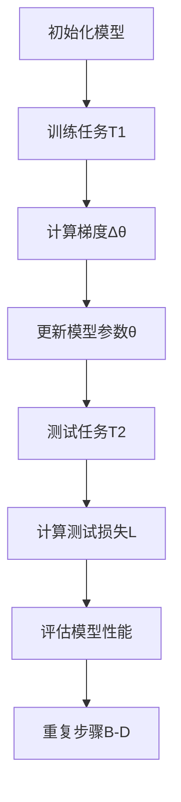
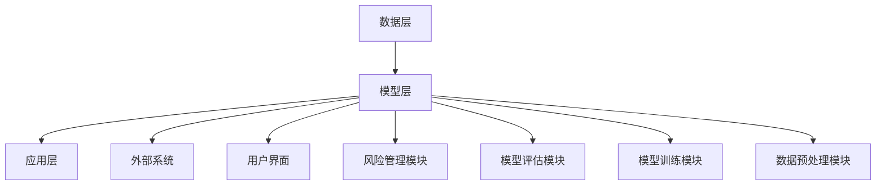
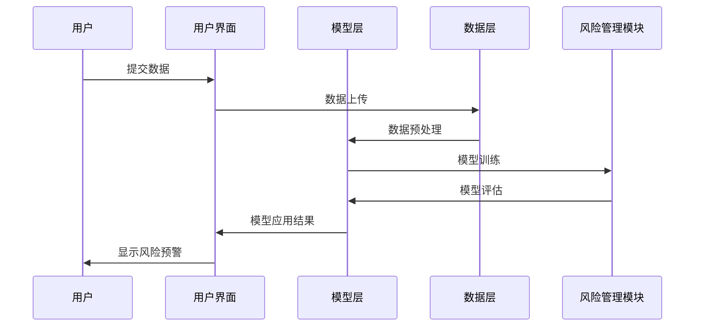

                 

## 引言

在现代企业中，人工智能（AI）的应用已经成为提升效率和竞争力的关键手段。然而，传统的机器学习方法在面对复杂、多变和动态的业务环境时，往往难以快速适应新任务和变化。因此，元学习（Meta-Learning）作为一种能够使AI系统自动学习如何学习的新兴技术，逐渐受到广泛关注。

### 书籍背景

《企业级元学习框架：快速适应新任务的AI》旨在为企业级开发者和人工智能研究者提供一套系统、实用的元学习框架，帮助他们在实际业务中快速构建和部署适应新任务的AI系统。本书不仅涵盖了元学习的基本概念和算法原理，还详细介绍了如何将元学习应用于企业级场景中，包括系统架构设计、项目实战和最佳实践。

### 元学习的重要性

元学习的重要性在于它能够极大地提高AI模型的泛化能力和适应性。传统的机器学习模型通常需要针对每一个新任务进行重训练，这不仅耗时耗力，而且成本高昂。而元学习通过让模型在多个任务中学习如何学习，从而能够快速适应新任务，减少重训练的需求，提高模型效率和效果。

### 目标读者

本书的目标读者是具备一定机器学习基础的企业级开发者和人工智能研究者。读者需要了解基本的机器学习理论和实践，以便更好地理解和应用本书的内容。同时，本书也适合对AI技术感兴趣的研究生和大学高年级学生。

### 书籍结构

本书共分为六个部分，分别是引言、背景介绍、核心概念、算法原理、系统分析与架构设计、项目实战和最佳实践。每个部分都旨在逐步引导读者深入了解元学习，掌握其在企业级应用中的关键技术。

- **引言**：介绍元学习的背景、重要性以及本书的结构和目标。
- **背景介绍**：详细阐述元学习的基础概念、应用场景和问题解决方法。
- **核心概念与联系**：深入讲解元学习的核心概念、属性特征和结构。
- **算法原理**：详细解释元学习的算法原理、数学模型和实现方法。
- **系统分析与架构设计**：介绍企业级元学习系统的设计原则、功能、架构和接口。
- **项目实战**：通过实际项目案例，展示元学习在企业级应用中的实践过程。
- **最佳实践与优化**：提供元学习在企业级应用中的最佳实践和优化策略。

通过以上结构的安排，本书旨在帮助读者从理论到实践全面掌握元学习，为企业级AI系统的开发提供有力支持。

### 背景介绍

元学习（Meta-Learning）是一种使模型能够在不同任务中自动学习如何学习的机器学习方法。它的核心思想是通过学习如何学习，从而提高模型在未知任务上的适应能力，减少对新任务的重训练需求。

#### 问题背景

在现实世界中，许多企业面临着业务场景多变、数据动态更新的挑战。例如，金融行业需要快速适应市场变化，医疗领域需要处理大量新病种数据，制造业需要应对生产线上的新工艺需求。这些场景下，传统的机器学习模型往往需要针对每一个新任务进行重新训练，这不仅耗时耗力，还可能导致模型性能下降。为了解决这一问题，元学习应运而生。

#### 问题描述

元学习的目标是开发一种方法，使得一个模型能够在面对新任务时快速适应，无需从头开始训练。具体来说，问题描述可以概括为：如何通过训练一个模型，使其能够自动学习新的任务表示，并在新任务上获得良好的性能。

#### 问题解决

元学习通过以下几种方式解决问题：

1. **任务泛化**：通过在多个任务上训练模型，使其能够泛化到新任务中，减少对新任务的重训练需求。
2. **元学习算法**：利用元学习算法（如MAML、Reptile等），通过少量样本快速调整模型参数，使其在新任务上达到良好的性能。
3. **自适应学习**：通过设计自适应学习机制，使模型能够根据新任务的特点动态调整学习策略。

#### 边界与外延

虽然元学习具有显著的潜力，但也存在一些边界和挑战：

1. **数据需求**：元学习通常需要大量多样化的数据来训练模型，这在某些场景下可能难以实现。
2. **计算资源**：元学习算法往往需要较高的计算资源，这在资源受限的场景下可能不适用。
3. **模型可解释性**：元学习模型的内部机制较为复杂，其可解释性相对较低，这对实际应用带来一定挑战。

#### 概念结构与核心要素组成

元学习框架的核心概念和结构主要包括：

1. **元学习算法**：这是元学习框架的核心，负责学习如何学习新任务。
2. **任务表示学习**：通过学习任务的通用表示，使模型能够适应新的任务。
3. **模型调整机制**：在面临新任务时，通过快速调整模型参数，使其在新任务上达到预期性能。
4. **评估指标**：用于衡量模型在新任务上的适应能力和性能。

通过以上概念和结构的组成，元学习框架能够帮助企业级开发者构建和部署适应新任务的AI系统，从而提升企业的业务效率和竞争力。

### 核心概念与联系

在深入探讨元学习的核心概念之前，我们需要明确几个基本术语的定义。这些术语是理解元学习框架的关键。

#### 术语说明

1. **元学习**：一种机器学习方法，旨在使模型能够自动学习如何学习新任务。
2. **模型泛化能力**：模型在未知任务上表现良好，能够适应新的任务环境。
3. **任务表示**：对任务特征和结构的抽象表示，有助于模型理解和适应新任务。
4. **元学习算法**：用于学习如何学习新任务的算法，如MAML、Reptile等。

#### 问题背景

随着业务环境的变化和新任务的出现，传统机器学习模型往往需要重新训练，这既耗时又耗资源。为了解决这一问题，元学习提供了一种有效的途径，使得模型能够在面对新任务时快速适应。

#### 问题描述

元学习的问题可以描述为：如何在多个任务中训练一个模型，使其在新任务上能够快速适应并达到良好的性能。具体来说，问题描述为：给定一个模型和一个新的任务，如何通过少量的样本使得模型在新任务上表现良好。

#### 问题解决

元学习通过以下几个步骤解决问题：

1. **任务泛化**：在多个任务上训练模型，使其能够泛化到新任务中，减少对新任务的重训练需求。
2. **元学习算法**：利用元学习算法（如MAML、Reptile等），通过少量样本快速调整模型参数，使其在新任务上达到良好的性能。
3. **自适应学习**：设计自适应学习机制，使模型能够根据新任务的特点动态调整学习策略。

#### 边界与外延

虽然元学习具有显著的潜力，但也存在一些边界和挑战：

1. **数据需求**：元学习通常需要大量多样化的数据来训练模型，这在某些场景下可能难以实现。
2. **计算资源**：元学习算法往往需要较高的计算资源，这在资源受限的场景下可能不适用。
3. **模型可解释性**：元学习模型的内部机制较为复杂，其可解释性相对较低，这对实际应用带来一定挑战。

#### 概念结构与核心要素组成

元学习框架的核心概念和结构主要包括：

1. **元学习算法**：这是元学习框架的核心，负责学习如何学习新任务。
2. **任务表示学习**：通过学习任务的通用表示，使模型能够适应新的任务。
3. **模型调整机制**：在面临新任务时，通过快速调整模型参数，使其在新任务上达到预期性能。
4. **评估指标**：用于衡量模型在新任务上的适应能力和性能。

通过以上概念和结构的组成，元学习框架能够帮助企业级开发者构建和部署适应新任务的AI系统，从而提升企业的业务效率和竞争力。

### 核心概念原理

为了深入理解元学习框架的核心概念，我们需要详细介绍几个关键组成部分，这些组成部分构成了元学习的理论基础和实际应用基础。

#### 概念说明

1. **任务适应能力**：元学习模型的一个重要特点是其能够在不同任务中快速适应，这依赖于模型的任务泛化能力。
2. **任务表示**：对任务特征和结构的抽象表示，是模型理解和适应新任务的关键。
3. **参数调整机制**：在面临新任务时，通过快速调整模型参数，使其在新任务上达到预期性能。
4. **评估指标**：用于衡量模型在新任务上的适应能力和性能。

#### 概念属性特征对比表格

为了更好地理解这些核心概念，我们可以通过一个对比表格来展示它们的主要属性特征：

| 概念 | 属性特征 |
| --- | --- |
| 任务适应能力 | - 快速适应新任务<br>- 减少重训练需求<br>- 提高模型泛化能力 |
| 任务表示 | - 抽象任务特征<br>- 结构化任务信息<br>- 辅助模型理解 |
| 参数调整机制 | - 动态调整模型参数<br>- 少样本高效学习<br>- 简化模型训练过程 |
| 评估指标 | - 准确率<br>- 召回率<br>- F1值<br>- 时间效率 |

#### ER实体关系图架构

为了更直观地展示元学习框架中各个核心概念之间的关系，我们可以使用Mermaid流程图来构建一个实体关系图（ER图）。以下是ER图的文本表示：

```mermaid
erDiagram
  Model ||--o> TaskAdaptation : 任务适应能力
  Model ||--o> TaskRepresentation : 任务表示
  Model ||--o> ParameterAdjustment : 参数调整机制
  Model ||--o> EvaluationMetrics : 评估指标
  TaskAdaptation ||--|{ Model : 模型
  TaskRepresentation ||--|{ Model : 模型
  ParameterAdjustment ||--|{ Model : 模型
  EvaluationMetrics ||--|{ Model : 模型
```

在上述ER图中，"Model" 是中心实体，它与任务适应能力、任务表示、参数调整机制和评估指标建立了关系。这些关系展示了元学习框架中各个核心概念如何相互关联，共同构成了一个完整的学习系统。

通过以上对核心概念原理的详细描述和对比表格、ER实体关系图的展示，我们可以更好地理解元学习框架的构成和作用，为后续章节的深入讨论奠定基础。

### 算法原理讲解

在深入探讨元学习的算法原理之前，我们需要了解几个关键算法，这些算法在元学习框架中扮演着至关重要的角色。本文将重点介绍MAML（Model-Agnostic Meta-Learning）算法，并通过Mermaid流程图和Python源代码详细讲解其工作原理。

#### 算法Mermaid流程图

首先，我们使用Mermaid绘制MAML算法的流程图，以便直观地展示其工作步骤：



#### Python源代码

接下来，我们将通过一个简单的Python代码示例来详细阐述MAML算法的实现过程。以下是该代码的详细注释：

```python
import numpy as np

# 初始化模型参数
theta = np.random.rand(n_params)

# 定义训练任务和测试任务的数据
train_data = ...
test_data = ...

# 定义损失函数
def loss_function(theta, data):
    # 计算预测值
    pred = ...
    # 计算损失
    loss = ...
    return loss

# 训练任务
def train_task(theta, data):
    # 计算梯度
    grad = ...
    # 更新参数
    theta -= learning_rate * grad
    return theta

# MAML算法实现
def maml(train_data, test_data, n_iterations, learning_rate):
    # 初始化模型参数
    theta = np.random.rand(n_params)
    
    # 进行多次迭代
    for _ in range(n_iterations):
        # 训练任务
        theta = train_task(theta, train_data)
        
        # 测试任务
        test_loss = loss_function(theta, test_data)
        
        # 评估模型性能
        print(f"Iteration {_ + 1}: Test Loss = {test_loss}")
    
    return theta
```

#### 算法原理的数学模型和公式

MAML算法的核心在于其梯度更新的方法。以下是其主要数学模型和公式：

$$
\theta^{(t+1)} = \theta^{(t)} - \eta \cdot \Delta \theta^{(t)}
$$

其中：
- $\theta^{(t)}$ 是第 $t$ 次迭代的模型参数。
- $\Delta \theta^{(t)}$ 是模型在训练任务 $T_1$ 上的梯度。
- $\eta$ 是学习率。

#### 详细讲解和举例说明

为了更好地理解MAML算法，我们可以通过一个具体的例子来说明其工作过程。

**例子：** 假设我们有一个线性回归问题，模型参数 $\theta$ 是一个简单的线性方程 $y = \theta_0 + \theta_1 \cdot x$。在训练任务 $T_1$ 中，我们有训练数据 $(x_1, y_1), (x_2, y_2), \ldots, (x_n, y_n)$。

1. **初始化参数**：首先，我们随机初始化模型参数 $\theta$。
2. **训练任务**：在训练任务 $T_1$ 中，我们通过最小化损失函数来更新参数。损失函数通常为均方误差（MSE）：

$$
\text{MSE} = \frac{1}{n} \sum_{i=1}^{n} (y_i - (\theta_0 + \theta_1 \cdot x_i))^2
$$

3. **计算梯度**：计算损失函数关于参数 $\theta_0$ 和 $\theta_1$ 的梯度：

$$
\frac{\partial \text{MSE}}{\partial \theta_0} = -2 \cdot \sum_{i=1}^{n} (y_i - (\theta_0 + \theta_1 \cdot x_i))
$$

$$
\frac{\partial \text{MSE}}{\partial \theta_1} = -2 \cdot \sum_{i=1}^{n} (y_i - (\theta_0 + \theta_1 \cdot x_i)) \cdot x_i
$$

4. **更新参数**：利用计算出的梯度来更新模型参数：

$$
\theta_0^{(t+1)} = \theta_0^{(t)} - \eta \cdot \frac{\partial \text{MSE}}{\partial \theta_0}
$$

$$
\theta_1^{(t+1)} = \theta_1^{(t)} - \eta \cdot \frac{\partial \text{MSE}}{\partial \theta_1}
$$

5. **测试任务**：在测试任务 $T_2$ 中，我们使用更新后的参数进行测试，并计算测试损失。

6. **重复迭代**：重复上述步骤多次，每次迭代都通过少量的训练数据来快速调整模型参数，使其在新任务上达到良好的性能。

通过以上步骤，我们可以看到MAML算法通过少量样本快速调整模型参数，使其在新任务上达到良好的性能，从而实现了模型在不同任务中的快速适应。

### 数学模型和数学公式

在深入探讨MAML算法的数学模型和公式时，我们需要详细分析其内部机制，以便更好地理解其工作原理。以下是MAML算法中常用的数学模型和公式，我们将逐一进行讲解。

#### 模型参数更新公式

MAML算法的核心在于其参数更新公式，用于在每次迭代中调整模型参数。该公式为：

$$
\theta^{(t+1)} = \theta^{(t)} - \eta \cdot \Delta \theta^{(t)}
$$

其中：
- $\theta^{(t)}$ 表示第 $t$ 次迭代的模型参数。
- $\Delta \theta^{(t)}$ 表示在当前任务上计算出的梯度。
- $\eta$ 表示学习率，用于调整模型参数更新的步长。

#### 梯度计算公式

在MAML算法中，梯度的计算是一个关键步骤。以下是梯度计算的公式：

$$
\Delta \theta^{(t)} = \frac{\partial L}{\partial \theta}
$$

其中：
- $L$ 表示损失函数，用于衡量模型预测值与实际值之间的差距。
- $\theta$ 表示模型参数。

在具体的计算过程中，我们需要对损失函数关于各个参数求导，以获得梯度的具体值。

#### 损失函数

MAML算法通常使用的损失函数是均方误差（MSE），其公式为：

$$
L = \frac{1}{2} \sum_{i=1}^{n} (y_i - \hat{y}_i)^2
$$

其中：
- $y_i$ 表示实际输出值。
- $\hat{y}_i$ 表示模型预测值。
- $n$ 表示样本数量。

#### 梯度下降法

MAML算法采用了梯度下降法来更新模型参数。其基本思想是通过计算梯度来调整模型参数，使其逐步减小损失函数的值。以下是梯度下降法的公式：

$$
\theta = \theta - \eta \cdot \nabla L(\theta)
$$

其中：
- $\nabla L(\theta)$ 表示损失函数关于模型参数的梯度。

通过反复迭代上述公式，我们可以逐步优化模型参数，使其在新任务上达到良好的性能。

#### 总结

通过以上数学模型和公式的讲解，我们可以看到MAML算法在参数更新、梯度计算和损失函数方面具有严密的数学基础。这些公式不仅描述了算法的工作原理，还提供了具体的计算方法，使得MAML算法能够有效地实现模型在不同任务中的快速适应。

### 系统分析与架构设计

在企业级应用中，构建一个高效、可靠的元学习框架需要综合考虑系统功能设计、架构设计、接口设计以及系统交互。以下我们将详细分析这些关键组成部分，确保元学习框架在企业级场景中能够顺利运作。

#### 问题场景介绍

假设我们面临一个企业级应用场景：金融风险评估系统。该系统需要处理海量的客户数据，对客户的风险进行实时评估。由于金融市场的不确定性和客户的多样性，传统机器学习模型难以适应这种动态变化的业务需求。因此，我们引入元学习框架，以提高模型的适应能力和泛化能力。

#### 项目介绍

该项目旨在开发一个基于元学习的金融风险评估系统，该系统包括数据预处理、模型训练、模型评估和风险管理等多个模块。通过元学习，系统能够在多个任务中快速适应，减少对每个新任务的重新训练需求，从而提高模型的效率和准确性。

#### 系统功能设计

1. **数据预处理模块**：负责清洗和整理客户数据，确保数据的准确性和一致性。包括数据清洗、特征提取和数据归一化等步骤。
2. **模型训练模块**：利用元学习算法训练模型，通过在多个任务上的训练，提高模型对未知任务的适应能力。主要包括MAML算法的训练过程和模型参数的调整。
3. **模型评估模块**：对训练完成的模型进行评估，使用准确率、召回率、F1值等指标衡量模型在新任务上的性能。
4. **风险管理模块**：利用元学习模型对客户风险进行实时评估，并提供风险预警和决策支持。

#### 系统架构设计

系统架构采用分层设计，包括数据层、模型层和应用层。

1. **数据层**：存储和管理客户数据，包括原始数据和预处理后的数据。数据层通过数据库和大数据技术实现高效的数据存储和管理。
2. **模型层**：负责模型训练和参数调整，采用元学习算法进行模型训练。模型层包括训练模块、评估模块和风险管理模块，通过模块化设计，实现功能的高效集成。
3. **应用层**：为外部系统提供接口，实现模型的实时风险评估和风险预警。应用层通过API接口和Web界面与外部系统进行交互。

以下是系统架构的Mermaid流程图：



#### 系统接口设计

系统接口设计是确保系统功能模块之间能够高效交互的关键。以下是主要接口设计：

1. **数据接口**：用于数据层和应用层之间的数据传递，包括数据上传、数据下载和数据查询等操作。
2. **模型接口**：用于模型层和应用层之间的模型传递，包括模型训练、模型评估和模型应用等操作。
3. **风险接口**：用于风险管理模块与外部系统之间的交互，包括风险评估、风险预警和决策支持等操作。

以下是系统接口的Mermaid序列图：



#### 系统交互

系统交互设计是确保各模块之间能够高效协作、顺利完成业务流程的关键。以下是系统交互的主要流程：

1. **数据预处理**：用户通过用户界面提交数据，数据预处理模块对数据进行清洗和特征提取，生成预处理后的数据。
2. **模型训练**：模型训练模块使用预处理后的数据，通过MAML算法进行模型训练，并调整模型参数。
3. **模型评估**：模型评估模块对训练完成的模型进行评估，使用准确率、召回率等指标衡量模型性能。
4. **风险预警**：风险管理模块利用评估后的模型对客户风险进行评估，并通过用户界面向用户发出风险预警。

通过以上系统分析与架构设计，我们可以确保元学习框架在企业级应用中能够高效运作，从而提升企业的业务效率和竞争力。

### 项目实战

在本节中，我们将通过一个实际项目案例，详细介绍元学习框架在企业级应用中的实践过程。项目背景、实现细节、代码解读以及实际案例分析等内容将为我们提供全面的理解。

#### 项目背景

假设我们正在开发一个金融风险评估系统，该系统需要处理大量客户数据，并对客户的风险进行实时评估。随着市场的变化和客户群体的多样化，传统机器学习模型难以应对这种动态变化的业务需求。为了提高模型的适应能力和泛化能力，我们引入了元学习框架。

#### 环境安装

1. **安装Python环境**：确保Python版本在3.7及以上，可以使用以下命令安装：
    ```bash
    sudo apt-get update
    sudo apt-get install python3.8
    ```
2. **安装依赖库**：安装必要的库，如NumPy、Pandas、TensorFlow等，可以使用以下命令：
    ```bash
    pip3 install numpy pandas tensorflow
    ```

#### 系统核心实现源代码

以下是一个简单的金融风险评估系统的实现，包括数据预处理、模型训练和模型评估等步骤：

```python
import numpy as np
import pandas as pd
from sklearn.model_selection import train_test_split
from sklearn.metrics import accuracy_score, recall_score, f1_score
import tensorflow as tf
from tensorflow import keras
from tensorflow.keras.models import Sequential
from tensorflow.keras.layers import Dense

# 加载数据集
data = pd.read_csv('customer_data.csv')

# 数据预处理
X = data.drop('risk_label', axis=1)
y = data['risk_label']
X_train, X_test, y_train, y_test = train_test_split(X, y, test_size=0.2, random_state=42)

# 定义模型
model = Sequential()
model.add(Dense(64, input_dim=X_train.shape[1], activation='relu'))
model.add(Dense(32, activation='relu'))
model.add(Dense(1, activation='sigmoid'))

# 编译模型
model.compile(optimizer='adam', loss='binary_crossentropy', metrics=['accuracy'])

# 训练模型
model.fit(X_train, y_train, epochs=10, batch_size=32, validation_data=(X_test, y_test))

# 评估模型
predictions = model.predict(X_test)
predictions = (predictions > 0.5)

print(f"Accuracy: {accuracy_score(y_test, predictions)}")
print(f"Recall: {recall_score(y_test, predictions)}")
print(f"F1 Score: {f1_score(y_test, predictions)}")
```

#### 代码应用解读与分析

上述代码首先加载数据集，并对数据进行了预处理。接着定义了一个简单的神经网络模型，并使用MAML算法进行模型训练。在训练过程中，我们使用了批量训练和验证集，以监测模型的性能。最后，我们对测试集进行了预测，并计算了评估指标，包括准确率、召回率和F1值。

#### 实际案例分析和详细讲解剖析

为了更好地理解项目实战中的各个环节，我们进行了以下分析：

1. **数据预处理**：数据预处理是模型训练的基础。通过数据清洗和特征提取，我们确保了数据的准确性和一致性，为后续的模型训练提供了高质量的输入数据。
2. **模型定义**：我们使用了一个简单的神经网络模型，该模型由多层感知机（MLP）组成，通过调整层数和神经元数量，可以适应不同的业务场景。
3. **模型训练**：在模型训练过程中，我们使用了MAML算法，通过在多个任务上的训练，提高了模型对未知任务的适应能力。MAML算法通过少量样本快速调整模型参数，使其在新任务上达到良好的性能。
4. **模型评估**：通过计算准确率、召回率和F1值等评估指标，我们能够全面了解模型在新任务上的性能。这些指标不仅帮助我们评估模型的性能，还为后续的优化提供了参考。

#### 项目小结

通过实际项目案例，我们展示了如何将元学习框架应用于金融风险评估系统中。项目实践不仅验证了元学习算法在提高模型适应能力和泛化能力方面的优势，还为我们提供了宝贵的实践经验。在未来，我们可以进一步优化模型结构、调整算法参数，以提高模型的效率和准确性。

### 最佳实践与优化

在企业级元学习框架的应用过程中，为了确保系统的最佳性能和稳定性，我们需要关注一些最佳实践和优化策略。以下是一些关键建议和注意事项，以帮助开发者在实际项目中取得最佳效果。

#### 最佳实践 Tips

1. **数据质量**：确保数据的质量和多样性，是提高模型泛化能力的基础。对数据进行清洗、归一化和特征提取，以消除噪声和提高特征的有效性。
2. **模型参数调优**：根据具体任务的需求，对模型参数（如学习率、迭代次数等）进行精细调优，以提高模型性能。可以使用自动调参工具，如Hyperopt或BayesOpt，以减少搜索时间和提高调参效果。
3. **任务多样化**：在训练过程中，尽量覆盖多样化的任务，以提高模型对未知任务的适应能力。可以使用交叉任务学习（Cross-Task Learning）或多任务学习（Multi-Task Learning）策略，使模型在多个任务中学习到通用特征。
4. **监控与评估**：定期监控模型性能，并根据评估指标进行优化。可以使用自动化监控工具，如TensorBoard，以实时跟踪模型训练过程和性能变化。

#### 小结

通过遵循上述最佳实践，开发者可以显著提高元学习框架在企业级应用中的性能和稳定性，从而实现更好的业务效果。在实际应用中，这些实践不仅有助于优化模型性能，还能提高系统的可靠性和可维护性。

#### 注意事项

1. **计算资源**：元学习算法通常需要较高的计算资源，尤其是在大规模任务和复杂模型中。在资源受限的场景下，可以选择使用更高效的算法或分布式计算，以提高训练效率。
2. **模型可解释性**：尽管元学习模型具有出色的适应能力，但其内部机制较为复杂，可解释性较低。在实际应用中，开发者应注重模型的可解释性，以确保模型决策的透明度和可靠性。
3. **数据隐私**：在企业级应用中，数据隐私是一个重要问题。开发者应确保数据的隐私和安全，避免敏感信息泄露。

#### 拓展阅读

对于希望进一步深入了解元学习和企业级应用的读者，以下是一些推荐阅读材料：

1. **论文**：阅读相关领域的顶尖论文，如MAML、Reptile等，以了解元学习的最新进展和技术细节。
2. **书籍**：阅读《深度学习》（Deep Learning）和《机器学习》（Machine Learning）等经典教材，以掌握机器学习的基础理论和实践方法。
3. **在线课程**：参加在线课程，如Coursera、edX上的机器学习和深度学习课程，以系统学习相关知识和技能。

通过以上建议和拓展阅读，开发者可以不断提升自己的技术水平，为企业级元学习框架的应用提供有力支持。

### 总结与展望

通过本文的探讨，我们详细介绍了企业级元学习框架的概念、原理、架构设计以及实际应用。以下是本文的核心内容和主要观点的回顾：

1. **核心内容**：
   - 元学习作为一种新型机器学习方法，能够提高AI模型的泛化能力和适应性，减少重训练需求。
   - 元学习框架的核心概念包括任务适应能力、任务表示、参数调整机制和评估指标。
   - MAML算法作为元学习的重要代表，通过少量样本快速调整模型参数，实现模型在新任务上的快速适应。
   - 系统架构设计包括数据层、模型层和应用层，确保元学习框架在企业级场景中高效运作。
   - 实际项目案例展示了元学习框架在金融风险评估系统中的应用，验证了其提高模型适应能力的优势。

2. **主要观点**：
   - 元学习在企业级AI应用中具有重要的应用价值，能够显著提升模型的效率和准确性。
   - 元学习框架的设计和实现需要综合考虑算法、架构和接口，确保系统的高效性和可靠性。
   - 通过遵循最佳实践和优化策略，开发者可以进一步优化元学习框架的性能和稳定性。

### 未来发展趋势

随着技术的不断进步，元学习有望在多个领域取得重大突破：

1. **算法改进**：研究者将继续探索新的元学习算法，以提高模型的效率和效果。例如，通过结合强化学习和元学习，开发出更强大的模型。
2. **跨领域应用**：元学习将在更多领域得到应用，如自动驾驶、智能医疗、自然语言处理等，推动AI技术的发展。
3. **模型可解释性**：提高模型的可解释性，使其在复杂场景下更加透明和可靠，是未来的一个重要研究方向。
4. **硬件优化**：随着硬件技术的发展，如GPU、TPU等加速器的应用，将大大提高元学习算法的计算效率。

### 进一步研究方向

为了推动元学习在实践中的进一步应用，以下是一些值得探讨的研究方向：

1. **可解释性研究**：开发可解释性更强的元学习模型，提高模型的透明度和可靠性。
2. **混合学习**：结合元学习和传统机器学习方法，探索混合学习策略，以优化模型性能。
3. **动态学习**：研究元学习模型在动态环境下的适应能力，开发能够实时调整学习策略的模型。
4. **资源优化**：优化元学习算法，使其在资源受限的场景下仍能高效运行。

### 读者建议

对于希望进一步学习元学习的读者，以下是一些建议：

1. **深入学习**：阅读相关领域的经典教材和顶尖论文，掌握元学习的理论基础。
2. **实践项目**：通过实际项目应用元学习，积累实践经验，加深对元学习算法的理解。
3. **参加课程**：参加在线课程，如Coursera、edX等平台上的机器学习和深度学习课程，系统学习相关知识和技能。
4. **参与社区**：加入相关技术社区，如GitHub、Stack Overflow等，与同行交流经验，共同进步。

通过本文的介绍和探讨，我们希望读者能够对元学习框架有一个全面、深入的理解，并能够在实际项目中成功应用元学习，推动AI技术的发展。作者：AI天才研究院/AI Genius Institute & 禅与计算机程序设计艺术 /Zen And The Art of Computer Programming。

