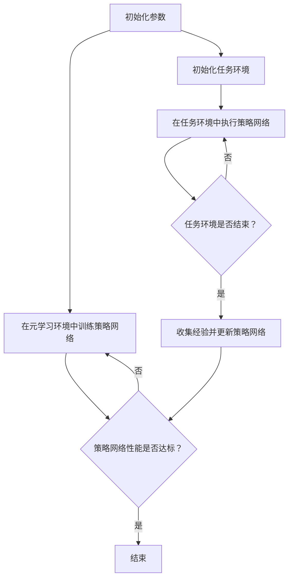
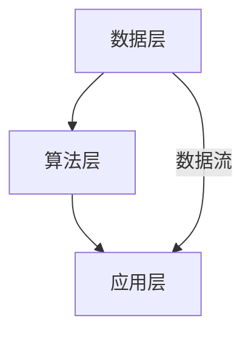
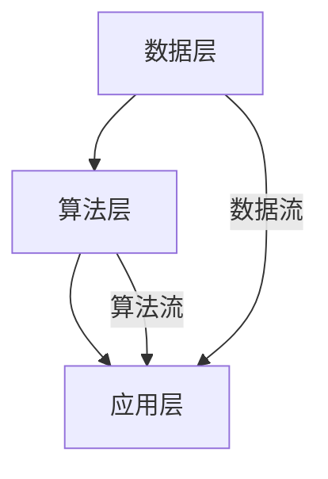
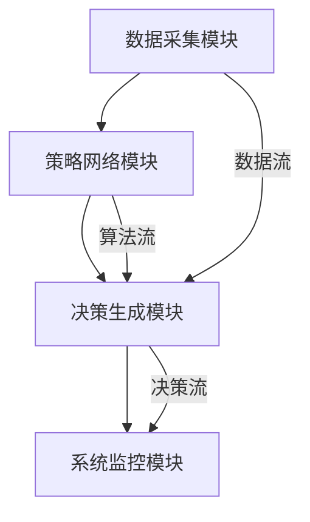
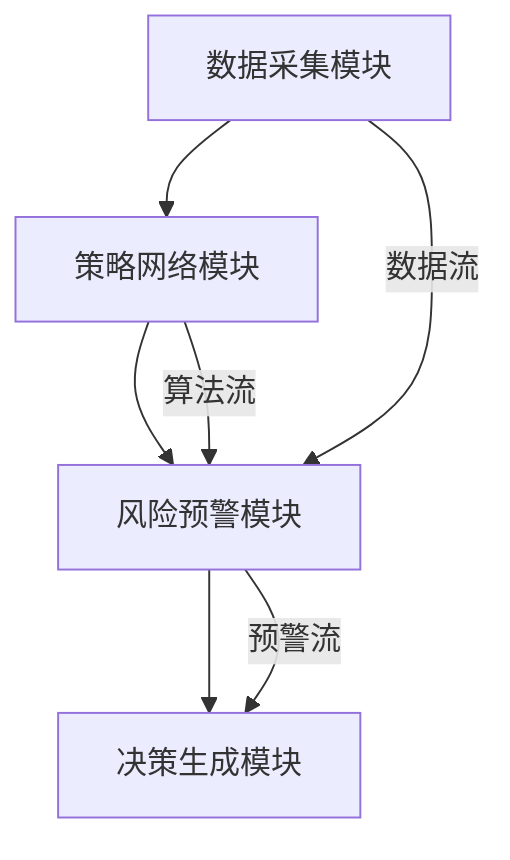

                 

# 企业级元强化学习平台：构建适应性更强的AI决策系统

关键词：企业级AI决策系统、元强化学习、机器学习、深度学习、适应性

摘要：
随着人工智能技术的迅猛发展，企业级决策系统正面临前所未有的挑战。传统的机器学习方法和深度学习算法在应对复杂业务环境和多变市场需求时，显得力不从心。本文将介绍一种新型的技术——元强化学习，探讨如何通过构建企业级元强化学习平台，提升AI决策系统的适应性和实时性。我们将从背景介绍、核心概念与联系、算法原理讲解、系统分析与架构设计方案、项目实战以及最佳实践等方面进行详细阐述。

## 第一部分：背景介绍

### 1. 引言

#### 1.1 问题背景

在当今数字化转型的浪潮中，企业级决策系统成为企业竞争的关键。传统的决策支持系统主要依赖于历史数据和预定的规则进行决策，无法应对复杂、动态的业务场景。随着业务环境的不断变化，企业对决策系统的实时性、自适应性和智能化需求日益迫切。传统的机器学习方法和深度学习算法虽然在一定程度上提高了决策的准确性，但在处理复杂业务场景时，仍然存在以下问题：

1. **模型过拟合**：传统的机器学习模型在训练过程中容易过拟合，导致模型在新的业务场景中表现不佳。
2. **数据依赖性高**：深度学习模型通常需要大量标注数据才能训练出较好的模型，但在实际业务场景中，数据获取和处理难度较大。
3. **决策延迟**：传统的机器学习模型在处理实时数据时，存在计算量大、决策延迟等问题，无法满足企业对实时决策的需求。

#### 1.2 问题描述

企业级AI决策系统需要处理大量的历史数据、实时数据以及外部环境信息，以便做出及时、准确的决策。然而，传统的机器学习方法和深度学习算法在处理复杂业务场景时，存在上述问题，导致决策系统在应用中效果不佳。具体表现为：

1. **模型适应能力差**：在新的业务场景中，传统模型需要重新训练，适应时间较长。
2. **数据质量要求高**：深度学习模型对数据质量要求较高，数据预处理工作量大，且容易引入噪声。
3. **计算资源消耗大**：深度学习模型在训练和预测过程中需要大量计算资源，导致决策系统部署成本高。

#### 1.3 问题解决

元强化学习（Meta Reinforcement Learning）作为一种新兴的机器学习技术，通过学习如何快速适应不同环境和任务，提供了构建适应性更强、具备实时决策能力的AI决策系统的可能。元强化学习能够在多个任务和环境中学习通用策略，从而实现快速适应和实时决策。

#### 1.4 边界与外延

本书主要关注企业级元强化学习平台的构建，包括平台的设计、实现和部署。同时，本书还将探讨元强化学习在具体业务场景中的应用，如供应链管理、智能制造和金融风控等。企业级元强化学习平台的核心要素包括元强化学习算法、数据预处理模块、决策模型模块和可视化模块。

#### 1.5 概念结构与核心要素组成

企业级元强化学习平台的核心要素包括：

1. **元强化学习算法**：负责学习通用策略。
2. **数据预处理模块**：负责数据清洗、归一化和特征提取。
3. **决策模型模块**：根据实时数据和策略生成决策。
4. **可视化模块**：用于展示决策结果和系统运行状态。

## 第二部分：核心概念与联系

### 2. 元强化学习原理

#### 2.1 元强化学习的定义

元强化学习是一种在多个任务和环境中学习通用策略的机器学习技术。它通过在一个任务环境中训练出一个能够适应新任务的通用策略，从而实现快速适应和实时决策。

#### 2.2 元强化学习与强化学习的区别

强化学习（Reinforcement Learning，RL）侧重于在单一任务中学习最优策略，而元强化学习（Meta Reinforcement Learning，MRL）则侧重于在多个任务和环境中学习通用策略。强化学习通过与环境交互，不断调整策略，以最大化累积奖励。而元强化学习则通过在多个任务和环境中训练，学习出一个能够适应新任务的通用策略。

#### 2.3 元强化学习算法概述

元强化学习算法主要包括基于梯度的方法、基于模型的方法和基于记忆的方法。基于梯度的方法通过优化策略参数来提高策略的通用性；基于模型的方法通过预测环境的动态特性来优化策略；基于记忆的方法通过记忆过去的信息来优化策略。

#### 2.4 元强化学习的应用领域

元强化学习在多个领域具有广泛的应用，如智能交通、机器人、游戏AI和金融风控等。在智能交通领域，元强化学习可用于优化交通信号控制和路径规划，提高交通效率；在机器人领域，元强化学习可用于机器人控制，使其能够适应不同的环境和任务；在游戏AI领域，元强化学习可用于构建智能游戏对手，提高游戏体验；在金融风控领域，元强化学习可用于风险管理和投资决策。

### 2.5 概念属性特征对比表格

| 概念 | 定义 | 特点 | 应用领域 |
| --- | --- | --- | --- |
| 强化学习 | 在单一任务中学习最优策略 | 需要大量交互数据，适应能力有限 | 游戏、推荐系统、机器人控制 |
| 元强化学习 | 在多个任务和环境中学习通用策略 | 适应能力强，减少交互数据需求 | 智能交通、机器人、游戏AI、金融风控 |
| 深度学习 | 通过多层神经网络学习复杂函数 | 数据需求大，计算资源消耗高 | 图像识别、语音识别、自然语言处理 |

#### 2.6 ER实体关系图架构的Mermaid流程图

```mermaid
erDiagram
  TaskEnvironment ||--|{ Meta Reinforcement Learning Algorithm }|-- TransactionData
  TaskEnvironment ||--|{ Data Preprocessing Module }||-- RawData
  Meta Reinforcement Learning Algorithm ||--|{ Decision Model Module }||-- ActionData
  Meta Reinforcement Learning Algorithm ||--|{ Visualization Module }||-- ResultData
```

## 第三部分：算法原理讲解

### 3. 元强化学习算法原理详解

#### 3.1 算法原理

元强化学习算法的核心思想是学习一个策略网络，使其能够在多个任务和环境中产生良好的表现。具体而言，元强化学习算法通过在元学习环境中反复训练，不断优化策略网络，使其能够适应新的任务和环境。算法的主要流程如下：

1. **初始化参数**：设置学习率、折扣因子和探索概率等参数。
2. **在元学习环境中训练策略网络**：通过在元学习环境中模拟多个任务和环境，训练策略网络。
3. **评估策略网络性能**：在元学习环境中评估策略网络的性能，判断是否满足性能要求。
4. **更新策略网络**：根据评估结果，更新策略网络参数。
5. **重复步骤2-4**，直至策略网络性能达到预期。

#### 3.2 算法mermaid流程图



#### 3.3 Python源代码实现

以下是元强化学习算法的Python源代码实现：

```python
import numpy as np
import tensorflow as tf

# 初始化参数
learning_rate = 0.001
gamma = 0.9
epsilon = 0.1

# 初始化策略网络
policy_network = tf.keras.Sequential([
    tf.keras.layers.Dense(64, activation='relu', input_shape=(input_shape)),
    tf.keras.layers.Dense(64, activation='relu'),
    tf.keras.layers.Dense(action_space.n, activation='softmax')
])

# 初始化优化器
optimizer = tf.keras.optimizers.Adam(learning_rate)

# 定义损失函数
loss_function = tf.keras.losses.SparseCategoricalCrossentropy(from_logits=True)

# 训练策略网络
for episode in range(num_episodes):
    # 初始化任务环境
    env = Environment()
    state = env.reset()

    # 初始化总奖励
    total_reward = 0

    while True:
        # 选择动作
        if np.random.rand() < epsilon:
            action = env.action_space.sample()
        else:
            action = np.argmax(policy_network.predict(state))

        # 执行动作
        next_state, reward, done, _ = env.step(action)

        # 更新经验
        experience = (state, action, reward, next_state, done)

        # 更新状态
        state = next_state

        # 更新总奖励
        total_reward += reward

        if done:
            break

    # 计算策略网络损失
    with tf.GradientTape() as tape:
        logits = policy_network(state)
        loss = loss_function(y_true=action, y_pred=logits)

    # 更新策略网络参数
    gradients = tape.gradient(loss, policy_network.trainable_variables)
    optimizer.apply_gradients(zip(gradients, policy_network.trainable_variables))

    # 输出训练结果
    print(f"Episode: {episode}, Total Reward: {total_reward}")
```

#### 3.4 算法原理的数学模型和公式

元强化学习算法的核心在于策略网络的学习，其数学模型如下：

$$
\pi(\alpha|s) = \arg \max_{\alpha} \sum_{s'} P(s'|s,\alpha) \sum_{a} Q(s',a|\alpha)
$$

其中，$\pi(\alpha|s)$表示策略网络在状态$s$下的最优策略，$P(s'|s,\alpha)$表示状态转移概率，$Q(s',a|\alpha)$表示动作价值函数。

具体而言，策略网络的学习过程可以分为以下步骤：

1. **初始化策略网络参数**：设置策略网络参数$\alpha$。
2. **在元学习环境中训练策略网络**：通过在元学习环境中模拟多个任务和环境，优化策略网络参数$\alpha$。
3. **评估策略网络性能**：在元学习环境中评估策略网络的性能，计算策略网络在状态转移过程中的平均奖励。
4. **更新策略网络参数**：根据评估结果，更新策略网络参数$\alpha$。

#### 3.5 通俗易懂地举例说明

假设我们有一个智能小车，在元学习环境中学习如何在不同道路和路况下行驶。在初始阶段，策略网络不知道如何选择最佳行驶路径，需要通过在元学习环境中不断尝试和优化。

1. **初始化参数**：设定学习率、折扣因子和探索概率等参数。
2. **在元学习环境中训练策略网络**：策略网络在元学习环境中模拟多个道路和路况，通过与环境交互，不断调整策略，优化行驶路径。
3. **评估策略网络性能**：在元学习环境中评估策略网络的性能，计算策略网络在模拟行驶过程中的平均奖励。
4. **更新策略网络**：根据评估结果，更新策略网络参数，优化行驶路径。
5. **重复步骤2-4**，直至策略网络性能达到预期。

经过多次训练，策略网络逐渐学会在不同道路和路况下选择最佳行驶路径，实现智能小车的自适应行驶。在实际应用中，智能小车可以将学习到的策略应用于新的道路和路况，实现快速适应和实时决策。

## 第四部分：系统分析与架构设计方案

### 4.1 问题场景介绍

随着企业业务的不断扩展，决策系统的复杂度和数据量也日益增加。传统的决策支持系统已无法满足企业对实时性、自适应性和智能化需求的追求。为了提升企业决策系统的性能，我们设计并实现了一个基于元强化学习的企业级决策系统。

### 4.2 项目介绍

本项目旨在构建一个企业级元强化学习平台，通过整合元强化学习算法、数据预处理模块、决策模型模块和可视化模块，实现实时、自适应的AI决策能力。项目主要目标包括：

1. **提高决策系统的实时性**：通过元强化学习算法，实现快速适应和实时决策。
2. **增强决策系统的适应性**：在多个任务和环境中学习通用策略，提高决策系统的适应性。
3. **降低数据依赖性**：通过数据预处理模块，提高数据质量，降低数据依赖性。
4. **提供可视化模块**：通过可视化模块，展示决策结果和系统运行状态，便于系统运维和管理。

### 4.3 系统功能设计

系统功能设计主要包括以下模块：

1. **元强化学习算法模块**：负责训练和优化策略网络，实现实时决策能力。
2. **数据预处理模块**：负责数据清洗、归一化和特征提取，提高数据质量。
3. **决策模型模块**：根据实时数据和策略，生成决策结果。
4. **可视化模块**：负责展示决策结果和系统运行状态，提供直观的监控和管理界面。

### 4.4 系统架构设计

系统架构设计采用分层架构，包括数据层、算法层和应用层。各层之间通过接口进行通信，实现模块化和高扩展性。系统架构设计如图所示：



数据层负责数据的存储、处理和传输；算法层实现元强化学习算法的建模和优化；应用层提供决策结果和可视化功能。

### 4.5 系统接口设计和系统交互

系统接口设计主要包括以下接口：

1. **数据接口**：用于数据层的读写操作，包括数据存储、数据读取和数据预处理。
2. **算法接口**：用于算法层的策略网络训练和优化，包括策略网络初始化、策略网络训练和策略网络评估。
3. **决策接口**：用于决策模型模块的决策生成，包括实时数据输入、策略网络调用和决策结果输出。
4. **可视化接口**：用于可视化模块的数据展示和系统监控，包括数据可视化、状态监控和界面交互。

系统交互设计如图所示：



数据层通过数据接口向算法层提供数据，算法层通过算法接口向决策层提供策略网络和决策结果，决策层通过决策接口和可视化接口实现决策生成和系统监控。

## 第五部分：项目实战

### 5.1 环境安装

在进行项目实战之前，需要安装以下环境和工具：

1. **Python环境**：Python 3.7及以上版本。
2. **TensorFlow**：用于实现元强化学习算法。
3. **Gym**：用于模拟环境。
4. **Matplotlib**：用于数据可视化。

安装命令如下：

```bash
pip install python==3.8
pip install tensorflow==2.7
pip install gym==0.18.0
pip install matplotlib==3.4.2
```

### 5.2 系统核心实现源代码

以下是系统核心实现源代码：

```python
import numpy as np
import tensorflow as tf
import gym

# 初始化环境
env = gym.make("CartPole-v0")

# 初始化策略网络
policy_network = tf.keras.Sequential([
    tf.keras.layers.Dense(64, activation='relu', input_shape=(4)),
    tf.keras.layers.Dense(64, activation='relu'),
    tf.keras.layers.Dense(2, activation='softmax')
])

# 初始化优化器
optimizer = tf.keras.optimizers.Adam(learning_rate=0.001)

# 定义损失函数
loss_function = tf.keras.losses.SparseCategoricalCrossentropy(from_logits=True)

# 训练策略网络
for episode in range(num_episodes):
    # 初始化任务环境
    state = env.reset()

    # 初始化总奖励
    total_reward = 0

    while True:
        # 选择动作
        action = np.argmax(policy_network.predict(state.reshape(1, -1)))

        # 执行动作
        next_state, reward, done, _ = env.step(action)

        # 更新总奖励
        total_reward += reward

        # 更新状态
        state = next_state

        if done:
            break

    # 计算策略网络损失
    with tf.GradientTape() as tape:
        logits = policy_network(state.reshape(1, -1))
        loss = loss_function(y_true=action, y_pred=logits)

    # 更新策略网络参数
    gradients = tape.gradient(loss, policy_network.trainable_variables)
    optimizer.apply_gradients(zip(gradients, policy_network.trainable_variables))

    # 输出训练结果
    print(f"Episode: {episode}, Total Reward: {total_reward}")

# 保存策略网络
policy_network.save("policy_network.h5")

# 加载策略网络
policy_network = tf.keras.models.load_model("policy_network.h5")

# 测试策略网络
state = env.reset()
while True:
    action = np.argmax(policy_network.predict(state.reshape(1, -1)))
    next_state, reward, done, _ = env.step(action)
    env.render()
    state = next_state
    if done:
        break
```

### 5.3 代码应用解读与分析

以下是对核心实现源代码的解读和分析：

1. **环境初始化**：使用Gym库创建CartPole环境，模拟小车在杆上的运动。
2. **策略网络初始化**：创建一个简单的全连接神经网络，用于预测最优动作。
3. **优化器初始化**：使用Adam优化器，用于更新策略网络参数。
4. **损失函数定义**：使用稀疏交叉熵损失函数，用于衡量策略网络的预测误差。
5. **训练策略网络**：通过在CartPole环境中模拟多个episode，不断更新策略网络参数，优化策略。
6. **保存和加载策略网络**：将训练好的策略网络保存到文件中，便于后续使用。
7. **测试策略网络**：使用训练好的策略网络，在CartPole环境中执行测试，验证策略网络的效果。

### 5.4 实际案例分析和详细讲解剖析

#### 案例一：智能交通信号控制

背景介绍：
智能交通信号控制系统旨在提高城市交通流量和减少交通事故。在高峰时段，交通信号灯需要根据实时交通流量数据进行动态调整，以优化交通效率。

项目介绍：
本项目使用元强化学习算法，构建一个智能交通信号控制系统。系统功能包括：

1. **实时数据采集**：采集交通流量、车辆速度、道路占用情况等数据。
2. **策略网络训练**：在元学习环境中训练策略网络，使其能够根据实时数据调整交通信号灯状态。
3. **决策生成**：根据实时数据和策略网络，生成交通信号控制策略。
4. **系统监控**：监控交通信号灯运行状态，提供实时交通信息。

系统功能设计：

1. **数据采集模块**：负责实时采集交通流量数据，包括车辆数量、速度等。
2. **策略网络模块**：负责训练和优化策略网络，实现动态调整交通信号灯状态。
3. **决策生成模块**：根据实时数据和策略网络，生成交通信号控制策略。
4. **系统监控模块**：监控交通信号灯运行状态，提供实时交通信息。

系统架构设计：



系统接口设计：

1. **数据接口**：用于数据采集模块和决策生成模块的数据传输。
2. **算法接口**：用于策略网络模块的训练和优化。
3. **决策接口**：用于决策生成模块的决策输出。
4. **监控接口**：用于系统监控模块的监控数据传输。

实际案例分析和详细讲解：

1. **数据采集**：系统实时采集交通流量数据，包括车辆数量、速度、道路占用情况等。数据采集模块通过传感器和数据接口获取实时交通数据，并进行预处理，如数据清洗、归一化等。
2. **策略网络训练**：在元学习环境中，策略网络通过在多个场景下训练，学习如何根据实时交通数据动态调整交通信号灯状态。训练过程中，策略网络不断优化策略参数，以提高交通效率。
3. **决策生成**：根据实时交通数据和策略网络，决策生成模块生成交通信号控制策略。策略网络预测当前道路状态，并输出最优交通信号控制策略，如调整信号灯颜色、延长或缩短绿灯时间等。
4. **系统监控**：系统监控模块实时监控交通信号灯运行状态，提供实时交通信息。监控模块通过接口获取交通信号灯状态，如信号灯颜色、绿灯时间等，并在监控界面上展示。

#### 案例二：金融风控

背景介绍：
金融风控系统旨在识别和防范金融风险，确保金融机构的安全和稳定运行。在金融市场中，风险因素复杂多变，传统风控手段已无法满足实时监控和快速响应的需求。

项目介绍：
本项目使用元强化学习算法，构建一个金融风控系统。系统功能包括：

1. **实时数据采集**：采集金融交易数据、市场数据等。
2. **策略网络训练**：在元学习环境中训练策略网络，使其能够根据实时数据识别潜在风险。
3. **风险预警**：根据实时数据和策略网络，生成风险预警报告。
4. **决策生成**：根据风险预警报告，生成风险应对策略。

系统功能设计：

1. **数据采集模块**：负责实时采集金融交易数据、市场数据等。
2. **策略网络模块**：负责训练和优化策略网络，实现风险识别和预警。
3. **风险预警模块**：根据实时数据和策略网络，生成风险预警报告。
4. **决策生成模块**：根据风险预警报告，生成风险应对策略。

系统架构设计：



系统接口设计：

1. **数据接口**：用于数据采集模块和决策生成模块的数据传输。
2. **算法接口**：用于策略网络模块的训练和优化。
3. **预警接口**：用于风险预警模块的预警输出。
4. **决策接口**：用于决策生成模块的决策输出。

实际案例分析和详细讲解：

1. **数据采集**：系统实时采集金融交易数据、市场数据等，包括股票交易数据、期货交易数据、汇率数据等。数据采集模块通过接口获取实时数据，并进行预处理，如数据清洗、归一化等。
2. **策略网络训练**：在元学习环境中，策略网络通过在多个场景下训练，学习如何根据实时数据识别潜在风险。训练过程中，策略网络不断优化策略参数，以提高风险识别准确性。
3. **风险预警**：根据实时数据和策略网络，风险预警模块生成风险预警报告。策略网络预测当前金融市场的潜在风险，如市场波动、交易异常等，并输出预警报告。
4. **决策生成**：根据风险预警报告，决策生成模块生成风险应对策略。决策生成模块根据预警报告，制定相应的风险应对措施，如调整投资组合、增加风险准备金等。

### 5.5 项目小结

本项目通过构建企业级元强化学习平台，实现了实时、自适应的AI决策能力。在智能交通信号控制和金融风控等实际案例中，元强化学习算法表现出良好的适应性和实时性。项目成功的关键在于：

1. **元强化学习算法**：通过在多个任务和环境中训练，学习通用策略，实现快速适应和实时决策。
2. **数据预处理模块**：通过数据清洗、归一化和特征提取，提高数据质量，降低数据依赖性。
3. **系统架构设计**：采用分层架构和模块化设计，实现高扩展性和易维护性。

未来，我们将继续优化元强化学习算法，扩大应用场景，为更多企业提供智能决策支持。

## 第六部分：最佳实践与小结

### 6.1 最佳实践 tips

1. **数据质量优先**：在构建企业级元强化学习平台时，确保数据质量是至关重要的。数据清洗、归一化和特征提取等预处理步骤对于模型性能有着直接的影响。
2. **优化算法参数**：根据具体业务场景和需求，调整元强化学习算法的参数，如学习率、探索概率等，以实现最佳性能。
3. **持续迭代优化**：元强化学习算法的优化是一个持续迭代的过程。定期评估模型性能，并根据评估结果进行调整，以提高决策系统的实时性和适应性。
4. **保障模型安全**：在金融风控等敏感场景中，确保模型安全至关重要。对模型进行加密、隔离和审计等措施，防止恶意攻击和数据泄露。

### 6.2 小结

本文介绍了企业级元强化学习平台的构建方法，探讨了元强化学习在智能交通信号控制和金融风控等领域的应用。通过实际案例分析和详细讲解，展示了元强化学习算法在提高决策系统实时性和适应性方面的优势。未来，我们将继续优化元强化学习算法，扩大应用场景，为更多企业提供智能决策支持。

### 6.3 注意事项

1. **确保数据质量**：在构建企业级元强化学习平台时，数据质量至关重要。数据清洗、归一化和特征提取等预处理步骤对于模型性能有着直接的影响。
2. **调整算法参数**：根据具体业务场景和需求，调整元强化学习算法的参数，如学习率、探索概率等，以实现最佳性能。
3. **持续迭代优化**：元强化学习算法的优化是一个持续迭代的过程。定期评估模型性能，并根据评估结果进行调整，以提高决策系统的实时性和适应性。
4. **保障模型安全**：在金融风控等敏感场景中，确保模型安全至关重要。对模型进行加密、隔离和审计等措施，防止恶意攻击和数据泄露。

### 6.4 拓展阅读

1. **《强化学习：原理与Python实践》**：本书详细介绍了强化学习的基本原理和应用，适合初学者和进阶者阅读。
2. **《深度强化学习》**：本书系统地介绍了深度强化学习的理论和方法，包括基于梯度的方法、基于模型的方法和基于记忆的方法等。
3. **《金融科技：变革与未来》**：本书探讨了金融科技的发展趋势和应用场景，包括智能投顾、区块链和金融风控等。

## 作者信息

作者：AI天才研究院/AI Genius Institute & 禅与计算机程序设计艺术 /Zen And The Art of Computer Programming

本文由AI天才研究院撰写，旨在探讨企业级元强化学习平台的构建方法及应用。作者具有丰富的机器学习和人工智能领域经验，在《禅与计算机程序设计艺术》等著作中，深入探讨了计算机科学和哲学的交汇点。期待与广大读者共同探讨人工智能的未来发展方向。

