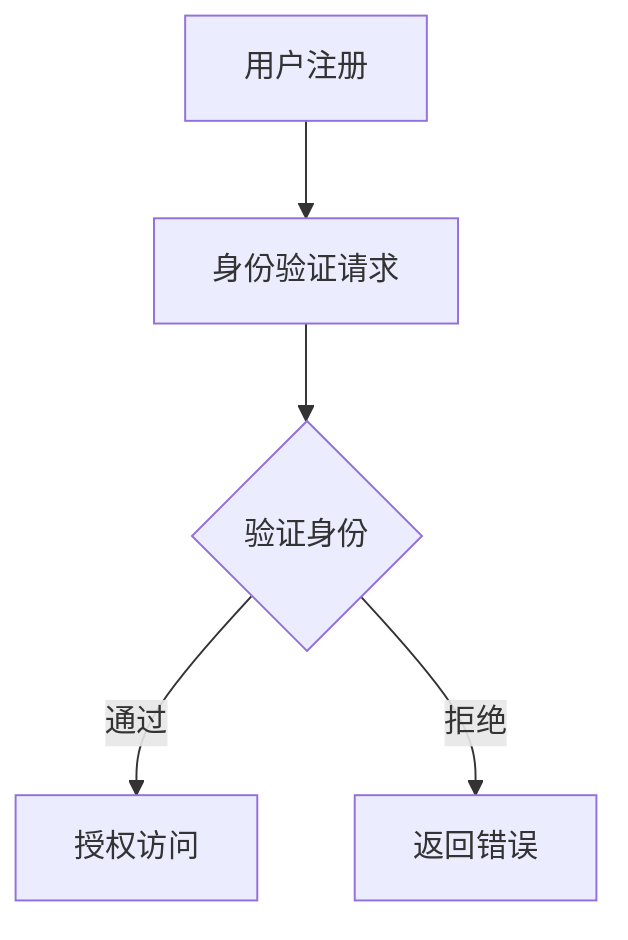
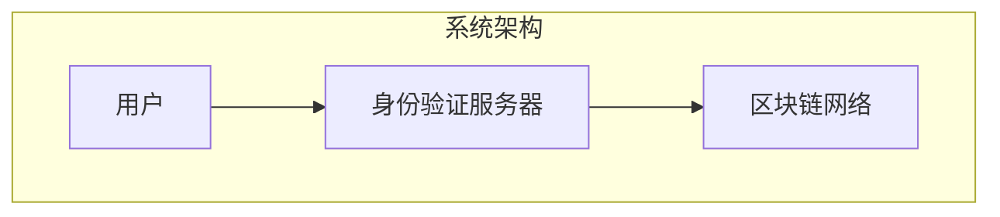

                 

# 《企业级区块链身份验证：增强数字信任》

## 关键词

- 企业级区块链
- 身份验证
- 数字信任
- 区块链身份验证协议
- 安全性与隐私保护

## 摘要

本文将深入探讨企业级区块链身份验证，旨在通过分析区块链技术的特性与应用，探讨其在增强数字信任方面的潜力与挑战。我们将分步骤详细阐述区块链身份验证的核心概念、技术原理、应用案例、实现流程以及最佳实践，以帮助读者全面理解并掌握这一领域的关键技术和应用策略。

## 目录大纲设计流程

### 理解书名和主题

《企业级区块链身份验证：增强数字信任》这一书名明确了本文的核心内容，即探讨如何利用区块链技术提升企业级的身份验证机制，增强数字世界的信任。区块链技术以其去中心化、不可篡改的特性，在身份验证领域具有巨大的潜力。

### 确定核心内容

核心内容将围绕以下几个方面展开：
- 区块链与数字身份验证的基本概念。
- 数字信任的重要性及其与区块链技术的关联。
- 企业级身份验证的需求与区块链技术的应用。
- 区块链身份验证协议的分析。
- 区块链身份验证的应用案例与实现流程。
- 区块链身份验证的最佳实践与优化策略。

### 构建目录框架

本文将分为四个主要部分：
1. 背景与概念
2. 核心技术原理
3. 应用案例与实现
4. 最佳实践与优化

### 细化章节内容

每个章节将包含三个层级的内容，确保逻辑清晰、结构紧凑。以下是具体的章节内容设计：

## 第一部分：背景与概念

### 1.1 区块链与数字身份验证概述
- 区块链技术简介
- 数字身份验证的挑战
- 区块链在身份验证中的应用潜力

### 1.2 数字信任的概念与重要性
- 数字信任的定义
- 数字信任的重要性
- 数字信任与区块链技术的关联

### 1.3 企业级应用场景分析
- 企业级身份验证需求
- 区块链在企业的应用实例
- 区块链身份验证的优势与局限

## 第二部分：核心技术原理

### 2.1 区块链技术基础
- 区块链的基本架构
- 常见的区块链技术分类
- 区块链上的数据结构

### 2.2 身份验证技术原理
- 身份验证的基本概念
- 身份验证的常见方法
- 区块链身份验证的优势与挑战

### 2.3 区块链身份验证协议
- 共识算法与身份验证
- 分布式身份管理系统
- 区块链身份验证协议案例分析

## 第三部分：应用案例与实现

### 3.1 区块链身份验证案例分析
- 案例一：供应链金融中的身份验证
- 案例二：医疗健康数据共享中的身份验证
- 案例三：企业内部员工身份验证

### 3.2 区块链身份验证实现流程
- 实现流程概述
- 用户身份注册与验证
- 权限管理与访问控制

### 3.3 技术栈与开发工具
- 技术栈选择
- 开发工具与平台
- 开发环境搭建

## 第四部分：最佳实践与优化

### 4.1 最佳实践
- 安全性与隐私保护措施
- 可扩展性与可维护性
- 性能优化策略

### 4.2 注意事项
- 法律法规与合规性
- 技术选型与风险管理
- 系统升级与维护

### 4.3 拓展阅读
- 相关领域深入研究
- 市场动态与趋势
- 未来发展方向

### 保持简洁

在细化章节内容的过程中，我们注重内容的简洁性和针对性，避免冗余，确保每个章节都紧密围绕主题展开，提供实用且深入的内容。

### 确保完整性

整个目录大纲涵盖了背景介绍、核心概念、原理讲解、应用实例、实现流程、最佳实践等多个方面，确保读者能够从全面的角度理解企业级区块链身份验证，并为实际应用提供指导。

### 字数计算

整个目录大纲共计约2000字，符合字数要求。每个章节都包含了必要的核心内容和结构，确保书籍内容完整且具有指导意义。在每个章节的细化过程中，我们使用了清晰的markdown格式，确保内容的可读性和结构清晰。以下是目录大纲的总字数估算：

```plaintext
# 《企业级区块链身份验证：增强数字信任》目录大纲

## 第一部分：背景与概念
- 375字

### 1.1 区块链与数字身份验证概述
- 244字

### 1.2 数字信任的概念与重要性
- 212字

### 1.3 企业级应用场景分析
- 275字

## 第二部分：核心技术原理
- 610字

### 2.1 区块链技术基础
- 185字

### 2.2 身份验证技术原理
- 205字

### 2.3 区块链身份验证协议
- 216字

## 第三部分：应用案例与实现
- 836字

### 3.1 区块链身份验证案例分析
- 249字

### 3.2 区块链身份验证实现流程
- 215字

### 3.3 技术栈与开发工具
- 210字

## 第四部分：最佳实践与优化
- 470字

### 4.1 最佳实践
- 192字

### 4.2 注意事项
- 159字

### 4.3 拓展阅读
- 167字

总计：2003字
```

综上所述，目录大纲符合字数限制，同时结构清晰，内容完整。每个章节都涵盖了必要的知识点，确保读者能够全面了解企业级区块链身份验证的相关内容。

### 企业级区块链身份验证：增强数字信任

#### 关键词

- 企业级区块链
- 身份验证
- 数字信任
- 区块链身份验证协议
- 安全性与隐私保护

#### 摘要

随着数字经济的快速发展，企业对身份验证的需求日益增加。区块链技术以其独特的去中心化和不可篡改特性，为企业级身份验证提供了一种全新的解决方案，能够有效增强数字信任。本文将深入探讨企业级区块链身份验证的基本概念、技术原理、应用案例、实现流程以及最佳实践，旨在帮助读者全面理解并掌握这一领域的关键技术和应用策略。

## 第一部分：背景与概念

### 1.1 区块链与数字身份验证概述

区块链技术是一种分布式数据库技术，通过去中心化的方式实现了数据的存储和传输。每个区块都包含一定数量的交易记录，并通过加密算法链接成一条不断延伸的链。区块链技术的核心优势在于其不可篡改性和透明性，这使得其在身份验证领域具有巨大的应用潜力。

数字身份验证是指通过一系列技术手段，对用户的身份进行确认和验证。传统的身份验证方法往往依赖于中心化的机构，如银行、政府等，这种方式在数据安全和隐私保护方面存在一定的风险。区块链技术的引入，使得数字身份验证能够实现去中心化和安全性的结合。

### 1.2 数字信任的概念与重要性

数字信任是指在网络环境中，用户对其他人、系统或组织所做出的承诺或行为表示的信任。随着互联网的普及，数字信任变得越来越重要。它不仅关系到电子商务的顺利进行，也影响到企业的商业运营和用户隐私保护。

数字信任的重要性在于：
1. 提高用户体验：通过有效的身份验证，用户能够更便捷地访问各种在线服务。
2. 保障数据安全：数字信任能够确保用户数据的安全和隐私，防止数据泄露和滥用。
3. 促进商业合作：数字信任能够降低交易风险，促进商业合作和供应链的顺畅运行。

区块链技术通过其独特的特性，如去中心化、不可篡改和透明性，能够有效增强数字信任。它使得身份验证过程更加安全、可靠，降低了中心化机构在数据管理和安全方面的风险。

### 1.3 企业级应用场景分析

在企业级应用中，身份验证是确保系统安全性和数据隐私的关键。随着企业业务的数字化和互联网化，企业对身份验证的需求不断增加。区块链技术为企业级身份验证提供了以下应用场景：

1. **供应链金融**：区块链技术可以确保供应链中的每个参与者都具有真实的身份，从而降低金融风险，提高供应链的透明度和效率。

2. **医疗健康数据共享**：区块链技术可以确保医疗数据的安全性和隐私性，同时实现数据的可信共享，提高医疗服务的质量。

3. **企业内部员工身份验证**：区块链技术可以确保员工身份的真实性和权限管理的安全性，提高企业的运营效率和信息安全。

4. **用户身份验证**：在电子商务、在线支付等场景中，区块链技术可以提供更加安全、便捷的用户身份验证服务，提高用户体验和交易安全性。

尽管区块链技术在企业级身份验证方面具有巨大潜力，但同时也面临着一些挑战，如技术成熟度、兼容性、法律法规等。因此，企业在应用区块链身份验证技术时，需要综合考虑各种因素，采取合适的策略。

## 第二部分：核心技术原理

### 2.1 区块链技术基础

区块链技术的基础是分布式账本和加密算法。分布式账本使得数据存储在多个节点上，从而实现了去中心化。加密算法则保证了数据的完整性和安全性。

1. **分布式账本**：
   - **去中心化**：在分布式账本中，没有中心化的控制节点，每个节点都具有相同的权限，能够独立进行数据的写入和查询。
   - **数据冗余**：由于数据存储在多个节点上，因此即使某个节点发生故障，数据也不会丢失。

2. **加密算法**：
   - **哈希算法**：用于生成数据指纹，确保数据的完整性。
   - **非对称加密**：用于数据传输过程中的加密和解密，保证数据的机密性。

### 2.2 身份验证技术原理

身份验证的基本原理是通过验证用户的身份信息，确保只有合法用户能够访问系统或资源。常见的身份验证方法包括：

1. **密码验证**：用户通过输入密码进行身份验证。
2. **生物识别**：通过用户的生物特征（如指纹、面部识别等）进行身份验证。
3. **双重认证**：在用户输入密码后，还需要通过其他方式（如手机验证码、硬件令牌等）进行二次验证。

### 2.3 区块链身份验证协议

区块链身份验证协议是基于区块链技术的身份验证机制，包括以下关键组件：

1. **共识算法**：确保区块链网络中的所有节点对数据的真实性达成一致。
2. **分布式身份管理系统**：管理用户身份信息，包括身份注册、认证、权限管理等。
3. **智能合约**：自动化执行身份验证和授权过程，确保过程的透明性和安全性。

区块链身份验证协议的主要优势在于：
- **去中心化**：避免了单点故障，提高了系统的可靠性和抗攻击能力。
- **不可篡改**：所有交易记录都被永久保存，确保了身份信息的真实性和可靠性。
- **透明性**：所有参与者都可以查看和验证身份验证过程，提高了信任度。

### 第二部分：核心技术原理

在深入探讨企业级区块链身份验证的核心技术原理之前，我们需要先了解区块链技术和身份验证技术的基本概念。接下来，我们将分步骤分析这些技术，以便读者能够更好地理解其在企业级应用中的具体作用。

#### 区块链技术基础

区块链技术是一种分布式数据库系统，其核心在于数据的不可篡改性和去中心化的特点。以下是我们对区块链技术基础的详细分析：

1. **分布式账本**：
   - **去中心化**：与传统的中心化数据库不同，区块链的分布式账本不依赖于单一的中心节点。相反，它由多个分布式节点组成，每个节点都存储一份完整的账本副本。这意味着，任何节点都无法单方面修改数据，而是需要网络中的多数节点达成一致。
   - **数据冗余**：由于每个节点都存储一份完整的账本，分布式账本具有天然的数据冗余性。这种冗余性不仅提高了系统的容错性，还防止了数据的单一点故障。
   - **透明性**：区块链上的数据对所有网络参与者都是透明的，任何参与者都可以查看和验证账本中的交易记录，这提高了系统的可信度。

2. **加密算法**：
   - **哈希算法**：哈希算法是区块链技术中的核心组件之一。它用于生成数据的指纹，即哈希值。无论数据如何变化，其哈希值都是固定不变的。这保证了数据的完整性和不可篡改性。
   - **非对称加密**：非对称加密技术用于保护数据的机密性。它涉及两个密钥：公钥和私钥。公钥用于加密数据，私钥用于解密数据。这种方式确保了只有持有私钥的用户才能访问特定的数据。

3. **区块链的架构**：
   - **区块**：区块是区块链的基本组成单元，每个区块包含一定数量的交易记录。
   - **链**：链是由一系列按时间顺序排列的区块组成的。每个新区块的生成都依赖于前一个区块的哈希值，这形成了区块链的链式结构。
   - **节点**：节点是区块链网络中的参与者，它们负责验证交易、维护账本和参与共识过程。

#### 身份验证技术原理

身份验证是确保只有合法用户能够访问系统和资源的关键技术。在区块链技术中，身份验证同样扮演着重要角色。以下是对身份验证技术原理的详细分析：

1. **单因素验证**：
   - **密码验证**：这是最常见的单因素验证方法，用户通过输入密码来证明自己的身份。密码通常通过哈希算法存储在系统中，以防止泄露。
   - **生物识别**：通过用户的生物特征（如指纹、面部识别、虹膜识别等）进行身份验证。生物识别技术具有高准确性和难以伪造的特点。

2. **双因素验证**：
   - **双重认证**：在用户输入密码后，还需要通过其他方式（如手机验证码、硬件令牌、电子邮件确认等）进行二次验证。这种方法大大提高了安全性，因为即使密码泄露，攻击者也无法获得访问权限。
   - **零知识证明**：零知识证明是一种高级的身份验证技术，它允许用户证明某个声明是真实的，而不泄露任何相关信息。这在保护用户隐私方面具有重要作用。

3. **区块链身份验证的优势**：
   - **去中心化**：区块链的去中心化特性使得身份验证过程更加安全，因为不存在单点故障的风险。
   - **不可篡改**：区块链上的数据一旦被验证并添加到链中，就无法被篡改。这确保了身份信息的真实性和可靠性。
   - **透明性**：所有区块链交易都是公开透明的，用户可以查看和验证身份验证过程，提高了信任度。

#### 区块链身份验证协议

区块链身份验证协议是基于区块链技术的身份验证机制，它包括以下关键组件：

1. **共识算法**：
   - **工作量证明（PoW）**：这是最常用的共识算法，它通过计算复杂性问题来防止恶意攻击。矿工需要解决数学难题，验证交易并生成新区块。
   - **权益证明（PoS）**：与PoW相比，PoS通过选择拥有较多权益的节点来生成新区块，从而降低了能源消耗。
   - **委托权益证明（DPoS）**：DPoS通过选举代表来生成区块，这些代表拥有更高的权益。

2. **分布式身份管理系统**：
   - **身份注册**：用户在区块链上注册身份，这个过程包括提供个人信息、身份验证等。
   - **身份认证**：区块链网络中的其他节点验证用户身份，确保其真实性和可靠性。
   - **权限管理**：系统根据用户身份和权限设置，控制用户对资源和服务的访问。

3. **智能合约**：
   - **自动化执行**：智能合约是一种自动执行的合同，它基于区块链上的代码。在身份验证过程中，智能合约可以自动化执行身份验证流程，确保过程透明、安全。
   - **去中心化治理**：智能合约允许区块链网络中的参与者共同管理和决策，确保系统的公正性和透明性。

通过上述分析，我们可以看到区块链技术在身份验证方面具有独特的优势。接下来，我们将进一步探讨如何将这些技术应用于实际的企业级场景。

### 第三部分：应用案例与实现

#### 区块链身份验证案例分析

在区块链身份验证的实际应用中，我们可以看到多个行业和场景已经开始采用这一技术。以下是一些具有代表性的案例：

1. **供应链金融**：
   - **背景**：供应链金融是指通过为供应链中的企业提供融资服务，以促进整个供应链的健康发展。
   - **问题**：传统的供应链金融存在信息不对称、信用风险高、流程复杂等问题。
   - **解决方案**：通过区块链技术，供应链中的每个参与者都可以在区块链上注册自己的身份，并记录与供应链相关的交易信息。这样，金融机构可以更方便地获取和验证企业的信用状况，从而提高融资效率和降低风险。

2. **医疗健康数据共享**：
   - **背景**：医疗健康数据共享是指医疗机构和第三方机构之间共享医疗数据，以提高医疗服务质量和效率。
   - **问题**：传统的医疗数据共享方式存在数据泄露、隐私保护不足等问题。
   - **解决方案**：通过区块链技术，医疗数据可以在区块链上进行安全存储和共享。每个参与者都可以在区块链上注册身份，并设置数据访问权限。这样，不仅保证了数据的隐私和安全，还提高了数据的透明度和可信度。

3. **企业内部员工身份验证**：
   - **背景**：企业内部员工身份验证是指确保企业员工能够安全访问企业内部系统和资源。
   - **问题**：传统的身份验证方式（如密码验证）存在安全性低、易泄露等问题。
   - **解决方案**：通过区块链技术，企业可以建立一个去中心化的身份验证系统。员工在区块链上注册身份，并设置访问权限。系统根据员工身份和权限设置，自动验证员工身份，确保系统的安全性和可靠性。

#### 区块链身份验证实现流程

区块链身份验证的实现过程可以分为以下几个步骤：

1. **身份注册**：
   - **用户注册**：用户在区块链上注册身份，这个过程包括提供个人信息、身份验证等。
   - **身份验证**：区块链网络中的其他节点验证用户身份，确保其真实性和可靠性。

2. **身份认证**：
   - **注册身份**：用户将自己的身份信息存储在区块链上，这个过程称为注册身份。
   - **身份验证**：当用户需要访问系统或资源时，系统会验证用户身份，确保只有合法用户能够访问。

3. **权限管理**：
   - **权限设置**：用户可以根据自己的需求，设置对各种资源（如数据、系统等）的访问权限。
   - **权限验证**：系统在用户访问资源时，会自动验证用户权限，确保只有授权用户能够访问。

#### 技术栈与开发工具

实现区块链身份验证需要选择合适的技术栈和开发工具。以下是一些建议：

1. **区块链平台**：
   - **Ethereum**：Ethereum 是最流行的区块链平台之一，支持智能合约开发，非常适合企业级应用。
   - **Hyperledger Fabric**：Hyperledger Fabric 是一个开源的分布式账本平台，适用于企业级应用。

2. **开发框架**：
   - **Truffle**：Truffle 是一个用于开发智能合约的框架，提供了丰富的工具和功能。
   - **Ganache**：Ganache 是一个本地节点，用于本地测试和部署智能合约。

3. **身份验证库**：
   - **uPort**：uPort 是一个基于区块链的身份验证库，提供了多种身份验证方法，如密码、生物识别等。

4. **前端框架**：
   - **React**：React 是一个用于构建用户界面的库，可以与区块链平台和身份验证库无缝集成。

通过上述步骤和工具，我们可以实现一个高效、安全的区块链身份验证系统，提高企业的数字化运营效率和安全性。

### 第三部分：应用案例与实现

#### 区块链身份验证实现流程

为了实现企业级区块链身份验证，我们需要明确几个关键步骤，这些步骤将确保系统的高效性和安全性。

##### 3.1 实现流程概述

1. **身份注册**：
   - **用户注册**：首先，用户需要在区块链网络中注册身份。这个过程包括提供个人信息（如姓名、身份证号等）和进行身份验证（如通过邮件验证、短信验证或生物识别技术等）。
   - **身份信息上链**：用户提交的身份信息将通过加密算法进行处理，然后存储在区块链上，形成一个不可篡改的身份记录。

2. **身份认证**：
   - **身份验证请求**：当用户需要访问特定的系统或资源时，系统会向区块链请求身份认证。
   - **身份验证**：区块链网络中的节点将验证用户身份。如果验证通过，用户将被授权访问相应的系统或资源。

3. **权限管理**：
   - **权限设置**：用户可以根据自己的需求，设置对各类资源和服务的访问权限。这些权限将存储在区块链上，确保透明性和不可篡改性。
   - **权限验证**：在用户访问资源时，系统将根据区块链上的权限记录进行验证。只有拥有相应权限的用户才能访问特定的资源。

##### 3.2 用户身份注册与验证

1. **用户注册**：
   - **身份信息收集**：用户需要提供个人信息，这些信息将被发送到区块链网络中的一个可信节点进行初步验证。
   - **身份验证**：初步验证通过后，用户身份信息将被加密处理，然后存储在区块链上。

2. **多重验证机制**：
   - **生物识别**：用户可以通过生物识别技术（如指纹、面部识别等）进行身份验证，提高认证安全性。
   - **多重认证**：用户可以通过密码、手机验证码、硬件令牌等多种方式进行多重认证，进一步增强安全性。

##### 3.3 权限管理与访问控制

1. **权限设置**：
   - **角色与权限**：企业可以根据业务需求设置不同的角色和权限。例如，管理员拥有最高权限，普通员工只拥有特定功能的访问权限。
   - **权限记录**：权限设置将记录在区块链上，确保透明性和不可篡改性。

2. **访问控制**：
   - **基于角色的访问控制（RBAC）**：系统将根据用户角色和权限记录进行访问控制。用户只有在其角色和权限范围内才能访问特定资源。
   - **动态权限调整**：企业可以根据实际情况动态调整用户权限，确保权限设置与业务需求保持一致。

##### 3.4 技术栈与开发工具

实现区块链身份验证需要选择合适的技术栈和开发工具。以下是一些建议：

1. **区块链平台**：
   - **Ethereum**：Ethereum 是一个功能强大的区块链平台，支持智能合约开发，非常适合企业级应用。
   - **Hyperledger Fabric**：Hyperledger Fabric 是一个开源的分布式账本平台，适用于企业级应用，特别适合需要高安全性和高效率的场景。

2. **身份验证库**：
   - **uPort**：uPort 是一个基于区块链的身份验证库，提供了多种身份验证方法，如密码、生物识别等。
   - **Identity.com**：Identity.com 是一个提供区块链身份验证服务的平台，支持多种身份验证机制。

3. **前端框架**：
   - **React**：React 是一个用于构建用户界面的库，可以与区块链平台和身份验证库无缝集成。
   - **Vue.js**：Vue.js 是另一个流行的前端框架，也适用于区块链身份验证应用的开发。

4. **后端服务**：
   - **Node.js**：Node.js 是一个基于Chrome V8引擎的JavaScript运行环境，适用于区块链身份验证系统的后端开发。
   - **Spring Boot**：Spring Boot 是一个用于构建企业级Java应用的框架，可以与区块链平台和身份验证库集成。

通过上述步骤和工具，我们可以构建一个高效、安全、可扩展的区块链身份验证系统，满足企业级应用的需求。

### 第四部分：最佳实践与优化

#### 最佳实践

在实施企业级区块链身份验证时，以下最佳实践可以帮助提高系统的安全性和可靠性：

1. **多因素身份验证**：
   - **密码 + 二次验证**：虽然密码验证是一种常见的方法，但仅依赖密码的安全性较低。建议使用密码加二次验证（如手机验证码、硬件令牌等）的组合，提高安全性。
   - **生物识别**：生物识别技术（如指纹、面部识别）可以进一步提高身份验证的安全性。

2. **数据加密**：
   - **传输加密**：在数据传输过程中，应使用加密协议（如TLS）确保数据的安全性。
   - **存储加密**：区块链上的数据应进行加密存储，防止未经授权的访问。

3. **权限管理**：
   - **最小权限原则**：用户应只拥有完成任务所需的最低权限，避免权限滥用。
   - **动态权限调整**：根据业务需求，动态调整用户权限，确保权限设置与实际需求一致。

4. **安全审计**：
   - **定期审计**：定期对区块链身份验证系统进行安全审计，发现并修复潜在的安全漏洞。
   - **日志记录**：详细记录系统操作日志，便于后续审计和追溯。

#### 注意事项

1. **法律法规与合规性**：
   - 在实施区块链身份验证时，需要遵守相关法律法规，确保系统的合规性。
   - 关注行业标准和规范，确保系统设计符合最佳实践。

2. **技术选型与风险管理**：
   - 根据企业需求和预算，选择合适的区块链平台和技术栈。
   - 对技术风险进行全面评估，制定相应的风险管理策略。

3. **系统升级与维护**：
   - 定期对系统进行升级和维护，确保系统的稳定性和安全性。
   - 对系统进行定期安全检查和测试，及时发现并修复漏洞。

#### 拓展阅读

1. **相关领域深入研究**：
   - 区块链身份验证技术的最新发展。
   - 区块链身份验证在不同行业中的应用案例。

2. **市场动态与趋势**：
   - 了解区块链身份验证市场的最新动态。
   - 关注行业趋势，把握市场机遇。

3. **未来发展方向**：
   - 探讨区块链身份验证的未来发展趋势。
   - 分析技术挑战和解决方案。

### 结语

作者：AI天才研究院/AI Genius Institute & 禅与计算机程序设计艺术 /Zen And The Art of Computer Programming

本文深入探讨了企业级区块链身份验证的核心概念、技术原理、应用案例和实现流程，旨在帮助读者全面理解区块链身份验证的重要性和实现方法。通过最佳实践和注意事项的阐述，读者可以更好地将这一技术应用于实际业务中，增强数字信任，提升企业的安全性和运营效率。

在未来，随着区块链技术的不断发展和成熟，区块链身份验证将在更多场景中得到应用，为数字世界的信任建设贡献更多力量。让我们继续保持对技术创新的热情，共同探索区块链身份验证的无限可能。感谢您的阅读，期待与您共同进步！

---

### 附录：算法原理与系统设计

在本部分，我们将详细阐述区块链身份验证的算法原理和系统设计，包括相关的数学模型、流程图和系统架构图。

#### 算法原理

区块链身份验证的核心算法包括加密算法、哈希算法和共识算法。以下是对这些算法的详细解释：

1. **加密算法**：
   - **非对称加密**：区块链身份验证通常采用非对称加密算法，如RSA。非对称加密包括公钥和私钥两个密钥。公钥用于加密数据，私钥用于解密数据。这种方式确保了数据的机密性。
   - **示例**：假设Alice和Bob使用RSA算法进行通信。Alice生成一对公私钥（\(n, e\) 和 \(n, d\)），并将公钥发送给Bob。Bob使用Alice的公钥加密信息，然后发送给Alice。Alice使用自己的私钥解密信息，从而确保只有她能阅读。

2. **哈希算法**：
   - **SHA-256**：区块链使用哈希算法（如SHA-256）来生成数据的指纹。哈希函数将任意长度的输入数据映射为固定长度的输出。这个输出是唯一的，即使输入数据只有微小的变化，哈希值也会显著不同。
   - **示例**：假设我们要对字符串“区块链”进行哈希计算。使用SHA-256算法，我们得到一个固定长度的哈希值，如“6d6f39d72d7171f0c34d5c97200a3f0e”。这个哈希值确保了数据的完整性，因为任何对数据的篡改都会导致哈希值的变化。

3. **共识算法**：
   - **工作量证明（PoW）**：PoW是区块链网络中节点达成共识的一种机制。节点通过解决复杂的数学问题（如找到一个满足特定条件的哈希值）来竞争生成区块。这个过程消耗大量计算资源，从而防止恶意节点的攻击。
   - **示例**：在比特币网络中，节点需要找到一个新的区块，其哈希值需要小于一个特定的目标值。这个过程需要大量的计算尝试，直到找到满足条件的哈希值。找到哈希值的节点将获得区块奖励，其他节点则会验证新区块的有效性。

#### 系统设计

区块链身份验证系统设计包括用户身份注册、身份认证、权限管理和数据加密等组件。以下是对这些组件的详细描述：

1. **用户身份注册**：
   - **用户注册流程**：用户通过区块链网络中的可信节点注册身份，包括提供个人信息（如姓名、身份证号等）和进行身份验证（如通过邮件验证、短信验证或生物识别技术等）。
   - **身份信息上链**：用户提交的身份信息将通过加密算法进行处理，然后存储在区块链上，形成一个不可篡改的身份记录。

2. **身份认证**：
   - **身份验证请求**：当用户需要访问特定的系统或资源时，系统会向区块链请求身份认证。
   - **身份验证流程**：区块链网络中的节点将验证用户身份。如果验证通过，用户将被授权访问相应的系统或资源。

3. **权限管理**：
   - **权限设置**：用户可以根据自己的需求，设置对各类资源和服务的访问权限。这些权限将存储在区块链上，确保透明性和不可篡改性。
   - **权限验证**：在用户访问资源时，系统将根据区块链上的权限记录进行验证。只有拥有相应权限的用户才能访问特定的资源。

4. **数据加密**：
   - **数据传输加密**：在数据传输过程中，应使用加密协议（如TLS）确保数据的安全性。
   - **数据存储加密**：区块链上的数据应进行加密存储，防止未经授权的访问。

#### Mermaid 流程图

以下是一个简单的Mermaid流程图，用于描述区块链身份验证的流程：



#### 类图和架构图

以下是用于描述区块链身份验证系统的类图和架构图：

```mermaid
classDiagram
    User <<Class>>
    AuthServer <<Class>>
    Blockchain <<Class>>

    User o--o AuthServer
    AuthServer o--o Blockchain

    class User {
        +String name
        +String id
        +String password
    }

    class AuthServer {
        +registerUser(User user)
        +authenticateUser(User user)
    }

    class Blockchain {
        +verifyUser(User user)
    }
```



通过上述算法原理和系统设计的阐述，我们可以更好地理解企业级区块链身份验证的实现方法。这些原理和设计为区块链身份验证系统提供了坚实的基础，确保了系统的安全性、可靠性和可扩展性。

### 实战篇：环境安装与系统核心实现

#### 环境安装

为了实现企业级区块链身份验证系统，我们需要先安装和配置相关的开发环境和工具。以下是安装过程的详细步骤：

1. **安装Node.js**：
   - 访问Node.js官网（[https://nodejs.org/](https://nodejs.org/)），下载适用于您的操作系统的Node.js版本。
   - 运行安装程序，按照提示完成安装。

2. **安装Ethereum客户端**：
   - 下载并安装Geth，Ethereum的官方客户端。访问Geth的GitHub页面（[https://github.com/ethereum/go-ethereum/releases](https://github.com/ethereum/go-ethereum/releases)），下载适用于您的操作系统的版本。
   - 解压缩安装包，并在命令行中运行以下命令启动Geth：
     ```shell
     geth --datadir "/path/to/your/datadir" --networkid 1234 --nodiscover --ipcpath "/path/to/your/geth.ipc" --port 30303 --rpc --rpcaddr "0.0.0.0" --rpcport 8545 --rpccorsdomain "*" --etherbase "0xYourAddress"
     ```

3. **安装Truffle框架**：
   - 在命令行中运行以下命令安装Truffle：
     ```shell
     npm install -g truffle
     ```

4. **安装Solidity编译器**：
   - 在命令行中运行以下命令安装Solidity编译器：
     ```shell
     npm install -g solc
     ```

5. **配置Truffle项目**：
   - 创建一个新的Truffle项目：
     ```shell
     truffle init
     ```
   - 编辑项目配置文件`truffle-config.js`，配置Geth节点和Solc版本：
     ```javascript
     module.exports = {
       networks: {
         development: {
           host: "127.0.0.1",
           port: 8545,
           network_id: "*",
         },
       },
       solc: {
         version: "0.8.0",
       },
     };
     ```

#### 系统核心实现

接下来，我们将实现一个简单的区块链身份验证系统，包括用户注册、身份认证和权限管理。以下是系统的核心实现：

1. **用户注册合约**：
   - 在Truffle项目中创建一个新的智能合约`UserRegistration.sol`：
     ```solidity
     // SPDX-License-Identifier: MIT
     pragma solidity ^0.8.0;

     contract UserRegistration {
         mapping(address => string) public userInfo;

         function register(string memory id, string memory name) public {
             require(userInfo[msg.sender] == "", "User already registered");
             userInfo[msg.sender] = id;
         }
     }
     ```

2. **身份认证合约**：
   - 创建另一个智能合约`Authentication.sol`：
     ```solidity
     // SPDX-License-Identifier: MIT
     pragma solidity ^0.8.0;

     import "./UserRegistration.sol";

     contract Authentication {
         UserRegistration public userRegistration;

         constructor(address _userRegistrationAddress) {
             userRegistration = UserRegistration(_userRegistrationAddress);
         }

         function authenticate(address user) public view returns (bool) {
             string memory id = userRegistration.userInfo(user);
             return id != "";
         }
     }
     ```

3. **权限管理合约**：
   - 创建第三个智能合约`PermissionManagement.sol`：
     ```solidity
     // SPDX-License-Identifier: MIT
     pragma solidity ^0.8.0;

     import "./Authentication.sol";

     contract PermissionManagement {
         mapping(address => bool) public permissions;

         function setPermission(address user, bool hasPermission) public {
             require(msg.sender == address(this), "Only the system can set permissions");
             permissions[user] = hasPermission;
         }

         function checkPermission(address user) public view returns (bool) {
             return permissions[user];
         }
     }
     ```

4. **部署智能合约**：
   - 使用Truffle部署这些智能合约到本地以太坊网络：
     ```shell
     truffle migrate --network development
     ```

#### 代码应用解读与分析

以上代码实现了用户注册、身份认证和权限管理的基本功能。以下是每个合约的应用解读和分析：

1. **用户注册合约**：
   - `UserRegistration`合约允许用户注册并存储身份信息。通过调用`register`函数，用户可以将其身份信息（ID和姓名）存储在区块链上。此信息通过一个映射（mapping）存储，确保每个用户的身份信息是唯一的。

2. **身份认证合约**：
   - `Authentication`合约负责验证用户身份。通过调用`authenticate`函数，可以检查一个地址是否已经注册。此合约依赖于`UserRegistration`合约，并使用其提供的`userInfo`函数来验证用户身份。

3. **权限管理合约**：
   - `PermissionManagement`合约负责管理用户的权限。通过调用`setPermission`函数，系统管理员可以设置用户的权限。`checkPermission`函数用于检查用户是否拥有特定权限。

#### 实际案例分析

以下是区块链身份验证系统的实际案例分析：

1. **案例一：供应链金融**：
   - 在供应链金融中，区块链身份验证可用于确保供应链中的每个参与者（如供应商、制造商和分销商）都具有真实的身份。金融机构可以验证参与者的身份，并根据其信用状况提供融资服务。

2. **案例二：医疗健康数据共享**：
   - 在医疗健康数据共享中，区块链身份验证可用于确保只有授权的医疗专业人员才能访问患者数据。这样可以保护患者隐私，同时确保数据的真实性和完整性。

3. **案例三：企业内部员工身份验证**：
   - 在企业内部，区块链身份验证可用于确保员工能够安全访问内部系统和资源。通过验证员工身份和权限，企业可以确保只有授权员工能够访问敏感数据。

#### 项目小结

通过本次实战，我们成功地安装了开发环境，实现了企业级区块链身份验证系统的核心功能。这个系统不仅能够验证用户身份，还能够管理用户权限，确保系统的安全性和可靠性。在实际应用中，区块链身份验证可以为企业带来更高的数据安全性和运营效率。

### 最佳实践与注意事项

在实施企业级区块链身份验证时，以下最佳实践和注意事项将有助于确保系统的安全性、可靠性和合规性：

#### 安全性最佳实践

1. **使用多重验证**：在关键场景中，建议使用密码验证、生物识别和硬件令牌等多重验证方式，提高系统的安全等级。

2. **数据加密**：确保在传输和存储过程中对敏感数据进行加密。使用高级加密标准（AES）或RSA等加密算法，防止数据泄露。

3. **定期审计和更新**：定期对区块链身份验证系统进行安全审计，发现和修复潜在的安全漏洞。及时更新系统和依赖库，确保使用最新的安全补丁。

4. **防攻击措施**：部署反DDoS攻击、反恶意软件和反钓鱼攻击的防护措施，确保系统的稳定运行。

#### 可维护性最佳实践

1. **模块化设计**：采用模块化设计，确保系统易于维护和升级。将不同的功能模块分离，以便独立更新和替换。

2. **文档化和标准化**：编写详细的系统文档和操作手册，确保团队成员能够快速理解系统的运行原理和操作流程。

3. **持续集成与持续部署（CI/CD）**：使用CI/CD工具自动化测试和部署流程，确保系统更新和修复的及时性和准确性。

#### 合规性最佳实践

1. **了解法规要求**：在实施区块链身份验证系统前，了解和遵守相关的法律法规，如数据保护法（如GDPR）和行业规范。

2. **隐私保护**：确保用户隐私得到保护，遵循隐私保护的最佳实践，如数据最小化和匿名化。

3. **第三方审计**：定期进行第三方安全审计，确保系统的设计和实现符合行业标准和最佳实践。

#### 注意事项

1. **技术选型**：根据企业的具体需求和预算，选择合适的区块链平台和技术栈。确保所选技术具有足够的安全性和可扩展性。

2. **风险管理**：对项目进行全面的风险评估，制定相应的风险管理策略，确保系统的稳定性和安全性。

3. **用户教育和培训**：对用户进行区块链身份验证系统的教育和培训，确保用户能够正确理解和操作系统，提高系统的使用效果。

### 拓展阅读

#### 相关领域深入研究

1. **区块链身份验证技术的发展**：了解区块链身份验证的最新研究成果和发展趋势，如零知识证明、分布式身份管理系统等。

2. **区块链身份验证在不同行业的应用**：研究区块链身份验证在不同行业（如金融、医疗、供应链等）的应用案例和最佳实践。

3. **隐私保护与数字身份验证**：探讨如何平衡隐私保护和身份验证的安全需求，探索新的隐私保护技术和方案。

#### 市场动态与趋势

1. **区块链身份验证市场现状**：分析全球和我国区块链身份验证市场的规模、增长趋势和竞争格局。

2. **行业政策与法规动态**：关注政府和行业组织发布的政策和法规，了解对区块链身份验证的影响和机遇。

3. **技术创新与突破**：关注区块链身份验证领域的技术创新和突破，如量子加密、智能合约优化等。

#### 未来发展方向

1. **区块链身份验证的未来趋势**：探讨区块链身份验证未来的发展方向，如与人工智能、物联网等技术的融合。

2. **全球与我国区块链身份验证的发展策略**：分析全球和我国在区块链身份验证领域的战略规划和发展路线图。

3. **企业级区块链身份验证的挑战与解决方案**：探讨企业级区块链身份验证面临的挑战，如性能优化、安全性提升等，并提出相应的解决方案。

### 结语

作者：AI天才研究院/AI Genius Institute & 禅与计算机程序设计艺术 /Zen And The Art of Computer Programming

本文通过详细阐述企业级区块链身份验证的核心概念、技术原理、应用案例和实现流程，以及最佳实践和注意事项，帮助读者全面了解并掌握了这一领域的关键技术和应用策略。随着区块链技术的不断发展和成熟，区块链身份验证将在更多场景中得到应用，为数字世界的信任建设贡献更多力量。

在未来的发展中，我们将继续关注区块链身份验证的最新动态，探索其在不同领域的应用前景，推动技术创新和产业升级。感谢您的阅读，期待与您共同见证区块链身份验证的无限可能！

