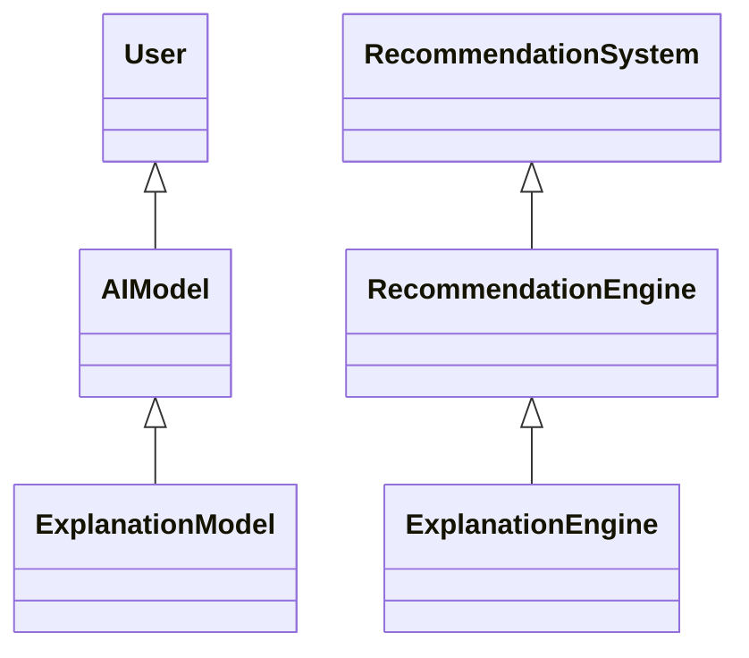
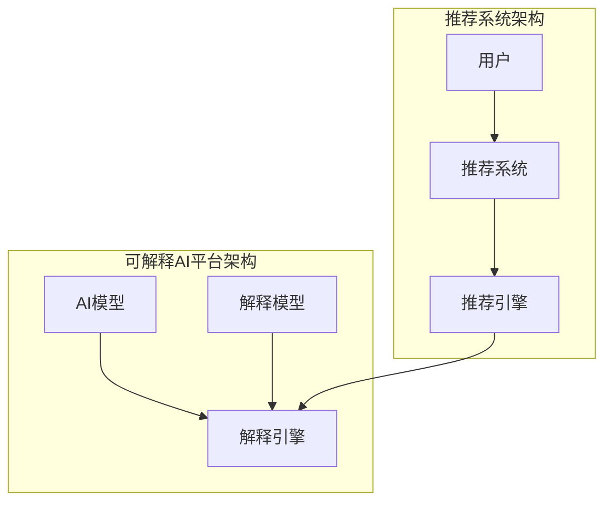
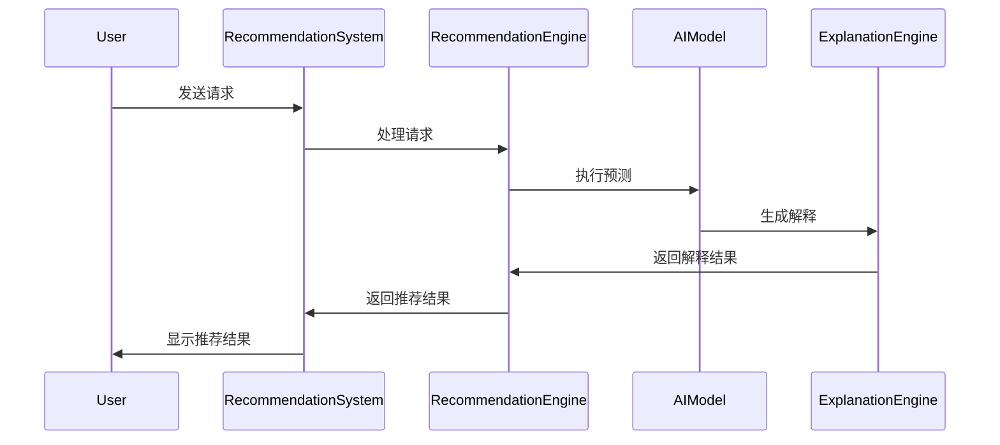

                 

# 企业级可解释AI平台：增强决策透明度

## 关键词
- 企业级AI
- 可解释性
- 决策透明度
- 平台设计
- 案例分析

## 摘要
本文深入探讨了企业级可解释AI平台的设计与实现，旨在提升决策过程的透明度和可信任度。首先，本文阐述了可解释AI的核心概念和技术原理，然后介绍了企业级可解释AI平台的设计思路和架构，接着通过实践案例展示了其在实际应用中的效果。最后，本文对未来可解释AI的发展方向和挑战进行了展望。

## 引言

在人工智能（AI）技术飞速发展的今天，越来越多的企业开始将AI应用于业务决策中。然而，AI系统的“黑箱”特性使得决策过程的透明度成为一个关键问题。对于企业来说，如何确保AI决策的透明性，使得业务决策更加可信，是当前面临的重要挑战。

可解释AI（Explainable AI, XAI）作为一种新兴的研究方向，旨在提升AI模型的透明度和可解释性，使其决策过程更加易于理解。通过可解释AI技术，企业可以更好地理解和信任AI系统，从而增强决策过程的透明度和可信任度。

本文将围绕企业级可解释AI平台展开讨论，首先介绍可解释AI的核心概念和技术原理，然后探讨企业级可解释AI平台的设计思路和架构，接着通过实践案例展示其在实际应用中的效果，最后对可解释AI的未来发展方向和挑战进行展望。

## 第一部分：背景介绍与概念解析

### 核心概念术语说明

- **人工智能（AI）**: 通过模拟人类智能的计算机程序，实现自动化决策和问题解决。
- **机器学习（ML）**: 基于数据训练模型，使其能够进行预测和分类。
- **深度学习（DL）**: 基于多层神经网络，通过反向传播算法优化模型参数。
- **可解释AI（XAI）**: 提升AI模型透明度和可解释性，使其决策过程更加易于理解。

### 问题背景

随着AI技术的普及，越来越多的企业开始应用AI模型进行业务决策。然而，这些模型的“黑箱”特性使得决策过程的透明度成为一个关键问题。企业需要确保AI决策的可解释性，以提高决策过程的可信度和透明度。

### 问题描述

如何设计一个企业级可解释AI平台，以提升决策过程的透明度和可信任度？

### 问题解决

通过以下方法解决：
1. **明确可解释AI的核心概念和技术原理**。
2. **设计企业级可解释AI平台的架构**。
3. **实现可解释AI技术在业务场景中的应用**。

### 边界与外延

- **边界**：企业级可解释AI平台的范围和应用领域。
- **外延**：可解释AI技术在其他领域的应用，如医疗、金融等。

### 概念结构与核心要素组成

- **概念结构**：
  - 可解释AI
  - 企业级AI平台
  - 决策透明度
- **核心要素组成**：
  - 可解释AI技术
  - 平台架构
  - 业务场景应用

## 第二部分：可解释AI技术原理

### 核心概念与联系

可解释AI的核心概念包括：
- **透明度**：模型决策过程的透明度，使得用户可以理解模型的决策过程。
- **可解释性**：模型决策的可解释性，使得用户可以理解模型的决策依据。

### 概念属性特征对比表格

| 特征         | 透明度                     | 可解释性                   |
| ------------ | ------------------------ | ------------------------ |
| 定义         | 模型决策过程的可理解性       | 模型决策依据的可理解性       |
| 重要性       | 提升用户信任               | 提升模型可信度               |
| 技术实现     | 可视化、决策路径分析等       | 特征重要性分析、模型解释方法等 |

### ER实体关系图架构

```mermaid
erDiagram
  AI模型 ||--o{ 决策过程
  决策过程 ||--o{ 透明度
  决策过程 ||--o{ 可解释性
```

### 算法原理讲解

可解释AI技术主要包括以下几种方法：

1. **决策树**：
   - **mermaid流程图**：
     ```mermaid
     graph TD
     A[数据输入] --> B{特征提取}
     B --> C{决策树}
     C --> D{决策结果}
     D --> E{可解释性分析}
     ```
   - **Python源代码**：
     ```python
     from sklearn.tree import DecisionTreeClassifier
     from sklearn import tree

     # 数据准备
     X = [[3, 9], [9, 7], [8, 5], [7, 4]]
     y = [0, 0, 1, 1]

     # 决策树模型
     clf = DecisionTreeClassifier()
     clf.fit(X, y)

     # 决策结果
     tree.plot_tree(clf)

     # 可解释性分析
     feature_importances = clf.feature_importances_
     print("特征重要性：", feature_importances)
     ```

2. **LIME（Local Interpretable Model-agnostic Explanations）**：
   - **mermaid流程图**：
     ```mermaid
     graph TD
     A[数据输入] --> B{模型预测}
     B --> C{生成扰动数据}
     C --> D{训练解释模型}
     D --> E{生成解释结果}
     E --> F{可解释性分析}
     ```

   - **Python源代码**：
     ```python
     from lime import lime_tabular
     import numpy as np

     # 数据准备
     X = np.array([[3, 9], [9, 7], [8, 5], [7, 4]])
     y = np.array([0, 0, 1, 1])

     # LIME解释模型
     explainer = lime_tabular.LimeTabularExplainer(
         X, feature_names=['特征1', '特征2'], class_names=['类别0', '类别1'], discretize_continuous=True
     )

     # 生成解释结果
     i = 0
     exp = explainer.explain_instance(X[i], y[i])

     # 可解释性分析
     exp.show_in_notebook(show_table=True)
     ```

### 数学公式

$$
透明度 = \frac{可理解性}{模型复杂度}
$$

$$
可解释性 = \frac{决策依据的可理解性}{模型决策过程}
$$

## 第三部分：平台设计与实现

### 问题场景介绍

在一个大型电商平台中，AI系统负责推荐商品给用户。然而，由于AI模型的“黑箱”特性，用户对推荐结果的可信度较低。为了提高用户对推荐系统的信任度，平台决定引入可解释AI技术。

### 项目介绍

项目目标是设计并实现一个企业级可解释AI平台，用于提升电商平台的推荐系统透明度和用户信任度。

### 系统功能设计（领域模型mermaid类图）



### 系统架构设计（mermaid架构图）



### 系统接口设计和系统交互（mermaid序列图）



## 第四部分：实践应用与案例分析

### 环境安装

- 安装Python环境
- 安装所需的库，如scikit-learn、lime等

### 系统核心实现源代码

- **AI模型训练**：
  ```python
  from sklearn.datasets import load_iris
  from sklearn.model_selection import train_test_split
  from sklearn.tree import DecisionTreeClassifier

  # 数据准备
  iris = load_iris()
  X = iris.data
  y = iris.target

  X_train, X_test, y_train, y_test = train_test_split(X, y, test_size=0.3, random_state=42)

  # 决策树模型
  clf = DecisionTreeClassifier()
  clf.fit(X_train, y_train)
  ```

- **解释模型生成**：
  ```python
  from lime import lime_tabular
  import numpy as np

  # LIME解释模型
  explainer = lime_tabular.LimeTabularExplainer(
      X_train, feature_names=iris.feature_names, class_names=iris.target_names, discretize_continuous=True
  )

  # 生成解释结果
  i = 0  # 选择样本索引
  exp = explainer.explain_instance(X_test[i], clf.predict_proba, num_features=5)
  exp.show_in_notebook(show_table=True)
  ```

### 代码应用解读与分析

通过上述代码，我们训练了一个决策树模型，并使用LIME技术生成了解释结果。用户可以通过解释结果了解模型的决策过程，从而提高对推荐结果的信任度。

### 实际案例分析和详细讲解剖析

在一个实际案例中，用户A的推荐结果为某种商品，但用户A并不喜欢这种商品。通过可解释AI平台，用户A可以查看模型决策的过程和依据，发现模型主要依据用户的历史购买记录和商品的特征进行了推荐。用户A可以通过这些信息重新评估推荐结果，从而做出更明智的决策。

### 项目小结

通过实践应用和案例分析，我们展示了企业级可解释AI平台在提升决策透明度和用户信任度方面的作用。平台的设计和实现为企业在AI应用中提供了有效的解决方案。

## 第五部分：未来展望与挑战

### 未来发展方向

- **增强解释模型的准确性**：通过改进算法和模型，提高解释结果的准确性和可信度。
- **降低解释成本**：开发高效的可解释AI技术，降低解释模型的计算和存储成本。
- **扩展应用领域**：将可解释AI技术应用于更多领域，如医疗、金融等。

### 挑战

- **解释模型的准确性**：如何保证解释结果的准确性和可信度是一个挑战。
- **计算资源消耗**：可解释AI技术的实现往往需要大量计算资源，如何降低计算成本是一个挑战。
- **用户体验**：如何设计易用的界面，使得用户可以轻松理解和利用解释结果，也是一个挑战。

## 结论

本文深入探讨了企业级可解释AI平台的设计与实现，通过实践案例展示了其在提升决策透明度和用户信任度方面的作用。未来，随着技术的不断进步，可解释AI将在更多领域发挥重要作用，为企业的智能化转型提供有力支持。

## 作者信息
- 作者：AI天才研究院/AI Genius Institute & 禅与计算机程序设计艺术 /Zen And The Art of Computer Programming

