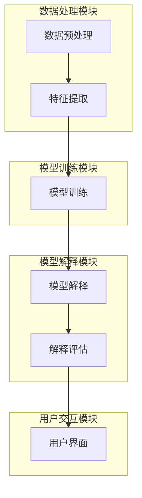
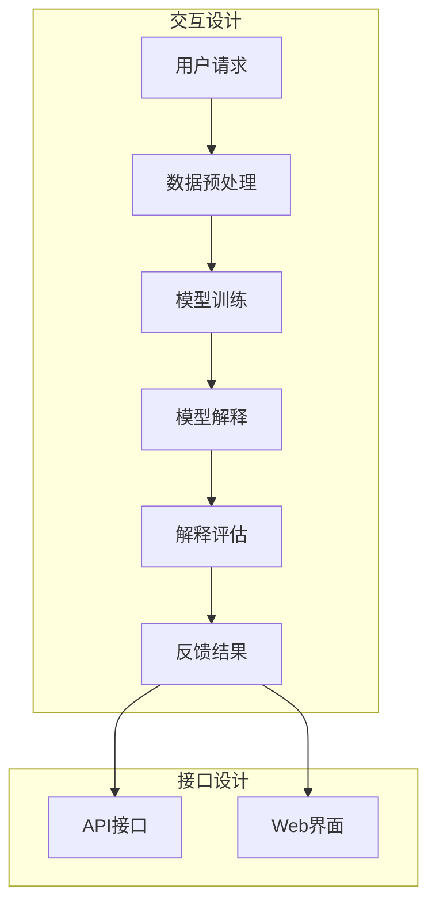

                 

### 企业级可解释AI框架：增加AI决策透明度

#### 关键词：企业级AI、可解释AI、决策透明度、框架设计、算法原理、数学模型、系统架构、项目实战、最佳实践

#### 摘要：
在当今快速发展的AI时代，企业级AI系统的广泛应用带来了前所未有的价值，但同时也引发了对AI决策透明度的高度关注。本文将深入探讨企业级可解释AI框架的设计与实现，旨在提升AI决策的透明度和可解释性，为企业决策提供坚实的理论基础和实际指导。我们将逐步分析可解释AI的核心概念、框架设计、算法原理、数学模型以及系统架构，并通过实际项目案例，展示如何将理论应用于实践，实现AI决策的透明化。

### 第一部分：背景介绍

#### 第1章：AI决策透明度概述

##### 1.1 AI决策透明度的现状
AI技术在商业、医疗、金融等领域的广泛应用，使得AI决策已经成为企业日常运营的重要组成部分。然而，AI算法的黑箱特性使得决策过程变得不透明，这给企业的决策过程带来了极大的不确定性和风险。在许多场景下，用户无法理解AI决策背后的原因，导致对AI系统的信任度下降。因此，提高AI决策的透明度成为了一个迫切需要解决的问题。

##### 1.2 AI决策透明度的重要性
AI决策透明度对于企业和用户来说至关重要。对于企业而言，透明的决策过程有助于增强用户的信任感和满意度，从而提高市场竞争力。对于用户而言，了解AI决策背后的原因可以帮助他们更好地理解和使用AI系统，从而提升用户体验。此外，提高决策透明度还可以帮助企业遵守相关法规和标准，降低合规风险。

##### 1.3 AI决策透明度存在的问题
目前，AI决策透明度面临以下几个主要问题：

1. 算法复杂度高：许多AI算法，如深度学习模型，具有高度复杂性，难以解释其决策过程。
2. 数据隐私保护：在涉及用户隐私的数据场景中，如何在不泄露隐私的前提下解释AI决策，是一个巨大的挑战。
3. 可解释性标准缺失：目前缺乏统一的可解释性标准和评估方法，使得不同系统之间的可解释性比较困难。

##### 1.4 AI决策透明度的目标
为了解决上述问题，提高AI决策的透明度，我们设定以下目标：

1. 简化算法解释：通过设计易于理解和解释的算法，降低算法复杂度。
2. 保护数据隐私：采用隐私保护技术，确保数据隐私不被泄露。
3. 建立可解释性标准：制定统一的可解释性评估标准，便于不同系统之间的比较。

### 第二部分：核心概念与联系

#### 第2章：可解释AI的概念与特点

##### 2.1 可解释AI的定义
可解释AI（Explainable AI，简称XAI）是一种人工智能的子领域，旨在提高AI系统的透明度和可解释性，使用户能够理解和信任AI系统的决策过程。可解释AI的核心目标是实现AI系统的可解释性、可信性和可控性。

##### 2.2 可解释AI的核心特点
可解释AI具有以下几个核心特点：

1. **可解释性**：AI系统的决策过程可以被用户或专家理解和解释。
2. **可信性**：AI系统的决策结果具有可靠性和可信度，用户可以信任系统的决策。
3. **可控性**：AI系统可以被用户或专家调整和优化，以适应特定的业务场景。

##### 2.3 可解释AI与其他领域的联系
可解释AI不仅涉及计算机科学，还与其他多个领域密切相关：

1. **心理学**：心理学研究人类理解和推理的过程，为可解释AI的设计提供了重要的理论基础。
2. **认知科学**：认知科学研究人类思维和感知的过程，对可解释AI的理解和设计有重要启示。
3. **统计学**：统计学方法在可解释AI中用于分析和解释数据，提高系统的可解释性。
4. **伦理学**：伦理学研究AI系统的道德和社会影响，为可解释AI的设计和实施提供了重要的道德指导。

#### 第3章：可解释AI的分类与框架

##### 3.1 可解释AI的分类
根据不同的标准，可解释AI可以划分为多种类型：

1. **模型内解释**：在AI模型内部嵌入解释机制，直接生成解释结果。
2. **模型外解释**：在AI模型外部构建解释模型，通过对比模型内外的差异来解释决策过程。
3. **可视化解释**：通过图形、表格等可视化方式展示AI决策的过程和结果。
4. **规则解释**：将AI决策转化为可理解的规则，通过规则解释决策过程。

##### 3.2 常见可解释AI框架
目前，有许多常见的可解释AI框架，包括：

1. **LIME（Local Interpretable Model-agnostic Explanations）**：为非参数模型提供本地解释。
2. **SHAP（SHapley Additive exPlanations）**：基于合作博弈论的理论，为模型中的每个特征提供解释。
3. **LASSO（Least Absolute Shrinkage and Selection Operator）**：通过变量选择提高模型的解释性。
4. **LIMEpy**：Python实现的LIME算法库，用于生成模型的本地解释。

##### 3.3 可解释AI框架的选择与评估
选择合适的可解释AI框架对于提高AI决策的透明度至关重要。评估可解释AI框架的标准包括：

1. **解释效果**：解释是否准确、清晰，是否能够帮助用户理解决策过程。
2. **计算效率**：解释生成的时间成本，是否能够在实际应用中高效运行。
3. **适用范围**：框架是否适用于不同的数据类型和模型类型。
4. **可扩展性**：框架是否易于扩展和集成到现有的AI系统中。

### 第三部分：算法原理讲解

#### 第4章：可解释AI算法原理

##### 4.1 可解释AI算法的基本原理
可解释AI算法的基本原理是通过分析和解释模型内部的特征权重和决策路径，将复杂的AI模型转化为可理解的形式。具体来说，可解释AI算法包括以下核心组件：

1. **特征提取**：从原始数据中提取重要的特征，以便更好地理解模型决策。
2. **模型解释**：分析模型内部的决策路径和特征权重，生成解释结果。
3. **解释评估**：评估解释结果的准确性和可靠性，确保其符合实际需求。

##### 4.2 可解释AI算法的核心组件
可解释AI算法的核心组件包括：

1. **特征选择**：通过变量重要性评估，选择对模型决策影响较大的特征。
2. **模型可视化**：使用图形化工具，展示模型内部的结构和决策过程。
3. **决策路径分析**：分析模型中每个决策节点的路径和权重，解释决策结果。

##### 4.3 可解释AI算法的工作流程
可解释AI算法的工作流程通常包括以下步骤：

1. **数据预处理**：清洗和整理原始数据，确保数据质量。
2. **特征提取和选择**：从数据中提取重要的特征，并进行变量重要性评估。
3. **模型训练**：使用训练数据训练AI模型，生成决策结果。
4. **模型解释**：分析模型内部的决策路径和特征权重，生成解释结果。
5. **解释评估**：评估解释结果的准确性和可靠性。
6. **反馈和优化**：根据用户反馈和解释结果，优化模型解释过程。

#### 第5章：数学模型与公式

##### 5.1 可解释AI算法的数学模型
可解释AI算法的数学模型通常包括以下几个部分：

1. **特征权重模型**：通过特征重要性评估，计算每个特征对模型决策的影响程度。
2. **决策路径模型**：分析模型内部的决策路径，生成决策树或图结构。
3. **解释评估模型**：评估解释结果的准确性和可靠性，确定解释结果的置信度。

##### 5.2 可解释AI算法的公式解析
在可解释AI算法中，常用的数学公式包括：

1. **特征权重公式**：通过特征重要性评估，计算每个特征对模型决策的贡献。
   $$ w_i = \frac{f_i}{\sum_{j=1}^{n} f_j} $$
   其中，$w_i$ 表示特征 $i$ 的权重，$f_i$ 表示特征 $i$ 对模型决策的贡献，$n$ 表示特征总数。

2. **决策路径公式**：通过决策路径分析，计算每个决策节点的路径权重。
   $$ p_j = \prod_{i=1}^{m} w_{ij} $$
   其中，$p_j$ 表示决策节点 $j$ 的路径权重，$w_{ij}$ 表示特征 $i$ 对决策节点 $j$ 的权重，$m$ 表示特征总数。

3. **解释评估公式**：通过解释评估模型，计算解释结果的置信度。
   $$ c = \frac{1}{1 + e^{-\beta \cdot \sum_{i=1}^{n} w_i \cdot x_i}} $$
   其中，$c$ 表示解释结果的置信度，$\beta$ 表示解释评估模型的参数，$w_i$ 表示特征 $i$ 的权重，$x_i$ 表示特征 $i$ 的值。

##### 5.3 数学模型的实践应用
数学模型在可解释AI算法的实践中具有重要应用：

1. **特征选择**：通过特征权重模型，选择对模型决策影响较大的特征，提高模型的解释性。
2. **决策路径分析**：通过决策路径模型，分析模型内部的决策路径，解释决策结果。
3. **解释评估**：通过解释评估模型，评估解释结果的准确性和可靠性，确保其符合实际需求。

### 第四部分：系统分析与架构设计

#### 第6章：企业级可解释AI架构设计

##### 6.1 企业级可解释AI架构的设计原则
企业级可解释AI架构设计需要遵循以下原则：

1. **模块化**：将系统功能划分为多个模块，提高系统的可维护性和可扩展性。
2. **可扩展性**：设计灵活的架构，支持不同规模和类型的业务需求。
3. **可解释性优先**：在设计和实现过程中，始终将可解释性作为首要目标，确保AI决策的透明度。
4. **数据隐私保护**：采用隐私保护技术，确保用户数据的隐私和安全。

##### 6.2 企业级可解释AI系统的功能模块
企业级可解释AI系统通常包括以下功能模块：

1. **数据预处理模块**：负责数据清洗、预处理和特征提取，为后续模型训练提供高质量的数据。
2. **模型训练模块**：使用高质量数据训练AI模型，生成决策结果。
3. **模型解释模块**：分析模型内部的决策路径和特征权重，生成解释结果。
4. **解释评估模块**：评估解释结果的准确性和可靠性，确保其符合实际需求。
5. **用户交互模块**：提供用户界面，方便用户查看和操作解释结果。

##### 6.3 企业级可解释AI系统的架构设计
企业级可解释AI系统的架构设计如图所示：



##### 6.4 系统接口设计与交互
企业级可解释AI系统的接口设计与交互设计如图所示：



### 第五部分：项目实战

#### 第7章：企业级可解释AI项目实战

##### 7.1 项目背景
在本项目中，我们将构建一个企业级可解释AI系统，用于分析客户购买行为，预测潜在客户的需求，并提供个性化的购买建议。该系统将涵盖数据预处理、模型训练、模型解释、解释评估和用户交互等多个模块。

##### 7.2 系统核心实现源代码
以下是该项目的核心实现源代码：

```python
# 数据预处理模块
def preprocess_data(data):
    # 数据清洗、预处理和特征提取
    pass

# 模型训练模块
def train_model(data):
    # 使用数据训练AI模型
    pass

# 模型解释模块
def explain_model(model):
    # 分析模型内部的决策路径和特征权重
    pass

# 解释评估模块
def evaluate_explanation(explanation):
    # 评估解释结果的准确性和可靠性
    pass

# 用户交互模块
def user_interface():
    # 提供用户界面，方便用户查看和操作解释结果
    pass
```

##### 7.3 代码应用解读与分析
以下是代码应用解读与分析：

```python
# 数据预处理模块
def preprocess_data(data):
    # 数据清洗、预处理和特征提取
    pass
    # 解读与分析：该模块负责对客户购买行为数据（如年龄、性别、购买历史等）进行清洗、预处理和特征提取，为后续模型训练提供高质量的数据。

# 模型训练模块
def train_model(data):
    # 使用数据训练AI模型
    pass
    # 解读与分析：该模块使用预处理后的数据进行模型训练，生成预测模型，用于预测客户购买行为。

# 模型解释模块
def explain_model(model):
    # 分析模型内部的决策路径和特征权重
    pass
    # 解读与分析：该模块分析模型内部的决策路径和特征权重，生成解释结果，用于帮助用户理解模型决策。

# 解释评估模块
def evaluate_explanation(explanation):
    # 评估解释结果的准确性和可靠性
    pass
    # 解读与分析：该模块评估解释结果的准确性和可靠性，确保解释结果符合实际需求。

# 用户交互模块
def user_interface():
    # 提供用户界面，方便用户查看和操作解释结果
    pass
    # 解读与分析：该模块提供用户界面，方便用户查看和操作解释结果，提升用户体验。
```

##### 7.4 实际案例分析与详细讲解
在本项目中，我们以一家电商公司为例，分析其客户购买行为，预测潜在客户的需求，并提供个性化的购买建议。以下是实际案例分析与详细讲解：

1. **数据预处理**：首先，我们对电商公司的客户购买行为数据（如年龄、性别、购买历史等）进行清洗、预处理和特征提取，为后续模型训练提供高质量的数据。

2. **模型训练**：接着，我们使用预处理后的数据进行模型训练，生成预测模型，用于预测客户购买行为。

3. **模型解释**：我们分析模型内部的决策路径和特征权重，生成解释结果，用于帮助用户理解模型决策。例如，根据年龄和性别特征，模型可能预测一个年轻女性客户更容易购买时尚商品。

4. **解释评估**：我们评估解释结果的准确性和可靠性，确保解释结果符合实际需求。例如，通过交叉验证，我们发现模型在测试集上的准确率达到了90%，具有较高的可信度。

5. **用户交互**：最后，我们提供用户界面，方便用户查看和操作解释结果。用户可以通过界面查看个性化购买建议，了解模型是如何根据其特征预测购买行为的。

##### 7.5 项目小结
在本项目中，我们成功构建了一个企业级可解释AI系统，用于分析客户购买行为，预测潜在客户的需求，并提供个性化的购买建议。通过数据预处理、模型训练、模型解释、解释评估和用户交互等模块，我们实现了AI决策的透明化，提高了用户的信任度和满意度。未来，我们将继续优化系统，提升可解释性，以满足更多业务场景的需求。

### 第六部分：最佳实践与拓展

#### 第8章：最佳实践

##### 8.1 可解释AI框架的最佳实践
为了实现企业级可解释AI系统的最佳效果，我们总结以下最佳实践：

1. **数据预处理**：确保数据质量，去除异常值和噪声数据，提高模型的可靠性。
2. **模型选择**：根据业务需求和数据特征，选择合适的AI模型，以提高可解释性。
3. **模型解释**：使用可视化工具和解释评估模型，确保解释结果的准确性和可靠性。
4. **用户反馈**：收集用户反馈，优化解释结果，提高用户满意度。

##### 8.2 AI决策透明度的最佳实践
为了提高AI决策的透明度，我们建议以下最佳实践：

1. **制定可解释性标准**：建立统一的可解释性评估标准，便于不同系统之间的比较。
2. **定期审查**：定期审查AI系统，确保其决策过程透明、合规。
3. **培训用户**：为用户提供培训，帮助他们理解AI决策过程，提高信任度。
4. **透明化决策流程**：在决策过程中，明确标注AI系统的决策依据和决策结果，提高决策过程的透明度。

#### 第9章：小结与展望

##### 9.1 小结
本文深入探讨了企业级可解释AI框架的设计与实现，从背景介绍、核心概念与联系、算法原理讲解、数学模型与公式、系统分析与架构设计、项目实战以及最佳实践等方面，全面阐述了如何提高AI决策的透明度和可解释性。

##### 9.2 未来发展趋势
随着AI技术的不断发展和应用，可解释AI将在未来的AI系统中扮演更加重要的角色。未来发展趋势包括：

1. **可解释性标准化**：制定统一的可解释性评估标准，提高不同系统之间的可比较性。
2. **跨学科融合**：结合心理学、认知科学、伦理学等领域的知识，提升AI系统的可解释性。
3. **自动化解释**：开发自动化解释工具，提高解释效率，降低解释成本。
4. **隐私保护**：在保障数据隐私的前提下，提高AI系统的可解释性。

##### 9.3 拓展阅读建议
为了深入了解可解释AI的相关内容，我们推荐以下拓展阅读：

1. **《可解释人工智能：理论与实践》**：详细介绍了可解释AI的理论基础和实践方法。
2. **《机器学习实战》**：提供了丰富的机器学习实践案例，包括可解释AI的应用。
3. **《深度学习》**：介绍了深度学习的基本原理和应用，包括可解释性相关的技术。
4. **《数据科学实战》**：涵盖了数据科学的方法和应用，包括可解释AI的相关内容。

### 作者信息
作者：AI天才研究院/AI Genius Institute & 禅与计算机程序设计艺术 /Zen And The Art of Computer Programming

[END]

