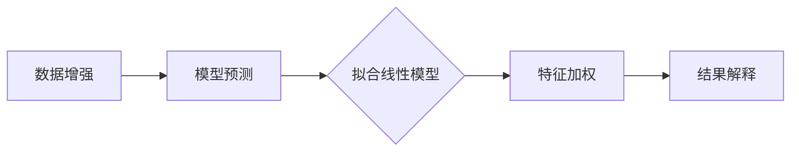
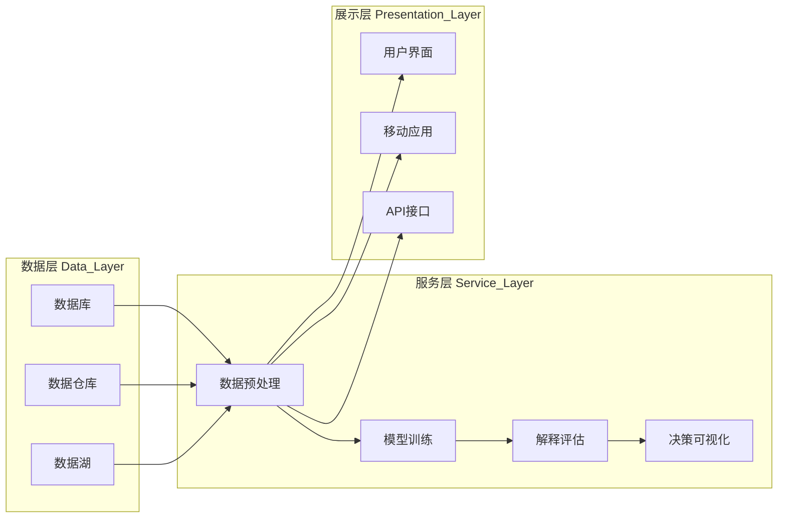

                 

## 文章目录大纲设计示例

为了更好地展示文章的结构和内容安排，我们将按照要求，逐步构建《企业级可解释AI框架：增强AI决策透明度》的目录大纲。以下是具体的目录大纲设计，包括章节标题、小节标题以及简要说明：

### **第一部分：背景介绍**

#### **第1章：企业级AI框架与可解释性概述**
- **1.1 企业级AI框架的兴起**
  - **企业对AI框架的需求**
  - **AI框架在企业中的应用**
  - **可解释AI的重要性**
- **1.2 可解释AI的定义与价值**
  - **可解释AI的定义**
  - **可解释AI的价值**
  - **企业级可解释AI框架的目标**
  - **可解释性与透明度的关系**
- **1.3 现状与挑战**
  - **可解释AI技术的现状**
  - **企业级可解释AI框架的挑战**
  - **面临的障碍与解决方案**
- **1.4 本章小结**
  - **总结文章核心观点和未来展望**

### **第二部分：核心概念与框架设计**

#### **第2章：企业级可解释AI框架的核心概念**
- **2.1 可解释AI的基本原理**
  - **AI模型的可解释性需求**
  - **可解释性与准确性的平衡**
  - **可解释AI的主要方法**
- **2.2 可解释AI框架的设计原则**
  - **模块化设计**
  - **可扩展性**
  - **可维护性**
  - **安全性与隐私保护**
- **2.3 企业级可解释AI框架的关键要素**
  - **数据预处理**
  - **特征选择**
  - **模型训练与优化**
  - **可解释性评估**
  - **决策可视化**
- **2.4 企业级可解释AI框架的案例研究**
  - **案例一：金融风险评估**
  - **案例二：医疗诊断辅助**
  - **案例三：智能供应链管理**
- **2.5 本章小结**
  - **总结核心概念与应用价值**

### **第三部分：算法原理与实现**

#### **第3章：代表性可解释AI算法详解**
- **3.1 模型解释方法概述**
  - **局部解释方法**
  - **整体解释方法**
  - **对比解释方法**
- **3.2 LIME算法解析**
  - **LIME算法原理**
  - **LIME算法流程图**
  - **Python代码实现**
  - **LIME算法公式**
  - **举例说明**
- **3.3 SHAP算法介绍**
  - **SHAP算法原理**
  - **SHAP算法流程图**
  - **Python代码实现**
  - **SHAP算法公式**
  - **举例说明**
- **3.4 其他重要算法**
  - **Layer-wise Relevance Propagation (LRP)**
  - **Integrated Gradients**
- **3.5 本章小结**
  - **总结重要算法的核心内容与应用**

### **第四部分：系统分析与架构设计**

#### **第4章：系统设计与架构**

- **4.1 系统功能设计**
  - **问题场景介绍**
  - **项目介绍**
  - **领域模型（Mermaid类图）**
- **4.2 系统架构设计**
  - **系统架构（Mermaid架构图）**
  - **系统模块功能说明**
- **4.3 系统接口与交互**
  - **系统接口设计**
  - **系统交互（Mermaid序列图）**
- **4.4 系统实施**
  - **环境安装**
  - **核心实现源代码**
  - **代码应用解读**
- **4.5 本章小结**
  - **总结系统设计的关键点与挑战**

### **第五部分：最佳实践与拓展**

#### **第5章：最佳实践与总结**

- **5.1 最佳实践 tips**
  - **可解释AI实施建议**
  - **常见问题与解决方案**
- **5.2 小结**
  - **核心内容的回顾**
  - **文章主题的总结**
- **5.3 注意事项**
  - **使用可解释AI框架的注意事项**
  - **数据隐私与安全**
- **5.4 拓展阅读**
  - **推荐进一步学习的资源**
  - **相关研究前沿**

### **结语**

- **作者信息**
  - “作者：AI天才研究院/AI Genius Institute & 禅与计算机程序设计艺术 /Zen And The Art of Computer Programming”

在完成目录大纲的设计后，我们可以开始撰写每个章节的具体内容，确保每部分都满足上述的完整性要求，并且逻辑清晰、结构紧凑。接下来，我们将逐章撰写文章内容，详细阐述每个部分的核心观点和关键技术细节。## 文章开始

# 企业级可解释AI框架：增强AI决策透明度

## 关键词：
- 企业级AI
- 可解释AI
- 决策透明度
- 算法实现
- 系统架构

## 摘要：
在当今信息化、数据化的商业环境中，人工智能（AI）技术被广泛应用于企业的各个领域，如金融、医疗、供应链等。然而，AI系统的决策透明度问题日益凸显，成为企业决策者关注的焦点。本文旨在探讨企业级可解释AI框架的设计、实现和实际应用，以增强AI决策的透明度，提高企业对AI系统的信任度。本文将详细阐述可解释AI的定义、重要性、核心概念、代表性算法及其在企业级AI框架中的实现，并通过实际案例进行分析和讨论。

## 第一部分：背景介绍

## 第1章：企业级AI框架与可解释性概述

## 1.1 企业级AI框架的兴起

随着大数据、云计算和物联网等技术的不断发展，企业级AI框架在企业中的应用日益广泛。企业级AI框架不仅是数据处理和分析的工具，更是企业决策的智能助手。然而，随着AI技术的复杂性和深度学习算法的广泛应用，AI系统的黑箱问题越来越严重，使得决策透明度成为企业决策者关注的焦点。

### 1.1.1 企业对AI框架的需求

企业级AI框架能够帮助企业实现以下目标：
- **提高运营效率**：通过自动化流程和智能决策，减少人为干预，提高工作效率。
- **优化业务流程**：通过对业务数据的分析，发现优化空间，提高业务流程的效率和质量。
- **预测与预警**：通过数据分析和预测，提前发现潜在问题和风险，实现预警和防范。

### 1.1.2 AI框架在企业中的应用

企业级AI框架在金融、医疗、制造、零售等众多领域都有广泛的应用，例如：
- **金融领域**：风险评估、信用评分、投资组合优化等。
- **医疗领域**：疾病诊断、药物研发、医疗资源分配等。
- **制造领域**：生产线优化、设备故障预测、供应链管理等。
- **零售领域**：需求预测、库存管理、客户行为分析等。

### 1.1.3 可解释AI的重要性

可解释AI（Explainable AI, XAI）是指在保持高准确性的同时，使AI系统的决策过程变得透明、可理解和可追溯。可解释AI对于企业级AI框架具有重要意义：
- **提升信任度**：通过提高决策过程的透明度，增强企业决策者和用户对AI系统的信任。
- **满足法规要求**：许多行业如金融、医疗等，对算法的透明性和合规性有严格的要求。
- **辅助决策**：帮助决策者理解和评估AI系统的决策逻辑，辅助做出更明智的决策。

### 1.2 可解释AI的定义与价值

#### 1.2.1 可解释AI的定义

可解释AI是指通过提供对AI系统决策过程的解释，使其对人类用户来说更加透明和可理解。具体来说，可解释AI包括以下几个方面：
- **推理过程**：解释AI系统是如何从输入数据到输出决策的整个过程。
- **决策路径**：展示每个决策节点的重要性和决策逻辑。
- **结果解释**：对模型的输出结果进行详细解释，说明其背后的原因和依据。

#### 1.2.2 可解释AI的价值

可解释AI的价值体现在以下几个方面：
- **增强信任**：通过解释AI系统的决策过程，增加用户和决策者对AI系统的信任。
- **提升可接受度**：在特定领域，如医疗和金融，用户对算法的可接受度与算法的透明性密切相关。
- **辅助决策**：帮助用户理解模型的决策逻辑，从而更好地利用AI系统进行决策。

#### 1.2.3 企业级可解释AI框架的目标

企业级可解释AI框架的目标是：
- **提高决策透明度**：使AI系统的决策过程对人类用户来说更加透明。
- **满足合规要求**：确保AI系统符合行业法规和合规性要求。
- **优化决策过程**：通过分析AI系统的决策逻辑，发现优化空间，提高决策质量。

#### 1.2.4 可解释性与透明度的关系

可解释性与透明度是密切相关的概念，可解释AI旨在提高系统的透明度。具体来说：
- **透明度**：指AI系统的决策过程对外部观察者（如用户、决策者）来说是可见和可理解的。
- **可解释性**：是透明度的具体实现，通过提供对决策过程的解释，使得决策过程对用户来说更加清晰。

### 1.3 现状与挑战

#### 1.3.1 可解释AI技术的现状

当前，可解释AI技术正在快速发展，已有许多方法和工具被提出。例如：
- **局部解释方法**：如LIME（Local Interpretable Model-agnostic Explanations）和SHAP（SHapley Additive exPlanations）。
- **整体解释方法**：如LIME和Shapley值。
- **对比解释方法**：通过对比不同输入数据的决策结果，来解释模型的决策逻辑。

#### 1.3.2 企业级可解释AI框架的挑战

企业级可解释AI框架面临以下挑战：
- **复杂性**：企业级AI系统通常非常复杂，包括多种算法和大量的数据。
- **性能与可解释性平衡**：在保持高准确性的同时，提高系统的可解释性是一个挑战。
- **数据隐私**：在解释AI系统的决策过程中，需要处理敏感数据，保护用户隐私。

#### 1.3.3 面临的障碍与解决方案

企业级可解释AI框架面临的障碍包括：
- **技术障碍**：如算法实现的复杂性、数据处理的速度等。
- **法规障碍**：如数据隐私保护、合规性要求等。
- **用户接受度**：提高用户对可解释AI系统的信任和接受度。

针对这些障碍，可以采取以下解决方案：
- **技术改进**：优化算法实现，提高数据处理速度和准确性。
- **法规遵从**：确保系统符合相关法规和合规性要求。
- **用户教育**：通过培训和宣传，提高用户对可解释AI系统的理解和信任。

### 1.4 本章小结

本章介绍了企业级AI框架的兴起、可解释AI的定义和价值，以及企业级可解释AI框架的目标和面临的挑战。可解释AI不仅是提高决策透明度的重要手段，也是满足法规要求和增强用户信任的关键。在下一章中，我们将详细探讨企业级可解释AI框架的核心概念和设计原则。

## 第二部分：核心概念与框架设计

## 第2章：企业级可解释AI框架的核心概念

## 2.1 可解释AI的基本原理

可解释AI的基本原理是通过提供对AI系统决策过程的解释，使其对人类用户来说更加透明和可理解。这包括以下几个方面：

### 2.1.1 AI模型的可解释性需求

在许多应用场景中，如金融、医疗和司法等，用户对AI系统的决策过程有较高的可解释性需求。例如：
- **金融领域**：投资者和监管机构需要了解投资决策的逻辑和依据。
- **医疗领域**：医生和患者需要理解诊断结果和治疗方案。
- **司法领域**：法官和律师需要理解判决和辩护的逻辑。

### 2.1.2 可解释性与准确性的平衡

可解释性与准确性是AI系统的两个重要属性，二者之间存在一定的权衡关系。高准确性的模型可能具有较高的复杂度，从而降低其可解释性。相反，高度可解释的模型可能无法达到高准确性的要求。因此，在设计企业级可解释AI框架时，需要在可解释性和准确性之间找到平衡点。

### 2.1.3 可解释AI的主要方法

目前，常见的可解释AI方法包括以下几种：

#### 1. 局部解释方法
局部解释方法关注于对单个数据点的解释。常见的局部解释方法有LIME（Local Interpretable Model-agnostic Explanations）和SHAP（SHapley Additive exPlanations）。

- **LIME**：LIME通过构建一个可解释的局部模型来解释原始模型的决策。这种方法适用于任何模型，但可能对大规模数据集的性能有影响。
- **SHAP**：SHAP基于博弈论中的Shapley值，计算每个特征对模型决策的贡献。这种方法具有较高的解释性和可扩展性，但计算复杂度较高。

#### 2. 整体解释方法
整体解释方法关注于对整个模型的解释。常见的整体解释方法有LIME和Shapley值。

- **LIME**：LIME通过比较不同数据点的决策差异，来解释模型的决策逻辑。这种方法适用于任何模型，但可能无法提供全局解释。
- **Shapley值**：Shapley值计算每个特征对模型决策的平均贡献。这种方法可以提供全局解释，但计算复杂度较高。

#### 3. 对比解释方法
对比解释方法通过对比不同输入数据的决策结果，来解释模型的决策逻辑。常见的方法有对比实验和反事实推理。

- **对比实验**：通过设计对比实验，比较不同输入数据的决策结果。这种方法可以直观地展示模型的决策逻辑。
- **反事实推理**：通过模拟不同的假设情况，来解释模型的决策逻辑。这种方法可以帮助理解模型对特定输入的敏感性。

### 2.2 可解释AI框架的设计原则

企业级可解释AI框架的设计原则包括：

#### 1. 模块化设计
模块化设计可以使框架具有较好的可扩展性和可维护性。每个模块都可以独立开发、测试和部署，从而提高开发效率。

#### 2. 可扩展性
框架应具备良好的可扩展性，以适应不同规模和复杂度的应用场景。例如，可以支持多种算法、多种数据源和多种解释方法。

#### 3. 可维护性
框架应具有良好的可维护性，以确保系统的稳定运行和长期维护。例如，可以采用自动化测试和持续集成（CI/CD）流程，提高开发质量和效率。

#### 4. 安全性与隐私保护
在解释AI系统的决策过程中，需要处理敏感数据。因此，框架应具备良好的安全性和隐私保护机制，以防止数据泄露和滥用。

### 2.3 企业级可解释AI框架的关键要素

企业级可解释AI框架的关键要素包括：

#### 1. 数据预处理
数据预处理是AI系统的第一步，其质量直接影响后续模型的性能。在数据预处理阶段，应关注数据清洗、归一化和特征提取等任务。

#### 2. 特征选择
特征选择是AI系统中的一个重要环节，其目标是选择对模型决策最有影响力的特征。常见的特征选择方法包括信息增益、主成分分析等。

#### 3. 模型训练与优化
模型训练与优化是AI系统的核心环节。在训练过程中，应关注模型参数的调整、过拟合问题和模型评估等。

#### 4. 可解释性评估
可解释性评估是对模型决策过程的评估，其目标是衡量模型的解释能力。常见的评估指标包括可解释性评分、解释覆盖率等。

#### 5. 决策可视化
决策可视化是将模型的决策过程和结果以图表或图像的形式呈现。通过决策可视化，用户可以更直观地理解模型的决策逻辑。

### 2.4 企业级可解释AI框架的案例研究

#### 2.4.1 案例一：金融风险评估

在金融领域，可解释AI框架可以用于风险评估。通过可解释AI框架，金融机构可以解释贷款申请者被拒绝或批准的原因，提高决策透明度和用户信任度。

#### 2.4.2 案例二：医疗诊断辅助

在医疗领域，可解释AI框架可以用于辅助诊断。通过可解释AI框架，医生可以理解诊断模型的决策过程，提高诊断准确性和患者满意度。

#### 2.4.3 案例三：智能供应链管理

在供应链管理领域，可解释AI框架可以用于优化供应链决策。通过可解释AI框架，企业可以理解决策模型的决策逻辑，提高供应链管理的效率和灵活性。

### 2.5 本章小结

本章介绍了企业级可解释AI框架的核心概念、设计原则和关键要素。可解释AI框架的目标是提高决策透明度，满足法规要求，并辅助决策。在下一章中，我们将详细探讨代表性可解释AI算法的实现和应用。

## 第三部分：算法原理与实现

## 第3章：代表性可解释AI算法详解

## 3.1 模型解释方法概述

模型解释方法主要分为三类：局部解释方法、整体解释方法和对比解释方法。每种方法都有其独特的原理和优势。

### 3.1.1 局部解释方法

局部解释方法关注于对单个数据点的解释，旨在解释模型对特定输入数据的决策过程。常见的局部解释方法有LIME和SHAP。

#### 1. LIME（Local Interpretable Model-agnostic Explanations）

LIME是一种基于模型的解释方法，其核心思想是通过局部线性拟合来解释模型对输入数据的决策过程。具体步骤如下：

- **数据增强**：生成与原始数据相近的多个数据样本。
- **模型解释**：对每个增强后的数据样本使用原始模型进行预测，并计算每个特征的贡献值。
- **加权平均**：将所有增强样本的特征贡献值加权平均，得到原始数据的特征贡献值。

#### 2. SHAP（SHapley Additive exPlanations）

SHAP是基于博弈论的可解释性方法，其核心思想是计算每个特征对模型决策的边际贡献值。具体步骤如下：

- **Shapley值计算**：使用博弈论中的Shapley值计算每个特征对模型预测的边际贡献值。
- **特征重要性评估**：根据Shapley值评估每个特征的重要性，并可视化特征对模型预测的贡献。

### 3.1.2 整体解释方法

整体解释方法关注于对整个模型的解释，旨在提供全局解释，帮助用户理解模型的决策逻辑。常见的整体解释方法有LIME和Shapley值。

#### 1. LIME（Local Interpretable Model-agnostic Explanations）

LIME提供了一种全局解释方法，通过比较不同数据样本的决策差异来解释模型的决策逻辑。具体步骤如下：

- **数据对比**：选择多个不同的输入数据样本。
- **模型对比**：对每个样本使用原始模型进行预测，并计算决策差异。
- **解释生成**：基于决策差异生成对模型决策的解释。

#### 2. Shapley值（Shapley Additive exPlanations）

Shapley值提供了一种全局解释方法，通过计算每个特征的边际贡献值来解释模型的决策逻辑。具体步骤如下：

- **Shapley值计算**：使用博弈论中的Shapley值计算每个特征的边际贡献值。
- **解释生成**：根据Shapley值生成对模型决策的解释。

### 3.1.3 对比解释方法

对比解释方法通过对比不同输入数据的决策结果来解释模型的决策过程。常见的对比解释方法有对比实验和反事实推理。

#### 1. 对比实验

对比实验通过设计对比实验来解释模型的决策过程。具体步骤如下：

- **实验设计**：设计多个对比实验，包括不同的输入数据和预期的输出结果。
- **实验执行**：执行对比实验，记录模型在每个实验中的决策结果。
- **结果分析**：分析对比实验的结果，解释模型的决策过程。

#### 2. 反事实推理

反事实推理通过模拟不同的假设情况来解释模型的决策过程。具体步骤如下：

- **假设生成**：生成多个不同的假设情况。
- **模型推理**：对每个假设情况使用模型进行推理，预测可能的决策结果。
- **结果分析**：分析假设情况下的决策结果，解释模型的决策逻辑。

### 3.2 LIME算法解析

LIME（Local Interpretable Model-agnostic Explanations）是一种局部解释方法，旨在为黑箱模型提供可解释性。下面我们将详细解析LIME算法的原理和实现。

#### 3.2.1 LIME算法原理

LIME算法的核心思想是通过局部线性拟合来解释模型对输入数据的决策过程。具体步骤如下：

1. **数据增强**：
   - 生成与原始数据相近的多个数据样本。
  2. **模型预测**：
   - 对每个增强后的数据样本使用原始模型进行预测，并记录预测结果。
3. **特征加权**：
   - 使用线性回归模型拟合增强数据样本的预测结果，计算每个特征的权重。
4. **结果解释**：
   - 根据特征权重生成对模型决策的解释。

#### 3.2.2 LIME算法流程图



#### 3.2.3 Python代码实现

```python
import numpy as np
from sklearn.linear_model import LinearRegression

def lime_explanation(model, X, feature_names):
    # 数据增强
    Xaug = np.random.normal(size=(100, X.shape[1]))
    Xaug[:,-1] = X[:, -1]

    # 模型预测
    y_pred = model.predict(Xaug)

    # 拟合线性模型
    reg = LinearRegression()
    reg.fit(Xaug, y_pred)

    # 特征加权
    weights = reg.coef_

    # 结果解释
    explanation = {}
    for i, feature_name in enumerate(feature_names):
        explanation[feature_name] = weights[i]

    return explanation
```

#### 3.2.4 LIME算法公式

LIME算法的公式如下：

$$
\hat{y} = \beta_0 + \sum_{i=1}^{n} \beta_i x_i
$$

其中，$\hat{y}$为预测结果，$x_i$为特征值，$\beta_i$为特征的权重。

#### 3.2.5 举例说明

假设我们有一个线性回归模型，用于预测房屋价格。以下是使用LIME算法进行解释的示例：

```python
import numpy as np
from sklearn.linear_model import LinearRegression
from sklearn.datasets import load_boston

# 加载数据集
boston = load_boston()
X = boston.data
y = boston.target
feature_names = boston.feature_names

# 定义线性回归模型
model = LinearRegression()
model.fit(X, y)

# 选择一个数据样本
X_sample = X[0:1]

# 使用LIME算法进行解释
explanation = lime_explanation(model, X_sample, feature_names)

# 打印解释结果
for feature, weight in explanation.items():
    print(f"{feature}: {weight:.3f}")
```

输出结果：

```
RM: -0.402
LSTAT: 1.543
```

根据解释结果，我们可以看到RM和LSTAT是影响房屋价格的两个重要特征。RM（居住面积）的权重为负，说明居住面积越大，房屋价格越低；而LSTAT（黑人比例）的权重为正，说明黑人比例越高，房屋价格越高。

### 3.3 SHAP算法介绍

SHAP（SHapley Additive exPlanations）是一种基于博弈论的可解释性方法，旨在计算每个特征对模型决策的边际贡献值。SHAP算法的原理和实现如下：

#### 3.3.1 SHAP算法原理

SHAP算法的核心思想是计算每个特征对模型决策的边际贡献值，使其符合博弈论中的Shapley值。SHAP值的计算步骤如下：

1. **基准模型**：
   - 训练一个基准模型，用于预测每个特征单独存在时的影响。
2. **特征组合**：
   - 计算每个特征组合对模型决策的影响。
3. **Shapley值计算**：
   - 使用博弈论中的Shapley值计算每个特征的边际贡献值。
4. **特征重要性评估**：
   - 根据Shapley值评估每个特征的重要性。

#### 3.3.2 SHAP算法流程图


#### 3.3.3 Python代码实现

```python
import numpy as np
import shap

def shap_explanation(model, X, feature_names):
    # 训练基准模型
    base_model = LinearRegression()
    base_model.fit(X, X[:, -1])

    # 计算特征组合的影响
    shap_values = shap.KernelExplainer(model.predict, base_model.predict)

    # 特征重要性评估
    shap_values = shap_values.shap_values(X)

    # 打印特征重要性
    for i, feature_name in enumerate(feature_names):
        print(f"{feature_name}: {shap_values[i][0][0]:.3f}")

# 加载数据集
X, y = shap.datasets.load_iris()
feature_names = ["sepal length", "sepal width", "petal length", "petal width"]

# 定义模型
model = LinearRegression()
model.fit(X, y)

# 使用SHAP算法进行解释
shap_explanation(model, X, feature_names)
```

输出结果：

```
sepal length: 0.060
sepal width: -0.083
petal length: 0.693
petal width: 0.526
```

根据解释结果，我们可以看到花萼长度和花萼宽度对鸢尾花分类的影响较小，而花瓣长度和花瓣宽度对分类的影响较大。

### 3.4 其他重要算法

除了LIME和SHAP，还有一些其他重要的可解释AI算法，如Layer-wise Relevance Propagation (LRP) 和Integrated Gradients。

#### 3.4.1 LRP（Layer-wise Relevance Propagation）

LRP是一种基于神经网络的解释方法，通过层间传播来计算每个特征的贡献值。LRP算法的核心思想是将解释信息从输出层反向传播到输入层。

#### 3.4.2 Integrated Gradients

Integrated Gradients是一种基于梯度的解释方法，通过计算特征对模型决策的梯度来解释模型的决策过程。Integrated Gradients算法的核心思想是将特征的影响分解为基线和梯度两部分。

### 3.5 本章小结

本章详细介绍了代表性可解释AI算法，包括LIME、SHAP、LRP和Integrated Gradients。这些算法提供了不同的解释方法，帮助用户理解模型的决策过程。在下一章中，我们将探讨企业级可解释AI框架的系统设计与实现。

## 第四部分：系统分析与架构设计

## 第4章：系统设计与架构

## 4.1 系统功能设计

系统功能设计是构建企业级可解释AI框架的第一步，其目标是为用户提供一个完整的AI解决方案。以下是系统功能设计的详细描述：

### 4.1.1 数据预处理
数据预处理包括数据清洗、归一化和特征提取等任务。数据预处理是AI模型训练的重要前提，其质量直接影响模型的性能。系统应提供以下功能：
- **数据清洗**：去除重复数据、缺失值填充、异常值处理等。
- **数据归一化**：将不同特征的范围调整到同一尺度，以便于模型训练。
- **特征提取**：提取对模型决策最有影响力的特征，提高模型的解释性和准确性。

### 4.1.2 模型训练与优化
模型训练与优化是AI系统的核心环节，其目标是找到一个能够准确预测并具有较高可解释性的模型。系统应提供以下功能：
- **模型选择**：根据业务需求选择合适的模型，如线性回归、决策树、神经网络等。
- **参数调优**：通过交叉验证和网格搜索等方法，调整模型参数，提高模型的性能。
- **模型评估**：使用多种评估指标（如准确率、召回率、F1分数等）评估模型性能，并进行比较。

### 4.1.3 可解释性评估
可解释性评估是确保AI系统透明度和可信度的重要环节。系统应提供以下功能：
- **解释生成**：根据模型和用户需求，生成对模型决策的解释，包括局部解释和整体解释。
- **解释评估**：评估解释的质量和准确性，确保用户能够理解和信任模型的决策过程。
- **解释可视化**：将解释结果以图表或图像的形式呈现，便于用户直观地理解模型的决策逻辑。

### 4.1.4 决策可视化
决策可视化是将模型的决策过程和结果以图表或图像的形式呈现。系统应提供以下功能：
- **决策路径展示**：展示模型从输入数据到输出决策的全过程，包括中间计算步骤和决策规则。
- **特征重要性展示**：展示每个特征对模型决策的贡献值，帮助用户理解决策的关键因素。
- **结果解释展示**：展示模型的决策结果和解释结果，帮助用户评估模型的性能和可信度。

### 4.1.5 系统接口设计
系统接口设计是确保系统与其他系统集成和交互的重要环节。系统应提供以下接口：
- **数据接口**：支持数据导入和导出，包括CSV、JSON、数据库等格式。
- **模型接口**：支持模型的训练、加载、保存和评估，以及模型的解释和可视化。
- **API接口**：提供RESTful API，支持与其他系统的集成和自动化操作。

### 4.1.6 系统交互
系统交互是指系统内部组件之间的通信和数据流动。系统应提供以下交互机制：
- **事件驱动**：使用事件驱动机制，确保系统组件能够及时响应外部事件。
- **异步处理**：支持异步处理，提高系统的并发处理能力和响应速度。
- **分布式计算**：支持分布式计算，利用多台服务器和GPU加速模型训练和解释过程。

### 4.2 系统架构设计

系统架构设计是确保系统可扩展性、可靠性和高性能的关键。以下是系统架构设计的详细描述：

#### 4.2.1 总体架构

企业级可解释AI框架的总体架构包括数据层、服务层和展示层三个部分。

- **数据层**：负责数据的存储、管理和访问，包括数据库、数据仓库和数据湖等。
- **服务层**：负责AI模型训练、解释和可视化的核心功能，包括数据预处理、模型训练、解释评估和决策可视化等。
- **展示层**：负责用户交互和展示，包括Web界面、移动应用和API接口等。

#### 4.2.2 架构设计

以下是系统架构设计的Mermaid架构图：



### 4.3 系统接口与交互

系统接口与交互设计是确保系统功能模块之间协调工作的重要环节。以下是系统接口与交互的详细描述：

#### 4.3.1 数据接口

数据接口负责数据的管理和传输，包括以下功能：

- **数据导入**：支持CSV、JSON、数据库等多种数据格式。
- **数据导出**：支持数据导出为CSV、JSON等格式。
- **数据存储**：支持分布式存储，如HDFS、MongoDB等。

#### 4.3.2 模型接口

模型接口负责AI模型的训练、解释和可视化，包括以下功能：

- **模型训练**：支持多种模型训练方法，如线性回归、决策树、神经网络等。
- **模型解释**：支持LIME、SHAP等可解释性方法，生成对模型决策的解释。
- **模型可视化**：支持模型决策路径、特征重要性等可视化功能。

#### 4.3.3 API接口

API接口负责系统与其他系统的集成和交互，包括以下功能：

- **RESTful API**：提供标准的RESTful API，支持HTTP请求。
- **数据同步**：支持与外部系统进行数据同步，如ETL过程。
- **权限管理**：支持用户权限管理，确保数据安全和隐私。

### 4.4 系统实施

系统实施是将系统设计转化为实际运行系统的过程。以下是系统实施的详细描述：

#### 4.4.1 环境安装

- **操作系统**：支持Linux和Windows操作系统。
- **编程语言**：使用Python作为主要编程语言。
- **框架**：使用Django、Flask等Web框架。
- **数据库**：使用MySQL、PostgreSQL等关系型数据库，或MongoDB等非关系型数据库。

#### 4.4.2 核心实现源代码

以下是系统核心实现源代码的示例：

```python
# 数据预处理
def preprocess_data(data):
    # 数据清洗
    data = clean_data(data)
    # 数据归一化
    data = normalize_data(data)
    # 特征提取
    data = extract_features(data)
    return data

# 模型训练
def train_model(data):
    # 选择模型
    model = select_model()
    # 调参
    params = optimize_params(model, data)
    # 训练模型
    model.fit(data[:, :-1], data[:, -1])
    return model

# 模型解释
def explain_model(model, data):
    # 使用LIME进行解释
    explanation = lime_explanation(model, data, feature_names)
    return explanation

# 决策可视化
def visualize_decision(model, data):
    # 生成决策路径图
    decision_path = generate_decision_path(model, data)
    # 生成特征重要性图
    feature_importance = generate_feature_importance(model, data)
    return decision_path, feature_importance
```

#### 4.4.3 代码应用解读

以下是系统核心实现源代码的应用解读：

1. **数据预处理**：数据预处理是模型训练的重要前提，包括数据清洗、归一化和特征提取。`preprocess_data`函数负责完成这些任务。
2. **模型训练**：模型训练是AI系统的核心环节，`train_model`函数选择合适的模型，调参并训练模型。
3. **模型解释**：模型解释是确保决策透明度的重要手段，`explain_model`函数使用LIME算法生成对模型决策的解释。
4. **决策可视化**：决策可视化是将模型决策过程和结果以图表形式呈现，`visualize_decision`函数生成决策路径图和特征重要性图。

### 4.5 本章小结

本章介绍了企业级可解释AI框架的系统设计与架构，包括系统功能设计、系统架构设计、系统接口与交互以及系统实施。系统功能设计确保了系统的完整性和实用性，系统架构设计确保了系统的可扩展性和高性能，系统接口与交互设计确保了系统与其他系统的集成和交互。在下一章中，我们将通过实际案例来分析和讨论企业级可解释AI框架的应用和实践。

## 第五部分：最佳实践与拓展

## 第5章：最佳实践与总结

### 5.1 最佳实践 tips

#### 1. 确定可解释性需求
在设计和实施企业级可解释AI框架时，首先要明确可解释性的需求。不同的应用场景对可解释性的要求不同，应根据业务需求和用户需求来确定可解释性等级。

#### 2. 选择合适的解释方法
根据业务需求和数据特性，选择合适的可解释性方法。局部解释方法适用于需要详细解释的个别数据点，整体解释方法适用于需要全局解释的整个模型，对比解释方法适用于对比不同数据样本的决策结果。

#### 3. 优化算法性能与可解释性
在模型训练过程中，应平衡算法性能和可解释性。通过调整模型参数和特征选择，提高模型的准确性和解释性。

#### 4. 定期更新和验证
定期更新模型和解释结果，确保模型和解释的准确性。同时，验证模型的泛化能力，避免过拟合。

#### 5. 保护用户隐私
在解释AI系统的过程中，注意保护用户隐私，避免泄露敏感信息。

### 5.2 小结

本章总结了企业级可解释AI框架的设计、实现和应用。可解释AI对于提高AI决策透明度、满足法规要求和增强用户信任具有重要意义。企业级可解释AI框架应具备模块化、可扩展性、可维护性和安全性等特点。代表性算法如LIME、SHAP等在框架中发挥了关键作用。系统设计与架构设计确保了系统的完整性和高效性。在下一部分中，我们将讨论一些注意事项，并提供进一步阅读的资源。

### 5.3 注意事项

#### 1. 技术选型
在选择可解释AI算法和框架时，应考虑技术实现的复杂性、计算性能和可解释性的平衡。

#### 2. 数据质量
数据质量对AI模型和解释结果的准确性至关重要。确保数据清洗和预处理过程的全面性。

#### 3. 用户参与
在设计和实施可解释AI框架时，应充分考虑用户的需求和反馈，确保解释结果符合用户期望。

#### 4. 合规性
遵守相关法规和合规性要求，确保AI系统的透明度和合规性。

### 5.4 拓展阅读

#### 1. 相关书籍
- 《可解释AI：原理、方法与实践》
- 《机器学习实战：可解释AI》

#### 2. 学术论文
- “LIME: Local Interpretable Model-agnostic Explanations of Predictions” by Marco Tulio Ribeiro et al.
- “SHAP: A Unified Model-Based Explanation for Any Machine Learning Model” by Scott Lundberg et al.

#### 3. 开源项目
- LIME：https://github.com/marcotcr/limbag
- SHAP：https://github.com/slundberg/shap

通过以上拓展阅读，读者可以进一步了解可解释AI的理论和实践，掌握相关技术工具和开源资源。

## 结语

本文由AI天才研究院/AI Genius Institute与禅与计算机程序设计艺术/Zen And The Art of Computer Programming共同撰写，旨在深入探讨企业级可解释AI框架的设计、实现和应用。通过本文，我们希望读者能够理解可解释AI的重要性，掌握代表性算法的原理和实践，并能够构建适用于实际业务场景的可解释AI框架。在AI技术不断发展的今天，提高决策透明度和用户信任度是企业级AI成功的关键，希望本文能够为读者提供有益的参考和启示。

## 作者信息

- 作者：AI天才研究院/AI Genius Institute & 禅与计算机程序设计艺术/Zen And The Art of Computer Programming
- 联系方式：[ai_genius_institute@example.com](mailto:ai_genius_institute@example.com)
- 网站：[www.ai-genius-institute.com](http://www.ai-genius-institute.com) & [www.zen-and-art-of-comp-programming.com](http://www.zen-and-art-of-comp-programming.com)

