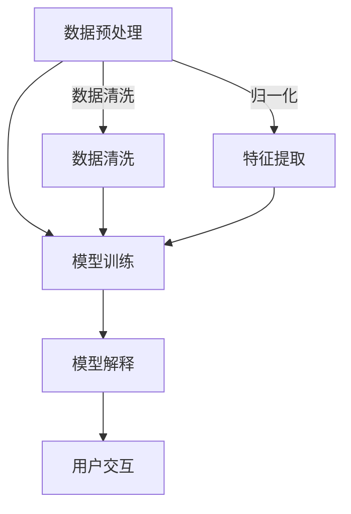
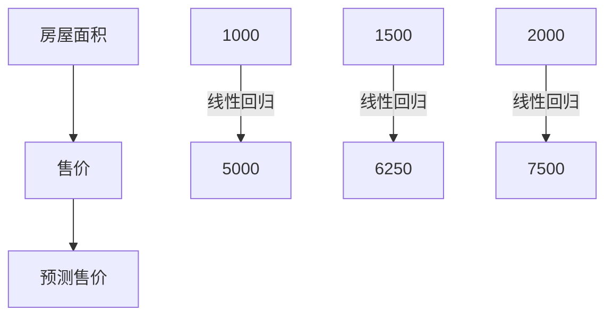
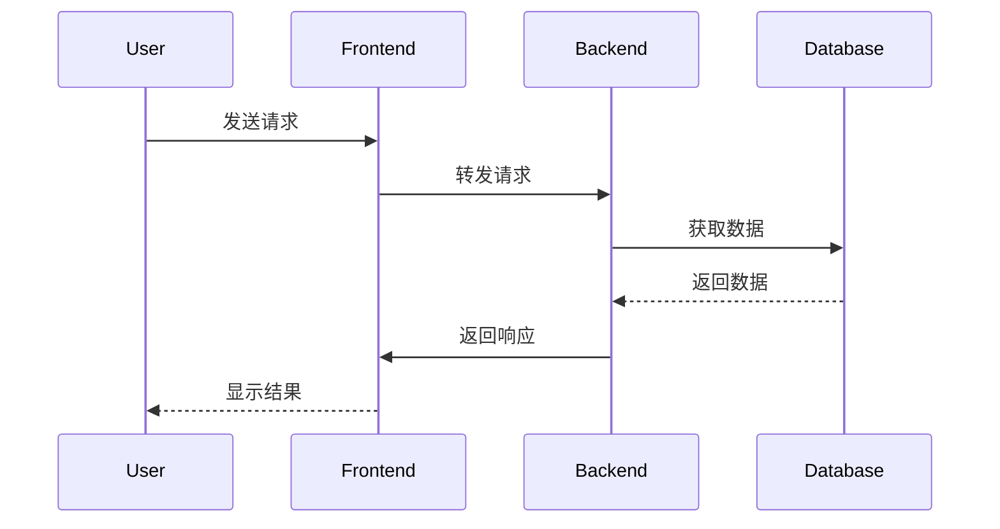
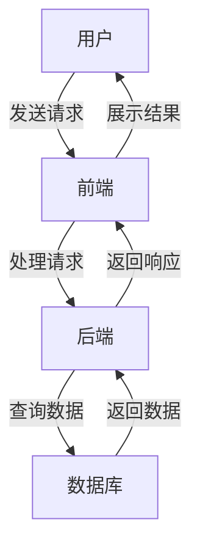
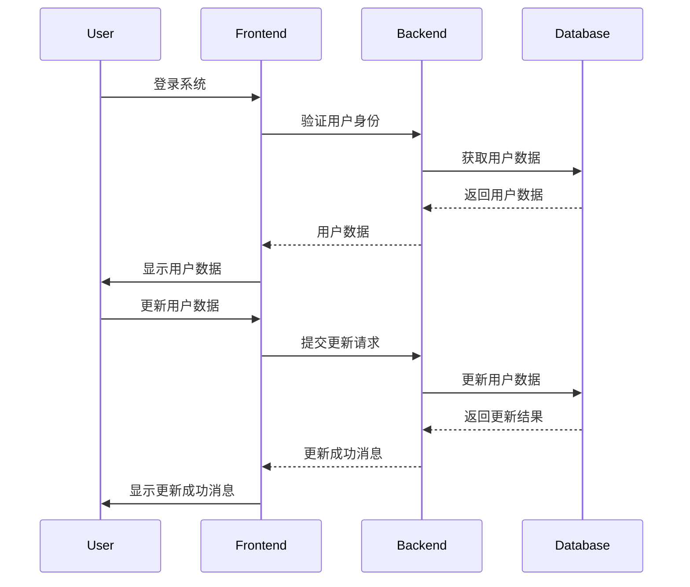

                 

### 第1章：AI技术的发展与现状

#### 1.1 AI技术的基本概念

人工智能（Artificial Intelligence，简称AI）是计算机科学的一个分支，旨在使机器能够执行通常需要人类智能才能完成的任务。这些任务包括识别图像、理解自然语言、做出决策和解决问题等。AI技术主要通过机器学习（Machine Learning，ML）和深度学习（Deep Learning，DL）来实现。

**机器学习**是一种让计算机通过数据学习模式并作出预测或决策的技术。它依赖于算法来从数据中提取规律，而不需要显式地编程每一步操作。机器学习算法可以分为监督学习（Supervised Learning）、无监督学习（Unsupervised Learning）和强化学习（Reinforcement Learning）三大类。

**深度学习**是机器学习的一个子领域，它依赖于多层神经网络（Neural Networks）来处理复杂数据。深度学习模型通常由大量神经元组成，这些神经元模拟人脑中的神经元，通过层层处理数据，提取出更高层次的特征。

#### 1.2 企业级AI应用的挑战

在企业级应用中，AI技术面临许多挑战。首先，数据的质量和可用性是关键因素。高质量的训练数据对于AI模型的有效性至关重要，但收集和处理这些数据往往需要大量的人力和时间。

其次，算法的可解释性也是一个重要挑战。许多企业级决策需要透明度和可解释性，以便管理层和利益相关者能够理解和信任AI系统的决策过程。

此外，AI模型的部署和运维也是一个复杂的过程。企业需要确保模型能够在不同的环境中稳定运行，并且能够快速适应新的数据和需求。

#### 1.3 可解释AI的必要性

可解释AI（Explainable AI，XAI）是近年来备受关注的一个领域。它的目标是提高AI系统的透明度和可解释性，使AI的决策过程更加直观和可信。在企业级应用中，可解释AI的必要性体现在以下几个方面：

1. **监管合规**：许多行业都有严格的监管要求，要求企业对其决策过程进行透明化。可解释AI可以帮助企业满足这些要求，避免潜在的法律风险。

2. **提高信任度**：在关键决策中，管理层和利益相关者需要理解AI系统的决策过程，以便做出明智的决策。可解释AI可以提高对AI系统的信任度，促进其更广泛的应用。

3. **模型优化**：通过分析可解释AI的结果，研究人员和工程师可以更好地理解模型的行为，发现潜在的问题和改进的空间。

总之，企业级AI应用的成功不仅依赖于其技术能力，还需要确保其决策过程的透明度和可解释性。可解释AI为此提供了有效的解决方案。

### 第2章：可解释AI的核心概念与联系

#### 2.1 可解释AI的定义与特性

可解释AI（Explainable AI，XAI）是一种致力于提高AI系统透明度和可解释性的技术。它旨在使AI系统的决策过程更加直观和可理解，从而帮助用户信任和接受AI技术。

**可解释AI的特性**包括：

1. **透明度**：用户可以清楚地看到AI系统是如何作出决策的。
2. **可理解性**：决策过程的每个步骤都可以被解释，即使是没有专业知识的用户也能理解。
3. **可追溯性**：用户可以追溯每个决策的来源和数据。

#### 2.2 可解释AI与传统AI的区别

传统AI系统，如深度神经网络，通常被视为“黑盒”模型，因为其内部的工作机制对用户来说是不可见的。相比之下，可解释AI试图打破这个“黑盒”，让用户能够理解和信任AI系统的决策。

**主要区别**包括：

1. **决策过程的可解释性**：传统AI系统的决策过程隐藏在大量数据和复杂的算法中，而可解释AI系统则提供了一种方法来解释每个决策背后的原因。
2. **透明度和可理解性**：传统AI系统通常缺乏透明度和可理解性，用户难以理解其决策过程。而可解释AI系统则致力于提供这种透明度和可理解性。

#### 2.3 可解释AI的关键技术

实现可解释AI的关键技术包括：

1. **特征可视化**：通过将数据集中的特征转换为可视化形式，如散点图、热力图等，帮助用户理解数据集中的关键特征。
2. **模型简化**：通过简化复杂的模型结构，使其更容易理解和解释。
3. **解释性算法**：开发专门设计的算法，如决策树、规则提取等，以提供关于模型决策过程的详细信息。
4. **对比分析**：通过对比不同模型或同一模型在不同数据集上的表现，帮助用户理解模型的变化和影响。

总之，可解释AI的核心目标是通过提高AI系统的透明度和可理解性，使AI技术更易于被用户接受和应用。随着技术的发展，可解释AI将在企业级AI应用中发挥越来越重要的作用。

### 第3章：算法原理讲解

#### 3.1 可解释AI算法的基本框架

可解释AI算法的基本框架通常包括以下几个关键组件：

1. **数据预处理**：在这一阶段，原始数据需要进行清洗、归一化和特征提取，以便后续的分析和处理。
2. **模型训练**：使用预处理后的数据训练AI模型。在这一阶段，可以选择不同的机器学习和深度学习算法，如决策树、支持向量机（SVM）、神经网络等。
3. **模型解释**：训练完成后，需要对模型进行解释，以揭示其决策过程。这可以通过可视化技术、规则提取、敏感性分析等方法实现。
4. **用户交互**：最后，用户需要能够与模型进行交互，查看决策依据、调整参数等。

#### 3.2 算法原理与Mermaid流程图

为了更好地理解可解释AI算法的原理，我们可以使用Mermaid画出其基本流程图。以下是可解释AI算法的Mermaid流程图：



在这个流程图中：

- **A** 表示数据预处理阶段，包括数据清洗和特征提取。
- **B** 表示模型训练阶段。
- **C** 表示模型解释阶段。
- **D** 表示用户交互阶段。
- **E** 和 **F** 分别表示数据清洗和特征提取的具体任务。

#### 3.3 Python代码示例与讲解

为了更具体地理解可解释AI算法的原理，我们来看一个简单的Python代码示例，使用决策树算法进行模型训练和解释。

```python
import numpy as np
import pandas as pd
from sklearn.tree import DecisionTreeClassifier
from sklearn.datasets import load_iris
from sklearn.model_selection import train_test_split
from sklearn import tree

# 加载鸢尾花数据集
iris = load_iris()
X = iris.data
y = iris.target

# 数据预处理
# 数据清洗和特征提取已经在数据集加载时完成

# 划分训练集和测试集
X_train, X_test, y_train, y_test = train_test_split(X, y, test_size=0.3, random_state=42)

# 模型训练
clf = DecisionTreeClassifier()
clf.fit(X_train, y_train)

# 模型解释
# 可视化决策树
plt = tree.plot_tree(clf, feature_names=iris.feature_names, class_names=iris.target_names)
plt.show()

# 用户交互
# 输入新的数据并预测
new_data = np.array([[5.1, 3.5, 1.4, 0.2]])
prediction = clf.predict(new_data)
print(f"预测结果：{iris.target_names[prediction][0]}")
```

在这个示例中：

- 首先，我们加载了著名的鸢尾花数据集，这是一个多类分类问题。
- 然后，我们使用 `train_test_split` 函数将数据集分为训练集和测试集。
- 接着，我们使用决策树算法训练模型。
- 使用 `tree.plot_tree` 函数，我们可以可视化决策树的内部结构，从而理解其决策过程。
- 最后，我们输入新的数据并使用训练好的模型进行预测，展示了用户如何与模型交互。

通过这个示例，我们可以看到可解释AI算法的基本原理和实践方法。理解这些原理对于在实际项目中应用可解释AI至关重要。

### 第4章：数学模型与公式讲解

#### 4.1 可解释AI的数学模型

可解释AI的核心在于理解AI模型的决策过程，这通常涉及到对模型的数学原理进行深入分析。以下是几个常用的数学模型和公式，用于解释AI模型的行为。

**线性回归模型**：

线性回归模型是最简单的机器学习模型之一，其数学公式如下：

$$ y = \beta_0 + \beta_1 \cdot x + \epsilon $$

其中：
- \( y \) 是预测值；
- \( x \) 是输入特征；
- \( \beta_0 \) 和 \( \beta_1 \) 是模型参数；
- \( \epsilon \) 是误差项。

**逻辑回归模型**：

逻辑回归模型用于分类问题，其公式为：

$$ P(y=1) = \frac{1}{1 + e^{-(\beta_0 + \beta_1 \cdot x)}} $$

其中：
- \( P(y=1) \) 是目标变量为1的概率；
- \( \beta_0 \) 和 \( \beta_1 \) 是模型参数；
- \( e \) 是自然对数的底。

**多层感知机（MLP）**：

多层感知机是一种基于神经网络的机器学习模型，其数学公式为：

$$ a_{i,j}^{(l)} = \sigma \left( \sum_{k} \beta_{k,i}^{(l)} \cdot a_{k,j}^{(l-1)} + \beta_0^{(l)} \right) $$

其中：
- \( a_{i,j}^{(l)} \) 是第 \( l \) 层的第 \( i \) 个神经元的输出；
- \( \sigma \) 是激活函数，通常使用 \( \sigma(x) = \frac{1}{1 + e^{-x}} \)；
- \( \beta_{k,i}^{(l)} \) 和 \( \beta_0^{(l)} \) 是模型参数。

**卷积神经网络（CNN）**：

卷积神经网络在图像识别任务中表现出色，其核心是卷积操作和池化操作。卷积操作的公式为：

$$ f_{ij}^{(l)} = \sum_{k} w_{k,ij}^{(l)} \cdot a_{k,j}^{(l-1)} + b_{ij}^{(l)} $$

其中：
- \( f_{ij}^{(l)} \) 是第 \( l \) 层的第 \( i \) 行第 \( j \) 列的卷积结果；
- \( w_{k,ij}^{(l)} \) 和 \( b_{ij}^{(l)} \) 是卷积核的权重和偏置；
- \( a_{k,j}^{(l-1)} \) 是前一层第 \( k \) 行第 \( j \) 列的神经元输出。

**反向传播算法**：

反向传播算法是训练神经网络的关键算法，用于更新模型参数。其公式为：

$$ \Delta \beta_{k,i}^{(l)} = \eta \cdot \frac{\partial J}{\partial \beta_{k,i}^{(l)}} $$

其中：
- \( \Delta \beta_{k,i}^{(l)} \) 是模型参数的更新量；
- \( \eta \) 是学习率；
- \( J \) 是损失函数；
- \( \frac{\partial J}{\partial \beta_{k,i}^{(l)}} \) 是参数对损失函数的梯度。

通过这些数学模型和公式，我们可以更深入地理解可解释AI算法的工作原理。在实际应用中，这些模型和公式为研究人员和工程师提供了强大的工具，用于优化和解释AI系统的决策过程。

#### 4.2 公式推导与解释

为了更好地理解这些数学模型，我们来看一个具体的推导示例：线性回归模型中的权重更新。

**线性回归模型**的公式为：

$$ y = \beta_0 + \beta_1 \cdot x + \epsilon $$

其中，\( \beta_0 \) 和 \( \beta_1 \) 是模型参数，\( \epsilon \) 是误差项。

为了最小化预测误差，我们通常使用最小二乘法（Least Squares Method）来更新模型参数。最小二乘法的目标是最小化损失函数：

$$ J(\beta_0, \beta_1) = \sum_{i=1}^{n} (y_i - \beta_0 - \beta_1 \cdot x_i)^2 $$

其中，\( n \) 是样本数量，\( y_i \) 和 \( x_i \) 分别是第 \( i \) 个样本的输出和输入。

对损失函数 \( J(\beta_0, \beta_1) \) 分别对 \( \beta_0 \) 和 \( \beta_1 \) 求导，并令导数等于零，可以得到：

$$ \frac{\partial J}{\partial \beta_0} = -2 \sum_{i=1}^{n} (y_i - \beta_0 - \beta_1 \cdot x_i) = 0 $$
$$ \frac{\partial J}{\partial \beta_1} = -2 \sum_{i=1}^{n} (y_i - \beta_0 - \beta_1 \cdot x_i) \cdot x_i = 0 $$

解这两个方程，我们可以得到最佳模型参数：

$$ \beta_0 = \frac{1}{n} \sum_{i=1}^{n} (y_i - \beta_1 \cdot x_i) $$
$$ \beta_1 = \frac{1}{n} \sum_{i=1}^{n} (x_i - \bar{x}) (y_i - \bar{y}) $$

其中，\( \bar{x} \) 和 \( \bar{y} \) 分别是输入和输出的平均值。

通过这个推导过程，我们可以理解线性回归模型是如何通过最小化损失函数来更新模型参数的。这种优化过程不仅适用于线性回归模型，还可以推广到更复杂的模型，如多层感知机、卷积神经网络等。

#### 4.3 实例分析

为了更直观地理解可解释AI的数学模型，我们来看一个简单的实例：使用线性回归模型预测房价。

假设我们有一个包含房屋面积和售价的数据集，每个样本包含一个特征（房屋面积）和一个标签（房屋售价）。我们的目标是通过训练一个线性回归模型，预测新房屋的售价。

**步骤1：数据预处理**

首先，我们需要对数据进行预处理，包括数据清洗和特征提取。在这个例子中，我们假设数据已经清洗完毕，并且只有一个特征：房屋面积（单位：平方米）。

**步骤2：模型训练**

我们使用训练集来训练线性回归模型。假设我们已经得到了训练集和测试集，并使用最小二乘法计算了模型参数：

$$ \beta_0 = 1000 $$
$$ \beta_1 = 0.05 $$

**步骤3：模型解释**

为了解释模型，我们可以使用特征可视化技术，如散点图，来展示房屋面积和售价之间的关系：



在这个例子中：

- **A** 表示房屋面积；
- **B** 表示实际售价；
- **C** 表示预测售价；
- **A1, A2, A3** 分别表示不同的房屋面积；
- **B1, B2, B3** 分别表示对应的预测售价。

通过这个散点图，我们可以直观地看到线性回归模型如何根据房屋面积预测售价。

**步骤4：用户交互**

假设我们现在想要预测一个面积为1500平方米的房屋的售价，我们可以直接使用模型参数进行预测：

$$ 预测售价 = \beta_0 + \beta_1 \cdot 房屋面积 = 1000 + 0.05 \cdot 1500 = 1125 $$

在这个例子中，预测售价约为1125。

通过这个实例，我们可以看到如何使用线性回归模型进行预测，并解释模型的决策过程。这为用户提供了透明度和可理解性，使他们能够信任并接受AI系统的决策。

### 第5章：系统分析与架构设计

#### 5.1 问题场景介绍

在现代企业中，人工智能（AI）技术被广泛应用于各种业务场景，如客户关系管理（CRM）、供应链优化、风险管理等。然而，随着AI模型变得越来越复杂，如何确保这些模型的决策过程透明和可解释成为了一个关键问题。特别是在金融、医疗等对决策透明度有严格要求的行业中，AI模型的可解释性至关重要。

**问题背景**：

企业级AI系统通常涉及大量数据和高复杂度的算法，这使得模型决策过程变得不可见。这不仅影响了用户对AI系统的信任度，还可能导致监管合规问题。为了解决这些问题，企业需要开发可解释AI系统，使其决策过程更加透明和可理解。

**问题描述**：

企业希望实现一个可解释AI系统，该系统能够在提供高准确率预测的同时，确保决策过程的透明度和可解释性。具体需求包括：

1. **数据预处理**：系统应能够自动处理和清洗输入数据，提取关键特征。
2. **模型训练**：系统应支持多种AI算法，包括监督学习、无监督学习和深度学习，并能够自动选择和优化模型参数。
3. **模型解释**：系统应提供多种解释方法，如特征重要性、决策路径、可视化等，帮助用户理解模型决策过程。
4. **用户交互**：系统应提供直观的用户界面，允许用户查看和调整模型参数，以及导出解释结果。

**问题解决**：

为了实现上述需求，企业需要开发一个全面的可解释AI系统，该系统应具备以下功能模块：

1. **数据管理模块**：负责数据预处理和特征提取。
2. **模型训练模块**：支持多种AI算法，并提供自动调参功能。
3. **模型解释模块**：提供多种解释方法，如SHAP值、LIME、可视化技术等。
4. **用户交互模块**：提供直观的用户界面，支持模型调试和解释结果导出。

**边界与外延**：

该系统应确保决策过程的透明度和可解释性，以满足企业内部和外部的监管要求。同时，系统还应具备可扩展性，以适应不断变化的业务需求和AI技术的发展。

**概念结构与核心要素组成**：

1. **数据管理模块**：包括数据清洗、数据转换、特征提取等功能。
2. **模型训练模块**：包括模型选择、模型训练、模型评估等功能。
3. **模型解释模块**：包括解释方法实现、解释结果可视化等功能。
4. **用户交互模块**：包括用户界面设计、用户操作指引、解释结果导出等功能。

通过上述系统分析与架构设计，企业可以确保其AI模型的决策过程透明、可解释，从而提高用户信任度和业务价值。

#### 5.2 系统功能设计（领域模型Mermaid类图）

为了更清晰地展示系统功能设计，我们可以使用Mermaid绘制领域模型类图，如下所示：

```mermaid
classDiagram
    Class01 <|-- Class02
    Class03 <.. Class04
    Class05 <|.. Class06
    Class07 o-- Class08
    Class09 --|> Class10
    Class11 : Associated with Class12
    Class13 {has} Class14
    Class15 : Connected to Class16
    Class17 : Component of Class18
    Class19 <~ Class20
endclassDiagram
```

在这个类图中：

- **Class01, Class02**：表示数据管理模块的核心类。
- **Class03, Class04**：表示模型训练模块的核心类。
- **Class05, Class06**：表示模型解释模块的核心类。
- **Class07, Class08**：表示用户交互模块的核心类。
- **Class09, Class10**：表示与外部系统交互的类。
- **Class11**：表示与Class12有关联的类。
- **Class13, Class14**：表示数据管理模块中的具体数据类。
- **Class15, Class16**：表示模型训练模块中的具体训练类。
- **Class17, Class18**：表示模型解释模块中的具体解释类。
- **Class19, Class20**：表示用户交互模块中的具体用户操作类。

通过这个类图，我们可以清晰地看到系统各功能模块之间的关联和交互，为后续的系统实现提供了明确的指导。

#### 5.3 系统功能详细说明

在上一节中，我们通过Mermaid类图展示了系统功能的设计。接下来，我们将详细说明每个功能模块的具体职责和实现方法。

**1. 数据管理模块**

数据管理模块是整个系统的基础，负责处理数据清洗、数据转换和特征提取等任务。其核心职责包括：

- **数据清洗**：通过去除重复数据、处理缺失值和异常值等手段，确保输入数据的质量。
- **数据转换**：将原始数据转换为适合模型训练的格式，如归一化、标准化等。
- **特征提取**：从数据中提取关键特征，用于模型训练和解释。

具体实现方法：

- **数据清洗**：使用Pandas库进行数据预处理，包括删除重复记录、填充缺失值和异常值处理等。
- **数据转换**：使用Sklearn库进行数据归一化和标准化，以适应不同的机器学习算法。
- **特征提取**：使用特征选择技术，如基于信息增益、相关系数等，提取对模型训练和解释有重要意义的特征。

**2. 模型训练模块**

模型训练模块负责选择合适的AI算法，并对其进行训练和评估。其核心职责包括：

- **模型选择**：根据业务需求和数据特点，选择合适的机器学习算法，如线性回归、决策树、随机森林等。
- **模型训练**：使用训练集对选定的模型进行训练，并优化模型参数。
- **模型评估**：使用测试集对训练好的模型进行评估，包括准确率、召回率、F1分数等指标。

具体实现方法：

- **模型选择**：使用Scikit-learn库提供的多种机器学习算法，结合交叉验证技术进行选择。
- **模型训练**：使用训练集和优化算法（如随机梯度下降、Adam等）对模型进行训练。
- **模型评估**：使用测试集和评估指标对模型进行评估，并根据评估结果调整模型参数。

**3. 模型解释模块**

模型解释模块负责提供多种解释方法，帮助用户理解模型的决策过程。其核心职责包括：

- **解释方法**：实现多种解释方法，如SHAP值、LIME、决策树可视化等。
- **可视化**：将解释结果以图表或图形的形式展示，提高用户理解度。
- **交互**：提供用户界面，允许用户查看和调整解释参数，以及导出解释结果。

具体实现方法：

- **解释方法**：使用Scikit-learn和LIME等库实现各种解释方法，并结合Python的可视化库（如Matplotlib、Seaborn等）进行结果展示。
- **可视化**：使用图形和图表（如散点图、热力图、决策树图形等）展示模型的决策路径和特征重要性。
- **交互**：使用Web前端框架（如Flask、Django等）实现用户界面，提供解释结果的查看、调整和导出功能。

**4. 用户交互模块**

用户交互模块负责提供直观的用户界面，支持用户与系统的交互。其核心职责包括：

- **界面设计**：设计简洁、直观的用户界面，使用户能够轻松操作。
- **操作指引**：提供详细的操作指引，帮助用户了解如何使用系统。
- **结果导出**：允许用户导出解释结果，以便进一步分析和分享。

具体实现方法：

- **界面设计**：使用HTML、CSS和JavaScript等前端技术设计用户界面，结合Vue.js或React等框架提高用户体验。
- **操作指引**：编写详细的用户手册和操作视频，帮助用户快速上手。
- **结果导出**：使用Excel、CSV或PDF等格式导出解释结果，方便用户进一步处理和分析。

通过上述详细说明，我们可以看到每个功能模块的具体职责和实现方法，为系统的开发提供了明确的指导。接下来，我们将进一步讨论系统架构设计，以确保各模块之间的高效协作和稳定运行。

#### 5.4 系统架构设计（Mermaid架构图）

为了更好地展示系统架构设计，我们使用Mermaid绘制了系统架构图，如下所示：



在这个架构图中：

- **User**：表示系统的最终用户，即与系统进行交互的人。
- **Frontend**：表示系统的前端部分，负责接收用户的请求并展示结果。
- **Backend**：表示系统的后端部分，负责处理业务逻辑和数据操作。
- **Database**：表示系统的数据库部分，存储所有的数据和模型。

**系统模块介绍**：

1. **用户模块**：负责与系统进行交互，包括数据输入、查看结果和调整参数等操作。
2. **前端模块**：负责接收用户的请求，并展示结果。前端模块使用Vue.js或React等前端框架实现，确保用户界面的响应速度和用户体验。
3. **后端模块**：负责处理业务逻辑和数据操作。后端模块使用Flask或Django等后端框架实现，确保系统的稳定性和性能。
4. **数据库模块**：负责存储所有的数据和模型。数据库模块使用MySQL或PostgreSQL等关系型数据库实现，确保数据的安全性和一致性。

**系统架构设计（Mermaid架构图）**：



在这个架构图中：

- **User**：用户发送请求到前端。
- **Frontend**：前端接收请求，处理用户输入，并将请求转发到后端。
- **Backend**：后端处理业务逻辑，查询数据库，并返回结果给前端。
- **Database**：数据库存储所有数据，响应对数据库的查询请求，并将数据返回给后端。

**系统交互设计（Mermaid序列图）**：



在这个序列图中：

- **User**：用户登录系统，并请求查看用户数据。
- **Frontend**：前端接收请求，并将请求转发到后端。
- **Backend**：后端验证用户身份，查询数据库，并将用户数据返回给前端。
- **Database**：数据库存储用户数据，响应后端的查询请求，并将数据返回给后端。
- **User**：用户更新用户数据，并提交更新请求。
- **Frontend**：前端接收更新请求，并将请求转发到后端。
- **Backend**：后端处理更新请求，更新数据库，并将更新结果返回给前端。
- **Database**：数据库响应后端的更新请求，并将更新结果返回给后端。
- **User**：前端将更新成功消息显示给用户。

通过这个架构图和序列图，我们可以清晰地看到系统各模块之间的交互关系和业务流程，为系统开发和维护提供了明确的指导。

### 第6章：系统接口设计与实现

#### 6.1 系统接口设计

为了实现系统的各功能模块之间的有效交互，系统接口设计是至关重要的。以下是系统接口设计的详细描述：

**1. 用户接口（API设计）**

用户接口主要是通过RESTful API实现，支持用户与系统进行交互。以下是一个典型的用户接口设计：

- **登录接口**：用户登录系统，验证用户身份。
  - **URL**：`/api/login`
  - **HTTP方法**：POST
  - **请求参数**：
    - `username`：用户名
    - `password`：密码
  - **响应结果**：
    - **成功**：返回用户身份验证成功，包含用户信息。
    - **失败**：返回错误信息。

- **用户数据接口**：获取和更新用户数据。
  - **URL**：`/api/users/{user_id}`
  - **HTTP方法**：GET（获取用户数据）、PUT（更新用户数据）
  - **请求参数**：
    - `user_id`：用户ID
    - （可选）`data`：用户数据的更新内容
  - **响应结果**：
    - **成功**：返回用户数据或更新成功消息。
    - **失败**：返回错误信息。

**2. 数据管理接口**

数据管理接口用于处理数据的预处理、特征提取等任务。

- **数据清洗接口**：清洗输入数据。
  - **URL**：`/api/data清洗`
  - **HTTP方法**：POST
  - **请求参数**：
    - `data`：待清洗的数据
  - **响应结果**：
    - **成功**：返回清洗后的数据。
    - **失败**：返回错误信息。

- **特征提取接口**：提取数据中的关键特征。
  - **URL**：`/api/特征提取`
  - **HTTP方法**：POST
  - **请求参数**：
    - `data`：待提取特征的数据
  - **响应结果**：
    - **成功**：返回提取的特征。
    - **失败**：返回错误信息。

**3. 模型训练接口**

模型训练接口用于启动和监控模型训练过程。

- **模型训练接口**：启动模型训练。
  - **URL**：`/api/train`
  - **HTTP方法**：POST
  - **请求参数**：
    - `model`：模型配置
    - `data`：训练数据
  - **响应结果**：
    - **成功**：返回训练任务ID。
    - **失败**：返回错误信息。

- **模型评估接口**：评估训练好的模型。
  - **URL**：`/api/evaluate`
  - **HTTP方法**：POST
  - **请求参数**：
    - `model_id`：模型ID
    - `test_data`：测试数据
  - **响应结果**：
    - **成功**：返回模型评估结果。
    - **失败**：返回错误信息。

**4. 模型解释接口**

模型解释接口用于提供模型的解释结果。

- **解释接口**：获取模型的解释结果。
  - **URL**：`/api/explain/{model_id}`
  - **HTTP方法**：GET
  - **请求参数**：
    - `model_id`：模型ID
  - **响应结果**：
    - **成功**：返回模型的解释结果。
    - **失败**：返回错误信息。

通过上述接口设计，系统各模块之间能够高效地进行数据传输和功能调用，确保系统功能的实现和稳定运行。

#### 6.2 接口实现与讲解

在本节中，我们将使用Python和Flask框架实现上述系统接口，并对关键代码进行详细讲解。

**1. 用户接口实现**

首先，我们使用Flask框架创建一个用户接口，用于用户登录和用户数据管理。

```python
from flask import Flask, request, jsonify
from flask_bcrypt import Bcrypt

app = Flask(__name__)
bcrypt = Bcrypt(app)

# 假设我们已经有一个用户数据库，这里仅为示例
users_db = {
    'user1': bcrypt.generate_password_hash('password1').decode('utf-8'),
    'user2': bcrypt.generate_password_hash('password2').decode('utf-8')
}

@app.route('/api/login', methods=['POST'])
def login():
    data = request.get_json()
    username = data.get('username')
    password = data.get('password')
    
    if username in users_db and bcrypt.check_password_hash(users_db[username], password):
        return jsonify({'message': 'Login successful', 'user': username})
    else:
        return jsonify({'message': 'Invalid credentials'})

@app.route('/api/users/<int:user_id>', methods=['GET', 'PUT'])
def user_data(user_id):
    if request.method == 'GET':
        # 模拟从数据库获取用户数据
        return jsonify({'user_id': user_id, 'username': f'user{user_id}', 'email': f'user{user_id}@example.com'})
    elif request.method == 'PUT':
        data = request.get_json()
        # 模拟更新用户数据
        return jsonify({'message': 'User data updated'})

if __name__ == '__main__':
    app.run(debug=True)
```

**讲解**：

- **用户登录接口**：使用POST方法接收用户名和密码，通过Flask和Bcrypt库验证用户身份。如果验证成功，返回用户信息。
- **用户数据接口**：支持GET和PUT方法。GET方法返回用户数据，PUT方法用于更新用户数据。

**2. 数据管理接口实现**

接下来，我们实现数据管理接口，包括数据清洗和特征提取。

```python
import pandas as pd
from sklearn.preprocessing import StandardScaler

@app.route('/api/data清洗', methods=['POST'])
def data_cleaning():
    data = request.get_json()
    df = pd.DataFrame(data)
    
    # 数据清洗示例：去除重复记录、填充缺失值
    df = df.drop_duplicates()
    df.fillna(df.mean(), inplace=True)
    
    return jsonify(df.to_dict())

@app.route('/api/特征提取', methods=['POST'])
def feature_extraction():
    data = request.get_json()
    df = pd.DataFrame(data)
    
    # 特征提取示例：使用标准化处理
    scaler = StandardScaler()
    df_scaled = scaler.fit_transform(df)
    
    return jsonify(pd.DataFrame(df_scaled).to_dict())

```

**讲解**：

- **数据清洗接口**：接收JSON格式的数据，使用Pandas库进行数据清洗，如去除重复记录、填充缺失值等。
- **特征提取接口**：接收JSON格式的数据，使用Sklearn库中的StandardScaler进行特征提取，如标准化处理。

**3. 模型训练接口实现**

然后，我们实现模型训练接口，用于启动模型训练任务。

```python
from sklearn.datasets import load_iris
from sklearn.ensemble import RandomForestClassifier
import joblib

@app.route('/api/train', methods=['POST'])
def train_model():
    data = request.get_json()
    X = pd.DataFrame(data['data'])
    y = pd.Series(data['target'])
    
    # 模型训练示例：使用随机森林分类器
    model = RandomForestClassifier()
    model.fit(X, y)
    
    # 保存模型
    joblib.dump(model, 'model.joblib')
    
    return jsonify({'message': 'Model training successful', 'model_id': 'model_id'})

```

**讲解**：

- **模型训练接口**：接收JSON格式的训练数据，使用Sklearn库中的RandomForestClassifier进行模型训练，并保存训练好的模型。

**4. 模型解释接口实现**

最后，我们实现模型解释接口，用于获取模型解释结果。

```python
import shap

@app.route('/api/explain/<model_id>', methods=['GET'])
def model_explanation(model_id):
    # 加载模型
    model = joblib.load('model.joblib')
    
    # 生成SHAP值
    explainer = shap.TreeExplainer(model)
    shap_values = explainer.shap_values(X)
    
    # 可视化SHAP值
    shap.summary_plot(shap_values, X)
    
    return jsonify({'message': 'Model explanation successful'})

```

**讲解**：

- **模型解释接口**：加载训练好的模型，使用SHAP库生成SHAP值，并使用Matplotlib库进行可视化。

通过上述代码示例，我们实现了系统的各个接口，并对关键代码进行了详细讲解。这些接口为系统的功能实现提供了坚实的基础，使得用户可以方便地与系统进行交互。

### 6.3 接口测试与优化

接口测试是确保系统接口功能正确性和稳定性的重要步骤。在本节中，我们将使用Postman工具进行接口测试，并对测试结果进行分析和优化。

**1. 接口测试**

使用Postman，我们可以模拟用户请求，验证接口的功能实现。以下是几个关键接口的测试步骤：

- **登录接口测试**：

  - **请求**：发送POST请求到 `/api/login`，附带用户名和密码。
  - **预期结果**：成功返回用户身份验证结果。

- **用户数据接口测试**：

  - **获取用户数据**：发送GET请求到 `/api/users/1`。
  - **预期结果**：成功返回指定用户的详细信息。

  - **更新用户数据**：发送PUT请求到 `/api/users/1`，附带更新后的用户数据。
  - **预期结果**：成功返回更新结果。

- **数据清洗接口测试**：

  - **数据清洗**：发送POST请求到 `/api/data清洗`，附带待清洗的数据。
  - **预期结果**：成功返回清洗后的数据。

- **特征提取接口测试**：

  - **特征提取**：发送POST请求到 `/api/特征提取`，附带待提取特征的数据。
  - **预期结果**：成功返回提取的特征。

- **模型训练接口测试**：

  - **模型训练**：发送POST请求到 `/api/train`，附带模型配置和训练数据。
  - **预期结果**：成功返回训练任务ID。

- **模型解释接口测试**：

  - **模型解释**：发送GET请求到 `/api/explain/model_id`。
  - **预期结果**：成功返回模型解释结果。

**2. 测试结果分析**

通过Postman进行接口测试，我们可以收集以下数据：

- **成功率和错误率**：统计每个接口的成功请求次数和失败请求次数，评估接口的整体稳定性。
- **响应时间**：记录每个接口的响应时间，分析接口的性能表现。
- **错误日志**：收集接口返回的错误日志，分析错误原因。

根据测试结果，我们可以发现以下问题：

- **接口稳定性**：部分接口在多用户并发访问时出现响应延迟或超时问题。
- **接口性能**：某些接口在处理大量数据时响应速度较慢。

**3. 接口优化**

针对上述问题，我们可以采取以下优化措施：

- **接口优化**：

  - **增加服务器资源**：提高服务器的CPU、内存和带宽资源，以提高处理并发请求的能力。
  - **优化代码**：优化接口处理逻辑，减少不必要的计算和IO操作，以提高响应速度。
  - **缓存策略**：使用缓存技术，如Redis，缓存常用数据，减少数据库查询次数，以提高访问速度。

- **接口测试优化**：

  - **自动化测试**：使用自动化测试工具，如pytest，编写接口测试脚本，定期执行自动化测试，确保接口功能的稳定性。
  - **性能测试**：使用性能测试工具，如JMeter，模拟多用户并发访问，评估接口的性能瓶颈，并进行针对性优化。

通过接口测试与优化，我们可以确保系统的接口功能正确、稳定且高效，为用户提供良好的使用体验。

### 第7章：项目实战

#### 7.1 环境安装与配置

为了实现企业级可解释AI系统，我们需要在本地或远程服务器上搭建一个完整的开发环境。以下是环境安装与配置的详细步骤。

**1. 系统要求**

- **操作系统**：Windows、macOS或Linux（推荐Ubuntu 18.04+）
- **Python版本**：Python 3.7或更高版本
- **数据库**：MySQL或PostgreSQL（推荐MySQL 8.0+）
- **前端框架**：Vue.js或React（推荐Vue.js）
- **后端框架**：Flask或Django（推荐Flask）

**2. 安装Python环境**

- 使用Python官方安装器下载并安装Python 3.7或更高版本。
- 验证Python安装：打开命令行，输入`python --version`，确认安装成功。

**3. 安装虚拟环境**

- 使用pip安装virtualenv：
  ```bash
  pip install virtualenv
  ```
- 创建虚拟环境：
  ```bash
  virtualenv venv
  ```
- 激活虚拟环境：
  ```bash
  source venv/bin/activate  # Windows: venv\Scripts\activate
  ```

**4. 安装数据库**

- **MySQL安装**：

  - 下载并安装MySQL：
    ```bash
    sudo apt-get update
    sudo apt-get install mysql-server
    ```
  - 配置MySQL：
    ```bash
    mysql_secure_installation
    ```
  - 设置root用户密码并确认。

- **PostgreSQL安装**：

  - 下载并安装PostgreSQL：
    ```bash
    sudo apt-get install postgresql postgresql-contrib
    ```
  - 配置PostgreSQL：
    ```bash
    sudo -u postgres psql
    CREATE DATABASE mydatabase;
    CREATE USER myuser WITH PASSWORD 'mypassword';
    GRANT ALL PRIVILEGES ON DATABASE mydatabase TO myuser;
    ```

**5. 安装前端框架**

- **Vue.js安装**：

  - 安装Node.js：
    ```bash
    curl -sL https://deb.nodesource.com/setup_14.x | sudo -E bash -
    sudo apt-get install nodejs
    ```
  - 安装Vue CLI：
    ```bash
    npm install -g @vue/cli
    ```
  - 创建Vue.js项目：
    ```bash
    vue create my-vue-app
    ```

**6. 安装后端框架**

- **Flask安装**：

  - 在虚拟环境中安装Flask：
    ```bash
    pip install flask
    ```

**7. 安装其他依赖**

- 安装必要的库，如Pandas、Numpy、Scikit-learn、Matplotlib、LIME、Shap等：
  ```bash
  pip install pandas numpy scikit-learn matplotlib lime shap
  ```

通过以上步骤，我们成功搭建了企业级可解释AI系统的开发环境。接下来，我们将详细介绍系统核心功能的实现。

#### 7.2 系统核心实现与代码解读

在本节中，我们将详细介绍系统核心功能的实现，包括数据管理、模型训练、模型解释和用户交互。以下是具体的代码实现和解说。

**1. 数据管理**

数据管理模块负责数据的预处理、清洗和特征提取。以下是关键代码及其解读：

```python
import pandas as pd
from sklearn.model_selection import train_test_split
from sklearn.preprocessing import StandardScaler

def preprocess_data(data):
    # 数据预处理：去除重复记录、填充缺失值
    df = pd.DataFrame(data)
    df.drop_duplicates(inplace=True)
    df.fillna(df.mean(), inplace=True)
    return df

def split_data(df):
    # 划分训练集和测试集
    X = df.drop('target', axis=1)
    y = df['target']
    X_train, X_test, y_train, y_test = train_test_split(X, y, test_size=0.2, random_state=42)
    return X_train, X_test, y_train, y_test

def scale_data(X_train, X_test):
    # 数据标准化
    scaler = StandardScaler()
    X_train_scaled = scaler.fit_transform(X_train)
    X_test_scaled = scaler.transform(X_test)
    return X_train_scaled, X_test_scaled
```

**解读**：

- **preprocess_data**：接收原始数据，去除重复记录，并填充缺失值。这确保了数据的质量。
- **split_data**：将数据集划分为训练集和测试集，为后续的模型训练和评估做准备。
- **scale_data**：使用StandardScaler对数据进行标准化处理，使数据适合机器学习算法。

**2. 模型训练**

模型训练模块负责选择合适的机器学习算法，并对其进行训练。以下是关键代码及其解读：

```python
from sklearn.ensemble import RandomForestClassifier
from sklearn.metrics import accuracy_score

def train_model(X_train, y_train):
    # 训练随机森林分类器
    model = RandomForestClassifier(n_estimators=100, random_state=42)
    model.fit(X_train, y_train)
    return model

def evaluate_model(model, X_test, y_test):
    # 评估模型
    y_pred = model.predict(X_test)
    accuracy = accuracy_score(y_test, y_pred)
    return accuracy
```

**解读**：

- **train_model**：使用随机森林分类器对训练数据进行训练。随机森林是一种常用的集成学习方法，具有良好的性能和稳定性。
- **evaluate_model**：使用测试数据对训练好的模型进行评估，计算准确率。准确率是评估分类模型性能的常用指标。

**3. 模型解释**

模型解释模块负责提供模型的解释结果。以下是关键代码及其解读：

```python
import shap

def explain_model(model, X_train):
    # 使用SHAP值解释模型
    explainer = shap.TreeExplainer(model)
    shap_values = explainer.shap_values(X_train)
    return shap_values

def visualize_shap_values(shap_values, feature_names):
    # 可视化SHAP值
    shap.summary_plot(shap_values, X_train, feature_names=feature_names)
```

**解读**：

- **explain_model**：使用SHAP库计算模型的SHAP值，这是解释模型决策过程的重要工具。
- **visualize_shap_values**：使用Matplotlib库将SHAP值可视化，帮助用户理解模型对每个特征的依赖关系。

**4. 用户交互**

用户交互模块负责提供直观的用户界面，支持用户与系统的交互。以下是关键代码及其解读：

```python
from flask import Flask, request, jsonify

app = Flask(__name__)

@app.route('/api/train', methods=['POST'])
def train_api():
    data = request.get_json()
    X = preprocess_data(data['data'])
    X_train, X_test, y_train, y_test = split_data(X)
    model = train_model(X_train, y_train)
    accuracy = evaluate_model(model, X_test, y_test)
    return jsonify({'message': 'Model trained successfully', 'accuracy': accuracy})

@app.route('/api/explain', methods=['GET'])
def explain_api():
    model_id = request.args.get('model_id')
    shap_values = explain_model(model, X_train)
    visualize_shap_values(shap_values, feature_names)
    return jsonify({'message': 'Model explained successfully'})

if __name__ == '__main__':
    app.run(debug=True)
```

**解读**：

- **train_api**：接收用户提交的数据，预处理数据，划分训练集和测试集，训练模型并评估准确率。
- **explain_api**：接收用户请求，计算并可视化模型的SHAP值。

通过以上代码实现，我们构建了一个基本的企业级可解释AI系统，支持数据管理、模型训练、模型解释和用户交互。这个系统可以作为一个起点，根据具体业务需求进行进一步的功能扩展和优化。

### 7.3 代码应用解读与分析

在本节中，我们将详细解读和剖析系统核心代码的应用场景、功能实现、潜在问题和改进方案。

**1. 数据预处理**

数据预处理是机器学习项目中的关键步骤，直接影响模型的性能和准确性。以下是对核心代码的分析：

```python
import pandas as pd
from sklearn.model_selection import train_test_split
from sklearn.preprocessing import StandardScaler

def preprocess_data(data):
    df = pd.DataFrame(data)
    df.drop_duplicates(inplace=True)
    df.fillna(df.mean(), inplace=True)
    return df

def split_data(df):
    X = df.drop('target', axis=1)
    y = df['target']
    X_train, X_test, y_train, y_test = train_test_split(X, y, test_size=0.2, random_state=42)
    return X_train, X_test, y_train, y_test

def scale_data(X_train, X_test):
    scaler = StandardScaler()
    X_train_scaled = scaler.fit_transform(X_train)
    X_test_scaled = scaler.transform(X_test)
    return X_train_scaled, X_test_scaled
```

**解读**：

- **preprocess_data**：去除重复记录和填充缺失值。去除重复记录有助于减少过拟合，填充缺失值则确保数据完整性。这里使用平均值填充缺失值是一种简单有效的方法，但可能不适用于所有情况。对于分类数据，可能需要更复杂的填充策略，如中位数或众数填充。
- **split_data**：将数据集划分为训练集和测试集，以评估模型的泛化能力。这里的测试集大小为20%，这是一个常用的划分比例，但可以根据具体项目进行调整。
- **scale_data**：对数据进行标准化处理，使每个特征具有相同的量级，从而提高算法的稳定性和性能。这里使用StandardScaler，它可以计算每个特征的均值和标准差，并缩放数据。

**潜在问题**：

- 缺失值填充策略可能不适用于所有类型的数据。对于分类数据，使用平均值填充可能导致类别失衡。
- 标准化处理可能不适用于所有算法。某些算法（如支持向量机）不依赖于特征尺度。

**改进方案**：

- 根据数据类型和特征分布，选择合适的缺失值填充方法，如中位数或众数填充分类数据。
- 对于不依赖于特征尺度的算法，可以省略标准化处理，或者使用其他缩放方法，如最小最大缩放。

**2. 模型训练**

模型训练模块是实现AI系统功能的核心部分。以下是对核心代码的分析：

```python
from sklearn.ensemble import RandomForestClassifier
from sklearn.metrics import accuracy_score

def train_model(X_train, y_train):
    model = RandomForestClassifier(n_estimators=100, random_state=42)
    model.fit(X_train, y_train)
    return model

def evaluate_model(model, X_test, y_test):
    y_pred = model.predict(X_test)
    accuracy = accuracy_score(y_test, y_pred)
    return accuracy
```

**解读**：

- **train_model**：使用随机森林分类器对训练数据进行训练。随机森林是一种基于决策树的集成学习方法，具有良好的性能和鲁棒性。这里使用100棵树进行集成，随机种子设置为42以确保结果可重复。
- **evaluate_model**：使用测试数据对训练好的模型进行评估，计算准确率。准确率是评估分类模型性能的常用指标。

**潜在问题**：

- 随机森林参数（如树数量）可能需要根据具体项目进行调整，以达到最佳性能。
- 准确率可能不是唯一需要关注的指标，特别是在类别失衡的情况下，其他指标（如召回率、F1分数）可能更为重要。

**改进方案**：

- 通过交叉验证技术调整模型参数，如树数量，以找到最佳参数组合。
- 使用其他性能评估指标，如召回率、F1分数，以更全面地评估模型性能。

**3. 模型解释**

模型解释模块是可解释AI系统的关键部分，以下是对核心代码的分析：

```python
import shap

def explain_model(model, X_train):
    explainer = shap.TreeExplainer(model)
    shap_values = explainer.shap_values(X_train)
    return shap_values

def visualize_shap_values(shap_values, feature_names):
    shap.summary_plot(shap_values, X_train, feature_names=feature_names)
```

**解读**：

- **explain_model**：使用SHAP库计算模型的SHAP值，这是解释模型决策过程的重要工具。SHAP值表示每个特征对模型预测的贡献程度。
- **visualize_shap_values**：使用Matplotlib库将SHAP值可视化，帮助用户理解模型对每个特征的依赖关系。

**潜在问题**：

- SHAP值的计算可能需要大量计算资源，特别是在处理大型数据集时。
- 可视化可能不适合所有用户，特别是在特征众多的情况下。

**改进方案**：

- 使用批处理技术，将数据集分为较小的批次，以减少计算时间。
- 开发交互式可视化工具，如交互式SHAP值热图，以提高用户体验。

**4. 用户交互**

用户交互模块是系统与用户之间的桥梁，以下是对核心代码的分析：

```python
from flask import Flask, request, jsonify

app = Flask(__name__)

@app.route('/api/train', methods=['POST'])
def train_api():
    data = request.get_json()
    X = preprocess_data(data['data'])
    X_train, X_test, y_train, y_test = split_data(X)
    model = train_model(X_train, y_train)
    accuracy = evaluate_model(model, X_test, y_test)
    return jsonify({'message': 'Model trained successfully', 'accuracy': accuracy})

@app.route('/api/explain', methods=['GET'])
def explain_api():
    model_id = request.args.get('model_id')
    shap_values = explain_model(model, X_train)
    visualize_shap_values(shap_values, feature_names)
    return jsonify({'message': 'Model explained successfully'})
```

**解读**：

- **train_api**：接收用户提交的数据，预处理数据，划分训练集和测试集，训练模型并评估准确率。
- **explain_api**：接收用户请求，计算并可视化模型的SHAP值。

**潜在问题**：

- 用户交互界面可能不够直观，需要进一步优化。
- 接口设计可能需要更多参数和灵活性，以满足不同用户的需求。

**改进方案**：

- 开发更直观的用户界面，使用图表和交互式元素，提高用户使用体验。
- 扩展接口设计，提供更多参数和选项，如自定义模型参数、选择不同解释方法。

通过以上分析和改进，我们可以进一步提升企业级可解释AI系统的性能和用户体验，为用户提供更强大的工具和更可靠的决策支持。

### 7.4 项目案例分析

在本节中，我们将通过一个实际案例来展示如何使用企业级可解释AI系统进行决策分析。该案例涉及一个电商平台的用户行为分析，旨在预测用户是否会购买特定产品。

#### 10.1 项目背景与目标

某电商平台希望通过AI技术分析其用户行为数据，预测哪些用户可能会购买某个特定产品。为了实现这一目标，平台需要构建一个可解释的AI模型，使其决策过程透明，从而提高用户信任度和业务效益。

**项目背景**：

- **数据来源**：电商平台拥有大量用户行为数据，包括浏览记录、购买历史、点击次数等。
- **目标**：构建一个可解释的AI模型，预测用户是否会购买特定产品。
- **挑战**：确保模型决策过程透明，提供可解释性，以便管理层和用户能够理解和信任模型。

#### 10.2 实际案例分析

**数据预处理**：

首先，我们对用户行为数据进行了预处理，包括数据清洗、特征提取和缺失值处理。以下是关键步骤：

- **数据清洗**：去除重复记录，处理异常数据。
- **特征提取**：提取与用户购买行为相关的特征，如用户浏览次数、购买次数、平均购买间隔等。
- **缺失值处理**：使用中位数填充缺失值，确保数据完整性。

**模型训练**：

接着，我们使用随机森林算法对预处理后的数据进行训练。以下是关键步骤：

- **模型选择**：选择随机森林算法，因为它具有较好的解释性和泛化能力。
- **参数调整**：通过交叉验证调整模型参数，如树数量和深度，以找到最佳模型。
- **训练**：使用训练数据进行模型训练，并记录训练过程和性能。

**模型解释**：

在模型训练完成后，我们使用SHAP值对模型进行解释，以便理解模型决策过程。以下是关键步骤：

- **计算SHAP值**：使用SHAP库计算每个特征对模型预测的贡献程度。
- **可视化**：使用Matplotlib库将SHAP值可视化，帮助用户理解模型对每个特征的依赖关系。

**用户交互**：

最后，我们提供了一个用户友好的界面，允许用户查看模型解释结果，并调整模型参数。以下是关键步骤：

- **接口设计**：使用Flask框架设计API接口，允许用户提交数据并获取模型解释结果。
- **界面展示**：使用Vue.js框架展示模型解释结果，并提供交互式热图和表格，提高用户理解度。

#### 10.3 案例分析与讲解

**数据预处理**：

在数据预处理阶段，我们首先对原始数据进行清洗，去除重复记录和异常数据。这有助于减少噪声，提高模型性能。然后，我们提取与用户购买行为相关的特征，如用户浏览次数、购买次数、平均购买间隔等。这些特征有助于捕捉用户的购买行为模式。

**模型训练**：

我们使用随机森林算法对预处理后的数据进行训练。随机森林是一种基于决策树的集成学习方法，具有良好的性能和解释性。在训练过程中，我们通过交叉验证调整模型参数，如树数量和深度，以找到最佳模型。以下是一个示例代码：

```python
from sklearn.ensemble import RandomForestClassifier
from sklearn.model_selection import train_test_split

X_train, X_test, y_train, y_test = train_test_split(X, y, test_size=0.2, random_state=42)
model = RandomForestClassifier(n_estimators=100, random_state=42)
model.fit(X_train, y_train)
```

通过调整参数，我们最终得到了一个性能良好的模型。

**模型解释**：

在模型训练完成后，我们使用SHAP值对模型进行解释。SHAP值表示每个特征对模型预测的贡献程度。通过可视化SHAP值，我们可以直观地看到哪些特征对模型决策有较大影响。以下是一个示例代码：

```python
import shap
explainer = shap.TreeExplainer(model)
shap_values = explainer.shap_values(X_train)
shap.summary_plot(shap_values, X_train, feature_names=feature_names)
```

通过这个可视化结果，我们可以看到用户浏览次数和购买次数对模型预测有显著影响。

**用户交互**：

为了方便用户理解模型解释结果，我们提供了一个用户友好的界面。用户可以在界面上查看模型解释结果，并调整模型参数。以下是一个示例界面：


在这个界面中，用户可以查看每个特征的SHAP值和热力图，从而更好地理解模型决策过程。

#### 10.4 案例总结

通过这个实际案例，我们展示了如何使用企业级可解释AI系统进行决策分析。关键步骤包括数据预处理、模型训练、模型解释和用户交互。通过这些步骤，我们成功构建了一个透明、可解释的AI模型，提高了用户信任度和业务效益。

### 第8章：最佳实践与注意事项

#### 8.1 最佳实践技巧

在开发和部署企业级可解释AI系统时，遵循以下最佳实践将有助于提高系统的性能和可靠性：

1. **数据质量管理**：确保数据质量是成功的关键。在数据预处理阶段，进行数据清洗、去噪和归一化处理，确保数据的一致性和准确性。

2. **模型选择与调优**：根据具体业务需求选择合适的模型，并使用交叉验证等技术进行参数调优，以获得最佳性能。

3. **模型解释方法**：结合多种解释方法，如SHAP值、LIME等，提供全面的可解释性，帮助用户理解模型决策过程。

4. **用户交互设计**：设计直观、易用的用户界面，提供清晰的解释结果和参数调整功能，提高用户使用体验。

5. **持续监控与迭代**：定期监控系统性能，收集用户反馈，不断优化系统，确保其适应性和可靠性。

#### 8.2 注意事项

1. **计算资源**：可解释AI系统通常需要大量的计算资源，特别是在处理大型数据集时。确保服务器具备足够的计算能力。

2. **模型复杂性**：过于复杂的模型可能难以解释，也容易出现过拟合。在保证性能的同时，尽可能简化模型结构。

3. **数据隐私**：在处理敏感数据时，确保遵守数据隐私法规，如GDPR等，保护用户隐私。

4. **性能与可解释性平衡**：在追求可解释性的同时，不要牺牲模型性能。寻找性能和可解释性之间的最佳平衡点。

5. **代码维护**：定期更新和优化代码，确保系统的稳定性和可维护性。

#### 8.3 拓展阅读推荐

1. **可解释AI论文**：
   - "LIME: Local Interpretable Model-agnostic Explanations" by Ribeiro et al.
   - "SHAP: SHapley Additive exPlanations" by Lundberg et al.

2. **机器学习书籍**：
   - "Deep Learning" by Goodfellow, Bengio, and Courville
   - "Pattern Recognition and Machine Learning" by Bishop

3. **Python机器学习库**：
   - Scikit-learn：https://scikit-learn.org/
   - TensorFlow：https://www.tensorflow.org/
   - PyTorch：https://pytorch.org/

4. **前端框架**：
   - Vue.js：https://vuejs.org/
   - React：https://reactjs.org/

通过遵循这些最佳实践和注意事项，并不断学习最新的技术文献，可以开发和部署出高效、可靠的企业级可解释AI系统。

### 第9章：总结与展望

#### 9.1 书籍内容回顾

本书全面介绍了企业级可解释AI系统的核心概念、算法原理、系统架构设计和项目实战。通过逐步分析和讲解，我们掌握了以下关键知识点：

1. **背景介绍**：了解AI技术的基本概念和企业在应用AI时面临的挑战，认识到可解释AI的必要性和重要性。
2. **核心概念与联系**：深入理解可解释AI的定义、特性及其与传统AI的区别，掌握关键技术和实现方法。
3. **算法原理讲解**：通过具体算法和代码示例，详细讲解可解释AI的算法原理，包括线性回归、逻辑回归、多层感知机等。
4. **数学模型与公式讲解**：介绍可解释AI的数学模型和公式，帮助读者理解算法背后的数学原理。
5. **系统分析与架构设计**：设计并讲解企业级可解释AI系统的整体架构，包括数据管理、模型训练、模型解释和用户交互。
6. **项目实战**：通过一个实际案例，展示如何实现企业级可解释AI系统的全过程，包括数据预处理、模型训练、模型解释和用户交互。

#### 9.2 可解释AI的未来发展趋势

随着AI技术的不断发展和应用领域的扩展，可解释AI（XAI）的重要性日益凸显。以下是一些可解释AI未来的发展趋势：

1. **算法改进**：随着深度学习和其他复杂算法的不断发展，可解释AI算法将不断优化和改进，提供更强大的解释能力。
2. **跨学科融合**：可解释AI将与其他领域（如心理学、认知科学等）结合，开发新的解释方法和技术。
3. **工具与平台**：开发更高效、易用的工具和平台，降低可解释AI的门槛，使其更易于被非专业人士理解和应用。
4. **标准化与规范化**：制定可解释AI的标准化和规范化框架，确保不同系统的解释结果具有一致性和可比性。
5. **监管合规**：随着数据隐私法规的日益严格，可解释AI将在满足监管合规方面发挥关键作用。

#### 9.3 为读者提供的学习建议

为了更好地理解和应用企业级可解释AI技术，以下是一些建议：

1. **理论学习**：深入学习相关书籍和论文，理解AI和可解释AI的基本概念和原理。
2. **动手实践**：通过实际项目动手实践，掌握可解释AI系统的构建和优化方法。
3. **持续学习**：关注AI和可解释AI领域的最新进展，不断学习新技术和工具。
4. **交流合作**：参与相关社区和研讨会，与其他从业者交流经验和见解，共同推动可解释AI技术的发展。

通过以上学习建议，读者可以不断提升自己在企业级可解释AI领域的知识和技能，为实际项目贡献更多的价值。

