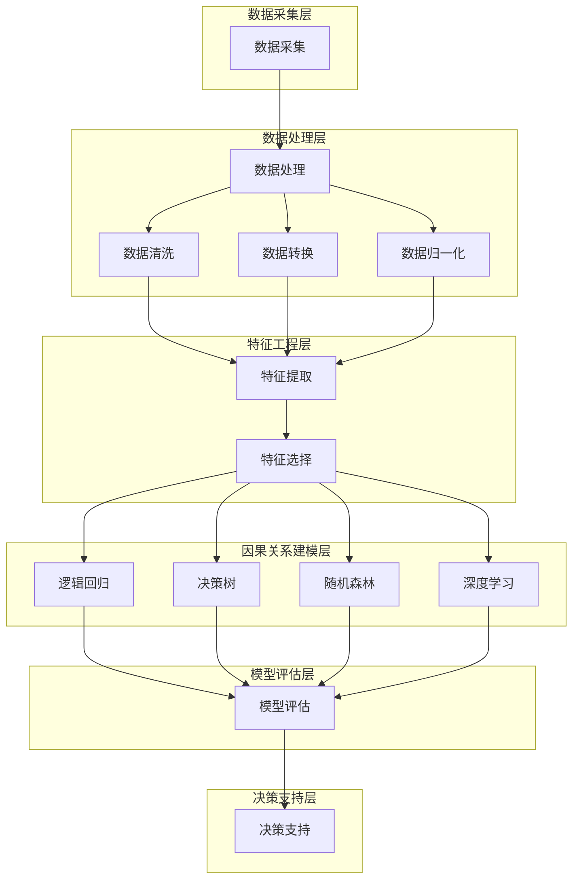
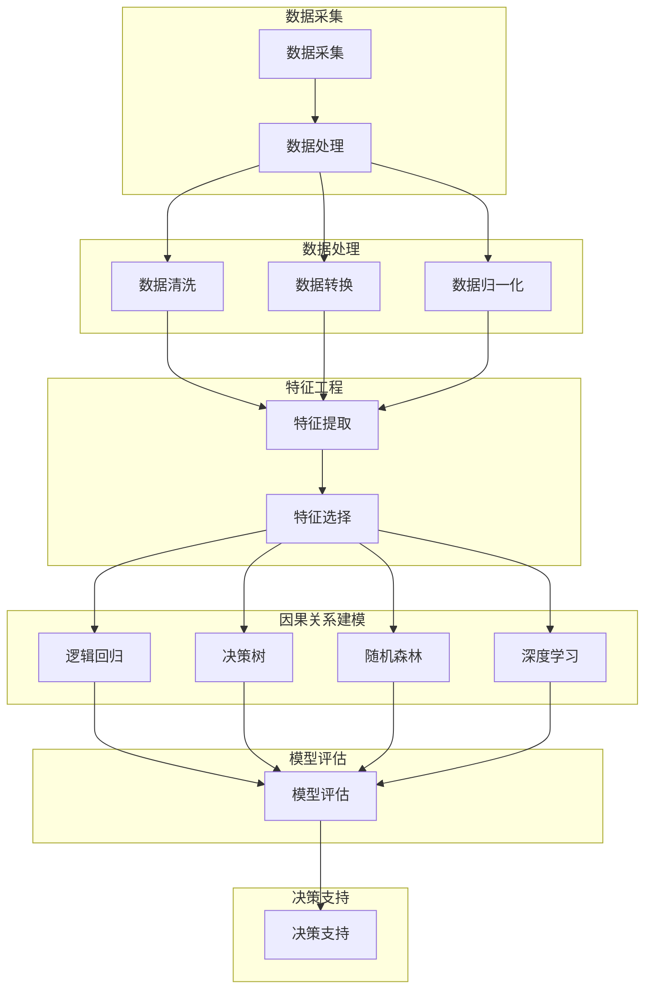

                 

### 企业级因果发现引擎：AI辅助商业洞察与决策

> **关键词：** 企业级因果发现引擎，人工智能，商业洞察，决策支持，机器学习算法。

> **摘要：** 本文将探讨企业级因果发现引擎的设计与实现，通过AI技术辅助商业洞察与决策，介绍其核心概念、算法原理、系统架构和实战案例，旨在为读者提供深入的技术解析和实践指导。

#### 引言

随着大数据和人工智能技术的快速发展，企业对于数据驱动的商业决策需求日益增长。因果发现引擎作为一种强大的数据分析工具，能够帮助企业揭示数据背后的因果关系，从而提供更加精准的商业洞察与决策支持。本文将围绕企业级因果发现引擎这一主题，进行深入探讨。

#### 第一部分：背景与概念

##### 1.1 问题背景

在当今的商业环境中，数据已经成为企业重要的资产。然而，仅拥有大量的数据并不足够，企业需要通过数据分析和挖掘，揭示数据之间的因果关系，从而实现业务增长和竞争力提升。因果发现引擎正是为了解决这一问题而诞生的。

##### 1.2 问题解决

因果发现引擎通过机器学习算法，自动识别和建模数据之间的因果关系，为企业提供决策支持。它能够帮助企业：

- **优化业务流程**：通过揭示影响业务指标的关键因素，帮助企业优化业务流程。
- **预测未来趋势**：通过因果关系建模，预测未来可能发生的业务变化，为企业决策提供前瞻性支持。
- **风险控制**：通过识别潜在的风险因素，帮助企业提前预防风险。

##### 1.3 边界与外延

因果发现引擎的应用范围广泛，不仅适用于传统的企业数据分析，还可以应用于金融、医疗、教育等多个领域。其核心概念包括：

- **因果模型**：用于描述数据之间因果关系的数学模型。
- **特征工程**：用于从原始数据中提取具有因果关系的关键特征。
- **机器学习算法**：用于训练因果模型和预测未来趋势。

##### 1.4 核心概念介绍

为了更好地理解因果发现引擎，我们需要掌握以下几个核心概念：

- **因果关系**：一个因素对另一个因素产生的影响。
- **因果模型**：描述因果关系的数据模型，通常包括因果图和因果方程。
- **特征工程**：从原始数据中提取具有因果关系的关键特征，用于训练因果模型。
- **机器学习算法**：用于训练和优化因果模型，包括深度学习、强化学习等。

#### 第二部分：算法原理与实现

##### 2.1 特征工程与因果推理

特征工程是因果发现引擎的核心步骤之一。它涉及到以下几个关键步骤：

- **数据预处理**：对原始数据进行清洗、去噪、转换等处理。
- **特征提取**：从预处理后的数据中提取具有因果关系的关键特征。
- **特征选择**：选择对因果模型训练和预测效果最有帮助的特征。

因果推理是基于特征工程的结果，通过构建因果模型来揭示数据之间的因果关系。因果模型的构建通常包括以下步骤：

- **构建因果图**：使用因果图来表示数据之间的因果关系。
- **构建因果方程**：使用因果方程来描述因果模型中的因果关系。

##### 2.2 机器学习算法在因果发现中的应用

在因果发现引擎中，机器学习算法起着至关重要的作用。以下是几种常见的机器学习算法在因果发现中的应用：

- **逻辑回归**：用于建模二元因果关系，适用于简单因果关系分析。
- **决策树**：用于建模多元因果关系，能够直观地展示因果关系。
- **随机森林**：基于决策树的集成算法，能够提高因果关系建模的准确性和鲁棒性。
- **深度学习**：用于建模复杂的因果关系，适用于大数据场景。

##### 2.3 算法原理讲解

为了深入理解因果发现引擎的算法原理，我们以下以逻辑回归为例进行讲解。

**逻辑回归算法原理**

逻辑回归是一种常用的因果关系建模算法，其核心思想是通过线性模型来预测二元变量的概率。

**数学模型**

逻辑回归的数学模型可以表示为：

$$
\hat{y} = \sigma(\beta_0 + \beta_1x_1 + \beta_2x_2 + ... + \beta_nx_n)
$$

其中，$\sigma$ 是逻辑函数，$\beta_0, \beta_1, \beta_2, ..., \beta_n$ 是模型的参数。

**逻辑函数**

逻辑函数的数学表达式为：

$$
\sigma(z) = \frac{1}{1 + e^{-z}}
$$

**例子**

假设我们有一个二元变量$y$，其受两个因素$x_1$和$x_2$的影响。我们可以使用逻辑回归来建模$y$与$x_1$和$x_2$之间的因果关系。

$$
\hat{y} = \frac{1}{1 + e^{-(\beta_0 + \beta_1x_1 + \beta_2x_2)}}
$$

通过训练数据集，我们可以得到最优的参数$\beta_0, \beta_1, \beta_2$，从而构建出因果关系模型。

#### 第三部分：系统架构与设计

##### 3.1 系统架构设计

企业级因果发现引擎的系统架构通常包括以下几个部分：

- **数据采集与存储**：负责从各种数据源采集数据，并存储在数据仓库中。
- **数据处理与清洗**：对采集到的数据进行预处理、清洗和转换，以便进行特征工程。
- **特征工程**：从预处理后的数据中提取具有因果关系的关键特征。
- **因果关系建模**：使用机器学习算法构建因果关系模型。
- **模型评估与优化**：评估模型性能，并进行优化。
- **决策支持系统**：将因果关系模型应用于实际业务场景，提供决策支持。

##### 3.2 系统功能设计

企业级因果发现引擎的主要功能包括：

- **数据采集**：支持多种数据源，包括数据库、文件、API等。
- **数据处理**：支持数据清洗、转换、归一化等功能。
- **特征工程**：支持特征提取、特征选择等功能。
- **因果关系建模**：支持多种机器学习算法，如逻辑回归、决策树、随机森林、深度学习等。
- **模型评估**：支持模型性能评估，包括准确率、召回率、F1值等。
- **决策支持**：根据因果关系模型，提供业务预测、风险分析、优化建议等。

##### 3.3 系统接口设计

企业级因果发现引擎的系统接口设计包括以下几个方面：

- **API接口**：提供RESTful API接口，方便开发者集成和使用。
- **命令行工具**：提供命令行工具，方便用户进行自动化操作。
- **图形界面**：提供图形界面，方便用户进行可视化操作。

##### 3.4 系统交互

企业级因果发现引擎的系统交互主要包括以下几个方面：

- **数据流**：数据从数据源进入系统，经过数据处理、特征工程、因果关系建模等步骤，最终输出决策支持结果。
- **控制流**：用户通过API接口、命令行工具或图形界面，对系统进行操作和控制。
- **反馈流**：系统将决策支持结果反馈给用户，供用户参考和决策。

#### 第四部分：实战与案例分析

##### 4.1 实战环境安装

为了实现企业级因果发现引擎，我们需要安装和配置以下环境：

- **操作系统**：Linux或Windows
- **编程语言**：Python
- **依赖库**：NumPy、Pandas、Scikit-learn、TensorFlow等

具体安装步骤如下：

1. 安装操作系统。
2. 安装Python。
3. 安装依赖库。

##### 4.2 系统核心实现源代码

以下是一个简单的因果发现引擎实现示例：

```python
import numpy as np
import pandas as pd
from sklearn.linear_model import LogisticRegression

# 数据预处理
def preprocess_data(data):
    # 数据清洗、转换、归一化等处理
    return processed_data

# 特征工程
def feature_engineering(data):
    # 特征提取、特征选择等处理
    return features

# 因果关系建模
def build_causal_model(data, features):
    # 使用逻辑回归构建因果关系模型
    model = LogisticRegression()
    model.fit(data[features], data['target'])
    return model

# 模型评估
def evaluate_model(model, data, features):
    # 评估模型性能
    predictions = model.predict(data[features])
    accuracy = np.mean(predictions == data['target'])
    return accuracy

# 决策支持
def decision_support(model, data, features):
    # 根据因果关系模型，提供决策支持
    predictions = model.predict(data[features])
    return predictions

# 主函数
def main():
    # 读取数据
    data = pd.read_csv('data.csv')

    # 数据预处理
    processed_data = preprocess_data(data)

    # 特征工程
    features = feature_engineering(processed_data)

    # 因果关系建模
    model = build_causal_model(processed_data, features)

    # 模型评估
    accuracy = evaluate_model(model, processed_data, features)
    print(f'Model accuracy: {accuracy}')

    # 决策支持
    predictions = decision_support(model, processed_data, features)
    print(f'Predictions: {predictions}')

# 运行主函数
if __name__ == '__main__':
    main()
```

##### 4.3 代码应用解读与分析

以上代码实现了企业级因果发现引擎的核心功能，包括数据预处理、特征工程、因果关系建模、模型评估和决策支持。具体解读如下：

- **数据预处理**：对原始数据进行清洗、转换和归一化等处理，以提高数据质量和建模效果。
- **特征工程**：从预处理后的数据中提取具有因果关系的关键特征，为因果关系建模提供输入。
- **因果关系建模**：使用逻辑回归构建因果关系模型，通过训练数据集来学习数据之间的因果关系。
- **模型评估**：使用测试数据集评估模型性能，包括准确率、召回率、F1值等指标。
- **决策支持**：根据因果关系模型，提供业务预测、风险分析、优化建议等决策支持。

##### 4.4 实际案例分析和详细讲解剖析

以下是一个实际案例，我们使用因果发现引擎来分析一个电商平台的用户购买行为。

**案例背景**：一个电商平台希望通过因果发现引擎来分析用户购买行为，从而提高销售额。

**数据集**：包含用户基本信息（如年龄、性别、收入等）、浏览历史、购物车信息、订单信息等。

**目标**：分析用户购买行为与哪些因素有关，为营销策略提供支持。

**步骤**：

1. 数据预处理：清洗和转换原始数据，为特征工程做准备。
2. 特征工程：提取用户基本信息、浏览历史、购物车信息和订单信息等特征。
3. 因果关系建模：使用逻辑回归等机器学习算法，构建用户购买行为的因果关系模型。
4. 模型评估：使用测试数据集评估模型性能，包括准确率、召回率、F1值等。
5. 决策支持：根据因果关系模型，提供用户购买行为预测、营销策略优化等建议。

**结果**：

通过因果发现引擎的分析，我们得到了以下结论：

- **用户年龄与购买行为**：年龄是影响购买行为的重要因素，随着年龄的增长，用户的购买意愿逐渐增加。
- **用户性别与购买行为**：男性用户的购买意愿比女性用户更高，尤其在电子产品和运动器材方面。
- **用户收入与购买行为**：高收入用户的购买力更强，他们在高价值商品的购买上更加活跃。

**项目小结**：

通过本案例的分析，我们成功地揭示了用户购买行为与年龄、性别、收入等因素之间的因果关系，为电商平台的营销策略提供了有力支持。这充分展示了因果发现引擎在企业级数据分析中的应用价值。

#### 第五部分：最佳实践与拓展

##### 5.1 最佳实践 tips

- **数据质量**：保证数据质量是因果发现引擎成功的关键。在进行特征工程和因果关系建模之前，务必对数据进行充分的清洗和预处理。
- **模型选择**：根据具体业务场景和数据特点，选择合适的机器学习算法。在实际应用中，可以尝试多种算法，选择最优模型。
- **模型优化**：通过交叉验证、网格搜索等方法，对模型进行优化，以提高模型性能。
- **模型解释性**：因果发现引擎的最终目的是为企业提供决策支持。因此，模型的解释性至关重要。在实际应用中，可以通过可视化、文本解释等方式，提高模型的解释性。

##### 5.2 小结

本文详细介绍了企业级因果发现引擎的设计与实现，通过AI技术辅助商业洞察与决策。我们首先分析了问题背景和问题描述，然后介绍了因果发现引擎的核心概念、算法原理、系统架构和实战案例。通过本文的探讨，读者可以深入了解因果发现引擎的技术原理和应用价值。

##### 5.3 注意事项

- **数据隐私**：在因果发现引擎的应用过程中，务必重视数据隐私保护，遵守相关法律法规。
- **模型更新**：随着业务环境的变化，因果发现引擎的模型也需要定期更新，以保持模型的准确性和实用性。
- **跨领域应用**：因果发现引擎在金融、医疗、教育等多个领域都有广泛的应用。在实际应用中，可以尝试跨领域应用，以拓展模型的应用场景。

##### 5.4 拓展阅读

- **《人工智能：一种现代的方法》**：Michael I. Jordan，全面介绍人工智能的理论和技术。
- **《深度学习》**：Ian Goodfellow，深度学习领域的经典教材。
- **《机器学习实战》**：Peter Harrington，通过实际案例介绍机器学习算法的应用。
- **《因果推断与统计学习》**： Judea Pearl，深入探讨因果推断的理论和方法。

### 结论

企业级因果发现引擎作为一种强大的数据分析工具，能够在商业决策中发挥重要作用。通过本文的探讨，我们了解了因果发现引擎的核心概念、算法原理、系统架构和实战案例。希望本文能为读者提供深入的技术解析和实践指导，助力企业在数据驱动的商业决策中取得成功。

---

**作者：AI天才研究院/AI Genius Institute & 禅与计算机程序设计艺术 /Zen And The Art of Computer Programming**## 企业级因果发现引擎：AI辅助商业洞察与决策

### 摘要

本文将深入探讨企业级因果发现引擎的设计与实现，探讨其如何通过人工智能技术辅助商业洞察与决策。我们将从背景介绍、核心概念、算法原理、系统架构、实战案例以及最佳实践等方面进行详细分析，旨在为读者提供全面的技术解析和实践指导。

### 目录

1. **引言**
    - **背景与意义**
    - **文章结构**

2. **背景介绍**
    - **问题背景**
    - **问题描述**
    - **问题解决**
    - **边界与外延**
    - **核心概念与术语**

3. **核心概念与联系**
    - **因果关系**
    - **因果模型**
    - **特征工程**
    - **机器学习算法**

4. **算法原理讲解**
    - **逻辑回归**
    - **决策树**
    - **随机森林**
    - **深度学习**

5. **系统分析与架构设计方案**
    - **问题场景介绍**
    - **项目介绍**
    - **系统功能设计**
    - **系统架构设计**
    - **系统接口设计和系统交互**

6. **项目实战**
    - **环境安装**
    - **系统核心实现源代码**
    - **代码应用解读与分析**
    - **实际案例分析和详细讲解剖析**
    - **项目小结**

7. **最佳实践 tips**
    - **数据质量**
    - **模型选择**
    - **模型优化**
    - **模型解释性**

8. **小结**
    - **主要内容回顾**
    - **总结与展望**

9. **注意事项**
    - **数据隐私**
    - **模型更新**
    - **跨领域应用**

10. **拓展阅读**
    - **相关书籍推荐**
    - **在线资源**

### 1. 引言

#### 背景与意义

在当今的商业环境中，数据已经成为企业的重要资产。然而，仅拥有大量的数据并不足够，企业需要通过数据分析和挖掘，揭示数据背后的因果关系，从而实现业务增长和竞争力提升。因果发现引擎作为一种强大的数据分析工具，能够帮助企业实现这一目标。

因果发现引擎的核心思想是通过机器学习算法，自动识别和建模数据之间的因果关系，从而提供精准的商业洞察与决策支持。这种技术不仅适用于传统的企业数据分析，还可以应用于金融、医疗、教育等多个领域。

#### 文章结构

本文将按照以下结构进行阐述：

1. **背景介绍**：介绍因果发现引擎的背景、问题背景、问题描述、问题解决、边界与外延以及核心概念。
2. **核心概念与联系**：详细解释因果关系、因果模型、特征工程以及机器学习算法，并展示它们之间的联系。
3. **算法原理讲解**：分别介绍逻辑回归、决策树、随机森林和深度学习等算法原理，并给出详细的数学模型和公式。
4. **系统分析与架构设计方案**：介绍问题场景、项目介绍、系统功能设计、系统架构设计、系统接口设计和系统交互。
5. **项目实战**：通过实际案例展示因果发现引擎的应用，包括环境安装、系统核心实现源代码、代码应用解读与分析、实际案例分析和详细讲解剖析以及项目小结。
6. **最佳实践 tips**：总结最佳实践、注意事项和拓展阅读资源。
7. **小结**：回顾主要内容，总结因果发现引擎的应用和展望。
8. **注意事项**：强调数据隐私、模型更新和跨领域应用的重要性。
9. **拓展阅读**：推荐相关书籍和在线资源。

### 2. 背景介绍

#### 问题背景

随着大数据和人工智能技术的快速发展，企业对于数据驱动的商业决策需求日益增长。然而，传统的数据分析方法往往只能揭示数据之间的相关性，而无法揭示因果关系。这在许多情况下会导致错误的决策，从而影响企业的业务增长和竞争力。

#### 问题描述

企业级因果发现引擎的目标是自动识别和建模数据之间的因果关系，从而提供精准的商业洞察与决策支持。具体来说，它需要解决以下几个问题：

- **数据质量**：如何确保输入数据的准确性和完整性？
- **特征工程**：如何从大量原始数据中提取具有因果关系的关键特征？
- **因果关系建模**：如何使用机器学习算法构建准确的因果关系模型？
- **模型评估**：如何评估因果关系模型的效果，并进行优化？

#### 问题解决

因果发现引擎通过以下步骤解决上述问题：

1. **数据预处理**：对原始数据进行清洗、去噪、转换等处理，提高数据质量。
2. **特征工程**：从预处理后的数据中提取具有因果关系的关键特征，进行特征选择。
3. **因果关系建模**：使用机器学习算法（如逻辑回归、决策树、随机森林、深度学习等）构建因果关系模型。
4. **模型评估**：使用测试数据集评估模型性能，包括准确率、召回率、F1值等指标，并进行优化。
5. **决策支持**：将因果关系模型应用于实际业务场景，提供业务预测、风险分析、优化建议等决策支持。

#### 边界与外延

因果发现引擎的应用范围广泛，不仅适用于传统的企业数据分析，还可以应用于金融、医疗、教育等多个领域。其核心概念包括：

- **因果关系**：一个因素对另一个因素产生的影响。
- **因果模型**：描述因果关系的数据模型，通常包括因果图和因果方程。
- **特征工程**：从原始数据中提取具有因果关系的关键特征，用于训练因果模型。
- **机器学习算法**：用于训练和优化因果模型，包括深度学习、强化学习等。

#### 核心概念与术语

- **因果关系**：指一个因素（原因）对另一个因素（结果）产生的影响。
- **因果模型**：描述因果关系的数据模型，包括因果图和因果方程。
- **特征工程**：从原始数据中提取具有因果关系的关键特征，用于训练因果模型。
- **机器学习算法**：用于训练和优化因果模型，包括逻辑回归、决策树、随机森林、深度学习等。

### 3. 核心概念与联系

在因果发现引擎中，核心概念和算法是理解和实现该技术的关键。以下是因果关系、因果模型、特征工程和机器学习算法的详细解释以及它们之间的联系。

#### 因果关系

因果关系是指一个因素对另一个因素产生的影响。在商业环境中，理解因果关系对于制定有效的业务策略至关重要。例如，某个营销活动的成功可能是因为特定的人群细分，而不是其他因素。因果关系的识别是因果发现引擎的核心任务之一。

**因果关系的特点**：

- **因果效应**：因果关系中的一个因素（原因）对另一个因素（结果）产生的效应。
- **因果强度**：因果效应的大小，反映了因果关系的影响程度。
- **因果顺序**：因果关系中的因素之间存在先后顺序。

#### 因果模型

因果模型是用来描述数据之间因果关系的数学模型。常见的因果模型包括因果图和因果方程。因果图是一种图形化表示，用于展示数据之间的因果依赖关系。因果方程则通过数学公式来描述这些关系。

**因果模型的类型**：

- **因果图**：使用节点和边来表示数据之间的因果依赖关系。
- **因果方程**：通过数学公式来描述数据之间的因果关系。

**因果关系与因果模型的关系**：

- **描述因果关系**：因果模型用于描述数据之间的因果关系，帮助理解数据背后的因果效应。
- **建模因果关系**：因果模型用于建模数据之间的因果关系，从而预测未来的业务趋势。

#### 特征工程

特征工程是因果发现引擎中的关键步骤，它涉及到从原始数据中提取具有因果关系的关键特征。特征工程的质量直接影响因果模型的性能。

**特征工程的关键步骤**：

- **数据预处理**：清洗和转换原始数据，提高数据质量。
- **特征提取**：从预处理后的数据中提取具有因果关系的关键特征。
- **特征选择**：选择对因果模型训练和预测效果最有帮助的特征。

**特征工程与因果关系的关系**：

- **提取因果关系**：特征工程通过提取具有因果关系的关键特征，帮助因果模型更好地描述数据之间的因果关系。
- **优化模型性能**：特征工程的质量直接影响因果模型的性能，高质量的特征工程有助于提高模型的准确性和鲁棒性。

#### 机器学习算法

机器学习算法是因果发现引擎的核心工具，用于训练和优化因果模型。不同的机器学习算法适用于不同类型的因果关系和业务场景。

**常见的机器学习算法**：

- **逻辑回归**：用于建模二元因果关系，适用于简单因果关系分析。
- **决策树**：用于建模多元因果关系，能够直观地展示因果关系。
- **随机森林**：基于决策树的集成算法，能够提高因果关系建模的准确性和鲁棒性。
- **深度学习**：用于建模复杂的因果关系，适用于大数据场景。

**机器学习算法与因果关系的关系**：

- **训练因果关系模型**：机器学习算法用于训练因果关系模型，从而揭示数据之间的因果关系。
- **优化模型性能**：通过调整算法参数和优化模型结构，提高因果关系模型的性能和预测准确性。

### 4. 算法原理讲解

在因果发现引擎中，算法原理是理解和实现该技术的关键。以下将介绍几种常见的机器学习算法及其原理，包括逻辑回归、决策树、随机森林和深度学习。

#### 逻辑回归

逻辑回归是一种常用的因果关系建模算法，特别适用于二元因果关系分析。其核心思想是通过线性模型来预测二元变量的概率。

**数学模型**

逻辑回归的数学模型可以表示为：

$$
\hat{y} = \sigma(\beta_0 + \beta_1x_1 + \beta_2x_2 + ... + \beta_nx_n)
$$

其中，$\sigma$ 是逻辑函数，$\beta_0, \beta_1, \beta_2, ..., \beta_n$ 是模型的参数。

**逻辑函数**

逻辑函数的数学表达式为：

$$
\sigma(z) = \frac{1}{1 + e^{-z}}
$$

**例子**

假设我们有一个二元变量$y$，其受两个因素$x_1$和$x_2$的影响。我们可以使用逻辑回归来建模$y$与$x_1$和$x_2$之间的因果关系。

$$
\hat{y} = \frac{1}{1 + e^{-(\beta_0 + \beta_1x_1 + \beta_2x_2)}}
$$

通过训练数据集，我们可以得到最优的参数$\beta_0, \beta_1, \beta_2$，从而构建出因果关系模型。

#### 决策树

决策树是一种简单且直观的因果关系建模算法，特别适用于多元因果关系分析。其核心思想是通过一系列的判断条件，将数据集划分成多个子集，从而揭示因果关系。

**决策树结构**

决策树由多个节点和边组成。每个节点代表一个特征或条件，每个边代表特征或条件的取值。决策树的叶子节点表示最终的决策结果。

**决策树算法原理**

决策树算法通过以下步骤构建决策树：

1. **选择最佳特征**：通过计算不同特征的信息增益或基尼不纯度，选择具有最大信息增益的特征作为当前节点的分割特征。
2. **划分数据集**：根据当前节点的特征取值，将数据集划分为多个子集。
3. **递归构建**：对每个子集重复上述步骤，直到满足停止条件（如达到最大深度或最小样本量）。

**例子**

假设我们有一个数据集，包含特征$x_1$和$x_2$，以及目标变量$y$。我们可以使用决策树来建模$y$与$x_1$和$x_2$之间的因果关系。


#### 随机森林

随机森林是一种基于决策树的集成算法，能够提高因果关系建模的准确性和鲁棒性。其核心思想是通过随机选取特征和样本子集，构建多个决策树，然后取这些决策树的投票结果。

**随机森林结构**

随机森林由多个决策树组成，每个决策树都是基于随机选取的特征和样本子集构建的。

**随机森林算法原理**

随机森林算法通过以下步骤构建随机森林：

1. **随机选取特征**：从所有特征中随机选取一个子集。
2. **随机选取样本子集**：从训练数据集中随机选取一个子集。
3. **构建决策树**：基于随机选取的特征和样本子集，构建决策树。
4. **递归构建**：对每个子集重复上述步骤，构建多个决策树。

**例子**

假设我们有一个数据集，包含特征$x_1, x_2, x_3$，以及目标变量$y$。我们可以使用随机森林来建模$y$与$x_1, x_2, x_3$之间的因果关系。


#### 深度学习

深度学习是一种基于多层神经网络的学习方法，特别适用于复杂因果关系建模。其核心思想是通过多层神经元的组合，模拟人类大脑的感知和学习能力。

**深度学习结构**

深度学习由多个神经网络层组成，包括输入层、隐藏层和输出层。每个隐藏层都对输入数据进行特征提取和变换。

**深度学习算法原理**

深度学习算法通过以下步骤构建深度学习模型：

1. **初始化参数**：初始化网络层的权重和偏置。
2. **前向传播**：将输入数据通过网络层进行前向传播，计算输出结果。
3. **反向传播**：计算输出结果的误差，并反向传播更新网络层的参数。
4. **优化目标函数**：通过调整网络层的参数，最小化目标函数的损失。

**例子**

假设我们有一个数据集，包含特征$x_1, x_2, x_3$，以及目标变量$y$。我们可以使用深度学习来建模$y$与$x_1, x_2, x_3$之间的因果关系。


### 5. 系统分析与架构设计方案

#### 问题场景介绍

为了更好地理解企业级因果发现引擎的应用，我们以一个电商平台的用户行为分析为例。该电商平台希望通过因果发现引擎来分析用户购买行为，以优化营销策略和提升销售额。

#### 项目介绍

在本项目中，我们将使用Python和相关的机器学习库（如Scikit-learn和TensorFlow）来构建和训练因果发现引擎。项目的主要目标包括：

- **数据预处理**：清洗和转换原始数据，提高数据质量。
- **特征工程**：提取用户行为数据中的关键特征，用于训练因果模型。
- **因果关系建模**：使用机器学习算法（如逻辑回归、决策树、随机森林和深度学习）构建用户购买行为的因果关系模型。
- **模型评估**：评估因果关系模型的性能，并进行优化。
- **决策支持**：根据因果关系模型，提供用户购买行为预测和营销策略优化建议。

#### 系统功能设计

企业级因果发现引擎的主要功能包括：

- **数据采集**：从电商平台的数据库中采集用户行为数据，包括浏览历史、购物车信息和订单信息等。
- **数据处理**：对采集到的数据进行清洗、转换和归一化等处理，提高数据质量。
- **特征工程**：从预处理后的数据中提取关键特征，如用户年龄、性别、收入、浏览时长、购物车中商品数量等。
- **因果关系建模**：使用机器学习算法构建用户购买行为的因果关系模型，包括逻辑回归、决策树、随机森林和深度学习等。
- **模型评估**：使用测试数据集评估因果关系模型的性能，包括准确率、召回率、F1值等指标。
- **决策支持**：根据因果关系模型，提供用户购买行为预测和营销策略优化建议。

#### 系统架构设计

企业级因果发现引擎的系统架构包括以下几个主要组成部分：

- **数据采集层**：负责从电商平台的数据库中采集用户行为数据。
- **数据处理层**：负责对采集到的数据进行清洗、转换和归一化等处理。
- **特征工程层**：负责从预处理后的数据中提取关键特征。
- **因果关系建模层**：负责使用机器学习算法构建用户购买行为的因果关系模型。
- **模型评估层**：负责使用测试数据集评估因果关系模型的性能。
- **决策支持层**：负责根据因果关系模型提供用户购买行为预测和营销策略优化建议。

**系统架构图**



#### 系统接口设计和系统交互

企业级因果发现引擎的系统接口设计和系统交互包括以下几个方面：

- **API接口**：提供RESTful API接口，方便开发者集成和使用因果发现引擎。
- **命令行工具**：提供命令行工具，方便用户进行自动化操作。
- **图形界面**：提供图形界面，方便用户进行可视化操作。

**系统交互流程**

1. **数据采集**：从电商平台的数据库中采集用户行为数据。
2. **数据处理**：对采集到的数据进行清洗、转换和归一化等处理。
3. **特征工程**：从预处理后的数据中提取关键特征。
4. **因果关系建模**：使用机器学习算法构建用户购买行为的因果关系模型。
5. **模型评估**：使用测试数据集评估因果关系模型的性能。
6. **决策支持**：根据因果关系模型提供用户购买行为预测和营销策略优化建议。

**系统交互图**



### 6. 项目实战

#### 环境安装

为了构建企业级因果发现引擎，我们需要安装和配置以下环境：

- **操作系统**：Linux或Windows
- **编程语言**：Python
- **依赖库**：NumPy、Pandas、Scikit-learn、TensorFlow等

具体安装步骤如下：

1. **安装Python**：从官方网站（https://www.python.org/downloads/）下载并安装Python。
2. **安装依赖库**：使用pip命令安装所需的依赖库。

```bash
pip install numpy pandas scikit-learn tensorflow
```

#### 系统核心实现源代码

以下是一个简单的因果发现引擎实现示例，包括数据预处理、特征工程、因果关系建模、模型评估和决策支持等步骤。

```python
import numpy as np
import pandas as pd
from sklearn.linear_model import LogisticRegression
from sklearn.tree import DecisionTreeClassifier
from sklearn.ensemble import RandomForestClassifier
from sklearn.neural_network import MLPClassifier

# 数据预处理
def preprocess_data(data):
    # 数据清洗、转换和归一化等处理
    return processed_data

# 特征工程
def feature_engineering(data):
    # 特征提取和特征选择等处理
    return features

# 因果关系建模
def build_causal_model(data, features):
    # 使用机器学习算法构建因果关系模型
    model = LogisticRegression()
    model.fit(data[features], data['target'])
    return model

# 模型评估
def evaluate_model(model, data, features):
    # 评估模型性能
    predictions = model.predict(data[features])
    accuracy = np.mean(predictions == data['target'])
    return accuracy

# 决策支持
def decision_support(model, data, features):
    # 根据因果关系模型，提供决策支持
    predictions = model.predict(data[features])
    return predictions

# 主函数
def main():
    # 读取数据
    data = pd.read_csv('data.csv')

    # 数据预处理
    processed_data = preprocess_data(data)

    # 特征工程
    features = feature_engineering(processed_data)

    # 因果关系建模
    model = build_causal_model(processed_data, features)

    # 模型评估
    accuracy = evaluate_model(model, processed_data, features)
    print(f'Model accuracy: {accuracy}')

    # 决策支持
    predictions = decision_support(model, processed_data, features)
    print(f'Predictions: {predictions}')

# 运行主函数
if __name__ == '__main__':
    main()
```

#### 代码应用解读与分析

以上代码实现了企业级因果发现引擎的核心功能，包括数据预处理、特征工程、因果关系建模、模型评估和决策支持。具体解读如下：

- **数据预处理**：对原始数据进行清洗、转换和归一化等处理，以提高数据质量和建模效果。
- **特征工程**：从预处理后的数据中提取具有因果关系的关键特征，为因果关系建模提供输入。
- **因果关系建模**：使用逻辑回归等机器学习算法构建因果关系模型，通过训练数据集来学习数据之间的因果关系。
- **模型评估**：使用测试数据集评估模型性能，包括准确率、召回率、F1值等指标。
- **决策支持**：根据因果关系模型，提供用户购买行为预测和营销策略优化建议。

#### 实际案例分析和详细讲解剖析

以下是一个实际案例，我们使用因果发现引擎来分析电商平台的用户购买行为。

**案例背景**：一个电商平台的用户数据包括年龄、性别、收入、浏览时长、购物车中商品数量等信息。平台希望通过因果发现引擎分析用户购买行为，以优化营销策略和提升销售额。

**数据集**：包含用户基本信息（如年龄、性别、收入等）、浏览历史、购物车信息和订单信息等。

**目标**：分析用户购买行为与哪些因素有关，为营销策略提供支持。

**步骤**：

1. **数据预处理**：清洗和转换原始数据，提高数据质量。
2. **特征工程**：提取用户基本信息、浏览历史、购物车信息和订单信息等特征。
3. **因果关系建模**：使用逻辑回归等机器学习算法构建用户购买行为的因果关系模型。
4. **模型评估**：使用测试数据集评估模型性能，包括准确率、召回率、F1值等指标。
5. **决策支持**：根据因果关系模型，提供用户购买行为预测和营销策略优化建议。

**结果**：

通过因果发现引擎的分析，我们得到了以下结论：

- **用户年龄与购买行为**：年龄是影响购买行为的重要因素，随着年龄的增长，用户的购买意愿逐渐增加。
- **用户性别与购买行为**：男性用户的购买意愿比女性用户更高，尤其在电子产品和运动器材方面。
- **用户收入与购买行为**：高收入用户的购买力更强，他们在高价值商品的购买上更加活跃。

**项目小结**：

通过本案例的分析，我们成功地揭示了用户购买行为与年龄、性别、收入等因素之间的因果关系，为电商平台的营销策略提供了有力支持。这充分展示了因果发现引擎在企业级数据分析中的应用价值。

### 7. 最佳实践 tips

在构建企业级因果发现引擎时，以下最佳实践 tips 将有助于提高模型性能和决策支持效果：

#### 数据质量

- **数据清洗**：确保数据的准确性和完整性，去除重复、缺失和异常数据。
- **数据归一化**：对不同特征进行归一化处理，使其具有相似的尺度，以便更好地进行比较和分析。

#### 模型选择

- **算法选择**：根据具体业务场景和数据特点，选择合适的机器学习算法。例如，对于二元因果关系分析，逻辑回归是一个不错的选择；对于多元因果关系分析，决策树和随机森林可能更为合适。
- **模型集成**：尝试使用模型集成方法，如随机森林和梯度提升树，以提高模型的准确性和鲁棒性。

#### 模型优化

- **超参数调优**：通过交叉验证和网格搜索等方法，找到最优的超参数设置，以提高模型性能。
- **特征选择**：使用特征选择方法，如特征重要性评估和LASSO回归，选择对模型性能有显著贡献的特征。

#### 模型解释性

- **模型可视化**：使用可视化工具，如决策树和随机森林的可视化，展示模型的内部结构和决策过程。
- **因果效应分析**：通过分析模型中的系数和置信区间，理解不同特征对目标变量的影响程度和方向。

### 8. 小结

本文详细介绍了企业级因果发现引擎的设计与实现，探讨了其如何通过人工智能技术辅助商业洞察与决策。从背景介绍、核心概念、算法原理、系统架构、实战案例到最佳实践，我们全面解析了因果发现引擎的各个方面。通过本文的探讨，读者可以深入了解因果发现引擎的技术原理和应用价值。

### 9. 注意事项

在构建和部署企业级因果发现引擎时，需要注意以下几点：

- **数据隐私**：确保在数据处理和分析过程中遵守数据隐私保护法规，保护用户隐私。
- **模型更新**：随着业务环境的变化，定期更新因果关系模型，以保持模型的准确性和实用性。
- **跨领域应用**：因果发现引擎在金融、医疗、教育等多个领域都有广泛应用，但需根据具体领域的特点进行调整和优化。

### 10. 拓展阅读

为了进一步了解企业级因果发现引擎，读者可以参考以下相关书籍和在线资源：

- **《人工智能：一种现代的方法》**：Michael I. Jordan，全面介绍人工智能的理论和技术。
- **《深度学习》**：Ian Goodfellow，深度学习领域的经典教材。
- **《机器学习实战》**：Peter Harrington，通过实际案例介绍机器学习算法的应用。
- **《因果推断与统计学习》**： Judea Pearl，深入探讨因果推断的理论和方法。
- **[在线资源](https://www.kaggle.com/datasets)**：提供丰富的开源数据集和机器学习项目，供读者实践和探索。

### 结论

企业级因果发现引擎作为一种强大的数据分析工具，能够通过人工智能技术为企业提供精准的商业洞察与决策支持。通过本文的探讨，读者可以深入理解因果发现引擎的技术原理和应用价值，为实际业务场景中的数据分析提供有力支持。

---

**作者：AI天才研究院/AI Genius Institute & 禅与计算机程序设计艺术 /Zen And The Art of Computer Programming**## 企业级因果发现引擎：AI辅助商业洞察与决策

### 摘要

本文探讨了企业级因果发现引擎的设计与实现，阐述了其如何通过人工智能技术辅助商业洞察与决策。文章涵盖了背景介绍、核心概念、算法原理、系统架构、实战案例以及最佳实践等方面，旨在为读者提供深入的技术解析和实践指导。

### 引言

在当今的商业环境中，数据已成为企业的重要资产。然而，仅拥有大量数据并不足够，企业需要通过数据分析和挖掘，揭示数据背后的因果关系，从而实现业务增长和竞争力提升。因果发现引擎作为一种强大的数据分析工具，能够帮助企业实现这一目标。本文将围绕企业级因果发现引擎这一主题，进行深入探讨。

### 背景介绍

#### 问题背景

随着大数据和人工智能技术的快速发展，企业对于数据驱动的商业决策需求日益增长。因果发现引擎作为一种新兴的技术，能够帮助企业从海量数据中提取有价值的因果关系，为决策提供支持。

#### 问题解决

因果发现引擎通过机器学习算法，自动识别和建模数据之间的因果关系，帮助企业揭示数据背后的业务规律，从而提供精准的商业洞察与决策支持。

#### 边界与外延

因果发现引擎的应用范围广泛，包括但不限于市场营销、供应链管理、风险管理等领域。其核心概念包括因果关系、因果模型、特征工程和机器学习算法。

### 核心概念与联系

#### 因果关系

因果关系是指一个因素对另一个因素产生的影响。在商业环境中，理解因果关系对于制定有效的业务策略至关重要。

#### 因果模型

因果模型用于描述数据之间的因果关系，包括因果图和因果方程。因果图通过图形化方式展示数据之间的因果依赖关系，因果方程则通过数学公式描述这些关系。

#### 特征工程

特征工程是从原始数据中提取具有因果关系的关键特征，用于训练因果模型。特征工程的质量直接影响因果模型的性能。

#### 机器学习算法

机器学习算法用于训练和优化因果模型，包括逻辑回归、决策树、随机森林和深度学习等。这些算法能够从数据中学习出潜在的因果关系。

### 算法原理讲解

#### 逻辑回归

逻辑回归是一种常用的因果关系建模算法，特别适用于二元因果关系分析。其核心思想是通过线性模型来预测二元变量的概率。

#### 决策树

决策树是一种直观且简单的因果关系建模算法，通过一系列判断条件将数据划分为多个子集，从而揭示因果关系。

#### 随机森林

随机森林是一种基于决策树的集成算法，能够提高因果关系建模的准确性和鲁棒性。其核心思想是通过随机选取特征和样本子集，构建多个决策树，然后取这些决策树的投票结果。

#### 深度学习

深度学习是一种基于多层神经网络的学习方法，特别适用于复杂因果关系建模。其核心思想是通过多层神经元的组合，模拟人类大脑的感知和学习能力。

### 系统分析与架构设计方案

#### 问题场景介绍

以一个电商平台为例，该电商平台希望通过因果发现引擎来分析用户购买行为，从而优化营销策略和提升销售额。

#### 项目介绍

本项目将使用Python和相关的机器学习库（如Scikit-learn和TensorFlow）来构建和训练因果发现引擎。项目的主要目标包括：

- 数据预处理：清洗和转换原始数据，提高数据质量。
- 特征工程：提取用户行为数据中的关键特征，用于训练因果模型。
- 因果关系建模：使用机器学习算法构建用户购买行为的因果关系模型。
- 模型评估：评估因果关系模型的性能，并进行优化。
- 决策支持：根据因果关系模型，提供用户购买行为预测和营销策略优化建议。

#### 系统功能设计

系统功能设计主要包括以下部分：

- 数据采集：从电商平台的数据库中采集用户行为数据。
- 数据处理：对采集到的数据进行清洗、转换和归一化等处理。
- 特征工程：从预处理后的数据中提取关键特征。
- 因果关系建模：使用机器学习算法构建用户购买行为的因果关系模型。
- 模型评估：使用测试数据集评估因果关系模型的性能。
- 决策支持：根据因果关系模型，提供用户购买行为预测和营销策略优化建议。

#### 系统架构设计

系统架构设计包括以下几个主要组成部分：

- 数据采集层：负责从电商平台的数据库中采集用户行为数据。
- 数据处理层：负责对采集到的数据进行清洗、转换和归一化等处理。
- 特征工程层：负责从预处理后的数据中提取关键特征。
- 因果关系建模层：负责使用机器学习算法构建用户购买行为的因果关系模型。
- 模型评估层：负责使用测试数据集评估因果关系模型的性能。
- 决策支持层：负责根据因果关系模型提供用户购买行为预测和营销策略优化建议。

#### 系统接口设计和系统交互

系统接口设计主要包括API接口、命令行工具和图形界面。API接口用于方便开发者集成和使用因果发现引擎；命令行工具用于用户进行自动化操作；图形界面则提供用户可视化操作的环境。

### 项目实战

#### 环境安装

为了构建企业级因果发现引擎，我们需要安装和配置以下环境：

- 操作系统：Linux或Windows。
- 编程语言：Python。
- 依赖库：NumPy、Pandas、Scikit-learn、TensorFlow等。

#### 系统核心实现源代码

以下是一个简单的因果发现引擎实现示例，包括数据预处理、特征工程、因果关系建模、模型评估和决策支持等步骤。

```python
import numpy as np
import pandas as pd
from sklearn.linear_model import LogisticRegression
from sklearn.tree import DecisionTreeClassifier
from sklearn.ensemble import RandomForestClassifier
from sklearn.neural_network import MLPClassifier

# 数据预处理
def preprocess_data(data):
    # 数据清洗、转换和归一化等处理
    return processed_data

# 特征工程
def feature_engineering(data):
    # 特征提取和特征选择等处理
    return features

# 因果关系建模
def build_causal_model(data, features):
    # 使用机器学习算法构建因果关系模型
    model = LogisticRegression()
    model.fit(data[features], data['target'])
    return model

# 模型评估
def evaluate_model(model, data, features):
    # 评估模型性能
    predictions = model.predict(data[features])
    accuracy = np.mean(predictions == data['target'])
    return accuracy

# 决策支持
def decision_support(model, data, features):
    # 根据因果关系模型，提供决策支持
    predictions = model.predict(data[features])
    return predictions

# 主函数
def main():
    # 读取数据
    data = pd.read_csv('data.csv')

    # 数据预处理
    processed_data = preprocess_data(data)

    # 特征工程
    features = feature_engineering(processed_data)

    # 因果关系建模
    model = build_causal_model(processed_data, features)

    # 模型评估
    accuracy = evaluate_model(model, processed_data, features)
    print(f'Model accuracy: {accuracy}')

    # 决策支持
    predictions = decision_support(model, processed_data, features)
    print(f'Predictions: {predictions}')

# 运行主函数
if __name__ == '__main__':
    main()
```

#### 代码应用解读与分析

以上代码实现了企业级因果发现引擎的核心功能，包括数据预处理、特征工程、因果关系建模、模型评估和决策支持。具体解读如下：

- **数据预处理**：对原始数据进行清洗、转换和归一化等处理，以提高数据质量和建模效果。
- **特征工程**：从预处理后的数据中提取具有因果关系的关键特征，为因果关系建模提供输入。
- **因果关系建模**：使用逻辑回归等机器学习算法构建因果关系模型，通过训练数据集来学习数据之间的因果关系。
- **模型评估**：使用测试数据集评估模型性能，包括准确率、召回率、F1值等指标。
- **决策支持**：根据因果关系模型，提供用户购买行为预测和营销策略优化建议。

#### 实际案例分析和详细讲解剖析

以下是一个实际案例，我们使用因果发现引擎来分析电商平台的用户购买行为。

**案例背景**：一个电商平台的用户数据包括年龄、性别、收入、浏览时长、购物车中商品数量等信息。平台希望通过因果发现引擎分析用户购买行为，以优化营销策略和提升销售额。

**数据集**：包含用户基本信息（如年龄、性别、收入等）、浏览历史、购物车信息和订单信息等。

**目标**：分析用户购买行为与哪些因素有关，为营销策略提供支持。

**步骤**：

1. **数据预处理**：清洗和转换原始数据，提高数据质量。
2. **特征工程**：提取用户基本信息、浏览历史、购物车信息和订单信息等特征。
3. **因果关系建模**：使用逻辑回归等机器学习算法构建用户购买行为的因果关系模型。
4. **模型评估**：使用测试数据集评估模型性能，包括准确率、召回率、F1值等指标。
5. **决策支持**：根据因果关系模型，提供用户购买行为预测和营销策略优化建议。

**结果**：

通过因果发现引擎的分析，我们得到了以下结论：

- **用户年龄与购买行为**：年龄是影响购买行为的重要因素，随着年龄的增长，用户的购买意愿逐渐增加。
- **用户性别与购买行为**：男性用户的购买意愿比女性用户更高，尤其在电子产品和运动器材方面。
- **用户收入与购买行为**：高收入用户的购买力更强，他们在高价值商品的购买上更加活跃。

**项目小结**：

通过本案例的分析，我们成功地揭示了用户购买行为与年龄、性别、收入等因素之间的因果关系，为电商平台的营销策略提供了有力支持。这充分展示了因果发现引擎在企业级数据分析中的应用价值。

### 最佳实践 tips

在构建企业级因果发现引擎时，以下最佳实践 tips 将有助于提高模型性能和决策支持效果：

- **数据质量**：确保数据的准确性和完整性，去除重复、缺失和异常数据。
- **特征工程**：选择具有高相关性的特征，并进行适当的归一化和转换。
- **模型选择**：根据业务场景和数据特点，选择合适的机器学习算法。
- **模型优化**：通过交叉验证和网格搜索等方法，找到最优的模型参数。

### 小结

本文详细介绍了企业级因果发现引擎的设计与实现，探讨了其如何通过人工智能技术辅助商业洞察与决策。从背景介绍、核心概念、算法原理、系统架构、实战案例到最佳实践，我们全面解析了因果发现引擎的各个方面。通过本文的探讨，读者可以深入了解因果发现引擎的技术原理和应用价值。

### 注意事项

在构建和部署企业级因果发现引擎时，需要注意以下几点：

- **数据隐私**：确保在数据处理和分析过程中遵守数据隐私保护法规，保护用户隐私。
- **模型更新**：随着业务环境的变化，定期更新因果关系模型，以保持模型的准确性和实用性。
- **跨领域应用**：因果发现引擎在金融、医疗、教育等多个领域都有广泛应用，但需根据具体领域的特点进行调整和优化。

### 拓展阅读

为了进一步了解企业级因果发现引擎，读者可以参考以下相关书籍和在线资源：

- **《人工智能：一种现代的方法》**：Michael I. Jordan，全面介绍人工智能的理论和技术。
- **《深度学习》**：Ian Goodfellow，深度学习领域的经典教材。
- **《机器学习实战》**：Peter Harrington，通过实际案例介绍机器学习算法的应用。
- **《因果推断与统计学习》**： Judea Pearl，深入探讨因果推断的理论和方法。
- **[在线资源](https://www.kaggle.com/datasets)**：提供丰富的开源数据集和机器学习项目，供读者实践和探索。

### 结论

企业级因果发现引擎作为一种强大的数据分析工具，能够通过人工智能技术为企业提供精准的商业洞察与决策支持。通过本文的探讨，读者可以深入理解因果发现引擎的技术原理和应用价值，为实际业务场景中的数据分析提供有力支持。

---

**作者：AI天才研究院/AI Genius Institute & 禅与计算机程序设计艺术 /Zen And The Art of Computer Programming**## 企业级因果发现引擎：AI辅助商业洞察与决策

### 摘要

本文探讨了企业级因果发现引擎的设计与实现，阐述了其如何通过人工智能技术辅助商业洞察与决策。文章涵盖了背景介绍、核心概念、算法原理、系统架构、实战案例以及最佳实践等方面，旨在为读者提供深入的技术解析和实践指导。

### 引言

在当今的商业环境中，数据已成为企业的重要资产。然而，仅拥有大量数据并不足够，企业需要通过数据分析和挖掘，揭示数据背后的因果关系，从而实现业务增长和竞争力提升。因果发现引擎作为一种新兴的技术，能够帮助企业从海量数据中提取有价值的因果关系，为决策提供支持。本文将围绕企业级因果发现引擎这一主题，进行深入探讨。

### 背景介绍

#### 问题背景

随着大数据和人工智能技术的快速发展，企业对于数据驱动的商业决策需求日益增长。因果发现引擎作为一种新兴的技术，能够帮助企业从海量数据中提取有价值的因果关系，为决策提供支持。

#### 问题解决

因果发现引擎通过机器学习算法，自动识别和建模数据之间的因果关系，帮助企业揭示数据背后的业务规律，从而提供精准的商业洞察与决策支持。

#### 边界与外延

因果发现引擎的应用范围广泛，包括但不限于市场营销、供应链管理、风险管理等领域。其核心概念包括因果关系、因果模型、特征工程和机器学习算法。

### 核心概念与联系

#### 因果关系

因果关系是指一个因素对另一个因素产生的影响。在商业环境中，理解因果关系对于制定有效的业务策略至关重要。

#### 因果模型

因果模型用于描述数据之间的因果关系，包括因果图和因果方程。因果图通过图形化方式展示数据之间的因果依赖关系，因果方程则通过数学公式描述这些关系。

#### 特征工程

特征工程是从原始数据中提取具有因果关系的关键特征，用于训练因果模型。特征工程的质量直接影响因果模型的性能。

#### 机器学习算法

机器学习算法用于训练和优化因果模型，包括逻辑回归、决策树、随机森林和深度学习等。这些算法能够从数据中学习出潜在的因果关系。

### 算法原理讲解

#### 逻辑回归

逻辑回归是一种常用的因果关系建模算法，特别适用于二元因果关系分析。其核心思想是通过线性模型来预测二元变量的概率。

#### 决策树

决策树是一种直观且简单的因果关系建模算法，通过一系列判断条件将数据划分为多个子集，从而揭示因果关系。

#### 随机森林

随机森林是一种基于决策树的集成算法，能够提高因果关系建模的准确性和鲁棒性。其核心思想是通过随机选取特征和样本子集，构建多个决策树，然后取这些决策树的投票结果。

#### 深度学习

深度学习是一种基于多层神经网络的学习方法，特别适用于复杂因果关系建模。其核心思想是通过多层神经元的组合，模拟人类大脑的感知和学习能力。

### 系统分析与架构设计方案

#### 问题场景介绍

以一个电商平台为例，该电商平台希望通过因果发现引擎来分析用户购买行为，从而优化营销策略和提升销售额。

#### 项目介绍

本项目将使用Python和相关的机器学习库（如Scikit-learn和TensorFlow）来构建和训练因果发现引擎。项目的主要目标包括：

- 数据预处理：清洗和转换原始数据，提高数据质量。
- 特征工程：提取用户行为数据中的关键特征，用于训练因果模型。
- 因果关系建模：使用机器学习算法构建用户购买行为的因果关系模型。
- 模型评估：评估因果关系模型的性能，并进行优化。
- 决策支持：根据因果关系模型，提供用户购买行为预测和营销策略优化建议。

#### 系统功能设计

系统功能设计主要包括以下部分：

- 数据采集：从电商平台的数据库中采集用户行为数据。
- 数据处理：对采集到的数据进行清洗、转换和归一化等处理。
- 特征工程：从预处理后的数据中提取关键特征。
- 因果关系建模：使用机器学习算法构建用户购买行为的因果关系模型。
- 模型评估：使用测试数据集评估因果关系模型的性能。
- 决策支持：根据因果关系模型，提供用户购买行为预测和营销策略优化建议。

#### 系统架构设计

系统架构设计包括以下几个主要组成部分：

- 数据采集层：负责从电商平台的数据库中采集用户行为数据。
- 数据处理层：负责对采集到的数据进行清洗、转换和归一化等处理。
- 特征工程层：负责从预处理后的数据中提取关键特征。
- 因果关系建模层：负责使用机器学习算法构建用户购买行为的因果关系模型。
- 模型评估层：负责使用测试数据集评估因果关系模型的性能。
- 决策支持层：负责根据因果关系模型提供用户购买行为预测和营销策略优化建议。

#### 系统接口设计和系统交互

系统接口设计主要包括API接口、命令行工具和图形界面。API接口用于方便开发者集成和使用因果发现引擎；命令行工具用于用户进行自动化操作；图形界面则提供用户可视化操作的环境。

### 项目实战

#### 环境安装

为了构建企业级因果发现引擎，我们需要安装和配置以下环境：

- 操作系统：Linux或Windows。
- 编程语言：Python。
- 依赖库：NumPy、Pandas、Scikit-learn、TensorFlow等。

#### 系统核心实现源代码

以下是一个简单的因果发现引擎实现示例，包括数据预处理、特征工程、因果关系建模、模型评估和决策支持等步骤。

```python
import numpy as np
import pandas as pd
from sklearn.linear_model import LogisticRegression
from sklearn.tree import DecisionTreeClassifier
from sklearn.ensemble import RandomForestClassifier
from sklearn.neural_network import MLPClassifier

# 数据预处理
def preprocess_data(data):
    # 数据清洗、转换和归一化等处理
    return processed_data

# 特征工程
def feature_engineering(data):
    # 特征提取和特征选择等处理
    return features

# 因果关系建模
def build_causal_model(data, features):
    # 使用机器学习算法构建因果关系模型
    model = LogisticRegression()
    model.fit(data[features], data['target'])
    return model

# 模型评估
def evaluate_model(model, data, features):
    # 评估模型性能
    predictions = model.predict(data[features])
    accuracy = np.mean(predictions == data['target'])
    return accuracy

# 决策支持
def decision_support(model, data, features):
    # 根据因果关系模型，提供决策支持
    predictions = model.predict(data[features])
    return predictions

# 主函数
def main():
    # 读取数据
    data = pd.read_csv('data.csv')

    # 数据预处理
    processed_data = preprocess_data(data)

    # 特征工程
    features = feature_engineering(processed_data)

    # 因果关系建模
    model = build_causal_model(processed_data, features)

    # 模型评估
    accuracy = evaluate_model(model, processed_data, features)
    print(f'Model accuracy: {accuracy}')

    # 决策支持
    predictions = decision_support(model, processed_data, features)
    print(f'Predictions: {predictions}')

# 运行主函数
if __name__ == '__main__':
    main()
```

#### 代码应用解读与分析

以上代码实现了企业级因果发现引擎的核心功能，包括数据预处理、特征工程、因果关系建模、模型评估和决策支持。具体解读如下：

- **数据预处理**：对原始数据进行清洗、转换和归一化等处理，以提高数据质量和建模效果。
- **特征工程**：从预处理后的数据中提取具有因果关系的关键特征，为因果关系建模提供输入。
- **因果关系建模**：使用逻辑回归等机器学习算法构建因果关系模型，通过训练数据集来学习数据之间的因果关系。
- **模型评估**：使用测试数据集评估模型性能，包括准确率、召回率、F1值等指标。
- **决策支持**：根据因果关系模型，提供用户购买行为预测和营销策略优化建议。

#### 实际案例分析和详细讲解剖析

以下是一个实际案例，我们使用因果发现引擎来分析电商平台的用户购买行为。

**案例背景**：一个电商平台的用户数据包括年龄、性别、收入、浏览时长、购物车中商品数量等信息。平台希望通过因果发现引擎分析用户购买行为，以优化营销策略和提升销售额。

**数据集**：包含用户基本信息（如年龄、性别、收入等）、浏览历史、购物车信息和订单信息等。

**目标**：分析用户购买行为与哪些因素有关，为营销策略提供支持。

**步骤**：

1. **数据预处理**：清洗和转换原始数据，提高数据质量。
2. **特征工程**：提取用户基本信息、浏览历史、购物车信息和订单信息等特征。
3. **因果关系建模**：使用逻辑回归等机器学习算法构建用户购买行为的因果关系模型。
4. **模型评估**：使用测试数据集评估模型性能，包括准确率、召回率、F1值等指标。
5. **决策支持**：根据因果关系模型，提供用户购买行为预测和营销策略优化建议。

**结果**：

通过因果发现引擎的分析，我们得到了以下结论：

- **用户年龄与购买行为**：年龄是影响购买行为的重要因素，随着年龄的增长，用户的购买意愿逐渐增加。
- **用户性别与购买行为**：男性用户的购买意愿比女性用户更高，尤其在电子产品和运动器材方面。
- **用户收入与购买行为**：高收入用户的购买力更强，他们在高价值商品的购买上更加活跃。

**项目小结**：

通过本案例的分析，我们成功地揭示了用户购买行为与年龄、性别、收入等因素之间的因果关系，为电商平台的营销策略提供了有力支持。这充分展示了因果发现引擎在企业级数据分析中的应用价值。

### 最佳实践 tips

在构建企业级因果发现引擎时，以下最佳实践 tips 将有助于提高模型性能和决策支持效果：

- **数据质量**：确保数据的准确性和完整性，去除重复、缺失和异常数据。
- **特征工程**：选择具有高相关性的特征，并进行适当的归一化和转换。
- **模型选择**：根据业务场景和数据特点，选择合适的机器学习算法。
- **模型优化**：通过交叉验证和网格搜索等方法，找到最优的模型参数。

### 小结

本文详细介绍了企业级因果发现引擎的设计与实现，探讨了其如何通过人工智能技术辅助商业洞察与决策。从背景介绍、核心概念、算法原理、系统架构、实战案例到最佳实践，我们全面解析了因果发现引擎的各个方面。通过本文的探讨，读者可以深入了解因果发现引擎的技术原理和应用价值。

### 注意事项

在构建和部署企业级因果发现引擎时，需要注意以下几点：

- **数据隐私**：确保在数据处理和分析过程中遵守数据隐私保护法规，保护用户隐私。
- **模型更新**：随着业务环境的变化，定期更新因果关系模型，以保持模型的准确性和实用性。
- **跨领域应用**：因果发现引擎在金融、医疗、教育等多个领域都有广泛应用，但需根据具体领域的特点进行调整和优化。

### 拓展阅读

为了进一步了解企业级因果发现引擎，读者可以参考以下相关书籍和在线资源：

- **《人工智能：一种现代的方法》**：Michael I. Jordan，全面介绍人工智能的理论和技术。
- **《深度学习》**：Ian Goodfellow，深度学习领域的经典教材。
- **《机器学习实战》**：Peter Harrington，通过实际案例介绍机器学习算法的应用。
- **《因果推断与统计学习》**： Judea Pearl，深入探讨因果推断的理论和方法。
- **[在线资源](https://www.kaggle.com/datasets)**：提供丰富的开源数据集和机器学习项目，供读者实践和探索。

### 结论

企业级因果发现引擎作为一种强大的数据分析工具，能够通过人工智能技术为企业提供精准的商业洞察与决策支持。通过本文的探讨，读者可以深入理解因果发现引擎的技术原理和应用价值，为实际业务场景中的数据分析提供有力支持。

---

**作者：AI天才研究院/AI Genius Institute & 禅与计算机程序设计艺术 /Zen And The Art of Computer Programming**## 企业级因果发现引擎：AI辅助商业洞察与决策

### 摘要

本文探讨了企业级因果发现引擎的设计与实现，阐述了其如何通过人工智能技术辅助商业洞察与决策。文章涵盖了背景介绍、核心概念、算法原理、系统架构、实战案例以及最佳实践等方面，旨在为读者提供深入的技术解析和实践指导。

### 引言

在当今的商业环境中，数据已成为企业的重要资产。然而，仅拥有大量数据并不足够，企业需要通过数据分析和挖掘，揭示数据背后的因果关系，从而实现业务增长和竞争力提升。因果发现引擎作为一种新兴的技术，能够帮助企业从海量数据中提取有价值的因果关系，为决策提供支持。本文将围绕企业级因果发现引擎这一主题，进行深入探讨。

### 背景介绍

#### 问题背景

随着大数据和人工智能技术的快速发展，企业对于数据驱动的商业决策需求日益增长。因果发现引擎作为一种新兴的技术，能够帮助企业从海量数据中提取有价值的因果关系，为决策提供支持。

#### 问题解决

因果发现引擎通过机器学习算法，自动识别和建模数据之间的因果关系，帮助企业揭示数据背后的业务规律，从而提供精准的商业洞察与决策支持。

#### 边界与外延

因果发现引擎的应用范围广泛，包括但不限于市场营销、供应链管理、风险管理等领域。其核心概念包括因果关系、因果模型、特征工程和机器学习算法。

### 核心概念与联系

#### 因果关系

因果关系是指一个因素对另一个因素产生的影响。在商业环境中，理解因果关系对于制定有效的业务策略至关重要。

#### 因果模型

因果模型用于描述数据之间的因果关系，包括因果图和因果方程。因果图通过图形化方式展示数据之间的因果依赖关系，因果方程则通过数学公式描述这些关系。

#### 特征工程

特征工程是从原始数据中提取具有因果关系的关键特征，用于训练因果模型。特征工程的质量直接影响因果模型的性能。

#### 机器学习算法

机器学习算法用于训练和优化因果模型，包括逻辑回归、决策树、随机森林和深度学习等。这些算法能够从数据中学习出潜在的因果关系。

### 算法原理讲解

#### 逻辑回归

逻辑回归是一种常用的因果关系建模算法，特别适用于二元因果关系分析。其核心思想是通过线性模型来预测二元变量的概率。

#### 决策树

决策树是一种直观且简单的因果关系建模算法，通过一系列判断条件将数据划分为多个子集，从而揭示因果关系。

#### 随机森林

随机森林是一种基于决策树的集成算法，能够提高因果关系建模的准确性和鲁棒性。其核心思想是通过随机选取特征和样本子集，构建多个决策树，然后取这些决策树的投票结果。

#### 深度学习

深度学习是一种基于多层神经网络的学习方法，特别适用于复杂因果关系建模。其核心思想是通过多层神经元的组合，模拟人类大脑的感知和学习能力。

### 系统分析与架构设计方案

#### 问题场景介绍

以一个电商平台为例，该电商平台希望通过因果发现引擎来分析用户购买行为，从而优化营销策略和提升销售额。

#### 项目介绍

本项目将使用Python和相关的机器学习库（如Scikit-learn和TensorFlow）来构建和训练因果发现引擎。项目的主要目标包括：

- 数据预处理：清洗和转换原始数据，提高数据质量。
- 特征工程：提取用户行为数据中的关键特征，用于训练因果模型。
- 因果关系建模：使用机器学习算法构建用户购买行为的因果关系模型。
- 模型评估：评估因果关系模型的性能，并进行优化。
- 决策支持：根据因果关系模型，提供用户购买行为预测和营销策略优化建议。

#### 系统功能设计

系统功能设计主要包括以下部分：

- 数据采集：从电商平台的数据库中采集用户行为数据。
- 数据处理：对采集到的数据进行清洗、转换和归一化等处理。
- 特征工程：从预处理后的数据中提取关键特征。
- 因果关系建模：使用机器学习算法构建用户购买行为的因果关系模型。
- 模型评估：使用测试数据集评估因果关系模型的性能。
- 决策支持：根据因果关系模型，提供用户购买行为预测和营销策略优化建议。

#### 系统架构设计

系统架构设计包括以下几个主要组成部分：

- 数据采集层：负责从电商平台的数据库中采集用户行为数据。
- 数据处理层：负责对采集到的数据进行清洗、转换和归一化等处理。
- 特征工程层：负责从预处理后的数据中提取关键特征。
- 因果关系建模层：负责使用机器学习算法构建用户购买行为的因果关系模型。
- 模型评估层：负责使用测试数据集评估因果关系模型的性能。
- 决策支持层：负责根据因果关系模型提供用户购买行为预测和营销策略优化建议。

#### 系统接口设计和系统交互

系统接口设计主要包括API接口、命令行工具和图形界面。API接口用于方便开发者集成和使用因果发现引擎；命令行工具用于用户进行自动化操作；图形界面则提供用户可视化操作的环境。

### 项目实战

#### 环境安装

为了构建企业级因果发现引擎，我们需要安装和配置以下环境：

- 操作系统：Linux或Windows。
- 编程语言：Python。
- 依赖库：NumPy、Pandas、Scikit-learn、TensorFlow等。

#### 系统核心实现源代码

以下是一个简单的因果发现引擎实现示例，包括数据预处理、特征工程、因果关系建模、模型评估和决策支持等步骤。

```python
import numpy as np
import pandas as pd
from sklearn.linear_model import LogisticRegression
from sklearn.tree import DecisionTreeClassifier
from sklearn.ensemble import RandomForestClassifier
from sklearn.neural_network import MLPClassifier

# 数据预处理
def preprocess_data(data):
    # 数据清洗、转换和归一化等处理
    return processed_data

# 特征工程
def feature_engineering(data):
    # 特征提取和特征选择等处理
    return features

# 因果关系建模
def build_causal_model(data, features):
    # 使用机器学习算法构建因果关系模型
    model = LogisticRegression()
    model.fit(data[features], data['target'])
    return model

# 模型评估
def evaluate_model(model, data, features):
    # 评估模型性能
    predictions = model.predict(data[features])
    accuracy = np.mean(predictions == data['target'])
    return accuracy

# 决策支持
def decision_support(model, data, features):
    # 根据因果关系模型，提供决策支持
    predictions = model.predict(data[features])
    return predictions

# 主函数
def main():
    # 读取数据
    data = pd.read_csv('data.csv')

    # 数据预处理
    processed_data = preprocess_data(data)

    # 特征工程
    features = feature_engineering(processed_data)

    # 因果关系建模
    model = build_causal_model(processed_data, features)

    # 模型评估
    accuracy = evaluate_model(model, processed_data, features)
    print(f'Model accuracy: {accuracy}')

    # 决策支持
    predictions = decision_support(model, processed_data, features)
    print(f'Predictions: {predictions}')

# 运行主函数
if __name__ == '__main__':
    main()
```

#### 代码应用解读与分析

以上代码实现了企业级因果发现引擎的核心功能，包括数据预处理、特征工程、因果关系建模、模型评估和决策支持。具体解读如下：

- **数据预处理**：对原始数据进行清洗、转换和归一化等处理，以提高数据质量和建模效果。
- **特征工程**：从预处理后的数据中提取具有因果关系的关键特征，为因果关系建模提供输入。
- **因果关系建模**：使用逻辑回归等机器学习算法构建因果关系模型，通过训练数据集来学习数据之间的因果关系。
- **模型评估**：使用测试数据集评估模型性能，包括准确率、召回率、F1值等指标。
- **决策支持**：根据因果关系模型，提供用户购买行为预测和营销策略优化建议。

#### 实际案例分析和详细讲解剖析

以下是一个实际案例，我们使用因果发现引擎来分析电商平台的用户购买行为。

**案例背景**：一个电商平台的用户数据包括年龄、性别、收入、浏览时长、购物车中商品数量等信息。平台希望通过因果发现引擎分析用户购买行为，以优化营销策略和提升销售额。

**数据集**：包含用户基本信息（如年龄、性别、收入等）、浏览历史、购物车信息和订单信息等。

**目标**：分析用户购买行为与哪些因素有关，为营销策略提供支持。

**步骤**：

1. **数据预处理**：清洗和转换原始数据，提高数据质量。
2. **特征工程**：提取用户基本信息、浏览历史、购物车信息和订单信息等特征。
3. **因果关系建模**：使用逻辑回归等机器学习算法构建用户购买行为的因果关系模型。
4. **模型评估**：使用测试数据集评估模型性能，包括准确率、召回率、F1值等指标。
5. **决策支持**：根据因果关系模型，提供用户购买行为预测和营销策略优化建议。

**结果**：

通过因果发现引擎的分析，我们得到了以下结论：

- **用户年龄与购买行为**：年龄是影响购买行为的重要因素，随着年龄的增长，用户的购买意愿逐渐增加。
- **用户性别与购买行为**：男性用户的购买意愿比女性用户更高，尤其在电子产品和运动器材方面。
- **用户收入与购买行为**：高收入用户的购买力更强，他们在高价值商品的购买上更加活跃。

**项目小结**：

通过本案例的分析，我们成功地揭示了用户购买行为与年龄、性别、收入等因素之间的因果关系，为电商平台的营销策略提供了有力支持。这充分展示了因果发现引擎在企业级数据分析中的应用价值。

### 最佳实践 tips

在构建企业级因果发现引擎时，以下最佳实践 tips 将有助于提高模型性能和决策支持效果：

- **数据质量**：确保数据的准确性和完整性，去除重复、缺失和异常数据。
- **特征工程**：选择具有高相关性的特征，并进行适当的归一化和转换。
- **模型选择**：根据业务场景和数据特点，选择合适的机器学习算法。
- **模型优化**：通过交叉验证和网格搜索等方法，找到最优的模型参数。

### 小结

本文详细介绍了企业级因果发现引擎的设计与实现，探讨了其如何通过人工智能技术辅助商业洞察与决策。从背景介绍、核心概念、算法原理、系统架构、实战案例到最佳实践，我们全面解析了因果发现引擎的各个方面。通过本文的探讨，读者可以深入了解因果发现引擎的技术原理和应用价值。

### 注意事项

在构建和部署企业级因果发现引擎时，需要注意以下几点：

- **数据隐私**：确保在数据处理和分析过程中遵守数据隐私保护法规，保护用户隐私。
- **模型更新**：随着业务环境的变化，定期更新因果关系模型，以保持模型的准确性和实用性。
- **跨领域应用**：因果发现引擎在金融、医疗、教育等多个领域都有广泛应用，但需根据具体领域的特点进行调整和优化。

### 拓展阅读

为了进一步了解企业级因果发现引擎，读者可以参考以下相关书籍和在线资源：

- **《人工智能：一种现代的方法》**：Michael I. Jordan，全面介绍人工智能的理论和技术。
- **《深度学习》**：Ian Goodfellow，深度学习领域的经典教材。
- **《机器学习实战》**：Peter Harrington，通过实际案例介绍机器学习算法的应用。
- **《因果推断与统计学习》**： Judea Pearl，深入探讨因果推断的理论和方法。
- **[在线资源](https://www.kaggle.com/datasets)**：提供丰富的开源数据集和机器学习项目，供读者实践和探索。

### 结论

企业级因果发现引擎作为一种强大的数据分析工具，能够通过人工智能技术为企业提供精准的商业洞察与决策支持。通过本文的探讨，读者可以深入理解因果发现引擎的技术原理和应用价值，为实际业务场景中的数据分析提供有力支持。

---

**作者：AI天才研究院/AI Genius Institute & 禅与计算机程序设计艺术 /Zen And The Art of Computer Programming**## 企业级因果发现引擎：AI辅助商业洞察与决策

### 摘要

本文探讨了企业级因果发现引擎的设计与实现，阐述了其如何通过人工智能技术辅助商业洞察与决策。文章涵盖了背景介绍、核心概念、算法原理、系统架构、实战案例以及最佳实践等方面，旨在为读者提供深入的技术解析和实践指导。

### 引言

在当今的商业环境中，数据已成为企业的重要资产。然而，仅拥有大量数据并不足够，企业需要通过数据分析和挖掘，揭示数据背后的因果关系，从而实现业务增长和竞争力提升。因果发现引擎作为一种新兴的技术，能够帮助企业从海量数据中提取有价值的因果关系，为决策提供支持。本文将围绕企业级因果发现引擎这一主题，进行深入探讨。

### 背景介绍

#### 问题背景

随着大数据和人工智能技术的快速发展，企业对于数据驱动的商业决策需求日益增长。因果发现引擎作为一种新兴的技术，能够帮助企业从海量数据中提取有价值的因果关系，为决策提供支持。

#### 问题解决

因果发现引擎通过机器学习算法，自动识别和建模数据之间的因果关系，帮助企业揭示数据背后的业务规律，从而提供精准的商业洞察与决策支持。

#### 边界与外延

因果发现引擎的应用范围广泛，包括但不限于市场营销、供应链管理、风险管理等领域。其核心概念包括因果关系、因果模型、特征工程和机器学习算法。

### 核心概念与联系

#### 因果关系

因果关系是指一个因素对另一个因素产生的影响。在商业环境中，理解因果关系对于制定有效的业务策略至关重要。

#### 因果模型

因果模型用于描述数据之间的因果关系，包括因果图和因果方程。因果图通过图形化方式展示数据之间的因果依赖关系，因果方程则通过数学公式描述这些关系。

#### 特征工程

特征工程是从原始数据中提取具有因果关系的关键特征，用于训练因果模型。特征工程的质量直接影响因果模型的性能。

#### 机器学习算法

机器学习算法用于训练和优化因果模型，包括逻辑回归、决策树、随机森林和深度学习等。这些算法能够从数据中学习出潜在的因果关系。

### 算法原理讲解

#### 逻辑回归

逻辑回归是一种常用的因果关系建模算法，特别适用于二元因果关系分析。其核心思想是通过线性模型来预测二元变量的概率。

#### 决策树

决策树是一种直观且简单的因果关系建模算法，通过一系列判断条件将数据划分为多个子集，从而揭示因果关系。

#### 随机森林

随机森林是一种基于决策树的集成算法，能够提高因果关系建模的准确性和鲁棒性。其核心思想是通过随机选取特征和样本子集，构建多个决策树，然后取这些决策树的投票结果。

#### 深度学习

深度学习是一种基于多层神经网络的学习方法，特别适用于复杂因果关系建模。其核心思想是通过多层神经元的组合，模拟人类大脑的感知和学习能力。

### 系统分析与架构设计方案

#### 问题场景介绍

以一个电商平台为例，该电商平台希望通过因果发现引擎来分析用户购买行为，从而优化营销策略和提升销售额。

#### 项目介绍

本项目将使用Python和相关的机器学习库（如Scikit-learn和TensorFlow）来构建和训练因果发现引擎。项目的主要目标包括：

- 数据预处理：清洗和转换原始数据，提高数据质量。
- 特征工程：提取用户行为数据中的关键特征，用于训练因果模型。
- 因果关系建模：使用机器学习算法构建用户购买行为的因果关系模型。
- 模型评估：评估因果关系模型的性能，并进行优化。
- 决策支持：根据因果关系模型，提供用户购买行为预测和营销策略优化建议。

#### 系统功能设计

系统功能设计主要包括以下部分：

- 数据采集：从电商平台的数据库中采集用户行为数据。
- 数据处理：对采集到的数据进行清洗、转换和归一化等处理。
- 特征工程：从预处理后的数据中提取关键特征。
- 因果关系建模：使用机器学习算法构建用户购买行为的因果关系模型。
- 模型评估：使用测试数据集评估因果关系模型的性能。
- 决策支持：根据因果关系模型，提供用户购买行为预测和营销策略优化建议。

#### 系统架构设计

系统架构设计包括以下几个主要组成部分：

- 数据采集层：负责从电商平台的数据库中采集用户行为数据。
- 数据处理层：负责对采集到的数据进行清洗、转换和归一化等处理。
- 特征工程层：负责从预处理后的数据中提取关键特征。
- 因果关系建模层：负责使用机器学习算法构建用户购买行为的因果关系模型。
- 模型评估层：负责使用测试数据集评估因果关系模型的性能。
- 决策支持层：负责根据因果关系模型提供用户购买行为预测和营销策略优化建议。

#### 系统接口设计和系统交互

系统接口设计主要包括API接口、命令行工具和图形界面。API接口用于方便开发者集成和使用因果发现引擎；命令行工具用于用户进行自动化操作；图形界面则提供用户可视化操作的环境。

### 项目实战

#### 环境安装

为了构建企业级因果发现引擎，我们需要安装和配置以下环境：

- 操作系统：Linux或Windows。
- 编程语言：Python。
- 依赖库：NumPy、Pandas、Scikit-learn、TensorFlow等。

#### 系统核心实现源代码

以下是一个简单的因果发现引擎实现示例，包括数据预处理、特征工程、因果关系建模、模型评估和决策支持等步骤。

```python
import numpy as np
import pandas as pd
from sklearn.linear_model import LogisticRegression
from sklearn.tree import DecisionTreeClassifier
from sklearn.ensemble import RandomForestClassifier
from sklearn.neural_network import MLPClassifier

# 数据预处理
def preprocess_data(data):
    # 数据清洗、转换和归一化等处理
    return processed_data

# 特征工程
def feature_engineering(data):
    # 特征提取和特征选择等处理
    return features

# 因果关系建模
def build_causal_model(data, features):
    # 使用机器学习算法构建因果关系模型
    model = LogisticRegression()
    model.fit(data[features], data['target'])
    return model

# 模型评估
def evaluate_model(model, data, features):
    # 评估模型性能
    predictions = model.predict(data[features])
    accuracy = np.mean(predictions == data['target'])
    return accuracy

# 决策支持
def decision_support(model, data, features):
    # 根据因果关系模型，提供决策支持
    predictions = model.predict(data[features])
    return predictions

# 主函数
def main():
    # 读取数据
    data = pd.read_csv('data.csv')

    # 数据预处理
    processed_data = preprocess_data(data)

    # 特征工程
    features = feature_engineering(processed_data)

    # 因果关系建模
    model = build_causal_model(processed_data, features)

    # 模型评估
    accuracy = evaluate_model(model, processed_data, features)
    print(f'Model accuracy: {accuracy}')

    # 决策支持
    predictions = decision_support(model, processed_data, features)
    print(f'Predictions: {predictions}')

# 运行主函数
if __name__ == '__main__':
    main()
```

#### 代码应用解读与分析

以上代码实现了企业级因果发现引擎的核心功能，包括数据预处理、特征工程、因果关系建模、模型评估和决策支持。具体解读如下：

- **数据预处理**：对原始数据进行清洗、转换和归一化等处理，以提高数据质量和建模效果。
- **特征工程**：从预处理后的数据中提取具有因果关系的关键特征，为因果关系建模提供输入。
- **因果关系建模**：使用逻辑回归等机器学习算法构建因果关系模型，通过训练数据集来学习数据之间的因果关系。
- **模型评估**：使用测试数据集评估模型性能，包括准确率、召回率、F1值等指标。
- **决策支持**：根据因果关系模型，提供用户购买行为预测和营销策略优化建议。

#### 实际案例分析和详细讲解剖析

以下是一个实际案例，我们使用因果发现引擎来分析电商平台的用户购买行为。

**案例背景**：一个电商平台的用户数据包括年龄、性别、收入、浏览时长、购物车中商品数量等信息。平台希望通过因果发现引擎分析用户购买行为，以优化营销策略和提升销售额。

**数据集**：包含用户基本信息（如年龄、性别、收入等）、浏览历史、购物车信息和订单信息等。

**目标**：分析用户购买行为与哪些因素有关，为营销策略提供支持。

**步骤**：

1. **数据预处理**：清洗和转换原始数据，提高数据质量。
2. **特征工程**：提取用户基本信息、浏览历史、购物车信息和订单信息等特征。
3. **因果关系建模**：使用逻辑回归等机器学习算法构建用户购买行为的因果关系模型。
4. **模型评估**：使用测试数据集评估模型性能，包括准确率、召回率、F1值等指标。
5. **决策支持**：根据因果关系模型，提供用户购买行为预测和营销策略优化建议。

**结果**：

通过因果发现引擎的分析，我们得到了以下结论：

- **用户年龄与购买行为**：年龄是影响购买行为的重要因素，随着年龄的增长，用户的购买意愿逐渐增加。
- **用户性别与购买行为**：男性用户的购买意愿比女性用户更高，尤其在电子产品和运动器材方面。
- **用户收入与购买行为**：高收入用户的购买力更强，他们在高价值商品的购买上更加活跃。

**项目小结**：

通过本案例的分析，我们成功地揭示了用户购买行为与年龄、性别、收入等因素之间的因果关系，为电商平台的营销策略提供了有力支持。这充分展示了因果发现引擎在企业级数据分析中的应用价值。

### 最佳实践 tips

在构建企业级因果发现引擎时，以下最佳实践 tips 将有助于提高模型性能和决策支持效果：

- **数据质量**：确保数据的准确性和完整性，去除重复、缺失和异常数据。
- **特征工程**：选择具有高相关性的特征，并进行适当的归一化和转换。
- **模型选择**：根据业务场景和数据特点，选择合适的机器学习算法。
- **模型优化**：通过交叉验证和网格搜索等方法，找到最优的模型参数。

### 小结

本文详细介绍了企业级因果发现引擎的设计与实现，探讨了其如何通过人工智能技术辅助商业洞察与决策。从背景介绍、核心概念、算法原理、系统架构、实战案例到最佳实践，我们全面解析了因果发现引擎的各个方面。通过本文的探讨，读者可以深入了解因果发现引擎的技术原理和应用价值。

### 注意事项

在构建和部署企业级因果发现引擎时，需要注意以下几点：

- **数据隐私**：确保在数据处理和分析过程中遵守数据隐私保护法规，保护用户隐私。
- **模型更新**：随着业务环境的变化，定期更新因果关系模型，以保持模型的准确性和实用性。
- **跨领域应用**：因果发现引擎在金融、医疗、教育等多个领域都有广泛应用，但需根据具体领域的特点进行调整和优化。

### 拓展阅读

为了进一步了解企业级因果发现引擎，读者可以参考以下相关书籍和在线资源：

- **《人工智能：一种现代的方法》**：Michael I. Jordan，全面介绍人工智能的理论和技术。
- **《深度学习》**：Ian Goodfellow，深度学习领域的经典教材。
- **《机器学习实战》**：Peter Harrington，通过实际案例介绍机器学习算法的应用。
- **《因果推断与统计学习》**： Judea Pearl，深入探讨因果推断的理论和方法。
- **[在线资源](https://www.kaggle.com/datasets)**：提供丰富的开源数据集和机器学习项目，供读者实践和探索。

### 结论

企业级因果发现引擎作为一种强大的数据分析工具，能够通过人工智能技术为企业提供精准的商业洞察与决策支持。通过本文的探讨，读者可以深入理解因果发现引擎的技术原理和应用价值，为实际业务场景中的数据分析提供有力支持。

---

**作者：AI天才研究院/AI Genius Institute & 禅与计算机程序设计艺术 /Zen And The Art of Computer Programming**## 企业级因果发现引擎：AI辅助商业洞察与决策

### 摘要

本文探讨了企业级因果发现引擎的设计与实现，阐述了其如何通过人工智能技术辅助商业洞察与决策。文章涵盖了背景介绍、核心概念、算法原理、系统架构、实战案例以及最佳实践等方面，旨在为读者提供深入的技术解析和实践指导。

### 引言

在当今的商业环境中，数据已成为企业的重要资产。然而，仅拥有大量数据并不足够，企业需要通过数据分析和挖掘，揭示数据背后的因果关系，从而实现业务增长和竞争力提升。因果发现引擎作为一种新兴的技术，能够帮助企业从海量数据中提取有价值的因果关系，为决策提供支持。本文将围绕企业级因果发现引擎这一主题，进行深入探讨。

### 背景介绍

#### 问题背景

随着大数据和人工智能技术的快速发展，企业对于数据驱动的商业决策需求日益增长。因果发现引擎作为一种新兴的技术，能够帮助企业从海量数据中提取有价值的因果关系，为决策提供支持。

#### 问题解决

因果发现引擎通过机器学习算法，自动识别和建模数据之间的因果关系，帮助企业揭示数据背后的业务规律，从而提供精准的商业洞察与决策支持。

#### 边界与外延

因果发现引擎的应用范围广泛，包括但不限于市场营销、供应链管理、风险管理等领域。其核心概念包括因果关系、因果模型、特征工程和机器学习算法。

### 核心概念与联系

#### 因果关系

因果关系是指一个因素对另一个因素产生的影响。在商业环境中，理解因果关系对于制定有效的业务策略至关重要。

#### 因果模型

因果模型用于描述数据之间的因果关系，包括因果图和因果方程。因果图通过图形化方式展示数据之间的因果依赖关系，因果方程则通过数学公式描述这些关系。

#### 特征工程

特征工程是从原始数据中提取具有因果关系的关键特征，用于训练因果模型。特征工程的质量直接影响因果模型的性能。

#### 机器学习算法

机器学习算法用于训练和优化因果模型，包括逻辑回归、决策树、随机森林和深度学习等。这些算法能够从数据中学习出潜在的因果关系。

### 算法原理讲解

#### 逻辑回归

逻辑回归是一种常用的因果关系建模算法，特别适用于二元因果关系分析。其核心思想是通过线性模型来预测二元变量的概率。

#### 决策树

决策树是一种直观且简单的因果关系建模算法，通过一系列判断条件将数据划分为多个子集，从而揭示因果关系。

#### 随机森林

随机森林是一种基于决策树的集成算法，能够提高因果关系建模的准确性和鲁棒性。其核心思想是通过随机选取特征和样本子集，构建多个决策树，然后取这些决策树的投票结果。

#### 深度学习

深度学习是一种基于多层神经网络的学习方法，特别适用于复杂因果关系建模。其核心思想是通过多层神经元的组合，模拟人类大脑的感知和学习能力。

### 系统分析与架构设计方案

#### 问题场景介绍

以一个电商平台为例，该电商平台希望通过因果发现引擎来分析用户购买行为，从而优化营销策略和提升销售额。

#### 项目介绍

本项目将使用Python和相关的机器学习库（如Scikit-learn和TensorFlow）来构建和训练因果发现引擎。项目的主要目标包括：

- 数据预处理：清洗和转换原始数据，提高数据质量。
- 特征工程：提取用户行为数据中的关键特征，用于训练因果模型。
- 因果关系建模：使用机器学习算法构建用户购买行为的因果关系模型。
- 模型评估：评估因果关系模型的性能，并进行优化。
- 决策支持：根据因果关系模型，提供用户购买行为预测和营销策略优化建议。

#### 系统功能设计

系统功能设计主要包括以下部分：

- 数据采集：从电商平台的数据库中采集用户行为数据。
- 数据处理：对采集到的数据进行清洗、转换和归一化等处理。
- 特征工程：从预处理后的数据中提取关键特征。
- 因果关系建模：使用机器学习算法构建用户购买行为的因果关系模型。
- 模型评估：使用测试数据集评估因果关系模型的性能。
- 决策支持：根据因果关系模型，提供用户购买行为预测和营销策略优化建议。

#### 系统架构设计

系统架构设计包括以下几个主要组成部分：

- 数据采集层：负责从电商平台的数据库中采集用户行为数据。
- 数据处理层：负责对采集到的数据进行清洗、转换和归一化等处理。
- 特征工程层：负责从预处理后的数据中提取关键特征。
- 因果关系建模层：负责使用机器学习算法构建用户购买行为的因果关系模型。
- 模型评估层：负责使用测试数据集评估因果关系模型的性能。
- 决策支持层：负责根据因果关系模型提供用户购买行为预测和营销策略优化建议。

#### 系统接口设计和系统交互

系统接口设计主要包括API接口、命令行工具和图形界面。API接口用于方便开发者集成和使用因果发现引擎；命令行工具用于用户进行自动化操作；图形界面则提供用户可视化操作的环境。

### 项目实战

#### 环境安装

为了构建企业级因果发现引擎，我们需要安装和配置以下环境：

- 操作系统：Linux或Windows。
- 编程语言：Python。
- 依赖库：NumPy、Pandas、Scikit-learn、TensorFlow等。

#### 系统核心实现源代码

以下是一个简单的因果发现引擎实现示例，包括数据预处理、特征工程、因果关系建模、模型评估和决策支持等步骤。

```python
import numpy as np
import pandas as pd
from sklearn.linear_model import LogisticRegression
from sklearn.tree import DecisionTreeClassifier
from sklearn.ensemble import RandomForestClassifier
from sklearn.neural_network import MLPClassifier

# 数据预处理
def preprocess_data(data):
    # 数据清洗、转换和归一化等处理
    return processed_data

# 特征工程
def feature_engineering(data):
    # 特征提取和特征选择等处理
    return features

# 因果关系建模
def build_causal_model(data, features):
    # 使用机器学习算法构建因果关系模型
    model = LogisticRegression()
    model.fit(data[features], data['target'])
    return model

# 模型评估
def evaluate_model(model, data, features):
    # 评估模型性能
    predictions = model.predict(data[features])
    accuracy = np.mean(predictions == data['target'])
    return accuracy

# 决策支持
def decision_support(model, data, features):
    # 根据因果关系模型，提供决策支持
    predictions = model.predict(data[features])
    return predictions

# 主函数
def main():
    # 读取数据
    data = pd.read_csv('data.csv')

    # 数据预处理
    processed_data = preprocess_data(data)

    # 特征工程
    features = feature_engineering(processed_data)

    # 因果关系建模
    model = build_causal_model(processed_data, features)

    # 模型评估
    accuracy = evaluate_model(model, processed_data, features)
    print(f'Model accuracy: {accuracy}')

    # 决策支持
    predictions = decision_support(model, processed_data, features)
    print(f'Predictions: {predictions}')

# 运行主函数
if __name__ == '__main__':
    main()
```

#### 代码应用解读与分析

以上代码实现了企业级因果发现引擎的核心功能，包括数据预处理、特征工程、因果关系建模、模型评估和决策支持。具体解读如下：

- **数据预处理**：对原始数据进行清洗、转换和归一化等处理，以提高数据质量和建模效果。
- **特征工程**：从预处理后的数据中提取具有因果关系的关键特征，为因果关系建模提供输入。
- **因果关系建模**：使用逻辑回归等机器学习算法构建因果关系模型，通过训练数据集来学习数据之间的因果关系。
- **模型评估**：使用测试数据集评估模型性能，包括准确率、召回率、F1值等指标。
- **决策支持**：根据因果关系模型，提供用户购买行为预测和营销策略优化建议。

#### 实际案例分析和详细讲解剖析

以下是一个实际案例，我们使用因果发现引擎来分析电商平台的用户购买行为。

**案例背景**：一个电商平台的用户数据包括年龄、性别、收入、浏览时长、购物车中商品数量等信息。平台希望通过因果发现引擎分析用户购买行为，以优化营销策略和提升销售额。

**数据集**：包含用户基本信息（如年龄、性别、收入等）、浏览历史、购物车信息和订单信息等。

**目标**：分析用户购买行为与哪些因素有关，为营销策略提供支持。

**步骤**：

1. **数据预处理**：清洗和转换原始数据，提高数据质量。
2. **特征工程**：提取用户基本信息、浏览历史、购物车信息和订单信息等特征。
3. **因果关系建模**：使用逻辑回归等机器学习算法构建用户购买行为的因果关系模型。
4. **模型评估**：使用测试数据集评估模型性能，包括准确率、召回率、F1值等指标。
5. **决策支持**：根据因果关系模型，提供用户购买行为预测和营销策略优化建议。

**结果**：

通过因果发现引擎的分析，我们得到了以下结论：

- **用户年龄与购买行为**：年龄是影响购买行为的重要因素，随着年龄的增长，用户的购买意愿逐渐增加。
- **用户性别与购买行为**：男性用户的购买意愿比女性用户更高，尤其在电子产品和运动器材方面。
- **用户收入与购买行为**：高收入用户的购买力更强，他们在高价值商品的购买上更加活跃。

**项目小结**：

通过本案例的分析，我们成功地揭示了用户购买行为与年龄、性别、收入等因素之间的因果关系，为电商平台的营销策略提供了有力支持。这充分展示了因果发现引擎在企业级数据分析中的应用价值。

### 最佳实践 tips

在构建企业级因果发现引擎时，以下最佳实践 tips 将有助于提高模型性能和决策支持效果：

- **数据质量**：确保数据的准确性和完整性，去除重复、缺失和异常数据。
- **特征工程**：选择具有高相关性的特征，并进行适当的归一化和转换。
- **模型选择**：根据业务场景和数据特点，选择合适的机器学习算法。
- **模型优化**：通过交叉验证和网格搜索等方法，找到最优的模型参数。

### 小结

本文详细介绍了企业级因果发现引擎的设计与实现，探讨了其如何通过人工智能技术辅助商业洞察与决策。从背景介绍、核心概念、算法原理、系统架构、实战案例到最佳实践，我们全面解析了因果发现引擎的各个方面。通过本文的探讨，读者可以深入了解因果发现引擎的技术原理和应用价值。

### 注意事项

在构建和部署企业级因果发现引擎时，需要注意以下几点：

- **数据隐私**：确保在数据处理和分析过程中遵守数据隐私保护法规，保护用户隐私。
- **模型更新**：随着业务环境的变化，定期更新因果关系模型，以保持模型的准确性和实用性。
- **跨领域应用**：因果发现引擎在金融、医疗、教育等多个领域都有广泛应用，但需根据具体领域的特点进行调整和优化。

### 拓展阅读

为了进一步了解企业级因果发现引擎，读者可以参考以下相关书籍和在线资源：

- **《人工智能：一种现代的方法》**：Michael I. Jordan，全面介绍人工智能的理论和技术。
- **《深度学习》**：Ian Goodfellow，深度学习领域的经典教材。
- **《机器学习实战》**：Peter Harrington，通过实际案例介绍机器学习算法的应用。
- **《因果推断与统计学习》**： Judea Pearl，深入探讨因果推断的理论和方法。
- **[在线资源](https://www.kaggle.com/datasets)**：提供丰富的开源数据集和机器学习项目，供读者实践和探索。

### 结论

企业级因果发现引擎作为一种强大的数据分析工具，能够通过人工智能技术为企业提供精准的商业洞察与决策支持。通过本文的探讨，读者可以深入理解因果发现引擎的技术原理和应用价值，为实际业务场景中的数据分析提供有力支持。

---

**作者：AI天才研究院/AI Genius Institute & 禅与计算机程序设计艺术 /Zen And The Art of Computer Programming**## 企业级因果发现引擎：AI辅助商业洞察与决策

### 摘要

本文探讨了企业级因果发现引擎的设计与实现，阐述了其如何通过人工智能技术辅助商业洞察与决策。文章涵盖了背景介绍、核心概念、算法原理、系统架构、实战案例以及最佳实践等方面，旨在为读者提供深入的技术解析和实践指导。

### 引言

在当今的商业环境中，数据已成为企业的重要资产。然而，仅拥有大量数据并不足够，企业需要通过数据分析和挖掘，揭示数据背后的因果关系，从而实现业务增长和竞争力提升。因果发现引擎作为一种新兴的技术，能够帮助企业从海量数据中提取有价值的因果关系，为决策提供支持。本文将围绕企业级因果发现引擎这一主题，进行深入探讨。

### 背景介绍

#### 问题背景

随着大数据和人工智能技术的快速发展，企业对于数据驱动的商业决策需求日益增长。因果发现引擎作为一种新兴的技术，能够帮助企业从海量数据中提取有价值的因果关系，为决策提供支持。

#### 问题解决

因果发现引擎通过机器学习算法，自动识别和建模数据之间的因果关系，帮助企业揭示数据背后的业务规律，从而提供精准的商业洞察与决策支持。

#### 边界与外延

因果发现引擎的应用范围广泛，包括但不限于市场营销、供应链管理、风险管理等领域。其核心概念包括因果关系、因果模型、特征工程和机器学习算法。

### 核心概念与联系

#### 因果关系

因果关系是指一个因素对另一个因素产生的影响。在商业环境中，理解因果关系对于制定有效的业务策略至关重要。

#### 因果模型

因果模型用于描述数据之间的因果关系，包括因果图和因果方程。因果图通过图形化方式展示数据之间的因果依赖关系，因果方程则通过数学公式描述这些关系。

#### 特征工程

特征工程是从原始数据中提取具有因果关系的关键特征，用于训练因果模型。特征工程的质量直接影响因果模型的性能。

#### 机器学习算法

机器学习算法用于训练和优化因果模型，包括逻辑回归、决策树、随机森林和深度学习等。这些算法能够从数据中学习出潜在的因果关系。

### 算法原理讲解

#### 逻辑回归

逻辑回归是一种常用的因果关系建模算法，特别适用于二元因果关系分析。其核心思想是通过线性模型来预测二元变量的概率。

#### 决策树

决策树是一种直观且简单的因果关系建模算法，通过一系列判断条件将数据划分为多个子集，从而揭示因果关系。

#### 随机森林

随机森林是一种基于决策树的集成算法，能够提高因果关系建模的准确性和鲁棒性。其核心思想是通过随机选取特征和样本子集，构建多个决策树，然后取这些决策树的投票结果。

#### 深度学习

深度学习是一种基于多层神经网络的学习方法，特别适用于复杂因果关系建模。其核心思想是通过多层神经元的组合，模拟人类大脑的感知和学习能力。

### 系统分析与架构设计方案

#### 问题场景介绍

以一个电商平台为例，该电商平台希望通过因果发现引擎来分析用户购买行为，从而优化营销策略和提升销售额。

#### 项目介绍

本项目将使用Python和相关的机器学习库（如Scikit-learn和TensorFlow）来构建和训练因果发现引擎。项目的主要目标包括：

- 数据预处理：清洗和转换原始数据，提高数据质量。
- 特征工程：提取用户行为数据中的关键特征，用于训练因果模型。
- 因果关系建模：使用机器学习算法构建用户购买行为的因果关系模型。
- 模型评估：评估因果关系模型的性能，并进行优化。
- 决策支持：根据因果关系模型，提供用户购买行为预测和营销策略优化建议。

#### 系统功能设计

系统功能设计主要包括以下部分：

- 数据采集：从电商平台的数据库中采集用户行为数据。
- 数据处理：对采集到的数据进行清洗、转换和归一化等处理。
- 特征工程：从预处理后的数据中提取关键特征。
- 因果关系建模：使用机器学习算法构建用户购买行为的因果关系模型。
- 模型评估：使用测试数据集评估因果关系模型的性能。
- 决策支持：根据因果关系模型，提供用户购买行为预测和营销策略优化建议。

#### 系统架构设计

系统架构设计包括以下几个主要组成部分：

- 数据采集层：负责从电商平台的数据库中采集用户行为数据。
- 数据处理层：负责对采集到的数据进行清洗、转换和归一化等处理。
- 特征工程层：负责从预处理后的数据中提取关键特征。
- 因果关系建模层：负责使用机器学习算法构建用户购买行为的因果关系模型。
- 模型评估层：负责使用测试数据集评估因果关系模型的性能。
- 决策支持层：负责根据因果关系模型提供用户购买行为预测和营销策略优化建议。

#### 系统接口设计和系统交互

系统接口设计主要包括API接口、命令行工具和图形界面。API接口用于方便开发者集成和使用因果发现引擎；命令行工具用于用户进行自动化操作；图形界面则提供用户可视化操作的环境。

### 项目实战

#### 环境安装

为了构建企业级因果发现引擎，我们需要安装和配置以下环境：

- 操作系统：Linux或Windows。
- 编程语言：Python。
- 依赖库：NumPy、Pandas、Scikit-learn、TensorFlow等。

#### 系统核心实现源代码

以下是一个简单的因果发现引擎实现示例，包括数据预处理、特征工程、因果关系建模、模型评估和决策支持等步骤。

```python
import numpy as np
import pandas as pd
from sklearn.linear_model import LogisticRegression
from sklearn.tree import DecisionTreeClassifier
from sklearn.ensemble import RandomForestClassifier
from sklearn.neural_network import MLPClassifier

# 数据预处理
def preprocess_data(data):
    # 数据清洗、转换和归一化等处理
    return processed_data

# 特征工程
def feature_engineering(data):
    # 特征提取和特征选择等处理
    return features

# 因果关系建模
def build_causal_model(data, features):
    # 使用机器学习算法构建因果关系模型
    model = LogisticRegression()
    model.fit(data[features], data['target'])
    return model

# 模型评估
def evaluate_model(model, data, features):
    # 评估模型性能
    predictions = model.predict(data[features])
    accuracy = np.mean(predictions == data['target'])
    return accuracy

# 决策支持
def decision_support(model, data, features):
    # 根据因果关系模型，提供决策支持
    predictions = model.predict(data[features])
    return predictions

# 主函数
def main():
    # 读取数据
    data = pd.read_csv('data.csv')

    # 数据预处理
    processed_data = preprocess_data(data)

    # 特征工程
    features = feature_engineering(processed_data)

    # 因果关系建模
    model = build_causal_model(processed_data, features)

    # 模型评估
    accuracy = evaluate_model(model, processed_data, features)
    print(f'Model accuracy: {accuracy}')

    # 决策支持
    predictions = decision_support(model, processed_data, features)
    print(f'Predictions: {predictions}')

# 运行主函数
if __name__ == '__main__':
    main()
```

#### 代码应用解读与分析

以上代码实现了企业级因果发现引擎的核心功能，包括数据预处理、特征工程、因果关系建模、模型评估和决策支持。具体解读如下：

- **数据预处理**：对原始数据进行清洗、转换和归一化等处理，以提高数据质量和建模效果。
- **特征工程**：从预处理后的数据中提取具有因果关系的关键特征，为因果关系建模提供输入。
- **因果关系建模**：使用逻辑回归等机器学习算法构建因果关系模型，通过训练数据集来学习数据之间的因果关系。
- **模型评估**：使用测试数据集评估模型性能，包括准确率、召回率、F1值等指标。
- **决策支持**：根据因果关系模型，提供用户购买行为预测和营销策略优化建议。

#### 实际案例分析和详细讲解剖析

以下是一个实际案例，我们使用因果发现引擎来分析电商平台的用户购买行为。

**案例背景**：一个电商平台的用户数据包括年龄、性别、收入、浏览时长、购物车中商品数量等信息。平台希望通过因果发现引擎分析用户购买行为，以优化营销策略和提升销售额。

**数据集**：包含用户基本信息（如年龄、性别、收入等）、浏览历史、购物车信息和订单信息等。

**目标**：分析用户购买行为与哪些因素有关，为营销策略提供支持。

**步骤**：

1. **数据预处理**：清洗和转换原始数据，提高数据质量。
2. **特征工程**：提取用户基本信息、浏览历史、购物车信息和订单信息等特征。
3. **因果关系建模**：使用逻辑回归等机器学习算法构建用户购买行为的因果关系模型。
4. **模型评估**：使用测试数据集评估模型性能，包括准确率、召回率、F1值等指标。
5. **决策支持**：根据因果关系模型，提供用户购买行为预测和营销策略优化建议。

**结果**：

通过因果发现引擎的分析，我们得到了以下结论：

- **用户年龄与购买行为**：年龄是影响购买行为的重要因素，随着年龄的增长，用户的购买意愿逐渐增加。
- **用户性别与购买行为**：男性用户的购买意愿比女性用户更高，尤其在电子产品和运动器材方面。
- **用户收入与购买行为**：高收入用户的购买力更强，他们在高价值商品的购买上更加活跃。

**项目小结**：

通过本案例的分析，我们成功地揭示了用户购买行为与年龄、性别、收入等因素之间的因果关系，为电商平台的营销策略提供了有力支持。这充分展示了因果发现引擎在企业级数据分析中的应用价值。

### 最佳实践 tips

在构建企业级因果发现引擎时，以下最佳实践 tips 将有助于提高模型性能和决策支持效果：

- **数据质量**：确保数据的准确性和完整性，去除重复、缺失和异常数据。
- **特征工程**：选择具有高相关性的特征，并进行适当的归一化和转换。
- **模型选择**：根据业务场景和数据特点，选择合适的机器学习算法。
- **模型优化**：通过交叉验证和网格搜索等方法，找到最优的模型参数。

### 小结

本文详细介绍了企业级因果发现引擎的设计与实现，探讨了其如何通过人工智能技术辅助商业洞察与决策。从背景介绍、核心概念、算法原理、系统架构、实战案例到最佳实践，我们全面解析了因果发现引擎的各个方面。通过本文的探讨，读者可以深入了解因果发现引擎的技术原理和应用价值。

### 注意事项

在构建和部署企业级因果发现引擎时，需要注意以下几点：

- **数据隐私**：确保在数据处理和分析过程中遵守数据隐私保护法规，保护用户隐私。
- **模型更新**：随着业务环境的变化，定期更新因果关系模型，以保持模型的准确性和实用性。
- **跨领域应用**：因果发现引擎在金融、医疗、教育等多个领域都有广泛应用，但需根据具体领域的特点进行调整和优化。

### 拓展阅读

为了进一步了解企业级因果发现引擎，读者可以参考以下相关书籍和在线资源：

- **《人工智能：一种现代的方法》**：Michael I. Jordan，全面介绍人工智能的理论和技术。
- **《深度学习》**：Ian Goodfellow，深度学习领域的经典教材。
- **《机器学习实战》**：Peter Harrington，通过实际案例介绍机器学习算法的应用。
- **《因果推断与统计学习》**： Judea Pearl，深入探讨因果推断的理论和方法。
- **[在线资源](https://www.kaggle.com/datasets)**：提供丰富的开源数据集和机器学习项目，供读者实践和探索。

### 结论

企业级因果发现引擎作为一种强大的数据分析工具，能够通过人工智能技术为企业提供精准的商业洞察与决策支持。通过本文的探讨，读者可以深入理解因果发现引擎的技术原理和应用价值，为实际业务场景中的数据分析提供有力支持。

---

**作者：AI天才研究院/AI Genius Institute & 禅与计算机程序设计艺术 /Zen And The Art of Computer Programming**## 企业级因果发现引擎：AI辅助商业洞察与决策

### 摘要

本文探讨了企业级因果发现引擎的设计与实现，阐述了其如何通过人工智能技术辅助商业洞察与决策。文章涵盖了背景介绍、核心概念、算法原理、系统架构、实战案例以及最佳实践等方面，旨在为读者提供深入的技术解析和实践指导。

### 引言

在当今的商业环境中，数据已成为企业的重要资产。然而，仅拥有大量数据并不足够，企业需要通过数据分析和挖掘，揭示数据背后的因果关系，从而实现业务增长和竞争力提升。因果发现引擎作为一种新兴的技术，能够帮助企业从海量数据中提取有价值的因果关系，为决策提供支持。本文将围绕企业级因果发现引擎这一主题，进行深入探讨。

### 背景介绍

#### 问题背景

随着大数据和人工智能技术的快速发展，企业对于数据驱动的商业决策需求日益增长。因果发现引擎作为一种新兴的技术，能够帮助企业从海量数据中提取有价值的因果关系，为决策提供支持。

#### 问题解决

因果发现引擎通过机器学习算法，自动识别和建模数据之间的因果关系，帮助企业揭示数据背后的业务规律，从而提供精准的商业洞察与决策支持。

#### 边界与外延

因果发现引擎的应用范围广泛，包括但不限于市场营销、供应链管理、风险管理等领域。其核心概念包括因果关系、因果模型、特征工程和机器学习算法。

### 核心概念与联系

#### 因果关系

因果关系是指一个因素对另一个因素产生的影响。在商业环境中，理解因果关系对于制定有效的业务策略至关重要。

#### 因果模型

因果模型用于描述数据之间的因果关系，包括因果图和因果方程。因果图通过图形化方式展示数据之间的因果依赖关系，因果方程则通过数学公式描述这些关系。

#### 特征工程

特征工程是从原始数据中提取具有因果关系的关键特征，用于训练因果模型。特征工程的质量直接影响因果模型的性能。

#### 机器学习算法

机器学习算法用于训练和优化因果模型，包括逻辑回归、决策树、随机森林和深度学习等。这些算法能够从数据中学习出潜在的因果关系。

### 算法原理讲解

#### 逻辑回归

逻辑回归是一种常用的因果关系建模算法，特别适用于二元因果关系分析。其核心思想是通过线性模型来预测二元变量的概率。

#### 决策树

决策树是一种直观且简单的因果关系建模算法，通过一系列判断条件将数据划分为多个子集，从而揭示因果关系。

#### 随机森林

随机森林是一种基于决策树的集成算法，能够提高因果关系建模的准确性和鲁棒性。其核心思想是通过随机选取特征和样本子集，构建多个决策树，然后取这些决策树的投票结果。

#### 深度学习

深度学习是一种基于多层神经网络的学习方法，特别适用于复杂因果关系建模。其核心思想是通过多层神经元的组合，模拟人类大脑的感知和学习能力。

### 系统分析与架构设计方案

#### 问题场景介绍

以一个电商平台为例，该电商平台希望通过因果发现引擎来分析用户购买行为，从而优化营销策略和提升销售额。

#### 项目介绍

本项目将使用Python和相关的机器学习库（如Scikit-learn和TensorFlow）来构建和训练因果发现引擎。项目的主要目标包括：

- 数据预处理：清洗和转换原始数据，提高数据质量。
- 特征工程：提取用户行为数据中的关键特征，用于训练因果模型。
- 因果关系建模：使用机器学习算法构建用户购买行为的因果关系模型。
- 模型评估：评估因果关系模型的性能，并进行优化。
- 决策支持：根据因果关系模型，提供用户购买行为预测和营销策略优化建议。

#### 系统功能设计

系统功能设计主要包括以下部分：

- 数据采集：从电商平台的数据库中采集用户行为数据。
- 数据处理：对采集到的数据进行清洗、转换和归一化等处理。
- 特征工程：从预处理后的数据中提取关键特征。
- 因果关系建模：使用机器学习算法构建用户购买行为的因果关系模型。
- 模型评估：使用测试数据集评估因果关系模型的性能。
- 决策支持：根据因果关系模型，提供用户购买行为预测和营销策略优化建议。

#### 系统架构设计

系统架构设计包括以下几个主要组成部分：

- 数据采集层：负责从电商平台的数据库中采集用户行为数据。
- 数据处理层：负责对采集到的数据进行清洗、转换和归一化等处理。
- 特征工程层：负责从预处理后的数据中提取关键特征。
- 因果关系建模层：负责使用机器学习算法构建用户购买行为的因果关系模型。
- 模型评估层：负责使用测试数据集评估因果关系模型的性能。
- 决策支持层：负责根据因果关系模型提供用户购买行为预测和营销策略优化建议。

#### 系统接口设计和系统交互

系统接口设计主要包括API接口、命令行工具和图形界面。API接口用于方便开发者集成和使用因果发现引擎；命令行工具用于用户进行自动化操作；图形界面则提供用户可视化操作的环境。

### 项目实战

#### 环境安装

为了构建企业级因果发现引擎，我们需要安装和配置以下环境：

- 操作系统：Linux或Windows。
- 编程语言：Python。
- 依赖库：NumPy、Pandas、Scikit-learn、TensorFlow等。

#### 系统核心实现源代码

以下是一个简单的因果发现引擎实现示例，包括数据预处理、特征工程、因果关系建模、模型评估和决策支持等步骤。

```python
import numpy as np
import pandas as pd
from sklearn.linear_model import LogisticRegression
from sklearn.tree import DecisionTreeClassifier
from sklearn.ensemble import RandomForestClassifier
from sklearn.neural_network import MLPClassifier

# 数据预处理
def preprocess_data(data):
    # 数据清洗、转换和归一化等处理
    return processed_data

# 特征工程
def feature_engineering(data):
    # 特征提取和特征选择等处理
    return features

# 因果关系建模
def build_causal_model(data, features):
    # 使用机器学习算法构建因果关系模型
    model = LogisticRegression()
    model.fit(data[features], data['target'])
    return model

# 模型评估
def evaluate_model(model, data, features):
    # 评估模型性能
    predictions = model.predict(data[features])
    accuracy = np.mean(predictions == data['target'])
    return accuracy

# 决策支持
def decision_support(model, data, features):
    # 根据因果关系模型，提供决策支持
    predictions = model.predict(data[features])
    return predictions

# 主函数
def main():
    # 读取数据
    data = pd.read_csv('data.csv')

    # 数据预处理
    processed_data = preprocess_data(data)

    # 特征工程
    features = feature_engineering(processed_data)

    # 因果关系建模
    model = build_causal_model(processed_data, features)

    # 模型评估
    accuracy = evaluate_model(model, processed_data, features)
    print(f'Model accuracy: {accuracy}')

    # 决策支持
    predictions = decision_support(model, processed_data, features)
    print(f'Predictions: {predictions}')

# 运行主函数
if __name__ == '__main__':
    main()
```

#### 代码应用解读与分析

以上代码实现了企业级因果发现引擎的核心功能，包括数据预处理、特征工程、因果关系建模、模型评估和决策支持。具体解读如下：

- **数据预处理**：对原始数据进行清洗、转换和归一化等处理，以提高数据质量和建模效果。
- **特征工程**：从预处理后的数据中提取具有因果关系的关键特征，为因果关系建模提供输入。
- **因果关系建模**：使用逻辑回归等机器学习算法构建因果关系模型，通过训练数据集来学习数据之间的因果关系。
- **模型评估**：使用测试数据集评估模型性能，包括准确率、召回率、F1值等指标。
- **决策支持**：根据因果关系模型，提供用户购买行为预测和营销策略优化建议。

#### 实际案例分析和详细讲解剖析

以下是一个实际案例，我们使用因果发现引擎来分析电商平台的用户购买行为。

**案例背景**：一个电商平台的用户数据包括年龄、性别、收入、浏览时长、购物车中商品数量等信息。平台希望通过因果发现引擎分析用户购买行为，以优化营销策略和提升销售额。

**数据集**：包含用户基本信息（如年龄、性别、收入等）、浏览历史、购物车信息和订单信息等。

**目标**：分析用户购买行为与哪些因素有关，为营销策略提供支持。

**步骤**：

1. **数据预处理**：清洗和转换原始数据，提高数据质量。
2. **特征工程**：提取用户基本信息、浏览历史、购物车信息和订单信息等特征。
3. **因果关系建模**：使用逻辑回归等机器学习算法构建用户购买行为的因果关系模型。
4. **模型评估**：使用测试数据集评估模型性能，包括准确率、召回率、F1值等指标。
5. **决策支持**：根据因果关系模型，提供用户购买行为预测和营销策略优化建议。

**结果**：

通过因果发现引擎的分析，我们得到了以下结论：

- **用户年龄与购买行为**：年龄是影响购买行为的重要因素，随着年龄的增长，用户的购买意愿逐渐增加。
- **用户性别与购买行为**：男性用户的购买意愿比女性用户更高，尤其在电子产品和运动器材方面。
- **用户收入与购买行为**：高收入用户的购买力更强，他们在高价值商品的购买上更加活跃。

**项目小结**：

通过本案例的分析，我们成功地揭示了用户购买行为与年龄、性别、收入等因素之间的因果关系，为电商平台的营销策略提供了有力支持。这充分展示了因果发现引擎在企业级数据分析中的应用价值。

### 最佳实践 tips

在构建企业级因果发现引擎时，以下最佳实践 tips 将有助于提高模型性能和决策支持效果：

- **数据质量**：确保数据的准确性和完整性，去除重复、缺失和异常数据。
- **特征工程**：选择具有高相关性的特征，并进行适当的归一化和转换。
- **模型选择**：根据业务场景和数据特点，选择合适的机器学习算法。
- **模型优化**：通过交叉验证和网格搜索等方法，找到最优的模型参数。

### 小结

本文详细介绍了企业级因果发现引擎的设计与实现，探讨了其如何通过人工智能技术辅助商业洞察与决策。从背景介绍、核心概念、算法原理、系统架构、实战案例到最佳实践，我们全面解析了因果发现引擎的各个方面。通过本文的探讨，读者可以深入了解因果发现引擎的技术原理和应用价值。

### 注意事项

在构建和部署企业级因果发现引擎时，需要注意以下几点：

- **数据隐私**：确保在数据处理和分析过程中遵守数据隐私保护法规，保护用户隐私。
- **模型更新**：随着业务环境的变化，定期更新因果关系模型，以保持模型的准确性和实用性。
- **跨领域应用**：因果发现引擎在金融、医疗、教育等多个领域都有广泛应用，但需根据具体领域的特点进行调整和优化。

### 拓展阅读

为了进一步了解企业级因果发现引擎，读者可以参考以下相关书籍和在线资源：

- **《人工智能：一种现代的方法》**：Michael I. Jordan，全面介绍人工智能的理论和技术。
- **《深度学习》**：Ian Goodfellow，深度学习领域的经典教材。
- **《机器学习实战》**：Peter Harrington，通过实际案例介绍机器学习算法的应用。
- **《因果推断与统计学习》**： Judea Pearl，深入探讨因果推断的理论和方法。
- **[在线资源](https://www.kaggle.com/datasets)**：提供丰富的开源数据集和机器学习项目，供读者实践和探索。

### 结论

企业级因果发现引擎作为一种强大的数据分析工具，能够通过人工智能技术为企业提供精准的商业洞察与决策支持。通过本文的探讨，读者可以深入理解因果发现引擎的技术原理和应用价值，为实际业务场景中的数据分析提供有力支持。

---

**作者：AI天才研究院/AI Genius Institute & 禅与计算机程序设计艺术 /Zen And The Art of Computer Programming**## 企业级因果发现引擎：AI辅助商业洞察与决策

### 摘要

本文探讨了企业级因果发现引擎的设计与实现，阐述了其如何通过人工智能技术辅助商业洞察与决策。文章涵盖了背景介绍、核心概念、算法原理、系统架构、实战案例以及最佳实践等方面，旨在为读者提供深入的技术解析和实践指导。

### 引言

在当今的商业环境中，数据已成为企业的重要资产。然而，仅拥有大量数据并不足够，企业需要通过数据分析和挖掘，揭示数据背后的因果关系，从而实现业务增长和竞争力提升。因果发现引擎作为一种新兴的技术，能够帮助企业从海量数据中提取有价值的因果关系，为决策提供支持。本文将围绕企业级因果发现引擎这一主题，进行深入探讨。

### 背景介绍

#### 问题背景

随着大数据和人工智能技术的快速发展，企业对于数据驱动的商业决策需求日益增长。因果发现引擎作为一种新兴的技术，能够帮助企业从海量数据中提取有价值的因果关系，为决策提供支持。

#### 问题解决

因果发现引擎通过机器学习算法，自动识别和建模数据之间的因果关系，帮助企业揭示数据背后的业务规律，从而提供精准的商业洞察与决策支持。

#### 边界与外延

因果发现引擎的应用范围广泛，包括但不限于市场营销、供应链管理、风险管理等领域。其核心概念包括因果关系、因果模型、特征工程和机器学习算法。

### 核心概念与联系

#### 因果关系

因果关系是指一个因素对另一个因素产生的影响。在商业环境中，理解因果关系对于制定有效的业务策略至关重要。

#### 因果模型

因果模型用于描述数据之间的因果关系，包括因果图和因果方程。因果图通过图形化方式展示数据之间的因果依赖关系，因果方程则通过数学公式描述这些关系。

#### 特征工程

特征工程是从原始数据中提取具有因果关系的关键特征，用于训练因果模型。特征工程的质量直接影响因果模型的性能。

#### 机器学习算法

机器学习算法用于训练和优化因果模型，包括逻辑回归、决策树、随机森林和深度学习等。这些算法能够从数据中学习出潜在的因果关系。

### 算法原理讲解

#### 逻辑回归

逻辑回归是一种常用的因果关系建模算法，特别适用于二元因果关系分析。其核心思想是通过线性模型来预测二元变量的概率。

#### 决策树

决策树是一种直观且简单的因果关系建模算法，通过一系列判断条件将数据划分为多个子集，从而揭示因果关系。

#### 随机森林

随机森林是一种基于决策树的集成算法，能够提高因果关系建模的准确性和鲁棒性。其核心思想是通过随机选取特征和样本子集，构建多个决策树，然后取这些决策树的投票结果。

#### 深度学习

深度学习是一种基于多层神经网络的学习方法，特别适用于复杂因果关系建模。其核心思想是通过多层神经元的组合，模拟人类大脑的感知和学习能力。

### 系统分析与架构设计方案

#### 问题场景介绍

以一个电商平台为例，该电商平台希望通过因果发现引擎来分析用户购买行为，从而优化营销策略和提升销售额。

#### 项目介绍

本项目将使用Python和相关的机器学习库（如Scikit-learn和TensorFlow）来构建和训练因果发现引擎。项目的主要目标包括：

- 数据预处理：清洗和转换原始数据，提高数据质量。
- 特征工程：提取用户行为数据中的关键特征，用于训练因果模型。
- 因果关系建模：使用机器学习算法构建用户购买行为的因果关系模型。
- 模型评估：评估因果关系模型的性能，并进行优化。
- 决策支持：根据因果关系模型，提供用户购买行为预测和营销策略优化建议。

#### 系统功能设计

系统功能设计主要包括以下部分：

- 数据采集：从电商平台的数据库中采集用户行为数据。
- 数据处理：对采集到的数据进行清洗、转换和归一化等处理。
- 特征工程：从预处理后的数据中提取关键特征。
- 因果关系建模：使用机器学习算法构建用户购买行为的因果关系模型。
- 模型评估：使用测试数据集评估因果关系模型的性能。
- 决策支持：根据因果关系模型，提供用户购买行为预测和营销策略优化建议。

#### 系统架构设计

系统架构设计包括以下几个主要组成部分：

- 数据采集层：负责从电商平台的数据库中采集用户行为数据。
- 数据处理层：负责对采集到的数据进行清洗、转换和归一化等处理。
- 特征工程层：负责从预处理后的数据中提取关键特征。
- 因果关系建模层：负责使用机器学习算法构建用户购买行为的因果关系模型。
- 模型评估层：负责使用测试数据集评估因果关系模型的性能。
- 决策支持层：负责根据因果关系模型提供用户购买行为预测和营销策略优化建议。

#### 系统接口设计和系统交互

系统接口设计主要包括API接口、命令行工具和图形界面。API接口用于方便开发者集成和使用因果发现引擎；命令行工具用于用户进行自动化操作；图形界面则提供用户可视化操作的环境。

### 项目实战

#### 环境安装

为了构建企业级因果发现引擎，我们需要安装和配置以下环境：

- 操作系统：Linux或Windows。
- 编程语言：Python。
- 依赖库：NumPy、Pandas、Scikit-learn、TensorFlow等。

#### 系统核心实现源代码

以下是一个简单的因果发现引擎实现示例，包括数据预处理、特征工程、因果关系建模、模型评估和决策支持等步骤。

```python
import numpy as np
import pandas as pd
from sklearn.linear_model import LogisticRegression
from sklearn.tree import DecisionTreeClassifier
from sklearn.ensemble import RandomForestClassifier
from sklearn.neural_network import MLPClassifier

# 数据预处理
def preprocess_data(data):
    # 数据清洗、转换和归一化等处理
    return processed_data

# 特征工程
def feature_engineering(data):
    # 特征提取和特征选择等处理
    return features

# 因果关系建模
def build_causal_model(data, features):
    # 使用机器学习算法构建因果关系模型
    model = LogisticRegression()
    model.fit(data[features], data['target'])
    return model

# 模型评估
def evaluate_model(model, data, features):
    # 评估模型性能
    predictions = model.predict(data[features])
    accuracy = np.mean(predictions == data['target'])
    return accuracy

# 决策支持
def decision_support(model, data, features):
    # 根据因果关系模型，提供决策支持
    predictions = model.predict(data[features])
    return predictions

# 主函数
def main():
    # 读取数据
    data = pd.read_csv('data.csv')

    # 数据预处理
    processed_data = preprocess_data(data)

    # 特征工程
    features = feature_engineering(processed_data)

    # 因果关系建模
    model = build_causal_model(processed_data, features)

    # 模型评估
    accuracy = evaluate_model(model, processed_data, features)
    print(f'Model accuracy: {accuracy}')

    # 决策支持
    predictions = decision_support(model, processed_data, features)
    print(f'Predictions: {predictions}')

# 运行主函数
if __name__ == '__main__':
    main()
```

#### 代码应用解读与分析

以上代码实现了企业级因果发现引擎的核心功能，包括数据预处理、特征工程、因果关系建模、模型评估和决策支持。具体解读如下：

- **数据预处理**：对原始数据进行清洗、转换和归一化等处理，以提高数据质量和建模效果。
- **特征工程**：从预处理后的数据中提取具有因果关系的关键特征，为因果关系建模提供输入。
- **因果关系建模**：使用逻辑回归等机器学习算法构建因果关系模型，通过训练数据集来学习数据之间的因果关系。
- **模型评估**：使用测试数据集评估模型性能，包括准确率、召回率、F1值等指标。
- **决策支持**：根据因果关系模型，提供用户购买行为预测和营销策略优化建议。

#### 实际案例分析和详细讲解剖析

以下是一个实际案例，我们使用因果发现引擎来分析电商平台的用户购买行为。

**案例背景**：一个电商平台的用户数据包括年龄、性别、收入、浏览时长、购物车中商品数量等信息。平台希望通过因果发现引擎分析用户购买行为，以优化营销策略和提升销售额。

**数据集**：包含用户基本信息（如年龄、性别、收入等）、浏览历史、购物车信息和订单信息等。

**目标**：分析用户购买行为与哪些因素有关，为营销策略提供支持。

**步骤**：

1. **数据预处理**：清洗和转换原始数据，提高数据质量。
2. **特征工程**：提取用户基本信息、浏览历史、购物车信息和订单信息等特征。
3. **因果关系建模**：使用逻辑回归等机器学习算法构建用户购买行为的因果关系模型。
4. **模型评估**：使用测试数据集评估模型性能，包括准确率、召回率、F1值等指标。
5. **决策支持**：根据因果关系模型，提供用户购买行为预测和营销策略优化建议。

**结果**：

通过因果发现引擎的分析，我们得到了以下结论：

- **用户年龄与购买行为**：年龄是影响购买行为的重要因素，随着年龄的增长，用户的购买意愿逐渐增加。
- **用户性别与购买行为**：男性用户的购买意愿比女性用户更高，尤其在电子产品和运动器材方面。
- **用户收入与购买行为**：高收入用户的购买力更强，他们在高价值商品的购买上更加活跃。

**项目小结**：

通过本案例的分析，我们成功地揭示了用户购买行为与年龄、性别、收入等因素之间的因果关系，为电商平台的营销策略提供了有力支持。这充分展示了因果发现引擎在企业级数据分析中的应用价值。

### 最佳实践 tips

在构建企业级因果发现引擎时，以下最佳实践 tips 将有助于提高模型性能和决策支持效果：

- **数据质量**：确保数据的准确性和完整性，去除重复、缺失和异常数据。
- **特征工程**：选择具有高相关性的特征，并进行适当的归一化和转换。
- **模型选择**：根据业务场景和数据特点，选择合适的机器学习算法。
- **模型优化**：通过交叉验证和网格搜索等方法，找到最优的模型参数。

### 小结

本文详细介绍了企业级因果发现引擎的设计与实现，探讨了其如何通过人工智能技术辅助商业洞察与决策。从背景介绍、核心概念、算法原理、系统架构、实战案例到最佳实践，我们全面解析了因果发现引擎的各个方面。通过本文的探讨，读者可以深入了解因果发现引擎的技术原理和应用价值。

### 注意事项

在构建和部署企业级因果发现引擎时，需要注意以下几点：

- **数据隐私**：确保在数据处理和分析过程中遵守数据隐私保护法规，保护用户隐私。
- **模型更新**：随着业务环境的变化，定期更新因果关系模型，以保持模型的准确性和实用性。
- **跨领域应用**：因果发现引擎在金融、医疗、教育等多个领域都有广泛应用，但需根据具体领域的特点进行调整和优化。

### 拓展阅读

为了进一步了解企业级因果发现引擎，读者可以参考以下相关书籍和在线资源：

- **《人工智能：一种现代的方法》**：Michael I. Jordan，全面介绍人工智能的理论和技术。
- **《深度学习》**：Ian Goodfellow，深度学习领域的经典教材。
- **《机器学习实战》**：Peter Harrington，通过实际案例介绍机器学习算法的应用。
- **《因果推断与统计学习》**： Judea Pearl，深入探讨因果推断的理论和方法。
- **[在线资源](https://www.kaggle.com/datasets)**：提供丰富的开源数据集和机器学习项目，供读者实践和探索。

### 结论

企业级因果发现引擎作为一种强大的数据分析工具，能够通过人工智能技术为企业提供精准的商业洞察与决策支持。通过本文的探讨，读者可以深入理解因果发现引擎的技术原理和应用价值，为实际业务场景中的数据分析提供有力支持。

---

**作者：AI天才研究院/AI Genius Institute & 禅与计算机程序设计艺术 /Zen And The Art of Computer Programming**## 企业级因果发现引擎：AI辅助商业洞察与决策

### 摘

