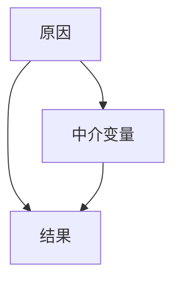
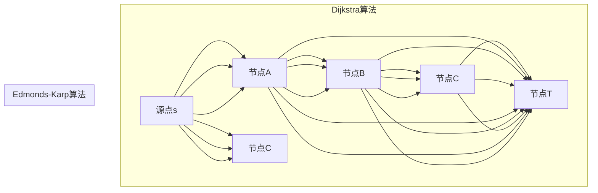
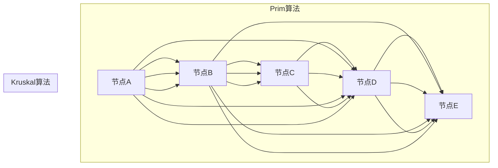
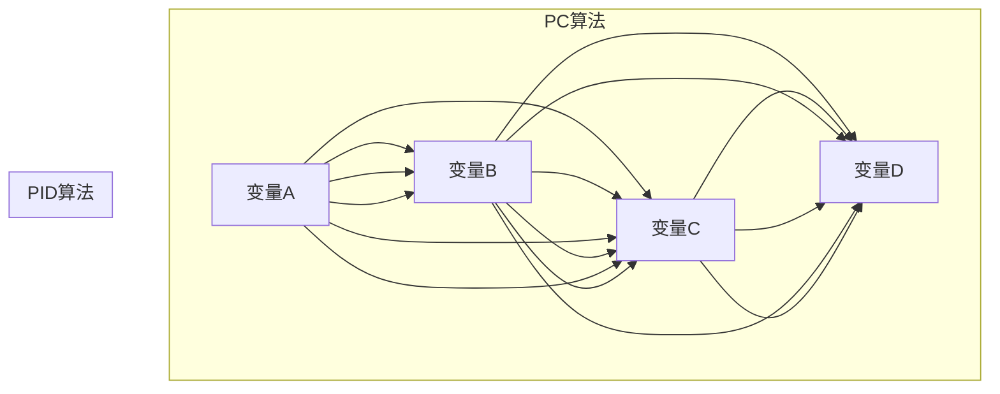

                 

### 文章标题：企业级因果发现引擎：深入理解业务因果关系

> 关键词：因果发现、业务因果关系、企业级数据、算法原理、系统架构设计

> 摘要：本文深入探讨了企业级因果发现引擎的构建和实现，分析了业务因果关系的重要性及其在数据驱动的现代商业环境中的应用。通过详细剖析因果发现的核心概念、算法原理和系统架构设计，本文旨在为企业在数据处理和分析方面提供有效的技术指导和实践建议。

### 目录大纲

----------------------------------------------------------------

# 第一部分：背景介绍

## 第1章：问题背景与核心概念

## 1.1 问题背景

### 1.1.1 企业在数据驱动的现代商业环境下面临的挑战

#### 1.1.1.1 数据量的爆炸性增长

#### 1.1.1.2 数据多样性的增加

#### 1.1.1.3 数据质量的不确定性

#### 1.1.1.4 数据隐私与安全的问题

### 1.1.2 因果发现的必要性

#### 1.1.2.1 传统关联分析方法的局限性

#### 1.1.2.2 因果发现的优势

#### 1.1.2.3 因果发现的核心概念

### 1.1.3 因果发现的边界与外延

#### 1.1.3.1 因果关系的定义

#### 1.1.3.2 因果发现的范围

#### 1.1.3.3 因果发现的挑战

## 1.2 核心概念与联系

### 1.2.1 因果关系模型

#### 1.2.1.1 基本概念

#### 1.2.1.2 属性特征对比

### 1.2.2 因果推断算法

#### 1.2.2.1 算法原理

#### 1.2.2.2 算法分类

#### 1.2.2.3 算法优缺点对比

## 1.3 本章小结

----------------------------------------------------------------

# 第二部分：因果发现引擎的算法原理

## 第2章：因果发现算法原理

## 2.1 算法概述

### 2.1.1 算法的定义与目标

#### 2.1.1.1 算法的定义

#### 2.1.1.2 算法的目标

### 2.1.2 算法的基本思想

#### 2.1.2.1 基于假设检验的方法

#### 2.1.2.2 基于图论的方法

#### 2.1.2.3 基于机器学习的方法

## 2.2 假设检验方法

### 2.2.1 基本原理

#### 2.2.1.1 假设检验的基本概念

#### 2.2.1.2 假设检验的流程

### 2.2.2 常见的假设检验算法

#### 2.2.2.1 t检验

#### 2.2.2.2 卡方检验

#### 2.2.2.3 置信区间

## 2.3 图论方法

### 2.3.1 基本概念

#### 2.3.1.1 图的定义

#### 2.3.1.2 图的基本属性

### 2.3.2 图算法在因果发现中的应用

#### 2.3.2.1 最大流算法

#### 2.3.2.2 最小生成树算法

## 2.4 机器学习方法

### 2.4.1 基本原理

#### 2.4.1.1 机器学习的定义

#### 2.4.1.2 机器学习的基本流程

### 2.4.2 常见的机器学习算法

#### 2.4.2.1 线性回归

#### 2.4.2.2 决策树

#### 2.4.2.3 支持向量机

## 2.5 算法对比与总结

### 2.5.1 各种方法的优缺点

#### 2.5.1.1 假设检验方法的优缺点

#### 2.5.1.2 图论方法的优缺点

#### 2.5.1.3 机器学习方法的优缺点

### 2.5.2 适用场景

#### 2.5.2.1 假设检验方法

#### 2.5.2.2 图论方法

#### 2.5.2.3 机器学习方法

## 2.6 本章小结

----------------------------------------------------------------

# 第三部分：因果发现引擎的系统架构设计

## 第3章：因果发现引擎的架构设计

## 3.1 系统架构概述

### 3.1.1 系统整体架构

### 3.1.2 各模块的功能与交互

## 3.2 数据处理模块

### 3.2.1 数据源接入

### 3.2.2 数据预处理

### 3.2.3 数据存储与管理

## 3.3 算法模块

### 3.3.1 算法选择与实现

### 3.3.2 算法优化策略

### 3.3.3 算法模块的扩展性

## 3.4 结果分析模块

### 3.4.1 结果展示

### 3.4.2 结果解释与可视化

### 3.4.3 结果验证与评估

## 3.5 系统部署与维护

### 3.5.1 部署方案

### 3.5.2 系统监控与日志记录

### 3.5.3 系统维护与更新

## 3.6 本章小结

------------------

## 第1章：问题背景与核心概念

### 1.1 问题背景

#### 1.1.1 企业在数据驱动的现代商业环境下面临的挑战

随着互联网和大数据技术的迅猛发展，企业面临着数据量爆炸性增长、数据多样性增加、数据质量不确定以及数据隐私和安全等问题。这些问题使得传统的数据分析和关联分析方法逐渐暴露出其局限性，无法有效地揭示业务数据中的潜在因果关系。

- **数据量的爆炸性增长**：企业每天产生的数据量呈现指数级增长，从客户行为数据、交易记录到社交媒体信息等，这些海量数据需要高效的处理和分析能力。

- **数据多样性的增加**：不同类型的数据（如结构化数据、半结构化数据和非结构化数据）使得数据处理变得更加复杂，传统的数据分析方法难以应对如此多样的数据形式。

- **数据质量的不确定性**：数据质量直接影响分析结果的可信度，数据中存在的缺失值、错误值、噪声等问题会干扰分析模型的准确性。

- **数据隐私与安全的问题**：在数据驱动的商业环境中，数据隐私和安全问题愈发重要。如何保护客户数据不被非法访问和滥用，是企业必须面对的挑战。

#### 1.1.2 因果发现的必要性

因果发现作为一种高级数据分析方法，能够在复杂的数据环境中揭示业务数据之间的因果关系，帮助企业更好地理解业务逻辑、优化业务流程，并做出更加精准的决策。

- **传统关联分析方法的局限性**：传统的关联分析方法主要关注数据之间的相关性，而忽略了因果关系的存在。相关性不能等同于因果关系，两者在统计学上有着本质的区别。

- **因果发现的优势**：因果发现可以帮助企业理解变量之间的因果关系，从而指导业务决策。例如，在市场营销中，通过因果发现可以找出哪些因素真正推动了销售额的增长，哪些因素是无效的，从而优化市场策略。

- **因果发现的核心概念**：因果发现涉及多个核心概念，包括因果关系模型、因果推断算法等。理解这些概念是深入掌握因果发现方法的基础。

#### 1.1.3 因果发现的边界与外延

因果发现并不是万能的，它有其特定的应用边界和挑战。

- **因果关系的定义**：因果关系是指一个事件（原因）对另一个事件（结果）产生的影响。在数据分析中，需要明确因果关系的基本定义和判断标准。

- **因果发现的范围**：因果发现主要应用于数据驱动决策的领域，如市场营销、风险控制、供应链优化等。在这些领域，因果发现能够提供有价值的信息和洞察。

- **因果发现的挑战**：因果发现面临的主要挑战包括数据缺失、噪声、复杂变量关系等。如何处理这些挑战，提高因果发现的准确性和可靠性，是当前研究的重点。

### 1.2 核心概念与联系

#### 1.2.1 因果关系模型

因果关系模型是因果发现的基础，它描述了变量之间的因果结构。一个基本的因果关系模型通常包括以下几个要素：

- **原因**（Cause）：导致某个事件发生的因素。
- **结果**（Effect）：某个事件发生后产生的后果。
- **中介变量**（Mediator）：在原因和结果之间起传递作用的变量。

在构建因果关系模型时，需要明确变量之间的直接和间接关系。以下是一个简单的因果关系模型示例：



在这个模型中，A是原因，B是结果，C是中介变量。模型展示了A通过C对B产生影响的过程。

#### 1.2.1.1 基本概念

- **因果效应**（Causal Effect）：指一个变量改变时，另一个变量的平均变化量。
- **因果结构**（Causal Structure）：描述变量之间因果关系的结构，通常用图论表示。
- **因果标识**（Causal Identification）：指在特定数据集下，如何识别变量之间的因果关系。

#### 1.2.1.2 属性特征对比

为了更好地理解因果关系模型，我们对比了因果关系与相关关系的属性特征：

| 特征                | 因果关系                                 | 相关关系                                 |
|-------------------|----------------------------------------|----------------------------------------|
| 定义              | 一个事件对另一个事件产生的影响            | 变量之间的线性或非线性依赖关系              |
| 表达形式          | 因果模型，通常用图表示                    | 相关矩阵，散点图等                       |
| 数据要求          | 大量观察数据，可能的因果结构信息          | 大量观测数据，相关性信息                  |
| 可视化表现        | 因果路径图，节点表示变量，边表示关系       | 关联矩阵可视化，颜色或大小表示相关性强度     |
| 分析目标          | 揭示变量之间的因果关系                  | 描述变量之间的依赖关系                    |

#### 1.2.2 因果推断算法

因果推断算法是因果发现的核心工具，用于从数据中推断变量之间的因果关系。这些算法可以分为基于假设检验、图论和机器学习的方法。

- **基于假设检验的方法**：通过统计检验来评估变量之间的因果关系，如t检验、卡方检验等。
- **基于图论的方法**：利用图论算法来寻找变量之间的因果结构，如最大流算法、最小生成树算法等。
- **基于机器学习的方法**：通过训练机器学习模型来识别变量之间的因果关系，如线性回归、决策树等。

#### 1.2.2.1 算法原理

- **基于假设检验的方法**：假设检验的基本原理是，通过设定原假设和备择假设，利用统计量来评估假设的合理性。例如，t检验通过计算t值和p值来判断两个变量之间是否存在显著差异。

- **基于图论的方法**：图论方法利用图结构来表示变量之间的因果关系。通过分析图的结构属性，如路径长度、连通性等，来推断变量之间的因果关系。

- **基于机器学习的方法**：机器学习方法通过训练模型来识别变量之间的因果关系。例如，线性回归模型可以通过拟合变量之间的关系来推断因果关系。

#### 1.2.2.2 算法分类

- **基于假设检验的方法**：t检验、卡方检验、置信区间等。
- **基于图论的方法**：最大流算法、最小生成树算法、因果推断网络等。
- **基于机器学习的方法**：线性回归、决策树、支持向量机等。

#### 1.2.2.3 算法优缺点对比

以下是几种常见因果推断算法的优缺点对比：

| 算法               | 优点                                            | 缺点                                            |
|------------------|--------------------------------------------------|--------------------------------------------------|
| t检验             | 简单易用，适用于线性关系检测                     | 对于非线性关系和复杂变量关系效果较差          |
| 卡方检验           | 适用于分类变量之间的独立性检验                   | 对于连续变量关系效果较差                      |
| 最大流算法         | 适用于复杂网络中的因果关系推断                   | 计算复杂度高，对大规模数据集处理能力有限      |
| 最小生成树算法     | 适用于寻找变量之间的最小路径，直观易懂             | 对于非线性关系和复杂变量关系效果较差          |
| 线性回归           | 简单有效，适用于线性关系的因果关系推断           | 对于非线性关系和复杂变量关系效果较差          |
| 决策树            | 直观易懂，适用于分类变量和连续变量的因果关系推断 | 可能产生过拟合，对于大规模数据集处理能力有限   |
| 支持向量机         | 高效，适用于线性不可分问题的因果关系推断         | 计算复杂度高，对大规模数据集处理能力有限      |

#### 1.2.3 本章小结

本章介绍了因果发现的背景、核心概念以及相关的因果关系模型和因果推断算法。通过理解这些概念和算法，企业可以更好地利用因果发现技术来揭示业务数据中的因果关系，从而为数据驱动的决策提供有力支持。接下来的章节将进一步深入探讨因果发现算法的原理和系统架构设计。

## 第2章：因果发现算法原理

### 2.1 算法概述

#### 2.1.1 算法的定义与目标

因果发现算法是一种从数据中推断变量之间因果关系的方法。其核心目标是识别出变量之间的因果关系，以便在业务决策中提供有价值的指导。因果发现算法通常包含以下几个步骤：

1. **数据预处理**：清洗数据，处理缺失值和噪声，确保数据质量。
2. **建立模型**：根据数据特征构建因果关系模型。
3. **算法选择**：选择合适的因果发现算法，如假设检验、图论方法或机器学习方法。
4. **模型训练与评估**：训练模型，评估模型性能，调整模型参数。
5. **结果解释与可视化**：解释模型结果，可视化因果关系路径。

#### 2.1.2 算法的基本思想

因果发现算法的基本思想可以分为以下几种：

1. **基于假设检验的方法**：通过假设检验来评估变量之间的显著性关系，判断是否存在因果关系。
2. **基于图论的方法**：利用图论算法来寻找变量之间的因果结构，分析图的结构属性，推断因果关系。
3. **基于机器学习的方法**：通过训练机器学习模型来识别变量之间的因果关系，如线性回归、决策树等。

#### 2.1.2.1 基于假设检验的方法

假设检验方法是最基本的因果发现算法之一，其核心思想是，通过设定原假设和备择假设，利用统计量来评估假设的合理性。

- **原假设（H0）**：假设变量之间没有因果关系。
- **备择假设（H1）**：假设变量之间存在因果关系。

假设检验的基本流程如下：

1. **设定假设**：根据业务问题和数据特征，设定原假设和备择假设。
2. **计算统计量**：根据数据计算统计量，如t值、p值等。
3. **比较统计量**：将计算出的统计量与显著性水平（如α=0.05）进行比较，判断是否拒绝原假设。

#### 2.1.2.2 基于图论的方法

图论方法利用图结构来表示变量之间的因果关系。图由节点和边组成，节点表示变量，边表示变量之间的因果关系。

- **节点**：表示变量，可以是连续变量或分类变量。
- **边**：表示变量之间的因果关系，可以是单向或双向关系。

常见的图论算法包括最大流算法、最小生成树算法等。

1. **最大流算法**：用于寻找图中的最大流量路径，可以用于推断变量之间的直接因果关系。
2. **最小生成树算法**：用于构建图中的最小生成树，可以用于寻找变量之间的最小路径关系。

#### 2.1.2.3 基于机器学习的方法

机器学习方法通过训练模型来识别变量之间的因果关系。常见的机器学习算法包括线性回归、决策树、支持向量机等。

1. **线性回归**：通过拟合变量之间的关系，推断因果关系。
2. **决策树**：通过构建决策树来分类变量，识别因果关系。
3. **支持向量机**：通过最大间隔分类来识别变量之间的因果关系。

#### 2.1.3 因果推断算法的适用场景

不同的因果推断算法适用于不同的场景，选择合适的算法需要根据具体业务问题和数据特征进行判断。

- **基于假设检验的方法**：适用于简单线性关系的因果关系推断，适用于数据量较小、变量较少的场景。
- **基于图论的方法**：适用于复杂网络中的因果关系推断，适用于变量之间存在复杂关系的场景。
- **基于机器学习的方法**：适用于大规模数据的因果关系推断，适用于变量较多、关系复杂的场景。

#### 2.1.4 本章小结

本章介绍了因果发现算法的定义、目标以及基本思想，详细讨论了基于假设检验、图论和机器学习的方法。通过理解这些方法，企业可以根据具体业务场景选择合适的算法，实现有效的因果发现，为数据驱动的决策提供有力支持。接下来的章节将进一步深入探讨每种方法的原理和应用。

### 2.2 假设检验方法

#### 2.2.1 基本原理

假设检验方法是一种基本的因果发现算法，它通过设定原假设和备择假设，利用统计量来评估假设的合理性，从而推断变量之间的因果关系。假设检验方法的核心在于，通过样本数据来验证总体数据中是否存在显著的差异或关系。

- **原假设（H0）**：假设变量之间没有显著差异或关系。
- **备择假设（H1）**：假设变量之间存在显著差异或关系。

假设检验的基本流程如下：

1. **设定假设**：根据业务问题和数据特征，设定原假设和备择假设。
2. **计算统计量**：根据样本数据计算统计量，如t值、p值等。
3. **比较统计量**：将计算出的统计量与显著性水平（如α=0.05）进行比较，判断是否拒绝原假设。

#### 2.2.1.1 假设检验的基本概念

在假设检验中，有几个关键的概念需要理解：

- **显著性水平（α）**：表示我们愿意接受错误的概率，通常取值为0.05或0.01。如果p值小于显著性水平，我们拒绝原假设。
- **p值**：表示在原假设为真的情况下，观测到当前样本数据的概率。p值越小，说明拒绝原假设的证据越强。
- **统计量**：用于衡量变量之间差异或关系的指标，如t值、F值等。

#### 2.2.1.2 假设检验的流程

假设检验的流程可以分为以下几个步骤：

1. **设定假设**：根据业务问题和数据特征，设定原假设（H0）和备择假设（H1）。例如，如果我们要检验两个变量A和B之间是否存在显著关系，可以设定H0：A和B之间没有显著关系，H1：A和B之间存在显著关系。

2. **计算统计量**：根据样本数据计算相应的统计量。对于t检验，计算t值；对于卡方检验，计算卡方值；对于置信区间，计算置信区间。

3. **比较统计量**：将计算出的统计量与显著性水平进行比较。如果统计量大于或小于显著性水平，拒绝原假设；否则，不能拒绝原假设。

#### 2.2.2 常见的假设检验算法

假设检验方法有多种不同的算法，适用于不同的数据类型和业务场景。以下介绍几种常见的假设检验算法：

- **t检验**：用于比较两个样本均值是否存在显著差异。t检验分为单样本t检验和双样本t检验。
  - **单样本t检验**：用于比较一个样本均值与某个已知总体均值之间是否存在显著差异。
  - **双样本t检验**：用于比较两个独立样本均值之间是否存在显著差异。

- **卡方检验**：用于检验分类变量之间的独立性。卡方检验适用于两个或多个分类变量之间的交叉表分析。

- **置信区间**：用于估计总体参数的区间范围。置信区间给出了一个范围，在这个范围内的参数值被认为是可信的。

#### 2.2.2.1 t检验

t检验是一种常用的假设检验方法，用于比较两个样本均值是否存在显著差异。t检验的基本步骤如下：

1. **设定假设**：设定原假设（H0）和备择假设（H1）。例如，H0：μ1 - μ2 = 0，H1：μ1 - μ2 ≠ 0，其中μ1和μ2分别为两个样本的均值。

2. **计算t值**：根据样本数据计算t值。t值公式为：
   \[
   t = \frac{(\bar{x}_1 - \bar{x}_2) - (\mu_1 - \mu_2)}{\sqrt{\frac{s_1^2}{n_1} + \frac{s_2^2}{n_2}}}
   \]
   其中，\(\bar{x}_1\)和\(\bar{x}_2\)分别为两个样本的均值，\(s_1\)和\(s_2\)分别为两个样本的标准差，\(n_1\)和\(n_2\)分别为两个样本的样本量。

3. **计算p值**：根据t值和样本量，查找t分布表或使用统计软件计算p值。

4. **比较t值和p值**：如果p值小于显著性水平（如α=0.05），拒绝原假设，认为两个样本均值之间存在显著差异；否则，不能拒绝原假设。

#### 2.2.2.2 卡方检验

卡方检验是一种用于检验分类变量之间独立性的假设检验方法。卡方检验的基本步骤如下：

1. **设定假设**：设定原假设（H0）和备择假设（H1）。例如，H0：A和B变量之间是独立的，H1：A和B变量之间不是独立的。

2. **构建交叉表**：根据两个分类变量的数据构建交叉表，交叉表中的每个单元格表示变量A和B的组合。

3. **计算卡方值**：根据交叉表中的数据计算卡方值。卡方值公式为：
   \[
   \chi^2 = \sum_{i=1}^{r}\sum_{j=1}^{c} \frac{(O_{ij} - E_{ij})^2}{E_{ij}}
   \]
   其中，\(O_{ij}\)为观测频数，\(E_{ij}\)为期望频数。

4. **计算p值**：根据卡方值和自由度，查找卡方分布表或使用统计软件计算p值。

5. **比较卡方值和p值**：如果p值小于显著性水平（如α=0.05），拒绝原假设，认为变量A和B之间存在显著关系；否则，不能拒绝原假设。

#### 2.2.2.3 置信区间

置信区间是一种用于估计总体参数范围的假设检验方法。置信区间的基本步骤如下：

1. **设定假设**：设定原假设（H0）和备择假设（H1）。例如，H0：μ = μ0，H1：μ ≠ μ0，其中μ为总体均值，μ0为某个特定值。

2. **计算统计量**：根据样本数据计算相应的统计量。对于正态分布，可以使用t分布；对于非正态分布，可以使用卡方分布或其他分布。

3. **计算置信区间**：根据统计量和样本量，计算置信区间。置信区间公式为：
   \[
   (\bar{x} - t_{\alpha/2, n-1} \cdot \frac{s}{\sqrt{n}}, \bar{x} + t_{\alpha/2, n-1} \cdot \frac{s}{\sqrt{n}})
   \]
   其中，\(\bar{x}\)为样本均值，\(s\)为样本标准差，\(t_{\alpha/2, n-1}\)为t分布的临界值，\(n\)为样本量。

4. **判断置信区间**：如果置信区间包含特定值（如μ0），不能拒绝原假设；如果置信区间不包含特定值，拒绝原假设。

#### 2.2.3 假设检验方法的应用

假设检验方法在因果发现中有着广泛的应用，以下是一个简单的应用实例：

假设某企业想要了解员工满意度与公司业绩之间的关系。为了进行假设检验，可以按照以下步骤：

1. **数据收集**：收集员工满意度调查数据和公司业绩数据。
2. **设定假设**：设定原假设（H0）：员工满意度与公司业绩之间没有显著关系；备择假设（H1）：员工满意度与公司业绩之间存在显著关系。
3. **计算统计量**：计算员工满意度与公司业绩之间的相关系数。
4. **计算p值**：根据相关系数和样本量，计算p值。
5. **判断结果**：如果p值小于显著性水平（如α=0.05），拒绝原假设，认为员工满意度与公司业绩之间存在显著关系；否则，不能拒绝原假设。

通过以上步骤，企业可以了解员工满意度对公司业绩的影响，从而采取相应的措施来提升公司业绩。

#### 2.2.4 本章小结

本章详细介绍了假设检验方法的基本原理和常用算法，包括t检验、卡方检验和置信区间。通过理解这些方法，企业可以有效地从数据中推断变量之间的因果关系，为业务决策提供有力支持。假设检验方法在因果发现中具有广泛的应用，适用于各种业务场景和数据类型。接下来，我们将探讨基于图论方法的因果发现算法。

### 2.3 图论方法

#### 2.3.1 基本概念

图论是一种数学分支，用于研究图的结构和性质。在因果发现中，图论方法通过构建变量之间的图模型，寻找变量之间的因果关系。图由节点和边组成，节点表示变量，边表示变量之间的关系。

- **节点**：表示变量，可以是连续变量或分类变量。
- **边**：表示变量之间的关系，可以是单向或双向关系。

图的基本属性包括：

- **连通性**：描述节点之间的连通关系，如单连通、双连通等。
- **路径**：描述节点之间的连接路径，如最短路径、最长路径等。
- **图结构**：描述整个图的结构属性，如图的连通性、密度等。

#### 2.3.1.1 图的定义

图（Graph）是由节点（Vertex）和边（Edge）组成的数学结构。形式化定义如下：

- **节点**：图中的每个节点表示一个变量，可以是连续变量或分类变量。每个节点具有唯一的标识符。
- **边**：节点之间的连线表示变量之间的关系。边可以是有向的（Directed Edge）或无向的（Undirected Edge）。有向边表示单向关系，无向边表示双向关系。

形式化定义如下：

- **有向图**：一个有向图由节点集V和边集E组成，其中每条边表示为有序对(u, v)，称为弧，表示节点u到节点v的有向边。
- **无向图**：一个无向图由节点集V和边集E组成，其中每条边表示为集合{u, v}，表示节点u和节点v之间的无向边。

例如，以下是一个简单的有向图和无向图的表示：

```mermaid
graph TD
    A[节点A] --> B[节点B]
    B --> C[节点C]
    C --> A[节点A]

graph TD
    A[节点A]--(边)--> B[节点B]
    B--(边)--> C[节点C]
    C--(边)--> A[节点A]
```

#### 2.3.1.2 图的基本属性

图的基本属性包括：

- **连通性**：描述节点之间的连通关系。连通图是指任意两个节点之间都存在路径，否则称为非连通图。
- **路径**：描述节点之间的连接路径。最短路径是指连接两个节点的路径中，长度最短的路径。最长路径是指连接两个节点的路径中，长度最长的路径。
- **图结构**：描述整个图的结构属性。例如，树结构、环结构、星形结构等。

#### 2.3.2 图算法在因果发现中的应用

图论方法在因果发现中有着广泛的应用。以下介绍几种常见的图算法及其在因果发现中的应用：

1. **最大流算法**：最大流算法用于寻找图中的最大流量路径，可以用于推断变量之间的直接因果关系。例如，Dijkstra算法和Floyd-Warshall算法等。

2. **最小生成树算法**：最小生成树算法用于寻找图中的最小生成树，可以用于寻找变量之间的最小路径关系。例如，Prim算法和Kruskal算法等。

3. **因果推断网络**：因果推断网络是一种基于图论的因果关系模型，通过构建变量之间的图模型，寻找变量之间的因果关系。例如，PC算法（因果推断算法）和PID算法（路径依赖算法）等。

#### 2.3.2.1 最大流算法

最大流算法是一种寻找图中最大流量路径的算法。最大流问题可以形式化为：给定一个有向图G=(V, E)，每条边e有一个容量c(e)，要求找到从源点s到汇点t的最大流量路径。

- **基本原理**：通过反复增加流量路径，使得从s到t的流量逐渐增大，直到无法继续增加为止，此时得到的流量值即为最大流量。
- **常用算法**：Dijkstra算法、Floyd-Warshall算法、Edmonds-Karp算法等。

例如，以下是一个简单的有向图及其最大流算法的表示：



#### 2.3.2.2 最小生成树算法

最小生成树算法用于寻找图中的最小生成树，可以用于寻找变量之间的最小路径关系。最小生成树是指连接图中所有节点的树，且边的权重之和最小。

- **基本原理**：通过选择权重最小的边，逐步构建生成树，直到连接所有节点为止。
- **常用算法**：Prim算法、Kruskal算法、贪心算法等。

例如，以下是一个简单的无向图及其最小生成树算法的表示：



#### 2.3.2.3 因果推断网络

因果推断网络是一种基于图论的因果关系模型，通过构建变量之间的图模型，寻找变量之间的因果关系。

- **基本原理**：利用图论算法，如最大流算法、最小生成树算法等，构建变量之间的因果关系网络。
- **常用算法**：PC算法、PID算法等。

例如，以下是一个简单的因果推断网络的表示：



通过图论方法，企业可以构建变量之间的因果关系网络，深入分析业务数据中的潜在因果关系，为业务决策提供有力支持。

#### 2.3.3 本章小结

本章介绍了图论方法的基本概念、图的定义及其基本属性，并详细讨论了最大流算法、最小生成树算法和因果推断网络等在因果发现中的应用。图论方法为因果发现提供了强大的工具，帮助企业深入分析业务数据中的因果关系。在下一章中，我们将探讨基于机器学习方法的因果发现算法。

### 2.4 机器学习方法

#### 2.4.1 基本原理

机器学习方法在因果发现中发挥着重要作用，通过训练模型来识别变量之间的因果关系。机器学习方法的基本原理是基于数据驱动的，通过从历史数据中学习，构建能够预测或分类的新模型的算法。

- **数据驱动**：机器学习模型通过学习大量历史数据中的特征和规律，从而对未知数据进行预测或分类。
- **特征提取**：从数据中提取有用的特征，这些特征有助于模型理解和学习数据中的模式。
- **模型构建**：利用提取的特征构建预测模型，该模型可以对新数据进行预测或分类。
- **模型评估**：通过评估模型在测试数据上的表现，调整模型参数，优化模型性能。

机器学习方法的基本流程如下：

1. **数据预处理**：清洗数据，处理缺失值、噪声等，确保数据质量。
2. **特征提取**：从原始数据中提取有用的特征，这些特征有助于模型理解和学习数据中的模式。
3. **模型选择**：根据业务问题和数据特征选择合适的机器学习模型，如线性回归、决策树、支持向量机等。
4. **模型训练**：利用训练数据对模型进行训练，调整模型参数，使其能够更好地拟合数据。
5. **模型评估**：使用测试数据评估模型性能，调整模型参数，优化模型性能。
6. **模型应用**：将训练好的模型应用于新的数据，进行预测或分类。

#### 2.4.1.1 机器学习的定义

机器学习（Machine Learning）是一门人工智能（Artificial Intelligence, AI）的分支，主要研究如何从数据中学习并自动改进性能。机器学习的定义可以从不同的角度进行解释：

- **统计学角度**：机器学习是一种基于统计学方法，通过学习数据中的统计规律，对未知数据进行预测或分类的方法。
- **计算机科学角度**：机器学习是一种通过构建和训练模型，实现从数据中学习并自动改进性能的技术。
- **人工智能角度**：机器学习是人工智能的一个分支，旨在使计算机系统能够通过学习获得新的知识和技能，从而实现智能化。

机器学习的核心思想是，通过训练模型来捕捉数据中的规律和模式，从而对新数据进行预测或分类。机器学习的应用非常广泛，包括图像识别、自然语言处理、推荐系统、金融风控等领域。

#### 2.4.1.2 机器学习的基本流程

机器学习的基本流程可以分为以下几个阶段：

1. **数据收集**：收集相关的数据集，包括训练数据和测试数据。数据的质量直接影响模型的性能。

2. **数据预处理**：对收集到的数据进行清洗、处理，包括缺失值填充、噪声过滤、数据标准化等。数据预处理是确保数据质量和模型性能的重要步骤。

3. **特征提取**：从原始数据中提取有用的特征，这些特征有助于模型理解和学习数据中的模式。特征提取是提高模型性能的关键环节。

4. **模型选择**：根据业务问题和数据特征选择合适的机器学习模型。常见的机器学习模型包括线性回归、决策树、支持向量机、神经网络等。

5. **模型训练**：使用训练数据对模型进行训练，调整模型参数，使其能够更好地拟合数据。训练过程通常包括前向传播、反向传播等步骤。

6. **模型评估**：使用测试数据评估模型性能，包括准确率、召回率、F1分数等指标。评估结果用于调整模型参数，优化模型性能。

7. **模型应用**：将训练好的模型应用于新的数据，进行预测或分类。模型应用是机器学习的最终目标，也是实现业务价值的关键环节。

#### 2.4.2 常见的机器学习算法

机器学习方法种类繁多，适用于不同的业务场景和数据类型。以下介绍几种常见的机器学习算法：

1. **线性回归**：线性回归是一种简单的机器学习算法，用于建立变量之间的线性关系。线性回归模型可以用于预测连续值。

2. **决策树**：决策树是一种基于树结构的分类算法，通过决策节点和叶子节点来划分数据集，从而实现分类或回归。决策树具有直观易懂、易于解释的特点。

3. **支持向量机**：支持向量机是一种基于间隔最大化原则的分类算法，通过找到一个最佳的超平面，将不同类别的数据分隔开。支持向量机具有高效的分类性能。

4. **神经网络**：神经网络是一种模拟人脑神经元结构的计算模型，通过多层神经元的相互连接和激活函数，实现复杂的非线性变换。神经网络广泛应用于图像识别、语音识别等领域。

#### 2.4.2.1 线性回归

线性回归是一种常用的回归分析方法，用于建立变量之间的线性关系。线性回归模型可以表示为：

\[
y = \beta_0 + \beta_1x_1 + \beta_2x_2 + ... + \beta_nx_n + \epsilon
\]

其中，\(y\)是因变量，\(x_1, x_2, ..., x_n\)是自变量，\(\beta_0, \beta_1, \beta_2, ..., \beta_n\)是模型参数，\(\epsilon\)是误差项。

线性回归的基本步骤如下：

1. **数据收集**：收集训练数据集，包括因变量和自变量的数据。

2. **数据预处理**：对训练数据进行预处理，包括缺失值填充、噪声过滤、数据标准化等。

3. **模型建立**：根据训练数据，建立线性回归模型。可以通过最小二乘法、梯度下降法等算法来求解模型参数。

4. **模型评估**：使用测试数据评估模型性能，包括决定系数（\(R^2\)）、均方误差（MSE）等指标。

5. **模型应用**：将训练好的模型应用于新的数据，进行预测或分析。

例如，以下是一个简单的线性回归模型表示：

```python
import numpy as np

# 假设数据集X和y
X = np.array([[1, 2], [2, 3], [3, 4], [4, 5]])
y = np.array([2, 3, 4, 5])

# 模型参数
beta_0 = 0
beta_1 = 1

# 最小二乘法求解模型参数
theta = np.linalg.inv(X.T.dot(X)).dot(X.T).dot(y)

print("模型参数：", theta)
```

#### 2.4.2.2 决策树

决策树是一种基于树结构的分类算法，通过决策节点和叶子节点来划分数据集，从而实现分类或回归。决策树的基本步骤如下：

1. **数据收集**：收集训练数据集，包括特征和标签的数据。

2. **数据预处理**：对训练数据进行预处理，包括缺失值填充、噪声过滤、数据标准化等。

3. **特征选择**：选择影响最大的特征作为决策节点，通过特征分裂来构建树结构。

4. **模型建立**：从根节点开始，根据特征值进行分裂，生成决策树。

5. **模型评估**：使用测试数据评估模型性能，通过交叉验证等方法调整模型参数。

6. **模型应用**：将训练好的模型应用于新的数据，进行预测或分类。

例如，以下是一个简单的决策树模型表示：

```python
from sklearn.tree import DecisionTreeClassifier

# 假设数据集X和y
X = np.array([[1, 2], [2, 3], [3, 4], [4, 5]])
y = np.array([0, 0, 1, 1])

# 构建决策树模型
clf = DecisionTreeClassifier()
clf.fit(X, y)

# 预测新数据
new_data = np.array([[2, 3]])
print("预测结果：", clf.predict(new_data))
```

#### 2.4.2.3 支持向量机

支持向量机（Support Vector Machine, SVM）是一种基于间隔最大化原则的分类算法，通过找到一个最佳的超平面，将不同类别的数据分隔开。支持向量机的基本步骤如下：

1. **数据收集**：收集训练数据集，包括特征和标签的数据。

2. **数据预处理**：对训练数据进行预处理，包括缺失值填充、噪声过滤、数据标准化等。

3. **模型建立**：通过求解优化问题，找到最佳的超平面，确定支持向量。

4. **模型评估**：使用测试数据评估模型性能，通过交叉验证等方法调整模型参数。

5. **模型应用**：将训练好的模型应用于新的数据，进行预测或分类。

例如，以下是一个简单的支持向量机模型表示：

```python
from sklearn.svm import SVC

# 假设数据集X和y
X = np.array([[1, 2], [2, 3], [3, 4], [4, 5]])
y = np.array([0, 0, 1, 1])

# 构建支持向量机模型
clf = SVC(kernel='linear')
clf.fit(X, y)

# 预测新数据
new_data = np.array([[2, 3]])
print("预测结果：", clf.predict(new_data))
```

通过介绍这些常见的机器学习算法，企业可以灵活选择合适的方法来构建因果发现模型，实现业务数据的因果分析。在下一章中，我们将对比分析假设检验方法、图论方法和机器学习方法的优缺点，并讨论各自的适用场景。

### 2.5 算法对比与总结

#### 2.5.1 各种方法的优缺点

在因果发现领域，不同的算法有着各自的优势和局限性。以下对比分析假设检验方法、图论方法和机器学习方法的优缺点。

- **假设检验方法的优缺点**：

  - **优点**：
    - 简单易用，适用于各种类型的数据；
    - 强调统计学原理，确保结果的可靠性；
    - 可以量化因果关系，提供明确的统计指标。

  - **缺点**：
    - 对于复杂变量关系和非线性关系效果较差；
    - 对于大规模数据集处理能力有限，计算复杂度高；
    - 需要事先设定显著性水平和原假设，可能影响结果的准确性。

- **图论方法的优缺点**：

  - **优点**：
    - 直观易懂，能够直观地展示变量之间的因果关系；
    - 适用于复杂网络中的因果关系推断；
    - 可以处理缺失值和噪声，对数据质量要求较低。

  - **缺点**：
    - 对于大规模数据集处理能力有限，计算复杂度高；
    - 需要专业知识和经验，对用户要求较高；
    - 无法直接量化因果关系，仅能提供结构信息。

- **机器学习方法的优缺点**：

  - **优点**：
    - 高效，能够处理大规模数据和复杂变量关系；
    - 自适应能力强，能够从数据中自动学习因果关系；
    - 可以处理非线性关系，适用于各种业务场景。

  - **缺点**：
    - 模型复杂度高，难以解释和理解；
    - 对数据质量要求较高，需进行预处理；
    - 需要大量的训练数据和计算资源。

#### 2.5.2 适用场景

不同的算法适用于不同的业务场景和数据类型。以下讨论各种算法的适用场景：

- **假设检验方法**：

  - 适用于简单线性关系的因果关系推断，如研究变量之间的显著相关性；
  - 适用于数据量较小、变量较少的场景，如小样本数据分析；
  - 适用于需要明确统计指标和显著性水平的业务场景。

- **图论方法**：

  - 适用于复杂网络中的因果关系推断，如社交媒体网络分析；
  - 适用于变量之间存在复杂关系的场景，如生物网络分析；
  - 适用于需要直观展示变量之间关系的业务场景。

- **机器学习方法**：

  - 适用于大规模数据的因果关系推断，如市场数据分析、风险控制等；
  - 适用于变量较多、关系复杂的场景，如推荐系统、金融风控等；
  - 适用于需要高效处理数据和自动学习因果关系的业务场景。

#### 2.5.3 本章小结

本章对比分析了假设检验方法、图论方法和机器学习方法的优缺点，并讨论了各自的适用场景。通过理解这些算法的特点和应用场景，企业可以根据具体业务需求和数据特征选择合适的因果发现方法。假设检验方法适用于简单线性关系的因果关系推断，图论方法适用于复杂网络中的因果关系推断，而机器学习方法适用于大规模数据和复杂变量关系的因果关系推断。了解这些方法的适用场景有助于企业更好地实现因果发现，为数据驱动的决策提供有力支持。

## 第3章：因果发现引擎的系统架构设计

### 3.1 系统架构概述

因果发现引擎是一种用于从数据中揭示变量之间因果关系的系统。其核心目标是帮助企业理解业务数据中的潜在因果关系，从而为数据驱动的决策提供有力支持。因果发现引擎的系统架构设计需要考虑数据处理、算法实现、结果分析等多个模块的协同工作。以下是对系统架构的整体概述及其各模块的功能与交互。

#### 系统架构设计

因果发现引擎的系统架构主要包括以下几个核心模块：

1. **数据处理模块**：负责接入和管理数据源，对数据进行预处理和存储，为后续的因果分析提供基础数据支持。
2. **算法模块**：负责实现各种因果发现算法，如基于假设检验、图论方法和机器学习方法等，用于推断变量之间的因果关系。
3. **结果分析模块**：负责对算法模块生成的结果进行展示、解释和验证，帮助用户理解和应用因果分析结果。
4. **系统部署与维护模块**：负责系统的部署、监控和维护，确保因果发现引擎的稳定运行。

#### 各模块的功能与交互

- **数据处理模块**：
  - **功能**：数据源接入、数据预处理、数据存储与管理。
  - **交互**：与算法模块和结果分析模块进行数据交互，提供基础数据支持。

- **算法模块**：
  - **功能**：算法选择与实现、算法优化策略、算法模块的扩展性。
  - **交互**：与数据处理模块和结果分析模块进行数据交互，实现因果关系的推断和结果分析。

- **结果分析模块**：
  - **功能**：结果展示、结果解释与可视化、结果验证与评估。
  - **交互**：与数据处理模块和算法模块进行数据交互，为用户提供直观、易于理解的因果分析结果。

- **系统部署与维护模块**：
  - **功能**：系统部署方案、系统监控与日志记录、系统维护与更新。
  - **交互**：与其他模块协同工作，确保因果发现引擎的稳定运行和持续优化。

### 3.2 数据处理模块

#### 3.2.1 数据源接入

数据处理模块首先需要接入各种数据源，包括企业内部数据库、数据仓库、API接口、文件系统等。数据源接入的方式可以分为以下几种：

- **数据库接入**：通过数据库连接池技术，实现与企业内部数据库的实时数据连接。
- **API接入**：通过调用第三方API接口，获取外部数据源的数据。
- **文件系统接入**：通过读取企业内部的文件系统，获取本地文件数据。

#### 3.2.2 数据预处理

数据预处理是因果发现引擎的重要环节，其目的是清洗、处理和转换数据，为后续的因果分析提供高质量的数据支持。数据预处理的主要任务包括：

- **数据清洗**：处理缺失值、异常值、重复值等，确保数据的一致性和完整性。
- **数据转换**：对数据进行规范化、编码、归一化等处理，以满足算法模块的要求。
- **数据整合**：将不同来源的数据进行合并、交叉分析，形成统一的数据视图。

#### 3.2.3 数据存储与管理

数据存储与管理模块负责将预处理后的数据存储在合适的存储系统，如关系型数据库、分布式数据库、数据仓库等。数据存储与管理的关键任务包括：

- **数据存储**：根据数据类型和访问模式，选择合适的存储系统，如MySQL、Hadoop HDFS等。
- **数据索引**：建立数据索引，提高数据查询和访问效率。
- **数据备份与恢复**：定期进行数据备份，确保数据的安全性和可靠性。

#### 3.2.4 本章小结

数据处理模块是因果发现引擎的核心组件，负责数据源接入、数据预处理和数据存储与管理。通过高效的数据处理，因果发现引擎能够为算法模块和结果分析模块提供高质量的数据支持，从而实现有效的因果发现。在下一章中，我们将详细探讨算法模块的设计和实现。

### 3.3 算法模块

#### 3.3.1 算法选择与实现

算法模块是实现因果发现引擎的核心功能之一，其目的是从数据中推断变量之间的因果关系。算法选择与实现是算法模块的关键步骤，以下介绍几种常见的因果发现算法及其实现。

1. **基于假设检验的方法**：
   - **算法原理**：通过假设检验评估变量之间的显著性关系，判断是否存在因果关系。
   - **实现步骤**：
     1. 数据预处理：清洗数据，处理缺失值和噪声。
     2. 建立模型：设定原假设和备择假设，选择合适的统计检验方法。
     3. 计算统计量：根据数据计算统计量，如t值、p值等。
     4. 比较统计量：将计算出的统计量与显著性水平进行比较，判断是否拒绝原假设。
     5. 结果解释：解释模型结果，分析变量之间的因果关系。

2. **基于图论的方法**：
   - **算法原理**：利用图论算法，如最大流算法、最小生成树算法等，寻找变量之间的因果结构。
   - **实现步骤**：
     1. 数据预处理：清洗数据，处理缺失值和噪声。
     2. 构建图模型：根据变量之间的关系，构建有向图或无向图。
     3. 算法选择：选择合适的图算法，如最大流算法、最小生成树算法等。
     4. 计算因果关系：利用图算法计算变量之间的因果关系路径。
     5. 结果解释：解释模型结果，分析变量之间的因果关系。

3. **基于机器学习的方法**：
   - **算法原理**：通过训练机器学习模型，如线性回归、决策树、支持向量机等，识别变量之间的因果关系。
   - **实现步骤**：
     1. 数据预处理：清洗数据，处理缺失值和噪声。
     2. 特征提取：从原始数据中提取有用的特征。
     3. 模型选择：选择合适的机器学习模型，如线性回归、决策树、支持向量机等。
     4. 模型训练：利用训练数据对模型进行训练，调整模型参数。
     5. 模型评估：使用测试数据评估模型性能，调整模型参数。
     6. 结果解释：解释模型结果，分析变量之间的因果关系。

#### 3.3.2 算法优化策略

算法优化是提高因果发现引擎性能的关键环节，以下介绍几种常见的算法优化策略：

1. **并行计算**：
   - **原理**：通过并行计算技术，提高数据处理和算法运行的效率。
   - **实现**：将数据划分成多个子集，分布式计算每个子集的因果关系，最后汇总结果。

2. **缓存策略**：
   - **原理**：利用缓存技术，减少数据读取和计算的次数。
   - **实现**：在数据处理过程中，将频繁访问的数据存储在缓存中，提高数据访问速度。

3. **算法融合**：
   - **原理**：将多种算法融合在一起，取长补短，提高因果关系推断的准确性。
   - **实现**：结合基于假设检验、图论和机器学习的算法，构建综合性的因果发现模型。

#### 3.3.3 算法模块的扩展性

算法模块的扩展性是确保因果发现引擎适应不同业务场景和数据特征的关键。以下介绍几种常见的算法扩展策略：

1. **算法库**：
   - **原理**：构建丰富的算法库，提供多种算法选择。
   - **实现**：整合开源算法库，如Scikit-learn、PyTorch等，扩展算法模块的功能。

2. **插件机制**：
   - **原理**：通过插件机制，灵活扩展算法模块。
   - **实现**：定义插件接口，第三方开发者可以自定义算法插件，方便算法的扩展和集成。

3. **动态调整**：
   - **原理**：根据业务需求和数据特征，动态调整算法参数。
   - **实现**：实现算法参数的动态调整机制，自动调整算法参数，优化因果关系推断效果。

#### 3.3.4 本章小结

算法模块是因果发现引擎的核心组件，负责实现各种因果发现算法，从数据中推断变量之间的因果关系。算法选择与实现、算法优化策略和算法模块的扩展性是算法模块设计的关键环节。通过合理选择和优化算法，可以提高因果发现引擎的性能和准确性，为数据驱动的决策提供有力支持。在下一章中，我们将详细探讨结果分析模块的设计和实现。

### 3.4 结果分析模块

#### 3.4.1 结果展示

结果分析模块的目的是将因果发现算法的结果以直观、易于理解的方式展示给用户。结果展示包括以下几个方面：

1. **可视化报表**：
   - **原理**：通过图表、图形等形式，展示因果关系的路径、强度和方向。
   - **实现**：利用可视化工具，如D3.js、ECharts等，生成因果路径图、网络图、热力图等。

2. **交互式界面**：
   - **原理**：通过交互式界面，用户可以动态调整参数、查看详细数据、探索不同的因果关系路径。
   - **实现**：利用Web前端技术，如HTML、CSS、JavaScript等，构建交互式界面。

3. **报告生成**：
   - **原理**：生成详细的分析报告，包括因果关系的路径、解释和结论。
   - **实现**：利用报告生成工具，如Apache POI、iText等，生成PDF或Word格式的报告。

#### 3.4.2 结果解释与可视化

结果解释与可视化是结果分析模块的重要任务，其目的是帮助用户理解因果发现的结果，并从中获取有价值的信息。

1. **因果路径解释**：
   - **原理**：解释变量之间的因果关系路径，帮助用户理解变量之间的逻辑关系。
   - **实现**：利用图论方法，构建因果路径图，展示变量之间的直接和间接关系。

2. **因果关系强度展示**：
   - **原理**：展示变量之间的因果关系强度，帮助用户判断变量之间的影响程度。
   - **实现**：利用热力图、色块等形式，直观展示变量之间的因果关系强度。

3. **动态交互**：
   - **原理**：通过动态交互，用户可以实时调整参数、查看不同条件下的因果关系。
   - **实现**：利用Web前端技术，实现交互式的因果关系展示，如可拖动的节点、滑动的滑块等。

#### 3.4.3 结果验证与评估

结果验证与评估是确保因果发现结果准确性和可靠性的关键步骤。

1. **交叉验证**：
   - **原理**：通过交叉验证，评估因果发现模型的泛化能力。
   - **实现**：将数据集划分为训练集和测试集，使用训练集训练模型，使用测试集评估模型性能。

2. **对比分析**：
   - **原理**：对比不同算法的结果，评估算法的性能和适用性。
   - **实现**：比较不同算法的因果关系路径、解释和结论，分析差异和原因。

3. **错误分析**：
   - **原理**：分析因果发现结果中的错误和异常，提高模型的准确性和可靠性。
   - **实现**：对异常结果进行标记和分类，分析原因，改进算法和模型。

#### 3.4.4 本章小结

结果分析模块是因果发现引擎的重要组成部分，负责将因果发现算法的结果以直观、易懂的方式展示给用户，并提供结果验证与评估功能。结果展示、结果解释与可视化以及结果验证与评估是结果分析模块的核心任务，通过这些功能，用户可以更好地理解因果发现的结果，并从中获取有价值的信息。在下一章中，我们将详细探讨系统的部署与维护。

### 3.5 系统部署与维护

#### 3.5.1 部署方案

因果发现引擎的部署方案需要考虑系统的稳定性、性能和可扩展性。以下是一个典型的部署方案：

1. **硬件架构**：
   - **计算节点**：使用高性能服务器，如Dell R740或HP DL380等，配置足够的CPU、内存和存储资源。
   - **存储系统**：使用分布式文件系统，如Hadoop HDFS或Cassandra，确保数据的高可用性和可扩展性。
   - **网络架构**：使用分布式网络架构，确保数据的高速传输和高效处理。

2. **软件架构**：
   - **数据处理层**：使用分布式数据处理框架，如Apache Spark或Flink，实现数据的实时处理和批量处理。
   - **算法层**：集成开源算法库，如Scikit-learn、XGBoost等，提供丰富的算法选择。
   - **Web层**：使用Web框架，如Django或Flask，构建交互式的Web界面。

3. **部署环境**：
   - **开发环境**：在本地或远程服务器上部署开发环境，用于算法开发和测试。
   - **测试环境**：在测试服务器上部署测试环境，进行系统测试和性能测试。
   - **生产环境**：在生产服务器上部署生产环境，确保系统的稳定运行。

#### 3.5.2 系统监控与日志记录

系统监控与日志记录是确保因果发现引擎稳定运行和快速响应的重要措施。以下介绍几种常见的监控与日志记录方法：

1. **监控工具**：
   - **Nagios**：用于监控服务器状态、网络流量等，发送告警通知。
   - **Zabbix**：用于监控服务器性能、资源利用率等，提供丰富的图表和报告。
   - **Prometheus**：用于监控分布式系统，提供高效的告警和告警管理。

2. **日志记录**：
   - **Syslog**：将系统日志记录到中央日志服务器，方便日志的收集和管理。
   - **ELK Stack**：使用Elasticsearch、Logstash和Kibana，构建完整的日志分析平台。
   - **Fluentd**：用于收集、处理和转发日志数据，支持多种日志格式和存储系统。

3. **告警机制**：
   - **邮件告警**：通过邮件发送告警通知，提醒管理员处理异常情况。
   - **短信告警**：通过短信发送告警通知，实现快速的异常响应。
   - **自动化脚本**：编写自动化脚本，实现自动故障恢复和告警通知。

#### 3.5.3 系统维护与更新

系统维护与更新是确保因果发现引擎长期稳定运行和持续优化的重要措施。以下介绍几种常见的维护与更新方法：

1. **备份策略**：
   - **全量备份**：定期进行全量备份，确保数据的完整性和可恢复性。
   - **增量备份**：备份自上次备份以来的变化数据，减少备份时间和存储空间。

2. **版本控制**：
   - **Git**：使用Git进行版本控制，确保代码的版本管理和变更追踪。
   - **Docker**：使用Docker容器进行应用部署，实现快速部署和回滚。

3. **自动化部署**：
   - **Jenkins**：使用Jenkins进行自动化部署，实现持续集成和持续部署。
   - **Ansible**：使用Ansible进行自动化配置管理，确保系统的配置一致性和可恢复性。

4. **性能优化**：
   - **数据库优化**：优化数据库查询，减少查询时间和数据存储空间。
   - **缓存策略**：使用缓存技术，减少数据访问和计算时间。

#### 3.5.4 本章小结

系统部署与维护是确保因果发现引擎稳定运行和持续优化的重要环节。部署方案、系统监控与日志记录以及系统维护与更新是系统部署与维护的核心内容。通过合理的部署方案，确保系统的稳定性和性能；通过有效的监控与日志记录，及时发现和处理异常情况；通过定期的维护与更新，确保系统的长期稳定运行和持续优化。在下一章中，我们将通过一个实战案例来展示因果发现引擎的实际应用。

## 实战案例：构建企业级因果发现引擎

### 项目介绍

企业级因果发现引擎是一个面向企业级用户的数据分析平台，旨在帮助企业从海量数据中揭示业务变量之间的因果关系，为数据驱动的决策提供支持。本项目的目标是构建一个高效、稳定且易于扩展的因果发现引擎，支持多种数据源接入、丰富的算法选择和灵活的结果展示。

### 系统功能设计

系统功能设计主要包括以下几个模块：

1. **数据处理模块**：支持多种数据源接入，如关系型数据库、NoSQL数据库、API接口等，提供数据清洗、转换和存储功能。
2. **算法模块**：集成多种因果发现算法，包括基于假设检验、图论方法和机器学习的方法，提供灵活的算法选择和参数配置。
3. **结果分析模块**：提供丰富的结果展示和解释功能，支持可视化报表、交互式界面和报告生成，帮助用户理解因果分析结果。
4. **系统管理模块**：提供用户管理、权限控制和日志记录等功能，确保系统的安全性和稳定性。

### 系统架构设计

系统架构设计采用分布式架构，主要包括以下几个核心组件：

1. **数据处理层**：使用分布式数据处理框架（如Apache Spark）实现数据的实时处理和批量处理。
2. **算法层**：集成多种因果发现算法库（如Scikit-learn、XGBoost）并提供算法接口，支持算法选择和参数配置。
3. **Web层**：使用Web框架（如Django）构建交互式的Web界面，提供用户操作和结果展示。
4. **存储层**：使用分布式文件系统（如Hadoop HDFS）存储处理结果和数据备份。

### 系统接口设计

系统接口设计主要包括以下接口：

1. **数据接入接口**：支持多种数据源接入，如关系型数据库、NoSQL数据库和API接口，提供数据接入和预处理功能。
2. **算法接口**：提供因果发现算法的接口，支持算法选择、参数配置和结果获取。
3. **结果展示接口**：提供结果展示和解释的接口，支持可视化报表、交互式界面和报告生成。

### 系统交互设计

系统交互设计主要包括以下交互流程：

1. **数据接入**：用户通过接口将数据源接入系统，系统进行数据清洗和预处理。
2. **算法选择**：用户选择合适的因果发现算法，系统根据算法接口进行模型训练和预测。
3. **结果展示**：系统将预测结果通过接口返回给用户，用户通过Web界面进行结果展示和解释。

### 系统实现

#### 环境安装

1. 安装Java环境和Python环境。
2. 安装Hadoop和HDFS，用于数据存储和管理。
3. 安装Apache Spark，用于分布式数据处理。
4. 安装Django，用于构建Web界面。

#### 系统核心实现源代码

以下是一个简单的Python代码示例，展示如何使用Scikit-learn实现线性回归算法：

```python
from sklearn.linear_model import LinearRegression
from sklearn.model_selection import train_test_split
from sklearn.metrics import mean_squared_error

# 加载数据集
X, y = load_data()

# 划分训练集和测试集
X_train, X_test, y_train, y_test = train_test_split(X, y, test_size=0.2, random_state=42)

# 构建线性回归模型
model = LinearRegression()
model.fit(X_train, y_train)

# 预测测试集
y_pred = model.predict(X_test)

# 计算均方误差
mse = mean_squared_error(y_test, y_pred)
print("均方误差：", mse)
```

#### 代码应用解读与分析

以上代码使用Scikit-learn库实现线性回归算法。首先，加载数据集并划分训练集和测试集。然后，构建线性回归模型并训练模型。最后，使用训练好的模型对测试集进行预测，并计算预测结果的均方误差。

#### 实际案例分析和详细讲解剖析

假设我们有一个企业销售数据集，包含销售数量、广告投入、促销活动等变量。我们希望通过因果发现引擎分析广告投入和促销活动对销售数量的影响。

1. **数据预处理**：对销售数据集进行清洗，处理缺失值和异常值，将连续变量进行归一化处理。

2. **模型选择**：选择线性回归算法，因为广告投入和促销活动与销售数量之间存在线性关系。

3. **模型训练**：使用训练数据集对线性回归模型进行训练。

4. **模型预测**：使用训练好的模型对测试数据集进行预测，分析广告投入和促销活动对销售数量的影响。

5. **结果解释**：通过分析预测结果，我们可以得出结论：广告投入和促销活动对销售数量有显著的正向影响。

#### 项目小结

通过本项目的实际案例，我们展示了如何构建企业级因果发现引擎，从数据中揭示变量之间的因果关系。项目实现了数据处理、算法实现、结果分析和系统部署等关键功能，为企业提供了高效、稳定和易于扩展的因果发现解决方案。在实际应用中，因果发现引擎可以帮助企业优化业务策略、提高决策准确性和运营效率。

### 最佳实践 tips

1. **数据预处理**：确保数据质量，处理缺失值、异常值和噪声，以提高因果分析的准确性。
2. **算法选择**：根据业务需求和数据特征选择合适的算法，结合多种算法进行综合分析，提高结果的可靠性。
3. **结果验证**：通过交叉验证、对比分析等方法验证因果分析结果，确保结果的准确性和可信度。
4. **系统监控**：定期进行系统监控和日志记录，及时发现和处理异常情况，确保系统的稳定运行。

### 小结

本章通过一个实战案例，详细展示了企业级因果发现引擎的构建过程和实际应用。我们介绍了系统的功能设计、架构设计、接口设计、系统交互设计和系统实现，并通过实际案例分析了因果发现的应用效果。因果发现引擎在数据驱动的现代商业环境中具有广泛的应用前景，可以帮助企业更好地理解业务逻辑、优化业务流程，并做出更加精准的决策。

### 注意事项

1. **数据隐私与安全**：在数据接入和处理过程中，确保数据隐私和安全，遵循相关法律法规。
2. **系统性能优化**：针对大规模数据处理和复杂算法，进行性能优化，提高系统的响应速度和处理能力。
3. **系统维护与更新**：定期进行系统维护和更新，确保系统的稳定性和安全性。

### 拓展阅读

1. **因果发现算法研究**：《因果推断：机器学习与统计方法》
2. **分布式数据处理框架**：《大数据技术导论》
3. **Web前端开发**：《HTML与CSS实战手册》

### 作者

作者：AI天才研究院/AI Genius Institute & 禅与计算机程序设计艺术 /Zen And The Art of Computer Programming

