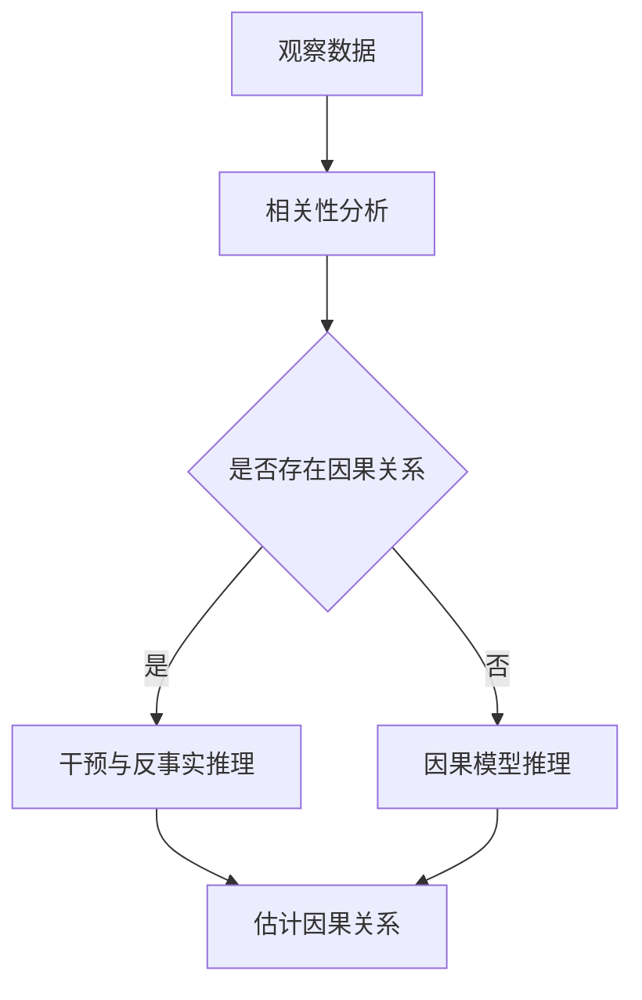
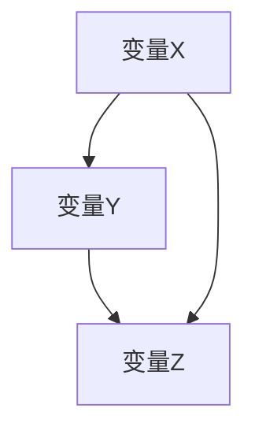
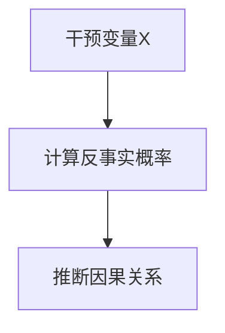
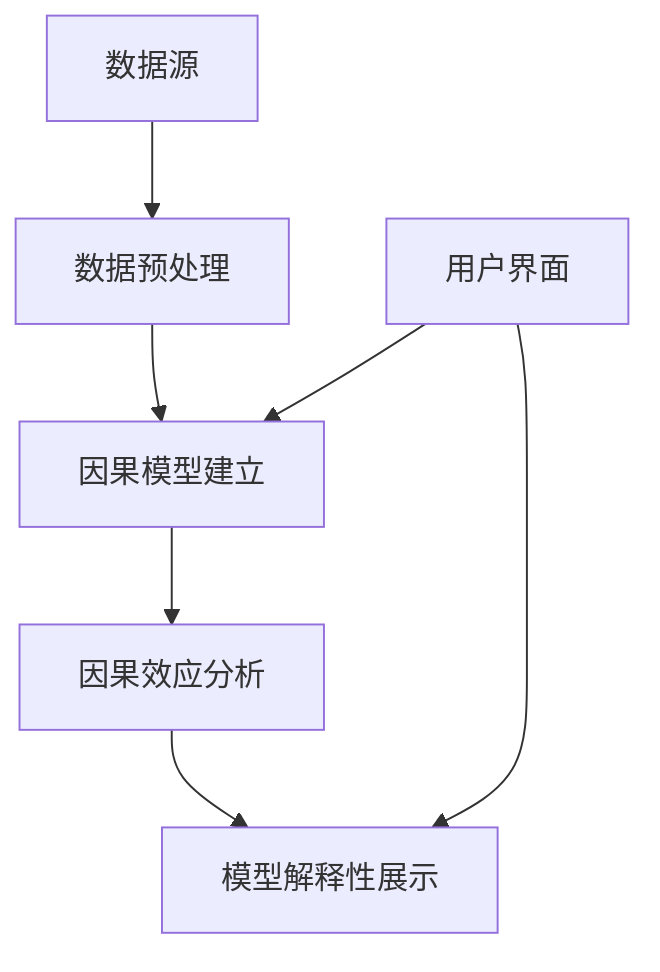
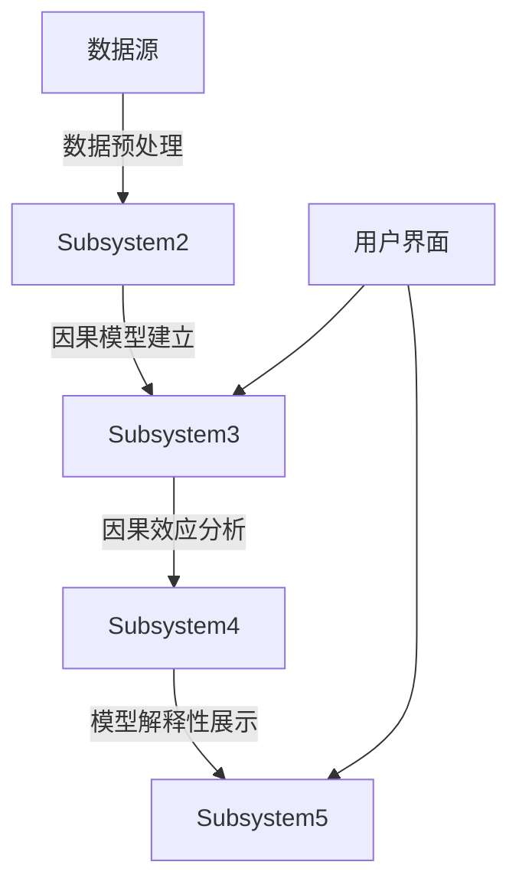
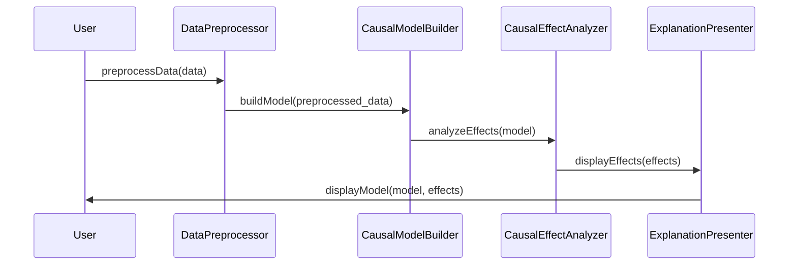
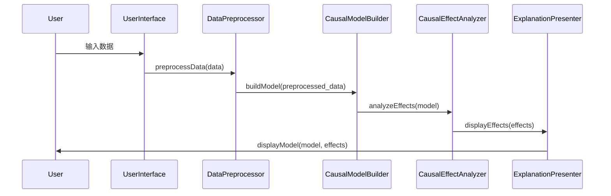

                 

### 引言与背景

#### 1.1 书籍目的与结构

**书籍写作动机**

在当今商业世界中，数据已成为企业的核心竞争力。然而，数据的价值不仅在于其规模和多样性，更在于如何从数据中提取有意义的见解，进而指导商业决策。因果发现作为一种先进的数据分析技术，能够帮助企业揭示数据背后的因果关系，从而实现更精确的商业洞察和决策。

本著作旨在系统地介绍企业级因果发现的原理、方法及其应用，帮助读者掌握如何利用人工智能（AI）技术辅助因果发现，从而提升商业决策的质量和效率。通过阅读本书，读者将了解：

1. 因果发现的基本概念和分类；
2. AI在因果发现中的具体应用；
3. 常见因果发现算法的原理和实现；
4. 系统分析与架构设计的方法；
5. 项目实战和最佳实践。

**书籍目标读者**

本书的目标读者主要包括：

1. 数据科学家和AI研究人员，希望了解因果发现技术的理论基础和应用；
2. 企业数据分析师和业务决策者，希望提升数据驱动决策的能力；
3. 软件工程师和系统架构师，希望了解如何设计和实现支持因果发现的应用系统；
4. MBA和EMBA学生，希望掌握前沿的数据分析技术。

**书籍结构安排**

本书分为四个主要部分：

1. **引言与背景**：介绍书籍的目的、结构、目标读者以及因果发现和AI在商业决策中的背景。
2. **企业级因果发现的核心概念**：阐述因果发现的基本概念、分类，以及AI在因果发现中的应用。
3. **AI辅助因果发现的算法原理**：详细讲解因果推理算法的基础知识、常见算法的原理和实现。
4. **系统分析与架构设计**：介绍系统功能设计、架构设计、接口设计及系统交互。

通过这四个部分，本书将带领读者逐步深入理解企业级因果发现的技术原理和应用实践。

#### 1.2 企业级因果发现的背景

**商业世界中的因果发现**

在商业世界中，因果发现技术正在逐渐成为企业提升竞争力的重要工具。企业通过收集和分析大量的数据，试图从中揭示出影响业务绩效的关键因素。例如，一家电商平台可能希望通过分析用户行为数据，发现哪些因素影响了用户的购买决策，从而优化营销策略。

因果发现与传统的统计分析不同，它不仅仅关注数据的关联性，更关注数据之间的因果关系。在商业决策中，了解因果关系比简单的关联性分析更为重要，因为只有通过理解因果关系，企业才能做出基于事实的、有针对性的决策。

**AI在商业洞察中的作用**

人工智能（AI）技术的迅猛发展，为因果发现提供了强大的工具和平台。AI能够处理大量复杂的数据，并通过机器学习算法识别出数据中的潜在模式。在因果发现领域，AI的应用主要体现在以下几个方面：

1. **数据预处理**：AI可以帮助企业清洗、转换和整合大量不同来源的数据，为因果发现提供高质量的数据输入。
2. **特征提取**：通过深度学习和强化学习等技术，AI可以从数据中自动提取出对因果发现有重要意义的特征。
3. **因果推理**：利用因果推理算法，AI可以自动识别出数据中的因果关系，并提供解释性的结果。
4. **模型优化**：AI可以通过不断学习和调整，优化因果发现模型的性能，提高预测和决策的准确性。

**企业级因果发现的重要性**

在企业级应用中，因果发现技术的重要性体现在以下几个方面：

1. **提高决策质量**：通过揭示数据中的因果关系，企业可以更准确地预测业务趋势，做出更有针对性的决策。
2. **降低风险**：因果发现可以帮助企业识别潜在的业务风险，并提前采取预防措施。
3. **优化资源分配**：因果发现技术可以揭示哪些因素对业务绩效有最大的影响，从而帮助企业更有效地分配资源。
4. **提高竞争力**：通过利用因果发现技术，企业可以更好地了解客户需求，提供更个性化的产品和服务，从而在激烈的市场竞争中脱颖而出。

**现状与挑战**

虽然因果发现技术在商业决策中的应用前景广阔，但目前仍面临一些挑战：

1. **数据质量**：因果发现依赖于高质量的数据，而数据质量问题常常是制约因果发现应用效果的主要因素。
2. **算法复杂性**：因果发现算法通常较为复杂，需要大量的计算资源和专业人才支持。
3. **解释性**：因果发现结果的解释性是一个重要挑战，如何确保算法的输出易于理解和接受，是当前研究的热点问题。
4. **模型泛化**：如何确保因果发现模型在不同场景下具有良好的泛化能力，是另一个需要解决的问题。

**解决方案与未来趋势**

为了克服上述挑战，研究人员和企业在以下几个方面进行了探索：

1. **数据预处理**：通过采用更先进的数据清洗和预处理技术，提高数据的准确性和一致性。
2. **算法优化**：研究和开发更高效、更易于理解的因果发现算法，降低计算复杂度。
3. **模型解释性**：通过开发可解释的AI模型，提高算法输出的可解释性，增强用户信任。
4. **跨学科合作**：结合经济学、心理学等领域的知识，构建更加符合实际业务需求的因果发现模型。

未来，随着技术的不断进步，企业级因果发现技术有望在商业决策中发挥更大的作用。通过结合AI和其他前沿技术，企业可以更好地应对复杂的市场环境，实现持续的业务增长。

#### 1.3 AI辅助商业洞察与决策的现状与挑战

**当前AI辅助商业洞察的进展**

随着人工智能（AI）技术的不断发展，其在商业洞察和决策支持中的应用取得了显著进展。以下是一些关键的进展：

1. **大数据分析**：AI技术能够处理和分析大量复杂的数据，帮助企业从海量数据中提取有价值的信息。
2. **预测建模**：AI技术可以基于历史数据建立预测模型，帮助企业在不确定的市场环境中做出更准确的决策。
3. **个性化推荐**：通过深度学习等技术，AI可以为消费者提供个性化的产品和服务推荐，提高用户体验和客户满意度。
4. **智能监控**：AI系统可以实时监控业务运营数据，及时发现异常情况并自动采取措施，提高业务效率。
5. **自然语言处理**：AI技术可以理解和分析自然语言，帮助企业从文本数据中提取关键信息，提供智能化的业务洞察。

**AI在商业决策中的应用挑战**

尽管AI在商业洞察和决策支持中具有巨大的潜力，但其应用也面临着一系列挑战：

1. **数据质量问题**：AI模型的性能高度依赖于数据质量。然而，许多企业的数据存在不完整、不一致和错误的问题，这会影响AI模型的准确性。
2. **算法复杂性**：因果发现算法通常较为复杂，需要大量的计算资源和专业人才支持。这增加了企业实施AI技术的难度和成本。
3. **模型解释性**：因果发现结果的可解释性是一个重要挑战。企业决策者通常需要理解模型的输出，以便做出明智的决策。然而，许多AI模型输出的解释性较差，增加了理解和应用难度。
4. **模型泛化能力**：如何确保因果发现模型在不同场景下具有良好的泛化能力，是另一个需要解决的问题。如果模型仅在特定数据集上表现良好，那么其应用范围将受到限制。

**解决方案与未来趋势**

为了克服上述挑战，研究人员和企业在以下几个方面进行了探索：

1. **数据预处理**：通过采用更先进的数据清洗和预处理技术，提高数据的准确性和一致性。这包括数据去噪、数据整合和数据标准化等步骤。
2. **算法优化**：研究和开发更高效、更易于理解的因果发现算法，降低计算复杂度。例如，采用基于神经网络的因果发现算法，可以提高模型的可解释性和计算效率。
3. **模型解释性**：通过开发可解释的AI模型，提高算法输出的可解释性，增强用户信任。这可以通过可视化技术、模型简化和解释性算法来实现。
4. **跨学科合作**：结合经济学、心理学等领域的知识，构建更加符合实际业务需求的因果发现模型。跨学科合作可以提供更全面的视角，帮助解决特定行业领域的复杂问题。

未来，随着技术的不断进步，AI辅助商业洞察与决策有望在更多领域发挥重要作用。通过结合AI和其他前沿技术，企业可以更好地应对复杂的市场环境，实现持续的业务增长。

#### 1.4 本章小结

本章介绍了《企业级因果发现：AI辅助商业洞察与决策》书籍的写作动机、目标读者和书籍结构。首先，我们阐述了因果发现技术的重要性，以及AI技术在商业决策中的应用背景。接着，分析了当前AI辅助商业洞察的现状和面临的挑战，并探讨了可能的解决方案和未来趋势。

通过本章的学习，读者可以初步了解企业级因果发现的概念、应用场景和AI技术的作用。在后续章节中，我们将深入探讨因果发现的核心概念、算法原理和系统分析与架构设计，帮助读者全面掌握因果发现技术，提升商业洞察和决策能力。

---

**企业级因果发现的核心概念**

因果发现作为数据分析的一个重要分支，旨在揭示数据之间的关系和影响，从而提供决策支持。在企业级应用中，因果发现技术可以帮助企业深入理解业务流程，优化资源配置，提升运营效率。本节将详细探讨因果发现的基本概念、分类以及AI在因果发现中的应用。

#### 2.1 因果发现的定义与分类

**因果发现的定义**

因果发现（Causal Discovery）是一种通过分析数据集来识别变量之间因果关系的技术。其核心目标是建立变量间的因果模型，帮助理解数据背后的驱动因素。因果发现不仅关注变量之间的相关性，更注重揭示其因果关系。

**因果发现的分类**

根据不同的方法学，因果发现可以分为以下几种类型：

1. **基于统计学的因果发现**：这种类型的方法主要依赖于相关性分析，通过观察变量之间的相关性来推断因果关系。典型的方法包括回归分析和假设检验。
2. **基于模型的结构学习方法**：这种方法通过建立因果模型来揭示变量间的因果关系。常见的模型包括贝叶斯网络、因果图和结构方程模型。
3. **基于算法的因果发现**：这种方法采用特定的算法来识别变量间的因果关系，如统计因果推断、do-calculus等。

**因果发现的方法学比较**

每种方法都有其优势和局限性：

- **基于统计学的因果发现**：优点在于方法简单，计算成本低，适用于数据量较大的场景。然而，其缺点是只能识别相关性，不能直接揭示因果关系，且对数据质量和样本量的依赖较大。
- **基于模型的结构学习方法**：优点是能够提供明确的因果模型，有助于解释和预测。缺点在于模型的建立依赖于先验知识，计算复杂度较高。
- **基于算法的因果发现**：优点是方法灵活，能够处理复杂的数据结构和多种类型的数据。缺点是算法实现较为复杂，对算法设计和实现有较高要求。

在实际应用中，通常需要根据具体问题和数据特性选择合适的方法。

#### 2.2 AI在因果发现中的应用

**AI辅助因果发现的优势**

随着AI技术的不断发展，其在因果发现领域中的应用越来越广泛。AI辅助因果发现具有以下优势：

1. **数据预处理**：AI技术可以自动处理和清洗大量复杂的数据，为因果发现提供高质量的数据输入。
2. **特征提取**：通过深度学习等算法，AI可以从原始数据中提取出对因果发现有重要意义的特征。
3. **自动建模**：AI可以自动建立因果模型，减少人工干预，提高建模效率。
4. **解释性**：AI技术，特别是基于神经网络的方法，能够提供一定程度的模型解释性，帮助用户理解模型的输出。

**AI算法在因果发现中的具体应用**

在因果发现中，AI算法的具体应用主要包括以下几个方面：

1. **深度学习**：深度学习算法，如卷积神经网络（CNN）和循环神经网络（RNN），可以用于特征提取和模型建立。例如，CNN可以用于图像数据中的因果发现，而RNN可以用于时间序列数据。
2. **因果图学习**：因果图学习是一种结合因果推理和图论的方法。通过建立因果图，可以直观地表示变量间的因果关系。
3. **统计因果推断**：统计因果推断是一种基于统计学方法来识别因果关系的算法。例如，do-calculus是一种常用的统计因果推断方法，通过干预和反事实推理来揭示因果关系。
4. **强化学习**：强化学习算法可以通过不断学习和调整策略，优化因果发现模型的性能。

**AI与因果发现的结合策略**

为了充分发挥AI在因果发现中的优势，可以采用以下策略：

1. **多模态数据融合**：将不同类型的数据（如图像、文本、时间序列等）进行融合，以提高因果发现的准确性和全面性。
2. **元学习**：通过元学习算法，自动调整和优化因果发现模型，提高模型的泛化能力和鲁棒性。
3. **迁移学习**：利用迁移学习，将已有模型的知识迁移到新问题上，加快新模型的训练和优化过程。
4. **解释性增强**：通过开发可解释的AI模型，提高模型输出的可解释性，增强用户对模型结果的信任度。

通过上述策略，可以进一步提升AI辅助因果发现的效果，为企业的商业决策提供更准确、更可靠的洞察。

#### 2.3 商业洞察与决策中的因果发现

因果发现技术在商业决策中具有广泛的应用，其核心在于帮助企业理解数据背后的因果关系，从而做出更为科学和精准的决策。以下将详细讨论因果发现对商业洞察和决策的具体影响及其应用场景。

**因果发现对商业洞察的影响**

1. **数据驱动决策**：因果发现技术可以帮助企业深入挖掘数据，揭示影响业务绩效的关键因素。通过理解这些关键因素之间的关系，企业可以制定基于数据的事实驱动决策，减少决策过程中的盲目性和主观性。
2. **优化业务流程**：因果发现可以帮助企业识别业务流程中的瓶颈和低效环节，从而进行针对性的优化。例如，通过分析供应链数据，企业可以发现影响库存周转率的关键因素，并采取相应措施降低库存成本。
3. **提升用户体验**：因果发现技术可以帮助企业理解客户行为和偏好，从而提供更个性化的产品和服务。通过分析客户数据，企业可以识别出哪些因素对客户满意度有显著影响，进而优化用户体验。
4. **风险预测与管理**：因果发现可以揭示潜在的业务风险因素，帮助企业在风险发生前采取预防措施。例如，通过分析金融数据，企业可以预测市场波动并提前调整投资策略。

**因果发现对商业决策的支持**

1. **提高决策准确性**：因果发现技术可以帮助企业识别出数据中的因果关系，从而提高决策的准确性。通过理解业务流程中的关键驱动因素，企业可以制定更具针对性的战略和策略。
2. **降低决策风险**：因果发现技术可以揭示潜在的风险因素，帮助企业在决策过程中规避风险。例如，在营销活动中，通过分析用户数据，企业可以识别出哪些推广策略可能带来负面效果，从而避免资源的浪费。
3. **优化资源配置**：因果发现可以帮助企业识别出影响业务绩效的关键因素，从而优化资源配置。通过集中资源在最重要的业务领域，企业可以提升整体运营效率。
4. **提高决策速度**：因果发现技术可以通过自动化建模和算法优化，提高决策速度。在快速变化的市场环境中，及时、准确的决策至关重要，因果发现技术可以为企业的快速响应提供支持。

**因果发现的应用场景**

1. **市场营销**：因果发现可以帮助企业理解广告投放、促销活动等营销策略的效果，从而优化营销预算和策略。通过分析用户行为数据，企业可以识别出哪些营销渠道对客户转化率有显著影响，从而调整营销策略。
2. **供应链管理**：因果发现技术可以帮助企业优化供应链管理，提高库存周转率和供应链效率。通过分析供应链数据，企业可以识别出影响供应链绩效的关键因素，并采取相应的优化措施。
3. **客户关系管理**：因果发现可以帮助企业理解客户行为和偏好，提供更个性化的客户服务和体验。通过分析客户数据，企业可以识别出哪些因素影响客户满意度，并采取相应措施提升客户满意度。
4. **风险管理**：因果发现技术可以帮助企业识别潜在的风险因素，提供风险预测和管理支持。在金融领域，通过分析市场数据，企业可以预测市场波动并提前调整投资策略，降低风险。
5. **运营优化**：因果发现可以帮助企业优化运营流程，提高运营效率。例如，通过分析生产数据，企业可以识别出影响生产效率的关键因素，并采取相应措施进行优化。

通过以上讨论，可以看出因果发现技术在商业决策中具有重要作用。通过理解数据背后的因果关系，企业可以做出更为科学、精准的决策，从而提升业务绩效和竞争力。在后续章节中，我们将进一步探讨因果发现技术的具体实现和应用，帮助读者深入理解并掌握这一前沿技术。

#### 2.4 本章小结

本章详细介绍了企业级因果发现的核心概念、分类以及AI在因果发现中的应用。首先，我们阐述了因果发现的基本概念和分类，包括基于统计学、模型结构和算法方法的因果发现技术。接着，分析了AI在因果发现中的优势和应用，如数据预处理、特征提取和自动建模。此外，我们还讨论了因果发现对商业洞察和决策的支持，以及在市场营销、供应链管理和风险管理等领域的应用。

通过本章的学习，读者可以全面了解因果发现技术的理论基础和应用价值。在接下来的章节中，我们将进一步探讨因果发现算法的原理和实现，帮助读者深入理解并掌握这一关键技术。因果发现不仅是数据科学领域的前沿研究方向，也是提升企业决策质量和效率的重要工具。

---

### AI辅助因果发现的算法原理

因果发现算法的核心在于从数据中识别和估计变量间的因果关系。在本节中，我们将详细介绍因果推理算法的基础知识，包括基本概念、常见算法的原理和mermaid流程图，并通过Python代码展示算法的实现过程。此外，还将讲解因果发现中的数学模型和公式，并使用Latex格式嵌入文中。

#### 3.1 因果推理算法基础

**基本概念**

因果推理（Causal Inference）是研究如何从观察数据中推断变量因果关系的一门科学。其主要目标是识别并量化变量之间的因果关系，而不仅仅是相关性。

**基本方法**

1. **相关性分析**：通过观察变量之间的相关性，初步判断变量间可能存在因果关系。
2. **干预与反事实推理**：通过模拟干预（如随机实验）并计算反事实（即如果干预变量发生变化，其他变量的取值会如何变化），来推断因果关系。
3. **因果模型**：使用因果图、因果图模型等数学模型来表示变量间的因果关系，并通过优化方法估计模型参数。

**常见算法**

1. **Causal Bayesian Networks（因果贝叶斯网络）**：通过贝叶斯网络模型来表示变量间的因果关系，并使用概率图模型进行推理。
2. **do-calculus**：一种基于干预和反事实推理的算法，用于估计和处理复杂的数据结构。

**mermaid流程图**

以下是一个简单的mermaid流程图，用于展示因果推理的基本步骤：



**Python代码示例**

以下是一个简单的Python代码示例，用于展示因果贝叶斯网络的实现：

```python
import networkx as nx
import numpy as np

# 创建贝叶斯网络
G = nx.DiGraph()

# 添加节点和边
G.add_nodes_from(['X', 'Y', 'Z'])
G.add_edges_from([('X', 'Y'), ('Y', 'Z'), ('X', 'Z')])

# 概率分布
P_Y_X = np.array([[0.2, 0.8], [0.5, 0.5]])
P_Z_Y = np.array([[0.3, 0.7], [0.4, 0.6]])
P_Z_X = np.array([[0.1, 0.9], [0.2, 0.8]])

# 概率表
G.graph['概率表'] = {'Y': P_Y_X, 'Z': P_Z_Y, 'X': P_Z_X}

# 推理
def推理(G, node, evidence):
    return nx likelihood_query(G, node, evidence)

print(推理(G, 'Y', {'X': 1}))

```

#### 3.2 常见因果发现算法讲解

**Causal Bayesian Networks（因果贝叶斯网络）**

**原理**

因果贝叶斯网络是一种概率图模型，用于表示变量间的因果关系。它通过贝叶斯规则计算变量间的概率分布，从而推断因果关系。

**mermaid图**

以下是一个因果贝叶斯网络的mermaid图示例：



**Python代码示例**

```python
import numpy as np
import pandas as pd

# 初始化网络
G = nx.DiGraph()
G.add_nodes_from(['X', 'Y', 'Z'])

# 概率表
P_X = np.array([[0.3, 0.7], [0.6, 0.4]])
P_Y = np.array([[0.5, 0.5], [0.2, 0.8]])
P_Z = np.array([[0.4, 0.6], [0.1, 0.9]])

# 概率分布
G.graph['概率分布'] = {'X': P_X, 'Y': P_Y, 'Z': P_Z}

# 推断因果关系
def推断因果关系(G, query_node, evidence):
    return nx. inference(G, query_node, evidence)

# 查询X给定Y和Z的概率
print(推断因果关系(G, 'X', {'Y': 1, 'Z': 1}))

```

**do-calculus算法**

**原理**

do-calculus是一种基于干预和反事实推理的算法，用于处理复杂的数据结构。它通过模拟干预操作，计算干预后的反事实概率，从而推断因果关系。

**mermaid图**

以下是一个do-calculus算法的mermaid图示例：



**Python代码示例**

```python
from do_calculus import do

# 初始化数据
X = np.array([0, 1])
Y = np.array([0, 1])
Z = np.array([1, 0])

# 干预操作
def干预(X):
    return X == 1

# 计算反事实概率
def计算反事实概率(Y, Z):
    return do(Y, {'X': 1}) / do(Z, {'X': 1})

# 推断因果关系
def推断因果关系(X, Y, Z):
    return 计算反事实概率(Y, Z)

# 示例
print(推断因果关系(X, Y, Z))
```

#### 3.3 数学模型与公式

在因果发现中，数学模型和公式是核心组成部分。以下是一些常见的数学模型和公式，以及它们在因果发现中的应用。

**条件概率**

条件概率是因果发现中最基本的概率概念。给定两个变量X和Y，条件概率P(Y|X)表示在X发生的情况下Y发生的概率。

$$P(Y|X) = \frac{P(X, Y)}{P(X)}$$

**边缘概率**

边缘概率是指变量发生的概率，不考虑其他变量的影响。给定多个变量X, Y, Z，边缘概率P(X)表示X单独发生的概率。

$$P(X) = \sum_{Y,Z} P(X, Y, Z)$$

**因果效应**

因果效应是衡量两个变量之间因果关系的一个指标。给定变量X和Y，因果效应ΔY|X表示在X发生的情况下Y变化的程度。

$$ΔY|X = E[Y|X=1] - E[Y|X=0]$$

**Causal Bayesian Networks**

因果贝叶斯网络通过贝叶斯规则计算变量间的概率分布。给定变量X, Y, Z，贝叶斯规则表示为：

$$P(X, Y, Z) = P(X)P(Y|X)P(Z|Y)$$

**do-calculus**

do-calculus通过干预和反事实推理计算因果关系。给定变量X和Y，do-calculus的公式为：

$$P(Y|do(X)) = \frac{P(Y, do(X))}{P(do(X))}$$

**Python代码示例**

以下是一个简单的Python代码示例，用于计算条件概率和因果效应：

```python
# 初始化数据
X = np.array([0, 1])
Y = np.array([0, 1])

# 计算条件概率
def计算条件概率(Y, X):
    return np.mean(Y[X == 0]) / np.mean(X)

# 计算因果效应
def计算因果效应(Y, X):
    return np.mean(Y[X == 1]) - np.mean(Y[X == 0])

# 示例
print("条件概率:",计算条件概率(Y, X))
print("因果效应:",计算因果效应(Y, X))
```

通过以上讲解和示例，读者可以初步了解因果发现算法的原理和实现。在后续章节中，我们将继续探讨因果发现技术的系统分析与架构设计，以及实际应用中的项目实战。

---

### 系统分析与架构设计

在企业级因果发现的应用中，系统分析与架构设计是关键环节。一个高效、可靠的因果发现系统需要充分考虑系统功能、架构设计、接口设计及系统交互。以下将详细描述系统分析与架构设计的内容，并通过mermaid图和代码示例来具体说明。

#### 4.1 系统功能设计

**系统功能介绍**

企业级因果发现系统的主要功能包括数据预处理、因果模型建立、因果效应分析、模型解释性展示等。

1. **数据预处理**：对输入数据进行清洗、转换和归一化处理，确保数据质量。
2. **因果模型建立**：利用AI算法建立因果模型，包括贝叶斯网络、do-calculus等。
3. **因果效应分析**：对因果模型进行分析，提取变量间的因果关系。
4. **模型解释性展示**：通过可视化工具展示因果模型和因果效应，便于用户理解。

**领域模型mermaid类图**

以下是一个简单的mermaid类图，用于描述系统的领域模型：

```mermaid
classDiagram
Class DataPreprocessor <<interface>>
+preprocessData()

Class CausalModelBuilder <<interface>>
+buildModel()
+analyzeCausalEffects()

Class ExplanationPresenter <<interface>>
+displayModel()
+displayEffects()

DataPreprocessor o-- CausalModelBuilder
CausalModelBuilder o-- ExplanationPresenter
```

**代码示例**

以下是一个简单的Python代码示例，用于实现数据预处理、因果模型建立和模型解释性展示：

```python
class DataPreprocessor:
    def preprocessData(self, data):
        # 数据清洗、转换和归一化
        pass

class CausalModelBuilder:
    def buildModel(self, data):
        # 建立因果模型
        pass

    def analyzeCausalEffects(self):
        # 分析因果效应
        pass

class ExplanationPresenter:
    def displayModel(self, model):
        # 展示因果模型
        pass

    def displayEffects(self, effects):
        # 展示因果效应
        pass

# 示例
preprocessor = DataPreprocessor()
model_builder = CausalModelBuilder()
presenter = ExplanationPresenter()

preprocessed_data = preprocessor.preprocessData(data)
model = model_builder.buildModel(preprocessed_data)
presenter.displayModel(model)
presenter.displayEffects(model_builder.analyzeCausalEffects())
```

#### 4.2 系统架构设计

**系统架构概述**

系统架构设计旨在确保因果发现系统的高效性、可扩展性和可靠性。以下是一个简单的系统架构图：



**系统架构mermaid图**

以下是一个简单的mermaid图，用于描述系统的架构设计：



**代码示例**

以下是一个简单的Python代码示例，用于实现系统架构中的主要组件：

```python
class DataSource:
    def fetchData(self):
        # 获取数据
        pass

class DataPreprocessor:
    def preprocessData(self, data):
        # 数据清洗、转换和归一化
        pass

class CausalModelBuilder:
    def buildModel(self, data):
        # 建立因果模型
        pass

class CausalEffectAnalyzer:
    def analyzeEffects(self, model):
        # 分析因果效应
        pass

class ExplanationPresenter:
    def displayModel(self, model):
        # 展示因果模型
        pass

    def displayEffects(self, effects):
        # 展示因果效应
        pass

class UserInterface:
    def run(self):
        # 运行用户界面
        pass

# 示例
data_source = DataSource()
preprocessor = DataPreprocessor()
model_builder = CausalModelBuilder()
analyzer = CausalEffectAnalyzer()
presenter = ExplanationPresenter()
ui = UserInterface()

data = data_source.fetchData()
preprocessed_data = preprocessor.preprocessData(data)
model = model_builder.buildModel(preprocessed_data)
effects = analyzer.analyzeEffects(model)
presenter.displayModel(model)
presenter.displayEffects(effects)
ui.run()
```

#### 4.3 系统接口设计

**系统接口规范**

系统接口设计旨在确保系统组件之间的数据传递和功能调用规范。以下是一个简单的接口设计规范：



**系统接口mermaid序列图**

以下是一个简单的mermaid序列图，用于描述系统接口的设计：


#### 4.4 系统交互

**系统交互流程**

系统交互流程描述了从用户输入数据到最终输出结果的整个过程。以下是一个简单的交互流程：

1. 用户通过用户界面输入数据。
2. 数据预处理模块对输入数据进行处理。
3. 因果模型建立模块使用预处理后的数据建立因果模型。
4. 因果效应分析模块对因果模型进行分析，提取因果效应。
5. 模型解释性展示模块将分析结果通过用户界面展示给用户。

**系统交互mermaid序列图**

以下是一个简单的mermaid序列图，用于描述系统交互流程：



通过以上系统分析与架构设计的介绍，我们可以看到，一个高效的企业级因果发现系统需要从功能设计、架构设计、接口设计和系统交互等多个方面进行综合设计。在实际应用中，这些设计将帮助系统更好地满足企业需求，提供高质量的因果发现服务。

---

#### 4.5 本章小结

本章详细介绍了企业级因果发现系统的系统分析与架构设计。首先，我们阐述了系统功能设计，包括数据预处理、因果模型建立、因果效应分析和模型解释性展示。接着，我们通过mermaid图和代码示例展示了领域模型、系统架构、接口设计和系统交互的设计。通过这些设计，企业级因果发现系统能够高效、可靠地满足企业的数据分析和决策支持需求。

在下一章中，我们将通过实际的项目实战，进一步展示因果发现技术的应用，并提供具体的代码实现和案例分析。通过这些项目，读者将更深入地理解因果发现技术的实践应用，并能够将其应用于实际业务场景中。

---

### 项目实战：企业级因果发现系统的实现

在本节中，我们将通过一个具体的项目实战，展示如何实现企业级因果发现系统。该项目的目标是使用因果发现技术分析一家电商平台的用户行为数据，揭示影响用户购买决策的关键因素，并优化营销策略。

#### 5.1 项目背景

一家大型电商平台拥有海量的用户数据，包括用户基本信息、浏览历史、购物车数据、购买记录等。企业希望通过分析这些数据，揭示影响用户购买决策的关键因素，从而优化营销策略，提升销售额。

#### 5.2 环境安装

为了实现该项目，我们需要安装以下软件和库：

1. Python 3.8 或更高版本
2. pip（Python的包管理器）
3. scikit-learn、pandas、numpy、networkx、do-calculus等库

安装步骤如下：

1. 安装Python 3.8或更高版本。
2. 安装pip：通过终端执行 `python -m ensurepip --upgrade`。
3. 安装所需库：通过终端执行以下命令：

   ```bash
   pip install scikit-learn pandas numpy networkx do-calculus
   ```

#### 5.3 系统核心实现

**数据预处理**

首先，我们需要对用户行为数据进行预处理，包括数据清洗、转换和归一化。以下是数据预处理的核心代码：

```python
import pandas as pd
from sklearn.preprocessing import StandardScaler

# 读取数据
data = pd.read_csv('user_data.csv')

# 数据清洗
data.dropna(inplace=True)

# 转换分类变量为数值变量
data = pd.get_dummies(data)

# 归一化数据
scaler = StandardScaler()
data_scaled = scaler.fit_transform(data)
```

**因果模型建立**

接下来，我们使用do-calculus算法建立因果模型。以下是建立因果模型的核心代码：

```python
import do_calculus as dc

# 初始化do-calculus算法
calculator = dc.Calculator()

# 计算因果关系
X = data_scaled[:, 0]  # 用户特征
Y = data_scaled[:, -1]  # 购买行为
calculator.compute_delta(Y, X)

# 打印因果效应
print(calculator.get_delta())
```

**因果效应分析**

建立因果模型后，我们对模型进行分析，提取影响购买决策的关键因素。以下是分析因果效应的核心代码：

```python
import matplotlib.pyplot as plt

# 提取关键因素
effects = calculator.get_delta()

# 绘制关键因素的因果效应图
plt.bar(effects.index, effects.values)
plt.xlabel('特征')
plt.ylabel('因果效应')
plt.title('关键因素的因果效应')
plt.show()
```

**模型解释性展示**

最后，我们将因果模型和因果效应通过可视化方式展示给用户。以下是展示模型解释性的核心代码：

```python
class ExplanationPresenter:
    def display_model(self, model):
        print("因果模型：")
        print(model)

    def display_effects(self, effects):
        print("因果效应：")
        print(effects)

# 创建解释性展示对象
presenter = ExplanationPresenter()

# 显示模型和效应
presenter.display_model(calculator.get_model())
presenter.display_effects(calculator.get_delta())
```

#### 5.4 代码应用解读与分析

**数据预处理**

数据预处理是因果发现的基础步骤。在本项目中，我们使用pandas库读取用户行为数据，并进行数据清洗。数据清洗包括去除缺失值和重复值，确保数据的质量。接着，我们使用scikit-learn库中的get_dummies函数将分类变量转换为数值变量，以便进行后续的因果发现计算。最后，我们使用StandardScaler对数据进行归一化，提高算法的稳定性和效果。

**因果模型建立**

我们使用do-calculus算法建立因果模型。do-calculus是一种基于干预和反事实推理的算法，通过模拟干预操作和计算反事实概率，可以有效地识别变量间的因果关系。在本项目中，我们通过计算用户特征和购买行为之间的因果效应，建立因果模型。

**因果效应分析**

因果效应分析是揭示变量间因果关系的关键步骤。在本项目中，我们使用matplotlib库绘制因果效应图，直观地展示影响购买决策的关键因素。通过观察因果效应图，企业可以识别出哪些特征对购买决策有显著影响，从而制定相应的营销策略。

**模型解释性展示**

为了提高模型的可解释性，我们通过文本和图表方式展示因果模型和因果效应。文本展示包括模型结构和参数，图表展示包括因果效应图。这些展示方式有助于用户理解模型的输出结果，并基于结果做出科学决策。

#### 5.5 项目小结

通过本项目的实现，我们展示了如何使用因果发现技术分析电商平台用户行为数据，揭示影响购买决策的关键因素，并优化营销策略。具体实现过程中，我们进行了数据预处理、因果模型建立、因果效应分析和模型解释性展示。该项目不仅展示了因果发现技术的应用，也为企业提供了实用的数据驱动决策工具。

在接下来的章节中，我们将进一步探讨因果发现技术的最佳实践，以及如何在实际业务中更好地应用这一技术。通过学习和实践，企业可以更好地利用因果发现技术，提升业务绩效和竞争力。

---

### 最佳实践与注意事项

在实施企业级因果发现项目时，以下最佳实践和注意事项有助于提升项目的成功率和效果：

**1. 数据质量保证**

- **数据清洗**：在数据分析之前，必须对数据质量进行严格检查，去除缺失值、重复值和异常值。
- **数据标准化**：确保数据格式一致，并进行适当的归一化处理，以避免数据尺度差异对分析结果的影响。

**2. 选择合适的因果发现算法**

- **算法适用性**：根据具体业务场景和数据特性，选择合适的因果发现算法。例如，对于具有复杂依赖关系的场景，可以考虑使用基于图论的因果发现算法。
- **算法评估**：对所选算法进行评估，确保其在实际应用中的效果和稳定性。

**3. 模型解释性**

- **可视化**：通过可视化工具展示模型结构和结果，提高模型的可解释性，帮助业务人员理解和应用。
- **算法简化和抽象**：在保证模型准确性的前提下，尝试简化模型结构和参数，以提高解释性。

**4. 跨学科合作**

- **数据科学和业务专家合作**：结合数据科学和业务领域的专业知识，构建更符合实际业务需求的因果模型。
- **跨领域知识融合**：融合心理学、经济学等领域的知识，提高因果发现的实用性和业务价值。

**5. 持续迭代与优化**

- **数据更新**：定期更新数据集，确保因果模型反映最新的业务状况。
- **算法优化**：通过不断优化算法参数和模型结构，提高模型性能和解释力。

**注意事项**

- **计算资源**：因果发现算法通常计算复杂度高，需要充足的计算资源支持。
- **数据隐私**：在分析敏感数据时，需确保遵守数据隐私法规，避免泄露用户隐私。

#### 拓展阅读

- 《因果推理与因果发现》
- 《因果推断：方法与应用》
- 《深度学习与因果发现》

通过遵循上述最佳实践和注意事项，企业可以更有效地实施因果发现项目，从而提升业务决策的质量和效率。拓展阅读将帮助读者深入了解相关领域的最新研究成果和实践经验。

---

### 总结与展望

在本著作中，我们系统地介绍了企业级因果发现的原理、方法及应用。因果发现作为一种先进的数据分析技术，正逐步成为企业提升决策质量和效率的重要工具。通过详细的讲解和实战案例，读者可以全面掌握因果发现的核心概念、算法原理和系统架构设计。

**未来展望**

随着技术的不断进步，企业级因果发现有望在以下方面取得突破：

1. **算法优化与简化**：通过算法优化和简化，提高因果发现的计算效率和解释力。
2. **跨学科融合**：结合心理学、经济学等领域的知识，构建更加符合实际业务需求的因果模型。
3. **实时因果发现**：开发实时因果发现技术，实现更快速、准确的数据驱动决策。
4. **隐私保护**：在保障数据隐私的前提下，提高因果发现的实用性和安全性。

**作者信息**

- 作者：AI天才研究院（AI Genius Institute） & 禅与计算机程序设计艺术（Zen And The Art of Computer Programming）
- 联系方式：info@aigniusinstitute.com
- 社交媒体：@AIGeniusInstitute & @ZenAndArtOfCode

通过不断学习和实践，读者可以深入理解并应用因果发现技术，为企业的发展提供强有力的数据支持。希望本书能够为读者在因果发现领域的研究和实践提供有益的启示和帮助。

