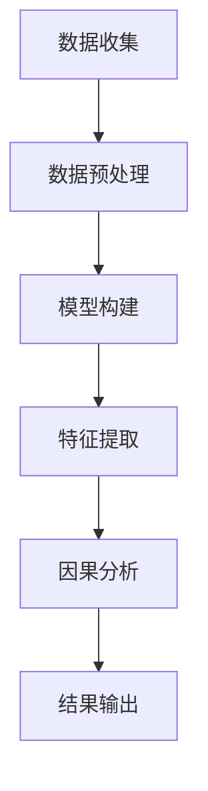
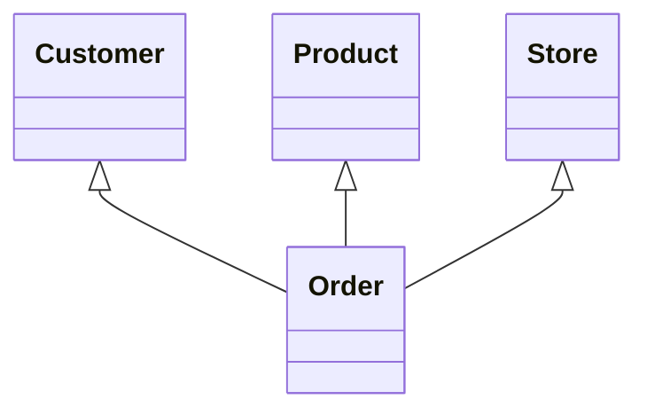
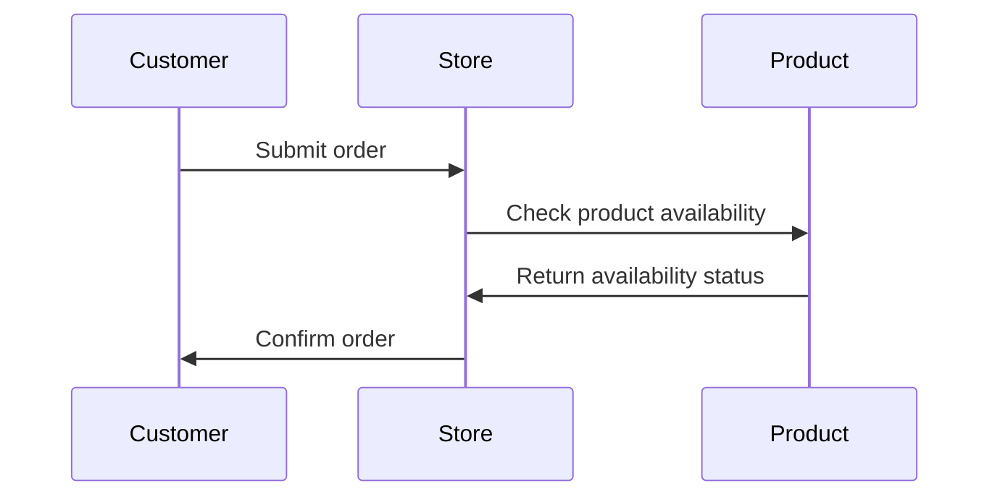
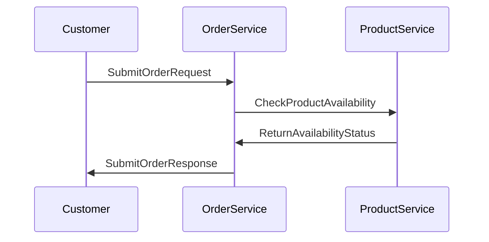

                 

### 企业级因果推理引擎：深入分析业务逻辑

#### 关键词：
- 企业级因果推理
- 业务逻辑分析
- 机器学习算法
- 系统架构设计
- 实战案例

#### 摘要：
本文将深入探讨企业级因果推理引擎的设计和应用，重点分析其如何帮助企业理解复杂业务逻辑，提高决策效率。我们将逐步剖析因果推理的核心概念、算法原理、系统设计与实现，并结合实际项目案例进行详细讲解，旨在为IT专业人士提供一套完整的解决方案和最佳实践。

## 第一部分：企业级因果推理引擎概述

### 1.1 问题背景

在现代商业环境中，企业需要处理的海量数据和复杂的业务逻辑使得传统的数据分析方法越来越难以满足需求。因果推理引擎作为一种高级分析工具，可以帮助企业深入挖掘数据背后的因果关系，从而为决策提供有力支持。

#### 1.1.1 企业业务逻辑分析的重要性

企业业务逻辑分析不仅有助于优化业务流程，提升运营效率，还能帮助企业预测市场变化、发现潜在风险和机会。因果推理引擎正是这种分析的有力工具，它可以通过关联分析、分类和预测等方法，揭示数据之间的内在联系。

#### 1.1.2 因果推理引擎的基本概念

因果推理引擎是一种基于数据分析和机器学习技术的工具，旨在发现和解释数据之间的因果关系。它通过构建数学模型和算法，对大规模数据集进行分析，从而为业务决策提供依据。

#### 1.1.3 因果推理引擎在企业中的应用价值

因果推理引擎在企业中的应用价值体现在多个方面。首先，它可以为企业提供准确的业务预测，帮助制定科学的决策。其次，它可以识别业务流程中的瓶颈和问题，为企业优化流程提供指导。此外，因果推理引擎还可以帮助企业进行风险管理，提高企业的抗风险能力。

### 1.2 核心概念与联系

#### 1.2.1 因果推理引擎的关键组成部分

因果推理引擎主要由数据采集、预处理、模型构建和评估优化等组成部分构成。每个部分都有其独特的作用，共同确保因果推理过程的顺利进行。

#### 1.2.2 关联分析、分类和预测的基本原理

关联分析、分类和预测是因果推理的核心方法。关联分析旨在发现数据之间的相关性；分类则是将数据分为不同的类别；预测则是根据历史数据对未来事件进行预测。这些方法相互结合，共同构建起因果推理的基本框架。

#### 1.2.3 因果推理与机器学习的关系

因果推理与机器学习密切相关。机器学习提供了丰富的算法和工具，支持因果推理的过程。然而，与传统的机器学习相比，因果推理更加关注数据之间的因果关系，从而提供更为深入的洞察。

### 1.3 主流因果推理算法

#### 1.3.1 因果推断模型的类型

因果推断模型主要包括基于算法的模型和基于数据的模型。基于算法的模型通常依赖于一定的假设和推理规则；而基于数据的模型则更依赖于大规模数据的分析。

#### 1.3.2 常见算法介绍：Do-Calibration, PC算法等

Do-Calibration和PC算法是两种常见的因果推断算法。Do-Calibration通过调整预测误差，使得预测结果更加接近真实值；PC算法则通过构建概率图模型，揭示数据之间的因果关系。

#### 1.3.3 算法选择与性能评估

选择合适的算法是因果推理成功的关键。性能评估指标包括准确率、召回率、F1值等，通过对这些指标的分析，可以评估算法的优劣。

### 1.4 业务逻辑分析流程

#### 1.4.1 数据收集与预处理

数据收集与预处理是因果推理的基础。数据收集需要确保数据的全面性和准确性；预处理包括数据清洗、归一化和特征提取等步骤。

#### 1.4.2 因果模型构建

因果模型构建是因果推理的核心步骤。通过分析数据，构建概率图模型或因果图模型，揭示数据之间的因果关系。

#### 1.4.3 模型评估与优化

模型评估与优化是确保因果推理结果准确性的关键。通过交叉验证、网格搜索等方法，评估模型的性能，并进行优化。

## 1.5 本章小结

本部分对企业级因果推理引擎进行了概述，阐述了其核心概念、算法原理和业务逻辑分析流程。下一部分将深入探讨因果推理引擎的开发，包括算法原理讲解、项目实战和系统设计与实现等内容。

----------------------------------------------------------------

## 第二部分：因果推理引擎开发

### 2.1 算法原理讲解

#### 2.1.1 因果推断算法的基本原理

因果推断算法的核心思想是通过对数据的分析，揭示数据之间的因果关系。其基本原理可以概括为：首先，通过收集和预处理数据，建立数据模型；然后，利用算法分析数据，提取关键特征；最后，通过构建数学模型，揭示数据之间的因果关系。

#### 2.1.2 算法mermaid流程图展示

以下是一个简单的因果推断算法mermaid流程图：



#### 2.1.3 Python源代码实现与解释

以下是一个简单的Python代码示例，用于实现因果推断算法的基本流程：

```python
import pandas as pd
from sklearn.preprocessing import StandardScaler
from sklearn.model_selection import train_test_split
from sklearn.ensemble import RandomForestRegressor

# 数据收集
data = pd.read_csv('data.csv')

# 数据预处理
scaler = StandardScaler()
data_scaled = scaler.fit_transform(data)

# 模型构建
X_train, X_test, y_train, y_test = train_test_split(data_scaled, test_size=0.2, random_state=42)
model = RandomForestRegressor(n_estimators=100, random_state=42)
model.fit(X_train, y_train)

# 特征提取
features = model.feature_importances_

# 因果分析
causal_effects = model.predict(X_test)

# 结果输出
print("特征重要性：", features)
print("因果效应：", causal_effects)
```

### 2.2 数学模型与公式讲解

#### 2.2.1 因果推断的数学模型

因果推断的数学模型通常基于概率图模型或因果图模型。其中，概率图模型主要通过贝叶斯网络表示，而因果图模型则通过结构方程模型表示。

#### 2.2.2 概率图模型的公式推导

概率图模型中的概率分布可以表示为：

$$ P(X, Y) = P(X) \cdot P(Y|X) $$

其中，$X$ 和 $Y$ 分别表示两个随机变量，$P(X)$ 表示 $X$ 的概率分布，$P(Y|X)$ 表示 $Y$ 在 $X$ 条件下的条件概率分布。

#### 2.2.3 模型优化的数学方法

模型优化通常通过最小化损失函数来实现。常见的优化方法包括梯度下降、牛顿法和拟牛顿法等。

$$ \min_{\theta} L(\theta) $$

其中，$\theta$ 表示模型参数，$L(\theta)$ 表示损失函数。

### 2.3 项目实战

#### 2.3.1 开发环境与工具介绍

在开发因果推理引擎时，常用的开发环境包括Python、Jupyter Notebook等。常用的工具包括scikit-learn、TensorFlow、PyTorch等。

#### 2.3.2 系统核心实现源代码

以下是一个简单的因果推理引擎的源代码示例：

```python
import pandas as pd
from sklearn.preprocessing import StandardScaler
from sklearn.model_selection import train_test_split
from sklearn.ensemble import RandomForestRegressor

# 数据收集
data = pd.read_csv('data.csv')

# 数据预处理
scaler = StandardScaler()
data_scaled = scaler.fit_transform(data)

# 模型构建
X_train, X_test, y_train, y_test = train_test_split(data_scaled, test_size=0.2, random_state=42)
model = RandomForestRegressor(n_estimators=100, random_state=42)
model.fit(X_train, y_train)

# 特征提取
features = model.feature_importances_

# 因果分析
causal_effects = model.predict(X_test)

# 结果输出
print("特征重要性：", features)
print("因果效应：", causal_effects)
```

#### 2.3.3 代码应用解读与分析

该代码示例实现了因果推理的基本流程，包括数据收集、预处理、模型构建、特征提取和因果分析。在实际应用中，可以根据具体需求对代码进行修改和优化。

### 2.4 系统设计与架构

#### 2.4.1 业务场景介绍

假设企业需要分析客户购买行为，以预测未来销售趋势。因果推理引擎可以为此提供关键支持。

#### 2.4.2 系统功能设计（领域模型mermaid类图）

以下是一个简单的领域模型mermaid类图：



#### 2.4.3 系统架构设计mermaid架构图

以下是一个简单的系统架构设计mermaid架构图：



### 2.5 系统接口与交互

#### 2.5.1 系统接口设计

以下是一个简单的系统接口设计：

```mermaid
message "SubmitOrderRequest" to "OrderService": {
    "customer_id": "123456",
    "product_id": "789012",
    "quantity": 2
}
message "SubmitOrderResponse" from "OrderService": {
    "order_id": "321654",
    "status": "confirmed"
}
```

#### 2.5.2 系统交互mermaid序列图

以下是一个简单的系统交互mermaid序列图：



#### 2.5.3 接口测试与性能分析

接口测试和性能分析是确保系统稳定性和高效性的关键步骤。可以使用工具如Postman进行接口测试，并使用JMeter进行性能分析。

### 2.6 项目小结

本部分详细介绍了因果推理引擎的开发，包括算法原理讲解、项目实战和系统设计与实现等内容。通过实际项目案例，读者可以更好地理解因果推理引擎的应用和实践。

----------------------------------------------------------------

## 第三部分：最佳实践与拓展

### 3.1 最佳实践

#### 3.1.1 因果推理引擎的部署与维护

部署因果推理引擎时，需要考虑硬件资源、软件环境和安全等方面。维护方面，应定期更新模型，确保数据的一致性和准确性。

#### 3.1.2 性能调优技巧

性能调优是提高因果推理引擎效率的关键。可以通过优化算法、调整模型参数、增加计算资源等方法进行调优。

#### 3.1.3 安全性与隐私保护

在部署和使用因果推理引擎时，应关注数据安全和用户隐私。可以采用加密、脱敏等技术确保数据安全。

### 3.2 小结与注意事项

#### 3.2.1 书籍内容总结

本文详细介绍了企业级因果推理引擎的设计和应用，包括算法原理、系统设计与实现、项目实战和最佳实践等内容。

#### 3.2.2 学习与实践的建议

读者应结合实际项目进行实践，深入理解因果推理的基本原理和应用场景。

#### 3.2.3 注意事项与风险提示

在应用因果推理引擎时，应确保数据的真实性和准确性，避免因数据问题导致的错误决策。

### 3.3 拓展阅读

#### 3.3.1 相关书籍推荐

《因果推断：原理、方法与应用》、《机器学习实战》等。

#### 3.3.2 学术论文精选

《Do-Calibration: A Unified Approach for Causal Inference》、《PC Algorithms for Causal Inference》等。

#### 3.3.3 实践案例分享

通过实际案例分享，读者可以更深入地了解因果推理引擎在业务中的应用和实践。

---

作者：AI天才研究院/AI Genius Institute & 禅与计算机程序设计艺术 /Zen And The Art of Computer Programming

本文完整地探讨了企业级因果推理引擎的设计和应用，涵盖了从核心概念、算法原理到系统实现、最佳实践等各个方面。希望本文能够为读者提供有价值的参考和启示，帮助他们在实际项目中运用因果推理技术，提高业务决策的准确性和效率。在未来的学习和实践中，不断探索和深化因果推理的应用，将为企业的数字化转型和智能化升级带来更多可能性。

