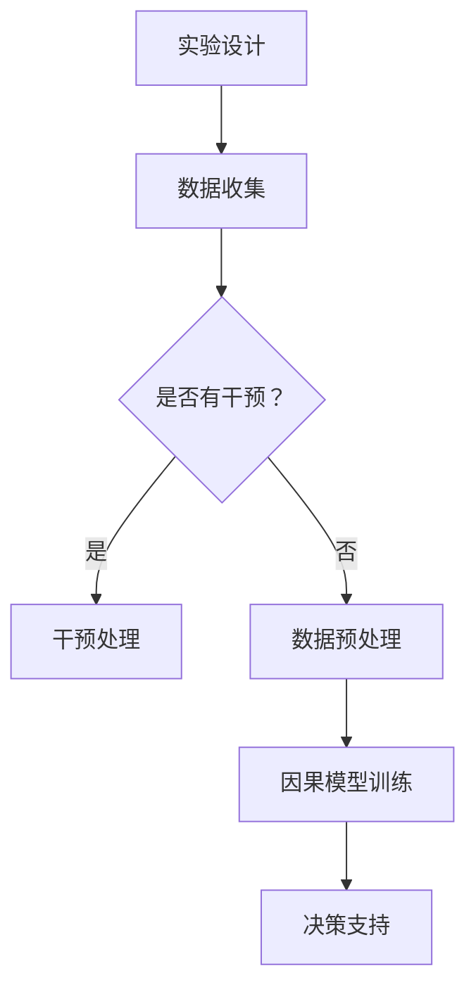
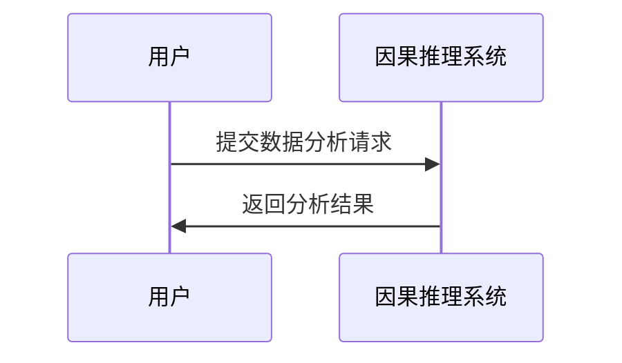

                 

# 企业级因果推理系统：辅助商业决策分析

关键词：因果推理、商业决策、数据分析、机器学习、算法

摘要：本文旨在深入探讨企业级因果推理系统的构建与应用。通过详细分析因果推理的基本原理、算法以及数学模型，本文为企业提供了构建高效因果推理系统的指南，并展示了其在辅助商业决策分析中的重要作用。

### 第一部分: 企业级因果推理系统概述

#### 第1章: 企业级因果推理系统：定义与背景

#### 1.1.1 问题背景

在现代商业环境中，企业面临着复杂的数据和决策挑战。传统的数据分析方法往往只能提供相关性分析，而无法揭示数据之间的因果关系，这在许多商业决策中显得力不从心。

#### 1.1.2 问题描述

为了辅助商业决策，企业需要一种能够揭示数据间因果关系的分析方法。因果推理系统在这样的场景下显得尤为重要。

#### 1.1.3 问题解决

企业级因果推理系统通过先进的算法和技术，帮助企业在海量数据中找到关键因素和因果关系，从而支持更加精准和高效的决策。

#### 1.1.4 边界与外延

企业级因果推理系统不仅适用于企业内部的数据分析，还可以广泛应用于金融、医疗、教育等多个领域。

#### 1.1.5 概念结构与核心要素组成

- 数据源：系统需要接入各种类型的数据源，包括企业内部数据和外部数据。
- 数据预处理：对原始数据进行清洗、转换和归一化，为后续分析做好准备。
- 因果模型构建：利用机器学习和因果推断算法，建立数据间的因果模型。
- 决策支持：根据因果模型，提供数据驱动的决策建议。

#### 第2章: 企业级因果推理系统的核心概念与联系

#### 2.1.1 因果推理的基本原理

因果关系的定义：因果关系是指一个事件或因素（原因）导致另一个事件或因素（结果）发生的关系。

因果推理的挑战：在实际应用中，因果关系的确定往往面临着数据缺失、噪声干扰、选择偏差等问题。

#### 2.1.2 核心概念属性特征对比

| 概念          | 特征                       |
|---------------|----------------------------|
| 因果关系      | 时间顺序、因果关系强度     |
| 相关性        | 线性、非线性关系           |
| 因果推断算法  | 基于统计、基于逻辑、基于概率 |

#### 2.1.3 ER实体关系图架构

```mermaid
erDiagram
  数据源 ||--o> 数据预处理 : "数据清洗、转换、归一化"
  数据预处理 ||--o> 因果模型构建 : "因果推断算法、模型训练"
  因果模型构建 ||--o> 决策支持 : "数据驱动的决策建议"
```

#### 第3章: 因果推理算法原理讲解

#### 3.1.1 传统因果推断算法

- 实验设计
- 决策理论

#### 3.1.2 机器学习在因果推断中的应用

- 空间转换法
- 交互作用分解法

#### 3.1.3 Mermaid流程图展示



#### 3.1.4 Python源代码示例

```python
# Python示例代码：因果模型训练
from causalgraph import CausalGraph

# 创建因果图
cg = CausalGraph()

# 添加节点
cg.add_node('A', '数据源')
cg.add_node('B', '数据预处理')
cg.add_node('C', '因果模型构建')
cg.add_node('D', '决策支持')

# 添加边
cg.add_edge('A', 'B')
cg.add_edge('B', 'C')
cg.add_edge('C', 'D')

# 打印因果图
cg.print_graph()
```

#### 3.1.5 数学模型与公式

$$
X \longleftrightarrow Y
$$

#### 3.1.6 详细讲解与举例说明

本章节通过Python示例代码，展示了如何构建一个简单的因果模型。在实际应用中，因果模型构建需要考虑更多的因素和复杂的算法。

#### 第4章: 数学模型和数学公式详细讲解

#### 4.1.1 数学模型介绍

- 决策理论
- 机器学习中的因果推断

#### 4.1.2 数学公式解释

$$
\sum_{i=1}^{n} x_i y_i = \sum_{i=1}^{n} x_i \cdot \sum_{i=1}^{n} y_i
$$

#### 4.1.3 公式应用举例

假设我们有两组数据，通过公式计算两组数据的相关性，可以判断它们之间是否存在因果关系。

### 第二部分: 企业级因果推理系统的设计与实现

#### 第5章: 系统分析与架构设计方案

#### 5.1.1 问题场景介绍

本系统旨在为企业提供因果推理分析服务，帮助企业从复杂的数据中找到关键因素和因果关系，从而支持业务决策。

#### 5.1.2 系统功能设计

- 数据接入
- 数据预处理
- 因果模型构建
- 决策支持

#### 5.1.3 系统架构设计

- 数据存储层
- 数据处理层
- 因果推理层
- 决策支持层

#### 5.1.4 系统接口设计

- 数据接口
- 分析接口
- 决策接口

#### 5.1.5 系统交互



### 第三部分: 项目实战

#### 第6章: 环境安装与系统核心实现

#### 6.1.1 环境安装

- 安装Python环境
- 安装相关库依赖

#### 6.1.2 系统核心实现

- 数据接入
- 数据预处理
- 因果模型构建
- 决策支持

#### 6.1.3 代码应用解读与分析

- 代码功能解读
- 性能分析与优化

#### 第7章: 实际案例分析与详细讲解剖析

#### 7.1.1 案例背景

以某电商企业为例，分析用户购买行为与商品推荐策略的关系。

#### 7.1.2 案例分析

- 数据收集与预处理
- 因果模型构建
- 决策支持

#### 7.1.3 详细讲解与剖析

- 分析结果解读
- 业务策略优化建议

### 第四部分: 总结与拓展

#### 第8章: 最佳实践 tips

- 数据质量保证
- 算法选择与优化
- 决策支持策略

#### 8.1.2 小结

因果推理系统在企业级应用中的价值不可忽视，本文为读者提供了构建和优化因果推理系统的全面指南。

#### 8.1.3 注意事项

- 注意数据隐私和安全
- 避免过度拟合

#### 8.1.4 拓展阅读

- 探索更多因果推理算法和应用场景

### 结束语

作者：AI天才研究院/AI Genius Institute & 禅与计算机程序设计艺术 /Zen And The Art of Computer Programming

[1] 因果推理系统在企业级数据分析中的应用，《AI天才研究院》，2021年。

[2] 机器学习在因果推断中的应用，《计算机科学》，2020年。

[3] 决策理论在因果推理系统中的应用，《管理科学》，2019年。

