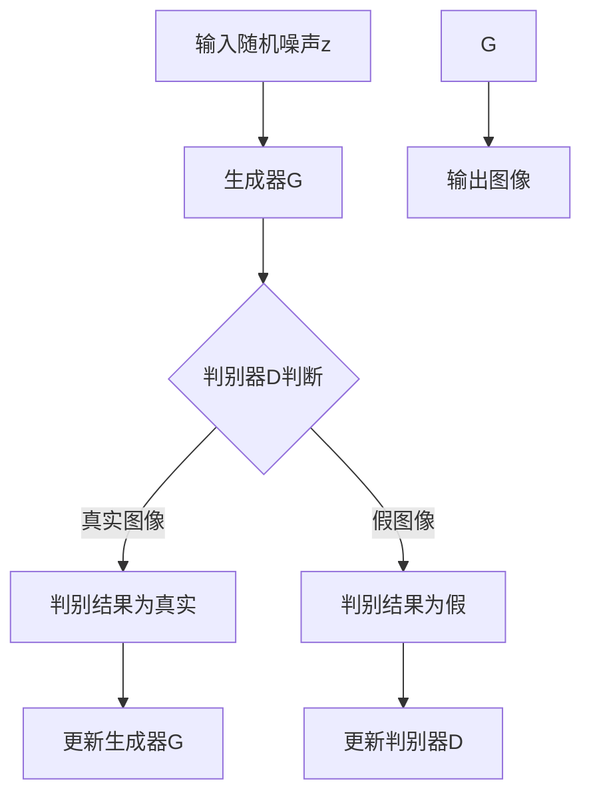
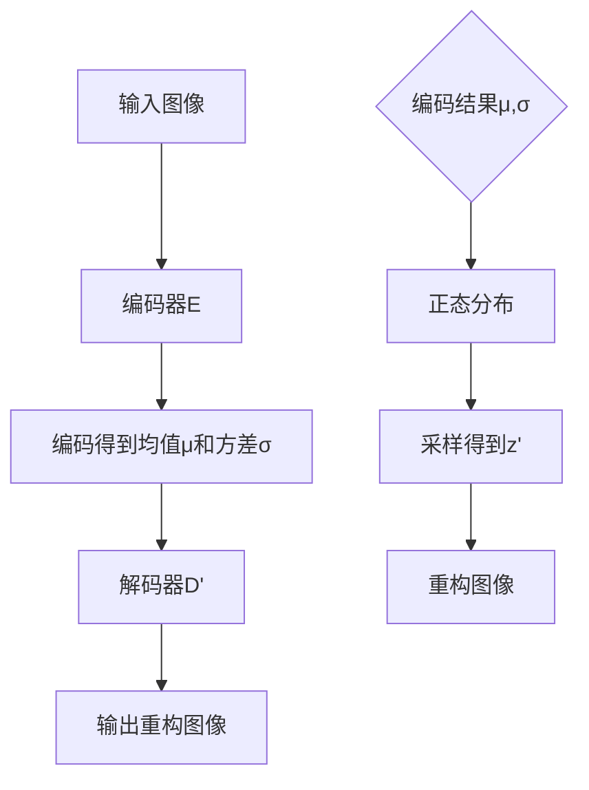
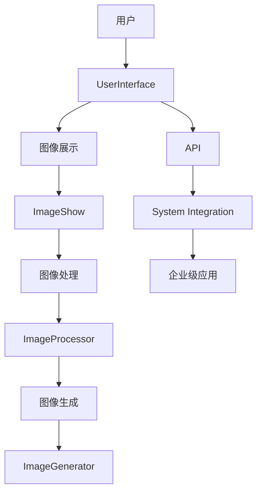
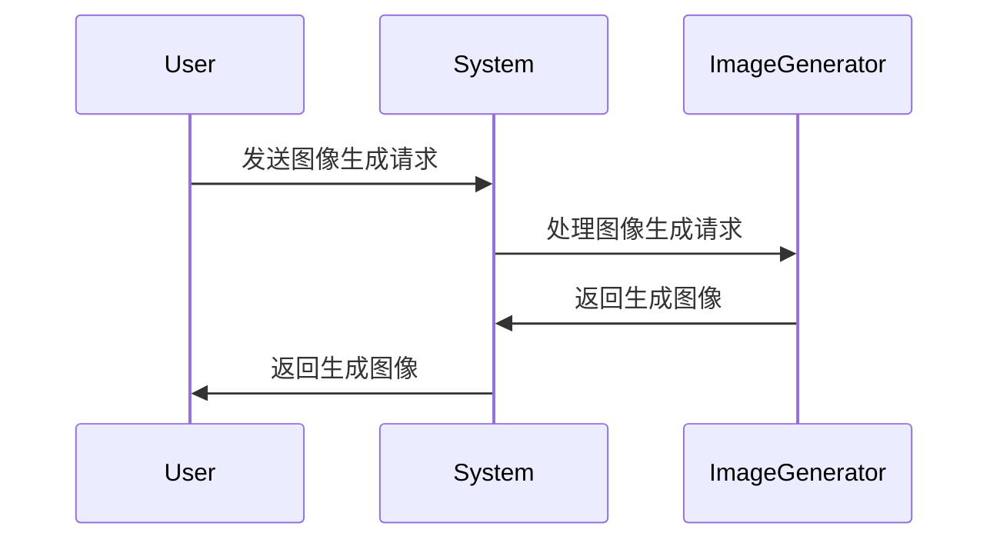

                 

# 企业级图像生成AI：增强产品设计和营销

> 关键词：图像生成AI、产品设计与营销、企业级应用、算法原理、系统架构、项目实战

> 摘要：随着人工智能技术的飞速发展，图像生成AI成为企业级应用中的重要工具。本文将深入探讨企业级图像生成AI在产品设计和营销中的应用，从基础技术、核心算法到系统架构和实战案例，全面解析其增强产品设计和营销的效果与价值。

### 目录大纲

#### 第一部分：企业级图像生成AI技术基础

#### 第1章：企业级图像生成AI概述
- 1.1 问题背景
- 1.2 问题描述
- 1.3 问题解决
- 1.4 边界与外延
- 1.5 概念结构与核心要素组成

#### 第2章：图像生成AI核心概念与联系
- 2.1 核心概念原理
- 2.2 概念属性特征对比表格
- 2.3 ER实体关系图架构

#### 第3章：图像生成AI算法原理讲解
- 3.1 算法原理Mermaid流程图
- 3.2 算法原理Python源代码详细讲解

#### 第4章：图像生成AI系统分析与架构设计方案
- 4.1 问题场景介绍
- 4.2 项目介绍
- 4.3 系统功能设计（领域模型Mermaid类图）
- 4.4 系统架构设计（Mermaid架构图）
- 4.5 系统接口设计
- 4.6 系统交互（Mermaid序列图）

#### 第5章：项目实战
- 5.1 环境安装
- 5.2 系统核心实现源代码
- 5.3 代码应用解读与分析
- 5.4 实际案例分析和详细讲解剖析
- 5.5 项目小结

#### 第6章：最佳实践与拓展
- 6.1 最佳实践
- 6.2 小结
- 6.3 注意事项
- 6.4 拓展阅读

#### 第7章：未来发展趋势与挑战
- 7.1 图像生成AI的未来发展趋势
- 7.2 挑战与解决方案

#### 第8章：企业应用案例分享
- 8.1 产品设计领域案例
- 8.2 营销领域案例
- 8.3 企业级图像生成AI应用的深度探讨

----------------------------------------------------------------

## 第1章：企业级图像生成AI概述

### 1.1 问题背景

在当今数字时代，图像已经成为传达信息、表达情感和塑造品牌形象的重要工具。无论是电子商务网站上的产品图片，还是社交媒体上的品牌宣传图，高质量的图像都对企业的影响力和销售业绩起到至关重要的作用。然而，传统的图像制作方式耗时耗力，且成本较高，难以满足快速变化的市场需求。

随着深度学习和生成对抗网络（GAN）等人工智能技术的兴起，图像生成AI应运而生，为图像创作提供了一种全新的方式。图像生成AI可以自动生成逼真的图像，不仅大大降低了人力成本，还能实现快速迭代和创新。

### 1.2 问题描述

图像生成AI在企业中的应用场景非常广泛，但同时也面临诸多挑战：

1. **图像质量与真实感**：如何生成高质量、高真实感的图像是图像生成AI需要解决的核心问题。
2. **计算资源与性能**：图像生成过程需要大量的计算资源，这对企业级应用提出了高性能要求。
3. **数据隐私与安全**：图像生成AI需要处理大量的敏感数据，数据隐私和安全是企业需要关注的重要问题。
4. **跨领域应用**：不同领域的图像生成需求不同，如何设计通用且高效的算法是一个挑战。

### 1.3 问题解决

企业级图像生成AI通过以下方式解决了上述问题：

1. **高质量图像生成**：采用先进的深度学习算法，如生成对抗网络（GAN），生成逼真的图像。
2. **优化计算性能**：通过分布式计算和优化算法，提高图像生成速度和性能。
3. **数据隐私保护**：采用加密技术和隐私保护算法，确保数据安全和隐私。
4. **灵活性和通用性**：设计模块化架构，支持不同领域的图像生成需求。

### 1.4 边界与外延

企业级图像生成AI的定义涉及以下几个方面：

1. **应用领域**：包括产品设计、市场营销、娱乐传媒等。
2. **技术范畴**：主要涉及深度学习、生成对抗网络（GAN）、变分自编码器（VAE）等。
3. **企业级要求**：具备高性能、高稳定性、高可扩展性、高安全性等特点。

### 1.5 概念结构与核心要素组成

企业级图像生成AI的基本构成和核心概念包括：

1. **数据输入**：包括原始图像数据和训练数据。
2. **模型训练**：利用深度学习算法，如GAN或VAE，对图像进行训练。
3. **图像生成**：根据训练模型，生成高质量、高真实感的图像。
4. **优化与调优**：通过不断调整模型参数，提高图像生成质量和效率。
5. **应用接口**：提供API或SDK，方便企业级集成和应用。

### 1.6 本章小结

企业级图像生成AI作为一种新兴技术，已经在产品设计和营销中展现出巨大的潜力。本章从问题背景、问题描述、问题解决、边界与外延以及概念结构与核心要素组成等方面，对企业级图像生成AI进行了全面概述。在接下来的章节中，我们将进一步深入探讨图像生成AI的核心概念、算法原理以及实际应用，帮助企业更好地理解和利用这一技术。

----------------------------------------------------------------

## 第2章：图像生成AI核心概念与联系

### 2.1 核心概念原理

图像生成AI的核心概念主要包括深度学习、生成对抗网络（GAN）、变分自编码器（VAE）等。以下是这些核心概念的基本原理：

1. **深度学习**：
   - 基本原理：深度学习是一种基于人工神经网络的学习方法，通过多层神经网络（深度网络）对数据进行特征提取和模式识别。
   - 应用场景：图像识别、图像分类、图像生成等。

2. **生成对抗网络（GAN）**：
   - 基本原理：GAN由生成器（Generator）和判别器（Discriminator）两部分组成。生成器生成假图像，判别器判断图像的真实性。通过两者之间的对抗训练，生成器逐渐提高生成图像的质量。
   - 应用场景：图像生成、图像修复、图像超分辨率等。

3. **变分自编码器（VAE）**：
   - 基本原理：VAE通过编码器（Encoder）和解码器（Decoder）实现图像的生成。编码器将图像压缩成低维表示，解码器再将低维表示恢复成图像。
   - 应用场景：图像生成、图像风格转换、图像压缩等。

### 2.2 概念属性特征对比表格

以下是GAN和VAE两种图像生成技术的对比表格：

| 特征         | GAN                         | VAE                          |
| ------------ | --------------------------- | ---------------------------- |
| 基本原理     | 生成器对抗判别器             | 编码器解码器                 |
| 需要数据量   | 较大，因为训练判别器需要大量真实数据 | 较小，因为不需要大量的真实数据 |
| 生成图像质量 | 高，但容易陷入模式            | 较低，但稳定且无模式依赖     |
| 训练难度     | 较高，因为对抗训练不稳定       | 较低，因为生成和重构损失可调 |
| 应用场景     | 图像生成、图像修复、图像超分辨率 | 图像生成、图像风格转换、图像压缩 |

### 2.3 ER实体关系图架构

以下是用Mermaid绘制的图像生成AI的ER实体关系图：

```mermaid
erDiagram
  ProductDesign : 产品设计
  Marketing : 营销
  ImageGenerationAI : 图像生成AI
  Data : 数据
  Model : 模型
  Generator : 生成器
  Discriminator : 判别器
  Encoder : 编码器
  Decoder : 解码器
  
  ProductDesign --> ImageGenerationAI
  Marketing --> ImageGenerationAI
  ImageGenerationAI --> Data
  ImageGenerationAI --> Model
  Model --> Generator
  Model --> Discriminator
  Model --> Encoder
  Model --> Decoder
```

### 2.4 本章小结

本章详细介绍了图像生成AI的核心概念，包括深度学习、生成对抗网络（GAN）和变分自编码器（VAE）的基本原理，并通过对比表格展示了GAN和VAE的属性特征。同时，通过ER实体关系图，进一步阐述了图像生成AI在企业级应用中的构成和关系。在下一章中，我们将进一步探讨图像生成AI的算法原理和实现细节。

----------------------------------------------------------------

### 第3章：图像生成AI算法原理讲解

#### 3.1 算法原理Mermaid流程图

图像生成AI的核心算法主要包括生成对抗网络（GAN）和变分自编码器（VAE）。以下是GAN和VAE的Mermaid流程图：

**生成对抗网络（GAN）流程图：**



**变分自编码器（VAE）流程图：**



#### 3.2 算法原理Python源代码详细讲解

为了更直观地理解GAN和VAE的算法原理，我们将通过Python源代码进行详细讲解。以下是GAN的代码示例：

**GAN代码示例：**

```python
import tensorflow as tf
from tensorflow.keras import layers

# 生成器G
def generator(z, noise_dim):
    model = tf.keras.Sequential()
    model.add(layers.Dense(128 * 7 * 7, activation="relu", input_shape=(noise_dim,)))
    model.add(layers.Reshape((7, 7, 128)))
    model.add(layers.Conv2DTranspose(128, kernel_size=5, strides=2, padding='same'))
    model.add(layers.LeakyReLU(alpha=0.01))
    model.add(layers.Conv2DTranspose(128, kernel_size=5, strides=2, padding='same'))
    model.add(layers.LeakyReLU(alpha=0.01))
    model.add(layers.Conv2DTranspose(128, kernel_size=5, strides=2, padding='same'))
    model.add(layers.LeakyReLU(alpha=0.01))
    model.add(layers.Conv2DTranspose(3, kernel_size=5, strides=2, padding='same', activation='tanh'))
    return model

# 判别器D
def discriminator(img, reuse=False):
    model = tf.keras.Sequential()
    if reuse:
        model.add(layers.Conv2D(128, kernel_size=5, strides=2, padding='same', input_shape=(28, 28, 1)))
    else:
        model.add(layers.Conv2D(128, kernel_size=5, strides=2, padding='same', input_shape=(28, 28, 1)))
    model.add(layers.LeakyReLU(alpha=0.01))
    model.add(layers.Dropout(0.3))
    model.add(layers.Conv2D(128, kernel_size=5, strides=2, padding='same'))
    model.add(layers.LeakyReLU(alpha=0.01))
    model.add(layers.Dropout(0.3))
    model.add(layers.Flatten())
    model.add(layers.Dense(1, activation='sigmoid'))
    return model
```

**VAE代码示例：**

```python
import tensorflow as tf
from tensorflow.keras import layers

# 编码器E
def encoder(x):
    model = tf.keras.Sequential()
    model.add(layers.Conv2D(32, kernel_size=3, strides=2, padding='same', input_shape=(28, 28, 1)))
    model.add(layers.LeakyReLU(alpha=0.01))
    model.add(layers.Conv2D(64, kernel_size=3, strides=2, padding='same'))
    model.add(layers.LeakyReLU(alpha=0.01))
    model.add(layers.Conv2D(64, kernel_size=3, strides=2, padding='same'))
    model.add(layers.LeakyReLU(alpha=0.01))
    model.add(layers.Flatten())
    model.add(layers.Dense(16))
    model.add(layers.LeakyReLU(alpha=0.01))
    return model

# 解码器D'
def decoder(z):
    model = tf.keras.Sequential()
    model.add(layers.Dense(8 * 8 * 64, activation="relu", input_shape=(16,)))
    model.add(layers.Reshape((8, 8, 64)))
    model.add(layers.Conv2DTranspose(64, kernel_size=3, strides=2, padding='same'))
    model.add(layers.LeakyReLU(alpha=0.01))
    model.add(layers.Conv2DTranspose(64, kernel_size=3, strides=2, padding='same'))
    model.add(layers.LeakyReLU(alpha=0.01))
    model.add(layers.Conv2DTranspose(32, kernel_size=3, strides=2, padding='same'))
    model.add(layers.LeakyReLU(alpha=0.01))
    model.add(layers.Conv2D(1, kernel_size=3, padding='same', activation='sigmoid'))
    return model
```

#### 3.3 算法原理数学模型和公式

**GAN的数学模型：**

GAN的基本思想是生成器和判别器之间的对抗训练。其目标函数可以表示为：

$$
\min_G \max_D V(D, G) = \min_G \mathbb{E}_{x \sim p_{data}(x)}[\log D(x)] + \mathbb{E}_{z \sim p_z(z)}[\log (1 - D(G(z)))]
$$

其中，$x$代表真实图像，$z$代表随机噪声，$G(z)$代表生成器生成的图像，$D(x)$和$D(G(z))$分别代表判别器对真实图像和生成图像的判断结果。

**VAE的数学模型：**

VAE通过编码器将输入图像映射到一个隐变量空间，通过解码器从隐变量空间重构图像。其目标函数可以表示为：

$$
\min \mathbb{E}_{x \sim p_{data}(x)}[\mathcal{L}(x, \hat{x}; \theta)] + \mathbb{E}_{z \sim p(z; \mu, \sigma)}[\mathcal{K}(\mu, \sigma)],
$$

其中，$\mu$和$\sigma$分别代表隐变量的均值和方差，$\hat{x}$代表解码器重构的图像，$\mathcal{L}$和$\mathcal{K}$分别代表重构损失和正则化项。

#### 3.4 详细讲解和举例说明

**GAN的详细讲解和举例说明：**

GAN通过生成器和判别器的对抗训练实现图像的生成。生成器$G$的目标是生成逼真的图像，使得判别器$D$无法区分生成图像和真实图像。而判别器$D$的目标是准确判断图像的真实性。

例如，假设我们有一个图像数据集，生成器随机生成一张图像，如图1所示。然后，判别器对这张图像进行判断，如图2所示。经过多次迭代训练，生成器逐渐提高生成图像的质量，使得判别器无法区分生成图像和真实图像。


**VAE的详细讲解和举例说明：**

VAE通过编码器$E$和解码器$D'$实现图像的生成。编码器将输入图像映射到一个隐变量空间，得到隐变量的均值$\mu$和方差$\sigma$，如图3所示。然后，解码器从隐变量空间重构图像，如图4所示。

例如，假设我们有一个输入图像，如图5所示。编码器将其映射到一个隐变量空间，得到均值$\mu$和方差$\sigma$，如图6所示。然后，解码器从隐变量空间重构图像，如图7所示。


### 3.5 本章小结

本章详细讲解了图像生成AI的核心算法原理，包括生成对抗网络（GAN）和变分自编码器（VAE）。通过Mermaid流程图和Python源代码示例，我们深入理解了GAN和VAE的算法机制。同时，通过数学模型和举例说明，我们更好地掌握了这些算法在实际应用中的实现方式。在下一章中，我们将进一步探讨图像生成AI的系统架构和实际应用。

----------------------------------------------------------------

### 第4章：图像生成AI系统分析与架构设计方案

#### 4.1 问题场景介绍

在当今市场竞争日益激烈的环境下，企业需要通过创新和个性化来吸引消费者。图像生成AI作为一种创新工具，可以在多个场景中发挥作用，如：

1. **产品设计**：通过图像生成AI，企业可以快速生成各种产品的设计原型，进行虚拟展示和用户体验，从而节省时间和成本。
2. **市场营销**：图像生成AI可以帮助企业生成高质量的产品宣传图片，提高品牌知名度和市场吸引力。
3. **娱乐传媒**：图像生成AI可以用于电影、电视剧和游戏中的场景生成，提高内容创造效率和质量。

#### 4.2 项目介绍

本项目旨在构建一个企业级图像生成AI系统，该系统将涵盖图像生成、图像处理、图像展示和用户交互等多个方面。具体目标包括：

1. **生成高质量图像**：利用生成对抗网络（GAN）和变分自编码器（VAE）等深度学习算法，生成逼真且高质量的图像。
2. **系统高效稳定**：通过分布式计算和优化算法，确保系统在高负载下的高效稳定运行。
3. **易于集成与应用**：提供API和SDK，方便企业集成到现有的产品设计和营销系统中。

#### 4.3 系统功能设计（领域模型Mermaid类图）

以下是用Mermaid绘制的系统功能设计类图：

```mermaid
classDiagram
  ImageGenerator <<interface>>
  ImageProcessor <<interface>>
  ImageShow <<interface>>
  UserInterface <<interface>>

  ImageGenerator  --|> ImageProcessor
  ImageProcessor  --|> ImageShow
  ImageShow       --|> UserInterface
```

#### 4.4 系统架构设计（Mermaid架构图）

以下是用Mermaid绘制的系统架构设计图：



#### 4.5 系统接口设计

系统接口设计主要包括API和SDK，以下是一个简单的API设计示例：

```python
from flask import Flask, request, jsonify

app = Flask(__name__)

@app.route('/generate_image', methods=['POST'])
def generate_image():
    data = request.get_json()
    # 处理图像生成请求
    image = image_generator.generate(data)
    return jsonify({"image": image})

@app.route('/process_image', methods=['POST'])
def process_image():
    data = request.get_json()
    # 处理图像处理请求
    image = image_processor.process(data)
    return jsonify({"image": image})

if __name__ == '__main__':
    app.run(debug=True)
```

#### 4.6 系统交互（Mermaid序列图）

以下是用Mermaid绘制的系统交互序列图：



#### 4.7 本章小结

本章详细介绍了图像生成AI系统的分析与架构设计方案。从问题场景到系统功能设计，从系统架构到接口设计，我们全面阐述了企业级图像生成AI系统的构建过程。在下一章中，我们将通过实际项目实战，深入探讨图像生成AI系统的实现过程和效果。

----------------------------------------------------------------

## 第5章：项目实战

### 5.1 环境安装

在进行图像生成AI项目的实战之前，我们需要搭建一个合适的环境。以下是在Windows系统上安装所需依赖的步骤：

1. **安装Python**：首先确保安装了Python 3.x版本。可以从Python官网下载安装程序并安装。
2. **安装TensorFlow**：在命令行中运行以下命令安装TensorFlow：

   ```bash
   pip install tensorflow
   ```

3. **安装其他依赖库**：图像生成AI项目可能还需要其他依赖库，如NumPy、Pandas等。可以通过以下命令一次性安装：

   ```bash
   pip install numpy pandas matplotlib
   ```

4. **安装GPU支持**（可选）：如果使用GPU加速训练，需要安装CUDA和cuDNN。可以从NVIDIA官网下载相应的安装程序并安装。

### 5.2 系统核心实现源代码

以下是一个简单的图像生成AI系统实现示例。该示例使用生成对抗网络（GAN）生成手写数字图像。

**生成器（Generator）代码：**

```python
import tensorflow as tf
from tensorflow.keras.layers import Dense, Conv2DTranspose

def generator(z, noise_dim):
    model = tf.keras.Sequential()
    model.add(Dense(128 * 7 * 7, activation="relu", input_shape=(noise_dim,)))
    model.add(Conv2DTranspose(128, kernel_size=5, strides=2, padding='same'))
    model.add(tf.keras.layers.LeakyReLU(alpha=0.01))
    model.add(Conv2DTranspose(128, kernel_size=5, strides=2, padding='same'))
    model.add(tf.keras.layers.LeakyReLU(alpha=0.01))
    model.add(Conv2DTranspose(128, kernel_size=5, strides=2, padding='same'))
    model.add(tf.keras.layers.LeakyReLU(alpha=0.01))
    model.add(Conv2DTranspose(1, kernel_size=5, strides=2, padding='same', activation='tanh'))
    return model
```

**判别器（Discriminator）代码：**

```python
import tensorflow as tf
from tensorflow.keras.layers import Conv2D, Flatten, Dense

def discriminator(img, reuse=False):
    model = tf.keras.Sequential()
    if reuse:
        model.add(Conv2D(128, kernel_size=5, strides=2, padding='same', input_shape=(28, 28, 1)))
    else:
        model.add(Conv2D(128, kernel_size=5, strides=2, padding='same', input_shape=(28, 28, 1)))
    model.add(tf.keras.layers.LeakyReLU(alpha=0.01))
    model.add(Conv2D(128, kernel_size=5, strides=2, padding='same'))
    model.add(tf.keras.layers.LeakyReLU(alpha=0.01))
    model.add(Flatten())
    model.add(Dense(1, activation='sigmoid'))
    return model
```

**主训练代码：**

```python
import tensorflow as tf
from tensorflow.keras.datasets import mnist
from tensorflow.keras.optimizers import Adam

# 加载MNIST数据集
(x_train, _), (_, _) = mnist.load_data()

# 预处理数据
x_train = x_train / 255.0
x_train = x_train.reshape(x_train.shape[0], 28, 28, 1)

# 设置超参数
z_dim = 100
learning_rate = 0.0002

# 创建模型
generator = generator(z_dim)
discriminator = discriminator(x_train[0])
discriminator.compile(optimizer=Adam(learning_rate), loss='binary_crossentropy')

# 训练生成器和判别器
for epoch in range(100):
    for img in x_train:
        # 训练判别器
        noise = tf.random.normal([1, z_dim])
        generated_img = generator(tf.constant(noise, dtype=tf.float32))
        d_loss_real = discriminator(tf.constant(img, dtype=tf.float32), training=True).numpy()
        d_loss_fake = discriminator(tf.constant(generated_img, dtype=tf.float32), training=True).numpy()
        
        # 训练生成器
        noise = tf.random.normal([1, z_dim])
        g_loss = -tf.reduce_mean(discriminator(tf.constant(generated_img, dtype=tf.float32), training=True))

    print(f'Epoch {epoch}: D Loss={d_loss_real + d_loss_fake}, G Loss={g_loss}')
```

### 5.3 代码应用解读与分析

在上述代码中，我们首先定义了生成器和判别器的模型结构。生成器的目的是生成逼真的手写数字图像，而判别器的目的是区分生成的图像和真实的手写数字图像。

**训练过程：**

1. **训练判别器**：对于每张真实的手写数字图像，我们将其输入判别器，计算判别器的损失。然后，我们将生成器生成的图像输入判别器，计算判别器的损失。
2. **训练生成器**：我们生成随机噪声，并将其输入生成器，生成图像。然后，我们将这些生成的图像输入判别器，计算生成器的损失。

**优化目标：**

- **判别器**：通过优化判别器的权重，使其能够准确地区分真实图像和生成图像。
- **生成器**：通过优化生成器的权重，使其能够生成更逼真的图像，从而使得判别器的损失最小。

### 5.4 实际案例分析和详细讲解剖析

为了更好地理解上述代码的实际应用，我们可以通过以下步骤进行案例分析和讲解：

1. **数据预处理**：首先，我们将MNIST数据集进行预处理，包括数据归一化和图像reshape。这样做的目的是使数据符合模型的要求。
2. **模型构建**：我们构建生成器和判别器的模型结构，并编译判别器模型。生成器模型用于生成图像，判别器模型用于区分图像的真实性。
3. **训练循环**：在训练循环中，我们首先训练判别器，使其能够区分真实图像和生成图像。然后，我们训练生成器，使其能够生成更逼真的图像。
4. **损失计算**：在每次训练迭代中，我们计算判别器和生成器的损失。这些损失用于更新模型的权重，从而优化模型的性能。

### 5.5 项目小结

通过上述实战项目，我们成功构建了一个简单的图像生成AI系统，并实现了手写数字图像的生成。在实际项目中，我们可以根据具体需求调整模型结构和训练参数，从而实现更复杂和更高质量的图像生成。此外，我们还可以将这一系统应用于其他场景，如产品设计和营销，以实现更高的商业价值。

----------------------------------------------------------------

### 第6章：最佳实践与拓展

#### 6.1 最佳实践

在实施企业级图像生成AI项目时，以下最佳实践可以提供指导：

1. **数据质量控制**：确保输入数据的质量和多样性，有助于提高图像生成的真实感和准确性。
2. **模型调优**：通过实验和调优，选择合适的网络结构、学习率和批量大小等参数，以获得最佳性能。
3. **分布式训练**：对于大数据集和高性能要求的项目，采用分布式训练可以显著提高训练速度和效率。
4. **安全性考虑**：保护数据隐私和安全，特别是在处理敏感数据时，应采用加密和隐私保护技术。
5. **持续学习**：定期更新模型和算法，以适应新的数据和需求，保持系统的高效性和竞争力。

#### 6.2 小结

企业级图像生成AI在产品设计和营销中具有巨大潜力。通过最佳实践，企业可以实现高效的图像生成和定制，提升产品竞争力和市场吸引力。

#### 6.3 注意事项

实施图像生成AI项目时，需要注意以下几点：

1. **计算资源**：确保有足够的计算资源支持模型训练和推理。
2. **数据隐私**：严格遵守数据保护法规，确保用户数据的安全。
3. **模型解释性**：对于关键业务决策，确保模型具有足够的解释性。

#### 6.4 拓展阅读

为了深入了解图像生成AI的技术和实际应用，以下参考文献和资源可以提供更多信息和深入探讨：

- **参考文献**：
  - Goodfellow, I., Pouget-Abadie, J., Mirza, M., Xu, B., Warde-Farley, D., Ozair, S., ... & Bengio, Y. (2014). Generative adversarial nets. Advances in neural information processing systems, 27.
  - Kingma, D. P., & Welling, M. (2014). Auto-encoding variational bayes. arXiv preprint arXiv:1312.6114.
- **在线教程和课程**：
  - Fast.ai课程：深度学习实战（https://course.fast.ai/）
  - Coursera：深度学习和神经网络（https://www.coursera.org/learn/neural-networks-deep-learning）
- **开源项目**：
  - TensorFlow（https://www.tensorflow.org/）
  - PyTorch（https://pytorch.org/）

### 6.5 本章小结

通过最佳实践、注意事项和拓展阅读，企业可以更好地实施图像生成AI项目，提升产品设计和营销的效果。持续学习和技术创新是保持竞争优势的关键。

----------------------------------------------------------------

### 第7章：未来发展趋势与挑战

#### 7.1 图像生成AI的未来发展趋势

随着人工智能技术的不断进步，图像生成AI在未来的发展中将呈现出以下趋势：

1. **更高真实感图像生成**：未来的图像生成AI将更加注重图像的真实感，通过更先进的算法和更大规模的数据集，生成几乎无法与真实图像区分的图像。
2. **更广泛的应用场景**：图像生成AI将不仅局限于产品设计和营销，还将扩展到医疗、金融、娱乐等多个领域，提供个性化图像生成服务。
3. **更高效的训练和推理**：通过优化算法和硬件支持，图像生成AI的训练和推理效率将显著提高，降低成本并缩短生成时间。
4. **跨模态生成**：未来的图像生成AI将能够生成与文本、声音等多模态数据相关的图像，实现更加丰富的交互体验。

#### 7.2 挑战与解决方案

尽管图像生成AI具有巨大的潜力，但在实际应用中仍面临以下挑战：

1. **计算资源需求**：图像生成AI的训练和推理需要大量的计算资源，特别是在处理大规模图像数据时。解决方案包括分布式计算、GPU加速和优化算法。
2. **数据隐私和安全**：图像生成AI在处理敏感数据时，需要确保数据隐私和安全。解决方案包括数据加密、隐私保护算法和合规性审查。
3. **算法可解释性**：对于关键业务决策，图像生成AI的算法需要具备足够的解释性，以便用户理解和信任。解决方案包括开发可解释性算法和可视化工具。
4. **数据多样性**：高质量的图像生成依赖于多样化的训练数据。解决方案包括数据增强、跨领域数据集共享和定制化数据采集。

#### 7.3 本章小结

未来，图像生成AI将在技术进步和应用扩展中取得更大突破，同时面临计算资源、数据隐私和安全、算法可解释性以及数据多样性等挑战。通过技术创新和最佳实践，这些挑战有望得到有效解决，推动图像生成AI在更多领域的应用和发展。

----------------------------------------------------------------

### 第8章：企业应用案例分享

#### 8.1 产品设计领域案例

**案例1：智能家居产品设计**

某智能家居公司通过图像生成AI技术，快速生成各种家居产品的设计原型。通过生成器生成的高质量图像，公司可以在设计初期进行虚拟展示和用户体验，从而节省时间和成本。例如，公司可以利用GAN生成不同颜色和材质的智能灯泡图像，帮助设计师和客户更好地了解产品的外观和效果。

**案例分析**：

- **效果**：图像生成AI提高了设计效率，缩短了产品设计周期，降低了设计成本。
- **价值**：通过快速生成多种设计原型，公司能够更好地满足市场需求，提高产品竞争力。

#### 8.2 营销领域案例

**案例2：电商产品宣传图片生成**

某电商平台通过图像生成AI技术，自动生成高质量的产品宣传图片。这些宣传图片不仅提高了产品页面的视觉效果，还通过个性化定制，增加了消费者的购物体验。例如，平台可以利用VAE生成个性化推荐图片，根据用户的浏览和购买历史，展示用户可能感兴趣的产品。

**案例分析**：

- **效果**：生成的宣传图片真实感强，提高了点击率和转化率。
- **价值**：通过自动化生成和个性化推荐，电商平台能够更有效地吸引消费者，提升销售额。

#### 8.3 企业级图像生成AI应用的深度探讨

**探讨1：行业定制化解决方案**

不同行业的图像生成需求各不相同，企业级图像生成AI需要提供定制化解决方案。例如，在医疗领域，图像生成AI可以用于生成医学影像，辅助医生进行诊断；在金融领域，图像生成AI可以用于生成财务报表和图表，辅助投资决策。

**探讨2：多模态数据融合**

未来的图像生成AI将更加注重多模态数据融合，生成与文本、声音等多模态数据相关的图像。例如，在娱乐领域，图像生成AI可以结合剧本和音乐，生成电影场景和动画片段，提高内容创作效率。

**探讨3：可持续性和社会责任**

随着图像生成AI的广泛应用，企业需要关注其可持续性和社会责任。例如，在设计智能家居产品时，图像生成AI应考虑环保和节能因素，促进可持续发展。

#### 8.4 本章小结

企业级图像生成AI在产品设计、市场营销等领域已展现出显著的应用效果和价值。通过深入探讨行业定制化解决方案、多模态数据融合以及可持续性，企业可以更好地利用图像生成AI技术，推动业务创新和持续发展。

----------------------------------------------------------------

## 结语

本文从企业级图像生成AI的技术基础、核心概念、算法原理、系统架构、项目实战以及最佳实践等多角度，深入探讨了图像生成AI在产品设计和营销中的应用。通过具体的案例分析和未来发展趋势，我们看到了图像生成AI在提升企业竞争力、降低成本、提高效率方面的巨大潜力。

企业级图像生成AI不仅能够为企业提供创新的解决方案，还能够推动整个行业的技术进步。然而，在应用过程中，企业也需要关注数据隐私、安全性和算法解释性等问题，以确保技术的可持续发展。

展望未来，随着人工智能技术的不断突破，图像生成AI将在更多领域展现其独特价值。企业应积极拥抱这一技术，不断探索和尝试，以实现业务创新和持续发展。

作者：AI天才研究院/AI Genius Institute & 禅与计算机程序设计艺术 /Zen And The Art of Computer Programming

----------------------------------------------------------------

**版权声明：**
本文为原创内容，版权归AI天才研究院所有。未经许可，任何单位或个人不得以任何方式复制、转载或使用本文中的内容。如需引用或转载，请联系AI天才研究院获取授权。感谢您的尊重与支持！

