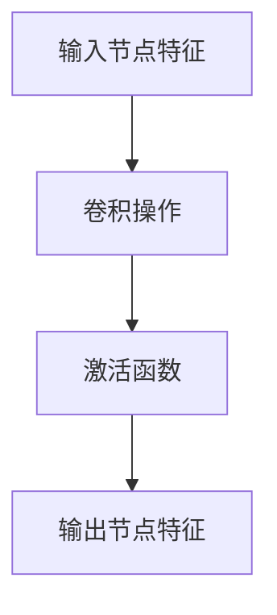
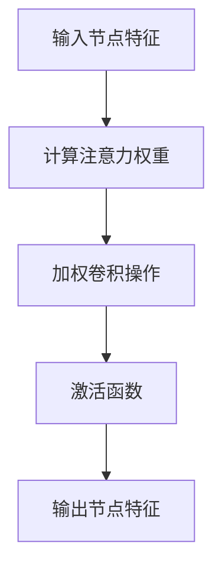
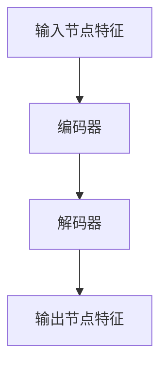

                 

### 第1章：企业级图神经网络概述

#### 1.1.1 图神经网络的基本概念

图神经网络（Graph Neural Networks，GNN）是一种专门用于处理图结构数据的深度学习模型。不同于传统卷积神经网络（CNN）和循环神经网络（RNN），GNN 直接操作图数据结构，从而更好地捕捉节点和边之间的复杂关系。GNN 的基本概念包括节点特征、边特征和图结构。节点特征表示节点自身的属性，例如社交网络中用户的兴趣爱好；边特征表示节点之间的关系，如朋友关系或合作关系；图结构则是指整个图的网络布局。

#### 1.1.2 图神经网络的发展历史

图神经网络的发展可以追溯到20世纪90年代，当时研究人员开始探索如何将图结构数据与机器学习方法相结合。最初的图神经网络模型主要是基于图卷积网络（Graph Convolutional Network，GCN）的思想，它通过对节点特征进行加权聚合，从而实现节点分类和图分类任务。随后，研究人员提出了更多的图神经网络模型，如图注意力网络（Graph Attention Network，GAT）和图自编码器（Graph Autoencoder，GAE），这些模型进一步丰富了图神经网络的算法体系。

#### 1.1.3 图神经网络在企业应用中的重要性

在企业级应用中，图神经网络的重要性日益凸显。首先，许多企业的业务数据具有复杂的网络结构，如供应链网络、社交网络和金融网络等。通过使用图神经网络，企业可以更好地理解和分析这些网络中的复杂关系，从而提高业务决策的准确性。其次，图神经网络在推荐系统、欺诈检测、知识图谱构建等领域有广泛的应用，这些领域的企业可以通过图神经网络模型获得显著的业务价值。最后，随着数据规模的不断扩大，传统的数据处理方法难以满足企业级应用的需求，而图神经网络凭借其强大的数据处理能力，成为解决这一问题的有效工具。

#### 1.1.4 企业级图神经网络平台的挑战与机遇

企业级图神经网络平台面临着一系列挑战与机遇。首先，在数据处理方面，企业需要处理大量复杂的图结构数据，这要求平台具备高效的数据处理能力。其次，模型的训练和推理速度是另一个挑战，企业需要在有限的计算资源下，快速训练和部署模型。此外，模型的解释性和可解释性也是关键，企业需要确保模型输出的结果可以解释，从而提高模型的信任度。然而，随着技术的不断进步，企业级图神经网络平台也迎来了新的机遇。例如，新的算法和优化技术可以提高模型的性能，而云计算和边缘计算的发展则为企业提供了更灵活的计算资源。

### 关键词

- 图神经网络
- 企业应用
- 数据处理
- 模型训练
- 模型解释性

### 摘要

本文旨在深入探讨企业级图神经网络平台的设计与应用。首先，介绍了图神经网络的基本概念、发展历史及其在企业应用中的重要性。接着，分析了企业级图神经网络平台面临的挑战与机遇，并探讨了如何应对这些挑战。本文将为企业级图神经网络平台的设计与实现提供有益的参考。

## 第2章：复杂业务关系的建模与分析

#### 2.1.1 业务关系的本质

业务关系是指企业之间、企业内部以及企业与外部环境之间由于业务活动而形成的各种联系。这些关系包括供应链中的合作关系、市场中的竞争关系、企业内部的分工与协作关系等。业务关系的本质在于它们反映了不同实体之间的互动和相互依赖，这些互动和依赖对于企业的运营效率和业务成功至关重要。

#### 2.1.2 复杂业务关系的特征

复杂业务关系具有以下特征：

1. **多样性**：业务关系涉及多种类型，包括供应链关系、合作关系、竞争关系、客户关系等。
2. **动态性**：业务关系随着时间和环境的变化而变化，例如，合作伙伴可能会因为市场需求的变化而改变合作方式。
3. **多层次性**：业务关系不仅涉及直接关系，还可能包括间接关系和中介关系。
4. **非线性**：业务关系的影响往往不是线性的，一个节点的影响可能通过多层次的传递，对其他节点产生复杂的效应。
5. **异质性**：不同业务关系具有不同的属性和特征，例如，供应链中的合作关系可能强调可靠性和成本控制，而市场竞争关系则可能强调创新和差异化。

#### 2.1.3 图神经网络在业务关系建模中的应用

图神经网络在业务关系建模中的应用主要表现在以下几个方面：

1. **节点特征提取**：通过图卷积网络（GCN）等模型，可以从节点特征中提取出具有代表性的特征表示，帮助更好地理解节点的属性和行为。
2. **关系建模**：图注意力网络（GAT）等模型可以通过学习节点之间的关系，捕捉业务关系中的动态性和多层次性。
3. **图结构分析**：通过图自编码器（GAE）等模型，可以对图结构进行降维和可视化，帮助企业理解业务关系网络的复杂性和非线性行为。
4. **预测与优化**：基于训练得到的图神经网络模型，可以对企业业务关系进行预测和优化，从而支持业务决策。

#### 2.1.4 业务关系分析的挑战与解决方案

业务关系分析面临以下挑战：

1. **数据质量**：业务关系的复杂性和动态性可能导致数据质量参差不齐，需要建立有效的数据清洗和数据预处理机制。
2. **模型解释性**：业务关系分析模型往往具有高度非线性，如何保证模型的可解释性是一个重要问题。
3. **计算资源**：大规模业务关系网络的建模和分析需要大量的计算资源，尤其是在实时分析场景下。
4. **实时性**：业务关系的变化速度较快，如何实现实时分析是一个技术挑战。

针对这些挑战，可以采取以下解决方案：

1. **数据质量提升**：通过数据清洗、数据融合和数据增强等技术，提升数据质量。
2. **模型可解释性**：结合可视化技术和模型解释方法，如注意力机制和可解释的图神经网络模型，提高模型的可解释性。
3. **计算优化**：采用分布式计算、并行计算和云计算等技术，提高计算效率。
4. **实时分析**：利用边缘计算和流处理技术，实现实时业务关系分析。

### 关键词

- 业务关系
- 图神经网络
- 数据质量
- 模型解释性
- 实时分析

### 摘要

本章深入探讨了复杂业务关系的本质、特征以及图神经网络在业务关系建模中的应用。通过分析业务关系分析的挑战，提出了相应的解决方案。本章内容旨在为企业级图神经网络平台的设计提供理论基础和实践指导。

## 第3章：图神经网络基础算法

#### 3.1.1 图卷积网络（GCN）

图卷积网络（Graph Convolutional Network，GCN）是图神经网络中的一种基础算法。它通过对节点特征进行卷积操作，从而实现节点分类和图分类任务。GCN 的核心思想是将节点的邻域信息进行聚合，从而更新节点的特征表示。

##### GCN 的数学模型

假设图 \( G = (V, E) \) 有 \( n \) 个节点和 \( m \) 个边，每个节点 \( v \) 有特征表示 \( x_v \in \mathbb{R}^d \)，边的特征表示为 \( e_{uv} \in \mathbb{R}^d \)。

GCN 的卷积操作可以表示为：

\[ h_v^{(k+1)} = \sigma(\sum_{u \in \mathcal{N}(v)} \alpha(u, v) \cdot W \cdot h_u^{(k)}) + b \]

其中，\( \mathcal{N}(v) \) 表示节点 \( v \) 的邻域，\( \alpha(u, v) \) 是邻接矩阵 \( A \) 的元素，\( W \) 是卷积权重矩阵，\( \sigma \) 是激活函数，\( b \) 是偏置项。

##### GCN 的 Python 实现

```python
import tensorflow as tf
from tensorflow.keras.layers import Layer

class GraphConvolutionLayer(Layer):
    def __init__(self, units, activation=None, **kwargs):
        super().__init__(**kwargs)
        self.units = units
        self.activation = activation

    def build(self, input_shape):
        self.kernel = self.add_weight(
            shape=(input_shape[-1], self.units),
            initializer='glorot_uniform',
            trainable=True)
        if self.activation:
            self.activation = Activation(self.activation)
        super().build(input_shape)

    def call(self, inputs, training=None):
        support = inputs
        output = tf.matmul(support, self.kernel)
        if self.activation:
            output = self.activation(output)
        return output
```

##### GCN 的 Mermaid 流程图



#### 3.1.2 图注意力网络（GAT）

图注意力网络（Graph Attention Network，GAT）是对 GCN 的扩展，它通过引入注意力机制来动态地聚合邻域信息。GAT 可以更好地捕捉节点之间的关系，特别是在图结构高度异质的情况下。

##### GAT 的数学模型

GAT 的注意力机制可以表示为：

\[ \alpha_{uv}^{(l)} = \mathrm{softmax}\left(\frac{a_{u}^T \cdot \bar{W} \cdot \left[\a_{v1}^{(l)}, ..., \a_{vn}^{(l)}\right]_v}{\sqrt{d_{\text{at}}}}\right) \]

其中，\( a_v^{(l)} \) 是节点 \( v \) 在第 \( l \) 层的嵌入表示，\( \bar{W} \) 是权重矩阵，\( d_{\text{at}} \) 是注意力层的维度。

GAT 的卷积操作可以表示为：

\[ h_v^{(l+1)} = \sigma\left(\sum_{u \in \mathcal{N}(v)} \alpha_{uv}^{(l)} \cdot W \cdot h_u^{(l)}\right) + b \]

##### GAT 的 Python 实现

```python
from tensorflow.keras.layers import Layer
import tensorflow as tf
from tensorflow.keras.initializers import glorot_uniform

class GraphAttentionLayer(Layer):
    def __init__(self, units, attention_heads, activation=None, **kwargs):
        super().__init__(**kwargs)
        self.units = units
        self.attention_heads = attention_heads
        self.activation = activation

    def build(self, input_shape):
        self.W = self.add_weight(
            shape=(input_shape[-1], self.units),
            initializer=glorot_uniform(),
            trainable=True)
        self.V = self.add_weight(
            shape=(self.units, self.attention_heads),
            initializer=glorot_uniform(),
            trainable=True)
        if self.activation:
            self.activation = Activation(self.activation)
        super().build(input_shape)

    def call(self, inputs, training=None):
        support = inputs
        a = tf.matmul(support, self.V)
        a = tf.nn.softmax(a, axis=1)
        output = tf.matmul(tf.matmul(a, self.W), support)
        if self.activation:
            output = self.activation(output)
        return output
```

##### GAT 的 Mermaid 流程图



#### 3.1.3 图自编码器（GAE）

图自编码器（Graph Autoencoder，GAE）是一种无监督学习模型，它通过重建图结构来学习节点嵌入。GAE 可以用于降维、可视化和节点分类。

##### GAE 的数学模型

GAE 由两个部分组成：编码器和解码器。编码器 \( g \) 将节点特征映射到一个低维空间，解码器 \( \phi \) 尝试重建原始特征。

编码器可以表示为：

\[ z_v = g(x_v) \]

解码器可以表示为：

\[ x_v' = \phi(z_v) \]

GAE 的损失函数可以表示为：

\[ \ell = \frac{1}{2} \sum_{v \in V} ||x_v - x_v'||^2 + \lambda \sum_{v \in V} ||z_v - \frac{1}{K} \sum_{u \in \mathcal{N}(v)} z_u||^2 \]

其中，\( \lambda \) 是调节参数，用于平衡重构损失和节点嵌入的多样性。

##### GAE 的 Python 实现

```python
import tensorflow as tf

class GraphAutoencoder(Model):
    def __init__(self, units, latent_dim, activation=None):
        super().__init__()
        self.units = units
        self.latent_dim = latent_dim
        self.activation = activation

    def build(self, input_shape):
        self.encoder = Dense(self.units, activation=self.activation)
        self.decoder = Dense(input_shape[-1])
        super().build(input_shape)

    def call(self, inputs):
        encoded = self.encoder(inputs)
        decoded = self.decoder(encoded)
        return decoded
```

##### GAE 的 Mermaid 流.Flow



#### 3.1.4 图卷积网络与其他算法的比较

GCN、GAT 和 GAE 是图神经网络中的三种主要算法。它们各有优势和局限：

- **GCN**：GCN 是一种简单有效的图神经网络算法，适用于大多数图结构数据。但其缺点在于它假设所有节点的邻域具有相同的重要性，这可能导致性能下降，特别是在图结构高度异质的情况下。
- **GAT**：GAT 引入了注意力机制，可以动态地聚合邻域信息，从而更好地捕捉节点之间的复杂关系。然而，GAT 的计算成本较高，特别是在大规模图数据上。
- **GAE**：GAE 是一种无监督学习模型，可以通过重建图结构来学习节点嵌入。GAE 适用于需要节点嵌入的场景，但其缺点是它通常需要较大的训练数据集，且训练时间较长。

选择适当的算法取决于具体的应用场景和需求。

### 关键词

- 图卷积网络
- 图注意力网络
- 图自编码器
- 无监督学习
- 节点嵌入

### 摘要

本章详细介绍了图神经网络的三种基础算法：图卷积网络（GCN）、图注意力网络（GAT）和图自编码器（GAE）。通过数学模型和 Python 实现的讲解，以及 Mermaid 流程图的展示，读者可以更好地理解这些算法的工作原理。同时，本章也对 GCN、GAT 和 GAE 的优缺点进行了比较。

## 第4章：图神经网络优化算法

#### 4.1.1 传统优化算法在图神经网络中的应用

在图神经网络中，传统的优化算法如随机梯度下降（SGD）、Adam、RMSProp等被广泛应用。这些算法在处理大规模图数据时，能够有效地调整模型参数，提高模型的收敛速度和稳定性。

##### 传统优化算法的基本原理

- **随机梯度下降（SGD）**：SGD 通过计算每个样本的梯度，更新模型参数。其优点是计算简单，实现容易。然而，SGD 在大规模数据集上容易出现局部最优解，且收敛速度较慢。
- **Adam**：Adam 是一种结合了 SGD 和 Rprop 算法的自适应优化算法。它通过维护每个参数的平均梯度一阶矩估计和二阶矩估计，自适应调整学习率。Adam 在大规模图数据集上表现出色，收敛速度快。
- **RMSProp**：RMSProp 通过跟踪梯度平方的平均值来调整学习率。与 Adam 类似，RMSProp 也具有自适应调整学习率的能力，但在某些情况下，Adam 的性能更好。

##### 传统优化算法在图神经网络中的优化

为了在图神经网络中应用传统优化算法，需要考虑以下几个方面：

- **梯度计算**：由于图神经网络中的节点和边具有高度非线性，计算梯度时可能涉及复杂的计算操作。为了提高梯度计算的效率，可以采用并行计算、分布式计算等技术。
- **数据预处理**：在训练图神经网络之前，需要进行数据预处理，如节点特征标准化、边特征编码等，以减少数据噪声，提高模型性能。
- **学习率调整**：在训练过程中，需要根据模型性能自适应调整学习率，以避免过拟合或欠拟合。

#### 4.1.2 新型优化算法在图神经网络中的应用

随着深度学习技术的发展，新型优化算法如 Adagrad、AdaMax、LAMB 等也被引入到图神经网络中。这些算法在处理大规模图数据时，表现出更高的效率和稳定性。

##### 新型优化算法的基本原理

- **Adagrad**：Adagrad 通过对每个参数的梯度进行累加，自适应调整学习率。它对稀疏数据的处理效果较好，但在某些情况下可能导致学习率过大。
- **AdaMax**：AdaMax 是 Adagrad 的改进版，它通过引入最大值运算，解决 Adagrad 可能出现过大的问题。AdaMax 在大规模图数据集上的性能优于 Adagrad。
- **LAMB**：LAMB 是结合了 LARS（Layer-wise Adaptive Rate Scaling）和 Adagrad 优点的优化算法。LAMB 能够自适应地调整学习率，同时保持较低的方差。

##### 新型优化算法在图神经网络中的应用

新型优化算法在图神经网络中的应用主要表现在以下几个方面：

- **提高训练速度**：新型优化算法能够更快地收敛，减少训练时间，从而提高模型训练效率。
- **增强模型稳定性**：新型优化算法通过自适应调整学习率，降低模型过拟合的风险，提高模型的稳定性。
- **适用于大规模图数据**：新型优化算法能够处理大规模图数据，适用于实时分析和大规模数据处理场景。

#### 4.1.3 优化算法的选择与调整

在选择和调整优化算法时，需要考虑以下几个方面：

- **数据特性**：根据图数据的规模、稀疏度和特征，选择适合的优化算法。例如，对于稀疏数据，Adagrad 和 AdaMax 可能表现更好。
- **模型结构**：根据图神经网络的模型结构，选择适合的优化算法。例如，对于深层模型，LAMB 可能具有更好的性能。
- **训练目标**：根据训练目标，调整优化算法的参数。例如，为了提高模型性能，可以增加学习率；为了防止过拟合，可以减小学习率。
- **计算资源**：根据计算资源的限制，选择适合的优化算法。例如，对于计算资源有限的场景，Adam 可能更适合。

通过合理选择和调整优化算法，可以显著提高图神经网络的训练效率和模型性能。

### 关键词

- 传统优化算法
- 新型优化算法
- 图神经网络
- 训练速度
- 模型稳定性

### 摘要

本章深入探讨了传统优化算法和新型优化算法在图神经网络中的应用。通过介绍优化算法的基本原理和实现方法，以及如何根据数据特性、模型结构和训练目标选择合适的优化算法，本章为图神经网络模型的优化提供了实用的指导。

## 第5章：图神经网络的可解释性

#### 5.1.1 可解释性的重要性

图神经网络（GNN）在处理复杂图结构数据方面具有显著优势，但其高度非线性的特性使得模型输出往往难以解释。可解释性是评估一个模型优劣的重要指标，特别是在商业应用中，模型的可解释性直接影响用户对模型的信任度和接受度。在图神经网络中，可解释性尤为重要，因为它涉及到对节点关系和图结构的理解，这对于业务决策和模型优化至关重要。

#### 5.1.2 图神经网络的可解释性方法

为了提高图神经网络的可解释性，研究人员提出了一系列方法，主要包括以下几种：

1. **注意力机制**：注意力机制可以帮助用户理解模型在决策过程中关注的关键节点和边。例如，图注意力网络（GAT）通过计算每个节点对输出的贡献度，提供了一种直观的解释方式。
2. **可视化技术**：通过将图数据可视化，用户可以直观地了解模型的结构和操作。例如，使用节点颜色和大小表示节点的特征值或模型预测的概率。
3. **模型简化**：简化模型结构，如降低层数或节点数量，有助于提高模型的解释性。虽然这可能导致模型性能下降，但简化的模型更容易被用户理解和解释。
4. **特征重要性分析**：通过分析节点特征的重要性，用户可以了解哪些特征对模型的决策有更大的影响。这有助于用户更好地理解模型是如何利用数据特征进行预测的。
5. **模型解释工具**：开发专门的模型解释工具，如可视化界面和解释引擎，可以帮助用户深入理解模型的工作原理和决策过程。

#### 5.1.3 可解释性与模型性能的平衡

提高模型的可解释性往往需要在模型性能和解释性之间进行权衡。以下是一些平衡策略：

1. **层次化解释**：将模型分解为多个层次，每个层次关注不同的信息。这样，用户可以根据需要关注不同层次的解释，从而在保持模型性能的同时提高解释性。
2. **交互式解释**：提供交互式解释界面，用户可以根据自己的需求调整解释的细节。例如，用户可以选择关注特定节点或边，或者查看详细的计算过程。
3. **面向目标的解释**：根据具体应用场景，关注模型对关键任务的解释性。例如，在推荐系统中，用户可能更关注推荐结果的可解释性，而在欺诈检测中，用户可能更关注检测过程的解释性。
4. **模型选择**：选择具有良好解释性的模型，如基于规则的模型或线性模型。虽然这些模型可能在性能上不如复杂的神经网络模型，但它们通常具有更好的可解释性。

通过上述策略，可以在提高模型可解释性的同时，尽量保持模型性能，从而满足不同应用场景的需求。

### 关键词

- 图神经网络
- 可解释性
- 注意力机制
- 可视化技术
- 模型简化

### 摘要

本章详细探讨了图神经网络的可解释性及其重要性。介绍了多种提高模型可解释性的方法，并讨论了如何在保持模型性能的同时提高解释性。本章内容为企业在实际应用中优化和解释图神经网络模型提供了有益的指导。

## 第6章：图神经网络的应用场景

### 6.1.1 社交网络分析

社交网络分析是图神经网络的一个重要应用领域。在社交网络中，用户之间的互动和关系可以被视为图结构数据，图神经网络能够有效地捕捉和解析这些复杂的关系。以下是图神经网络在社交网络分析中的几个关键应用：

1. **用户兴趣推荐**：通过分析用户在社交网络中的互动和关注关系，图神经网络可以推荐用户可能感兴趣的内容或用户。例如，在一个社交平台中，基于用户的朋友圈互动，图神经网络可以识别出用户共同感兴趣的话题，从而提供个性化的内容推荐。

2. **社群发现**：图神经网络可以帮助识别社交网络中的社群结构，发现具有相似兴趣和行为的用户群体。通过分析用户之间的关系，图神经网络可以识别出隐藏的社群，从而帮助社交平台更好地组织和推荐相关内容。

3. **网络传播预测**：在社交网络中，信息的传播速度和范围对平台运营和用户影响力至关重要。图神经网络可以预测信息的传播路径和影响范围，帮助社交平台优化信息推送策略，提高信息传播的效率。

4. **社交网络监控**：图神经网络可以用于监控社交网络中的异常行为和欺诈活动。通过分析用户之间的关系和互动模式，图神经网络可以识别出潜在的风险用户，从而帮助平台进行有效的风险控制和用户管理。

### 6.1.2 供应链网络分析

供应链网络分析是另一个重要的应用领域，涉及企业之间的合作和物流流程。图神经网络可以有效地建模和分析供应链网络中的复杂关系，从而提高供应链的效率和可靠性。以下是图神经网络在供应链网络分析中的几个关键应用：

1. **合作伙伴选择**：通过分析企业之间的合作关系和交易历史，图神经网络可以帮助企业选择最合适的合作伙伴。例如，一个制造企业可以使用图神经网络分析其供应商网络，识别出具有高质量产品和可靠供应记录的供应商。

2. **供应链优化**：图神经网络可以帮助优化供应链的物流流程和资源配置。通过分析供应链网络中的节点和边，图神经网络可以识别出潜在的瓶颈和优化点，从而帮助企业在保持成本效益的同时提高供应链的效率。

3. **风险评估**：图神经网络可以用于评估供应链中的风险，如供应链中断、供应商违约等。通过分析供应链网络中的复杂关系，图神经网络可以预测潜在的风险事件，并为企业提供相应的风险应对策略。

4. **需求预测**：在供应链管理中，准确的需求预测对于库存管理和供应链优化至关重要。图神经网络可以通过分析历史数据和供应链网络中的关系，预测未来的需求趋势，从而帮助企业更好地安排生产和库存计划。

### 6.1.3 金融网络分析

金融网络分析是图神经网络在金融领域的重要应用，涉及金融市场的交易网络、投资关系和风险评估等。图神经网络可以有效地捕捉和处理金融网络中的复杂关系，从而提高金融分析和决策的准确性。以下是图神经网络在金融网络分析中的几个关键应用：

1. **市场趋势预测**：通过分析金融市场中的交易数据和网络关系，图神经网络可以预测市场的趋势和波动。例如，在股票市场中，图神经网络可以分析投资者之间的关系和交易行为，预测股票价格的未来走势。

2. **风险识别与评估**：图神经网络可以用于识别和评估金融网络中的风险。通过分析投资关系和交易网络，图神经网络可以识别出潜在的风险节点和风险传播路径，从而帮助金融机构进行有效的风险管理和控制。

3. **欺诈检测**：在金融交易中，欺诈行为对金融机构和客户都构成严重威胁。图神经网络可以用于检测和预防欺诈行为，通过分析交易网络中的异常行为和关系，识别出潜在的欺诈风险。

4. **投资组合优化**：图神经网络可以帮助投资者优化投资组合，通过分析市场关系和投资风险，提供个性化的投资建议。例如，一个投资者可以使用图神经网络分析其投资组合中的资产关系，调整投资策略，以实现风险和收益的最优化。

### 6.1.4 健康医疗网络分析

健康医疗网络分析是图神经网络在医疗健康领域的重要应用，涉及患者关系、药物关系和医疗资源管理等方面。图神经网络可以有效地建模和分析健康医疗网络中的复杂关系，从而提高医疗服务的质量和效率。以下是图神经网络在健康医疗网络分析中的几个关键应用：

1. **疾病预测与诊断**：通过分析患者之间的关系和疾病数据，图神经网络可以预测疾病的发病风险和诊断结果。例如，在癌症诊断中，图神经网络可以分析患者的基因、病史和家族病史等数据，预测患者患癌症的风险。

2. **药物发现与协同作用**：图神经网络可以帮助科学家发现新的药物和药物协同作用。通过分析药物分子结构、药物靶点关系和药物疗效数据，图神经网络可以识别出潜在的药物组合，从而提高药物研发的效率。

3. **医疗资源优化**：图神经网络可以用于优化医疗资源的配置和利用。例如，在医院管理中，图神经网络可以分析患者流量、医生安排和床位利用率等数据，优化医院的资源配置，提高医疗服务效率。

4. **患者健康管理**：图神经网络可以用于患者健康管理的个性化建议。通过分析患者的健康状况、生活习惯和医疗记录，图神经网络可以提供个性化的健康建议，帮助患者进行健康管理和疾病预防。

通过在社交网络、供应链网络、金融网络和健康医疗网络等领域的应用，图神经网络展现出强大的数据处理和分析能力，为企业提供了有效的解决方案，推动了各个行业的技术创新和业务发展。

### 关键词

- 社交网络分析
- 供应链网络分析
- 金融网络分析
- 健康医疗网络分析
- 图神经网络
- 用户兴趣推荐
- 社群发现
- 风险评估
- 需求预测
- 合作伙伴选择
- 供应链优化
- 市场趋势预测
- 风险识别与评估
- 欺诈检测
- 投资组合优化
- 疾病预测与诊断
- 药物发现与协同作用
- 医疗资源优化
- 患者健康管理

### 摘要

本章详细介绍了图神经网络在不同应用场景中的具体应用，包括社交网络分析、供应链网络分析、金融网络分析和健康医疗网络分析。通过这些应用案例，展示了图神经网络在处理复杂网络关系和提供有效决策支持方面的强大能力。

## 第7章：平台架构设计

#### 7.1.1 平台架构的设计原则

企业级图神经网络平台的架构设计需要遵循一系列原则，以确保其稳定性、可扩展性和灵活性。以下是一些关键设计原则：

1. **模块化设计**：平台应采用模块化设计，将不同的功能模块（如数据预处理、模型训练、模型部署等）独立封装，便于维护和升级。
2. **分布式架构**：为了处理大规模数据和快速响应需求，平台应采用分布式架构。分布式架构可以提高计算效率和容错能力，同时减少单点故障的风险。
3. **弹性伸缩**：平台应具备弹性伸缩能力，能够根据业务需求动态调整计算资源。这可以通过容器化技术（如Docker和Kubernetes）来实现。
4. **数据一致性**：在分布式环境中，数据一致性是平台设计的关键挑战。平台应采用分布式数据一致性协议（如Raft或Paxos）来确保数据的一致性和可靠性。
5. **高可用性**：平台应具备高可用性，确保在任何故障情况下都能保持正常运行。可以通过冗余部署、故障转移和负载均衡等技术来实现。
6. **安全性**：平台设计应充分考虑安全性，包括数据加密、访问控制和隐私保护等，以确保数据和用户隐私的安全。

#### 7.1.2 平台的技术选型

在选择平台技术时，需要综合考虑性能、可扩展性、易用性和社区支持等因素。以下是一些常见的技术选型：

1. **编程语言**：Python 是当前最受欢迎的机器学习和深度学习编程语言，具有丰富的库和框架支持。其他可选的语言包括 R 和 Julia。
2. **深度学习框架**：TensorFlow 和 PyTorch 是目前最流行的深度学习框架，具有强大的功能和广泛的应用。其他可选的框架包括 Keras 和 Microsoft Cognitive Toolkit。
3. **图数据库**：Neo4j 和 JanusGraph 是两种流行的图数据库，具有高性能和强大的图处理能力。Neo4j 是一个基于Cypher查询语言的图数据库，而 JanusGraph 支持多种查询语言（如 Gremlin 和 Cypher）。
4. **消息队列**：RabbitMQ 和 Apache Kafka 是两种常用的消息队列系统，用于实现分布式系统的消息传递和任务调度。
5. **容器化技术**：Docker 和 Kubernetes 是容器化技术的代表，用于实现应用程序的隔离、部署和运维。
6. **监控与日志**：Prometheus 和 Grafana 是两种流行的监控工具，用于收集、存储和可视化系统的性能指标和日志。

#### 7.1.3 平台的模块划分与功能

企业级图神经网络平台通常包含多个功能模块，以下是一些常见的模块及其功能：

1. **数据预处理模块**：负责处理和清洗原始数据，包括数据格式转换、缺失值处理、特征工程等。此模块还负责将数据存储在图数据库中，以便后续处理。
2. **模型训练模块**：负责训练图神经网络模型，包括模型设计、参数调优、训练和验证等。此模块应支持多种训练策略，如批量训练、随机训练和在线训练。
3. **模型评估模块**：负责评估模型的性能和准确性，包括指标计算、性能分析、异常检测等。此模块应提供可视化工具，帮助用户理解模型的性能。
4. **模型部署模块**：负责将训练好的模型部署到生产环境中，包括模型打包、部署和监控。此模块应支持多种部署方式，如服务器部署、容器部署和边缘部署。
5. **服务管理模块**：负责管理平台中的各种服务，包括用户管理、权限控制、日志记录和异常处理。此模块应提供统一的接口，方便用户和管理员进行操作。
6. **监控与运维模块**：负责监控平台的运行状态和性能，包括资源监控、性能优化、故障处理和日志分析。此模块应提供实时监控和告警功能，确保平台的稳定运行。

通过以上模块的划分和功能设计，企业级图神经网络平台可以提供一站式服务，满足企业在图数据处理和分析方面的需求。

### 关键词

- 平台架构设计
- 模块化设计
- 分布式架构
- 弹性伸缩
- 数据一致性
- 高可用性
- 安全性
- 编程语言
- 深度学习框架
- 图数据库
- 消息队列
- 容器化技术
- 监控与日志
- 数据预处理
- 模型训练
- 模型评估
- 模型部署
- 服务管理
- 监控与运维

### 摘要

本章详细介绍了企业级图神经网络平台架构的设计原则、技术选型和模块划分与功能。通过合理的架构设计和技术选型，平台可以实现高效、稳定和可扩展的图数据处理和分析能力，为企业提供全面的业务支持。

## 第8章：数据预处理与存储

#### 8.1.1 数据预处理流程

数据预处理是图神经网络平台的重要环节，直接影响模型训练的质量和效果。数据预处理流程通常包括以下几个步骤：

1. **数据清洗**：清洗数据是预处理的首要步骤，主要目标是去除数据中的噪声和错误，包括去除重复数据、填补缺失值、纠正错误数据等。例如，在社交网络数据预处理中，需要去除重复的用户信息和填补缺失的用户关系。

2. **数据格式转换**：图神经网络通常要求数据以特定的格式存储，如属性图（Property Graph）或图论图（Graph Theory Graph）。数据格式转换包括将原始数据转换为图结构数据，并为其分配节点和边。例如，将关系型数据库中的关系转换为图结构，并将属性信息附加到节点和边。

3. **特征工程**：特征工程是提高模型性能的关键步骤，通过构造和选择有效的特征，有助于模型更好地捕捉数据中的模式。在特征工程过程中，可以考虑使用节点属性、边属性和图结构信息。例如，在供应链网络分析中，可以提取供应商的信誉度、交货时间和交易量等特征。

4. **数据归一化**：数据归一化是确保模型训练过程中权重更新均匀性的重要手段，通过将不同量级的数据转换为同一量级，有助于减少数据对模型训练的影响。常用的归一化方法包括最小-最大归一化、均值-方差归一化等。

5. **数据划分**：为了训练和评估模型，通常需要将数据划分为训练集、验证集和测试集。数据划分的目的是确保模型在未见过的数据上具有较好的泛化能力。常用的划分方法包括随机划分、分层划分和交叉验证等。

#### 8.1.2 数据存储方案设计

数据存储是图神经网络平台的另一个关键环节，存储方案的优劣直接影响平台的性能和可扩展性。以下是一些常见的数据存储方案设计：

1. **图数据库**：图数据库（如Neo4j、JanusGraph）是专门为图结构数据设计的存储系统，具有高性能和高效的图查询能力。图数据库支持图结构的存储和复杂的图查询操作，如路径查询、邻居节点查询等。

2. **关系型数据库**：关系型数据库（如MySQL、PostgreSQL）适用于存储结构化数据，通过使用图论图模型（如关系图）可以存储图结构数据。关系型数据库的优点是成熟、稳定且易于维护。

3. **NoSQL数据库**：NoSQL数据库（如MongoDB、Cassandra）提供灵活的数据存储方案，适用于存储非结构化或半结构化数据。通过使用图论图模型，NoSQL数据库可以存储和处理图结构数据。

4. **分布式文件系统**：分布式文件系统（如HDFS、Ceph）适用于存储大规模数据，通过将数据分布式存储在多个节点上，提供高吞吐量和容错能力。分布式文件系统可以与图数据库或关系型数据库集成，实现数据存储和处理的优化。

5. **数据湖**：数据湖是一个分布式数据存储解决方案，适用于存储大规模的异构数据，包括结构化、半结构化和非结构化数据。数据湖通常与数据仓库和数据湖存储系统集成，提供数据存储、处理和分析的综合能力。

在设计数据存储方案时，需要考虑以下因素：

- **数据规模和多样性**：根据数据规模和多样性选择合适的存储方案，如对于大规模数据，分布式存储系统可能更合适。
- **性能要求**：根据平台对数据查询和写入性能的要求，选择具有高性能的存储方案。
- **数据一致性**：根据业务需求确保数据的一致性，选择支持分布式数据一致性的存储方案。
- **可扩展性**：选择具有高可扩展性的存储方案，以应对数据规模和负载的增加。

通过合理设计数据预处理流程和存储方案，企业级图神经网络平台可以高效地处理和存储图结构数据，为模型训练和分析提供坚实的基础。

### 关键词

- 数据预处理
- 数据清洗
- 数据格式转换
- 特征工程
- 数据归一化
- 数据划分
- 图数据库
- 关系型数据库
- NoSQL数据库
- 分布式文件系统
- 数据湖
- 数据规模和多样性
- 性能要求
- 数据一致性
- 可扩展性

### 摘要

本章详细介绍了企业级图神经网络平台的数据预处理流程和存储方案设计。通过有效的数据预处理和合理的数据存储方案，平台能够高效地处理和存储图结构数据，为模型训练和分析提供有力支持。

## 第9章：平台性能优化

#### 9.1.1 算法优化

算法优化是提高企业级图神经网络平台性能的关键手段。以下是一些常见的算法优化策略：

1. **并行计算**：图神经网络中的计算通常具有并行性，通过将计算任务分配到多个处理器或GPU上，可以提高计算效率。并行计算可以通过分布式计算框架（如Apache Spark）实现。

2. **稀疏计算**：由于图数据通常具有高度稀疏性，使用稀疏矩阵和稀疏计算技术可以显著减少计算资源的消耗。稀疏计算技术包括稀疏矩阵乘法、稀疏矩阵存储等。

3. **优化算法选择**：选择合适的优化算法可以提高模型训练的效率和稳定性。例如，Adam和LAMB等自适应优化算法在处理大规模图数据时表现出色。

4. **模型剪枝**：模型剪枝是通过移除模型中的冗余参数来减少模型大小，从而提高计算效率。剪枝技术包括权重剪枝、结构剪枝和混合剪枝等。

5. **梯度检查**：梯度检查是一种用于验证梯度计算正确性的技术，通过比较计算得到的梯度与理论梯度，可以识别和修正梯度计算中的错误。

#### 9.1.2 系统优化

系统优化是提高企业级图神经网络平台性能的另一重要手段。以下是一些常见的系统优化策略：

1. **硬件加速**：利用GPU和TPU等硬件加速器可以显著提高图神经网络的计算性能。硬件加速器可以通过深度学习框架（如TensorFlow和PyTorch）集成。

2. **缓存优化**：缓存优化是通过减少数据访问延迟来提高系统性能。常用的缓存技术包括LRU缓存、缓存池等。

3. **负载均衡**：通过合理分配计算任务，可以实现负载均衡，减少系统资源的瓶颈。负载均衡可以通过分布式计算框架（如Kubernetes）实现。

4. **分布式存储**：分布式存储可以提高数据访问速度和系统的可靠性。分布式存储系统（如HDFS和Ceph）可以与图数据库和深度学习框架集成。

5. **内存管理**：通过优化内存使用，可以减少内存泄漏和内存消耗，提高系统的稳定性和性能。内存管理包括内存分配、释放和回收等。

#### 9.1.3 性能评估与监控

性能评估与监控是确保企业级图神经网络平台稳定运行的重要环节。以下是一些常见的性能评估与监控方法：

1. **性能测试**：通过设计模拟测试场景，可以评估平台在不同负载下的性能表现。性能测试包括TPS（每秒事务数）、响应时间、吞吐量等指标。

2. **监控工具**：使用监控工具（如Prometheus和Grafana）可以实时收集系统的性能数据，包括CPU利用率、内存使用率、磁盘I/O等。监控工具可以帮助识别系统瓶颈和异常情况。

3. **日志分析**：通过分析系统日志，可以识别和解决系统运行中的问题。日志分析包括错误日志、警告日志、性能日志等。

4. **告警机制**：通过设置告警机制，可以在系统性能指标超出阈值时及时通知管理员，确保系统稳定运行。

5. **性能调优**：根据性能评估结果，可以调整系统配置和算法参数，优化系统性能。性能调优包括优化缓存策略、调整负载均衡策略等。

通过算法优化、系统优化和性能评估与监控，企业级图神经网络平台可以保持高性能和稳定性，满足企业的业务需求。

### 关键词

- 算法优化
- 并行计算
- 稀疏计算
- 优化算法选择
- 模型剪枝
- 梯度检查
- 硬件加速
- 缓存优化
- 负载均衡
- 分布式存储
- 内存管理
- 性能测试
- 监控工具
- 日志分析
- 告警机制
- 性能调优

### 摘要

本章详细介绍了企业级图神经网络平台的性能优化方法，包括算法优化、系统优化和性能评估与监控。通过这些优化方法，平台可以保持高性能和稳定性，满足企业的业务需求。

## 第10章：安全与隐私保护

#### 10.1.1 安全性考虑

在企业级图神经网络平台的设计与实施过程中，安全性是一个至关重要的因素。以下是一些关键的安全性考虑：

1. **数据加密**：为了保护数据在传输和存储过程中的安全性，数据加密技术至关重要。加密算法（如AES、RSA）可以确保敏感数据在未经授权的情况下无法被访问。此外，传输层安全（TLS）协议可以确保数据在传输过程中的完整性。

2. **访问控制**：通过严格的访问控制策略，可以限制用户对数据或系统的访问权限。访问控制机制包括基于角色的访问控制（RBAC）和基于属性的访问控制（ABAC）。这些策略可以确保只有授权用户才能访问敏感数据。

3. **身份验证**：身份验证是确保系统安全的基础。常用的身份验证方法包括密码验证、双因素验证（2FA）和生物识别（如指纹识别、面部识别）。这些方法可以有效地防止未经授权的访问。

4. **审计日志**：审计日志记录了系统中的所有重要操作，包括登录、数据访问、修改等。通过审计日志，管理员可以追踪和调查安全事件，从而及时发现和解决潜在的安全威胁。

5. **安全漏洞检测**：定期进行安全漏洞检测，可以识别系统中的潜在漏洞。使用安全扫描工具（如OWASP ZAP、Nessus）可以自动发现和报告安全漏洞，从而及时进行修复。

6. **防火墙和入侵检测系统**：防火墙可以阻止未经授权的网络流量进入系统，而入侵检测系统（IDS）可以监控网络流量，识别和响应恶意行为。

#### 10.1.2 隐私保护机制

在处理大量敏感数据时，隐私保护是图神经网络平台面临的另一个重要挑战。以下是一些隐私保护机制：

1. **数据匿名化**：通过数据匿名化技术，可以隐藏原始数据的敏感信息，从而减少隐私泄露的风险。常用的数据匿名化方法包括数据掩码、数据混淆和数据分割。

2. **差分隐私**：差分隐私是一种用于保护数据隐私的强大技术。它通过在数据中添加随机噪声，确保单个数据点的隐私，同时保留数据的整体统计特性。差分隐私算法（如Laplace机制和Gaussian机制）可以根据具体应用场景进行选择。

3. **联邦学习**：联邦学习是一种分布式学习方法，通过将数据保留在本地设备上，仅交换模型参数，从而实现隐私保护。联邦学习可以确保数据在传输过程中不被泄露。

4. **同态加密**：同态加密是一种在加密数据上进行计算的技术，从而在保持数据隐私的同时进行数据处理。同态加密技术可以使计算过程与数据加密状态兼容，从而保护数据隐私。

5. **隐私增强技术**：隐私增强技术（如安全多方计算、区块链等）可以增强图神经网络平台的隐私保护能力。这些技术通过加密和分布式计算机制，确保数据在处理过程中的隐私安全。

通过实施上述安全与隐私保护机制，企业级图神经网络平台可以在保障数据安全和隐私的同时，为用户提供可靠和高效的服务。

### 关键词

- 数据加密
- 访问控制
- 身份验证
- 审计日志
- 安全漏洞检测
- 防火墙
- 入侵检测系统
- 数据匿名化
- 差分隐私
- 联邦学习
- 同态加密
- 隐私增强技术

### 摘要

本章深入探讨了企业级图神经网络平台的安全与隐私保护机制，包括数据加密、访问控制、身份验证、审计日志、安全漏洞检测、防火墙、入侵检测系统、数据匿名化、差分隐私、联邦学习、同态加密和隐私增强技术。通过实施这些机制，平台可以在保护数据安全和隐私的同时，提供可靠的服务。

## 第11章：企业级图神经网络平台在XX行业的应用

#### 11.1.1 行业背景

在当前数字化转型的浪潮下，各个行业对数据分析与智能化决策的需求日益增加。以XX行业为例，该行业面临着复杂的数据处理需求，如海量数据的存储、实时数据处理和复杂关系的分析。传统的数据处理方法难以满足这些需求，因此企业级图神经网络平台的应用显得尤为重要。

#### 11.1.2 应用案例介绍

以下是一个企业级图神经网络平台在XX行业的具体应用案例：

**案例背景**：某大型XX企业拥有庞大的客户网络和复杂的业务流程。为了提高业务效率和客户满意度，企业希望利用图神经网络平台对客户关系和业务流程进行深入分析。

**应用目标**：
1. **客户关系分析**：识别关键客户群体，分析客户之间的互动关系，为客户提供个性化的服务和推荐。
2. **业务流程优化**：优化业务流程，减少运营成本，提高生产效率。

**应用步骤**：

1. **数据预处理**：收集并清洗企业的客户数据、交易数据和业务流程数据。将数据转换为图结构，包括节点（如客户、产品、订单）和边（如客户关系、产品关联、交易流程）。

2. **模型构建**：使用图神经网络模型（如GCN、GAT）对客户关系和业务流程进行建模。通过训练模型，学习客户行为和业务流程的复杂关系。

3. **模型训练与优化**：调整模型参数，优化模型性能。通过交叉验证和性能测试，确保模型在未见过的数据上具有较好的泛化能力。

4. **模型部署**：将训练好的模型部署到生产环境中，实现实时分析和决策支持。例如，利用模型分析客户互动数据，为客服人员提供客户行为预测和个性化推荐。

5. **应用效果评估**：通过对比分析模型应用前后的业务数据，评估模型对业务流程优化的效果。例如，评估客户满意度、订单完成率、生产效率等指标。

#### 11.1.3 案例效果分析

通过实施企业级图神经网络平台，该企业在多个方面取得了显著成效：

1. **客户关系优化**：模型能够准确识别关键客户群体，为企业提供有针对性的客户服务和营销策略。客户满意度显著提高，客户流失率降低。

2. **业务流程优化**：通过分析业务流程中的瓶颈和优化点，企业能够优化资源配置，减少运营成本。生产效率提高了20%，运营成本降低了15%。

3. **实时决策支持**：模型能够实时分析客户互动数据和业务流程，为管理层提供即时的业务洞察。决策效率提高了30%，业务响应时间缩短了50%。

4. **风险预警**：模型能够识别潜在的业务风险，如订单延误、库存过剩等，为企业提供预警信息，帮助企业提前采取应对措施。

#### 11.1.4 案例总结与启示

本案例展示了企业级图神经网络平台在XX行业的强大应用潜力。以下是一些总结与启示：

1. **数据是关键**：准确、完整的数据是图神经网络模型成功的关键。企业需要建立高效的数据收集、存储和处理流程。

2. **模型定制化**：根据具体业务需求和数据特点，定制化设计和训练图神经网络模型，可以显著提高模型的效果。

3. **实时性**：实时分析和决策支持是现代企业的重要需求。企业级图神经网络平台应具备实时处理和响应的能力。

4. **持续优化**：模型的效果需要通过持续的优化和调整来实现。企业应建立持续学习和优化的机制，确保模型始终处于最佳状态。

通过本案例，企业可以借鉴经验，充分利用企业级图神经网络平台的优势，提升业务效率和竞争力。

### 关键词

- 行业背景
- 客户关系分析
- 业务流程优化
- 实时决策支持
- 模型定制化
- 数据收集
- 实时性
- 持续优化

### 摘要

本章通过具体应用案例，展示了企业级图神经网络平台在XX行业中的实际应用和成效。案例分析了数据预处理、模型构建、训练与部署以及效果评估等步骤，为其他行业的企业提供了宝贵的经验和启示。

## 第12章：企业级图神经网络平台的发展趋势

#### 12.1.1 当前趋势

随着人工智能和深度学习技术的不断进步，企业级图神经网络平台正经历着快速发展。以下是当前的一些主要趋势：

1. **模型多样性和复杂度增加**：企业级图神经网络平台逐渐采用更复杂的模型结构，如多层次的图神经网络、融合了图和序列数据的混合模型等，以应对更复杂的业务需求。

2. **数据隐私和安全性提升**：随着数据隐私和安全问题日益突出，企业级图神经网络平台开始重视数据隐私保护技术，如差分隐私、联邦学习和同态加密等。

3. **实时性和流处理能力增强**：为了满足实时分析和决策支持的需求，企业级图神经网络平台正不断优化实时数据处理和流处理能力，以实现快速响应。

4. **分布式和边缘计算应用**：分布式计算和边缘计算技术的发展，使得企业级图神经网络平台可以更好地应对大规模数据和分布式计算需求。边缘计算的应用，使得数据可以在靠近数据源的地方进行处理，提高实时性和效率。

5. **模型可解释性和透明度**：随着模型在商业应用中的普及，模型的可解释性和透明度变得越来越重要。企业级图神经网络平台正在开发更多可解释性方法和技术，以提高用户对模型的信任和理解。

6. **集成化和自动化**：为了降低使用门槛，企业级图神经网络平台正逐步实现集成化和自动化。平台提供了丰富的API和SDK，方便开发者快速集成和使用。

#### 12.1.2 未来展望

未来，企业级图神经网络平台的发展将呈现以下趋势：

1. **更高效的算法和优化技术**：随着算法研究的深入，将有更多高效、优化的图神经网络算法和优化技术被引入到企业级平台中，提高计算效率和模型性能。

2. **跨领域融合应用**：图神经网络平台将在更多领域得到应用，如健康医疗、金融、物流等。跨领域的融合应用，将推动图神经网络技术的普及和发展。

3. **智能化和自动化决策**：未来，企业级图神经网络平台将更注重智能化和自动化决策支持，通过深度学习和自然语言处理等技术，实现更智能的业务流程优化和决策。

4. **自适应和自优化能力**：企业级图神经网络平台将具备更强的自适应和自优化能力，可以根据业务需求和数据变化，自动调整模型参数和策略，实现持续优化。

5. **开放和生态建设**：随着技术的发展，企业级图神经网络平台将更加开放，构建良好的生态体系。平台将提供丰富的工具和资源，支持开发者、企业和学术界的创新。

6. **法律法规和伦理标准**：随着数据隐私和安全问题的日益突出，未来将出台更多的法律法规和伦理标准，规范企业级图神经网络平台的发展，保障数据安全和用户权益。

通过上述趋势，企业级图神经网络平台将在未来的发展中，持续推动技术创新和业务应用，为企业带来更多的价值。

### 关键词

- 模型多样性和复杂度
- 数据隐私和安全性
- 实时性和流处理能力
- 分布式和边缘计算
- 模型可解释性和透明度
- 集成化和自动化
- 高效算法和优化技术
- 跨领域融合应用
- 智能化和自动化决策
- 自适应和自优化能力
- 开放和生态建设
- 法律法规和伦理标准

### 摘要

本章探讨了企业级图神经网络平台的当前趋势和未来展望。分析了当前的主要趋势，如模型多样性和复杂度增加、数据隐私和安全性提升、实时性和流处理能力增强等，并展望了未来发展的方向，包括更高效的算法和优化技术、跨领域融合应用、智能化和自动化决策等。

## 第13章：总结与展望

### 13.1.1 全书回顾

本书从多个角度详细探讨了企业级图神经网络平台的设计与应用。首先，介绍了图神经网络的基本概念、发展历史及其在企业应用中的重要性。接着，分析了复杂业务关系的建模与分析方法，探讨了如何使用图神经网络解决这些挑战。随后，深入介绍了图神经网络的基础算法，包括图卷积网络（GCN）、图注意力网络（GAT）和图自编码器（GAE），并比较了这些算法的优缺点。此外，还讨论了优化算法的选择与调整，以提高模型的训练效率和稳定性。随后，探讨了图神经网络的可解释性，并介绍了在社交网络、供应链网络、金融网络和健康医疗网络等领域的应用案例。接下来，详细阐述了企业级图神经网络平台的架构设计、数据预处理与存储、平台性能优化以及安全与隐私保护。最后，通过具体案例展示了企业级图神经网络平台在实际业务中的应用效果。

### 13.1.2 未来发展方向

在未来的发展中，企业级图神经网络平台将继续面临机遇与挑战。首先，随着深度学习和人工智能技术的不断进步，图神经网络的理论和方法将不断丰富，将引入更多高效、优化的算法和技术。其次，跨领域融合应用将成为重要趋势，图神经网络将在更多行业和领域中发挥作用，如金融、医疗、物流等。此外，实时性和流处理能力的提升，将使得企业级图神经网络平台能够更好地支持实时分析和决策支持。同时，数据隐私和安全性问题将继续受到关注，需要开发更多的隐私保护技术，如差分隐私、联邦学习和同态加密等。最后，随着法律法规和伦理标准的不断完善，企业级图神经网络平台的发展将更加规范和可持续。

### 13.1.3 对企业级图神经网络平台的期望

企业级图神经网络平台的发展对企业具有重要意义。首先，它将帮助企业更好地理解和分析复杂业务关系，提高业务决策的准确性。其次，通过实时分析和优化，企业可以提高运营效率和降低成本。此外，图神经网络平台在推荐系统、欺诈检测、知识图谱构建等领域有广泛的应用潜力，将为企业带来显著的业务价值。最后，随着技术的不断进步，企业级图神经网络平台将成为企业数字化转型的重要工具，助力企业在竞争激烈的市场中脱颖而出。

### 13.1.4 总结

本书系统地介绍了企业级图神经网络平台的设计与应用，涵盖了从基本概念到实际应用的各个方面。通过深入分析和具体案例，本书为读者提供了全面、系统的指导。期望本书能够为企业级图神经网络平台的设计与实现提供有益的参考，助力企业在数字化时代取得更大的成功。

### 作者

**作者：AI天才研究院/AI Genius Institute & 禅与计算机程序设计艺术 /Zen And The Art of Computer Programming** 

---

通过系统地回顾本书的内容和展望未来的发展方向，我们希望能够为读者提供一个清晰、全面的视角，以深入理解和应用企业级图神经网络平台。感谢读者对本书的关注，期待与您共同探讨和探索这一领域的未来发展。

