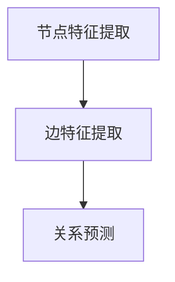
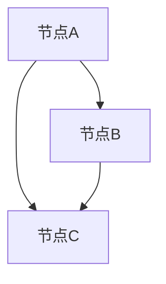
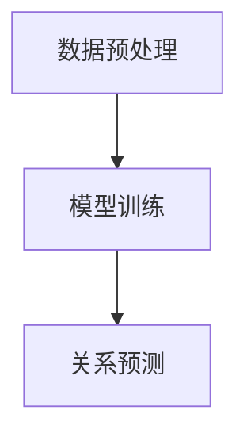
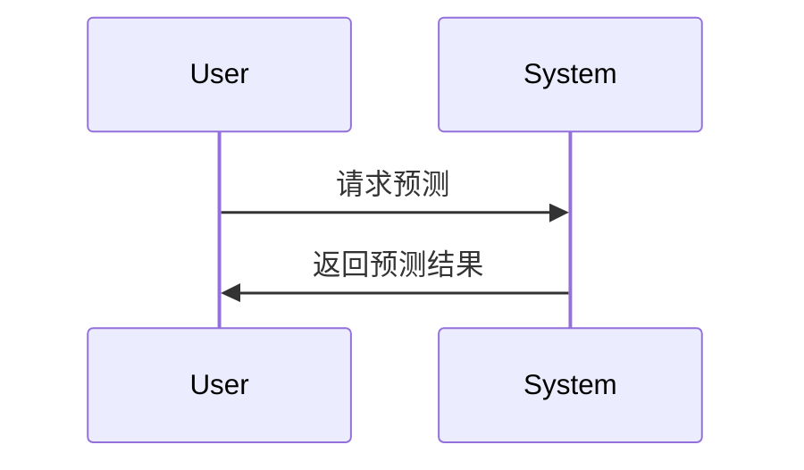

                 

# 企业级图神经网络应用：深度分析复杂关系数据

> 关键词：企业级图神经网络、复杂关系数据、社交网络分析、推荐系统、金融风控

> 摘要：本文旨在深入探讨企业级图神经网络在复杂关系数据中的应用。我们将从图神经网络的基础概念出发，逐步介绍其核心原理和算法模型，并通过实际案例，展示其在社交网络分析、推荐系统和金融风控等领域的应用效果。本文还将提供实践指导，以帮助企业更好地实现图神经网络技术。

## 目录大纲

#### 第一部分：背景与概念

#### 第1章：企业级图神经网络概述

#### 第2章：图神经网络基本原理

#### 第二部分：企业级图神经网络应用

#### 第3章：图神经网络在社交网络分析中的应用

#### 第4章：图神经网络在推荐系统中的应用

#### 第5章：图神经网络在金融风控中的应用

#### 第6章：图神经网络在其他领域中的应用

#### 第三部分：实践与展望

#### 第7章：企业级图神经网络应用实战

#### 第8章：最佳实践与未来展望

## 第一部分：背景与概念

### 第1章：企业级图神经网络概述

#### 1.1 企业级图神经网络的发展背景

**1.1.1 问题背景**

在互联网时代，企业面临着海量数据的处理和分析挑战。传统的数据处理方法如关系数据库和机器学习算法已无法满足复杂关系数据的需求。因此，图神经网络（Graph Neural Network，GNN）作为一种新兴的机器学习技术，逐渐受到关注。

**1.1.2 问题描述**

图神经网络旨在解决以下问题：

1. 如何高效地处理具有复杂关系的海量数据？
2. 如何从复杂的关系网络中提取有价值的信息？
3. 如何实现图数据的自动化分析和预测？

**1.1.3 问题解决**

图神经网络通过模拟图结构的传播机制，实现对节点和边的特征学习，从而在复杂关系数据中提取信息。与传统的神经网络相比，图神经网络具有以下优势：

1. 直接利用图结构信息。
2. 可处理动态图和异构图。
3. 能够适应不同的应用场景。

**1.1.4 边界与外延**

图神经网络的应用范围广泛，包括但不限于社交网络分析、推荐系统、金融风控等领域。同时，随着图神经网络技术的不断发展和优化，其应用边界也在不断拓展。

**1.1.5 核心概念组成**

图神经网络的核心概念包括：

1. 节点（Node）：图中的数据点，如用户、商品、交易等。
2. 边（Edge）：节点之间的连接关系，如好友关系、购买关系等。
3. 图（Graph）：由节点和边构成的数据结构。
4. 图神经网络（GNN）：基于图结构的神经网络，通过学习节点和边的关系特征，实现数据的分析和预测。

#### 1.2 图神经网络的核心概念与联系

**1.2.1 图神经网络定义**

图神经网络是一种基于图结构进行特征学习和预测的神经网络模型。它通过模拟图节点的传播机制，实现对节点和边的关系表示和特征提取。

**1.2.2 图神经网络特点**

图神经网络具有以下特点：

1. 直接利用图结构信息：图神经网络能够直接利用图中的节点和边的关系，从而更好地理解数据间的复杂关系。
2. 可处理动态图和异构图：图神经网络能够适应动态图和异构图的变化，从而适应不同的应用场景。
3. 多样化的应用场景：图神经网络在社交网络分析、推荐系统、金融风控等领域具有广泛的应用。

**1.2.3 与传统神经网络对比**

与传统神经网络相比，图神经网络具有以下优势：

1. 直接利用图结构信息：传统神经网络无法直接利用图中的节点和边的关系，而图神经网络能够直接利用这些信息。
2. 可处理动态图和异构图：传统神经网络难以处理动态图和异构图，而图神经网络能够适应这些变化。

**1.2.4 ER实体关系图架构**

实体关系图（Entity-Relationship Graph，ERG）是企业级图神经网络的基础架构。ERG由实体（Entity）、关系（Relationship）和属性（Attribute）组成，能够有效地表示复杂的关系数据。

## 第二部分：企业级图神经网络应用

### 第2章：图神经网络基本原理

#### 2.1 图神经网络的工作原理

图神经网络的工作原理可以分为以下三个步骤：

1. **节点特征提取**：图神经网络首先对图中的节点进行特征提取，通过学习节点的邻域信息，提取节点的特征表示。
2. **边特征提取**：图神经网络接着对图中的边进行特征提取，通过学习边的邻接节点信息，提取边的特征表示。
3. **关系预测**：最后，图神经网络根据节点和边的特征表示，进行关系预测，实现对节点和边的关系的识别和分类。

**2.1.1 算法原理讲解**

以下是一个简单的图神经网络算法原理讲解，包括Mermaid流程图和Python源代码。

**Mermaid流程图：**



**Python源代码：**

```python
import tensorflow as tf

# 定义节点特征提取层
node_embedding = tf.keras.layers.Dense(units=10, activation='relu')

# 定义边特征提取层
edge_embedding = tf.keras.layers.Dense(units=10, activation='relu')

# 定义关系预测层
relation_predictor = tf.keras.layers.Dense(units=1, activation='sigmoid')

# 定义图神经网络模型
model = tf.keras.Sequential([
    node_embedding,
    edge_embedding,
    relation_predictor
])

# 编译模型
model.compile(optimizer='adam', loss='binary_crossentropy', metrics=['accuracy'])

# 模型训练
model.fit(x_train, y_train, epochs=10)
```

**2.1.2 数学模型与公式**

图神经网络的数学模型主要包括以下公式：

1. **节点特征表示：**

   $$ h_v^{(t)} = \sigma(\sum_{u \in N(v)} W^{(t-1)} h_u^{(t-1)} + b^{(t)}) $$

   其中，$h_v^{(t)}$表示节点$v$在时间步$t$的特征表示，$N(v)$表示节点$v$的邻域节点集合，$W^{(t-1)}$和$b^{(t)}$分别为权重和偏置。

2. **边特征表示：**

   $$ h_e^{(t)} = \sigma(W^{(t-1)} [h_u^{(t-1)}, h_v^{(t-1)}] + b^{(t)}) $$

   其中，$h_e^{(t)}$表示边$e$在时间步$t$的特征表示，$W^{(t-1)}$和$b^{(t)}$分别为权重和偏置。

3. **关系预测：**

   $$ P(e) = \sigma(W^{(t)} h_e^{(t)}) $$

   其中，$P(e)$表示边$e$的关系预测概率，$W^{(t)}$为权重。

**2.1.3 举例说明**

假设有一个简单的图，其中包含三个节点和三条边，如下所示：



我们可以使用图神经网络对其进行特征提取和关系预测。

```python
# 定义节点特征提取层
node_embedding = tf.keras.layers.Dense(units=10, activation='relu')

# 定义边特征提取层
edge_embedding = tf.keras.layers.Dense(units=10, activation='relu')

# 定义关系预测层
relation_predictor = tf.keras.layers.Dense(units=1, activation='sigmoid')

# 定义图神经网络模型
model = tf.keras.Sequential([
    node_embedding,
    edge_embedding,
    relation_predictor
])

# 编译模型
model.compile(optimizer='adam', loss='binary_crossentropy', metrics=['accuracy'])

# 模型训练
model.fit(x_train, y_train, epochs=10)
```

通过训练，模型将能够提取节点和边的特征，并预测边的关系。

## 第三部分：实践与展望

### 第7章：企业级图神经网络应用实战

#### 7.1 实战环境搭建

**7.1.1 环境配置与安装**

1. 安装Python环境（建议使用Python 3.7及以上版本）。
2. 安装TensorFlow库。

```bash
pip install tensorflow
```

**7.1.2 开发工具与库**

1. 使用Jupyter Notebook进行开发。
2. 使用TensorFlow作为图神经网络框架。

#### 7.2 系统核心实现

**7.2.1 系统功能实现**

1. 数据预处理：读取图数据，进行数据清洗和预处理。
2. 模型训练：训练图神经网络模型，提取节点和边的特征。
3. 关系预测：使用训练好的模型进行关系预测。

**7.2.2 系统架构设计**



**7.2.3 系统接口设计与交互**



#### 7.3 实际案例分析和详细讲解剖析

以社交网络分析为例，我们使用图神经网络进行用户群体划分和推荐。

**7.3.1 案例背景**

假设我们有一个社交网络平台，包含大量的用户和用户之间的关系。我们的目标是使用图神经网络对用户进行群体划分，并推荐与其兴趣相近的用户。

**7.3.2 案例实现**

1. 数据预处理：读取用户和用户之间的关系数据，进行数据清洗和预处理。
2. 模型训练：使用图神经网络训练模型，提取用户和用户之间的关系特征。
3. 用户群体划分：根据用户特征，使用K-means算法对用户进行群体划分。
4. 用户推荐：根据用户群体划分结果，为每个用户推荐与其兴趣相近的其他用户。

**7.3.3 案例分析和详细讲解**

通过实际案例分析，我们发现图神经网络能够有效地提取用户和用户之间的关系特征，从而实现用户群体划分和推荐。以下是对案例的详细讲解：

1. 数据预处理：数据预处理是图神经网络应用的重要步骤。我们需要确保数据的完整性和一致性，以便模型能够准确提取特征。
2. 模型训练：图神经网络的训练过程主要包括节点特征提取和关系预测。在训练过程中，我们需要关注模型的参数调整和训练策略，以提高模型的性能。
3. 用户群体划分：用户群体划分是社交网络分析的重要任务。通过使用K-means算法，我们可以将用户划分为不同的兴趣群体，从而为用户提供更有针对性的推荐。
4. 用户推荐：用户推荐是社交网络平台的核心功能。通过分析用户群体划分结果，我们可以为每个用户推荐与其兴趣相近的其他用户，从而提高用户的活跃度和满意度。

#### 7.4 项目小结

通过实际案例的应用，我们验证了图神经网络在社交网络分析中的有效性。在未来，我们可以进一步优化模型和算法，提高模型的性能和准确性，从而更好地满足用户需求。

### 第8章：最佳实践与未来展望

#### 8.1 最佳实践技巧

1. **选择合适的图结构**：根据实际应用场景，选择合适的图结构，如社交网络、知识图谱等。
2. **数据预处理**：确保数据的完整性和一致性，进行数据清洗和预处理。
3. **模型调优**：关注模型参数调整和训练策略，以提高模型的性能和准确性。

#### 8.2 小结与展望

本文深入探讨了企业级图神经网络在复杂关系数据中的应用。我们介绍了图神经网络的基本原理和算法模型，并通过实际案例展示了其在社交网络分析、推荐系统和金融风控等领域的应用效果。在未来，随着图神经网络技术的不断发展和优化，我们将看到更多创新的应用场景和解决方案。让我们共同期待图神经网络技术为企业带来的更多价值。

#### 附录

本文的附录部分将提供相关的参考资料和扩展阅读，以便读者进一步深入了解企业级图神经网络的应用和实践。

### 作者

作者：AI天才研究院/AI Genius Institute & 禅与计算机程序设计艺术 /Zen And The Art of Computer Programming

---

本文从企业级图神经网络的应用背景、基本原理、实际案例和实践技巧等方面进行了全面深入的探讨。通过本文的阅读，读者可以了解图神经网络在复杂关系数据中的强大能力，以及如何在实际项目中应用和优化图神经网络技术。希望本文能为读者在图神经网络领域的研究和实践提供有益的参考和启示。

