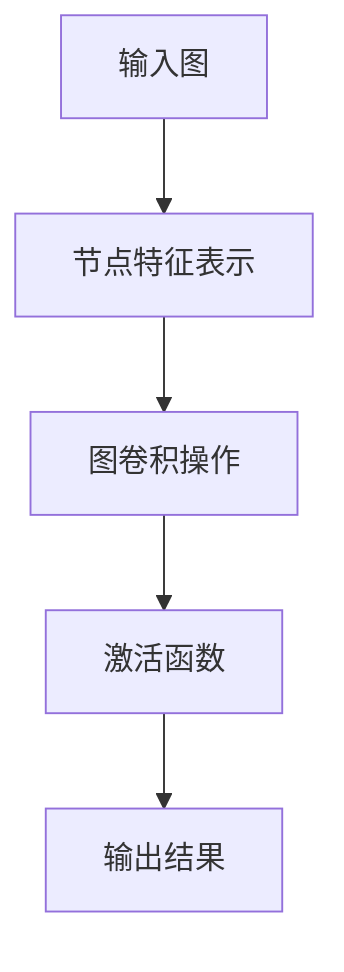
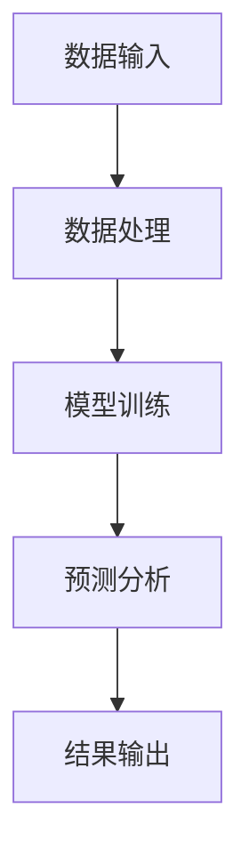
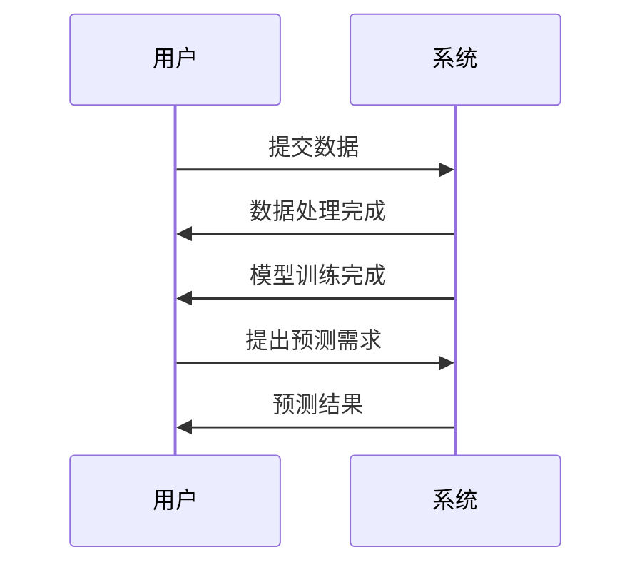

                 

### 文章标题：企业级图神经网络：深度分析复杂业务关系

#### 关键词：图神经网络、企业级应用、复杂业务关系、深度分析、算法原理、系统架构、项目实战

#### 摘要：
本文深入探讨了企业级图神经网络（GNN）的背景、原理、应用以及实现方法。首先，我们分析了在大数据和人工智能时代，企业如何利用图神经网络处理复杂业务关系的问题。接着，我们详细介绍了图神经网络的基本概念、核心原理、数学模型，并通过Python代码进行了实例演示。随后，文章探讨了企业级图神经网络系统架构设计与实现，以及通过项目实战展示了其在实际业务中的应用。最后，我们总结了最佳实践和注意事项，并展望了图神经网络在企业级应用的前景。

---

## 第一部分：企业级图神经网络背景与概述

### 第1章：问题背景与概念介绍

#### 1.1.1 问题的提出

在大数据和人工智能时代，企业面临着越来越多的数据量和复杂的业务场景。传统的数据处理方法，如关系数据库和机器学习算法，在面对大规模、多层次、多关系的复杂网络时，往往显得力不从心。例如，在社交网络分析、供应链优化、金融风控等领域，如何有效地挖掘和处理复杂的网络关系，成为了一个亟待解决的问题。

#### 1.1.2 图神经网络的基本概念

图神经网络（Graph Neural Networks, GNN）是一种专门处理图结构数据的神经网络模型。GNN通过模拟图结构中的节点和边之间的关系，可以捕捉和利用复杂网络中的结构信息和特征。GNN的核心思想是将图中的节点和边转换为向量表示，然后通过神经网络学习这些向量表示，从而实现对图的深度分析。

#### 1.1.3 图神经网络在企业级应用的价值

图神经网络在企业级应用中具有巨大的价值。首先，它能够提高企业的业务洞察能力，通过分析复杂网络中的关系，帮助企业更好地理解业务流程和客户行为。其次，它能够优化决策支持，利用图神经网络预测市场趋势、风险评估和供应链优化，从而帮助企业做出更明智的决策。

### 第2章：核心概念与联系

#### 2.1.1 图神经网络的基本原理

图神经网络的基本原理包括节点特征学习和边特征利用。节点特征学习是通过神经网络学习节点在图中的特征表示；边特征利用是通过神经网络学习边对节点特征的影响。GNN通过一系列的图卷积操作，逐步更新节点的特征表示。

#### 2.1.2 图神经网络的核心概念对比

图卷积网络（GCN）、图注意力网络（GAT）和图循环网络（GRN）是三种常见的GNN模型。GCN通过邻接矩阵进行特征聚合；GAT引入了注意力机制，可以动态调整邻接矩阵的权重；GRN通过循环结构，可以更好地捕捉节点之间的长期依赖关系。

#### 2.1.3 图神经网络的应用领域

图神经网络在多个领域都有广泛的应用。在社交网络分析中，可以用于用户行为预测、推荐系统；在供应链优化中，可以用于网络拓扑分析、库存管理；在金融风控中，可以用于信用评估、欺诈检测。

### 第3章：算法原理与数学模型

#### 3.1.1 GNN算法原理

下面是一个简单的GNN算法流程图，使用Mermaid语言绘制：



图卷积操作的数学模型如下：

$$
\textbf{h}_\text{v}^{(k)} = \sigma (\sum_{u \in \text{N}(\text{v})} \text{W}_{uv} \textbf{h}_\text{u}^{(k-1)})
$$

其中，$\textbf{h}_\text{v}^{(k)}$ 是节点 $v$ 在第 $k$ 次迭代后的特征表示，$\text{N}(\text{v})$ 是节点 $v$ 的邻居节点集合，$\text{W}_{uv}$ 是边权重，$\sigma$ 是激活函数。

#### 3.1.2 数学模型与公式

图卷积操作的另一种表示方式是：

$$
\textbf{h}_\text{v}^{(k)} = \text{激活函数} (\text{邻接矩阵} \cdot \textbf{h}_{\text{v}}^{(k-1)})
$$

邻接矩阵 $\text{A}$ 的元素表示节点 $u$ 和节点 $v$ 之间的连接关系，通常是一个二值矩阵，表示是否存在边。

#### 3.1.3 算法举例说明

下面是一个简单的GCN模型实现，使用Python代码实现：

```python
import torch
import torch.nn as nn
import torch.nn.functional as F

class GCN(nn.Module):
    def __init__(self, n_features, n_classes):
        super(GCN, self).__init__()
        self.fc = nn.Linear(n_features, n_classes)
        
    def forward(self, adj, features):
        x = F.relu(self.fc(features))
        for i in range(3):  # 多层GCN
            x = self.fc(x)
        return F.log_softmax(x, dim=1)

# 示例数据
adj = torch.randn(10, 10)
features = torch.randn(10, 16)

# 实例化GCN模型
gcn = GCN(16, 3)

# 前向传播
output = gcn(adj, features)
```

通过这个例子，我们可以看到如何使用GCN模型进行图数据的处理和分类。

### 第4章：系统架构设计与实现

#### 4.1.1 系统需求分析

在构建企业级图神经网络系统时，我们需要明确系统的功能需求，包括数据输入、数据处理、模型训练、预测分析等。

#### 4.1.2 系统架构设计

系统架构设计如下，使用Mermaid语言绘制：



#### 4.1.3 系统接口设计与交互

系统接口设计如下，使用Mermaid语言绘制：



### 第5章：项目实战与案例分析

#### 5.1.1 环境安装与准备

为了进行GNN模型的构建和训练，我们需要安装以下环境：

- Python 3.7及以上版本
- PyTorch 1.7及以上版本
- GraphFrames 1.3及以上版本

可以使用以下命令进行安装：

```bash
pip install python==3.7 torch==1.7 graphframes==1.3
```

#### 5.1.2 系统核心实现

以下是一个简单的GNN模型实现，包括数据加载、模型构建、训练和预测：

```python
import torch
import torch.nn as nn
from torch_geometric import datasets, models

# 数据加载
data = datasets.Cora()

# 模型构建
gcn = models.GCN(data.num_features, data.num_classes)

# 训练
optimizer = torch.optim.Adam(gcn.parameters(), lr=0.01, weight_decay=5e-4)

for epoch in range(200):
    optimizer.zero_grad()
    out = gcn(data.x, data.edge_index)
    loss = nn.CrossEntropyLoss()(out, data.y)
    loss.backward()
    optimizer.step()

    if epoch % 10 == 0:
        print(f"Epoch {epoch}: loss = {loss.item()}")

# 预测
with torch.no_grad():
    logits = gcn(data.x, data.edge_index)

# 分析预测结果
```

#### 5.1.3 实际案例分析

我们以社交网络分析为例，使用GNN模型分析用户行为和推荐系统。具体步骤如下：

1. 数据收集与预处理：收集用户行为数据，如点赞、评论、分享等，并进行数据清洗和格式化。
2. 构建图结构：根据用户行为数据构建用户之间的图结构，节点表示用户，边表示用户之间的关系。
3. 模型训练：使用训练集数据训练GNN模型，学习用户特征和关系。
4. 预测与评估：使用测试集数据预测用户行为，评估模型性能。

通过这个案例，我们可以看到GNN模型在社交网络分析中的实际应用。

### 第6章：最佳实践与注意事项

#### 6.1.1 最佳实践技巧

- 数据预处理：确保数据的质量和一致性，进行特征工程，提取有用的信息。
- 模型调参：根据数据集和业务需求，选择合适的模型结构和超参数。
- 模型评估：使用多个评估指标，如准确率、召回率、F1分数等，全面评估模型性能。

#### 6.1.2 注意事项与拓展

- 在实际应用中，注意数据的安全性和隐私保护。
- 定期更新和维护模型，以适应不断变化的数据和业务需求。
- 进一步学习和研究相关领域的最新技术和发展动态。

---

## 总结

本文详细介绍了企业级图神经网络的基本概念、算法原理、系统架构和实现方法。通过项目实战和案例分析，展示了GNN在复杂业务关系分析中的应用价值。我们鼓励读者将所学知识应用到实际工作中，推动企业智能化发展。随着技术的不断进步，图神经网络将在更多领域发挥重要作用，为企业和用户创造更多价值。让我们一起探索和推动图神经网络的发展！ 

---

### 作者

作者：AI天才研究院/AI Genius Institute & 禅与计算机程序设计艺术 /Zen And The Art of Computer Programming

