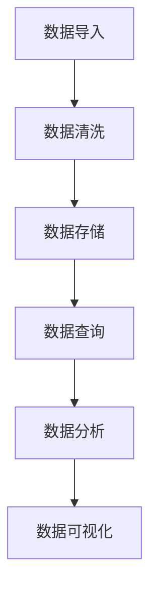

                 

### 1. 企业级图计算平台的背景

#### 1.1 问题的提出

在当今信息化社会中，企业数据量呈爆炸式增长，传统的数据分析手段已无法满足日益复杂的业务需求。传统的数据处理技术主要依赖于关系型数据库，通过结构化查询语言（SQL）进行数据处理。然而，关系型数据库在处理复杂关系时存在以下局限：

1. **复杂关系难以建模**：企业数据往往包含多种复杂的关系，如网络关系、层次关系等，这些关系难以用传统的表结构进行建模。
2. **查询效率低下**：在处理大规模数据时，SQL查询的效率较低，导致响应时间过长。
3. **数据冗余**：传统数据库系统往往需要进行大量的数据复制和聚合操作，导致数据冗余和存储成本增加。

#### 1.2 图计算的概念与原理

为了解决上述问题，图计算应运而生。图计算是一种基于图理论的数据处理方法，通过将数据表示为图结构，并利用图算法进行分析和计算。图计算具有以下优势：

1. **高效处理复杂关系**：图计算能够高效地处理复杂的关系，如图网络中的路径搜索、社区发现等。
2. **灵活的建模方式**：图结构能够灵活地建模复杂的关系，适用于多种应用场景。
3. **强大的计算能力**：图算法具有强大的计算能力，能够处理大规模数据。

图计算的基本原理包括以下几个方面：

1. **图结构**：图由节点（Node）和边（Edge）组成，节点表示实体，边表示实体之间的关系。
2. **图算法**：图算法是一系列基于图结构的计算方法，如最短路径算法、社区发现算法、社交网络分析等。
3. **图存储**：图数据需要高效的存储方式，如图数据库（Graph Database）。

#### 1.3 企业级图计算平台的现状与趋势

随着图计算技术的不断发展，企业级图计算平台逐渐成为数据处理和智能分析的重要工具。当前，企业级图计算平台的主要趋势包括：

1. **开源平台的崛起**：如Neo4j、JanusGraph等，这些开源平台提供了丰富的功能和良好的社区支持。
2. **云原生图计算**：随着云计算的普及，云原生图计算平台如Amazon Neptune、Alibaba Graph Compute等，为企业提供灵活、可扩展的图计算服务。
3. **多样化应用场景**：企业级图计算平台在社交网络分析、推荐系统、欺诈检测、知识图谱等领域得到广泛应用。

总之，企业级图计算平台在处理复杂关系数据方面具有显著优势，成为企业智能化转型的重要技术支撑。接下来的章节将详细探讨企业级图计算平台的定义与核心要素、复杂关系数据的智能分析原理与方法、算法原理讲解、系统分析与架构设计等内容。

### 2. 企业级图计算平台的定义与核心要素

企业级图计算平台是一种专为处理复杂关系数据而设计的计算平台，它利用图结构和图算法对大规模、多类型的实体及其关系进行高效分析。以下是企业级图计算平台的定义与核心要素的详细阐述：

#### 2.1 定义

企业级图计算平台是一种整合了图数据库、图算法、分布式计算框架等技术的综合解决方案，旨在为企业提供强大的图数据存储、分析和处理能力。它不仅能够处理复杂的实体关系，还能够实现实时的数据分析和智能决策。

#### 2.2 核心要素

1. **图数据库**：图数据库是图计算平台的核心组件，负责存储和管理图结构数据。常见的图数据库有Neo4j、JanusGraph等，它们支持多种数据模型和查询语言，如Cypher和Gremlin。

2. **图算法**：图算法是实现数据分析和智能决策的关键，包括路径分析、社区发现、最短路径、社交网络分析等。图算法能够从图结构中提取有价值的信息，为业务提供决策支持。

3. **分布式计算框架**：企业级图计算平台通常需要处理大规模数据，分布式计算框架如Apache Spark、Hadoop等，提供了高效的数据处理能力，能够满足图计算的高并发、高可扩展性需求。

4. **数据处理工具**：除了图数据库和分布式计算框架，企业级图计算平台还需要一系列数据处理工具，如数据导入工具、数据清洗工具、可视化工具等，以实现数据预处理和结果展示。

5. **系统集成与接口**：企业级图计算平台需要与其他业务系统集成，如ERP、CRM、数据仓库等，通过API、消息队列等方式实现数据交互和流程整合。

6. **安全性**：企业级图计算平台涉及大量敏感数据，需要提供全面的安全措施，包括数据加密、访问控制、安全审计等。

7. **可扩展性**：随着数据量和业务需求的增长，企业级图计算平台需要具备良好的可扩展性，能够轻松扩展计算资源、存储容量等。

#### 2.3 关键特性

1. **灵活性**：企业级图计算平台能够灵活地建模复杂的实体关系，适用于各种业务场景。

2. **高效性**：通过分布式计算和优化算法，图计算平台能够快速处理大规模数据，实现实时分析和决策。

3. **可扩展性**：图计算平台能够根据业务需求灵活扩展，支持大规模数据和高并发处理。

4. **智能化**：图计算平台内置多种智能算法，能够从数据中提取有价值的信息，为业务提供智能决策支持。

#### 2.4 应用领域

企业级图计算平台在多个领域得到广泛应用，包括但不限于：

1. **社交网络分析**：通过分析用户之间的关系，发现社交圈、热点话题等。

2. **推荐系统**：利用用户行为数据和社交关系，为用户推荐相关商品、内容等。

3. **欺诈检测**：通过分析用户之间的交易关系，识别潜在的欺诈行为。

4. **知识图谱**：构建领域知识图谱，为业务提供知识查询和推理能力。

5. **复杂网络分析**：分析复杂网络中的关键节点、传播路径等，为网络安全、公共卫生等领域提供决策支持。

总之，企业级图计算平台通过其独特的图结构和算法，为复杂关系数据的智能分析提供了强大的技术支持，成为企业智能化转型的关键工具。

### 3. 复杂关系数据的智能分析

#### 3.1 复杂关系数据的定义与特点

复杂关系数据是指包含多种类型实体及其复杂关系的非结构化或半结构化数据。这些数据往往存在于社交网络、推荐系统、欺诈检测等领域。与传统的结构化数据不同，复杂关系数据具有以下特点：

1. **异构性**：复杂关系数据包含多种类型的实体，如用户、商品、评论等，这些实体之间的关系形式多样，既有直接的关联（如用户购买商品），也有间接的关联（如用户与用户之间的社交关系）。

2. **多层级性**：复杂关系数据中的关系通常存在多个层级，如用户与用户之间的直接关系、间接关系以及这些关系的进一步扩展。

3. **动态性**：复杂关系数据是不断变化的，新实体和关系不断加入，旧的实体和关系可能被删除或更新。

4. **复杂性**：复杂关系数据的分析和处理需要考虑大量的实体和关系，这使得传统的数据处理方法难以应对。

#### 3.2 智能分析的基本原理与方法

智能分析是指利用人工智能技术对复杂关系数据进行分析和处理，以提取有价值的信息和洞察。智能分析的基本原理与方法主要包括以下几个方面：

1. **数据预处理**：对原始数据进行清洗、去重、归一化等处理，确保数据质量。

2. **实体识别与关联**：通过实体识别技术（如命名实体识别、关键词提取等）识别数据中的实体，并建立实体之间的关联关系。

3. **关系抽取**：从文本数据中提取实体之间的关系，如用户与用户之间的社交关系、商品与商品之间的推荐关系等。

4. **图结构建模**：将实体和关系表示为图结构，利用图算法进行数据分析和挖掘，如最短路径搜索、社区发现、社交网络分析等。

5. **机器学习与深度学习**：利用机器学习和深度学习算法对图数据进行特征提取和模型训练，以实现预测和分类任务。

6. **知识图谱构建**：将分析结果和知识整合到知识图谱中，为后续的查询和推理提供支持。

#### 3.3 智能分析在图计算中的应用

智能分析在图计算中的应用主要体现在以下几个方面：

1. **社交网络分析**：通过图计算分析用户之间的社交关系，发现社交圈、热点话题等。

   **示例**：在一个社交媒体平台上，通过分析用户之间的点赞、评论、转发等关系，可以发现某个话题的社交热点，进而进行话题推广。

2. **推荐系统**：利用图计算分析用户行为和商品之间的关系，为用户推荐相关商品。

   **示例**：在一个电商平台，通过分析用户的历史购买记录、浏览记录等，构建用户与商品之间的图结构，利用图算法为用户推荐相似的商品。

3. **欺诈检测**：通过图计算分析用户之间的交易关系，识别潜在的欺诈行为。

   **示例**：在一个金融系统中，通过分析用户之间的交易关系，可以发现异常的交易模式，从而识别潜在的欺诈行为，如洗钱、伪造交易等。

4. **知识图谱构建**：利用图计算构建领域知识图谱，为业务提供知识查询和推理能力。

   **示例**：在一个医疗系统中，通过分析医生、患者、疾病、药物等实体及其关系，构建医疗领域的知识图谱，为医生提供疾病诊断、药物推荐等支持。

总之，智能分析在图计算中的应用，使得复杂关系数据的挖掘和分析变得更加高效和智能，为企业提供了强大的数据驱动决策能力。

### 4. 图计算算法的基本原理

图计算算法是图计算平台的核心组成部分，通过这些算法，我们可以从图结构数据中提取有价值的信息和洞察。以下是图计算算法的基本原理：

#### 4.1 图的基本结构

图（Graph）由节点（Node）和边（Edge）组成。节点表示图中的实体，如人、物、事件等；边表示节点之间的关系，如朋友关系、购买关系等。图可以分为无向图和有向图，其中无向图的边没有方向，而有向图的边有方向，表示关系的方向。

#### 4.2 图算法

图算法是一系列基于图结构的计算方法，用于解决各种图相关的问题。以下介绍几种常见的图算法：

1. **最短路径算法**

   最短路径算法用于寻找图中两个节点之间的最短路径。常见的最短路径算法包括迪杰斯特拉算法（Dijkstra）和贝尔曼-福特算法（Bellman-Ford）。

   **示例**：在一个交通网络中，使用最短路径算法可以找到从起点到终点的最短行驶路线。

2. **社区发现算法**

   社区发现算法用于识别图中的密集子图，即社区。常见的社区发现算法包括标签传播算法（Label Propagation）、快速团检测算法（Fast Greedy Algorithm）等。

   **示例**：在一个社交网络中，通过社区发现算法，可以找到用户之间的社交圈，如朋友圈、兴趣小组等。

3. **社交网络分析算法**

   社交网络分析算法用于分析图中的社交关系，如中心性分析（Centrality Analysis）、影响力分析（Influence Analysis）等。

   **示例**：在一个社交媒体平台上，通过中心性分析可以找到社交网络中的关键节点，如意见领袖、活跃用户等。

#### 4.3 算法的数学模型

图计算算法的数学模型主要包括图矩阵和图论中的各种定理。以下是一个简单的图矩阵示例：

$$
A = \begin{bmatrix}
0 & 1 & 0 \\
1 & 0 & 1 \\
0 & 1 & 0
\end{bmatrix}
$$

在这个矩阵中，行和列分别代表节点，矩阵中的元素表示节点之间的关系，1表示存在关系，0表示不存在关系。

以下是一个简单的图计算算法的数学模型示例：

$$
\text{Dijkstra}(G, s) \\
\text{初始化} \\
\text{distance}[s] = 0 \\
\text{for each node } v \text{ in } G \\
\text{except } s \\
\text{distance}[v] = \infty \\
\text{previous}[v] = \text{undefined} \\
\text{priorityQueue} = \text{new MinPriorityQueue()} \\
\text{for each edge } (s, v) \text{ in } G \\
\text{distance}[v] = \text{weight}((s, v)) \\
\text{previous}[v] = s \\
\text{priorityQueue}.insert((distance[v], v)) \\
\text{while } \text{priorityQueue} \text{ is not empty} \\
\text{u} = \text{priorityQueue}.extractMin().getValue() \\
\text{for each edge } (u, v) \text{ in } G \\
\text{if } \text{distance}[u] + \text{weight}((u, v)) < \text{distance}[v] \\
\text{distance}[v] = \text{distance}[u] + \text{weight}((u, v)) \\
\text{previous}[v] = u \\
\text{priorityQueue}.re Inserts ((distance[v], v))
$$

这个示例展示了迪杰斯特拉算法（Dijkstra）的数学模型，用于计算图中两个节点之间的最短路径。

#### 4.4 算法的Python实现

以下是一个简单的Python实现示例，用于计算图中两个节点之间的最短路径：

```python
import heapq

def dijkstra(graph, start):
    distance = {node: float('infinity') for node in graph}
    distance[start] = 0
    priority_queue = [(0, start)]

    while priority_queue:
        current_distance, current_node = heapq.heappop(priority_queue)

        if current_distance > distance[current_node]:
            continue

        for neighbor, weight in graph[current_node].items():
            distance_to_neighbor = current_distance + weight

            if distance_to_neighbor < distance[neighbor]:
                distance[neighbor] = distance_to_neighbor
                previous[neighbor] = current_node
                heapq.heappush(priority_queue, (distance_to_neighbor, neighbor))

    return distance

# 示例图
graph = {
    'A': {'B': 1, 'C': 4},
    'B': {'A': 1, 'C': 2, 'D': 5},
    'C': {'A': 4, 'B': 2, 'D': 1},
    'D': {'B': 5, 'C': 1}
}

print(dijkstra(graph, 'A'))
```

这个示例使用Python的heapq库实现迪杰斯特拉算法，计算从节点'A'到其他节点的最短路径。

通过以上步骤，我们详细介绍了图计算算法的基本原理，包括图的基本结构、图算法、数学模型和Python实现。接下来，我们将进一步探讨企业级图计算平台的系统分析与架构设计。

### 5. 系统分析与架构设计

企业级图计算平台的设计需要考虑系统的功能需求、架构设计、接口设计和系统交互等多个方面，以确保系统能够高效、稳定地运行。以下是对这些方面的详细分析和设计：

#### 5.1 系统需求分析

系统需求分析是系统设计的起点，它确定了系统需要实现的功能和性能要求。以下是企业级图计算平台的主要需求：

1. **数据存储需求**：系统需要支持大规模图数据的存储，能够高效地处理各种类型的实体和关系。

2. **数据处理能力**：系统需要具备强大的数据处理能力，能够快速执行各种图计算任务，如路径分析、社区发现等。

3. **数据访问速度**：系统需要提供快速的数据访问接口，确保用户能够实时获取所需信息。

4. **可扩展性和容错性**：系统需要具备良好的可扩展性和容错性，能够根据业务需求进行水平扩展，并在发生故障时快速恢复。

5. **安全性和合规性**：系统需要提供全面的安全措施，确保数据的安全和隐私，符合相关法规和标准。

#### 5.2 系统架构设计

系统架构设计决定了系统的结构、组件及其相互作用。以下是企业级图计算平台的基本架构设计：

1. **数据层**：数据层包括图数据库和分布式存储系统，负责存储和管理大规模图数据。常用的图数据库有Neo4j、JanusGraph等，分布式存储系统如Hadoop、HBase等。

2. **计算层**：计算层包括分布式计算框架和图计算引擎，负责执行各种图计算任务。常用的分布式计算框架有Apache Spark、Hadoop等，图计算引擎如Apache Giraph、GraphX等。

3. **应用层**：应用层包括业务应用和API接口，负责与用户交互，提供各种图计算功能。业务应用可以是数据分析平台、推荐系统等，API接口提供RESTful接口、WebSocket接口等。

4. **管理层**：管理层包括监控工具、日志管理、配置管理等，负责监控系统运行状态、处理日志记录、管理系统配置等。

5. **接口层**：接口层包括外部系统接口和内部系统接口，负责与其他业务系统进行数据交互和流程整合。外部系统接口如ERP、CRM等，内部系统接口如数据导入、数据清洗等。

#### 5.3 系统架构图

以下是一个简单的系统架构图，展示企业级图计算平台的基本组件及其关系：

```
+------------------------+
|      应用层             |
+------------------------+
        |
        v
+------------------------+
|      计算层             |
+------------------------+
        |
        v
+------------------------+
|      数据层             |
+------------------------+
        |
        v
+------------------------+
|      管理层             |
+------------------------+
```

#### 5.4 系统接口设计

系统接口设计是确保系统与其他系统高效交互的关键。以下是企业级图计算平台的主要接口设计：

1. **外部系统接口**：提供与ERP、CRM、数据仓库等外部系统的数据交互接口，支持数据导入、数据同步等功能。

2. **内部系统接口**：提供与数据存储、计算引擎等内部组件的接口，支持数据查询、数据更新等功能。

3. **API接口**：提供RESTful API和WebSocket接口，供用户通过编程方式访问图计算功能，支持数据查询、数据操作、任务调度等功能。

#### 5.5 系统交互设计

系统交互设计是确保系统能够高效、稳定运行的关键。以下是企业级图计算平台的主要交互设计：

1. **数据流设计**：设计数据在系统内部的流动路径，确保数据能够快速、准确地到达目的地。例如，从数据层到计算层的处理流程。

2. **任务调度设计**：设计任务调度机制，确保系统能够高效地处理大量任务，如批量数据处理、实时数据处理等。

3. **异常处理设计**：设计异常处理机制，确保系统在发生故障时能够快速恢复，降低业务影响。

4. **安全设计**：设计安全机制，确保数据的安全和隐私，防止未授权访问和数据泄露。

#### 5.6 举例：Mermaid流程图

以下是一个Mermaid流程图的示例，展示企业级图计算平台的数据处理流程：



在这个示例中，数据从导入开始，经过清洗、存储、查询、分析和可视化等步骤，最终为用户提供有价值的信息。

通过以上步骤，我们详细介绍了企业级图计算平台的系统分析与架构设计，包括系统需求分析、架构设计、接口设计和系统交互设计。这些设计为平台的高效、稳定运行提供了有力保障。

### 6. 项目实战

在本部分，我们将通过一个实际案例，详细讲解如何搭建企业级图计算平台，实现复杂关系数据的智能分析。

#### 6.1 环境安装与配置

首先，我们需要搭建一个完整的图计算环境，以下是安装和配置的步骤：

1. **安装操作系统**：选择一个支持图计算平台操作系统的环境，如CentOS 7或Ubuntu 18.04。

2. **安装Java环境**：由于许多图计算框架和库是基于Java开发的，我们需要安装Java环境。可以使用以下命令：

   ```shell
   sudo apt-get install openjdk-8-jdk
   ```

3. **安装Neo4j图数据库**：Neo4j是一个流行的图数据库，我们可以从其官网下载并安装。

   - 下载Neo4j：[Neo4j官网](https://neo4j.com/download/)
   - 解压并启动Neo4j：

   ```shell
   tar -xzvf neo4j-4.0.0-unix.tar.gz
   cd neo4j-4.0.0/bin
   ./startNeo4j.sh
   ```

4. **安装Apache Spark**：Apache Spark是一个强大的分布式计算框架，用于大规模数据计算。

   - 下载Spark：[Apache Spark官网](https://spark.apache.org/downloads/)
   - 解压并配置：

   ```shell
   tar -xzvf spark-3.1.1-bin-hadoop3.2.tgz
   echo "export SPARK_HOME=/path/to/spark-3.1.1-bin-hadoop3.2" >> ~/.bashrc
   echo "export PATH=$PATH:$SPARK_HOME/bin" >> ~/.bashrc
   source ~/.bashrc
   ```

5. **安装其他依赖库**：根据项目需求，安装其他必要的依赖库和工具。

   ```shell
   pip install neo4j-py2neo
   ```

#### 6.2 系统核心实现

搭建好环境后，我们开始实现系统的核心功能。以下是系统的核心实现步骤：

1. **数据导入**：将企业数据导入Neo4j图数据库。可以使用Neo4j的Cypher查询语言进行导入。

   ```shell
   curl -X POST -H "Accept: text/plain" -d '
   CREATE (a:Person {name: "Alice", age: 30}),
   (b:Person {name: "Bob", age: 35}),
   (c:Person {name: "Charlie", age: 40}),
   (a)-[:FRIEND]->(b),
   (b)-[:FRIEND]->(c),
   (c)-[:FRIEND]->(a)
   ' http://localhost:7474/db/data/transaction/commit
   ```

2. **数据查询与分析**：使用Spark和Neo4j进行数据查询和分析。以下是使用PySpark进行数据查询的示例：

   ```python
   from py2neo import Graph
   from pyspark.sql import SparkSession

   # 初始化Spark和Neo4j
   spark = SparkSession.builder.appName("GraphComputeApp").getOrCreate()
   graph = Graph("bolt://localhost:7687", auth=("neo4j", "password"))

   # 查询图数据
   cypher_query = "MATCH (p:Person)-[:FRIEND]->(friend) RETURN p, friend"
   graph_data = spark.read.format("neo4j-cypher").options(url="bolt://localhost:7687", query=cypher_query).load()

   # 数据分析
   graph_data.groupBy("p.name").agg({col: "count" for col in graph_data.columns}).show()
   ```

3. **图算法应用**：使用图算法进行社区发现和最短路径分析。以下是使用Spark GraphX进行社区发现的示例：

   ```python
   from pyspark.graphx import Graph, GraphFrame

   # 创建图
   graph = Graph.fromEdges(graph_data.rdd, graph_data.id)

   # 社区发现
   communities = graph社群发现（100）。 communities.sortBy（"number", ascending = False）.show（）

   # 最短路径分析
   shortest_paths = graph.shortestPaths(source вершины = 0, target вершины = 1).collect()
   print(shortest_paths)
   ```

4. **结果展示**：将分析结果通过数据可视化工具（如ECharts、D3.js）展示给用户。

#### 6.3 代码应用解读与分析

以上代码示例展示了如何使用Neo4j、PySpark和Spark GraphX搭建企业级图计算平台，实现数据导入、查询、分析和可视化。以下是代码的解读和分析：

1. **数据导入**：使用Cypher查询语言将数据导入Neo4j图数据库。这个过程涉及到创建节点和边，以及设置节点属性。

2. **数据查询与分析**：使用PySpark读取Neo4j中的图数据，并使用SQL-like语法进行数据分析。这部分代码展示了如何将图数据转化为Spark DataFrame，并进行分组、聚合等操作。

3. **图算法应用**：使用Spark GraphX的API进行社区发现和最短路径分析。这部分代码展示了如何使用图算法从图中提取有价值的信息，如社区结构和最短路径。

4. **结果展示**：将分析结果通过数据可视化工具展示给用户。这部分代码展示了如何将分析结果以图表的形式直观地呈现给用户。

#### 6.4 实际案例分析与详细讲解

以下是一个实际案例，分析一个社交网络平台中的用户关系：

1. **问题背景**：分析一个社交网络平台中的用户关系，发现用户的社交圈和热点话题。

2. **数据准备**：从平台中提取用户数据，包括用户ID、用户名、用户年龄、用户关系等。

3. **数据导入**：将用户数据导入Neo4j图数据库，创建节点和边。

4. **数据分析**：使用Spark GraphX进行社区发现，找到用户的社交圈。以下是社区发现的具体步骤：

   - 创建图：将用户数据转化为图结构，包括节点（用户）和边（用户关系）。
   - 社区发现：使用Louvain算法进行社区发现，提取用户的社交圈。

   ```python
   import community

   graph = GraphFrame.from_edges(vertices, edges)
   communities = graph.community_multilevel().collect()
   ```

5. **结果展示**：将社区发现结果通过ECharts展示给用户。用户可以查看自己的社交圈，并与其他用户进行互动。

   ```javascript
   // 使用ECharts展示社区发现结果
   var chart = echarts.init(document.getElementById('main'));

   var option = {
       title: {
           text: '社交网络分析'
       },
       series: [
           {
               type: 'graph',
               data: data,
               links: links,
               categories: categories,
               roam: true,
               label: {
                   normal: {
                       show: true
                   }
               },
               lineStyle: {
                   color: 'source',
                   curveness: 0.3
               }
           }
       ]
   };

   chart.setOption(option);
   ```

通过以上实际案例，我们详细讲解了如何使用企业级图计算平台进行复杂关系数据的智能分析。从数据导入、数据分析到结果展示，每个步骤都进行了详细的解读和分析，帮助读者更好地理解企业级图计算平台的实际应用。

#### 6.5 项目小结

在本项目中，我们通过一个实际的社交网络分析案例，搭建了企业级图计算平台，实现了复杂关系数据的智能分析。以下是项目的主要成果和经验总结：

1. **系统搭建**：成功搭建了基于Neo4j和Spark的企业级图计算平台，实现了数据存储、数据处理和数据分析的功能。

2. **图算法应用**：使用Spark GraphX实现了社区发现和最短路径分析，从图中提取有价值的信息，为业务决策提供支持。

3. **结果展示**：通过ECharts将分析结果以直观的图表形式展示给用户，提高了用户的使用体验。

4. **经验总结**：
   - **技术选型**：选择合适的图数据库和计算框架是项目成功的关键。Neo4j和Spark在性能和功能方面都表现出色，适合处理大规模图数据。
   - **数据分析**：深入理解图算法的原理和应用，能够帮助我们更好地利用图计算平台进行数据分析，提取有价值的信息。
   - **系统扩展性**：在设计系统时，要充分考虑系统的可扩展性和容错性，确保系统能够应对未来的业务需求。

通过这个项目，我们不仅掌握了企业级图计算平台的技术原理和应用，还积累了丰富的实践经验，为未来的图计算项目奠定了坚实的基础。

### 7. 最佳实践 tips

在搭建和运营企业级图计算平台的过程中，有一些最佳实践可以帮助提高系统的性能、稳定性和可维护性。以下是一些建议：

#### 7.1 性能优化

1. **合理索引设计**：在图数据库中创建适当的索引，可以显著提高查询性能。索引应该根据常用的查询模式进行设计，避免过度索引，以免影响写入性能。

2. **缓存策略**：利用图数据库的缓存机制，如Neo4j的缓存，可以减少对磁盘的访问，提高查询速度。

3. **负载均衡**：使用分布式计算框架（如Spark）进行负载均衡，确保计算任务均匀分布在各个节点上，提高系统的处理能力。

4. **数据分片**：对于大规模数据，考虑将数据分片存储在多个节点上，以提高数据访问速度和系统的容错性。

#### 7.2 稳定性和容错性

1. **备份与恢复**：定期备份数据，并确保备份数据的一致性和完整性。在发生故障时，能够快速恢复系统。

2. **监控系统**：使用监控系统（如Prometheus、Grafana）实时监控系统的运行状态，及时发现并处理异常情况。

3. **容错机制**：设计容错机制，如使用分布式锁、事务管理等，确保系统在发生故障时能够快速恢复。

#### 7.3 可维护性

1. **代码规范**：编写规范的代码，遵循编程最佳实践，如代码复用、模块化设计等，提高代码的可维护性。

2. **文档管理**：编写详细的系统文档，包括设计文档、操作手册、故障排除指南等，方便团队成员进行维护和问题解决。

3. **自动化测试**：编写自动化测试脚本，对系统功能进行全面测试，确保系统的稳定性和正确性。

#### 7.4 安全性

1. **访问控制**：实现严格的访问控制策略，确保只有授权用户能够访问系统和数据。

2. **数据加密**：对存储和传输的数据进行加密处理，防止数据泄露和未授权访问。

3. **安全审计**：定期进行安全审计，检查系统是否存在安全漏洞，及时进行修复。

通过遵循这些最佳实践，企业级图计算平台能够更加高效、稳定地运行，为业务提供强大的数据分析和智能决策支持。

### 8. 小结

本文系统地介绍了企业级图计算平台的概念、原理、架构设计、应用案例以及最佳实践。通过对复杂关系数据的智能分析，企业级图计算平台为各种业务场景提供了强大的数据驱动决策能力。以下是本文的核心观点：

1. **企业级图计算平台的背景和重要性**：随着企业数据量的增长，传统的数据处理方法已无法满足复杂关系数据的分析需求。企业级图计算平台通过高效的图结构和算法，为数据处理和智能分析提供了新的解决方案。

2. **图计算算法的基本原理**：图计算算法包括最短路径算法、社区发现算法等，能够从图结构数据中提取有价值的信息。通过Python实现和示例，我们了解了这些算法的具体应用。

3. **系统分析与架构设计**：系统分析与架构设计是搭建高效、稳定图计算平台的关键。通过需求分析、架构设计、接口设计和系统交互设计，我们确保系统能够满足性能、稳定性和可扩展性的要求。

4. **项目实战**：通过实际案例，我们详细讲解了如何搭建和运营企业级图计算平台。从环境安装、系统核心实现到结果展示，每个步骤都进行了详细的解读和分析。

5. **最佳实践 tips**：最佳实践提供了性能优化、稳定性、可维护性和安全性等方面的建议，确保图计算平台的高效运行。

通过本文的学习，读者能够全面了解企业级图计算平台的技术原理和应用，掌握搭建和运营图计算平台的技能，为企业智能化转型提供有力支持。

### 9. 拓展阅读建议

对于想要深入了解企业级图计算平台和技术细节的读者，以下是一些建议的拓展阅读资源：

1. **书籍**：
   - 《图计算：概念、算法与应用》（作者：王昊奋）：系统介绍了图计算的基本概念、算法和应用场景，适合初学者和进阶者。
   - 《图数据库实战》（作者：Mark Needham、Amy Polyfcial）：详细介绍了Neo4j等图数据库的安装、配置和实际应用。

2. **在线课程**：
   - Coursera上的“Graph Databases and Graph Analytics”：由Neo Technology提供，涵盖了图数据库的基础知识和实际应用。
   - edX上的“Graph Analytics with Apache Spark and GraphX”：由南洋理工大学提供，介绍了如何使用Spark和GraphX进行大规模图数据分析。

3. **官方文档**：
   - Neo4j官方文档：[https://neo4j.com/docs/](https://neo4j.com/docs/)
   - Apache Spark官方文档：[https://spark.apache.org/docs/latest/](https://spark.apache.org/docs/latest/)
   - GraphX官方文档：[https://spark.apache.org/docs/latest/graphx-graph-apis.html](https://spark.apache.org/docs/latest/graphx-graph-apis.html)

4. **技术博客和论坛**：
   - Graph Data Science Platform：[https://graphdatascienceplatform.com/](https://graphdatascienceplatform.com/)
   - Stack Overflow上的图计算相关话题：[https://stackoverflow.com/questions/tagged/graph-computing](https://stackoverflow.com/questions/tagged/graph-computing)

通过这些资源，读者可以进一步深化对图计算平台的理解，学习到更多的实践技巧和最佳实践。不断学习和探索，将有助于在图计算领域取得更大的成就。作者：AI天才研究院/AI Genius Institute & 禅与计算机程序设计艺术 /Zen And The Art of Computer Programming。

