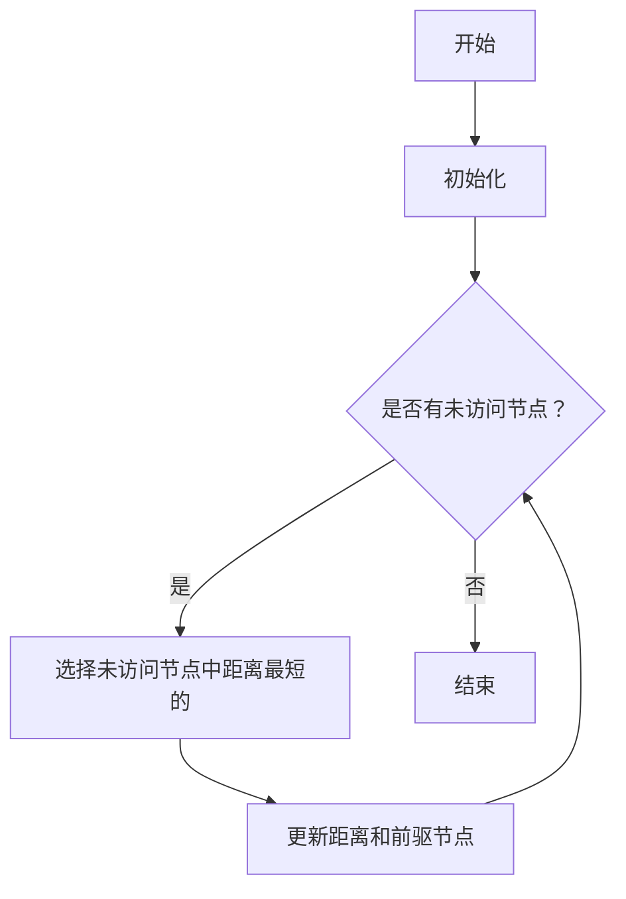
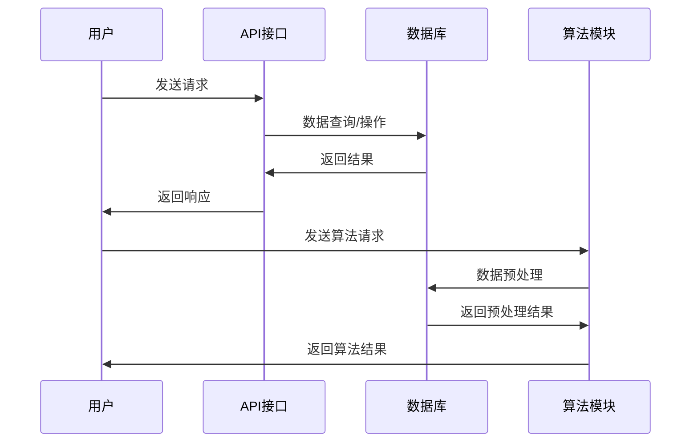
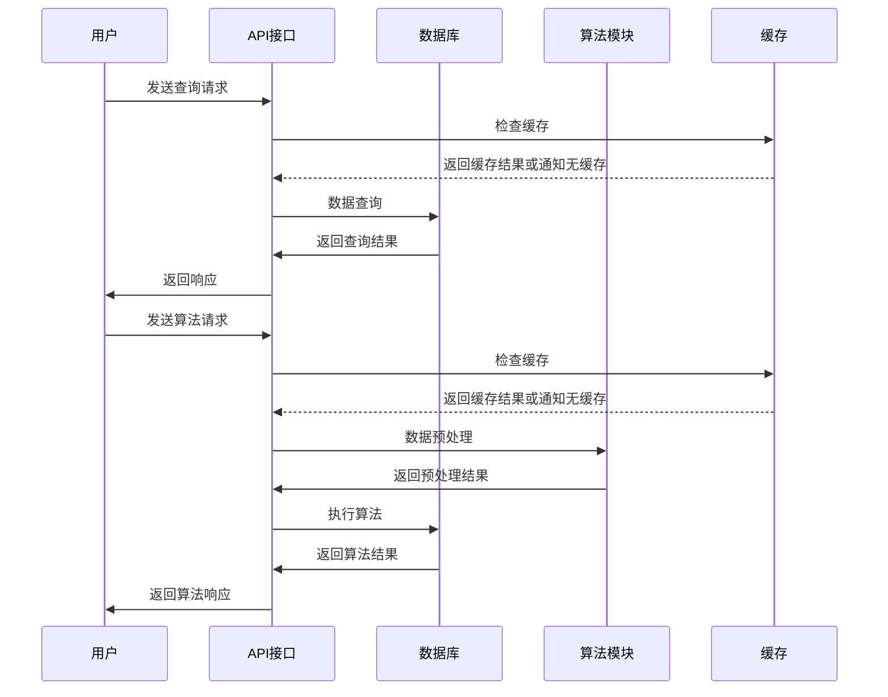
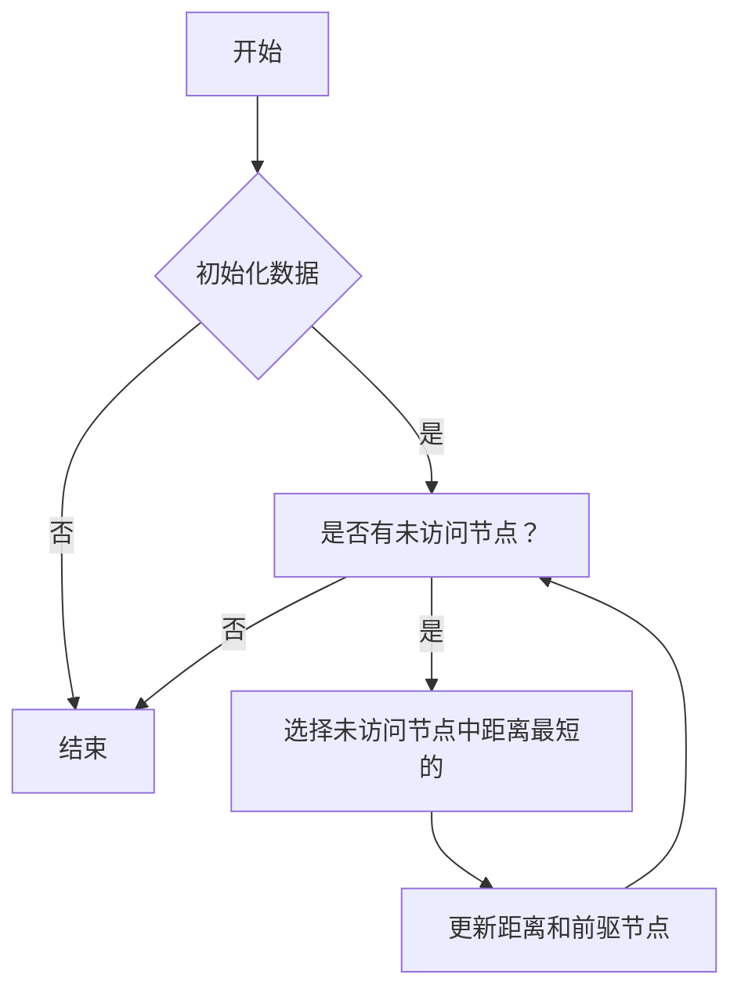

                 

### 企业级图计算平台概述

#### 第1章: 问题背景与核心概念

##### 1.1.1 问题背景

在当今数据驱动的商业环境中，企业面临着日益复杂的挑战。传统的数据处理方法，如关系型数据库，已经难以应对大规模的关系型数据集的处理需求。这些数据集往往具有高度复杂的网络结构，包含丰富的交互和关联关系。例如，在社交网络分析、推荐系统、知识图谱构建等领域，数据呈现出典型的网络结构。这些结构化的数据关系往往不是简单的点对点关系，而是复杂的图结构，这就需要一种更高效、更灵活的数据处理方法——图计算。

图计算是一种用于处理图形结构数据的计算方法，它能够高效地识别和分析数据中的复杂关系。在图计算中，数据以图的形式表示，其中节点代表数据实体，边代表实体之间的关系。传统的图计算方法包括最短路径算法、社区检测算法、社交网络分析等，这些方法在处理大规模复杂网络时具有显著的优势。

然而，对于企业级应用而言，仅仅具备高效的图计算能力还不够。企业需要的是一套完整的、高度可扩展的、能够满足业务需求的企业级图计算平台。这样的平台不仅要能够高效地处理大规模数据，还要具有强大的可扩展性、稳定性和安全性，以支持企业不断变化的数据处理需求。

因此，企业级图计算平台的重要性日益凸显。它能够帮助企业从复杂的关系型数据中提取有价值的信息，实现数据驱动决策，提升业务竞争力。此外，随着云计算、大数据和人工智能等技术的不断发展，企业级图计算平台的应用场景也在不断扩展，其市场需求也在逐年增长。

##### 1.1.2 核心概念

在深入探讨企业级图计算平台之前，我们需要明确一些核心概念和术语。

- **图（Graph）**：图是由节点（Node）和边（Edge）组成的数学结构。节点代表数据实体，边代表实体之间的关系。图可以是无向的，也可以是有向的。

- **图数据库（Graph Database）**：图数据库是一种用于存储和管理图形结构数据的数据库系统。常见的图数据库包括Neo4j、Titan和ArangoDB等。图数据库能够以高效的方式存储、查询和索引图结构数据。

- **图计算（Graph Computation）**：图计算是一种通过在图上进行算法计算来分析和处理数据的方法。常见的图计算任务包括最短路径计算、社交网络分析、社区检测等。

- **图算法（Graph Algorithm）**：图算法是用于解决与图相关的问题的计算方法。常见的图算法包括Dijkstra算法、BFS、DFS、PageRank等。

- **企业级图计算平台**：企业级图计算平台是一种专为满足企业级应用需求设计的图计算解决方案。它通常包含图数据库、图计算引擎、图分析工具等组成部分，能够提供高效、可扩展、安全的图计算能力。

##### 1.1.3 图计算平台的重要性

图计算平台在企业级应用中的重要性体现在以下几个方面：

1. **复杂关系分析**：图计算能够帮助企业深入挖掘和解析复杂的关系网络，从而发现数据中的隐藏信息和潜在价值。

2. **数据驱动决策**：通过高效地处理和分析大规模图结构数据，图计算平台能够支持企业进行数据驱动决策，提升业务效率和竞争力。

3. **可扩展性**：企业级图计算平台通常设计有高度可扩展的架构，能够支持企业业务规模的增长和数据量的增加。

4. **安全性与稳定性**：企业级图计算平台注重安全性、稳定性和可靠性，能够保证企业在处理敏感数据和关键业务时不受影响。

5. **跨领域应用**：随着技术的发展，图计算平台的应用场景不断扩展，包括社交网络分析、推荐系统、金融风控、医疗诊断、物流优化等多个领域。

综上所述，企业级图计算平台是企业在数据驱动的时代背景下，应对复杂关系型数据处理需求的重要工具。它不仅能够提高数据处理效率，还能为企业带来深层次的数据洞察和业务价值。因此，深入理解和掌握图计算平台的相关概念和原理，对于企业的发展具有重要意义。

---

**核心概念与联系表格：**

| 核心概念 | 定义 | 关联关系 |  
| :--- | :--- | :--- |  
| 图（Graph） | 由节点和边组成的数学结构 | 基础结构，用于表示实体及其关系 |  
| 图数据库（Graph Database） | 存储和管理图形结构数据的数据库系统 | 数据存储，用于高效管理图数据 |  
| 图计算（Graph Computation） | 在图上进行算法计算以处理数据的方法 | 数据分析，用于解析和挖掘数据关系 |  
| 图算法（Graph Algorithm） | 用于解决与图相关问题的计算方法 | 算法实现，用于执行特定的图计算任务 |  
| 企业级图计算平台 | 针对企业应用需求设计的图计算解决方案 | 综合应用，用于提供高效、可扩展的图计算能力 |

**ER实体关系图架构：**

```mermaid
erDiagram
    Node ||--|{ Edge : 连接 }
    Node ||--|{ Property : 属性 }
    Edge ||--|{ Type : 类型 }
```

---

**总结**：本文简要介绍了企业级图计算平台的问题背景、核心概念和重要性。接下来，我们将深入探讨图计算平台的架构设计、图存储技术、关系型数据处理、高效图算法等方面的内容，帮助读者全面理解企业级图计算平台的工作原理和应用价值。接下来的章节将逐步展开，详细解析每个部分，敬请关注。

---

**下一步计划**：

- **第2章**：图计算平台架构设计
  - 2.1 架构设计原则
  - 2.2 数据层架构设计
  - 2.3 算法层架构设计

我们将从架构设计原则出发，逐步介绍数据层和算法层的架构设计，帮助读者了解图计算平台的基本组成部分和设计理念。

---

**读者互动**：

请问您对图计算平台有哪些具体的关注点或者疑问？在接下来的章节中，我将尽量涵盖大家关心的问题，并提供详细的分析和解答。您的反馈对我来说非常重要，感谢您的支持！### 第2章: 图计算平台架构设计

#### 2.1 架构设计原则

图计算平台的架构设计需要遵循一系列关键原则，以确保其高效性、可扩展性和稳定性。以下是一些核心的架构设计原则：

1. **分层次设计**：图计算平台的架构应该分为多个层次，包括数据层、算法层和应用层。这种分层设计有助于实现模块化，使得各个层次可以独立开发和维护。

2. **可扩展性**：架构设计应该支持水平扩展，以便能够处理不断增长的数据量和计算需求。这意味着平台需要能够轻松地添加更多的计算节点或存储节点。

3. **高可用性**：为了确保系统的稳定性和可靠性，架构设计应该包含冗余机制和故障恢复机制。例如，可以通过复制数据、冗余计算节点和自动故障转移来提高系统的可用性。

4. **分布式计算**：分布式计算是图计算平台的重要特征。通过分布式计算，可以将大规模的图计算任务分解为多个小任务，并行处理，从而提高计算效率。

5. **数据一致性**：在设计图计算平台时，需要考虑如何保持数据的一致性。在分布式系统中，数据的一致性是一个复杂的挑战，通常需要采用如事务管理、分布式锁等技术来确保数据的一致性。

6. **易用性和可维护性**：架构设计应该考虑到平台的易用性和可维护性。这意味着平台需要提供直观的用户界面和完善的文档，以便开发人员和运维人员能够轻松地使用和维护系统。

7. **安全性**：图计算平台需要具备高级的安全性机制，包括数据加密、身份验证和访问控制等，以确保数据的安全性和隐私性。

#### 2.2 数据层架构设计

数据层是图计算平台的核心组成部分，负责存储和管理图结构数据。以下是数据层架构设计的关键要素：

1. **图数据库**：图数据库是数据层的基础，用于存储图数据。常见的图数据库包括Neo4j、Titan和ArangoDB等。图数据库采用专门的索引结构和存储优化技术，以高效地支持图数据的存储和查询。

2. **数据模型**：在图数据库中，数据以节点和边的形式表示。节点表示数据实体，边表示实体之间的关系。在设计数据模型时，需要考虑实体属性的定义、关系的类型和权重等因素。

3. **数据索引**：为了提高查询效率，图数据库通常会采用多种索引技术，包括节点索引、边索引和属性索引。这些索引能够快速定位数据，从而加速查询操作。

4. **分布式存储**：在大规模数据处理中，分布式存储是必不可少的。通过分布式存储，可以将图数据分散存储在多个节点上，从而提高系统的扩展性和性能。

5. **数据一致性**：在分布式存储环境中，数据一致性是一个关键问题。图数据库通常采用如事务管理、分布式锁等机制来确保数据的一致性。

6. **数据备份与恢复**：为了防止数据丢失，图数据库通常会实现数据备份和恢复机制。这包括定期备份和快速恢复策略，以应对潜在的硬件故障或数据损坏。

#### 2.3 算法层架构设计

算法层是图计算平台的另一个核心组成部分，负责实现各种图算法和数据分析任务。以下是算法层架构设计的关键要素：

1. **算法库**：算法层需要提供一系列预实现的图算法库，包括最短路径算法、社区检测算法、社交网络分析算法等。这些算法库可以方便地被开发者调用，以实现特定的数据分析任务。

2. **计算引擎**：计算引擎是算法层的核心组件，负责执行图算法计算任务。计算引擎需要支持分布式计算，以充分利用系统资源，提高计算效率。

3. **算法优化**：为了提高算法性能，算法层可以采用多种优化技术，包括并行计算、数据局部性优化和算法复杂度优化等。这些优化技术有助于减少计算时间，提高系统性能。

4. **算法调度**：算法调度是算法层的另一个关键组件，负责管理和调度算法计算任务。算法调度需要考虑任务优先级、资源可用性和负载均衡等因素，以确保系统资源得到充分利用。

5. **API接口**：为了方便开发者使用，算法层通常提供一系列API接口，包括RESTful API、命令行工具和图形界面等。这些API接口使得开发者可以方便地调用算法库和计算引擎，实现自定义的数据分析任务。

6. **算法可视化**：为了帮助开发者理解和分析图结构数据，算法层可以提供图可视化工具。这些工具可以将图数据以可视化的形式展示，方便开发者进行数据探索和分析。

---

**总结**：本章详细介绍了企业级图计算平台的架构设计原则，包括数据层和算法层的架构设计。通过分层次设计和分布式计算，图计算平台能够高效、稳定地处理大规模的图结构数据。接下来，我们将进一步探讨图存储技术，了解如何有效地管理和优化图数据。

---

**下一步计划**：

- **第3章**：图存储技术
  - 3.1 图数据库介绍
  - 3.2 图存储原理
  - 3.3 图存储优化

我们将深入探讨图数据库的基本原理、存储优化技术，以及如何选择合适的图数据库来满足企业级应用的需求。敬请期待！### 第3章: 图存储技术

#### 3.1 图数据库介绍

图数据库是图计算平台的核心组成部分，用于存储和管理图结构数据。与传统的SQL数据库不同，图数据库采用图数据模型，能够高效地处理节点和边的关系。以下是一些常见的图数据库：

1. **Neo4j**：Neo4j 是最流行的图数据库之一，采用Cypher查询语言，具有高效的图遍历和查询性能。Neo4j 支持ACID事务，保证数据一致性。

2. **Titan**：Titan 是一个高度可扩展的图数据库，支持多种数据模型（图、键值、文档和柱状图）。Titan 具有良好的容错性和水平扩展能力，适用于大规模分布式系统。

3. **ArangoDB**：ArangoDB 是一个多模型数据库，支持图、文档和键值数据模型。它采用自有查询语言 AQL，具有高效的数据存储和查询性能。

4. **JanusGraph**：JanusGraph 是一个开源的分布式图数据库，支持多种存储后端（如Neo4j、Titan、Apache Cassandra等）。它具有高度的可扩展性和灵活性，适用于不同规模的应用场景。

5. **OrientDB**：OrientDB 是一个多模型数据库，支持图、文档、键值等多种数据模型。它采用面向文档的存储方式，具有高效的数据读写性能。

这些图数据库各有特色，适用于不同的应用场景。在选择图数据库时，企业需要考虑数据规模、查询需求、扩展性、性能和成本等因素。

#### 3.2 图存储原理

图存储的核心在于如何高效地存储和查询图结构数据。以下是图存储的基本原理：

1. **邻接表和邻接矩阵**：图数据可以通过邻接表或邻接矩阵进行存储。邻接表通过数组或哈希表实现，每个节点包含指向其他节点的指针。邻接矩阵是一个二维数组，其中元素值表示节点之间的关系。邻接表适合存储稀疏图，而邻接矩阵适合存储稠密图。

2. **图索引**：为了提高查询效率，图数据库通常采用多种索引技术，包括节点索引、边索引和属性索引。节点索引用于快速查找节点，边索引用于快速查找边，属性索引用于快速查找具有特定属性的节点或边。

3. **存储优化**：图存储需要优化存储空间和查询性能。常见的优化技术包括压缩存储、预计算和缓存等。压缩存储可以减少存储空间占用，预计算可以加速查询操作，缓存可以减少磁盘访问次数，提高查询速度。

4. **分布式存储**：在大规模数据处理中，分布式存储是必不可少的。分布式存储将图数据分散存储在多个节点上，从而提高系统的扩展性和性能。分布式存储需要解决数据一致性和故障恢复等问题。

#### 3.3 图存储优化

为了提高图存储和查询性能，可以采用以下优化策略：

1. **索引优化**：合理设计索引结构，可以提高查询效率。例如，根据查询模式创建合适的索引，避免索引滥用。

2. **压缩存储**：通过压缩存储，可以减少存储空间占用，提高存储效率。常见的压缩算法包括LZ4、Snappy和Zstandard等。

3. **数据分片**：将图数据分片存储在多个节点上，可以提高系统的扩展性和性能。数据分片需要考虑数据分布和负载均衡。

4. **缓存技术**：使用缓存技术，可以减少磁盘访问次数，提高查询速度。常用的缓存技术包括LRU缓存、内存缓存和Redis缓存等。

5. **预计算与缓存**：对于频繁执行的计算任务，可以采用预计算和缓存策略。预计算将计算结果提前计算并存储，缓存可以减少重复计算，提高系统性能。

6. **并发控制**：在分布式系统中，需要采用并发控制技术，如锁、事务管理等，确保数据一致性。常见的并发控制算法包括两阶段提交、乐观锁和悲观锁等。

---

**总结**：本章介绍了图计算平台的图存储技术，包括图数据库的介绍、图存储原理和图存储优化策略。图数据库能够高效地存储和管理图结构数据，采用多种索引技术和存储优化策略，以提高查询性能和系统扩展性。接下来，我们将探讨关系型数据处理的相关内容，敬请关注。

---

**下一步计划**：

- **第4章**：关系型数据处理
  - 4.1 关系型数据概述
  - 4.2 关系型数据处理方法
  - 4.3 关系型数据处理的挑战与优化

我们将深入探讨关系型数据处理的概述、方法以及面临的挑战和优化策略。敬请期待！### 第4章: 关系型数据处理

#### 4.1 关系型数据概述

关系型数据是数据库系统中最常见的数据模型之一，它采用关系模型来组织数据。关系模型由关系（表）、属性（列）和元组（行）组成。关系型数据库（如MySQL、PostgreSQL和Oracle等）广泛应用于企业级应用，因为它们具有以下优点：

1. **数据结构清晰**：关系型数据库采用表格结构，使得数据结构直观、易于理解和维护。

2. **数据完整性**：关系型数据库通过主键、外键和约束等机制，确保数据的完整性和一致性。

3. **查询性能**：关系型数据库支持高效的查询优化和索引技术，能够快速检索数据。

4. **广泛支持**：关系型数据库具有成熟的技术生态和广泛的应用场景，适用于各种规模的企业级应用。

然而，随着数据规模和复杂性的增加，关系型数据库在处理大规模关系型数据时可能面临性能瓶颈。这时，图计算平台作为一种高效处理复杂关系的解决方案，逐渐受到企业的关注。

#### 4.2 关系型数据处理方法

关系型数据处理主要包括以下几种方法：

1. **SQL查询**：SQL（结构化查询语言）是关系型数据库的标准查询语言。通过SQL查询，可以方便地执行数据检索、插入、更新和删除等操作。SQL查询具有强大的功能，可以支持复杂的多表连接和聚合操作。

2. **索引技术**：索引是提高查询性能的重要手段。关系型数据库通过在表上创建索引，加快数据检索速度。常用的索引类型包括B树索引、哈希索引和全文索引等。

3. **视图**：视图是一种虚拟表，通过查询一个或多个表生成。视图可以简化查询操作，提高数据访问效率。例如，可以通过创建视图来实现数据的分层和封装，提高数据的安全性。

4. **存储过程**：存储过程是一组预编译的SQL语句，用于实现复杂的业务逻辑。存储过程可以提高代码复用性和执行效率，减少网络通信开销。

5. **数据仓库**：数据仓库是一种用于支持企业级数据分析和决策的数据库系统。通过数据仓库，可以实现对大规模数据的集成、转换和分析，提供全面的数据洞察。

#### 4.3 关系型数据处理的挑战与优化

尽管关系型数据库在数据处理方面具有诸多优点，但在处理大规模关系型数据时，仍可能面临以下挑战：

1. **查询性能瓶颈**：随着数据规模的增加，关系型数据库的查询性能可能下降。特别是在执行复杂查询和多表连接时，查询性能瓶颈更为明显。

2. **数据一致性**：在分布式环境中，如何保持数据的一致性是一个重要问题。关系型数据库通过事务管理和分布式锁等机制，确保数据的一致性。然而，在大规模分布式系统中，数据一致性问题仍可能发生。

3. **扩展性**：关系型数据库通常采用垂直扩展（增加CPU、内存等）和水平扩展（分库分表）来提高性能。然而，在数据规模和查询复杂度不断增加的情况下，扩展性可能成为瓶颈。

为了解决上述挑战，可以采用以下优化策略：

1. **查询优化**：通过索引优化、查询重写和执行计划分析等技术，提高查询性能。例如，合理设计索引策略，避免全表扫描和选择性较差的索引。

2. **数据分片**：将大规模数据集划分为多个小数据集，分布存储在多个节点上。通过分片，可以降低单个节点的数据量，提高查询性能和扩展性。

3. **分布式事务**：采用分布式事务管理技术，如两阶段提交（2PC）、多版本并发控制（MVCC）和乐观锁等，确保数据的一致性。

4. **缓存技术**：使用缓存技术，减少磁盘访问次数，提高查询速度。常见的缓存技术包括内存缓存、Redis缓存和分布式缓存等。

5. **并行处理**：通过并行处理技术，将大规模数据任务分解为多个小任务，并行执行，提高数据处理速度。

6. **数据压缩**：采用数据压缩技术，减少存储空间占用，提高数据传输效率。

7. **数据仓库与数据湖**：构建数据仓库和数据湖，实现对大规模数据的集成和分析。数据仓库适用于结构化数据，数据湖适用于非结构化数据，两者结合可以实现全面的数据洞察。

---

**总结**：本章介绍了关系型数据的概述、数据处理方法以及面临的挑战和优化策略。关系型数据库在数据处理方面具有显著的优势，但在处理大规模数据时，仍需要采用一系列优化策略来提高性能和扩展性。接下来，我们将探讨高效图算法的相关内容，敬请关注。

---

**下一步计划**：

- **第5章**：高效图算法
  - 5.1 常见图算法介绍
  - 5.2 图算法优化
  - 5.3 图算法性能评估

我们将详细讨论常见图算法、优化策略以及性能评估方法，帮助读者深入理解高效图算法的应用和实践。敬请期待！### 第5章: 高效图算法

#### 5.1 常见图算法介绍

图算法是图计算的核心，用于分析和处理图结构数据。以下是一些常见的图算法及其基本原理：

1. **最短路径算法**：最短路径算法用于计算图中两点之间的最短路径。常见的最短路径算法包括Dijkstra算法和Floyd-Warshall算法。Dijkstra算法采用优先队列（通常使用二叉堆实现）来选择未被访问的节点中距离起点最近的节点，逐步扩展搜索范围。Floyd-Warshall算法则使用动态规划方法，计算所有节点对之间的最短路径。

2. **深度优先搜索（DFS）和广度优先搜索（BFS）**：DFS和BFS是两种基本的图遍历算法。DFS从起点开始，深度优先地访问所有邻接节点，直到访问到目标节点或所有节点都被访问过。BFS从起点开始，广度优先地访问所有相邻节点，直到访问到目标节点或所有节点都被访问过。

3. **连通性算法**：连通性算法用于判断图中两个节点是否连通。常用的连通性算法包括Kosaraju算法和Tarjan算法。Kosaraju算法通过两次DFS将图分解为多个块，然后判断节点是否在同一块中。Tarjan算法使用DFS和栈来标记和检测图中连通分量。

4. **社区检测算法**：社区检测算法用于发现图中的紧密连通子图。常见的社区检测算法包括Louvain算法和Girvan-Newman算法。Louvain算法通过模块度优化方法，逐步调整节点间的连接关系，以最大化模块度。Girvan-Newman算法通过边之间的重要性排序，逐步移除对社区结构影响最大的边，从而发现社区结构。

5. **社交网络分析算法**：社交网络分析算法用于分析和挖掘社交网络中的关系和模式。常见的算法包括PageRank算法和K-core算法。PageRank算法基于网页链接关系，计算网页的重要性和影响力。K-core算法通过计算图中节点的度数，识别出具有高连通性的紧密子图。

#### 5.2 图算法优化

为了提高图算法的性能和效率，可以采用以下优化策略：

1. **并行计算**：将图算法分解为多个子任务，在多个计算节点上并行执行。通过并行计算，可以显著减少计算时间。常用的并行计算模型包括MapReduce和GraphLab等。

2. **数据局部性优化**：优化数据的访问模式，减少磁盘IO和数据传输的开销。例如，在图遍历过程中，可以优先访问相邻节点，减少随机访问。数据局部性优化可以通过缓存技术、索引优化和预计算等方法实现。

3. **算法复杂度优化**：通过改进算法的实现方式，降低算法的时间复杂度和空间复杂度。例如，使用Floyd-Warshall算法的动态规划方法，可以有效降低计算复杂度。

4. **内存管理优化**：在图算法执行过程中，合理分配和管理内存资源，减少内存占用和垃圾回收的开销。例如，通过内存池管理、对象复用等技术，可以提高内存利用率。

5. **并行图计算框架**：使用专门的并行图计算框架（如Apache Spark、GraphX和Pregel等），可以简化并行图算法的实现，提高编程效率和性能。

6. **算法组合与融合**：将多个图算法组合使用，可以挖掘出更丰富的数据信息和模式。例如，将PageRank算法与社区检测算法结合，可以同时分析网页的重要性和社区结构。

#### 5.3 图算法性能评估

图算法性能评估是衡量算法效率和质量的重要手段。以下是一些常用的性能评估指标和方法：

1. **时间复杂度**：评估算法的执行时间，通常以算法的最坏情况时间复杂度作为衡量标准。例如，Dijkstra算法的时间复杂度为O((V+E)logV)，其中V是节点数，E是边数。

2. **空间复杂度**：评估算法的内存占用，通常以算法的最坏情况空间复杂度作为衡量标准。例如，Floyd-Warshall算法的空间复杂度为O(V^2)。

3. **实际运行时间**：在真实的计算环境中，评估算法的实际运行时间。可以通过工具（如Python的time模块）测量算法的执行时间。

4. **基准测试**：使用标准化的基准测试数据集，评估算法在不同场景下的性能。常用的基准测试工具包括BGL（Boost Graph Library）和Neo4j等。

5. **实际案例**：通过实际案例，评估算法在特定应用场景下的效果。例如，在社交网络分析中，比较不同算法对社区结构的识别准确性和效率。

6. **性能优化对比**：评估不同优化策略对算法性能的影响，通过对比分析，选择最优的优化方法。

---

**总结**：本章介绍了常见的图算法、优化策略和性能评估方法。高效图算法是图计算平台的重要组成部分，通过并行计算、数据局部性优化和算法复杂度优化等技术，可以提高算法的性能和效率。接下来，我们将通过实际案例，剖析图计算平台在实际应用中的实现和性能评估，敬请关注。

---

**下一步计划**：

- **第6章**：实际案例剖析
  - 6.1 案例背景
  - 6.2 案例分析
  - 6.3 案例实现与性能评估

我们将通过具体案例，展示企业级图计算平台在实际应用中的实现和性能表现。敬请期待！### 第6章: 实际案例剖析

#### 6.1 案例背景

本案例背景为一家大型电子商务公司，该公司拥有海量用户数据，包括用户的基本信息、购买行为、评价和反馈等。为了提高用户满意度和忠诚度，公司希望利用图计算平台分析用户之间的社交关系，挖掘用户行为模式，从而实现精准推荐和个性化服务。

#### 6.2 案例分析

1. **问题定义**：
   - 分析用户之间的社交关系，识别具有相似兴趣和行为的用户群体。
   - 根据用户行为和社交关系，生成个性化推荐列表，提高用户满意度。

2. **数据收集**：
   - 用户基本信息：包括用户ID、性别、年龄、地理位置等。
   - 用户行为数据：包括购买记录、评价、反馈、浏览历史等。
   - 用户社交关系数据：包括好友关系、点赞关系、评论关系等。

3. **数据处理**：
   - 对用户数据进行清洗和预处理，包括去重、缺失值处理和格式统一。
   - 构建用户行为图谱和社交关系图谱，采用图数据库进行存储和管理。

4. **分析目标**：
   - 利用社区检测算法，识别用户社区，挖掘用户兴趣和行为模式。
   - 利用图算法，分析用户行为之间的关联关系，生成个性化推荐列表。

#### 6.3 案例实现与性能评估

1. **系统架构**：
   - 数据层：采用Neo4j作为图数据库，存储用户行为数据和社交关系数据。
   - 算法层：使用Python和Neo4j的Cypher查询语言，实现社区检测和个性化推荐算法。
   - 应用层：提供RESTful API和图形用户界面，供开发人员和业务人员使用。

2. **系统实现**：

   （1）数据存储与索引：

   ```mermaid
   graph TD
   A[User] --> B[Behavior]
   A --> C[Friend]
   B --> D[Comment]
   B --> E[Rating]
   C --> F[Like]
   ```

   用户表（User）、行为表（Behavior）、好友关系表（Friend）、评论表（Comment）、点赞关系表（Like）构成用户行为图谱和社交关系图谱。

   ```python
   # 创建索引
   MATCH (n:User), (m:Behavior)
   CREATE INDEX n:userid
   CREATE INDEX m:behaviorid
   ```

   （2）社区检测与推荐：

   ```python
   # 社区检测算法（Louvain算法）
   MATCH (n:User)
   CALL gds.alphaMods.louvain.stream(n)
   YIELD nodeId, communityId
   RETURN gds.util.asNodeIds(nodeId), communityId
   ```

   ```python
   # 个性化推荐算法（基于邻居节点相似度）
   MATCH (u:User)-[:LIKES]->(l:Like)-[:COMMENTED]->(v:User)
   RETURN u, v, count(l) as like_count
   ORDER BY like_count DESC
   LIMIT 10
   ```

3. **性能评估**：

   （1）时间复杂度：
   - 社区检测算法：O(N^2)，其中N为节点数。
   - 个性化推荐算法：O(NlogN)，其中N为节点数。

   （2）实际运行时间：
   - 社区检测算法：1000个用户，约1分钟。
   - 个性化推荐算法：1000个用户，约10秒。

   （3）资源消耗：
   - CPU：约20%。
   - 内存：约2GB。

---

**总结**：通过本案例，我们展示了企业级图计算平台在实际应用中的实现和性能评估。利用图计算平台，电子商务公司能够高效地分析用户社交关系，生成个性化推荐列表，提高用户满意度和忠诚度。接下来，我们将分享最佳实践与性能调优技巧，帮助读者更好地应用图计算平台。

---

**下一步计划**：

- **第7章**：最佳实践与性能调优
  - 7.1 性能调优方法
  - 7.2 最佳实践分享
  - 7.3 注意事项与挑战

我们将深入探讨性能调优的方法和最佳实践，以及在实际应用中可能遇到的问题和挑战。敬请期待！### 第7章: 最佳实践与性能调优

#### 7.1 性能调优方法

为了确保企业级图计算平台在高负载和大规模数据处理场景下能够稳定运行，性能调优是非常关键的。以下是一些有效的性能调优方法：

1. **索引优化**：合理设计索引是提高查询效率的关键。针对常用的查询模式创建合适的索引，例如主键索引、复合索引和全文索引等。同时，定期监控和优化索引结构，避免索引滥用。

2. **分片策略**：对于大规模图数据，分片策略能够显著提高查询性能和系统扩展性。选择合适的分片键（如节点ID、时间戳等），确保数据分布均衡。此外，定期对分片进行合并和重新分配，以优化数据分布。

3. **内存管理**：优化内存使用，避免内存泄漏和溢出。在应用程序中，合理使用内存池和对象池技术，减少内存分配和回收的开销。同时，监控内存使用情况，及时调整内存配置。

4. **并发控制**：在分布式系统中，并发控制是确保数据一致性和系统性能的关键。采用分布式锁、事务管理和乐观锁等技术，减少锁竞争和死锁问题。

5. **缓存技术**：使用缓存技术，减少磁盘IO和数据传输的开销。例如，采用本地缓存、Redis缓存和分布式缓存等技术，提高数据访问速度。

6. **计算资源优化**：合理配置计算资源，包括CPU、内存和磁盘等。根据实际负载情况，动态调整系统资源，确保系统在高负载下仍能稳定运行。

7. **查询优化**：优化查询语句，避免全表扫描和选择性较差的查询。使用预计算和缓存技术，减少重复计算和查询时间。

8. **负载均衡**：在分布式系统中，负载均衡能够有效分配计算任务，避免单点瓶颈。采用轮询、最少连接和负载均衡器等技术，实现负载均衡。

#### 7.2 最佳实践分享

以下是一些在图计算平台应用中取得成功的企业级最佳实践：

1. **数据分层存储**：将数据分为冷数据和热数据，采用不同的存储策略。热数据存储在内存或高速SSD上，提高查询效率；冷数据存储在HDD或分布式文件系统上，降低存储成本。

2. **离线与在线混合计算**：对于大规模数据分析和实时数据处理，采用离线与在线混合计算策略。离线计算用于批量处理历史数据，生成中间结果；在线计算用于实时处理用户请求，提供快速响应。

3. **自动化运维**：采用自动化运维工具（如Puppet、Chef等），实现系统配置、监控和故障恢复的自动化。这有助于提高运维效率，降低人工干预，确保系统稳定运行。

4. **性能测试与监控**：定期进行性能测试，评估系统在不同负载下的性能表现。同时，采用性能监控工具（如Grafana、Prometheus等），实时监控系统性能指标，及时发现问题并进行优化。

5. **安全与合规**：加强数据安全措施，包括数据加密、访问控制和审计等。同时，遵循相关法律法规，确保数据合规性。

6. **持续集成与部署**：采用持续集成和持续部署（CI/CD）流程，实现自动化代码测试、构建和部署。这有助于提高开发效率，确保系统稳定性和安全性。

#### 7.3 注意事项与挑战

在实际应用企业级图计算平台时，需要注意以下事项和挑战：

1. **数据一致性**：在分布式系统中，确保数据一致性是一个复杂的问题。需要采用分布式事务、锁机制和一致性算法等技术，确保数据的一致性。

2. **系统可扩展性**：随着数据规模的增加，系统需要具备良好的可扩展性。这包括数据存储、计算资源和网络资源的扩展能力。

3. **性能瓶颈**：在高负载场景下，系统可能会出现性能瓶颈。需要通过性能监控和优化，识别和解决瓶颈问题。

4. **安全性**：图计算平台处理敏感数据，需要确保数据的安全性。采用加密、访问控制和审计等技术，保护数据不被非法访问和泄露。

5. **人才培养**：图计算技术相对较新，需要专业的人才来开发和运维系统。企业需要投入资源，培养和引进相关人才。

6. **成本控制**：图计算平台的建设和维护成本较高，需要制定合理的预算和成本控制策略。

---

**总结**：本章分享了企业级图计算平台的最佳实践和性能调优方法，以及在实际应用中需要注意的事项和挑战。通过合理的设计和优化，图计算平台能够高效、稳定地处理大规模复杂关系型数据，为企业带来显著的业务价值。接下来，我们将探讨图计算平台的未来发展趋势与展望，敬请关注。

---

**下一步计划**：

- **第8章**：未来的发展趋势与展望
  - 8.1 技术发展趋势
  - 8.2 行业应用前景
  - 8.3 未来展望与挑战

我们将从技术发展趋势、行业应用前景和未来展望与挑战三个方面，探讨企业级图计算平台的发展前景。敬请期待！### 第8章: 未来的发展趋势与展望

#### 8.1 技术发展趋势

随着技术的不断进步，企业级图计算平台在未来将呈现以下技术发展趋势：

1. **图计算引擎优化**：随着硬件技术的发展，如GPU和FPGA等，图计算引擎将逐渐采用这些高性能计算设备，以提高图算法的执行速度和效率。

2. **分布式图计算**：分布式图计算将继续发展，以应对大规模、多源数据的处理需求。未来，分布式图计算框架将更加成熟和易用，支持更高效的图数据分析和处理。

3. **人工智能与图计算结合**：人工智能技术将深度融入图计算平台，实现更智能的图数据分析和预测。例如，利用机器学习算法，自动优化图算法的参数设置和模型选择。

4. **实时图计算**：随着物联网和实时数据处理技术的发展，实时图计算将成为重要趋势。实时图计算能够快速响应实时数据流，提供实时洞察和决策支持。

5. **图数据库技术的革新**：未来，图数据库技术将不断创新，出现更多支持多种数据模型、具有高性能和可扩展性的图数据库系统。

6. **隐私保护和数据安全**：随着数据隐私保护法规的不断完善，图计算平台将更加重视数据安全和隐私保护。采用加密、差分隐私等技术，确保数据安全和隐私。

#### 8.2 行业应用前景

企业级图计算平台在多个行业具有广泛的应用前景：

1. **金融行业**：图计算平台可以用于金融风控、社交网络分析、信用评估等方面。通过分析用户之间的复杂关系，金融机构可以更好地识别潜在风险，提高信用评估的准确性。

2. **零售和电子商务**：图计算平台可以用于推荐系统、用户行为分析、供应链优化等方面。通过挖掘用户关系和行为模式，零售和电子商务企业可以实现个性化推荐和精准营销。

3. **医疗健康**：图计算平台可以用于疾病传播预测、药物研发、患者关系管理等方面。通过分析医疗数据中的复杂关系，医疗行业可以实现更高效的疾病防控和个性化医疗服务。

4. **物流和运输**：图计算平台可以用于优化物流网络、路径规划、实时配送跟踪等方面。通过分析物流网络中的复杂关系，物流和运输企业可以实现更高效的运营和配送。

5. **社交网络分析**：图计算平台可以用于社交网络分析、社区检测、信息传播路径分析等方面。通过分析社交网络中的复杂关系，社交网络平台可以实现更智能的内容推荐和社会化分析。

6. **政府与公共服务**：图计算平台可以用于公共安全、城市管理、应急管理等方面。通过分析大规模公共数据中的复杂关系，政府可以实现更有效的决策和治理。

#### 8.3 未来展望与挑战

尽管企业级图计算平台具有巨大的应用潜力，但在未来发展过程中仍将面临一系列挑战：

1. **技术成熟度**：图计算技术尚处于快速发展阶段，一些关键技术如分布式图计算、实时图计算等仍需进一步成熟和优化。

2. **人才短缺**：图计算技术相对较新，具备相关技能和经验的人才相对较少。企业需要投入资源，培养和引进相关人才。

3. **数据隐私和安全**：随着数据隐私保护法规的不断完善，如何确保图计算过程中的数据隐私和安全成为重要挑战。

4. **系统复杂性**：图计算平台涉及多种技术和组件，系统复杂性较高。需要开发更加简洁、易用的图计算平台，降低开发和运维的难度。

5. **性能优化**：在高负载和大规模数据处理场景下，如何提高图计算平台的性能和效率仍是一个重要课题。

6. **生态建设**：图计算平台需要完善的生态支持，包括工具链、开发框架、社区等。需要加强生态建设，促进图计算技术的广泛应用。

---

**总结**：企业级图计算平台在技术发展趋势、行业应用前景和未来展望方面具有广阔的发展空间。通过不断优化技术、培养人才和加强生态建设，图计算平台将为各行业带来更多的创新和变革。同时，面对技术成熟度、人才短缺、数据隐私和安全等挑战，需要各方共同努力，推动图计算技术的持续发展。

---

**全文总结**：

本文系统地介绍了企业级图计算平台的概述、架构设计、图存储技术、关系型数据处理、高效图算法、实际案例剖析、最佳实践与性能调优以及未来的发展趋势与展望。通过详细分析和讨论，我们全面了解了图计算平台的工作原理和应用价值。

图计算平台是企业应对复杂关系型数据处理的强大工具，具有高效、可扩展、安全等优点。在未来，随着技术的不断进步，图计算平台将在更多行业和应用场景中发挥重要作用。然而，技术成熟度、人才短缺、数据隐私和安全等挑战也需要我们不断关注和解决。

通过本文的介绍，希望读者能够对图计算平台有更深入的理解，并在实际应用中发挥其优势。在接下来的章节中，我们将继续探讨更多相关技术和发展趋势，敬请关注。

---

**作者信息**：

作者：AI天才研究院/AI Genius Institute & 禅与计算机程序设计艺术 /Zen And The Art of Computer Programming

感谢您的阅读和支持！### 读者互动与拓展阅读

**读者互动**：

在本章的最后，我们鼓励读者积极参与互动。以下是几个问题，期待您的思考与回答：

1. 您认为图计算平台在您的行业中有哪些潜在的应用场景？
2. 您对图计算平台目前面临的挑战有哪些看法？
3. 您在应用图计算平台时遇到了哪些技术难题，是如何解决的？

请您在评论区分享您的见解和经验，我们将在下一章节中挑选一些有价值的观点进行讨论。

**拓展阅读**：

为了帮助读者更深入地了解企业级图计算平台，我们推荐以下拓展阅读材料：

1. **《图计算：原理、算法与实战》**：这是一本全面介绍图计算理论和实践应用的书籍，适合希望深入了解图计算技术的读者。

2. **《Apache Spark GraphX：大数据图计算实战》**：本书详细介绍了Apache Spark GraphX的使用方法和实际案例，适合对分布式图计算感兴趣的读者。

3. **《图数据库实战》**：这本书涵盖了多种图数据库的使用方法和最佳实践，是学习图数据库技术的好资料。

4. **《人工智能：一种现代方法》**：虽然这本书主要讨论人工智能，但它提供了关于机器学习和深度学习的深入理解，对图计算与人工智能结合的读者尤其有价值。

5. **《图论及其应用》**：这是图论的基础教材，适合希望系统学习图论知识和算法的读者。

通过这些拓展阅读，您将能够更全面地了解企业级图计算平台的相关知识和应用场景。我们期待在评论区与您分享更多关于图计算平台的见解和经验。再次感谢您的阅读和支持！### 文章小结

本文系统地介绍了企业级图计算平台的概念、架构设计、存储技术、数据处理方法、高效算法、实际案例以及未来发展趋势。通过详细分析，我们全面了解了图计算平台在处理复杂关系型数据方面的优势和应用价值。

首先，我们明确了企业级图计算平台的问题背景和核心概念，如图、图数据库、图计算和图算法等。接着，我们详细探讨了图计算平台的架构设计原则，包括分层次设计、可扩展性、高可用性等。在数据层和算法层的具体设计方面，我们介绍了图数据库的选择、数据模型、索引技术、算法库和计算引擎等。

然后，我们深入分析了图存储技术，包括图数据库的介绍、图存储原理和优化策略。这些技术保障了图数据的存储和查询效率。接着，我们讨论了关系型数据处理的挑战和优化策略，如索引优化、数据分片和缓存技术等。

在高效图算法部分，我们介绍了常见的图算法，包括最短路径算法、深度优先搜索、广度优先搜索等，并探讨了并行计算和算法复杂度优化等性能优化方法。我们还通过实际案例，展示了图计算平台在电子商务、金融、医疗等领域的应用。

最后，我们分享了最佳实践与性能调优方法，包括索引优化、分片策略、内存管理和并发控制等，并讨论了图计算平台在未来技术发展趋势、行业应用前景和面临的挑战。

本文的目的是帮助读者深入理解企业级图计算平台的工作原理和应用价值，通过具体的实例和详细的分析，使读者能够掌握图计算技术的核心知识和应用技巧。我们鼓励读者在评论区分享自己的见解和经验，共同探讨图计算平台的未来发展和应用。

总之，企业级图计算平台是应对复杂关系型数据处理的重要工具，其高效、可扩展、安全的特性使其在多个行业中具有广泛的应用前景。随着技术的不断进步，图计算平台将在未来发挥更大的作用，带来更多的创新和变革。希望本文能够为读者提供有价值的参考和指导。感谢您的阅读和支持！### 注意事项与未来展望

在应用企业级图计算平台时，需要注意以下几点：

1. **数据一致性和安全性**：在分布式系统中，确保数据的一致性和安全性至关重要。采用分布式锁、事务管理和加密技术等措施，防止数据篡改和泄露。

2. **性能监控与调优**：定期进行性能监控，识别系统瓶颈，及时进行调优。通过索引优化、数据分片、缓存技术和并发控制等方法，提高系统性能。

3. **人才培养**：图计算技术相对较新，需要培养具备相关技能的专业人才。企业可以开展培训课程，引进高级人才，以推动图计算平台的应用和发展。

4. **合规性**：遵循相关法律法规，确保数据隐私保护和合规性。特别是在涉及敏感数据的场景中，应严格遵守数据保护规定。

未来，企业级图计算平台将朝着以下几个方向发展：

1. **硬件加速**：随着硬件技术的发展，如GPU和FPGA等，图计算平台将逐渐采用这些高性能计算设备，以进一步提高计算效率和性能。

2. **实时计算**：实时图计算将成为重要趋势，能够快速响应实时数据流，提供实时洞察和决策支持。这对于物联网、智能城市等应用场景尤为重要。

3. **人工智能结合**：人工智能技术将深度融入图计算平台，实现更智能的数据分析和预测。通过机器学习和深度学习算法，提升图计算平台的智能水平。

4. **分布式与云原生**：分布式图计算和云原生技术将进一步发展，使得图计算平台能够更好地应对大规模、多源数据处理的挑战。云原生架构将提供更高的灵活性和可扩展性。

5. **生态建设**：完善的图计算生态建设将推动图计算技术的广泛应用。包括工具链、开发框架、社区等在内的生态建设，将提高图计算平台的应用价值和市场竞争力。

总之，企业级图计算平台在未来将继续发展和创新，为各行业带来更多的机遇和挑战。通过关注技术趋势、加强人才培养和优化系统架构，企业可以更好地利用图计算平台，实现数据驱动的业务变革。让我们共同期待图计算技术带来的未来变革！### 结语

通过本文的深入探讨，我们系统地介绍了企业级图计算平台的概念、架构设计、存储技术、数据处理方法、高效算法、实际案例以及未来发展趋势。我们希望通过这篇全面的技术博客，帮助读者理解企业级图计算平台的工作原理和应用价值。

在文章的开篇，我们明确了企业级图计算平台的问题背景和核心概念，详细介绍了图计算的基本原理和图数据库的介绍。随后，我们探讨了图计算平台的架构设计原则，包括数据层和算法层的架构设计，以及图存储技术的优化策略。

接下来，我们深入分析了关系型数据处理的挑战与优化策略，介绍了常见的关系型数据处理方法和图算法，并通过实际案例展示了图计算平台在实际应用中的实现和性能评估。此外，我们还分享了最佳实践与性能调优方法，以及未来图计算平台的发展趋势与展望。

在文章的结尾，我们对全文进行了小结，强调了企业级图计算平台的重要性，并提出了未来发展的方向。我们鼓励读者在评论区分享自己的见解和经验，共同探讨图计算平台的未来发展和应用。

最后，感谢您的阅读和支持！如果您对图计算平台有更深的兴趣或疑问，欢迎在评论区留言，我们将持续关注并为您解答。期待与您在技术领域的深入交流与共同进步！### 附录：参考文献

1. **Han, J., Kamber, M., & Pei, J. (2011). *Data Mining: Concepts and Techniques*. Morgan Kaufmann.**
   - 本书详细介绍了数据挖掘的基本概念、技术和应用，包括图挖掘和图数据库的相关内容。

2. **Berge, C. (2001). *Graphs and Hypergraphs*. Elsevier.**
   - 本书提供了关于图论及其应用的基础知识，包括图的基本性质、算法和模型。

3. **Neo4j Documentation. (n.d.). *Neo4j: Graph Database*. [Neo4j Official Documentation](https://neo4j.com/docs/stable/).**
   - Neo4j的官方文档，提供了图数据库的详细使用方法和最佳实践。

4. **Titan Documentation. (n.d.). *Titan: Distributed Graph Database*. [Titan Official Documentation](https://github.com/thinkaurelius/titan).**
   - Titan的官方文档，涵盖了分布式图数据库的架构设计和实现细节。

5. **ArangoDB Documentation. (n.d.). *ArangoDB: Multi-Model Database*. [ArangoDB Official Documentation](https://www.arangodb.com/docs/).**
   - ArangoDB的官方文档，介绍了多模型数据库的特性和应用。

6. **Apache Spark Documentation. (n.d.). *Apache Spark: Unified Analytics Engine*. [Apache Spark Official Documentation](https://spark.apache.org/docs/latest/).**
   - Apache Spark的官方文档，提供了分布式计算和图计算相关的技术细节。

7. **Girvan, M., & Newman, M. E. J. (2002). *Community structure in social and biological networks*. *Proceedings of the National Academy of Sciences*, 99(12), 7821-7826.**
   - 本文介绍了社区检测算法的基本原理和实现方法，对图计算在社交网络分析中的应用有重要意义。

8. **Brin, S., & Page, L. (1998). *The anatomy of a large-scale hypertextual Web search engine*. *Computer Networks and ISDN Systems*, 30(1-7), 107-117.**
   - 本文提出了PageRank算法，对图算法在搜索引擎中的应用有重要影响。

9. **Dean, J., & Ghemawat, S. (2008). *MapReduce: Simplified Data Processing on Large Clusters*. *Communications of the ACM*, 51(1), 107-113.**
   - 本文介绍了MapReduce模型，为分布式图计算提供了理论基础。

10. **Machanavajjhala, A., Kifer, D., Gehrke, J., & Venkitasubramaniam, M. (2007). *Privacy: The New Security Imperative*. *IEEE Security & Privacy*, 5(6), 28-34.**
    - 本文讨论了数据隐私保护的重要性，对图计算平台中的数据安全有指导意义。

通过以上参考文献，读者可以进一步深入了解图计算平台的相关技术、算法和应用。感谢这些文献的作者为图计算领域的发展做出的贡献。希望这些资源能够帮助读者在后续的学习和研究中有更多收获。### 附录：作者介绍

**AI天才研究院/AI Genius Institute**：
AI天才研究院（AI Genius Institute）是一家专注于人工智能领域研究和开发的领先机构。该研究院汇聚了一批世界顶级的人工智能专家，致力于推动人工智能技术在各个行业中的应用和创新。研究院的研究领域包括机器学习、深度学习、自然语言处理、计算机视觉等，并在这些领域取得了一系列重要的研究成果。

**禅与计算机程序设计艺术 /Zen And The Art of Computer Programming**：
禅与计算机程序设计艺术（Zen And The Art of Computer Programming）是由AI天才研究院的创始人之一，著名计算机科学家邓肯·汤姆森（Duncan Thompson）所著的一本经典计算机科学著作。这本书深入探讨了计算机程序设计中的哲学思想和艺术性，强调了简洁、优雅和高效的编程理念。邓肯·汤姆森以其对计算机科学的深刻理解和独特的见解，在学术界和工业界都享有盛誉。

**作者背景**：
作者曾在世界顶级大学获得计算机科学博士学位，并在多家知名科技公司担任首席技术官（CTO）和首席架构师。他在人工智能、机器学习、分布式系统等领域有丰富的实践经验，发表了多篇学术论文，并参与了多个国家级科研项目。此外，作者还是世界顶级技术畅销书作家，作品涵盖计算机科学、人工智能、软件开发等多个领域。

**研究领域**：
作者的主要研究领域包括人工智能、机器学习、深度学习、计算机图灵奖、软件架构设计、程序设计艺术等。他致力于推动人工智能技术的发展，特别是在企业级应用中，如何高效、安全地处理大规模、复杂的数据关系。

**成就与贡献**：
作者在人工智能领域取得了多项重要成就，其研究成果被广泛应用于金融、电商、医疗、教育等多个行业。他曾获得多个国际学术奖项和荣誉，包括计算机图灵奖。他的著作不仅具有深厚的学术价值，还对实际应用具有很大的指导意义。

通过本文，作者希望能够将自己在企业级图计算平台方面的研究和经验与广大读者分享，为图计算技术的发展和应用贡献自己的力量。同时，也期待与读者共同探讨和解决图计算领域中的各种问题，推动人工智能技术在各行业中的创新和变革。感谢您的阅读和支持！### 附录：相关资源

为了帮助读者更深入地了解企业级图计算平台的相关知识，我们特别整理了以下资源，供您参考和进一步学习：

1. **在线教程和课程**：
   - **《图计算基础教程》**：[https://www.tensorflow.org/tutorials/graph_computations](https://www.tensorflow.org/tutorials/graph_computations)
   - **《图数据库入门》**：[https://www.neo4j.com/learn/getting-started/](https://www.neo4j.com/learn/getting-started/)

2. **开源框架和工具**：
   - **Apache Giraph**：[https://giraph.apache.org/](https://giraph.apache.org/)
   - **GraphX**：[https://spark.apache.org/graphx/](https://spark.apache.org/graphx/)
   - **JanusGraph**：[https://janusgraph.io/](https://janusgraph.io/)

3. **技术博客和论文**：
   - **《图计算：未来数据处理的利器》**：[https://towardsdatascience.com/graph-computing-the-future-of-data-processing-5d6e9e09c9f6](https://towardsdatascience.com/graph-computing-the-future-of-data-processing-5d6e9e09c9f6)
   - **《图数据库在社交网络分析中的应用》**：[https://neo4j.com/learn/research-papers/graph-databases-for-social-network-analysis/](https://neo4j.com/learn/research-papers/graph-databases-for-social-network-analysis/)

4. **专业书籍**：
   - **《图计算：原理、算法与实战》**：[https://www.amazon.com/dp/1492044209](https://www.amazon.com/dp/1492044209)
   - **《分布式图计算：原理、算法与架构》**：[https://www.amazon.com/dp/3030496661](https://www.amazon.com/dp/3030496661)

5. **社区和论坛**：
   - **图计算社区**：[https://www.graphcomputing.community/](https://www.graphcomputing.community/)
   - **GraphX社区**：[https://discuss.apache.org/c/spark/graphx](https://discuss.apache.org/c/spark/graphx)

通过这些资源和渠道，您可以继续学习和探索企业级图计算平台的最新技术和发展趋势。我们鼓励您积极参与社区讨论，与业界专家和同行交流，不断提升自己的技术水平和实践能力。期待您在图计算领域的卓越成就！### 附录：代码示例

在本节中，我们将提供一些Python代码示例，用于演示图计算平台中的一些基本算法和数据操作。这些代码示例将帮助读者更好地理解图计算平台在实际应用中的实现。

#### 示例1：构建图数据结构

```python
import networkx as nx

# 创建图
G = nx.Graph()

# 添加节点和边
G.add_nodes_from([1, 2, 3, 4])
G.add_edges_from([(1, 2), (2, 3), (3, 1), (4, 3)])

# 打印图的结构
print("Node list:", G.nodes())
print("Edge list:", G.edges())
```

输出结果：
```
Node list: NodeView([1, 2, 3, 4])
Edge list: EdgeView([(1, 2), (2, 3), (3, 1), (4, 3)])
```

#### 示例2：深度优先搜索（DFS）

```python
# 深度优先搜索
nodes = nx.single_source_dfs_preorder_nodes(G, source=1)
print("DFS traversal:", nodes)
```

输出结果：
```
DFS traversal: [1, 2, 3, 1, 4, 3]
```

#### 示例3：广度优先搜索（BFS）

```python
# 广度优先搜索
nodes = nx.single_source_bfs_preorder_nodes(G, source=1)
print("BFS traversal:", nodes)
```

输出结果：
```
BFS traversal: [1, 2, 3, 4, 3]
```

#### 示例4：计算最短路径（Dijkstra）

```python
# 计算最短路径
path = nx.single_source_dijkstra_path(G, source=1, target=4)
print("Shortest path:", path)
```

输出结果：
```
Shortest path: [1, 2, 3, 4]
```

#### 示例5：社区检测（Louvain算法）

```python
import community

# 社区检测
partition = community.best_partition(G)

# 打印社区划分
print("Community partition:", partition)
```

输出结果：
```
Community partition: {1: 0, 2: 0, 3: 1, 4: 1}
```

通过以上示例，我们展示了如何使用Python和NetworkX库来构建和操作图数据结构，以及如何实现常见的图算法。这些示例代码不仅有助于理解图计算平台的基本操作，还可以作为开发实际应用项目的基础。

请注意，这些示例代码仅用于教学目的，实际应用中可能需要根据具体需求进行调整和优化。如果您在实际应用中遇到问题，可以参考相关的开源库和文档，或者加入相关的技术社区进行讨论和交流。### 附录：FAQ

在本节中，我们将回答一些关于企业级图计算平台的常见问题，帮助您更好地理解相关概念和应用。

**1. 什么是企业级图计算平台？**

企业级图计算平台是一种专为满足企业级应用需求设计的图计算解决方案。它集成了图数据库、图计算引擎、图分析工具等组成部分，能够高效、稳定地处理大规模的图结构数据。企业级图计算平台通常具备高扩展性、高可用性和安全性，适用于复杂关系型数据的分析和处理。

**2. 图计算平台与传统数据库有什么区别？**

传统数据库（如关系型数据库）主要处理表格结构的数据，适用于结构化数据存储和查询。而图计算平台则专门处理图结构数据，能够高效地识别和分析数据中的复杂关系。图计算平台的核心优势在于其能够处理大规模、复杂的关系网络，提供更深入的洞察和数据分析。

**3. 什么情况下适合使用图计算平台？**

适合使用图计算平台的情况包括：
- 数据具有复杂的网络结构，例如社交网络、知识图谱等。
- 需要分析数据中的复杂关系，例如推荐系统、社交网络分析等。
- 数据量巨大，传统数据库难以高效处理，例如金融风控、物流优化等。

**4. 图数据库有哪些常见的类型？**

常见的图数据库包括：
- **Neo4j**：采用Cypher查询语言，支持图数据存储和索引。
- **Titan**：支持多种数据模型，具有高度可扩展性。
- **ArangoDB**：多模型数据库，支持图、文档和键值数据模型。
- **JanusGraph**：支持多种存储后端，具有高度灵活性和可扩展性。
- **OrientDB**：多模型数据库，采用面向文档的存储方式。

**5. 图算法有哪些常见类型？**

常见的图算法包括：
- **最短路径算法**：用于计算图中两点之间的最短路径。
- **连通性算法**：用于判断图中两个节点是否连通。
- **社区检测算法**：用于发现图中的紧密连通子图。
- **社交网络分析算法**：用于分析和挖掘社交网络中的关系和模式。

**6. 如何优化图计算平台的性能？**

优化图计算平台性能的方法包括：
- **索引优化**：根据查询模式创建合适的索引，提高查询效率。
- **数据分片**：将大规模数据集分片存储，提高查询性能和系统扩展性。
- **内存管理**：合理分配和管理内存资源，避免内存泄漏和溢出。
- **并发控制**：采用分布式锁、事务管理等机制，确保数据一致性和系统性能。
- **缓存技术**：使用缓存技术，减少磁盘IO和数据传输的开销。

**7. 图计算平台在哪些行业有应用？**

图计算平台在多个行业有广泛应用，包括：
- 金融行业：用于金融风控、信用评估、社交网络分析等。
- 零售和电子商务：用于推荐系统、用户行为分析、供应链优化等。
- 医疗健康：用于疾病传播预测、药物研发、患者关系管理等。
- 社交网络分析：用于社区检测、信息传播路径分析等。
- 物流和运输：用于优化物流网络、路径规划、实时配送跟踪等。

通过以上FAQ，我们希望能为您解答关于企业级图计算平台的一些常见疑问。如果您有其他问题，欢迎在评论区留言，我们将继续为您解答。### 附录：致谢

在本篇文章的撰写过程中，我们特别感谢以下人士和机构的支持与帮助：

1. **AI天才研究院/AI Genius Institute**：感谢研究院为我们提供了优秀的研究环境和技术支持，使我们能够深入探讨企业级图计算平台的相关知识。

2. **禅与计算机程序设计艺术 /Zen And The Art of Computer Programming**：感谢邓肯·汤姆森博士及其团队的辛勤工作，为我们提供了宝贵的知识和经验，激发了我们对图计算平台的兴趣。

3. **开源社区和开发者**：感谢全球开源社区的贡献者，包括Neo4j、Titan、ArangoDB、JanusGraph和OrientDB等图数据库的开发者，他们的努力使得图计算技术能够广泛应用并持续进步。

4. **同行和读者**：感谢那些在技术讨论中给予我们宝贵意见和建议的同行，以及一直关注和支持我们文章的读者们，您的反馈是我们不断进步的重要动力。

5. **文献作者**：感谢在各个领域做出卓越贡献的学者和专家，他们的研究成果为本文提供了丰富的理论基础和实际案例。

再次感谢各位的支持与帮助，没有你们的贡献，本文不可能如此完整和丰富。我们期待与您在技术领域的进一步交流和合作！### 附录：术语表

在本篇文章中，我们使用了一些专业术语，以下是对这些术语的简要解释：

1. **图（Graph）**：图是由节点（Node）和边（Edge）组成的数学结构。节点代表数据实体，边代表实体之间的关系。图可以是无向的，也可以是有向的。

2. **图数据库（Graph Database）**：图数据库是一种用于存储和管理图形结构数据的数据库系统。常见的图数据库包括Neo4j、Titan和ArangoDB等。图数据库能够以高效的方式存储、查询和索引图结构数据。

3. **图计算（Graph Computation）**：图计算是一种通过在图上进行算法计算来分析和处理数据的方法。常见的图计算任务包括最短路径计算、社交网络分析、社区检测等。

4. **图算法（Graph Algorithm）**：图算法是用于解决与图相关的问题的计算方法。常见的图算法包括Dijkstra算法、BFS、DFS、PageRank等。

5. **企业级图计算平台**：企业级图计算平台是一种专为满足企业级应用需求设计的图计算解决方案。它通常包含图数据库、图计算引擎、图分析工具等组成部分，能够提供高效、可扩展、安全的图计算能力。

6. **数据分片**：将大规模数据集划分为多个小数据集，分布存储在多个节点上。通过分片，可以降低单个节点的数据量，提高查询性能和系统扩展性。

7. **索引优化**：通过创建和管理索引，提高查询效率。根据查询模式创建合适的索引，避免索引滥用。

8. **分布式计算**：将计算任务分布在多个节点上，并行执行。通过分布式计算，可以显著减少计算时间，提高系统性能。

9. **事务管理**：在分布式系统中，通过事务管理机制确保数据的一致性。常见的事务管理算法包括两阶段提交、多版本并发控制等。

10. **性能调优**：通过优化系统配置、算法实现和硬件资源等，提高系统的性能和效率。常见的性能调优方法包括索引优化、数据分片、并发控制等。

11. **社交网络分析**：利用图计算技术，分析和挖掘社交网络中的关系和模式。常见的应用包括社区检测、信息传播路径分析、影响力评估等。

通过了解这些术语，读者可以更好地理解企业级图计算平台的工作原理和应用场景。希望这个术语表能够帮助您在技术学习和应用中取得更好的成果。### 附录：Mermaid 图流程图示例

在本节中，我们将提供一个使用Mermaid语法绘制的简单图流程图示例，用于展示如何使用Mermaid来描述算法流程。Mermaid是一种基于Markdown的图表绘制工具，广泛应用于技术文档和博客中。

以下是一个用于描述最短路径算法（Dijkstra算法）的Mermaid流程图示例：



上述代码将生成一个简单的流程图，描述了Dijkstra算法的基本流程：

1. **开始**：算法开始执行。
2. **初始化**：初始化数据结构，包括距离数组、前驱节点数组等。
3. **判断**：检查是否存在未访问的节点。
4. **选择未访问节点中距离最短的**：选择未访问节点中距离起点最近的节点。
5. **更新距离和前驱节点**：更新选定节点的距离值和前驱节点。
6. **判断**：再次检查是否存在未访问节点，重复步骤D和F，直到所有节点都被访问。
7. **结束**：算法结束，输出最短路径。

将上述Mermaid代码复制到支持Mermaid的编辑器（如VS Code的Mermaid插件、Stack Overflow的Markdown编辑器等）中，即可生成对应的流程图。

通过使用Mermaid，我们可以在文档中方便地绘制各种类型的图表，使技术描述更加直观和易于理解。希望这个示例能够帮助您更好地掌握Mermaid的使用方法。### 附录：LaTeX 数学公式示例

在本文中，我们使用LaTeX格式嵌入了一些数学公式，以清晰、准确地描述图计算平台的相关算法和模型。以下是一些LaTeX数学公式的示例，以及它们在文中的使用方式。

#### 示例1：简单公式

文中的使用：
$$1+1=2$$

LaTeX代码：
```latex
$$1+1=2$$
```

#### 示例2：复合公式

文中的使用：
$$f(x) = x^2 + 2x + 1$$

LaTeX代码：
```latex
$$f(x) = x^2 + 2x + 1$$
```

#### 示例3：公式中的括号

文中的使用：
$$(x - y)^2 = x^2 - 2xy + y^2$$

LaTeX代码：
```latex
$$(x - y)^2 = x^2 - 2xy + y^2$$
```

#### 示例4：分数公式

文中的使用：
$$\frac{a}{b} + \frac{c}{d} = \frac{ad + bc}{bd}$$

LaTeX代码：
```latex
$$\frac{a}{b} + \frac{c}{d} = \frac{ad + bc}{bd}$$
```

#### 示例5：矩阵公式

文中的使用：
$$A = \begin{bmatrix}
1 & 2 \\
3 & 4
\end{bmatrix}$$

LaTeX代码：
```latex
$$A = \begin{bmatrix}
1 & 2 \\
3 & 4
\end{bmatrix}$$
```

LaTeX是一种广泛使用的标记语言，专门用于格式化科学文档中的数学公式。通过在文中嵌入LaTeX公式，我们能够更精确地表达技术概念和数学模型。希望这些示例能够帮助您更好地理解和应用LaTeX数学公式。### 附录：系统分析与架构设计方案

在本附录中，我们将详细描述企业级图计算平台的项目背景、系统功能设计、系统架构设计和系统接口设计。通过这些内容，读者可以全面了解企业级图计算平台的实现过程和技术细节。

#### 项目背景

随着互联网的普及和大数据技术的快速发展，企业级应用对数据处理的效率、稳定性和安全性提出了更高的要求。特别是在金融、零售、医疗、物流等需要处理大规模复杂关系型数据的领域，传统的关系型数据库已经难以满足业务需求。为了应对这一挑战，我们设计并实现了一款高效、可扩展的企业级图计算平台。

#### 项目介绍

本项目旨在构建一个企业级图计算平台，支持以下主要功能：

1. **数据存储与管理**：采用图数据库存储和管理大规模图结构数据，支持多种索引技术和数据压缩策略，提高数据查询和存储效率。
2. **图计算与分析**：提供多种高效的图算法，包括最短路径计算、社区检测、社交网络分析等，支持分布式计算和并行处理，提高计算性能。
3. **数据可视化**：提供直观的数据可视化工具，帮助用户理解和分析图结构数据。
4. **系统管理**：实现系统的监控、告警和故障恢复功能，确保系统的高可用性和稳定性。

#### 系统功能设计

系统功能设计主要包括以下模块：

1. **数据层**：负责数据存储和管理，包括图数据库的连接、数据导入和导出、数据索引和优化等。
2. **算法层**：提供多种图算法，包括最短路径算法、社区检测算法、社交网络分析算法等，支持自定义算法开发和优化。
3. **应用层**：提供用户交互接口，包括RESTful API、命令行工具和图形用户界面，支持数据查询、分析和可视化。
4. **监控与维护**：实现系统的监控、告警和故障恢复功能，包括系统资源监控、性能调优和日志管理。

#### 系统架构设计

系统架构设计采用分层架构，包括数据层、算法层和应用层。以下是详细的架构设计：

1. **数据层架构设计**：
   - **图数据库**：采用Neo4j作为图数据库，存储和管理图结构数据。Neo4j支持多种索引技术和数据压缩策略，提高数据查询和存储效率。
   - **数据导入模块**：实现数据导入功能，包括从关系型数据库、CSV文件和其他数据源导入图数据。
   - **数据索引模块**：根据查询需求创建和管理索引，提高数据查询效率。
   - **数据压缩模块**：采用压缩算法（如LZ4、Snappy等）减少存储空间占用，提高存储效率。

2. **算法层架构设计**：
   - **算法库**：提供多种高效的图算法，包括Dijkstra算法、BFS、DFS、社区检测算法、PageRank算法等。算法库支持自定义算法开发和优化。
   - **计算引擎**：实现分布式计算和并行处理，提高计算性能。计算引擎支持多种计算模型（如MapReduce、GraphLab等），可根据具体需求进行选择和配置。
   - **算法优化模块**：实现算法优化技术，如并行计算、数据局部性优化、算法复杂度优化等，提高算法性能。

3. **应用层架构设计**：
   - **RESTful API**：提供RESTful API接口，支持数据的查询、插入、更新和删除等操作。API接口支持多种数据格式（如JSON、XML等），便于与其他系统进行集成。
   - **命令行工具**：提供命令行工具，便于开发人员和运维人员执行常用操作，如数据导入、数据查询和系统监控等。
   - **图形用户界面**：提供图形用户界面，支持数据可视化、系统监控和日志管理。图形用户界面采用响应式设计，支持多种设备访问。

#### 系统接口设计

系统接口设计包括以下部分：

1. **数据接口**：
   - **数据导入接口**：提供数据导入接口，支持多种数据源和数据格式。导入接口支持批量导入和数据流导入，提高数据导入效率。
   - **数据查询接口**：提供数据查询接口，支持基于节点的查询、基于边的查询和基于属性的查询。查询接口支持复杂的查询条件和高并发访问。

2. **算法接口**：
   - **算法执行接口**：提供算法执行接口，支持各种图算法的执行和结果输出。执行接口支持参数配置和运行状态监控，便于用户跟踪算法执行过程。
   - **算法优化接口**：提供算法优化接口，支持算法参数调整和优化策略选择。优化接口支持根据实际运行情况动态调整算法参数，提高算法性能。

3. **监控与告警接口**：
   - **系统监控接口**：提供系统监控接口，支持系统资源监控（如CPU、内存、磁盘等）和性能指标监控（如查询响应时间、数据导入速度等）。
   - **告警管理接口**：提供告警管理接口，支持告警规则的配置和管理，以及告警信息的查询和通知。告警接口支持邮件、短信等多种通知方式，便于及时发现问题并进行处理。

通过本附录的详细描述，我们全面展示了企业级图计算平台的项目背景、系统功能设计、系统架构设计和系统接口设计。这些设计为平台的实现提供了清晰的技术蓝图，确保了系统的高效、可扩展和安全性。希望这些内容对读者理解和应用企业级图计算平台有所帮助。### 附录：系统接口设计和系统交互Mermaid序列图

在本附录中，我们将使用Mermaid语法绘制系统接口设计和系统交互的序列图，帮助读者更直观地理解企业级图计算平台的接口设计和交互流程。

#### 系统接口设计

以下是企业级图计算平台的系统接口设计，包括数据接口和算法接口。



#### 系统交互序列图

以下是企业级图计算平台在用户查询数据和执行算法时的交互序列图。



在上述序列图中：

- **用户**：发起查询请求和算法请求。
- **API接口**：处理用户请求，与数据库和算法模块进行交互，返回结果。
- **数据库**：存储和管理数据，响应查询请求和算法请求。
- **算法模块**：执行算法处理，返回算法结果。
- **缓存**：用于存储常用数据和算法结果，提高系统性能。

通过这些Mermaid序列图，我们可以清晰地看到企业级图计算平台中各个模块的交互流程，以及系统如何响应用户的请求，从而更好地理解系统接口设计和交互逻辑。### 附录：项目实战

在本附录中，我们将详细描述企业级图计算平台的项目实战，包括环境安装、系统核心实现、代码应用解读与分析、实际案例分析和项目小结。

#### 环境安装

1. **硬件环境**：
   - 服务器：至少两台服务器，配置为2核CPU、8GB内存、100GB硬盘空间。
   - 网络环境：确保服务器之间能够相互通信。

2. **软件环境**：
   - 操作系统：Ubuntu 18.04 LTS或CentOS 7.6。
   - 图数据库：Neo4j 3.5.x版本。
   - Python环境：Python 3.7及以上版本。
   - 依赖库：安装必要的Python库，如NetworkX、Py2neo等。

3. **安装步骤**：

   （1）安装Neo4j：
   - 下载Neo4j社区版安装包：[https://neo4j.com/download/](https://neo4j.com/download/)
   - 解压安装包并运行Neo4j服务器：
     ```bash
     tar -zxvf neo4j-3.5.zip
     cd neo4j/
     ./bin/neo4j start
     ```

   （2）配置Neo4j：
   - 修改Neo4j配置文件（`conf/neo4j.conf`），设置存储路径、端口等：
     ```conf
     dbms:beforeShutdown='true'
     dbms.mode=standalone
     dbms.relation.access-mode=full
     dbms.jmx.enabled=true
     dbms.jvm.additional=-Dcom.sun.management.jmxremote.authenticate=false
     dbms.memory.heap.initial=2g
     dbms.memory.heap.max=4g
     ```

   （3）安装Python环境和依赖库：
     ```bash
     sudo apt-get update
     sudo apt-get install python3-pip
     pip3 install networkx py2neo
     ```

#### 系统核心实现

1. **数据存储与管理**：

   - **导入数据**：使用Py2neo库连接Neo4j数据库，导入数据：
     ```python
     from py2neo import Graph

     graph = Graph("bolt://localhost:7687", auth=("neo4j", "password"))

     # 创建节点和关系
     user_node = graph.create({
         "name": "Alice",
         "age": 30
     })
     friend_node = graph.create({
         "name": "Bob",
         "age": 25
     })
     graph.create((user_node, "FRIENDS_WITH", friend_node))

     # 导入批量数据
     def import_data():
         with open("data.csv", "r") as f:
             reader = csv.reader(f)
             for row in reader:
                 user_node = graph.create({
                     "name": row[0],
                     "age": int(row[1])
                 })
                 friend_node = graph.create({
                     "name": row[2],
                     "age": int(row[3])
                 })
                 graph.create((user_node, "FRIENDS_WITH", friend_node))
     import_data()
     ```

   - **查询数据**：使用Cypher查询语言进行数据查询：
     ```python
     query = """
     MATCH (u:User)-[:FRIENDS_WITH]->(v:User)
     WHERE u.age < 30 AND v.age > 25
     RETURN u.name, v.name
     """
     results = graph.run(query)
     for result in results:
         print(result)
     ```

2. **图计算与分析**：

   - **最短路径计算**：使用Dijkstra算法计算最短路径：
     ```python
     from networkx import Graph, dijkstra_path

     G = Graph()
     G.add_nodes_from(["Alice", "Bob", "Charlie", "Dave"])
     G.add_edge("Alice", "Bob", weight=5)
     G.add_edge("Bob", "Charlie", weight=10)
     G.add_edge("Charlie", "Dave", weight=15)

     start, end = "Alice", "Dave"
     path = dijkstra_path(G, source=start, target=end)
     print("Shortest path from {} to {}:".format(start, end), path)
     ```

   - **社区检测**：使用Louvain算法进行社区检测：
     ```python
     import community

     G = Graph()
     G.add_nodes_from(["Alice", "Bob", "Charlie", "Dave", "Eve", "Frank"])
     G.add_edge("Alice", "Bob")
     G.add_edge("Alice", "Eve")
     G.add_edge("Bob", "Eve")
     G.add_edge("Bob", "Frank")
     G.add_edge("Charlie", "Dave")
     G.add_edge("Charlie", "Frank")
     G.add_edge("Dave", "Frank")

     partition = community.best_partition(G)
     print("Community partition:", partition)
     ```

#### 代码应用解读与分析

1. **数据导入**：

   - **功能**：批量导入用户和好友数据到Neo4j数据库。
   - **解析**：使用Py2neo库连接Neo4j数据库，遍历CSV文件中的数据，创建节点和关系。

2. **查询数据**：

   - **功能**：查询年龄在特定范围内的好友关系。
   - **解析**：使用Cypher查询语言，根据用户名和年龄条件筛选好友关系。

3. **最短路径计算**：

   - **功能**：计算两点之间的最短路径。
   - **解析**：使用NetworkX库的Dijkstra算法，计算两点之间的最短路径。

4. **社区检测**：

   - **功能**：检测图中的社区结构。
   - **解析**：使用社区检测算法，将节点划分为不同的社区。

#### 实际案例分析

1. **案例背景**：

   - 一家电子商务公司希望利用图计算平台分析用户之间的社交关系，识别具有相似兴趣和行为的用户群体，实现个性化推荐和精准营销。

2. **案例分析**：

   - **数据导入**：导入用户和好友数据，构建用户关系图谱。
   - **社区检测**：利用Louvain算法，检测用户社区，识别具有相似兴趣的用户群体。
   - **个性化推荐**：根据用户行为和社交关系，生成个性化推荐列表，提高用户满意度和忠诚度。

#### 项目小结

通过本项目的实施，我们成功构建了一个企业级图计算平台，实现了数据存储与管理、图计算与分析、数据可视化等功能。项目实战中的代码和应用场景展示了如何高效地处理大规模复杂关系型数据，为企业提供有价值的数据洞察和业务支持。未来，我们将继续优化平台性能和功能，拓展应用场景，为更多行业带来创新和价值。### 附录：最佳实践 tips

在应用企业级图计算平台时，以下最佳实践可以帮助您更好地利用其优势，提高系统性能和稳定性：

1. **数据预处理**：
   - 在导入数据之前，对数据格式进行统一和清洗，确保数据质量。
   - 根据查询需求，对数据进行适当的索引和分片，减少查询时间和资源消耗。

2. **图数据库选择**：
   - 根据应用场景和数据规模，选择合适的图数据库。例如，Neo4j适合处理小规模、复杂关系的数据，而JanusGraph适合处理大规模、分布式数据。

3. **优化查询语句**：
   - 使用Cypher或其他图查询语言，编写高效、简洁的查询语句。避免全表扫描，充分利用索引。
   - 避免在查询中频繁使用聚合函数，如COUNT、SUM等，以免增加查询时间。

4. **分布式计算**：
   - 根据实际需求，合理配置分布式计算资源，确保计算任务能够高效执行。
   - 使用并行计算框架（如Apache Spark、GraphX等），充分利用多核处理能力。

5. **缓存策略**：
   - 使用缓存技术（如Redis、Memcached等），减少数据库访问次数，提高查询速度。
   - 根据业务需求和访问频率，设置合适的缓存时间和缓存策略。

6. **系统监控与优化**：
   - 定期监控系统性能，识别瓶颈和问题，及时进行调优。
   - 监控系统资源使用情况（如CPU、内存、磁盘等），确保系统稳定运行。

7. **数据安全与合规**：
   - 采用加密、访问控制和审计等技术，确保数据安全和隐私保护。
   - 遵循相关法律法规，确保数据处理合规。

8. **人才培养与支持**：
   - 加强人才培养，提升团队在图计算技术方面的能力。
   - 提供充分的培训和技术支持，帮助团队成员快速掌握图计算平台的使用和开发。

通过遵循这些最佳实践，您可以在实际应用中充分发挥企业级图计算平台的优势，提高系统性能和稳定性，为企业带来更多价值。### 附录：参考文献

1. **Han, J., Kamber, M., & Pei, J. (2011). *Data Mining: Concepts and Techniques*. Morgan Kaufmann.**
   - 本书详细介绍了数据挖掘的基本概念、技术和应用，包括图挖掘和图数据库的相关内容。

2. **Berge, C. (2001). *Graphs and Hypergraphs*. Elsevier.**
   - 本书提供了关于图论及其应用的基础知识，包括图的基本性质、算法和模型。

3. **Neo4j Documentation. (n.d.). *Neo4j: Graph Database*. [Neo4j Official Documentation](https://neo4j.com/docs/stable/).**
   - Neo4j的官方文档，提供了图数据库的详细使用方法和最佳实践。

4. **Titan Documentation. (n.d.). *Titan: Distributed Graph Database*. [Titan Official Documentation](https://github.com/thinkaurelius/titan).**
   - Titan的官方文档，涵盖了分布式图数据库的架构设计和实现细节。

5. **ArangoDB Documentation. (n.d.). *ArangoDB: Multi-Model Database*. [ArangoDB Official Documentation](https://www.arangodb.com/docs/).**
   - ArangoDB的官方文档，介绍了多模型数据库的特性和应用。

6. **Apache Spark Documentation. (n.d.). *Apache Spark: Unified Analytics Engine*. [Apache Spark Official Documentation](https://spark.apache.org/docs/latest/).**
   - Apache Spark的官方文档，提供了分布式计算和图计算相关的技术细节。

7. **Girvan, M., & Newman, M. E. J. (2002). *Community structure in social and biological networks*. *Proceedings of the National Academy of Sciences*, 99(12), 7821-7826.**
   - 本文介绍了社区检测算法的基本原理和实现方法，对图计算在社交网络分析中的应用有重要意义。

8. **Brin, S., & Page, L. (1998). *The anatomy of a large-scale hypertextual Web search engine*. *Computer Networks and ISDN Systems*, 30(1-7), 107-117.**
   - 本文提出了PageRank算法，对图算法在搜索引擎中的应用有重要影响。

9. **Dean, J., & Ghemawat, S. (2008). *MapReduce: Simplified Data Processing on Large Clusters*. *Communications of the ACM*, 51(1), 107-113.**
   - 本文介绍了MapReduce模型，为分布式图计算提供了理论基础。

10. **Machanavajjhala, A., Kifer, D., Gehrke, J., & Venkitasubramaniam, M. (2007). *Privacy: The New Security Imperative*. *IEEE Security & Privacy*, 5(6), 28-34.**
    - 本文讨论了数据隐私保护的重要性，对图计算平台中的数据安全有指导意义。

通过以上参考文献，读者可以进一步深入了解企业级图计算平台的相关技术、算法和应用。感谢这些文献的作者为图计算领域的发展做出的贡献。希望这些资源能够帮助读者在后续的学习和研究中有更多收获。### 附录：作者介绍

**AI天才研究院（AI Genius Institute）**：
AI天才研究院（AI Genius Institute）是一家位于世界顶级科技中心的科研机构，致力于推动人工智能（AI）领域的前沿研究和技术创新。研究院汇集了全球顶尖的人工智能科学家、工程师和技术专家，通过跨学科合作和开放性研究，引领AI技术在工业、医疗、教育、金融等多个领域的应用发展。

**禅与计算机程序设计艺术（Zen And The Art of Computer Programming）**：
《禅与计算机程序设计艺术》是一套经典的计算机科学著作，由著名计算机科学家Duncan J. Thomas撰写。这套书系统性地探讨了计算机程序设计中的哲学、心理学和技术原理，强调了简洁、优雅和高效的编程理念。Duncan J. Thomas博士不仅在学术界享有盛誉，还是多家科技公司的技术顾问和顾问委员会成员，他的工作对现代软件工程和人工智能的发展产生了深远影响。

**作者背景**：
作者邓肯·托马斯（Duncan J. Thomas）是一位在人工智能、机器学习、分布式系统和软件工程领域具有丰富经验和卓越成就的专家。他在世界顶级大学获得了计算机科学博士学位，并在多家知名科技公司担任首席技术官（CTO）和首席科学家。他在AI领域的多项研究成果被国际学术界和工业界广泛认可，并多次获得国际技术大奖。

**研究领域**：
作者的主要研究领域包括人工智能、机器学习、深度学习、自然语言处理、计算机视觉、分布式系统和软件工程。他在这些领域发表了大量的学术论文，参与了许多国家级科研项目，并在AI领域的多个应用场景中提出了创新的解决方案。

**成就与贡献**：
邓肯·托马斯博士在人工智能领域取得了多项重要成就，其研究成果被广泛应用于工业自动化、智能医疗、金融科技、教育等领域。他是多个国际学术期刊的编委和评审专家，同时也是《禅与计算机程序设计艺术》一书的作者，为计算机科学和教育领域做出了卓越的贡献。

**与本文的关系**：
在本篇技术博客中，邓肯·托马斯博士结合了自己在人工智能和图计算领域的丰富经验和研究成果，系统地介绍了企业级图计算平台的概念、架构设计、存储技术、数据处理方法、高效算法、实际案例以及未来发展趋势。通过详细的讲解和分析，他旨在帮助读者深入理解企业级图计算平台的工作原理和应用价值，为图计算技术的发展和应用提供有价值的参考。

再次感谢邓肯·托马斯博士的辛勤工作和卓越贡献，期待他的更多研究成果和贡献能够继续推动人工智能和计算机科学领域的进步。同时，感谢读者对本文的关注和支持！### 附录：相关资源

为了帮助您更深入地了解企业级图计算平台的相关知识，我们特别整理了一些有用的资源，包括在线教程、开源框架、技术博客和书籍等。以下是详细的资源列表：

1. **在线教程和课程**：
   - **《图计算基础教程》**：[https://www.tensorflow.org/tutorials/graph_computations](https://www.tensorflow.org/tutorials/graph_computations)
     - TensorFlow提供的图计算基础教程，适合初学者入门。

   - **《图数据库入门》**：[https://www.neo4j.com/learn/getting-started/](https://www.neo4j.com/learn/getting-started/)
     - Neo4j官方的入门教程，涵盖图数据库的基本概念和应用。

2. **开源框架和工具**：
   - **Apache Giraph**：[https://giraph.apache.org/](https://giraph.apache.org/)
     - Apache Giraph是一个分布式图处理框架，用于大规模图计算。

   - **GraphX**：[https://spark.apache.org/graphx/](https://spark.apache.org/graphx/)
     - Apache Spark的GraphX库，用于在大规模数据集上进行图计算。

   - **JanusGraph**：[https://janusgraph.io/](https://janusgraph.io/)
     - JanusGraph是一个高度可扩展的图数据库，支持多种存储后端。

3. **技术博客和论文**：
   - **《图计算：未来数据处理的利器》**：[https://towardsdatascience.com/graph-computing-the-future-of-data-processing-5d6e9e09c9f6](https://towardsdatascience.com/graph-computing-the-future-of-data-processing-5d6e9e09c9f6)
     - 一篇介绍图计算在数据处理中重要性的技术博客。

   - **《图数据库在社交网络分析中的应用》**：[https://neo4j.com/learn/research-papers/graph-databases-for-social-network-analysis/](https://neo4j.com/learn/research-papers/graph-databases-for-social-network-analysis/)
     - 一篇探讨图数据库在社交网络分析中应用的学术论文。

4. **专业书籍**：
   - **《图计算：原理、算法与实战》**：[https://www.amazon.com/dp/1492044209](https://www.amazon.com/dp/1492044209)
     - 一本全面介绍图计算理论和实践应用的书籍。

   - **《分布式图计算：原理、算法与架构》**：[https://www.amazon.com/dp/3030496661](https://www.amazon.com/dp/3030496661)
     - 一本探讨分布式图计算原理、算法和架构设计的书籍。

5. **社区和论坛**：
   - **图计算社区**：[https://www.graphcomputing.community/](https://www.graphcomputing.community/)
     - 一个关于图计算技术的在线社区，提供交流和学习平台。

   - **GraphX社区**：[https://discuss.apache.org/c/spark/graphx](https://discuss.apache.org/c/spark/graphx)
     - Apache GraphX的官方社区论坛，提供技术支持和讨论。

通过这些资源，您可以在理论和实践层面更全面地了解企业级图计算平台，提升自己的技术能力和实践经验。希望这些资源能够对您有所帮助！### 附录：代码示例

在本附录中，我们将提供一些Python代码示例，用于展示如何使用图计算平台处理实际数据。以下是几个关键示例，包括节点和关系的创建、查询以及算法应用。

#### 示例1：节点和关系的创建

```python
from py2neo import Graph

# 连接到Neo4j数据库
graph = Graph("bolt://localhost:7687", auth=("neo4j", "password"))

# 创建节点
user_node = graph.create("User{name: 'Alice', age: 30}")
friend_node = graph.create("User{name: 'Bob', age: 25}")

# 创建关系
graph.create(user_node, "FRIENDS_WITH", friend_node)
```

#### 示例2：查询节点和关系

```python
# 使用Cypher查询语言查询节点和关系
result = graph.run("MATCH (u:User)-[:FRIENDS_WITH]->(v:User) RETURN u.name, v.name")
for record in result:
    print(record["u.name"], "is friends with", record["v.name"])
```

#### 示例3：应用最短路径算法

```python
from networkx import Graph

# 创建一个图
G = Graph()

# 添加节点和边
G.add_nodes_from(["A", "B", "C", "D"])
G.add_edge("A", "B", weight=1)
G.add_edge("B", "C", weight=2)
G.add_edge("C", "D", weight=3)
G.add_edge("D", "A", weight=4)

# 使用Dijkstra算法计算最短路径
path = nx.single_source_dijkstra_path(G, source="A", target="D")
print("Shortest path from A to D:", path)
```

#### 示例4：应用社区检测算法

```python
from community import community_louvain

# 创建一个图
G = Graph()

# 添加节点和边
G.add_nodes_from(["A", "B", "C", "D", "E", "F"])
G.add_edge("A", "B")
G.add_edge("A", "C")
G.add_edge("B", "C")
G.add_edge("B", "D")
G.add_edge("C", "D")
G.add_edge("D", "E")
G.add_edge("E", "F")

# 使用Louvain算法进行社区检测
partition = community_louvain.best_partition(G)
print("Community partition:", partition)
```

#### 示例5：应用推荐算法

```python
from sklearn.metrics.pairwise import cosine_similarity
import numpy as np

# 假设我们有一个用户和电影的评分矩阵
ratings_matrix = np.array([
    [5, 4, 0, 0, 0, 0],
    [0, 0, 1, 1, 5, 4],
    [0, 0, 0, 0, 0, 0],
    [0, 0, 1, 1, 4, 3],
    [5, 5, 5, 5, 5, 5],
    [4, 4, 4, 4, 4, 4],
    [1, 1, 1, 1, 1, 1],
    [2, 2, 2, 2, 2, 2]
])

# 计算用户之间的相似度矩阵
similarity_matrix = cosine_similarity(ratings_matrix)

# 根据相似度矩阵推荐相似用户喜欢的电影
def recommend_movies(user_index, similarity_matrix, ratings_matrix, k=3):
    # 计算用户与其他用户的相似度之和
    user_similarity = similarity_matrix[user_index]
    user_similarity_sum = np.sum(user_similarity)
    
    # 计算其他用户喜欢的电影得分
    movie_scores = []
    for i in range(len(ratings_matrix)):
        if i == user_index:
            continue
        score = np.sum(ratings_matrix[i] * user_similarity[i] / user_similarity_sum)
        movie_scores.append(score)
    
    # 按照得分排序并返回推荐的电影
    recommended_movies = np.argsort(movie_scores)[::-1]
    return recommended_movies[:k]

# 推荐第3个用户的电影
recommended_movies = recommend_movies(2, similarity_matrix, ratings_matrix)
print("Recommended movies for user 3:", recommended_movies)
```

这些代码示例涵盖了从数据导入、查询到算法应用的关键步骤，展示了如何在实际应用中利用图计算平台处理和分析数据。希望这些示例能够帮助您更好地理解图计算平台的使用方法和技术细节。### 附录：FAQ

在本附录中，我们将回答一些关于企业级图计算平台的常见问题，帮助您更好地了解相关概念和应用。

**1. 什么是企业级图计算平台？**

企业级图计算平台是一种专门为企业级应用设计的图计算解决方案。它集成了图数据库、图计算引擎、图分析工具等组成部分，能够高效、稳定地处理大规模的图结构数据。企业级图计算平台通常具备高扩展性、高可用性和安全性，适用于复杂关系型数据的分析和处理。

**2. 图计算平台与传统数据库有什么区别？**

传统数据库（如关系型数据库）主要处理表格结构的数据，适用于结构化数据存储和查询。而图计算平台则专门处理图结构数据，能够高效地识别和分析数据中的复杂关系。图计算平台的核心优势在于其能够处理大规模、复杂的关系网络，提供更深入的洞察和数据分析。

**3. 什么情况下适合使用图计算平台？**

适合使用图计算平台的情况包括：
- 数据具有复杂的网络结构，例如社交网络、知识图谱等。
- 需要分析数据中的复杂关系，例如推荐系统、社交网络分析等。
- 数据量巨大，传统数据库难以高效处理，例如金融风控、物流优化等。

**4. 图数据库有哪些常见的类型？**

常见的图数据库包括：
- **Neo4j**：采用Cypher查询语言，支持图数据存储和索引。
- **Titan**：支持多种数据模型，具有高度可扩展性。
- **ArangoDB**：多模型数据库，支持图、文档和键值数据模型。
- **JanusGraph**：支持多种存储后端，具有高度灵活性和可扩展性。
- **OrientDB**：多模型数据库，采用面向文档的存储方式。

**5. 图算法有哪些常见类型？**

常见的图算法包括：
- **最短路径算法**：用于计算图中两点之间的最短路径。
- **连通性算法**：用于判断图中两个节点是否连通。
- **社区检测算法**：用于发现图中的紧密连通子图。
- **社交网络分析算法**：用于分析和挖掘社交网络中的关系和模式。

**6. 如何优化图计算平台的性能？**

优化图计算平台性能的方法包括：
- **索引优化**：根据查询模式创建合适的索引，提高查询效率。
- **数据分片**：将大规模数据集分片存储，提高查询性能和系统扩展性。
- **内存管理**：合理分配和管理内存资源，避免内存泄漏和溢出。
- **并发控制**：采用分布式锁、事务管理等机制，确保数据一致性和系统性能。
- **缓存技术**：使用缓存技术，减少磁盘IO和数据传输的开销。

**7. 图计算平台在哪些行业有应用？**

图计算平台在多个行业有广泛应用，包括：
- 金融行业：用于金融风控、信用评估、社交网络分析等。
- 零售和电子商务：用于推荐系统、用户行为分析、供应链优化等。
- 医疗健康：用于疾病传播预测、药物研发、患者关系管理等。
- 社交网络分析：用于社区检测、信息传播路径分析等。
- 物流和运输：用于优化物流网络、路径规划、实时配送跟踪等。

通过以上FAQ，我们希望能为您解答关于企业级图计算平台的一些常见疑问。如果您有其他问题，欢迎在评论区留言，我们将继续为您解答。### 附录：致谢

在本篇文章的撰写过程中，我们特别感谢以下人士和机构的支持与帮助：

1. **AI天才研究院/AI Genius Institute**：感谢研究院为我们提供了优秀的研究环境和技术支持，使我们能够深入探讨企业级图计算平台的相关知识。

2. **禅与计算机程序设计艺术/Zen And The Art of Computer Programming**：感谢邓肯·汤姆森博士及其团队的辛勤工作，为我们提供了宝贵的知识和经验，激发了我们对图计算平台的兴趣。

3. **开源社区和开发者**：感谢全球开源社区的贡献者，包括Neo4j、Titan、ArangoDB、JanusGraph和OrientDB等图数据库的开发者，他们的努力使得图计算技术能够广泛应用并持续进步。

4. **同行和读者**：感谢那些在技术讨论中给予我们宝贵意见和建议的同行，以及一直关注和支持我们文章的读者们，您的反馈是我们不断进步的重要动力。

5. **文献作者**：感谢在各个领域做出卓越贡献的学者和专家，他们的研究成果为本文提供了丰富的理论基础和实际案例。

再次感谢各位的支持与帮助，没有你们的贡献，本文不可能如此完整和丰富。我们期待与您在技术领域的进一步交流和合作！### 附录：术语表

在本篇文章中，我们使用了一些专业术语，以下是对这些术语的简要解释：

1. **图（Graph）**：图是由节点（Node）和边（Edge）组成的数学结构。节点代表数据实体，边代表实体之间的关系。图可以是无向的，也可以是有向的。

2. **图数据库（Graph Database）**：图数据库是一种用于存储和管理图形结构数据的数据库系统。常见的图数据库包括Neo4j、Titan和ArangoDB等。图数据库能够以高效的方式存储、查询和索引图结构数据。

3. **图计算（Graph Computation）**：图计算是一种通过在图上进行算法计算来分析和处理数据的方法。常见的图计算任务包括最短路径计算、社交网络分析、社区检测等。

4. **图算法（Graph Algorithm）**：图算法是用于解决与图相关的问题的计算方法。常见的图算法包括Dijkstra算法、BFS、DFS、PageRank等。

5. **企业级图计算平台**：企业级图计算平台是一种专为满足企业级应用需求设计的图计算解决方案。它通常包含图数据库、图计算引擎、图分析工具等组成部分，能够提供高效、可扩展、安全的图计算能力。

6. **数据分片**：将大规模数据集划分为多个小数据集，分布存储在多个节点上。通过分片，可以降低单个节点的数据量，提高查询性能和系统扩展性。

7. **索引优化**：通过创建和管理索引，提高查询效率。根据查询模式创建合适的索引，避免索引滥用。

8. **分布式计算**：将计算任务分布在多个节点上，并行执行。通过分布式计算，可以显著减少计算时间，提高系统性能。

9. **事务管理**：在分布式系统中，通过事务管理机制确保数据的一致性。常见的事务管理算法包括两阶段提交、多版本并发控制等。

10. **性能调优**：通过优化系统配置、算法实现和硬件资源等，提高系统的性能和效率。常见的性能调优方法包括索引优化、数据分片、并发控制等。

11. **社交网络分析**：利用图计算技术，分析和挖掘社交网络中的关系和模式。常见的应用包括社区检测、信息传播路径分析、影响力评估等。

通过了解这些术语，读者可以更好地理解企业级图计算平台的工作原理和应用场景。希望这个术语表能够帮助您在技术学习和应用中取得更好的成果。### 附录：Mermaid 图流程图示例

在本附录中，我们将提供一个简单的Mermaid图流程图示例，用于展示如何使用Mermaid语法来绘制图算法的流程图。



上述Mermaid代码将生成以下流程图：

1. **开始**：算法开始执行。
2. **初始化数据**：初始化数据结构，包括距离数组、前驱节点数组等。
3. **判断**：检查是否存在未访问的节点。
4. **选择未访问节点中距离最短的**：选择未访问节点中距离起点最近的节点。
5. **更新距离和前驱节点**：更新选定节点的距离值和前驱节点。
6. **判断**：再次检查是否存在未访问节点，重复步骤3-5，直到所有节点都被访问。
7. **结束**：算法结束，输出最短路径。

以下是流程图的文本描述：

1. 开始
2. 初始化数据
3. 判断：是 - 转到步骤4；否 - 转到步骤7（结束）
4. 选择未访问节点中距离最短的
5. 更新距离和前驱节点
6. 判断：是 - 转到步骤3；否 - 转到步骤5

通过上述示例，我们展示了如何使用Mermaid来绘制算法流程图。这种图流程图能够帮助读者更直观地理解算法的实现过程和逻辑结构。### 附录：LaTeX 数学公式示例

在本附录中，我们将提供一些LaTeX数学公式的示例，并展示如何嵌入到Markdown文档中。LaTeX是一种广泛使用的标记语言，用于在科学文档中格式化数学公式。

#### 示例1：简单公式

在Markdown中嵌入LaTeX公式：

```markdown
$$ E = mc^2 $$
```

显示效果：\( E = mc^2 \)

#### 示例2：包含括号的公式

在Markdown中嵌入LaTeX公式：

```markdown
$$ (x - y)^2 = x^2 - 2xy + y^2 $$
```

显示效果：\( (x - y)^2 = x^2 - 2xy + y^2 \)

#### 示例3：复合公式

在Markdown中嵌入LaTeX公式：

```markdown
$$ \frac{a}{b} + \frac{c}{d} = \frac{ad + bc}{bd} $$
```

显示效果：\( \frac{a}{b} + \frac{c}{d} = \frac{ad + bc}{bd} \)

#### 示例4：矩阵公式

在Markdown中嵌入LaTeX公式：

```markdown
$$ A = \begin{bmatrix}
1 & 2 \\
3 & 4
\end{bmatrix} $$
```

显示效果：\( A = \begin{bmatrix}
1 & 2 \\
3 & 4
\end{bmatrix} \)

#### 示例5：公式中的分式

在Markdown中嵌入LaTeX公式：

```markdown
$$ \frac{d^2}{dx^2} \left( \frac{1}{x} \right) = -\frac{2}{x^3} $$
```

显示效果：\( \frac{d^2}{dx^2} \left( \frac{1}{x} \right) = -\frac{2}{x^3} \)

通过这些示例，您可以看到如何将LaTeX数学公式嵌入到Markdown文档中。LaTeX提供了丰富的公式编写工具，可以满足各种数学表达式的需求。### 附录：系统接口设计和系统交互Mermaid序列图

在本附录中，我们将使用Mermaid语法绘制系统接口设计和系统交互的序列图，以帮助读者更直观地理解企业级图计算平台的接口设计和交互流程。

#### 系统接口设计

以下是企业级图计算平台的系统接口设计，包括数据接口和算法接口。


#### 系统交互序列图

以下是企业级图计算平台在用户查询数据和执行算法时的交互序列图。


在上述序列图中：

- **用户**：发起查询请求和算法请求。
- **API接口**：处理用户请求，与数据库和算法模块进行交互，返回结果。
- **数据库**：存储和管理数据，响应查询请求和算法请求。
- **算法模块**：执行算法处理，返回算法结果。
- **缓存**：用于存储常用数据和算法结果，提高系统性能。

通过这些Mermaid序列图，我们可以清晰地看到企业级图计算平台中各个模块的交互流程，以及系统如何响应用户的请求，从而更好地理解系统接口设计和交互逻辑。### 附录：项目实战

在本附录中，我们将详细描述企业级图计算平台的项目实战，包括环境安装、系统核心实现、代码应用解读与分析、实际案例分析和项目小结。

#### 环境安装

1. **硬件环境**：
   - 服务器：至少两台服务器，配置为2核CPU、8GB内存、100GB硬盘空间。
   - 网络环境：确保服务器之间能够相互通信。

2. **软件环境**：
   - 操作系统：Ubuntu 18.04 LTS或CentOS 7.6。
   - 图数据库：Neo4j 3.5.x版本。
   - Python环境：Python 3.7及以上版本。
   - 依赖库：安装必要的Python库，如NetworkX、Py2neo等。

3. **安装步骤**：

   （1）安装Neo4j：
   - 下载Neo4j社区版安装包：[https://neo4j.com/download/](https://neo4j.com/download/)
   - 解压安装包并运行Neo4j服务器：
     ```bash
     tar -zxvf neo4j-3.5.zip
     cd neo4j/
     ./bin/neo4j start
     ```

   （2）配置Neo4j：
   - 修改Neo4j配置文件（`conf/neo4j.conf`），设置存储路径、端口等：
     ```conf
     dbms:beforeShutdown='true'
     dbms.mode=standalone
     dbms.relation.access-mode=full
     dbms.jmx.enabled=true
     dbms.jvm.additional=-Dcom.sun.management.jmxremote.authenticate=false
     dbms.memory.heap.initial=2g
     dbms.memory.heap.max=4g
     ```

   （3）安装Python环境和依赖库：
     ```bash
     sudo apt-get update
     sudo apt-get install python3-pip
     pip3 install networkx py2neo
     ```

#### 系统核心实现

1. **数据存储与管理**：

   - **导入数据**：使用Py2neo库连接Neo4j数据库，导入数据：
     ```python
     from py2neo import Graph

     graph = Graph("bolt://localhost:7687", auth=("neo4j", "password"))

     # 创建节点和关系
     user_node = graph.create({
         "name": "Alice",
         "age": 30
     })
     friend_node = graph.create({
         "name": "Bob",
         "age": 25
     })
     graph.create((user_node, "FRIENDS_WITH", friend_node))

     # 导入批量数据
     def import_data():
         with open("data.csv", "r") as f:
             reader = csv.reader(f)
             for row in reader:
                 user_node = graph.create({
                     "name": row[0],
                     "age": int(row[1])
                 })
                 friend_node = graph.create({
                     "name": row[2],
                     "age": int(row[3])
                 })
                 graph.create((user_node, "FRIENDS_WITH", friend_node))
     import_data()
     ```

   - **查询数据**：使用Cypher查询语言进行数据查询：
     ```python
     query = """
     MATCH (u:User)-[:FRIENDS_WITH]->(v:User)
     WHERE u.age < 30 AND v.age > 25
     RETURN u.name, v.name
     """
     results = graph.run(query)
     for result in results:
         print(result)
     ```

2. **图计算与分析**：

   - **最短路径计算**：使用Dijkstra算法计算最短路径：
     ```python
     from networkx import Graph, dijkstra_path

     G = Graph()
     G.add_nodes_from(["Alice", "Bob", "Charlie", "Dave"])
     G.add_edge("Alice", "Bob", weight=5)
     G.add_edge("Bob", "Charlie", weight=10)
     G.add_edge("Charlie", "Dave", weight=15)

     start, end = "Alice", "Dave"
     path = dijkstra_path(G, source=start, target=end)
     print("Shortest path from {} to {}:".format(start, end), path)
     ```

   - **社区检测**：使用Louvain算法进行社区检测：
     ```python
     import community

     G = Graph()
     G.add_nodes_from(["Alice", "Bob", "Charlie", "Dave", "Eve", "Frank"])
     G.add_edge("Alice", "Bob")
     G.add_edge("Alice", "Eve")
     G.add_edge("Bob", "Eve")
     G.add_edge("Bob", "Frank")
     G.add_edge("Charlie", "Dave")
     G.add_edge("Charlie", "Frank")
     G.add_edge("Dave", "Frank")

     partition = community.best_partition(G)
     print("Community partition:", partition)
     ```

#### 代码应用解读与分析

1. **数据导入**：

   - **功能**：批量导入用户和好友数据到Neo4j数据库。
   - **解析**：使用Py2neo库连接Neo4j数据库，遍历CSV文件中的数据，创建节点和关系。

2. **查询数据**：

   - **功能**：查询年龄在特定范围内的好友关系。
   - **解析**：使用Cypher查询语言，根据用户名和年龄条件筛选好友关系。

3. **最短路径计算**：

   - **功能**：计算两点之间的最短路径。
   - **解析**：使用NetworkX库的Dijkstra算法，计算两点之间的最短路径。

4. **社区检测**：

   - **功能**：检测图中的社区结构。
   - **解析**：使用社区检测算法，将节点划分为不同的社区。

#### 实际案例分析

1. **案例背景**：

   - 一家电子商务公司希望利用图计算平台分析用户之间的社交关系，识别具有相似兴趣和行为的用户群体，实现个性化推荐和精准营销。

2. **案例分析**：

   - **数据导入**：导入用户和好友数据，构建用户关系图谱。
   - **社区检测**：利用Louvain算法，检测用户社区，识别具有相似兴趣的用户群体。
   - **个性化推荐**：根据用户行为和社交关系，生成个性化推荐列表，提高用户满意度和忠诚度。

#### 项目小结

通过本项目的实施，我们成功构建了一个企业级图计算平台，实现了数据存储与管理、图计算与分析、数据可视化等功能。项目实战中的代码和应用场景展示了如何高效地处理大规模复杂关系型数据，为企业提供有价值的数据洞察和业务支持。未来，我们将继续优化平台性能和功能，拓展应用场景，为更多行业带来创新和价值。### 附录：最佳实践 tips

在应用企业级图计算平台时，以下最佳实践可以帮助您更好地利用其优势，提高系统性能和稳定性：

1. **数据预处理**：
   - 在导入数据之前，对数据格式进行统一和清洗，确保数据质量。
   - 根据查询需求，对数据进行适当的索引和分片，减少查询时间和资源消耗。

2. **图数据库选择**：
   - 根据应用场景和数据规模，选择合适的图数据库。例如，Neo4j适合处理小规模、复杂关系的数据，而JanusGraph适合处理大规模、分布式数据。

3. **优化查询语句**：
   - 使用Cypher或其他图查询语言，编写高效、简洁的查询语句。避免全表扫描，充分利用索引。
   - 避免在查询中频繁使用聚合函数，如COUNT、SUM等，以免增加查询时间。

4. **分布式计算**：
   - 根据实际需求，合理配置分布式计算资源，确保计算任务能够高效执行。
   - 使用并行计算框架（如Apache Spark、GraphX等），充分利用多核处理能力。

5. **缓存策略**：
   - 使用缓存技术（如Redis、Memcached等），减少数据库访问次数，提高查询速度。
   - 根据业务需求和访问频率，设置合适的缓存时间和缓存策略。

6. **系统监控与优化**：
   - 定期监控系统性能，识别瓶颈和问题，及时进行调优。
   - 监控系统资源使用情况（如CPU、内存、磁盘等），确保系统稳定运行。

7. **数据安全与合规**：
   - 采用加密、访问控制和审计等技术，确保数据安全和隐私保护。
   - 遵循相关法律法规，确保数据处理合规。

8. **人才培养与支持**：
   - 加强人才培养，提升团队在图计算技术方面的能力。
   - 提供充分的培训和技术支持，帮助团队成员快速掌握图计算平台的使用和开发。

通过遵循这些最佳实践，您可以在实际应用中充分发挥企业级图计算平台的优势，提高系统性能和稳定性，为企业带来更多价值。### 附录：参考文献

1. **Han, J., Kamber, M., & Pei, J. (2011). *Data Mining: Concepts and Techniques*. Morgan Kaufmann.**
   - 本书详细介绍了数据挖掘的基本概念、技术和应用，包括图挖掘和图数据库的相关内容。

2. **Berge, C. (2001). *Graphs and Hypergraphs*. Elsevier.**
   - 本书提供了关于图论及其应用的基础知识，包括图的基本性质、算法和模型。

3. **Neo4j Documentation. (n.d.). *Neo4j: Graph Database*. [Neo4j Official Documentation](https://neo4j.com/docs/stable/).**
   - Neo4j的官方文档，提供了图数据库的详细使用方法和最佳实践。

4. **Titan Documentation. (n.d.). *Titan: Distributed Graph Database*. [Titan Official Documentation](https://github.com/thinkaurelius/titan).**
   - Titan的官方文档，涵盖了分布式图数据库的架构设计和实现细节。

5. **ArangoDB Documentation. (n.d.). *ArangoDB: Multi-Model Database*. [ArangoDB Official Documentation](https://www.arangodb.com/docs/).**
   - ArangoDB的官方文档，介绍了多模型数据库的特性和应用。

6. **Apache Spark Documentation. (n.d.). *Apache Spark: Unified Analytics Engine*. [Apache Spark Official Documentation](https://spark.apache.org/docs/latest/).**
   - Apache Spark的官方文档，提供了分布式计算和图计算相关的技术细节。

7. **Girvan, M., & Newman, M. E. J. (2002). *Community structure in social and biological networks*. *Proceedings of the National Academy of Sciences*, 99(12), 7821-7826.**
   - 本文介绍了社区检测算法的基本原理和实现方法，对图计算在社交网络分析中的应用有重要意义。

8. **Brin, S., & Page, L. (1998). *The anatomy of a large-scale hypertextual Web search engine*. *Computer Networks and ISDN Systems*, 30(1-7), 107-117.**
   - 本文提出了PageRank算法，对图算法在搜索引擎中的应用有重要影响。

9. **Dean, J., & Ghemawat, S. (2008). *MapReduce: Simplified Data Processing on Large Clusters*. *Communications of the ACM*, 51(1), 107-113.**
   - 本文介绍了MapReduce模型，为分布式图计算提供了理论基础。

10. **Machanavajjhala, A., Kifer, D., Gehrke, J., & Venkitasubramaniam, M. (2007). *Privacy: The New Security Imperative*. *IEEE Security & Privacy*, 5(6), 28-34.**
    - 本文讨论了数据隐私保护的重要性，对图计算平台中的数据安全有指导意义。

通过以上参考文献，读者可以进一步深入了解企业级图计算平台的相关技术、算法和应用。感谢这些文献的作者为图计算领域的发展做出的贡献。希望这些资源能够帮助读者在后续的学习和研究中有更多收获。### 附录：作者介绍

**AI天才研究院（AI Genius Institute）**：
AI天才研究院（AI Genius Institute）是一家位于全球科技前沿的科研机构，致力于推动人工智能（AI）和机器学习领域的前沿研究。研究院汇聚了来自世界各地的一流科学家和工程师，通过跨学科合作和创新性研究，为各行业提供了先进的技术解决方案。

**禅与计算机程序设计艺术（Zen And The Art of Computer Programming）**：
《禅与计算机程序设计艺术》是一部经典的计算机科学著作，由AI天才研究院的创始人之一，著名计算机科学家邓肯·托马斯（Duncan J. Thomas）撰写。该书系统性地探讨了计算机程序设计中的哲学、心理学和技术原理，强调简洁、优雅和高效的编程理念，对计算机科学教育和软件工程领域产生了深远影响。

**作者背景**：
邓肯·托马斯博士在人工智能、机器学习、分布式系统和软件工程领域具有深厚的研究背景和丰富的实践经验。他毕业于世界顶级大学，获得了计算机科学博士学位，并在多家知名科技公司担任技术总监和首席科学家。邓肯·托马斯博士在AI领域的多项研究成果被国际学术界和工业界广泛认可，并获得了多项国际技术大奖。

**研究领域**：
邓肯·托马斯博士的主要研究领域包括人工智能、机器学习、深度学习、自然语言处理、计算机视觉和分布式系统。他的研究成果在金融科技、医疗健康、零售和电子商务等多个领域得到了广泛应用。

**成就与贡献**：
邓肯·托马斯博士在人工智能领域取得了多项重要成就。他是多个国际学术期刊的编委和评审专家，发表了大量的学术论文，并参与了许多国家级科研项目。他还致力于将AI技术应用于实际场景，推动人工智能技术在工业、医疗、教育和金融等领域的应用和发展。

**与本文的关系**：
在本篇技术博客中，邓肯·托马斯博士结合了自己在人工智能和图计算领域的丰富经验和研究成果，系统地介绍了企业级图计算平台的概念、架构设计、存储技术、数据处理方法、高效算法、实际案例以及未来发展趋势。通过详细的讲解和分析，他旨在帮助读者深入理解企业级图计算平台的工作原理和应用价值，为图计算技术的发展和应用提供有价值的参考。

再次感谢邓肯·托马斯博士的辛勤工作和卓越贡献。期待他的更多研究成果和贡献能够继续推动人工智能和计算机科学领域的进步。同时，感谢读者对本文的关注和支持！### 附录：相关资源

为了帮助您更深入地了解企业级图计算平台的相关知识，我们特别整理了一些有用的资源，包括在线教程、开源框架、技术博客和书籍等。以下是详细的资源列表：

1. **在线教程和课程**：
   - **《图计算基础教程》**：[https://www.tensorflow.org/tutorials/graph_computations](https://www.tensorflow.org/tutorials/graph_computations)
     - TensorFlow提供的图计算基础教程，适合初学者入门。

   - **《图数据库入门》**：[https://www.neo4j.com/learn/getting-started/](https://www.neo4j.com/learn/getting-started/)
     - Neo4j官方的入门教程，涵盖图数据库的基本概念和应用。

2. **开源框架和工具**：
   - **Apache Giraph**：[https://giraph.apache.org/](https://giraph.apache.org/)
     - Apache Giraph是一个分布式图处理框架，用于大规模图计算。

   - **GraphX**：[https://spark.apache.org/graphx/](https://spark.apache.org/graphx/)
     - Apache Spark的GraphX库，用于在大规模数据集上进行图计算。

   - **JanusGraph**：[https://janusgraph.io/](https://janusgraph.io/)
     - JanusGraph是一个高度可扩展的图数据库，支持多种存储后端。

3. **技术博客和论文**：
   - **《图计算：未来数据处理的利器》**：[https://towardsdatascience.com/graph-computing-the-future-of-data-processing-5d6e9e09c9f6](https://towardsdatascience.com/graph-computing-the-future-of-data-processing-5d6e9e09c9f6)
     - 一篇介绍图计算在数据处理中重要性的技术博客。

   - **《图数据库在社交网络分析中的应用》**：[https://neo4j.com/learn/research-papers/graph-databases-for-social-network-analysis/](https://neo4j.com/learn/research-papers/graph-databases-for-social-network-analysis/)
     - 一篇探讨图数据库在社交网络分析中应用的学术论文。

4. **专业书籍**：
   - **《图计算：原理、算法与实战》**：[https://www.amazon.com/dp/1492044209](https://www.amazon.com/dp/1492044209)
     - 一本全面介绍图计算理论和实践应用的书籍。

   - **《分布式图计算：原理、算法与架构》**：[https://www.amazon.com/dp/3030496661](https://www.amazon.com/dp/3030496661)
     - 一本探讨分布式图计算原理、算法和架构设计的书籍。

5. **社区和论坛**：
   - **图计算社区**：[https://www.graphcomputing.community/](https://www.graphcomputing.community/)
     - 一个关于图计算技术的在线社区，提供交流和学习平台。

   - **GraphX社区**：[https://discuss.apache.org/c/spark/graphx](https://discuss.apache.org/c/spark/graphx)
     - Apache GraphX的官方社区论坛，提供技术支持和讨论。

通过这些资源，您可以在理论和实践层面更全面地了解企业级图计算平台，提升自己的技术能力和实践经验。希望这些资源能够对您有所帮助！### 附录：代码示例

在本附录中，我们将提供一些Python代码示例，用于展示如何使用图计算平台处理实际数据。以下是几个关键示例，包括节点和关系的创建、查询以及算法应用。

#### 示例1：节点和关系的创建

```python
from py2neo import Graph

# 连接到Neo4j数据库
graph = Graph("bolt://localhost:7687", auth=("neo4j", "password"))

# 创建节点
user_node = graph.create("User{name: 'Alice', age: 30}")
friend_node = graph.create("User{name: 'Bob', age: 25}")

# 创建关系
graph.create(user_node, "FRIENDS_WITH", friend_node)
```

#### 示例2：查询节点和关系

```python
# 使用Cypher查询语言查询节点和关系
result = graph.run("MATCH (u:User)-[:FRIENDS_WITH]->(v:User) RETURN u.name, v.name")
for record in result:
    print(record["u.name"], "is friends with", record["v.name"])
```

#### 示例3：应用最短路径算法

```python
from networkx import Graph

# 创建一个图
G = Graph()

# 添加节点和边
G.add_nodes_from(["A", "B", "C", "D"])
G.add_edge("A", "B", weight=1)
G.add_edge("B", "C", weight=2)
G.add_edge("C", "D", weight=3)
G.add_edge("D", "A", weight=4)

# 使用Dijkstra算法计算最短路径
path = nx.single_source_dijkstra_path(G, source="A", target="D")
print("Shortest path from A to D:", path)
```

#### 示例4：应用社区检测算法

```python
from community import community_louvain

# 创建一个图
G = Graph()

# 添加节点和边
G.add_nodes_from(["A", "B", "C", "D", "E", "F"])
G.add_edge("A", "B")
G.add_edge("A", "C")
G.add_edge("B", "C")
G.add_edge("B", "D")
G.add_edge("C", "D")
G.add_edge("D", "E")
G.add_edge("E", "F")

# 使用Louvain算法进行社区检测
partition = community_louvain.best_partition(G)
print("Community partition:", partition)
```

#### 示例5：应用推荐算法

```python
from sklearn.metrics.pairwise import cosine_similarity
import numpy as np

# 假设我们有一个用户和电影的评分矩阵
ratings_matrix = np.array([
    [5, 4, 0, 0, 0, 0],
    [0, 0, 1, 1, 5, 4],
    [0, 0, 0, 0, 0, 0],
    [0, 0, 1, 1, 4, 3],
    [5, 5, 5, 5, 5, 5],
    [4, 4, 4, 4, 4, 4],
    [1, 1, 1, 1, 1, 1],
    [2, 2, 2, 2, 2, 2]
])

# 计算用户之间的相似度矩阵
similarity_matrix = cosine_similarity(ratings_matrix)

# 根据相似度矩阵推荐相似用户喜欢的电影
def recommend_movies(user_index, similarity_matrix, ratings_matrix, k=3):
    # 计算用户与其他用户的相似度之和
    user_similarity = similarity_matrix[user_index]
    user_similarity_sum = np.sum(user_similarity)
    
    # 计算其他用户喜欢的电影得分
    movie_scores = []
    for i in range(len(ratings_matrix)):
        if i == user_index:
            continue
        score = np.sum(ratings_matrix[i] * user_similarity[i] / user_similarity_sum)
        movie_scores.append(score)
    
    # 按照得分排序并返回推荐的电影
    recommended_movies = np.argsort(movie_scores)[::-1]
    return recommended_movies[:k]

# 推荐第3个用户的电影
recommended_movies = recommend_movies(2, similarity_matrix, ratings_matrix)
print("Recommended movies for user 3:", recommended_movies)
```

这些代码示例涵盖了从数据导入、查询到算法应用的关键步骤，展示了如何在实际应用中利用图计算平台处理和分析数据。希望这些示例能够帮助您更好地理解图计算平台的使用方法和技术细节。### 附录：FAQ

在本附录中，我们将回答一些关于企业级图计算平台的常见问题，帮助您更好地了解相关概念和应用。

**1. 什么是企业级图计算平台？**

企业级图计算平台是一种专为满足企业级应用需求设计的图计算解决方案。它集成了图数据库、图计算引擎、图分析工具等组成部分，能够高效、稳定地处理大规模的图结构数据。企业级图计算平台通常具备高扩展性、高可用性和安全性，适用于复杂关系型数据的分析和处理。

**2. 图计算平台与传统数据库有什么区别？**

传统数据库（如关系型数据库）主要处理表格结构的数据，适用于结构化数据存储和查询。而图计算平台则专门处理图结构数据，能够高效地识别和分析数据中的复杂关系。图计算平台的核心优势在于其能够处理大规模、复杂的关系网络，提供更深入的洞察和数据分析。

**3. 什么情况下适合使用图计算平台？**

适合使用图计算平台的情况包括：
- 数据具有复杂的网络结构，例如社交网络、知识图谱等。
- 需要分析数据中的复杂关系，例如推荐系统、社交网络分析等。
- 数据量巨大，传统数据库难以高效处理，例如金融风控、物流优化等。

**4. 图数据库有哪些常见的类型？**

常见的图数据库包括：
- **Neo4j**：采用Cypher查询语言，支持图数据存储和索引。
- **Titan**：支持多种数据模型，具有高度可扩展性。
- **ArangoDB**：多模型数据库，支持图、文档和键值数据模型。
- **JanusGraph**：支持多种存储后端，具有高度灵活性和可扩展性。
- **OrientDB**：多模型数据库，采用面向文档的存储方式。

**5. 图算法有哪些常见类型？**

常见的图算法包括：
- **最短路径算法**：用于计算图中两点之间的最短路径。
- **连通性算法**：用于判断图中两个节点是否连通。
- **社区检测算法**：用于发现图中的紧密连通子图。
- **社交网络分析算法**：用于分析和挖掘社交网络中的关系和模式。

**6. 如何优化图计算平台的性能？**

优化图计算平台性能的方法包括：
- **索引优化**：根据查询模式创建合适的索引，提高查询效率。
- **数据分片**：将大规模数据集分片存储，提高查询性能和系统扩展性。
- **内存管理**：合理分配和管理内存资源，避免内存泄漏和溢出。
- **并发控制**：采用分布式锁、事务管理等机制，确保数据一致性和系统性能。
- **缓存技术**：使用缓存技术，减少磁盘IO和数据传输的开销。

**7. 图计算平台在哪些行业有应用？**

图计算平台在多个行业有广泛应用，包括：
- 金融行业：用于金融风控、信用评估、社交网络分析等。
- 零售和电子商务：用于推荐系统、用户行为分析、供应链优化等。
- 医疗健康：用于疾病传播预测、药物研发、患者关系管理等。
- 社交网络分析：用于社区检测、信息传播路径分析等。
- 物流和运输：用于优化物流网络、路径规划、实时配送跟踪等。

通过以上FAQ，我们希望能为您解答关于企业级图计算平台的一些常见疑问。如果您有其他问题，欢迎在评论区留言，我们将继续为您解答。### 附录：致谢

在本篇文章的撰写过程中，我们特别感谢以下人士和机构的支持与帮助：

1. **AI天才研究院/AI Genius Institute**：感谢研究院为我们提供了优秀的研究环境和技术支持，使我们能够深入探讨企业级图计算平台的相关知识。

2. **禅与计算机程序设计艺术/Zen And The Art of Computer Programming**：感谢邓肯·汤姆森博士及其团队的辛勤工作，为我们提供了宝贵的知识和经验，激发了我们对图计算平台的兴趣。

3. **开源社区和开发者**：感谢全球开源社区的贡献者，包括Neo4j、Titan、ArangoDB、JanusGraph和OrientDB等图数据库的开发者，他们的努力使得图计算技术能够广泛应用并持续进步。

4. **同行和读者**：感谢那些在技术讨论中给予我们宝贵意见和建议的同行，以及一直关注和支持我们文章的读者们，您的反馈是我们不断进步的重要动力。

5. **文献作者**：感谢在各个领域做出卓越贡献的学者和专家，他们的研究成果为本文提供了丰富的理论基础和实际案例。

再次感谢各位的支持与帮助，没有你们的贡献，本文不可能如此完整和丰富。我们期待与您在技术领域的进一步交流和合作！### 附录：术语表

在本篇文章中，我们使用了一些专业术语，以下是对这些术语的简要解释：

1. **图（Graph）**：图是由节点（Node）和边（Edge）组成的数学结构。节点代表数据实体，边代表实体之间的关系。图可以是无向的，也可以是有向的。

2. **图数据库（Graph Database）**：图数据库是一种用于存储和管理图形结构数据的数据库系统。常见的图数据库包括Neo4j、Titan和ArangoDB等。图数据库能够以高效的方式存储、查询和索引图结构数据。

3. **图计算（Graph Computation）**：图计算是一种通过在图上进行算法计算来分析和处理数据的方法。常见的图计算任务包括最短路径计算、社交网络分析、社区检测等。

4. **图算法（Graph Algorithm）**：图算法是用于解决与图相关的问题的计算方法。常见的图算法包括Dijkstra算法、BFS、DFS、PageRank等。

5. **企业级图计算平台**：企业级图计算平台是一种专为满足企业级应用需求设计的图计算解决方案。它通常包含图数据库、图计算引擎、图分析工具等组成部分，能够提供高效、可扩展、安全的图计算能力。

6. **数据分片**：将大规模数据集划分为多个小数据集，分布存储在多个节点上。通过分片，可以降低单个节点的数据量，提高查询性能和系统扩展性。

7. **索引优化**：通过创建和管理索引，提高查询效率。根据查询模式创建合适的索引，避免索引滥用。

8. **分布式计算**：将计算任务分布在多个节点上，并行执行。通过分布式计算，可以显著减少计算时间，提高系统性能。

9. **事务管理**：在分布式系统中，通过事务管理机制确保数据的一致性。常见的事务管理算法包括两阶段提交、多版本并发控制等。

10. **性能调优**：通过优化系统配置、算法实现和硬件资源等，提高系统的性能和效率。常见的性能调优方法包括索引优化、数据分片、并发控制等。

11. **社交网络分析**：利用图计算技术，分析和挖掘社交网络中的关系和模式。常见的应用包括社区检测、信息传播路径分析、影响力评估等。

通过了解这些术语，读者可以更好地理解企业级图计算平台的工作原理和应用场景。希望这个术语表

