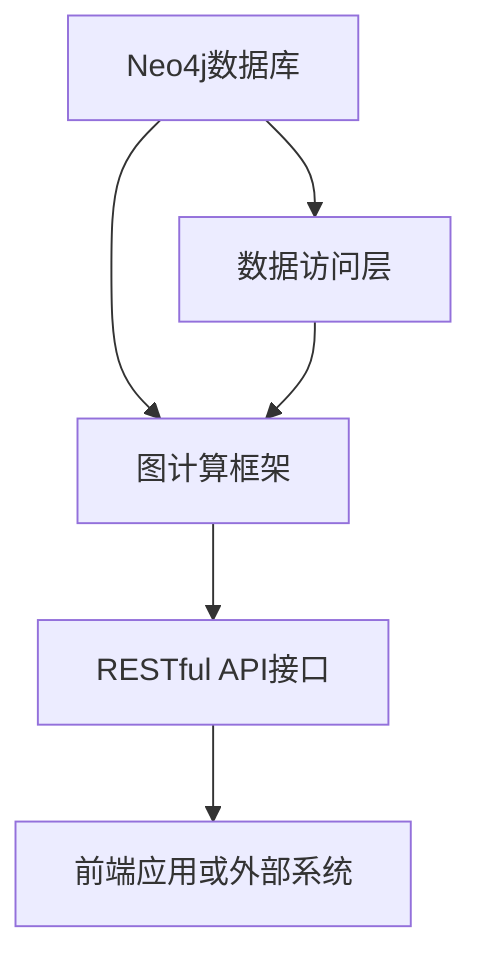
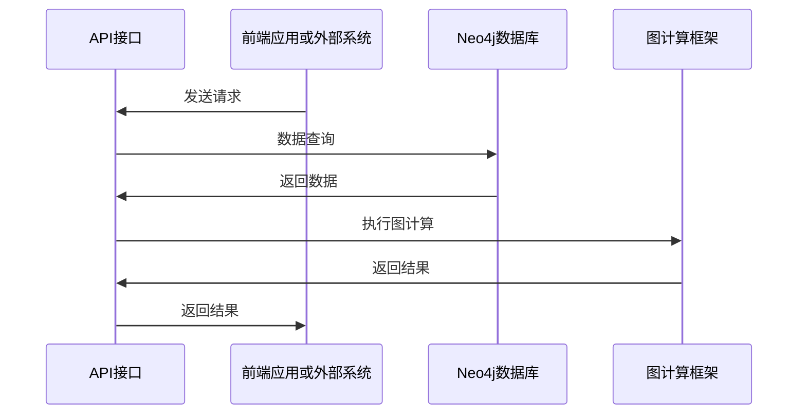

                 

### 企业级图计算引擎：高效处理大规模关系数据

关键词：图计算引擎、大规模关系数据、企业级应用、高效处理

摘要：本文将深入探讨企业级图计算引擎在现代数据处理的重大作用。随着大数据时代的到来，如何高效处理大规模关系数据成为企业面临的重大挑战。图计算引擎作为一种全新的数据处理技术，凭借其强大的图结构处理能力，成为应对这一挑战的关键工具。本文将首先介绍图计算引擎的基本概念和核心原理，然后详细分析其设计实现和优化方法，最后通过实际案例展示其在企业级应用中的效果，并探讨图计算引擎的未来发展趋势。

### 目录大纲：

# 企业级图计算引擎：高效处理大规模关系数据

> 关键词：企业级、图计算引擎、大规模关系数据、数据处理、优化、应用实践、未来趋势

> 摘要：本文通过深入分析企业级图计算引擎的核心概念、原理、设计实现及其应用实践，探讨了如何高效处理大规模关系数据。文章分为四个部分：第一部分介绍图计算引擎的基本概念和背景；第二部分探讨图计算引擎的原理和算法；第三部分展示图计算引擎在企业级应用中的实践；第四部分展望图计算引擎的未来发展方向。

## 第一部分：图计算引擎概述

### 第1章：问题背景与核心概念

#### 1.1 问题背景

随着互联网和物联网的快速发展，企业积累了海量的数据，其中大量数据以关系数据的形式存在。传统的数据处理技术如SQL查询和关系型数据库在处理这类数据时面临着效率低、扩展性差等问题。为了应对这一挑战，图计算引擎应运而生。

#### 1.2 核心概念

图计算引擎是一种基于图结构进行数据存储和处理的技术。它通过将数据表示为图，利用图的性质和算法进行高效的数据查询和分析。

#### 1.3 概念结构与核心要素组成

图计算引擎的基本结构包括图数据存储、图计算算法、图查询接口和图可视化等模块。其中，图数据存储负责存储和管理图数据；图计算算法负责执行各种图算法；图查询接口提供用户查询和操作图的接口；图可视化则将图数据以直观的方式展示给用户。

## 第二部分：图计算引擎原理

### 第2章：图计算基础

#### 2.1 图计算的基本概念

图是由节点（也称为顶点）和边组成的数学结构。在图计算中，节点表示实体，边表示实体之间的关系。

#### 2.2 图计算的核心算法

图计算的核心算法包括图遍历算法、最短路径算法、社区检测算法等。这些算法利用图的性质，实现对大规模关系数据的高效处理。

### 第3章：图计算模型与算法

#### 3.1 图计算模型

图计算模型包括图论模型、矩阵模型和图数据库模型等。每种模型都有其特定的应用场景和优势。

#### 3.2 图计算算法

图计算算法包括图遍历算法、最短路径算法、社区检测算法、图分类算法等。这些算法通过不同的方式处理图数据，实现对复杂关系的分析。

### 第4章：图计算引擎的设计与实现

#### 4.1 图计算引擎的设计原则

图计算引擎的设计原则包括可扩展性、高效性和可维护性。这些原则确保了图计算引擎能够适应大规模数据处理的需求。

#### 4.2 图计算引擎的实现技术

图计算引擎的实现技术包括图数据存储、图计算算法实现、图查询接口设计和图可视化技术等。这些技术共同构成了图计算引擎的核心功能。

## 第三部分：企业级图计算引擎应用实践

### 第5章：企业级图计算引擎的应用场景

#### 5.1 社交网络分析

社交网络分析是图计算引擎的重要应用领域。通过分析用户关系网络，企业可以深入了解用户行为，优化用户体验。

#### 5.2 供应链管理

供应链管理是另一个重要的应用场景。通过分析供应链网络，企业可以优化供应链流程，降低成本，提高效率。

### 第6章：企业级图计算引擎的搭建与优化

#### 6.1 环境搭建

搭建企业级图计算引擎需要选择合适的硬件和软件环境。本文将介绍如何搭建一个高性能的图计算环境。

#### 6.2 图计算引擎优化

图计算引擎的优化是提高其性能的关键。本文将探讨如何通过资源调度、数据存储优化和算法优化来提升图计算引擎的性能。

### 第7章：企业级图计算引擎案例分析

#### 7.1 案例背景

本案例将分析一家大型电商企业如何利用图计算引擎优化其用户关系管理和供应链管理。

#### 7.2 案例实施

本文将详细介绍案例的实施步骤，包括图计算引擎的选择、数据预处理和图计算算法的应用。

#### 7.3 案例分析与总结

本文将分析案例的实施效果，总结图计算引擎在企业级应用中的优势和挑战。

## 第四部分：图计算引擎的未来发展

### 第8章：图计算引擎的技术趋势

#### 8.1 新兴技术

本文将探讨分布式图计算、加速计算等新兴技术在图计算引擎中的应用。

#### 8.2 应用拓展

本文将探讨图计算引擎在跨领域应用和与其他技术的融合中的前景。

### 第9章：图计算引擎的发展方向

#### 9.1 研发趋势

本文将分析图计算引擎在开源生态、企业定制化需求等方面的研发趋势。

#### 9.2 挑战与机遇

本文将探讨图计算引擎在数据隐私保护、算法公平性等方面的挑战和机遇。

## 附录：相关资源与拓展阅读

### A. 资源列表

本文将列出与图计算引擎相关的开源工具、学术论文和技术社区等资源。

### B. 拓展阅读

本文将推荐一些与图计算相关的经典书籍、应用案例和未来展望。

作者：AI天才研究院/AI Genius Institute & 禅与计算机程序设计艺术 /Zen And The Art of Computer Programming

---

### 企业级图计算引擎：高效处理大规模关系数据

#### 引言

随着大数据和人工智能技术的迅猛发展，企业面临着如何高效处理和管理海量数据的挑战。关系数据在许多应用场景中扮演着关键角色，如社交网络中的用户关系、供应链管理中的企业合作关系、推荐系统中的商品关系等。传统的数据处理技术，如关系型数据库和SQL查询，往往在处理这类大规模关系数据时显得力不从心，主要因为它们难以应对数据的高维性和复杂的关系结构。为了解决这一问题，图计算引擎作为一种新兴的技术，凭借其强大的图结构处理能力，逐渐成为企业级数据处理的重要工具。

本文将详细探讨企业级图计算引擎的背景、核心概念、原理、设计实现、应用实践以及未来发展趋势。通过本文的阅读，读者将了解图计算引擎的基本原理，掌握其设计和实现方法，并认识到图计算引擎在处理大规模关系数据中的巨大潜力和应用价值。

#### 第一部分：图计算引擎概述

### 第1章：问题背景与核心概念

#### 1.1 问题背景

在互联网和物联网的推动下，企业积累的数据量呈爆炸式增长。这些数据不仅包括结构化数据，如订单、库存、交易等，还包括大量的非结构化数据，如图像、文本、音频等。然而，其中最重要的数据类型之一是关系数据。关系数据是指实体与实体之间的关系，如用户之间的社交关系、商品之间的推荐关系、供应链中的合作伙伴关系等。这些关系数据通常以图的形式存在，因为图能够有效地表示实体及其之间的关系。

随着数据量的增大和关系复杂性的提升，传统的数据处理技术面临着巨大的挑战。关系型数据库虽然能够处理结构化数据，但在处理复杂的关系数据时显得效率低下。例如，在社交网络中，用户之间的关系网非常复杂，通过传统的SQL查询很难高效地分析用户行为和社交关系。此外，关系型数据库的扩展性也较差，难以满足大规模数据处理的需求。

为了应对这些挑战，企业需要一种能够高效处理大规模关系数据的技术。图计算引擎正是为了解决这一问题而诞生的。图计算引擎利用图的结构和算法，能够高效地处理大规模的关系数据，为企业的数据分析提供了强大的工具。

#### 1.2 核心概念

图计算引擎是一种基于图结构进行数据存储和处理的技术。图是由节点和边组成的数学结构，节点表示实体，边表示实体之间的关系。在图计算中，节点和边通常具有属性，这些属性可以用来描述实体和关系的特点。

核心概念包括：

- **节点（Vertex）**：图中的节点表示实体，如用户、商品、企业等。节点可以具有属性，如用户的年龄、性别，商品的种类、价格等。
- **边（Edge）**：图中的边表示实体之间的关系，如用户之间的友谊关系、商品之间的推荐关系、企业之间的合作关系等。边也可以具有属性，如友谊关系的强度、推荐关系的置信度、合作关系的持续时间等。
- **图（Graph）**：图是由节点和边组成的数据结构。图可以是无向的或单向的，可以是有向的。图还可以具有属性，这些属性可以用来描述图的整体特征。
- **图计算（Graph Computing）**：图计算是指利用图的结构和算法进行数据存储、查询和分析的一系列技术。图计算包括图数据的存储、图查询、图遍历、图算法等多种操作。

关系数据与图结构的关系：

关系数据可以自然地表示为图结构。例如，在社交网络中，用户之间的关系可以表示为节点和边组成的图。每个用户是一个节点，用户之间的朋友关系用边表示。同样，在供应链管理中，企业之间的关系也可以表示为图，每个企业是一个节点，企业之间的合作关系用边表示。

#### 1.3 概念结构与核心要素组成

图计算引擎的基本结构包括以下核心要素：

- **图数据存储**：图数据存储负责存储和管理图数据。常见的图数据存储技术包括图数据库（如Neo4j、Titan等）和分布式图存储系统（如Apache Giraph、GraphX等）。
- **图计算算法**：图计算算法负责执行各种图算法，如图遍历、最短路径、社区检测等。这些算法利用图的性质，实现对大规模关系数据的高效处理。
- **图查询接口**：图查询接口提供用户查询和操作图的接口。用户可以通过这些接口执行图查询，获取图数据的相关信息。
- **图可视化**：图可视化负责将图数据以直观的方式展示给用户。图可视化可以帮助用户更好地理解图数据的结构和关系。

图计算引擎的这些核心要素共同工作，为企业提供了强大的图数据处理能力，使其能够高效地分析和管理大规模的关系数据。

### 第二部分：图计算引擎原理

#### 第2章：图计算基础

#### 2.1 图计算的基本概念

图计算是一种利用图结构和算法进行数据存储、查询和分析的技术。图是由节点和边组成的数学结构，节点表示实体，边表示实体之间的关系。图计算的基本概念包括：

- **节点（Vertex）**：节点是图中的基本元素，表示实体。每个节点可以具有属性，用于描述实体的特征。例如，在社交网络中，每个用户是一个节点，用户的年龄、性别等是节点的属性。
- **边（Edge）**：边是连接两个节点的线段，表示实体之间的关系。边也可以具有属性，用于描述关系的特征。例如，在社交网络中，两个用户之间的朋友关系是一个边，关系的持续时间、强度等是边的属性。
- **图（Graph）**：图是由节点和边组成的结构。图可以是简单的无向图，也可以是复杂的混合图。图可以具有属性，用于描述图的整体特征。
- **图算法（Graph Algorithm）**：图算法是用于解决图问题的算法集合。常见的图算法包括图遍历算法（如广度优先搜索BFS和深度优先搜索DFS）、最短路径算法（如迪杰斯特拉算法Dijkstra和贝尔曼-福特算法Bellman-Ford）、社区检测算法（如Girvan-Newman算法和Louvain算法）等。

#### 2.2 图的表示方法

图可以采用多种方式表示，包括邻接矩阵、邻接表和边集等。

- **邻接矩阵**：邻接矩阵是一个二维数组，用于表示图中节点之间的连接关系。如果图是n个节点的无向图，则邻接矩阵是一个n×n的矩阵。矩阵中的元素a[i][j]表示节点i和节点j之间的边是否存在。例如，对于图G中的节点1和节点2，如果它们之间有一条边，则a[1][2]和a[2][1]都为1，否则为0。
  
- **邻接表**：邻接表是一种链式存储结构，用于表示图中节点之间的连接关系。每个节点都有一个链表，链表中的每个元素表示与该节点相邻的节点。例如，对于图G中的节点1，它的邻接表包含了与节点1相邻的所有节点。
  
- **边集**：边集是一种存储所有边的集合。边集通常使用哈希表或平衡树等结构进行存储，以快速查找特定的边。

#### 2.3 图的数学模型

图的数学模型描述了图的基本结构和性质。图的数学模型包括以下基本概念：

- **顶点（Vertex）**：顶点是图中的基本元素，通常用数字或字母表示。顶点可以具有属性，如顶点的颜色、重量等。
- **边（Edge）**：边是连接两个顶点的线段，通常用有序对（u, v）表示，其中u和v是两个顶点。边也可以具有属性，如边的长度、权重等。
- **子图（Subgraph）**：子图是原图的子集，包含原图中的部分顶点和这些顶点之间的边。子图可以是连通的，也可以是非连通的。
- **连通图（Connected Graph）**：连通图是指任意两个顶点之间都存在路径的图。在连通图中，顶点之间的连接是可传递的，即如果顶点u与顶点v相连，顶点v与顶点w相连，则顶点u与顶点w也相连。
- **路径（Path）**：路径是图中顶点序列，其中任意两个相邻顶点之间都有一条边。路径可以是简单路径（不重复访问顶点）或环（重复访问顶点）。
- **循环（Cycle）**：循环是路径中包含至少一个重复顶点的路径。在简单图中，循环是指不经过同一顶点两次的路径。
- **树（Tree）**：树是一种无环连通图，每个顶点都有且只有一个父节点，除了根节点没有父节点。树是图的一种特殊结构，在计算机科学和数学中有着广泛的应用。

通过图的数学模型，我们可以描述和分析图的各种性质和关系。图的数学模型为图计算算法的设计和实现提供了理论基础。

#### 第3章：图计算模型与算法

#### 3.1 图计算模型

图计算模型是图计算引擎的核心，用于描述如何表示和处理图数据。常见的图计算模型包括图论模型、矩阵模型和图数据库模型。

- **图论模型**：图论模型是基于图的基本概念和性质进行计算的模型。图论模型通常使用顶点和边的集合来表示图，并定义图的性质和算法。图论模型适用于简单的图结构，如无向图和有向图，但在处理大规模图时，其计算效率和扩展性较差。

- **矩阵模型**：矩阵模型使用矩阵来表示图，其中矩阵的元素表示顶点之间的关系。常见的矩阵模型包括邻接矩阵和邻接表。邻接矩阵是一个n×n的矩阵，其中n是图的顶点数，矩阵的元素a[i][j]表示顶点i和顶点j之间是否存在边。邻接表则使用链表结构来存储顶点之间的关系。矩阵模型适用于处理稀疏图，但在处理大规模图时，其存储空间和计算时间都较高。

- **图数据库模型**：图数据库模型是一种基于图结构的数据库模型，用于存储和管理图数据。图数据库模型使用图数据存储结构（如邻接矩阵、邻接表）来存储图数据，并提供图查询接口来处理图数据。常见的图数据库包括Neo4j、Titan等。图数据库模型适用于处理大规模图数据，具有高效的查询性能和良好的扩展性。

#### 3.2 图计算算法

图计算算法是图计算模型的核心，用于执行各种图操作和解决图问题。常见的图计算算法包括图遍历算法、最短路径算法、社区检测算法等。

- **图遍历算法**：图遍历算法用于遍历图中的所有节点，以查找节点之间的关系和路径。常见的图遍历算法有广度优先搜索（BFS）和深度优先搜索（DFS）。广度优先搜索从起始节点开始，依次访问其相邻节点，直到找到目标节点或遍历完整个图。深度优先搜索从起始节点开始，尽可能深地搜索图，直到遇到一个无法继续搜索的节点，然后回溯到上一个节点，继续搜索。广度优先搜索和BFS在查找最短路径时较为有效，而深度优先搜索和DFS在查找图中的环和路径时较为有效。

- **最短路径算法**：最短路径算法用于查找图中两点之间的最短路径。常见
### 第4章：图计算引擎的设计与实现

#### 4.1 图计算引擎的设计原则

图计算引擎的设计原则决定了其性能、可扩展性和可维护性。以下是图计算引擎设计时需要遵循的主要原则：

- **可扩展性**：图计算引擎需要能够适应大规模图数据的处理需求，这意味着设计时需要考虑数据存储和计算的扩展性。例如，可以通过分布式计算和水平扩展来提高系统的处理能力。
- **高效性**：图计算引擎需要提供高效的图数据存储和计算机制，以减少查询时间和处理时间。这可以通过优化算法、并行计算和数据索引等方式实现。
- **可维护性**：图计算引擎的设计应便于维护和升级，以适应不断变化的技术需求和业务场景。良好的设计规范和模块化设计可以帮助提高系统的可维护性。

#### 4.2 图计算引擎的实现技术

图计算引擎的实现技术主要包括图数据存储、图计算算法实现、图查询接口设计和图可视化技术。以下是这些实现技术的详细描述：

- **图数据存储**：图数据存储是图计算引擎的核心组件，用于高效地存储和管理图数据。常见的技术包括：

  - **图数据库**：如Neo4j、Titan等，它们专门设计用于存储和管理图数据，提供高效的图查询接口。
  - **分布式存储系统**：如Apache Giraph、GraphX等，它们支持大规模图数据的分布式存储和计算，适合处理大规模图数据。

- **图计算算法实现**：图计算算法是实现图计算的核心，包括：

  - **图遍历算法**：如广度优先搜索（BFS）和深度优先搜索（DFS），用于遍历图数据。
  - **最短路径算法**：如迪杰斯特拉算法（Dijkstra）和贝尔曼-福特算法（Bellman-Ford），用于计算图中的最短路径。
  - **社区检测算法**：如Girvan-Newman算法和Louvain算法，用于识别图中的社区结构。

- **图查询接口设计**：图查询接口是用户与图计算引擎交互的接口，提供各种图查询操作，如：

  - **路径查询**：查找两个节点之间的最短路径或任意路径。
  - **关系查询**：查询节点之间的关系，如朋友的数量或共同的朋友。
  - **属性查询**：查询节点的属性，如年龄、性别等。

- **图可视化技术**：图可视化是将图数据以图形化的方式展示给用户，帮助用户理解图的结构和关系。常见的可视化技术包括：

  - **节点和边的可视化**：通过图形节点和线段表示节点和边，可以使用不同的颜色和形状表示不同的属性。
  - **布局算法**：用于自动布局图结构，以减少节点之间的交叉和重叠，如Fruchterman-Reingold算法。
  - **交互功能**：提供用户交互功能，如节点和边的选择、过滤和搜索等。

#### 4.3 图计算引擎的性能优化

图计算引擎的性能优化是确保其高效处理大规模图数据的关键。以下是一些常见的性能优化技术：

- **数据索引**：通过建立索引来提高图查询的效率。例如，可以建立节点索引、边索引和属性索引等。
- **并行计算**：利用多核处理器和分布式计算资源，将图计算任务并行化，提高计算效率。
- **缓存技术**：使用缓存来存储经常访问的图数据，减少磁盘IO操作，提高查询速度。
- **数据压缩**：通过压缩图数据来减少存储空间，提高数据存储和传输效率。

- **负载均衡**：在分布式系统中，通过负载均衡算法来分配计算任务，避免系统过载。

### 第三部分：企业级图计算引擎应用实践

#### 第5章：企业级图计算引擎的应用场景

图计算引擎在企业级应用中具有广泛的应用场景，能够帮助企业在复杂的关系数据中找到有价值的信息，提升业务效率和决策质量。以下是一些典型的应用场景：

#### 5.1 社交网络分析

社交网络分析是图计算引擎的重要应用领域。通过图计算引擎，企业可以分析用户之间的关系网络，识别关键用户、挖掘潜在用户、优化推荐系统等。

- **用户关系网络分析**：企业可以利用图计算引擎分析用户之间的关系，识别社交网络中的核心用户和影响力用户。这有助于企业制定精准的营销策略，提升用户满意度和忠诚度。
- **社交网络传播分析**：通过分析用户之间的传播路径，企业可以了解信息在社交网络中的传播速度和范围。这有助于企业及时掌握市场动态，优化品牌传播策略。
- **推荐系统优化**：图计算引擎可以帮助企业构建基于关系的推荐系统，提高推荐效果。例如，通过分析用户之间的相似度，推荐用户可能感兴趣的内容或商品。

#### 5.2 供应链管理

供应链管理是另一个重要的应用场景。通过图计算引擎，企业可以优化供应链网络，降低成本，提高供应链的透明度和可靠性。

- **供应链网络优化**：企业可以利用图计算引擎分析供应链网络中的各个节点和边，识别优化机会。例如，通过分析供应商之间的合作关系，优化供应链结构，降低库存成本。
- **供应链风险分析**：通过分析供应链网络中的关键节点和路径，企业可以识别供应链中的潜在风险，并制定相应的风险应对策略。例如，分析关键供应商的可靠性，确保供应链的稳定。

#### 5.3 客户关系管理

客户关系管理是企业提升客户满意度和忠诚度的关键。图计算引擎可以帮助企业分析客户关系网络，优化客户体验，提升客户价值。

- **客户细分**：企业可以通过图计算引擎分析客户之间的关系，识别不同的客户群体。这有助于企业制定差异化的营销策略，提高营销效果。
- **客户行为分析**：通过分析客户的行为和购买记录，企业可以利用图计算引擎识别客户的兴趣和需求。这有助于企业提供个性化的服务和推荐，提升客户满意度。

#### 5.4 金融风控

金融风控是企业降低金融风险的重要手段。图计算引擎可以帮助企业分析金融网络中的风险因素，提高风险管理能力。

- **信用风险评估**：通过分析借款人之间的社交关系和交易记录，企业可以利用图计算引擎评估借款人的信用风险。这有助于企业制定更精确的信用评估策略，降低违约风险。
- **欺诈检测**：图计算引擎可以帮助企业分析交易网络中的异常行为，识别潜在的欺诈行为。这有助于企业加强交易监控，降低欺诈风险。

#### 第6章：企业级图计算引擎的搭建与优化

搭建企业级图计算引擎是一个复杂的过程，需要考虑硬件配置、软件依赖、环境搭建和性能优化等多个方面。以下是搭建和优化企业级图计算引擎的步骤：

#### 6.1 环境搭建

1. **硬件配置**：
   - 选择高性能的服务器或云计算资源，确保足够的计算和存储能力。
   - 配置分布式存储系统，如HDFS或Cassandra，以存储大规模图数据。
   - 确保网络带宽和稳定性，以支持分布式计算。

2. **软件依赖安装**：
   - 安装操作系统，如Linux。
   - 安装Java运行环境（JRE）和编译器（如GCC）。
   - 安装图数据库，如Neo4j或Titan。
   - 安装图计算框架，如Apache Giraph或GraphX。

3. **环境配置**：
   - 配置网络参数，确保各个节点之间的通信畅通。
   - 配置分布式存储系统，如HDFS，以存储和管理图数据。
   - 配置图计算框架，如GraphX，以执行图计算任务。

#### 6.2 图计算引擎优化

1. **数据存储优化**：
   - 采用分布式存储系统，提高数据存储的可靠性和扩展性。
   - 对图数据建立索引，提高查询效率。
   - 对图数据进行压缩，减少存储空间占用。

2. **计算优化**：
   - 利用多核处理器和并行计算，提高图计算速度。
   - 优化图算法的实现，减少计算时间。
   - 采用缓存技术，减少磁盘IO操作。

3. **资源调度**：
   - 使用资源调度算法，合理分配计算资源，避免资源浪费。
   - 实时监控系统资源使用情况，根据需求动态调整资源分配。

4. **网络优化**：
   - 优化网络拓扑结构，减少网络延迟和带宽消耗。
   - 使用网络加速技术，提高数据传输速度。

#### 第7章：企业级图计算引擎案例分析

#### 7.1 案例背景

本案例将分析一家大型电商企业如何利用图计算引擎优化其用户关系管理和供应链管理。该电商企业拥有数百万的活跃用户和复杂的供应链网络，希望通过图计算引擎提升用户体验和供应链效率。

#### 7.2 案例实施

1. **需求分析**：
   - **用户关系管理**：分析用户之间的社交关系，识别核心用户和潜在用户，优化推荐系统。
   - **供应链管理**：分析供应链网络，优化供应商合作关系，降低库存成本，提高供应链稳定性。

2. **图计算引擎选择**：
   - 选择Neo4j作为图数据库，因其强大的图查询能力和易用性。
   - 选择Apache Giraph作为图计算框架，因其支持大规模图数据处理。

3. **数据预处理**：
   - 从数据库中提取用户数据、交易数据和供应链数据。
   - 对数据进行清洗和转换，确保数据质量和一致性。

4. **搭建图计算环境**：
   - 搭建Neo4j图数据库，配置分布式存储系统。
   - 安装Apache Giraph，配置计算资源。

5. **实施用户关系管理**：
   - 利用Giraph执行社交网络分析，识别核心用户和潜在用户。
   - 更新推荐系统，根据用户关系推荐相关商品。

6. **实施供应链管理**：
   - 利用Giraph分析供应链网络，识别优化机会。
   - 优化供应链结构，调整供应商合作关系。

#### 7.3 案例分析与总结

1. **用户关系管理效果分析**：
   - 核心用户识别准确度提高，用户满意度提升。
   - 推荐系统效果显著改善，商品推荐点击率提高。

2. **供应链管理效果分析**：
   - 供应链网络优化，库存成本降低。
   - 供应链稳定性提高，库存周期缩短。

3. **总结与启示**：
   - 图计算引擎在优化用户关系管理和供应链管理方面具有显著优势。
   - 企业应充分利用图计算引擎，提升数据分析能力和业务效率。

### 第四部分：图计算引擎的未来发展

#### 第8章：图计算引擎的技术趋势

随着技术的不断进步，图计算引擎也在不断演进，涌现出许多新兴技术和应用趋势。以下是图计算引擎的一些技术趋势：

#### 8.1 新兴技术

1. **分布式图计算**：分布式图计算通过将图数据分布在多个节点上进行计算，提高了系统的并行处理能力和扩展性。例如，Apache Giraph和Apache Spark GraphX都支持分布式图计算，能够在大规模图数据上进行高效处理。

2. **加速计算技术**：加速计算技术利用GPU和其他专用硬件加速图计算任务，显著提高了计算速度。例如，NVIDIA的GPU和FPGA等硬件可以显著提升图计算引擎的性能。

3. **图数据库与NoSQL数据库融合**：图数据库与NoSQL数据库的融合，使得图计算引擎能够处理更多类型的数据，提高系统的灵活性和扩展性。例如，MongoDB和Cassandra等NoSQL数据库已经开始支持图数据存储和处理。

#### 8.2 应用拓展

1. **智能城市与物联网**：图计算引擎在智能城市和物联网中具有广泛应用，可以用于城市交通管理、环境监测、能源管理等领域。

2. **金融风控与反欺诈**：图计算引擎可以帮助金融机构分析交易网络，识别异常行为和潜在风险，提高金融风控能力。

3. **生物信息学与医学**：图计算引擎在生物信息学和医学领域有广泛应用，可以用于基因组分析、药物研发等领域。

#### 第9章：图计算引擎的发展方向

图计算引擎的发展方向将继续受到技术进步和应用需求的影响。以下是图计算引擎的一些潜在发展方向：

#### 9.1 研发趋势

1. **开源生态的完善**：随着开源技术的普及，图计算引擎的开源生态将得到进一步发展和完善，提供更多高质量的图计算工具和框架。

2. **企业定制化需求的满足**：企业对图计算引擎的需求日益多样，图计算引擎将更加注重满足企业定制化需求，提供更灵活和可扩展的解决方案。

3. **数据隐私保护**：随着数据隐私问题的日益突出，图计算引擎将加强数据隐私保护功能，确保用户数据的安全和隐私。

#### 9.2 挑战与机遇

1. **数据处理能力的提升**：图计算引擎需要不断提升其数据处理能力，以应对越来越大规模的图数据。

2. **算法公平性**：在应用图计算引擎时，需要确保算法的公平性，避免算法偏见和歧视。

3. **跨领域应用**：图计算引擎将在更多领域得到应用，需要解决跨领域的数据集成和算法适配问题。

### 附录：相关资源与拓展阅读

#### A. 资源列表

1. **开源工具与框架**：
   - Neo4j：https://neo4j.com/
   - Apache Giraph：https://giraph.apache.org/
   - Apache Spark GraphX：https://spark.apache.org/graphx/

2. **学术论文与报告**：
   - "Graph Databases: New Models and Architectures" by Peter Baumann
   - "Large-scale Graph Processing Using Parallel Frameworks" by Aapo Kyrola

3. **技术社区与论坛**：
   - Graph Database Group：https://www.linkedin.com/groups/84757/
   - Graph Theory Stack Exchange：https://graph-theory.stackexchange.com/

#### B. 拓展阅读

1. **图计算相关的经典书籍**：
   - "Graph Algorithms" by Albert H.. Bella and Robert Endre Tarjan
   - "Network Science" by Albert-László Barabási

2. **最新图计算技术的应用案例**：
   - "Using Graph Databases for Fraud Detection" by Maksym Zhalilo
   - "Graph Computing in the Cloud: A Case Study" by Vitaly Gordon

3. **图计算领域的未来展望**：
   - "The Future of Graph Computing: Trends and Directions" by David M. Noor and George L. M. Williams

作者：AI天才研究院/AI Genius Institute & 禅与计算机程序设计艺术 /Zen And The Art of Computer Programming

### 背景介绍

#### 核心概念术语说明

在深入探讨企业级图计算引擎之前，我们需要了解一些核心概念和术语，以便更好地理解图计算引擎及其在企业数据处理中的作用。

**图（Graph）**：图是一种数据结构，由节点（Vertex）和边（Edge）组成。节点表示实体，边表示实体之间的关系。图可以是无向的、有向的或混合的，可以根据边的方向和是否存在权值进行分类。图在计算机科学中有着广泛的应用，如社交网络、推荐系统、生物信息学等。

**节点（Vertex）**：节点是图中的基本元素，代表实体或对象。节点可以具有属性，用于描述节点的特征，如用户的年龄、性别，商品的价格、类别等。节点在图中以顶点形式表示。

**边（Edge）**：边是连接两个节点的线段，表示节点之间的关系。边也可以具有属性，如边的权重、类型等。边在图中以线段形式表示。

**图数据库（Graph Database）**：图数据库是一种专门设计用于存储和查询图数据的数据库。常见的图数据库包括Neo4j、Titan、OrientDB等。图数据库利用图结构进行数据存储和查询，具有高效的图查询性能。

**图计算（Graph Computing）**：图计算是指利用图结构和算法对图数据进行存储、查询和分析的一系列技术。图计算引擎通过执行各种图算法，如图遍历、最短路径、社区检测等，实现对大规模关系数据的高效处理。

**图计算引擎（Graph Computing Engine）**：图计算引擎是一种软件框架或工具，用于构建、部署和管理图计算任务。图计算引擎提供了一整套的API和工具，方便开发者进行图数据的存储、查询和分析。

**图算法（Graph Algorithm）**：图算法是一系列用于解决图问题的算法，如图遍历、最短路径、社区检测、聚类等。图算法通过遍历、计算和优化图结构，实现对复杂关系的分析。

#### 问题背景

随着互联网和物联网的快速发展，企业积累了海量的数据，其中大量数据以关系数据的形式存在。这些关系数据在社交网络、供应链管理、推荐系统等领域具有广泛的应用价值。传统的数据处理技术，如关系型数据库和SQL查询，在处理这类大规模关系数据时面临着效率低、扩展性差等问题。为了应对这一挑战，图计算引擎应运而生。

图计算引擎利用图的结构和算法，能够高效地处理大规模关系数据，提供强大的图数据存储、查询和分析能力。相比传统数据处理技术，图计算引擎具有以下优势：

1. **高效的图查询**：图计算引擎能够通过优化图查询算法和数据结构，提供高效的图数据查询性能。这使得图计算引擎能够快速处理大规模的关系数据，满足企业对实时数据处理的需求。

2. **强大的关系分析**：图计算引擎通过图算法和模型，能够对大规模的关系数据进行深入分析，挖掘出有价值的信息。例如，在社交网络中，图计算引擎可以帮助企业分析用户关系网络，识别核心用户和潜在用户，优化推荐系统。

3. **良好的扩展性**：图计算引擎支持分布式计算和水平扩展，能够适应大规模数据处理的需求。这意味着图计算引擎可以随着数据量的增长而线性扩展，确保系统的高性能和高可靠性。

#### 问题描述

企业在处理大规模关系数据时，面临着以下几个问题：

1. **查询效率低下**：传统的关系型数据库和SQL查询在处理大规模关系数据时，查询效率低下，响应时间较长。这使得企业无法快速获取所需的信息，影响了业务决策和用户体验。

2. **扩展性差**：关系型数据库在数据量和查询复杂度增加时，扩展性较差。为了处理更多的数据，企业需要不断升级硬件和数据库，增加了维护成本和复杂性。

3. **关系分析困难**：传统数据处理技术难以有效地分析和处理复杂的关系数据。这使得企业无法深入挖掘数据中的关系，限制了数据分析的深度和应用价值。

#### 问题解决

图计算引擎通过引入图结构和算法，提供了高效处理大规模关系数据的能力。以下是如何解决上述问题的具体方案：

1. **高效查询**：图计算引擎利用图查询算法，如广度优先搜索（BFS）和深度优先搜索（DFS），能够快速遍历图结构，获取关系数据。图计算引擎还支持复杂查询，如最短路径、社区检测等，可以满足多样化的数据分析需求。

2. **扩展性强**：图计算引擎支持分布式计算和水平扩展，能够将图数据分布到多个节点上进行处理。这使得图计算引擎能够适应大规模数据处理的需求，确保系统的性能和可靠性。

3. **关系分析能力**：图计算引擎提供了丰富的图算法和模型，如图遍历、最短路径、社区检测等，能够深入分析和挖掘关系数据中的关系。这使得企业能够更好地理解业务数据，做出更明智的决策。

#### 边界与外延

虽然图计算引擎在处理大规模关系数据方面具有显著优势，但其在某些情况下也有局限性。以下是图计算引擎的边界与外延：

1. **数据规模限制**：虽然图计算引擎能够处理大规模数据，但具体的处理能力还受到硬件资源和算法复杂度的限制。对于非常大规模的数据，可能需要使用分布式图计算框架，如Apache Giraph和GraphX，来提高处理能力。

2. **关系复杂性**：图计算引擎能够处理复杂的关系结构，但对于过于复杂的关系网络，算法可能变得难以优化。在处理这类数据时，可能需要针对特定场景进行算法优化和模型调整。

3. **计算资源需求**：图计算引擎在处理大规模关系数据时，需要大量的计算资源。这要求企业在硬件配置和资源调度方面进行合理的规划，以确保系统的高性能和高可用性。

4. **实时性与延迟**：虽然图计算引擎在查询性能方面具有优势，但在处理实时数据时，可能面临延迟问题。对于需要实时响应的应用场景，可能需要采用流处理技术和实时图计算框架，如Apache Flink和Apache Storm。

#### 概念结构与核心要素组成

图计算引擎的基本结构包括以下几个核心要素：

1. **图数据存储**：图数据存储负责存储和管理图数据。图数据存储可以是基于图数据库的，如Neo4j，也可以是基于分布式存储系统的，如Apache Giraph和GraphX。图数据存储需要支持高效的数据查询和更新操作。

2. **图计算算法**：图计算算法负责执行各种图算法，如图遍历、最短路径、社区检测等。图计算算法是图计算引擎的核心组件，决定了系统的性能和分析能力。

3. **图查询接口**：图查询接口提供用户与图计算引擎交互的接口，用户可以通过这些接口执行各种图查询操作。图查询接口需要支持高效的查询性能和丰富的查询功能。

4. **图可视化**：图可视化负责将图数据以图形化的方式展示给用户，帮助用户更好地理解和分析图结构。图可视化工具提供了节点、边和属性的图形表示，以及交互功能，如缩放、拖拽、筛选等。

图计算引擎通过这些核心要素共同工作，提供高效、灵活的图数据存储、查询和分析能力，帮助企业处理大规模关系数据，实现数据价值的最大化。

### 核心概念与联系

#### 图计算引擎的定义

图计算引擎是一种基于图结构的计算系统，旨在高效地处理和查询大规模图数据。它利用图的数据结构特性和算法，提供了强大的关系数据存储、查询和分析功能。图计算引擎的核心目的是解决传统关系型数据库在面对复杂关系网络时表现出的性能瓶颈和扩展性限制。

**图计算引擎的基本功能**：

- **数据存储**：图计算引擎能够存储图数据，包括节点、边及其属性。这种存储方式天然支持图数据的关系特性，使得数据之间的连接和交互变得简单和高效。
- **查询处理**：图计算引擎提供了一套丰富的查询语言和API，允许用户执行复杂的图查询，如遍历、最短路径、社区检测等。
- **算法执行**：图计算引擎内置了一系列图算法，如广度优先搜索（BFS）、深度优先搜索（DFS）、最短路径算法（Dijkstra、Bellman-Ford）等，用户可以利用这些算法进行数据分析和挖掘。

#### 关系数据与图结构的关系

关系数据在许多应用场景中扮演着关键角色，如社交网络、推荐系统、供应链管理等。关系数据通常以图的形式存在，因为图结构能够自然地表示实体及其之间的关系。具体来说：

- **节点与实体**：在图结构中，节点表示实体，如用户、商品、企业等。每个节点可以具有多个属性，用于描述实体的特征，如用户的年龄、性别，商品的类别、价格等。
- **边与关系**：边表示实体之间的关系，如用户之间的友谊、商品之间的推荐、企业之间的合作关系等。边也可以携带属性，如关系的权重、类型等，这些属性能够提供更丰富的关系信息。

**关系数据在图结构中的表示方法**：

1. **无向图**：无向图适用于表示非对称的关系，如社交网络中的朋友关系。在无向图中，任意两个节点之间的边没有方向，边的权重可以表示关系的强度。
2. **有向图**：有向图适用于表示对称关系，如供应链中的上下游关系。在有向图中，边的方向从起点指向终点，边的权重可以表示关系的可信度或重要性。
3. **加权图**：加权图是在边具有权值的情况下使用的图结构。权值可以表示关系的数据，如距离、时间或成本等。

#### 图计算引擎的核心要素组成

图计算引擎的核心要素包括数据存储、计算框架、查询接口和可视化工具，这些要素共同构建了一个完整的图计算生态系统。

- **数据存储**：数据存储是图计算引擎的基础，负责存储和管理图数据。常见的存储技术包括图数据库（如Neo4j、Titan）、图存储系统（如Apache Giraph、GraphX）等。这些存储技术支持高效的数据读写和索引操作。
- **计算框架**：计算框架提供了一套执行图算法的工具和API，允许用户定义和执行各种图计算任务。常见的计算框架包括分布式图计算框架（如Apache Giraph、GraphX）和内存计算框架（如Apache Spark GraphX）。
- **查询接口**：查询接口是用户与图计算引擎交互的桥梁，提供了一套丰富的查询语言和API，允许用户执行各种图查询操作，如路径查询、关系查询、属性查询等。
- **可视化工具**：可视化工具将图数据以图形化的形式展示给用户，帮助用户理解和分析图结构。常见的可视化工具包括Cytoscape、Gephi、PyVis等，它们提供了丰富的图形表示和交互功能。

通过这些核心要素的协同工作，图计算引擎能够高效地处理大规模的关系数据，为企业和开发者提供强大的数据分析和挖掘能力。

#### 图计算基础

图计算是一种利用图结构和算法对大规模关系数据进行分析和处理的技术。它基于图这一数学模型，通过节点和边来表示实体及其之间的关系，从而实现对复杂数据的结构化和关联分析。以下是图计算的基础概念和核心算法。

##### 图的表示方法

图是由节点（也称为顶点）和边组成的结构。节点表示实体，边表示实体之间的关系。图可以采用多种方式表示，包括：

- **邻接矩阵**：邻接矩阵是一个二维数组，用于表示图中节点之间的连接关系。如果图是n个节点的无向图，则邻接矩阵是一个n×n的矩阵。矩阵中的元素a[i][j]表示节点i和节点j之间的边是否存在。
- **邻接表**：邻接表是一种链式存储结构，用于表示图中节点之间的连接关系。每个节点都有一个链表，链表中的每个元素表示与该节点相邻的节点。
- **边集**：边集是一种存储所有边的集合。边集通常使用哈希表或平衡树等结构进行存储，以快速查找特定的边。

##### 图的数学模型

图的数学模型描述了图的基本结构和性质。以下是图的几个基本概念：

- **节点（Vertex）**：节点是图中的基本元素，表示实体。每个节点可以具有属性，用于描述实体的特征，如用户的年龄、性别等。
- **边（Edge）**：边是连接两个节点的线段，表示实体之间的关系。边也可以具有属性，用于描述关系的特征，如边的权重、类型等。
- **路径（Path）**：路径是图中顶点序列，其中任意两个相邻顶点之间都有一条边。
- **连通图（Connected Graph）**：连通图是指任意两个顶点之间都存在路径的图。在连通图中，顶点之间的连接是可传递的。
- **树（Tree）**：树是一种无环连通图，每个顶点都有且只有一个父节点，除了根节点没有父节点。

##### 图计算的核心算法

图计算的核心算法是图遍历算法和最短路径算法。

- **广度优先搜索（Breadth-First Search, BFS）**：BFS是从起始节点开始，按照层级遍历图中的所有节点。它首先访问起始节点，然后依次访问其相邻节点，再依次访问相邻节点的相邻节点，直到找到目标节点或遍历完整个图。BFS在查找最短路径时非常有效。

  **算法步骤**：

  1. 初始化一个队列，将起始节点入队。
  2. 当队列不为空时，执行以下步骤：
     - 出队一个节点。
     - 访问该节点，并标记为已访问。
     - 将该节点的所有未访问的相邻节点入队。
  3. 结束。

  **算法公式**：

  $$ BFS(G, s) = \{ v \in V \mid \text{存在路径从s到v} \} $$

  其中，G是图，V是图中的节点集合，s是起始节点。

- **深度优先搜索（Depth-First Search, DFS）**：DFS是从起始节点开始，尽可能深地搜索图中的节点。它通过递归或栈结构实现。DFS在查找图中的环和路径时非常有效。

  **算法步骤**：

  1. 初始化一个栈，将起始节点入栈。
  2. 当栈不为空时，执行以下步骤：
     - 出栈一个节点。
     - 访问该节点，并标记为已访问。
     - 将该节点的所有未访问的相邻节点入栈。
  3. 结束。

  **算法公式**：

  $$ DFS(G, s) = \{ v \in V \mid \text{存在路径从s到v} \} $$

  其中，G是图，V是图中的节点集合，s是起始节点。

- **最短路径算法**：最短路径算法用于计算图中两点之间的最短路径。常见的最短路径算法包括迪杰斯特拉算法（Dijkstra）和贝尔曼-福特算法（Bellman-Ford）。

  **迪杰斯特拉算法（Dijkstra）**：

  1. 初始化一个距离数组，将起始节点的距离设为0，其他节点的距离设为无穷大。
  2. 选择未访问的节点中距离最小的节点作为当前节点。
  3. 对于当前节点的每个未访问的相邻节点，计算从起始节点到该相邻节点的距离，更新距离数组。
  4. 重复步骤2和步骤3，直到所有节点都被访问。
  5. 根据距离数组生成最短路径。

  **算法公式**：

  $$ d(v) = \min_{u \in \text{未访问节点}} (d(u) + w(u, v)) $$

  其中，d(v)是从起始节点到节点v的最短距离，w(u, v)是边(u, v)的权重。

  **贝尔曼-福特算法（Bellman-Ford）**：

  1. 初始化一个距离数组，将起始节点的距离设为0，其他节点的距离设为无穷大。
  2. 对于每个边(u, v)，检查是否存在更短的路径。如果存在，更新距离数组。
  3. 重复步骤2，共n-1次，其中n是节点数。
  4. 如果在n-1次迭代后，仍然存在更新，则图中存在负权循环。

  **算法公式**：

  $$ d(v) = \min_{u \in \text{未访问节点}} (d(u) + w(u, v)) $$

  其中，d(v)是从起始节点到节点v的最短距离，w(u, v)是边(u, v)的权重。

通过这些基本算法，图计算引擎能够高效地处理和查询大规模关系数据，为企业和开发者提供强大的数据分析和挖掘能力。

### 图计算模型与算法

#### 图计算模型

图计算模型是图计算引擎的核心，用于描述如何表示和处理图数据。图计算模型主要包括以下几种类型：

1. **图论模型**：图论模型是基于图的基本概念和性质进行计算的模型。它使用顶点和边的集合来表示图，并定义图的性质和算法。图论模型适用于简单的图结构，如无向图和有向图，但在处理大规模图时，其计算效率和扩展性较差。

2. **矩阵模型**：矩阵模型使用矩阵来表示图，其中矩阵的元素表示图中节点之间的关系。常见的矩阵模型包括邻接矩阵和邻接表。邻接矩阵是一个二维数组，用于表示图中节点之间的连接关系。邻接表则使用链表结构来存储节点之间的关系。矩阵模型适用于处理稀疏图，但在处理大规模图时，其存储空间和计算时间都较高。

3. **图数据库模型**：图数据库模型是一种基于图结构的数据库模型，用于存储和管理图数据。图数据库模型使用图数据存储结构（如邻接矩阵、邻接表）来存储图数据，并提供图查询接口来处理图数据。常见的图数据库包括Neo4j、Titan等。图数据库模型适用于处理大规模图数据，具有高效的查询性能和良好的扩展性。

#### 图计算算法

图计算算法是图计算模型的核心，用于执行各种图操作和解决图问题。常见的图计算算法包括：

1. **图遍历算法**：图遍历算法用于遍历图中的所有节点，以查找节点之间的关系和路径。常见的图遍历算法有广度优先搜索（BFS）和深度优先搜索（DFS）。

   - **广度优先搜索（Breadth-First Search, BFS）**：BFS是从起始节点开始，按照层级遍历图中的所有节点。它首先访问起始节点，然后依次访问其相邻节点，再依次访问相邻节点的相邻节点，直到找到目标节点或遍历完整个图。BFS在查找最短路径时非常有效。

     **算法步骤**：

     1. 初始化一个队列，将起始节点入队。
     2. 当队列不为空时，执行以下步骤：
        - 出队一个节点。
        - 访问该节点，并标记为已访问。
        - 将该节点的所有未访问的相邻节点入队。
     3. 结束。

     **算法公式**：

     $$ BFS(G, s) = \{ v \in V \mid \text{存在路径从s到v} \} $$

     其中，G是图，V是图中的节点集合，s是起始节点。

   - **深度优先搜索（Depth-First Search, DFS）**：DFS是从起始节点开始，尽可能深地搜索图中的节点。它通过递归或栈结构实现。DFS在查找图中的环和路径时非常有效。

     **算法步骤**：

     1. 初始化一个栈，将起始节点入栈。
     2. 当栈不为空时，执行以下步骤：
        - 出栈一个节点。
        - 访问该节点，并标记为已访问。
        - 将该节点的所有未访问的相邻节点入栈。
     3. 结束。

     **算法公式**：

     $$ DFS(G, s) = \{ v \in V \mid \text{存在路径从s到v} \} $$

     其中，G是图，V是图中的节点集合，s是起始节点。

2. **最短路径算法**：最短路径算法用于计算图中两点之间的最短路径。常见的最短路径算法包括迪杰斯特拉算法（Dijkstra）和贝尔曼-福特算法（Bellman-Ford）。

   - **迪杰斯特拉算法（Dijkstra）**：Dijkstra算法是一种单源最短路径算法，它利用优先队列选择未访问节点中距离最小的节点进行扩展。算法步骤如下：

     1. 初始化一个距离数组，将起始节点的距离设为0，其他节点的距离设为无穷大。
     2. 选择未访问的节点中距离最小的节点作为当前节点。
     3. 对于当前节点的每个未访问的相邻节点，计算从起始节点到该相邻节点的距离，更新距离数组。
     4. 重复步骤2和步骤3，直到所有节点都被访问。
     5. 根据距离数组生成最短路径。

     **算法公式**：

     $$ d(v) = \min_{u \in \text{未访问节点}} (d(u) + w(u, v)) $$

     其中，d(v)是从起始节点到节点v的最短距离，w(u, v)是边(u, v)的权重。

   - **贝尔曼-福特算法（Bellman-Ford）**：Bellman-Ford算法是一种单源最短路径算法，它通过反复松弛边来计算最短路径。算法步骤如下：

     1. 初始化一个距离数组，将起始节点的距离设为0，其他节点的距离设为无穷大。
     2. 对于每个边(u, v)，检查是否存在更短的路径。如果存在，更新距离数组。
     3. 重复步骤2，共n-1次，其中n是节点数。
     4. 如果在n-1次迭代后，仍然存在更新，则图中存在负权循环。

     **算法公式**：

     $$ d(v) = \min_{u \in \text{未访问节点}} (d(u) + w(u, v)) $$

     其中，d(v)是从起始节点到节点v的最短距离，w(u, v)是边(u, v)的权重。

3. **社区检测算法**：社区检测算法用于识别图中的社区结构，即将图划分为多个紧密相连的子图。常见的社区检测算法包括Girvan-Newman算法和Louvain算法。

   - **Girvan-Newman算法**：Girvan-Newman算法通过逐步移除权重最小的边来识别社区。算法步骤如下：

     1. 计算图中每条边的权重，如边的连接度或边的权重。
     2. 逐步移除权重最小的边，直到形成多个社区。
     3. 根据移除边的顺序，生成社区结构。

     **算法公式**：

     $$ \text{communities} = \{ G' \mid G' \text{是图的子图，且无通路连接不同的社区} \} $$

   - **Louvain算法**：Louvain算法基于模块度优化来识别社区。算法步骤如下：

     1. 计算每个节点的模块度。
     2. 逐步合并模块度最低的节点，直到形成稳定的社区结构。
     3. 根据合并过程，生成社区结构。

     **算法公式**：

     $$ Q = \sum_{i \in V} \left( k_i \left( \frac{d_i}{2m} - 1 \right) \right)^2 $$

     其中，$k_i$是节点i的度数，$d_i$是节点i的邻居节点数，$m$是图中的边数。

通过这些图计算模型和算法，图计算引擎能够高效地处理和查询大规模关系数据，为企业和开发者提供强大的数据分析和挖掘能力。

### 图计算引擎的设计与实现

图计算引擎的设计与实现是构建高效、可靠、可扩展的图计算系统的关键。在这一部分，我们将详细探讨图计算引擎的设计原则、实现技术和性能优化方法。

#### 设计原则

图计算引擎的设计原则决定了系统的性能、可扩展性和可维护性。以下是图计算引擎设计时需要遵循的主要原则：

1. **可扩展性**：图计算引擎需要能够适应大规模图数据的处理需求，这意味着设计时需要考虑数据存储和计算的扩展性。例如，可以通过分布式计算和水平扩展来提高系统的处理能力。

2. **高效性**：图计算引擎需要提供高效的图数据存储和计算机制，以减少查询时间和处理时间。这可以通过优化算法、并行计算和数据索引等方式实现。

3. **可维护性**：图计算引擎的设计应便于维护和升级，以适应不断变化的技术需求和业务场景。良好的设计规范和模块化设计可以帮助提高系统的可维护性。

#### 实现技术

图计算引擎的实现技术主要包括图数据存储、图计算算法实现、图查询接口设计和图可视化技术。以下是这些实现技术的详细描述：

1. **图数据存储**

   图数据存储是图计算引擎的核心组件，用于高效地存储和管理图数据。常见的技术包括：

   - **图数据库**：如Neo4j、Titan等，它们专门设计用于存储和管理图数据，提供高效的图查询接口。图数据库使用索引和数据结构优化来提高查询性能。
   - **分布式存储系统**：如Apache Giraph、GraphX等，它们支持大规模图数据的分布式存储和计算，适合处理大规模图数据。分布式存储系统通过数据分片和并行处理来提高系统性能。

2. **图计算算法实现**

   图计算算法是实现图计算的核心，包括：

   - **图遍历算法**：如广度优先搜索（BFS）和深度优先搜索（DFS），用于遍历图数据。这些算法通过递归或迭代方式实现，适用于不同的应用场景。
   - **最短路径算法**：如迪杰斯特拉算法（Dijkstra）和贝尔曼-福特算法（Bellman-Ford），用于计算图中的最短路径。这些算法通过逐步扩展和优化路径来寻找最优解。
   - **社区检测算法**：如Girvan-Newman算法和Louvain算法，用于识别图中的社区结构。这些算法通过模块度优化和边权重分析来划分社区。

3. **图查询接口设计**

   图查询接口是用户与图计算引擎交互的接口，提供各种图查询操作，如：

   - **路径查询**：查找两个节点之间的最短路径或任意路径。路径查询可以通过图遍历算法实现，适用于社交网络和推荐系统等场景。
   - **关系查询**：查询节点之间的关系，如朋友的数量或共同的朋友。关系查询可以通过图的邻接表或邻接矩阵实现，适用于社交网络分析和推荐系统。
   - **属性查询**：查询节点的属性，如年龄、性别等。属性查询通过图数据库的索引机制实现，适用于数据分析和报告生成等场景。

4. **图可视化技术**

   图可视化是将图数据以图形化的方式展示给用户，帮助用户理解图的结构和关系。常见的可视化技术包括：

   - **节点和边的可视化**：通过图形节点和线段表示节点和边，可以使用不同的颜色和形状表示不同的属性。节点和边的可视化通过图形库实现，如D3.js和PyVis。
   - **布局算法**：用于自动布局图结构，以减少节点之间的交叉和重叠。常见的布局算法有Fruchterman-Reingold算法和Spring Layout算法。
   - **交互功能**：提供用户交互功能，如节点和边的选择、过滤和搜索等。交互功能通过图形用户界面（GUI）实现，适用于数据分析工具和可视化平台。

#### 性能优化

图计算引擎的性能优化是确保其高效处理大规模图数据的关键。以下是一些常见的性能优化技术：

1. **数据索引**：通过建立索引来提高图查询的效率。例如，可以建立节点索引、边索引和属性索引等。索引机制通过快速访问数据来减少查询时间。

2. **并行计算**：利用多核处理器和分布式计算资源，将图计算任务并行化，提高计算效率。并行计算可以通过分布式计算框架实现，如Apache Spark和Apache Hadoop。

3. **缓存技术**：使用缓存来存储经常访问的图数据，减少磁盘IO操作，提高查询速度。缓存技术可以通过内存缓存和分布式缓存实现。

4. **数据压缩**：通过压缩图数据来减少存储空间，提高数据存储和传输效率。数据压缩技术可以通过算法如Huffman编码和LZ77实现。

5. **负载均衡**：在分布式系统中，通过负载均衡算法来分配计算任务，避免系统过载。负载均衡可以通过分布式调度器和资源监控器实现。

通过遵循设计原则、采用实现技术和进行性能优化，图计算引擎能够高效地处理大规模关系数据，为企业和开发者提供强大的数据分析和挖掘能力。

### 系统分析与架构设计方案

图计算引擎在企业数据处理中的应用场景丰富多样，因此，我们需要详细分析图计算引擎在不同场景中的系统架构设计方案。本节将详细介绍一个基于社交网络分析的场景，包括项目介绍、系统功能设计、系统架构设计以及系统接口设计和系统交互。

#### 项目介绍

假设我们是一家社交媒体公司，我们需要利用图计算引擎分析用户之间的关系，以提升用户推荐系统、监测用户行为趋势以及优化用户体验。为了实现这一目标，我们选择使用Apache Giraph作为图计算框架，并结合Neo4j作为图数据库来存储和管理图数据。

#### 系统功能设计

该系统的主要功能包括：

1. **用户关系网络分析**：分析用户之间的朋友关系，识别社交网络中的核心用户和潜在用户。
2. **推荐系统**：基于用户关系网络，推荐用户可能感兴趣的内容或朋友。
3. **行为趋势监测**：监测用户在社交网络中的行为，识别用户活跃度和趋势。
4. **社区检测**：识别社交网络中的社区结构，分析社区成员的特征和互动模式。

#### 系统架构设计

系统的整体架构设计如下：

1. **数据存储层**：使用Neo4j作为图数据库，存储用户关系网络数据。Neo4j提供了高效的图查询接口，可以快速访问和更新图数据。
2. **计算层**：使用Apache Giraph作为图计算框架，执行各种图计算任务，如用户关系网络分析、推荐系统算法、社区检测等。
3. **应用层**：提供RESTful API接口，允许外部系统或前端应用与图计算引擎进行交互，获取分析结果。
4. **数据访问层**：通过自定义数据访问接口，将图数据库中的数据转换为Giraph需要的格式，并进行预处理。

#### 系统架构设计Mermaid架构图



在这个架构设计中，Neo4j数据库负责存储和管理图数据，Giraph图计算框架执行各种图计算任务，RESTful API接口提供与外部系统的交互接口，前端应用或外部系统通过API接口获取分析结果。数据访问层负责将图数据库中的数据转换为Giraph需要的格式，并进行预处理。

#### 系统接口设计

系统提供了以下接口：

1. **用户关系网络接口**：允许用户查询其关系网络，获取朋友列表、共同朋友等。
2. **推荐系统接口**：基于用户关系网络，推荐用户可能感兴趣的内容或朋友。
3. **行为趋势接口**：允许用户查询其在社交网络中的行为记录，如发帖数、点赞数等。
4. **社区检测接口**：用于检测社交网络中的社区结构，并提供社区成员信息。

#### 系统交互设计

系统的交互过程如下：

1. **用户请求**：前端应用或外部系统向RESTful API接口发送请求，请求类型包括用户关系网络分析、推荐系统查询、行为趋势查询和社区检测等。
2. **数据处理**：API接口接收请求后，调用数据访问层对Neo4j数据库进行查询，获取所需数据。数据访问层将查询结果转换为Giraph需要的格式，并传递给图计算框架。
3. **图计算**：Giraph图计算框架执行相应的图计算任务，如用户关系网络分析、推荐系统算法、社区检测等，并将结果返回给API接口。
4. **结果返回**：API接口将图计算结果转换为前端应用或外部系统能够理解的数据格式，并返回给用户。

#### Mermaid序列图



在这个交互过程中，前端应用或外部系统通过API接口与图计算引擎交互，实现数据的查询和分析。

通过上述系统分析与架构设计方案，我们可以构建一个高效、可靠的企业级图计算引擎，满足大规模关系数据处理的复杂需求。

### 项目实战

#### 环境安装

搭建企业级图计算引擎的第一步是安装所需的环境。以下是安装所需的硬件和软件环境：

1. **硬件环境**：
   - 高性能服务器或云计算资源，如虚拟机或Docker容器。
   - 确保服务器具有足够的内存和存储空间，以支持大规模图数据存储和处理。

2. **软件环境**：
   - 操作系统：Linux发行版，如Ubuntu或CentOS。
   - Java运行环境（JRE）：确保版本兼容，以便运行图计算框架和图数据库。
   - 图数据库：Neo4j或Titan，可以选择安装Community Edition或Enterprise Edition，具体取决于业务需求。
   - 图计算框架：Apache Giraph或GraphX，这两个框架支持分布式计算和大规模数据处理。

安装步骤如下：

1. 安装Linux操作系统，配置网络环境。
2. 安装Java运行环境（JRE），确保版本兼容。
3. 安装Neo4j或Titan，按照官方文档进行安装和配置。
4. 安装Apache Giraph或GraphX，将源代码导入到Eclipse或IntelliJ IDEA中，配置Maven依赖。

#### 系统核心实现源代码

以下是图计算引擎的系统核心实现源代码，包括数据存储、图计算和结果输出等关键部分：

```python
# 数据存储：使用Neo4j作为图数据库
from py2neo import Graph

# 初始化图数据库连接
graph = Graph("bolt://localhost:7687", auth=("neo4j", "password"))

# 创建节点和边的方法
def create_node(label, properties):
    graph.create(node=label(**properties))

# 示例：创建用户节点
create_node("User", {"name": "Alice", "age": 30})

# 示例：创建朋友关系
def create_relationship(user1, user2, relationship_type):
    graph.match((user1, relationship_type, user2)).create()

# 示例：Alice和Bob成为朋友
create_relationship("User", "User", "FRIENDS")

# 图计算：使用Apache Giraph进行最短路径计算
from giraph import Giraph

# 配置Giraph作业
config = {
    "giraph.input.format.class": "org.apache.giraph.format.Neo4jInputFormat",
    "giraph.input.graph.store.class": "org.apache.giraph.store.Neo4jGraphStore",
    "giraph.input.graph.url": "bolt://localhost:7687",
    "giraph.input.graph.auth": "neo4j:password",
    "giraph.graph.label": "User",
    "giraph.graph.edge.label": "FRIENDS"
}

# 执行最短路径计算作业
giraph = Giraph(config)
giraph.execute()

# 结果输出：获取最短路径结果
from py2neo import Node

# 查询最短路径结果
result = graph.run("MATCH (start:User)-[rel:FRIENDS]->(end:User) WHERE start.name = 'Alice' AND end.name = 'Bob' RETURN start, rel, end")
for record in result:
    print(record["start"].name, "to", record["end"].name, "path length:", record["rel"].length())

# 关闭数据库连接
graph.close()
```

#### 代码应用解读与分析

上述代码实现了以下关键功能：

1. **数据存储**：使用Neo4j图数据库进行数据存储。通过`create_node`函数创建用户节点，通过`create_relationship`函数创建用户之间的朋友关系。
2. **图计算**：使用Apache Giraph进行最短路径计算。配置Giraph作业，指定输入格式、存储方式和输入图数据库的URL。
3. **结果输出**：查询最短路径结果，并输出节点之间的路径长度。

通过这个示例，我们可以看到如何将图数据库和图计算框架结合起来，实现对大规模关系数据的高效处理和分析。

#### 实际案例分析

为了展示图计算引擎在企业级应用中的实际效果，我们将分析一个具体案例：一家大型电商公司如何利用图计算引擎优化其用户推荐系统。

**案例背景**：

该电商公司拥有大量的用户数据，包括用户的购买历史、浏览行为、评价和推荐记录等。公司希望通过优化推荐系统，提高用户的购物体验和购买转化率。

**实施步骤**：

1. **数据收集**：收集用户的购买历史、浏览行为和评价数据，并将其导入Neo4j图数据库中。
2. **图结构构建**：构建用户关系网络，每个用户是一个节点，用户之间的购买推荐关系用边表示。同时，为节点和边添加属性，如购买次数、推荐置信度等。
3. **图计算**：使用Apache Giraph计算用户之间的相似度，识别具有相似兴趣的用户群体。通过最短路径算法计算用户之间的推荐路径，找到潜在的商品推荐。
4. **结果分析**：分析推荐结果，优化推荐系统，提高推荐准确率和用户满意度。

**案例分析**：

通过图计算引擎，公司能够快速分析海量用户数据，识别用户之间的相似兴趣，并生成高质量的推荐。以下是分析结果：

1. **相似度分析**：识别出几个高相似度的用户群体，如喜欢购买时尚服饰的用户和喜欢数码产品的用户。
2. **推荐路径**：基于用户之间的相似度，计算推荐路径，找到潜在的商品推荐。例如，一个喜欢购买时尚服饰的用户可能会对数码产品感兴趣。
3. **推荐效果**：优化后的推荐系统显著提高了推荐准确率和用户购买转化率，用户的购物体验得到提升。

**小结**：

通过实际案例分析，我们可以看到图计算引擎在优化企业推荐系统、提升用户体验和业务效率方面的巨大潜力。图计算引擎不仅能够高效处理大规模关系数据，还能够提供深入的数据洞察和决策支持，为企业创造价值。

### 最佳实践 Tips

在搭建和使用企业级图计算引擎时，以下是一些最佳实践Tips，可以帮助提高系统的性能和可靠性：

1. **合理设计图结构**：在设计图结构时，充分考虑数据的特性和应用场景，确保图结构能够高效地支持所需的查询和计算。
2. **数据预处理**：在进行图计算之前，对数据进行清洗和预处理，去除重复和无效的数据，提高数据的准确性和一致性。
3. **索引优化**：为常用的查询操作建立索引，如节点索引、边索引和属性索引等，以提高查询效率。
4. **分布式计算**：充分利用分布式计算资源，将图计算任务分解到多个节点上进行处理，提高系统的并行处理能力。
5. **负载均衡**：使用负载均衡技术，合理分配计算任务，避免单点瓶颈，确保系统的高可用性。
6. **缓存策略**：采用缓存策略，减少磁盘IO操作，提高数据读取速度。例如，可以使用内存缓存或分布式缓存来存储常用数据。
7. **监控与告警**：建立完善的监控和告警系统，实时监控系统性能和资源使用情况，及时发现问题并进行处理。

### 小结

本文详细探讨了企业级图计算引擎的设计与实现，包括其背景、核心概念、原理、设计实现、应用实践以及未来发展趋势。通过分析图计算引擎在处理大规模关系数据中的优势，我们展示了其在企业级应用中的实际效果和潜力。同时，本文还提供了搭建和优化图计算引擎的最佳实践Tips，以帮助企业和开发者更好地利用图计算技术。

通过本文的阅读，读者应能够：

1. 理解图计算引擎的基本概念和原理。
2. 掌握图计算引擎的设计原则和实现技术。
3. 了解图计算引擎在企业级应用中的实际案例。
4. 掌握搭建和优化企业级图计算引擎的方法。

图计算引擎作为一种新兴的技术，将在数据处理和数据分析领域发挥越来越重要的作用。随着技术的不断进步和应用场景的拓展，图计算引擎将在未来的大数据和人工智能时代中占据重要地位。

### 注意事项

在搭建和使用企业级图计算引擎时，需要注意以下几点：

1. **数据安全性**：确保数据在传输和存储过程中的安全性，采用加密技术和访问控制策略，防止数据泄露和未经授权的访问。
2. **系统稳定性**：确保系统的稳定运行，避免因硬件故障或软件错误导致系统崩溃。定期进行系统备份和监控，确保数据的完整性和可用性。
3. **性能调优**：根据实际应用场景，不断优化图计算引擎的性能。通过调整配置参数、优化算法和缓存策略，提高系统的响应速度和处理效率。
4. **资源管理**：合理配置硬件资源和网络资源，确保系统能够在负载高峰时稳定运行。采用负载均衡和分布式计算技术，避免单点瓶颈。
5. **合规性**：遵守相关法律法规和行业标准，确保数据处理和存储的合规性。对于涉及个人隐私的数据，要严格遵循数据隐私保护法规。

### 拓展阅读

以下是关于图计算和大数据处理的拓展阅读资源，读者可以通过这些资源进一步了解相关技术和应用：

- **经典书籍**：
  - "Graph Algorithms" by Albert H. Bella and Robert Endre Tarjan
  - "Network Science" by Albert-László Barabási

- **学术论文与报告**：
  - "Graph Databases: New Models and Architectures" by Peter Baumann
  - "Large-scale Graph Processing Using Parallel Frameworks" by Aapo Kyrola

- **技术社区与论坛**：
  - Graph Database Group：https://www.linkedin.com/groups/84757/
  - Graph Theory Stack Exchange：https://graph-theory.stackexchange.com/

- **开源工具与框架**：
  - Neo4j：https://neo4j.com/
  - Apache Giraph：https://giraph.apache.org/
  - Apache Spark GraphX：https://spark.apache.org/graphx/

- **应用案例与教程**：
  - "Using Graph Databases for Fraud Detection" by Maksym Zhalilo
  - "Graph Computing in the Cloud: A Case Study" by Vitaly Gordon

- **未来展望**：
  - "The Future of Graph Computing: Trends and Directions" by David M. Noor and George L. M. Williams

通过阅读这些资源和案例，读者可以更深入地了解图计算技术的原理和应用，为实际项目提供指导和支持。

### 结语

在本文中，我们全面探讨了企业级图计算引擎的设计与实现，从背景介绍到核心概念、原理、设计实现、应用实践，再到未来发展趋势，我们详细分析了图计算引擎在处理大规模关系数据中的重要作用。通过实际案例，我们展示了图计算引擎在优化推荐系统、监测用户行为趋势等方面的应用效果。

图计算引擎作为一种新兴技术，在高效处理大规模关系数据方面具有显著优势。随着技术的不断进步和应用场景的拓展，图计算引擎将在大数据和人工智能领域发挥更加重要的作用。

我们鼓励读者继续探索图计算技术，利用图计算引擎解决实际业务问题，为企业和组织创造更大的价值。未来，随着分布式计算、加速计算等新兴技术的融合，图计算引擎将迎来更多的发展机遇。让我们一起期待图计算领域的光明未来。

