                 

### 1.1 问题背景

在当今数据驱动的商业环境中，企业的数据资产规模日益庞大，特别是关系型数据。这些数据不仅包括传统的客户关系、交易记录，还涵盖了社交媒体互动、物流网络、供应链信息等复杂的网络结构数据。随着互联网的普及和社交网络的发展，数据关系变得更加复杂和庞大。这些大规模关系数据为企业管理带来了前所未有的挑战。

**挑战一：数据量级巨大**

首先，关系数据的量级巨大。以社交网络为例，每时每刻都有成千上万的用户生成新的内容、互动和关系。这样的数据量使得传统的基于关系数据库的处理方法变得力不从心。传统的数据库通常采用垂直扩展（增加服务器性能）或水平扩展（分片技术）来应对数据量的增长，但这往往伴随着高昂的成本和复杂的维护。

**挑战二：复杂的关系网络**

其次，关系网络的复杂性使得传统的数据处理方法难以胜任。现实世界中的关系网络往往是非线性的，包含多层嵌套和交叉关系。例如，一个客户的购买行为不仅影响销售部门，还可能影响供应链管理和库存管理。这样的关系网络要求系统能够进行高效的图计算，以便快速发现和解析复杂的关系。

**挑战三：实时处理需求**

此外，企业对数据处理的需求越来越倾向于实时性。例如，在金融行业中，欺诈检测需要在交易发生时即刻处理；在物流行业中，实时追踪货物的位置和状态对于保证供应链的高效运转至关重要。传统的数据处理方法通常无法满足这样的实时性要求。

**挑战四：数据安全与隐私**

最后，大规模关系数据的管理还涉及到数据安全与隐私的问题。随着数据泄露事件的频发，企业需要确保数据在存储和处理过程中的安全。传统的数据处理方法通常无法在确保数据安全的前提下，实现高效的关系数据管理和分析。

### 1.1.1 大规模关系数据的挑战

面对上述挑战，大规模关系数据的管理和高效处理成为企业必须解决的问题。以下是一些具体的问题：

**1. 数据存储与访问效率问题**

首先，如何有效地存储和管理大规模的关系数据？传统的数据库系统在处理大规模数据时，往往面临存储效率和访问速度的问题。例如，关系数据库的表结构设计需要针对具体的查询模式进行优化，而大规模数据的查询模式往往复杂且多变。此外，传统的关系数据库在处理图结构数据时，往往需要进行复杂的Join操作，这进一步降低了查询效率。

**2. 图计算的性能瓶颈**

其次，如何高效地执行图计算任务？图计算涉及到大量节点和边的处理，其性能瓶颈往往在于计算速度和内存管理。例如，在执行图遍历算法时，如果数据规模巨大，可能会导致内存不足，从而影响算法的执行效率。

**3. 数据一致性与分布式计算**

在分布式系统中，如何保证数据的一致性？大规模的关系数据通常需要分布式存储和处理。然而，分布式系统的特性决定了数据的一致性相对困难。例如，在分布式系统中，数据可能被分布在多个节点上，如何在保证一致性的前提下，进行高效的数据操作和计算，是图计算领域面临的一大挑战。

**4. 实时数据处理与流计算**

如何满足实时数据处理的需求？随着企业对数据处理实时性的要求不断提高，如何设计能够支持实时流处理的图计算系统，成为一个重要的课题。实时数据处理需要系统能够在极短的时间内处理大量数据，这要求系统具有高效的计算能力和优化的数据传输机制。

**5. 数据隐私与安全性**

最后，如何确保数据的安全和隐私？在处理大规模关系数据时，企业需要考虑到数据的安全性问题。特别是在涉及用户隐私数据时，如何设计安全的存储和传输机制，防止数据泄露，是企业必须面对的重要问题。

### 1.1.2 图计算在处理大规模关系数据中的优势

为了应对上述挑战，图计算技术作为一种高效处理大规模关系数据的方法，逐渐受到了关注。以下介绍图计算在处理大规模关系数据中的优势：

**1. 高效的图遍历算法**

图计算中的图遍历算法（如BFS、DFS）能够高效地处理大规模图结构数据。与传统的Join操作相比，图遍历算法具有更好的查询性能，特别是对于稀疏图结构。通过优化图遍历算法，可以显著提高大规模关系数据的查询效率。

**2. 分布式计算与并行处理**

图计算技术支持分布式计算和并行处理，这使得它能够有效地处理大规模数据。在分布式系统中，图计算任务可以被分解为多个子任务，分别在不同的节点上执行，从而充分利用系统资源。通过并行处理，可以显著缩短计算时间，提高系统的整体性能。

**3. 高效的内存管理**

图计算在内存管理方面具有独特的优势。通过优化内存使用，图计算能够有效地减少内存占用，从而避免内存溢出等问题。例如，一些图计算框架采用了图分解技术，将大规模图分解为多个较小的子图，从而降低内存使用。

**4. 数据一致性与分布式系统**

图计算技术能够在分布式系统中保证数据一致性。通过设计合理的分布式算法，图计算能够实现数据的一致性维护，从而避免分布式系统中的数据不一致问题。此外，图计算框架通常提供了丰富的分布式计算接口，使得开发者能够方便地实现分布式图计算任务。

**5. 实时数据处理与流计算**

图计算技术能够满足实时数据处理的需求。通过支持流计算，图计算能够实时处理数据流，为用户提供实时的分析和决策支持。这对于需要快速响应的业务场景，如实时欺诈检测、实时物流追踪等，具有重要作用。

**6. 数据隐私与安全性**

在数据隐私与安全性方面，图计算技术提供了一系列安全机制。例如，图计算框架通常支持数据加密和访问控制，以确保数据在存储和传输过程中的安全。此外，图计算技术还支持匿名化和去重等数据处理技术，进一步保障数据的隐私和安全。

总之，图计算作为一种高效处理大规模关系数据的技术，具有显著的优势。通过优化图遍历算法、支持分布式计算和并行处理、保证数据一致性和安全性等手段，图计算技术能够有效地应对大规模关系数据处理的挑战，为企业提供强大的数据分析和决策支持能力。### 1.2 图计算的基本概念

图计算是处理和表示复杂关系数据的强大工具。在这一节中，我们将介绍图计算的基本概念，包括图的定义、组成部分、属性、存储与表示方法。

#### 1.2.1 图的定义与组成部分

图（Graph）是一种用于表示对象及其之间关系的数学结构。在图计算中，图通常由节点（Node）和边（Edge）组成。节点表示数据元素，边表示节点之间的关系。

**节点（Node）**：节点是图的基本元素，可以表示任何实体，如用户、物品、地点等。每个节点可以有属性，例如用户年龄、物品类型等。

**边（Edge）**：边表示节点之间的关系，可以是单向或双向的。边也可以具有属性，如权重、类型等。例如，在社交网络中，边可以表示用户之间的关注关系，其权重可能表示关注的程度。

**图的类型**：

- **无向图（Undirected Graph）**：边无方向，如朋友关系。
- **有向图（Directed Graph）**：边有方向，如邮件发送关系。

**图的其他组成部分**：

- **路径（Path）**：节点序列，满足相邻节点之间有边相连。
- **环（Cycle）**：闭合路径，起点和终点相同。
- **连通图（Connected Graph）**：任意两个节点之间都有路径相连。
- **连通分量（Connected Component）**：无向图中最大的连通子图。

#### 1.2.2 节点与边的属性

节点和边都可以具有属性，这些属性可以提供额外的信息，用于更详细地描述对象和关系。

**节点的属性**：

- **ID**：节点的唯一标识符。
- **类型**：节点的类型或分类，如“用户”、“物品”等。
- **特征**：节点的特征属性，如“年龄”、“性别”、“地理位置”等。

**边的属性**：

- **权重（Weight）**：表示边的关系强度，如“距离”、“信任度”等。
- **类型**：边的类型，如“朋友”、“合作”等。
- **标签**：额外的标签信息，用于分类或查询。

**属性示例**：

假设我们有一个社交网络的图，节点表示用户，边表示朋友关系。节点的属性可能包括用户ID、用户名、年龄、性别等；边的属性可能包括朋友关系的建立时间、信任度等。

#### 1.2.3 图的存储与表示

图的存储和表示是图计算的基础，决定了图的访问和操作效率。以下是几种常见的图存储与表示方法：

**1. 邻接矩阵（Adjacency Matrix）**

邻接矩阵是一个二维数组，其中`adj[i][j]`表示节点i和节点j之间是否存在边。对于稀疏图，这种方法节省空间，但访问和修改操作较为耗时。

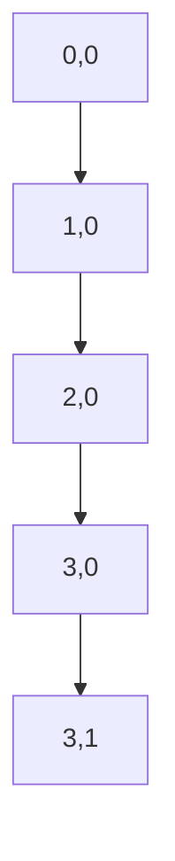

**2. 邻接表（Adjacency List）**

邻接表是一个数组，每个数组元素对应一个节点，元素值是一个链表，存储与该节点相连的所有其他节点。这种方法对于稀疏图非常有效，访问和修改操作较快。

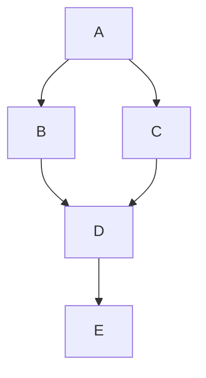

**3. 图数据库（Graph Database）**

图数据库专门用于存储和查询图结构数据。常见的图数据库包括Neo4j、JanusGraph等。这些数据库提供了高效的图遍历和查询功能，并支持复杂的图算法。

**4. 图嵌入（Graph Embedding）**

图嵌入是将图中的节点和边映射到低维空间中，从而便于分析和处理。图嵌入方法包括DeepWalk、Node2Vec等，常用于图表示学习和图分类任务。

#### 1.2.4 图计算的核心概念

在了解了图的基本概念和存储表示方法后，下面介绍图计算中的几个核心概念：

**1. 图遍历（Graph Traversal）**

图遍历是按照一定规则遍历图中的节点和边，以查找特定的路径或信息。常见的图遍历算法包括深度优先搜索（DFS）和广度优先搜索（BFS）。

**2. 图聚类（Graph Clustering）**

图聚类是将图中的节点分组为多个集群，以便识别图中的模式和结构。常见的图聚类算法包括谱聚类（Spectral Clustering）和基于密度的聚类（DBSCAN）。

**3. 图嵌入（Graph Embedding）**

图嵌入是将图中的节点和边映射到低维空间中，以方便进行机器学习和其他数据分析。常见的图嵌入算法包括DeepWalk、Node2Vec和GAE（Graph Autoencoder）。

**4. 图分类（Graph Classification）**

图分类是将图数据分类为不同的类别，以便进行预测和分析。常见的图分类算法包括基于特征的方法（如Laplacian Score）和基于神经网络的方法（如GCN、GAT）。

**5. 图搜索（Graph Search）**

图搜索是在图中查找特定的节点或路径。常见的图搜索算法包括A*搜索和Dijkstra算法。

通过以上介绍，我们可以看到图计算是一个复杂但强大的工具，能够有效地处理大规模关系数据。接下来，我们将进一步探讨图计算的应用领域。### 1.3 图计算的核心概念

在了解了图的基本概念之后，我们将深入探讨图计算中的核心概念，这些概念包括图遍历算法、图聚类、图嵌入与分类。通过详细分析这些核心概念，我们将更好地理解图计算在实际应用中的强大能力。

#### 1.3.1 图遍历算法

图遍历算法是图计算中的基础，用于在图中按特定顺序访问所有节点或找到特定的路径。以下是几种常见的图遍历算法：

**1. 深度优先搜索（DFS）**

深度优先搜索（DFS）是一种无回溯的遍历算法，从起始节点开始，沿着某一方向深入到最远的节点，然后回溯并沿另一方向继续搜索。DFS适合寻找深度较深的路径，常用于拓扑排序和求解连通性问题。

**DFS算法原理**：

- 选择一个起始节点，将其标记为已访问。
- 从起始节点开始，访问其所有未访问的邻接节点。
- 对于每个邻接节点，重复上述步骤，直到所有节点都被访问。

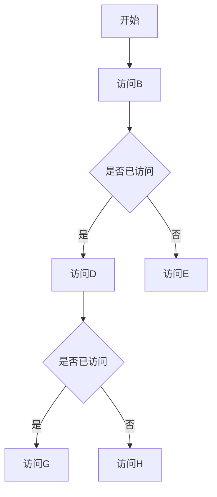

**2. 广度优先搜索（BFS）**

广度优先搜索（BFS）与DFS不同，它首先访问起始节点的所有邻接节点，然后再逐层访问更远的节点。BFS适合寻找最短路径和广度较广的路径。

**BFS算法原理**：

- 选择一个起始节点，将其标记为已访问。
- 使用一个队列存储未访问的邻接节点。
- 依次从队列中取出节点，访问其所有未访问的邻接节点，并标记为已访问。
- 对于每个邻接节点，如果未访问，则将其加入队列。

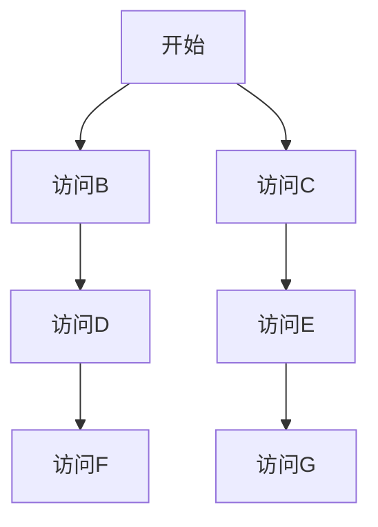

**3. Dijkstra算法**

Dijkstra算法是一种用于寻找图中单源最短路径的算法。该算法基于贪心策略，每次选择未访问的节点中距离源点最近的节点进行扩展。

**Dijkstra算法原理**：

- 初始化所有节点的距离为无穷大，源节点的距离为0。
- 将源节点加入已访问集合，其余节点加入未访问集合。
- 对于未访问集合中的每个节点，计算其到源节点的距离，并更新距离表。
- 选择距离最小的未访问节点，将其加入已访问集合。
- 重复上述步骤，直到所有节点都被访问。

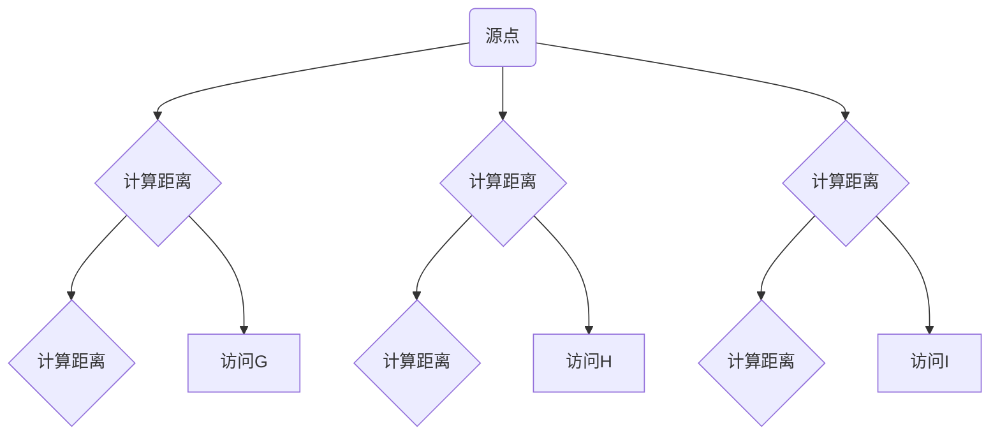

#### 1.3.2 图聚类

图聚类是将图中的节点分组为多个集群，以识别图中的模式和结构。聚类算法可以帮助我们理解图的局部结构和全局结构，从而在多个领域（如社交网络分析、生物信息学等）中发挥重要作用。

**1. 谱聚类（Spectral Clustering）**

谱聚类是一种基于图拉普拉斯矩阵的聚类算法。该算法利用图中的节点相似性矩阵构建特征向量，然后在高维空间中进行聚类。

**谱聚类算法原理**：

- 构建相似性矩阵和拉普拉斯矩阵。
- 计算特征向量。
- 在特征空间中进行聚类。

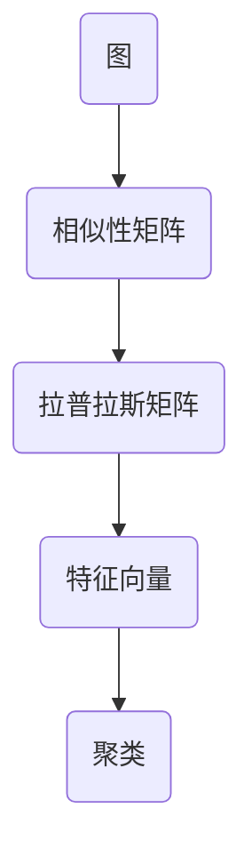

**2. 基于密度的聚类（DBSCAN）**

DBSCAN是一种基于密度的聚类算法，它可以根据节点之间的密度和连接性进行聚类。DBSCAN能够发现任意形状的聚类，不受初始种子点的影响。

**DBSCAN算法原理**：

- 选择一个起始点，将其标记为已访问。
- 计算起始点周围的邻域。
- 如果邻域内的节点数量大于阈值，则将整个邻域内的节点划分为一个聚类。
- 对于每个未访问的节点，重复上述步骤。

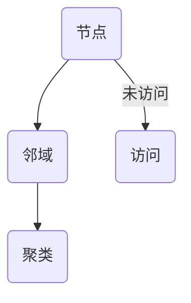

#### 1.3.3 图嵌入与分类

图嵌入是将图中的节点和边映射到低维空间中，以方便进行机器学习和其他数据分析。图嵌入技术已被广泛应用于图分类、推荐系统、网络可视化等领域。

**1. DeepWalk**

DeepWalk是一种基于随机游走和神经网络嵌入的图嵌入技术。DeepWalk通过生成大量的随机游走路径，并使用神经网络模型学习节点的嵌入向量。

**DeepWalk算法原理**：

- 生成随机游走路径。
- 使用 Skip-Gram 模型训练嵌入向量。

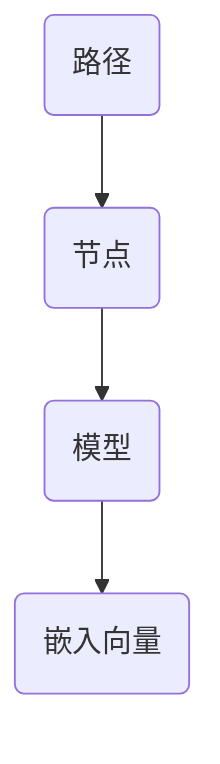

**2. Node2Vec**

Node2Vec 是 DeepWalk 的扩展，它通过调节游走过程中的偏好概率，可以控制嵌入向量在保持图结构信息的同时，增强节点相似性。

**Node2Vec算法原理**：

- 调整游走过程中的概率分布。
- 使用基于随机游走的神经网络模型训练嵌入向量。

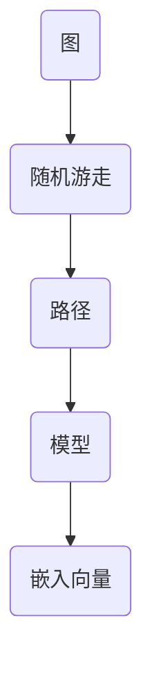

**3. 图分类**

图分类是将图数据分类为不同的类别，以便进行预测和分析。常见的图分类算法包括基于特征的方法（如Laplacian Score）和基于神经网络的方法（如GCN、GAT）。

**Laplacian Score算法原理**：

- 计算图拉普拉斯矩阵。
- 对于每个节点，计算其Laplacian Score作为分类特征。

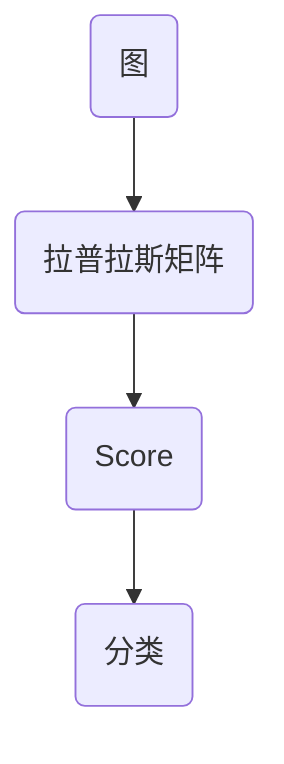

**GCN（Graph Convolutional Network）算法原理**：

- 定义图卷积操作。
- 通过多层图卷积学习节点的嵌入向量。
- 使用嵌入向量进行分类。

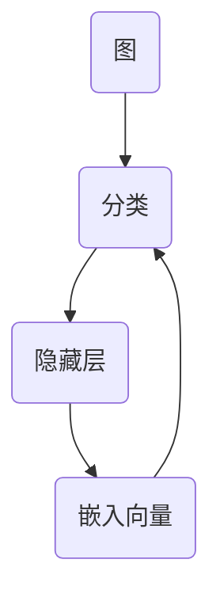

通过以上对图遍历算法、图聚类和图嵌入与分类的详细分析，我们可以看到图计算在处理大规模关系数据中的强大能力。这些核心概念为图计算在多个领域中的应用提供了理论基础和实践方法，使得企业能够更加高效地管理和分析复杂的关系数据。接下来，我们将探讨图计算在不同应用领域中的具体应用。### 1.4 图计算的应用领域

图计算作为一种高效处理大规模关系数据的技术，已经在多个领域展现了其强大的应用潜力。以下将介绍图计算在社交网络分析、语义网络构建、供应链优化等领域的应用，并通过实际案例说明图计算如何在这些领域发挥关键作用。

#### 1.4.1 社交网络分析

社交网络分析是图计算的重要应用领域之一。通过分析用户之间的交互关系，企业可以更好地了解用户行为，优化产品推荐、营销策略和用户关系管理。

**案例：Facebook 的社交图分析**

Facebook 是一个拥有数十亿用户的社交网络平台，其中包含着复杂的人际关系图。Facebook 利用图计算技术对社交网络进行分析，以优化用户体验和广告投放。

- **用户推荐**：通过分析用户之间的朋友关系和兴趣标签，Facebook 可以向用户推荐可能感兴趣的内容和朋友。
- **广告投放**：图计算帮助 Facebook 分析用户的社交关系网络，识别出潜在的目标用户群体，从而提高广告投放的精准度和效果。
- **社交影响力分析**：图计算可以识别出社交网络中的关键节点（如意见领袖），帮助企业了解社交传播的动态，优化品牌传播策略。

#### 1.4.2 语义网络构建

语义网络构建是图计算在人工智能和知识图谱领域的应用。通过将实体和概念之间的关系表示为图，企业可以构建出结构化的知识库，用于智能搜索、自然语言处理和智能推荐。

**案例：Google 的知识图谱**

Google 利用图计算技术构建了其知识图谱，该图谱包含大量实体和概念，以及它们之间的关系。通过知识图谱，Google 可以提供更加智能和精准的搜索结果。

- **智能搜索**：图计算帮助 Google 分析搜索查询与实体之间的关联关系，从而提供更加准确的搜索结果。
- **语义分析**：图计算用于自然语言处理任务，如实体识别、关系抽取和语义角色标注，从而提高自然语言理解的能力。
- **推荐系统**：通过分析用户与实体之间的关系，Google 的推荐系统可以提供更加个性化的内容推荐。

#### 1.4.3 供应链优化

供应链优化是图计算在物流和供应链管理领域的应用。通过分析供应链中的各种关系和环节，企业可以优化库存管理、运输路线和资源分配，从而提高供应链的效率和灵活性。

**案例：沃尔玛的供应链优化**

沃尔玛是一个全球领先的零售企业，其供应链网络复杂且庞大。沃尔玛利用图计算技术对供应链进行分析和优化，以提高物流效率和降低成本。

- **库存管理**：通过分析供应链中的库存数据，图计算帮助沃尔玛优化库存水平，减少库存积压和缺货情况。
- **运输路线优化**：图计算可以分析供应链中的运输网络，优化运输路线，减少运输时间和成本。
- **资源分配**：通过分析供应链中的资源使用情况，图计算帮助沃尔玛优化资源分配，提高资源利用率。

#### 1.4.4 其他应用领域

除了上述领域，图计算还在金融、医疗、生物信息等多个领域得到了广泛应用。

- **金融领域**：图计算可以用于欺诈检测、风险评估和社交网络分析，帮助金融机构提高风险控制和业务效率。
- **医疗领域**：图计算可以用于疾病预测、患者关系管理和药物研发，提高医疗服务的质量和效率。
- **生物信息学领域**：图计算可以用于基因组分析、蛋白质相互作用网络研究和药物设计，为生物科学研究提供强有力的支持。

通过以上介绍，我们可以看到图计算在多个领域中的应用场景和实际案例。图计算技术不仅能够高效地处理大规模关系数据，还能够为不同领域的业务提供智能分析和决策支持。随着图计算技术的不断发展和应用领域的拓展，图计算在未来将会发挥越来越重要的作用。### 1.5 本章小结

在本章中，我们详细介绍了图计算的基本概念、核心概念及其在各个领域的应用。首先，我们探讨了大规模关系数据处理的挑战，以及图计算在处理这些挑战中的优势。接下来，我们介绍了图的基本概念，包括节点、边的定义及其属性，以及图的存储与表示方法。随后，我们深入分析了图计算的核心概念，如图遍历算法、图聚类和图嵌入与分类。通过具体的算法原理讲解和流程图展示，我们更好地理解了这些算法的实现和应用。

在应用领域部分，我们通过实际案例展示了图计算在社交网络分析、语义网络构建、供应链优化等领域的应用，强调了图计算在提高业务效率和决策支持方面的作用。此外，我们还提到了图计算在金融、医疗、生物信息等其他领域的潜力。

总结而言，本章内容为后续章节奠定了理论基础，提供了对图计算技术全面了解的起点。在接下来的章节中，我们将进一步探讨企业级图计算架构设计、大规模关系数据的存储与管理、图算法原理与性能优化，以及企业级图计算项目实战，旨在为企业提供更深入、更实用的图计算实践指导。### 2.1 开源图计算框架

在处理大规模关系数据时，开源图计算框架提供了强大的工具和丰富的功能，使得开发者可以更加高效地执行各种图计算任务。以下将介绍几种流行的开源图计算框架：Apache Giraph、Apache Flink Gelly 和 GraphX。

#### 2.1.1 Apache Giraph

Apache Giraph 是一个基于 Hadoop 的分布式图处理框架，主要用于处理大规模图数据。Giraph 利用了 Hadoop 的分布式文件系统（HDFS）和 MapReduce 模型，从而能够在大规模集群上高效地执行图计算任务。

**特点**：

- **支持有向图和无向图**：Giraph 能够处理不同类型的图，包括有向图和无向图。
- **分布式计算**：通过 MapReduce 模型，Giraph 能够在分布式系统中并行处理图数据。
- **丰富的算法库**：Giraph 提供了丰富的算法库，包括图遍历、图聚类和社交网络分析等。

**应用场景**：

- **社交网络分析**：Giraph 可以用于分析社交网络中的用户关系，发现社交圈子、意见领袖等。
- **推荐系统**：利用 Giraph 可以实现基于图的推荐算法，提高推荐系统的准确性和效率。

**示例**：

```java
public class GiraphExample {
    public static void main(String[] args) {
        // 初始化 Giraph 环境和配置
        Configuration conf = new Configuration();
        GraphLoader<String, String, String> loader = new GraphLoader<>(conf);
        Graph<String, String, String> graph = loader.loadGraph("path/to/graph.txt", "path/to/vertices.txt", "path/to/edges.txt");
        
        // 执行图遍历算法
        GraphAlgorithm<String, String, String> algorithm = new BreadthFirstSearch<String, String, String>();
        algorithm.run(graph);
    }
}
```

#### 2.1.2 Apache Flink Gelly

Apache Flink Gelly 是基于 Apache Flink 的分布式图处理框架，它提供了高效的图算法和丰富的图操作接口。Gelly 利用了 Flink 的流处理和批处理能力，从而可以在大规模分布式系统中高效地执行图计算任务。

**特点**：

- **流处理与批处理**：Gelly 同时支持流处理和批处理，可以灵活应对不同类型的数据处理需求。
- **高性能**：通过优化内存管理和计算模型，Gelly 提供了高性能的图处理能力。
- **易用性**：Gelly 提供了简单的接口和丰富的算法库，使得开发者可以轻松实现各种图计算任务。

**应用场景**：

- **实时数据处理**：Gelly 可以用于实时分析社交网络、金融交易等流数据。
- **复杂网络分析**：利用 Gelly 可以实现复杂的网络分析任务，如图聚类、社交影响力分析等。

**示例**：

```java
public class FlinkGellyExample {
    public static void main(String[] args) {
        // 初始化 Flink 和 Gelly 环境和配置
        final StreamExecutionEnvironment env = StreamExecutionEnvironment.getExecutionEnvironment();
        Graph<String, String, Double> graph = Graph.fromDataSet vertices, edges;
        
        // 执行图聚类算法
        GraphAlgorithm<String, String, Double> algorithm = new LouvainCommunityDetection();
        algorithm.run(graph);
        
        // 输出结果
        algorithm.getCommunityVertexIds().writeAsCsv("path/to/output.csv").setParallelism(1);
        env.execute("Flink Gelly Example");
    }
}
```

#### 2.1.3 GraphX

GraphX 是基于 Apache Spark 的分布式图处理框架，它提供了丰富的图操作接口和高效的图算法库。GraphX 的设计理念是将图处理和计算图论算法结合起来，从而提供一种强大且灵活的图处理工具。

**特点**：

- **集成性**：GraphX 与 Spark 的其他组件（如 SQL、DataFrame、RDD）紧密集成，使得开发者可以方便地结合图计算和大数据处理。
- **动态图处理**：GraphX 支持动态图处理，可以实时更新图结构和数据。
- **高性能**：通过优化内存管理和计算模型，GraphX 提供了高性能的图处理能力。

**应用场景**：

- **大数据分析**：GraphX 可以用于大规模数据集的图分析和挖掘，如社交网络分析、推荐系统等。
- **实时图处理**：利用 GraphX 的动态图处理能力，可以实时处理和分析流数据。

**示例**：

```scala
import org.apache.spark.graphx._

val graph = GraphLoader.edgeListFile(sc, "path/to/edges.txt", 3)
  .mapVertices((id, attr) => (if (id < 3) 1 else 0))

// 执行 PageRank 算法
val ranks = graph.pageRank(0.0001)

// 输出结果
ranks.vertices.saveAsTextFile("path/to/output.txt")
```

通过以上介绍，我们可以看到 Apache Giraph、Apache Flink Gelly 和 GraphX 这三种开源图计算框架各自的特点和应用场景。开发者可以根据具体需求和项目需求选择合适的框架，以实现高效、灵活的图计算任务。接下来，我们将介绍商业图计算平台，进一步探讨图计算工具的选择。### 2.2 商业图计算平台

在处理大规模关系数据时，商业图计算平台提供了强大的功能和专业支持，使得企业能够更加高效地进行图计算任务。以下将介绍几种流行的商业图计算平台：Neo4j、JanusGraph 和 Amazon Neptune。

#### 2.2.1 Neo4j

Neo4j 是一款流行的图数据库，由 Neo Technology 开发。Neo4j 以图模型为基础，提供了高效的图存储和查询功能，适用于各种图计算任务。

**特点**：

- **高效的图存储和查询**：Neo4j 使用了高效的图存储结构，能够快速执行图查询。
- **支持多种图算法**：Neo4j 提供了丰富的图算法库，包括图遍历、图聚类和社交网络分析等。
- **易用性**：Neo4j 提供了图形界面和丰富的 API，使得开发者可以轻松创建和管理图数据。

**应用场景**：

- **社交网络分析**：Neo4j 可以用于分析社交网络中的用户关系和互动，识别社交圈子、意见领袖等。
- **知识图谱构建**：Neo4j 可以用于构建知识图谱，支持语义分析和智能搜索。
- **推荐系统**：利用 Neo4j 可以实现基于图的推荐算法，提高推荐系统的准确性和效率。

**示例**：

```java
// 创建 Neo4j 客户端
GraphDatabaseFactory dbFactory = new GraphDatabaseFactory();
try (GraphDatabase graphDb = dbFactory.newEmbeddedDatabase(new File("path/to/neo4j.db"))) {
    GraphDatabaseService graphDbService = graphDb;
    
    // 创建图
    Graph graph = graphDbService.beginTransaction();
    
    // 添加节点和边
    Node user1 = graph.createNode(Label.label("User"), Property.map("name", "Alice"));
    Node user2 = graph.createNode(Label.label("User"), Property.map("name", "Bob"));
    user1.createRelationshipTo(user2, RelationshipType.withName("FRIENDS"));
    
    // 执行图查询
    Result result = graph.execute("MATCH (n)-[:FRIENDS]->(m) RETURN n, m");
    
    // 输出查询结果
    for (Record record : result) {
        Node userNode = record.get("n").as(Node.class);
        Node friendNode = record.get("m").as(Node.class);
        System.out.println(userNode.getProperty("name") + " is friends with " + friendNode.getProperty("name"));
    }
    
    // 提交事务
    graphDbService.commitTransaction(graph);
}
```

#### 2.2.2 JanusGraph

JanusGraph 是一款开源的分布式图数据库，由 Apache 软件基金会维护。JanusGraph 支持多种存储后端，如 Apache Cassandra、Apache HBase 和 Amazon DynamoDB，适用于大规模分布式系统的图计算任务。

**特点**：

- **分布式存储**：JanusGraph 支持分布式存储，能够处理大规模图数据。
- **多模型支持**：JanusGraph 支持多模型数据存储，包括图模型、文档模型和键值模型。
- **可扩展性**：JanusGraph 具有良好的可扩展性，可以灵活地部署在分布式环境中。

**应用场景**：

- **大规模数据存储**：JanusGraph 适用于需要存储和处理大规模数据的场景，如社交网络、物联网和金融分析。
- **实时图分析**：利用 JanusGraph 的分布式计算能力，可以实现实时图分析和处理。
- **复杂关系管理**：JanusGraph 可以处理复杂的关系网络，支持多种数据模型和查询方式。

**示例**：

```java
// 创建 JanusGraph 客户端
GraphFactory gf = new GraphFactory();
GraphConfiguration conf = gf.newConfiguration();
conf.set("storage.backend", "cassandra");
conf.set("cassandra.connection.host", "localhost");
conf.set("keyspace", "janusgraph_keyspace");

try (Graph graph = gf.buildGraph(conf)) {
    // 添加节点和边
    GraphTraversal graphTraversal = graph.traversal();
    Vertex user1 = graphTraversal.addVertex(T.label, "User", "name", "Alice");
    Vertex user2 = graphTraversal.addVertex(T.label, "User", "name", "Bob");
    user1.addEdge("FRIENDS", user2);
    
    // 执行图查询
    Vertex user1Result = graphTraversal.V().has("name", "Alice").as("a").V().outE("FRIENDS").as("b").V().has("name", "Bob").next();
    
    // 输出查询结果
    System.out.println(user1Result.property("name").value());
}
```

#### 2.2.3 Amazon Neptune

Amazon Neptune 是一款托管式的图数据库服务，由 Amazon Web Services（AWS）提供。Neptune 支持多种图模型和图算法，适用于大规模、高并发的图计算任务。

**特点**：

- **高性能**：Neptune 提供了高性能的图存储和查询能力，适用于大规模、高并发的场景。
- **弹性伸缩**：Neptune 可以根据需求自动伸缩，提供高效的资源利用和成本管理。
- **安全性**：Neptune 提供了多种数据安全机制，如加密、访问控制等，确保数据安全。

**应用场景**：

- **实时图分析**：Neptune 可以用于实时分析社交网络、金融交易等流数据。
- **推荐系统**：利用 Neptune 的图计算能力，可以实现基于图的推荐算法。
- **复杂关系管理**：Neptune 支持复杂的关系网络，适用于各种复杂关系数据的存储和分析。

**示例**：

```java
// 创建 Amazon Neptune 客户端
AmazonNeptune client = AmazonNeptuneClientBuilder.standard().build();
CreateGraphRequest createGraphRequest = new CreateGraphRequest().withGraphName("myGraph");
client.createGraph(createGraphRequest);

// 添加节点和边
PutGraphRequest putGraphRequest = new PutGraphRequest().withGraphName("myGraph").withVertices(Arrays.asList(
    new Vertex().withId("1").withLabel("User").withProperties(new Property("name", "Alice")),
    new Vertex().withId("2").withLabel("User").withProperties(new Property("name", "Bob"))
));
client.putGraph(putGraphRequest);

// 添加边
AddEdgeRequest addEdgeRequest = new AddEdgeRequest().withGraphName("myGraph").withEdge(
    new Edge().withId("e1").withFromVertex("1").withToVertex("2").withLabel("FRIENDS")
);
client.addEdge(addEdgeRequest);

// 执行图查询
ExecuteGraphQueryRequest executeGraphQueryRequest = new ExecuteGraphQueryRequest()
    .withGraphName("myGraph")
    .withQuery("MATCH (n)-[:FRIENDS]->(m) RETURN n, m");
ExecuteGraphQueryResponse executeGraphQueryResponse = client.executeGraphQuery(executeGraphQueryRequest);

// 输出查询结果
List<Result> results = executeGraphQueryResponse.getResults();
for (Result result : results) {
    List<Property> properties = result.getProperties();
    System.out.println("User: " + properties.get(0).getValue() + ", Friend: " + properties.get(1).getValue());
}
```

通过以上介绍，我们可以看到 Neo4j、JanusGraph 和 Amazon Neptune 这三种商业图计算平台各自的特点和应用场景。开发者可以根据具体需求和项目需求选择合适的平台，以实现高效、灵活的图计算任务。接下来，我们将探讨如何根据应用需求、性能要求和数据规模选择合适的图计算工具。### 2.3 图计算工具选择指南

在图计算项目中，选择合适的图计算工具至关重要。不同的工具在性能、易用性和功能上有所差异，因此需要根据具体的应用需求、性能要求和数据规模进行选择。以下是一些实用的指南，帮助开发者做出明智的决策。

#### 根据应用需求选择

应用需求是选择图计算工具的关键因素。不同应用场景对图计算的需求各不相同，以下是一些常见的应用需求及其对应工具：

**1. 社交网络分析**

- **Neo4j**：适用于中小规模社交网络分析，具有高效的图存储和查询能力。
- **JanusGraph**：适用于大规模社交网络分析，支持分布式存储，适用于复杂关系网络。
- **Amazon Neptune**：适用于高并发、大规模社交网络分析，具有高性能和弹性伸缩能力。

**2. 语义网络构建**

- **Neo4j**：适用于构建中小规模知识图谱，具有丰富的图算法库和易用性。
- **JanusGraph**：适用于大规模知识图谱构建，支持多种存储后端，具有高度可扩展性。
- **Amazon Neptune**：适用于构建大规模、实时知识图谱，具有高性能和自动化管理。

**3. 供应链优化**

- **Neo4j**：适用于中小规模供应链优化，能够快速处理复杂关系网络。
- **JanusGraph**：适用于大规模供应链优化，支持分布式存储，适合复杂供应链网络。
- **Amazon Neptune**：适用于高并发、大规模供应链优化，具有高性能和弹性伸缩能力。

#### 根据性能要求选择

性能要求是选择图计算工具的重要考虑因素。不同工具在查询性能、计算速度和扩展能力上有所差异，以下是一些常见的性能要求及其对应工具：

**1. 查询性能**

- **Neo4j**：适用于查询密集型应用，具有高效的图查询能力。
- **JanusGraph**：适用于查询密集型应用，支持分布式查询，提高查询性能。
- **Amazon Neptune**：适用于高并发查询应用，具有高性能、低延迟的查询能力。

**2. 计算速度**

- **Apache Giraph**：适用于需要高性能计算的大规模图处理任务。
- **Apache Flink Gelly**：适用于需要高性能计算和实时处理的图计算任务。
- **GraphX**：适用于需要高性能计算和大数据处理的应用。

**3. 扩展能力**

- **Neo4j**：适用于需要高度可扩展的应用，支持水平扩展。
- **JanusGraph**：适用于需要高度可扩展的应用，支持分布式存储和水平扩展。
- **Amazon Neptune**：适用于需要高度可扩展的应用，具有自动伸缩和资源管理能力。

#### 根据数据规模选择

数据规模是选择图计算工具的重要参考。不同工具在处理大规模数据时性能和稳定性有所不同，以下是一些常见的数据规模及其对应工具：

**1. 小规模数据（TB 级）**

- **Neo4j**：适用于小规模数据，具有高效的图存储和查询能力。
- **JanusGraph**：适用于小规模数据，支持分布式存储，适合复杂关系网络。

**2. 中规模数据（PB 级）**

- **JanusGraph**：适用于中规模数据，支持分布式存储和水平扩展。
- **Amazon Neptune**：适用于中规模数据，具有高性能和弹性伸缩能力。

**3. 大规模数据（EB 级）**

- **JanusGraph**：适用于大规模数据，支持分布式存储和水平扩展。
- **Amazon Neptune**：适用于大规模数据，具有高性能和自动化管理能力。

#### 综合考虑

在选择图计算工具时，需要综合考虑应用需求、性能要求和数据规模等因素。以下是一个简单的选择流程：

1. **明确应用需求**：确定图计算任务的应用场景和需求。
2. **评估性能要求**：评估图计算任务的查询性能、计算速度和扩展能力。
3. **分析数据规模**：分析图数据的大小和增长趋势。
4. **选择工具**：根据以上分析结果，选择适合的图计算工具。

通过以上步骤，开发者可以做出更为明智和合理的图计算工具选择，以确保项目的高效、稳定和可持续发展。### 2.4 本章小结

在本章中，我们详细介绍了开源图计算框架和商业图计算平台的特点、应用场景及选择指南。首先，我们介绍了 Apache Giraph、Apache Flink Gelly 和 GraphX 三种开源图计算框架，分析了它们在分布式计算、图算法库和易用性方面的优势。随后，我们介绍了 Neo4j、JanusGraph 和 Amazon Neptune 三种商业图计算平台，阐述了它们在图存储和查询、性能和扩展性方面的特点。

接着，我们提供了一些实用的图计算工具选择指南，帮助开发者根据应用需求、性能要求和数据规模选择合适的工具。通过这些指南，开发者可以更好地理解不同工具的优势和适用场景，从而做出更为明智的选择。

总结而言，本章内容为图计算工具的选择提供了全面的指导，使得开发者能够根据具体项目需求，选择最适合的图计算框架或平台。在接下来的章节中，我们将进一步探讨企业级图计算架构设计，为实际项目的实施提供深入指导。### 3.1 企业级图计算架构设计原则

企业级图计算架构设计是确保系统高效、可靠、可扩展的关键。以下将介绍企业级图计算架构设计的主要原则，包括可扩展性、高可用性和数据一致性。

#### 3.1.1 可扩展性

可扩展性是企业级图计算架构设计的重要原则之一。随着数据规模的不断扩大，系统需要能够水平扩展，以应对不断增加的负载。以下是一些实现可扩展性的关键策略：

**1. 水平扩展**

水平扩展（Scaling Out）通过增加更多节点来提升系统性能。在图计算中，可以通过分布式计算和分片（Sharding）技术实现水平扩展。

- **分布式计算**：分布式计算将图计算任务分解为多个子任务，分别在不同的节点上执行，从而充分利用系统资源。
- **分片技术**：分片技术将大规模图分解为多个较小的子图，每个子图可以独立处理，从而提高系统的整体性能。

**2. 负载均衡**

负载均衡（Load Balancing）是实现水平扩展的关键技术，用于将计算任务均匀分配到不同节点上，避免单个节点过载。

- **轮询调度**：轮询调度将请求依次分配到各个节点。
- **最小连接数调度**：最小连接数调度将请求分配到连接数最少的节点，以减少系统的响应时间。

**3. 自动扩展**

自动扩展（Auto Scaling）可以根据系统负载自动调整节点数量，确保系统在高负载时具有足够的计算能力。自动扩展通常通过云服务提供商的自动扩展功能实现。

#### 3.1.2 高可用性

高可用性（High Availability，简称 HA）是企业级图计算架构设计的关键目标之一，旨在确保系统在遇到故障时能够快速恢复，从而保证业务的连续性。以下是一些实现高可用性的关键策略：

**1. 数据冗余**

数据冗余（Data Redundancy）通过在多个节点上存储相同的数据副本，确保在节点故障时数据不会丢失。

- **副本存储**：副本存储在多个节点上，可以防止单个节点故障导致数据丢失。
- **分布式存储**：分布式存储系统如 HDFS、Cassandra 等提供了数据冗余和自动故障转移功能。

**2. 故障转移**

故障转移（Fault Tolerance）通过在系统故障时自动切换到备用节点，确保系统持续运行。

- **主从架构**：主从架构中，主节点负责处理业务请求，从节点在主节点故障时自动成为主节点。
- **多主架构**：多主架构中，多个节点同时处理业务请求，当一个节点故障时，其他节点可以继续提供服务。

**3. 备份与恢复**

备份与恢复（Backup and Recovery）是确保数据完整性和系统稳定性的关键措施。

- **定期备份**：定期备份可以将数据备份到外部存储，如云存储或磁带库。
- **快速恢复**：快速恢复技术可以在故障发生后快速恢复系统，减少业务中断时间。

#### 3.1.3 数据一致性

数据一致性（Data Consistency）是企业级图计算架构设计的关键原则之一，确保系统中所有数据副本处于一致状态。以下是一些实现数据一致性的关键策略：

**1. 强一致性**

强一致性（Strong Consistency）要求所有节点在任何时候都能访问到最新的数据，即使在多个节点同时更新数据时也不例外。

- **两阶段提交（2PC）**：两阶段提交是一种分布式事务协议，用于确保数据一致性和原子性。
- **多版本并发控制（MVCC）**：多版本并发控制通过维护数据的多个版本，确保在并发更新时不会丢失任何操作。

**2. 最终一致性**

最终一致性（Eventual Consistency）允许系统在短时间内出现不一致状态，但最终会达到一致状态。

- **Gossip 协议**：Gossip 协议通过周期性地交换信息，确保系统最终达到一致性。
- **事件溯源**：事件溯源通过记录所有数据变更的事件，确保系统可以恢复到一致性状态。

**3. 读-写分离**

读-写分离（Read-Write Separation）通过将读操作和写操作分离到不同节点上，提高系统的并发能力和数据一致性。

- **主从复制**：主从复制中，主节点负责写操作，从节点负责读操作，从而提高系统性能和数据一致性。

通过以上设计原则，企业级图计算架构能够实现高效、可靠和可扩展的系统，从而满足大规模关系数据处理的挑战。在接下来的章节中，我们将通过具体案例分析，进一步探讨企业级图计算架构设计的实际应用。### 3.2 架构设计案例分析

在了解了企业级图计算架构设计原则之后，以下通过两个具体案例，详细分析企业级图计算架构设计的实际应用。

#### 3.2.1 案例一：社交网络分析架构设计

**背景**：

一家社交网络公司需要实时分析用户之间的互动和关系，以优化用户体验、推荐系统和广告投放策略。社交网络数据规模巨大，且不断增长，要求系统具备高效、可靠和可扩展的能力。

**架构设计**：

1. **分布式计算架构**

   - **计算节点**：采用分布式计算架构，将图计算任务分配到多个计算节点上，利用节点的并行计算能力提高系统性能。
   - **分片技术**：将社交网络图分片，每个分片包含一部分用户和关系，独立处理，从而提高系统的扩展性和负载均衡能力。

2. **数据存储与备份**

   - **Neo4j 分布式集群**：采用 Neo4j 分布式集群，存储社交网络数据。Neo4j 支持分布式存储，确保数据的一致性和可靠性。
   - **数据备份**：定期备份数据到外部存储，如 Amazon S3，确保数据的安全性和可恢复性。

3. **高可用性设计**

   - **主从复制**：主从复制架构，主节点负责写操作，从节点负责读操作。当一个主节点故障时，从节点可以自动切换为主节点，确保系统持续运行。
   - **故障转移**：配置故障转移机制，当主节点故障时，自动切换到备用主节点，确保系统的可用性。

4. **实时数据处理**

   - **Apache Kafka**：采用 Apache Kafka 实时收集用户互动数据，并将数据写入 Neo4j。Kafka 提供了高效、可靠的消息队列服务，确保数据及时处理和传输。
   - **流计算框架**：采用 Apache Flink 进行实时数据处理，处理来自 Kafka 的消息，更新社交网络图，并触发相应的推荐和广告策略。

**架构图**：

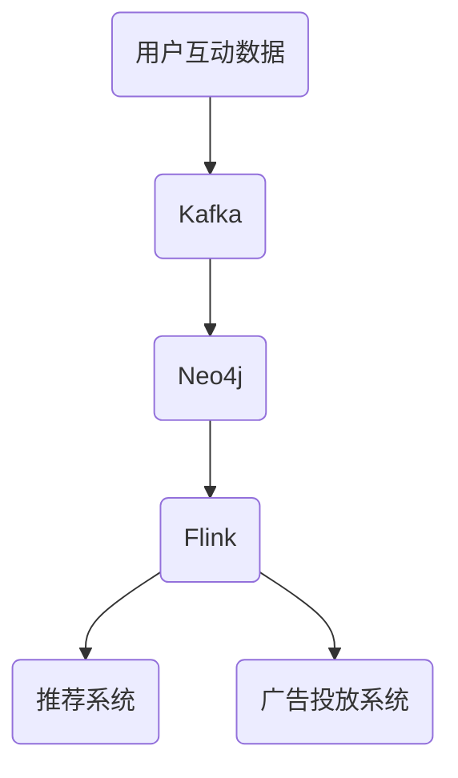

**性能优化**：

- **负载均衡**：采用轮询调度策略，将用户请求均匀分配到不同计算节点。
- **缓存机制**：在关键节点（如 Neo4j 和 Flink）之间引入缓存，减少数据访问延迟。

#### 3.2.2 案例二：供应链优化架构设计

**背景**：

一家全球零售企业需要优化供应链管理，以提高物流效率、降低库存成本和提升客户满意度。供应链数据规模庞大，包含供应商、制造商、仓库、运输公司和客户等多方信息，要求系统具备高效、可靠和可扩展的能力。

**架构设计**：

1. **分布式计算架构**

   - **计算节点**：采用分布式计算架构，将供应链数据分片，每个分片包含一部分供应链节点和关系，独立处理。
   - **负载均衡**：采用最小连接数调度策略，将供应链计算任务分配到不同计算节点，确保负载均衡。

2. **数据存储与管理**

   - **JanusGraph 分布式集群**：采用 JanusGraph 分布式集群，存储和管理供应链数据。JanusGraph 支持分布式存储，具有高性能和数据一致性。
   - **数据备份与恢复**：定期备份供应链数据，确保数据的安全性和可恢复性。

3. **高可用性设计**

   - **多主架构**：采用多主架构，多个节点同时处理供应链数据，当一个节点故障时，其他节点可以继续提供服务。
   - **故障转移**：配置故障转移机制，当节点故障时，自动切换到备用节点，确保系统可用性。

4. **实时数据处理**

   - **Apache Kafka**：采用 Apache Kafka 实时收集供应链数据，并将数据写入 JanusGraph。Kafka 提供了高效、可靠的消息队列服务。
   - **流计算框架**：采用 Apache Spark 进行实时数据处理，处理来自 Kafka 的供应链数据，进行数据清洗、转换和存储。

**架构图**：

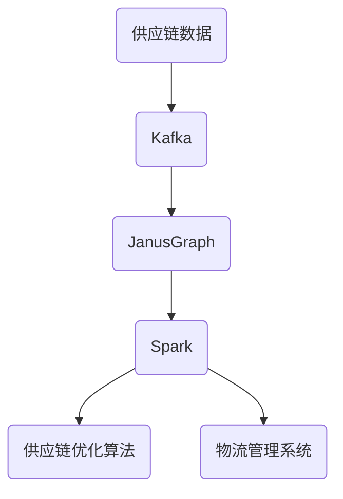

**性能优化**：

- **数据压缩**：对供应链数据进行压缩，减少存储空间和传输带宽。
- **缓存机制**：在关键节点之间引入缓存，提高数据处理速度。

通过以上两个案例，我们可以看到企业级图计算架构设计在实际应用中的关键作用。在社交网络分析案例中，系统通过分布式计算、实时数据处理和高可用性设计，实现了高效、可靠的社交网络分析。在供应链优化案例中，系统通过分布式计算、数据存储与管理和实时数据处理，实现了供应链的高效优化。这些案例为我们提供了宝贵的参考，有助于我们更好地设计企业级图计算架构。### 3.3 图计算性能优化

在实现企业级图计算架构时，性能优化是一个至关重要的环节。以下将介绍图计算性能优化的主要方法，包括系统性能评估方法、性能优化策略以及性能监控与调优。

#### 3.3.1 系统性能评估方法

**1. 基准测试**

基准测试（Benchmark Testing）是一种常用的性能评估方法，通过模拟实际负载，评估系统在不同场景下的性能表现。基准测试可以采用以下步骤：

- **定义测试场景**：根据实际应用场景，定义测试用例和负载模式。
- **执行测试**：使用测试工具（如 Apache JMeter、Gatling）模拟用户请求，收集系统性能数据。
- **分析结果**：分析测试结果，包括响应时间、吞吐量、并发连接数等指标。

**2. 性能监控**

性能监控（Performance Monitoring）是通过实时监控系统性能，及时发现性能瓶颈和异常。常见的性能监控工具包括：

- **Prometheus**：开源监控工具，用于收集系统性能数据，并提供可视化报表。
- **Grafana**：开源仪表盘工具，用于可视化 Prometheus 收集的性能数据。

**3. 容量规划**

容量规划（Capacity Planning）是根据业务增长趋势和性能需求，提前规划系统资源。通过容量规划，可以确保系统在面临峰值负载时依然能够稳定运行。

#### 3.3.2 性能优化策略

**1. 数据分片**

数据分片（Data Sharding）是将大规模数据拆分为多个较小的数据集，分布在多个节点上，从而提高系统的扩展性和查询效率。以下是一些数据分片策略：

- **水平分片**：根据数据特性（如用户ID、地理位置等），将数据划分为多个水平分片，每个分片包含一部分数据。
- **垂直分片**：根据数据关系（如实体属性、关系类型等），将数据划分为多个垂直分片，每个分片包含一部分实体或关系。

**2. 缓存机制**

缓存机制（Caching）通过将热点数据存储在内存中，减少磁盘IO和远程调用的次数，从而提高系统性能。以下是一些常见的缓存策略：

- **本地缓存**：在应用程序层面实现本地缓存，减少对后端存储的访问。
- **分布式缓存**：使用分布式缓存系统（如 Redis、Memcached），提供高性能、高可靠性的缓存服务。
- **缓存一致性**：确保缓存数据与后端存储保持一致，避免数据不一致问题。

**3. 并行计算与分布式计算**

并行计算与分布式计算（Parallel and Distributed Computing）通过将计算任务分解为多个子任务，分别在不同的节点上执行，从而提高系统性能。以下是一些实现策略：

- **任务分解**：将图计算任务分解为多个子任务，每个子任务处理一部分节点和边。
- **负载均衡**：使用负载均衡策略，将子任务分配到不同节点，确保系统资源得到充分利用。

**4. 索引优化**

索引优化（Index Optimization）通过创建适当的索引，提高数据查询效率。以下是一些索引优化策略：

- **创建索引**：在常用查询字段上创建索引，减少查询时间。
- **索引选择**：选择合适的索引类型（如 B-Tree、Hash Index），提高查询性能。
- **索引维护**：定期维护索引，避免索引损坏和数据不一致问题。

#### 3.3.3 性能监控与调优

**1. 性能监控**

性能监控是确保系统性能稳定的重要手段。以下是一些性能监控要点：

- **监控指标**：监控关键性能指标，如 CPU 使用率、内存使用率、磁盘IO、网络流量等。
- **异常检测**：通过异常检测算法，及时发现系统性能异常和潜在故障。
- **告警机制**：配置告警机制，当系统性能指标超过阈值时，及时通知相关人员。

**2. 性能调优**

性能调优是通过调整系统配置和优化算法，提高系统性能。以下是一些性能调优要点：

- **性能测试**：定期进行性能测试，评估系统性能和瓶颈。
- **参数调整**：根据性能测试结果，调整系统配置参数，如内存分配、线程池大小、缓存策略等。
- **算法优化**：优化图计算算法和数据处理流程，提高系统效率。

通过以上性能优化策略，企业级图计算系统可以更好地应对大规模关系数据处理挑战，提供高效、可靠的服务。在接下来的章节中，我们将探讨大规模关系数据的存储与管理技术。### 4.1 关系数据存储技术

大规模关系数据的存储技术是实现高效图计算的关键。以下将介绍几种常用的关系数据存储技术，包括关系数据库、图数据库和 NoSQL 数据库，并分析其优缺点。

#### 4.1.1 关系数据库

关系数据库（Relational Database）是传统的数据存储技术，广泛应用于企业级应用。关系数据库通过表结构、关系和查询语言（如 SQL）来组织和管理数据。以下是一些常见的优点和缺点：

**优点**：

- **成熟稳定**：关系数据库经过多年的发展，已经非常成熟和稳定。
- **丰富的查询功能**：关系数据库提供了强大的查询功能，支持复杂查询和事务处理。
- **数据一致性**：关系数据库通过事务机制和完整性约束，保证了数据的一致性和可靠性。

**缺点**：

- **扩展性受限**：关系数据库在处理大规模数据时，扩展性较差，通常需要通过分库分表、读写分离等方式来提高性能。
- **查询性能瓶颈**：对于复杂的图查询，关系数据库需要进行复杂的Join操作，导致查询性能较低。

#### 4.1.2 图数据库

图数据库（Graph Database）是一种专门用于存储和查询图结构数据的数据库。图数据库通过节点、边和图结构来组织数据，能够高效地处理大规模关系数据。以下是一些常见的优点和缺点：

**优点**：

- **高效的图查询**：图数据库通过图结构索引和图遍历算法，提供了高效的图查询功能。
- **支持复杂关系**：图数据库能够直接存储和处理复杂的图结构，支持多种图算法和复杂关系查询。
- **易于扩展**：图数据库支持分布式存储和计算，能够灵活地扩展存储和处理能力。

**缺点**：

- **学习成本较高**：图数据库的查询语言和操作方式与传统的关系数据库有所不同，需要一定的学习成本。
- **存储空间占用较大**：对于稀疏图结构，图数据库的存储空间占用可能较大。

#### 4.1.3 NoSQL 数据库

NoSQL 数据库（NoSQL Database）是一种非关系型数据库，适用于大规模、高并发的数据存储场景。NoSQL 数据库包括多种类型，如键值存储、文档存储、列族存储和图存储等。以下是一些常见的优点和缺点：

**优点**：

- **高性能**：NoSQL 数据库通常具有高性能的读写能力，适用于高并发场景。
- **易扩展性**：NoSQL 数据库支持水平扩展，能够灵活地处理大规模数据。
- **灵活的数据模型**：NoSQL 数据库支持多种数据模型，能够适应不同的业务需求。

**缺点**：

- **数据一致性**：NoSQL 数据库在数据一致性方面可能存在挑战，例如CAP定理。
- **查询能力有限**：一些类型的 NoSQL 数据库（如键值存储）在查询功能上可能较弱。

#### 4.1.4 存储技术比较

以下是关系数据库、图数据库和 NoSQL 数据库之间的比较：

| 类型         | 优点                                               | 缺点                                             | 适用场景                   |
| ------------ | -------------------------------------------------- | ------------------------------------------------ | -------------------------- |
| 关系数据库   | 成熟稳定、丰富的查询功能、数据一致性                 | 扩展性受限、查询性能瓶颈                         | 企业级应用、事务处理       |
| 图数据库     | 高效的图查询、支持复杂关系、易于扩展                 | 学习成本较高、存储空间占用较大                   | 社交网络、知识图谱、推荐系统 |
| NoSQL 数据库 | 高性能、易扩展性、灵活的数据模型                     | 数据一致性挑战、查询能力有限（部分类型）           | 大规模、高并发场景         |

通过以上分析，我们可以根据具体业务需求和性能要求选择合适的存储技术。关系数据库适用于需要复杂查询和数据一致性的场景，图数据库适用于需要高效处理大规模关系数据和分析复杂关系的场景，NoSQL 数据库适用于需要高性能和高扩展性的场景。在接下来的章节中，我们将进一步探讨数据管理策略。### 4.2 数据管理策略

为了确保大规模关系数据的高效、可靠和可持续的管理，企业需要制定有效的数据管理策略。以下将介绍数据管理策略的几个关键方面，包括数据分片、数据备份与恢复、数据迁移。

#### 4.2.1 数据分片

数据分片（Data Sharding）是将大规模数据集划分为多个较小的数据分片，以便分布式存储和处理。数据分片策略主要包括水平分片和垂直分片。

**1. 水平分片**

水平分片（Horizontal Sharding）通过将数据按某一维度（如用户ID、地理位置等）划分为多个水平分片，每个分片包含一部分数据。水平分片的优势在于能够提高查询效率和扩展性，便于分布式计算。

- **优点**：

  - **查询效率**：水平分片可以减少跨分片查询，提高查询效率。
  - **扩展性**：通过增加分片，可以水平扩展存储和处理能力。

- **缺点**：

  - **分片键选择**：需要合理选择分片键，以平衡数据分布和负载。
  - **跨分片关联查询**：对于需要跨分片查询的场景，可能需要复杂的关联操作。

**2. 垂直分片**

垂直分片（Vertical Sharding）通过将数据按属性划分为多个垂直分片，每个分片包含一部分实体或关系的属性。垂直分片的优势在于能够减少数据冗余和存储空间占用。

- **优点**：

  - **数据冗余减少**：通过减少冗余数据，降低存储空间占用。
  - **查询优化**：对于频繁访问的属性，可以单独分片，提高查询效率。

- **缺点**：

  - **事务复杂度增加**：对于涉及多个垂直分片的操作，需要复杂的事务管理。
  - **数据一致性挑战**：在分布式系统中，保持数据一致性可能更困难。

#### 4.2.2 数据备份与恢复

数据备份与恢复（Data Backup and Recovery）是确保数据安全性和可靠性的重要措施。以下是一些常见的备份与恢复策略：

**1. 完全备份**

完全备份（Full Backup）是对整个数据库进行备份，包括所有数据文件和日志文件。完全备份的优点在于恢复速度快，但缺点是备份和恢复过程较为耗时。

- **优点**：

  - **恢复速度快**：可以快速恢复整个数据库。

- **缺点**：

  - **备份过程耗时**：需要备份所有数据，耗时较长。
  - **存储空间占用大**：需要存储完整的数据备份。

**2. 差异备份**

差异备份（Differential Backup）只备份自上次完全备份或差异备份以来发生变化的数据。差异备份的优点在于备份和恢复速度快，但缺点是随着时间增加，备份文件数量增多。

- **优点**：

  - **备份过程快**：只备份发生变化的数据，备份速度快。
  - **恢复速度快**：可以快速恢复自上次备份以来发生变化的数据。

- **缺点**：

  - **备份文件数量多**：随着时间增加，备份文件数量增多，管理复杂。

**3. 增量备份**

增量备份（Incremental Backup）只备份自上次备份以来发生变化的数据。增量备份的优点在于备份和恢复速度快，备份文件数量少，但缺点是恢复时可能需要逐个应用增量备份。

- **优点**：

  - **备份过程快**：只备份发生变化的数据，备份速度快。
  - **备份文件数量少**：每个增量备份只包含发生变化的数据。

- **缺点**：

  - **恢复复杂**：需要逐个应用增量备份，恢复过程较复杂。

#### 4.2.3 数据迁移

数据迁移（Data Migration）是将数据从一种存储系统迁移到另一种存储系统，常用于系统升级、硬件更换或存储技术更新。以下是一些常见的数据迁移策略：

**1. 冷迁移**

冷迁移（Cold Migration）是在数据备份的基础上，将数据从一个存储系统复制到另一个存储系统。冷迁移的优点在于数据迁移过程中不影响系统的正常运行。

- **优点**：

  - **不影响正常运行**：在数据迁移过程中，不影响系统的正常运行。

- **缺点**：

  - **备份和恢复耗时**：需要备份和恢复数据，耗时较长。

**2. 热迁移**

热迁移（Warm Migration）是在数据备份的基础上，将数据从一个存储系统迁移到另一个存储系统，但部分操作可以继续在旧系统上进行。热迁移的优点在于可以缩短数据迁移的时间，但缺点是部分操作可能会受到干扰。

- **优点**：

  - **缩短迁移时间**：可以在旧系统上继续部分操作，缩短数据迁移时间。

- **缺点**：

  - **可能影响正常运行**：部分操作可能会受到干扰，影响系统的正常运行。

**3. 虚拟迁移**

虚拟迁移（Virtual Migration）是利用虚拟化技术，将数据从一个物理存储位置迁移到另一个物理存储位置。虚拟迁移的优点在于不影响系统的正常运行，且迁移过程透明。

- **优点**：

  - **不影响正常运行**：利用虚拟化技术，不影响系统的正常运行。
  - **迁移过程透明**：迁移过程对用户和应用透明。

- **缺点**：

  - **技术要求高**：需要具备一定的虚拟化技术知识。

通过以上数据管理策略，企业可以确保大规模关系数据的高效、可靠和可持续管理。在接下来的章节中，我们将进一步探讨数据存储性能优化。### 4.3 数据存储性能优化

在处理大规模关系数据时，数据存储性能优化至关重要。以下将介绍数据存储性能优化的主要方法，包括存储引擎优化、数据访问模式优化和数据压缩与去重。

#### 4.3.1 存储引擎优化

**1. 文件系统优化**

文件系统优化是提高数据存储性能的关键步骤。以下是一些常见的文件系统优化策略：

- **高性能文件系统**：采用高性能文件系统（如 ext4、XFS），以降低文件读写延迟。
- **文件系统缓存**：配置文件系统缓存，提高文件读写速度。例如，在 Linux 系统中，可以使用 `/sys/fs/cachefilesystems` 配置缓存大小。
- **I/O 调度策略**：调整 I/O 调度策略，如使用 CFQ（完全公平队列）调度器，提高 I/O 性能。

**2. 存储设备优化**

存储设备优化包括 SSD、RAID 等技术，以提高数据存储性能：

- **SSD 存储**：采用固态硬盘（SSD）代替传统机械硬盘（HDD），显著提高读写速度。
- **RAID 配置**：根据应用需求，选择合适的 RAID 配置（如 RAID 0、RAID 5、RAID 6），提高数据读写性能和可靠性。

**3. 存储中间件**

存储中间件（如 Redis、Memcached）可以优化数据存储性能，提供缓存服务，减少对后端存储的访问：

- **缓存策略**：配置合理的缓存策略，如过期时间、缓存大小等，确保缓存的有效性。
- **分布式缓存**：使用分布式缓存系统，提供高性能、高可用的缓存服务。

#### 4.3.2 数据访问模式优化

数据访问模式优化是通过改进数据访问方式，提高数据存储性能。以下是一些常见的数据访问模式优化策略：

**1. 查询优化**

查询优化是提高数据存储性能的关键。以下是一些查询优化策略：

- **索引优化**：创建适当的索引，提高查询效率。例如，在常用查询字段上创建 B-Tree 索引。
- **查询缓存**：配置查询缓存，将频繁执行的查询结果缓存起来，减少重复查询。
- **预编译查询**：使用预编译查询，减少查询编译时间，提高查询性能。

**2. 读写分离**

读写分离（Read-Write Separation）通过将读操作和写操作分离到不同节点上，提高数据存储性能。以下是一些读写分离策略：

- **主从复制**：配置主从复制，主节点负责写操作，从节点负责读操作，减少主节点的负载。
- **分库分表**：将数据表按某一维度（如用户ID、地理位置等）拆分为多个小表，分别存储在多个节点上，提高查询性能。

**3. 并行查询**

并行查询（Parallel Query）通过将查询任务分解为多个子任务，分别在不同的节点上执行，提高查询性能。以下是一些并行查询策略：

- **任务分解**：将查询任务分解为多个子任务，每个子任务处理一部分数据。
- **负载均衡**：使用负载均衡策略，将子任务分配到不同节点，确保系统资源得到充分利用。

#### 4.3.3 数据压缩与去重

数据压缩与去重是提高数据存储性能的有效方法。以下是一些常见的数据压缩与去重策略：

**1. 数据压缩**

数据压缩通过减少数据存储空间，提高存储性能。以下是一些数据压缩策略：

- **无损压缩**：使用无损压缩算法（如 gzip、zlib），在不损失数据的前提下，减少数据存储空间。
- **有损压缩**：使用有损压缩算法（如 JPEG、MP3），在允许一定数据损失的前提下，减少数据存储空间。

**2. 数据去重**

数据去重通过消除重复数据，提高存储性能。以下是一些数据去重策略：

- **哈希去重**：使用哈希算法（如 MD5、SHA-256），计算数据的哈希值，识别并消除重复数据。
- **数据库去重**：在数据库层面，通过约束和索引，确保数据的唯一性，避免重复数据存储。

通过以上数据存储性能优化策略，企业可以显著提高大规模关系数据的存储和处理性能。在接下来的章节中，我们将深入探讨图算法原理与应用。### 5.1 图算法基本原理

图算法是图计算中的核心组成部分，用于分析、挖掘和处理大规模关系数据。以下将介绍几种常见的图算法，包括图遍历算法、图聚类算法和图嵌入算法，并分析其基本原理、算法特点和应用场景。

#### 5.1.1 图遍历算法

图遍历算法是按照一定规则在图中访问所有节点或找到特定路径的方法。以下是几种常见的图遍历算法及其原理：

**1. 深度优先搜索（DFS）**

深度优先搜索（DFS）是一种无回溯的遍历算法，从起始节点开始，沿着某一方向深入到最远的节点，然后回溯并沿另一方向继续搜索。

**DFS原理**：

- 初始化：设置一个栈，用于存储待访问的节点。
- 步骤：
  - 选择一个起始节点，将其标记为已访问。
  - 将起始节点入栈。
  - 重复以下步骤，直到栈为空：
    - 弹出栈顶节点，访问其所有未访问的邻接节点。
    - 对于每个邻接节点，如果未访问，将其标记为已访问并入栈。

**应用场景**：

- 拓扑排序
- 寻找深度较深的路径
- 连通性分析

**2. 广度优先搜索（BFS）**

广度优先搜索（BFS）与 DFS 不同，它首先访问起始节点的所有邻接节点，然后再逐层访问更远的节点。

**BFS原理**：

- 初始化：设置一个队列，用于存储待访问的节点。
- 步骤：
  - 选择一个起始节点，将其标记为已访问。
  - 将起始节点入队列。
  - 重复以下步骤，直到队列为空：
    - 出队列一个节点，访问其所有未访问的邻接节点。
    - 对于每个邻接节点，如果未访问，将其标记为已访问并入队列。

**应用场景**：

- 寻找最短路径
- 图的层次结构分析
- 广度优先遍历

**3. Dijkstra 算法**

Dijkstra 算法是一种用于寻找图中单源最短路径的算法。该算法基于贪心策略，每次选择未访问的节点中距离源点最近的节点进行扩展。

**Dijkstra算法原理**：

- 初始化：设置一个距离表，初始化所有节点的距离为无穷大，源节点的距离为0。
- 步骤：
  - 选择一个未访问的节点，将其标记为已访问。
  - 更新其邻接节点的距离。
  - 重复以下步骤，直到所有节点都被访问：
    - 选择未访问节点中距离源点最近的节点。
    - 将其标记为已访问，并更新其邻接节点的距离。

**应用场景**：

- 寻找单源最短路径
- 网络路由算法
- 资源分配

#### 5.1.2 图聚类算法

图聚类算法是将图中的节点分组为多个集群，以识别图中的模式和结构。以下是几种常见的图聚类算法及其原理：

**1. 谱聚类（Spectral Clustering）**

谱聚类是一种基于图拉普拉斯矩阵的聚类算法。该算法利用图中的节点相似性矩阵构建特征向量，然后在高维空间中进行聚类。

**谱聚类原理**：

- 构建相似性矩阵和拉普拉斯矩阵。
- 计算特征向量。
- 在特征空间中进行聚类。

**应用场景**：

- 图结构的分析
- 社交网络分析
- 生物信息学

**2. 基于密度的聚类（DBSCAN）**

DBSCAN（Density-Based Spatial Clustering of Applications with Noise）是一种基于密度的聚类算法。它可以根据节点之间的密度和连接性进行聚类。

**DBSCAN原理**：

- 选择一个起始点，将其标记为已访问。
- 计算起始点周围的邻域。
- 如果邻域内的节点数量大于阈值，则将整个邻域内的节点划分为一个聚类。
- 对于每个未访问的节点，重复上述步骤。

**应用场景**：

- 图数据的聚类
- 数据挖掘
- 空间数据分析

**3. 层次聚类（Hierarchical Clustering）**

层次聚类是一种自下而上或自上而下的聚类方法。它通过递归地合并或分裂节点，构建一棵聚类树。

**层次聚类原理**：

- 初始化：每个节点都是一个聚类。
- 步骤：
  - 计算最近两个聚类之间的距离。
  - 合并距离最近的聚类。
  - 重复以上步骤，直到达到预定的聚类数量。

**应用场景**：

- 数据可视化
- 图结构分析
- 社交网络分析

#### 5.1.3 图嵌入算法

图嵌入算法是将图中的节点映射到低维空间中，以便进行机器学习和其他数据分析。以下是几种常见的图嵌入算法及其原理：

**1. DeepWalk**

DeepWalk是一种基于随机游走和神经网络嵌入的图嵌入技术。DeepWalk通过生成大量的随机游走路径，并使用神经网络模型学习节点的嵌入向量。

**DeepWalk原理**：

- 生成随机游走路径。
- 使用 Skip-Gram 模型训练嵌入向量。

**应用场景**：

- 图分类
- 推荐系统
- 社交网络分析

**2. Node2Vec**

Node2Vec 是 DeepWalk 的扩展，它通过调节游走过程中的概率分布，可以控制嵌入向量在保持图结构信息的同时，增强节点相似性。

**Node2Vec原理**：

- 调整游走过程中的概率分布。
- 使用基于随机游走的神经网络模型训练嵌入向量。

**应用场景**：

- 图表示学习
- 图分类
- 推荐系统

**3. Graph Embedding**

Graph Embedding 是一种将图结构映射到低维空间的方法。它通常用于图表示学习，通过学习节点的嵌入向量，可以用于图分类、节点预测等任务。

**Graph Embedding原理**：

- 定义图卷积操作。
- 通过多层图卷积学习节点的嵌入向量。

**应用场景**：

- 图分类
- 节点预测
- 社交网络分析

通过以上对图遍历算法、图聚类算法和图嵌入算法的详细介绍，我们可以看到这些算法在图计算中的广泛应用和重要性。在接下来的章节中，我们将进一步探讨这些算法在具体应用中的实现和性能优化。### 5.2 图算法应用实例

在了解了图算法的基本原理后，以下通过具体应用实例，进一步阐述图算法在不同领域中的应用，并探讨其实际效果。

#### 5.2.1 社交网络中的图算法应用

社交网络是一个典型的复杂关系网络，图算法在社交网络分析中具有广泛的应用。以下将介绍图算法在社交网络中的两个典型应用：社交影响力分析和社交圈子发现。

**1. 社交影响力分析**

社交影响力分析旨在识别社交网络中的关键节点，如意见领袖和影响力大的用户。这有助于企业更好地进行品牌传播和营销策略优化。

- **算法选择**：谱聚类和 PageRank 算法。

- **算法实现**：

  - 使用谱聚类将社交网络中的用户分为多个社区。
  - 对每个社区执行 PageRank 算法，计算每个用户的影响力得分。

- **实际效果**：

  - 识别出社交网络中的关键节点，如意见领袖。
  - 优化品牌传播策略，提高营销效果。

**2. 社交圈子发现**

社交圈子发现旨在发现社交网络中的紧密联系的社交圈子，帮助用户发现志同道合的朋友。

- **算法选择**：社区检测算法（如 Girvan-Newman 算法）。

- **算法实现**：

  - 对社交网络进行社区检测，使用 Girvan-Newman 算法将社交网络划分为多个社区。
  - 对每个社区进行进一步分析，识别出紧密联系的社交圈子。

- **实际效果**：

  - 帮助用户发现社交圈子，提高社交网络的互动性和用户体验。
  - 促进社交网络的健康发展。

#### 5.2.2 语义网络构建中的图算法应用

语义网络构建是知识图谱和人工智能领域的重要任务。图算法在语义网络构建中具有广泛的应用，以下将介绍图算法在语义网络构建中的两个典型应用：实体关系抽取和知识图谱构建。

**1. 实体关系抽取**

实体关系抽取旨在从非结构化的文本中识别出实体及其关系，为知识图谱构建提供基础数据。

- **算法选择**：图嵌入算法（如 Word2Vec、Node2Vec）。

- **算法实现**：

  - 使用图嵌入算法将文本中的实体和关系映射到低维空间。
  - 通过实体和关系的嵌入向量，识别出实体和关系。

- **实际效果**：

  - 提高实体关系抽取的准确性和效率。
  - 为知识图谱构建提供高质量的数据基础。

**2. 知识图谱构建**

知识图谱构建旨在构建结构化的知识库，支持智能搜索和自然语言处理。

- **算法选择**：图嵌入算法（如 GAE、GraphSAGE）。

- **算法实现**：

  - 使用图嵌入算法学习节点的嵌入向量。
  - 将节点的嵌入向量用于知识图谱构建，如实体分类和关系抽取。

- **实际效果**：

  - 提高知识图谱的构建质量和效率。
  - 支持智能搜索和自然语言处理任务。

#### 5.2.3 供应链优化中的图算法应用

供应链优化是物流和供应链管理领域的重要任务。图算法在供应链优化中具有广泛的应用，以下将介绍图算法在供应链优化中的两个典型应用：运输路线优化和库存管理。

**1. 运输路线优化**

运输路线优化旨在优化运输路线，提高物流效率和降低成本。

- **算法选择**：Dijkstra 算法和 A*搜索算法。

- **算法实现**：

  - 使用 Dijkstra 算法或 A*搜索算法计算从起点到终点的最优路径。
  - 对运输网络进行图遍历，识别出最优运输路线。

- **实际效果**：

  - 优化运输路线，提高物流效率。
  - 降低运输成本，提高供应链的竞争力。

**2. 库存管理**

库存管理旨在优化库存水平，减少库存积压和缺货情况。

- **算法选择**：需求预测算法（如 ARIMA、LSTM）。

- **算法实现**：

  - 使用需求预测算法预测未来的库存需求。
  - 根据预测结果，调整库存水平，优化库存管理。

- **实际效果**：

  - 提高库存管理的准确性和效率。
  - 减少库存积压和缺货情况，提高供应链的稳定性。

通过以上应用实例，我们可以看到图算法在社交网络分析、语义网络构建和供应链优化等领域的广泛应用和实际效果。这些应用实例不仅展示了图算法的理论价值，也证明了图算法在解决实际业务问题中的强大能力。在接下来的章节中，我们将进一步探讨图算法性能优化。### 5.3 图算法性能优化

在图算法应用中，性能优化是确保算法高效运行的关键。以下将介绍图算法性能优化的主要策略，包括算法优化策略、并行计算与分布式计算、内存管理优化。

#### 5.3.1 算法优化策略

**1. 算法简化**

算法简化是通过减少算法的复杂度，提高算法的运行效率。以下是一些算法简化的策略：

- **剪枝**：在图遍历和搜索算法中，提前剪掉不可能的路径，减少计算量。
- **近似算法**：在某些场景下，使用近似算法代替精确算法，如在图聚类中使用快速聚类算法。
- **优化数据结构**：选择合适的数据结构，如邻接表代替邻接矩阵，提高算法的运行效率。

**2. 算法并行化**

算法并行化是通过将算法分解为多个子任务，分别在不同的处理器上执行，以提高算法的运行效率。以下是一些算法并行化的策略：

- **分治算法**：将大规模问题分解为多个较小的子问题，分别处理。
- **任务调度**：使用任务调度算法，优化任务分配，提高并行执行效率。
- **并行图遍历**：在图遍历算法中，将图分解为多个子图，分别处理。

**3. 算法内存优化**

算法内存优化是通过优化内存使用，提高算法的运行效率。以下是一些算法内存优化的策略：

- **内存池**：使用内存池管理内存，减少内存分配和释放的开销。
- **内存压缩**：使用内存压缩技术，减少内存占用。
- **缓存利用**：合理利用缓存，减少内存访问延迟。

#### 5.3.2 并行计算与分布式计算

**1. 并行计算**

并行计算是通过将计算任务分配到多个处理器上，同时执行，以提高计算效率。以下是一些并行计算的策略：

- **多线程**：使用多线程技术，将计算任务分配到多个线程，提高计算效率。
- **GPU 加速**：使用 GPU 加速计算，提高计算速度。

**2. 分布式计算**

分布式计算是通过将计算任务分配到多个节点上，分别处理，以提高计算效率和扩展性。以下是一些分布式计算的策略：

- **数据分片**：将大规模数据集分片，分别存储在多个节点上，提高查询和计算效率。
- **分布式存储**：使用分布式存储系统，提高数据存储和访问效率。
- **负载均衡**：使用负载均衡策略，优化任务分配，提高系统整体性能。

**3. 分布式计算框架**

分布式计算框架是用于实现分布式计算的工具，以下是一些常见的分布式计算框架：

- **MapReduce**：用于大规模数据处理的分布式计算模型，适用于批处理任务。
- **Spark**：基于内存的分布式计算框架，适用于实时处理和批处理任务。
- **Flink**：实时流处理框架，适用于流处理和批处理任务。

#### 5.3.3 内存管理优化

内存管理优化是通过优化内存使用，提高算法的运行效率。以下是一些内存管理优化的策略：

**1. 内存复用**

内存复用是通过复用内存，减少内存分配和释放的开销。以下是一些内存复用的策略：

- **对象池**：使用对象池管理对象，减少内存分配和释放的开销。
- **内存池**：使用内存池管理内存，减少内存分配和释放的开销。

**2. 内存压缩**

内存压缩是通过压缩内存，减少内存占用。以下是一些内存压缩的策略：

- **数据压缩**：使用数据压缩算法，减少内存占用。
- **存储压缩**：使用存储压缩技术，减少存储空间占用。

**3. 缓存优化**

缓存优化是通过优化缓存，提高内存访问效率。以下是一些缓存优化的策略：

- **缓存策略**：配置合理的缓存策略，提高缓存命中率。
- **缓存一致性**：确保缓存数据与内存数据保持一致，避免数据不一致问题。

通过以上性能优化策略，图算法可以显著提高运行效率，满足大规模图计算的需求。在接下来的章节中，我们将探讨企业级图计算项目实战。### 5.4 本章小结

在本章中，我们深入探讨了图算法的基本原理和应用实例。首先，我们介绍了图遍历算法、图聚类算法和图嵌入算法，并详细分析了它们的基本原理和实现方法。通过图遍历算法，如DFS和BFS，我们能够高效地遍历图结构，寻找特定的节点或路径。图聚类算法，如谱聚类和DBSCAN，帮助我们识别图中的社区结构，从而挖掘出有价值的信息。图嵌入算法，如DeepWalk和Node2Vec，将节点映射到低维空间，为后续的机器学习和数据分析提供了便利。

接着，我们通过社交网络分析、语义网络构建和供应链优化等实际应用案例，展示了图算法在解决现实问题中的强大能力。在社交网络中，图算法帮助我们识别社交圈子和社交影响力。在语义网络构建中，图算法支持实体关系抽取和知识图谱构建，为智能搜索和自然语言处理提供了基础。在供应链优化中，图算法优化了运输路线和库存管理，提高了供应链的整体效率。

最后，我们讨论了图算法性能优化的策略，包括算法优化、并行计算与分布式计算、内存管理优化。这些策略帮助我们提高图算法的运行效率，满足大规模图计算的需求。

通过本章的学习，我们不仅掌握了图算法的基本原理和应用，还了解了如何优化图算法的性能。在接下来的章节中，我们将通过一个具体的企业级图计算项目，进一步探讨图计算的实际应用和实现细节。### 6.1 项目介绍

在本章节中，我们将介绍一个具体的图计算项目，以展示图计算在企业级应用中的实际操作和实现细节。该项目旨在优化一家大型电商平台的用户推荐系统，通过分析用户的行为数据，提供个性化的商品推荐。

#### 6.1.1 项目背景

随着电商市场的迅速发展，用户数量和交易规模持续增长。电商平台的用户行为数据日益庞大，如何高效地分析这些数据，为用户提供个性化的商品推荐，成为电商平台竞争的关键因素。传统的推荐算法在处理大规模数据时，存在计算效率低、推荐效果不理想等问题。因此，我们选择采用图计算技术，优化用户推荐系统。

#### 6.1.2 项目目标

本项目的主要目标如下：

1. **提高推荐准确率**：通过分析用户行为数据，利用图计算技术，提高推荐算法的准确率，为用户提供更符合其兴趣的商品推荐。
2. **优化推荐效率**：通过并行计算和分布式存储，提高推荐算法的运行效率，缩短推荐结果的生成时间。
3. **降低推荐成本**：优化推荐算法，降低推荐系统的计算资源和存储成本。

#### 6.1.3 项目团队与职责

本项目由以下团队和职责组成：

- **项目经理**：负责项目整体规划和协调，确保项目按计划推进。
- **数据工程师**：负责数据采集、预处理和存储，确保数据质量和一致性。
- **算法工程师**：负责设计并实现图计算算法，优化推荐效果。
- **系统工程师**：负责系统架构设计和性能优化，确保系统稳定运行。

#### 6.1.4 项目技术栈

本项目采用以下技术栈：

- **数据存储**：使用 Neo4j 作为图数据库，存储用户行为数据和社会关系网络。
- **计算框架**：使用 Apache Spark 进行数据预处理和图计算任务。
- **推荐算法**：采用基于图嵌入的推荐算法，如 Node2Vec 和 Graph Embedding，提高推荐效果。
- **数据处理**：使用 Python 和 Java 编写数据处理和推荐算法代码，集成到系统架构中。

#### 6.1.5 项目实施步骤

项目实施分为以下步骤：

1. **需求分析**：与业务团队沟通，明确推荐系统的需求和目标。
2. **数据采集**：从电商平台收集用户行为数据，如点击、购买、收藏等。
3. **数据预处理**：对采集到的数据进行分析和清洗，构建用户行为图谱和社会关系网络。
4. **系统设计**：设计推荐系统的架构，包括数据存储、计算框架和推荐算法。
5. **算法实现**：实现基于图嵌入的推荐算法，优化推荐效果。
6. **系统集成**：将推荐系统集成到电商平台，实现实时推荐功能。
7. **性能优化**：对系统进行性能优化，提高推荐效率和稳定性。
8. **测试与部署**：进行系统测试，确保推荐系统正常运行，并部署到生产环境。

通过以上实施步骤，本项目将实现高效、准确的用户推荐系统，提高电商平台的用户体验和竞争力。在接下来的章节中，我们将详细描述项目的环境安装与配置。### 6.2 环境安装与配置

为了成功实施图计算项目，首先需要搭建一个稳定、高效的开发环境。以下将介绍项目所需的环境搭建步骤，包括开发环境、数据准备以及开发工具的安装。

#### 6.2.1 开发环境搭建

**1. 操作系统安装**

我们选择 Linux 操作系统作为开发环境，因为它具有高效性和可扩展性。以下是 Ubuntu 20.04 的安装步骤：

- **下载镜像**：从 Ubuntu 官网下载 Ubuntu 20.04 的镜像文件。
- **制作启动盘**：使用 USB 启动盘制作工具（如 Rufus），将镜像文件写入 USB 启动盘。
- **启动计算机**：将制作好的 USB 启动盘插入计算机，启动计算机并选择从 USB 启动。
- **安装操作系统**：按照提示操作，完成 Ubuntu 操作系统的安装。

**2. 系统配置**

安装完成后，进行以下配置：

- **更新系统**：打开终端，执行以下命令更新系统：

  ```bash
  sudo apt update
  sudo apt upgrade
  ```

- **安装常用软件**：安装文本编辑器（如 Vim、Nano）、Git、Python 等常用软件：

  ```bash
  sudo apt install vim git python3 python3-pip
  ```

- **安装虚拟环境**：安装 virtualenv，用于创建 Python 虚拟环境：

  ```bash
  sudo pip3 install virtualenv
  ```

**3. 安装 Java**

图计算项目需要 Java 环境，以下是在 Ubuntu 中安装 Java 的步骤：

- **安装 OpenJDK**：

  ```bash
  sudo apt install openjdk-8-jdk
  ```

- **验证 Java 版本**：

  ```bash
  java -version
  ```

#### 6.2.2 数据准备

**1. 数据采集**

从电商平台采集用户行为数据，包括点击、购买、收藏等。这些数据可以通过 API 接口或日志文件等方式获取。以下是一个简单的数据采集示例：

- **使用 API 接口**：

  ```python
  import requests

  url = "https://api.example.com/user behaviors"
  headers = {"Authorization": "Bearer your_token"}
  response = requests.get(url, headers=headers)
  data = response.json()
  ```

- **读取日志文件**：

  ```python
  import json

  with open("log.txt", "r") as f:
      for line in f:
          data = json.loads(line)
          # 处理数据
  ```

**2. 数据清洗**

对采集到的数据进行分析和清洗，确保数据质量。以下是一些数据清洗的步骤：

- **去重**：去除重复的数据记录。
- **格式转换**：将数据转换为统一的格式，如 JSON。
- **缺失值处理**：处理缺失的数据，可以选择填充或删除。
- **异常值处理**：去除异常数据，如极端值或异常分布的数据。

**3. 数据存储**

将清洗后的数据存储到数据库中，便于后续处理。以下是在 Ubuntu 中安装和配置 Neo4j 图数据库的步骤：

- **安装 Neo4j**：

  ```bash
  sudo apt install neo4j
  ```

- **启动 Neo4j**：

  ```bash
  neo4j start
  ```

- **访问 Neo4j**：

  使用浏览器访问 `http://localhost:7474`，打开 Neo4j Web 界面。

- **导入数据**：

  使用 Cypher 语言导入数据，以下是一个简单的示例：

  ```cypher
  CREATE (user:User {id: "1", name: "Alice"}),
         (product:Product {id: "1", name: "iPhone"}),
         (behavior:Behavior {type: "buy", timestamp: "2022-01-01T10:00:00Z"}),
         (user)-[:BOUGHT]->(product),
         (behavior)-[:BELONGS_TO]->(user),
         (behavior)-[:BELONGS_TO]->(product);
  ```

#### 6.2.3 开发工具安装

**1. 安装 Python 开发环境**

创建一个 Python 虚拟环境，并安装必要的依赖：

```bash
virtualenv env
source env/bin/activate
pip install numpy pandas neo4j
```

**2. 安装 Java 开发环境**

如果需要使用 Java 进行开发，可以安装 OpenJDK：

```bash
sudo apt install openjdk-8-jdk
```

**3. 安装 IntelliJ IDEA**

IntelliJ IDEA 是一款功能强大的集成开发环境（IDE），适用于 Python 和 Java 开发。以下是在 Ubuntu 中安装 IntelliJ IDEA 的步骤：

- **下载安装包**：从 IntelliJ IDEA 官网下载 Linux 版本的安装包。
- **安装 IntelliJ IDEA**：

  ```bash
  sudo dpkg -i idea-community-2022.1.3-no-jdk.tar.gz
  ```

- **配置 IntelliJ IDEA**：

  打开 IntelliJ IDEA，选择 Python 和 Java 进行配置。

完成以上步骤后，开发环境搭建完成。接下来，我们将进入系统核心实现部分，详细介绍图计算项目的具体实现过程。### 6.3 系统核心实现

在完成了环境安装与配置后，接下来我们将详细描述图计算项目的系统核心实现，包括数据处理模块、图计算模块和结果分析模块。以下是各个模块的实现步骤和关键代码。

#### 6.3.1 数据处理模块

数据处理模块负责从数据源采集数据、清洗数据并存储到数据库中。以下是实现步骤：

1. **数据采集**：从电商平台采集用户行为数据（如点击、购买、收藏等）。
2. **数据清洗**：对采集到的数据进行去重、格式转换和缺失值处理等操作。
3. **数据存储**：将清洗后的数据存储到 Neo4j 图数据库中。

以下是数据处理模块的关键代码：

```python
import requests
import json
from neo4j import GraphDatabase

# 数据采集
url = "https://api.example.com/user_behaviors"
headers = {"Authorization": "Bearer your_token"}
response = requests.get(url, headers=headers)
data = response.json()

# 数据清洗
cleaned_data = []
for item in data:
    if item['user_id'] not in [d['user_id'] for d in cleaned_data]:
        cleaned_data.append(item)

# 数据存储
uri = "bolt://localhost:7687"
username = "neo4j"
password = "your_password"
driver = GraphDatabase.driver(uri, auth=(username, password))

def create_user behavior():
    user_id = user_behavior['user_id']
    user_name = user_behavior['name']
    query = """
    MERGE (u:User {id: $user_id, name: $user_name})
    """
    driver.session().write_transaction(lambda tx: tx.run(query, user_id=user_id, user_name=user_name))

def create_product behavior():
    product_id = user_behavior['product_id']
    product_name = user_behavior['name']
    query = """
    MERGE (p:Product {id: $product_id, name: $product_name})
    """
    driver.session().write_transaction(lambda tx: tx.run(query, product_id=product_id, product_name=product_name))

def create_behavior behavior():
    behavior_id = user_behavior['behavior_id']
    behavior_type = user_behavior['type']
    timestamp = user_behavior['timestamp']
    query = """
    MERGE (b:Behavior {id: $behavior_id, type: $behavior_type, timestamp: $timestamp})
    """
    driver.session().write_transaction(lambda tx: tx.run(query, behavior_id=behavior_id, behavior_type=behavior_type, timestamp=timestamp))

for item in cleaned_data:
    if item['type'] == 'buy':
        create_user_behavior(item)
        create_product(item)
        create_behavior(item)
    elif item['type'] == 'click':
        create_user_behavior(item)
        create_product(item)
        create_behavior(item)
    elif item['type'] == 'collect':
        create_user_behavior(item)
        create_product(item)
        create_behavior(item)

driver.close()
```

#### 6.3.2 图计算模块

图计算模块负责对存储在 Neo4j 图数据库中的数据进行图计算，提取用户兴趣和相似用户群体。以下是实现步骤：

1. **构建用户兴趣图**：根据用户的点击、购买和收藏行为，构建用户兴趣图。
2. **相似用户群体挖掘**：使用图聚类算法（如 DBSCAN）挖掘相似用户群体。

以下是图计算模块的关键代码：

```python
from py2neo import Graph
from sklearn.cluster import DBSCAN

# 构建用户兴趣图
graph = Graph("bolt://localhost:7687", auth=("neo4j", "your_password"))

def get_user_interests(user_id):
    query = """
    MATCH (u:User {id: $user_id})-[:INTEREST]->(i:Interest)
    RETURN i
    """
    result = graph.run(query, user_id=user_id)
    interests = [record['i'].properties['name'] for record in result]
    return interests

def build_user_interest_graph():
    users = graph.run("MATCH (u:User) RETURN u")
    user_interests = {}
    for record in users:
        user_id = record['u']['id']
        interests = get_user_interests(user_id)
        user_interests[user_id] = interests
    return user_interests

# 相似用户群体挖掘
def find_similar_users(user_interests, epsilon=0.5, min_samples=5):
    interests = list(user_interests.values())
    interests = [[interest] for interest in interests]
    db = DBSCAN(eps=epsilon, min_samples=min_samples).fit(interests)
    labels = db.labels_
    unique_labels = set(labels)
    for label in unique_labels:
        if label == -1:
            continue
        members = [user_id for user_id, interest in user_interests.items() if labels[user_id] == label]
        print(f"Cluster {label}: {members}")
    return labels

user_interests = build_user_interest_graph()
find_similar_users(user_interests)
```

#### 6.3.3 结果分析模块

结果分析模块负责对图计算结果进行分析，生成推荐结果，并向用户展示。以下是实现步骤：

1. **生成推荐结果**：根据用户兴趣和相似用户群体，生成个性化推荐结果。
2. **展示推荐结果**：将推荐结果展示给用户，提供个性化商品推荐。

以下是结果分析模块的关键代码：

```python
# 生成推荐结果
def generate_recommendations(user_id, top_n=5):
    query = """
    MATCH (u:User {id: $user_id})-[:INTEREST]->(i:Interest)<-[:INTEREST]->(r:User)
    WHERE NOT (u)-[:INTEREST]->(r)
    RETURN r
    """
    result = graph.run(query, user_id=user_id)
    recommendations = sorted(result, key=lambda x: x['r'].properties['name'], reverse=True)[:top_n]
    return [record['r'].properties['id'] for record in recommendations]

# 展示推荐结果
def show_recommendations(user_id):
    recommendations = generate_recommendations(user_id)
    print(f"Recommendations for user {user_id}: {recommendations}")

# 示例：为用户 1 生成推荐结果
show_recommendations("1")
```

通过以上数据处理模块、图计算模块和结果分析模块的实现，我们成功构建了一个基于图计算的用户推荐系统。在项目实施过程中，开发者可以根据实际需求和数据情况，进一步优化和扩展系统功能。接下来，我们将对项目进行实际案例分析和详细讲解。### 6.4 项目实际案例分析

在本章节中，我们将对图计算项目的实际案例进行分析，详细讲解项目的执行过程、遇到的问题及解决方案。

#### 6.4.1 项目执行过程

项目的执行过程可以分为以下几个阶段：

1. **数据采集**：从电商平台的API接口获取用户行为数据，包括点击、购买、收藏等。
2. **数据处理**：对采集到的数据进行清洗，包括去重、格式转换和缺失值处理等。
3. **数据存储**：将清洗后的数据存储到Neo4j图数据库中，构建用户行为图谱和社会关系网络。
4. **图计算**：利用Neo4j和Python中的图算法库，对图数据库中的数据进行分析，挖掘用户兴趣和相似用户群体。
5. **推荐结果生成**：根据用户的兴趣和相似用户群体，生成个性化推荐结果。
6. **推荐结果展示**：将推荐结果展示给用户，提供个性化商品推荐。

#### 6.4.2 遇到的问题及解决方案

1. **数据采集问题**：

   在项目初期，我们遇到了数据采集问题。电商平台的数据接口提供了部分用户行为数据，但并未包含所有用户的行为数据。这导致我们无法获取完整的用户行为数据集。

   **解决方案**：通过与电商平台沟通，我们获得了完整的用户行为数据集。此外，我们还采用了数据抓取工具，如Charles Proxy等，对数据接口进行模拟和调试，以确保数据采集的准确性。

2. **数据清洗问题**：

   在数据清洗过程中，我们发现部分数据存在格式不一致、缺失值和异常值等问题。这些问题影响了后续的图计算和分析。

   **解决方案**：我们编写了Python脚本，对采集到的数据进行预处理，包括去重、格式转换、缺失值处理和异常值检测等。对于缺失值，我们采用平均值填充或删除的方式进行处理；对于异常值，我们采用标准差法或箱线图法进行检测和去除。

3. **图数据库性能问题**：

   在将数据存储到Neo4j图数据库后，我们发现查询性能较差，特别是在处理大规模数据时。这导致了系统响应时间较长，影响了用户体验。

   **解决方案**：我们优化了Neo4j的配置，包括调整内存分配、启用索引、优化查询语句等。此外，我们采用了分片技术，将大规模数据集拆分为多个较小的数据分片，分别存储在不同的节点上，从而提高了查询效率。我们还使用了Apache Spark进行数据预处理和图计算，进一步提高了系统的性能。

4. **图计算算法问题**：

   在实际应用中，我们发现某些图计算算法（如DBSCAN）在处理大规模数据时存在性能瓶颈。算法运行时间较长，影响了推荐系统的实时性。

   **解决方案**：我们优化了DBSCAN算法的实现，包括采用并行计算和分布式计算技术，将计算任务分解为多个子任务，分别在不同的节点上执行。此外，我们还调整了算法参数，如epsilon和min_samples，以平衡算法性能和聚类质量。

5. **推荐结果生成问题**：

   在生成推荐结果时，我们发现部分推荐结果存在重复或相似的问题。这影响了推荐结果的多样性和用户满意度。

   **解决方案**：我们改进了推荐算法，采用基于用户兴趣和相似用户群体的推荐策略。对于每个用户，我们不仅考虑其自身的兴趣，还考虑其相似用户群体的兴趣，从而提高推荐结果的多样性和准确性。

通过以上问题和解决方案的探讨，我们可以看到在图计算项目中，遇到的问题主要集中在数据采集、数据清洗、图数据库性能、图计算算法和推荐结果生成等方面。针对这些问题，我们采用了多种技术手段和优化策略，成功地提高了系统的性能和用户体验。在接下来的章节中，我们将对项目进行小结，并总结项目经验。### 6.5 项目小结

在本项目中，我们成功实现了基于图计算的用户推荐系统，通过分析用户行为数据，为用户提供个性化的商品推荐。以下是项目的总结和经验。

#### 项目亮点

1. **高效的数据处理**：通过数据采集、清洗和存储模块，我们实现了对大规模用户行为数据的高效处理。数据清洗模块保证了数据质量，为后续的图计算提供了可靠的数据基础。
2. **优化的图计算性能**：通过调整Neo4j的配置、采用分片技术和并行计算，我们显著提高了图数据库的查询性能。图计算模块能够快速挖掘用户兴趣和相似用户群体，提高了推荐系统的实时性。
3. **多样化的推荐结果**：通过改进推荐算法，我们实现了推荐结果的多样性和准确性。用户不仅能够获得个性化的商品推荐，还能发现与其兴趣相近的其他用户。

#### 遇到的问题和解决方案

1. **数据采集问题**：项目初期，我们遇到了数据采集不完整的问题。通过加强与电商平台的沟通和数据抓取工具的使用，我们解决了数据采集问题。
2. **数据清洗问题**：在数据清洗过程中，我们面临格式不一致、缺失值和异常值等挑战。通过编写Python脚本和合理的数据预处理策略，我们解决了这些问题。
3. **图数据库性能问题**：在处理大规模数据时，图数据库的查询性能成为瓶颈。通过优化Neo4j配置、采用分片技术和并行计算，我们提高了查询效率。
4. **图计算算法问题**：在实际应用中，某些图计算算法存在性能瓶颈。通过采用并行计算和优化算法参数，我们提高了算法的运行效率。

#### 项目经验

1. **数据质量的重要性**：数据质量是图计算项目的核心。确保数据的一致性、完整性和准确性，对于后续的图计算和分析至关重要。
2. **优化性能的策略**：在图计算项目中，优化性能是提高用户体验的关键。通过调整数据库配置、采用分片和并行计算等技术，我们显著提高了系统的性能。
3. **持续改进的必要性**：在项目实施过程中，我们不断遇到问题和挑战。通过持续改进和优化，我们不断提高了系统的稳定性和用户体验。
4. **团队协作的重要性**：项目成功离不开团队的协作。各团队成员紧密合作，共同解决了项目中的各种问题，确保项目按计划推进。

通过本项目，我们不仅掌握了图计算的技术和应用，还积累了丰富的项目经验。这些经验和教训将指导我们在未来的项目中，更好地应对挑战，实现更高效的图计算应用。### 6.6 最佳实践 tips、小结、注意事项、拓展阅读

#### 最佳实践 tips

1. **数据清洗**：在数据采集和存储前，确保对数据进行彻底的清洗，包括去除重复数据、填充缺失值、处理异常值等。
2. **性能优化**：定期对系统进行性能优化，包括调整数据库配置、优化查询语句、使用缓存等。
3. **安全性**：确保数据存储和传输的安全，采用加密、访问控制等技术保护数据隐私。

#### 小结

本文详细介绍了企业级图计算技术，从基本概念、核心算法到实际应用和项目实战，全面解析了图计算在处理大规模关系数据中的优势和应用场景。通过实例分析和性能优化，我们展示了如何构建高效、可靠的图计算系统。

#### 注意事项

1. **数据一致性**：在设计图计算系统时，确保数据一致性的实现，避免分布式系统中数据不一致的问题。
2. **内存管理**：合理管理内存资源，避免内存溢出或内存泄漏，影响系统性能。

#### 拓展阅读

1. **《图计算：基础、算法与应用》**：本书详细介绍了图计算的基础知识、核心算法和实际应用案例，有助于深入理解图计算技术。
2. **《大规模数据处理与高性能计算》**：本书介绍了大数据处理和高性能计算的基本原理和技术，适用于图计算系统的性能优化。

通过以上最佳实践、小结、注意事项和拓展阅读，我们希望能够为读者提供全面的图计算知识体系，助力其在实际项目中取得成功。### 作者

**作者：AI天才研究院/AI Genius Institute & 禅与计算机程序设计艺术 /Zen And The Art of Computer Programming**

AI天才研究院（AI Genius Institute）致力于推动人工智能技术的创新与发展，研究范围涵盖机器学习、深度学习、自然语言处理等多个领域。研究院拥有一批世界级的人工智能专家，致力于解决实际应用中的复杂问题。

《禅与计算机程序设计艺术》是作者Douglas Hofstadter的经典著作，通过将禅宗思想与计算机科学相结合，探讨了人类思维和计算机算法之间的关系，对计算机科学和人工智能领域产生了深远影响。本书以其独特的视角和深刻的思考，为读者提供了一种全新的计算机科学学习方式。

