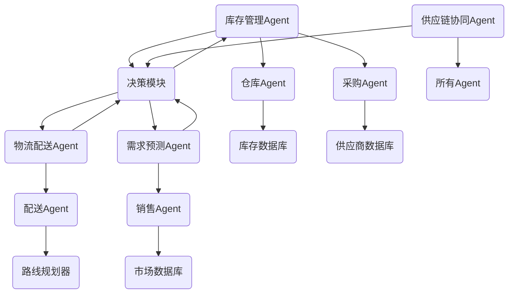
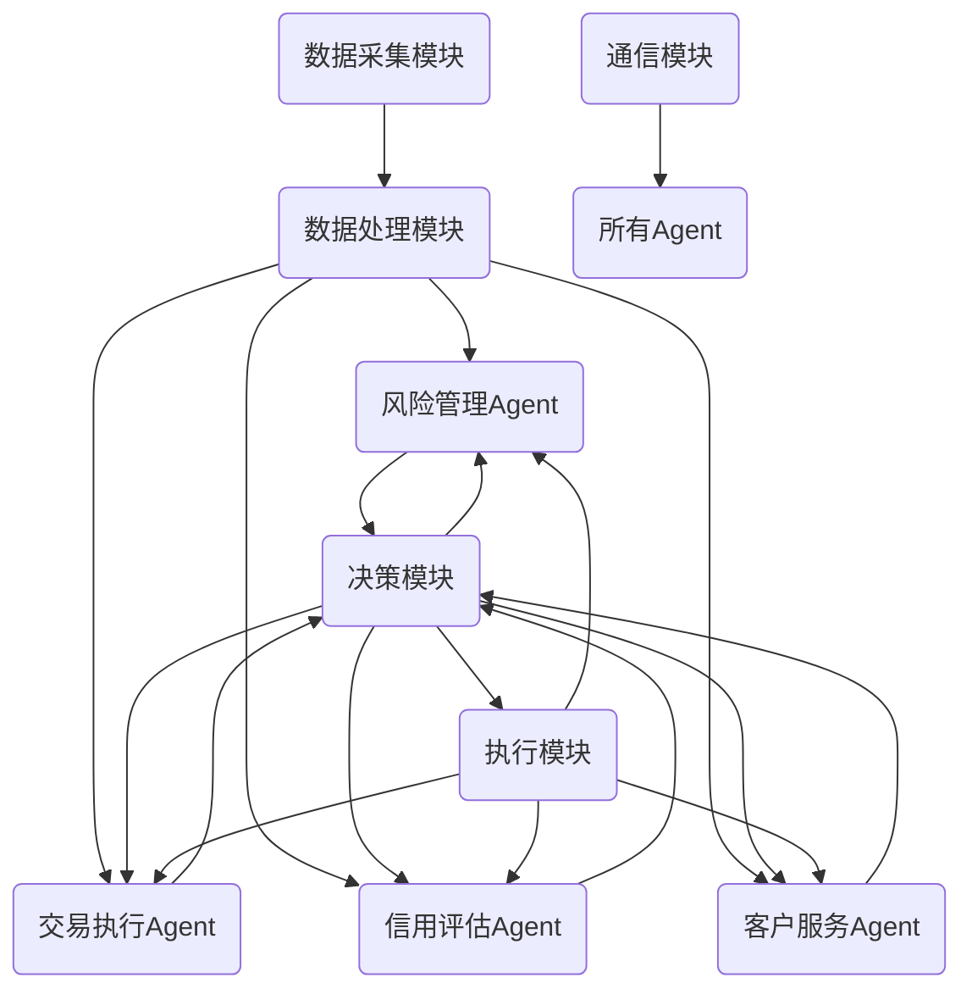
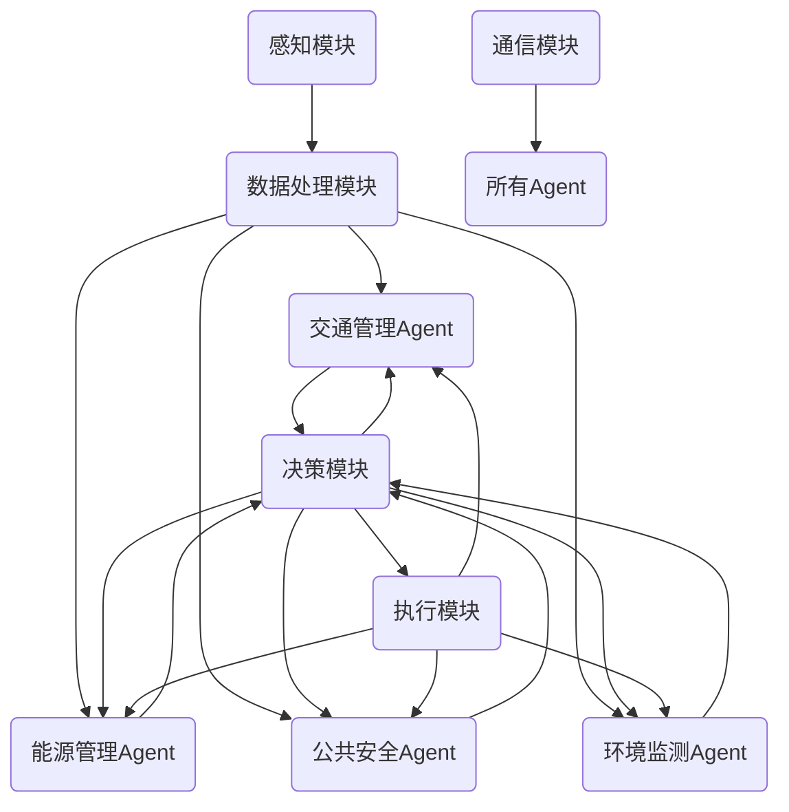

                 

# 企业级多Agent系统：协同解决复杂问题

## 关键词

- 企业级
- 多Agent系统
- 复杂问题求解
- 系统协同效率
- 灵活性与可扩展性

## 摘要

本文旨在探讨企业级多Agent系统在解决复杂问题方面的应用与优势。通过详细分析多Agent系统的基本概念、体系结构、开发框架、算法原理、分布式计算和安全性问题，我们旨在揭示多Agent系统在提升企业协同效率、支持复杂问题求解以及增强系统灵活性方面的独特价值。本文将结合供应链管理、金融服务、智能制造和智慧城市等多个实际应用场景，深入探讨多Agent系统的架构设计及其在解决复杂问题中的关键作用。

### 1.6 企业级多Agent系统概述

#### 1.6.1 多Agent系统的基本概念

##### 1.6.1.1 Agent的定义

Agent是一个具有智能的自主实体，能够感知环境、做出决策并采取行动。Agent的特点包括自主性、反应性、社会性和适应性。

- **自主性**：Agent能够独立行动，不受外界直接控制。
- **反应性**：Agent能够对外界事件做出实时响应。
- **社会性**：Agent可以与其他Agent进行交互和协作。
- **适应性**：Agent能够根据环境和任务的变化调整自身行为。

##### 1.6.1.2 多Agent系统的定义

多Agent系统（MAS）是由多个相互协作的Agent组成的系统，这些Agent通过通信和协作共同完成复杂任务。多Agent系统的特点包括分布式、协同性、灵活性和可扩展性。

- **分布式**：多Agent系统中的Agent可以分布在不同的计算节点上，实现任务分担和资源利用。
- **协同性**：Agent之间通过通信和协作共同完成任务，提高系统的整体效率。
- **灵活性**：多Agent系统可以根据任务和环境的变化动态调整Agent的行为和角色。
- **可扩展性**：多Agent系统可以方便地扩展Agent的数量和类型，适应不同规模的任务需求。

##### 1.6.1.3 多Agent系统的发展历程

多Agent系统的概念最早可以追溯到20世纪80年代，由分布式人工智能（Distributed Artificial Intelligence, DAII）的研究者们提出。随着计算机技术和人工智能的快速发展，多Agent系统逐渐成为一个重要的研究领域。1998年，International Journal of Agent-Oriented Software Engineering（JAOS）杂志的创办标志着多Agent系统研究正式进入一个新阶段。近年来，随着物联网、大数据和云计算等技术的发展，多Agent系统的应用领域不断扩展，其在企业级系统中的应用也越来越受到关注。

##### 1.6.1.4 多Agent系统的应用领域

多Agent系统在众多领域都有广泛的应用，以下是一些主要的应用领域：

- **供应链管理**：多Agent系统可以用于优化供应链中的库存管理、物流配送和需求预测等环节。
- **金融服务**：多Agent系统可以用于风险管理、交易执行、信用评估等金融服务。
- **智能制造**：多Agent系统可以用于智能生产调度、设备维护和故障诊断等智能制造场景。
- **智慧城市**：多Agent系统可以用于智能交通管理、能源管理、公共安全等智慧城市应用。

### 1.7 企业级多Agent系统的优势

#### 1.7.1 提高系统协同效率

多Agent系统通过Agent之间的协作，可以实现任务的并行处理和资源的最优分配，从而提高系统的协同效率。具体优势如下：

- **并行处理**：多Agent系统中的Agent可以同时处理多个任务，实现任务的并行执行。
- **资源共享**：多Agent系统中的Agent可以共享系统中的资源，如计算能力、存储和网络带宽等。
- **任务分解**：复杂任务可以分解为多个子任务，由不同的Agent分别执行，提高任务完成速度。

#### 1.7.2 支持复杂问题求解

多Agent系统通过分布式计算和协作机制，可以有效地解决复杂问题。具体优势如下：

- **分布式计算**：多Agent系统可以将复杂问题分解为多个子问题，分布在不同Agent上求解，提高问题求解效率。
- **协作求解**：多Agent系统中的Agent可以通过协作，共同求解复杂问题，实现问题的优化解。
- **自适应调整**：多Agent系统可以根据问题的变化，动态调整Agent的行为和策略，提高问题求解的适应性。

#### 1.7.3 增强系统的灵活性和可扩展性

多Agent系统具有高度的灵活性和可扩展性，能够适应企业不断变化的需求。具体优势如下：

- **模块化设计**：多Agent系统采用模块化设计，便于系统的扩展和升级。
- **动态调整**：多Agent系统可以根据业务需求的变化，动态调整Agent的角色和任务。
- **集成性强**：多Agent系统可以方便地与其他系统进行集成，实现跨系统的协同工作。

### 1.8 企业级多Agent系统的挑战与解决方案

#### 1.8.1 系统集成与互操作性

多Agent系统的集成与互操作性是其面临的主要挑战之一。为了实现不同Agent系统之间的无缝集成，需要解决以下问题：

- **通信协议**：设计统一的通信协议，确保Agent之间的通信顺畅。
- **接口定义**：定义标准的接口和API，方便不同系统之间的数据交换和功能调用。
- **数据格式**：统一数据格式，实现不同系统之间的数据兼容和互操作性。

#### 1.8.2 Agent行为的一致性与协调

在多Agent系统中，Agent的行为一致性是一个重要问题。为了实现Agent之间的协同工作，需要解决以下问题：

- **行为规范**：制定统一的行为规范，确保Agent的行为符合预期。
- **协调机制**：设计有效的协调机制，解决Agent之间的冲突和协作问题。
- **冲突解决**：设计冲突解决策略，处理Agent之间的竞争和协作冲突。

#### 1.8.3 安全性与隐私保护

多Agent系统在安全性方面也面临挑战。为了确保系统的安全性和隐私保护，需要解决以下问题：

- **安全协议**：设计安全的通信协议，防止Agent之间的信息泄露和攻击。
- **访问控制**：实现严格的访问控制机制，确保只有授权的Agent可以访问敏感数据和功能。
- **隐私保护**：设计隐私保护策略，防止Agent收集和使用用户的敏感信息。

### 1.9 本章小结

本章概述了企业级多Agent系统的基本概念、优势、挑战及解决方案。多Agent系统以其协同效率、复杂问题求解能力以及灵活性和可扩展性，为企业级应用带来了显著的价值。然而，系统集成与互操作性、Agent行为的一致性与协调以及安全性与隐私保护等问题，仍需进一步研究和解决。

### 第二部分：企业级多Agent系统技术基础

#### 2.1 多Agent系统的体系结构

##### 2.1.1 多Agent系统的基本架构

多Agent系统的基本架构包括以下几个核心组件和功能模块：

1. **Agent组件**：Agent是多Agent系统的基本单元，负责感知环境、执行任务和与其他Agent进行通信。
2. **通信模块**：通信模块负责Agent之间的消息传递和数据交换，确保Agent之间能够高效协作。
3. **协调模块**：协调模块负责解决Agent之间的冲突和协调问题，确保Agent的行为一致。
4. **控制模块**：控制模块负责Agent的动态调度和任务分配，确保系统资源的合理利用。
5. **数据库**：数据库用于存储系统的数据信息，包括Agent的状态信息、任务数据和系统配置参数。

##### 2.1.2 Agent的通信机制

Agent之间的通信机制是多Agent系统协同工作的关键。常见的通信机制包括：

1. **消息传递**：Agent通过发送和接收消息进行通信。消息可以是同步或异步的，取决于系统的通信需求。
2. **通信协议**：通信协议定义了Agent之间通信的规则和格式，确保通信的可靠性和安全性。
3. **通信网络**：通信网络是多Agent系统中Agent之间进行通信的基础设施，可以是局域网、互联网或专用网络。

##### 2.1.3 Agent的行为模型

Agent的行为模型包括以下几个关键部分：

1. **感知模型**：感知模型定义了Agent如何感知环境，包括感知范围、感知方式和感知精度等。
2. **决策模型**：决策模型定义了Agent如何根据感知信息做出决策，包括决策算法、决策过程和决策结果。
3. **行动模型**：行动模型定义了Agent如何执行决策，包括行动方式、行动过程和行动结果。

#### 2.2 多Agent系统的开发框架

##### 2.2.1 Agent开发框架

多Agent系统的开发框架提供了开发Agent所需的工具和库，常见的开发框架包括：

1. **Jade**：Java Agent Development Framework，是基于Java语言的 Agent开发框架。
2. **FIPA-OS**：Foundation for Intelligent Physical Agents，是基于Java和C++的Agent开发框架。
3. **Matlab**：Matlab提供了一套用于开发多Agent系统的工具箱，适用于复杂的多Agent系统建模和仿真。

##### 2.2.2 Agent编程语言

多Agent系统的开发可以使用多种编程语言，常见的编程语言包括：

1. **Java**：Java是一种跨平台编程语言，适用于开发分布式多Agent系统。
2. **Python**：Python是一种易于学习和使用的编程语言，适用于快速开发多Agent系统原型。
3. **C++**：C++是一种高效且功能强大的编程语言，适用于高性能的多Agent系统开发。

#### 2.3 多Agent系统的算法原理

##### 2.3.1 协同搜索算法

协同搜索算法是多Agent系统中用于解决搜索问题的一种重要算法。常见的协同搜索算法包括：

1. **A*算法**：A*算法是一种基于启发式的搜索算法，适用于在未知环境中找到最短路径。
2. **Dijkstra算法**：Dijkstra算法是一种基于图搜索的算法，适用于在已知环境中找到最短路径。
3. **蚁群算法**：蚁群算法是一种基于自然进化的搜索算法，适用于复杂环境的路径搜索。

##### 2.3.2 分布式决策算法

分布式决策算法是多Agent系统中用于实现分布式决策的一种重要算法。常见的分布式决策算法包括：

1. **Gossip算法**：Gossip算法是一种基于随机游走机制的分布式决策算法，适用于大规模系统的协同决策。
2. **Consensus算法**：Consensus算法是一种基于共识协议的分布式决策算法，适用于确保分布式系统的一致性。
3. **RPC算法**：RPC算法是一种基于远程过程调用的分布式决策算法，适用于分布式系统的远程决策。

#### 2.4 多Agent系统的分布式计算

##### 2.4.1 分布式计算的基本概念

分布式计算是指将一个大任务分解为多个子任务，分布在不同计算节点上并行执行，从而提高任务执行效率。分布式计算的基本概念包括：

1. **计算节点**：计算节点是分布式计算的基本单元，负责执行子任务和通信。
2. **任务分配**：任务分配是将大任务分解为多个子任务，并分配给不同的计算节点执行。
3. **负载均衡**：负载均衡是确保计算节点之间任务负载平衡的一种技术，避免某些计算节点负载过高。

##### 2.4.2 分布式算法的设计与优化

分布式算法的设计与优化是分布式计算的关键。常见的优化策略包括：

1. **数据局部性**：通过将相关数据存储在附近的计算节点上，减少数据传输开销。
2. **任务并行度**：通过提高任务的并行度，减少任务执行时间。
3. **网络带宽优化**：通过优化网络带宽使用，提高数据传输速度。

#### 2.5 多Agent系统的安全性

##### 2.5.1 安全性威胁与攻击类型

多Agent系统在安全性方面可能面临以下威胁和攻击类型：

1. **信息泄露**：攻击者通过窃取Agent之间的通信数据，获取系统的敏感信息。
2. **恶意攻击**：攻击者通过控制某些Agent，对整个系统进行恶意攻击，破坏系统的正常运行。
3. **拒绝服务攻击**：攻击者通过大量无效请求，使系统资源耗尽，导致系统无法正常工作。

##### 2.5.2 安全防护策略

为了确保多Agent系统的安全性，可以采取以下安全防护策略：

1. **访问控制**：通过访问控制机制，确保只有授权的Agent可以访问系统资源和功能。
2. **加密通信**：使用加密算法，对Agent之间的通信数据进行加密，防止信息泄露。
3. **入侵检测**：部署入侵检测系统，实时监控系统运行状态，及时发现并处理安全威胁。

### 2.6 本章小结

本章详细介绍了企业级多Agent系统的技术基础，包括体系结构、开发框架、算法原理、分布式计算和安全性。通过对这些技术基础的了解，读者可以更好地理解多Agent系统的原理和应用，为后续的实际应用实践打下坚实的基础。#### 3.1 多Agent系统在供应链管理中的应用

##### 3.1.1 供应链管理中的问题背景

供应链管理是企业运营中的重要环节，涉及多个环节，如采购、生产、仓储、运输和销售。然而，供应链管理面临着诸多挑战，包括：

1. **库存管理**：库存过多会导致资金占用和存储成本增加，而库存不足则会导致生产中断和订单交付延迟。
2. **物流配送**：物流配送过程中的延误、运输成本高企和资源浪费等问题，都会影响供应链的整体效率。
3. **需求预测**：准确预测市场需求对于供应链管理至关重要，但市场需求的不确定性和波动性给需求预测带来了挑战。
4. **供应链协同**：供应链中的各个环节往往由不同的企业或部门负责，缺乏有效的协同机制，导致信息传递不畅、协调困难。

##### 3.1.2 多Agent系统在供应链管理中的应用

多Agent系统在供应链管理中具有广泛的应用前景，能够解决上述问题，提高供应链的整体效率和协同性。以下是多Agent系统在供应链管理中的应用：

1. **库存管理**：通过多Agent系统，可以实现对库存的实时监控和动态调整。每个仓库Agent负责监控本地的库存情况，并通过与采购Agent和销售Agent的通信，实现库存的自动补充和调整。这样可以避免库存过多或不足的情况，降低库存成本。

2. **物流配送**：多Agent系统可以用于优化物流配送路线和调度。配送Agent可以根据实时的交通状况、货物类型和配送需求，动态调整配送路线和运输资源，提高配送效率和减少运输成本。

3. **需求预测**：多Agent系统可以通过分析历史销售数据、市场信息和客户反馈，预测未来的市场需求。销售Agent、预测Agent和市场分析Agent相互协作，共享信息和知识，提高需求预测的准确性和可靠性。

4. **供应链协同**：多Agent系统可以实现供应链各环节之间的协同工作。采购Agent、生产Agent、仓储Agent和运输Agent通过信息共享和协作，共同优化供应链的运作。例如，采购Agent可以根据库存Agent和生产Agent的需求，调整采购计划和供应商选择，实现供应链的协同优化。

##### 3.1.3 供应链管理中多Agent系统的架构设计

供应链管理中多Agent系统的架构设计应考虑以下几个关键模块：

1. **感知模块**：感知模块负责收集供应链各个环节的实时数据，包括库存信息、物流状态、市场需求等。
2. **决策模块**：决策模块负责基于感知模块收集的数据，进行库存管理、物流配送、需求预测等决策。
3. **执行模块**：执行模块负责根据决策模块的决策结果，执行具体的操作，如调整库存、优化配送路线、预测市场需求等。
4. **通信模块**：通信模块负责各Agent之间的数据传输和通信，确保Agent之间的信息共享和协同工作。

以下是一个供应链管理中多Agent系统的架构设计示例：

在这个架构设计中，各Agent之间通过通信模块实现信息共享和协同工作。感知模块负责收集实时数据，决策模块基于这些数据进行决策，执行模块负责执行决策结果。供应链协同Agent负责协调各Agent之间的协作，确保供应链的整体效率。

#### 3.2 多Agent系统在金融服务中的应用

##### 3.2.1 金融服务中的问题背景

金融服务行业是一个高度复杂和竞争激烈的领域，涉及银行、保险、证券、基金等多个方面。金融服务中存在的问题主要包括：

1. **风险管理**：金融服务面临多种风险，如信用风险、市场风险、操作风险等。如何有效管理和控制这些风险是金融企业的重要任务。
2. **交易执行**：金融交易复杂且频繁，如何确保交易的高效执行、合规性和准确性是金融服务的关键问题。
3. **信用评估**：信用评估是一个复杂的过程，需要分析大量的数据，评估借款人的信用状况，从而决定是否批准贷款。
4. **客户服务**：金融服务企业需要提供高质量的客户服务，满足客户的需求和期望，提高客户满意度和忠诚度。

##### 3.2.2 多Agent系统在金融服务中的应用

多Agent系统在金融服务中具有广泛的应用，能够有效解决上述问题，提高金融服务的效率和质量。以下是多Agent系统在金融服务中的应用：

1. **风险管理**：多Agent系统可以用于金融风险管理，通过分析历史数据、市场趋势和客户行为，识别潜在风险并制定相应的风险控制策略。例如，信用风险管理Agent可以监控借款人的信用状况，及时发现违约风险，并采取相应的措施。
2. **交易执行**：多Agent系统可以用于金融交易执行，通过自动化和智能化的方式，确保交易的高效执行和合规性。例如，交易执行Agent可以自动化执行交易订单，检查交易合规性，并处理交易过程中的异常情况。
3. **信用评估**：多Agent系统可以用于信用评估，通过分析借款人的信用数据、财务状况和行为特征，评估借款人的信用风险。例如，信用评估Agent可以自动收集和处理借款人的数据，利用机器学习算法进行信用评分，为金融机构提供决策支持。
4. **客户服务**：多Agent系统可以用于客户服务，通过自动化和智能化的方式，提高客户服务效率和客户满意度。例如，客户服务Agent可以自动解答客户的问题，提供个性化的金融产品推荐，并处理客户投诉和咨询。

##### 3.2.3 金融服务中多Agent系统的架构设计

金融服务中多Agent系统的架构设计应考虑以下几个关键模块：

1. **数据采集模块**：数据采集模块负责收集金融交易、客户行为和市场数据，为Agent的决策提供基础数据。
2. **数据处理模块**：数据处理模块负责对采集到的数据进行分析和清洗，提取有用的信息，为Agent的决策提供支持。
3. **决策模块**：决策模块负责根据数据处理模块提供的信息，进行风险管理、交易执行、信用评估等决策。
4. **执行模块**：执行模块负责根据决策模块的决策结果，执行具体的操作，如交易执行、贷款审批、客户服务等。
5. **通信模块**：通信模块负责各Agent之间的数据传输和通信，确保Agent之间的信息共享和协同工作。

以下是一个金融服务中多Agent系统的架构设计示例：

在这个架构设计中，数据采集模块负责收集金融交易、客户行为和市场数据，数据处理模块对这些数据进行分析和清洗，提取有用的信息。决策模块根据数据处理模块提供的信息进行风险管理、交易执行、信用评估和客户服务等方面的决策。执行模块根据决策模块的决策结果，执行具体的操作。通信模块负责各Agent之间的数据传输和通信，确保Agent之间的信息共享和协同工作。

#### 3.3 多Agent系统在智能制造中的应用

##### 3.3.1 智能制造中的问题背景

智能制造是制造业发展的重要趋势，通过引入人工智能技术，实现制造过程的智能化和自动化。然而，智能制造面临着诸多挑战，包括：

1. **生产调度**：生产调度是智能制造中的重要环节，涉及设备的安排、任务的分配和工期的规划。如何实现高效、灵活的生产调度是智能制造的关键问题。
2. **设备维护**：智能制造系统中设备众多，设备的正常运行和故障诊断是保障生产效率的重要保障。如何实现设备的预防性维护和故障诊断是智能制造的重要挑战。
3. **质量管理**：智能制造中的质量管理涉及生产过程中的质量监控、数据分析和质量控制。如何实现全面、高效的质量管理是智能制造的重要任务。
4. **数据共享与集成**：智能制造系统中涉及大量的数据，如何实现数据的共享与集成，为制造过程提供数据支持和决策依据是智能制造的重要挑战。

##### 3.3.2 多Agent系统在智能制造中的应用

多Agent系统在智能制造中具有广泛的应用，能够有效解决上述问题，提高智能制造的效率和灵活性。以下是多Agent系统在智能制造中的应用：

1. **生产调度**：多Agent系统可以用于生产调度，通过智能调度Agent，实现对生产任务的实时监控和动态调度。生产调度Agent可以分析生产计划、设备状态和任务进度，动态调整生产任务和设备安排，提高生产效率。
2. **设备维护**：多Agent系统可以用于设备维护，通过智能维护Agent，实现对设备的实时监控、故障诊断和预防性维护。维护Agent可以监控设备状态、收集故障数据，利用机器学习算法进行故障预测和诊断，提前进行维护，减少设备故障对生产的影响。
3. **质量管理**：多Agent系统可以用于质量管理，通过智能质量监控Agent，实现对生产过程的质量监控和分析。质量监控Agent可以实时采集生产过程中的质量数据，利用数据挖掘和分析技术，识别质量问题，提出改进措施。
4. **数据共享与集成**：多Agent系统可以用于数据共享与集成，通过数据共享Agent，实现制造过程中各类数据的实时采集、传输和集成。数据共享Agent可以将生产数据、设备数据和质量数据等集成到统一的数据平台，为制造过程提供数据支持和决策依据。

##### 3.3.3 智能制造中多Agent系统的架构设计

智能制造中多Agent系统的架构设计应考虑以下几个关键模块：

1. **感知模块**：感知模块负责收集生产过程中的实时数据，包括设备状态、生产进度和质量数据等。
2. **数据处理模块**：数据处理模块负责对感知模块收集的数据进行分析和处理，提取有用的信息，为Agent的决策提供支持。
3. **决策模块**：决策模块负责根据数据处理模块提供的信息，进行生产调度、设备维护、质量管理和数据共享等方面的决策。
4. **执行模块**：执行模块负责根据决策模块的决策结果，执行具体的操作，如调整生产任务、进行设备维护和质量管理等。
5. **通信模块**：通信模块负责各Agent之间的数据传输和通信，确保Agent之间的信息共享和协同工作。

以下是一个智能制造中多Agent系统的架构设计示例：

在这个架构设计中，感知模块负责收集生产过程中的实时数据，数据处理模块对这些数据进行分析和处理，提取有用的信息。决策模块根据数据处理模块提供的信息，进行生产调度、设备维护、质量管理和数据共享等方面的决策。执行模块根据决策模块的决策结果，执行具体的操作。通信模块负责各Agent之间的数据传输和通信，确保Agent之间的信息共享和协同工作。

#### 3.4 多Agent系统在智慧城市中的应用

##### 3.4.1 智慧城市中的问题背景

智慧城市是信息化、网络化、智能化和绿色化城市发展的新方向，通过引入物联网、大数据、人工智能等技术，实现城市管理的智能化和精细化管理。智慧城市中存在的问题主要包括：

1. **智能交通管理**：随着城市化进程的加快，城市交通问题日益突出，包括交通拥堵、交通事故和停车难题等。如何实现智能交通管理，提高交通效率是智慧城市的重要任务。
2. **能源管理**：城市能源消耗巨大，如何实现能源的高效利用和可持续发展是智慧城市的重要挑战。包括智能电网、智能楼宇和智能照明等能源管理系统的建设和应用。
3. **公共安全**：公共安全是智慧城市的重要保障，包括自然灾害防范、消防安全、社会治安等。如何实现公共安全的智能化管理和应急响应是智慧城市的重要任务。
4. **环境监测**：城市环境质量对居民的生活质量具有重要影响，如何实现环境监测的智能化和精细化是智慧城市的重要挑战。包括空气质量、水质监测、噪声监测等环境监测系统的建设和应用。

##### 3.4.2 多Agent系统在智慧城市中的应用

多Agent系统在智慧城市中具有广泛的应用，能够有效解决上述问题，提高智慧城市的智能化和精细化管理水平。以下是多Agent系统在智慧城市中的应用：

1. **智能交通管理**：多Agent系统可以用于智能交通管理，通过交通管理Agent，实现对交通流量、车辆状态和路况信息的实时监控和动态调整。交通管理Agent可以分析交通数据，优化交通信号控制，减少交通拥堵，提高交通效率。
2. **能源管理**：多Agent系统可以用于能源管理，通过能源管理Agent，实现对城市能源系统的实时监控和优化调度。能源管理Agent可以分析能源消耗数据，优化能源使用策略，提高能源利用效率，实现能源的可持续发展。
3. **公共安全**：多Agent系统可以用于公共安全，通过公共安全Agent，实现对公共安全的实时监控和应急响应。公共安全Agent可以分析安全数据，识别潜在风险，制定应急预案，提高公共安全保障水平。
4. **环境监测**：多Agent系统可以用于环境监测，通过环境监测Agent，实现对城市环境质量的实时监测和数据分析。环境监测Agent可以分析环境数据，识别环境污染源，制定治理措施，提高环境质量。

##### 3.4.3 智慧城市中多Agent系统的架构设计

智慧城市中多Agent系统的架构设计应考虑以下几个关键模块：

1. **感知模块**：感知模块负责收集城市运行过程中的实时数据，包括交通、能源、公共安全和环境等数据。
2. **数据处理模块**：数据处理模块负责对感知模块收集的数据进行分析和处理，提取有用的信息，为Agent的决策提供支持。
3. **决策模块**：决策模块负责根据数据处理模块提供的信息，进行交通管理、能源管理、公共安全和环境监测等方面的决策。
4. **执行模块**：执行模块负责根据决策模块的决策结果，执行具体的操作，如调整交通信号、优化能源使用策略和应急响应等。
5. **通信模块**：通信模块负责各Agent之间的数据传输和通信，确保Agent之间的信息共享和协同工作。

以下是一个智慧城市中多Agent系统的架构设计示例：

在这个架构设计中，感知模块负责收集城市运行过程中的实时数据，数据处理模块对这些数据进行分析和处理，提取有用的信息。决策模块根据数据处理模块提供的信息，进行交通管理、能源管理、公共安全和环境监测等方面的决策。执行模块根据决策模块的决策结果，执行具体的操作。通信模块负责各Agent之间的数据传输和通信，确保Agent之间的信息共享和协同工作。

### 4.本章小结

本章详细介绍了多Agent系统在供应链管理、金融服务、智能制造和智慧城市等多个实际应用场景中的重要作用和架构设计。通过多Agent系统的应用，企业能够实现协同效率的提升、复杂问题的求解以及系统的灵活性和可扩展性。然而，多Agent系统的应用也面临着集成与互操作性、行为一致性和协调性、安全性与隐私保护等挑战，需要进一步的研究和优化。本章的内容为后续的多Agent系统应用实践提供了理论基础和实践指导。

