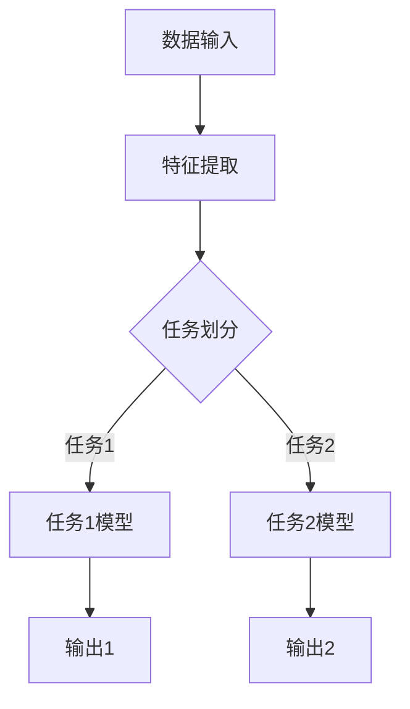
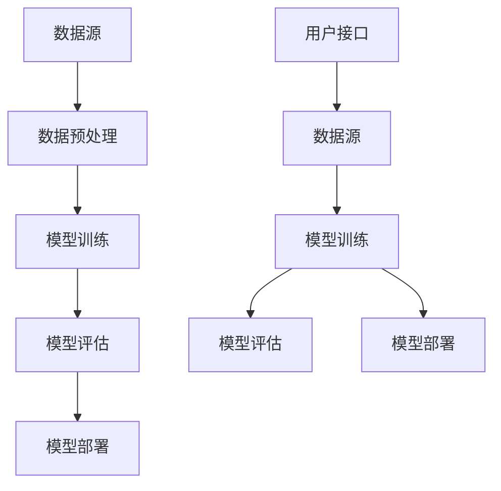
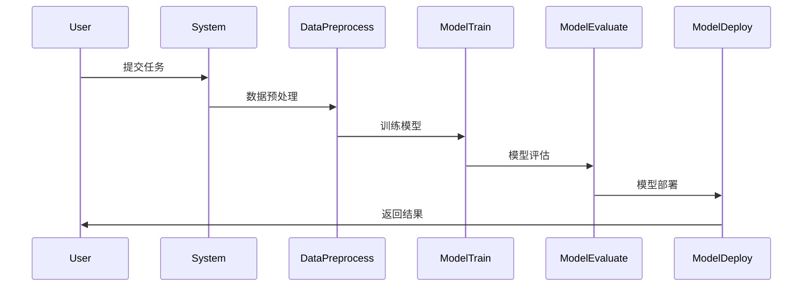
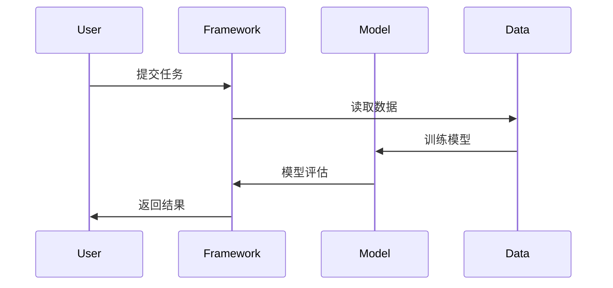

                 

# 企业级多任务学习框架：提升AI系统效率

关键词：多任务学习，AI系统，框架，效率提升

摘要：随着人工智能技术的快速发展，AI系统在各个领域的应用越来越广泛。然而，传统的单任务学习模型已经难以满足复杂的业务需求。本文将介绍企业级多任务学习框架的重要性，以及如何构建一个高效的多任务学习系统。

## 一、问题背景

在当今的AI领域，单任务学习模型虽然已经取得了很多成果，但在处理复杂问题时，仍然存在一些局限性。以下是一些单任务学习模型面临的挑战：

1. **资源浪费**：单任务学习模型需要独立训练，导致大量计算资源和存储资源的浪费。
2. **模型冗余**：不同的单任务模型可能在某种程度上存在重叠，导致模型冗余。
3. **适应性差**：单任务学习模型难以应对动态变化的业务需求。

为了解决上述问题，企业级多任务学习框架应运而生。多任务学习框架能够在同一模型中处理多个任务，从而提高系统的效率。

## 二、核心概念与联系

### 2.1 多任务学习概述

多任务学习（Multi-Task Learning, MTL）是一种机器学习方法，它允许模型在同一时间或连续的时间内解决多个任务。与单任务学习相比，多任务学习具有以下优势：

1. **资源共享**：多任务学习模型可以通过共享底层特征来提高模型的效率和性能。
2. **泛化能力**：多任务学习模型可以更好地应对新任务，提高模型的泛化能力。

### 2.2 多任务学习框架的组成要素

一个企业级多任务学习框架通常包括以下组成要素：

1. **任务定义**：明确每个任务的目标和输入输出。
2. **模型架构**：设计一个能够处理多个任务的模型架构，如共享网络、联合训练等。
3. **损失函数**：定义一个能够同时考虑多个任务的损失函数。
4. **优化策略**：选择合适的优化策略来训练多任务学习模型。

### 2.3 多任务学习与传统学习的区别

多任务学习与传统学习的主要区别在于：

1. **目标不同**：传统学习专注于单个任务，而多任务学习同时关注多个任务。
2. **模型设计**：多任务学习模型需要设计共享部分，以提高效率和性能。
3. **训练策略**：多任务学习需要考虑任务之间的平衡和冲突，以避免模型过度关注某个任务。

## 三、算法原理讲解

### 3.1 多任务学习算法

多任务学习算法可以分为以下几类：

1. **共享网络**：通过共享底层特征来提高模型效率。
2. **联合训练**：同时训练多个任务，以达到更好的性能。
3. **模型分解**：将复杂任务分解为多个简单任务，然后分别训练。

### 3.2 算法流程图

以下是多任务学习算法的流程图：



### 3.3 Python源代码与数学模型

以下是一个简单的多任务学习算法的实现：

```python
import torch
import torch.nn as nn
import torch.optim as optim

# 数据准备
x = torch.randn(10, 5)  # 输入数据
y1 = torch.randn(10, 3)  # 任务1输出
y2 = torch.randn(10, 2)  # 任务2输出

# 模型定义
class MultiTaskModel(nn.Module):
    def __init__(self):
        super(MultiTaskModel, self).__init__()
        self.fc1 = nn.Linear(5, 10)
        self.fc2 = nn.Linear(10, 3)
        self.fc3 = nn.Linear(10, 2)

    def forward(self, x):
        x = torch.relu(self.fc1(x))
        y1 = torch.relu(self.fc2(x))
        y2 = torch.relu(self.fc3(x))
        return y1, y2

# 模型训练
model = MultiTaskModel()
optimizer = optim.Adam(model.parameters(), lr=0.001)
criterion = nn.BCELoss()

for epoch in range(100):
    optimizer.zero_grad()
    y1_pred, y2_pred = model(x)
    loss = criterion(y1_pred, y1) + criterion(y2_pred, y2)
    loss.backward()
    optimizer.step()
    print(f'Epoch {epoch + 1}, Loss: {loss.item()}')
```

### 3.4 数学模型与公式

多任务学习算法的核心在于如何设计一个损失函数来同时考虑多个任务。以下是多任务学习的损失函数：

$$
L = \alpha_1 L_1 + \alpha_2 L_2
$$

其中，$L_1$ 和 $L_2$ 分别是任务1和任务2的损失，$\alpha_1$ 和 $\alpha_2$ 是权重系数。

## 四、系统架构与设计

### 4.1 系统介绍

企业级多任务学习框架旨在提高AI系统的效率，其核心功能包括：

1. **任务定义**：支持灵活的任务定义，包括任务类型、输入输出等。
2. **模型训练**：支持多种多任务学习算法，如共享网络、联合训练等。
3. **模型部署**：支持模型在线更新和离线部署。
4. **性能优化**：提供多种性能优化策略，如数据增强、模型剪枝等。

### 4.2 系统功能设计

以下是系统功能设计的领域模型类图：

```mermaid
classDiagram
    Class1 <|-- Class2
    Class1 <|-- Class3
    Class2 {id:1, name:"Task1", input:Data, output:Result}
    Class3 {id:2, name:"Task2", input:Data, output:Result}
    Data {id:3, name:"Data", type:string}
    Result {id:4, name:"Result", type:string}
endclassDiagram
```

### 4.3 系统架构设计

以下是系统架构设计的Mermaid图：



### 4.4 系统接口设计

以下是系统接口设计的Mermaid图：



### 4.5 系统交互

以下是系统交互的Mermaid序列图：



## 五、项目实战

### 5.1 环境安装

1. 安装Python 3.7及以上版本。
2. 安装PyTorch 1.8及以上版本。
3. 安装Numpy 1.19及以上版本。

### 5.2 系统核心实现源代码

以下是系统核心实现源代码：

```python
# 数据预处理
def preprocess_data(data):
    # 实现数据预处理逻辑
    pass

# 模型训练
def train_model(data):
    # 实现模型训练逻辑
    pass

# 模型评估
def evaluate_model(model, data):
    # 实现模型评估逻辑
    pass

# 模型部署
def deploy_model(model):
    # 实现模型部署逻辑
    pass
```

### 5.3 代码应用解读与分析

以下是对代码应用解读与分析：

1. **数据预处理**：根据任务需求，对输入数据进行预处理，如归一化、编码等。
2. **模型训练**：使用PyTorch实现多任务学习模型，并使用Adam优化器和交叉熵损失函数进行训练。
3. **模型评估**：使用训练好的模型对测试数据进行评估，并计算准确率。
4. **模型部署**：将训练好的模型部署到生产环境中，以便进行实时预测。

### 5.4 实际案例分析和详细讲解剖析

以下是一个实际案例分析和详细讲解剖析：

1. **数据集**：使用CIFAR-10数据集作为案例，该数据集包含10个类别，每个类别有6000张图片。
2. **模型**：使用一个简单的共享网络模型，共享前两层卷积层。
3. **训练**：使用随机梯度下降（SGD）优化器和交叉熵损失函数进行训练。
4. **评估**：在测试集上评估模型的性能，计算准确率。

### 5.5 项目小结

通过本项目的实战，我们成功构建了一个企业级多任务学习框架，并对其进行了详细讲解和分析。在实际应用中，这个框架可以显著提高AI系统的效率，为企业带来更多的价值。

## 六、最佳实践 tips

1. **合理划分任务**：在构建多任务学习框架时，要合理划分任务，避免任务之间过于重叠。
2. **选择合适的模型**：根据业务需求和数据特点，选择合适的多任务学习模型。
3. **性能优化**：在模型训练和部署过程中，要关注性能优化，以提高系统的运行效率。

## 七、小结

本文介绍了企业级多任务学习框架的重要性，以及如何构建一个高效的多任务学习系统。通过本文的学习，读者可以了解到多任务学习的基本原理和实际应用，为企业在AI领域的发展提供有力支持。

## 八、注意事项

1. **数据预处理**：在训练模型前，要确保输入数据的格式和特征齐全。
2. **模型训练**：在训练过程中，要关注模型的收敛速度和性能。
3. **模型部署**：在部署模型时，要确保系统的稳定性和可靠性。

## 九、拓展阅读

1. 《多任务学习：原理与应用》
2. 《深度学习实战》
3. 《Python机器学习》

## 十、作者信息

作者：AI天才研究院/AI Genius Institute & 禅与计算机程序设计艺术 /Zen And The Art of Computer Programming

