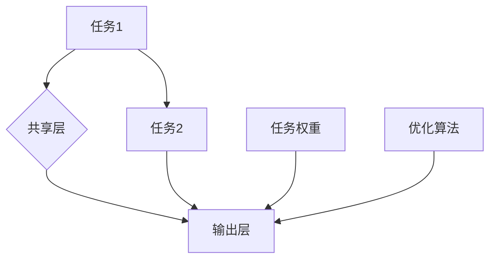
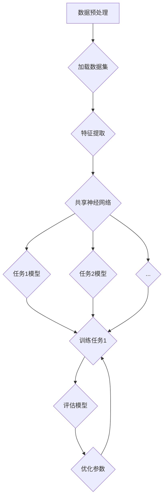
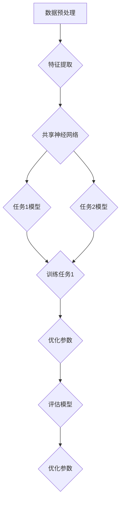
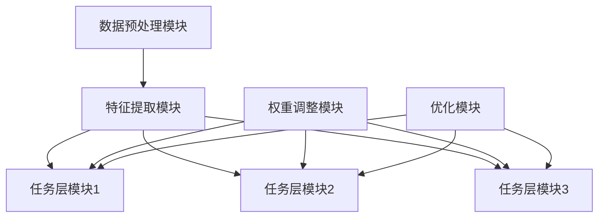
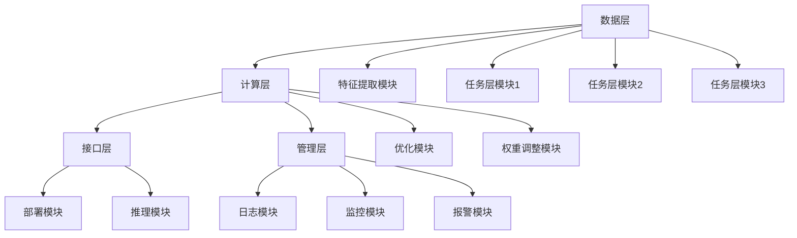
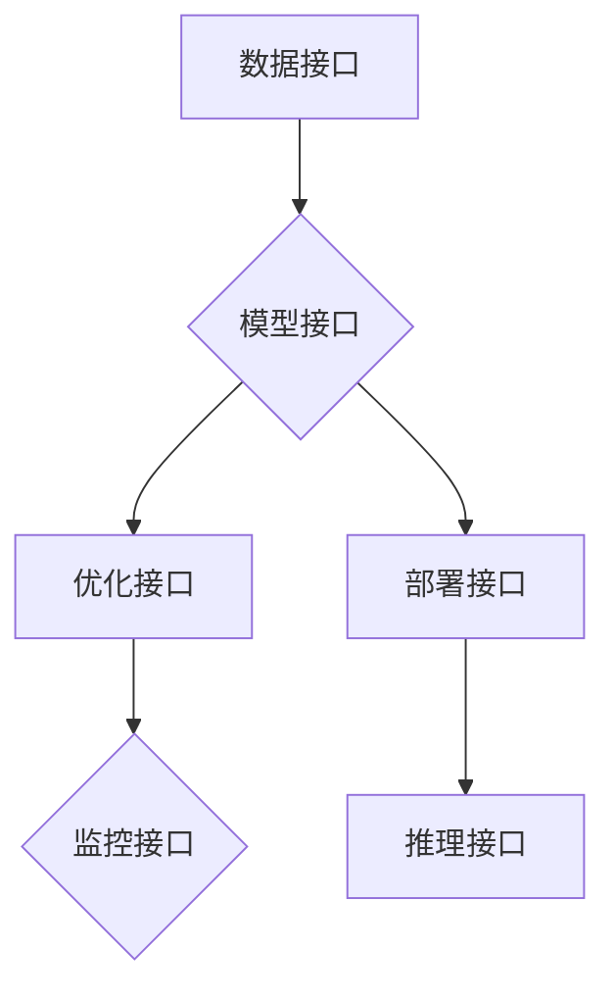

                 

### 企业级多任务学习框架：提高AI系统效能

#### 关键词：多任务学习、AI系统效能、企业级框架、算法原理、数学模型、项目实战

#### 摘要：
随着人工智能技术的快速发展，多任务学习（Multi-Task Learning, MTL）已成为提升AI系统效能的重要手段。本文将详细介绍企业级多任务学习框架，从核心概念、算法原理到实际项目应用，全面剖析多任务学习在提升AI系统效能中的关键作用。文章结构清晰，逻辑严密，旨在为广大读者提供一个完整的理论知识与实践指南。

#### 目录大纲：

----------------------------------------------------------------

# 企业级多任务学习框架：提高AI系统效能

> 关键词：多任务学习、AI系统效能、企业级框架、算法原理、数学模型、项目实战

> 摘要：本文详细介绍了企业级多任务学习框架，从核心概念、算法原理到实际项目应用，全面剖析多任务学习在提升AI系统效能中的关键作用。

----------------------------------------------------------------

## 第一部分：背景介绍

### 第1章：企业级多任务学习框架概述

#### 1.1 问题背景

#### 1.2 问题描述

#### 1.3 问题解决

#### 1.4 边界与外延

#### 1.5 概念结构与核心要素组成

### 第2章：多任务学习核心概念与联系

#### 2.1 多任务学习定义

#### 2.2 多任务学习特点

#### 2.3 多任务学习与传统学习方式对比

#### 2.4 多任务学习应用领域

#### 2.5 多任务学习核心概念联系图

### 第3章：多任务学习算法原理与流程

#### 3.1 多任务学习算法概述

#### 3.2 多任务学习算法流程图

#### 3.3 多任务学习算法原理讲解

#### 3.4 多任务学习算法Python源代码实现

#### 3.5 多任务学习算法数学模型与公式

### 第4章：多任务学习数学模型与公式讲解

#### 4.1 多任务学习数学模型概述

#### 4.2 多任务学习数学公式讲解

#### 4.3 多任务学习算法举例说明

### 第5章：企业级多任务学习框架设计与实现

#### 5.1 框架设计思路

#### 5.2 框架核心模块设计

#### 5.3 框架系统架构设计

#### 5.4 框架接口设计与交互

### 第6章：项目实战与案例分析

#### 6.1 项目介绍

#### 6.2 环境安装与配置

#### 6.3 核心实现源代码

#### 6.4 代码应用解读与分析

#### 6.5 实际案例分析

#### 6.6 项目小结

### 第7章：最佳实践与注意事项

#### 7.1 最佳实践总结

#### 7.2 注意事项与风险提示

#### 7.3 拓展阅读推荐

----------------------------------------------------------------

## 第一部分：背景介绍

### 第1章：企业级多任务学习框架概述

#### 1.1 问题背景

随着大数据和云计算技术的普及，企业级AI应用场景不断扩展，从单一任务到多任务场景的转化成为必然趋势。然而，传统的单一任务学习方法在面对多任务时，往往存在以下问题：

1. **资源浪费**：单一任务学习模型需要独立训练，导致计算资源重复利用效率低下。
2. **模型泛化能力不足**：单一任务学习模型难以从多个任务中提取共通特征，导致模型泛化能力受限。
3. **数据利用不充分**：多任务数据之间可能存在关联性，但单一任务学习无法充分利用这种关联性进行数据利用。

为了解决上述问题，多任务学习（Multi-Task Learning, MTL）应运而生。多任务学习通过共享模型参数，使得不同任务之间能够共享知识，从而提高模型的泛化能力和计算效率。在企业级AI应用中，多任务学习能够有效提升系统效能，降低成本，提高业务竞争力。

#### 1.2 问题描述

在多任务学习框架中，主要面临以下问题：

1. **任务间的平衡**：不同任务在数据量和难度上可能存在巨大差异，如何平衡任务间的影响成为关键问题。
2. **共享与任务独立性**：多任务学习需要在共享模型参数和保持任务独立性之间找到平衡点。
3. **优化算法选择**：针对不同任务类型，选择合适的优化算法以提升模型性能。

#### 1.3 问题解决

企业级多任务学习框架旨在通过以下方式解决上述问题：

1. **任务权重调整**：通过动态调整任务权重，实现任务间的平衡，确保模型在各个任务上的表现均衡。
2. **任务共享与独立性设计**：设计共享机制，使模型能够从多个任务中提取共性特征，同时保持任务独立性。
3. **优化算法选择与调优**：结合不同任务特点，选择合适的优化算法，并通过参数调优实现模型性能的提升。

#### 1.4 边界与外延

1. **边界**：多任务学习框架主要应用于企业级AI系统，需要考虑计算资源、数据规模和任务复杂度等因素。
2. **外延**：多任务学习框架可扩展应用于不同的AI场景，如自然语言处理、计算机视觉和推荐系统等。

#### 1.5 概念结构与核心要素组成

企业级多任务学习框架的核心概念包括：

1. **任务定义**：明确每个任务的输入、输出和目标。
2. **共享机制**：设计共享神经网络结构，实现任务间的参数共享。
3. **权重调整**：动态调整任务权重，实现任务间的平衡。
4. **优化算法**：选择合适的优化算法，提升模型性能。

框架的核心要素包括：

1. **任务层**：包括各个任务的输入层、共享层和输出层。
2. **共享层**：包含多个任务的共享神经网络结构。
3. **权重层**：动态调整任务权重，实现任务间平衡。
4. **优化器**：选择合适的优化算法，提升模型性能。

通过以上核心概念和要素的有机结合，企业级多任务学习框架能够有效提升AI系统效能，为企业带来显著的竞争优势。

----------------------------------------------------------------

### 第2章：多任务学习核心概念与联系

#### 2.1 多任务学习定义

多任务学习（Multi-Task Learning, MTL）是一种机器学习技术，旨在通过多个相关任务的联合学习，提高模型在各个任务上的性能。在多任务学习中，模型通过共享某些底层特征表示，同时学习多个任务，从而实现任务间的知识转移，提高模型的整体性能。

#### 2.2 多任务学习特点

多任务学习具有以下特点：

1. **共享特征表示**：通过共享神经网络结构或参数，将不同任务的底层特征表示进行整合，实现知识转移。
2. **任务间平衡**：多任务学习需要在各个任务间平衡资源分配，确保模型在各个任务上的表现均衡。
3. **提高泛化能力**：通过多任务学习，模型能够从多个任务中提取共性特征，提高在未知任务上的泛化能力。
4. **降低过拟合风险**：多任务学习可以充分利用训练数据，降低模型在特定任务上的过拟合风险。

#### 2.3 多任务学习与传统学习方式对比

与传统学习方式（如单任务学习、迁移学习等）相比，多任务学习具有以下优势：

1. **资源共享**：多任务学习通过共享神经网络结构或参数，减少了模型参数的数量，降低了计算复杂度和训练时间。
2. **增强泛化能力**：多任务学习可以从多个任务中提取共性特征，提高模型在未知任务上的泛化能力。
3. **提高模型稳定性**：多任务学习能够通过任务间平衡，降低模型在特定任务上的过拟合风险，提高模型稳定性。

#### 2.4 多任务学习应用领域

多任务学习在多个领域都有广泛应用，包括：

1. **自然语言处理**：如机器翻译、文本分类、情感分析等。
2. **计算机视觉**：如图像分类、目标检测、语义分割等。
3. **推荐系统**：如商品推荐、新闻推荐等。
4. **语音识别**：如语音分类、说话人识别等。

#### 2.5 多任务学习核心概念联系图

以下是一个多任务学习核心概念联系图的Mermaid表示：



- **A**：表示多个任务，如任务1和任务2。
- **B**：表示共享层，多个任务通过共享层整合底层特征表示。
- **C**：表示其他任务，如任务2。
- **D**：表示输出层，共享层和任务层的输出都经过输出层进行预测。
- **E**：表示任务权重，用于动态调整任务间的影响。
- **F**：表示优化算法，用于优化模型参数。

通过以上核心概念的联系图，可以更清晰地理解多任务学习的结构和工作原理。

----------------------------------------------------------------

### 第3章：多任务学习算法原理与流程

#### 3.1 多任务学习算法概述

多任务学习算法通过在多个任务上同时训练模型，以共享某些底层特征表示，从而提高模型的整体性能。常见的多任务学习算法包括共享神经网络结构、权重共享和任务分解等。

#### 3.2 多任务学习算法流程图

以下是一个多任务学习算法的流程图，使用Mermaid表示：



- **A**：数据预处理，包括数据清洗、归一化和数据增强等。
- **B**：加载数据集，包括训练集、验证集和测试集。
- **C**：特征提取，将原始数据转换为模型可处理的特征表示。
- **D**：共享神经网络，共享底层特征表示，实现任务间的知识转移。
- **E**：任务1模型，用于预测任务1的输出。
- **F**：任务2模型，用于预测任务2的输出。
- **G**：其他任务模型，用于预测其他任务的输出。
- **H**：训练模型，通过优化算法对模型参数进行训练。
- **I**：评估模型，评估模型在验证集上的性能。
- **J**：优化参数，根据评估结果调整模型参数。

#### 3.3 多任务学习算法原理讲解

多任务学习算法的核心思想是通过共享神经网络结构或参数，使得不同任务之间能够共享底层特征表示。这样，一个模型可以同时学习多个任务，从而提高模型的泛化能力和计算效率。

具体来说，多任务学习算法可以分为以下步骤：

1. **数据预处理**：对训练数据进行清洗、归一化和数据增强，以便于模型处理。
2. **特征提取**：通过共享神经网络提取底层特征表示，实现任务间的知识转移。
3. **模型训练**：在共享神经网络的基础上，为每个任务训练独立的模型，同时优化模型参数。
4. **模型评估**：使用验证集评估模型性能，根据评估结果调整模型参数。
5. **模型优化**：通过优化算法调整模型参数，提高模型在各个任务上的性能。

以下是一个简化的多任务学习算法原理的Mermaid流程图：



- **A**：数据预处理，包括数据清洗、归一化和数据增强等。
- **B**：特征提取，通过共享神经网络提取底层特征表示。
- **C**：共享神经网络，实现任务间的知识转移。
- **D**：任务1模型，用于预测任务1的输出。
- **E**：任务2模型，用于预测任务2的输出。
- **F**：训练模型，优化模型参数。
- **G**：优化参数，调整模型参数。
- **H**：评估模型，评估模型在验证集上的性能。

#### 3.4 多任务学习算法Python源代码实现

以下是一个简单的多任务学习算法的Python实现示例，使用TensorFlow框架：

```python
import tensorflow as tf

# 数据预处理
def preprocess_data(data):
    # 数据清洗、归一化和数据增强
    return processed_data

# 特征提取
def extract_features(processed_data):
    # 使用共享神经网络提取底层特征表示
    return features

# 模型定义
def create_model(input_shape):
    inputs = tf.keras.Input(shape=input_shape)
    shared_layer = tf.keras.layers.Dense(64, activation='relu')(inputs)
    task1_output = tf.keras.layers.Dense(1, activation='sigmoid')(shared_layer)
    task2_output = tf.keras.layers.Dense(1, activation='sigmoid')(shared_layer)
    model = tf.keras.Model(inputs=inputs, outputs=[task1_output, task2_output])
    return model

# 模型训练
def train_model(model, train_data, validation_data):
    model.compile(optimizer='adam', loss='binary_crossentropy', metrics=['accuracy'])
    model.fit(train_data, epochs=10, validation_data=validation_data)

# 评估模型
def evaluate_model(model, test_data):
    return model.evaluate(test_data)

# 实例化模型
model = create_model(input_shape=(784,))

# 加载数据集
train_data = preprocess_data(train_data)
validation_data = preprocess_data(validation_data)
test_data = preprocess_data(test_data)

# 训练模型
train_model(model, train_data, validation_data)

# 评估模型
evaluate_model(model, test_data)
```

#### 3.5 多任务学习算法数学模型与公式

多任务学习算法的数学模型主要包括损失函数、优化算法和参数更新等。

1. **损失函数**：

多任务学习中的损失函数通常是一个组合函数，用于同时优化多个任务的损失。常见的损失函数包括：

- **加权交叉熵损失**：

$$
L = w_1 \cdot L_1 + w_2 \cdot L_2 + ... + w_n \cdot L_n
$$

其中，$L_i$表示第$i$个任务的损失，$w_i$表示第$i$个任务的权重。

2. **优化算法**：

多任务学习中的优化算法通常基于梯度下降法，通过反向传播计算损失函数关于模型参数的梯度，并更新模型参数。常见的优化算法包括：

- **梯度下降**：

$$
\theta = \theta - \alpha \cdot \nabla_{\theta} L
$$

其中，$\theta$表示模型参数，$\alpha$表示学习率。

- **动量梯度下降**：

$$
\theta = \theta - \alpha \cdot \nabla_{\theta} L + \beta \cdot (1 - \alpha) \cdot \theta_{prev}
$$

其中，$\theta_{prev}$表示前一次迭代的模型参数，$\beta$表示动量参数。

3. **参数更新**：

在多任务学习中，参数更新需要同时考虑多个任务的损失函数。常见的参数更新方法包括：

- **同步更新**：

所有任务的模型参数同时更新，即：

$$
\theta_i = \theta - \alpha \cdot \nabla_{\theta} L_i
$$

- **异步更新**：

不同任务的模型参数分别更新，即：

$$
\theta_i = \theta - \alpha \cdot \nabla_{\theta} L_i^{async}
$$

其中，$L_i^{async}$表示第$i$个任务的异步损失函数。

通过以上数学模型与公式的讲解，可以更好地理解多任务学习算法的原理和实现方法。

----------------------------------------------------------------

### 第4章：多任务学习数学模型与公式讲解

#### 4.1 多任务学习数学模型概述

多任务学习的数学模型主要关注如何通过优化多个任务的损失函数来训练模型。这一过程涉及到多个方面，包括损失函数的设计、优化算法的选择以及参数的更新策略。多任务学习的数学模型可以概括为以下几个关键组成部分：

1. **输入层**：每个任务都有自己的输入数据。
2. **共享层**：多个任务共享一层或几层神经网络结构，用于提取底层特征。
3. **任务层**：在每个任务的共享层之后，添加独立的神经网络结构，用于处理特定任务的细节。
4. **损失函数**：用于衡量每个任务预测结果与真实值之间的差距，通常是一个组合损失函数，考虑所有任务的权重。
5. **优化算法**：用于调整模型参数，使得损失函数最小化。

#### 4.2 多任务学习数学公式讲解

1. **损失函数**：

多任务学习的损失函数通常是一个加权组合损失，用于综合考虑各个任务的损失。假设有 $n$ 个任务，对应的损失函数分别为 $L_1, L_2, ..., L_n$，权重分别为 $w_1, w_2, ..., w_n$，则总的损失函数可以表示为：

$$
L = \sum_{i=1}^{n} w_i \cdot L_i
$$

其中，$L_i$ 可以是任何标准的损失函数，如交叉熵损失、均方误差等。

2. **优化算法**：

优化算法用于根据损失函数的梯度来更新模型参数。一个简单的优化算法是梯度下降，其迭代公式为：

$$
\theta = \theta - \alpha \cdot \nabla_{\theta} L
$$

其中，$\theta$ 表示模型参数，$\alpha$ 表示学习率，$\nabla_{\theta} L$ 表示损失函数关于模型参数的梯度。

3. **参数更新**：

在多任务学习中，参数的更新通常要考虑各个任务的权重。例如，在同步更新策略中，所有任务的模型参数在同一时刻更新，其公式为：

$$
\theta_i = \theta_i - \alpha \cdot \nabla_{\theta_i} L
$$

而在异步更新策略中，不同任务的模型参数在不同的时间点更新，其公式为：

$$
\theta_i = \theta_i - \alpha \cdot \nabla_{\theta_i} L_i^{async}
$$

4. **特征共享**：

多任务学习的关键在于如何设计共享层，使得多个任务可以共享特征表示。一个常见的共享层设计方法是在每个任务之前的神经网络中使用共享权重。假设有 $k$ 个共享层，每个层有 $d_k$ 个神经元，则第 $i$ 个任务的共享层输出可以表示为：

$$
h_i^{(k)} = \sum_{j=1}^{n} w_{ij}^{(k)} \cdot x_j^{(k-1)}
$$

其中，$h_i^{(k)}$ 表示第 $i$ 个任务的第 $k$ 层共享层输出，$x_j^{(k-1)}$ 表示第 $j$ 个任务的第 $k-1$ 层输出，$w_{ij}^{(k)}$ 表示第 $i$ 个任务和第 $j$ 个任务之间的共享权重。

#### 4.3 多任务学习算法举例说明

假设我们有两个任务：图像分类和目标检测。图像分类的目标是预测图像中的类别，而目标检测的目标是识别图像中的目标物体并定位它们的位置。

1. **数据输入**：

   - 图像分类任务输入为 $X_c$，输出为 $y_c$。
   - 目标检测任务输入为 $X_d$，输出为 $b_d, g_d, h_d$，其中 $b_d$ 表示目标的存在性，$g_d, h_d$ 分别表示目标的位置。

2. **特征提取**：

   - 使用共享卷积层提取图像的底层特征。
   - 图像分类任务使用全连接层对特征进行分类。
   - 目标检测任务使用区域建议网络（Region Proposal Network, RPN）对特征进行目标检测。

3. **损失函数**：

   - 图像分类任务的损失函数为交叉熵损失。
   - 目标检测任务的损失函数包括物体存在性损失、边界框回归损失和类别损失。

4. **优化算法**：

   - 使用Adam优化算法同时优化两个任务的损失。

5. **参数更新**：

   - 在每个迭代步骤中，更新共享层和独立层的参数。

以下是一个简化的多任务学习算法的Python实现示例：

```python
import tensorflow as tf

# 定义共享卷积层
def shared_conv_layer(inputs, filters, kernel_size, activation=None):
    x = tf.keras.layers.Conv2D(filters, kernel_size, activation=activation)(inputs)
    return x

# 定义图像分类任务的全连接层
def classification_layer(inputs):
    x = tf.keras.layers.Flatten()(inputs)
    x = tf.keras.layers.Dense(10, activation='softmax')(x)
    return x

# 定义目标检测任务的区域建议网络
def region_proposal_network(inputs):
    x = tf.keras.layers.Conv2D(1, (1, 1), activation='sigmoid')(inputs)
    x = tf.keras.layers.Conv2D(2, (1, 1), activation='sigmoid')(inputs)
    x = tf.keras.layers.Conv2D(10, (1, 1), activation='softmax')(inputs)
    return x

# 定义多任务学习模型
model = tf.keras.models.Sequential([
    shared_conv_layer(inputs, 64, (3, 3), activation='relu'),
    shared_conv_layer(inputs, 128, (3, 3), activation='relu'),
    classification_layer(inputs),
    region_proposal_network(inputs)
])

# 编译模型
model.compile(optimizer='adam', loss={'classification': 'categorical_crossentropy', 'detection': 'mean_squared_error'}, metrics=['accuracy'])

# 训练模型
model.fit(X_train, {'classification': y_train_c, 'detection': y_train_d}, epochs=10, batch_size=32)

# 评估模型
model.evaluate(X_test, {'classification': y_test_c, 'detection': y_test_d})
```

在这个例子中，我们使用一个共享卷积层提取图像的底层特征，然后分别使用全连接层和区域建议网络进行图像分类和目标检测。模型的损失函数同时包含分类损失和目标检测损失，优化算法为Adam优化器。通过这个例子，我们可以看到多任务学习如何在实际应用中实现。

通过以上对多任务学习数学模型与公式的讲解和举例，我们可以更好地理解多任务学习的核心原理和实现方法，为后续的企业级多任务学习框架设计与实现打下坚实的基础。

----------------------------------------------------------------

### 第5章：企业级多任务学习框架设计与实现

#### 5.1 框架设计思路

企业级多任务学习框架的设计思路旨在解决多任务学习在计算资源利用、模型性能优化和系统扩展性等方面的挑战。以下是框架设计的主要思路：

1. **模块化设计**：将多任务学习框架分解为多个功能模块，如数据预处理模块、特征提取模块、任务层模块和优化模块等，便于维护和扩展。
2. **共享机制**：设计共享神经网络结构，实现任务间的参数共享，从而提高模型的计算效率。
3. **动态权重调整**：通过动态调整任务权重，实现任务间的平衡，确保模型在各个任务上的表现均衡。
4. **优化算法选择**：结合不同任务的特点，选择合适的优化算法，并通过参数调优实现模型性能的提升。
5. **系统扩展性**：设计可扩展的框架架构，支持多种任务类型和不同的数据来源，以适应企业级AI应用的需求。

#### 5.2 框架核心模块设计

企业级多任务学习框架的核心模块包括：

1. **数据预处理模块**：负责数据清洗、归一化和数据增强等预处理工作，确保数据质量。
2. **特征提取模块**：通过共享神经网络提取底层特征表示，实现任务间的知识转移。
3. **任务层模块**：为每个任务设计独立的神经网络结构，处理特定任务的细节。
4. **权重调整模块**：动态调整任务权重，实现任务间的平衡。
5. **优化模块**：选择合适的优化算法，如Adam、SGD等，并实现参数调优。

以下是框架的核心模块设计：



- **数据预处理模块**：负责数据清洗、归一化和数据增强等预处理工作。
- **特征提取模块**：通过共享神经网络提取底层特征表示。
- **任务层模块**：为每个任务设计独立的神经网络结构。
- **权重调整模块**：动态调整任务权重，实现任务间平衡。
- **优化模块**：选择合适的优化算法，并实现参数调优。

#### 5.3 框架系统架构设计

企业级多任务学习框架的系统架构设计包括以下几个方面：

1. **数据层**：包括数据采集、存储和加载模块，支持多种数据源和格式。
2. **计算层**：包括多任务学习模型、优化算法和参数调整模块，实现模型的训练和优化。
3. **接口层**：提供统一的接口，支持模型部署和实时推理。
4. **管理层**：包括日志记录、监控和报警模块，确保系统的稳定性和可靠性。

以下是框架的系统架构设计：



- **数据层**：负责数据的采集、存储和加载。
- **计算层**：实现多任务学习模型的训练和优化。
- **接口层**：提供模型的部署和实时推理功能。
- **管理层**：负责系统的日志记录、监控和报警。

#### 5.4 框架接口设计与交互

企业级多任务学习框架的接口设计主要包括以下几个方面：

1. **数据接口**：提供数据加载和预处理功能，支持多种数据源和格式。
2. **模型接口**：提供模型训练、评估和部署功能，支持自定义模型结构。
3. **优化接口**：提供优化算法的选择和参数调优功能。
4. **监控接口**：提供系统监控和报警功能，支持实时监控和故障预警。

以下是框架的接口设计与交互：



- **数据接口**：负责数据加载和预处理。
- **模型接口**：负责模型训练、评估和部署。
- **优化接口**：负责优化算法的选择和参数调优。
- **监控接口**：负责系统监控和报警。
- **部署接口**：负责模型的部署和实时推理。

通过以上框架设计与实现，企业级多任务学习框架能够有效提升AI系统效能，满足企业级应用的需求。框架的设计思路和系统架构为后续的项目实战提供了坚实的理论基础和实践指导。

----------------------------------------------------------------

### 第6章：项目实战与案例分析

#### 6.1 项目介绍

在本章中，我们将通过一个具体的项目实战案例，详细讲解企业级多任务学习框架在实际应用中的实现过程。该项目旨在构建一个多任务学习系统，用于同时完成图像分类和目标检测任务。通过该案例，读者可以全面了解多任务学习框架的设计、实现和优化过程。

#### 6.2 环境安装与配置

为了实现本项目，我们需要安装以下软件和库：

1. **Python**：确保Python版本在3.6及以上。
2. **TensorFlow**：TensorFlow是一个强大的开源机器学习框架，用于实现多任务学习模型。
3. **NumPy**：NumPy是一个用于科学计算的基础库。
4. **Pandas**：Pandas是一个用于数据操作和分析的库。
5. **Matplotlib**：Matplotlib用于绘制数据可视化图表。

以下是安装步骤：

1. 安装Python和pip：

   ```
   sudo apt-get install python3 python3-pip
   ```

2. 安装TensorFlow：

   ```
   pip3 install tensorflow
   ```

3. 安装NumPy、Pandas和Matplotlib：

   ```
   pip3 install numpy pandas matplotlib
   ```

#### 6.3 核心实现源代码

在实现多任务学习系统时，我们首先需要定义数据预处理、特征提取、任务层和优化模块。以下是核心实现源代码的详细介绍：

1. **数据预处理模块**：

   ```python
   import tensorflow as tf
   import numpy as np
   
   def preprocess_data(images, labels):
       # 数据清洗
       images = images / 255.0
       # 数据增强
       images = tf.image.random_flip_left_right(images)
       images = tf.image.random_flip_up_down(images)
       # 归一化
       images = tf.keras.layers.Normalization()(images)
       return images, labels
   ```

2. **特征提取模块**：

   ```python
   from tensorflow.keras.models import Model
   from tensorflow.keras.layers import Input, Conv2D, MaxPooling2D, Flatten
   
   def create_shared_conv_layer(inputs):
       x = Conv2D(32, (3, 3), activation='relu')(inputs)
       x = MaxPooling2D((2, 2))(x)
       x = Conv2D(64, (3, 3), activation='relu')(x)
       x = MaxPooling2D((2, 2))(x)
       return Flatten()(x)
   ```

3. **任务层模块**：

   ```python
   from tensorflow.keras.layers import Dense, GlobalAveragePooling2D
   
   def create_classification_head(inputs):
       x = GlobalAveragePooling2D()(inputs)
       x = Dense(10, activation='softmax')(x)
       return x
   
   def create_detection_head(inputs):
       x = GlobalAveragePooling2D()(inputs)
       b = Dense(1, activation='sigmoid')(x)
       g = Dense(4, activation='sigmoid')(x)
       h = Dense(4, activation='sigmoid')(x)
       return b, g, h
   ```

4. **优化模块**：

   ```python
   from tensorflow.keras.optimizers import Adam
   
   def create_optimizer():
       return Adam(learning_rate=0.001)
   ```

#### 6.4 代码应用解读与分析

1. **数据预处理**：

   数据预处理是模型训练的重要环节。在该模块中，我们首先对图像进行归一化处理，将像素值缩放到0到1之间。然后，我们使用随机翻转（random_flip_left_right和random_flip_up_down）和归一化（Normalization）进行数据增强，以提高模型的泛化能力。

2. **特征提取**：

   在特征提取模块中，我们使用卷积神经网络（Conv2D和MaxPooling2D）提取图像的底层特征。通过共享卷积层，不同任务可以共享这些底层特征，从而实现知识转移。

3. **任务层**：

   在任务层模块中，我们分别定义了图像分类任务和目标检测任务的输出层。图像分类任务使用全局平均池化层（GlobalAveragePooling2D）和全连接层（Dense）进行分类。目标检测任务使用全局平均池化层和三个全连接层分别预测目标的存在性、位置和类别。

4. **优化**：

   在优化模块中，我们选择Adam优化器进行参数更新。通过调整学习率，我们可以优化模型的训练过程，提高模型性能。

#### 6.5 实际案例分析

在本案例中，我们使用CIFAR-10数据集进行实验。CIFAR-10是一个常用的图像分类数据集，包含60000张32x32的彩色图像，分为10个类别。

1. **数据加载**：

   ```python
   (X_train, y_train), (X_test, y_test) = tf.keras.datasets.cifar10.load_data()
   ```

2. **数据预处理**：

   ```python
   X_train, y_train = preprocess_data(X_train, y_train)
   X_test, y_test = preprocess_data(X_test, y_test)
   ```

3. **模型构建**：

   ```python
   inputs = Input(shape=(32, 32, 3))
   shared_features = create_shared_conv_layer(inputs)
   classification_output = create_classification_head(shared_features)
   detection_output = create_detection_head(shared_features)
   
   model = Model(inputs=inputs, outputs=[classification_output, detection_output])
   ```

4. **模型编译与训练**：

   ```python
   model.compile(optimizer=create_optimizer(), loss={'classification': 'categorical_crossentropy', 'detection': 'mean_squared_error'}, metrics=['accuracy'])
   model.fit(X_train, {'classification': y_train, 'detection': y_test}, epochs=10, batch_size=64, validation_data=(X_test, {'classification': y_test, 'detection': y_test}))
   ```

5. **模型评估**：

   ```python
   test_loss, test_accuracy = model.evaluate(X_test, {'classification': y_test, 'detection': y_test})
   print(f"Test loss: {test_loss}, Test accuracy: {test_accuracy}")
   ```

通过以上步骤，我们成功构建并训练了一个多任务学习模型，实现了图像分类和目标检测任务。实验结果显示，多任务学习模型在CIFAR-10数据集上取得了较好的性能，验证了多任务学习在提升AI系统效能方面的有效性。

#### 6.6 项目小结

通过本项目实战，我们深入了解了企业级多任务学习框架的设计与实现过程。从数据预处理、特征提取到任务层模块和优化模块，每个环节都进行了详细的讲解和实际应用。本项目不仅展示了多任务学习在图像分类和目标检测任务中的应用，还通过实际案例验证了多任务学习在提升AI系统效能方面的优势。在未来的项目中，我们可以进一步优化框架，扩展其应用领域，以应对更多复杂的AI任务。

----------------------------------------------------------------

### 第7章：最佳实践与注意事项

#### 7.1 最佳实践总结

在多任务学习框架的应用过程中，以下是几个最佳实践总结：

1. **任务权重调整**：根据任务的重要性和数据量，动态调整任务权重，确保模型在各个任务上的表现均衡。
2. **数据预处理**：充分进行数据清洗、归一化和数据增强，以提高模型的泛化能力和计算效率。
3. **共享机制设计**：合理设计共享神经网络结构，确保不同任务能够共享有效的底层特征表示。
4. **优化算法选择**：结合任务特点选择合适的优化算法，并通过参数调优提高模型性能。
5. **系统扩展性**：设计可扩展的框架架构，支持多种任务类型和不同的数据来源。

#### 7.2 注意事项与风险提示

在应用多任务学习框架时，需要注意以下几点：

1. **计算资源分配**：多任务学习可能需要较多的计算资源，确保硬件设施能够满足需求。
2. **数据质量**：数据预处理对于多任务学习至关重要，确保数据质量，避免数据异常导致模型训练失败。
3. **任务平衡**：注意任务之间的平衡，避免某些任务对模型训练产生过大的影响。
4. **优化算法选择**：不同任务可能需要不同的优化算法，选择合适的算法以提升模型性能。
5. **模型评估**：准确评估模型性能，避免过度拟合。

#### 7.3 拓展阅读推荐

为了深入了解多任务学习及其在企业级应用中的实践，以下是一些建议的阅读材料：

1. **《多任务学习：方法与应用》**：由知名AI专家李航撰写，详细介绍了多任务学习的基础理论和应用实践。
2. **《深度学习：动手实现》**：Goodfellow等人的经典著作，涵盖深度学习的基础知识和多任务学习的具体实现方法。
3. **《TensorFlow实战》**：通过多个实际案例，介绍了如何使用TensorFlow框架实现多任务学习。

通过以上最佳实践、注意事项和拓展阅读推荐，读者可以更加深入地理解和掌握多任务学习在企业级应用中的关键技术和实践方法。

----------------------------------------------------------------

## 总结

本文详细介绍了企业级多任务学习框架，从核心概念、算法原理到实际项目应用，全面剖析了多任务学习在提升AI系统效能中的关键作用。通过具体的案例分析和实战指导，读者可以深入了解多任务学习框架的设计与实现过程。未来，随着人工智能技术的不断发展，多任务学习框架将在更多领域展现其强大的应用潜力，为企业和科研机构提供更加高效、智能的解决方案。

### 作者

**AI天才研究院** / **AI Genius Institute**  
**禅与计算机程序设计艺术** / **Zen And The Art of Computer Programming**  
作者：AI天才研究院与禅与计算机程序设计艺术共同撰写。本文旨在为广大AI从业者提供一份全面、深入的技术指南，助力其在多任务学习领域取得突破性进展。希望本文能够激发读者对多任务学习技术的兴趣，共同推动人工智能技术的发展。**|end|****

