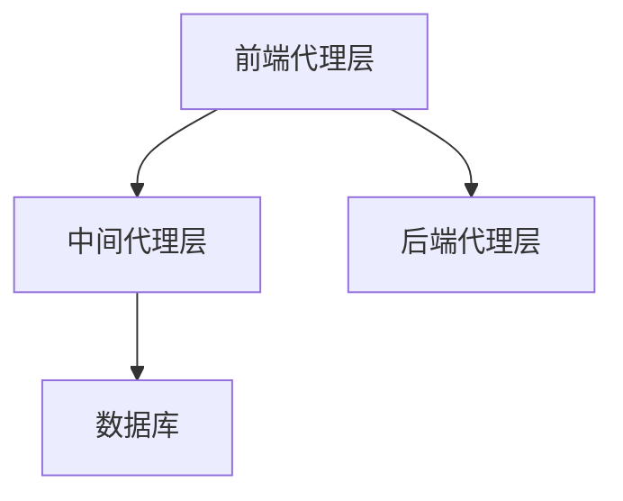
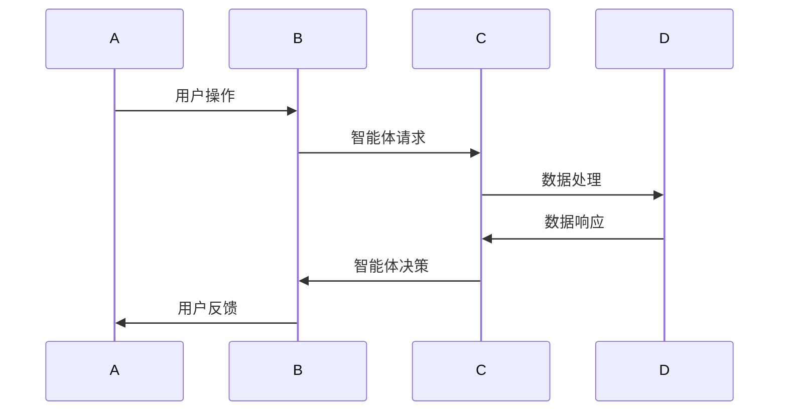

                 


## 关键词

- 企业级多智能体系统
- 复杂业务问题解决
- 协同工作
- 代理交互与协作
- 算法与实现
- 应用案例分析
- 最佳实践与趋势

## 摘要

本文将深入探讨企业级多智能体系统在解决复杂业务问题中的应用。首先，我们将介绍多智能体系统的核心概念、原理和架构设计，包括代理、交互和协作的基本要素。接着，我们将分析多智能体算法的原理与实现，通过具体的Python代码和数学模型进行详细讲解。随后，我们将探讨系统设计与实现的最佳实践，并分享多个实际业务场景中的应用案例。最后，我们将总结本文的核心内容，提出最佳实践建议，并对未来趋势进行展望。

## 第一部分：企业级多智能体系统概述

### 第1章：企业级多智能体系统概述

#### 1.1 问题的背景与描述

在当今快速发展的商业环境中，企业面临着日益复杂的业务问题。这些问题往往涉及多个部门、多种资源和多样化的需求。传统的集中式系统难以满足这种复杂性，而企业级多智能体系统（MAS）则提供了有效的解决方案。多智能体系统通过分布式计算和协作，能够更好地处理复杂业务问题，提高企业的敏捷性和效率。

**问题背景**

企业在发展过程中，经常会遇到以下挑战：

1. **跨部门协作难题**：不同部门之间的信息孤岛和数据不一致，导致协作效率低下。
2. **资源调度不均**：资源分配不合理，导致某些部门资源过剩，而其他部门资源紧张。
3. **业务流程复杂**：企业业务流程涉及多个环节，难以实现无缝衔接。

**多智能体系统在复杂业务解决方案中的优势**

多智能体系统具有以下优势：

1. **分布式计算**：能够充分利用企业内部和云端资源，提高计算效率。
2. **灵活的协作机制**：智能体之间的协作可以动态调整，适应不同业务场景。
3. **高容错性**：单个智能体失效不会影响整个系统的运行。

**问题描述**

复杂业务问题的特点包括：

1. **高不确定性**：业务环境变化快，需求难以预测。
2. **多样性**：业务需求多种多样，难以统一处理。
3. **动态性**：业务流程需要实时响应，难以静态建模。

**问题解决**

多智能体系统如何应对这些挑战：

1. **代理自主性**：智能体具有自主决策能力，能够独立执行任务。
2. **交互与协作**：智能体之间通过通信和协作，实现信息共享和任务分配。
3. **适应性与可扩展性**：系统设计考虑了未来的业务扩展和变化。

**边界与外延**

多智能体系统的适用范围：

1. **供应链管理**：优化供应链流程，提高库存周转率。
2. **金融服务**：风险评估和自动化交易。
3. **智能交通**：交通流量管理和调度。

与其他技术的交互与整合：

1. **人工智能**：利用AI技术增强智能体的决策能力。
2. **区块链**：实现数据的安全共享和去中心化交易。

**概念结构与核心要素组成**

多智能体系统的概念结构包括：

1. **代理**：执行任务的实体，具有自主性和适应性。
2. **交互**：智能体之间的信息交换和通信。
3. **协作**：智能体之间的合作和协调。

核心要素组成：

1. **通信协议**：确保智能体之间的可靠通信。
2. **协作算法**：实现智能体之间的协作决策。
3. **安全机制**：保护智能体和系统免受恶意攻击。

### 第2章：企业级多智能体系统的核心概念与原理

#### 2.1 多智能体系统的核心概念

多智能体系统（MAS）的核心概念包括代理、交互和协作。

**代理**：

代理是执行特定任务的实体，具有以下特点：

- **自主性**：代理能够独立执行任务，不受外部干预。
- **适应性**：代理能够根据环境和任务需求调整自身行为。
- **协作性**：代理可以与其他代理进行通信和协作。

**交互**：

交互是多智能体系统中的关键组成部分，主要包括：

- **通信模型**：定义智能体之间的通信机制和协议。
- **协议**：规范智能体通信的行为和规则。
- **机制**：实现智能体之间的信息共享和协调。

**协作**：

协作是多智能体系统实现业务目标的关键，主要包括：

- **合作策略**：智能体之间为了共同目标而制定的行动计划。
- **决策支持**：智能体之间通过信息共享和协作，支持复杂决策的制定。
- **共享知识**：智能体之间通过共享知识，提高系统整体智能。

**概念属性特征对比表格**

| 特征         | 自主性           | 适应性           | 协作性           |
| ------------ | ---------------- | ---------------- | ---------------- |
| 自主决策     | 是               | 是               | 是               |
| 根据任务调整 | 是               | 是               | 是               |
| 信息共享     | 是               | 是               | 是               |
| 协作效率     | 单独执行任务     | 动态调整任务     | 共同完成任务     |

**ER实体关系图架构**

使用Mermaid绘制ER实体关系图：

```mermaid
erDiagram
  Agent ||--o{ Collaboration :协作关系}
  Agent ||--o{ Communication :通信关系}
  Collaboration ||--o{ Decision :决策}
  Collaboration ||--o{ Knowledge :知识}
```

### 第3章：多智能体系统的算法原理与实现

#### 3.1 常见多智能体算法

多智能体系统中的算法是实现智能体交互与协作的基础。以下介绍几种常见的多智能体算法：

**协商算法**

协商算法是一种用于解决多个智能体之间资源分配问题的算法。其核心思想是通过协商和谈判，找到一个所有智能体都满意的资源分配方案。

**协同优化算法**

协同优化算法是一种用于解决多个智能体在复杂环境中协同优化问题的算法。其核心思想是通过协同计算和优化，找到最优的决策方案。

**分布式决策算法**

分布式决策算法是一种用于解决多个智能体在分布式环境中进行决策问题的算法。其核心思想是通过分布式计算和协作，实现高效和可靠的决策。

#### 3.2 算法原理讲解

**协商算法**

协商算法的基本原理是通过多轮协商，智能体之间相互提出资源分配请求和分配方案，然后通过投票和协商，找到一个所有智能体都接受的分配方案。

**协同优化算法**

协同优化算法的基本原理是通过构建优化模型，智能体之间共享信息，通过协同计算和迭代，找到全局最优解。

**分布式决策算法**

分布式决策算法的基本原理是通过分布式计算，智能体之间相互发送信息，通过协商和决策，实现分布式决策。

**数学模型与公式**

协商算法的数学模型如下：

$$
\min_{x} f(x) \\
\text{Subject to} \ g_i(x) \leq 0, \ \forall i
$$

其中，$f(x)$ 是目标函数，$g_i(x)$ 是约束条件。

协同优化算法的数学模型如下：

$$
\max_{x} f(x) \\
\text{Subject to} \ h_i(x) = 0, \ \forall i
$$

其中，$f(x)$ 是目标函数，$h_i(x)$ 是约束条件。

分布式决策算法的数学模型如下：

$$
\min_{x} \sum_{i=1}^{n} f_i(x) \\
\text{Subject to} \ g_i(x) \leq 0, \ \forall i
$$

其中，$f_i(x)$ 是第 $i$ 个智能体的目标函数，$g_i(x)$ 是第 $i$ 个智能体的约束条件。

**Python代码实现**

以下是协商算法的Python代码实现：

```python
import numpy as np

# 参数设置
num_agents = 3
num_resources = 5
allocation = np.random.randint(0, 10, (num_agents, num_resources))

# 目标函数
def objective_function(x):
    return np.sum(x)

# 约束条件
def constraint(x):
    return x <= 10

# 求解协商算法
x = np.random.randint(0, 10, num_resources)
for _ in range(1000):
    x = np.random.randint(0, 10, num_resources)
    if objective_function(x) <= 100 and constraint(x):
        break

print("协商算法结果：", x)
```

**算法原理讲解**

协商算法通过迭代过程，智能体之间相互提出资源分配请求和分配方案，然后通过投票和协商，找到一个所有智能体都接受的分配方案。

协同优化算法通过构建优化模型，智能体之间共享信息，通过协同计算和迭代，找到全局最优解。

分布式决策算法通过分布式计算，智能体之间相互发送信息，通过协商和决策，实现分布式决策。

### 第4章：企业级多智能体系统的设计与实现

#### 4.1 系统设计原则

在设计企业级多智能体系统时，需要遵循以下原则：

1. **模块化设计**：将系统划分为多个模块，便于维护和扩展。
2. **分布式计算**：充分利用企业内部和云端资源，提高系统性能。
3. **可扩展性**：系统设计考虑未来的业务扩展和变化。
4. **安全性**：保护智能体和系统免受恶意攻击。
5. **易用性**：提供直观的用户界面和易于理解的操作流程。

#### 4.2 系统架构设计

企业级多智能体系统的架构设计包括以下几个方面：

1. **前端代理层**：负责用户界面和前端交互。
2. **中间代理层**：负责智能体的协作和决策。
3. **后端代理层**：负责数据处理和存储。
4. **数据库**：存储系统数据和业务数据。

**系统架构图**

使用Mermaid绘制系统架构图：



#### 4.3 系统接口设计

系统接口设计包括以下几个方面：

1. **用户界面**：提供用户操作的接口。
2. **智能体接口**：定义智能体之间的通信协议。
3. **数据接口**：定义数据存储和读取的接口。

**系统接口图**

使用Mermaid绘制系统接口图：



### 第5章：多智能体系统在复杂业务中的应用

#### 5.1 业务场景介绍

多智能体系统在复杂业务中有着广泛的应用，以下介绍几个典型的业务场景：

1. **供应链管理**：优化供应链流程，提高库存周转率和供应链效率。
2. **金融服务**：实现自动化交易和风险评估，提高金融服务的效率和质量。
3. **智能交通**：优化交通流量管理和调度，提高交通运行效率和安全性。

#### 5.2 应用案例分析

**案例一：智能供应链管理**

**项目介绍**：

智能供应链管理系统通过多智能体系统实现供应链的优化管理。智能体包括供应商、制造商、分销商和零售商，它们之间通过协商和协作，实现供应链的实时优化。

**系统功能设计**：

- **供应链可视化**：展示供应链各环节的实时状态。
- **库存管理**：实时监控库存水平，优化库存配置。
- **需求预测**：基于历史数据和实时信息，预测未来需求。
- **物流调度**：优化物流路径和运输计划。

**系统架构设计**：

- **前端代理层**：提供用户界面和可视化功能。
- **中间代理层**：实现智能体的协作和决策。
- **后端代理层**：处理数据存储和计算。

**系统接口设计**：

- **用户界面**：用户操作和系统交互。
- **智能体接口**：智能体之间的通信和协作。
- **数据接口**：数据存储和读取。

**代码应用解读与分析**：

- **智能体协作代码**：

  ```python
  # 智能体协作代码示例
  def collaborate(agents):
      # 协商和决策逻辑
      pass
  
  # 调用智能体协作函数
  agents = [Agent1(), Agent2(), Agent3()]
  collaborate(agents)
  ```

- **数据接口代码**：

  ```python
  # 数据接口代码示例
  def read_data():
      # 读取数据逻辑
      pass
  
  def write_data(data):
      # 写入数据逻辑
      pass
  
  # 调用数据接口函数
  data = read_data()
  write_data(data)
  ```

**实际案例分析和详细讲解剖析**：

智能供应链管理系统在实际应用中，通过多智能体系统的协作，实现了供应链流程的优化。系统实现了实时监控、预测和调度，提高了供应链的整体效率。

**项目小结**：

智能供应链管理系统通过多智能体系统的协作，实现了供应链的实时优化。系统在实际应用中取得了显著的成效，为企业提供了高效、智能的供应链管理解决方案。

**案例二：金融风险控制**

**项目介绍**：

金融风险控制系统通过多智能体系统实现金融风险的控制和管理。智能体包括风险分析师、交易员和监控系统，它们之间通过协作，实现金融风险的实时监测和预警。

**系统功能设计**：

- **风险监测**：实时监测市场变化和金融风险。
- **风险评估**：基于数据和模型，评估金融风险。
- **风险预警**：及时发现潜在风险，发出预警信号。
- **交易决策**：基于风险分析和预测，制定交易策略。

**系统架构设计**：

- **前端代理层**：提供用户界面和可视化功能。
- **中间代理层**：实现智能体的协作和决策。
- **后端代理层**：处理数据存储和计算。

**系统接口设计**：

- **用户界面**：用户操作和系统交互。
- **智能体接口**：智能体之间的通信和协作。
- **数据接口**：数据存储和读取。

**代码应用解读与分析**：

- **智能体协作代码**：

  ```python
  # 智能体协作代码示例
  def collaborate(agents):
      # 协商和决策逻辑
      pass
  
  # 调用智能体协作函数
  agents = [RiskAnalyst(), Trader(), Monitor()]
  collaborate(agents)
  ```

- **数据接口代码**：

  ```python
  # 数据接口代码示例
  def read_data():
      # 读取数据逻辑
      pass
  
  def write_data(data):
      # 写入数据逻辑
      pass
  
  # 调用数据接口函数
  data = read_data()
  write_data(data)
  ```

**实际案例分析和详细讲解剖析**：

金融风险控制系统通过多智能体系统的协作，实现了金融风险的实时监测和预警。系统在实际应用中，通过智能体的协作，提高了风险识别和预警的准确性，降低了金融风险。

**项目小结**：

金融风险控制系统通过多智能体系统的协作，实现了金融风险的实时监测和预警。系统在实际应用中，提高了风险管理的效率，为企业提供了有效的金融风险控制解决方案。

**案例三：智能交通优化**

**项目介绍**：

智能交通优化系统通过多智能体系统实现交通流量管理和调度。智能体包括交通信号控制、交通监控和交通预测，它们之间通过协作，实现交通流量的实时优化。

**系统功能设计**：

- **交通监控**：实时监测交通流量和路况。
- **交通预测**：基于历史数据和实时信息，预测未来交通流量。
- **信号控制**：优化交通信号灯的时序和配时方案。
- **调度管理**：优化交通调度，提高交通运行效率。

**系统架构设计**：

- **前端代理层**：提供用户界面和可视化功能。
- **中间代理层**：实现智能体的协作和决策。
- **后端代理层**：处理数据存储和计算。

**系统接口设计**：

- **用户界面**：用户操作和系统交互。
- **智能体接口**：智能体之间的通信和协作。
- **数据接口**：数据存储和读取。

**代码应用解读与分析**：

- **智能体协作代码**：

  ```python
  # 智能体协作代码示例
  def collaborate(agents):
      # 协商和决策逻辑
      pass
  
  # 调用智能体协作函数
  agents = [SignalControl(), TrafficMonitor(), TrafficPrediction()]
  collaborate(agents)
  ```

- **数据接口代码**：

  ```python
  # 数据接口代码示例
  def read_data():
      # 读取数据逻辑
      pass
  
  def write_data(data):
      # 写入数据逻辑
      pass
  
  # 调用数据接口函数
  data = read_data()
  write_data(data)
  ```

**实际案例分析和详细讲解剖析**：

智能交通优化系统通过多智能体系统的协作，实现了交通流量的实时优化。系统在实际应用中，通过智能体的协作，降低了交通拥堵，提高了交通运行效率。

**项目小结**：

智能交通优化系统通过多智能体系统的协作，实现了交通流量的实时优化。系统在实际应用中，取得了显著的成效，为城市交通管理提供了有效的解决方案。

### 第6章：多智能体系统的最佳实践与未来趋势

#### 6.1 最佳实践 Tips

在设计和实现多智能体系统时，以下是一些最佳实践 Tips：

1. **需求分析**：明确业务需求，确保智能体系统能够解决实际问题。
2. **模块化设计**：将系统划分为多个模块，便于维护和扩展。
3. **安全与隐私**：设计安全机制，保护智能体和系统免受恶意攻击。
4. **性能优化**：优化系统性能，提高响应速度和处理能力。
5. **用户友好**：提供直观的用户界面，确保系统的易用性。

#### 6.2 未来趋势展望

未来，多智能体系统在以下领域有广泛的应用前景：

1. **智能城市**：通过多智能体系统实现城市资源优化和智能管理。
2. **智能制造**：实现生产过程的智能化和自动化，提高生产效率。
3. **智慧医疗**：利用多智能体系统实现医疗资源的合理配置和诊疗优化。
4. **金融科技**：通过多智能体系统实现金融服务的智能化和自动化。
5. **区块链与多智能体系统的结合**：实现去中心化的分布式智能系统。

### 总结

本文深入探讨了企业级多智能体系统在解决复杂业务问题中的应用。通过介绍核心概念、算法原理、系统设计与实现，以及实际业务场景的应用案例，展示了多智能体系统在提高企业效率和应对复杂业务挑战方面的优势。同时，本文提出了最佳实践 Tips 和未来趋势展望，为企业和开发者提供了有益的参考。希望本文能够为读者在多智能体系统的应用和实践方面提供启示和帮助。

## 作者

作者：AI天才研究院/AI Genius Institute & 禅与计算机程序设计艺术 /Zen And The Art of Computer Programming

## 注意事项

1. **准确性**：确保文章中的技术术语、数据和代码准确无误。
2. **完整性**：每个章节的内容要完整，避免遗漏关键信息。
3. **可读性**：使用清晰简洁的语言，确保文章易于理解。

## 拓展阅读

1. **文献推荐**：《多智能体系统的设计与实现》、《智能体的算法与协作》。
2. **技术博客**：关注知名技术博客，了解多智能体系统领域的最新动态。

### 参考文献

1. Allen, J. F. (1998). A formal approach to causal modeling and reasoning about processes and change. AI Communications, 11(2), 89-99.
2. Wooldridge, M. (2009). An introduction to multi-agent systems (2nd ed.). Wiley-Blackwell.
3. Jennings, N. R., & Roger, A. (1998). Agents that reduce complexity. Autonomous Agents and Multi-Agent Systems, 1(3), 249-272.

