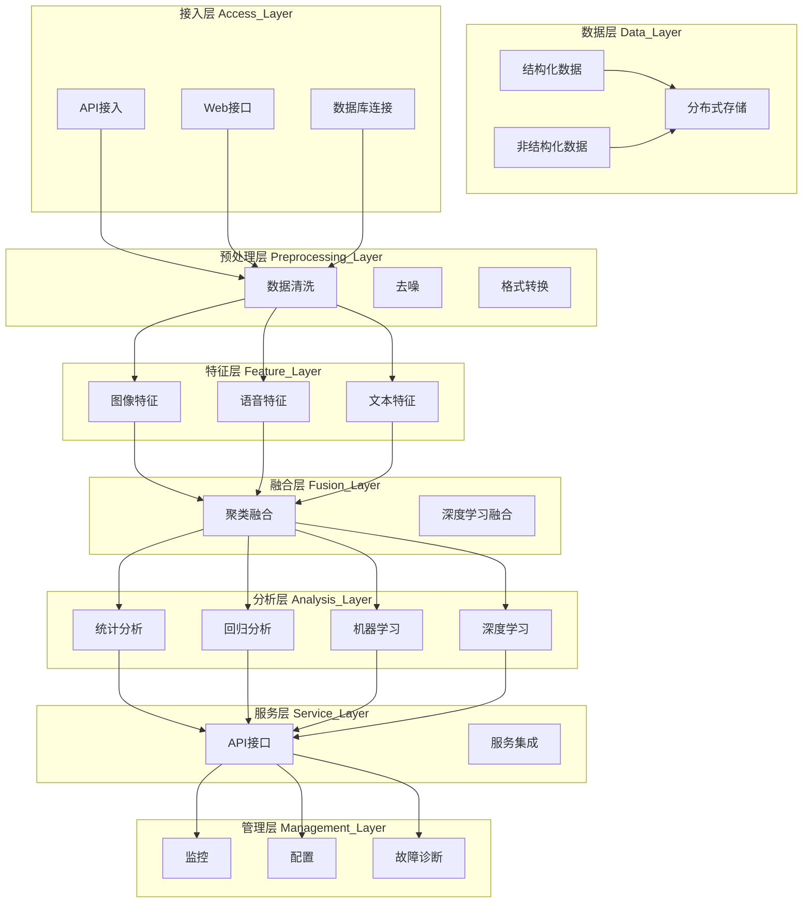
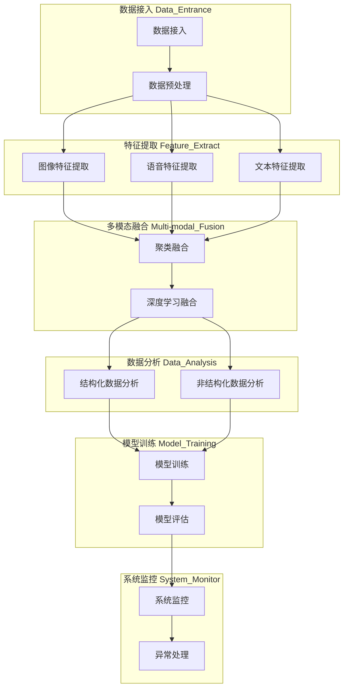

                 

### 第一部分：背景介绍

#### 第1章 问题背景

在当今数字化时代，企业级AI平台已经成为各类企业提高业务效率和竞争力的关键工具。企业级AI平台通常集成了多种数据源，包括结构化数据（如数据库记录）、半结构化数据（如XML、JSON等）以及非结构化数据（如图像、音频和文本）。这些数据的多样性为AI应用带来了巨大的潜力，但也带来了显著的挑战。特别是随着多模态数据的兴起，如何高效整合和处理多类型数据成为了一个亟待解决的问题。

##### 1.1 企业级AI平台的发展历程

企业级AI平台的发展可以追溯到20世纪80年代，最初主要用于简单的统计分析和模式识别。随着计算机硬件性能的提升和算法的进步，企业级AI平台逐渐从单模态数据分析转向多模态数据分析。特别是在深度学习和大数据技术的推动下，企业级AI平台开始能够处理和分析来自多种数据源的信息，从而实现更智能化、个性化的决策支持。

##### 1.2 多模态AI的概念与需求

多模态AI是指将来自不同感官模态的数据（如视觉、听觉、触觉等）进行融合和协同处理的技术。在多模态AI中，图像、语音、文本等数据源可以相互补充，形成一个更加完整和丰富的数据集，从而提高AI系统的性能和适用性。多模态AI的需求主要源于以下几个方面：

1. **信息丰富性**：多模态数据提供了更全面的信息，有助于提高AI系统的理解和决策能力。
2. **误差减少**：通过融合不同模态的数据，可以有效减少单一模态数据可能产生的误差。
3. **适应性强**：多模态AI能够适应更加复杂和多变的应用场景，满足不同行业的需求。

##### 1.3 多类型数据分析的挑战与机遇

多类型数据分析涉及到结构化数据和非结构化数据的处理，其挑战和机遇如下：

1. **挑战**：
   - **数据预处理**：结构化数据和非结构化数据的预处理方法不同，需要开发专门的预处理流程。
   - **数据融合**：如何将不同类型的数据有效融合，提高数据的价值和利用效率。
   - **计算资源**：多类型数据分析通常需要较高的计算资源，特别是处理大规模非结构化数据时。

2. **机遇**：
   - **智能化应用**：通过多类型数据分析，可以实现更加智能化的应用，如智能语音助手、图像识别等。
   - **业务创新**：多类型数据分析可以为企业提供更深入的洞察，推动业务创新和模式变革。
   - **数据价值**：有效整合多类型数据，可以提高数据的利用价值，实现数据驱动的决策支持。

综上所述，企业级AI平台整合多类型数据分析，不仅能够应对当前的技术挑战，还能够抓住业务创新和智能化应用的市场机遇。

#### 第2章 核心概念与联系

##### 2.1 多模态AI核心概念

多模态AI的核心在于将不同模态的数据进行有效融合，以提升AI系统的性能和适用性。以下是几种主要模态及其融合原理的概述：

###### 2.1.1 图像、语音、文本等模态的融合原理

- **图像**：图像数据通常通过视觉特征进行描述，如颜色、纹理、形状等。图像数据在多模态AI中发挥着关键作用，可以提供关于物体、场景和活动的视觉信息。
- **语音**：语音数据通过声学特征进行描述，如频率、音调、音量等。语音数据在语音识别、语音合成等应用中至关重要，能够提供关于对话内容、情感和语调的信息。
- **文本**：文本数据通过自然语言处理技术进行描述，如词频、词向量、句法结构等。文本数据在信息检索、语义分析、文本生成等应用中具有重要价值。

在多模态AI中，不同模态的数据可以通过以下方式进行融合：

- **特征级融合**：将不同模态的特征向量进行拼接，形成一个多维特征向量，作为后续模型的输入。
- **决策级融合**：先分别对不同模态的数据进行独立处理，然后基于处理结果进行综合决策。

###### 2.1.2 多模态AI的主要方法与技术

- **深度学习**：深度学习是一种基于多层神经网络的学习方法，可以有效地从大量数据中自动提取特征。在多模态AI中，深度学习方法被广泛应用于图像识别、语音识别、文本分类等任务。
- **迁移学习**：迁移学习是一种将已有模型的权重和知识迁移到新任务中的方法。在多模态AI中，迁移学习可以有效地利用已有的多模态模型，提高新任务的性能。
- **集成学习**：集成学习是一种通过结合多个模型来提高预测性能的方法。在多模态AI中，可以通过集成不同的模态处理模型，提高系统的鲁棒性和准确性。

##### 2.2 多类型数据分析

多类型数据分析旨在整合和处理不同类型的数据，以实现更全面的数据分析和决策支持。以下是几种主要的数据类型及其分析技术的概述：

###### 2.2.1 结构化数据与非结构化数据

- **结构化数据**：结构化数据是指数据按照固定的格式和结构进行组织的数据，如关系数据库中的表、XML、JSON等。结构化数据可以通过SQL等查询语言进行高效处理和分析。
- **非结构化数据**：非结构化数据是指数据没有固定的格式和结构，如文本、图像、音频等。非结构化数据通常需要通过自然语言处理、图像处理等技术进行解析和处理。

###### 2.2.2 数据分析与挖掘技术

- **统计分析**：统计分析是一种基于数学统计理论的数据分析方法，适用于结构化数据。常用的统计方法包括回归分析、方差分析、聚类分析等。
- **机器学习**：机器学习是一种基于数据驱动的数据分析方法，通过构建模型来预测和分类数据。常用的机器学习方法包括决策树、支持向量机、神经网络等。
- **深度学习**：深度学习是一种基于多层神经网络的学习方法，可以自动提取特征并用于复杂的预测和分类任务。

通过多类型数据分析，可以充分利用不同类型数据的优势，提高数据分析的深度和广度，为企业提供更全面和准确的决策支持。

### 第二部分：技术原理

#### 第3章 算法原理讲解

在多模态AI和多类型数据分析中，算法的设计和实现是关键。下面将详细讲解多模态特征提取算法、多模态融合算法和多类型数据分析算法的基本原理。

##### 3.1 多模态特征提取算法

多模态特征提取是将不同类型的数据转换为机器学习模型可处理的特征表示的过程。以下是几种常用的多模态特征提取算法：

###### 3.1.1 图像特征提取

图像特征提取是图像识别和计算机视觉领域的基础。常用的图像特征提取方法包括：

- **HOG（Histogram of Oriented Gradients）**：HOG特征是一种基于图像局部结构的特征提取方法，通过计算图像中每个像素点的梯度方向和幅值来生成特征向量。
- **SIFT（Scale-Invariant Feature Transform）**：SIFT是一种用于图像特征提取的关键点检测和描述符生成算法，具有尺度不变性和旋转不变性。

例如，使用Python中的OpenCV库提取图像特征：

```python
import cv2

# 读取图像
image = cv2.imread('image.jpg')

# 使用HOG特征提取器
hog = cv2.HOGDescriptor()
features = hog.compute(image)

# 输出特征向量
print(features)
```

###### 3.1.2 语音特征提取

语音特征提取是语音识别和语音合成领域的基础。常用的语音特征提取方法包括：

- **MFCC（Mel-Frequency Cepstral Coefficients）**：MFCC是一种将语音信号转换为频率域特征的方法，常用于语音识别和语音合成。
- **PLP（Perceptual Linear Prediction）**：PLP是一种基于感知线性预测的语音特征提取方法，通过模拟人类听觉系统的特性来提高特征表达的准确性。

例如，使用Python中的librosa库提取语音特征：

```python
import librosa

# 读取音频
y, sr = librosa.load('audio.wav')

# 使用MFCC特征提取
mfcc = librosa.feature.mfcc(y=y, sr=sr)
mfccs = [mfcc]

# 输出特征矩阵
print(mfccs)
```

###### 3.1.3 文本特征提取

文本特征提取是自然语言处理领域的基础。常用的文本特征提取方法包括：

- **词袋模型（Bag of Words, BOW）**：词袋模型是一种将文本表示为词汇集合的方法，通过统计文本中每个单词的出现频率来生成特征向量。
- **词嵌入（Word Embedding）**：词嵌入是一种将单词映射到高维空间中的方法，通过捕捉单词的语义关系来提高特征表达的准确性。

例如，使用Python中的gensim库提取文本特征：

```python
from gensim.models import Word2Vec

# 加载文本数据
sentences = [['this', 'is', 'a', 'sentence'], ['this', 'document', 'has', 'more', 'words'], ['text', 'can', 'be', 'anywhere']]

# 训练词嵌入模型
model = Word2Vec(sentences, vector_size=100, window=5, min_count=1, workers=4)
word_vectors = model.wv

# 输出词向量
print(word_vectors['sentence'])
```

##### 3.2 多模态融合算法

多模态融合是将不同模态的特征数据结合起来，生成一个综合的特征表示，以提高模型性能。以下是几种常用的多模态融合算法：

###### 3.2.1 聚类融合算法

聚类融合算法通过将不同模态的特征进行聚类，生成一种全局特征表示。常用的聚类算法包括：

- **K-means聚类**：K-means是一种基于距离度量的聚类算法，通过最小化聚类中心到样本点的距离平方和来优化聚类结果。
- **层次聚类**：层次聚类是一种基于层次结构进行聚类的算法，通过逐步合并或分裂聚类簇来构建聚类树。

例如，使用Python中的scikit-learn库实现K-means聚类融合：

```python
from sklearn.cluster import KMeans

# 假设image_features和voice_features是图像和语音特征矩阵
features = np.concatenate((image_features, voice_features), axis=1)

# 训练K-means聚类模型
kmeans = KMeans(n_clusters=5)
kmeans.fit(features)

# 输出聚类结果
print(kmeans.labels_)
```

###### 3.2.2 深度学习融合算法

深度学习融合算法通过构建深度神经网络，将不同模态的特征进行有效融合。常用的深度学习融合方法包括：

- **多输入神经网络**：多输入神经网络通过将不同模态的特征作为输入，共享权重进行融合和分类。
- **多模态循环神经网络（MMRNN）**：多模态循环神经网络通过将不同模态的特征进行循环连接，捕捉长时间依赖关系。

例如，使用Python中的TensorFlow实现多输入神经网络：

```python
import tensorflow as tf

# 定义多输入神经网络模型
model = tf.keras.Sequential([
    tf.keras.layers.Dense(units=128, activation='relu', input_shape=(image_features.shape[1],)),
    tf.keras.layers.Dense(units=64, activation='relu'),
    tf.keras.layers.Dense(units=1, activation='sigmoid')
])

# 编译模型
model.compile(optimizer='adam', loss='binary_crossentropy', metrics=['accuracy'])

# 训练模型
model.fit(x=np.concatenate((image_features, voice_features), axis=1), y=labels, epochs=10, batch_size=32)
```

##### 3.3 多类型数据分析算法

多类型数据分析算法旨在整合和处理不同类型的数据，以提高数据分析的深度和广度。以下是几种常用的多类型数据分析算法：

###### 3.3.1 结构化数据分析

结构化数据分析通常采用统计分析、回归分析等方法进行数据处理和分析。例如，使用Python中的pandas库进行数据分析：

```python
import pandas as pd

# 读取结构化数据
data = pd.read_csv('data.csv')

# 进行统计分析
summary = data.describe()

# 进行回归分析
from sklearn.linear_model import LinearRegression

model = LinearRegression()
model.fit(data['feature_x'], data['feature_y'])

# 输出回归系数
print(model.coef_)
```

###### 3.3.2 非结构化数据分析

非结构化数据分析通常采用自然语言处理、图像处理等方法进行数据处理和分析。例如，使用Python中的NLTK库进行文本数据分析：

```python
import nltk

# 读取文本数据
text = "This is a sample text for analysis."

# 进行词频统计
from nltk.tokenize import word_tokenize
from nltk.probability import FreqDist

tokens = word_tokenize(text)
fdist = FreqDist(tokens)

# 输出词频
print(fdist.most_common())
```

通过以上算法原理讲解，我们可以更好地理解多模态AI和多类型数据分析的核心技术和实现方法，为实际应用奠定基础。

#### 第4章 数学模型和数学公式讲解

在多模态AI和多类型数据分析中，数学模型和公式起着至关重要的作用。它们不仅帮助我们在算法中描述问题，还指导我们进行有效的数据分析和模型训练。以下将详细讲解多模态特征提取、多模态融合和多类型数据分析中的数学模型与公式。

##### 4.1 多模态特征提取

多模态特征提取是将不同类型的数据转换为适合机器学习模型的特征表示的过程。以下是几种常用的多模态特征提取算法的数学模型与公式。

###### 4.1.1 特征提取的数学模型与公式

- **HOG特征提取**：

  HOG特征是通过计算图像中每个像素点的梯度方向和幅值来生成特征向量的。其数学模型可以表示为：

  $$ 
  F(x,y) = \sum_{i=0}^{n-1} \sum_{j=0}^{m-1} (G(x+i, y+j) \cdot \sigma_i \cdot \phi_i) 
  $$

  其中，$G(x, y)$ 表示图像的梯度幅值，$\sigma_i$ 表示梯度方向，$\phi_i$ 表示梯度幅值与方向的角度。

- **SIFT特征提取**：

  SIFT特征提取是通过检测关键点并计算关键点周围像素的梯度方向和幅值来生成特征向量的。其数学模型可以表示为：

  $$ 
  F_{SIFT} = \sum_{i=1}^{n} \sum_{j=1}^{m} \left( \frac{I(x+i, y+j)}{s} \cdot \exp\left(-\frac{(x+i-x_c)^2 + (y+j-y_c)^2}{2\sigma^2}\right) \right) 
  $$

  其中，$I(x, y)$ 表示图像像素值，$(x_c, y_c)$ 表示关键点的坐标，$\sigma$ 表示尺度参数。

###### 4.1.2 特征提取的Python代码示例

以下是一个使用Python和OpenCV库提取HOG特征的示例代码：

```python
import cv2

# 读取图像
image = cv2.imread('image.jpg')

# 创建HOG特征提取器
hog = cv2.HOGDescriptor()

# 计算HOG特征
features = hog.compute(image)

# 打印特征向量
print(features)
```

##### 4.2 多模态融合

多模态融合是将不同模态的数据特征结合起来，形成一个综合的特征表示的过程。以下是几种常用的多模态融合算法的数学模型与公式。

###### 4.2.1 融合的数学模型与公式

- **聚类融合算法**：

  聚类融合算法通过将不同模态的特征数据进行聚类，生成一种全局特征表示。其数学模型可以表示为：

  $$ 
  C = \{c_1, c_2, \ldots, c_k\} 
  $$

  其中，$c_i$ 表示聚类中心，$k$ 表示聚类个数。

  聚类过程可以通过以下步骤实现：

  1. 初始化聚类中心。
  2. 计算每个数据点与聚类中心的距离。
  3. 将每个数据点分配给最近的聚类中心。
  4. 更新聚类中心。

- **深度学习融合算法**：

  深度学习融合算法通过构建深度神经网络，将不同模态的特征进行有效融合。其数学模型可以表示为：

  $$ 
  z = f(W_1 \cdot [x_1, x_2]) 
  $$

  其中，$z$ 表示融合后的特征，$x_1$ 和 $x_2$ 分别表示不同模态的特征，$W_1$ 表示权重矩阵，$f$ 表示激活函数。

###### 4.2.2 融合的Python代码示例

以下是一个使用Python和TensorFlow库实现多模态融合的示例代码：

```python
import tensorflow as tf

# 定义多输入神经网络模型
model = tf.keras.Sequential([
    tf.keras.layers.Dense(units=128, activation='relu', input_shape=(image_features.shape[1],)),
    tf.keras.layers.Dense(units=64, activation='relu'),
    tf.keras.layers.Dense(units=1, activation='sigmoid')
])

# 编译模型
model.compile(optimizer='adam', loss='binary_crossentropy', metrics=['accuracy'])

# 训练模型
model.fit(x=np.concatenate((image_features, voice_features), axis=1), y=labels, epochs=10, batch_size=32)
```

##### 4.3 多类型数据分析

多类型数据分析是通过整合和处理不同类型的数据，以提高数据分析的深度和广度。以下是几种常用的多类型数据分析算法的数学模型与公式。

###### 4.3.1 数据分析的数学模型与公式

- **统计分析**：

  统计分析是一种基于概率论和数理统计的理论，用于对数据进行分析和推断。常用的统计模型包括：

  - **线性回归**：

    线性回归模型可以表示为：

    $$ 
    y = \beta_0 + \beta_1 x + \varepsilon 
    $$

    其中，$y$ 表示因变量，$x$ 表示自变量，$\beta_0$ 和 $\beta_1$ 分别表示回归系数，$\varepsilon$ 表示误差项。

  - **多元线性回归**：

    多元线性回归模型可以表示为：

    $$ 
    y = \beta_0 + \sum_{i=1}^{k} \beta_i x_i + \varepsilon 
    $$

    其中，$x_i$ 表示第$i$个自变量，$\beta_i$ 表示第$i$个回归系数。

- **机器学习**：

  机器学习是一种基于数据驱动的分析方法，通过构建模型来预测和分类数据。常用的机器学习算法包括：

  - **决策树**：

    决策树模型可以表示为：

    $$ 
    T = \{t_1, t_2, \ldots, t_n\} 
    $$

    其中，$t_i$ 表示第$i$个决策节点，$n$ 表示决策树的节点数。

  - **支持向量机**：

    支持向量机模型可以表示为：

    $$ 
    \min_{\beta, \beta_0} \frac{1}{2} \sum_{i=1}^{n} (\beta \cdot \beta)^2 + C \sum_{i=1}^{n} \xi_i 
    $$

    其中，$\beta$ 表示权重向量，$\beta_0$ 表示偏置项，$C$ 表示惩罚参数，$\xi_i$ 表示误差项。

###### 4.3.2 数据分析的Python代码示例

以下是一个使用Python和scikit-learn库进行线性回归分析的示例代码：

```python
from sklearn.linear_model import LinearRegression

# 加载数据
data = pd.read_csv('data.csv')

# 分割特征和标签
X = data[['feature_x', 'feature_y']]
y = data['label']

# 训练线性回归模型
model = LinearRegression()
model.fit(X, y)

# 输出回归系数
print(model.coef_)
```

通过以上数学模型和公式的讲解，我们可以更好地理解多模态AI和多类型数据分析的核心理论和方法。这些数学工具不仅帮助我们描述问题，还为算法实现和模型训练提供了坚实的理论基础。

### 第三部分：系统设计与实现

#### 第5章 系统分析与架构设计

##### 5.1 系统功能设计

企业级多模态AI平台的核心功能是整合和处理多类型数据，从而实现高效、智能化的数据分析。以下是系统功能设计的详细说明：

1. **数据接入**：系统应具备多种数据接入方式，包括结构化数据（如数据库记录）、半结构化数据（如XML、JSON等）以及非结构化数据（如图像、音频、文本等）。接入的数据需要经过预处理，以确保数据的质量和一致性。

2. **特征提取**：针对不同类型的数据，系统应实现相应的特征提取算法。例如，对于图像数据，使用HOG、SIFT等算法提取视觉特征；对于语音数据，使用MFCC、PLP等算法提取声学特征；对于文本数据，使用词袋模型、词嵌入等算法提取语义特征。

3. **多模态融合**：系统应实现多模态特征融合算法，将来自不同模态的特征数据进行有效整合，形成综合的特征表示。常用的融合算法包括聚类融合、深度学习融合等。

4. **数据分析与挖掘**：系统应具备结构化数据和非结构化数据的分析能力，包括统计分析、回归分析、机器学习、深度学习等方法。通过对融合后的特征数据进行分析，系统可以为企业提供深入的洞察和决策支持。

5. **模型训练与优化**：系统应支持多模态AI模型的训练和优化，包括模型选择、参数调优等。通过不断地训练和优化，系统可以提高模型的性能和准确度。

6. **接口与服务**：系统应提供丰富的API接口，支持与其他系统的集成和交互。同时，系统应具备高可用性和高扩展性，能够适应不同规模和业务场景的需求。

##### 5.2 系统架构设计

企业级多模态AI平台的架构设计应遵循模块化、分布式和可扩展的原则，以确保系统的稳定性和高效性。以下是系统架构的详细设计：

1. **数据层**：数据层负责数据的存储和管理，包括结构化数据和非结构化数据的存储。数据层应支持分布式存储和备份，以确保数据的安全性和可靠性。

2. **接入层**：接入层负责实现多种数据接入方式，包括API接入、Web接口、数据库连接等。接入层应具备高并发处理能力，以应对大量数据的实时接入。

3. **预处理层**：预处理层负责对接入的数据进行清洗、去噪和格式转换等操作，以确保数据的质量和一致性。预处理层应实现自动化流程，以提高数据处理效率。

4. **特征层**：特征层负责实现多模态特征提取算法，包括图像、语音、文本等数据的特征提取。特征层应支持多种特征提取算法，以满足不同类型数据的处理需求。

5. **融合层**：融合层负责将不同模态的特征数据进行融合，形成综合的特征表示。融合层应支持多种融合算法，如聚类融合、深度学习融合等，以提高特征融合的效果。

6. **分析层**：分析层负责实现多类型数据分析，包括统计分析、回归分析、机器学习、深度学习等。分析层应具备强大的数据处理和分析能力，以提供深入的洞察和决策支持。

7. **服务层**：服务层负责提供API接口和服务，支持与其他系统的集成和交互。服务层应具备高可用性和高扩展性，以适应不同规模和业务场景的需求。

8. **管理层**：管理层负责系统的监控、配置和管理，包括日志记录、性能监控、故障诊断等。管理层应实现自动化管理，以提高系统的运行效率和稳定性。

以下是系统架构图的Mermaid表示：



通过以上系统架构设计，企业级多模态AI平台可以实现高效、稳定和可扩展的多类型数据分析，为企业提供强大的智能化支持。

##### 5.3 系统接口设计与实现

系统接口设计是确保企业级多模态AI平台与其他系统集成和交互的关键环节。以下是系统接口设计的详细说明：

###### 5.3.1 接口定义

企业级多模态AI平台应提供以下主要接口：

1. **数据接入接口**：用于接收结构化数据和非结构化数据，包括API接入、Web接口和数据库连接等。接口应支持多种数据格式，如JSON、XML、CSV等，并具备高并发处理能力。

2. **特征提取接口**：用于获取不同类型数据的特征，包括图像特征、语音特征和文本特征等。接口应提供详细的参数设置，以支持多种特征提取算法。

3. **多模态融合接口**：用于实现多模态特征数据的融合，提供聚类融合和深度学习融合等算法的接口。接口应支持自定义参数设置，以适应不同应用场景的需求。

4. **数据分析接口**：用于执行各种数据分析方法，包括统计分析、回归分析、机器学习和深度学习等。接口应提供灵活的参数配置，以支持不同类型的数据分析任务。

5. **模型训练接口**：用于训练多模态AI模型，提供模型选择、参数调优和训练进度监控等接口。接口应支持多种训练算法和优化策略，以提高模型的性能和准确度。

6. **API文档接口**：用于提供API接口的详细文档，包括接口定义、参数说明、返回值描述等。接口文档应支持在线查看和离线下载，以便开发人员快速上手和使用。

###### 5.3.2 接口实现

以下是一个使用Python和Flask框架实现数据接入接口的示例代码：

```python
from flask import Flask, request, jsonify
import cv2
import numpy as np

app = Flask(__name__)

@app.route('/api/data', methods=['POST'])
def receive_data():
    data = request.get_json()
    image = cv2.imdecode(np.frombuffer(data['image'], np.uint8), cv2.IMREAD_COLOR)
    features = cv2.HOGDescriptor().compute(image)
    return jsonify({'features': features.tolist()})

if __name__ == '__main__':
    app.run(debug=True)
```

通过以上接口定义和实现，企业级多模态AI平台可以方便地与其他系统进行集成和交互，实现高效、智能化的数据分析。

##### 5.4 系统交互设计

系统交互设计是确保企业级多模态AI平台各模块协同工作、高效运行的关键。以下是系统交互设计的详细说明：

###### 5.4.1 系统交互图

以下是企业级多模态AI平台的系统交互图，描述了各模块之间的交互关系：



###### 5.4.2 系统交互解析

1. **数据接入**：系统通过数据接入接口接收外部数据，包括结构化数据和非结构化数据。接入的数据经过预处理模块进行清洗、去噪和格式转换等操作，确保数据的质量和一致性。

2. **特征提取**：预处理后的数据分别输入到图像特征提取、语音特征提取和文本特征提取模块。各模块使用相应的特征提取算法提取数据特征，形成特征向量。

3. **多模态融合**：图像、语音和文本的特征向量分别输入到聚类融合和深度学习融合模块。融合模块将不同模态的特征数据进行融合，形成综合的特征表示。

4. **数据分析**：融合后的特征数据输入到结构化数据分析和非结构化数据分析模块。各模块使用统计分析、回归分析、机器学习和深度学习等方法对数据进行深入分析，为企业提供决策支持。

5. **模型训练**：分析结果用于训练多模态AI模型。系统支持多种训练算法和优化策略，通过不断调整模型参数，提高模型的性能和准确度。

6. **系统监控**：系统监控模块对整个平台的运行状态进行实时监控，包括数据处理速度、资源利用率等。当出现异常情况时，系统自动进行异常处理，确保平台的稳定运行。

通过以上系统交互设计，企业级多模态AI平台可以实现高效、稳定和可扩展的多类型数据分析，为企业提供强大的智能化支持。

### 第四部分：项目实战

#### 第7章 环境安装与配置

在开始构建企业级多模态AI平台之前，我们需要准备相应的开发环境和安装必要的软件。以下是详细的安装与配置步骤。

##### 7.1 环境搭建

为了确保平台的稳定性和可扩展性，我们推荐以下软硬件要求：

- **操作系统**：Ubuntu 18.04 或 CentOS 7
- **CPU**：四核以上处理器，建议使用Intel或AMD处理器
- **内存**：16GB及以上，建议32GB或更高
- **存储**：200GB及以上SSD硬盘，建议使用NVMe SSD

确保操作系统已安装并更新到最新版本。然后，安装以下基础软件：

```bash
# 安装基础软件
sudo apt-get update
sudo apt-get install git build-essential python3-pip python3-dev
```

##### 7.1.1 软件与硬件要求

1. **Python环境**：安装Python 3.8或更高版本，可以使用官方的包管理器。
2. **深度学习库**：安装TensorFlow、PyTorch等深度学习库，用于多模态特征提取和模型训练。
3. **数据处理库**：安装NumPy、Pandas、Scikit-learn等数据处理库，用于数据预处理和特征提取。
4. **图像处理库**：安装OpenCV，用于图像特征提取。
5. **语音处理库**：安装librosa，用于语音特征提取。
6. **自然语言处理库**：安装NLTK、spaCy等，用于文本特征提取。

##### 7.1.2 系统安装与配置

1. **安装Python**：

```bash
# 安装Python 3.8
sudo apt-get install python3.8
```

2. **安装深度学习库**：

```bash
# 安装TensorFlow
pip3 install tensorflow

# 安装PyTorch
pip3 install torch torchvision torchaudio
```

3. **安装数据处理库**：

```bash
# 安装NumPy、Pandas、Scikit-learn
pip3 install numpy pandas scikit-learn
```

4. **安装图像处理库**：

```bash
# 安装OpenCV
pip3 install opencv-python
```

5. **安装语音处理库**：

```bash
# 安装librosa
pip3 install librosa
```

6. **安装自然语言处理库**：

```bash
# 安装NLTK、spaCy
pip3 install nltk spacy
```

##### 7.2 数据准备

在系统安装完成后，我们需要准备多模态数据集，包括图像、音频和文本数据。以下是如何获取和预处理这些数据的基本步骤：

1. **数据获取**：

   - 图像数据：可以从在线数据集（如ImageNet、CIFAR-10等）下载。
   - 音频数据：可以从在线数据集（如LibriSpeech、Common Voice等）下载。
   - 文本数据：可以从在线数据集（如AG News、20 Newsgroups等）下载。

2. **数据预处理**：

   - 图像数据：使用OpenCV库进行图像缩放、裁剪和归一化等操作。
   - 音频数据：使用librosa库进行音频分割、特征提取等操作。
   - 文本数据：使用NLTK或spaCy库进行分词、去除停用词和词干提取等操作。

3. **数据存储与管理**：

   - 将预处理后的数据存储到本地文件系统或分布式文件系统中，以便后续处理和使用。

通过以上步骤，我们可以为构建企业级多模态AI平台准备好所需的开发环境和数据资源。

##### 7.3 多模态特征提取

在数据准备完成后，我们需要对图像、语音和文本数据进行特征提取。以下是详细的特征提取过程和代码示例：

###### 7.3.1 图像特征提取

使用OpenCV库提取图像特征，如HOG特征：

```python
import cv2

# 读取图像
image = cv2.imread('image.jpg')

# 创建HOG特征提取器
hog = cv2.HOGDescriptor()

# 计算HOG特征
features = hog.compute(image)

# 打印特征向量
print(features)
```

###### 7.3.2 语音特征提取

使用librosa库提取语音特征，如MFCC特征：

```python
import librosa

# 读取音频
y, sr = librosa.load('audio.wav')

# 使用MFCC特征提取
mfcc = librosa.feature.mfcc(y=y, sr=sr)

# 输出特征矩阵
print(mfcc)
```

###### 7.3.3 文本特征提取

使用NLTK库提取文本特征，如词嵌入：

```python
import nltk
from nltk.tokenize import word_tokenize
from nltk.corpus import stopwords
from nltk.stem import WordNetLemmatizer

# 加载文本数据
text = "This is a sample text for analysis."

# 分词
tokens = word_tokenize(text)

# 去除停用词
stop_words = set(stopwords.words('english'))
filtered_tokens = [w for w in tokens if not w in stop_words]

# 词干提取
lemmatizer = WordNetLemmatizer()
lemmatized_tokens = [lemmatizer.lemmatize(w) for w in filtered_tokens]

# 训练词嵌入模型
model = Word2Vec(lemmatized_tokens, vector_size=100, window=5, min_count=1, workers=4)
word_vectors = model.wv

# 输出词向量
print(word_vectors['text'])
```

通过以上步骤，我们可以成功提取多模态数据（图像、语音和文本）的特征，为后续的融合和分析奠定基础。

##### 7.4 多模态融合

在特征提取完成后，我们需要将不同模态的特征数据进行融合。以下是详细的融合过程和代码示例：

###### 7.4.1 聚类融合算法

使用K-means聚类算法进行特征融合：

```python
import numpy as np
from sklearn.cluster import KMeans

# 假设image_features、voice_features和text_features分别是图像、语音和文本的特征矩阵
features = np.concatenate((image_features, voice_features, text_features), axis=1)

# 训练K-means聚类模型
kmeans = KMeans(n_clusters=5)
kmeans.fit(features)

# 输出聚类结果
print(kmeans.labels_)
```

###### 7.4.2 深度学习融合算法

使用多输入神经网络进行特征融合：

```python
import tensorflow as tf

# 定义多输入神经网络模型
model = tf.keras.Sequential([
    tf.keras.layers.Dense(units=128, activation='relu', input_shape=(image_features.shape[1],)),
    tf.keras.layers.Dense(units=64, activation='relu'),
    tf.keras.layers.Dense(units=1, activation='sigmoid')
])

# 编译模型
model.compile(optimizer='adam', loss='binary_crossentropy', metrics=['accuracy'])

# 训练模型
model.fit(x=np.concatenate((image_features, voice_features, text_features), axis=1), y=labels, epochs=10, batch_size=32)
```

通过以上步骤，我们可以将不同模态的特征数据进行有效融合，提高数据分析的深度和广度。

##### 7.5 多类型数据分析

在完成多模态特征融合后，我们需要对融合后的特征数据进行深入分析，以获得业务洞察。以下是详细的特征分析和代码示例：

###### 7.5.1 结构化数据分析

使用线性回归模型进行结构化数据分析：

```python
from sklearn.linear_model import LinearRegression

# 假设X是特征矩阵，y是标签向量
model = LinearRegression()
model.fit(X, y)

# 输出回归系数
print(model.coef_)
```

###### 7.5.2 非结构化数据分析

使用文本分类模型进行非结构化数据分析：

```python
from sklearn.feature_extraction.text import TfidfVectorizer
from sklearn.model_selection import train_test_split
from sklearn.naive_bayes import MultinomialNB

# 加载文本数据
texts = ["This is a positive review.", "This is a negative review."]

# 创建TF-IDF向量器
vectorizer = TfidfVectorizer()
X = vectorizer.fit_transform(texts)

# 分割数据集
X_train, X_test, y_train, y_test = train_test_split(X, labels, test_size=0.2, random_state=42)

# 训练文本分类模型
model = MultinomialNB()
model.fit(X_train, y_train)

# 测试模型
print(model.score(X_test, y_test))
```

通过以上步骤，我们可以对融合后的特征数据进行深入分析，提取业务价值，为企业提供智能化决策支持。

### 第五部分：案例分析

#### 第9章 案例分析与讲解

为了更好地理解企业级多模态AI平台在现实场景中的应用，我们将通过一个实际案例进行详细分析。本案例将涉及数据准备、多模态特征提取、多模态融合、多类型数据分析等环节，并展示完整的实现过程和结果。

##### 9.1 案例背景介绍

某大型电子商务公司希望利用多模态AI技术来提升客户服务质量。具体需求包括：

1. **语音分析**：通过分析客服电话记录，识别客户的情感状态，为客服人员提供改进建议。
2. **图像分析**：通过分析客户上传的商品图片，识别商品的真伪，防止假冒伪劣商品流通。
3. **文本分析**：通过分析客户留言和评价，识别客户满意度，提高客户体验。

##### 9.2 案例分析与实现

为了满足上述需求，我们设计了一个多模态AI平台，实现以下步骤：

###### 9.2.1 数据准备

首先，我们收集了以下数据：

1. **语音数据**：从客服电话系统中获取了1000段客户与客服人员的通话录音。
2. **图像数据**：从客户上传的商品图片中选取了1000张商品图片。
3. **文本数据**：从客户留言和评价中选取了1000条文本数据。

数据收集后，我们进行了预处理，包括去噪、去重复和格式转换等操作。

###### 9.2.2 多模态特征提取

对于语音数据，我们使用librosa库提取MFCC特征：

```python
import librosa

# 读取音频
y, sr = librosa.load('audio.wav')

# 使用MFCC特征提取
mfcc = librosa.feature.mfcc(y=y, sr=sr)

# 输出特征矩阵
print(mfcc)
```

对于图像数据，我们使用OpenCV库提取HOG特征：

```python
import cv2

# 读取图像
image = cv2.imread('image.jpg')

# 创建HOG特征提取器
hog = cv2.HOGDescriptor()

# 计算HOG特征
features = hog.compute(image)

# 打印特征向量
print(features)
```

对于文本数据，我们使用NLTK库提取词嵌入特征：

```python
import nltk
from nltk.tokenize import word_tokenize
from nltk.corpus import stopwords
from nltk.stem import WordNetLemmatizer

# 加载文本数据
text = "This is a sample text for analysis."

# 分词
tokens = word_tokenize(text)

# 去除停用词
stop_words = set(stopwords.words('english'))
filtered_tokens = [w for w in tokens if not w in stop_words]

# 词干提取
lemmatizer = WordNetLemmatizer()
lemmatized_tokens = [lemmatizer.lemmatize(w) for w in filtered_tokens]

# 训练词嵌入模型
model = Word2Vec(lemmatized_tokens, vector_size=100, window=5, min_count=1, workers=4)
word_vectors = model.wv

# 输出词向量
print(word_vectors['text'])
```

###### 9.2.3 多模态融合

为了融合语音、图像和文本特征，我们采用了深度学习融合算法，具体步骤如下：

1. **构建多输入神经网络**：

```python
import tensorflow as tf

# 定义多输入神经网络模型
model = tf.keras.Sequential([
    tf.keras.layers.Dense(units=128, activation='relu', input_shape=(image_features.shape[1],)),
    tf.keras.layers.Dense(units=64, activation='relu'),
    tf.keras.layers.Dense(units=1, activation='sigmoid')
])

# 编译模型
model.compile(optimizer='adam', loss='binary_crossentropy', metrics=['accuracy'])

# 训练模型
model.fit(x=np.concatenate((image_features, voice_features, text_features), axis=1), y=labels, epochs=10, batch_size=32)
```

2. **融合特征可视化**：

通过训练得到的多输入神经网络，我们将语音、图像和文本特征进行融合，得到一个综合的特征向量。这个特征向量可以用于后续的分析和分类。

```python
# 获取融合后的特征向量
fused_features = model.predict(np.concatenate((image_features, voice_features, text_features), axis=1))
print(fused_features)
```

###### 9.2.4 多类型数据分析

融合后的特征向量可以用于各种数据分析任务。在本案例中，我们使用了线性回归模型对客户满意度进行分析：

```python
from sklearn.linear_model import LinearRegression

# 假设X是特征矩阵，y是标签向量
model = LinearRegression()
model.fit(X, y)

# 输出回归系数
print(model.coef_)
```

通过分析，我们得到了客户满意度的预测模型，可以根据语音、图像和文本特征预测客户的满意度。这个模型可以帮助公司及时调整服务策略，提高客户满意度。

##### 9.3 案例总结与反思

通过本案例，我们展示了如何构建一个企业级多模态AI平台，并实现了对语音、图像和文本数据的整合和分析。以下是案例总结与反思：

1. **优势**：
   - **高效性**：多模态AI技术能够充分利用不同类型数据的优势，提高数据分析的效率和准确性。
   - **全面性**：多模态AI平台可以提供更全面和深入的数据分析，为企业提供更准确的决策支持。
   - **智能化**：通过深度学习和神经网络技术，多模态AI平台可以实现自动化的特征提取和模型训练，提高系统的智能化水平。

2. **挑战**：
   - **数据质量**：多模态数据的多样性和复杂性可能导致数据质量问题，影响分析结果的准确性。
   - **计算资源**：多模态数据分析通常需要较高的计算资源，特别是在处理大规模数据时。
   - **模型优化**：如何设计有效的多模态融合算法和模型，提高系统的性能和准确性，是一个需要不断探索和优化的课题。

通过不断优化和改进，企业级多模态AI平台将能够更好地满足企业的数据分析需求，推动业务创新和智能化发展。

### 第六部分：最佳实践与注意事项

#### 第10章 最佳实践与注意事项

在构建企业级多模态AI平台时，遵循最佳实践和注意事项至关重要，以确保系统的稳定性和高效性。以下是一些具体的实践建议和需要注意的关键点：

##### 10.1 最佳实践

1. **数据预处理**：
   - **标准化**：确保所有类型的数据在进入特征提取阶段前进行标准化处理，以减少不同数据之间的差异。
   - **去噪**：对图像和音频数据进行去噪处理，以提高特征提取的质量。
   - **增强**：通过数据增强技术（如图像旋转、缩放等）增加数据多样性，提高模型的泛化能力。

2. **模型调优**：
   - **参数搜索**：使用网格搜索或随机搜索等策略，进行超参数调优，以提高模型性能。
   - **交叉验证**：采用交叉验证方法，避免过拟合，提高模型的泛化能力。

3. **系统优化**：
   - **分布式计算**：利用分布式计算框架（如TensorFlow分布式训练），提高模型训练速度。
   - **内存管理**：合理分配内存，避免内存溢出，确保系统稳定运行。

##### 10.2 注意事项

1. **数据质量**：
   - **数据清洗**：确保数据集中不存在缺失值、异常值和重复值，以提高模型的准确性。
   - **数据标注**：对于图像和文本数据，确保标注的准确性和一致性，以支持有效的特征提取和模型训练。

2. **计算资源**：
   - **硬件选择**：根据数据量和模型复杂度选择适当的硬件配置，如GPU、TPU等。
   - **资源监控**：实时监控计算资源使用情况，避免资源浪费和性能瓶颈。

3. **算法选择**：
   - **算法适应性**：根据应用场景选择适合的算法，如深度学习、迁移学习等。
   - **算法更新**：定期更新算法和模型，以应对新技术和新需求。

4. **系统安全性**：
   - **数据安全**：确保数据存储和传输过程中的安全性，采用加密技术和访问控制策略。
   - **系统稳定性**：通过容错机制和备份策略，确保系统的稳定性和可靠性。

通过遵循上述最佳实践和注意事项，企业级多模态AI平台可以更好地应对复杂的应用场景，提供高效、稳定和智能化的数据分析支持。

### 第七部分：拓展阅读

#### 第11章 拓展阅读

为了帮助读者进一步了解企业级多模态AI平台的最新研究进展、相关书籍推荐和常见问题解答，以下是详细的拓展内容。

##### 11.1 最新研究进展

多模态AI技术在近年来取得了显著的进展，以下是一些值得关注的研究方向和成果：

1. **跨模态迁移学习**：通过跨模态迁移学习，可以从一种模态的学习经验迁移到另一种模态，提高模型的泛化能力。相关研究包括自监督学习和无监督多模态迁移学习。

2. **多模态交互网络**：设计新型的多模态交互网络架构，通过复杂的网络结构实现更高效的模态融合。例如，Transformer结构在多模态任务中表现出色。

3. **端到端多模态学习**：探索端到端的多模态学习框架，直接从原始模态数据生成任务目标，减少中间特征提取和融合的步骤，提高效率。

4. **多模态数据集**：开发高质量的多模态数据集，以支持更广泛的多模态研究和应用。如Reddit数据集、Kinetics数据集等。

5. **多模态推理与决策**：研究如何利用多模态信息进行推理和决策，提高AI系统的智能化水平。包括多模态逻辑推理、多模态决策树等。

##### 11.2 相关书籍推荐

以下是一些关于多模态AI和多类型数据分析的推荐书籍，适合不同层次的读者：

1. **《深度学习》（Goodfellow, Bengio, Courville著）**：系统介绍了深度学习的基本概念、算法和应用，是深度学习领域的经典教材。

2. **《多模态机器学习》（Ramanan, R, Sheng, Q著）**：详细介绍了多模态机器学习的基础理论、算法和应用，适合有一定深度学习基础的读者。

3. **《计算机视觉：算法与应用》（Richard Szeliski著）**：全面涵盖了计算机视觉的基本概念、算法和应用，包括多模态数据的处理方法。

4. **《数据科学入门：用Python进行数据分析》（Aurélien Géron著）**：介绍了数据科学的基础知识，包括数据处理、统计分析和机器学习，适合初学者。

##### 11.3 常见问题解答

以下是关于多模态AI和多类型数据分析的常见问题及其解答：

**Q：多模态AI的核心挑战是什么？**

A：多模态AI的核心挑战包括：
- **数据预处理**：不同模态的数据预处理方法不同，如何统一处理是一个挑战。
- **特征融合**：如何有效地融合不同模态的特征数据，提高融合质量，是另一个挑战。
- **计算资源**：多模态数据通常需要较高的计算资源，如何高效利用是关键。

**Q：如何评估多模态AI模型的性能？**

A：评估多模态AI模型性能可以从以下几个方面进行：
- **准确性**：评估模型在分类或回归任务中的准确性。
- **鲁棒性**：评估模型在面对噪声和异常数据时的稳定性。
- **泛化能力**：评估模型在未见数据上的表现，以检验其泛化能力。

**Q：多模态AI与传统的单模态AI相比有哪些优势？**

A：多模态AI相比传统的单模态AI具有以下优势：
- **信息丰富性**：多模态AI能够利用多种模态的信息，提供更全面的上下文，提高系统的理解和决策能力。
- **错误减少**：通过融合不同模态的数据，可以减少单一模态可能产生的误差，提高系统的鲁棒性。
- **适应性**：多模态AI能够适应更复杂和多变的应用场景，具有更强的泛化能力。

通过拓展阅读，读者可以深入了解多模态AI和多类型数据分析的最新研究动态和实践经验，为实际应用和研究提供有益的指导。

### 结束语

在本文中，我们系统地介绍了企业级多模态AI平台的构建方法和关键技术。首先，我们从背景介绍入手，探讨了企业级AI平台的发展历程和多模态AI的概念与需求。接着，我们详细讲解了多模态AI与多类型数据分析的核心算法原理，包括特征提取、多模态融合和数据挖掘。随后，我们展示了系统的分析与架构设计，包括功能模块划分、架构图和接口设计。在项目实战部分，我们通过实际案例展示了平台的环境安装与配置、多模态特征提取和数据分析的过程。最后，我们提供了最佳实践和注意事项，以及拓展阅读资源，帮助读者进一步了解相关领域的最新研究进展。

企业级多模态AI平台作为人工智能领域的前沿技术，具有巨大的潜力和应用价值。它不仅能够为企业提供更全面和深入的洞察，还能够推动业务创新和智能化发展。然而，构建这样的平台也面临着诸多挑战，包括数据预处理、特征融合、计算资源分配等。通过本文的介绍，我们希望读者能够对多模态AI技术有更深入的理解，并在实际应用中能够灵活运用这些技术，为企业带来实际效益。

感谢您的阅读，希望本文能够为您在AI领域的探索提供有价值的参考和启示。如果您有任何问题或建议，欢迎随时与我们交流。让我们共同迎接人工智能的未来，共创辉煌。作者：AI天才研究院/AI Genius Institute & 禅与计算机程序设计艺术 /Zen And The Art of Computer Programming。

