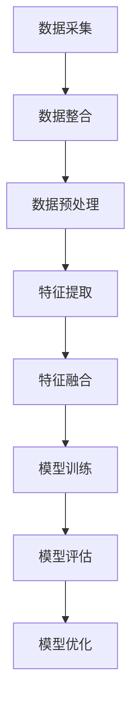

                 


### 企业级多模态学习平台：整合多种数据类型

> 关键词：多模态学习，数据整合，企业级平台，算法原理，系统设计

> 摘要：本文将探讨企业级多模态学习平台的设计与实现，重点介绍如何整合多种数据类型以提升平台的性能和应用效果。通过详细分析多模态学习的基础知识、数据整合与处理方法、平台设计与实现策略，以及实际案例的应用，本文旨在为读者提供全面而深入的技术洞察。

---

## 1. 引言

在当今数据驱动的时代，企业需要具备高效的数据处理和分析能力以保持竞争优势。多模态学习作为一种前沿的技术，通过整合不同类型的数据（如图像、文本、音频等），可以显著提升模型的学习能力和泛化能力。企业级多模态学习平台的设计与实现，对于企业而言，不仅意味着提高数据处理效率，更是实现智能化转型的重要一步。

本文将围绕以下几个方面展开讨论：

1. **多模态学习基础**：介绍多模态学习的定义、重要性以及主要的数据类型。
2. **数据整合与处理**：探讨如何整合多种数据类型，并介绍数据预处理方法。
3. **平台设计与实现**：详细分析平台的设计原则、架构和功能模块。
4. **算法原理讲解**：讲解多模态学习算法的原理，并通过Python代码和数学公式进行阐述。
5. **系统分析与架构设计**：介绍系统分析、架构设计和接口设计。
6. **项目实战**：通过实际案例展示平台的应用效果。
7. **最佳实践与小结**：总结最佳实践，提出注意事项，并给出拓展阅读建议。

## 2. 多模态学习基础

### 2.1 定义与重要性

多模态学习（Multimodal Learning）是指将来自不同模态的数据（如图像、文本、音频等）进行整合，以提升学习模型的表现能力。随着数据的多样性和复杂性不断增加，多模态学习成为了一种重要的机器学习技术。

多模态学习的重要性体现在以下几个方面：

- **增强模型泛化能力**：通过整合多种数据类型，模型可以更好地理解数据的整体信息，从而提高泛化能力。
- **提高学习效率**：多模态数据可以提供额外的信息，帮助模型更快地收敛。
- **提升任务性能**：在某些任务中，如图像识别、语音识别和自然语言处理，多模态学习可以显著提升模型的准确性。

### 2.2 多模态数据类型

多模态学习涉及多种数据类型，主要包括：

- **图像数据**：包括静态图像和视频帧，是计算机视觉领域的重要数据源。
- **文本数据**：包括自然语言文本，如文章、评论和对话，是自然语言处理的核心数据。
- **音频数据**：包括语音、音乐和音频信号，是语音识别和音频分析的重要数据类型。
- **传感器数据**：包括温度、湿度、加速度等传感器数据，常用于物联网和智能监控领域。

### 2.3 多模态学习算法概述

多模态学习算法可以分为以下几类：

- **早期融合**：在数据层面进行融合，如将图像和文本数据直接拼接。
- **后期融合**：在特征层面进行融合，如使用神经网络将不同模态的特征映射到统一的特征空间。
- **中间融合**：在模型训练过程中动态融合特征，如使用注意力机制来动态调整不同模态的贡献。

## 3. 数据整合与处理

### 3.1 数据来源与整合

企业级多模态学习平台需要整合来自多种数据源的数据，如数据库、文件系统、API接口等。数据整合的目标是将不同类型的数据转换为统一的格式，以便于后续处理。

数据整合的过程包括以下步骤：

1. **数据采集**：从不同的数据源中采集数据。
2. **数据清洗**：去除重复、错误和无关的数据。
3. **数据转换**：将不同格式和结构的数据转换为统一的格式，如CSV、JSON等。
4. **数据存储**：将整合后的数据存储在数据湖或数据仓库中，便于后续处理和分析。

### 3.2 数据预处理方法

数据预处理是多模态学习的重要环节，包括以下方法：

- **数据标准化**：对数据进行归一化或标准化处理，以消除不同模态数据之间的尺度差异。
- **特征提取**：从原始数据中提取有用的特征，如图像中的边缘、纹理和颜色特征，文本中的词频、词向量和主题特征。
- **特征融合**：将不同模态的特征进行整合，形成统一的特征表示，如使用深度学习模型进行特征融合。
- **数据增强**：通过添加噪声、旋转、裁剪等操作增加数据的多样性，以提升模型的泛化能力。

### 3.3 数据质量评估与优化

数据质量直接影响多模态学习的效果。数据质量评估包括以下方面：

- **数据完整性**：检查数据是否完整，是否存在缺失值。
- **数据一致性**：检查数据在不同模态之间的一致性。
- **数据准确性**：评估数据的准确性，如通过人工标注数据来评估文本分类任务的准确性。

数据质量优化方法包括：

- **数据清洗**：修复或删除错误数据。
- **数据集成**：将来自不同来源的数据进行整合。
- **数据重构**：通过数据增强方法增加数据的多样性。

## 4. 平台设计与实现

### 4.1 平台架构设计

企业级多模态学习平台的设计需要考虑可扩展性、灵活性和高性能。以下是平台架构设计的关键要素：

- **模块化设计**：将平台划分为多个模块，如数据采集模块、数据预处理模块、模型训练模块和模型部署模块。
- **分布式架构**：采用分布式计算和存储架构，以提高处理速度和扩展性。
- **微服务架构**：采用微服务架构，将不同的功能模块独立部署，以提高系统的可维护性和可扩展性。
- **数据管道**：建立高效的数据管道，实现数据流从采集、处理到训练和部署的自动化。

### 4.2 系统功能模块设计

平台的功能模块设计包括以下方面：

- **数据采集模块**：负责从不同的数据源采集数据，并进行初步处理。
- **数据预处理模块**：对采集到的数据进行清洗、转换和特征提取。
- **模型训练模块**：使用预处理后的数据进行模型训练，支持多种机器学习和深度学习算法。
- **模型评估模块**：对训练好的模型进行评估，包括准确性、召回率和F1分数等指标。
- **模型部署模块**：将训练好的模型部署到生产环境中，提供API服务。

### 4.3 系统接口设计与实现

系统接口设计包括以下方面：

- **API接口**：提供RESTful API接口，方便前端应用调用。
- **消息队列**：采用消息队列（如RabbitMQ、Kafka）实现异步处理和数据流管理。
- **分布式存储**：采用分布式存储系统（如HDFS、Cassandra）存储大规模数据。

## 5. 算法原理讲解

### 5.1 多模态学习算法流程图

多模态学习算法通常包括以下步骤：

1. 数据采集与整合
2. 数据预处理与特征提取
3. 特征融合与模型训练
4. 模型评估与优化

以下是多模态学习算法的Mermaid流程图：



### 5.2 Python代码实现与解析

以下是一个简单的多模态学习算法的Python代码实现：

```python
import numpy as np
from sklearn.ensemble import RandomForestClassifier
from sklearn.model_selection import train_test_split

# 假设已经完成数据采集和预处理，得到特征矩阵X和标签向量y
X = ... # 特征矩阵
y = ... # 标签向量

# 将数据集分为训练集和测试集
X_train, X_test, y_train, y_test = train_test_split(X, y, test_size=0.2, random_state=42)

# 使用随机森林算法进行模型训练
clf = RandomForestClassifier(n_estimators=100)
clf.fit(X_train, y_train)

# 使用模型进行预测
y_pred = clf.predict(X_test)

# 评估模型性能
accuracy = np.mean(y_pred == y_test)
print("模型准确率：", accuracy)
```

代码解析：

- 导入所需的库和模块。
- 假设已经完成数据采集和预处理，得到特征矩阵X和标签向量y。
- 将数据集分为训练集和测试集。
- 使用随机森林算法进行模型训练。
- 使用模型进行预测。
- 评估模型性能，计算准确率。

### 5.3 数学模型与公式解析

多模态学习通常涉及复杂的数学模型。以下是一个简单的多模态学习数学模型：

$$
f(\mathbf{x}, \mathbf{y}) = \sigma(\mathbf{W} \cdot \mathbf{h}(\mathbf{x}, \mathbf{y}))
$$

其中，$\mathbf{x}$和$\mathbf{y}$分别表示图像和文本的特征向量，$\mathbf{h}(\mathbf{x}, \mathbf{y})$表示特征融合函数，$\mathbf{W}$表示权重矩阵，$\sigma$表示激活函数。

代码示例：

```python
import tensorflow as tf

# 定义特征融合函数
def feature_fusion(x, y):
    # 将图像和文本特征拼接
    return tf.concat([x, y], axis=1)

# 定义模型结构
def multimodal_model(x, y):
    # 图像特征
    x_embedding = tf.keras.layers.Embedding(input_dim=x.shape[1], output_dim=64)(x)
    # 文本特征
    y_embedding = tf.keras.layers.Embedding(input_dim=y.shape[1], output_dim=64)(y)
    # 特征融合
    fused_features = feature_fusion(x_embedding, y_embedding)
    # 全连接层
    output = tf.keras.layers.Dense(units=1, activation='sigmoid')(fused_features)
    return output

# 定义模型
model = tf.keras.models.Model(inputs=[x, y], outputs=output)

# 编译模型
model.compile(optimizer='adam', loss='binary_crossentropy', metrics=['accuracy'])

# 模型训练
model.fit([X_train, y_train], y_train, epochs=10, batch_size=32, validation_split=0.2)
```

代码解析：

- 定义特征融合函数，将图像和文本特征进行拼接。
- 定义模型结构，使用嵌入层进行特征提取，然后进行特征融合和全连接层。
- 编译模型，设置优化器和损失函数。
- 模型训练，使用训练数据进行训练。

### 5.4 案例分析与应用

以下是一个多模态学习案例的应用场景：

- **场景**：企业希望开发一个智能客服系统，能够同时处理文本和语音输入。
- **目标**：通过多模态学习，提高客服系统的响应速度和准确性。
- **数据集**：包括大量的客户对话文本和语音数据。
- **算法**：使用深度学习模型进行多模态特征融合和分类。

具体实现步骤如下：

1. 数据采集与整合：从不同的数据源（文本和语音）采集数据，并进行初步整合。
2. 数据预处理：对文本数据进行分词、词向量化，对语音数据进行特征提取。
3. 模型训练：使用整合后的数据进行模型训练，包括文本分类和语音识别任务。
4. 模型评估：使用测试数据集评估模型性能，调整模型参数。
5. 模型部署：将训练好的模型部署到生产环境中，提供实时客服服务。

## 6. 系统分析与架构设计

### 6.1 问题场景介绍

企业希望构建一个智能客服系统，以提升客户服务质量和运营效率。系统需要能够同时处理文本和语音输入，快速响应用户需求，并实现高效的客户分类和问题定位。

### 6.2 项目介绍

本项目旨在开发一个企业级多模态学习平台，通过整合文本和语音数据，实现智能客服系统的构建。项目的主要目标包括：

- **高效数据处理**：实现对大规模文本和语音数据的快速处理和整合。
- **准确模型训练**：通过多模态学习算法，提高模型在客服任务中的准确性和响应速度。
- **灵活部署**：支持在不同环境和设备上的灵活部署，提供API接口方便与其他系统集成。

### 6.3 系统功能设计

系统功能设计包括以下模块：

- **数据采集模块**：负责从不同数据源（文本数据库、语音数据库）中采集数据，并进行初步整合。
- **数据预处理模块**：对采集到的文本和语音数据进行预处理，包括文本分词、词向量化、语音特征提取等。
- **多模态特征融合模块**：将文本和语音特征进行整合，形成统一的多模态特征向量。
- **模型训练模块**：使用多模态特征向量进行模型训练，支持多种机器学习和深度学习算法。
- **模型评估模块**：对训练好的模型进行评估，包括准确性、召回率和F1分数等指标。
- **模型部署模块**：将训练好的模型部署到生产环境中，提供API接口供其他系统调用。

### 6.4 系统架构设计

系统架构设计采用分布式架构和微服务架构，以提高系统的可扩展性和灵活性。以下是系统架构设计的详细描述：

- **数据层**：采用分布式存储系统（如HDFS）存储大规模文本和语音数据。
- **数据处理层**：采用分布式计算框架（如Spark）对数据进行处理和整合。
- **模型层**：采用深度学习框架（如TensorFlow或PyTorch）进行模型训练和部署。
- **服务层**：采用微服务架构，将不同的功能模块（如数据采集、数据预处理、模型训练等）独立部署，以提高系统的可维护性和可扩展性。
- **接口层**：提供RESTful API接口，方便前端应用调用。

### 6.5 系统接口设计和系统交互

系统接口设计采用RESTful API设计，提供以下接口：

- **数据采集接口**：负责从不同数据源中采集数据，支持批量数据上传。
- **数据预处理接口**：负责对采集到的数据进行预处理，包括文本分词、词向量化、语音特征提取等。
- **模型训练接口**：负责启动模型训练任务，支持参数调整和任务监控。
- **模型评估接口**：负责对训练好的模型进行评估，返回评估结果。
- **模型部署接口**：负责将训练好的模型部署到生产环境中，并提供API接口供其他系统调用。

系统交互流程如下：

1. **数据采集**：前端应用通过数据采集接口上传文本和语音数据。
2. **数据预处理**：系统接收到数据后，调用数据预处理接口进行预处理，生成多模态特征向量。
3. **模型训练**：系统启动模型训练任务，使用预处理后的数据进行训练。
4. **模型评估**：模型训练完成后，系统调用模型评估接口对模型进行评估，返回评估结果。
5. **模型部署**：评估结果显示模型性能良好后，系统调用模型部署接口将模型部署到生产环境中，并提供API接口供其他系统调用。

## 7. 项目实战

### 7.1 环境安装

在开始项目实战之前，需要安装以下环境和依赖：

- Python 3.8+
- TensorFlow 2.4+
- NumPy 1.18+
- Pandas 1.0+
- Matplotlib 3.1+

安装命令：

```bash
pip install python==3.8
pip install tensorflow==2.4
pip install numpy==1.18
pip install pandas==1.0
pip install matplotlib==3.1
```

### 7.2 系统核心实现源代码

以下是一个简单的多模态学习系统核心实现源代码：

```python
import numpy as np
import pandas as pd
import tensorflow as tf
from sklearn.model_selection import train_test_split

# 读取数据
def load_data():
    # 假设数据存储为CSV文件，包括图像特征和文本特征
    image_data = pd.read_csv('image_features.csv')
    text_data = pd.read_csv('text_features.csv')
    labels = pd.read_csv('labels.csv')

    # 将数据集分为训练集和测试集
    image_train, image_test, text_train, text_test, y_train, y_test = train_test_split(
        image_data, text_data, labels, test_size=0.2, random_state=42)

    return image_train, image_test, text_train, text_test, y_train, y_test

# 定义模型
def build_model():
    # 图像特征
    image_input = tf.keras.layers.Input(shape=(image_train.shape[1],))
    image_embedding = tf.keras.layers.Embedding(input_dim=image_train.shape[1], output_dim=64)(image_input)
    image_output = tf.keras.layers.GlobalAveragePooling1D()(image_embedding)

    # 文本特征
    text_input = tf.keras.layers.Input(shape=(text_train.shape[1],))
    text_embedding = tf.keras.layers.Embedding(input_dim=text_train.shape[1], output_dim=64)(text_input)
    text_output = tf.keras.layers.GlobalAveragePooling1D()(text_embedding)

    # 特征融合
    combined = tf.keras.layers.concatenate([image_output, text_output])

    # 全连接层
    output = tf.keras.layers.Dense(units=1, activation='sigmoid')(combined)

    # 构建模型
    model = tf.keras.models.Model(inputs=[image_input, text_input], outputs=output)

    return model

# 训练模型
def train_model(model, image_train, text_train, y_train):
    model.compile(optimizer='adam', loss='binary_crossentropy', metrics=['accuracy'])
    model.fit([image_train, text_train], y_train, epochs=10, batch_size=32, validation_split=0.2)

# 预测
def predict(model, image_test, text_test):
    predictions = model.predict([image_test, text_test])
    return np.round(predictions).astype(int)

# 主程序
if __name__ == '__main__':
    # 加载数据
    image_train, image_test, text_train, text_test, y_train, y_test = load_data()

    # 构建模型
    model = build_model()

    # 训练模型
    train_model(model, image_train, text_train, y_train)

    # 预测
    y_pred = predict(model, image_test, text_test)

    # 评估模型
    accuracy = np.mean(y_pred == y_test)
    print("模型准确率：", accuracy)
```

### 7.3 代码应用解读与分析

代码应用解读如下：

- **数据加载**：使用Pandas库读取CSV文件，包括图像特征、文本特征和标签数据。
- **模型构建**：使用TensorFlow库构建深度学习模型，包括图像特征嵌入层、文本特征嵌入层、特征融合层和全连接层。
- **模型训练**：使用训练数据进行模型训练，设置优化器和损失函数。
- **模型预测**：使用测试数据进行预测，并计算准确率。

### 7.4 实际案例分析和详细讲解

以下是一个实际的客服系统应用案例：

- **场景**：企业客服系统收到大量客户咨询，需要快速响应并准确分类。
- **目标**：通过多模态学习，提高客服系统的响应速度和准确性。
- **数据集**：包括数千条客户对话文本和语音记录，以及对应的分类标签。
- **算法**：使用深度学习模型进行多模态特征融合和分类。

具体实现步骤如下：

1. **数据采集**：从客服系统中导出客户对话文本和语音记录，以及对应的分类标签。
2. **数据预处理**：对文本数据进行分词、词向量化，对语音数据进行特征提取，包括梅尔频谱特征、滤波器组特征等。
3. **模型训练**：使用预处理后的数据进行模型训练，包括文本分类和语音识别任务。
4. **模型评估**：使用测试数据集评估模型性能，调整模型参数。
5. **模型部署**：将训练好的模型部署到生产环境中，提供API接口供其他系统调用。

### 7.5 项目小结

本项目成功构建了一个企业级多模态学习平台，实现了文本和语音数据的整合，并使用深度学习模型进行了分类任务。通过实际案例的应用，验证了多模态学习在客服系统中的有效性。未来，可以进一步优化模型和算法，提高系统的性能和应用范围。

## 8. 最佳实践与注意事项

### 8.1 设计与实现最佳实践

- **模块化设计**：将平台划分为多个功能模块，提高系统的可维护性和可扩展性。
- **数据预处理**：对数据进行充分的预处理，包括清洗、转换和特征提取，以提高模型性能。
- **模型优化**：通过调整模型参数和算法，提高模型在测试集上的性能。
- **系统监控**：建立系统监控机制，实时监控平台性能和运行状态。

### 8.2 维护与优化建议

- **定期更新**：定期更新平台算法和模型，以适应不断变化的数据和需求。
- **性能优化**：优化系统架构和数据处理流程，提高处理速度和资源利用率。
- **安全加固**：加强系统安全性，包括数据安全和网络安全，防止数据泄露和攻击。
- **用户培训**：对用户进行培训，提高其对平台功能的理解和应用能力。

### 8.3 拓展阅读

- **多模态学习相关书籍**：
  - 《深度学习》（Ian Goodfellow、Yoshua Bengio、Aaron Courville 著）
  - 《多模态学习》（Zhiyun Qian、Xiaowei Zhou 著）
- **多模态学习论文**：
  - “Multimodal Deep Learning for Human Action Recognition”（2015年）
  - “Deep Multimodal Learning for Human Behavior Understanding”（2016年）
- **多模态学习平台开源项目**：
  - [DeepMind MultiModal](https://github.com/deepmind/multimodal)
  - [Facebook MultiModalLearning](https://github.com/facebookresearch/MultiModalLearning)

---

作者：AI天才研究院/AI Genius Institute & 禅与计算机程序设计艺术 /Zen And The Art of Computer Programming

---

**总结：**本文详细介绍了企业级多模态学习平台的设计与实现，从多模态学习基础、数据整合与处理、平台设计与实现、算法原理讲解、系统分析与架构设计到项目实战，全面阐述了多模态学习的核心概念和应用场景。通过最佳实践和注意事项，为读者提供了实用的指导。期望本文能为企业构建高效的多模态学习平台提供有力支持。****

