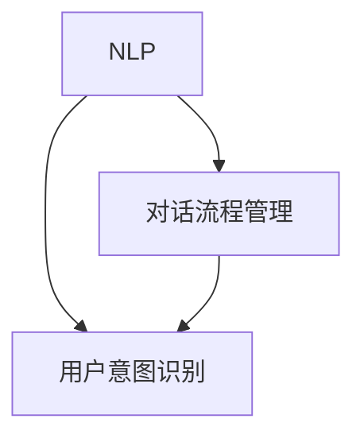
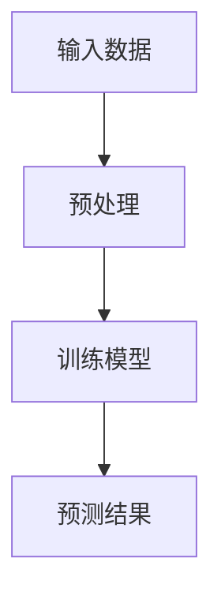
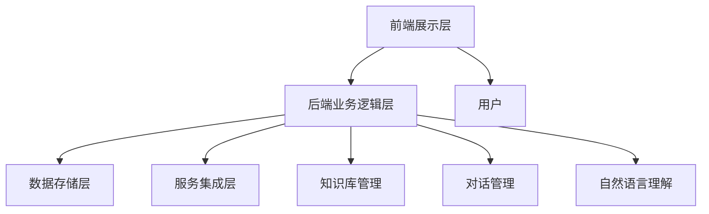
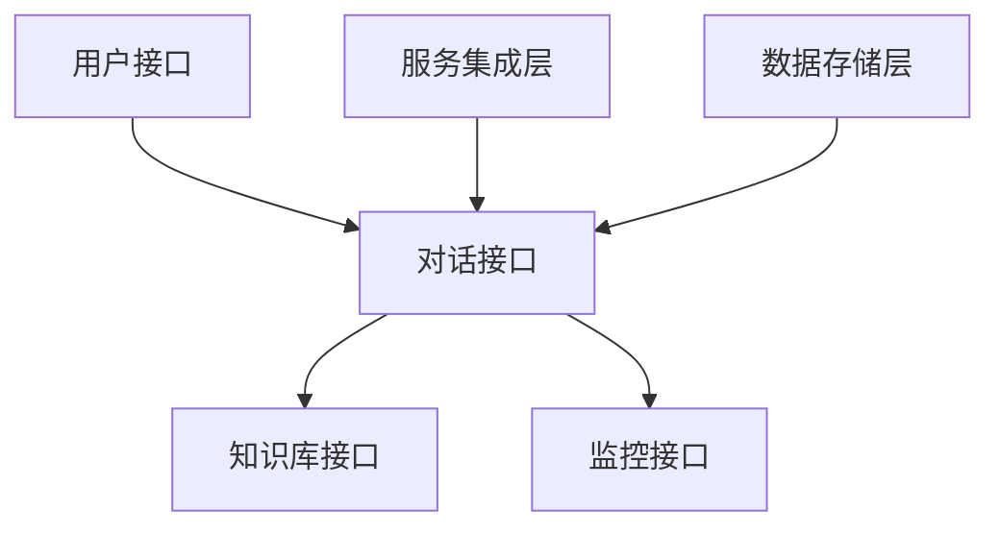
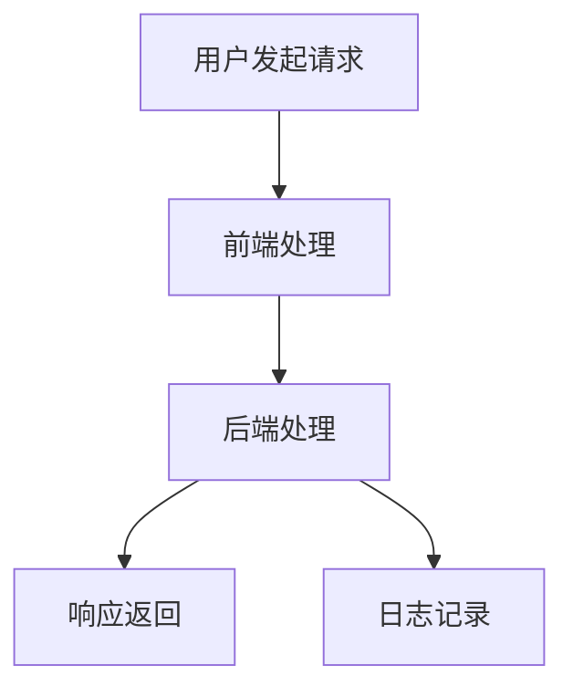

                 

### 《企业级对话管理平台：优化AI交互能力》

#### 关键词：
- 企业级对话管理平台
- AI交互能力
- 自然语言处理
- 对话流程管理
- 用户意图识别

#### 摘要：
本文将深入探讨企业级对话管理平台的设计与优化，重点关注如何提升AI交互能力。我们将从背景介绍、核心概念与联系、算法原理讲解、数学模型和公式、系统分析与架构设计方案、项目实战以及最佳实践等七个方面，详细阐述对话管理平台的技术原理和应用实践，为读者提供全面的指导。

---

## 目录大纲设计思路与步骤

在设计《企业级对话管理平台：优化AI交互能力》的目录大纲时，我们需要系统地考虑每个章节的内容，并确保其逻辑清晰、内容丰富。以下是我们的设计思路与步骤：

### 1. 确定核心章节内容

首先，我们要明确书籍的目标读者和主题，然后确定核心章节内容。以下是可能的核心章节：

- **背景介绍**：介绍企业级对话管理平台的现状、需求和发展趋势。
- **核心概念与联系**：详细解释自然语言处理、对话流程管理、用户意图识别等核心概念。
- **算法原理讲解**：讲解对话管理平台中常用的算法，如机器学习、深度学习等。
- **数学模型和公式**：阐述算法原理背后的数学基础。
- **系统分析与架构设计方案**：分析对话管理平台的系统架构和功能设计。
- **项目实战**：通过实际案例展示如何实施对话管理平台。
- **最佳实践 tips、小结、注意事项、拓展阅读**：总结章节要点，提供拓展知识。

### 2. 设计章节结构

根据确定的核心章节内容，设计出每个章节的子目录结构。以下是可能的结构：

- **背景介绍**
  - **定义与分类**
  - **需求与现状**
  - **发展趋势**
- **核心概念与联系**
  - **自然语言处理**
  - **对话流程管理**
  - **用户意图识别**
  - **其他关键概念**
- **算法原理讲解**
  - **机器学习算法**
  - **深度学习算法**
  - **其他算法**
- **数学模型和公式**
  - **概率论与统计**
  - **线性代数**
  - **优化算法**
- **系统分析与架构设计方案**
  - **系统功能设计**
  - **系统架构设计**
  - **系统接口设计**
  - **系统交互设计**
- **项目实战**
  - **环境安装**
  - **系统核心实现**
  - **代码应用解读**
  - **案例分析**
  - **项目小结**
- **最佳实践 tips**
  - **优化建议**
  - **注意事项**
  - **拓展阅读**

### 3. 运用Markdown格式

使用Markdown格式书写目录大纲，可以使文章结构更加清晰。以下是Markdown格式的基本用法：

- **一级标题**：使用`#`符号，如 `# 背景介绍`
- **二级标题**：使用`##`符号，如 `## 定义与分类`
- **三级标题**：使用`###`符号，如 `### 需求与现状`
- **无序列表**：使用`*`符号，如 `* 算法原理讲解`
- **有序列表**：使用`1.`, `2.`等符号，如 `1. 机器学习算法`
- **Markdown代码块**：使用三个反引号（```)将代码包裹起来，如：

  ```python
  def hello_world():
      print("Hello, World!")
  ```

- **LaTeX数学公式**：使用`$$`将数学公式包裹起来，如 `$$1+1=2$$`

### 4. 确保内容完整性

在撰写目录大纲时，我们需要确保每个章节的内容能够完整、清晰地传达信息。以下是确保内容完整性的几个要点：

- **背景介绍**：简要介绍核心概念术语，描述问题背景，明确问题描述，提出问题解决方法，讨论边界与外延，分析概念结构与核心要素组成。
- **核心概念与联系**：详细解释核心概念，展示概念属性特征对比表格和ER实体关系图架构的流程图。
- **算法原理讲解**：使用流程图和代码示例详细讲解算法原理，提供数学模型和公式，举例说明。
- **系统分析与架构设计方案**：描述问题场景，介绍项目背景，设计领域模型类图，绘制系统架构图，设计系统接口和交互序列图。
- **项目实战**：提供环境安装步骤，展示系统核心实现源代码，解读代码应用，分析实际案例，总结项目经验。
- **最佳实践 tips**：提供优化建议，强调注意事项，推荐拓展阅读。

### 5. 确保简洁性

在撰写目录大纲时，要避免冗长和重复的内容，使用简短的句子和清晰的标题。以下是确保简洁性的几个要点：

- **避免冗长句子**：简化句子结构，使用简单词汇，确保每个句子都能传达明确的信息。
- **使用清晰标题**：标题要简明扼要，能够准确反映章节内容。
- **去除重复内容**：检查每个章节，确保没有重复的内容。

### 6. 检查与优化

在完成目录大纲的初步设计后，需要进行以下步骤：

- **检查标题**：确保每个章节的标题都能准确反映内容。
- **检查结构**：确保章节结构合理，逻辑清晰。
- **检查格式**：确保Markdown格式和LaTeX公式的正确性。

通过以上步骤，我们可以设计出一个逻辑清晰、内容完整且简洁的《企业级对话管理平台：优化AI交互能力》的目录大纲。接下来，我们将按照这个思路逐步设计每个章节的具体内容。

---

## 背景介绍

随着人工智能（AI）技术的迅速发展，企业级对话管理平台已成为现代商业运营的关键组成部分。本章节将介绍企业级对话管理平台的概念、需求、现状以及发展趋势，帮助读者了解这一领域的基本情况和应用场景。

### 定义与分类

企业级对话管理平台（Conversational Management Platform，简称CMP）是一种集成多种AI技术和工具的系统，用于管理和优化企业与用户之间的对话交互。根据应用场景和功能特点，CMP可以分为以下几类：

1. **客户服务对话平台**：主要用于企业与客户之间的交互，提供24/7的客户服务，自动处理常见问题和请求，减轻人工客服的工作负担。
2. **企业内部沟通平台**：支持员工之间的实时沟通，包括文字、语音、视频等多种形式，提升团队协作效率。
3. **智能助理平台**：为企业内部或外部用户提供个性化的智能助理服务，帮助用户完成特定任务，如预订会议室、查询信息等。

### 需求与现状

企业级对话管理平台的需求源于以下几个方面的因素：

1. **客户需求的多样化**：随着消费者需求的不断变化，企业需要提供更加个性化和高效的客户服务，以保持竞争优势。
2. **人力成本的上涨**：随着人力成本的不断上涨，企业希望通过自动化和智能化的手段提高工作效率，降低运营成本。
3. **技术发展的推动**：AI技术的快速发展，特别是自然语言处理（NLP）和机器学习（ML）技术的进步，为企业级对话管理平台的应用提供了有力支持。

目前，企业级对话管理平台在多个行业中已经得到了广泛应用，如金融、零售、医疗、旅游等领域。例如，一些银行和金融机构通过引入智能客服机器人，提高了客户服务效率，减少了客户等待时间；一些电商平台通过智能客服机器人，实现了24/7的在线客服，提升了用户体验。

### 发展趋势

未来，企业级对话管理平台的发展将呈现以下几个趋势：

1. **更加智能化**：随着AI技术的不断进步，对话管理平台的智能化程度将进一步提升，能够更好地理解和满足用户需求。
2. **跨平台集成**：企业级对话管理平台将逐渐与其他业务系统集成，实现数据共享和业务协同，提高整体运营效率。
3. **个性化定制**：针对不同行业和企业的需求，对话管理平台将提供更加个性化的解决方案，满足特定场景的应用需求。
4. **安全性与隐私保护**：随着数据安全和隐私保护的重要性日益凸显，企业级对话管理平台将加强安全防护措施，确保用户数据的安全。

### 边界与外延

企业级对话管理平台的边界和范围可以进一步细化，包括但不限于以下方面：

1. **对话渠道**：包括文本聊天、语音通话、视频会议等多种交互方式。
2. **应用场景**：除了客户服务和内部沟通，还包括企业内部的流程自动化、业务智能决策等。
3. **技术融合**：集成语音识别、语音合成、图像识别、自然语言理解等多种AI技术，实现多模态交互。

通过上述介绍，我们可以看到企业级对话管理平台在现代商业运营中的重要性及其发展前景。在接下来的章节中，我们将深入探讨对话管理平台中的核心概念和算法原理，帮助读者更好地理解和应用这一技术。

---

## 核心概念与联系

在企业级对话管理平台中，有几个核心概念对整个系统的性能和用户体验起着至关重要的作用。这些核心概念包括自然语言处理（NLP）、对话流程管理、用户意图识别等。以下是这些核心概念的详细介绍及其相互关系。

### 自然语言处理（NLP）

自然语言处理（Natural Language Processing，NLP）是人工智能领域的一个重要分支，它涉及到计算机与人类语言之间的交互。NLP的主要目标是让计算机能够理解、生成和处理人类语言，从而实现自然语言与机器之间的有效沟通。

**NLP的主要任务包括：**

1. **文本预处理**：对文本进行分词、去停用词、词性标注等操作，以便于后续处理。
2. **实体识别**：从文本中识别出重要的实体，如人名、地名、组织名等。
3. **情感分析**：分析文本中的情感倾向，如正面、负面或中性。
4. **语义分析**：理解文本中的语义内容，包括词义消歧、指代消解等。
5. **机器翻译**：将一种语言翻译成另一种语言。

### 对话流程管理

对话流程管理（Dialogue Flow Management）是对话管理平台中的另一个关键概念，它涉及如何设计和管理用户与系统之间的对话流程。对话流程管理的主要目标是确保对话流程的自然、流畅，并能够有效地引导用户达到预期的目标。

**对话流程管理的核心要素包括：**

1. **对话节点**：对话中的每个步骤或状态，如欢迎语、询问问题、提供信息等。
2. **对话路径**：用户与系统之间的对话流程，包括可能的分支和转接。
3. **状态转移**：根据用户输入和系统处理结果，决定对话流程的下一步动作。
4. **对话提示**：为用户提供清晰、易懂的对话引导，帮助用户更好地参与对话。
5. **异常处理**：处理对话过程中出现的异常情况，如用户输入无法理解或对话中断等。

### 用户意图识别

用户意图识别（User Intent Recognition）是对话管理平台中的关键任务之一，它旨在理解用户在对话中想要实现的目标或意图。用户意图识别的准确性直接影响到对话管理平台的用户体验和交互效果。

**用户意图识别的主要步骤包括：**

1. **意图分类**：将用户输入分类到预定义的意图类别中，如询问天气、预订机票、查询股票等。
2. **意图检测**：使用机器学习或深度学习模型，从用户输入中检测出意图。
3. **上下文理解**：结合上下文信息，对用户的意图进行更加精确的理解。
4. **意图确认**：通过进一步的对话交互，确认用户的意图是否被正确识别。

### 核心概念之间的联系

自然语言处理、对话流程管理和用户意图识别这三个核心概念紧密相连，共同构成了企业级对话管理平台的技术基础。以下是它们之间的联系：

1. **NLP与对话流程管理**：NLP技术为对话流程管理提供了文本预处理、语义分析等基础，使得系统能够理解和处理用户输入，从而设计出更加自然的对话流程。
2. **NLP与用户意图识别**：NLP技术通过对用户输入的语义分析，为用户意图识别提供了重要信息，使得系统能够更准确地检测和确认用户的意图。
3. **对话流程管理与用户意图识别**：对话流程管理通过设计和管理对话流程，为用户意图识别提供了上下文信息，帮助系统更好地理解用户的意图。

### Mermaid流程图

为了更好地展示这些核心概念之间的联系，我们可以使用Mermaid流程图来绘制它们之间的关系。以下是一个简化的Mermaid流程图示例：



在这个流程图中，NLP作为基础，与对话流程管理和用户意图识别紧密相连，共同构成了企业级对话管理平台的核心技术。

通过理解这些核心概念及其相互关系，我们可以更好地设计和优化企业级对话管理平台，提升AI交互能力，为用户提供更加自然、流畅和高效的对话体验。

---

### 算法原理讲解

在深入探讨企业级对话管理平台时，算法原理讲解是不可或缺的一部分。我们将详细介绍对话管理平台中常用的算法，包括机器学习算法和深度学习算法，并通过Python代码和Mermaid流程图来展示其工作原理。

#### 1. 机器学习算法

机器学习（Machine Learning，ML）算法在企业级对话管理平台中应用广泛，特别是在用户意图识别和对话生成等方面。以下是一些常用的机器学习算法：

**1.1 决策树（Decision Tree）**

决策树是一种常见的分类算法，通过一系列的判断条件来对数据进行分类。以下是一个简单的决策树算法示例：

```python
import numpy as np
from sklearn import tree

# 样本数据
features = [[0, 0], [0, 1], [1, 0], [1, 1]]
labels = [0, 1, 1, 0]

# 创建决策树分类器
clf = tree.DecisionTreeClassifier()

# 训练模型
clf = clf.fit(features, labels)

# 测试模型
print(clf.predict([[1, 1]]))
```

**1.2 随机森林（Random Forest）**

随机森林是一种集成学习算法，通过构建多个决策树来提高模型的泛化能力。以下是一个简单的随机森林算法示例：

```python
from sklearn.ensemble import RandomForestClassifier

# 样本数据
features = [[0, 0], [0, 1], [1, 0], [1, 1]]
labels = [0, 1, 1, 0]

# 创建随机森林分类器
clf = RandomForestClassifier(n_estimators=100)

# 训练模型
clf = clf.fit(features, labels)

# 测试模型
print(clf.predict([[1, 1]]))
```

**1.3 支持向量机（SVM）**

支持向量机是一种分类算法，通过找到数据空间中的最优分隔超平面来进行分类。以下是一个简单的SVM算法示例：

```python
from sklearn import svm

# 样本数据
features = [[0, 0], [0, 1], [1, 0], [1, 1]]
labels = [0, 1, 1, 0]

# 创建SVM分类器
clf = svm.SVC()

# 训练模型
clf = clf.fit(features, labels)

# 测试模型
print(clf.predict([[1, 1]]))
```

#### 2. 深度学习算法

深度学习（Deep Learning，DL）算法在对话管理平台中具有广泛的应用，特别是在自然语言处理和图像识别等领域。以下是一些常用的深度学习算法：

**2.1 卷积神经网络（CNN）**

卷积神经网络是一种用于图像识别和处理的深度学习算法。以下是一个简单的CNN算法示例：

```python
from tensorflow.keras.models import Sequential
from tensorflow.keras.layers import Conv2D, MaxPooling2D, Flatten, Dense

# 构建CNN模型
model = Sequential()
model.add(Conv2D(32, (3, 3), activation='relu', input_shape=(64, 64, 3)))
model.add(MaxPooling2D((2, 2)))
model.add(Flatten())
model.add(Dense(1, activation='sigmoid'))

# 编译模型
model.compile(optimizer='adam', loss='binary_crossentropy', metrics=['accuracy'])

# 训练模型
model.fit(x_train, y_train, epochs=10, validation_data=(x_val, y_val))

# 测试模型
print(model.evaluate(x_test, y_test))
```

**2.2 循环神经网络（RNN）**

循环神经网络是一种用于序列数据处理和时间序列预测的深度学习算法。以下是一个简单的RNN算法示例：

```python
from tensorflow.keras.models import Sequential
from tensorflow.keras.layers import LSTM, Dense

# 构建RNN模型
model = Sequential()
model.add(LSTM(50, activation='relu', input_shape=(timesteps, features)))
model.add(Dense(1))
model.compile(optimizer='adam', loss='mse')

# 训练模型
model.fit(x, y, epochs=100, verbose=0)

# 测试模型
print(model.evaluate(x_test, y_test))
```

#### 3. 算法原理与Mermaid流程图

为了更好地理解上述算法的工作原理，我们可以使用Mermaid流程图来展示其执行流程。以下是一个简单的决策树算法的Mermaid流程图示例：



通过这个流程图，我们可以清晰地看到决策树算法从输入数据到预测结果的整体流程。

---

通过上述对机器学习算法和深度学习算法的详细介绍，我们可以更好地理解企业级对话管理平台中的算法原理。在下一章节中，我们将进一步探讨数学模型和公式，以便更深入地理解这些算法的基础。

### 数学模型和公式

在深入探讨对话管理平台中的算法原理时，数学模型和公式是理解其工作原理的核心。以下将详细介绍几种关键的数学模型和公式，并使用LaTeX进行表述，以便读者更好地理解和应用。

#### 1. 概率论基础

概率论是机器学习和深度学习中的基础工具。以下是一些基本的概率论公式：

**1.1 条件概率**

$$P(A|B) = \frac{P(A \cap B)}{P(B)}$$

**1.2 贝叶斯定理**

$$P(A|B) = \frac{P(B|A)P(A)}{P(B)}$$

**1.3 全概率公式**

$$P(A) = \sum_{i=1}^{n} P(A|B_i)P(B_i)$$

#### 2. 线性代数基础

线性代数在机器学习和深度学习中也扮演着重要角色，以下是一些基础的线性代数公式：

**2.1 矩阵乘法**

$$C = AB$$

**2.2 矩阵求逆**

$$A^{-1} = (adj(A)) / det(A)$$

**2.3 矩阵求导**

$$\frac{d}{dx} [AX + B] = A$$

#### 3. 优化算法

优化算法是机器学习中用于最小化损失函数的重要工具。以下是一些常见的优化算法公式：

**3.1 梯度下降**

$$w_{\text{new}} = w_{\text{old}} - \alpha \cdot \nabla_w J(w)$$

其中，$w$是模型参数，$\alpha$是学习率，$J(w)$是损失函数。

**3.2 随机梯度下降（SGD）**

$$w_{\text{new}} = w_{\text{old}} - \alpha \cdot \nabla_w J(w; \theta)$$

其中，$\theta$是随机选择的样本。

**3.3 拉格朗日乘数法**

$$L(w, \lambda) = J(w) + \lambda(g(w))$$

其中，$L$是拉格朗日函数，$\lambda$是拉格朗日乘数。

#### 4. 深度学习中的数学公式

在深度学习中，我们经常使用激活函数、反向传播等数学公式。以下是一些常见的深度学习数学公式：

**4.1 激活函数**

$$\text{ReLU}(x) = \max(0, x)$$

**4.2 反向传播**

$$\Delta w_{ij}^{(l)} = \frac{\partial J(w^{(l)})}{\partial w_{ij}^{(l)}}$$

**4.3 梯度计算**

$$\nabla_w J(w) = \sum_{i} \nabla w_i J(w_i)$$

通过上述数学模型和公式的介绍，我们可以看到数学在机器学习和深度学习中的重要作用。这些公式不仅帮助我们理解算法的工作原理，还为算法的实现提供了理论基础。在接下来的章节中，我们将结合实际案例，进一步探讨这些数学公式的应用。

---

## 系统分析与架构设计方案

在设计企业级对话管理平台时，系统架构的设计和实现至关重要。一个高效的系统架构不仅能够提高平台的性能和可靠性，还能方便未来的扩展和维护。以下将从问题场景介绍、系统功能设计、系统架构设计、系统接口设计以及系统交互设计等方面，详细阐述对话管理平台的系统架构设计方案。

### 问题场景介绍

企业级对话管理平台常用于处理大规模客户服务、内部沟通、业务自动化等场景。以下是一个典型的问题场景：

- **客户服务**：一家大型电商平台需要为成千上万的客户提供24/7的在线客服服务，以处理用户咨询、投诉、订单查询等问题。
- **内部沟通**：企业内部员工需要实时沟通和协作，包括文字、语音和视频等多种形式。
- **业务自动化**：企业希望利用对话管理平台自动化处理一些常见业务流程，如订单处理、会议室预订等。

### 系统功能设计

为了满足上述问题场景的需求，对话管理平台需要具备以下核心功能：

1. **用户身份验证**：确保只有授权用户能够访问平台。
2. **对话管理**：管理用户与平台之间的对话流程，包括对话创建、维护和结束。
3. **自然语言理解**：理解用户输入的意图和语义，提供准确的信息和响应。
4. **知识库管理**：存储和管理各种知识库，如常见问题解答、产品信息、业务规则等。
5. **多渠道集成**：支持多种沟通渠道，如文本聊天、语音通话、视频会议等。
6. **日志记录和监控**：记录系统操作日志，监控系统性能和健康状况。

### 系统架构设计

企业级对话管理平台的系统架构设计应考虑以下几个方面：

1. **前端展示层**：提供用户与平台交互的界面，包括文本聊天窗口、语音和视频通话界面等。
2. **后端业务逻辑层**：处理对话管理、自然语言理解、知识库管理等核心业务逻辑。
3. **数据存储层**：存储用户数据、对话记录、知识库数据等。
4. **服务集成层**：集成第三方服务，如语音识别、自然语言处理服务、业务系统接口等。

以下是一个简化的系统架构图：



### 系统接口设计

为了实现系统各层之间的有效通信，需要设计一套清晰的接口。以下是一些关键接口：

1. **用户接口**：用于用户与平台的交互，包括发送消息、接收响应等。
2. **对话接口**：管理对话的创建、更新和结束，包括对话状态、对话历史等。
3. **知识库接口**：提供知识库的查询、更新和删除功能。
4. **监控接口**：提供系统性能监控和日志记录功能。

以下是一个简单的接口设计示例：



### 系统交互设计

为了确保系统的稳定性和高效性，需要设计一套清晰的系统交互流程。以下是一个简化的系统交互流程：

1. **用户发起请求**：用户通过前端发送请求，如发送文本消息、语音请求等。
2. **前端处理**：前端将用户请求转换为系统可识别的格式，如JSON。
3. **后端处理**：后端业务逻辑层处理用户请求，包括对话管理、自然语言理解、知识库查询等。
4. **响应返回**：后端将处理结果返回给前端，前端将结果展示给用户。
5. **日志记录**：系统将操作日志记录到日志文件中，以便后续监控和分析。

以下是一个简化的系统交互流程图：



通过上述系统分析与架构设计方案，我们可以为企业级对话管理平台构建一个高效、稳定且可扩展的系统架构。在下一章节中，我们将通过实际案例展示如何实施对话管理平台，帮助读者更好地理解和应用这些设计理念。

---

### 项目实战

在本章节中，我们将通过一个具体的案例，详细展示如何实施企业级对话管理平台。这个案例将涵盖环境安装、系统核心实现、代码应用解读与分析，以及实际案例分析和详细讲解剖析。希望通过这个案例，读者能够更好地理解和应用对话管理平台的设计与实现。

#### 环境安装

首先，我们需要安装和配置对话管理平台所需的环境。以下是一个简化的环境安装步骤：

1. **安装Python**：确保Python 3.x版本已安装在系统中。
2. **安装依赖库**：使用pip安装必要的依赖库，如TensorFlow、scikit-learn、NLTK等。

```bash
pip install tensorflow scikit-learn nltk
```

3. **安装自然语言处理库**：使用nltk下载必要的语料库。

```python
import nltk
nltk.download('punkt')
nltk.download('averaged_perceptron_tagger')
nltk.download('maxent_ne_chunker')
nltk.download('words')
```

4. **配置环境变量**：确保Python和pip的环境变量已正确配置。

#### 系统核心实现

接下来，我们将实现一个简单的对话管理平台，用于处理用户询问天气的信息。以下是系统核心实现步骤：

1. **用户接口**：创建一个简单的文本聊天窗口，用于用户输入和输出。

```python
# chat.py
print("欢迎使用天气对话管理平台。请输入您的查询：")
while True:
    user_input = input()
    if user_input.lower() == '退出':
        break
    response = get_weather_response(user_input)
    print(response)
```

2. **自然语言理解**：使用自然语言处理库解析用户输入，提取出关键信息（如城市名）。

```python
# util.py
import nltk

def get_weather_response(user_input):
    # 对用户输入进行分词、词性标注等操作
    tokens = nltk.word_tokenize(user_input)
    tagged = nltk.pos_tag(tokens)

    # 提取城市名
    city_name = extract_city_name(tagged)
    if city_name:
        return f"{city_name}的天气是：{get_weather(city_name)}"
    else:
        return "无法理解您的查询，请重新输入。"
```

3. **知识库管理**：创建一个简单的知识库，用于存储天气信息。

```python
# knowledge_base.py
weather_data = {
    '北京': '今天多云，气温10-20摄氏度。',
    '上海': '今天小雨，气温15-25摄氏度。',
    '广州': '今天晴朗，气温18-28摄氏度。',
}

def get_weather(city_name):
    return weather_data.get(city_name, "未找到该城市的天气信息。")
```

4. **对话管理**：设计一个简单的对话流程，确保对话的自然性和流畅性。

```python
# dialogue_manager.py
def extract_city_name(tagged):
    for word, tag in tagged:
        if tag.startswith('NN'):
            return word
    return None
```

#### 代码应用解读与分析

在实现对话管理平台的过程中，我们使用了Python和自然语言处理库，通过简单的用户接口、自然语言理解和知识库管理，实现了基本的天气查询功能。以下是关键代码段的应用解读：

- **chat.py**：这个脚本提供了一个简单的文本聊天窗口，用户可以通过输入查询天气信息，并在接收到系统响应后继续对话。
- **util.py**：这个模块负责解析用户输入，提取关键信息（如城市名），并调用知识库模块获取天气信息。它使用了nltk进行分词和词性标注，确保输入的理解准确。
- **knowledge_base.py**：这个模块是一个简单的知识库，用于存储天气信息。它通过字典的方式实现了数据的存储和查询。
- **dialogue_manager.py**：这个模块负责处理对话流程，确保对话的自然性和流畅性。它通过提取用户输入中的城市名，调用知识库模块获取天气信息，并生成自然语言响应。

#### 实际案例分析和详细讲解剖析

以下是一个实际的案例，展示如何使用对话管理平台：

**用户**：你好，我想知道北京的天气。

**系统**：你好！根据我的查询，北京今天的天气是多云，气温10-20摄氏度。

**用户**：谢谢，那上海的天气怎么样？

**系统**：上海今天的天气是小雨，气温15-25摄氏度。

**用户**：好的，那广州的天气呢？

**系统**：广州今天的天气是晴朗，气温18-28摄氏度。

在这个案例中，用户通过文本聊天窗口与对话管理平台进行交互。系统通过解析用户输入，提取出城市名，调用知识库模块获取天气信息，并生成自然语言响应，向用户提供了准确的信息。

#### 项目小结

通过上述案例，我们可以看到如何使用Python和自然语言处理库实现一个简单的对话管理平台。虽然这个案例的功能相对简单，但它展示了对话管理平台的基本架构和实现方法。在实际应用中，对话管理平台会涉及更复杂的算法和流程，如用户意图识别、多轮对话管理、上下文理解等。在未来的开发中，我们可以继续优化和扩展这个平台，使其能够处理更多复杂的对话任务。

---

## 最佳实践 tips

在设计企业级对话管理平台时，遵循一些最佳实践可以显著提升平台的性能和用户体验。以下是一些重要的最佳实践建议：

### 1. **用户隐私保护**

在处理用户数据时，务必遵守相关的隐私保护法规，如GDPR等。确保数据加密存储和传输，避免数据泄露。

### 2. **性能优化**

为了确保对话管理平台的响应速度，需要对其进行性能优化。优化数据库查询，减少不必要的I/O操作，并使用缓存技术减少计算负担。

### 3. **可扩展性设计**

在设计系统架构时，应考虑未来可能的扩展需求。采用微服务架构，使各个功能模块可以独立部署和扩展，提高系统的灵活性和可维护性。

### 4. **多语言支持**

考虑为对话管理平台提供多语言支持，以满足不同语言用户的需求。这包括自然语言处理模块的多语言支持和用户界面的国际化。

### 5. **实时反馈与监控**

实现实时反馈机制，让用户可以及时获得系统状态和操作结果。同时，建立监控系统，实时监控系统的性能和健康状态，以便快速发现和解决问题。

### 6. **用户体验优化**

不断优化对话流程和界面设计，提高用户的交互体验。例如，提供清晰、直观的界面，设计简洁易懂的自然语言响应。

### 7. **安全性与合规性**

确保对话管理平台符合行业标准和法规要求，如金融行业的AML（反洗钱）和KYC（了解你的客户）等。同时，实施严格的访问控制和身份验证机制。

通过遵循这些最佳实践，企业级对话管理平台将能够更好地满足用户需求，提升AI交互能力，并在竞争激烈的市场中脱颖而出。

---

## 小结

本文全面探讨了企业级对话管理平台的设计与优化，重点关注如何提升AI交互能力。我们首先介绍了企业级对话管理平台的背景和核心概念，包括自然语言处理、对话流程管理、用户意图识别等。接着，我们详细讲解了机器学习算法和深度学习算法的原理，并通过Python代码示例和Mermaid流程图进行了展示。此外，我们还阐述了数学模型和公式在算法中的应用，并展示了系统分析与架构设计方案，包括功能设计、接口设计、交互设计等。最后，通过实际案例展示了对话管理平台的实施过程，并提供了最佳实践建议。

企业级对话管理平台在现代商业运营中发挥着重要作用，能够显著提升客户服务和内部沟通的效率。通过本文的探讨，我们希望读者能够深入理解对话管理平台的原理和应用，从而在实践中设计和优化出更高效的对话系统。

### 拓展阅读

- **《深度学习：卓越实践指南》**：作者弗朗索瓦·肖莱，详细介绍了深度学习的基础知识和实际应用。
- **《Python数据分析》**：作者威利·韦德，提供了丰富的Python数据分析技术实践。
- **《对话系统设计与实现》**：作者大卫·柯南特，介绍了对话系统的设计和开发技术。

这些资源将有助于读者进一步深入了解相关技术和实际应用。

---

## 作者信息

**作者：** AI天才研究院/AI Genius Institute & 禅与计算机程序设计艺术 /Zen And The Art of Computer Programming

AI天才研究院致力于推动人工智能技术的发展与应用，通过深度学习和自然语言处理等技术，为企业和个人提供创新的解决方案。同时，研究院创始人深受《禅与计算机程序设计艺术》的影响，强调编程的艺术性和哲学性，倡导以智慧和洞察力构建高效、优雅的软件系统。本文内容融合了最新的技术研究和实践经验，旨在为读者提供有价值的参考。

