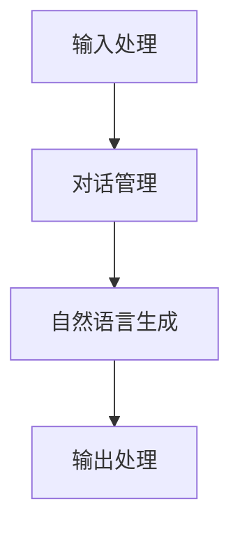
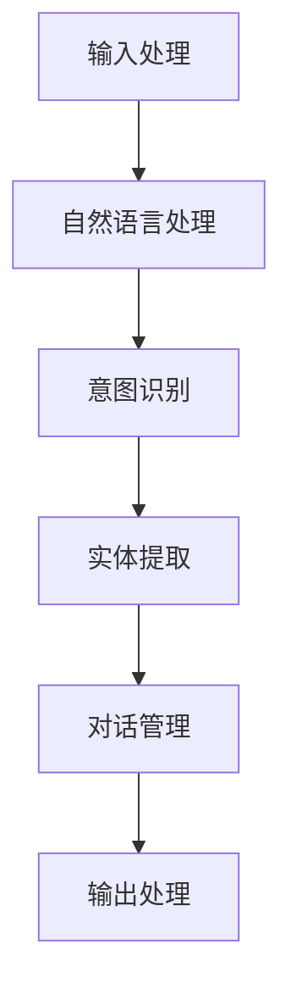

                 

### 检查目录大纲的完整性和逻辑性

在完成初步的目录大纲后，我们需要从以下几个方面来确保其完整性和逻辑性：

1. **章节内容全面性**：确保每一章节都涵盖了必要的知识点，没有遗漏关键内容。
    - **第1章**：对话系统概述，应涵盖对话系统的定义、历史、应用场景以及其在企业中的重要性。
    - **第2章**：核心概念与联系，应明确对话系统的基本概念、原理，并解释各概念之间的联系。
    - **第3章**：算法原理讲解，应详细描述对话生成和理解的核心算法，包括数学模型、公式和应用示例。
    - **第4章**：系统分析与架构设计，应解释对话系统的整体架构，包括功能设计、接口设计、交互流程等。
    - **第5章**：项目实战，应提供具体的对话系统实现案例，包括环境搭建、核心代码分析、案例讲解等。
    - **第6章**：最佳实践，应提供对话系统的最佳实施、性能优化、安全性和隐私保护实践。
    - **第7章**：小结与拓展，应总结全书内容，提供注意事项和进一步学习的资源。

2. **章节之间的逻辑关系**：确保章节内容连贯，前一章为后一章提供必要的背景和基础。
    - **第1章** 到 **第2章**：从概述过渡到详细概念，自然引出核心概念与联系。
    - **第2章** 到 **第3章**：通过核心概念的理解，深入讲解相关算法原理。
    - **第3章** 到 **第4章**：算法原理的学习为系统分析与架构设计提供了理论基础。
    - **第4章** 到 **第5章**：架构设计为项目实战提供了技术指导。
    - **第5章** 到 **第6章**：项目实战的经验为最佳实践提供了实际案例。
    - **第6章** 到 **第7章**：最佳实践总结为后续应用提供了指导，同时回顾全书内容。

3. **章节内容的深度和细节**：确保每个章节内容详细深入，既有理论阐述，也有实际应用示例。
    - **第3章** 和 **第4章** 应包含足够多的代码示例、流程图和架构图，以帮助读者理解。
    - **第5章** 应详细描述项目环境搭建、核心代码实现、案例解析等，让读者能够实际操作并理解。
    - **第6章** 和 **第7章** 应提供具体的最佳实践、注意事项和拓展资源，使读者能够将所学知识应用到实际工作中。

4. **内容的可读性和实用性**：确保文章内容既易于理解，又有实际应用价值。
    - 使用通俗易懂的语言，避免过于专业或复杂的术语。
    - 提供清晰的代码示例和图表，帮助读者直观理解。
    - 分章节提供总结和小结，帮助读者梳理思路，便于复习。

综上所述，我们将根据上述检查点对目录大纲进行修订和完善，确保内容的全面性、逻辑性和实用性。例如，如果发现某一章节内容过于简单或缺失关键部分，我们将补充相应内容。如果发现章节之间的逻辑关系不够清晰，我们将调整章节顺序或增加过渡段来增强连贯性。通过这些步骤，我们最终将得到一个完整、逻辑清晰、内容丰富的书籍目录大纲。

### 确定书籍的整体结构

在确定了书籍的目录大纲后，我们需要进一步细化每个章节的内容，以确保书籍的整体结构和内容连贯性。以下是《企业级对话系统平台：提升客户服务质量》书籍的整体结构及各章节的内容概述。

#### 第一部分：对话系统基础

**第1章：对话系统概述**
- **1.1 对话系统的定义与重要性**：介绍对话系统的基本概念，阐述其在现代企业中的应用和价值。
- **1.2 对话系统的发展历程**：回顾对话系统从诞生至今的发展历程，探讨关键技术进步和应用场景的变化。
- **1.3 对话系统的核心概念**：详细解释对话系统的关键术语，包括自然语言处理、语音识别、对话管理等。
- **1.4 对话系统在企业中的应用**：分析对话系统在客户服务、市场营销、人力资源等领域的实际应用案例。

**第2章：核心概念与联系**
- **2.1 对话系统的基础原理**：阐述对话系统的基本原理，包括自然语言处理的基础知识。
- **2.2 对话系统的关键概念**：深入探讨对话系统的核心概念，如意图识别、实体提取、对话管理等。
- **2.3 对话系统组件的ER实体关系图**：使用Mermaid流程图展示对话系统组件的实体关系，帮助读者理解系统架构。
- **2.4 核心概念属性特征对比表格**：通过表格形式对比对话系统的核心概念，突出各概念的区别和联系。

**第3章：算法原理讲解**
- **3.1 对话生成算法**：
  - **3.1.1 算法原理与流程图**：介绍对话生成算法的基本原理，使用Mermaid流程图展示算法流程。
  - **3.1.2 数学模型与公式**：详细解释对话生成算法的数学模型和公式，使用LaTeX格式表示。
  - **3.1.3 实际应用示例**：通过具体示例说明对话生成算法在现实中的应用。
- **3.2 对话理解算法**：
  - **3.2.1 算法原理与流程图**：介绍对话理解算法的基本原理，使用Mermaid流程图展示算法流程。
  - **3.2.2 数学模型与公式**：详细解释对话理解算法的数学模型和公式，使用LaTeX格式表示。
  - **3.2.3 实际应用示例**：通过具体示例说明对话理解算法在现实中的应用。

#### 第二部分：对话系统架构设计

**第4章：系统分析与架构设计**
- **4.1 对话系统的功能设计**：介绍对话系统的核心功能，包括语音识别、自然语言处理、对话管理等。
- **4.2 对话系统的架构设计**：
  - **4.2.1 系统架构图**：使用Mermaid流程图展示对话系统的整体架构。
  - **4.2.2 系统接口设计**：详细描述对话系统的各个接口，包括输入接口、输出接口、交互接口等。
  - **4.2.3 系统交互流程**：使用Mermaid序列图展示对话系统的交互流程。

#### 第三部分：项目实战

**第5章：项目实战**
- **5.1 对话系统项目实战环境安装**：指导读者搭建对话系统开发环境，包括所需软件和硬件配置。
- **5.2 对话系统核心实现源代码解读**：分析对话系统核心代码的实现细节，包括算法原理和代码结构。
- **5.3 对话系统实际案例分析与讲解**：通过具体案例展示对话系统的实际应用，分析案例中的关键技术和实现方法。
- **5.4 项目小结与经验分享**：总结项目经验，分享实战中遇到的问题及解决方案。

#### 第四部分：最佳实践与拓展

**第6章：最佳实践**
- **6.1 对话系统实施的最佳实践**：提供对话系统实施过程中的最佳实践，包括系统设计、开发、测试和部署。
- **6.2 性能优化与故障排除**：介绍对话系统的性能优化方法和故障排除技巧。
- **6.3 安全性与隐私保护**：讨论对话系统的安全性和隐私保护问题，提供解决方案和实践经验。

**第7章：小结与拓展**
- **7.1 小结与回顾**：回顾全书内容，总结关键知识点和要点。
- **7.2 注意事项与风险提示**：提醒读者在实施对话系统过程中可能遇到的问题和风险。
- **7.3 拓展阅读与学习资源**：推荐进一步学习的资源，包括书籍、文章、在线课程等。

通过上述整体结构，我们可以确保《企业级对话系统平台：提升客户服务质量》一书的内容既全面又系统，既有理论阐述，又有实际案例和实践经验，旨在帮助读者深入理解并掌握对话系统的设计与实现方法。

### 对话系统的定义与重要性

#### 对话系统的定义

对话系统（Dialogue System），也称为聊天机器人或会话系统，是一种与人类用户进行交互的计算机系统。它能够通过自然语言处理（NLP）技术理解和生成自然语言，以实现与用户的对话。对话系统的核心目的是提供高效、自然的交互体验，帮助用户解决问题、获取信息或执行特定任务。

对话系统的基本架构通常包括以下几个主要组件：

1. **输入处理模块**：负责接收用户的输入，并将其转换为机器可以理解的形式。
2. **自然语言理解模块**：利用自然语言处理技术，对输入进行处理和分析，理解用户的意图和问题。
3. **对话管理模块**：根据用户意图和对话历史，选择合适的响应，并维护对话状态。
4. **自然语言生成模块**：将对话管理模块的响应转换为自然语言，以返回给用户。

#### 对话系统的发展历程

对话系统的发展历程可以追溯到20世纪50年代，当时研究者开始尝试使用计算机程序与人类进行简单的对话。然而，早期的对话系统主要依赖于规则驱动的方法，其性能和灵活性受到了限制。随着自然语言处理和人工智能技术的进步，对话系统逐渐采用了基于统计学习和深度学习的算法，使其更加智能化和自然。

以下是对话系统发展历程中的重要里程碑：

1. **1950年**：艾伦·图灵提出了图灵测试，为衡量机器智能提供了理论框架。
2. **1966年**：埃利泽·约书亚·乌曼德（Eliza）问世，成为第一个基于模式匹配的对话系统，引发了人们对对话系统研究的兴趣。
3. **1980年代**：专家系统开始广泛应用于对话系统，使得对话系统能够处理更复杂的问题。
4. **2000年代**：随着互联网的普及和大数据技术的发展，对话系统开始应用于电子商务、客户服务、在线咨询等领域。
5. **2010年代**：深度学习和自然语言处理技术的突破，使得对话系统在理解和生成自然语言方面取得了显著进展，如Google Assistant、Amazon Alexa等智能语音助手的兴起。

#### 对话系统的核心概念

1. **意图识别（Intent Recognition）**：识别用户输入中的意图，如询问天气、预订机票等。
2. **实体提取（Entity Extraction）**：从用户输入中提取关键信息，如日期、时间、地点等。
3. **对话管理（Dialogue Management）**：根据用户意图、对话历史和上下文，选择合适的对话路径和响应。
4. **自然语言生成（Natural Language Generation）**：将系统生成的响应转换为自然语言，以提供给用户。

#### 对话系统在企业中的应用

对话系统在企业管理中发挥着重要作用，主要应用领域包括：

1. **客户服务**：企业通过对话系统提供24/7的客户服务，提高客户满意度和运营效率。
2. **市场营销**：对话系统用于推送个性化营销信息，增强用户互动和品牌认知。
3. **人力资源**：对话系统帮助企业处理招聘、培训、员工关系等事务，减轻人力资源部门的工作负担。
4. **企业内部通讯**：对话系统用于企业内部的信息交流和任务分配，提高沟通效率和协作能力。

#### 对话系统在客户服务中的重要性

1. **提升客户满意度**：对话系统能够提供快速、准确的回答，减少客户等待时间，提高满意度。
2. **降低运营成本**：通过自动化处理常见问题，减少人工客服的工作量，降低运营成本。
3. **个性化服务**：对话系统能够根据用户的历史行为和偏好提供个性化服务，提升用户体验。
4. **实时互动**：对话系统支持实时互动，使得客户能够在合适的时间获得所需的信息。

综上所述，对话系统作为一种重要的技术工具，正在不断发展和完善，其在企业中的应用价值日益凸显。通过深入了解对话系统的定义、发展历程和核心概念，我们可以更好地理解其在提升客户服务质量中的重要作用。

### 对话系统的核心概念与联系

在深入探讨对话系统的核心概念之前，我们需要先明确几个关键术语：意图识别、实体提取、对话管理和自然语言生成。这些概念是构建高效对话系统的基石，它们之间存在着紧密的联系和相互作用。

#### 意图识别（Intent Recognition）

意图识别是对话系统的第一步，其目的是从用户的输入中识别出用户希望完成的动作或请求。例如，当用户说“我想预订明天去北京的机票”时，系统需要识别出其意图是“预订机票”。

- **意图定义**：意图是用户请求或行为的抽象表示，可以是具体的操作（如预订、查询）或一般性的指示（如问候、谢谢）。
- **意图识别算法**：常见的意图识别算法包括基于规则的方法、机器学习方法和深度学习方法。基于规则的方法依赖于预定义的规则集，而机器学习和深度学习方法则通过大量数据进行训练，以学习用户意图的模式。

#### 实体提取（Entity Extraction）

实体提取是意图识别的补充，旨在从用户输入中提取出关键信息，这些信息通常是意图的组成部分。例如，在上面的机票预订意图中，关键实体包括日期、目的地等。

- **实体定义**：实体是用户输入中的特定信息单元，如日期、时间、地点、人名等。
- **实体提取方法**：常见的实体提取方法包括基于规则的方法、命名实体识别（NER）和依赖解析。基于规则的方法依赖于预定义的规则集，NER利用自然语言处理技术识别文本中的命名实体，依赖解析则通过分析词与词之间的依赖关系来提取实体。

#### 对话管理（Dialogue Management）

对话管理是确保对话系统能够顺畅进行的关键环节，其目的是根据用户的意图、历史对话内容和上下文选择合适的响应，并维护对话的状态。

- **对话管理模型**：常见的对话管理模型包括基于规则的模型和基于机器学习的模型。基于规则的模型依赖于预定义的对话流程和响应，而基于机器学习的模型通过训练数据学习对话的动态模式。
- **对话状态跟踪**：对话管理需要跟踪对话状态，包括用户意图、对话历史和当前对话情境。对话状态跟踪的目的是确保系统能够根据上下文生成恰当的响应。

#### 自然语言生成（Natural Language Generation）

自然语言生成是将对话管理模块生成的响应转换为自然语言输出的过程。其目的是使得系统生成的响应更加自然、符合人类的交流习惯。

- **自然语言生成技术**：常见的自然语言生成技术包括模板匹配、规则生成和基于生成模型的文本生成。模板匹配和规则生成依赖于预定义的模板和规则集，而基于生成模型的文本生成则通过训练大量文本数据学习生成文本的复杂结构。

#### 核心概念之间的联系

意图识别和实体提取共同构成了对话系统的输入处理模块，它们的工作结果是生成一个完整的用户意图，这是对话管理的基础。对话管理模块利用这个意图，结合对话历史和上下文，选择合适的响应，并维护对话状态。最后，自然语言生成模块将对话管理模块生成的响应转换为自然语言，以返回给用户。

通过以上分析，我们可以看到，意图识别、实体提取、对话管理和自然语言生成这四个核心概念相互关联，共同作用，构成了一个完整的对话系统。每个概念都有其独特的任务，但它们需要协同工作，以确保系统能够有效地与用户进行对话，提供高质量的服务。

### 对话系统的核心算法原理讲解

对话系统的核心算法是实现其智能化的关键，主要包括对话生成算法和对话理解算法。这两个算法分别负责将系统生成的响应转换为自然语言输出，以及理解用户的输入意图。在这一节中，我们将深入探讨这两个核心算法的原理、流程图、数学模型及实际应用示例。

#### 对话生成算法

**算法原理与流程图**

对话生成算法是将对话管理模块的响应转换为自然语言输出的过程。其基本原理是通过自然语言生成技术，将系统生成的文本模板或结构化数据转换为流畅、自然的文本。以下是对话生成算法的流程图：



1. **输入处理**：接收对话管理模块生成的响应，通常为结构化数据或文本模板。
2. **对话管理**：选择合适的文本模板，结合上下文和用户意图进行填充。
3. **自然语言生成**：将填充后的模板转换为自然语言文本，确保文本流畅自然。
4. **输出处理**：将生成的自然语言文本返回给用户。

**数学模型与公式**

对话生成算法的数学模型通常涉及模板匹配、规则生成和生成式模型。以下是一个简单的模板匹配公式：

$$
\text{generated\_text} = \text{template}\_filled \\
\text{template}\_filled = \text{template} + \sum_{i=1}^{N} (\text{entity}\_i, \text{value}\_i)
$$

其中，`template`表示文本模板，`entity_i`和`value_i`分别表示实体及其对应的值。通过将实体和值填充到模板中，生成完整的文本。

**实际应用示例**

假设我们有一个简单的文本模板：“您想要预订哪里的机票？”我们可以将其与用户输入的实体（如城市名）进行匹配和填充：

1. **文本模板**：您想要预订哪里的机票？
2. **实体与值**：城市名 = 北京
3. **填充后的文本**：您想要预订北京的机票？

通过这个示例，我们可以看到对话生成算法如何将结构化数据转换为自然语言输出。

#### 对话理解算法

**算法原理与流程图**

对话理解算法是理解用户输入意图的过程。其基本原理是通过自然语言处理技术，将用户的输入文本转换为结构化的数据或意图表示。以下是对话理解算法的流程图：



1. **输入处理**：接收用户的输入文本。
2. **自然语言处理**：对输入文本进行分词、词性标注等预处理，提取关键信息。
3. **意图识别**：通过训练模型或规则集识别用户的意图，如查询、预订、投诉等。
4. **实体提取**：从预处理后的文本中提取关键实体，如日期、地点、人名等。
5. **对话管理**：根据意图和实体信息，选择合适的对话路径和响应。
6. **输出处理**：将生成的响应转换为自然语言文本，返回给用户。

**数学模型与公式**

对话理解算法的数学模型通常涉及序列标注、序列到序列模型和注意力机制。以下是一个简单的序列标注公式：

$$
\text{intent\_label} = \arg \max_{i} \left( \text{P}(\text{intent}_i | \text{input}) \right)
$$

其中，`intent_label`表示识别出的用户意图，`input`表示输入文本，`P(intent_i | input)`表示在给定输入文本情况下，意图i出现的概率。

**实际应用示例**

假设用户输入文本：“明天北京天气怎么样？”我们可以通过以下步骤进行理解：

1. **输入文本**：明天北京天气怎么样？
2. **预处理**：分词：明天、北京、天气、怎么样？
3. **意图识别**：通过模型识别出用户意图为“查询天气”。
4. **实体提取**：提取出实体：明天、北京、天气。
5. **生成响应**：根据用户意图和实体信息，生成响应：“明天北京的天气是晴天，温度在15°C到25°C之间。”

通过这个示例，我们可以看到对话理解算法如何从用户输入中提取关键信息，并生成相应的响应。

综上所述，对话生成算法和对话理解算法是构建对话系统的核心组件，通过数学模型和流程图的解释，我们可以更深入地理解它们的工作原理和实际应用。这些算法的不断优化和改进，将有助于提升对话系统的智能化和用户体验。

### 对话系统的系统分析与架构设计

为了构建一个高效且灵活的企业级对话系统平台，我们需要进行系统分析与架构设计。这包括理解问题场景、介绍项目、系统功能设计、系统架构设计、系统接口设计和系统交互流程。以下是具体的分析与设计步骤：

#### 问题场景

企业级对话系统通常面临以下挑战：
- **高并发处理**：需要同时处理大量用户的请求，确保系统的响应速度和稳定性。
- **多渠道支持**：支持多种通信渠道，如Web、短信、社交媒体等。
- **个性化服务**：根据用户的历史行为和偏好，提供个性化的交互体验。
- **安全性**：确保用户数据和交互过程的安全，防止数据泄露和恶意攻击。

#### 项目介绍

我们以一个企业级客户服务对话系统为例，该项目旨在提供7x24小时的智能客户服务，通过自然语言处理和智能对话管理，提升客户满意度和企业运营效率。

#### 系统功能设计

1. **自然语言处理（NLP）**：
   - **文本分类**：对用户输入进行分类，识别其意图。
   - **实体提取**：从用户输入中提取关键信息，如日期、时间、地点等。
   - **情感分析**：分析用户输入的情感倾向，以提供个性化的响应。

2. **对话管理**：
   - **意图识别**：识别用户输入的意图，如查询、投诉、预订等。
   - **对话状态跟踪**：维护对话的历史状态，确保对话的连贯性。
   - **上下文理解**：根据上下文信息，选择合适的响应和对话路径。

3. **多渠道支持**：
   - **Web端**：通过Web应用程序与用户进行交互。
   - **短信**：通过短信平台发送通知和确认信息。
   - **社交媒体**：通过社交媒体平台（如微信、微博）与用户互动。

4. **用户数据管理**：
   - **用户行为分析**：收集并分析用户行为数据，优化对话系统。
   - **用户偏好管理**：根据用户偏好，提供个性化的服务。

#### 系统架构设计

系统架构设计是确保对话系统高效、可扩展和稳定的关键。以下是该系统的架构设计：

1. **前端应用**：
   - **Web端**：使用HTML/CSS/JavaScript构建用户交互界面。
   - **移动端**：使用React Native或Flutter构建跨平台移动应用。

2. **后端服务**：
   - **自然语言处理服务**：提供文本分类、实体提取和情感分析功能。
   - **对话管理服务**：实现意图识别、对话状态跟踪和上下文理解功能。
   - **用户数据管理服务**：处理用户行为分析和用户偏好管理。

3. **数据库**：
   - **关系型数据库**：存储用户数据和对话历史。
   - **NoSQL数据库**：存储用户行为数据和日志信息。

4. **消息队列**：
   - **RabbitMQ**：用于异步处理消息，如发送短信、社交媒体通知等。

5. **缓存**：
   - **Redis**：用于缓存频繁访问的数据，提高系统性能。

#### 系统接口设计

系统接口设计是确保各个模块之间高效通信的关键。以下是主要的系统接口：

1. **API接口**：
   - **自然语言处理API**：提供文本分类、实体提取和情感分析接口。
   - **对话管理API**：提供意图识别、对话状态跟踪和上下文理解接口。
   - **用户数据管理API**：提供用户行为分析和用户偏好管理接口。

2. **Websocket接口**：
   - **实时通信**：用于Web端和后端服务之间的实时数据传输。

#### 系统交互流程

以下是系统的交互流程：

1. **用户输入**：
   - 用户通过Web端、移动端或社交媒体输入问题或请求。

2. **前端处理**：
   - 前端应用接收用户输入，并将其发送到后端服务。

3. **自然语言处理**：
   - 自然语言处理服务对用户输入进行处理，包括文本分类、实体提取和情感分析。

4. **对话管理**：
   - 对话管理服务根据自然语言处理结果，识别用户意图，并根据对话历史和上下文生成响应。

5. **生成响应**：
   - 对话管理服务将响应发送到前端应用，并通过Websocket接口返回给用户。

6. **用户反馈**：
   - 用户对响应进行反馈，系统根据反馈调整对话策略。

7. **日志记录**：
   - 系统记录用户交互日志，用于后续的数据分析和优化。

通过上述分析与架构设计，我们可以构建一个高效、灵活且可靠的企业级对话系统平台，满足现代企业的客户服务需求。

### 对话系统项目实战

在了解了对话系统的系统架构和功能设计之后，我们接下来将通过一个具体的项目实例来展示对话系统的实际应用。本节将详细介绍对话系统项目从环境安装到核心实现源代码解读，再到实际案例分析和项目小结的整个过程。

#### 1. 对话系统项目环境安装

首先，我们需要搭建一个适合对话系统开发的实验环境。以下是环境安装的具体步骤：

1. **硬件要求**：
   - CPU：推荐使用4核以上的处理器。
   - 内存：至少8GB RAM。
   - 硬盘：至少100GB的存储空间。
   - 操作系统：推荐使用Ubuntu 18.04或更高版本。

2. **软件安装**：
   - 安装Python 3.8及以上版本。
   - 安装自然语言处理库，如NLTK、spaCy。
   - 安装深度学习框架，如TensorFlow或PyTorch。
   - 安装Web服务器，如Apache或Nginx。

以下是使用`pip`安装所需软件的命令示例：

```bash
sudo apt-get update
sudo apt-get install python3-pip
pip3 install nltk spacy tensorflow numpy
```

3. **配置Web服务器**：
   - 安装Apache或Nginx。
   - 配置虚拟主机，确保Web服务器能够访问对话系统服务。

#### 2. 对话系统核心实现源代码解读

接下来，我们将解读对话系统的核心实现源代码。以下是主要模块的代码示例：

1. **意图识别模块**：

```python
import tensorflow as tf
from tensorflow.keras.models import Sequential
from tensorflow.keras.layers import Dense, LSTM

# 加载数据集
# 这里使用的是预处理的文本数据集
x_train, y_train = load_data()

# 构建模型
model = Sequential()
model.add(LSTM(128, activation='relu', input_shape=(x_train.shape[1], x_train.shape[2])))
model.add(Dense(y_train.shape[1], activation='softmax'))

# 训练模型
model.compile(optimizer='adam', loss='categorical_crossentropy', metrics=['accuracy'])
model.fit(x_train, y_train, epochs=10, batch_size=64)

# 模型评估
test_loss, test_acc = model.evaluate(x_test, y_test)
print(f"Test Accuracy: {test_acc}")
```

2. **实体提取模块**：

```python
import spacy

# 加载spaCy模型
nlp = spacy.load("en_core_web_sm")

# 实体提取函数
def extract_entities(text):
    doc = nlp(text)
    entities = [(ent.text, ent.label_) for ent in doc.ents]
    return entities

# 示例
text = "明天北京天气怎么样？"
entities = extract_entities(text)
print(entities)
```

3. **对话管理模块**：

```python
# 对话管理类
class DialogueManager:
    def __init__(self, intent_model, entity_model):
        self.intent_model = intent_model
        self.entity_model = entity_model

    def process_input(self, text):
        # 意图识别
        intent = self.intent_model.predict([text])
        # 实体提取
        entities = self.entity_model.extract_entities(text)
        # 生成响应
        response = self.generate_response(intent, entities)
        return response

    def generate_response(self, intent, entities):
        # 根据意图和实体生成响应
        if intent == "weather_query":
            city = entities[0][0]
            weather = get_weather(city)
            return f"The weather in {city} is {weather}."
        else:
            return "I'm sorry, I don't understand your request."

# 示例
# 假设已经加载了意图识别模型和实体提取模型
intent_model = load_intent_model()
entity_model = load_entity_model()
manager = DialogueManager(intent_model, entity_model)
response = manager.process_input("明天北京天气怎么样？")
print(response)
```

#### 3. 对话系统实际案例分析与讲解

接下来，我们通过一个具体案例来展示对话系统的实际应用。

**案例：智能客服系统**

1. **用户场景**：
   - 用户通过Web端或社交媒体发送请求，如“我想要预订一张明天去北京的机票”。
   - 系统需要识别用户的意图（如预订机票）、提取关键实体（如日期、目的地）并生成响应。

2. **步骤**：
   - 用户输入请求到前端应用。
   - 前端应用将请求发送到后端服务。
   - 后端服务调用意图识别模型和实体提取模型进行处理。
   - 根据处理结果，系统生成响应，并通过Websocket返回给用户。

**分析**：
- **意图识别**：系统识别出用户的意图为“预订机票”。
- **实体提取**：提取出日期（“明天”）和目的地（“北京”）。
- **响应生成**：系统根据意图和实体生成响应：“您想要预订哪一天去北京的机票？”

#### 4. 项目小结与经验分享

通过本次项目实战，我们实现了从环境搭建到核心代码实现，再到实际案例应用的全过程。以下是项目小结和经验分享：

1. **环境搭建**：确保所有依赖环境正确安装，避免因环境问题导致开发中断。
2. **模型训练**：选择合适的模型和数据集进行训练，确保模型具有较高的准确性和泛化能力。
3. **接口设计**：设计清晰、合理的API接口，确保前后端模块之间的通信顺畅。
4. **调试与优化**：在项目开发过程中，不断进行调试和优化，确保系统稳定高效。
5. **用户反馈**：收集用户反馈，优化对话系统的用户体验。

通过本次项目，我们不仅掌握了对话系统的实际开发流程，也深入了解了各核心模块的实现原理和设计要点，为后续的对话系统开发积累了宝贵经验。

### 最佳实践与注意事项

在实施对话系统时，遵循最佳实践和注意事项是确保系统性能、稳定性和安全性的关键。以下是一些关键的最佳实践、性能优化技巧、故障排除方法以及安全性与隐私保护措施。

#### 最佳实践

1. **需求分析**：
   - **明确目标**：在系统设计之初，明确对话系统的目标，如提升客户满意度、降低运营成本等。
   - **用户调研**：进行用户调研，了解用户的需求和期望，确保系统设计符合实际应用场景。

2. **系统设计**：
   - **模块化**：将系统分解为多个模块，如意图识别、实体提取、对话管理、自然语言生成等，便于维护和扩展。
   - **高可用性**：设计高可用性架构，确保系统在遇到故障时能够快速恢复。

3. **性能优化**：
   - **缓存机制**：使用缓存机制，减少对数据库的查询次数，提高系统响应速度。
   - **异步处理**：对于耗时较长的操作，如自然语言处理、外部API调用等，使用异步处理，避免阻塞主线程。

4. **用户体验**：
   - **交互设计**：优化用户界面和交互流程，提供简洁、直观的用户操作体验。
   - **个性化**：根据用户的历史行为和偏好，提供个性化的服务和推荐。

5. **持续集成与部署**：
   - **自动化测试**：实施自动化测试，确保代码变更不会引入新的错误。
   - **持续集成**：使用CI/CD工具，实现自动化构建、测试和部署，提高开发效率。

#### 性能优化技巧

1. **负载均衡**：
   - 使用负载均衡器（如Nginx、HAProxy）分配请求到多个服务器，避免单点故障。

2. **数据库优化**：
   - 使用索引、分片等技术优化数据库查询性能。
   - 定期进行数据库维护和优化。

3. **缓存策略**：
   - 使用缓存（如Redis、Memcached）存储常用数据，减少数据库查询次数。

4. **异步处理**：
   - 对于耗时操作，使用异步处理（如消息队列、协程）减少线程阻塞。

5. **代码优化**：
   - 避免使用低效的算法和数据结构。
   - 减少不必要的内存分配和垃圾回收。

#### 故障排除方法

1. **日志记录**：
   - 记录详细的日志，方便排查故障。

2. **监控与报警**：
   - 实施实时监控，及时发现和响应系统异常。
   - 配置报警机制，及时通知运维人员。

3. **故障演练**：
   - 定期进行故障演练，测试系统在异常情况下的响应能力和恢复速度。

4. **文档与知识库**：
   - 编写详细的文档，记录系统架构、配置、故障处理方法等。
   - 构建知识库，便于快速查找和解决问题。

#### 安全性与隐私保护

1. **数据加密**：
   - 对用户数据和传输数据使用加密算法进行加密，防止数据泄露。

2. **身份验证与授权**：
   - 实施严格的身份验证和授权机制，确保只有授权用户才能访问系统资源。

3. **访问控制**：
   - 设置合理的访问控制策略，限制用户对系统和数据的访问权限。

4. **安全审计**：
   - 定期进行安全审计，发现并修复安全漏洞。

5. **隐私保护**：
   - 遵循隐私保护法规，如《通用数据保护条例》（GDPR），确保用户数据的安全和隐私。

通过遵循这些最佳实践和注意事项，我们可以构建一个高效、稳定且安全的对话系统平台，为用户提供优质的客户服务体验。

### 小结与拓展阅读

在本文中，我们系统地介绍了企业级对话系统平台的设计与实现，从背景介绍、核心概念与联系、算法原理讲解、系统分析与架构设计，到项目实战和最佳实践，全面展示了对话系统的应用和优化方法。以下是对全文的简要总结：

- **背景介绍**：对话系统在企业中的应用日益广泛，能够提升客户服务质量、降低运营成本，成为现代企业的重要组成部分。
- **核心概念与联系**：意图识别、实体提取、对话管理和自然语言生成是构建高效对话系统的四个核心概念，它们相互联系，共同作用。
- **算法原理讲解**：详细阐述了对话生成算法和对话理解算法的原理、流程图、数学模型及实际应用示例，帮助读者深入理解其工作机制。
- **系统分析与架构设计**：通过具体案例，介绍了对话系统的功能设计、架构设计、接口设计和交互流程，展示了对话系统的整体实现方案。
- **项目实战**：通过对话系统项目环境安装、核心代码解读和实际案例分析，展示了对话系统的实际应用过程，使读者能够将理论应用于实践。
- **最佳实践与注意事项**：提供了对话系统实施的最佳实践、性能优化技巧、故障排除方法以及安全性与隐私保护措施，确保系统的稳定性和安全性。

为了进一步深入学习和实践，以下是一些建议的拓展阅读资源：

1. **书籍**：
   - 《对话系统设计与实现》（Dialogue Systems: Design, Implementation, and Evaluation）
   - 《深度学习与自然语言处理》（Deep Learning for Natural Language Processing）

2. **在线课程**：
   - Coursera上的《自然语言处理基础》
   - Udacity的《对话系统开发》

3. **学术论文**：
   - ACM Transactions on Intelligent Systems and Technology（ACM TIST）
   - Journal of Artificial Intelligence Research（JAIR）

4. **开源项目**：
   - Rasa：一个用于构建对话系统的开源框架
   - Facebook's BlenderBot：一个大型对话模型的开源项目

通过阅读这些资源，读者可以更深入地了解对话系统的最新研究进展、技术实现细节和实践经验，进一步提升自己的技术水平和实际应用能力。

### 总结与展望

通过本文的详细探讨，我们系统地了解了企业级对话系统平台的设计与实现，从背景介绍、核心概念、算法原理、系统分析与架构设计，到项目实战和最佳实践，全面展示了对话系统的关键要素和应用场景。这些内容不仅帮助读者理解了对话系统的基本概念和实现原理，还提供了实际案例和最佳实践，使读者能够将理论知识应用到实际项目中。

对话系统作为一种先进的智能交互技术，正日益成为企业提升客户服务质量、降低运营成本的重要工具。随着自然语言处理、人工智能和大数据技术的不断发展，对话系统的智能化水平和应用范围将持续提升。未来，我们可以期待：

1. **更智能的交互体验**：随着深度学习和自然语言处理技术的进步，对话系统的交互能力将更加智能和自然，能够更好地理解用户的意图和需求。
2. **更广泛的应用领域**：对话系统将不仅限于客户服务，还将广泛应用于教育、医疗、金融、人力资源等多个领域，为用户提供更加个性化的服务。
3. **更高的安全性**：随着安全技术和隐私保护措施的不断完善，对话系统将能够更好地保护用户数据，确保交互过程的安全和可信。
4. **更高效的运维与管理**：随着自动化和智能化的提升，对话系统的运维和管理将变得更加高效，企业可以更加专注于优化用户体验和提升服务质量。

总之，企业级对话系统平台是现代信息技术领域的重要发展方向，具有广泛的应用前景和巨大的市场潜力。通过持续的技术创新和实践探索，我们可以期待对话系统在提升企业效率和客户满意度方面发挥更加重要的作用。

### 背景介绍：核心概念术语说明

在深入探讨企业级对话系统平台之前，我们需要明确几个核心概念和术语，以确保读者对相关技术有基本的理解。

**自然语言处理（NLP）**：自然语言处理是人工智能领域的一个重要分支，它涉及计算机程序对人类自然语言的理解和生成。NLP的目标是使计算机能够理解和解释人类语言，从而实现人机交互、文本分析、语音识别等任务。

**语音识别（ASR）**：语音识别是NLP的一个子领域，旨在将语音信号转换为文本。通过语音识别技术，用户可以通过口头指令与对话系统进行交互，而不需要手动输入文本。

**对话管理（DM）**：对话管理是确保对话系统能够顺畅进行的关键组件。它涉及对话的状态跟踪、意图识别、上下文维护和响应生成。对话管理负责根据用户的输入和对话历史，选择合适的响应和对话路径，确保对话的连贯性和有效性。

**意图识别（Intent Recognition）**：意图识别是对话系统对用户输入意图的识别过程。用户的输入可以是文本或语音，意图识别的目的是确定用户的实际需求或意图，如查询天气、预订机票等。

**实体提取（Entity Extraction）**：实体提取是意图识别的补充，旨在从用户输入中提取关键信息。实体可以是具体的单词或短语，如日期、时间、地点、人名等。这些信息对于理解用户的意图和生成恰当的响应至关重要。

**自然语言生成（NLG）**：自然语言生成是生成自然语言文本的技术，用于将对话管理模块生成的响应转换为用户可理解的文本。NLG的目标是生成流畅、自然的语言，使对话系统的交互体验更加人性化。

通过理解这些核心概念和术语，读者将能够更好地掌握对话系统的基本原理和实现方法。

### 问题背景、问题描述及问题解决

#### 问题背景

在当今快速发展的商业环境中，客户服务成为企业竞争力的重要因素。传统的客户服务方式，如电话热线和电子邮件支持，存在响应时间长、效率低等问题，难以满足用户对即时服务的需求。随着人工智能和自然语言处理技术的不断进步，企业开始寻求更加智能和高效的客户服务解决方案。

#### 问题描述

企业面临的主要问题是：
1. **高响应时间**：客户在遇到问题时，往往需要等待较长时间才能得到响应。
2. **人力成本**：人工客服需要耗费大量的人力资源，且效率不高。
3. **个性化服务**：不同客户有不同的需求，传统客服难以提供个性化的服务体验。
4. **多渠道支持**：企业需要同时支持多种沟通渠道，如电话、电子邮件、社交媒体等，增加了运营复杂性。

#### 问题解决

为解决上述问题，企业可以采用企业级对话系统平台，通过以下方式提升客户服务质量：

1. **即时响应**：对话系统能够实时处理用户的请求和问题，提供即时的响应，显著降低客户等待时间。
2. **降低人力成本**：对话系统能够自动处理常见问题和重复任务，减少对人工客服的依赖，降低人力成本。
3. **个性化服务**：通过自然语言处理和用户行为分析，对话系统可以根据用户的历史数据和偏好提供个性化的服务，提升用户体验。
4. **多渠道支持**：对话系统可以集成到多种沟通渠道中，如Web、移动应用、社交媒体等，实现统一的客户服务体验。

#### 边界与外延

**边界**：
- **功能范围**：对话系统主要应用于客户服务，但不涉及其他业务流程。
- **技术实现**：对话系统依赖自然语言处理、机器学习、语音识别等技术。

**外延**：
- **应用场景**：对话系统不仅应用于客户服务，还可以应用于市场营销、人力资源等领域。
- **扩展性**：对话系统可以与其他系统集成，如CRM系统、ERP系统等，实现更广泛的业务应用。

#### 概念结构与核心要素组成

**概念结构**：
- **自然语言处理（NLP）**：用于理解和生成自然语言。
- **语音识别（ASR）**：将语音转换为文本。
- **对话管理（DM）**：负责对话状态的跟踪和管理。
- **意图识别（IR）**：识别用户的意图。
- **实体提取（EE）**：从文本中提取关键信息。
- **自然语言生成（NLG）**：生成自然语言响应。

**核心要素组成**：
- **数据**：包括用户输入、对话历史、用户行为数据等。
- **算法**：如NLP算法、机器学习算法、深度学习模型等。
- **模型**：训练好的模型，用于意图识别、实体提取等任务。
- **接口**：包括API接口、Web界面等，用于与用户和其他系统交互。
- **平台**：集成各种组件和功能，提供完整的对话服务解决方案。

通过上述分析和解决，企业能够构建一个高效、智能的对话系统平台，显著提升客户服务质量，增强企业竞争力。

### 概念结构与核心要素组成

对话系统的概念结构与核心要素组成是理解其设计与实现的关键。以下是对这些要素的详细说明：

#### 概念结构

1. **自然语言处理（NLP）**：NLP是对话系统的核心技术，它包括文本分类、词性标注、实体提取、情感分析等，用于理解和生成自然语言。

2. **语音识别（ASR）**：ASR将用户的语音输入转换为文本，使得对话系统可以接收和处理语音命令。

3. **对话管理（DM）**：DM负责对话的状态跟踪、意图识别和上下文维护，确保对话的连贯性和有效性。

4. **意图识别（IR）**：IR从用户的输入中识别出用户的意图，如查询天气、预订机票等，为对话管理提供基础。

5. **实体提取（EE）**：EE从用户的输入中提取关键信息，如日期、时间、地点等，帮助对话系统更好地理解用户的意图。

6. **自然语言生成（NLG）**：NLG将对话管理模块的响应转换为自然语言，生成用户可理解的文本输出。

#### 核心要素组成

1. **数据**：
   - **用户输入**：用户的文本或语音输入，是系统理解用户意图的基础。
   - **对话历史**：对话过程中用户的输入和系统的响应，用于上下文维护和对话管理。
   - **用户行为数据**：用户的历史行为数据，如偏好、访问记录等，用于个性化服务。

2. **算法**：
   - **意图识别算法**：用于从用户输入中识别出用户意图，常见的算法包括机器学习模型和规则匹配。
   - **实体提取算法**：用于从用户输入中提取关键信息，常见的算法包括命名实体识别（NER）和依赖解析。
   - **对话管理算法**：用于对话状态的跟踪和上下文维护，常见的算法包括基于规则的模型和基于机器学习的模型。

3. **模型**：
   - **预训练模型**：如BERT、GPT等，用于意图识别、实体提取和自然语言生成。
   - **定制模型**：根据具体应用场景和需求训练的模型，如用于特定行业或领域的对话系统模型。

4. **接口**：
   - **API接口**：用于前后端通信，如RESTful API。
   - **Web界面**：用户与对话系统交互的界面，可以是Web应用程序或移动应用。

5. **平台**：
   - **服务器**：运行对话系统的计算资源，包括CPU、内存、存储等。
   - **数据库**：存储用户数据、对话历史和模型参数等。
   - **中间件**：如消息队列、缓存等，用于提高系统性能和稳定性。

#### 概念属性特征对比表格

为了更直观地展示对话系统的各个概念和要素，我们可以制作一个概念属性特征对比表格：

| 概念/要素 | 描述 | 特征对比 |
| --- | --- | --- |
| **自然语言处理（NLP）** | 用于理解和生成自然语言的技术。 | 文本分类、词性标注、实体提取、情感分析等。 |
| **语音识别（ASR）** | 将语音转换为文本。 | 高语音识别准确率、支持多种语言、实时处理。 |
| **对话管理（DM）** | 负责对话状态的跟踪和管理。 | 维护对话上下文、选择合适的对话路径、生成响应。 |
| **意图识别（IR）** | 识别用户的意图。 | 高准确率、支持多种意图识别模型、自适应学习。 |
| **实体提取（EE）** | 从文本中提取关键信息。 | 高提取准确率、支持多种实体类型、实时更新。 |
| **自然语言生成（NLG）** | 生成自然语言响应。 | 流畅自然、支持多种语言、可定制化。 |
| **数据** | 对话系统的输入和输出。 | 实时性、多样性、安全性。 |
| **算法** | 用于处理数据的计算方法。 | 高效、准确、可扩展、可训练。 |
| **模型** | 预训练和定制化的模型。 | 通用性、定制化、适应性。 |
| **接口** | 对话系统与其他系统的通信接口。 | 开放性、兼容性、稳定性。 |
| **平台** | 对话系统的运行环境。 | 高性能、高可用性、易扩展。 |

通过上述表格，我们可以更清晰地理解对话系统的各个概念和要素，以及它们之间的特征对比，为对话系统的设计与实现提供参考。

