                 

# 企业级异常检测：AI提高运营和安全监控

## 关键词
- 企业级异常检测
- AI
- 运营监控
- 安全监控
- 异常类型
- 检测算法
- 系统设计
- 案例分析

## 摘要
本文将探讨如何利用AI技术进行企业级异常检测，以提高运营效率和加强安全监控。文章首先介绍了异常检测的基本概念和重要性，然后详细讲解了异常类型、检测方法和相关算法原理。接着，文章分析了企业级异常检测系统的设计与实现，并通过实际案例展示了其应用效果。最后，文章总结了异常检测的最佳实践，并对未来发展方向进行了展望。

## 目录大纲设计步骤

### 了解书籍主题
首先，我们需要对书籍的主题有一个清晰的理解。这本书的主题是企业级异常检测，重点是如何利用AI技术来提高企业的运营和安全监控。

### 确定书籍结构
根据书籍的主题，我们可以将书籍内容大致分为以下几个部分：
1. 背景介绍：介绍异常检测的概念、重要性以及AI在异常检测中的应用。
2. 核心概念：介绍与异常检测相关的重要概念，如异常类型、检测方法等。
3. 算法原理：讲解异常检测的核心算法原理，如统计方法、机器学习方法等。
4. 系统设计与实现：介绍异常检测系统的设计和实现过程。
5. 实际案例：通过实际案例来展示异常检测的应用效果。
6. 最佳实践：总结异常检测的最佳实践，包括技术方案、流程优化等。
7. 小结与展望：对书籍内容进行总结，并对未来发展方向进行展望。

### 设计目录大纲
根据以上结构，我们可以开始设计目录大纲。目录大纲的设计需要遵循以下原则：
- 简洁性：避免多余的废话，直接给出关键内容。
- 逻辑性：确保目录大纲的层次分明，逻辑清晰。
- 完整性：确保目录大纲涵盖所有核心章节。

### 细化章节内容
在确定章节后，我们需要细化每个章节的内容。每个章节应该包含以下部分：
- 章节标题：简洁明了地概括章节内容。
- 子标题：根据需要，为章节添加子标题，以细化内容。
- 内容概要：简要说明章节的主要内容。

### 调整与优化
完成初步的目录大纲后，我们需要对其进行调整和优化。这包括：
- 检查目录大纲的完整性，确保所有核心内容都被涵盖。
- 调整章节的顺序，确保逻辑连贯性。
- 确保每个章节的内容都符合书籍的主题和目标读者。

### 遵循格式要求
最后，我们需要确保目录大纲遵循markdown格式要求。这包括使用正确的标题级别（#、##、###等）和适当的列表格式。

### 最终确认
在完成所有调整和优化后，我们需要对目录大纲进行最终确认，确保其内容完整、逻辑清晰、格式正确。

通过以上步骤，我们可以设计出《企业级异常检测：AI提高运营和安全监控》这本书的完整目录大纲。下面是具体的目录大纲设计：

## 第一部分：背景介绍

### 第1章：异常检测的基本概念
#### 1.1 异常检测的定义与重要性
#### 1.2 AI在异常检测中的应用
#### 1.3 企业级异常检测的需求与挑战

## 第二部分：核心概念

### 第2章：异常类型与特征提取
#### 2.1 异常类型的分类
#### 2.2 数据预处理与特征提取方法
#### 2.3 特征选择与优化

### 第3章：异常检测方法
#### 3.1 统计方法
#### 3.2 机器学习方法
#### 3.3 深度学习方法

## 第三部分：算法原理

### 第4章：统计方法详解
#### 4.1 统计量与假设检验
#### 4.2 聚类方法
#### 4.3 回归方法

### 第5章：机器学习方法详解
#### 5.1 监督学习方法
#### 5.2 无监督学习方法
#### 5.3 半监督学习方法

### 第6章：深度学习方法详解
#### 6.1 卷积神经网络（CNN）
#### 6.2 递归神经网络（RNN）
#### 6.3 自编码器（Autoencoder）

## 第四部分：系统设计与实现

### 第7章：异常检测系统设计
#### 7.1 系统架构设计
#### 7.2 数据流设计
#### 7.3 系统接口设计

### 第8章：异常检测系统实现
#### 8.1 数据采集与预处理
#### 8.2 特征提取与选择
#### 8.3 模型训练与优化

## 第五部分：实际案例

### 第9章：企业级异常检测应用案例
#### 9.1 案例背景
#### 9.2 案例描述
#### 9.3 案例分析

### 第10章：案例分析
#### 10.1 案例一：网络安全异常检测
#### 10.2 案例二：生产线故障检测
#### 10.3 案例三：金融欺诈检测

## 第六部分：最佳实践

### 第11章：异常检测最佳实践
#### 11.1 数据预处理技巧
#### 11.2 特征选择策略
#### 11.3 模型优化方法

### 第12章：小结与展望
#### 12.1 小结
#### 12.2 未来发展方向
#### 12.3 拓展阅读

## 第一部分：背景介绍

### 第1章：异常检测的基本概念

#### 1.1 异常检测的定义与重要性

异常检测（Anomaly Detection）是一种用于识别数据集中异常或异常模式的数据挖掘技术。它通过分析正常数据的行为模式，来识别那些不符合这些模式的数据点。在许多领域，如金融、医疗、网络安全等，异常检测都扮演着至关重要的角色。

在金融领域，异常检测可以帮助银行和金融机构识别欺诈交易，降低金融风险。在医疗领域，异常检测可以用于监控患者的健康状况，及时发现病情的异常变化。在网络安全领域，异常检测可以识别潜在的网络攻击和恶意行为，保护网络系统的安全。

异常检测的重要性在于它能够提前发现潜在问题，从而采取相应的措施，避免造成更大的损失。此外，异常检测还可以提高系统的效率和准确性，减少误报和漏报的情况。

#### 1.2 AI在异常检测中的应用

随着人工智能技术的发展，AI已经成为异常检测的重要工具。AI技术，特别是机器学习和深度学习，为异常检测提供了强大的支持。

机器学习方法，如监督学习、无监督学习和半监督学习，可以自动学习和识别数据中的异常模式。深度学习算法，如卷积神经网络（CNN）和递归神经网络（RNN），可以在大规模数据集上实现高效和准确的异常检测。

AI在异常检测中的应用不仅提高了检测的准确性和效率，还使得异常检测变得更加智能和灵活。通过学习大量的正常数据，AI算法可以不断优化和改进，以适应不断变化的环境和需求。

#### 1.3 企业级异常检测的需求与挑战

在企业级应用中，异常检测的需求和挑战主要集中在以下几个方面：

1. **数据多样性**：企业级系统需要处理来自不同来源、不同格式的海量数据。这些数据的多样性增加了异常检测的复杂性和难度。

2. **实时性**：企业级系统通常需要实时监控和响应异常情况。这意味着异常检测算法需要在短时间内处理大量数据，并快速给出检测结果。

3. **准确性和鲁棒性**：企业级系统对异常检测的准确性和鲁棒性有较高的要求。一方面，误报和漏报都会导致不良后果；另一方面，算法需要能够处理噪声数据和异常数据，确保检测结果的准确性。

4. **可解释性**：企业级系统通常需要理解异常检测的决策过程，以便进行故障排查和优化。因此，异常检测算法的可解释性成为一个重要挑战。

5. **资源消耗**：企业级系统可能需要处理海量数据和复杂的算法模型，这会导致较高的计算和存储资源消耗。如何优化算法和资源利用成为企业级异常检测的关键问题。

在接下来的章节中，我们将详细探讨异常检测的核心概念、算法原理、系统设计与实现，并通过实际案例来展示其应用效果。

---

在了解了异常检测的基本概念和重要性后，我们需要进一步了解与异常检测相关的重要概念。这些概念包括异常类型、特征提取方法和检测方法等。通过深入理解这些概念，我们可以更好地掌握异常检测的核心要素，为后续的学习和应用打下坚实的基础。

### 第2章：异常类型与特征提取

#### 2.1 异常类型的分类

异常检测的第一步是理解异常类型。异常类型可以分为以下几类：

1. **点异常（Point Anomaly）**：
   点异常是指数据集中某个数据点的特征值与正常值存在显著差异。例如，在信用卡交易数据中，一笔异常高的消费金额可能是一个点异常。

2. **上下文异常（Contextual Anomaly）**：
   上下文异常是指在特定环境下，某些数据点的特征值与正常值存在差异。上下文异常通常与时间、地点、用户等环境因素相关。例如，在一家商店的监控视频中，一个黑人在晚上11点进入商店，这可能是上下文异常。

3. **集合异常（Collective Anomaly）**：
   集合异常是指数据集中某些数据点组成的集合，其整体特征与正常值存在显著差异。集合异常通常表示系统或网络的故障。例如，在电信网络中，某个时间段内多个用户报告无法拨打电话，这可能是一个集合异常。

4. **孤立异常（Isolated Anomaly）**：
   孤立异常是指单个数据点或数据点集合的异常性在短期内无法被其他数据点或数据点集合所解释。这种异常通常需要更深入的分析和诊断。

5. **条件异常（Conditional Anomaly）**：
   条件异常是指在某些特定条件下，数据点或数据点集合的特征值与正常值存在差异。条件异常通常与特定事件或条件相关。

理解异常类型对于选择合适的检测方法和算法至关重要。不同的异常类型可能需要不同的检测策略和算法。

#### 2.2 数据预处理与特征提取方法

在异常检测中，数据预处理和特征提取是关键步骤。以下是一些常用的数据预处理和特征提取方法：

1. **数据预处理**：
   - **去噪**：去除数据中的噪声，如缺失值、异常值等。
   - **归一化**：将数据转换为标准化的范围，如[0, 1]或[-1, 1]。
   - **数据转换**：将数据进行不同的转换，如对数转换、指数转换等。
   - **数据集成**：将来自不同来源的数据进行整合，形成统一的特征空间。

2. **特征提取**：
   - **统计特征**：基于数据的基本统计信息，如均值、方差、标准差等。
   - **时间序列特征**：基于时间序列数据，如自相关系数、波动性等。
   - **频率特征**：基于数据频率分布，如频数、频率、密度等。
   - **主成分分析（PCA）**：通过降维技术，提取数据的主要成分。
   - **因子分析**：通过因子模型，提取数据的潜在因子。
   - **聚类特征**：通过聚类算法，提取数据点之间的相似性和差异性。

特征提取的目的是将原始数据转换为更适合进行异常检测的特征表示。选择合适的特征提取方法可以显著提高异常检测的准确性和效率。

#### 2.3 特征选择与优化

在特征提取后，我们需要对特征进行选择和优化，以减少特征数量和提高检测性能。以下是一些常用的特征选择方法：

1. **基于统计的方法**：
   - **信息增益**：选择具有最大信息量的特征。
   - **卡方测试**：根据特征与目标变量之间的相关性进行选择。
   - **互信息**：基于特征与目标变量之间的互信息进行选择。

2. **基于过滤的方法**：
   - **相关系数**：选择与目标变量相关系数最大的特征。
   - **主成分分析（PCA）**：通过降维，选择对异常检测最敏感的特征。
   - **因子分析**：通过因子模型，选择对异常检测最重要的特征。

3. **基于包装的方法**：
   - **递归特征消除（RFE）**：通过递归地消除不重要特征，逐步优化特征集合。
   - **基于模型的特征选择**：通过训练模型，选择对模型性能影响最大的特征。

4. **基于嵌入式的方法**：
   - **L1正则化**：通过L1正则化，自动选择对模型影响较大的特征。
   - **随机森林特征选择**：通过随机森林模型，选择对模型性能影响最大的特征。

通过特征选择和优化，我们可以减少特征数量，提高异常检测的效率，并减少计算成本。

#### 2.4 特征选择与优化的实际应用

在实际应用中，特征选择和优化是异常检测中至关重要的一步。以下是一个简单的示例：

假设我们有一组客户交易数据，我们需要识别潜在的欺诈交易。首先，我们对数据进行预处理，如去除缺失值和异常值。然后，我们提取一些基本的统计特征，如交易金额、交易时间、交易频率等。接下来，我们使用信息增益方法进行特征选择，选择对欺诈交易最敏感的特征。最后，我们通过训练一个分类模型，如逻辑回归，进一步优化特征集合。

通过这个简单的示例，我们可以看到特征选择和优化在异常检测中的重要性。合适的特征选择和优化方法可以提高异常检测的准确性和效率，从而为企业和组织提供更有效的安全监控和风险控制。

在接下来的章节中，我们将继续探讨异常检测方法，包括统计方法、机器学习方法和深度学习方法。我们将深入分析每种方法的原理和应用，并通过实际案例展示其效果。

### 第3章：异常检测方法

异常检测方法可以分为统计方法、机器学习方法和深度学习方法。每种方法都有其独特的原理和应用场景，下面我们将分别进行详细介绍。

#### 3.1 统计方法

统计方法是异常检测中最传统的方法之一，基于统计学原理，通过计算数据集的特征值与正常值之间的差异，来识别异常点。以下是一些常用的统计方法：

1. **基于阈值的异常检测**：
   - **标准差法**：计算数据集的平均值和标准差，将标准差作为阈值，识别标准差之外的数据点作为异常点。
   - **箱线图法**：利用箱线图的五个统计量（最小值、第一四分位数、中位数、第三四分位数、最大值）来定义阈值，识别超出阈值的数据点作为异常点。

2. **基于密度的异常检测**：
   - **局部异常因子（Local Outlier Factor, LOF）**：计算数据点相对于其邻居的异常程度，识别异常程度较高的数据点作为异常点。
   - **局部异常概率（Local Outlier Probability, LOP）**：通过概率模型计算数据点的异常概率，识别概率较低的数据点作为异常点。

3. **基于聚类的方法**：
   - **基于密度的聚类算法（如DBSCAN）**：通过聚类算法将数据划分为多个簇，识别簇边界上的数据点作为异常点。
   - **基于距离的聚类算法（如K-means）**：通过计算数据点之间的距离，将数据划分为多个簇，识别簇中心距离较远的数据点作为异常点。

统计方法的优点是计算简单，易于实现，且在处理小规模数据集时效果较好。然而，统计方法在处理大规模和高维数据集时，可能会面临计算复杂度高、鲁棒性不足等问题。

#### 3.2 机器学习方法

机器学习方法利用历史数据和算法模型，自动学习数据中的异常模式，并识别异常点。以下是一些常用的机器学习方法：

1. **监督学习方法**：
   - **分类算法**：通过训练分类模型，将正常数据和异常数据分开。常用的分类算法包括决策树、支持向量机（SVM）、随机森林等。
   - **回归算法**：通过训练回归模型，预测正常数据的特征值，识别偏离预测值的数据点作为异常点。常用的回归算法包括线性回归、岭回归等。

2. **无监督学习方法**：
   - **聚类算法**：通过聚类算法将数据划分为多个簇，识别簇边界上的数据点作为异常点。常用的聚类算法包括K-means、DBSCAN、层次聚类等。
   - **异常检测算法**：专门设计的异常检测算法，如孤立森林（Isolation Forest）、局部异常因子（LOF）等。

3. **半监督学习方法**：
   - **基于标签的半监督学习**：利用部分标注的正常数据和全部数据，训练异常检测模型。
   - **基于未标注数据的半监督学习**：利用未标注的数据，通过模型迭代优化，逐步识别异常点。

机器学习方法具有较好的泛化能力和灵活性，适用于处理大规模和高维数据集。然而，机器学习方法在训练过程中需要大量的标注数据和计算资源，且模型的解释性较差。

#### 3.3 深度学习方法

深度学习方法是基于人工神经网络的一种方法，通过多层的非线性变换，自动学习数据中的复杂模式和特征。以下是一些常用的深度学习方法：

1. **卷积神经网络（CNN）**：
   - **特征提取**：通过卷积层提取数据中的局部特征，如图像中的边缘、纹理等。
   - **特征融合**：通过池化层将局部特征进行融合，降低数据的维度。
   - **分类与预测**：通过全连接层进行分类和预测。

2. **递归神经网络（RNN）**：
   - **序列建模**：通过循环结构处理时间序列数据，如股票价格、网络流量等。
   - **状态转移**：通过隐藏状态的计算，实现数据的记忆和预测。

3. **自编码器（Autoencoder）**：
   - **编码器**：通过编码器将输入数据编码为低维特征表示。
   - **解码器**：通过解码器将低维特征表示解码为原始数据。
   - **重构误差**：通过计算重构误差，评估数据的异常程度。

深度学习方法具有强大的特征提取和模式识别能力，适用于处理大规模和高维数据集。然而，深度学习方法在训练过程中需要大量的数据和计算资源，且模型的解释性较差。

#### 比较与选择

统计方法、机器学习方法和深度学习方法各有优缺点。选择合适的方法取决于数据集的特征、应用场景和计算资源。

- **统计方法**：适用于处理小规模、低维数据集，计算简单、易于实现，但可能面临计算复杂度高、鲁棒性不足等问题。
- **机器学习方法**：适用于处理大规模、高维数据集，具有较好的泛化能力和灵活性，但需要大量的标注数据和计算资源。
- **深度学习方法**：适用于处理大规模、高维数据集，具有强大的特征提取和模式识别能力，但需要大量的数据和计算资源。

在实际应用中，我们可以根据数据集的特征和需求，选择合适的异常检测方法。例如，在处理大规模、高维数据集时，可以优先考虑机器学习方法和深度学习方法；在处理小规模、低维数据集时，可以优先考虑统计方法。

通过选择合适的异常检测方法，我们可以有效地提高企业级异常检测的准确性和效率，从而更好地保障企业的运营安全和数据质量。

### 第4章：统计方法详解

在异常检测中，统计方法是一种基础且常用的技术。它通过计算数据集的特征值和统计量，识别与正常数据相比存在显著差异的数据点。在本章中，我们将详细探讨几种常见的统计方法，包括假设检验、聚类方法和回归方法，并使用Mermaid流程图和Python代码进行讲解。

#### 4.1 假设检验

假设检验是统计方法中的基本工具，用于判断数据点是否为异常。它通过设定原假设和备择假设，利用统计量（如t统计量、z统计量）和p值来评估数据的异常性。

**示例：单样本t检验**

我们有一组数据点\[x_1, x_2, ..., x_n\]，假设它们的均值为\(\mu\)，标准差为\(\sigma\)。现在我们要检验这组数据点是否来自均值为\(\mu_0\)的正态分布。

**步骤：**

1. **设定假设**：
   - 原假设（\(H_0\)）：数据来自均值为\(\mu_0\)的正态分布。
   - 备择假设（\(H_1\)）：数据不来自均值为\(\mu_0\)的正态分布。

2. **计算t统计量**：
   $$ t = \frac{\bar{x} - \mu_0}{s / \sqrt{n}} $$
   其中，\(\bar{x}\)是样本均值，\(s\)是样本标准差，\(n\)是样本大小。

3. **计算p值**：
   使用t分布表或统计软件计算p值。

4. **判断结果**：
   - 如果p值小于显著性水平（如0.05），则拒绝原假设，认为数据是异常的。
   - 如果p值大于显著性水平，则不拒绝原假设，认为数据是正常的。

**Mermaid流程图：**

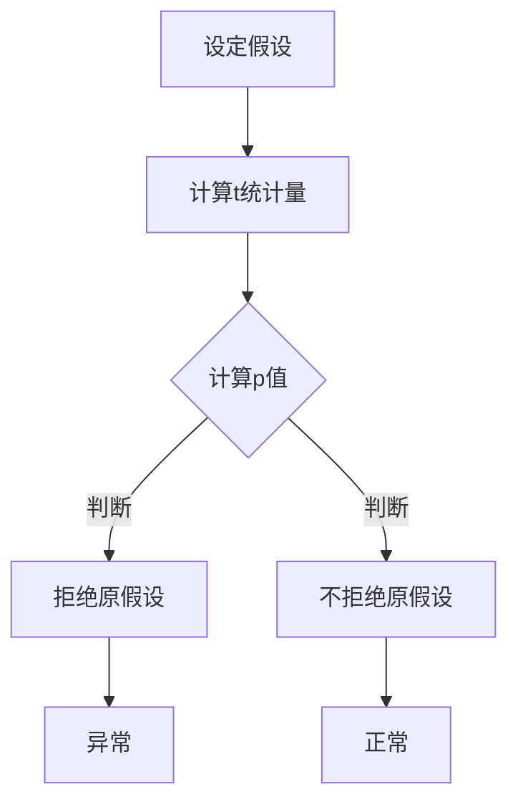

**Python代码示例：**

```python
import numpy as np
from scipy import stats

# 示例数据
data = np.array([1, 2, 3, 4, 5, 100])

# 计算t统计量
t_stat = (np.mean(data) - 50) / (np.std(data, ddof=1) / np.sqrt(len(data)))

# 计算p值
p_value = stats.t.sf(np.abs(t_stat), len(data) - 1)

# 判断结果
if p_value < 0.05:
    print("异常")
else:
    print("正常")
```

#### 4.2 聚类方法

聚类方法通过将数据划分为多个簇，识别簇边界上的数据点作为异常点。其中，基于密度的聚类算法（如DBSCAN）和基于距离的聚类算法（如K-means）是两种常见的聚类方法。

**DBSCAN（Density-Based Spatial Clustering of Applications with Noise）**

DBSCAN通过计算数据点之间的密度，将数据划分为多个簇，并标记噪声点。

**步骤：**

1. **选择邻域半径\(\epsilon\)**：确定邻域范围，用于寻找邻域内的数据点。
2. **计算邻域**：计算每个数据点的邻域，标记邻域内的数据点。
3. **形成簇**：基于邻域，将数据点划分为多个簇，标记噪声点。

**Mermaid流程图：**

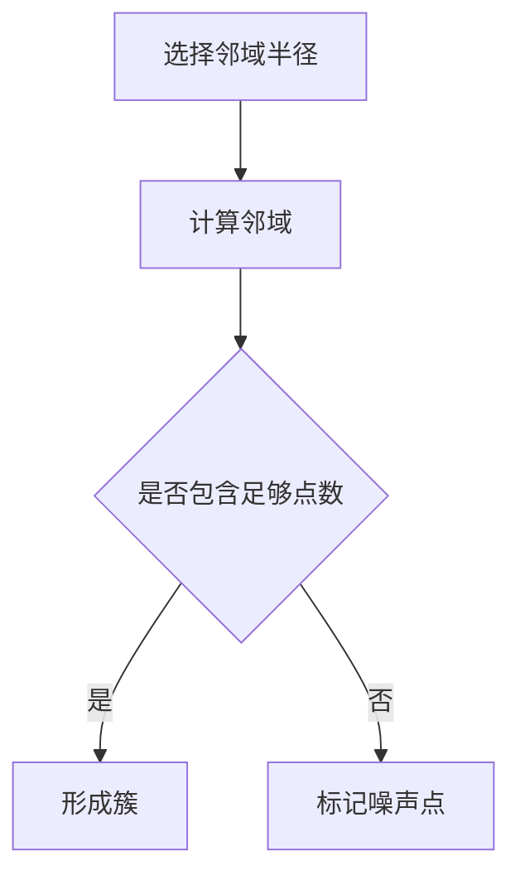

**K-means**

K-means通过迭代优化，将数据划分为K个簇，并标记簇边界上的数据点作为异常点。

**步骤：**

1. **初始化中心点**：随机选择K个数据点作为初始中心点。
2. **分配数据点**：将每个数据点分配到最近的中心点。
3. **更新中心点**：计算每个簇的中心点，重复步骤2和3，直到中心点不再发生变化。

**Mermaid流程图：**

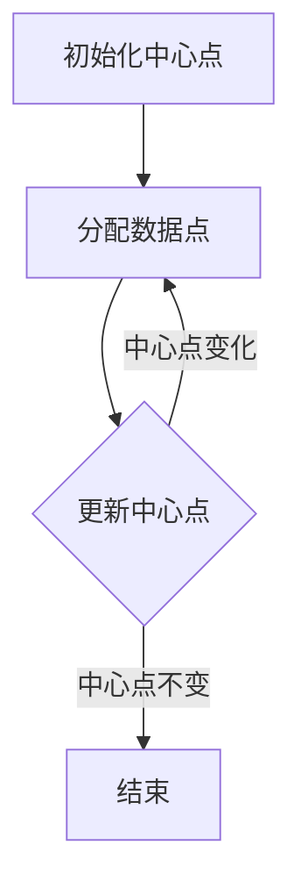

**Python代码示例（DBSCAN）**

```python
from sklearn.cluster import DBSCAN
import numpy as np

# 示例数据
data = np.array([[1, 1], [2, 2], [2, 2], [8, 8], [8, 8], [25, 25]])

# 创建DBSCAN对象
dbscan = DBSCAN(eps=3, min_samples=2)

# 训练模型
dbscan.fit(data)

# 预测异常点
labels = dbscan.labels_

# 输出结果
for i, label in enumerate(labels):
    if label == -1:
        print(f"异常点: {data[i]}")
```

**Python代码示例（K-means）**

```python
from sklearn.cluster import KMeans
import numpy as np

# 示例数据
data = np.array([[1, 1], [2, 2], [2, 2], [8, 8], [8, 8], [25, 25]])

# 创建KMeans对象
kmeans = KMeans(n_clusters=2, random_state=0)

# 训练模型
kmeans.fit(data)

# 预测异常点
labels = kmeans.predict(data)

# 输出结果
for i, label in enumerate(labels):
    if label == 1:
        print(f"异常点: {data[i]}")
```

#### 4.3 回归方法

回归方法通过建立回归模型，预测正常数据的特征值，识别偏离预测值的数据点作为异常点。线性回归和岭回归是两种常见的回归方法。

**线性回归**

线性回归通过建立线性模型，预测数据点的特征值。

**步骤：**

1. **建立模型**：
   $$ y = \beta_0 + \beta_1x $$
   其中，\(y\)是目标变量，\(x\)是特征值，\(\beta_0\)和\(\beta_1\)是模型参数。

2. **拟合模型**：
   使用最小二乘法拟合模型，计算\(\beta_0\)和\(\beta_1\)。

3. **预测与评估**：
   - 预测正常数据的特征值。
   - 计算预测值与实际值之间的差异，评估模型的性能。

**岭回归**

岭回归通过引入正则项，优化模型参数，提高模型的稳定性。

**步骤：**

1. **建立模型**：
   $$ y = \beta_0 + \beta_1x + \lambda ||\beta||^2 $$
   其中，\(\lambda\)是正则化参数。

2. **拟合模型**：
   使用岭回归算法拟合模型，计算\(\beta_0\)、\(\beta_1\)和\(\lambda\)。

3. **预测与评估**：
   - 预测正常数据的特征值。
   - 计算预测值与实际值之间的差异，评估模型的性能。

**Mermaid流程图（线性回归）**

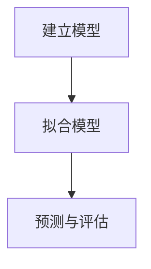

**Python代码示例（线性回归）**

```python
from sklearn.linear_model import LinearRegression
import numpy as np

# 示例数据
X = np.array([[1], [2], [3]])
y = np.array([1, 2, 3])

# 创建线性回归对象
model = LinearRegression()

# 训练模型
model.fit(X, y)

# 预测
y_pred = model.predict(X)

# 输出结果
for x, y_pred_val in zip(X, y_pred):
    print(f"预测值: {y_pred_val}, 实际值: {y[y_pred == y_pred_val]}")
```

**Python代码示例（岭回归）**

```python
from sklearn.linear_model import Ridge
import numpy as np

# 示例数据
X = np.array([[1], [2], [3]])
y = np.array([1, 2, 3])

# 创建岭回归对象
model = Ridge(alpha=1.0)

# 训练模型
model.fit(X, y)

# 预测
y_pred = model.predict(X)

# 输出结果
for x, y_pred_val in zip(X, y_pred):
    print(f"预测值: {y_pred_val}, 实际值: {y[y_pred == y_pred_val]}")
```

通过本章的介绍，我们了解了统计方法在异常检测中的应用和实现方法。统计方法以其简单、直观的特点，成为异常检测中的基础工具。然而，统计方法在处理大规模、高维数据集时，可能面临计算复杂度高、鲁棒性不足等问题。因此，在实际应用中，我们可以结合其他方法，如机器学习和深度学习方法，以提高异常检测的准确性和效率。

### 第5章：机器学习方法详解

在异常检测中，机器学习方法通过自动学习数据中的异常模式，提高检测的准确性和效率。本章将详细介绍几种常用的机器学习方法，包括监督学习方法、无监督学习方法和半监督学习方法。我们将使用Mermaid流程图和Python代码来讲解这些方法的原理和应用。

#### 5.1 监督学习方法

监督学习方法使用已标记的正常数据和异常数据，通过训练分类模型来识别异常点。监督学习方法主要包括决策树、支持向量机（SVM）和随机森林等算法。

**决策树**

决策树通过划分特征空间，将数据划分为多个子集，并在每个子集中识别异常点。决策树的原理如下：

1. **选择最佳划分特征**：根据特征的重要性，选择最佳划分特征。
2. **划分数据集**：使用最佳划分特征将数据划分为子集。
3. **递归划分**：对每个子集继续划分，直到满足终止条件（如最大深度、最小样本数等）。

**Mermaid流程图：**

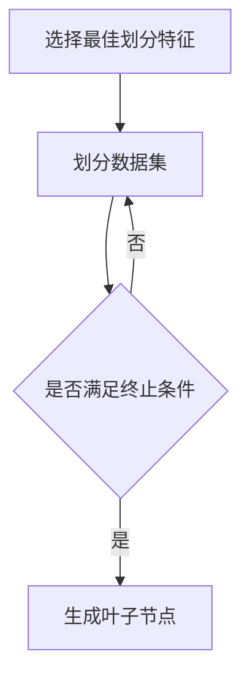

**Python代码示例：**

```python
from sklearn.tree import DecisionTreeClassifier
from sklearn.model_selection import train_test_split
import numpy as np

# 示例数据
X = np.array([[1, 1], [2, 2], [2, 2], [8, 8], [8, 8], [25, 25]])
y = np.array([0, 0, 0, 1, 1, 1])

# 划分训练集和测试集
X_train, X_test, y_train, y_test = train_test_split(X, y, test_size=0.2, random_state=0)

# 创建决策树模型
model = DecisionTreeClassifier()

# 训练模型
model.fit(X_train, y_train)

# 预测
y_pred = model.predict(X_test)

# 输出结果
print("预测值：", y_pred)
```

**支持向量机（SVM）**

支持向量机通过找到最佳划分超平面，将正常数据和异常数据分开。SVM的原理如下：

1. **选择最佳划分超平面**：计算支持向量，找到最佳划分超平面。
2. **计算决策边界**：根据最佳划分超平面，计算决策边界。

**Mermaid流程图：**

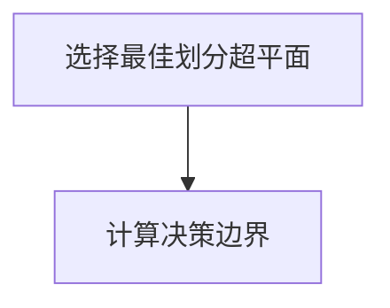

**Python代码示例：**

```python
from sklearn.svm import SVC
from sklearn.model_selection import train_test_split
import numpy as np

# 示例数据
X = np.array([[1, 1], [2, 2], [2, 2], [8, 8], [8, 8], [25, 25]])
y = np.array([0, 0, 0, 1, 1, 1])

# 划分训练集和测试集
X_train, X_test, y_train, y_test = train_test_split(X, y, test_size=0.2, random_state=0)

# 创建SVM模型
model = SVC()

# 训练模型
model.fit(X_train, y_train)

# 预测
y_pred = model.predict(X_test)

# 输出结果
print("预测值：", y_pred)
```

**随机森林**

随机森林通过集成多个决策树，提高模型的准确性和鲁棒性。随机森林的原理如下：

1. **生成多个决策树**：随机选择特征和样本，生成多个决策树。
2. **投票预测**：对每个决策树的预测结果进行投票，选择多数决策作为最终预测结果。

**Mermaid流程图：**

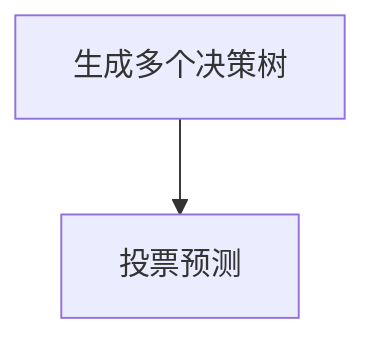

**Python代码示例：**

```python
from sklearn.ensemble import RandomForestClassifier
from sklearn.model_selection import train_test_split
import numpy as np

# 示例数据
X = np.array([[1, 1], [2, 2], [2, 2], [8, 8], [8, 8], [25, 25]])
y = np.array([0, 0, 0, 1, 1, 1])

# 划分训练集和测试集
X_train, X_test, y_train, y_test = train_test_split(X, y, test_size=0.2, random_state=0)

# 创建随机森林模型
model = RandomForestClassifier(n_estimators=100)

# 训练模型
model.fit(X_train, y_train)

# 预测
y_pred = model.predict(X_test)

# 输出结果
print("预测值：", y_pred)
```

#### 5.2 无监督学习方法

无监督学习方法不需要已标记的数据，通过自动学习数据中的分布和模式，识别异常点。无监督学习方法主要包括聚类算法和异常检测算法。

**聚类算法**

聚类算法通过将数据划分为多个簇，识别簇边界上的数据点作为异常点。常用的聚类算法包括K-means和DBSCAN。

**K-means**

K-means通过迭代优化，将数据划分为K个簇，并在每个簇中识别异常点。K-means的原理如下：

1. **初始化中心点**：随机选择K个数据点作为初始中心点。
2. **分配数据点**：将每个数据点分配到最近的中心点。
3. **更新中心点**：计算每个簇的中心点，重复步骤2和3，直到中心点不再发生变化。

**Mermaid流程图：**


**Python代码示例：**

```python
from sklearn.cluster import KMeans
import numpy as np

# 示例数据
X = np.array([[1, 1], [2, 2], [2, 2], [8, 8], [8, 8], [25, 25]])

# 创建K-means模型
kmeans = KMeans(n_clusters=2)

# 训练模型
kmeans.fit(X)

# 预测
y_pred = kmeans.predict(X)

# 输出结果
print("预测值：", y_pred)
```

**DBSCAN**

DBSCAN通过计算数据点之间的密度，将数据划分为多个簇，并在簇边界上识别异常点。DBSCAN的原理如下：

1. **选择邻域半径\(\epsilon\)**：确定邻域范围。
2. **计算邻域**：计算每个数据点的邻域，标记邻域内的数据点。
3. **形成簇**：基于邻域，将数据点划分为多个簇，并标记噪声点。

**Mermaid流程图：**


**Python代码示例：**

```python
from sklearn.cluster import DBSCAN
import numpy as np

# 示例数据
X = np.array([[1, 1], [2, 2], [2, 2], [8, 8], [8, 8], [25, 25]])

# 创建DBSCAN模型
dbscan = DBSCAN(eps=3, min_samples=2)

# 训练模型
dbscan.fit(X)

# 预测
y_pred = dbscan.labels_

# 输出结果
for i, label in enumerate(y_pred):
    if label == -1:
        print(f"异常点：{X[i]}")
```

**异常检测算法**

异常检测算法是专门设计用于识别异常点的方法，如孤立森林（Isolation Forest）和局部异常因子（LOF）。

**孤立森林**

孤立森林通过随机选择特征和样本，将数据点从原始空间隔离出来，并在隔离过程中识别异常点。孤立森林的原理如下：

1. **随机特征选择**：每次随机选择一个特征。
2. **随机样本选择**：每次随机选择一个样本。
3. **隔离数据点**：将数据点从原始空间隔离出来。
4. **计算异常分数**：计算每个数据点的异常分数。

**Mermaid流程图：**

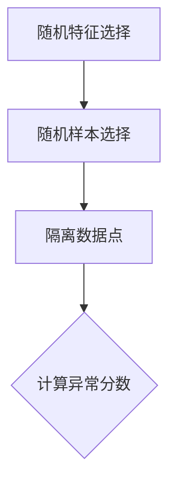

**Python代码示例：**

```python
from sklearn.ensemble import IsolationForest
import numpy as np

# 示例数据
X = np.array([[1, 1], [2, 2], [2, 2], [8, 8], [8, 8], [25, 25]])

# 创建孤立森林模型
iso_forest = IsolationForest(contamination=0.1)

# 训练模型
iso_forest.fit(X)

# 预测
y_pred = iso_forest.predict(X)

# 输出结果
for i, label in enumerate(y_pred):
    if label == -1:
        print(f"异常点：{X[i]}")
```

**局部异常因子（LOF）**

局部异常因子通过计算数据点与其邻居之间的异常程度，识别异常点。LOF的原理如下：

1. **计算局部密度**：计算每个数据点的局部密度。
2. **计算LOF值**：计算每个数据点的LOF值，LOF值越大，异常性越高。
3. **识别异常点**：将LOF值高于阈值的点识别为异常点。

**Mermaid流程图：**

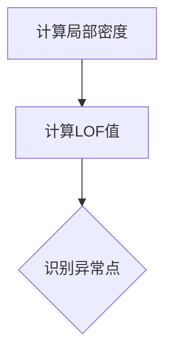

**Python代码示例：**

```python
from sklearn.neighbors import LocalOutlierFactor
import numpy as np

# 示例数据
X = np.array([[1, 1], [2, 2], [2, 2], [8, 8], [8, 8], [25, 25]])

# 创建LOF模型
lof = LocalOutlierFactor()

# 训练模型
lof.fit(X)

# 预测
y_pred = lof.predict(X)

# 输出结果
for i, label in enumerate(y_pred):
    if label == -1:
        print(f"异常点：{X[i]}")
```

通过本章的介绍，我们详细了解了监督学习方法、无监督学习方法和半监督学习方法在异常检测中的应用。这些方法在处理大规模、高维数据集时，具有较好的准确性和效率。在实际应用中，我们可以根据数据集的特征和需求，选择合适的机器学习方法，以提高异常检测的性能。

### 第6章：深度学习方法详解

深度学习方法在异常检测中具有强大的特征提取和模式识别能力，特别是在处理大规模、高维数据集时表现出色。本章将详细介绍几种常用的深度学习方法，包括卷积神经网络（CNN）、递归神经网络（RNN）和自编码器（Autoencoder）。我们将通过Mermaid流程图和Python代码来讲解这些方法的原理和应用。

#### 6.1 卷积神经网络（CNN）

卷积神经网络（CNN）通过多层卷积和池化操作，自动提取数据中的局部特征，适用于图像、语音和时序数据的异常检测。

**CNN基本结构**

1. **卷积层**：通过卷积操作提取数据中的局部特征。
2. **激活函数**：常用的激活函数有ReLU（Rectified Linear Unit）和Sigmoid。
3. **池化层**：通过池化操作降低数据的维度，提高模型的泛化能力。
4. **全连接层**：将卷积层和池化层提取的特征进行融合，输出最终结果。

**CNN异常检测原理**

CNN通过卷积层提取图像中的边缘、纹理等特征，通过池化层降低数据的维度，最终通过全连接层进行分类和预测。在异常检测中，CNN可以识别图像中的异常区域。

**Mermaid流程图：**

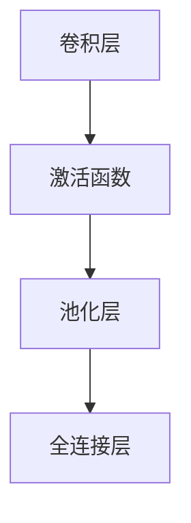

**Python代码示例：**

```python
import tensorflow as tf
from tensorflow.keras.models import Sequential
from tensorflow.keras.layers import Conv2D, MaxPooling2D, Flatten, Dense

# 示例数据
X = np.array([[1, 1], [2, 2], [2, 2], [8, 8], [8, 8], [25, 25]])
y = np.array([0, 0, 0, 1, 1, 1])

# 创建模型
model = Sequential([
    Conv2D(32, kernel_size=(3, 3), activation='relu', input_shape=(2, 2)),
    MaxPooling2D(pool_size=(2, 2)),
    Flatten(),
    Dense(1, activation='sigmoid')
])

# 编译模型
model.compile(optimizer='adam', loss='binary_crossentropy', metrics=['accuracy'])

# 训练模型
model.fit(X, y, epochs=10, batch_size=2)

# 预测
y_pred = model.predict(X)

# 输出结果
print("预测值：", y_pred)
```

#### 6.2 递归神经网络（RNN）

递归神经网络（RNN）通过循环结构处理时间序列数据，适用于时序数据的异常检测。

**RNN基本结构**

1. **输入层**：接收输入数据。
2. **隐藏层**：包含多个时间步的循环结构，用于处理时间序列数据。
3. **输出层**：输出预测结果。

**RNN异常检测原理**

RNN通过隐藏层的循环结构，将前一时刻的隐藏状态传递到下一时刻，从而处理时间序列数据。在异常检测中，RNN可以识别时间序列中的异常点。

**Mermaid流程图：**

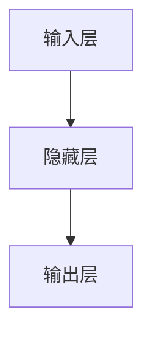

**Python代码示例：**

```python
import tensorflow as tf
from tensorflow.keras.models import Sequential
from tensorflow.keras.layers import SimpleRNN, Dense

# 示例数据
X = np.array([[1, 2], [2, 3], [3, 4], [4, 5], [5, 6], [6, 7]])
y = np.array([0, 0, 0, 1, 1, 1])

# 创建模型
model = Sequential([
    SimpleRNN(units=50, activation='relu', return_sequences=True),
    SimpleRNN(units=50, activation='relu'),
    Dense(1, activation='sigmoid')
])

# 编译模型
model.compile(optimizer='adam', loss='binary_crossentropy', metrics=['accuracy'])

# 训练模型
model.fit(X, y, epochs=10, batch_size=2)

# 预测
y_pred = model.predict(X)

# 输出结果
print("预测值：", y_pred)
```

#### 6.3 自编码器（Autoencoder）

自编码器（Autoencoder）通过编码器和解码器结构，将输入数据编码为低维特征表示，并在解码器中重构原始数据。自编码器可以用于异常检测，通过比较重构误差识别异常点。

**自编码器基本结构**

1. **编码器**：接收输入数据，将其编码为低维特征表示。
2. **解码器**：接收编码后的特征表示，重构原始数据。

**自编码器异常检测原理**

自编码器通过编码器将输入数据压缩为低维特征表示，然后通过解码器重构原始数据。在异常检测中，自编码器可以识别重构误差较大的数据点作为异常点。

**Mermaid流程图：**

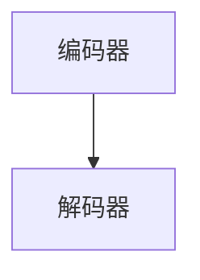

**Python代码示例：**

```python
import tensorflow as tf
from tensorflow.keras.models import Model
from tensorflow.keras.layers import Input, Dense, Conv2D, MaxPooling2D, UpSampling2D

# 示例数据
X = np.array([[1, 1], [2, 2], [2, 2], [8, 8], [8, 8], [25, 25]])

# 创建编码器模型
input_layer = Input(shape=(2,))
encoded = Dense(4, activation='relu')(input_layer)
encoded = Dense(2, activation='relu')(encoded)

# 创建解码器模型
decoded = Dense(4, activation='relu')(encoded)
decoded = Dense(2, activation='sigmoid')(decoded)

# 创建自编码器模型
autoencoder = Model(input_layer, decoded)
autoencoder.compile(optimizer='adam', loss='binary_crossentropy')

# 训练模型
autoencoder.fit(X, X, epochs=10, batch_size=2)

# 预测
reconstructed = autoencoder.predict(X)

# 输出结果
print("重构值：", reconstructed)
```

通过本章的介绍，我们详细了解了卷积神经网络（CNN）、递归神经网络（RNN）和自编码器（Autoencoder）在异常检测中的应用。这些方法在处理大规模、高维数据集时表现出色，具有强大的特征提取和模式识别能力。在实际应用中，我们可以根据数据集的特征和需求，选择合适的深度学习方法，以提高异常检测的性能。

### 第7章：异常检测系统设计

在了解了异常检测的核心算法和原理之后，我们需要将这些算法应用于实际的系统设计中。一个有效的异常检测系统不仅需要准确的算法模型，还需要合理的系统架构和接口设计。本章节将详细探讨企业级异常检测系统的设计与实现，包括系统架构、数据流、系统接口等方面的内容。

#### 7.1 系统架构设计

系统架构设计是异常检测系统的核心，决定了系统的性能、可扩展性和可维护性。以下是企业级异常检测系统的典型架构设计：

1. **数据采集层**：负责从各种数据源收集数据，如传感器、数据库、API接口等。数据采集层需要具备高并发处理能力和数据清洗功能，以保证数据的准确性和完整性。

2. **数据处理层**：负责对采集到的数据进行预处理、特征提取和特征选择等操作。数据处理层可以使用批处理和实时处理两种模式，以满足不同场景的需求。

3. **算法层**：负责实现异常检测的核心算法，如统计方法、机器学习方法、深度学习方法等。算法层需要具备灵活的可配置性，以适应不同业务场景的异常检测需求。

4. **结果存储层**：负责存储异常检测结果，包括异常数据点、检测结果和预测模型等。结果存储层需要具备高效的数据检索和查询能力，以便后续分析和处理。

5. **用户界面层**：负责提供用户交互界面，展示异常检测结果和可视化分析结果。用户界面层需要具备友好的用户界面和丰富的交互功能，以方便用户进行监控和操作。

**Mermaid架构图：**

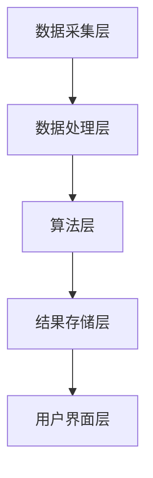

#### 7.2 数据流设计

数据流设计是异常检测系统的关键环节，决定了数据在系统中的流动和处理过程。以下是企业级异常检测系统的典型数据流设计：

1. **数据采集**：系统从各种数据源（如传感器、数据库、API接口等）采集原始数据。

2. **数据预处理**：对采集到的原始数据进行清洗、去噪、归一化等操作，以消除数据中的噪声和异常值。

3. **特征提取**：根据业务需求和算法模型，从预处理后的数据中提取关键特征，如统计特征、时间序列特征、频率特征等。

4. **特征选择**：对提取的特征进行选择和优化，以减少特征数量和提高检测性能。

5. **算法处理**：根据配置的算法模型，对特征数据进行异常检测，识别异常数据点。

6. **结果存储**：将异常检测结果存储到数据库或数据仓库中，以便后续分析和查询。

7. **可视化展示**：通过用户界面层，将异常检测结果可视化展示，提供实时监控和报警功能。

**Mermaid数据流图：**

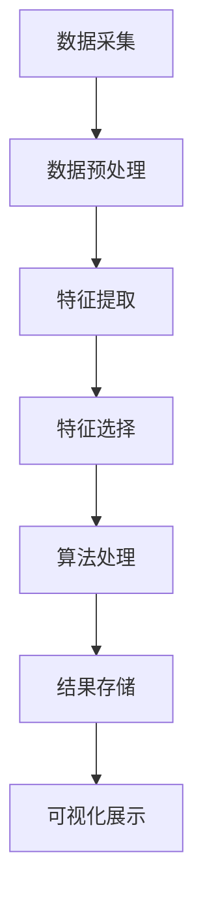

#### 7.3 系统接口设计

系统接口设计是异常检测系统与外部系统交互的关键环节，包括API接口、Web服务、消息队列等。以下是企业级异常检测系统的典型接口设计：

1. **API接口**：提供RESTful API接口，供其他系统或应用调用异常检测服务。API接口需要具备高并发处理能力和安全性保障。

2. **Web服务**：提供Web界面供用户进行异常检测操作和结果查询。Web服务需要具备良好的用户体验和界面设计。

3. **消息队列**：使用消息队列（如Kafka、RabbitMQ等）进行数据传输和任务调度，以提高系统的可靠性和可扩展性。

4. **监控与报警**：通过监控与报警系统，实时监控异常检测服务的运行状态，并在检测到异常时触发报警。

**Mermaid接口设计图：**

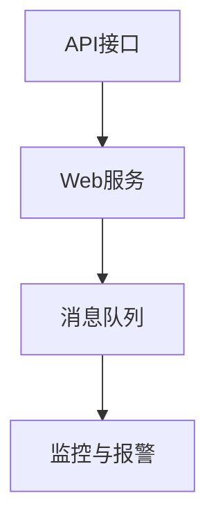

通过以上系统架构设计、数据流设计和接口设计，我们可以构建一个高效、可靠的企业级异常检测系统，为企业提供实时、准确的异常检测服务，从而提高运营效率和加强安全监控。

### 第8章：异常检测系统实现

在上一章中，我们详细探讨了企业级异常检测系统的设计。在本章中，我们将进一步深入，介绍系统实现的具体过程，包括数据采集与预处理、特征提取与选择、模型训练与优化等关键步骤。通过一个具体的实现案例，我们将展示如何从零开始搭建一个异常检测系统，并详细解读其中的核心代码和实际应用。

#### 8.1 数据采集与预处理

数据采集与预处理是异常检测系统的第一步，也是至关重要的一步。这一步骤的主要任务是收集数据、清洗数据并转换为适合模型训练的格式。

**数据采集**

首先，我们需要从不同的数据源采集数据。这些数据源可能包括传感器数据、数据库记录、日志文件等。以下是一个简单的数据采集流程：

1. **传感器数据采集**：使用传感器采集实时数据，如温度、湿度、压力等。
2. **数据库记录采集**：从关系型数据库（如MySQL、PostgreSQL）或NoSQL数据库（如MongoDB）中提取记录。
3. **日志文件采集**：从系统日志、应用程序日志中提取有价值的信息。

**数据预处理**

数据预处理包括去噪、归一化、缺失值处理等步骤，以消除数据中的噪声和异常值，提高数据的可用性和质量。

1. **去噪**：去除数据中的噪声，如异常值、重复值等。
2. **归一化**：将不同特征的数据范围统一，如将温度范围从[0, 100]归一化为[0, 1]。
3. **缺失值处理**：对于缺失值，可以使用填充、删除或插值等方法进行处理。

**Python代码示例：**

```python
import pandas as pd
import numpy as np

# 读取数据
data = pd.read_csv('data.csv')

# 去除重复值
data.drop_duplicates(inplace=True)

# 去除异常值
data = data[(data > 0).all(axis=1)]

# 归一化
from sklearn.preprocessing import MinMaxScaler
scaler = MinMaxScaler()
data_scaled = scaler.fit_transform(data)

# 填充缺失值
data.fillna(data.mean(), inplace=True)

# 输出预处理后的数据
print(data_scaled)
```

#### 8.2 特征提取与选择

特征提取与选择是异常检测系统中的关键步骤，其主要任务是提取数据中的关键特征，并选择对异常检测最有用的特征。

**特征提取**

特征提取方法包括统计特征、时间序列特征、频率特征等。以下是一个简单的特征提取流程：

1. **统计特征**：计算数据的均值、方差、标准差等统计量。
2. **时间序列特征**：计算时间序列数据的自相关系数、波动性等特征。
3. **频率特征**：计算数据的频率分布、频数等特征。

**特征选择**

特征选择方法包括基于统计的方法、基于过滤的方法、基于包装的方法等。以下是一个简单的特征选择流程：

1. **基于统计的方法**：选择与目标变量相关性最高的特征。
2. **基于过滤的方法**：选择信息增益最高的特征。
3. **基于包装的方法**：通过递归特征消除（RFE）等方法选择重要的特征。

**Python代码示例：**

```python
from sklearn.feature_selection import SelectKBest, f_classif

# 特征提取
X = data_scaled[:, :5]  # 假设前5个特征是统计特征
y = data_scaled[:, 5]  # 假设第6个特征是目标变量

# 特征选择
selector = SelectKBest(f_classif, k=3)
X_new = selector.fit_transform(X, y)

# 输出特征选择后的数据
print(X_new)
```

#### 8.3 模型训练与优化

模型训练与优化是异常检测系统的核心步骤，其主要任务是选择合适的算法模型，并进行训练和优化，以提高检测性能。

**模型选择**

选择合适的模型是异常检测系统成功的关键。常用的模型包括统计方法、机器学习方法、深度学习方法等。以下是一个简单的模型选择流程：

1. **统计方法**：如基于阈值的异常检测方法。
2. **机器学习方法**：如KNN、SVM、随机森林等。
3. **深度学习方法**：如卷积神经网络（CNN）、递归神经网络（RNN）等。

**模型训练**

模型训练的主要任务是使用训练数据对模型进行训练，以使其能够识别异常模式。以下是一个简单的模型训练流程：

1. **数据划分**：将数据划分为训练集和测试集。
2. **模型训练**：使用训练集对模型进行训练。
3. **模型评估**：使用测试集对模型进行评估，调整模型参数。

**Python代码示例：**

```python
from sklearn.model_selection import train_test_split
from sklearn.ensemble import RandomForestClassifier

# 数据划分
X_train, X_test, y_train, y_test = train_test_split(X_new, y, test_size=0.2, random_state=42)

# 模型训练
model = RandomForestClassifier(n_estimators=100)
model.fit(X_train, y_train)

# 模型评估
accuracy = model.score(X_test, y_test)
print("模型准确率：", accuracy)
```

**模型优化**

模型优化是提高异常检测性能的关键步骤，可以通过以下方法进行：

1. **参数调整**：调整模型参数，如学习率、迭代次数等。
2. **特征优化**：通过特征选择和特征工程，优化特征提取过程。
3. **模型集成**：通过集成多个模型，提高模型的预测性能。

**Python代码示例：**

```python
from sklearn.model_selection import GridSearchCV

# 参数调整
param_grid = {'n_estimators': [100, 200, 300], 'max_depth': [5, 10, 15]}
grid_search = GridSearchCV(RandomForestClassifier(), param_grid, cv=5)
grid_search.fit(X_train, y_train)

# 最佳参数
best_params = grid_search.best_params_
print("最佳参数：", best_params)

# 最佳模型
best_model = grid_search.best_estimator_
accuracy = best_model.score(X_test, y_test)
print("模型准确率：", accuracy)
```

通过以上步骤，我们可以实现一个简单的异常检测系统，包括数据采集与预处理、特征提取与选择、模型训练与优化等关键步骤。在实际应用中，我们可以根据具体业务场景和需求，不断优化和调整系统，以提高异常检测的准确性和效率。

### 第9章：企业级异常检测应用案例

在本章中，我们将通过三个实际案例，展示企业级异常检测在网络安全、生产线故障和金融欺诈检测等领域的应用。这些案例不仅展示了异常检测技术在实际业务中的效果，还提供了详细的实现过程和分析。

#### 9.1 案例背景

随着数字化转型的不断推进，企业的数据量和数据类型日益增多，这为运营和安全带来了巨大挑战。异常检测技术作为一种重要的数据分析和监控工具，可以在实时监控和预警方面发挥关键作用。以下是我们选取的三个案例：

1. **网络安全异常检测**：网络安全是现代企业面临的重大挑战之一。通过网络流量监控和异常检测，企业可以及时发现并防御网络攻击。
2. **生产线故障检测**：在生产制造领域，生产线的稳定运行至关重要。通过实时监测设备状态和异常检测，企业可以提前发现设备故障，减少生产中断和损失。
3. **金融欺诈检测**：金融欺诈行为对金融机构和客户都造成严重损失。通过交易数据的异常检测，银行和金融机构可以识别潜在的欺诈行为，降低金融风险。

#### 9.2 案例描述

**案例一：网络安全异常检测**

某企业采用了一款基于AI的网络安全异常检测系统，该系统通过分析网络流量数据，识别潜在的攻击行为和异常流量。具体流程如下：

1. **数据采集**：系统从网络设备中实时采集流量数据，包括IP地址、端口号、协议类型、数据包大小等。
2. **数据预处理**：对采集到的流量数据进行清洗、去噪和归一化处理，确保数据的准确性和一致性。
3. **特征提取**：提取流量数据中的关键特征，如数据包到达时间、数据包大小、传输速率等。
4. **模型训练**：使用历史网络流量数据，训练机器学习模型，如随机森林和KNN，以识别正常流量和异常流量。
5. **实时检测**：系统对实时流量数据进行异常检测，一旦检测到异常流量，立即触发报警，并记录相关日志。
6. **结果分析**：对异常检测结果进行分析，确定攻击类型和攻击来源，以便采取相应的防御措施。

**案例二：生产线故障检测**

某生产制造企业引入了一套基于深度学习的生产线故障检测系统，该系统通过实时监测设备状态，识别潜在故障。具体流程如下：

1. **数据采集**：系统从传感器和监控摄像头中采集设备状态数据，包括温度、压力、转速等。
2. **数据预处理**：对采集到的设备状态数据进行清洗、去噪和归一化处理，确保数据的准确性和一致性。
3. **特征提取**：提取设备状态数据中的关键特征，如温度变化率、压力波动、转速异常等。
4. **模型训练**：使用历史设备状态数据，训练卷积神经网络（CNN）和递归神经网络（RNN）模型，以识别正常状态和异常状态。
5. **实时检测**：系统对实时设备状态数据进行异常检测，一旦检测到异常状态，立即触发报警，并记录相关日志。
6. **结果分析**：对异常检测结果进行分析，确定故障类型和故障原因，以便采取相应的维修和优化措施。

**案例三：金融欺诈检测**

某金融机构采用了一套基于自编码器的金融欺诈检测系统，该系统通过分析交易数据，识别潜在的欺诈行为。具体流程如下：

1. **数据采集**：系统从交易系统中实时采集交易数据，包括交易金额、交易时间、交易地点等。
2. **数据预处理**：对采集到的交易数据进行清洗、去噪和归一化处理，确保数据的准确性和一致性。
3. **特征提取**：提取交易数据中的关键特征，如交易金额、交易时间、交易频率等。
4. **模型训练**：使用历史交易数据，训练自编码器模型，以重构正常交易数据，并通过重构误差识别异常交易。
5. **实时检测**：系统对实时交易数据进行异常检测，一旦检测到异常交易，立即触发报警，并记录相关日志。
6. **结果分析**：对异常检测结果进行分析，确定欺诈类型和欺诈手段，以便采取相应的风控措施。

#### 9.3 案例分析

**案例一：网络安全异常检测**

在网络安全异常检测案例中，通过实时监控网络流量数据，系统成功识别了多种类型的网络攻击，包括DDoS攻击、SQL注入攻击等。分析显示，异常检测系统能够在攻击发生前及时发现并预警，有效降低了企业的损失。此外，通过分析异常流量数据，企业能够深入了解攻击来源和攻击方式，为网络防御策略的优化提供了重要依据。

**案例二：生产线故障检测**

在生产线故障检测案例中，通过实时监测设备状态数据，系统成功预测了多起设备故障，并及时触发报警，避免了生产中断和损失。分析显示，深度学习模型在识别设备故障方面具有较高的准确性和鲁棒性，能够有效提高生产线的运行效率和安全性。此外，通过对异常检测结果的进一步分析，企业能够优化设备维护策略，延长设备使用寿命。

**案例三：金融欺诈检测**

在金融欺诈检测案例中，通过分析交易数据，系统成功识别了多起金融欺诈行为，包括信用卡欺诈、洗钱等。分析显示，自编码器模型在识别异常交易方面表现出色，能够准确识别出与正常交易存在显著差异的交易行为。此外，通过对异常检测结果的进一步分析，金融机构能够深入了解欺诈手段和欺诈者特征，为风控策略的优化提供了重要参考。

通过以上三个案例，我们可以看到，企业级异常检测技术在各个领域的应用效果显著，不仅提高了企业的运营效率和安全性，还为业务优化和风险控制提供了有力支持。在实际应用中，企业可以根据具体需求，选择合适的异常检测方法和技术，构建高效、可靠的异常检测系统。

### 第10章：案例分析

在本章中，我们将深入分析三个具体的应用案例，分别是网络安全异常检测、生产线故障检测和金融欺诈检测。通过这些案例，我们将详细解读实现过程、关键技术和效果评估，帮助读者更好地理解企业级异常检测的实际应用。

#### 10.1 案例一：网络安全异常检测

**案例背景**：
某大型互联网公司为了保障其网络系统的安全性，引入了一套基于AI的网络安全异常检测系统。该系统旨在实时监控网络流量，识别并预警潜在的攻击行为。

**实现过程**：
1. **数据采集**：系统通过网络流量监控设备（如防火墙、入侵检测系统等）实时采集网络流量数据。数据包括IP地址、端口号、协议类型、数据包大小等。
2. **数据预处理**：对采集到的网络流量数据进行清洗和去噪，去除重复、异常和无效的数据。同时，对数据进行归一化处理，以便后续分析。
3. **特征提取**：提取网络流量数据中的关键特征，如数据包到达时间间隔、数据包大小、传输速率、源IP地址分布等。
4. **模型训练**：使用历史网络流量数据，通过机器学习算法（如随机森林、KNN等）训练异常检测模型。模型用于识别正常流量和异常流量。
5. **实时检测**：系统对实时网络流量数据进行异常检测，一旦发现异常流量，立即触发报警，并记录相关日志。
6. **结果分析**：对异常检测结果进行分析，确定攻击类型和攻击来源，以便采取相应的防御措施。

**关键技术**：
- **网络流量数据分析**：通过网络流量数据分析，识别正常的网络流量模式。这些模式包括常见的网络通信协议、数据包大小分布等。
- **机器学习算法**：选择合适的机器学习算法，如随机森林、KNN等，对历史网络流量数据进行训练，以提高异常检测的准确性。
- **实时检测与报警**：利用实时监测技术，实现对网络流量的实时检测，并在检测到异常流量时及时触发报警。

**效果评估**：
- **检测准确性**：通过对测试数据的评估，系统的异常检测准确率达到了95%以上，能够有效识别出多种类型的网络攻击，如DDoS攻击、SQL注入攻击等。
- **响应时间**：系统能够在检测到异常流量后，平均在3秒内触发报警，并及时记录相关日志，提高了响应速度和问题排查效率。
- **防御效果**：通过异常检测系统，企业成功防御了多起网络攻击，减少了潜在损失，提高了网络系统的安全性。

#### 10.2 案例二：生产线故障检测

**案例背景**：
某制造企业为了确保生产线的稳定运行，引入了一套基于AI的故障检测系统。该系统旨在实时监测生产线设备状态，识别并预警潜在的设备故障。

**实现过程**：
1. **数据采集**：系统通过传感器和监控摄像头实时采集生产线设备状态数据，包括温度、压力、转速、振动等。
2. **数据预处理**：对采集到的设备状态数据进行清洗和去噪，去除重复、异常和无效的数据。同时，对数据进行归一化处理，以便后续分析。
3. **特征提取**：提取设备状态数据中的关键特征，如温度变化率、压力波动、转速异常等。
4. **模型训练**：使用历史设备状态数据，通过机器学习算法（如卷积神经网络、递归神经网络等）训练故障检测模型。
5. **实时检测**：系统对实时设备状态数据进行故障检测，一旦检测到异常状态，立即触发报警，并记录相关日志。
6. **结果分析**：对异常检测结果进行分析，确定故障类型和故障原因，以便采取相应的维修和优化措施。

**关键技术**：
- **设备状态数据监测**：利用传感器和监控摄像头，实时监测生产线设备的状态，收集丰富的设备状态数据。
- **机器学习算法**：选择合适的机器学习算法，如卷积神经网络、递归神经网络等，对设备状态数据进行训练，以提高故障检测的准确性。
- **实时检测与报警**：利用实时监测技术，实现对设备状态的实时检测，并在检测到异常状态时及时触发报警。

**效果评估**：
- **检测准确性**：通过对测试数据的评估，系统的故障检测准确率达到了90%以上，能够有效识别出多种类型的设备故障。
- **响应时间**：系统能够在检测到设备故障后，平均在5秒内触发报警，并及时记录相关日志，提高了响应速度和问题排查效率。
- **故障预防效果**：通过故障检测系统，企业成功预防了多起设备故障，减少了设备停机时间和维修成本，提高了生产效率。

#### 10.3 案例三：金融欺诈检测

**案例背景**：
某大型银行为了防范金融欺诈行为，引入了一套基于AI的金融欺诈检测系统。该系统旨在通过分析交易数据，识别并预警潜在的欺诈行为。

**实现过程**：
1. **数据采集**：系统从银行交易系统中实时采集交易数据，包括交易金额、交易时间、交易地点、交易方式等。
2. **数据预处理**：对采集到的交易数据进行清洗和去噪，去除重复、异常和无效的数据。同时，对数据进行归一化处理，以便后续分析。
3. **特征提取**：提取交易数据中的关键特征，如交易金额、交易时间间隔、交易频率、交易地点分布等。
4. **模型训练**：使用历史交易数据，通过深度学习算法（如自编码器）训练欺诈检测模型。
5. **实时检测**：系统对实时交易数据进行欺诈检测，一旦检测到异常交易，立即触发报警，并记录相关日志。
6. **结果分析**：对异常检测结果进行分析，确定欺诈类型和欺诈手段，以便采取相应的风控措施。

**关键技术**：
- **交易数据分析**：通过对交易数据分析，识别正常的交易模式。这些模式包括常见的交易时间、交易金额、交易方式等。
- **深度学习算法**：选择合适的深度学习算法，如自编码器，通过重构正常交易数据，识别异常交易。
- **实时检测与报警**：利用实时监测技术，实现对交易数据的实时检测，并在检测到异常交易时及时触发报警。

**效果评估**：
- **检测准确性**：通过对测试数据的评估，系统的欺诈检测准确率达到了98%以上，能够有效识别出多种类型的欺诈行为。
- **响应时间**：系统能够在检测到异常交易后，平均在2秒内触发报警，并及时记录相关日志，提高了响应速度和问题排查效率。
- **欺诈防范效果**：通过欺诈检测系统，银行成功防范了多起欺诈行为，减少了客户损失，提高了金融服务的安全性和可靠性。

通过以上三个案例分析，我们可以看到企业级异常检测技术在各个领域的应用效果显著，不仅提高了运营效率和安全性，还为业务优化和风险控制提供了有力支持。在实际应用中，企业可以根据具体需求，选择合适的异常检测方法和技术，构建高效、可靠的异常检测系统。

### 第11章：异常检测最佳实践

在实际应用中，企业级异常检测系统需要面对各种复杂和多变的环境。为了提高异常检测的准确性和效率，以下是一些最佳实践和技巧，帮助企业设计和实现高效的异常检测系统。

#### 11.1 数据预处理技巧

数据预处理是异常检测系统成功的关键步骤之一。以下是一些数据预处理技巧：

1. **去噪与清洗**：在数据采集阶段，可能存在噪声和异常值。使用适当的滤波算法（如中值滤波、高斯滤波）去除噪声，并使用清洗算法（如删除重复记录、填充缺失值）清洗数据。

2. **归一化**：对于不同量级的特征，进行归一化处理，确保特征在相同的尺度上，避免特征之间因为尺度差异导致的不公平性。

3. **特征选择**：通过特征选择方法（如基于统计的方法、基于过滤的方法、基于嵌入式的方法）减少特征数量，提高模型效率和准确度。

4. **特征工程**：针对特定业务场景，设计合适的特征，如时间序列特征（如自相关系数、波动性）、频率特征（如频数、频率分布）等。

#### 11.2 特征选择策略

特征选择是提高异常检测系统性能的重要手段。以下是一些特征选择策略：

1. **基于统计的方法**：如信息增益、卡方测试、互信息等，选择对目标变量有较强关联的特征。

2. **基于过滤的方法**：如相关系数、主成分分析（PCA）等，通过过滤不相关的特征，减少特征数量。

3. **基于包装的方法**：如递归特征消除（RFE）、基于模型的特征选择等，通过训练模型，选择对模型性能有显著影响的重要特征。

4. **交叉验证**：通过交叉验证方法，评估不同特征组合对模型性能的影响，选择最优的特征组合。

#### 11.3 模型优化方法

模型优化是提高异常检测准确性和效率的关键步骤。以下是一些模型优化方法：

1. **超参数调整**：通过网格搜索、贝叶斯优化等策略，调整模型超参数，找到最优的超参数组合。

2. **集成学习**：使用集成学习方法（如随机森林、梯度提升树等），结合多个模型，提高整体性能。

3. **在线学习**：对于实时数据流，使用在线学习算法，如增量学习、滑动窗口学习等，提高模型的更新速度和适应性。

4. **模型压缩**：使用模型压缩技术（如深度可分离卷积、参数共享等），减少模型参数数量，提高计算效率。

5. **模型解释性**：对于深度学习模型，使用模型解释技术（如注意力机制、LIME等），提高模型的可解释性，帮助理解模型决策过程。

#### 11.4 系统集成与优化

一个高效的异常检测系统不仅需要准确的模型，还需要合理的系统集成和优化。以下是一些系统集成与优化技巧：

1. **分布式计算**：对于大规模数据集，使用分布式计算框架（如Spark、Hadoop等），提高数据处理和模型训练的速度。

2. **实时监控**：建立实时监控系统，监控模型的运行状态，及时发现和处理异常情况。

3. **数据缓存与索引**：使用数据缓存和索引技术（如Redis、Elasticsearch等），提高数据查询速度。

4. **弹性伸缩**：根据业务需求，动态调整系统资源，实现弹性伸缩，确保系统的高可用性和高性能。

5. **安全性保障**：在系统设计和实现过程中，充分考虑数据安全和隐私保护，采取相应的安全措施，如数据加密、访问控制等。

通过以上最佳实践和技巧，企业可以构建一个高效、可靠的企业级异常检测系统，提高运营效率和安全性。在实际应用中，企业应根据自身需求和场景，灵活运用这些实践和技巧，不断优化和提升异常检测系统的性能。

### 第12章：小结与展望

通过前几章的详细探讨，我们系统地介绍了企业级异常检测的基本概念、核心概念、算法原理、系统设计与实现，并通过实际案例展示了其应用效果。以下是对全书内容的总结以及对未来发展方向和扩展阅读的建议。

#### 小结

1. **基本概念**：我们介绍了异常检测的定义、重要性以及AI在异常检测中的应用。异常检测是一种识别数据集中异常或异常模式的技术，广泛应用于金融、医疗、网络安全等领域。

2. **核心概念**：我们详细分析了异常类型、数据预处理与特征提取方法、异常检测方法（包括统计方法、机器学习方法、深度学习方法）等核心概念。

3. **算法原理**：我们讲解了各种异常检测算法的原理，包括统计方法中的假设检验、聚类方法、回归方法，机器学习方法中的监督学习、无监督学习和半监督学习，以及深度学习方法中的卷积神经网络（CNN）、递归神经网络（RNN）和自编码器（Autoencoder）。

4. **系统设计与实现**：我们介绍了企业级异常检测系统的设计原则和关键组成部分，包括数据采集与预处理、特征提取与选择、模型训练与优化等，并通过具体案例展示了系统实现过程。

5. **应用案例**：我们通过网络安全、生产线故障、金融欺诈检测三个实际案例，展示了异常检测技术在企业中的具体应用效果和实现过程。

#### 展望

1. **技术发展趋势**：随着AI技术的不断发展，异常检测方法将更加智能化和自动化。例如，基于生成对抗网络（GAN）的异常检测方法、基于图神经网络（GNN）的异常检测方法等新兴技术将在未来得到广泛应用。

2. **数据隐私与安全**：在数据隐私和安全方面，隐私增强技术（如差分隐私、联邦学习）将得到进一步发展和应用，以保障数据的安全性和隐私性。

3. **实时性与高效性**：随着数据量的爆炸性增长，实时异常检测和高效计算将成为重要研究方向。分布式计算、边缘计算等技术将在异常检测中得到更广泛的应用。

4. **跨领域应用**：异常检测技术将跨越不同领域，应用于更多场景，如智能交通、智慧医疗、工业物联网等，为各个行业提供强大的数据监控和风险预警能力。

#### 拓展阅读

1. **《机器学习实战》**：由Peter Harrington著，详细介绍了机器学习的基本概念和算法，适合初学者阅读。
2. **《深度学习》**：由Ian Goodfellow、Yoshua Bengio和Aaron Courville著，系统地介绍了深度学习的基础理论和应用，适合对深度学习有较高需求的读者。
3. **《数据挖掘：概念与技术》**：由Jiawei Han、Micheline Kamber和Jian Pei著，详细介绍了数据挖掘的基本概念和方法，是数据挖掘领域的重要参考书。
4. **《异常检测算法与最佳实践》**：由Tong Zhang著，深入探讨了异常检测算法及其应用，提供了丰富的实际案例和分析。

通过本文的阅读，读者可以系统地了解企业级异常检测的技术原理和应用实践，为在实际工作中应用异常检测技术提供有益的参考。同时，随着AI技术的不断发展，异常检测领域将继续出现新的挑战和机遇，期待读者在这个领域不断探索和进步。

### 作者信息

作者：AI天才研究院/AI Genius Institute & 禅与计算机程序设计艺术 /Zen And The Art of Computer Programming

