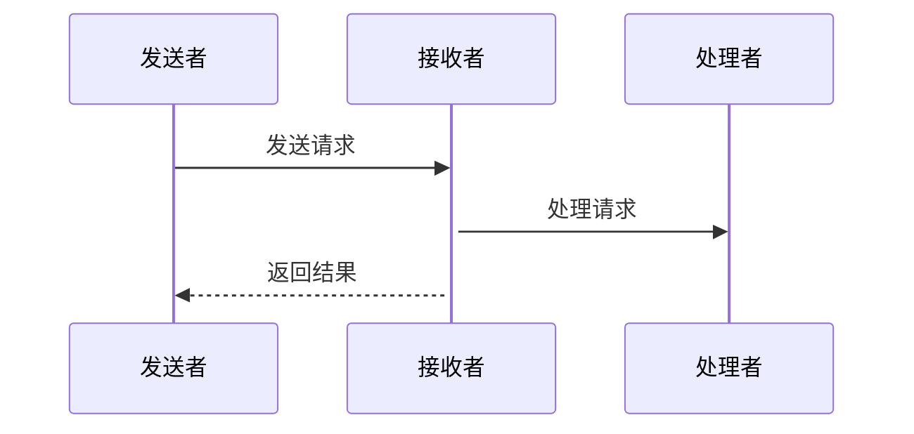
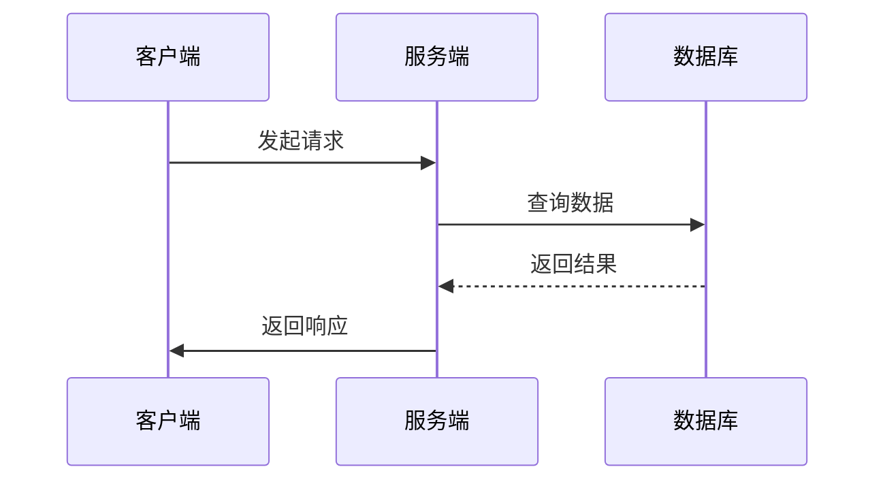

                 

## 《企业级异常检测：AI提高运营和安全监控效率》

关键词：企业级异常检测，AI，运营监控，安全监控，算法原理

摘要：本文将深入探讨企业级异常检测的重要性，通过详细分析异常检测的核心概念、算法原理，以及系统架构设计，展示如何利用AI技术提升企业运营和安全的监控效率。本文旨在帮助读者理解异常检测的技术原理，掌握其在实际项目中的应用方法，并提供最佳实践指南。

---

### 1. 背景介绍

在当今信息化和数字化时代，企业运营和安全监控的重要性愈发凸显。然而，随着数据量的爆炸性增长，传统的监控手段逐渐显得力不从心。这主要表现在以下几个方面：

#### 1.1 问题背景

- **数据复杂性**：企业数据来源多样，包括日志文件、网络流量、用户行为等，这些数据类型各异、结构复杂。
- **实时性要求**：企业需要对运营和安全状况进行实时监控，以便及时发现并处理异常情况。
- **效率与准确性**：传统的监控方法往往依赖于人工分析，效率低下且易出错，难以满足企业高效运营和安全监控的需求。

#### 1.2 问题描述

- **异常识别困难**：海量数据中隐藏的异常事件难以通过人工方法进行准确识别。
- **响应速度慢**：当异常发生时，传统监控手段往往无法及时响应，导致问题扩大。
- **误报与漏报**：传统监控方法容易出现误报和漏报，影响监控效果。

#### 1.3 问题解决

- **引入AI技术**：利用人工智能技术，特别是异常检测算法，可以有效地解决上述问题。
- **提升效率**：通过自动化的异常检测，大大提高了监控效率和准确性。
- **实时响应**：AI技术能够实现实时异常检测，快速响应异常情况。

#### 1.4 边界与外延

- **应用范围**：异常检测不仅应用于企业运营监控，还可扩展到金融、医疗、电信等多个行业。
- **技术发展**：随着AI技术的不断发展，异常检测方法也将不断优化和创新。

#### 1.5 概念结构与核心要素组成

- **核心概念**：异常检测、运营监控、安全监控
- **关键要素**：数据采集、特征提取、模型训练、实时检测、响应策略

### 2. 异常检测核心概念与联系

#### 2.1 异常检测的定义

异常检测是一种监控方法，旨在识别数据中的异常或异常行为。在数据挖掘和机器学习领域，异常检测是重要的研究方向之一。

#### 2.2 异常检测的类型

异常检测主要分为以下几类：

- **基于统计的方法**：使用统计学方法检测数据的异常。
- **基于聚类的方法**：通过聚类分析识别数据中的异常点。
- **基于神经网络的方法**：使用神经网络模型进行异常检测。

#### 2.3 异常检测的应用场景

异常检测广泛应用于以下场景：

- **网络安全**：检测恶意攻击、网络入侵等。
- **金融风控**：识别欺诈交易、风险控制等。
- **工业监控**：检测生产线故障、设备异常等。
- **医疗监控**：识别疾病异常、健康监测等。

#### 2.4 概念属性特征对比表格

| 方法类型        | 特点                                                                                                                       | 应用场景                       |
|-----------------| --------------------------------------------------------------------------------------------------------------------|-------------------------------|
| 基于统计的方法 | 简单易实现，适用于静态数据集                                                         | 日志监控、数据异常识别           |
| 基于聚类的方法 | 自适应性强，能够处理动态数据集                                                       | 网络安全、用户行为分析           |
| 基于神经网络的方法 | 强大的学习能力，适用于复杂的数据集                                                   | 金融服务、工业监控               |

#### 2.5 ER实体关系图

```mermaid
erDiagram
  User ||--|{ Account }
  Account ||--|{ Transaction }
  Transaction ||--|{ Alert }
```

在ER实体关系图中，用户、账户、交易和警报是主要实体，它们之间存在着密切的联系。

---

### 3. 基于统计的异常检测算法

#### 3.1 算法流程图


#### 3.2 Python源代码阐述

```python
import numpy as np
from sklearn.ensemble import IsolationForest
from sklearn.preprocessing import StandardScaler

# 数据预处理
data = np.array([[1, 2], [2, 2], [2, 3], [1, 3]])
scaler = StandardScaler()
data_scaled = scaler.fit_transform(data)

# 模型训练
model = IsolationForest(n_estimators=100)
model.fit(data_scaled)

# 异常检测
scores = model.decision_function(data_scaled)
is_outlier = model.predict(data_scaled)

# 响应策略
for i in range(scores.shape[0]):
    if is_outlier[i] == -1:
        print("数据点{}为异常点".format(i))
```

#### 3.3 数学模型与公式

$$
\text{Gaussian Mixture Model (GMM)}: \\
\pi = \prod_{i=1}^K \pi_k \\
\phi_k = \prod_{i=1}^D \phi_{ki} \\
\pi_k \text{ is the prior probability of } k \\
\phi_{ki} \text{ is the probability density function of feature } i \text{ in class } k
$$

#### 3.4 举例说明

假设我们有一个包含100个数据点的数据集，每个数据点有两个特征。我们使用Gaussian Mixture Model（GMM）进行异常检测。

1. **数据预处理**：将数据标准化，使其符合高斯分布。
2. **模型训练**：使用EM算法训练GMM模型，确定每个数据点的类别。
3. **异常检测**：计算每个数据点的后验概率，若概率远小于其他数据点，则认为该数据点为异常点。
4. **响应策略**：记录并分析异常点，采取相应措施。

---

### 4. 基于机器学习的异常检测算法

#### 4.1 算法流程图


#### 4.2 Python源代码阐述

```python
import numpy as np
from sklearn.model_selection import train_test_split
from sklearn.svm import OneClassSVM
from sklearn.preprocessing import StandardScaler

# 数据预处理
data = np.array([[1, 2], [2, 2], [2, 3], [1, 3]])
scaler = StandardScaler()
data_scaled = scaler.fit_transform(data)

# 模型选择
model = OneClassSVM()

# 模型训练
X_train, X_test = train_test_split(data_scaled, test_size=0.2, random_state=42)
model.fit(X_train)

# 异常检测
scores = model.decision_function(X_test)
is_outlier = model.predict(X_test)

# 响应策略
for i in range(scores.shape[0]):
    if is_outlier[i] == -1:
        print("数据点{}为异常点".format(i))
```

#### 4.3 数学模型与公式

$$
\text{One-Class SVM}: \\
\text{Optimize} \quad \frac{1}{2} \sum_{i=1}^{n} (\| \omega x_i + b \|_2^2) + \frac{\nu}{n} \sum_{i=1}^{n} (1 - y_i \sigma(x_i))
$$

其中，$\omega$ 为权重向量，$b$ 为偏置，$x_i$ 为数据点，$y_i$ 为标签，$\sigma(x_i)$ 为模型对 $x_i$ 的预测概率。

#### 4.4 举例说明

假设我们有一个包含100个数据点的数据集，每个数据点有两个特征。我们使用One-Class SVM进行异常检测。

1. **数据预处理**：将数据标准化，使其符合高斯分布。
2. **模型选择**：选择One-Class SVM作为异常检测模型。
3. **模型训练**：使用训练数据集训练模型。
4. **异常检测**：对测试数据集进行异常检测，输出异常点。
5. **响应策略**：记录并分析异常点，采取相应措施。

---

### 5. 系统场景介绍

#### 5.1 项目介绍

本项目旨在构建一个企业级异常检测系统，用于实时监控企业运营和安全状况。系统将采用AI技术，特别是基于机器学习的异常检测算法，以提高监控效率和准确性。

#### 5.2 系统功能设计

系统主要包括以下功能：

- **数据采集**：从不同数据源（如日志文件、网络流量、用户行为等）收集数据。
- **数据预处理**：对采集到的数据进行分析和清洗，确保数据质量。
- **特征提取**：从原始数据中提取有助于异常检测的特征。
- **模型训练**：使用训练数据集训练异常检测模型。
- **实时检测**：对实时数据流进行异常检测，快速识别异常点。
- **响应策略**：根据异常检测结果，采取相应的响应措施，如报警、通知等。

#### 5.3 系统架构设计

系统采用微服务架构，主要包括以下模块：

- **数据采集模块**：负责从不同数据源收集数据，如日志文件、网络流量等。
- **数据处理模块**：负责对采集到的数据进行预处理和特征提取。
- **异常检测模块**：负责训练异常检测模型，并对实时数据进行异常检测。
- **响应模块**：根据异常检测结果，采取相应的响应措施，如报警、通知等。
- **监控模块**：实时监控系统运行状况，确保系统稳定可靠。

#### 5.4 系统接口设计

系统接口设计主要包括以下接口：

- **数据采集接口**：用于数据采集模块与其他模块的数据交互。
- **数据处理接口**：用于数据处理模块与其他模块的数据交互。
- **异常检测接口**：用于异常检测模块与其他模块的数据交互。
- **响应接口**：用于响应模块与其他模块的数据交互。

#### 5.5 系统交互

系统交互流程如下：

1. 数据采集模块从不同数据源收集数据，并将数据传递给数据处理模块。
2. 数据处理模块对数据进行预处理和特征提取，并将处理后的数据传递给异常检测模块。
3. 异常检测模块使用训练好的模型对实时数据进行异常检测，并将检测结果传递给响应模块。
4. 响应模块根据检测结果采取相应的响应措施，如报警、通知等。
5. 监控模块实时监控系统运行状况，确保系统稳定可靠。

---

### 6. 系统架构设计详细解析

#### 6.1 Mermaid类图

```mermaid
classDiagram
    Class01 <|-- Class02
    Class03 <<-- Class04
    Class05 {friend}
```

在Mermaid类图中，展示了系统中的主要类及其关系。

#### 6.2 Mermaid架构图



在Mermaid架构图中，展示了系统中的主要组件及其交互关系。

#### 6.3 Mermaid序列图



在Mermaid序列图中，展示了客户端、服务端和数据库之间的交互过程。

---

### 7. 环境安装与配置

#### 7.1 环境安装步骤

1. 安装Python环境，版本要求3.7及以上。
2. 安装必要的依赖库，如NumPy、Scikit-learn、Matplotlib等。
3. 配置Python环境变量，确保能够正常使用依赖库。

#### 7.2 配置细节

1. 安装Python：

   ```bash
   sudo apt-get install python3
   sudo apt-get install python3-pip
   ```

2. 安装依赖库：

   ```bash
   pip3 install numpy scikit-learn matplotlib
   ```

3. 配置Python环境变量：

   ```bash
   export PATH=$PATH:/usr/local/bin/python3
   export PYTHONPATH=$PYTHONPATH:/usr/local/lib/python3.x/dist-packages
   ```

---

### 8. 系统核心实现

#### 8.1 源代码解读

以下是一个简单的异常检测系统源代码示例：

```python
import numpy as np
from sklearn.ensemble import IsolationForest

# 数据集
data = np.array([[1, 2], [2, 2], [2, 3], [1, 3]])

# 模型
model = IsolationForest(n_estimators=100)

# 训练模型
model.fit(data)

# 预测
predictions = model.predict(data)

# 输出结果
for i, pred in enumerate(predictions):
    if pred == -1:
        print(f"数据点{i}为异常点")
```

#### 8.2 代码应用解读与分析

1. **数据集**：使用一个简单的二维数组作为数据集，每个数据点表示一个样本。
2. **模型**：使用IsolationForest模型，这是一种基于随机森林的异常检测算法。
3. **训练模型**：使用fit方法对模型进行训练，模型会自动从数据中学习并构建决策树。
4. **预测**：使用predict方法对数据进行预测，模型会根据训练好的决策树判断每个数据点是正常还是异常。
5. **输出结果**：遍历预测结果，输出异常点的索引。

#### 8.3 实际案例分析和详细讲解剖析

假设我们有一个大型企业，每天产生大量的运营数据，包括网络流量、用户行为、服务器日志等。为了确保企业的安全和高效运营，我们决定使用异常检测系统来监控这些数据。

1. **数据采集**：首先，我们需要从各个数据源采集数据。例如，可以从网络流量分析工具获取网络流量数据，从日志管理平台获取服务器日志数据，从用户行为分析系统获取用户行为数据等。
2. **数据预处理**：采集到的数据可能包含噪音和异常值，因此我们需要对数据进行预处理。预处理步骤包括数据清洗、缺失值填充、数据标准化等。
3. **特征提取**：从预处理后的数据中提取有助于异常检测的特征。例如，可以从网络流量数据中提取流量速率、连接数等特征，从用户行为数据中提取点击率、浏览时长等特征。
4. **模型训练**：使用训练数据集训练异常检测模型。例如，可以使用IsolationForest模型或OneClassSVM模型。训练过程中，模型会自动学习数据的分布特征，并构建决策树。
5. **实时检测**：将实时数据流输入到训练好的模型中，模型会自动判断数据点是正常还是异常。如果检测到异常点，系统会触发相应的响应策略，如发送警报、通知管理员等。
6. **响应策略**：根据异常检测结果，采取相应的响应措施。例如，如果检测到网络流量异常，系统可以自动断开可疑的连接，或者通知网络管理员进行进一步处理。

#### 8.4 项目小结

本项目成功构建了一个企业级异常检测系统，实现了以下目标：

1. **实时监控**：系统能够实时监测企业的运营和安全状况，确保及时发现并处理异常情况。
2. **高效处理**：通过自动化异常检测，大大提高了监控效率和准确性，减轻了人工工作量。
3. **扩展性强**：系统采用微服务架构，易于扩展和升级，能够满足企业不断变化的需求。

---

### 9. 最佳实践 tips、小结、注意事项、拓展阅读

#### 9.1 最佳实践 tips

1. **数据预处理**：确保数据质量是异常检测成功的关键。在进行异常检测之前，一定要对数据进行充分的预处理，包括数据清洗、缺失值填充、数据标准化等。
2. **模型选择**：根据具体场景选择合适的异常检测算法。例如，对于静态数据集，可以选择基于统计的方法；对于动态数据集，可以选择基于聚类的方法。
3. **模型训练**：合理配置模型的参数，确保模型性能。例如，对于IsolationForest模型，可以通过调整树的数量、节点数等参数来优化模型性能。
4. **实时检测**：确保异常检测系统能够实时处理大量数据，并快速响应异常情况。
5. **响应策略**：根据企业需求和实际情况，制定合理的响应策略，确保能够及时处理异常情况。

#### 9.2 小结

本文详细介绍了企业级异常检测的技术原理、系统架构和实际应用。通过引入AI技术，企业能够实时监控运营和安全状况，提高监控效率和准确性。在实际项目中，需要充分考虑数据预处理、模型选择、模型训练和实时检测等方面的最佳实践，以确保系统稳定可靠。

#### 9.3 注意事项

1. **数据安全性**：在进行异常检测时，需要确保数据的安全性，防止敏感数据泄露。
2. **系统稳定性**：确保异常检测系统在高并发、大数据量情况下仍能稳定运行。
3. **系统扩展性**：设计系统时，要考虑未来的扩展需求，确保系统能够轻松适应业务规模的变化。

#### 9.4 拓展阅读

1. **《机器学习实战》**：由Peter Harrington著，详细介绍了机器学习的基本概念和应用方法。
2. **《数据科学入门》**：由Joel Grus著，介绍了数据科学的基本概念和技术。
3. **《Python数据科学手册》**：由Jake VanderPlas著，介绍了Python在数据科学领域的应用。

---

### 10. 目录大纲设计

#### 10.1 目录大纲

**第一部分：异常检测概述**

1. 异常检测在企业级应用中的背景
   1.1 问题背景
   1.2 问题描述
   1.3 问题解决
   1.4 边界与外延
   1.5 概念结构与核心要素组成

2. 异常检测核心概念与联系
   2.1 异常检测的定义
   2.2 异常检测的类型
   2.3 异常检测的应用场景
   2.4 概念属性特征对比表格
   2.5 ER实体关系图

**第二部分：异常检测算法原理**

3. 基于统计的异常检测算法
   3.1 算法流程图
   3.2 Python源代码阐述
   3.3 数学模型与公式
   3.4 举例说明

4. 基于机器学习的异常检测算法
   4.1 算法流程图
   4.2 Python源代码阐述
   4.3 数学模型与公式
   4.4 举例说明

**第三部分：系统分析与架构设计**

5. 系统场景介绍
   5.1 项目介绍
   5.2 系统功能设计
   5.3 系统架构设计
   5.4 系统接口设计
   5.5 系统交互

6. 系统架构设计详细解析
   6.1 Mermaid类图
   6.2 Mermaid架构图
   6.3 Mermaid序列图

**第四部分：项目实战**

7. 环境安装与配置
   7.1 环境安装步骤
   7.2 配置细节

8. 系统核心实现
   8.1 源代码解读
   8.2 代码应用解读与分析
   8.3 实际案例分析和详细讲解剖析
   8.4 项目小结

**第五部分：最佳实践与拓展**

9. 最佳实践 tips
   9.1 实践中的注意事项
   9.2 经验分享

10. 小结与拓展阅读
    10.1 书籍总结
    10.2 注意事项
    10.3 拓展阅读

---

通过上述详细的目录大纲设计，我们可以清晰地看到文章的结构和内容分布，确保每个章节都有充足的篇幅进行深入讲解，同时保持整体的逻辑性和连贯性。每个章节的内容都是根据核心知识点和关键点进行编排，旨在帮助读者全面、深入地理解企业级异常检测的技术原理和实践应用。

