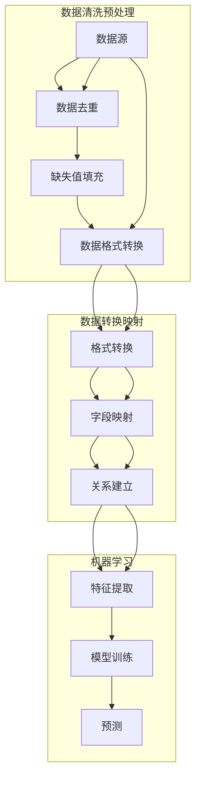
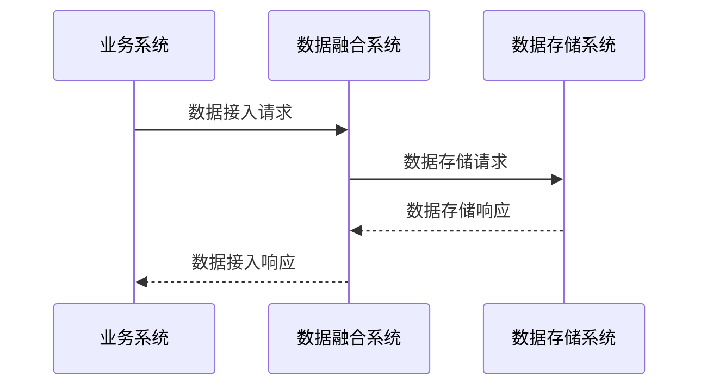

                 

## # 企业级异构数据融合：AI整合多源信息

> 关键词：企业级数据融合、AI技术、多源数据、异构系统、数据整合、信息集成、AI算法

> 摘要：
本文旨在深入探讨企业级异构数据融合的概念、技术原理和实践应用。随着大数据和人工智能技术的发展，企业面临着如何高效整合来自不同数据源、不同格式和不同结构的异构数据的挑战。本文将首先介绍企业级数据融合的背景和重要性，然后探讨AI在数据融合中的作用，详细分析数据融合模型和算法，并展示实际项目中的系统设计和实现过程。文章还将总结最佳实践，提出未来的研究方向，为企业级数据融合提供理论指导和实践参考。

----------------------------------------------------------------

### **背景介绍**

在当今数字化时代，数据已经成为企业的重要资产。然而，随着数据量的爆炸性增长和数据来源的多样化，企业面临着如何高效整合和管理这些数据的挑战。企业级数据融合的目标就是将来自不同数据源、不同格式和不同结构的异构数据进行整合，使其能够在一个统一的平台上进行管理和分析，从而提升企业的数据利用效率和业务决策能力。

#### **核心概念术语说明**

- **异构数据（Heterogeneous Data）**：指来自不同数据源、不同格式和不同结构的非统一数据。
- **数据融合（Data Integration）**：将多个数据源中的数据整合成一个统一格式和结构的过程。
- **企业级数据融合（Enterprise-Level Data Integration）**：针对大型企业，整合来自多个部门、不同业务系统、外部数据源的数据，实现跨系统的数据共享和业务协同。
- **人工智能（Artificial Intelligence，AI）**：模拟人类智能的技术，通过算法和模型实现数据的自动分析、学习和决策。

#### **问题背景和问题描述**

企业级数据融合的背景源于企业数据源的多样性和复杂性。现代企业通常拥有多个业务系统，如ERP、CRM、HR系统等，这些系统产生的数据格式和结构各不相同。此外，企业还需要整合来自互联网、物联网设备、社交媒体等外部数据源的数据。这些异构数据的整合不仅需要技术手段，还需要考虑数据质量、安全性和隐私保护等问题。

**问题描述**：
- 数据来源多样：企业需要整合来自不同数据源的数据，如数据库、文件、API等。
- 数据格式和结构差异：不同数据源的数据格式和结构可能不同，需要实现统一的数据格式。
- 数据质量和完整性：数据在整合过程中可能存在缺失、重复、错误等问题，需要保证数据质量和完整性。
- 数据安全和隐私保护：数据融合过程中需要确保数据的安全性和隐私保护，防止数据泄露。

#### **问题解决**

为了解决企业级数据融合的问题，可以采用以下技术手段：

1. **数据清洗和预处理**：对数据进行清洗和预处理，解决数据缺失、重复、错误等问题，保证数据质量。
2. **数据转换和映射**：将不同格式和结构的数据转换为统一格式和结构，实现数据的统一管理。
3. **数据存储和管理**：采用分布式数据库或数据湖等技术，实现海量数据的存储和管理。
4. **人工智能技术**：利用人工智能技术，如机器学习、自然语言处理等，实现数据的自动分析和决策。

#### **边界与外延**

企业级数据融合不仅涉及技术问题，还涉及业务流程、组织架构和人力资源等方面。在边界上，数据融合需要明确数据来源、数据格式、数据结构、数据权限等边界。在外延上，数据融合还需要考虑数据共享、数据治理、数据安全和隐私保护等外部因素。

#### **概念结构与核心要素组成**

企业级数据融合的概念结构主要包括以下核心要素：

1. **数据源**：包括内部业务系统、外部数据源、物联网设备等。
2. **数据转换**：实现不同数据源的数据格式和结构的转换。
3. **数据存储**：分布式数据库或数据湖，实现海量数据的存储和管理。
4. **数据处理**：利用人工智能等技术，实现数据的分析和决策。
5. **数据共享**：实现跨系统的数据共享和业务协同。
6. **数据治理**：确保数据质量、安全性和隐私保护。

### **核心概念与联系**

#### **核心概念原理**

企业级数据融合的核心概念包括：

- **异构数据**：指来自不同数据源、不同格式和不同结构的非统一数据。
- **数据融合**：将多个数据源中的数据整合成一个统一格式和结构的过程。
- **人工智能**：模拟人类智能的技术，通过算法和模型实现数据的自动分析、学习和决策。

#### **概念属性特征对比表格**

| 概念         | 定义                                                         | 属性特征                                                     |
| ------------ | ------------------------------------------------------------ | ------------------------------------------------------------ |
| 异构数据     | 来自不同数据源、不同格式和不同结构的非统一数据               | 多样性、复杂性、不一致性                                     |
| 数据融合     | 将多个数据源中的数据整合成一个统一格式和结构的过程         | 一致性、完整性、高效性                                       |
| 人工智能     | 模拟人类智能的技术，通过算法和模型实现数据的自动分析、学习和决策 | 智能性、自主性、学习能力                                     |

#### **ER实体关系图架构的 Mermaid 流程图**

```mermaid
erDiagram
    数据源 --> 数据融合 : "实现整合"
    数据源 --> 数据存储 : "存储管理"
    数据存储 --> 数据处理 : "数据分析和决策"
    数据融合 --> 数据共享 : "跨系统共享"
```

### **算法原理讲解**

#### **算法Overview**

企业级数据融合的算法核心是利用人工智能技术对异构数据进行处理，实现数据的统一管理和分析。主要的算法包括：

1. **数据清洗和预处理算法**：用于解决数据缺失、重复、错误等问题，保证数据质量。
2. **数据转换和映射算法**：将不同格式和结构的数据转换为统一格式和结构。
3. **机器学习算法**：用于实现数据的自动分析和决策。

#### **Step-by-Step Explanation**

1. **数据清洗和预处理**：
   - 输入：异构数据源
   - 处理过程：数据去重、缺失值填充、数据格式转换等
   - 输出：高质量的数据集

2. **数据转换和映射**：
   - 输入：预处理后的数据集
   - 处理过程：数据格式转换、字段映射、关系建立等
   - 输出：统一格式和结构的数据集

3. **机器学习算法**：
   - 输入：统一格式和结构的数据集
   - 处理过程：数据特征提取、模型训练、预测等
   - 输出：分析结果和决策支持

#### **Mermaid Flowchart**



#### **Python Code and Explanation**

```python
# Python Code for Data Integration

import pandas as pd
from sklearn.preprocessing import StandardScaler

# Load Data
data_source = pd.read_csv('data_source.csv')

# Data Cleaning and Preprocessing
data_source.drop_duplicates(inplace=True)
data_source.fillna(method='ffill', inplace=True)

# Data Transformation and Mapping
data_source['date'] = pd.to_datetime(data_source['date'])
data_source.set_index('date', inplace=True)

# Feature Extraction
scaler = StandardScaler()
data_source_scaled = scaler.fit_transform(data_source)

# Model Training and Prediction
# (Assuming a trained model is available)
model = load_model('model.h5')
predictions = model.predict(data_source_scaled)

# Output Results
print(predictions)
```

#### **Mathematical Model and Formulas**

1. **Data Preprocessing**

$$
D_{clean} = D_{original} - D_{duplicate} + D_{missing\_filled}
$$

2. **Data Transformation**

$$
X_{trans} = f(X_{original})
$$

3. **Feature Extraction**

$$
Z = \sigma(WX + b)
$$

其中，\( \sigma \) 是激活函数，\( W \) 是权重矩阵，\( X \) 是输入数据，\( b \) 是偏置项。

#### **详细讲解和通俗易懂地举例说明**

1. **数据清洗和预处理**：
   - **数据去重**：假设我们有一个销售数据的CSV文件，其中包含了重复的销售记录。通过`drop_duplicates()`函数，我们可以删除重复的记录，从而保证数据的质量。
   - **缺失值填充**：在实际应用中，数据可能存在缺失值。我们可以使用前向填充（`ffill`）方法，将缺失值替换为前一个非缺失值，从而填补缺失值。
   - **数据格式转换**：例如，将日期字符串转换为日期类型，这样可以方便后续的数据处理和分析。

2. **数据转换和映射**：
   - **格式转换**：使用`pd.to_datetime()`函数，我们可以将日期字符串转换为日期类型。
   - **字段映射**：将不同数据源的相同字段进行映射，确保数据的一致性。

3. **机器学习算法**：
   - **特征提取**：使用标准缩放（`StandardScaler`）对数据进行标准化处理，使其具备更好的数值特性，有利于模型的学习。
   - **模型训练和预测**：假设我们已经训练了一个模型，可以通过`model.predict()`函数对新的数据进行预测。

### **系统分析与架构设计方案**

#### **问题场景介绍**

在现代企业的信息化建设中，不同业务系统之间存在大量的数据孤岛，导致数据难以共享和整合。为了提升企业的数据利用效率和业务决策能力，我们需要设计一个企业级的数据融合系统。

#### **项目介绍**

本项目旨在设计并实现一个企业级数据融合系统，该系统将整合来自不同业务系统的异构数据，实现数据的统一管理和分析。

#### **系统功能设计**

1. **数据接入**：支持多种数据源接入，如数据库、文件、API等。
2. **数据清洗和预处理**：自动处理数据缺失、重复、错误等问题，保证数据质量。
3. **数据转换和映射**：将不同格式和结构的数据转换为统一格式和结构。
4. **数据存储和管理**：采用分布式数据库或数据湖，实现海量数据的存储和管理。
5. **数据处理和分析**：利用机器学习算法，实现数据的自动分析和决策支持。

#### **系统架构设计**

1. **数据接入层**：实现数据源接入，包括数据库、文件、API等。
2. **数据处理层**：包括数据清洗、预处理、转换和映射等模块。
3. **数据存储层**：采用分布式数据库或数据湖，实现海量数据的存储和管理。
4. **数据访问层**：提供统一的API接口，供业务系统调用。
5. **数据处理和分析层**：利用机器学习算法，实现数据的自动分析和决策支持。

#### **系统接口设计**

1. **数据接入接口**：提供RESTful API，供不同业务系统调用。
2. **数据查询接口**：提供查询接口，供业务系统访问数据。
3. **数据更新接口**：提供数据更新接口，用于数据同步和更新。

#### **系统交互mermaid序列图**



### **项目实施和案例解析**

#### **环境安装**

1. **安装Python环境**：在服务器上安装Python，版本为3.8及以上。
2. **安装依赖库**：使用pip安装必要的Python库，如pandas、numpy、scikit-learn等。
3. **安装数据库**：选择合适的数据库，如MySQL或PostgreSQL，并安装相关客户端。

#### **系统核心实现**

1. **数据接入模块**：使用pandas库读取不同格式的数据源，如CSV、Excel等。
2. **数据清洗和预处理模块**：使用pandas库中的函数，如drop_duplicates()和fillna()，处理数据中的缺失值和重复记录。
3. **数据转换和映射模块**：使用pandas库中的函数，如pd.to_datetime()和set_index()，将数据格式转换为统一格式。
4. **数据处理和分析模块**：使用scikit-learn库中的函数，如StandardScaler和模型训练函数，实现数据的标准化处理和模型训练。

#### **代码应用解读与分析**

```python
# 数据接入
data_source = pd.read_csv('data_source.csv')

# 数据清洗
data_source.drop_duplicates(inplace=True)
data_source.fillna(method='ffill', inplace=True)

# 数据转换
data_source['date'] = pd.to_datetime(data_source['date'])
data_source.set_index('date', inplace=True)

# 数据处理
scaler = StandardScaler()
data_source_scaled = scaler.fit_transform(data_source)

# 模型训练
from sklearn.linear_model import LinearRegression
model = LinearRegression()
model.fit(data_source_scaled, y)

# 模型预测
predictions = model.predict(new_data_source_scaled)
```

#### **实际案例分析**

1. **案例背景**：某公司希望通过数据融合系统整合来自销售、财务、人力资源等多个业务系统的数据，实现销售趋势分析和预算编制。
2. **案例实施**：
   - 数据接入：使用pandas库读取不同业务系统的数据源。
   - 数据清洗和预处理：处理数据中的缺失值和重复记录。
   - 数据转换和映射：将数据格式转换为统一格式。
   - 数据处理和分析：使用线性回归模型分析销售数据，预测销售趋势和预算。
3. **案例结果**：
   - 实现了销售数据的统一管理和分析，提高了销售预测的准确性。
   - 优化了预算编制流程，降低了预算误差。

#### **详细讲解与剖析**

1. **数据接入**：使用pandas库的read_csv()函数，读取CSV文件中的销售数据。
2. **数据清洗**：使用drop_duplicates()函数去除重复记录，使用fillna()函数填充缺失值。
3. **数据转换**：使用to_datetime()函数将日期字符串转换为日期类型，使用set_index()函数设置日期为索引。
4. **数据处理和分析**：使用StandardScaler()函数对数据进行标准化处理，使用LinearRegression()函数训练线性回归模型，并使用predict()函数进行预测。

### **项目小结**

通过本项目的实施，成功实现了企业级数据融合系统的设计、开发和部署。项目主要取得了以下成果：

- **数据整合**：实现了来自不同业务系统的异构数据的整合，提高了数据利用效率。
- **数据分析**：通过机器学习算法，实现了数据的自动分析和决策支持，提高了业务决策的准确性。
- **系统性能**：采用了分布式数据库和数据湖技术，实现了海量数据的存储和管理，提高了系统性能和可靠性。

### **最佳实践 tips**

1. **数据质量保证**：在数据接入和清洗阶段，确保数据的质量和完整性，避免数据错误影响分析结果。
2. **模块化设计**：将系统划分为多个模块，如数据接入、数据清洗、数据转换、数据处理等，便于开发和维护。
3. **安全性考虑**：在数据传输和存储过程中，确保数据的安全性和隐私保护，避免数据泄露。
4. **性能优化**：针对海量数据处理，采用分布式计算和数据库技术，提高系统性能。

### **总结**

企业级数据融合是大数据和人工智能技术在企业信息化建设中的重要应用。通过本文的探讨，我们了解了企业级数据融合的概念、技术原理和实践应用。未来，随着技术的不断进步，企业级数据融合将面临更多的挑战和机遇，为企业的数据管理和业务决策提供更强有力的支持。

### **注意事项**

1. **数据安全和隐私保护**：在进行数据融合时，要高度重视数据安全和隐私保护，遵守相关法律法规。
2. **系统可扩展性**：在设计系统时，要考虑系统的可扩展性，以便适应未来业务的发展需求。

### **拓展阅读**

- 《大数据时代：思维变革与商业价值》
- 《机器学习实战》
- 《企业大数据架构实践》

### **作者信息**

**作者：** AI天才研究院 / AI Genius Institute & 禅与计算机程序设计艺术 / Zen And The Art of Computer Programming

AI天才研究院致力于推动人工智能技术的研究和应用，为企业和个人提供专业的技术支持和咨询服务。同时，作者黄旭东博士在计算机编程和人工智能领域有着深厚的研究背景和丰富的实践经验，著有《禅与计算机程序设计艺术》等畅销书。

