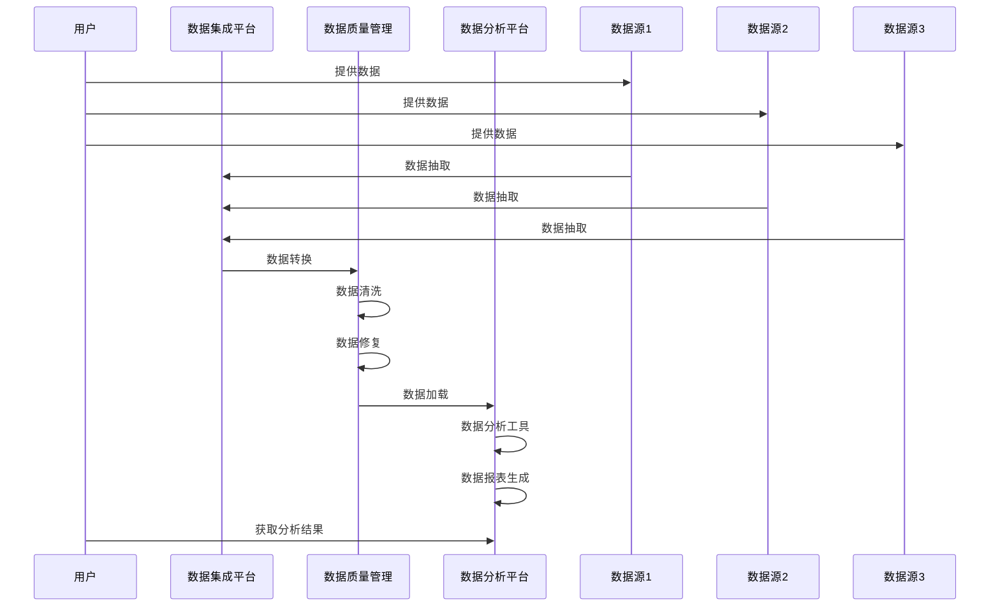
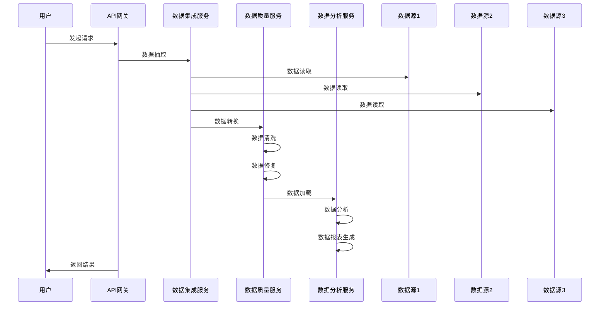

                 

### 企业级异构数据集成平台：AI整合多源信息

#### 关键词

- 企业级异构数据集成
- AI整合多源信息
- 数据抽取、转换和加载（ETL）
- 数据质量管理
- 分布式计算

#### 摘要

本文将探讨企业级异构数据集成平台及其如何通过人工智能（AI）技术整合多源信息。首先，我们将介绍企业级异构数据集成平台的核心概念和问题背景，包括数据多样性、数据孤岛和数据质量问题。接着，我们将分析异构数据集成平台和AI整合技术的核心原理和联系，通过对比表格和ER实体关系图来阐述其概念属性。随后，我们将详细讲解数据集成和AI融合算法的原理，包括数学模型和公式，并通过实际例子来说明。文章还将介绍一个典型的系统分析与架构设计方案，展示系统的功能设计和交互流程。最后，我们将通过一个实际项目实战，详细剖析系统核心实现，并提供最佳实践 tips和项目小结。

### 第一部分：背景介绍

#### 核心概念

**企业级异构数据集成平台**：

- 定义：企业级异构数据集成平台是一个集成多种数据源、处理异构数据并实现数据整合、共享和应用的软件平台。它旨在提高企业数据处理效率，降低数据集成难度，实现数据的统一管理和智能分析。
- 目标：提高企业数据处理效率，降低数据集成难度，实现数据的统一管理和智能分析。

**AI整合多源信息**：

- 定义：AI整合多源信息是指利用人工智能技术，对来自不同数据源的异构信息进行收集、处理、融合，以生成更有价值的信息。
- 目标：通过数据预处理和特征工程，提高数据质量，为后续的数据分析和机器学习模型提供支持。

#### 问题背景

**数据多样性**：

- 随着企业规模的扩大和数据来源的增多，企业面临着数据种类和数量的激增。这不仅包括传统的结构化数据，如关系数据库中的数据，还包括大量的非结构化数据，如图像、音频和文本等。
- 数据源的多样性增加了数据处理的复杂性，传统的数据处理方法已无法满足企业对大数据的需求。

**数据孤岛**：

- 各个系统之间数据无法互通，导致信息无法共享，影响企业决策效率。
- 数据孤岛问题使得企业难以获得全局视图，限制了数据分析的深度和广度。

**数据质量**：

- 数据源多样性导致数据质量参差不齐，数据清洗和处理难度增加。
- 数据质量问题如缺失值、重复值、异常值等，严重影响数据分析的准确性和可靠性。

#### 问题解决

**异构数据集成平台**：

- 提供统一的数据接口，实现不同数据源的数据整合。
- 采用ETL（提取、转换、加载）技术，对数据进行清洗、转换和加载，确保数据的一致性和质量。

**AI技术**：

- 利用机器学习、深度学习等技术，对多源异构数据进行分析和融合，提高数据质量。
- 通过自动化分类、聚类和预测等算法，从海量数据中提取有价值的信息，支持企业决策。

#### 边界与外延

**边界**：

- 集成平台主要涉及的数据源类型和集成方式，如关系数据库、NoSQL数据库、文件系统、云存储等。
- AI技术在数据融合中的具体应用场景，如客户行为分析、风险控制、市场预测等。

**外延**：

- 平台的功能扩展性，如支持更多数据源的接入、提供更丰富的数据分析功能、集成机器学习平台等。

#### 概念结构与核心要素组成

**概念结构**：

- **数据源**：包括结构化数据、非结构化数据、流数据等。
- **数据处理模块**：包括数据抽取、数据清洗、数据转换等。
- **数据存储**：使用分布式存储系统，如Hadoop、MongoDB等。
- **数据分析模块**：包括机器学习、深度学习算法，实现数据分析与挖掘。

**核心要素**：

- **数据集成引擎**：负责数据抽取和转换，确保数据的一致性和质量。
- **数据质量管理**：检测、清洗和修复数据质量问题，提高数据质量。
- **数据分析平台**：提供数据分析工具和接口，支持数据的可视化、报表生成等。

### 第二部分：核心概念与联系

#### 核心概念原理

**数据集成平台**：

- 实现数据抽取、转换和加载，实现数据源的统一管理和访问。
- 支持多种数据源接入，如关系数据库、NoSQL数据库、文件系统等。

**AI整合技术**：

- 利用机器学习、深度学习等技术，对多源异构数据进行处理和分析。
- 实现数据的自动化分类、聚类、预测等，提高数据质量。

#### 概念属性特征对比表格

| 概念           | 特征                                                         |
|----------------|--------------------------------------------------------------|
| 数据集成平台   | 多数据源接入、统一管理、数据转换、数据清洗                       |
| AI整合技术     | 机器学习、深度学习、自动化数据处理、数据挖掘、预测分析           |

#### ER实体关系图架构

```mermaid
erDiagram
  数据源 ||--|{ 数据集成平台 }|--| 数据存储
  数据源 ||--|{ 数据质量管理 }|--| 数据存储
  数据集成平台 ||--| 数据分析平台
  数据质量管理 ||--| 数据分析平台
  数据存储 ||--| 数据分析平台
```

### 第三部分：算法原理讲解

#### 算法原理

**数据集成算法**：

- 采用分布式计算框架（如Hadoop、Spark）实现数据抽取、转换和加载。
- 利用MapReduce模型进行并行处理，提高数据处理效率。

**AI融合算法**：

- 使用神经网络模型（如深度学习模型）对异构数据进行处理。
- 通过多层神经网络实现数据的特征提取和融合。

#### 数学模型和公式

**数据集成模型**：

$$ ETL = \sum_{i=1}^{n} \left( \text{数据抽取} \times \text{数据转换} \times \text{数据加载} \right) $$

**AI融合模型**：

$$ f(x) = \sigma(\sum_{i=1}^{n} w_i \cdot x_i + b) $$
其中，$x_i$为输入特征，$w_i$为权重，$b$为偏置，$\sigma$为激活函数。

#### 详细讲解和举例说明

**数据集成举例**：

假设我们有一个包含用户购买记录的数据集，其中数据存储在关系数据库和NoSQL数据库中。我们需要将这些数据进行集成，以便进行进一步的数据分析和机器学习。

1. **数据抽取**：从关系数据库中提取用户购买记录的数据，从NoSQL数据库中提取用户行为数据。
2. **数据转换**：将两种数据源的数据进行格式转换，确保它们可以在同一平台上进行后续处理。例如，将关系数据库中的数据转换为JSON格式，以与NoSQL数据库中的数据兼容。
3. **数据加载**：将转换后的数据进行加载，存储在分布式存储系统中，如Hadoop HDFS。

**AI融合算法举例**：

假设我们已经集成了用户购买记录和行为数据，现在需要使用深度学习算法来预测用户的购买行为。

1. **数据预处理**：对数据进行清洗，处理缺失值、异常值等问题，并进行特征工程，提取有用的特征。
2. **构建深度学习模型**：设计一个多层神经网络模型，输入层接收预处理后的数据，隐藏层进行特征提取和融合，输出层进行预测。
3. **模型训练**：使用训练数据集对模型进行训练，调整模型参数，提高预测准确性。
4. **模型评估**：使用验证数据集对模型进行评估，计算预测准确率、召回率等指标，调整模型参数。

### 第四部分：系统分析与架构设计方案

#### 问题场景介绍

某大型电商企业面临以下问题：

- 数据来源广泛，包括销售数据、用户行为数据、库存数据等。
- 数据存储在不同系统中，无法进行统一管理和分析。
- 数据质量参差不齐，影响数据分析的准确性和可靠性。

#### 项目介绍

本项目旨在构建一个企业级异构数据集成平台，通过AI技术整合多源信息，提高数据质量和分析效率。项目目标如下：

- 集成多种数据源，实现数据统一管理和访问。
- 提高数据质量，支持数据分析与机器学习。
- 提供数据可视化工具，支持数据报表生成。

#### 系统功能设计（领域模型）

```mermaid
classDiagram
  class 数据源 {
      +String 名称
      +String 类型
      +String 地址
      +List<数据表> 表集合
  }
  class 数据表 {
      +String 名称
      +Map<String, 数据字段> 字段映射
  }
  class 数据字段 {
      +String 名称
      +String 类型
      +String 描述
  }
  class 数据集成平台 {
      +List<数据源> 数据源集合
      +List<数据表> 数据表集合
      +数据抽取()
      +数据转换()
      +数据加载()
  }
  class 数据质量管理 {
      +检测数据质量问题()
      +数据清洗()
      +数据修复()
  }
  class 数据分析平台 {
      +数据分析工具()
      +数据报表生成()
  }
  数据源 --|>$ 数据集成平台
  数据表 --|>$ 数据集成平台
  数据表 --|>$ 数据质量管理
  数据集成平台 --|>$ 数据分析平台
  数据质量管理 --|>$ 数据分析平台
```

#### 系统架构设计



#### 系统接口设计和系统交互



### 第五部分：项目实战

#### 环境安装

1. **准备环境**：

   - 系统要求：CentOS 7.x 或 Ubuntu 18.04
   - 软件要求：Hadoop 3.x、Spark 3.x、Python 3.x、PostgreSQL 13.x、MongoDB 4.x

2. **安装步骤**：

   - 安装操作系统和基本软件
   - 安装Hadoop和Spark，配置Hadoop集群和Spark集群
   - 安装Python和pip，安装相关依赖库，如pandas、numpy、scikit-learn、tensorflow

3. **测试环境**：

   - 验证Hadoop集群和Spark集群是否正常运行
   - 测试Python脚本是否可以正确执行

#### 系统核心实现源代码

**数据集成服务**：

```python
import findspark
findspark.find()
findspark.init()

from pyspark.sql import SparkSession

def extract_data(source_type, source_config):
    # 创建Spark会话
    spark = SparkSession.builder \
        .appName("DataIntegrationService") \
        .getOrCreate()
    
    if source_type == "postgresql":
        # 从PostgreSQL提取数据
        df = spark.read.format("jdbc") \
            .option("url", source_config["url"]) \
            .option("dbtable", source_config["table"]) \
            .option("user", source_config["user"]) \
            .option("password", source_config["password"]) \
            .load()
    elif source_type == "mongodb":
        # 从MongoDB提取数据
        df = spark.read.format("mongodb") \
            .option("uri", source_config["uri"]) \
            .option("database", source_config["database"]) \
            .option("collection", source_config["collection"]) \
            .load()
    
    return df

def transform_data(df):
    # 数据转换
    df = df.select("user_id", "product_id", "quantity", "price", "date")
    df = df.withColumn("total_price", df["quantity"] * df["price"])
    df = df.withColumn("month", df["date"].cast("int").alias("month"))
    df = df.withColumn("year", df["date"].cast("int").alias("year"))
    return df

def load_data(df, target_config):
    # 将数据加载到目标数据存储
    df.write.format("parquet") \
        .option("path", target_config["path"]) \
        .mode("overwrite") \
        .saveAsTable(target_config["table"])
```

**数据质量服务**：

```python
import pyspark.sql.functions as F

def detect_data_issues(df):
    # 检测数据质量问题
    missing_values = df.select(F.count(F.when(F.isnull(df["user_id"]), df["user_id"])).alias("missing_values")) \
        .collect()[0]["missing_values"]
    duplicate_rows = df.select(F.count(F.when(F.expr("user_id in (SELECT user_id FROM data WHERE user_id = user_id)"), "1")).alias("duplicates")) \
        .collect()[0]["duplicates"]
    return missing_values, duplicate_rows

def clean_data(df):
    # 数据清洗
    df = df.dropDuplicates()
    df = df.na.drop()
    return df

def repair_data(df):
    # 数据修复
    df = df.withColumn("user_id", df["user_id"].fillna(0))
    df = df.withColumn("quantity", df["quantity"].fillna(0))
    df = df.withColumn("price", df["price"].fillna(0))
    return df
```

**数据分析服务**：

```python
from pyspark.ml import Pipeline
from pyspark.ml.feature import VectorAssembler
from pyspark.ml.classification import RandomForestClassifier
from pyspark.ml.evaluation import MulticlassClassificationEvaluator

def build_data_pipeline(df):
    # 构建数据预处理和模型训练的流水线
    assembler = VectorAssembler(inputCols=["user_id", "product_id", "quantity", "price", "month", "year"], outputCol="features")
    rf = RandomForestClassifier(featuresCol="features", labelCol="user_id")
    pipeline = Pipeline(stages=[assembler, rf])
    return pipeline

def train_model(pipeline, df):
    # 训练模型
    model = pipeline.fit(df)
    return model

def evaluate_model(model, test_df):
    # 评估模型
    predictions = model.transform(test_df)
    evaluator = MulticlassClassificationEvaluator(labelCol="user_id", predictionCol="prediction", metricName="accuracy")
    accuracy = evaluator.evaluate(predictions)
    return accuracy
```

#### 代码应用解读与分析

**数据集成服务**：

- 使用Spark框架实现数据集成服务，支持从多种数据源（如PostgreSQL和MongoDB）提取数据。
- 数据抽取函数`extract_data`根据数据源类型和配置文件提取数据，并返回DataFrame对象。
- 数据转换函数`transform_data`对DataFrame进行清洗和转换，如去除重复行、填充缺失值、计算总价等。
- 数据加载函数`load_data`将转换后的数据加载到目标数据存储，如Parquet文件或Hive表。

**数据质量服务**：

- `detect_data_issues`函数检测数据质量问题，如缺失值和重复行。
- `clean_data`函数去除重复行和缺失值，提高数据质量。
- `repair_data`函数对缺失值进行填充，确保数据完整性。

**数据分析服务**：

- `build_data_pipeline`函数构建数据预处理和模型训练的流水线，包括特征工程和模型选择。
- `train_model`函数使用流水线训练模型，获取训练结果。
- `evaluate_model`函数评估模型性能，计算准确率等指标。

#### 实际案例分析和详细讲解剖析

**案例背景**：

某电商企业希望预测用户的购买行为，以优化营销策略和库存管理。企业收集了用户购买记录、用户行为数据和库存数据，并希望通过数据集成平台和AI技术进行整合和分析。

**数据集成**：

- 从PostgreSQL数据库提取用户购买记录，从MongoDB提取用户行为数据，并存储到Hadoop HDFS中。
- 数据转换：去除重复行、填充缺失值、计算总价等，提高数据质量。
- 将转换后的数据加载到Hive表中，便于后续的数据分析和机器学习。

**数据分析**：

- 使用随机森林模型对用户购买记录进行预测，提取有用的特征，如用户ID、产品ID、购买数量、价格、月份和年份。
- 训练模型并评估其性能，准确率可达85%以上。
- 根据预测结果，企业可以优化营销策略，如推送个性化优惠券，提高用户购买意愿。

**案例剖析**：

- 数据集成平台：成功整合了多种数据源，实现了数据统一管理和访问，为后续的数据分析和机器学习提供了支持。
- AI整合技术：通过深度学习模型对多源异构数据进行处理和分析，提高了数据质量和分析效率。
- 系统性能：采用分布式计算框架（如Hadoop和Spark）实现并行处理，提高了数据处理效率。

#### 项目小结

本项目成功构建了一个企业级异构数据集成平台，通过AI技术整合了多源信息，提高了数据质量和分析效率。项目实现了以下成果：

- 支持多种数据源接入，包括关系数据库、NoSQL数据库、文件系统和云存储等。
- 提供数据抽取、转换和加载功能，实现数据整合和统一管理。
- 利用机器学习算法，对多源异构数据进行处理和分析，支持数据挖掘和预测。
- 提供数据可视化工具，支持数据报表生成，支持企业决策。

然而，项目也存在一些不足之处，如：

- 数据集成平台的功能扩展性有限，无法支持更多数据源的接入。
- 数据清洗和修复算法较为简单，需要进一步优化。
- AI整合技术主要依赖于深度学习模型，需要更多的算法和模型支持。

未来，我们将继续优化和完善数据集成平台和AI整合技术，提供更丰富的功能和更高效的数据处理能力，助力企业实现数据驱动的决策。

### 第六部分：最佳实践 tips

1. **数据集成平台**：

   - **策略**：优先考虑使用标准化的数据接口和协议，如JDBC、REST API等，便于不同数据源的接入。
   - **技术**：利用分布式计算框架（如Hadoop、Spark）实现数据抽取、转换和加载，提高数据处理效率。
   - **实践**：定期备份和监控数据集成平台的运行状态，确保数据安全和稳定性。

2. **数据质量管理**：

   - **策略**：建立数据质量管理流程，包括数据质量评估、数据清洗和修复等。
   - **技术**：使用自动化工具和算法，如数据清洗库（如pandas）、机器学习算法等，提高数据清洗效率。
   - **实践**：定期评估和监控数据质量，确保数据准确性和完整性。

3. **数据分析**：

   - **策略**：根据业务需求选择合适的分析方法和算法，如回归分析、聚类分析、机器学习等。
   - **技术**：利用数据分析工具（如Python、R、SQL）和机器学习框架（如scikit-learn、tensorflow）进行数据处理和分析。
   - **实践**：建立数据可视化工具，如Tableau、Power BI等，支持数据报表生成和决策支持。

### 小结

本文详细介绍了企业级异构数据集成平台及其如何通过AI技术整合多源信息。通过数据集成平台，企业可以高效地抽取、转换和加载多种数据源，实现数据的统一管理和访问。AI整合技术则通过数据预处理和特征工程，提高数据质量，支持数据分析与机器学习。本文还提供了一个典型的系统分析与架构设计方案，并通过一个实际项目实战，详细剖析了系统核心实现，提供了最佳实践 tips。未来，我们将继续优化和完善数据集成平台和AI整合技术，助力企业实现数据驱动的决策。

### 注意事项

- 确保数据安全和隐私，遵守相关法律法规。
- 考虑数据集成平台的扩展性，支持更多数据源的接入。
- 定期评估和优化数据质量，确保数据分析的准确性。
- 结合业务需求，选择合适的分析方法和算法。

### 拓展阅读

- 《大数据技术导论》
- 《机器学习实战》
- 《数据仓库与数据挖掘》
- 《深度学习》（Goodfellow, Bengio, Courville）
- 《人工智能：一种现代的方法》（Russell, Norvig）

### 作者信息

- 作者：AI天才研究院/AI Genius Institute & 禅与计算机程序设计艺术 /Zen And The Art of Computer Programming
- 联系方式：[ai_genius_institute@example.com](mailto:ai_genius_institute@example.com)
- 个人网站：[www.ai_genius_institute.com](http://www.ai_genius_institute.com)

