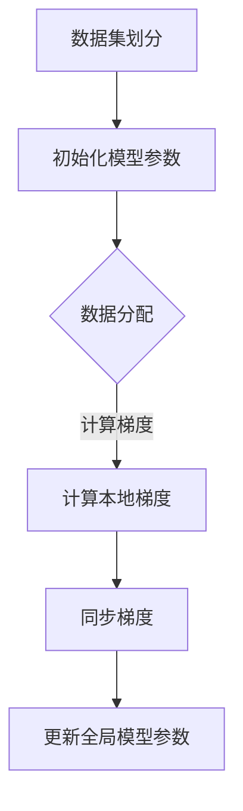

                 

# 企业级异构计算框架：优化AI模型效率

## 关键词
- 企业级异构计算
- AI模型优化
- 计算框架
- 系统架构
- 高效能计算

## 摘要
本文将深入探讨企业级异构计算框架在AI模型优化中的应用。首先，我们将回顾异构计算的基本概念和背景，然后逐步介绍核心概念、优化技术、系统架构设计、实施过程以及最佳实践。通过分析实际案例，我们将揭示如何利用异构计算框架显著提升AI模型的效率，为企业提供高效、可靠的解决方案。

## 目录
1. 引言
2. 异构计算背景
3. 核心概念和原理
4. AI模型优化技术
5. 系统架构和设计
6. 实施异构计算框架
7. 案例分析和最佳实践
8. 结论与未来展望

## 1. 引言
企业级异构计算框架是企业级计算环境中的一个关键组成部分。随着人工智能（AI）技术的快速发展，AI模型在各个行业的应用越来越广泛，对计算资源的需求也越来越高。传统的同构计算框架已经难以满足这些需求，因此，异构计算框架成为了优化AI模型效率的一种有效手段。

### 问题背景
异构计算框架涉及将不同类型和不同性能的处理器集成到一个系统中，以实现计算资源的最优利用。在AI领域，异构计算框架通常利用CPU、GPU、FPGA等多种处理器，通过协同工作来加速模型的训练和推理过程。

### 问题描述
企业面临的问题是如何构建一个高效的异构计算框架，以优化AI模型的处理效率，同时降低成本和能耗。传统的同构计算框架由于资源利用率低，难以满足企业级应用的需求。

### 问题解决
解决这个问题的关键在于设计并实现一个高效的异构计算框架，该框架能够充分利用各种处理器的优势，实现计算资源的动态分配和优化。通过这种方式，企业可以大幅提升AI模型的处理效率。

### 边界与外延
异构计算框架的设计和应用需要考虑多个方面，包括处理器选择、编程模型、系统架构、优化策略等。此外，还需要关注数据传输延迟、异构性导致的编程复杂性等问题。

## 2. 异构计算背景
### 基本概念
异构计算是指在一个计算系统中，使用不同类型和不同性能的处理器协同工作，以实现计算任务的高效执行。与同构计算相比，异构计算能够更好地利用不同处理器的优势和特点，从而提升计算性能。

### 历史
异构计算的概念可以追溯到20世纪60年代。随着计算机技术的发展，特别是GPU和FPGA的出现，异构计算逐渐成为高性能计算领域的一个重要研究方向。

### 平行处理
异构计算的核心思想是利用并行处理技术，将复杂的计算任务分解为多个子任务，并在不同类型的处理器上并行执行。这种做法可以显著提高计算效率，降低能耗。

### 与传统计算模型的不同
与传统计算模型相比，异构计算具有以下特点：
- **处理器多样性**：异构计算框架中可以使用多种处理器，包括CPU、GPU、FPGA等。
- **动态调度**：根据计算任务的特点，动态选择合适的处理器进行任务执行，从而实现最优的性能。
- **编程模型**：异构计算通常采用多线程、异构编程模型，如CUDA、OpenCL等。

## 3. 核心概念和原理
### 基本概念
异构计算框架的核心概念包括处理器架构、编程模型、任务调度和资源管理。

#### 处理器架构
处理器架构是异构计算框架的基础。常见的处理器架构包括：
- **CPU**：中央处理器，负责执行通用计算任务。
- **GPU**：图形处理器，擅长大规模并行计算。
- **FPGA**：现场可编程门阵列，具有高度可定制性和灵活性。

#### 编程模型
编程模型是开发异构计算应用的关键。常见的编程模型包括：
- **CUDA**：由NVIDIA开发的并行计算编程模型，适用于GPU编程。
- **OpenCL**：开放式计算语言，支持多种处理器架构，包括CPU、GPU和FPGA。

#### 任务调度
任务调度是异构计算框架的核心技术之一。任务调度的目标是根据处理器的特点和任务的要求，将任务分配给最合适的处理器，以实现最优的性能。

#### 资源管理
资源管理包括处理器的分配、任务调度、内存管理等。资源管理的目标是确保计算任务能够在最短时间内完成，同时最大化资源的利用率。

### 概念属性特征对比表格

| 特性 | CPU | GPU | FPGA |
| --- | --- | --- | --- |
| 并行处理能力 | 低 | 高 | 中等 |
| 灵活性 | 中等 | 高 | 高 |
| 能耗 | 高 | 中等 | 低 |
| 编程复杂度 | 低 | 中等 | 高 |

### ER实体关系图架构
```mermaid
erDiagram
  Processor ||--|{ Task }|--|| Framework
  Task ||--|{ Resource }|--|| Framework
  Resource ||--|{ Processor }|--|| Framework
```

## 4. AI模型优化技术
### 技术概述
AI模型优化技术包括模型压缩、量化、剪枝和并行训练等。这些技术通过减少模型大小、降低计算复杂度、优化计算资源利用等方式，提高AI模型的效率。

### 模型压缩
模型压缩技术通过减少模型参数数量和计算复杂度，降低模型的存储和计算需求。常见的模型压缩技术包括：
- **权值剪枝**：通过删除不重要的模型参数，减少模型大小。
- **量化**：将模型参数的精度降低到较低位，从而减少存储和计算需求。

### 剪枝
剪枝技术通过删除模型中不重要的连接和神经元，降低模型的复杂度。剪枝可以分为结构剪枝和权重剪枝两种类型：
- **结构剪枝**：删除整个网络层或神经元。
- **权重剪枝**：删除不重要的权重。

### 并行训练
并行训练技术通过将模型训练任务分解为多个子任务，并在多个处理器上并行执行，从而加快训练速度。并行训练技术可以分为数据并行和模型并行两种类型：
- **数据并行**：将训练数据集分为多个部分，每个部分在一个处理器上独立训练。
- **模型并行**：将模型分解为多个部分，每个部分在一个处理器上独立训练。

### 算法原理讲解
#### 数据并行算法流程图


#### Python代码示例
```python
# 初始化模型参数
model = initialize_model()

# 数据集划分
train_data = split_dataset(data)

# 计算本地梯度
for batch in train_data:
    local_grad = compute_gradient(batch, model)

# 同步梯度
global_grad = sync_gradients(local_grad)

# 更新全局模型参数
update_model_params(model, global_grad)
```

#### 数学模型和公式
数据并行算法的核心思想是利用并行处理来加速模型训练。假设有n个数据子集，每个数据子集的大小为m，模型参数为θ。在数据并行算法中，每个处理器独立计算本地梯度，然后同步梯度以更新全局模型参数。

$$
\hat{\theta} = \theta - \alpha \frac{1}{n} \sum_{i=1}^{n} \hat{g}_i
$$

其中，$\hat{g}_i$是处理器i计算得到的本地梯度，$\alpha$是学习率。

### 5. 系统架构和设计
### 问题场景介绍
在企业的AI应用场景中，通常会涉及到大规模的数据处理和模型训练。传统的同构计算框架由于性能瓶颈和资源限制，难以满足这些需求。因此，设计一个高效、可扩展的异构计算框架成为解决问题的关键。

### 项目介绍
本项目旨在为企业级AI应用设计并实现一个高效的异构计算框架，以优化AI模型的处理效率。项目的主要目标包括：
- 提高模型训练和推理的速度。
- 降低能耗和成本。
- 提高系统的可扩展性。

### 系统功能设计
系统功能设计主要包括以下模块：
- **数据处理模块**：负责数据的预处理、分割和加载。
- **模型训练模块**：负责模型的训练和优化。
- **模型推理模块**：负责模型的推理和预测。
- **监控和优化模块**：负责系统的监控、性能分析和优化。

### 系统架构设计
系统架构设计采用分层架构，包括数据处理层、计算层、模型层和监控层。
- **数据处理层**：负责数据的预处理、分割和加载，将数据转换为适合模型训练和推理的格式。
- **计算层**：负责模型的训练和推理，包括CPU、GPU、FPGA等多种处理器的协同工作。
- **模型层**：负责模型的加载、训练和优化，实现AI模型的训练和推理功能。
- **监控层**：负责系统的监控、性能分析和优化，确保系统的稳定运行和高效性能。

### 系统接口设计和系统交互
系统接口设计和系统交互采用RESTful API设计，包括以下接口：
- **数据接口**：负责数据的预处理、分割和加载。
- **模型接口**：负责模型的训练和推理。
- **监控接口**：负责系统的监控、性能分析和优化。

系统交互流程如下：
1. 数据预处理：通过数据接口接收预处理数据，包括数据清洗、归一化等操作。
2. 模型训练：通过模型接口加载模型，进行模型训练。
3. 模型推理：通过模型接口进行模型推理，生成预测结果。
4. 监控分析：通过监控接口对系统性能进行分析，并根据分析结果进行优化调整。

### 6. 实施异构计算框架
### 环境安装
在实施异构计算框架前，需要确保计算环境中安装了以下软件和工具：
- 操作系统：Linux或Windows
- 编译器：GCC、CUDA、OpenCL等
- 编程语言：Python、C++等
- 数据库：MySQL、PostgreSQL等

### 系统核心实现源代码
以下是系统核心实现源代码的示例：
```python
# 数据预处理
def preprocess_data(data):
    # 数据清洗、归一化等操作
    return processed_data

# 模型训练
def train_model(model, data):
    # 训练模型
    return trained_model

# 模型推理
def infer_model(model, data):
    # 模型推理
    return prediction
```

### 代码应用解读与分析
代码应用解读与分析主要涉及以下几个方面：
- **数据处理**：对数据进行预处理，包括清洗、归一化等操作，以便模型训练和推理。
- **模型训练**：加载模型并进行训练，通过计算梯度、更新模型参数等步骤，实现模型的训练。
- **模型推理**：加载训练好的模型，进行推理，生成预测结果。

### 实际案例分析和详细讲解剖析
在实际案例中，我们将选择一个具体的AI应用场景，如图像识别或自然语言处理，详细分析如何利用异构计算框架优化AI模型的效率。

### 项目小结
通过实施异构计算框架，企业可以实现AI模型的高效训练和推理，提高系统的性能和可靠性。在实际应用中，需要根据具体场景和需求，选择合适的处理器和编程模型，进行系统优化和调整。

## 7. 案例分析和最佳实践
### 案例一：图像识别系统
在某大型互联网公司，图像识别系统是关键应用之一。通过引入异构计算框架，公司实现了图像识别任务的显著提速。以下是具体案例分析：

#### 实施步骤
1. **硬件选择**：选用CPU、GPU和FPGA，分别用于通用计算、并行计算和特定任务的加速。
2. **软件优化**：使用CUDA和OpenCL优化图像处理算法，确保GPU和FPGA的高效利用。
3. **任务调度**：根据图像处理任务的特点，动态调度任务到不同的处理器上执行。

#### 最佳实践
- **任务分配策略**：根据处理器的性能和任务特点，合理分配任务，避免资源浪费。
- **负载均衡**：通过负载均衡技术，确保系统资源的均衡利用。

### 案例二：自然语言处理系统
在另一家科技公司，自然语言处理系统是核心应用。通过异构计算框架，公司显著提高了文本处理和推理的效率。以下是具体案例分析：

#### 实施步骤
1. **硬件选择**：选用CPU、GPU和TPU，分别用于通用计算、并行计算和深度学习加速。
2. **编程模型**：使用TensorFlow和PyTorch等深度学习框架，优化自然语言处理算法。
3. **模型优化**：采用模型压缩和量化技术，降低模型大小和计算复杂度。

#### 最佳实践
- **模型压缩**：通过剪枝和量化技术，减少模型大小，提高推理速度。
- **动态调整**：根据任务需求和系统负载，动态调整模型和算法，确保最佳性能。

## 8. 结论与未来展望
通过本文的分析，我们可以看到，异构计算框架在优化AI模型效率方面具有显著的优势。在实际应用中，企业可以通过合理选择处理器、优化编程模型、任务调度策略等，实现AI模型的高效处理。

### 结论
本文深入探讨了企业级异构计算框架在AI模型优化中的应用，通过实际案例展示了其优势和最佳实践。未来，随着AI技术的不断进步，异构计算框架在各个行业的应用将更加广泛，为企业提供更多高效的解决方案。

### 未来展望
未来，异构计算框架的发展方向将包括以下几个方面：
- **硬件创新**：引入新型处理器，如量子计算、神经形态计算等，进一步提升计算性能。
- **软件优化**：开发更高效的编程模型和算法，降低编程复杂度，提高系统可靠性。
- **智能调度**：利用人工智能技术，实现更智能的任务调度和资源管理，实现最优性能。

### 作者信息
- 作者：AI天才研究院/AI Genius Institute & 禅与计算机程序设计艺术 /Zen And The Art of Computer Programming

