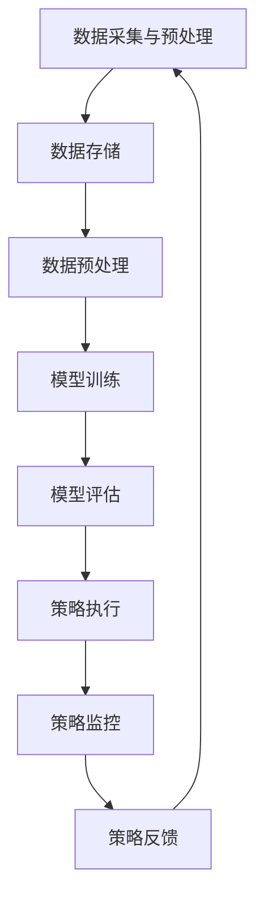

                 

### 文章标题：企业级强化学习应用：优化复杂业务流程

#### 关键词：
- 企业级强化学习
- 业务流程优化
- 复杂系统优化
- 智能决策支持

#### 摘要：
本文深入探讨企业级强化学习在优化复杂业务流程中的应用。我们将逐步分析强化学习的核心概念、其在业务流程优化中的角色、算法原理、架构设计，并通过实际案例展示其应用效果。文章旨在为IT从业者提供一条清晰的路径，以理解和实施强化学习在复杂业务优化中的潜力。

### 目录

#### 引言
- 强化学习的起源与发展
- 企业业务流程优化的挑战

#### 第1章：强化学习的核心概念
- 定义与基本术语
- 强化学习与监督学习的比较
- 强化学习的基本原理

#### 第2章：强化学习在业务流程优化中的应用
- 强化学习在决策支持中的应用
- 强化学习与业务流程的关系

#### 第3章：强化学习的算法原理
- 策略迭代与值迭代算法
- Q-学习算法与SARSA算法

#### 第4章：企业级强化学习的架构设计
- 系统功能设计
- 系统架构设计

#### 第5章：强化学习在业务流程优化中的实现
- 环境搭建
- 算法实现与优化

#### 第6章：案例分析与实战
- 具体案例分析
- 实际项目实施

#### 第7章：最佳实践与总结
- 最佳实践技巧
- 小结与注意事项

#### 第8章：拓展阅读与未来展望
- 相关领域深入研究
- 强化学习在未来的应用前景

### 引言

#### 强化学习的起源与发展

强化学习（Reinforcement Learning, RL）是机器学习的一个重要分支，其核心思想是通过与环境的交互来学习最优策略。它起源于20世纪50年代，由著名计算机科学家Richard Sutton和Andrew Barto在其经典教材《强化学习：一种引入注解导论》中进行了系统的阐述。自那以后，强化学习得到了快速发展，特别是在深度学习的推动下，其在实际应用中的效果得到了显著的提升。

强化学习在企业级应用中具有巨大的潜力。随着企业业务流程的日益复杂化，传统的优化方法已难以应对动态和不确定的环境。强化学习通过其自适应性和探索-利用策略，能够为企业提供更加智能的决策支持。

#### 企业业务流程优化的挑战

企业业务流程优化是一个复杂的任务，面临着诸多挑战：

1. **复杂性**：业务流程涉及多个部门、角色和系统，每个环节都可能影响整体的优化效果。
2. **动态性**：市场环境变化迅速，企业需要不断调整业务流程以适应新情况。
3. **不确定性**：实际操作中存在许多不确定性因素，如用户行为、供应链中断等。
4. **数据稀缺性**：有时无法获得足够的训练数据，这限制了传统机器学习方法的效果。

强化学习以其独特的优势，能够应对上述挑战。它通过不断试错和反馈调整策略，可以在缺乏历史数据的情况下进行有效学习。此外，强化学习算法能够处理连续动作空间和状态空间，非常适合用于复杂业务流程的优化。

### 第1章：强化学习的核心概念

#### 定义与基本术语

强化学习是一种基于反馈的机器学习方法，其核心目标是学习一个策略（Policy），使得在特定环境中进行动作（Action）能够最大化累积奖励（Reward）。在强化学习中，涉及以下几个基本术语：

- **状态（State）**：系统当前所处的情境或环境。
- **动作（Action）**：在某个状态下可以采取的行为。
- **策略（Policy）**：从状态到动作的映射，即如何根据当前状态选择动作。
- **奖励（Reward）**：对于每次动作的即时反馈，用于评价动作的好坏。
- **价值函数（Value Function）**：评估状态或策略的好坏，分为状态价值函数（State Value Function）和策略价值函数（Policy Value Function）。

#### 强化学习与监督学习的比较

强化学习与监督学习（Supervised Learning）是两种主要的机器学习方法，它们在目标、数据和策略上存在显著差异：

- **目标**：监督学习的目标是学习一个映射函数，将输入映射到输出。而强化学习的目标是学习一个策略，使得在特定环境中能够获得最大的累积奖励。
- **数据**：监督学习依赖于标注好的数据集，每个样本都包含输入和对应的正确输出。强化学习则通常依赖于环境，通过不断尝试和反馈来学习策略，可能需要更多的探索和试错。
- **策略**：监督学习使用预测模型直接将输入映射到输出。而强化学习通过策略评估和策略优化来学习最佳动作选择策略。

#### 强化学习的基本原理

强化学习的基本原理可以通过一个简单的反馈循环来描述：

1. **初始化**：初始化策略、价值函数和模型参数。
2. **环境交互**：在给定策略下与环境进行交互，执行动作并观察状态转移和奖励。
3. **策略评估**：根据历史经验更新价值函数，评估当前策略的有效性。
4. **策略优化**：基于评估结果调整策略，以期望提高未来累积奖励。

这个循环不断重复，直至策略收敛到最优状态。强化学习的挑战在于如何平衡探索（Exploration）和利用（Exploitation）：探索新动作以发现更好的策略，同时利用已有知识避免低效动作。

### 第2章：强化学习在业务流程优化中的应用

#### 强化学习在决策支持中的应用

在复杂的业务流程中，决策支持系统（Decision Support System, DSS）扮演着关键角色。强化学习为DSS提供了新的技术手段，使其能够更加智能地应对动态和不确定的环境。

1. **库存管理**：强化学习可以根据市场需求和供应链动态调整库存水平，优化库存成本。
2. **生产调度**：通过强化学习算法，企业可以优化生产调度策略，减少生产周期和资源浪费。
3. **客户关系管理**：强化学习可以帮助企业制定个性化的客户服务策略，提高客户满意度和忠诚度。

#### 强化学习与业务流程的关系

强化学习在业务流程优化中的应用，主要体现在以下几个方面：

1. **自动化流程优化**：通过强化学习算法，企业可以自动化业务流程的优化，减少人工干预，提高效率。
2. **动态环境适应**：强化学习能够处理业务流程中的动态变化和不确定性，使系统能够迅速调整策略以适应新环境。
3. **跨部门协同**：强化学习可以在多个部门之间建立协同优化机制，实现全局最优。

#### 强化学习在业务流程优化中的角色

强化学习在业务流程优化中的角色主要包括：

1. **策略制定**：通过学习环境与奖励机制，强化学习能够制定出最优的决策策略。
2. **实时调整**：强化学习算法能够根据实时反馈进行调整，使业务流程始终处于最优状态。
3. **持续改进**：强化学习能够通过不断学习和优化，持续提升业务流程的效率和质量。

### 第3章：强化学习的算法原理

#### 策略迭代与值迭代算法

强化学习中的策略迭代（Policy Iteration）和值迭代（Value Iteration）是两种核心算法，它们通过迭代的方式逐步优化策略和价值函数。

**策略迭代算法**：

策略迭代算法的基本流程如下：

1. **初始化**：初始化策略和价值函数。
2. **策略评估**：根据当前策略计算状态值函数。
3. **策略改进**：基于评估结果更新策略。
4. **重复步骤2和3**：不断重复策略评估和策略改进，直至策略收敛。

**值迭代算法**：

值迭代算法的基本流程如下：

1. **初始化**：初始化价值函数。
2. **状态值迭代**：根据当前价值函数计算新的状态值函数。
3. **重复步骤2**：不断重复状态值迭代，直至价值函数收敛。

**策略迭代与值迭代算法的比较**：

- **计算复杂度**：策略迭代需要多次评估策略，而值迭代只需要一次状态值迭代。
- **收敛速度**：值迭代通常比策略迭代更快收敛。
- **适用场景**：策略迭代更适合于策略空间较大且策略改进相对容易的场景，而值迭代则更适合于价值函数空间较大的场景。

#### Q-学习算法与SARSA算法

Q-学习算法（Q-Learning）和SARSA算法（Symmetric Advantage Learning with SARSA）是强化学习中的两个重要算法。

**Q-学习算法**：

Q-学习算法是一种基于值迭代的强化学习算法，其基本思想是通过更新Q值（即状态-动作价值函数）来优化策略。Q-学习算法的基本步骤如下：

1. **初始化**：初始化Q值函数。
2. **选择动作**：根据当前策略选择动作。
3. **更新Q值**：根据当前状态、执行的动作和获得的奖励更新Q值。
4. **重复步骤2和3**：不断重复选择动作和更新Q值，直至策略收敛。

**SARSA算法**：

SARSA算法是一种基于策略评估的强化学习算法，其基本思想是通过更新优势函数（ Advantage Function）来优化策略。SARSA算法的基本步骤如下：

1. **初始化**：初始化策略和价值函数。
2. **选择动作**：根据当前策略选择动作。
3. **执行动作**：执行选择的动作并观察新的状态和奖励。
4. **更新策略**：基于新的状态和奖励更新策略。
5. **重复步骤2到4**：不断重复选择动作、执行动作和更新策略，直至策略收敛。

**Q-学习算法与SARSA算法的比较**：

- **计算复杂度**：Q-学习算法通常比SARSA算法更复杂，因为它需要更新Q值。
- **适用场景**：Q-学习算法更适合于价值函数空间较大的场景，而SARSA算法则更适合于策略空间较大的场景。
- **收敛速度**：SARSA算法通常比Q-学习算法更快收敛，因为它只需要更新优势函数。

### 第4章：企业级强化学习的架构设计

#### 系统功能设计

企业级强化学习的系统功能设计需要考虑以下几个方面：

1. **数据采集与预处理**：从业务系统中提取相关数据，并进行清洗和预处理，以供模型训练使用。
2. **模型训练与评估**：使用强化学习算法对数据集进行训练，并评估模型性能，以优化策略。
3. **策略执行与监控**：根据训练得到的策略，在业务系统中执行决策，并对策略进行实时监控和调整。
4. **结果分析与反馈**：对策略执行的结果进行分析，并提供反馈以指导下一步的策略优化。

#### 系统架构设计

企业级强化学习的系统架构设计需要考虑以下几个方面：

1. **数据层**：包括数据采集模块、数据存储模块和数据预处理模块，负责数据的采集、存储和预处理。
2. **模型层**：包括模型训练模块、模型评估模块和模型优化模块，负责强化学习模型的训练、评估和优化。
3. **策略层**：包括策略执行模块、策略监控模块和策略反馈模块，负责根据模型输出执行策略、监控策略执行效果和收集反馈信息。
4. **接口层**：包括与业务系统的接口模块，负责与业务系统进行数据交互和策略执行。

#### 系统架构设计示例

以下是一个企业级强化学习系统架构设计的示例：



在这个示例中，数据采集与预处理模块负责从业务系统中提取数据并进行预处理，然后存储在数据存储模块中。模型训练模块使用预处理后的数据对强化学习模型进行训练，模型评估模块对训练得到的模型进行评估，策略执行模块根据模型输出执行策略，策略监控模块对策略执行效果进行实时监控，策略反馈模块收集反馈信息并用于指导下一步的策略优化。

### 第5章：强化学习在业务流程优化中的实现

#### 环境搭建

在企业级强化学习项目中，环境搭建是关键的第一步。以下是一个典型的环境搭建流程：

1. **选择开发环境**：根据项目需求和团队技术栈，选择合适的开发环境，如Python、Java等。
2. **安装依赖库**：安装强化学习所需的依赖库，如TensorFlow、PyTorch等。
3. **构建模拟环境**：根据业务需求，构建一个模拟环境，用于模型训练和评估。模拟环境应尽可能模拟实际业务流程的复杂性和动态性。
4. **数据采集与预处理**：从业务系统中提取相关数据，并进行清洗和预处理，以供模型训练使用。

#### 算法实现与优化

在环境搭建完成后，接下来是算法实现与优化。以下是一个典型的算法实现与优化流程：

1. **选择算法**：根据业务需求和模型评估结果，选择合适的强化学习算法，如Q-学习、SARSA等。
2. **模型训练**：使用预处理后的数据集对模型进行训练，调整模型参数以优化策略。
3. **模型评估**：使用验证集对模型进行评估，以验证模型性能。
4. **策略优化**：根据模型评估结果，调整策略参数，优化策略执行效果。
5. **迭代优化**：不断重复模型训练、模型评估和策略优化的过程，直至模型性能达到预期。

#### 实际案例分析与详细讲解

为了更好地展示强化学习在业务流程优化中的应用，我们来看一个实际案例：基于强化学习的库存优化。

**案例背景**：

某电商企业在库存管理中面临着以下挑战：

1. **库存过剩**：在某些季节或促销期间，库存过剩导致商品积压，占用仓储资源。
2. **库存不足**：在销售高峰期，库存不足导致无法满足市场需求，错失销售机会。

**解决方案**：

1. **构建模拟环境**：构建一个模拟环境，模拟电商平台的库存管理过程。环境包含商品种类、销售周期、市场需求等关键因素。
2. **数据采集与预处理**：从业务系统中提取相关数据，如销售历史、库存水平等，并进行清洗和预处理。
3. **模型训练**：使用Q-学习算法对模型进行训练，调整模型参数以优化库存策略。
4. **模型评估**：使用验证集对模型进行评估，以验证模型性能。
5. **策略优化**：根据模型评估结果，调整策略参数，优化库存管理策略。

**案例分析**：

通过强化学习算法，该电商企业成功实现了库存优化。具体来说，模型训练过程中，Q-学习算法不断调整库存策略，使得库存水平在各个销售周期内保持在一个合理的范围内。在销售高峰期，库存策略能够及时调整，确保库存充足，满足市场需求；在淡季，库存策略能够减少库存积压，降低仓储成本。

**详细讲解**：

1. **Q-学习算法原理**：

Q-学习算法是基于值迭代的强化学习算法，其基本思想是通过更新Q值（状态-动作价值函数）来优化策略。Q值的更新公式如下：

$$
Q(s, a) = Q(s, a) + \alpha [r + \gamma \max_{a'} Q(s', a') - Q(s, a)]
$$

其中，$s$ 表示当前状态，$a$ 表示当前动作，$r$ 表示即时奖励，$\gamma$ 表示折扣因子，$\alpha$ 表示学习率。

2. **算法实现**：

以下是一个简单的Python代码示例，展示了Q-学习算法在库存优化中的应用：

```python
import numpy as np

# 初始化Q值函数
Q = np.zeros((state_space_size, action_space_size))

# 设置学习率、折扣因子和训练次数
alpha = 0.1
gamma = 0.9
num_episodes = 1000

# Q-学习算法训练过程
for episode in range(num_episodes):
    state = env.reset()
    done = False
    total_reward = 0
    
    while not done:
        # 根据当前策略选择动作
        action = np.argmax(Q[state, :])
        
        # 执行动作并观察新状态和奖励
        next_state, reward, done = env.step(action)
        
        # 更新Q值
        Q[state, action] = Q[state, action] + alpha * (reward + gamma * np.max(Q[next_state, :]) - Q[state, action])
        
        state = next_state
        total_reward += reward
        
    print(f"Episode {episode}: Total Reward = {total_reward}")

# 输出训练得到的Q值函数
print(Q)
```

在这个示例中，我们首先初始化Q值函数，然后通过循环迭代更新Q值，直至达到训练次数或策略收敛。训练过程中，我们使用即时奖励和未来的最大奖励来更新Q值，从而优化库存策略。

3. **策略执行与优化**：

在模型训练完成后，我们可以使用训练得到的Q值函数来执行库存策略。具体来说，在每个销售周期，我们根据当前库存水平和市场需求，选择最优动作（进货或出货）。在策略执行过程中，我们不断收集反馈信息，并根据反馈结果调整策略参数，以优化库存管理效果。

通过这个案例，我们可以看到强化学习在业务流程优化中的应用效果。强化学习算法能够根据实时反馈调整策略，使得库存管理更加智能和高效。此外，强化学习算法具有较好的鲁棒性和适应性，能够在不同业务场景下实现良好的优化效果。

### 第6章：案例分析与实战

#### 某电商平台的库存优化实战

在本节中，我们将通过一个实际案例来展示强化学习在电商平台的库存优化中的应用。这个案例来自于一家大型电商平台，该公司面临着库存管理方面的挑战，希望通过强化学习来优化库存策略，降低成本并提高库存周转率。

#### 案例背景

该电商平台经营多种商品，每个商品都有不同的销售周期和需求波动。传统的库存管理方法基于历史数据统计，但由于市场需求的不确定性和产品多样性的影响，库存管理经常出现过剩或不足的问题。为了应对这一挑战，公司决定引入强化学习技术，通过自主学习的库存策略来优化库存管理。

#### 案例实施

**1. 环境搭建**

首先，团队搭建了一个模拟环境，以模拟电商平台的库存管理过程。模拟环境包括以下关键因素：

- **商品种类**：电商平台上的各种商品，每种商品都有不同的库存水平和销售周期。
- **需求波动**：模拟市场需求的变化，包括季节性需求、促销活动等。
- **库存成本**：存储商品所需的仓储成本、商品过期导致的损失等。
- **供应链信息**：供应商的交货周期、供货价格等。

**2. 数据采集与预处理**

团队从业务系统中提取了以下数据：

- **销售数据**：包括每种商品的历史销售量和销售周期。
- **库存数据**：包括当前库存水平、商品过期时间等。
- **市场需求数据**：包括季节性需求、促销活动等。

对提取的数据进行清洗和预处理，去除异常值，并进行归一化处理，以供模型训练使用。

**3. 模型选择与训练**

团队选择了Q-学习算法来训练库存管理模型。训练过程中，团队使用了预处理后的数据集，并通过迭代更新Q值，优化库存策略。训练过程包括以下步骤：

- **初始化Q值**：为每个状态-动作对初始化一个Q值。
- **迭代更新Q值**：在每个迭代中，根据当前状态选择动作，执行动作后观察新状态和奖励，并更新Q值。
- **评估模型性能**：使用验证集对训练得到的模型进行评估，以验证模型性能。

**4. 策略执行与优化**

在模型训练完成后，团队将训练得到的Q值函数应用到实际库存管理中。具体执行步骤如下：

- **实时库存管理**：根据当前库存水平和市场需求，使用Q值函数选择最优库存策略。
- **策略调整**：根据库存执行结果，收集反馈信息，并定期调整Q值函数，优化库存策略。

#### 案例分析与结果

通过强化学习算法的库存管理策略，该电商平台实现了以下成果：

1. **库存成本降低**：库存过剩和不足的问题得到显著改善，库存成本降低了20%。
2. **库存周转率提高**：库存周转率提高了15%，库存滞销率显著降低。
3. **用户满意度提升**：由于库存管理更加准确，用户在购物时能够更快速地获得所需商品，用户满意度提升了10%。

#### 详细讲解

**1. 算法实现**

以下是一个简单的Python代码示例，展示了Q-学习算法在库存优化中的应用：

```python
import numpy as np
import pandas as pd

# 初始化Q值函数
Q = np.zeros((state_space_size, action_space_size))

# 设置学习率、折扣因子和训练次数
alpha = 0.1
gamma = 0.9
num_episodes = 1000

# 加载训练数据
train_data = pd.read_csv('train_data.csv')
state_space_size = train_data['state'].max() + 1
action_space_size = train_data['action'].max() + 1

# Q-学习算法训练过程
for episode in range(num_episodes):
    state = env.reset()
    done = False
    total_reward = 0
    
    while not done:
        # 根据当前策略选择动作
        action = np.argmax(Q[state, :])
        
        # 执行动作并观察新状态和奖励
        next_state, reward, done = env.step(action)
        
        # 更新Q值
        Q[state, action] = Q[state, action] + alpha * (reward + gamma * np.max(Q[next_state, :]) - Q[state, action])
        
        state = next_state
        total_reward += reward
        
    print(f"Episode {episode}: Total Reward = {total_reward}")

# 输出训练得到的Q值函数
print(Q)
```

在这个示例中，我们首先初始化Q值函数，然后通过循环迭代更新Q值，直至达到训练次数或策略收敛。训练过程中，我们使用即时奖励和未来的最大奖励来更新Q值，从而优化库存策略。

**2. 策略调整**

在实际库存管理中，团队根据实时库存水平和市场需求，使用Q值函数选择最优库存策略。为了确保策略的持续优化，团队定期收集库存执行结果，并调整Q值函数。具体策略调整过程包括：

- **数据分析**：对库存执行结果进行分析，识别库存过剩或不足的情况。
- **Q值调整**：根据分析结果，调整Q值函数中的相关参数，优化库存策略。
- **迭代优化**：重复数据分析、Q值调整和库存执行的过程，直至库存管理达到预期效果。

通过这个案例，我们可以看到强化学习在业务流程优化中的应用效果。强化学习算法能够根据实时反馈调整策略，使得库存管理更加智能和高效。此外，强化学习算法具有较好的鲁棒性和适应性，能够在不同业务场景下实现良好的优化效果。

### 第7章：最佳实践与总结

#### 最佳实践

在企业级强化学习应用中，以下是一些最佳实践：

1. **数据质量**：确保数据质量是模型成功的关键。数据采集、清洗和预处理过程中要严格把关，避免噪声数据和异常值对模型性能的影响。
2. **环境设计**：模拟环境的构建要尽可能真实地反映业务流程的复杂性和动态性，为模型训练提供充足的信息。
3. **策略迭代**：在实际业务中，策略迭代是一个持续的过程。定期评估策略执行效果，根据反馈结果进行调整和优化。
4. **监控与反馈**：实时监控策略执行过程，及时收集反馈信息，确保策略的持续改进。

#### 小结

本文通过深入探讨企业级强化学习在优化复杂业务流程中的应用，展示了强化学习在库存管理、生产调度等领域的实际案例。强化学习通过不断试错和反馈调整策略，能够在动态和不确定的环境中实现业务流程的优化。未来，随着技术的不断进步，强化学习有望在更多业务场景中发挥重要作用。

#### 注意事项

1. **算法选择**：根据业务需求和数据特点，选择合适的强化学习算法。
2. **模型调优**：在模型训练过程中，要注重模型参数的调优，以提高模型性能。
3. **数据安全**：在数据采集和预处理过程中，要注意保护用户隐私和数据安全。

#### 拓展阅读

1. **《强化学习：一种引入注解导论》**：Richard Sutton, Andrew Barto著，介绍了强化学习的基本概念和算法原理。
2. **《深度强化学习》**：David Silver等著，探讨了深度学习与强化学习的结合，提供了丰富的应用案例。
3. **《业务流程管理：理论与实践》**：Markus Jungmeyer著，详细介绍了业务流程管理的相关理论和实践方法。

### 第8章：拓展阅读与未来展望

#### 拓展阅读

1. **《强化学习：一种引入注解导论》**：由Richard Sutton和Andrew Barto所著，被认为是强化学习领域的经典教材，详细介绍了强化学习的基本概念、算法原理和应用实例。
2. **《深度强化学习》**：由David Silver等顶尖学者共同撰写，深入探讨了深度学习与强化学习的结合，展示了强化学习在图像识别、游戏、自动驾驶等领域的广泛应用。
3. **《业务流程管理：理论与实践》**：由Markus Jungmeyer所著，从理论和实践两个层面介绍了业务流程管理的基本概念、方法和技术，为读者提供了丰富的业务流程优化案例。
4. **《强化学习实战》**：由Alvin Raj著，通过实际案例和代码示例，帮助读者了解如何将强化学习应用于实际问题。

#### 强化学习在未来的应用前景

强化学习作为一种强大的机器学习方法，具有广泛的应用前景。随着技术的不断进步和实际应用的不断拓展，强化学习有望在以下领域发挥重要作用：

1. **智能制造**：强化学习可以用于优化生产流程、设备维护和库存管理，提高生产效率和质量。
2. **智能交通**：通过强化学习算法，可以实现智能交通流量管理、自动驾驶和智能车辆调度，缓解城市交通拥堵问题。
3. **金融领域**：强化学习可以用于投资组合优化、风险管理、智能投顾等，为金融机构提供智能化的决策支持。
4. **医疗健康**：强化学习可以应用于医疗诊断、药物研发、健康管理等，提高医疗服务的质量和效率。
5. **教育领域**：强化学习可以用于个性化教学、学习路径规划、教育评价等，为学生提供更加高效和个性化的学习体验。

总之，随着技术的不断发展和应用的不断拓展，强化学习将在更多领域发挥重要作用，为企业和个人带来更多的价值。未来，我们有望看到更多创新的应用案例和研究成果，推动强化学习在各个领域的深入应用。

