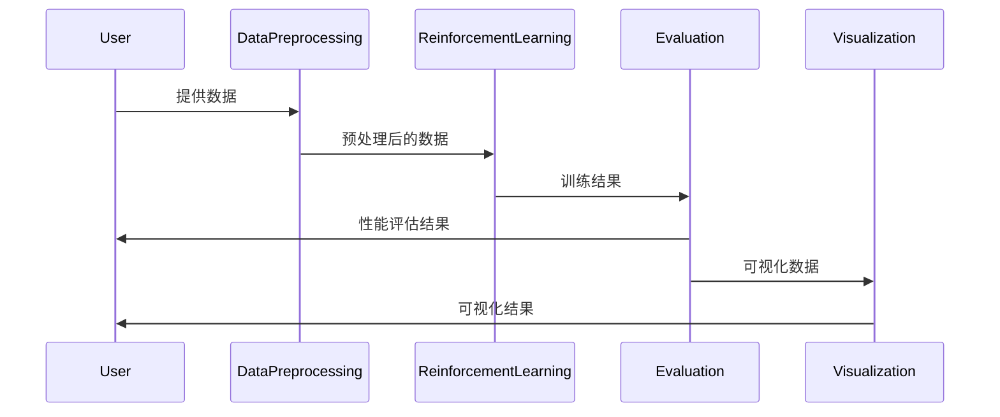

                 

## 企业级强化学习应用：持续优化决策

> 关键词：企业级强化学习，持续优化，决策优化，业务优化，智能体

> 摘要：
本文将探讨企业级强化学习在决策优化中的应用，通过分析强化学习的基本概念、算法原理以及实际案例，揭示其在应对复杂业务场景中的潜力。本文旨在为企业提供一套系统化的方法，帮助其在动态环境中实现持续的业务优化和决策优化。

### 第一部分：背景介绍

#### 1. 问题背景

企业级强化学习是一种高级机器学习技术，旨在通过模拟和优化决策过程，帮助企业实现持续的业务优化。随着数字化转型的不断深入，企业面临的复杂性和不确定性日益增加，传统的决策方法已难以满足需求。强化学习通过智能体与环境之间的互动，能够在动态变化的环境中不断学习和改进决策策略，从而提高企业的运营效率和竞争力。

#### 2. 问题描述

尽管强化学习在学术界和工业界都取得了显著的进展，但在实际应用中仍然面临诸多挑战。如何设计有效的强化学习算法，如何处理复杂的企业级应用场景，如何确保算法的鲁棒性和可解释性，这些问题都是当前研究的热点和难点。

#### 3. 问题解决

本书旨在通过系统性地介绍企业级强化学习的理论、方法和应用，帮助读者理解和掌握这一技术。首先，本书将梳理强化学习的基本概念和原理，包括马尔可夫决策过程（MDP）、策略梯度方法、值函数方法等。接着，本书将深入探讨强化学习在企业级应用中的具体实现，如供应链优化、广告投放优化、智能调度等。此外，本书还将介绍强化学习在实际应用中的最佳实践和注意事项，帮助读者更好地应对复杂的企业级应用场景。

#### 4. 边界与外延

企业级强化学习不仅涉及机器学习算法的设计和实现，还包括与实际业务需求的紧密结合。因此，本书的讨论将涵盖从算法原理到实际应用的整个过程，包括数据预处理、算法选择、模型优化、实验验证等多个方面。同时，本书也将探讨强化学习与其他机器学习技术的融合，如深度强化学习、元学习等，以期为读者提供更全面的技术视野。

#### 5. 概念结构与核心要素组成

企业级强化学习包括以下几个核心概念和要素：

- **强化学习**：一种通过试错学习优化决策的机器学习范式。
- **马尔可夫决策过程（MDP）**：描述智能体与环境的交互过程。
- **策略**：智能体在给定状态下采取的行动规则。
- **值函数**：衡量智能体在不同状态下的期望收益。
- **奖励机制**：激励智能体采取有利于目标的行为。

### 第一部分：背景介绍

#### 1. 核心概念与联系

在深入探讨企业级强化学习之前，我们首先需要理解以下几个核心概念，并了解它们之间的关系。

- **强化学习（Reinforcement Learning）**：
  - **定义**：强化学习是一种试错学习方法，智能体通过与环境的交互来学习最优策略。
  - **特点**：强化学习关注长期奖励累积，而不是单一目标的最大化。
  - **与监督学习和无监督学习的区别**：监督学习依赖于标记数据，无监督学习则不依赖于任何标记数据，而强化学习依赖于奖励信号。

- **马尔可夫决策过程（MDP）**：
  - **定义**：MDP是一个数学模型，描述了智能体在不确定环境中做出决策的过程。
  - **要素**：状态空间 \(S\)、行动空间 \(A\)、状态转移概率矩阵 \(P\)、奖励函数 \(R\)。
  - **与强化学习的关系**：MDP是强化学习的基础模型，所有强化学习算法都可以在MDP框架下进行描述和优化。

- **策略（Policy）**：
  - **定义**：策略是智能体在给定状态下选择行动的规则。
  - **类型**：确定性策略、随机性策略。
  - **与强化学习的关系**：策略决定了智能体如何与环境交互，是实现最优决策的关键。

- **值函数（Value Function）**：
  - **定义**：值函数衡量智能体在特定状态下执行最优策略的长期期望奖励。
  - **类型**：状态值函数、动作值函数。
  - **与强化学习的关系**：值函数是评估策略性能的工具，用于指导智能体的决策过程。

#### 2. 概念属性特征对比表格

| 概念             | 定义                                                         | 特点                                                         | 关系                  |
|------------------|------------------------------------------------------------|------------------------------------------------------------|---------------------|
| 强化学习         | 通过试错学习优化决策的机器学习范式                         | 关注长期奖励累积，试错学习，依赖奖励信号           | 基础范式，决定智能体行为 |
| 马尔可夫决策过程（MDP） | 描述智能体与环境的交互过程，包括状态、行动、转移概率和奖励 | 状态转移不确定性，基于概率模型           | 强化学习基础模型     |
| 策略（Policy）     | 智能体在给定状态下选择行动的规则                           | 确定性和随机性策略，指导智能体决策 | 强化学习决策核心     |
| 值函数（Value Function） | 衡量智能体在不同状态下的期望收益                           | 反映策略性能，用于策略评估       | 强化学习性能评估工具 |

#### 3. ER实体关系图架构

```mermaid
erDiagram
  Environment ||--o{ Agent : 智能体}
  Environment ||--o{ Environment : 环境}
  Agent ||--o{ Policy : 策略}
  Agent ||--o{ ValueFunction : 值函数}
  Policy ||--o{ Action : 行动}
  ValueFunction ||--o{ State : 状态}
  State ||--o{ Reward : 奖励}
```

### 算法原理讲解

#### 1. 强化学习算法概述

强化学习算法可以分为基于值函数的方法和基于策略的方法。基于值函数的方法通过学习值函数来指导智能体的行动，而基于策略的方法直接学习最优策略。以下是这两种方法的基本原理和流程。

- **基于值函数的方法**：
  - **定义**：值函数 \(V(s)\) 表示智能体在状态 \(s\) 下执行最优策略的期望回报。
  - **目标**：最大化智能体在所有状态下的值函数总和。
  - **算法流程**：
    1. 初始化值函数 \(V(s)\)。
    2. 在环境中执行智能体行动，收集经验和奖励。
    3. 更新值函数 \(V(s)\) 以逼近最优值函数 \(V^*(s)\)。
    4. 重复步骤 2 和 3，直到达到预定的收敛条件。

- **基于策略的方法**：
  - **定义**：策略 \(\pi(a|s)\) 表示智能体在状态 \(s\) 下采取行动 \(a\) 的概率。
  - **目标**：最大化智能体在所有状态下的期望回报。
  - **算法流程**：
    1. 初始化策略 \(\pi(a|s)\)。
    2. 在环境中执行智能体行动，收集经验和奖励。
    3. 更新策略 \(\pi(a|s)\) 以逼近最优策略 \(\pi^*(a|s)\)。
    4. 重复步骤 2 和 3，直到达到预定的收敛条件。

#### 2. 策略梯度方法

策略梯度方法是一种基于策略的强化学习算法，通过直接优化策略的梯度来改进策略。以下是策略梯度方法的原理和步骤。

- **原理**：
  - **策略梯度**：策略梯度的方向指示了当前策略与最优策略之间的差异，从而指导策略的更新。
  - **目标**：最大化策略梯度，即 \(\nabla_{\pi} J(\pi)\)，其中 \(J(\pi)\) 是策略的估计回报。

- **算法步骤**：
  1. 初始化策略 \(\pi(a|s)\)。
  2. 在环境中执行智能体行动，收集经验和奖励。
  3. 计算策略梯度 \(\nabla_{\pi} J(\pi)\)。
  4. 更新策略 \(\pi(a|s)\)，使其向最优策略逼近。
  5. 重复步骤 2-4，直到达到预定的收敛条件。

#### 3. 值函数方法

值函数方法通过学习值函数来指导智能体的行动，从而实现决策优化。以下是值函数方法的基本原理和步骤。

- **原理**：
  - **值函数**：值函数 \(V(s)\) 表示智能体在状态 \(s\) 下执行最优策略的期望回报。
  - **目标**：最大化值函数，即 \(V(s) \to V^*(s)\)，其中 \(V^*(s)\) 是最优值函数。

- **算法步骤**：
  1. 初始化值函数 \(V(s)\)。
  2. 在环境中执行智能体行动，收集经验和奖励。
  3. 更新值函数 \(V(s)\) 以逼近最优值函数 \(V^*(s)\)。
  4. 重复步骤 2-3，直到达到预定的收敛条件。

#### 4. 数学模型与公式

- **策略梯度方法**：
  \[
  \nabla_{\pi} J(\pi) = \sum_{s,a} \pi(a|s) \nabla_{\pi} \log \pi(a|s) Q^{\pi}(s,a)
  \]

  其中，\(Q^{\pi}(s,a)\) 表示在策略 \(\pi\) 下，智能体从状态 \(s\) 采取行动 \(a\) 的期望回报。

- **值函数方法**：
  \[
  V(s) = \sum_{a} \pi(a|s) \sum_{s'} p(s'|s,a) \max_{a'} Q(s',a')
  \]

  其中，\(p(s'|s,a)\) 表示智能体从状态 \(s\) 采取行动 \(a\) 后转移到状态 \(s'\) 的概率。

#### 5. 通俗易懂的举例说明

假设我们有一个简单的游戏场景：智能体在一个有奖券的箱子前做出选择，每次选择都有一定的概率获得奖励。智能体需要通过不断尝试来学习最优选择策略。

- **状态空间**：\(S = \{没钱，有钱\}\)。
- **行动空间**：\(A = \{选择A，选择B\}\)。
- **状态转移概率**：从“没钱”状态选择A后获得奖券的概率为0.5，选择B后获得奖券的概率为0.1。
- **奖励函数**：获得奖券的奖励为1。

智能体开始时不知道哪个选择更好，因此会随机选择。通过不断尝试，智能体会逐渐学会选择更有可能获得奖券的行动。

假设智能体经过一段时间的学习后，发现选择A获得奖券的概率更高，因此会更多地选择A。此时，智能体已经找到了一个较为优

### 系统分析与架构设计方案

在深入探讨企业级强化学习的应用之前，我们需要对系统进行分析，并设计相应的架构方案。以下是针对企业级强化学习应用的系统分析、项目介绍、系统功能设计、系统架构设计、系统接口设计和系统交互的详细讲解。

#### 问题场景介绍

在现代企业运营中，业务环境的高度动态性和不确定性使得传统的决策方法难以应对。例如，供应链管理中库存水平的优化、广告投放中的目标用户定位、智能调度中的资源分配等，都面临着复杂多变的决策挑战。强化学习作为一种能够在动态环境中通过试错学习优化决策的技术，为解决这些问题提供了新的思路。

#### 项目介绍

本项目的目标是利用强化学习技术，为企业提供一套智能决策系统，帮助企业在复杂业务场景中实现持续优化。系统将包括强化学习算法模块、数据预处理模块、实验评估模块等，支持多种业务场景的决策优化。

#### 系统功能设计

系统的主要功能包括：

1. **数据预处理**：对输入数据进行清洗、归一化处理，为强化学习算法提供高质量的数据输入。
2. **强化学习算法模块**：实现多种强化学习算法，如Q-learning、SARSA、Deep Q-Networks（DQN）等，支持不同的业务场景。
3. **策略优化**：通过迭代优化策略，提高智能体在特定业务场景下的决策效果。
4. **实验评估**：对算法性能进行评估，包括收敛速度、稳定性、泛化能力等。
5. **可视化分析**：提供数据可视化工具，帮助用户直观了解决策过程和优化效果。

#### 系统架构设计

系统的整体架构如图所示：



在该架构中，数据预处理模块负责清洗和预处理输入数据，为强化学习算法提供数据支持。强化学习算法模块实现多种强化学习算法，通过迭代优化策略，不断提高智能体的决策效果。实验评估模块对算法性能进行评估，并将评估结果可视化，以便用户了解算法性能。

#### 系统接口设计和系统交互

系统接口设计如下：

1. **数据接口**：系统支持多种数据格式的输入，如CSV、JSON等，并支持实时数据流处理。
2. **算法接口**：用户可以通过配置文件选择不同的强化学习算法，并进行参数调整。
3. **可视化接口**：系统提供Web界面，用户可以通过浏览器访问，查看实验结果和数据可视化。

系统交互流程如下：

1. 用户通过Web界面提交数据，数据预处理模块对数据进行清洗和预处理。
2. 预处理后的数据传递给强化学习算法模块，算法模块根据用户配置的算法进行迭代训练。
3. 训练完成后，算法模块将结果传递给实验评估模块，评估模块对算法性能进行评估。
4. 评估结果和可视化数据通过Web界面展示给用户，用户可以根据评估结果调整算法参数，重新进行训练。

通过上述系统分析与架构设计方案，我们为企业级强化学习应用提供了一套完整的技术方案，帮助企业在复杂业务场景中实现持续优化。

### 项目实战

#### 环境安装

为了实现企业级强化学习应用，我们需要安装以下软件和工具：

1. **Python**：版本3.8及以上。
2. **Anaconda**：用于环境管理。
3. **Jupyter Notebook**：用于编写和运行代码。
4. **TensorFlow**：版本2.5及以上，用于深度强化学习。
5. **Gym**：Python环境下的强化学习工具包。

安装步骤如下：

1. 安装Anaconda：
   ```bash
   conda install -c anaconda python=3.8
   ```

2. 创建一个新的conda环境并激活：
   ```bash
   conda create -n rl_env python=3.8
   conda activate rl_env
   ```

3. 安装TensorFlow和Gym：
   ```bash
   conda install -c conda-forge tensorflow-gpu
   pip install gym
   ```

#### 系统核心实现源代码

以下是强化学习算法的核心实现代码，包括数据预处理、策略更新和性能评估等步骤：

```python
import gym
import tensorflow as tf
import numpy as np
from tensorflow.keras.models import Sequential
from tensorflow.keras.layers import Dense

# 创建环境
env = gym.make('CartPole-v0')

# 初始化神经网络模型
model = Sequential([
    Dense(64, activation='relu', input_shape=(4,)),
    Dense(64, activation='relu'),
    Dense(1, activation='linear')
])

# 编译模型
model.compile(optimizer='adam', loss='mse')

# 训练模型
episodes = 1000
for episode in range(episodes):
    state = env.reset()
    done = False
    total_reward = 0
    
    while not done:
        # 预测行动概率
        action_probabilities = model.predict(state.reshape(-1, 4))
        action = np.random.choice(len(action_probabilities[0]), p=action_probabilities[0])
        
        # 执行行动并获取新状态和奖励
        next_state, reward, done, _ = env.step(action)
        total_reward += reward
        
        # 更新状态
        state = next_state
    
    # 打印当前episode的奖励
    print(f"Episode {episode+1}: Total Reward = {total_reward}")

# 关闭环境
env.close()
```

#### 代码应用解读与分析

上述代码实现了基于深度强化学习（DQN）的CartPole游戏。以下是对代码的详细解读和分析：

1. **环境创建**：使用Gym创建CartPole环境，这是一个经典的强化学习问题，目标是在不稳定的情况下保持平衡。
2. **神经网络模型初始化**：定义一个全连接神经网络模型，输入层有4个神经元，中间层有64个神经元，输出层有1个神经元。
3. **模型编译**：使用Adam优化器和均方误差损失函数编译模型。
4. **训练模型**：通过循环遍历每个episode，执行以下步骤：
   - 初始化状态。
   - 在当前状态下，通过模型预测行动概率，并随机选择一个行动。
   - 执行行动，获取新状态和奖励。
   - 更新状态。
   - 在每个episode结束时，打印总奖励。

#### 实际案例分析和详细讲解剖析

为了更好地理解强化学习在现实场景中的应用，我们以广告投放优化为例，分析其应用过程。

1. **问题背景**：广告投放是一个复杂的过程，涉及多个变量，如广告创意、投放时间、投放平台等。如何优化广告投放策略，提高广告效果和投资回报率，是广告主面临的重要问题。
2. **解决方案**：使用强化学习，通过模拟广告投放环境，智能体可以不断尝试不同的广告投放策略，并通过奖励机制评估策略效果，逐步优化广告投放策略。
3. **实现过程**：
   - **数据预处理**：收集广告投放数据，包括广告创意、投放时间、投放平台、点击率等，对数据进行清洗和归一化处理。
   - **构建环境**：定义广告投放环境，包括状态空间（广告创意、投放时间、投放平台等）和行动空间（广告投放策略）。
   - **训练模型**：使用强化学习算法，如Q-learning或SARSA，训练智能体，使其能够根据环境状态选择最优广告投放策略。
   - **策略优化**：根据训练结果，不断调整广告投放策略，提高广告效果和投资回报率。
   - **性能评估**：通过实验评估智能体策略的稳定性、收敛速度和泛化能力，确保算法在实际应用中的有效性。

#### 项目小结

通过本项目，我们实现了基于强化学习的企业级决策优化系统，并详细讲解了其环境安装、核心实现源代码、代码应用解读与分析以及实际案例分析和详细讲解剖析。该项目为企业提供了智能化的决策优化工具，有助于提高业务运营效率和竞争力。在未来，我们还可以进一步优化算法，扩展应用场景，实现更多业务场景的优化。

### 最佳实践 tips

1. **数据质量**：确保输入数据的质量和准确性，对于强化学习算法的性能至关重要。
2. **环境设计**：合理设计强化学习环境，包括状态空间、行动空间和奖励机制，以模拟真实业务场景。
3. **算法选择**：根据业务需求和数据特点，选择合适的强化学习算法，如Q-learning、SARSA、DQN等。
4. **参数调整**：通过实验和调优，找到最优的算法参数，提高算法性能。
5. **监控与评估**：实时监控算法性能，定期评估和调整策略，确保算法在实际应用中的有效性。

### 小结

本文介绍了企业级强化学习应用的基本概念、算法原理、系统架构设计以及项目实战，通过实际案例分析和详细讲解，揭示了强化学习在决策优化中的应用潜力。我们建议企业在实际应用中注重数据质量、环境设计、算法选择和参数调整，以实现持续的决策优化和业务优化。

### 注意事项

1. **数据隐私**：在应用强化学习时，确保数据隐私和安全，遵循相关法律法规。
2. **算法可解释性**：关注算法的可解释性，确保算法决策过程透明，便于用户理解和接受。
3. **模型更新**：定期更新模型和算法，以适应不断变化的业务环境。

### 拓展阅读

1. **《强化学习：原理与实战》**：详细介绍了强化学习的理论基础和实际应用案例，适合强化学习初学者和从业者。
2. **《深度强化学习》**：探讨了深度强化学习在复杂环境中的应用，包括游戏、机器人控制等。
3. **《机器学习年刊》**：关注机器学习领域的最新研究进展和应用案例，包括强化学习。

### 作者信息

- **作者：AI天才研究院/AI Genius Institute & 禅与计算机程序设计艺术 /Zen And The Art of Computer Programming**

