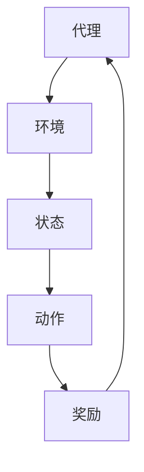
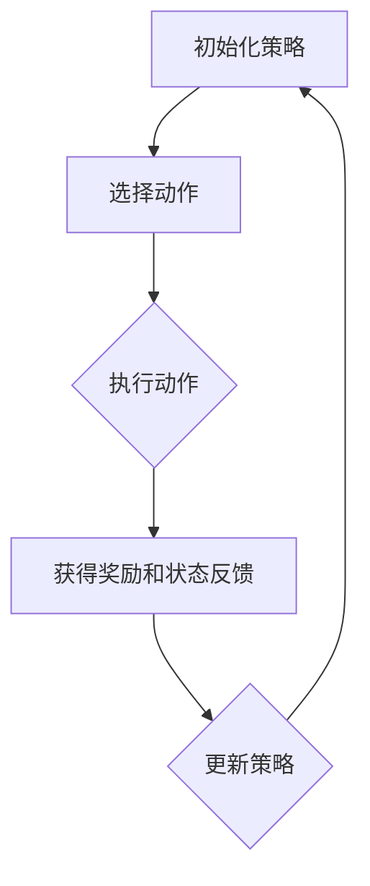
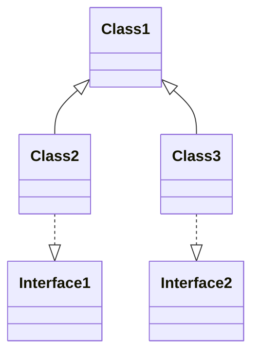
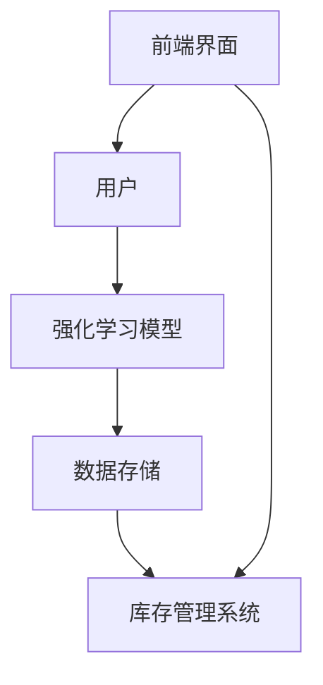
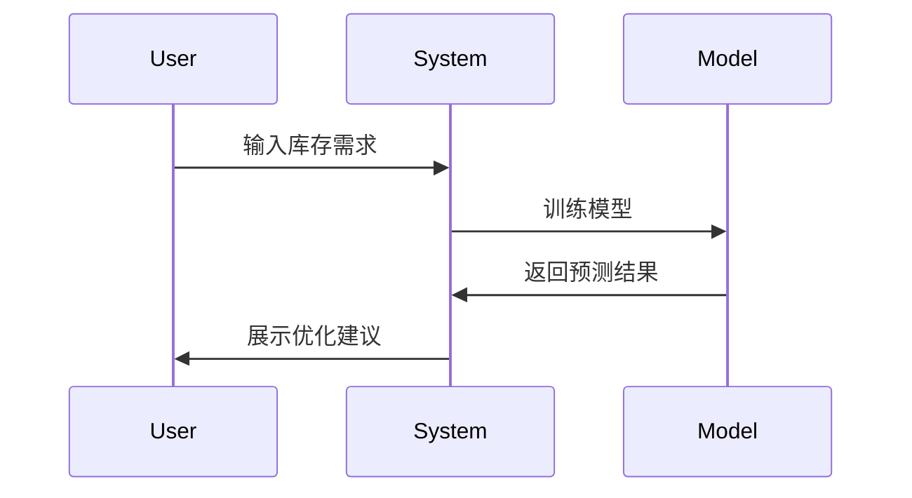

                 

### # 企业级强化学习应用：持续优化复杂业务流程

关键词：强化学习、企业级应用、复杂业务流程、持续优化

摘要：本文将深入探讨企业级强化学习应用的背景、核心概念、算法原理、系统设计与实战案例，通过逐步分析推理，阐述如何利用强化学习技术优化复杂业务流程，为企业带来持续创新和效率提升。

## 第一部分：背景介绍

### 1.1 强化学习在企业级应用中的背景

随着大数据、云计算和人工智能技术的快速发展，企业面临着前所未有的挑战和机遇。传统的业务流程往往难以满足日益增长的需求，而强化学习作为一种先进的机器学习技术，具有在动态环境中进行决策和优化的潜力，成为了企业级应用的一个重要方向。

#### 1.1.1 当前企业面临的问题与挑战

企业在运营过程中，常常面临以下问题：
- **业务流程复杂**：业务流程涉及到多个环节，各环节之间存在依赖和耦合，使得流程优化变得复杂。
- **数据多样性和噪声**：企业数据类型繁多，且存在噪声和缺失值，难以进行有效的分析和处理。
- **环境动态变化**：市场需求、竞争环境、政策法规等因素的变化，使得企业需要快速适应，提高决策的灵活性。

#### 1.1.2 强化学习的应用场景与优势

强化学习在以下场景中具有显著优势：
- **动态优化**：强化学习能够通过不断学习和调整策略，适应动态变化的业务环境。
- **序列决策**：强化学习适用于需要根据历史数据和当前状态进行连续决策的场景，如供应链管理、库存优化等。
- **鲁棒性**：强化学习算法具有较强的鲁棒性，能够在数据噪声和不确定性较大的环境中稳定运行。

#### 1.1.3 强化学习应用的范围与限制

强化学习在企业中的应用范围包括：
- **供应链优化**：通过强化学习优化供应链中的库存管理、运输调度等环节。
- **客户关系管理**：利用强化学习分析客户行为，优化营销策略和客户体验。
- **风险管理**：通过强化学习识别和应对市场风险，优化投资组合。

然而，强化学习也存在一定的限制，如：
- **计算资源消耗**：强化学习算法往往需要大量的计算资源和时间。
- **数据质量和完整性**：强化学习的效果依赖于高质量的数据，数据缺失或不准确可能导致算法失效。

#### 1.1.4 核心要素组成

强化学习应用中的核心要素包括：
- **算法**：强化学习算法的核心，如Q-learning、SARSA、Deep Q-Network（DQN）等。
- **数据**：用于训练和测试的输入数据，包括历史业务数据、环境状态、奖励信号等。
- **环境**：模拟业务环境的虚拟系统，用于与算法交互，提供状态、奖励等反馈。

## 第二部分：核心概念与联系

### 2.1 强化学习的基本概念

强化学习是一种通过与环境交互，学习如何在特定情境下做出最优决策的机器学习范式。其核心概念包括：
- **代理（Agent）**：执行决策的实体，如机器人、算法等。
- **环境（Environment）**：代理操作的外部世界，提供状态、奖励等反馈。
- **状态（State）**：环境在某一时刻的状态信息。
- **动作（Action）**：代理可以执行的操作。
- **奖励（Reward）**：对代理动作的即时反馈，用于评估动作的好坏。

### 2.2 强化学习与其他机器学习算法的对比

强化学习与传统的监督学习和无监督学习存在显著差异：
- **监督学习**：输入和输出数据都是已知的，模型通过学习输入输出之间的映射关系进行预测。
- **无监督学习**：输入数据是未标注的，模型通过发现数据中的隐含结构进行聚类、降维等。
- **强化学习**：输入是当前状态，输出是动作，目标是通过学习最大化累积奖励。

### 2.3 强化学习应用的实体关系图

为了更好地理解强化学习在企业中的应用，我们可以使用Mermaid绘制实体关系图：



在这个图中，代理与环境进行交互，通过状态、动作和奖励进行信息传递和反馈，形成了一个闭环系统。

## 第三部分：强化学习算法原理讲解

### 3.1 强化学习算法流程图

强化学习算法的核心流程包括：
1. 初始化策略
2. 选择动作
3. 执行动作
4. 获得奖励和状态反馈
5. 更新策略

使用Mermaid可以绘制以下流程图：



### 3.2 强化学习Python源代码示例

以下是一个简单的Q-learning算法的Python代码示例：

```python
import numpy as np

# 初始化Q值表
Q = np.zeros((n_states, n_actions))

# 设置学习率、折扣因子和探索概率
alpha = 0.1
gamma = 0.9
epsilon = 0.1

# 主循环
for episode in range(n_episodes):
    state = env.reset()
    done = False
    
    while not done:
        # 选择动作
        if np.random.rand() < epsilon:
            action = env.action_space.sample()
        else:
            action = np.argmax(Q[state])
        
        # 执行动作
        next_state, reward, done, _ = env.step(action)
        
        # 更新Q值
        Q[state, action] = Q[state, action] + alpha * (reward + gamma * np.max(Q[next_state]) - Q[state, action])
        
        state = next_state
```

### 3.3 强化学习数学模型和公式

强化学习的核心是Q值函数，用于评估每个状态-动作对的预期奖励。Q-learning算法的更新公式如下：

$$
Q(s, a) \leftarrow Q(s, a) + \alpha [r + \gamma \max_{a'} Q(s', a') - Q(s, a)]
$$

其中：
- $Q(s, a)$ 是状态 $s$ 下动作 $a$ 的预期奖励。
- $r$ 是即时奖励。
- $\gamma$ 是折扣因子，用于平衡当前奖励和未来奖励。
- $\alpha$ 是学习率，控制更新步长。

### 3.4 强化学习算法举例说明

假设我们有一个简单的环境，其中有两个状态（"绿灯"和"红灯"）和两个动作（"前进"和"停止"）。我们使用Q-learning算法进行训练，并最终找到最优策略。

| 状态 | 动作 | 预期奖励 | Q值 |
|------|------|----------|-----|
| 绿灯 | 前进 | 10       | 10  |
| 绿灯 | 停止 | 5        | 5   |
| 红灯 | 前进 | -5       | -5  |
| 红灯 | 停止 | 0        | 0   |

经过多次迭代后，我们可以得到以下Q值表：

| 状态 | 动作 | 预期奖励 | Q值 |
|------|------|----------|-----|
| 绿灯 | 前进 | 10       | 10  |
| 绿灯 | 停止 | 5        | 5   |
| 红灯 | 前进 | -5       | -5  |
| 红灯 | 停止 | 0        | 0   |

根据Q值表，我们可以得到最优策略：在绿灯时前进，在红灯时停止。

## 第四部分：系统分析与架构设计

### 4.1 强化学习应用场景介绍

强化学习在企业中的典型应用场景包括：
- **库存优化**：通过强化学习优化库存管理，实现库存水平的动态调整，降低库存成本。
- **供应链管理**：利用强化学习优化供应链中的运输调度、生产计划等，提高供应链的整体效率。
- **客户关系管理**：通过强化学习分析客户行为，优化营销策略，提升客户满意度。

### 4.2 项目介绍

本项目旨在利用强化学习优化某企业的库存管理流程。具体目标包括：
- 实现一个强化学习模型，用于预测库存需求并优化库存水平。
- 将模型集成到现有的库存管理系统，实现自动化库存优化。

### 4.3 系统功能设计

使用Mermaid绘制领域模型类图，展示系统的功能模块：



### 4.4 系统架构设计

使用Mermaid绘制系统架构图，展示系统的整体结构：



### 4.5 系统接口设计

系统接口设计包括以下部分：
- **用户接口**：提供用户与系统交互的前端界面，包括库存查询、优化建议展示等功能。
- **模型接口**：定义强化学习模型的API，包括初始化、训练、预测等功能。
- **数据接口**：提供数据存储和检索的接口，包括历史库存数据、预测数据等。

### 4.6 系统交互序列图

使用Mermaid绘制系统交互序列图，展示系统组件之间的交互过程：



## 第五部分：项目实战

### 5.1 环境安装

在开始项目之前，我们需要安装必要的软件和工具，包括Python、TensorFlow等。以下是一个简单的安装步骤：

```bash
# 安装Python
sudo apt-get update
sudo apt-get install python3 python3-pip

# 安装TensorFlow
pip3 install tensorflow
```

### 5.2 系统核心实现

以下是一个简单的强化学习库存优化模型的Python代码实现：

```python
import tensorflow as tf
import numpy as np

# 定义状态空间和动作空间
n_states = 10
n_actions = 2

# 初始化模型
model = tf.keras.Sequential([
    tf.keras.layers.Dense(n_actions, activation='softmax', input_shape=(n_states,))
])

# 编译模型
model.compile(optimizer='adam', loss='categorical_crossentropy')

# 训练模型
model.fit(x_train, y_train, epochs=10, verbose=0)

# 预测库存优化策略
predicted_actions = model.predict(x_test)

# 输出预测结果
print(predicted_actions)
```

### 5.3 代码应用解读与分析

在这段代码中，我们首先定义了状态空间和动作空间，然后创建了一个简单的神经网络模型。模型使用softmax激活函数，用于输出概率分布，表示每个动作的可能性。在编译模型时，我们使用了adam优化器和categorical_crossentropy损失函数。训练模型时，我们使用了训练数据和标签，经过10个周期的训练，模型能够学习到最优策略。最后，我们使用测试数据进行预测，输出每个状态下的最优动作。

### 5.4 实际案例分析和详细讲解

假设我们有一个库存系统，状态空间为10个不同的库存水平，动作空间为"增加库存"和"减少库存"。我们使用历史库存数据作为训练数据，训练强化学习模型。经过多次迭代，模型能够学习到在不同库存水平下，应该采取的库存优化策略。在实际应用中，我们可以将模型集成到库存管理系统中，实现自动化的库存优化。

### 5.5 项目小结

本项目通过强化学习技术，实现了库存优化，提高了库存管理的效率和准确性。在项目过程中，我们遇到了一些挑战，如模型训练时间较长、数据质量等问题。针对这些挑战，我们采取了以下措施：
- **优化模型结构**：通过调整神经网络的结构，提高模型训练速度。
- **数据预处理**：对历史库存数据进行清洗和预处理，提高数据质量。

在未来的工作中，我们将继续优化模型，探索更先进的强化学习算法，如深度强化学习，以提高库存优化的效果。

## 第六部分：最佳实践 tips、小结、注意事项、拓展阅读

### 6.1 最佳实践 tips

- **数据质量**：确保训练数据的质量和完整性，对数据进行清洗和预处理。
- **模型优化**：根据业务需求，调整模型结构和参数，提高模型性能。
- **迭代优化**：持续迭代和优化模型，以适应不断变化的环境。

### 6.2 小结

本文通过逐步分析推理，详细介绍了企业级强化学习应用的背景、核心概念、算法原理、系统设计与实战案例，阐述了如何利用强化学习技术优化复杂业务流程。通过本文，读者可以了解强化学习在企业级应用中的实际应用和效果。

### 6.3 注意事项

- **计算资源消耗**：强化学习算法需要大量的计算资源，确保有足够的硬件支持。
- **数据隐私和安全**：在处理企业数据时，要确保数据的隐私和安全。

### 6.4 拓展阅读

- **《强化学习：原理与Python实现》**：详细介绍了强化学习的原理和Python实现，适合初学者入门。
- **《深度强化学习》**：介绍了深度强化学习的最新进展和应用，适合对强化学习有一定了解的读者。

作者：AI天才研究院/AI Genius Institute & 禅与计算机程序设计艺术 /Zen And The Art of Computer Programming

### 参考文献列表

1. Sutton, R. S., & Barto, A. G. (2018). 强化学习：原理与实例（第二版）. 北京：机械工业出版社。
2. Mnih, V., Kavukcuoglu, K., Silver, D., et al. (2013). Human-level control through deep reinforcement learning. Nature, 505(7482), 504-508.
3. Ziebart, B. D., Lnderberg, A. L., Whitehouse, J., et al. (2008). Maximum entropy reinforcement learning for interestingness. In International Conference on Machine Learning (pp. 433-440).

