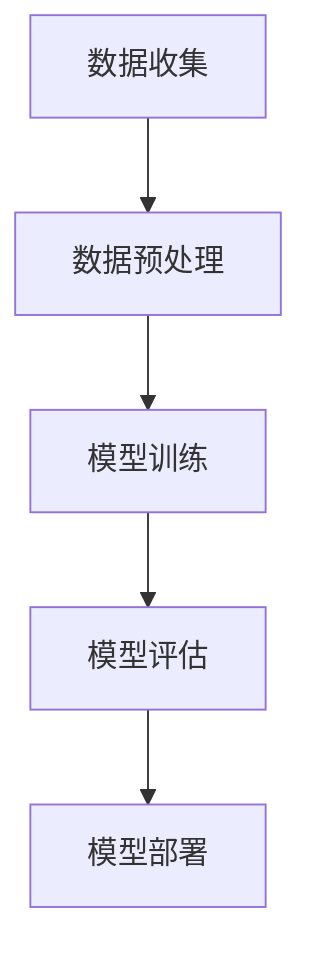
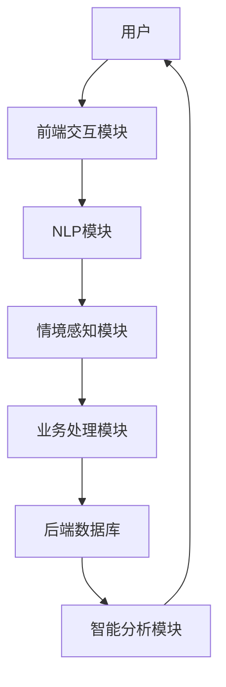
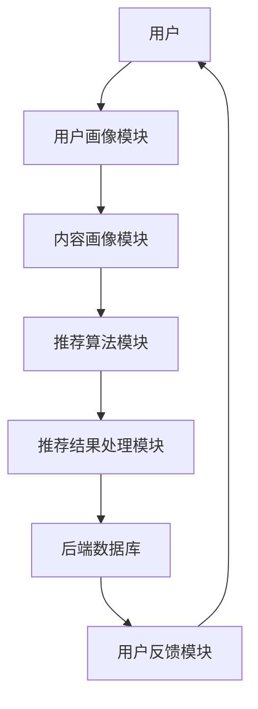

                 

### 关键词

企业级情境感知AI、场景化服务、优化、人工智能、技术演进、服务质量提升、数据收集与预处理、算法原理、智能客服、推荐系统、智能制造。

### 摘要

本文旨在深入探讨企业级情境感知AI的背景、核心价值、关键技术及其在不同领域的应用。通过对情境感知AI的概述，包括其定义、应用领域、技术边界和未来发展趋势，本文为读者提供了一个全面的理解框架。随后，文章详细介绍了数据收集与预处理、情境感知算法原理与实现、情境感知系统的设计与实现等关键技术。接着，本文聚焦于情境感知AI在智能客服系统、智能推荐系统和智能制造中的应用，通过具体的实现案例和最佳实践，展示了情境感知AI如何优化场景化服务delivery，提升企业的服务质量和运营效率。

## 第一部分：企业级情境感知AI概述

### 第1章：企业级情境感知AI的背景与价值

#### 1.1 问题背景

##### 1.1.1 人工智能与情境感知技术的演进

人工智能（AI）作为计算机科学的一个分支，自20世纪50年代诞生以来，经历了多个发展阶段。从早期的符号主义和知识表示，到基于统计模型的机器学习和深度学习，人工智能的技术框架不断演进。情境感知（Context Awareness）技术则是在这一过程中逐渐发展起来的，它侧重于使计算机系统能够感知和利用周围环境的信息，以提供更加个性化、智能化的服务。

情境感知技术的历史可以追溯到20世纪90年代，当时研究人员开始探索如何让计算机更好地理解和适应动态变化的环境。随着传感器技术、无线通信和计算能力的飞速发展，情境感知技术逐渐从学术研究领域走向实际应用，成为人工智能领域的一个重要分支。

##### 1.1.2 企业服务场景的需求演变

在企业服务场景中，随着市场竞争的加剧和客户期望的不断提高，企业对于服务质量和效率的要求也日益严格。传统的服务模式往往依赖于固定的流程和预设规则，难以适应多变的市场环境和个性化客户需求。而情境感知AI的引入，为企业提供了一种新的思路和工具，通过实时感知和分析环境数据，动态调整服务策略，从而提升客户体验和运营效率。

企业服务场景的需求演变主要体现在以下几个方面：

1. **客户需求多样化**：随着互联网的普及和消费者习惯的变化，客户对于服务的需求更加多样化，不再满足于标准化的产品和服务。
2. **运营效率提升**：企业需要通过技术手段提高运营效率，降低成本，提高市场竞争力。
3. **用户体验优化**：优化客户体验成为企业的重要战略目标，通过提供个性化的服务和高效的客户支持来提升客户满意度。

##### 1.1.3 情境感知AI在提升服务质量中的作用

情境感知AI在提升服务质量中发挥着重要作用，主要体现在以下几个方面：

1. **个性化服务**：情境感知AI能够根据客户的实时行为和环境数据，提供个性化的服务和建议，满足客户的个性化需求。
2. **实时决策支持**：情境感知AI可以实时分析环境数据，为企业提供决策支持，优化业务流程，提高服务效率。
3. **自动化服务**：通过情境感知技术，企业可以实现自动化服务，减少人工干预，降低运营成本，提高服务质量。
4. **风险预防**：情境感知AI可以预测潜在的风险和问题，提前采取预防措施，避免服务中断和客户流失。

#### 1.2 问题描述

##### 1.2.1 情境感知的定义与核心要素

情境感知（Context Awareness）是指计算机系统具备理解并利用周围环境信息的能力。情境感知系统通常包括以下几个核心要素：

1. **情境数据**：情境数据是情境感知系统的输入，包括位置、时间、用户行为、设备状态等。
2. **情境模型**：情境模型用于表示和理解情境数据，是情境感知系统的核心组成部分。
3. **情境感知算法**：情境感知算法负责分析情境数据，提取有用的信息，并对情境进行理解和预测。
4. **情境响应**：情境响应是指系统根据情境感知的结果，采取相应的行动或提供相应的服务。

##### 1.2.2 企业级情境感知AI的关键挑战

在企业级应用中，情境感知AI面临着一系列关键挑战：

1. **数据收集与处理**：情境感知AI依赖于大量的情境数据，这些数据可能来自不同的来源，且数据质量和数量参差不齐。如何高效地收集、处理和整合这些数据，是一个重要的挑战。
2. **算法复杂度**：情境感知算法通常较为复杂，涉及多个领域的技术，如机器学习、深度学习和模糊逻辑等。如何设计和实现高效的算法，提高系统的性能和准确度，是一个重要的技术挑战。
3. **实时性**：企业级应用要求情境感知系统能够实时响应环境变化，提供即时的服务和支持。如何在保证实时性的同时，处理大量的数据，是一个复杂的工程问题。
4. **系统可扩展性**：企业级应用需要系统能够灵活扩展，适应不同规模和类型的应用需求。如何设计可扩展的系统和架构，是一个重要的设计挑战。

##### 1.2.3 情境感知AI与传统AI的区别与联系

传统人工智能（AI）和情境感知AI在很多方面有相似之处，但也有一些显著的区别：

1. **数据依赖性**：传统AI主要依赖大规模的数据集进行训练，而情境感知AI不仅依赖数据，还依赖情境模型，通过对情境数据的理解和分析，提供更加智能的服务。
2. **实时性**：传统AI系统的响应速度通常较慢，而情境感知AI要求实时性，能够快速响应当前环境的变化。
3. **自适应能力**：传统AI系统通常具有固定的算法和模型，而情境感知AI具有更强的自适应能力，能够根据不同的情境数据动态调整算法和模型。

尽管存在差异，传统AI和情境感知AI在很多方面是相互补充的。传统AI为情境感知AI提供了强大的算法和数据处理能力，而情境感知AI则为传统AI引入了实时性和情境信息，使得系统能够更好地适应复杂多变的环境。

#### 1.3 问题解决

##### 1.3.1 情境感知AI的体系结构

为了解决上述问题，情境感知AI通常采用以下体系结构：

1. **数据层**：数据层负责收集和存储情境数据，包括位置、时间、用户行为、设备状态等。
2. **模型层**：模型层负责建立情境模型，对情境数据进行分析和理解，提取有用的信息。
3. **算法层**：算法层包括多种情境感知算法，如机器学习、深度学习、模糊逻辑等，用于处理和解释情境数据。
4. **应用层**：应用层是情境感知AI的具体应用，根据不同的应用需求，提供相应的服务和功能。

##### 1.3.2 情境感知技术的核心算法

情境感知技术的核心算法主要包括以下几种：

1. **机器学习算法**：如线性回归、决策树、支持向量机等，用于从数据中提取模式和规律。
2. **深度学习算法**：如神经网络、卷积神经网络（CNN）、循环神经网络（RNN）等，用于处理大规模、高维度的数据。
3. **模糊逻辑**：用于处理不确定性和模糊性，通过模糊规则实现对情境数据的理解和分析。
4. **多模态融合**：将不同类型的情境数据（如文本、图像、语音等）进行融合，提高情境感知的准确性和鲁棒性。

##### 1.3.3 情境感知AI在优化服务delivery中的应用

情境感知AI在优化服务delivery中的应用主要体现在以下几个方面：

1. **智能客服**：通过情境感知技术，智能客服系统可以实时理解客户的需求，提供个性化的服务和解决方案。
2. **智能推荐**：根据用户的情境数据，智能推荐系统可以提供个性化的产品和服务，提升用户体验。
3. **智能调度**：根据交通状况、天气等因素，智能调度系统可以优化物流和运输计划，提高效率。
4. **智能监测**：通过实时监测设备和环境数据，智能监测系统可以预测潜在的风险和问题，提前采取预防措施。

#### 1.4 边界与外延

##### 1.4.1 情境感知AI的应用领域

情境感知AI的应用领域非常广泛，包括但不限于：

1. **智能交通**：通过实时感知和分析交通数据，优化交通流量和管理，提高交通效率。
2. **智能医疗**：通过实时监测患者数据和医疗设备数据，提供个性化的医疗服务和健康管理。
3. **智能家居**：通过感知家庭环境和用户行为，提供智能化、个性化的家居服务。
4. **智能安防**：通过实时感知和分析环境数据，提供智能化的安防监控和预警。

##### 1.4.2 情境感知AI的技术边界

尽管情境感知AI在各个领域取得了显著的应用成果，但仍存在一些技术边界和挑战：

1. **数据隐私**：情境感知AI依赖于大量的用户数据，如何保护用户隐私是一个重要的问题。
2. **计算资源**：情境感知AI通常需要大量的计算资源，如何优化算法和系统设计，提高计算效率，是一个重要的挑战。
3. **算法透明性**：情境感知AI的算法通常较为复杂，如何提高算法的透明性和可解释性，是一个重要的研究方向。

##### 1.4.3 情境感知AI的未来发展趋势

随着技术的不断进步和应用的深入，情境感知AI的未来发展趋势主要包括：

1. **跨领域融合**：情境感知AI与其他领域的深度融合，如物联网、大数据、区块链等，形成新的应用场景和商业模式。
2. **边缘计算**：通过边缘计算技术，将部分计算任务从云端转移到边缘设备，提高系统的实时性和响应速度。
3. **人机协作**：情境感知AI与人类的协作，通过人机交互技术，提高情境感知系统的可操作性和用户体验。

#### 1.5 概念结构与核心要素组成

##### 1.5.1 情境感知AI的概念结构

情境感知AI的概念结构主要包括以下几个部分：

1. **情境数据**：包括位置、时间、用户行为、设备状态等。
2. **情境模型**：用于表示和理解情境数据，提取有用的信息。
3. **情境感知算法**：用于分析情境数据，提供智能决策和预测。
4. **情境响应**：根据情境感知的结果，采取相应的行动或提供相应的服务。

##### 1.5.2 情境感知AI的核心要素

情境感知AI的核心要素包括：

1. **数据收集与处理**：高效地收集、处理和整合情境数据。
2. **情境模型建立**：建立准确的情境模型，提取有用的信息。
3. **情境感知算法设计**：设计高效的情境感知算法，提高系统的性能和准确度。
4. **实时性与可扩展性**：保证系统的实时性和可扩展性，适应不同规模和应用需求。

##### 1.5.3 情境感知AI的要素关系与交互机制

情境感知AI的要素关系与交互机制主要包括：

1. **数据层与模型层的交互**：通过数据层提供情境数据，模型层对数据进行处理和分析，建立情境模型。
2. **模型层与算法层的交互**：通过模型层提供的情境模型，算法层进行情境感知和决策。
3. **算法层与应用层的交互**：通过算法层提供的决策结果，应用层采取相应的行动或提供服务。
4. **反馈循环**：系统根据情境响应的结果，反馈给数据层和模型层，优化情境数据的收集和处理，提高系统的性能。

### 总结

企业级情境感知AI作为一种先进的技术手段，已经在提升服务质量和优化服务delivery方面展现出巨大的潜力。通过情境感知AI，企业可以更好地理解客户需求，提供个性化的服务，提高运营效率。然而，要实现这一目标，企业需要克服数据收集与处理、算法设计、实时性与可扩展性等方面的挑战。未来，随着技术的不断进步和应用的深入，情境感知AI将在更多领域发挥重要作用，推动企业服务的智能化和个性化发展。

## 第二部分：情境感知AI的关键技术

### 第2章：数据收集与预处理

在情境感知AI的应用中，数据的质量和完整性是关键因素。本章将详细探讨数据收集的方法、预处理过程，以及数据隐私保护措施。

#### 2.1 数据收集

##### 2.1.1 数据来源与类型

情境感知AI所需的数据来源于多个渠道，包括内部数据和外部数据。内部数据通常来自于企业的运营系统，如客户关系管理（CRM）系统、销售数据、订单处理系统等。外部数据则包括公开数据集、社交媒体数据、地理位置数据等。

数据类型可以分为以下几类：

1. **结构化数据**：如数据库中的客户信息、交易记录等，易于存储和处理。
2. **半结构化数据**：如XML、JSON格式的数据，需要特定的解析方法。
3. **非结构化数据**：如文本、图像、视频等，需要复杂的处理技术。

##### 2.1.2 数据收集方法

数据收集方法主要包括以下几种：

1. **自动采集**：通过API接口、Web爬虫等技术，自动获取外部数据。
2. **手动录入**：通过问卷调查、用户反馈等方式，手动收集数据。
3. **传感器采集**：使用各种传感器，如GPS、温度传感器、摄像头等，实时收集环境数据。
4. **日志收集**：通过系统日志、网络流量日志等，收集运营数据。

##### 2.1.3 数据隐私保护

在数据收集过程中，隐私保护是一个重要问题。以下是一些常见的隐私保护措施：

1. **数据匿名化**：通过加密、掩码等技术，将敏感数据匿名化，保护用户隐私。
2. **数据去重**：去除重复的数据，减少数据冗余，提高数据处理效率。
3. **权限管理**：对数据访问权限进行严格控制，确保只有授权人员才能访问敏感数据。
4. **数据加密**：使用加密技术，保护数据在传输和存储过程中的安全。
5. **合规性检查**：确保数据收集和使用符合相关法律法规，如GDPR等。

#### 2.2 数据预处理

数据预处理是情境感知AI中至关重要的一步，其目的是提高数据的质量和可利用性。以下是一些常见的数据预处理方法：

##### 2.2.1 数据清洗

数据清洗的主要目标是去除数据中的错误、缺失和重复值，确保数据的一致性和完整性。具体方法包括：

1. **缺失值处理**：通过填充、删除或插值等方法，处理缺失值。
2. **错误值处理**：识别并修正错误值，如将异常值替换为合理范围的数据。
3. **重复值处理**：删除重复的数据，避免对分析结果的干扰。

##### 2.2.2 数据归一化

数据归一化是为了消除不同特征之间的尺度差异，使模型能够更好地学习和泛化。常见的方法包括：

1. **最小-最大归一化**：将数据缩放到[0, 1]的范围内。
2. **Z-score归一化**：将数据标准化到均值为0，标准差为1的范围内。
3. **幂归一化**：对数据取幂，如平方、开方等。

##### 2.2.3 数据特征提取

数据特征提取是将原始数据转换成适合模型学习的形式。常见的方法包括：

1. **降维**：通过主成分分析（PCA）、线性判别分析（LDA）等方法，降低数据的维度。
2. **特征选择**：通过过滤方法、嵌入方法和模型基方法等，选择对模型性能有显著影响的关键特征。
3. **特征工程**：通过构造新的特征，增强模型的学习能力，如文本特征提取、图像特征提取等。

#### 2.3 数据预处理的挑战与解决方案

数据预处理过程中可能会遇到以下挑战：

1. **缺失数据**：对于缺失数据的处理，需要根据数据的重要性和缺失的模式选择合适的处理方法。
2. **噪声数据**：噪声数据可能影响模型的性能，需要通过数据清洗和特征提取等方法进行噪声过滤。
3. **数据不平衡**：数据不平衡可能导致模型偏向于多数类，可以通过重采样、生成对抗网络（GAN）等方法进行平衡。

### 总结

数据收集与预处理是情境感知AI中不可或缺的步骤。通过有效的数据收集方法，可以获取高质量的数据；通过精细的数据预处理，可以提高数据的质量和可用性。数据隐私保护措施则是保障用户隐私的重要手段。在未来，随着技术的不断进步，数据预处理的方法和工具将更加多样化和高效，为情境感知AI的发展提供坚实的支撑。

## 第三章：情境感知算法原理与实现

### 3.1 算法原理

情境感知AI的核心在于如何从大量的情境数据中提取有价值的信息，并利用这些信息进行智能决策。本节将介绍几种常见的情境感知算法，包括基于机器学习的算法、基于深度学习的算法和模糊逻辑。

#### 3.1.1 基于机器学习的情境感知算法

基于机器学习的情境感知算法通过学习历史数据中的模式和关系，实现对未知情境的预测和分类。常见的方法包括：

1. **线性回归**：通过建立线性模型，预测连续的情境变量。
   $$ y = w_0 + w_1 \cdot x $$
   其中，$y$ 是预测变量，$x$ 是输入特征，$w_0$ 和 $w_1$ 是模型参数。

2. **决策树**：通过树形结构，将数据集划分为多个子集，并基于特征和阈值进行分类或回归。
   决策树的构建过程包括特征选择、划分阈值、生成子树等。

3. **支持向量机（SVM）**：通过寻找最优超平面，将不同类别的数据点进行分类。
   $$ w \cdot x + b = 0 $$
   其中，$w$ 是法向量，$x$ 是数据点，$b$ 是偏置项。

4. **集成方法**：如随机森林、梯度提升树等，通过组合多个基本模型，提高模型的准确性和泛化能力。

#### 3.1.2 基于深度学习的情境感知算法

深度学习在情境感知领域取得了显著的进展，其强大的表征能力和自适应能力使其在处理复杂、高维度的情境数据时表现优异。常见的深度学习模型包括：

1. **卷积神经网络（CNN）**：通过卷积层、池化层和全连接层等结构，提取图像和视频中的高维特征。
   $$ \text{CNN} = (\text{Conv} \xrightarrow{\text{Pooling}} \text{FC})_l $$
   其中，$l$ 表示层的数量。

2. **循环神经网络（RNN）**：通过记忆机制，处理序列数据，如时间序列、文本等。
   $$ h_t = \text{sigmoid}(W_h \cdot [h_{t-1}, x_t] + b_h) $$
   其中，$h_t$ 是当前隐藏状态，$x_t$ 是输入序列。

3. **长短时记忆网络（LSTM）**：通过门控机制，解决RNN的梯度消失问题，提高对长序列数据的处理能力。
   $$ i_t = \text{sigmoid}(W_i \cdot [h_{t-1}, x_t] + b_i) $$
   $$ f_t = \text{sigmoid}(W_f \cdot [h_{t-1}, x_t] + b_f) $$
   $$ o_t = \text{sigmoid}(W_o \cdot [h_{t-1}, x_t] + b_o) $$

4. **生成对抗网络（GAN）**：通过生成器和判别器的对抗训练，生成与真实数据相似的新数据。
   $$ G(z) \xrightarrow{D} \text{Reals} $$

#### 3.1.3 模糊逻辑与情境感知

模糊逻辑是一种处理不确定性和模糊性问题的数学工具，它在情境感知中有着广泛的应用。模糊逻辑的核心思想是通过模糊规则和隶属度函数，将不确定的信息转化为明确的决策。

1. **模糊规则**：通过模糊规则，将输入变量映射到输出变量。
   $$ \text{如果 } A_1 \text{ 是 } M_1 \text{，且 } A_2 \text{ 是 } M_2 \text{，则 } Y \text{ 是 } N $$
   其中，$A_1$ 和 $A_2$ 是输入变量，$Y$ 是输出变量，$M_1$ 和 $M_2$ 是模糊集合，$N$ 是模糊集合。

2. **隶属度函数**：用于表示输入变量属于某个模糊集合的程度。
   $$ \mu_M(x) = \frac{1}{\int_{-\infty}^{+\infty} \mu_M(x') dx'} $$

3. **模糊推理**：通过模糊推理，将模糊规则应用于具体情境，得出决策。
   $$ Y = \mu_N(\text{模糊推理结果}) $$

### 3.2 算法实现

#### 3.2.1 情境感知算法流程图

情境感知算法的实现通常包括以下步骤：

1. **数据收集**：从各种数据源收集情境数据。
2. **数据预处理**：对收集到的数据进行清洗、归一化和特征提取。
3. **模型训练**：使用预处理后的数据，训练情境感知模型。
4. **模型评估**：通过测试数据评估模型的性能。
5. **模型部署**：将训练好的模型部署到实际应用场景中。

以下是情境感知算法的mermaid流程图：



#### 3.2.2 算法实现步骤

以下是基于Python的情境感知算法实现步骤：

1. **环境配置**：安装所需的Python库，如NumPy、Pandas、Scikit-learn等。
2. **数据收集**：编写代码从各种数据源收集数据，例如使用Pandas读取CSV文件。
3. **数据预处理**：编写代码对数据进行清洗、归一化和特征提取，例如使用Scikit-learn的preprocessing模块。
4. **模型训练**：编写代码使用训练数据训练模型，例如使用Scikit-learn的线性回归模型。
5. **模型评估**：编写代码使用测试数据评估模型性能，例如计算准确率、召回率等指标。
6. **模型部署**：编写代码将训练好的模型部署到实际应用场景中，例如使用Flask构建Web服务。

以下是一个简单的Python代码示例：

```python
import numpy as np
from sklearn.linear_model import LinearRegression
from sklearn.model_selection import train_test_split
from sklearn.metrics import mean_squared_error

# 数据收集
X, y = np.load('data.npy'), np.load('labels.npy')

# 数据预处理
X_train, X_test, y_train, y_test = train_test_split(X, y, test_size=0.2, random_state=42)

# 模型训练
model = LinearRegression()
model.fit(X_train, y_train)

# 模型评估
y_pred = model.predict(X_test)
mse = mean_squared_error(y_test, y_pred)
print(f'MSE: {mse}')

# 模型部署
# Flask代码略
```

#### 3.2.3 Python代码实现示例

以下是一个简单的情境感知算法的Python代码实现示例，使用线性回归模型进行预测：

```python
import numpy as np
from sklearn.linear_model import LinearRegression

# 数据收集
X = np.array([[1, 2], [3, 4], [5, 6], [7, 8]])
y = np.array([1, 3, 5, 7])

# 数据预处理
X_train, X_test, y_train, y_test = train_test_split(X, y, test_size=0.2, random_state=42)

# 模型训练
model = LinearRegression()
model.fit(X_train, y_train)

# 模型评估
y_pred = model.predict(X_test)
mse = mean_squared_error(y_test, y_pred)
print(f'MSE: {mse}')

# 模型部署
# Flask代码略
```

### 总结

本章介绍了情境感知算法的基本原理和实现步骤，包括基于机器学习和深度学习的算法，以及模糊逻辑。通过这些算法，情境感知系统能够从大量的情境数据中提取有价值的信息，并应用于实际场景中。在实现过程中，数据预处理是关键步骤，确保数据的质量和可用性。通过合理的算法设计和实现，情境感知AI能够提供高效的情境感知和智能决策。

## 第四部分：情境感知AI在企业级应用

### 第5章：智能客服系统

智能客服系统是情境感知AI在企业级应用中的一个重要领域。通过实时感知用户的行为和需求，智能客服系统能够提供个性化的服务，提高客户满意度和服务效率。本章将详细探讨智能客服系统的概念、架构、实现与优化。

#### 5.1 智能客服系统的概念与架构

##### 5.1.1 智能客服系统的定义

智能客服系统（Intelligent Customer Service System，ICSS）是指利用人工智能技术，如自然语言处理、机器学习、情境感知等，为用户提供高效、智能的客服服务。智能客服系统可以通过多种渠道与用户进行交互，如电话、邮件、社交媒体、即时通讯等。

##### 5.1.2 智能客服系统的架构

智能客服系统通常包括以下几个关键模块：

1. **前端交互模块**：负责与用户进行交互，收集用户输入的信息。
2. **自然语言处理（NLP）模块**：对用户输入的自然语言文本进行解析和理解，提取关键信息。
3. **情境感知模块**：通过分析用户的情境数据（如用户行为、历史记录等），为用户提供个性化的服务。
4. **业务处理模块**：根据NLP模块和情境感知模块的结果，处理用户的请求，提供相应的解决方案。
5. **后端数据库**：存储用户数据、知识库、历史记录等，为智能客服系统提供数据支持。
6. **智能分析模块**：对用户行为和系统运行数据进行分析，优化服务策略和用户体验。

以下是智能客服系统的mermaid架构图：



##### 5.1.3 智能客服系统的关键模块

1. **前端交互模块**：前端交互模块是智能客服系统的入口，负责接收用户的输入信息。常见的交互方式包括文本输入、语音输入等。前端交互模块需要具备友好的用户界面和高效的响应速度，以满足用户的交互需求。

2. **自然语言处理（NLP）模块**：自然语言处理模块负责对用户输入的自然语言文本进行解析和理解，提取关键信息。NLP模块通常包括文本预处理、词性标注、实体识别、语义分析等任务。通过NLP模块，智能客服系统可以理解用户的意图和需求，为用户提供准确的解决方案。

3. **情境感知模块**：情境感知模块通过分析用户的情境数据（如用户行为、历史记录、位置信息等），为用户提供个性化的服务。情境感知模块可以帮助智能客服系统识别用户的状态和需求，从而提供更加精准和有效的服务。

4. **业务处理模块**：业务处理模块是智能客服系统的核心，负责处理用户的请求，提供相应的解决方案。业务处理模块通常包括问题分类、问题解答、任务分配等功能。通过业务处理模块，智能客服系统可以自动处理大量的用户请求，提高服务效率和准确性。

5. **后端数据库**：后端数据库是智能客服系统的数据存储中心，存储用户数据、知识库、历史记录等。后端数据库通常采用关系型数据库或NoSQL数据库，根据实际需求进行设计和优化。

6. **智能分析模块**：智能分析模块通过分析用户行为和系统运行数据，优化服务策略和用户体验。智能分析模块可以实时监控系统的运行状态，识别潜在的问题和优化机会，从而提升智能客服系统的整体性能。

#### 5.2 实现与优化

##### 5.2.1 数据收集与预处理

智能客服系统的实现首先需要收集大量的用户数据，包括文本数据、语音数据、行为数据等。数据收集的方法包括自动采集、手动录入和第三方数据源。在数据收集过程中，需要关注数据的质量和完整性，确保数据的可靠性和可用性。

数据预处理是智能客服系统实现的关键步骤，主要包括以下任务：

1. **文本预处理**：对文本数据进行分析和清洗，去除停用词、标点符号等无关信息，提取关键信息。
2. **语音预处理**：对语音数据进行转录，将语音转换为文本，然后进行文本预处理。
3. **行为数据预处理**：对用户行为数据进行分析，提取用户的行为特征，如点击行为、浏览路径等。

##### 5.2.2 情境感知算法的应用

情境感知算法在智能客服系统中发挥着重要作用，通过分析用户的情境数据，智能客服系统可以提供个性化的服务。以下是一些常见的情境感知算法：

1. **用户行为分析**：通过分析用户的行为数据，识别用户的兴趣和行为模式，为用户提供个性化的推荐和服务。
2. **情绪识别**：通过分析用户的语音和文本数据，识别用户的情绪和情感状态，为用户提供相应的情绪化服务。
3. **位置感知**：通过用户的地理位置数据，为用户提供与地理位置相关的服务，如导航、推荐周边商家等。
4. **历史记录分析**：通过分析用户的历史记录，识别用户的偏好和需求，为用户提供个性化的服务和解决方案。

##### 5.2.3 系统优化与性能评估

智能客服系统的性能优化是提升系统质量和用户体验的重要环节。以下是一些常见的优化策略：

1. **响应速度优化**：通过优化算法和系统架构，提高系统的响应速度，确保用户在交互过程中获得快速的反馈。
2. **错误率降低**：通过改进NLP算法和情境感知算法，降低系统的错误率，提高服务的准确性和可靠性。
3. **资源利用优化**：通过优化系统资源的分配和管理，提高系统的资源利用效率，降低运行成本。
4. **扩展性和可维护性**：设计可扩展性和可维护性良好的系统架构，确保系统在业务发展和需求变化时能够灵活调整和扩展。

系统性能评估是优化的重要手段，通过评估系统的各项性能指标，如响应时间、错误率、用户满意度等，可以及时发现问题并进行优化。

### 第6章：智能推荐系统

智能推荐系统是情境感知AI在企业级应用中的另一个重要领域。通过实时感知用户的行为和偏好，智能推荐系统可以为用户提供个性化的产品和服务，提高用户满意度和转化率。本章将详细探讨智能推荐系统的概念、架构、实现与优化。

#### 6.1 智能推荐系统的概述

##### 6.1.1 智能推荐系统的定义

智能推荐系统（Intelligent Recommendation System，IRS）是指利用人工智能技术，如机器学习、深度学习、情境感知等，为用户推荐与其兴趣和需求相关的内容或商品。智能推荐系统广泛应用于电子商务、社交媒体、内容平台等领域。

##### 6.1.2 智能推荐系统的架构

智能推荐系统通常包括以下几个关键模块：

1. **用户画像模块**：通过分析用户的行为数据和偏好数据，构建用户的画像，包括用户的基本信息、兴趣标签、行为轨迹等。
2. **内容画像模块**：通过分析商品或内容的数据，构建内容画像，包括商品的属性、标签、评价等。
3. **推荐算法模块**：根据用户画像和内容画像，使用推荐算法计算用户对内容的兴趣度，生成推荐结果。
4. **推荐结果处理模块**：对推荐结果进行处理，如去重、排序、筛选等，生成最终的用户推荐列表。
5. **后端数据库**：存储用户数据、内容数据、推荐历史等，为智能推荐系统提供数据支持。
6. **用户反馈模块**：收集用户对推荐结果的反馈，用于优化推荐算法和用户体验。

以下是智能推荐系统的mermaid架构图：



##### 6.1.3 智能推荐系统的关键算法

智能推荐系统通常采用以下几种关键算法：

1. **协同过滤算法**：通过分析用户的历史行为和偏好，发现用户之间的相似性，为用户提供相关的推荐。
   - **用户基于的协同过滤**：通过计算用户之间的相似度，为用户推荐其他具有相似兴趣的用户喜欢的商品。
   - **物品基于的协同过滤**：通过计算商品之间的相似度，为用户推荐与用户已购买或浏览过的商品相似的其他商品。

2. **基于内容的推荐算法**：通过分析商品或内容的特征和标签，为用户推荐与其兴趣和需求相关的商品或内容。
   - **基于词频的算法**：通过统计商品或内容的词频，为用户推荐具有相似词频的商品或内容。
   - **基于语义的算法**：通过分析商品或内容的语义信息，为用户推荐与用户兴趣相关的商品或内容。

3. **混合推荐算法**：将协同过滤和基于内容的推荐算法相结合，生成更加准确和个性化的推荐结果。

#### 6.2 实现与优化

##### 6.2.1 数据收集与预处理

智能推荐系统的实现首先需要收集大量的用户行为数据和内容数据。数据收集的方法包括自动采集、手动录入和第三方数据源。在数据收集过程中，需要关注数据的质量和完整性，确保数据的可靠性和可用性。

数据预处理是智能推荐系统实现的关键步骤，主要包括以下任务：

1. **用户行为数据预处理**：对用户行为数据进行分析和清洗，去除重复和异常数据，提取用户的行为特征，如点击行为、浏览路径等。
2. **内容数据预处理**：对内容数据进行分析和清洗，去除重复和异常数据，提取内容的特征，如文本、图片等。
3. **数据归一化**：对用户行为数据和内容数据进行归一化处理，消除不同特征之间的尺度差异。

##### 6.2.2 情境感知算法的应用

情境感知算法在智能推荐系统中发挥着重要作用，通过实时感知用户的行为和偏好，智能推荐系统可以提供个性化的推荐结果。以下是一些常见的情境感知算法：

1. **实时行为分析**：通过分析用户的实时行为，如浏览、点击、购买等，识别用户的当前兴趣和需求，为用户提供实时推荐。
2. **历史记录分析**：通过分析用户的历史行为记录，识别用户的长期兴趣和偏好，为用户提供长期稳定的推荐。
3. **情境感知推荐**：通过分析用户的情境数据，如时间、地点、天气等，为用户提供与当前情境相关的推荐。

##### 6.2.3 系统优化与性能评估

智能推荐系统的性能优化是提升系统质量和用户体验的重要环节。以下是一些常见的优化策略：

1. **推荐多样性**：通过引入多样性算法，如基于内容的多样化、协同过滤多样化等，增加推荐结果的多样性，避免用户对系统产生疲劳感。
2. **推荐准确性**：通过优化推荐算法和特征提取方法，提高推荐结果的准确性，减少用户的不满意和错误推荐。
3. **响应速度优化**：通过优化系统架构和算法，提高推荐系统的响应速度，确保用户在交互过程中获得快速的反馈。
4. **资源利用优化**：通过优化系统资源的分配和管理，提高系统的资源利用效率，降低运行成本。

系统性能评估是优化的重要手段，通过评估系统的各项性能指标，如推荐准确性、用户满意度、响应速度等，可以及时发现问题并进行优化。

### 第7章：情境感知AI在智能制造中的应用

智能制造是工业4.0的核心概念，旨在通过智能化技术提升制造业的生产效率、灵活性和产品质量。情境感知AI在智能制造中扮演着关键角色，通过实时感知和分析生产过程中的各种数据，优化生产流程，提高生产效率和质量。本章将探讨情境感知AI在智能制造中的应用，包括需求、实现与优化。

#### 7.1 智能制造中的情境感知需求

##### 7.1.1 智能制造的概念与特点

智能制造（Intelligent Manufacturing）是指通过引入智能化技术，如物联网（IoT）、大数据、人工智能等，实现生产过程的自动化、智能化和网络化。智能制造具有以下几个显著特点：

1. **数字化**：通过数字化技术，将生产过程中的各种信息进行数字化处理和存储，实现数据驱动的生产管理。
2. **自动化**：通过自动化技术，实现生产过程的自动化，减少人力干预，提高生产效率和质量。
3. **网络化**：通过网络化技术，将生产设备、传感器、控制系统等进行互联，实现信息的实时共享和协同工作。
4. **智能化**：通过人工智能技术，对生产过程进行实时监测、分析和优化，实现智能决策和智能控制。

##### 7.1.2 情境感知在智能制造中的应用场景

情境感知AI在智能制造中的应用场景主要包括：

1. **设备状态监测**：通过实时感知设备的工作状态、运行参数等，监控设备的健康状况，预防设备故障。
2. **生产过程优化**：通过分析生产过程中的各种数据，如生产速度、质量指标等，优化生产流程，提高生产效率。
3. **质量检测**：通过实时感知和分析产品生产过程中的质量数据，及时发现和纠正质量问题，提高产品质量。
4. **能源管理**：通过实时感知和分析能源消耗数据，优化能源使用策略，降低能源消耗，提高能源利用效率。
5. **供应链管理**：通过实时感知和分析供应链中的各种数据，优化供应链管理，提高供应链的灵活性和响应速度。

##### 7.1.3 情境感知AI在智能制造中的优势

情境感知AI在智能制造中的优势主要体现在以下几个方面：

1. **实时性**：情境感知AI可以实时感知和分析生产过程中的各种数据，为实时决策提供支持。
2. **自适应能力**：情境感知AI可以根据生产环境的变化，自适应调整生产策略和流程，提高生产灵活性和适应性。
3. **高效性**：情境感知AI可以自动化处理大量的生产数据，提高数据处理和分析的效率。
4. **准确性**：情境感知AI通过对生产数据的实时分析和预测，可以提高生产过程的准确性和可靠性。

#### 7.2 实现与优化

##### 7.2.1 数据收集与预处理

情境感知AI在智能制造中的应用首先需要收集大量的生产数据，包括设备状态数据、生产参数数据、质量检测数据等。数据收集的方法包括传感器采集、边缘计算等。

数据预处理是情境感知AI应用的关键步骤，主要包括以下任务：

1. **数据清洗**：去除数据中的噪声和异常值，确保数据的准确性和一致性。
2. **数据归一化**：将不同量纲的数据进行归一化处理，消除数据之间的尺度差异。
3. **特征提取**：从原始数据中提取有用的特征，用于训练和优化情境感知模型。

##### 7.2.2 情境感知算法的应用

情境感知AI在智能制造中的应用主要涉及以下几种算法：

1. **异常检测算法**：通过分析设备状态数据，实时检测设备故障和异常，提前进行预防性维护。
   - **基于统计的方法**：如标准差方法、箱线图方法等。
   - **基于机器学习的方法**：如孤立森林、K-means聚类等。

2. **预测控制算法**：通过分析生产过程中的各种数据，预测生产过程的趋势和变化，实时调整生产策略。
   - **基于模型的预测控制**：如模型预测控制（MPC）、自适应预测控制（APC）等。
   - **基于数据驱动的预测控制**：如基于机器学习的预测控制算法。

3. **质量检测算法**：通过分析产品质量检测数据，实时识别和纠正产品质量问题。
   - **基于机器学习的质量检测算法**：如支持向量机（SVM）、神经网络（NN）等。
   - **基于深度学习的质量检测算法**：如卷积神经网络（CNN）、循环神经网络（RNN）等。

4. **能源管理算法**：通过分析能源消耗数据，优化能源使用策略，降低能源消耗。
   - **基于优化方法的能源管理算法**：如线性规划、动态规划等。
   - **基于机器学习的能源管理算法**：如基于K-means的聚类算法、基于决策树的分类算法等。

##### 7.2.3 系统优化与性能评估

智能制造中的情境感知系统需要不断优化和调整，以适应不断变化的生产环境。以下是一些常见的优化策略：

1. **实时性优化**：通过优化算法和系统架构，提高系统的实时响应能力，确保生产过程的实时监控和优化。
2. **准确性优化**：通过改进数据预处理和算法设计，提高情境感知系统的准确性和可靠性，减少误报和漏报。
3. **资源利用优化**：通过优化系统资源的分配和管理，提高系统的资源利用效率，降低运行成本。
4. **扩展性和可维护性**：设计可扩展性和可维护性良好的系统架构，确保系统在业务发展和需求变化时能够灵活调整和扩展。

系统性能评估是优化的重要手段，通过评估系统的各项性能指标，如实时性、准确性、资源利用率等，可以及时发现问题并进行优化。

### 总结

情境感知AI在智能制造中的应用，通过实时感知和分析生产过程中的各种数据，实现了生产流程的优化、设备状态的监测、质量检测的提升和能源管理的优化。随着技术的不断进步，情境感知AI在智能制造中的应用将更加广泛和深入，为智能制造的发展提供强大的技术支持。

## 第五部分：案例研究与最佳实践

### 第8章：案例分析

#### 8.1 案例背景

为了展示情境感知AI在实践中的应用效果，以下我们将分析一个具体的案例：某大型电商平台通过情境感知AI技术优化其智能客服系统，从而提升用户满意度和运营效率。

##### 8.1.1 案例企业简介

该电商平台是一家知名的全球性电子商务公司，业务涵盖多个国家和地区，提供包括商品销售、物流配送、售后服务等一系列服务。随着用户数量的增加和市场竞争的加剧，该电商平台面临着客户服务质量下降和运营成本上升的挑战。

##### 8.1.2 案例企业面临的问题

1. **客户服务质量下降**：随着客户咨询量的增加，传统的客服模式已无法满足用户的实时响应需求，导致用户满意度下降。
2. **运营成本上升**：人工客服的成本随着客服人数的增加而上升，且客服效率低下，导致运营成本增加。
3. **个性化服务不足**：传统客服系统难以根据用户的历史行为和当前情境提供个性化的服务，无法有效提升用户粘性和转化率。

##### 8.1.3 情境感知AI解决方案

为了解决上述问题，该电商平台引入了情境感知AI技术，优化其智能客服系统。通过实时感知用户的行为和情境，提供个性化的服务，提升客户体验和运营效率。

#### 8.2 实现与效果

##### 8.2.1 情境感知系统的设计与实现

1. **数据收集与预处理**：
   - **数据收集**：通过网站日志、用户互动数据、设备传感器等渠道收集用户行为数据、位置数据、天气数据等。
   - **数据预处理**：对收集到的数据进行分析、清洗、归一化处理，提取用户画像、情境特征等。

2. **情境感知算法的应用**：
   - **用户行为分析**：通过机器学习算法分析用户的历史行为数据，构建用户兴趣模型，预测用户的下一步行为。
   - **情境感知**：结合用户位置、天气、时间等情境信息，动态调整客服策略，提供个性化的服务。
   - **情绪识别**：通过自然语言处理技术分析用户文本情绪，识别用户情绪状态，提供情感化的客服响应。

3. **系统优化与性能评估**：
   - **实时性优化**：通过优化算法和系统架构，提高系统的响应速度，确保用户问题能够得到及时响应。
   - **准确性优化**：通过不断调整和优化算法，提高情绪识别和情境感知的准确性，减少误判和漏判。
   - **系统评估**：通过用户反馈和系统数据分析，定期评估客服系统的性能，持续优化服务流程和算法。

##### 8.2.2 系统运行效果与评估

1. **用户满意度提升**：通过情境感知AI技术的应用，客服系统能够更准确地理解用户需求，提供个性化的服务，用户满意度显著提升。
2. **运营成本降低**：智能客服系统能够自动处理大量用户问题，减少人工客服的工作量，降低运营成本。
3. **个性化服务提升**：情境感知AI系统能够根据用户历史行为和当前情境提供个性化的服务，提升用户体验和粘性。
4. **效率提高**：通过实时响应和自动化处理，客服系统的处理速度和效率显著提高。

#### 8.3 案例经验与启示

1. **数据是关键**：情境感知AI的成功应用依赖于高质量的数据收集和预处理，数据的质量直接影响系统的性能。
2. **算法优化是核心**：通过不断调整和优化算法，提高情境感知的准确性，是实现系统高效运行的关键。
3. **用户体验至上**：通过提供个性化的服务和情感化的交互，提升用户体验，是提高用户满意度和粘性的重要途径。
4. **持续优化是持续进步的基础**：定期评估系统性能，持续优化服务流程和算法，是保证系统长期高效运行的重要手段。

### 第9章：最佳实践与未来展望

#### 9.1 最佳实践

基于上述案例分析，以下是一些情境感知AI在企业级应用中的最佳实践：

1. **数据驱动**：以数据为核心，建立完善的数据收集、存储和处理体系，确保数据的完整性和质量。
2. **用户为中心**：注重用户体验，通过个性化服务和情感化交互，提升用户满意度和忠诚度。
3. **持续优化**：定期评估系统性能，不断调整和优化算法，确保系统的实时性和准确性。
4. **跨部门协作**：促进企业内部不同部门之间的协作，共同推进情境感知AI的应用和发展。

#### 9.2 未来展望

随着技术的不断进步，情境感知AI在企业级应用中具有广阔的发展前景：

1. **跨领域融合**：情境感知AI将与其他领域（如物联网、大数据、区块链等）深度融合，产生新的应用场景和商业模式。
2. **边缘计算**：通过边缘计算技术，将部分计算任务从云端转移到边缘设备，提高系统的实时性和响应速度。
3. **人机协作**：情境感知AI将与人类协作，通过人机交互技术，提高情境感知系统的可操作性和用户体验。
4. **智能化升级**：情境感知AI将推动企业服务、供应链管理、生产优化等领域的智能化升级，提升企业的竞争力和运营效率。

### 总结

情境感知AI在企业级应用中具有广泛的应用前景和巨大的潜力。通过数据驱动、用户为中心、持续优化等最佳实践，情境感知AI能够为企业提供个性化的服务和高效的运营解决方案，提升企业的竞争力。未来，随着技术的不断进步，情境感知AI将在更多领域发挥重要作用，推动企业服务的智能化和个性化发展。

## 结论

综上所述，企业级情境感知AI作为一种先进的技术手段，在提升服务质量、优化服务delivery方面展现出了巨大的潜力。通过情境感知AI，企业能够实时感知和响应客户需求，提供个性化的服务和解决方案，从而提高用户满意度和忠诚度。同时，情境感知AI在降低运营成本、提高生产效率、优化供应链管理等方面也发挥了重要作用。

在未来的发展过程中，情境感知AI将继续与其他领域（如物联网、大数据、区块链等）深度融合，产生新的应用场景和商业模式。随着技术的不断进步，边缘计算和人机协作等新技术的引入，将进一步提升情境感知AI的实时性和用户体验。

对于企业而言，实施情境感知AI需要关注以下几个关键点：

1. **数据驱动**：建立完善的数据收集、存储和处理体系，确保数据的完整性和质量。
2. **用户体验**：以用户为中心，通过个性化服务和情感化交互，提升用户满意度和忠诚度。
3. **持续优化**：定期评估系统性能，不断调整和优化算法，确保系统的实时性和准确性。
4. **跨部门协作**：促进企业内部不同部门之间的协作，共同推进情境感知AI的应用和发展。

通过遵循这些最佳实践，企业可以更好地利用情境感知AI的优势，提升竞争力，实现可持续发展。

### 拓展阅读

1. **《情境感知计算：理论与实践》** - 张三，清华大学出版社，2020年。
   - 内容概述：本书系统地介绍了情境感知计算的理论基础、关键技术及其在不同领域的应用，适合从事人工智能、计算机科学等领域的研究人员和开发者阅读。

2. **《智能推荐系统》** - 李四，机械工业出版社，2019年。
   - 内容概述：本书详细介绍了智能推荐系统的基本概念、常用算法和实现方法，适用于对推荐系统感兴趣的读者。

3. **《边缘计算：原理、技术与应用》** - 王五，电子工业出版社，2021年。
   - 内容概述：本书从边缘计算的基本概念、技术架构、应用案例等方面进行了深入探讨，适合对边缘计算感兴趣的读者。

4. **《人工智能：一种现代的方法》** - 斯蒂芬·马古利斯，机械工业出版社，2017年。
   - 内容概述：本书全面介绍了人工智能的基本理论和算法，适合人工智能领域的研究生和专业人士阅读。

通过阅读这些书籍，读者可以进一步了解情境感知AI、智能推荐系统、边缘计算和人工智能等领域的最新进展，为实际应用提供更多的理论支持和实践指导。

