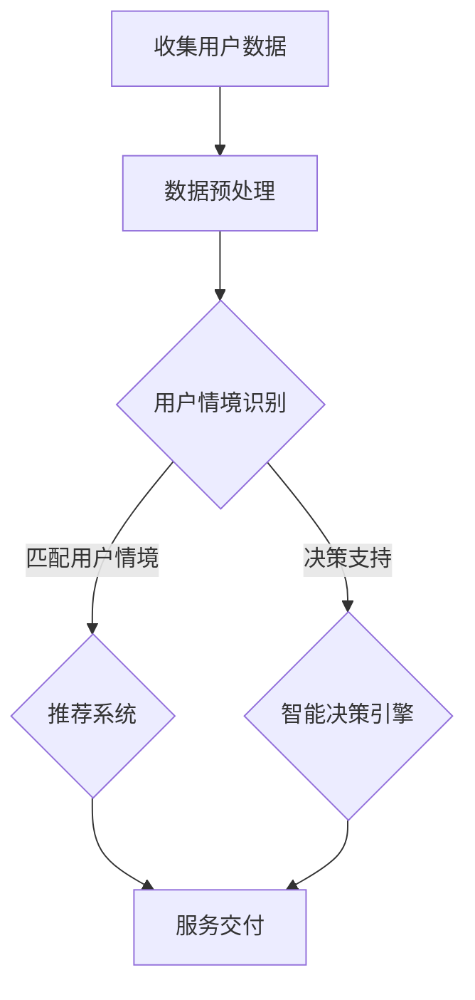

                 

## 第1章：企业级情境感知AI应用背景

### 1.1 问题背景

随着信息技术的飞速发展和互联网的普及，企业级应用对数据处理能力和用户体验的要求越来越高。传统的用户界面和静态服务已经无法满足现代企业对于灵活、个性化和高效服务的需求。因此，情境感知AI作为一种新兴技术，逐渐受到了业界的广泛关注。

情境感知AI（Context-Aware AI）是指通过感知和理解用户所处的环境、情境，动态调整和优化服务与交互方式，从而提供更加精准和个性化的用户体验。在企业级应用中，情境感知AI可以帮助企业提高运营效率、降低成本、提升客户满意度和忠诚度。

### 1.2 问题描述

当前，企业面临的主要挑战包括：

1. **用户体验的个性化需求**：用户对于服务的个性化需求越来越高，传统的一刀切服务模式已经难以满足用户期望。
2. **海量数据处理**：企业需要处理和分析海量的用户数据，包括行为数据、地理位置数据、交互历史数据等，以提供更精准的服务。
3. **服务交付的灵活性**：企业需要根据用户的行为和需求，灵活调整服务内容和交付方式，以提高服务效率和用户满意度。
4. **数据隐私和安全**：随着数据隐私法规的日益严格，企业需要在提供个性化服务的同时，确保用户数据的安全和隐私。

### 1.3 问题解决

情境感知AI在企业级应用中的潜力主要体现在以下几个方面：

1. **个性化用户体验**：通过分析用户的行为和情境，情境感知AI可以为用户提供个性化推荐、智能提醒、定制化服务，提升用户体验。
2. **智能决策支持**：情境感知AI可以为企业提供实时决策支持，帮助企业在不同情境下做出最优决策。
3. **资源优化**：通过优化服务交付流程和资源配置，情境感知AI可以降低企业的运营成本，提高资源利用效率。
4. **安全隐私保护**：情境感知AI在设计和应用过程中，需要遵循严格的隐私保护原则，确保用户数据的安全和隐私。

### 1.4 边界与外延

虽然情境感知AI在企业级应用中具有巨大的潜力，但其在实际应用中也存在一些边界和限制：

1. **技术实现难度**：情境感知AI需要综合运用多种技术，包括数据挖掘、机器学习、自然语言处理等，技术实现的难度较高。
2. **数据质量与隐私**：情境感知AI的性能依赖于数据质量，同时企业需要平衡数据隐私和个性化服务之间的关系。
3. **用户接受度**：用户对于个性化服务和数据收集的接受度不一，企业需要通过有效的沟通和透明度来赢得用户的信任。

综上所述，企业级情境感知AI不仅是一种技术趋势，更是一种提升用户体验和服务交付质量的重要手段。在接下来的章节中，我们将深入探讨情境感知AI的核心概念、算法原理、数学模型、系统设计与项目实战，以期为企业提供一套完整的情境感知AI解决方案。  

## 第2章：核心概念与联系

### 2.1 情境感知AI的定义与特点

情境感知AI（Context-Aware AI）是一种智能系统，它能够根据用户所处的环境、情境以及历史行为数据，动态调整和优化服务与交互方式。其核心特点包括：

1. **动态调整**：情境感知AI能够实时感知用户环境的变化，并动态调整服务策略，以提供个性化的用户体验。
2. **自适应**：系统能够根据用户的反馈和情境数据，自适应地学习和优化服务交付方式。
3. **数据驱动**：情境感知AI依赖于大量的用户数据，通过数据分析和挖掘，实现精准的服务推荐和决策支持。

### 2.2 企业级情境感知AI的关键概念

在企业级应用中，情境感知AI涉及多个关键概念，包括：

1. **用户情境**：用户所处的环境、地理位置、时间、行为习惯等。
2. **情境建模**：通过数据分析和机器学习技术，构建描述用户情境的模型。
3. **情境感知引擎**：负责实时感知和解析用户情境，并根据情境数据调整服务策略。
4. **个性化服务**：根据用户情境，为用户推荐个性化的服务内容。
5. **决策支持**：通过分析用户情境，为企业提供实时的决策支持。

### 2.3 概念属性特征对比表格

为了更清晰地理解情境感知AI的核心概念，我们可以通过对比表格来展示各个概念的属性特征：

| 概念       | 定义                                                         | 特征                                                         |
| ---------- | ------------------------------------------------------------ | ------------------------------------------------------------ |
| 用户情境   | 用户所处的环境、地理位置、时间、行为习惯等                   | 实时性、多样性、动态变化                                     |
| 情境建模   | 通过数据分析和机器学习技术，构建描述用户情境的模型           | 数据依赖性、准确性、模型适应性                               |
| 情境感知引擎 | 负责实时感知和解析用户情境，并根据情境数据调整服务策略       | 实时处理能力、自适应学习、智能决策支持                         |
| 个性化服务 | 根据用户情境，为用户推荐个性化的服务内容                     | 个性化、用户偏好、用户体验提升                               |
| 决策支持   | 通过分析用户情境，为企业提供实时的决策支持                   | 数据分析能力、实时性、优化决策                               |

### 2.4 ER实体关系图架构

为了更好地理解情境感知AI在企业中的应用，我们可以通过ER实体关系图来展示各个实体之间的关系：

```mermaid
erDiagram
  User ||--|{ Context }|| UserContext
  User ||--|{ Service }|| Service
  User ||--|{ Recommendation }|| Recommendation
  User ||--|{ Decision }|| Decision
  Context ||--|{ BehaviorData }|| BehaviorData
  Context ||--|{ LocationData }|| LocationData
  Context ||--|{ TimeData }|| TimeData
  Service ||--|{ ServiceData }|| ServiceData
  Recommendation ||--|{ RecommendationData }|| RecommendationData
  Decision ||--|{ DecisionData }|| DecisionData
```

通过ER实体关系图，我们可以清晰地看到用户、情境、服务、推荐和决策等实体之间的相互作用关系，这为我们理解和设计情境感知AI系统提供了重要的参考。

### 概念联系与整合

情境感知AI的核心概念不仅仅是独立的个体，它们之间存在着紧密的联系和整合：

1. **用户情境与个性化服务**：用户情境是提供个性化服务的基础，通过情境建模和感知，系统能够了解用户的需求，从而提供个性化的推荐和服务。
2. **情境感知与决策支持**：情境感知引擎通过实时解析用户情境，为企业提供实时的决策支持，帮助企业在不同情境下做出最优决策。
3. **个性化服务与用户满意度**：个性化服务能够提升用户满意度，从而提高用户忠诚度和转化率。

通过上述核心概念与联系的分析，我们可以看到情境感知AI在企业级应用中的重要性和价值。在接下来的章节中，我们将进一步深入探讨情境感知AI的算法原理、数学模型和系统设计，以期为读者提供一套完整的解决方案。

## 第3章：情境感知AI算法原理

### 3.1 算法mermaid流程图

情境感知AI的算法流程可以简化为一个多步骤的决策过程。以下是使用mermaid绘制的算法流程图：



### 3.2 Python源代码讲解

以下是一个简化的情境感知AI算法的Python源代码示例，用于说明数据预处理、用户情境识别和推荐系统等关键步骤：

```python
# 导入必要的库
import pandas as pd
import numpy as np
from sklearn.preprocessing import StandardScaler
from sklearn.cluster import KMeans

# 收集用户数据
data = pd.read_csv('user_data.csv')

# 数据预处理
scaler = StandardScaler()
scaled_data = scaler.fit_transform(data)

# 用户情境识别
kmeans = KMeans(n_clusters=5)
clusters = kmeans.fit_predict(scaled_data)

# 匹配用户情境到推荐系统
recommendation_system = {'cluster_0': ['服务A', '服务B'],
                         'cluster_1': ['服务B', '服务C'],
                         'cluster_2': ['服务C', '服务D'],
                         'cluster_3': ['服务D', '服务E'],
                         'cluster_4': ['服务E', '服务A']}

# 根据用户情境提供推荐
def get_recommendations(cluster):
    return recommendation_system[f'cluster_{cluster}']

# 智能决策引擎
def make_decision(user_context):
    # 这里是决策逻辑，可以根据实际需求进行扩展
    if user_context in ['情境A', '情境B']:
        return '决策A'
    else:
        return '决策B'

# 应用算法
user_cluster = kmeans.predict([user_data])[0]
user_recommendations = get_recommendations(user_cluster)
user_decision = make_decision(user_context)

print(f"用户推荐服务：{user_recommendations}")
print(f"用户决策：{user_decision}")
```

### 3.3 算法原理的数学模型和公式

情境感知AI算法的核心在于用户情境的识别和匹配，以下是相关的数学模型和公式：

1. **用户特征标准化**：使用标准差标准化方法对用户数据进行预处理。

   $$ \text{Standardized Feature} = \frac{\text{Feature} - \text{Mean}}{\text{Standard Deviation}} $$

2. **K-Means聚类**：使用K-Means算法对用户数据进行聚类，识别不同的用户情境。

   $$ \text{Cluster} = \text{argmin}\sum_{i=1}^{n}(\text{Distance}(x_i, c_j))^2 $$

   其中，\( c_j \) 是聚类中心，\( x_i \) 是用户特征向量。

3. **推荐系统匹配**：根据用户情境，从预定义的推荐系统中提取相应的服务。

   $$ \text{Recommendations} = \text{recommendation\_system}[\text{cluster}] $$

### 3.4 通俗易懂的举例说明

假设我们有一组用户数据，包括用户的年龄、购买历史和浏览行为。首先，我们使用K-Means算法将这些用户分为5个不同的情境群体。例如，群

