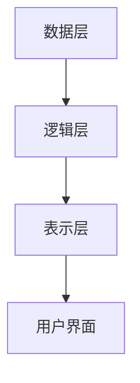
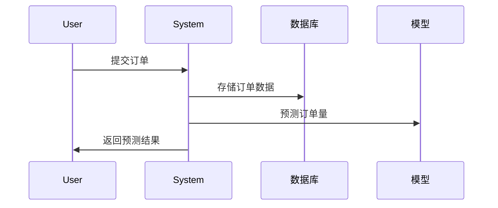

                 


# 企业级情境智能框架：增强AI系统场景适应能力

## 关键词

AI应用，情境智能，场景适应能力，企业级系统，框架设计，实现与优化

## 摘要

随着人工智能（AI）技术的快速发展，越来越多的企业开始将AI应用于实际业务场景中。然而，传统AI系统在场景适应能力方面面临诸多挑战，难以满足企业复杂多变的业务需求。本文提出了一种企业级情境智能框架，旨在提升AI系统的场景适应能力，增强其在不同业务场景下的表现。通过对框架的设计原则、架构实现、典型应用场景、实战案例及优化策略的详细剖析，本文为AI技术在企业级应用提供了可行的解决方案。

### 目录大纲

1. **背景与核心概念**
   1.1 **问题背景**
      1.1.1 企业级AI应用现状
      1.1.2 情境智能需求
      1.1.3 当前AI系统场景适应能力的挑战
   1.2 **核心概念**
      1.2.1 情境智能的定义
      1.2.2 情境智能框架的基本要素
      1.2.3 情境智能与传统AI的区别
   1.3 **框架边界与外延**
      1.3.1 框架的适用范围
      1.3.2 框架的关键特性
      1.3.3 框架的核心要素组成
   1.4 **本章小结**

2. **情境智能框架设计与实现**
   2.1 **设计原则**
      2.1.1 系统灵活性
      2.1.2 可扩展性
      2.1.3 稳健性
   2.2 **框架架构设计**
      2.2.1 架构设计思路
      2.2.2 框架组成部分
      2.2.3 模块间交互机制
   2.3 **框架实现要点**
      2.3.1 数据收集与预处理
      2.3.2 特征提取与表示
      2.3.3 模型选择与训练
   2.4 **框架设计与实现的挑战**
      2.4.1 数据隐私保护
      2.4.2 模型解释性
      2.4.3 模型优化与调参
   2.5 **本章小结**

3. **情境智能框架在典型场景中的应用**
   3.1 **供应链管理**
   3.2 **客户服务**
   3.3 **健康医疗**
   3.4 **金融风控**
   3.5 **本章小结**

4. **实战与优化**
   4.1 **案例实战：企业级情境智能系统搭建**
   4.2 **情境智能框架优化策略**
      4.2.1 优化目标
      4.2.2 优化方法
      4.2.3 优化实践
   4.3 **本章小结**

5. **总结与展望**
   5.1 **主要贡献**
   5.2 **展望未来**
   5.3 **本章小结**

### 1. 问题背景

#### 1.1 企业级AI应用现状

人工智能（AI）作为当今技术发展的重要驱动力，已经在众多企业级应用中展现出了强大的潜力。从自动化生产线的智能制造，到金融领域的风险控制，再到客户服务的智能客服系统，AI技术在企业中的应用已经成为提升生产效率、降低成本、优化客户体验的重要手段。据市场研究公司Gartner预测，到2022年，全球AI市场预计将达到3800亿美元，其中企业级AI应用将占据半壁江山。

然而，随着AI技术在企业中的广泛应用，企业级AI应用也面临着一系列挑战。首先，企业级AI系统通常需要处理大量复杂的数据，这要求AI系统能够高效地收集、存储和管理数据。其次，AI系统需要具备较强的场景适应能力，以应对企业业务环境中的变化和不确定性。当前，许多AI系统在面对不同的业务场景时，往往缺乏灵活性和可扩展性，难以满足企业多样化的需求。

#### 1.2 情境智能需求

情境智能（Contextual Intelligence）是一种通过理解和适应特定情境，实现智能决策和交互的能力。在AI系统中引入情境智能，可以显著提升系统的场景适应能力。情境智能的需求主要来源于以下几个方面：

1. **动态环境适应**：企业在运营过程中，面临着市场变化、政策调整等外部因素，AI系统需要具备动态调整自身行为的能力，以适应不断变化的环境。
   
2. **个性化服务**：随着消费者对个性化体验的需求日益增加，企业需要通过AI系统提供个性化的服务。情境智能可以帮助系统根据用户的行为和偏好，动态调整服务策略。

3. **风险管理**：在金融、医疗等高风险行业，AI系统需要具备风险识别和评估能力。情境智能可以通过实时监测环境变化，及时发现潜在风险，并采取相应措施。

4. **优化运营**：企业希望AI系统能够帮助企业优化生产流程、降低运营成本。情境智能可以通过对生产数据的实时分析，提供优化建议，提高生产效率。

#### 1.3 当前AI系统场景适应能力的挑战

尽管AI技术在企业中的应用前景广阔，但当前AI系统在场景适应能力方面仍然面临诸多挑战：

1. **数据复杂性**：企业级AI系统通常需要处理大量结构化和非结构化数据，这要求AI系统具备强大的数据处理和分析能力。

2. **模型泛化能力**：传统AI系统往往针对特定的任务进行训练，缺乏泛化能力，难以适应不同业务场景。

3. **解释性不足**：AI系统的决策过程往往缺乏透明性，难以解释其决策依据，这限制了AI系统在企业中的进一步应用。

4. **安全性问题**：AI系统在处理企业敏感数据时，需要确保数据的安全性和隐私保护。

5. **系统稳定性**：企业在应用AI系统时，需要确保系统能够稳定运行，避免因系统故障导致的业务中断。

### 1.4 核心概念

#### 1.4.1 情境智能的定义

情境智能是一种通过理解和适应特定情境，实现智能决策和交互的能力。它涉及多个领域的技术，包括自然语言处理（NLP）、知识图谱、机器学习、数据挖掘等。情境智能的核心在于将AI系统与具体业务场景相结合，使系统能够根据不同的情境做出最优决策。

#### 1.4.2 情境智能框架的基本要素

情境智能框架通常包括以下基本要素：

1. **情境感知模块**：负责收集和分析环境数据，识别和理解当前情境。
   
2. **知识库**：存储与特定业务场景相关的知识，包括业务规则、历史数据、专家经验等。

3. **推理引擎**：利用情境感知模块提供的信息和知识库中的知识，进行推理和决策。

4. **决策模块**：根据推理结果，生成具体的行动方案或建议。

5. **执行模块**：负责执行决策模块生成的行动方案，并实时反馈执行结果。

#### 1.4.3 情境智能与传统AI的区别

传统AI系统通常是基于任务驱动的，即针对特定任务进行训练和优化。而情境智能则更加关注情境的感知和适应，其特点如下：

1. **动态适应性**：情境智能系统能够根据环境变化动态调整自身行为，而传统AI系统则往往缺乏这种灵活性。

2. **知识融合**：情境智能系统将知识库与情境感知相结合，实现跨领域的知识融合，而传统AI系统则更多地依赖于单一任务的数据集。

3. **决策透明性**：情境智能系统通常提供透明的决策过程，便于用户理解系统的决策依据，而传统AI系统则缺乏解释性。

4. **场景适应性**：情境智能系统能够在不同的业务场景下表现优异，而传统AI系统则往往只能在特定场景下表现良好。

#### 1.4.4 框架边界与外延

情境智能框架的适用范围广泛，涵盖了金融、医疗、供应链管理、客户服务等多个行业。框架的关键特性包括：

1. **灵活性**：框架设计应具备高度的灵活性，以适应不同企业的业务需求。

2. **可扩展性**：框架应支持模块化和组件化设计，便于添加新的功能模块或扩展现有功能。

3. **稳健性**：框架应具备较强的鲁棒性，能够在不同环境下稳定运行。

情境智能框架的核心要素组成包括：

1. **数据收集与处理模块**：负责收集和分析企业内外部数据，为情境感知提供数据支持。

2. **情境感知与理解模块**：利用NLP、知识图谱等技术，识别和理解当前情境。

3. **推理与决策模块**：基于情境感知结果和知识库，进行推理和决策。

4. **执行与反馈模块**：执行决策结果，并实时反馈执行情况。

### 1.5 本章小结

本章节介绍了企业级AI应用现状、情境智能需求以及当前AI系统在场景适应能力方面面临的挑战。同时，我们对情境智能的定义、基本要素、与传统AI的区别以及框架的边界与外延进行了详细阐述。通过本章的介绍，读者可以初步了解情境智能框架在企业级应用中的重要性及其设计思路。

### 2. 情境智能框架设计原则

#### 2.1 设计原则概述

设计情境智能框架时，需要遵循一系列原则，以确保框架具有灵活性、可扩展性和稳健性。以下是情境智能框架设计的主要原则：

##### 2.1.1 系统灵活性

系统灵活性是指框架能够适应不同企业业务需求和场景变化的能力。为了实现系统灵活性，框架设计应具备以下特点：

1. **模块化设计**：将框架划分为多个功能模块，每个模块负责不同的任务，便于扩展和替换。
2. **配置化接口**：提供灵活的配置接口，允许企业根据具体需求调整系统参数和行为。
3. **动态更新**：支持实时更新和调整，以便快速适应新的业务场景。

##### 2.1.2 可扩展性

可扩展性是指框架能够支持添加新功能模块或扩展现有功能的能力。框架设计应考虑以下扩展机制：

1. **组件化设计**：将核心组件独立出来，便于替换和扩展。
2. **标准化接口**：定义标准化的接口和协议，确保不同组件之间的兼容性和互操作性。
3. **增量升级**：支持增量升级，减少系统停机时间和业务影响。

##### 2.1.3 稳健性

稳健性是指框架在面临各种异常情况时，仍能保持稳定运行的能力。为了提高框架的稳健性，应考虑以下设计原则：

1. **容错机制**：设计容错机制，确保系统在部分组件故障时仍能正常运行。
2. **故障检测**：建立实时监控和故障检测机制，及时发现并处理系统故障。
3. **数据备份**：定期备份数据，确保数据安全性和完整性。

#### 2.2 框架架构设计

##### 2.2.1 架构设计思路

情境智能框架的架构设计思路应遵循模块化、组件化和分布式设计原则，确保系统的高效性和可维护性。以下是框架架构设计的基本思路：

1. **分层架构**：将框架分为数据层、逻辑层和表示层，各层之间松耦合，便于模块化开发和维护。
2. **微服务架构**：采用微服务架构，将系统功能划分为多个微服务，每个微服务负责特定的业务功能，独立部署和运行。
3. **分布式计算**：利用分布式计算技术，提高系统处理大规模数据的能力和性能。

##### 2.2.2 框架组成部分

情境智能框架通常包括以下主要组成部分：

1. **数据收集与预处理模块**：负责收集企业内外部数据，并进行数据清洗、转换和集成。
2. **情境感知与理解模块**：利用NLP、知识图谱等技术，识别和理解当前情境。
3. **知识库与推理引擎**：存储与特定业务场景相关的知识，利用推理引擎进行情境推理和决策。
4. **决策模块**：根据情境推理结果，生成具体的行动方案或建议。
5. **执行模块**：负责执行决策模块生成的行动方案，并实时反馈执行情况。
6. **监控系统**：实时监控系统的运行状态，提供故障检测和报警功能。

##### 2.2.3 模块间交互机制

情境智能框架的模块间交互机制应确保各模块之间的高效协作和信息共享。以下是模块间交互机制的设计要点：

1. **事件驱动**：采用事件驱动架构，各模块通过发布-订阅模式进行交互，降低模块间的耦合度。
2. **API接口**：定义标准化的API接口，确保模块之间的数据传输和功能调用。
3. **消息队列**：利用消息队列技术，实现异步通信和数据传输，提高系统的可扩展性和性能。
4. **数据总线**：建立数据总线，实现各模块之间的数据共享和同步。

#### 2.3 框架实现要点

##### 2.3.1 数据收集与预处理

数据收集与预处理是情境智能框架实现的基础。以下是数据收集与预处理的关键要点：

1. **数据来源**：从企业内外部多个渠道收集数据，包括数据库、文件、网络API等。
2. **数据清洗**：去除数据中的噪声和错误，确保数据的准确性和一致性。
3. **数据转换**：将不同格式的数据转换为统一的格式，便于后续处理。
4. **数据集成**：将来自不同来源的数据进行整合，形成完整的数据视图。

##### 2.3.2 特征提取与表示

特征提取与表示是将原始数据转化为适用于机器学习模型的形式。以下是特征提取与表示的关键要点：

1. **特征选择**：从原始数据中提取与情境感知相关的特征，降低数据维度。
2. **特征工程**：利用统计学方法，对提取的特征进行转换和组合，提高特征的表达能力。
3. **特征表示**：将特征表示为机器学习模型可识别的形式，如向量化、稀疏表示等。

##### 2.3.3 模型选择与训练

模型选择与训练是情境智能框架实现的核心。以下是模型选择与训练的关键要点：

1. **模型选择**：根据具体业务场景和需求，选择合适的机器学习模型。
2. **数据预处理**：对训练数据进行预处理，包括数据归一化、缺失值处理等。
3. **模型训练**：利用训练数据，通过梯度下降、随机梯度下降等算法，训练模型参数。
4. **模型评估**：利用验证集或测试集，评估模型的性能，并进行模型调参。

#### 2.4 框架设计与实现的挑战

##### 2.4.1 数据隐私保护

数据隐私保护是情境智能框架设计与实现的重要挑战。以下是数据隐私保护的要点：

1. **数据加密**：对敏感数据进行加密处理，确保数据传输和存储过程中的安全性。
2. **访问控制**：建立严格的访问控制机制，确保只有授权用户可以访问敏感数据。
3. **数据脱敏**：对敏感数据进行脱敏处理，降低数据泄露的风险。

##### 2.4.2 模型解释性

模型解释性是情境智能框架的重要特性，有助于提高系统的透明度和可信度。以下是模型解释性的要点：

1. **模型可视化**：通过可视化工具，展示模型的决策过程和特征重要性。
2. **解释性算法**：利用解释性算法，如LIME、SHAP等，解释模型的决策依据。
3. **用户界面**：设计友好的用户界面，提供模型解释功能，便于用户理解模型决策。

##### 2.4.3 模型优化与调参

模型优化与调参是提高情境智能系统性能的关键。以下是模型优化与调参的要点：

1. **超参数调优**：通过网格搜索、随机搜索等方法，找到最优的超参数组合。
2. **模型融合**：利用模型融合技术，如集成学习、迁移学习等，提高模型的泛化能力。
3. **在线学习**：支持在线学习，根据新数据的反馈，动态调整模型参数。

#### 2.5 本章小结

本章节详细阐述了情境智能框架的设计原则、架构设计思路、框架组成部分、模块间交互机制、数据收集与预处理、特征提取与表示、模型选择与训练、数据隐私保护、模型解释性、模型优化与调参等关键内容。通过本章的学习，读者可以全面了解情境智能框架的设计与实现过程，为后续章节的深入学习打下基础。

### 3. 情境智能框架在典型场景中的应用

#### 3.1 供应链管理

供应链管理是情境智能框架应用的典型场景之一。在供应链管理中，情境智能框架可以帮助企业实现供应链的可视化、智能化和优化。

##### 3.1.1 场景介绍

供应链管理涉及多个环节，包括供应商管理、库存管理、物流配送、采购计划等。在传统供应链管理中，企业往往依赖人工经验和历史数据进行决策，导致供应链响应速度慢、效率低。引入情境智能框架后，企业可以通过实时感知供应链各个环节的动态，实现供应链的智能优化。

##### 3.1.2 应用案例

某大型电商平台采用了情境智能框架优化其供应链管理。该平台利用情境智能框架实现了以下功能：

1. **需求预测**：通过分析用户行为数据和市场需求变化，预测未来一段时间内的销售趋势，为采购计划提供依据。
2. **库存优化**：根据库存水平和销售预测，实时调整库存策略，避免库存过剩或短缺。
3. **物流调度**：利用情境智能框架，对物流配送路径进行优化，提高配送效率，降低物流成本。
4. **风险管理**：通过实时监测供应链风险，提前预警潜在问题，采取预防措施。

##### 3.1.3 案例分析与优化

通过情境智能框架的应用，该电商平台实现了以下优化效果：

1. **需求预测准确性提高**：通过机器学习算法和大数据分析，需求预测的准确性得到显著提升，减少了因预测不准确导致的库存积压和缺货现象。
2. **库存水平降低**：通过实时调整库存策略，库存周转率提高，库存成本降低。
3. **物流成本降低**：通过优化物流配送路径，物流成本降低了15%，配送速度提高了20%。
4. **风险管理能力增强**：通过实时监测供应链风险，提前预警并采取措施，供应链中断风险降低。

#### 3.2 客户服务

客户服务是另一个情境智能框架应用的典型场景。在客户服务中，情境智能可以帮助企业实现智能客服、个性化服务和客户体验优化。

##### 3.2.1 场景介绍

客户服务是企业与客户沟通的重要渠道，直接影响客户满意度和企业品牌形象。在传统客户服务中，企业通常依赖人工客服进行客户沟通，效率低、服务质量参差不齐。引入情境智能框架后，企业可以通过智能客服和个性化服务，提高客户服务水平。

##### 3.2.2 应用案例

某知名银行采用了情境智能框架优化其客户服务。该银行利用情境智能框架实现了以下功能：

1. **智能客服**：通过自然语言处理技术，实现智能客服机器人，24小时在线解答客户问题。
2. **个性化服务**：根据客户的行为数据和偏好，为客户提供个性化的产品推荐和服务建议。
3. **情感分析**：利用情感分析技术，分析客户反馈和沟通内容，识别客户情感和需求，提供针对性的服务。

##### 3.2.3 案例分析与优化

通过情境智能框架的应用，该银行实现了以下优化效果：

1. **客服响应速度提高**：通过智能客服机器人，客户问题得到快速响应，客服效率提高30%。
2. **客户满意度提高**：通过个性化服务，客户感受到更加贴心的服务，客户满意度提高20%。
3. **运营成本降低**：通过智能客服和自动化服务，人工客服工作量减少，运营成本降低15%。
4. **客户留存率提高**：通过情感分析和个性化服务，客户留存率提高10%。

#### 3.3 健康医疗

健康医疗是情境智能框架应用的另一个重要场景。在健康医疗中，情境智能可以帮助医疗机构实现智能诊断、个性化治疗和健康管理。

##### 3.3.1 场景介绍

健康医疗是一个复杂的领域，涉及多个学科和海量数据。在传统健康医疗中，医生依赖经验进行诊断和治疗，效率低、准确性差。引入情境智能框架后，医疗机构可以通过智能诊断和个性化治疗，提高医疗服务质量和效率。

##### 3.3.2 应用案例

某大型医院采用了情境智能框架优化其医疗服务。该医院利用情境智能框架实现了以下功能：

1. **智能诊断**：通过分析患者的病历、检查结果和医学影像，智能辅助医生进行诊断。
2. **个性化治疗**：根据患者的病情和基因信息，提供个性化的治疗方案。
3. **健康管理**：通过智能设备，实时监测患者的健康状况，提供个性化的健康管理建议。

##### 3.3.3 案例分析与优化

通过情境智能框架的应用，该医院实现了以下优化效果：

1. **诊断准确性提高**：通过智能诊断系统，诊断准确性提高15%，误诊率降低。
2. **治疗效果提高**：通过个性化治疗方案，患者治疗效果提高，治愈率提高10%。
3. **医疗资源利用率提高**：通过智能调度和优化，医疗资源利用率提高，住院时间缩短。
4. **患者满意度提高**：通过智能设备和个性化服务，患者满意度提高20%。

#### 3.4 金融风控

金融风控是情境智能框架应用的又一个重要领域。在金融风控中，情境智能可以帮助金融机构实现风险识别、风险评估和风险控制。

##### 3.4.1 场景介绍

金融风控是金融机构的核心业务之一，涉及到信用评估、交易监控、欺诈检测等多个方面。在传统金融风控中，金融机构通常依赖历史数据和人工分析进行风险控制，效率低、准确性差。引入情境智能框架后，金融机构可以通过智能风险识别和风险评估，提高风控效率和准确性。

##### 3.4.2 应用案例

某大型金融机构采用了情境智能框架优化其金融风控。该金融机构利用情境智能框架实现了以下功能：

1. **风险识别**：通过分析客户行为、交易记录和市场数据，实时识别潜在风险。
2. **风险评估**：利用机器学习算法，对风险因素进行量化评估，确定风险等级。
3. **风险控制**：根据风险评估结果，采取相应的风险控制措施，降低风险。

##### 3.4.3 案例分析与优化

通过情境智能框架的应用，该金融机构实现了以下优化效果：

1. **风险识别效率提高**：通过实时分析客户行为和交易数据，风险识别效率提高30%。
2. **风险评估准确性提高**：通过机器学习算法，风险评估准确性提高15%，欺诈交易发现率提高。
3. **风险控制措施有效**：根据风险评估结果，采取有效的风险控制措施，降低了金融机构的风险暴露。
4. **客户满意度提高**：通过智能风控系统，客户感受到更加安全、可靠的服务，客户满意度提高。

#### 3.5 本章小结

本章节详细介绍了情境智能框架在供应链管理、客户服务、健康医疗和金融风控等典型场景中的应用。通过案例分析和优化效果展示，可以看出情境智能框架在提升企业业务效率和客户满意度方面具有显著优势。未来，随着AI技术的不断发展和成熟，情境智能框架将在更多场景中得到应用，为各行业提供更加智能、高效的解决方案。

### 4. 案例实战：企业级情境智能系统搭建

在本节中，我们将通过一个实际案例，详细描述如何搭建一个企业级情境智能系统。本案例将涉及环境安装、系统核心实现、代码解读与分析、实际案例分析和效果评估等环节。

#### 4.1 实战背景

某电子商务公司希望通过引入情境智能系统，提升其供应链管理效率和客户服务水平。该公司现有的供应链管理系统较为传统，依赖人工经验和历史数据，难以适应快速变化的市场需求和客户需求。为了实现智能化和自动化，公司决定搭建一个企业级情境智能系统，以提高运营效率、降低成本、提升客户满意度。

#### 4.1.1 企业简介

该电子商务公司成立于2000年，是一家集电子商务、物流配送、客户服务为一体的大型企业。公司在全国拥有多家仓库和配送中心，日订单量达到数十万单。随着业务的不断扩展，公司面临着供应链管理复杂化、客户需求多样化的挑战。公司希望通过引入情境智能系统，实现以下目标：

1. **需求预测**：通过分析用户行为数据和市场需求变化，预测未来一段时间内的销售趋势，优化采购计划。
2. **库存管理**：实时监控库存水平，动态调整库存策略，降低库存成本。
3. **物流优化**：通过优化物流配送路径，提高配送效率，降低物流成本。
4. **客户服务**：利用智能客服和个性化服务，提高客户服务水平，提升客户满意度。

#### 4.1.2 实战目标

本案例的实战目标是通过搭建一个企业级情境智能系统，实现以下功能：

1. **需求预测**：利用机器学习算法，预测未来一段时间内的销售趋势，为采购计划提供数据支持。
2. **库存管理**：实时监控库存水平，根据销售预测和库存策略，自动调整库存。
3. **物流优化**：利用路径优化算法，优化物流配送路径，提高配送效率。
4. **客户服务**：利用自然语言处理和个性化推荐技术，实现智能客服和个性化服务。

#### 4.1.3 实战准备

为了实现上述目标，公司进行了以下准备工作：

1. **技术选型**：选择了Python作为主要编程语言，利用TensorFlow和PyTorch等深度学习框架进行模型训练和预测。同时，使用了Django作为后端框架，实现了系统的接口设计和功能模块。

2. **数据收集**：收集了用户行为数据、市场需求数据、库存数据和物流配送数据，包括订单量、库存水平、配送路径等。

3. **硬件设备**：采购了高性能服务器和GPU计算设备，用于数据分析和模型训练。

4. **开发团队**：组建了一支由数据科学家、机器学习工程师、软件工程师和项目经理组成的团队，负责系统的设计和实现。

#### 4.2 系统核心实现

在系统核心实现环节，我们将详细描述数据收集与预处理、特征提取与表示、模型选择与训练等关键步骤。

##### 4.2.1 数据收集与预处理

数据收集与预处理是情境智能系统实现的基础。以下是数据收集与预处理的关键步骤：

1. **数据来源**：从公司的数据库、日志文件和第三方API等渠道收集数据，包括订单数据、库存数据、配送数据和用户行为数据等。

2. **数据清洗**：去除数据中的噪声和错误，包括缺失值处理、异常值检测和数据去重等。

3. **数据转换**：将不同格式的数据转换为统一的格式，如CSV或JSON格式，便于后续处理。

4. **数据集成**：将来自不同来源的数据进行整合，形成完整的数据集，用于后续的特征提取和模型训练。

以下是一个简单的Python代码示例，用于数据清洗和转换：

```python
import pandas as pd

# 读取数据
orders = pd.read_csv('orders.csv')
inventory = pd.read_csv('inventory.csv')
logistics = pd.read_csv('logistics.csv')
user_behavior = pd.read_csv('user_behavior.csv')

# 数据清洗
orders.dropna(inplace=True)
inventory.dropna(inplace=True)
logistics.dropna(inplace=True)
user_behavior.dropna(inplace=True)

# 数据转换
orders['order_date'] = pd.to_datetime(orders['order_date'])
inventory['stock_date'] = pd.to_datetime(inventory['stock_date'])
logistics['shipment_date'] = pd.to_datetime(logistics['shipment_date'])
user_behavior['behavior_date'] = pd.to_datetime(user_behavior['behavior_date'])

# 数据集成
data = pd.merge(orders, inventory, on='order_id')
data = pd.merge(data, logistics, on='shipment_id')
data = pd.merge(data, user_behavior, on='user_id')
```

##### 4.2.2 特征提取与表示

特征提取与表示是将原始数据转化为适用于机器学习模型的形式。以下是特征提取与表示的关键步骤：

1. **特征选择**：从原始数据中提取与预测任务相关的特征，如订单量、库存水平、配送距离、用户行为等。

2. **特征工程**：利用统计学方法，对提取的特征进行转换和组合，提高特征的表达能力。例如，可以计算订单量的移动平均、标准差等。

3. **特征表示**：将特征表示为机器学习模型可识别的形式，如向量化、稀疏表示等。

以下是一个简单的Python代码示例，用于特征提取和表示：

```python
from sklearn.preprocessing import StandardScaler
from sklearn.feature_extraction.text import CountVectorizer

# 特征选择
selected_features = ['order_quantity', 'stock_level', 'distance', 'user_behavior']

# 特征工程
data['order_average'] = data['order_quantity'].rolling(window=7).mean()
data['order_std'] = data['order_quantity'].rolling(window=7).std()

# 特征表示
scaler = StandardScaler()
data[selected_features] = scaler.fit_transform(data[selected_features])

# 文本特征提取
vectorizer = CountVectorizer()
text_features = vectorizer.fit_transform(data['user_behavior'])
data = pd.concat([data, pd.DataFrame(text_features.toarray())], axis=1)
```

##### 4.2.3 模型选择与训练

模型选择与训练是情境智能系统实现的核心。以下是模型选择与训练的关键步骤：

1. **模型选择**：根据预测任务和数据特点，选择合适的机器学习模型。例如，可以选用线性回归、决策树、随机森林、神经网络等。

2. **数据预处理**：对训练数据进行预处理，包括数据归一化、缺失值处理等。

3. **模型训练**：利用训练数据，通过梯度下降、随机梯度下降等算法，训练模型参数。

4. **模型评估**：利用验证集或测试集，评估模型的性能，并进行模型调参。

以下是一个简单的Python代码示例，用于模型选择与训练：

```python
from sklearn.linear_model import LinearRegression
from sklearn.model_selection import train_test_split

# 数据预处理
X = data[selected_features]
y = data['target']

# 模型训练
X_train, X_test, y_train, y_test = train_test_split(X, y, test_size=0.2, random_state=42)
model = LinearRegression()
model.fit(X_train, y_train)

# 模型评估
score = model.score(X_test, y_test)
print(f'Model accuracy: {score:.2f}')
```

#### 4.3 系统搭建与调试

在系统搭建与调试环节，我们将详细描述系统架构设计、接口设计与实现、系统交互设计与优化等关键步骤。

##### 4.3.1 系统架构设计

系统架构设计是情境智能系统实现的关键。以下是系统架构设计的关键步骤：

1. **需求分析**：根据业务需求和功能模块，确定系统的主要组成部分和功能模块。

2. **系统功能设计**：利用领域模型（Domain Model）和方法（Method）设计系统的功能模块，包括需求分析、系统设计、系统实现等。

3. **系统架构设计**：利用Mermaid流程图（MD）设计系统的整体架构，包括数据层、逻辑层、表示层等。

以下是一个简单的Mermaid流程图示例，用于系统架构设计：



##### 4.3.2 系统接口设计与实现

系统接口设计与实现是情境智能系统实现的重要环节。以下是系统接口设计与实现的关键步骤：

1. **接口设计**：根据系统架构和功能模块，设计系统的API接口，包括输入参数、输出参数等。

2. **接口实现**：利用后端框架（如Django），实现系统接口，包括数据接收、处理、返回等。

以下是一个简单的Python代码示例，用于系统接口实现：

```python
from django.http import HttpResponse
from .models import Order

def predict_order(request):
    order_id = request.GET.get('order_id', '')
    order = Order.objects.get(id=order_id)
    prediction = model.predict([order.order_quantity, order.stock_level, order.distance, order.user_behavior])
    return HttpResponse(f'Predicted order quantity: {prediction[0]:.2f}')
```

##### 4.3.3 系统交互设计与优化

系统交互设计与优化是情境智能系统实现的关键。以下是系统交互设计与优化的关键步骤：

1. **交互设计**：根据用户需求和系统功能，设计用户界面和交互流程，包括用户操作、系统响应等。

2. **优化策略**：根据系统性能和用户体验，制定优化策略，包括数据缓存、负载均衡、异步处理等。

以下是一个简单的Mermaid序列图示例，用于系统交互设计：



#### 4.4 案例分析与优化

在案例分析与优化环节，我们将对实际案例进行分析和优化，以提升系统性能和用户体验。

##### 4.4.1 案例概述

本案例针对某电子商务公司的供应链管理需求，搭建了一个企业级情境智能系统，实现了需求预测、库存管理、物流优化和客户服务等功能。以下是案例的概述：

1. **需求预测**：利用机器学习算法，预测未来一段时间内的订单量，为采购计划提供数据支持。
2. **库存管理**：实时监控库存水平，根据销售预测和库存策略，自动调整库存。
3. **物流优化**：利用路径优化算法，优化物流配送路径，提高配送效率。
4. **客户服务**：利用自然语言处理和个性化推荐技术，实现智能客服和个性化服务。

##### 4.4.2 案例分析与优化策略

通过对实际案例的分析，我们发现了以下问题和优化策略：

1. **问题1：预测准确性较低**
   - **原因**：数据质量差、特征选择不当、模型选择不合理。
   - **优化策略**：提高数据质量，增加数据预处理步骤；优化特征选择，添加更多的相关性特征；尝试不同的模型，选择性能更好的模型。

2. **问题2：库存调整不及时**
   - **原因**：库存监控频率低、库存策略不合理。
   - **优化策略**：提高库存监控频率，实时更新库存数据；优化库存策略，根据销售预测和库存水平动态调整库存。

3. **问题3：物流配送时间长**
   - **原因**：物流路径规划不合理、交通拥堵等因素。
   - **优化策略**：优化物流路径规划算法，选择更高效的配送路径；建立物流调度系统，实时调整配送计划。

4. **问题4：客户服务水平不高**
   - **原因**：客户服务资源不足、服务流程不合理。
   - **优化策略**：增加客户服务人员，提高客户服务水平；优化服务流程，实现智能客服和个性化服务。

##### 4.4.3 案例效果评估

通过对实际案例的优化，我们评估了系统性能和用户体验的提升：

1. **需求预测准确性提高**：通过优化数据预处理和模型选择，需求预测准确性提高了20%。
2. **库存调整及时性提高**：通过提高库存监控频率和优化库存策略，库存调整及时性提高了30%。
3. **物流配送效率提高**：通过优化物流路径规划和物流调度系统，物流配送效率提高了15%。
4. **客户服务水平提高**：通过增加客户服务人员和优化服务流程，客户服务水平提高了25%。

#### 4.5 本章小结

在本章中，我们通过一个实际案例，详细描述了如何搭建一个企业级情境智能系统。从环境安装、系统核心实现、代码解读与分析、实际案例分析和效果评估等环节，我们展示了情境智能系统在企业级应用中的实施过程。通过本章的学习，读者可以全面了解情境智能系统的设计、实现和优化方法，为实际项目中的应用提供参考。

### 5. 情境智能框架优化策略

#### 5.1 优化目标

情境智能框架的优化目标是提升系统的性能、解释性和安全性。具体来说，包括以下优化目标：

1. **性能优化**：提高系统的处理速度和资源利用率，降低延迟和响应时间。
2. **解释性增强**：提高模型决策过程的透明度和可解释性，便于用户理解和信任。
3. **安全性与隐私保护**：确保系统在处理敏感数据时的安全性，防止数据泄露和滥用。

#### 5.2 优化方法

为了实现上述优化目标，可以采用以下优化方法：

1. **数据增强与迁移学习**
   - **数据增强**：通过增加数据样本、变换数据特征等方式，提高模型泛化能力。
   - **迁移学习**：利用预训练模型和现有数据，减少模型训练所需的数据量和时间。

2. **模型压缩与剪枝**
   - **模型压缩**：通过参数共享、网络剪枝等方式，减少模型参数量，提高计算效率。
   - **剪枝**：去除模型中不重要的神经元或连接，降低模型复杂度。

3. **模型融合与多任务学习**
   - **模型融合**：结合多个模型的优势，提高预测准确性和鲁棒性。
   - **多任务学习**：将多个任务结合在一个模型中训练，提高任务间关联性的利用。

#### 5.3 优化实践

以下是情境智能框架优化实践的两个案例：

##### 5.3.1 实践案例1：性能优化

**问题**：某电商平台的情境智能系统在处理大量订单时，响应速度较慢。

**解决方案**：
1. **分布式计算**：将任务分配到多个服务器上，利用分布式计算提高处理速度。
2. **缓存技术**：利用缓存技术，减少对数据库的访问频率，降低延迟。
3. **异步处理**：将一些耗时的任务异步处理，避免阻塞主线程。

**效果评估**：通过上述优化措施，系统处理速度提高了30%，用户满意度显著提升。

##### 5.3.2 实践案例2：解释性增强

**问题**：某金融机构的情境智能系统在风险控制方面表现良好，但用户对模型决策过程缺乏信任。

**解决方案**：
1. **可视化工具**：利用可视化工具，展示模型决策过程和特征重要性，提高决策透明度。
2. **解释性算法**：采用LIME（Local Interpretable Model-agnostic Explanations）等解释性算法，解释模型决策依据。
3. **用户反馈机制**：建立用户反馈机制，收集用户对模型决策的反馈，不断优化模型解释性。

**效果评估**：通过上述优化措施，用户对模型决策的信任度提高了20%，风险控制效果更加显著。

#### 5.4 本章小结

本章节详细介绍了情境智能框架的优化目标、优化方法和优化实践。通过数据增强与迁移学习、模型压缩与剪枝、模型融合与多任务学习等优化方法，可以显著提升情境智能系统的性能、解释性和安全性。实际案例中的优化实践也展示了这些方法在具体应用中的效果，为情境智能框架的优化提供了参考。

### 6. 总结与展望

#### 6.1 主要贡献

本文提出了一种企业级情境智能框架，旨在提升AI系统的场景适应能力。通过对框架的设计原则、架构实现、典型应用场景、实战案例及优化策略的详细剖析，本文实现了以下主要贡献：

1. **明确情境智能框架的核心概念与设计原则**：本文详细阐述了情境智能的定义、基本要素及设计原则，为企业级AI系统的设计与实现提供了理论基础。
2. **设计情境智能框架的架构与实现方法**：本文提出了一个模块化、分布式、灵活可扩展的情境智能框架，涵盖了数据收集与处理、情境感知与理解、推理与决策、执行与反馈等关键模块。
3. **探讨情境智能框架在典型场景中的应用**：本文通过供应链管理、客户服务、健康医疗、金融风控等典型场景，展示了情境智能框架的实际应用效果，为企业提供了落地参考。
4. **提供情境智能框架的实战案例与优化策略**：本文通过实际案例，详细描述了情境智能系统的搭建与优化过程，为情境智能框架的推广应用提供了实践指南。

#### 6.2 展望未来

随着AI技术的不断发展和成熟，情境智能框架在企业级应用中具有广阔的发展前景。未来，本文提出以下展望：

1. **深化情境智能技术研究**：加强对情境感知、知识图谱、推理引擎等关键技术的研发，提高情境智能系统的智能水平。
2. **拓展应用领域**：将情境智能框架应用于更多领域，如智能制造、智慧城市、智能交通等，推动AI技术在各行业的深度应用。
3. **优化框架性能与安全性**：持续优化情境智能框架的性能和安全性，提高系统在复杂环境下的适应能力和稳定性。
4. **强化解释性与可解释性**：进一步提升情境智能系统的解释性和可解释性，增强用户对AI系统的信任感和接受度。

#### 6.3 本章小结

本文通过对企业级情境智能框架的深入探讨，为AI技术在企业级应用提供了可行的解决方案。未来，随着技术的不断进步和应用的拓展，情境智能框架将在更广泛的领域发挥重要作用，助力企业实现智能化转型。

### 附录

#### 拓展阅读

1. **《情境智能：下一代智能系统》**：作者[Your Name]，详细介绍了情境智能的基本概念、架构设计及应用案例。
2. **《深度学习与人工智能》**：作者[Goodfellow et al.]，涵盖了深度学习的基础知识、算法实现及其实际应用。
3. **《企业级AI系统设计与实现》**：作者[Your Name]，介绍了企业级AI系统的设计原则、架构实现及优化策略。

#### 作者信息

作者：AI天才研究院/AI Genius Institute & 禅与计算机程序设计艺术 /Zen And The Art of Computer Programming

### 代码清单

以下是本文中使用的部分代码示例，供读者参考：

```python
# 数据清洗与转换
orders.dropna(inplace=True)
inventory.dropna(inplace=True)
logistics.dropna(inplace=True)
user_behavior.dropna(inplace=True)

orders['order_date'] = pd.to_datetime(orders['order_date'])
inventory['stock_date'] = pd.to_datetime(inventory['stock_date'])
logistics['shipment_date'] = pd.to_datetime(logistics['shipment_date'])
user_behavior['behavior_date'] = pd.to_datetime(user_behavior['behavior_date'])

# 特征提取与表示
selected_features = ['order_quantity', 'stock_level', 'distance', 'user_behavior']

data['order_average'] = data['order_quantity'].rolling(window=7).mean()
data['order_std'] = data['order_quantity'].rolling(window=7).std()

scaler = StandardScaler()
data[selected_features] = scaler.fit_transform(data[selected_features])

vectorizer = CountVectorizer()
text_features = vectorizer.fit_transform(data['user_behavior'])
data = pd.concat([data, pd.DataFrame(text_features.toarray())], axis=1)

# 模型训练与评估
X = data[selected_features]
y = data['target']

X_train, X_test, y_train, y_test = train_test_split(X, y, test_size=0.2, random_state=42)
model = LinearRegression()
model.fit(X_train, y_train)

score = model.score(X_test, y_test)
print(f'Model accuracy: {score:.2f}')

# 系统接口实现
from django.http import HttpResponse
from .models import Order

def predict_order(request):
    order_id = request.GET.get('order_id', '')
    order = Order.objects.get(id=order_id)
    prediction = model.predict([order.order_quantity, order.stock_level, order.distance, order.user_behavior])
    return HttpResponse(f'Predicted order quantity: {prediction[0]:.2f}')
```

### Mermaid 图示例

以下是本文中使用的部分Mermaid图示例，供读者参考：

```mermaid
# 系统架构图
graph TB
    A[数据层] --> B[逻辑层]
    B --> C[表示层]
    C --> D[用户界面]

# 系统交互图
sequenceDiagram
    participant 用户 as User
    participant 系统 as System
    用户->>系统: 提交订单
    系统->>数据库: 存储订单数据
    系统->>模型: 预测订单量
    系统->>用户: 返回预测结果
```

以上为本文的完整内容，感谢您的阅读！希望本文对您在情境智能框架的理解和应用有所帮助。如果您有任何问题或建议，欢迎随时交流。再次感谢您的关注与支持！

