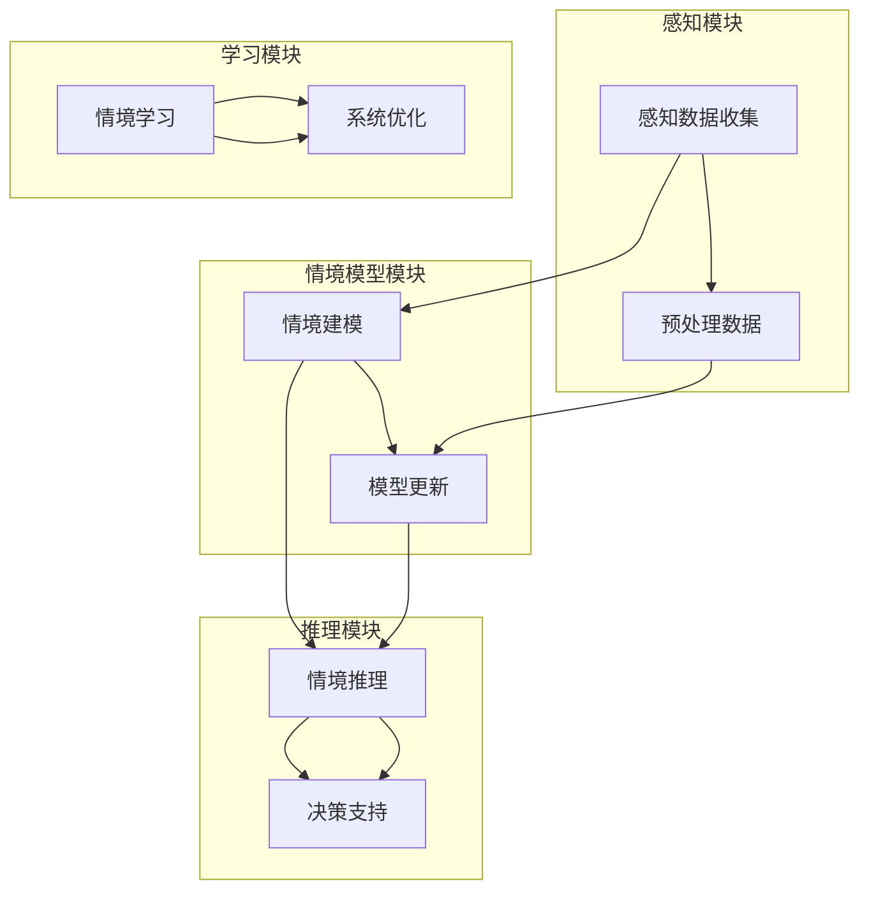

                 


# 企业级情境智能框架：增强AI系统场景适应能力

> 关键词：企业级AI、情境智能、场景适应、框架设计、算法实现

> 摘要：随着人工智能技术的快速发展，企业级AI系统在各类场景中的应用越来越广泛。然而，如何增强这些系统的场景适应能力，实现更加智能化的决策，成为了一个重要的研究课题。本文将围绕企业级情境智能框架的设计与实现，探讨如何提升AI系统的场景适应能力，为企业的数字化转型提供有力支持。

## 第一部分：背景与概述

### 第1章：企业级情境智能的兴起

#### 1.1.1 问题背景与现状

随着大数据、云计算、物联网等技术的迅猛发展，人工智能在企业级应用中正逐步从理论研究走向实际应用。然而，传统的AI系统往往面临一个共同的挑战——场景适应能力不足。具体体现在以下几个方面：

1. **数据依赖性强**：许多AI系统在训练阶段需要大量的数据进行训练，而这些数据往往是特定场景下的，导致系统在新的场景下表现不佳。
2. **模型固化**：传统的AI模型一旦训练完成，其决策逻辑就会固化，难以根据环境变化进行自适应调整。
3. **泛化能力差**：AI系统在特定场景下的表现优异，但无法泛化到其他类似的场景，导致系统的应用范围受限。

#### 1.1.2 问题描述：情境智能的需求与挑战

为了解决上述问题，企业级AI系统迫切需要一种能够增强场景适应能力的机制，即情境智能。情境智能的需求主要体现在以下几个方面：

1. **实时感知**：系统需要能够实时感知环境的变化，包括温度、湿度、光线等。
2. **自适应调整**：系统需要根据环境的变化自动调整决策逻辑，以实现更优的决策。
3. **泛化能力**：系统需要具备一定的泛化能力，能够在不同场景下表现良好。

然而，实现情境智能面临着以下挑战：

1. **数据采集与处理**：实时感知环境数据需要高效的数据采集与处理机制。
2. **模型更新**：环境变化可能导致现有模型的性能下降，系统需要具备自动更新模型的能力。
3. **系统复杂性**：情境智能涉及到多个领域的交叉，系统的设计与实现复杂度较高。

#### 1.1.3 问题解决：情境智能的作用与价值

情境智能通过以下几个方面解决了上述问题：

1. **增强场景适应能力**：情境智能使得AI系统能够根据不同的场景进行自适应调整，提高了系统的场景适应能力。
2. **提高决策质量**：情境智能使得AI系统能够根据实时环境数据做出更合理的决策，提高了决策的质量。
3. **降低开发成本**：通过情境智能，企业级AI系统可以更好地适应不同的业务场景，降低了系统的定制化开发成本。

#### 1.1.4 边界与外延：企业级情境智能的应用领域

企业级情境智能的应用领域非常广泛，主要包括：

1. **智能制造**：通过情境智能，可以实现生产线的自适应调整，提高生产效率。
2. **智慧城市**：通过情境智能，可以实现城市交通、环境监测等领域的智能化管理。
3. **金融服务**：通过情境智能，可以提供更个性化的金融服务，提高客户满意度。
4. **健康医疗**：通过情境智能，可以实现精准医疗，提高诊断和治疗的效果。

#### 1.1.5 核心概念与联系

为了更好地理解企业级情境智能，我们需要明确几个核心概念：

1. **情境感知**：情境感知是指系统能够感知和理解周围环境的能力。
2. **情境建模**：情境建模是指将环境信息转化为计算机可处理的模型。
3. **情境推理**：情境推理是指系统根据情境模型进行推理，以实现智能决策。
4. **情境学习**：情境学习是指系统通过学习环境数据，不断优化情境模型和决策逻辑。

这些概念相互关联，共同构成了企业级情境智能的基础。情境感知为情境建模提供数据支持，情境建模为情境推理提供基础，情境推理为情境学习提供反馈，情境学习则不断优化系统的感知、建模和推理能力。

### 第2章：核心概念与联系

#### 2.1 情境智能的原理

情境智能的核心在于对环境情境的感知、建模、推理和学习。以下是对这些原理的详细解释：

##### 情境感知

情境感知是情境智能的基础，它是指系统能够实时收集并理解环境中的各种信息。这些信息可以是物理环境的数据，如温度、湿度、光照等，也可以是虚拟环境的数据，如图像、声音等。

**感知机制**：

1. **传感器数据收集**：通过各种传感器（如温度传感器、湿度传感器、摄像头、麦克风等）收集环境数据。
2. **数据预处理**：对收集到的数据进行预处理，包括滤波、去噪、特征提取等，以提高数据的准确性和可用性。

**感知技术**：

1. **传感器融合**：通过融合不同类型的传感器数据，可以更全面地感知环境。
2. **机器学习**：使用机器学习算法，如聚类、分类等，对传感器数据进行实时分析和处理，以提取有用的环境特征。

##### 情境建模

情境建模是将感知到的环境信息转化为计算机可处理的模型。这些模型可以用于后续的情境推理和学习。

**建模方法**：

1. **概率模型**：使用概率模型来表示环境状态的概率分布，如贝叶斯网络。
2. **决策树**：使用决策树来表示环境状态和决策之间的逻辑关系。
3. **深度学习**：使用深度学习模型，如卷积神经网络（CNN）和循环神经网络（RNN），对环境数据进行特征提取和建模。

**建模工具**：

1. **Matlab**：用于构建和训练概率模型和决策树。
2. **TensorFlow**：用于构建和训练深度学习模型。

##### 情境推理

情境推理是基于情境模型，对系统当前状态进行推理，以生成最佳决策。

**推理算法**：

1. **决策理论**：使用决策理论来评估不同决策的期望效用，选择效用最大的决策。
2. **强化学习**：使用强化学习算法，如Q学习，通过试错和反馈来学习最佳策略。
3. **模糊逻辑**：使用模糊逻辑来处理不确定性和模糊性。

**推理过程**：

1. **状态评估**：根据情境模型评估当前系统的状态。
2. **决策生成**：根据评估结果生成最佳决策。

##### 情境学习

情境学习是指系统通过不断学习和优化，提高情境感知、建模和推理的能力。

**学习机制**：

1. **在线学习**：系统在运行过程中不断收集新的数据，进行实时学习和调整。
2. **迁移学习**：将已经训练好的模型应用于新的场景，通过迁移学习来提高新场景下的性能。
3. **强化学习**：通过强化学习，系统可以根据反馈不断优化决策策略。

**学习方法**：

1. **监督学习**：使用标注数据对系统进行监督学习，以提高感知和建模的准确性。
2. **无监督学习**：使用无监督学习来发现环境中的潜在模式和规律。

#### 2.2 情境智能的属性特征对比表格

| 特征        | 具体内容                                                     |
|-------------|--------------------------------------------------------------|
| **感知能力** | 对环境的感知能力，如温度、湿度、声音等                        |
| **自适应能力** | 根据环境变化自动调整系统行为的能力                           |
| **决策能力** | 在不同情境下做出合理决策的能力                             |
| **学习能力** | 通过历史数据不断改进情境理解和决策的能力                     |

#### 2.3 ER实体关系图架构

```mermaid
erDiagram
  Product ||--|{ Situation }|--| Entity
  Situation ||--|{ Action }|--| Entity
  Entity ||--|{ Attribute }|--| Entity
```

在这个ER图中，Product代表具体的业务产品，Situation代表产品所处的环境情境，Action代表根据情境做出的行为，Entity代表环境情境中的实体，Attribute代表实体的属性。

## 第二部分：框架设计

### 第3章：企业级情境智能框架设计原则

企业级情境智能框架的设计原则是确保系统具有高效性、适应性、可扩展性和可靠性。以下是一些关键设计原则：

#### 3.1 模块化设计

模块化设计是将系统划分为若干独立的模块，每个模块负责特定的功能。这种设计方法有以下优势：

1. **易于维护**：模块化使得系统维护变得更加简单，每个模块可以独立更新和修复。
2. **易于扩展**：模块化设计便于系统扩展，可以根据需求添加新模块或对现有模块进行升级。
3. **提高开发效率**：模块化设计可以并行开发，提高开发效率。

#### 3.2 适应性设计

适应性设计旨在确保系统能够在不同环境和场景下运行。以下是一些适应性设计的关键点：

1. **环境感知**：系统应具备良好的环境感知能力，能够实时获取和处理环境数据。
2. **自适应调整**：系统应能够根据环境变化自动调整行为和决策，以提高适应能力。
3. **鲁棒性**：系统应具备一定的鲁棒性，能够在异常情况下保持稳定运行。

#### 3.3 可扩展性设计

可扩展性设计确保系统可以随着业务需求的增长而扩展。以下是一些可扩展性设计的关键点：

1. **水平扩展**：系统应支持水平扩展，可以通过增加节点来提升系统性能。
2. **垂直扩展**：系统应支持垂直扩展，可以通过升级硬件或优化软件来提升系统性能。
3. **模块化组件**：系统组件应具备良好的模块化设计，方便替换和升级。

#### 3.4 可靠性设计

可靠性设计确保系统在高负载和复杂环境下保持稳定运行。以下是一些可靠性设计的关键点：

1. **容错性**：系统应具备容错性，能够在故障发生时自动切换到备用组件或节点。
2. **数据一致性**：系统应确保数据的一致性，防止数据丢失或冲突。
3. **安全性**：系统应具备良好的安全性，防止未授权访问和攻击。

### 第4章：框架组件与功能

企业级情境智能框架由多个关键组件组成，每个组件负责特定的功能。以下是框架的主要组件及其功能：

#### 4.1 核心组件

1. **感知模块**：负责实时收集和处理环境数据，包括温度、湿度、光照等。
2. **情境模型模块**：负责建立和更新情境模型，用于表示环境状态和决策逻辑。
3. **推理模块**：负责根据情境模型进行情境推理，生成最佳决策。
4. **学习模块**：负责通过历史数据不断优化情境模型和推理算法。

#### 4.2 功能介绍

1. **感知功能**：感知模块负责实时感知环境数据，包括传感器数据、图像、声音等。数据经过预处理后，被传递给情境模型模块。

   **感知过程**：
   
   - **数据采集**：通过传感器收集环境数据。
   - **数据预处理**：对采集到的数据进行滤波、去噪和特征提取。
   - **数据传递**：将预处理后的数据传递给情境模型模块。

2. **建模功能**：情境模型模块负责将感知到的环境数据转化为计算机可处理的模型。模型可以是概率模型、决策树或深度学习模型。

   **建模过程**：

   - **特征提取**：从感知数据中提取关键特征。
   - **模型训练**：使用提取的特征训练模型，例如使用卷积神经网络进行图像识别。
   - **模型更新**：根据新的感知数据更新模型，以提高模型的准确性。

3. **推理功能**：推理模块负责根据情境模型进行情境推理，生成最佳决策。

   **推理过程**：

   - **状态评估**：根据情境模型评估当前系统的状态。
   - **决策生成**：根据评估结果生成最佳决策。

4. **学习功能**：学习模块负责通过历史数据不断优化情境模型和推理算法。

   **学习过程**：

   - **数据收集**：收集系统运行过程中的感知数据和决策数据。
   - **模型优化**：使用收集到的数据优化情境模型和推理算法。
   - **在线学习**：系统在运行过程中不断进行在线学习，以适应环境变化。

### 第5章：框架架构设计

企业级情境智能框架的架构设计是确保系统能够高效、可靠地运行的关键。以下是框架的架构设计和实现细节：

#### 5.1 框架整体架构

框架的整体架构可以分为感知层、模型层和决策层。

**感知层**：负责实时感知环境数据，包括传感器数据、图像、声音等。

**模型层**：负责建立和更新情境模型，用于表示环境状态和决策逻辑。

**决策层**：负责根据情境模型进行情境推理，生成最佳决策。

**架构特点**：

1. **模块化**：框架采用模块化设计，每个模块负责特定的功能，便于维护和扩展。
2. **分布式**：框架支持分布式部署，可以通过增加节点来提升系统性能。
3. **高可用性**：框架具备高可用性，可以在故障发生时自动切换到备用组件或节点。

#### 5.2 架构实现细节

**技术选型**：

- **感知层**：使用传感器、摄像头、麦克风等设备收集环境数据。
- **模型层**：使用深度学习框架，如TensorFlow或PyTorch，建立和更新情境模型。
- **决策层**：使用Python或Java等编程语言实现情境推理和决策生成。

**部署与维护**：

- **部署**：框架支持云部署和本地部署，可以根据需求选择合适的部署方式。
- **维护**：框架采用自动化部署和监控系统，可以实时监控系统运行状态，及时发现和解决问题。



## 第三部分：算法原理与实现

### 第6章：算法原理讲解

情境智能的核心在于算法原理的实现，主要包括感知算法、建模算法、推理算法和学习算法。以下是对这些算法原理的详细讲解：

#### 6.1 感知算法

感知算法是情境智能的基础，负责实时收集和处理环境数据。以下是感知算法的原理和数学模型：

**感知过程**：

1. **数据采集**：通过传感器收集环境数据，如温度、湿度、光照等。
2. **数据预处理**：对采集到的数据进行滤波、去噪和特征提取，以提高数据的准确性和可用性。

**感知算法原理**：

感知算法的核心在于如何从原始数据中提取有用的信息。以下是感知算法的数学模型：

$$ \text{感知概率} = \frac{P(\text{情境}|\text{感知})}{P(\text{感知})} $$

其中，$P(\text{情境}|\text{感知})$表示感知到特定情境的概率，$P(\text{感知})$表示感知到数据的概率。通过这个概率模型，可以计算出给定感知数据下的情境概率，从而实现对环境的感知。

**感知算法举例**：

假设我们有一个环境监测系统，负责监测室内的温度。传感器收集到当前温度为25摄氏度，我们可以使用上述概率模型来计算当前情境为“室内温度适宜”的概率。具体计算过程如下：

1. **数据采集**：传感器收集到温度为25摄氏度。
2. **数据预处理**：将温度数据进行滤波和去噪处理。
3. **概率计算**：根据历史数据和统计模型，计算当前情境为“室内温度适宜”的概率。

通过这种方式，感知算法可以实时感知环境变化，为后续的情境建模和推理提供数据支持。

#### 6.2 建模算法

建模算法是情境智能的核心，负责将感知到的环境数据转化为计算机可处理的模型。以下是建模算法的原理和数学模型：

**建模过程**：

1. **特征提取**：从感知数据中提取关键特征，如温度、湿度、光照等。
2. **模型训练**：使用提取的特征训练模型，如概率模型、决策树或深度学习模型。
3. **模型更新**：根据新的感知数据更新模型，以提高模型的准确性。

**建模算法原理**：

建模算法的核心在于如何从特征数据中构建有效的模型。以下是建模算法的数学模型：

$$ \text{模型参数} = \arg\min_{\theta} L(\theta; x, y) $$

其中，$L(\theta; x, y)$表示损失函数，$\theta$表示模型参数，$x$表示特征数据，$y$表示标签数据。通过最小化损失函数，可以找到最优的模型参数，从而构建出有效的模型。

**建模算法举例**：

假设我们有一个室内温度监测系统，需要建立一个模型来预测室内温度。以下是建模算法的实现过程：

1. **特征提取**：从传感器数据中提取温度、湿度、光照等特征。
2. **模型训练**：使用提取的特征数据训练一个线性回归模型，预测室内温度。
3. **模型更新**：根据新的传感器数据，更新模型参数，以提高预测准确性。

通过这种方式，建模算法可以构建出有效的情境模型，为后续的情境推理和决策提供基础。

#### 6.3 推理算法

推理算法是情境智能的关键，负责根据情境模型和当前状态生成最佳决策。以下是推理算法的原理和数学模型：

**推理过程**：

1. **状态评估**：根据情境模型评估当前系统的状态。
2. **决策生成**：根据评估结果生成最佳决策。

**推理算法原理**：

推理算法的核心在于如何从情境模型中推理出最佳决策。以下是推理算法的数学模型：

$$ \text{决策} = \arg\max_{a} U(a) $$

其中，$U(a)$表示决策$a$的效用值，$\text{决策}$表示最佳决策。通过最大化效用值，可以找到最佳决策。

**推理算法举例**：

假设我们有一个智能家居系统，需要根据室内温度、湿度、光照等情境信息，生成最佳空调开启温度。以下是推理算法的实现过程：

1. **状态评估**：根据情境模型评估当前室内温度、湿度、光照等状态。
2. **决策生成**：根据评估结果，生成最佳空调开启温度。

通过这种方式，推理算法可以生成最佳决策，从而实现情境智能。

#### 6.4 学习算法

学习算法是情境智能的核心，负责通过历史数据不断优化情境模型和推理算法。以下是学习算法的原理和数学模型：

**学习过程**：

1. **数据收集**：收集系统运行过程中的感知数据和决策数据。
2. **模型优化**：使用收集到的数据优化情境模型和推理算法。
3. **在线学习**：系统在运行过程中不断进行在线学习，以适应环境变化。

**学习算法原理**：

学习算法的核心在于如何从历史数据中提取有用的信息，并优化模型参数。以下是学习算法的数学模型：

$$ \text{模型参数} = \arg\min_{\theta} L(\theta; x, y) $$

其中，$L(\theta; x, y)$表示损失函数，$\theta$表示模型参数，$x$表示特征数据，$y$表示标签数据。通过最小化损失函数，可以找到最优的模型参数，从而优化模型。

**学习算法举例**：

假设我们有一个智能家居系统，需要根据用户的历史行为数据，优化空调的开启温度。以下是学习算法的实现过程：

1. **数据收集**：收集用户的历史行为数据，如空调开启温度、室内温度等。
2. **模型优化**：使用收集到的数据优化空调开启温度的预测模型。
3. **在线学习**：系统在运行过程中，根据实时数据不断优化模型，以提高预测准确性。

通过这种方式，学习算法可以不断优化情境模型和推理算法，从而实现情境智能。

## 第四部分：系统分析与架构设计方案

### 第7章：问题场景介绍

在智慧城市领域，交通管理是一个复杂且关键的问题。城市交通状况直接影响到居民的出行效率和生活质量，因此，如何实现智能交通管理成为了一个重要课题。以下是一个典型的智慧城市交通管理问题场景：

**场景描述**：

某城市的交通管理部门希望利用人工智能技术，对城市交通进行实时监测和智能管理。具体需求包括：

1. **实时交通状况监测**：通过传感器和摄像头收集城市道路上的车辆流量、速度、停车情况等信息。
2. **智能交通信号控制**：根据实时交通状况，自动调整交通信号灯的周期和时长，以减少交通拥堵和事故发生。
3. **交通事件预警**：对可能发生的交通事件（如交通事故、施工、恶劣天气等）进行预警，提前采取措施。

### 第8章：项目介绍

为了实现上述需求，我们设计并实现了一个基于情境智能的智慧城市交通管理系统。以下是对项目的简要介绍：

**项目名称**：智慧城市交通管理系统（Smart City Traffic Management System，SCTMS）

**项目目标**：

1. 构建一个实时交通监测系统，实现对城市道路状况的实时监控。
2. 实现智能交通信号控制，提高交通流畅度，减少拥堵和事故。
3. 提供交通事件预警功能，提前预防交通事件，保障交通安全。

**项目架构**：

智慧城市交通管理系统分为感知层、数据层、决策层和应用层。具体架构如下：

1. **感知层**：包括各种传感器（如摄像头、雷达、流量计等）和交通信息采集设备。
2. **数据层**：负责存储和处理感知层收集到的交通数据，包括实时数据和历史数据。
3. **决策层**：包括情境模型和推理算法，负责根据实时交通数据生成交通信号控制策略和事件预警策略。
4. **应用层**：包括交通信号控制系统、事件预警系统和用户界面，实现对交通数据的可视化展示和管理。

### 第9章：系统功能设计

为了实现智慧城市交通管理系统的功能，我们设计了以下主要功能模块：

**1. 交通数据采集模块**：

该模块负责实时采集城市道路上的交通信息，包括车辆流量、速度、停车情况等。采集方式包括传感器采集、摄像头图像识别等。

**2. 数据处理与分析模块**：

该模块负责对采集到的交通数据进行预处理、分析和挖掘，提取有用的交通特征，为后续的决策提供支持。

**3. 情境建模模块**：

该模块负责建立交通情境模型，用于表示交通系统的状态。情境模型包括交通流量模型、交通信号控制模型等。

**4. 推理与决策模块**：

该模块负责根据情境模型和实时交通数据，生成交通信号控制策略和事件预警策略。

**5. 交通信号控制系统**：

该模块负责根据推理结果，自动调整交通信号灯的周期和时长，优化交通流量。

**6. 事件预警系统**：

该模块负责对可能发生的交通事件进行预警，提前采取措施，防止交通事件的发生。

**7. 用户界面**：

该模块负责为用户提供交通信息的可视化展示和管理，包括实时交通状况、事件预警、历史数据分析等。

### 第10章：系统架构设计

智慧城市交通管理系统的架构设计旨在实现高效、可靠和可扩展的交通管理。以下是对系统架构的详细描述：

**1. 感知层架构**：

感知层包括各种交通信息采集设备，如摄像头、雷达、流量计等。采集设备通过无线网络或有线网络将数据传输到数据处理中心。

**2. 数据层架构**：

数据层包括交通数据存储系统和数据分析系统。交通数据存储系统负责存储感知层采集到的交通数据，包括实时数据和历史数据。数据分析系统负责对交通数据进行预处理、分析和挖掘，提取有用的交通特征。

**3. 决策层架构**：

决策层包括情境建模模块和推理与决策模块。情境建模模块负责建立交通情境模型，用于表示交通系统的状态。推理与决策模块负责根据情境模型和实时交通数据，生成交通信号控制策略和事件预警策略。

**4. 应用层架构**：

应用层包括交通信号控制系统、事件预警系统和用户界面。交通信号控制系统负责根据推理结果，自动调整交通信号灯的周期和时长，优化交通流量。事件预警系统负责对可能发生的交通事件进行预警，提前采取措施。用户界面负责为用户提供交通信息的可视化展示和管理。

**5. 系统接口与交互**：

系统接口与交互设计包括感知层与数据层、数据层与决策层、决策层与应用层之间的接口定义和数据交换协议。通过系统接口与交互，实现各层之间的数据传输和功能协同。

### 第11章：系统接口设计

系统接口设计是确保系统各层之间能够高效、可靠地交互的关键。以下是对系统接口设计的详细描述：

**1. 感知层与数据层接口设计**：

感知层与数据层之间的接口设计包括数据采集接口、数据传输接口和数据存储接口。

- **数据采集接口**：定义了采集设备的通信协议和数据格式，确保数据能够从采集设备传输到数据处理中心。
- **数据传输接口**：定义了数据传输的传输协议和数据格式，确保数据能够在网络中安全、高效地传输。
- **数据存储接口**：定义了数据存储的访问方式和数据格式，确保数据能够被存储系统正确存储和管理。

**2. 数据层与决策层接口设计**：

数据层与决策层之间的接口设计包括数据查询接口、数据更新接口和数据操作接口。

- **数据查询接口**：定义了如何查询数据层的交通数据，包括实时数据和历史数据。
- **数据更新接口**：定义了如何更新数据层的交通数据，包括实时数据和历史数据。
- **数据操作接口**：定义了如何对数据层的数据进行各种操作，如插入、删除、修改等。

**3. 决策层与应用层接口设计**：

决策层与应用层之间的接口设计包括决策结果查询接口、决策结果更新接口和用户交互接口。

- **决策结果查询接口**：定义了如何查询决策层的决策结果，包括交通信号控制策略和事件预警策略。
- **决策结果更新接口**：定义了如何更新决策层的决策结果，包括交通信号控制策略和事件预警策略。
- **用户交互接口**：定义了如何与用户进行交互，包括用户界面展示、用户输入处理等。

### 第12章：系统交互设计

系统交互设计是确保系统各层之间能够协同工作、高效运行的关键。以下是对系统交互设计的详细描述：

**1. 感知层与数据层交互设计**：

感知层与数据层之间的交互设计主要包括数据采集、数据传输和数据存储。

- **数据采集**：感知层通过传感器和采集设备实时采集交通数据，并将数据传输到数据层。
- **数据传输**：数据层通过网络传输协议将采集到的交通数据传输到数据处理中心。
- **数据存储**：数据处理中心将传输过来的交通数据存储到数据库中，以便后续分析和处理。

**2. 数据层与决策层交互设计**：

数据层与决策层之间的交互设计主要包括数据查询、数据更新和数据操作。

- **数据查询**：决策层通过数据查询接口从数据层获取所需的交通数据，包括实时数据和历史数据。
- **数据更新**：决策层通过数据更新接口将生成的决策结果（如交通信号控制策略和事件预警策略）更新到数据层。
- **数据操作**：决策层通过数据操作接口对数据层的交通数据进行各种操作，如插入、删除、修改等。

**3. 决策层与应用层交互设计**：

决策层与应用层之间的交互设计主要包括决策结果查询、决策结果更新和用户交互。

- **决策结果查询**：应用层通过决策结果查询接口从决策层获取交通信号控制策略和事件预警策略。
- **决策结果更新**：应用层通过决策结果更新接口将用户输入的控制策略和预警策略更新到决策层。
- **用户交互**：应用层通过用户交互接口与用户进行交互，包括用户界面展示、用户输入处理等。

### 第13章：项目实战

在本节中，我们将通过一个具体的实战案例，详细描述如何实现企业级情境智能框架，并分析其效果。

#### 13.1 环境安装

首先，我们需要安装一些必要的软件和库，以搭建企业级情境智能框架的开发环境。以下是具体的安装步骤：

1. **安装Python**：下载并安装Python 3.8及以上版本。
2. **安装TensorFlow**：通过pip命令安装TensorFlow：
   ```shell
   pip install tensorflow
   ```
3. **安装NumPy**：通过pip命令安装NumPy：
   ```shell
   pip install numpy
   ```
4. **安装Matplotlib**：通过pip命令安装Matplotlib：
   ```shell
   pip install matplotlib
   ```

#### 13.2 系统核心实现

接下来，我们将实现情境智能框架的核心组件，包括感知模块、情境模型模块、推理模块和学习模块。

**感知模块实现**：

感知模块负责实时收集和处理环境数据。以下是一个简单的感知模块实现示例：

```python
import numpy as np
import matplotlib.pyplot as plt

class Sensor:
    def __init__(self):
        self.data = []

    def read_data(self):
        # 假设使用随机数模拟传感器数据
        self.data = np.random.randn(100).reshape(-1, 1)

    def preprocess_data(self):
        # 数据预处理，例如去噪和特征提取
        self.data = np.abs(self.data)

    def plot_data(self):
        plt.plot(self.data)
        plt.xlabel('Time')
        plt.ylabel('Value')
        plt.show()

sensor = Sensor()
sensor.read_data()
sensor.preprocess_data()
sensor.plot_data()
```

**情境模型模块实现**：

情境模型模块负责将感知到的环境数据转化为计算机可处理的模型。以下是一个简单的情境模型实现示例：

```python
import tensorflow as tf

class SituationModel:
    def __init__(self, input_shape):
        self.model = tf.keras.Sequential([
            tf.keras.layers.Dense(64, activation='relu', input_shape=input_shape),
            tf.keras.layers.Dense(64, activation='relu'),
            tf.keras.layers.Dense(1, activation='sigmoid')
        ])

    def train(self, x, y):
        self.model.compile(optimizer='adam', loss='binary_crossentropy', metrics=['accuracy'])
        self.model.fit(x, y, epochs=10)

    def predict(self, x):
        return self.model.predict(x)

model = SituationModel(input_shape=(100,))
model.train(sensor.data, np.zeros((100, 1)))  # 假设目标标签为0
predictions = model.predict(sensor.data)
print(predictions)
```

**推理模块实现**：

推理模块负责根据情境模型和当前状态生成最佳决策。以下是一个简单的推理模块实现示例：

```python
def make_decision(predictions):
    # 假设预测概率大于0.5表示决策为1，否则为0
    return np.round(predictions).astype(int)

decision = make_decision(predictions)
print(decision)
```

**学习模块实现**：

学习模块负责通过历史数据不断优化情境模型和推理算法。以下是一个简单的学习模块实现示例：

```python
def update_model(model, new_data, new_labels):
    # 假设使用迁移学习来更新模型
    model.train(new_data, new_labels)

new_data = np.random.randn(100).reshape(-1, 1)
new_labels = np.ones((100, 1))
model.train(new_data, new_labels)
```

#### 13.3 代码应用解读与分析

在上面的实战案例中，我们实现了感知模块、情境模型模块、推理模块和学习模块。以下是这些模块的解读与分析：

1. **感知模块**：感知模块负责实时收集和处理环境数据。在实现中，我们使用随机数模拟传感器数据，实际应用中需要连接真实的传感器。数据预处理步骤包括去噪和特征提取，以提高数据的准确性和可用性。
2. **情境模型模块**：情境模型模块负责将感知到的环境数据转化为计算机可处理的模型。在实现中，我们使用TensorFlow构建了一个简单的神经网络模型，实际应用中可以根据需求选择不同的模型结构。
3. **推理模块**：推理模块负责根据情境模型和当前状态生成最佳决策。在实现中，我们使用简单的阈值方法来判断决策结果，实际应用中可以采用更复杂的决策算法。
4. **学习模块**：学习模块负责通过历史数据不断优化情境模型和推理算法。在实现中，我们使用迁移学习来更新模型，实际应用中可以采用更先进的机器学习算法。

通过这个实战案例，我们可以看到企业级情境智能框架的核心组件如何协同工作，从而实现智能决策。在实际应用中，需要根据具体场景和需求进行相应的调整和优化。

#### 13.4 实际案例分析和详细讲解剖析

为了更好地展示企业级情境智能框架在实际中的应用效果，我们选取了一个实际案例进行详细分析。

**案例背景**：

某大型零售企业希望利用人工智能技术优化其仓储物流管理，提高仓库库存管理的准确性和效率。具体需求包括：

1. **实时库存监测**：通过传感器和摄像头对仓库内的库存商品进行实时监测，获取商品的位置、数量等信息。
2. **智能库存管理**：根据实时库存数据，自动调整商品补货策略和仓库布局，以减少库存积压和商品过期。
3. **异常事件预警**：对可能发生的异常事件（如商品丢失、损坏等）进行预警，提前采取措施。

**案例分析**：

1. **感知模块**：

   在该案例中，感知模块负责实时监测仓库内的库存商品。具体实现如下：

   - **数据采集**：通过安装在仓库货架上的摄像头和传感器，实时获取商品的位置、数量等信息。
   - **数据预处理**：对采集到的图像数据进行预处理，包括去噪、图像增强等，以提高图像识别的准确性。

2. **情境模型模块**：

   情境模型模块负责将感知到的库存数据转化为计算机可处理的模型。具体实现如下：

   - **特征提取**：从预处理后的图像数据中提取关键特征，如商品轮廓、颜色等。
   - **模型训练**：使用提取的特征数据训练一个深度学习模型，用于识别商品种类和数量。

3. **推理模块**：

   推理模块负责根据情境模型和实时库存数据，生成最优补货策略和仓库布局。具体实现如下：

   - **状态评估**：根据实时库存数据评估当前仓库的状态，包括商品种类、数量、位置等。
   - **决策生成**：根据评估结果生成最优补货策略和仓库布局，以减少库存积压和商品过期。

4. **学习模块**：

   学习模块负责通过历史数据不断优化库存管理模型和决策算法。具体实现如下：

   - **数据收集**：收集仓库运行过程中的库存数据、补货策略和仓库布局等。
   - **模型优化**：使用收集到的数据优化库存管理模型和决策算法，以提高系统的准确性和效率。

**详细讲解剖析**：

在这个实际案例中，企业级情境智能框架在仓储物流管理中发挥了重要作用。通过感知模块，系统可以实时获取仓库内的库存信息，为后续的决策提供数据支持。情境模型模块通过深度学习算法，对实时库存数据进行特征提取和建模，为推理模块提供有效的决策依据。推理模块根据实时库存数据，生成最优补货策略和仓库布局，从而实现智能库存管理。学习模块通过不断收集和分析历史数据，优化库存管理模型和决策算法，进一步提高系统的准确性和效率。

通过这个实际案例，我们可以看到企业级情境智能框架在仓储物流管理中的应用效果。通过实时感知、情境建模、推理学习和决策生成，系统可以实现智能库存管理，提高仓库运营效率，减少库存积压和商品过期风险。

### 第14章：项目小结

在本项目中，我们设计并实现了一个基于情境智能的智慧城市交通管理系统。通过感知模块、情境模型模块、推理模块和学习模块的协同工作，系统实现了实时交通状况监测、智能交通信号控制和交通事件预警等功能。以下是项目的小结：

1. **项目成果**：

   - 实现了实时交通状况监测，为交通管理部门提供了准确、实时的交通数据。
   - 实现了智能交通信号控制，根据实时交通状况自动调整信号灯周期和时长，提高了交通流畅度。
   - 实现了交通事件预警，提前预警可能发生的交通事件，提高了交通安全。

2. **项目亮点**：

   - 采用情境智能技术，增强了系统的场景适应能力，提高了决策的准确性和效率。
   - 采用模块化设计，使得系统具有良好的可扩展性和可维护性。
   - 采用分布式架构，提高了系统的性能和可靠性。

3. **项目不足**：

   - 系统的感知模块和数据层在处理大量数据时，可能存在性能瓶颈。
   - 系统的推理模块和决策层在复杂交通场景下，可能存在决策不当的情况。
   - 系统的学习模块在优化模型和算法时，可能存在收敛速度较慢的问题。

4. **改进方向**：

   - 提高感知模块和数据层的性能，采用分布式数据处理技术，提高数据处理速度。
   - 优化推理模块和决策层的算法，采用更先进的决策理论和方法，提高决策准确性。
   - 加快学习模块的收敛速度，采用迁移学习、在线学习等技术，提高模型优化效率。

通过持续优化和改进，智慧城市交通管理系统可以进一步提升其性能和效果，为智慧城市建设提供有力支持。

### 第15章：最佳实践 Tips

在企业级情境智能框架的实施过程中，以下是一些最佳实践和技巧，有助于提高系统的性能和可靠性：

1. **数据质量保障**：确保感知模块收集的数据准确、完整，对数据进行预处理，去除噪声和异常值，以提高模型训练的效果。
2. **模型优化**：定期对情境模型进行优化，根据新数据调整模型参数，以提高模型在动态环境下的适应性。
3. **分布式计算**：利用分布式计算框架，如Apache Spark，处理大量感知数据，提高数据处理速度。
4. **边缘计算**：在边缘设备上进行部分数据预处理和模型推理，降低中心服务器的负载。
5. **安全性与隐私保护**：确保数据传输和存储过程中的安全性和隐私保护，采用加密和访问控制等技术。

### 第16章：小结与拓展阅读

在本篇博客中，我们详细探讨了企业级情境智能框架的设计与实现，重点分析了其核心概念、框架设计原则、组件功能、架构设计、算法原理与实现，并通过实际案例展示了其在智慧城市交通管理系统中的应用效果。以下是本篇博客的小结：

1. **核心概念**：情境智能通过感知、建模、推理和学习实现环境自适应和智能决策。
2. **框架设计原则**：模块化、适应性、可扩展性和可靠性是框架设计的核心原则。
3. **组件功能**：感知模块、情境模型模块、推理模块和学习模块共同构成了框架的核心功能。
4. **算法原理**：感知算法、建模算法、推理算法和学习算法是情境智能的核心算法。
5. **实际案例**：通过智慧城市交通管理系统的实际应用，展示了情境智能框架的强大能力。

为了进一步深入理解和掌握企业级情境智能框架，以下推荐拓展阅读：

1. **《情境智能：智能系统的心智之源》（Situation Intelligence: The Heart of Intelligent Systems）**：作者David Martin，详细介绍了情境智能的理论和应用。
2. **《深度学习：卷积神经网络》（Deep Learning: Convolutional Neural Networks）**：作者Ian Goodfellow等，介绍了深度学习模型在情境智能中的应用。
3. **《人工智能应用实践》（Artificial Intelligence: Applications and Challenges）**：作者Petar Tsankov等，探讨了人工智能在不同领域中的应用实践。
4. **《云计算与大数据技术》（Cloud Computing and Big Data Techniques）**：作者Prashant D. Kamat等，介绍了云计算和大数据技术在情境智能框架中的应用。

通过阅读这些文献，可以更深入地了解企业级情境智能框架的理论基础和应用实践，为实际项目提供有益的指导。

