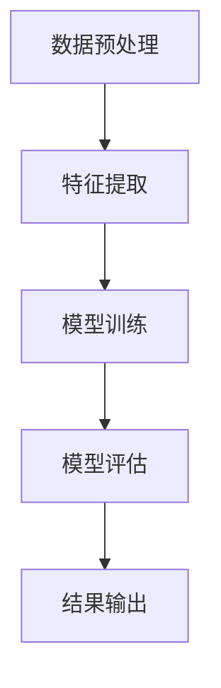
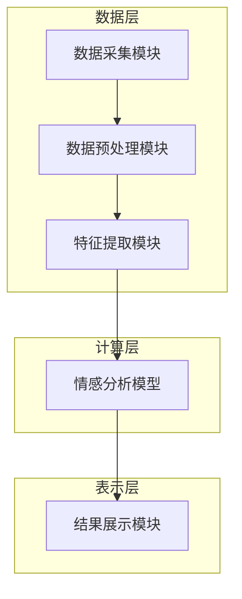
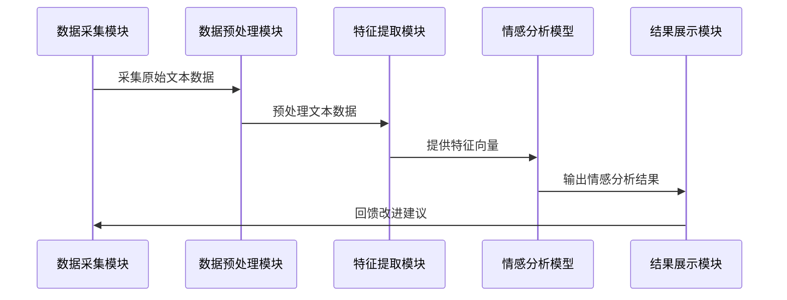
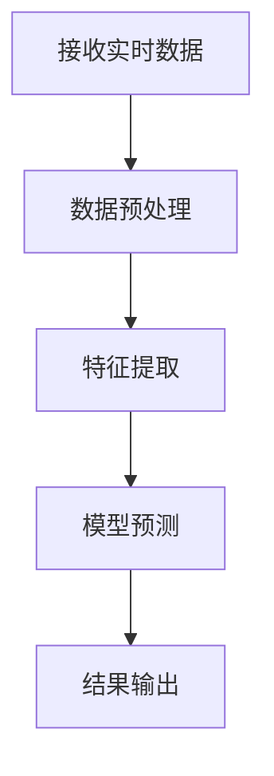

                 

### 引言与背景介绍

在当今快速发展的商业环境中，企业的成功越来越依赖于对客户反馈的深入理解和及时响应。客户反馈不仅反映了客户对产品或服务的直接体验，还为企业的战略决策提供了宝贵的见解。随着社交媒体和在线平台的兴起，客户反馈数据的规模和多样性也在不断增加。因此，如何高效地分析这些大量且复杂的情感数据，成为了一个亟待解决的问题。

情感分析（Sentiment Analysis），也称为意见挖掘，是自然语言处理（NLP）的一个重要分支，旨在通过识别文本中的情感倾向，对客户反馈进行分类和分析。通过情感分析，企业可以识别客户的满意度和不满点，从而优化产品和服务，提升客户体验，甚至发现潜在的市场机会。

本篇文章将深入探讨企业级情感分析平台的设计与实现，分为以下几个部分：

1. **核心概念**：介绍情感分析的定义、重要性及其应用领域。
2. **数据预处理**：讨论数据清洗、标注和特征提取等预处理步骤。
3. **情感分析模型**：分析传统机器学习和深度学习方法在情感分析中的应用。
4. **算法原理**：详细阐述情感分析算法的流程、数学模型和Python实现。
5. **应用实例**：通过实际案例展示情感分析的应用效果。
6. **系统架构设计**：介绍情感分析系统的整体架构，包括功能设计、架构设计和接口设计。
7. **实时情感分析**：探讨实时情感分析算法的实现和性能优化。
8. **大规模平台设计**：分析大规模情感分析平台的架构和数据处理技术。
9. **客户反馈处理**：讨论客户反馈处理流程、算法和优化策略。
10. **最佳实践与总结**：总结情感分析平台的设计和实现中的最佳实践，并提供注意事项和拓展阅读。

通过本文的逐步分析，我们希望能够帮助读者深入理解企业级情感分析平台的设计与实现，从而在数据驱动的商业决策中取得更好的效果。

## 1.2 问题描述

尽管情感分析技术在近年来取得了显著进步，但在实际应用中仍然面临诸多挑战。首先，数据质量问题是一个关键难题。客户反馈文本通常包含大量的噪声、错别字和方言，这些都会对情感分析的准确性产生负面影响。此外，不同文本之间的情感强度和情感倾向可能存在很大的差异，使得情感分类任务变得更加复杂。

其次，算法的多样性和复杂性也是一个挑战。现有的情感分析算法包括传统机器学习方法和深度学习方法，每种方法都有其优缺点。如何选择合适的算法，并在不同应用场景中对其进行调整和优化，是一个需要深入研究和实践的问题。

最后，系统的实时性和扩展性也是一个重要的考量因素。企业需要能够在海量数据中快速、准确地提取情感信息，以便及时做出决策。同时，随着数据规模的不断扩大，系统需要具备良好的扩展性，以支持更高的并发处理能力和更广泛的应用场景。

通过本文的深入探讨，我们希望能够系统地解决上述问题，为读者提供关于企业级情感分析平台设计的全面指导。

## 1.3 问题解决

针对上述挑战，解决企业级情感分析问题需要从多个方面进行综合考虑和系统设计。以下是一些关键步骤和策略：

### 1. 数据预处理

数据预处理是情感分析的基础，其质量直接影响到后续分析结果的准确性。首先，需要进行文本清洗，去除文本中的噪声，如HTML标签、URL、特殊字符等。然后，可以通过分词、词性标注等手段对文本进行结构化处理，以便后续的特征提取。

- **数据清洗**：利用正则表达式和清洗库（如Python的`re`模块）去除噪声数据。
- **文本结构化**：使用自然语言处理库（如NLTK或spaCy）进行分词、词性标注等操作。

### 2. 算法选择与优化

选择合适的情感分析算法并对其进行优化，是提高分析准确性的关键。传统机器学习方法如朴素贝叶斯、支持向量机（SVM）等，在处理简单情感分类任务时表现出色。而深度学习方法如卷积神经网络（CNN）、循环神经网络（RNN）和变换器（Transformer）等，则在处理复杂文本数据时具有明显优势。

- **传统机器学习方法**：适用于简单情感分类任务，如使用朴素贝叶斯和SVM进行情感分类。
- **深度学习方法**：适用于复杂文本数据，如使用CNN或Transformer进行情感分类。

### 3. 实时情感分析

为了满足企业对实时性需求的紧迫性，需要设计高效的实时情感分析系统。实时分析可以通过分布式计算和流处理技术实现，如使用Apache Kafka进行实时数据流处理，并结合Flink或Spark进行实时分析。

- **分布式计算**：通过分布式计算框架（如Hadoop或Spark）处理大规模数据。
- **流处理技术**：使用流处理框架（如Apache Kafka或Flink）进行实时数据处理。

### 4. 大规模数据处理

随着数据规模的不断扩大，如何处理大规模数据成为了一个关键问题。分布式数据处理技术如MapReduce和Spark，能够有效处理海量数据，提高系统的扩展性和处理效率。

- **MapReduce**：适用于离线批量数据处理。
- **Spark**：适用于实时数据处理和大规模数据处理。

### 5. 客户反馈优化

通过对客户反馈的实时分析，企业可以识别出产品或服务的不足，并采取相应的优化措施。例如，通过分析客户反馈中的负面情感，可以针对性地改进产品功能，提升客户满意度。

- **反馈分析**：对客户反馈进行分类和分析，识别负面情感和改进点。
- **优化策略**：根据分析结果，制定具体的优化措施，如改进产品设计、提高服务质量等。

通过上述步骤和策略，企业可以构建一个高效、准确、实时的大规模情感分析平台，从而更好地理解和利用客户反馈，实现数据驱动的业务优化。

## 1.4 边界与外延

在构建企业级情感分析平台时，需要明确其边界和适用范围。首先，情感分析平台的边界主要涉及以下几个方面：

- **数据源**：情感分析平台的数据源可以是社交媒体、在线评论、客服反馈等多种渠道。但需要注意的是，不同数据源的文本质量和情感表达的多样性可能存在差异，这需要平台在设计时进行适应性处理。

- **文本语言**：情感分析平台通常支持多种语言，但不同语言在情感表达上有其独特性。例如，中文和英文的情感表达可能存在显著差异，平台需要支持多语言的情感分析。

- **情感分类级别**：情感分类可以分为单一情感分类（如正面、负面）和复杂情感分类（如愤怒、喜悦、悲伤等）。平台需要支持不同级别的情感分类，以满足企业不同的需求。

其次，情感分析平台的外延还包括以下几个方面：

- **实时性**：企业通常需要实时获取客户反馈并进行情感分析，以便快速响应市场变化。因此，平台需要具备高实时性的数据处理和分析能力。

- **扩展性**：随着业务的发展，数据量和分析需求的增长是不可避免的。平台需要具备良好的扩展性，以支持更高的并发处理能力和更复杂的应用场景。

- **安全性**：客户反馈数据通常包含敏感信息，平台需要确保数据的安全性和隐私性。这包括数据加密、访问控制和安全审计等。

- **集成与兼容性**：情感分析平台需要与其他业务系统（如CRM、ERP等）进行集成，以实现数据共享和业务流程的自动化。此外，平台还需要兼容不同的数据格式和接口规范，以方便与其他系统的对接。

通过明确情感分析平台的边界和外延，企业可以更准确地定位平台的功能需求，从而设计出满足实际业务需求的情感分析系统。

### 1.5 概念结构与核心要素组成

为了深入理解企业级情感分析平台，我们需要首先明确其核心概念和结构，以及平台中的关键组成部分。以下是情感分析平台的基本概念、组成结构以及核心要素的详细分析：

#### 1.5.1 核心概念

**情感分析（Sentiment Analysis）**：情感分析是一种文本挖掘技术，旨在自动识别文本中的情感倾向和情绪。它通常分为三大类：

1. **单一情感分类**：将文本分类为正面、负面或中性。
2. **双极情感分类**：将文本分类为正面或负面。
3. **多极情感分类**：将文本分类为多种情感，如愤怒、喜悦、悲伤等。

**自然语言处理（NLP）**：NLP是计算机科学和人工智能领域的一个分支，旨在使计算机能够理解和处理人类语言。NLP技术包括文本清洗、分词、词性标注、命名实体识别等。

**机器学习（ML）**：机器学习是一种通过数据学习规律、进行预测和分类的技术。在情感分析中，机器学习算法（如朴素贝叶斯、SVM、神经网络等）被用来训练模型，对文本进行情感分类。

**深度学习（DL）**：深度学习是机器学习的一个分支，通过构建多层神经网络进行特征提取和学习。深度学习在处理复杂文本数据时表现出色，如使用卷积神经网络（CNN）、循环神经网络（RNN）和变换器（Transformer）进行情感分析。

**文本预处理**：文本预处理是情感分析的重要步骤，包括去除噪声、分词、词性标注等，目的是将原始文本转换为适合模型处理的形式。

**特征提取**：特征提取是将原始文本转换为特征向量的过程，常用的方法包括词袋模型（Bag of Words, BOW）、词嵌入（Word Embedding）和TF-IDF（Term Frequency-Inverse Document Frequency）等。

#### 1.5.2 概念属性特征对比表格

为了更好地理解这些核心概念，我们可以通过一个对比表格来展示它们的主要属性和特征：

| 概念 | 定义 | 主要属性 | 特征 |
| --- | --- | --- | --- |
| 情感分析 | 识别文本中的情感倾向 | 自动化、分类、情绪识别 | 情感极性、情感强度、情感类别 |
| 自然语言处理 | 使计算机理解和处理人类语言 | 清洗、分词、词性标注 | 文本结构、语言规则、语义理解 |
| 机器学习 | 通过数据学习规律 | 预测、分类、模型训练 | 数据集、算法模型、特征提取 |
| 深度学习 | 通过多层神经网络学习 | 自动特征提取、非线性关系 | 神经网络结构、反向传播、优化算法 |
| 文本预处理 | 处理原始文本 | 去噪、分词、标准化 | 清洗工具、分词算法、标准化方法 |
| 特征提取 | 转换文本为特征向量 | 特征丰富性、有效性 | 词袋模型、词嵌入、TF-IDF |

#### 1.5.3 ER实体关系图架构

为了更清晰地展示情感分析平台中的核心要素及其关系，我们可以使用实体关系图（ER图）来描述。以下是情感分析平台的ER图：

```mermaid
erDiagram
    TextData ||--|{ SentimentAnalysis }
    SentimentAnalysis ||--|{ FeatureExtraction }
    SentimentAnalysis ||--|{ ModelTraining }
    FeatureExtraction ||--|{ Preprocessing }
    ModelTraining ||--|{ Evaluation }
```

在ER图中，`TextData`表示原始文本数据，`SentimentAnalysis`表示情感分析过程，包括`FeatureExtraction`（特征提取）和`ModelTraining`（模型训练）。`FeatureExtraction`与`Preprocessing`（文本预处理）相连，表示预处理是特征提取的输入过程。`ModelTraining`与`Evaluation`（评估）相连，表示训练模型后需要进行评估以验证其效果。

#### 1.5.4 核心要素组成

情感分析平台的核心要素包括：

- **数据源**：包括社交媒体、用户评论、客服反馈等。
- **数据预处理模块**：负责清洗、分词、词性标注等操作。
- **特征提取模块**：将预处理后的文本转换为特征向量。
- **机器学习/深度学习模型**：用于训练和分类情感。
- **评估与优化模块**：对模型进行评估和优化，提高分类准确率。
- **用户界面**：提供数据上传、结果展示和报告生成等功能。

通过上述核心概念和结构分析，我们能够更好地理解企业级情感分析平台的运作原理，为后续的深入探讨奠定基础。

### 1.6 本章小结

本章介绍了企业级情感分析平台的背景、问题描述及解决方案，明确了核心概念和结构，并展示了平台的基本组成。通过这些内容，我们为后续章节的深入探讨奠定了基础。在接下来的章节中，我们将详细讨论情感分析的基础知识、算法原理、系统架构设计以及客户反馈处理等内容。

## 第2章: 情感分析基础

### 2.1 核心概念

#### 2.1.1 情感分析的定义

情感分析，又称意见挖掘，是一种自然语言处理（NLP）技术，旨在自动识别文本中表达的情感倾向或情绪。它通常将文本分类为不同的情感类别，如正面、负面、中性等。情感分析可以通过计算文本中的情感词汇、短语和句子结构来实现，其核心目标是理解人类情感在文本中的表现和传递方式。

#### 2.1.2 情感分析的重要性

情感分析技术在各个领域都有着广泛的应用，其重要性主要体现在以下几个方面：

1. **客户反馈分析**：企业通过情感分析可以快速了解客户对产品或服务的满意度，识别潜在问题，从而优化产品和服务，提升客户体验。

2. **市场调研**：企业可以利用情感分析对社交媒体上的用户评论进行分析，了解公众对品牌、产品或事件的看法，为市场决策提供数据支持。

3. **公共舆情监测**：政府和媒体可以利用情感分析对新闻报道、社交媒体评论等进行监控，及时了解公众意见和情绪，预防和应对潜在的社会危机。

4. **金融服务**：金融机构通过情感分析可以评估客户情绪，预测金融市场走势，从而进行风险管理。

#### 2.1.3 情感分析的应用领域

情感分析技术已广泛应用于多个领域，主要包括：

1. **社交媒体分析**：通过对社交媒体平台上的用户评论进行分析，了解公众对特定话题、事件或品牌的情感倾向。

2. **电子商务**：在电子商务平台中，情感分析可以用于评价用户对商品的评论，识别哪些产品或服务受到用户的欢迎或批评。

3. **客户服务**：通过分析客户服务数据，如客服聊天记录和邮件，帮助企业识别客户需求和痛点，提升客户满意度。

4. **新闻报道**：新闻机构和媒体可以利用情感分析对新闻报道进行分析，了解公众对新闻事件的情感反应，从而调整报道策略。

5. **金融与投资**：金融机构可以利用情感分析对市场新闻、财报分析等进行情感分析，预测市场趋势和投资风险。

### 2.2 数据预处理

数据预处理是情感分析过程中至关重要的一步，其质量直接影响到情感分析结果的准确性。以下是数据预处理的主要步骤：

#### 2.2.1 数据清洗

数据清洗的目的是去除文本中的噪声和无关信息，提高数据质量。主要操作包括：

1. **去除HTML标签**：文本数据中常常包含HTML标签，这些标签对于情感分析没有意义，因此需要去除。
2. **去除停用词**：停用词是指在文本中频繁出现，但通常不含有实际意义的词汇，如“的”、“了”、“在”等。去除停用词可以简化文本，提高分析效率。
3. **去除特殊字符**：特殊字符（如@、#、$等）在文本中也可能存在，但通常不会对情感分析产生影响，因此需要去除。

#### 2.2.2 数据标注

数据标注是将原始文本数据标注为特定情感标签的过程，是训练和评估情感分析模型的重要步骤。标注方式通常分为以下几种：

1. **人工标注**：人工标注是指由专业标注员根据情感分类标准对文本进行标注。这种方法虽然质量较高，但成本较高且效率较低。
2. **自动标注**：自动标注是利用预训练模型对文本进行情感标注。这种方法效率较高，但需要高质量的预训练模型。

#### 2.2.3 特征提取

特征提取是将预处理后的文本转换为计算机可以处理的数据形式。常用的特征提取方法包括：

1. **词袋模型（Bag of Words, BOW）**：词袋模型将文本转换为词频向量，忽略词的顺序和语法结构。这种方法简单有效，但可能丢失文本中的重要信息。
2. **词嵌入（Word Embedding）**：词嵌入是将单词映射为高维向量，能够捕捉词与词之间的语义关系。常用的词嵌入模型包括Word2Vec、GloVe等。
3. **TF-IDF（Term Frequency-Inverse Document Frequency）**：TF-IDF是一种统计方法，通过计算词语在文档中的频率及其在整个文档集合中的重要性来提取特征。

### 2.3 情感分析模型

情感分析模型可以分为传统机器学习方法、深度学习方法和其他方法。以下是这些方法的主要特点：

#### 2.3.1 传统机器学习方法

传统机器学习方法基于统计学和规则系统，适用于简单的情感分类任务。常用的方法包括：

1. **朴素贝叶斯（Naive Bayes）**：朴素贝叶斯是一种基于贝叶斯定理的简单分类器，适用于文本分类任务。它假设特征之间相互独立，能够处理高维数据。
2. **支持向量机（Support Vector Machine, SVM）**：支持向量机是一种基于间隔最大化原理的分类器，适用于文本分类和情感分析。它通过寻找最优超平面来分离不同类别的数据。
3. **决策树（Decision Tree）**：决策树是一种树形结构模型，通过一系列规则来划分数据，适用于处理结构化数据。

#### 2.3.2 深度学习方法

深度学习方法基于多层神经网络，能够自动提取文本中的复杂特征。常用的深度学习模型包括：

1. **卷积神经网络（Convolutional Neural Network, CNN）**：卷积神经网络是一种用于图像识别的神经网络，但在文本分类任务中也表现出色。它通过卷积操作提取局部特征，能够处理高维数据。
2. **循环神经网络（Recurrent Neural Network, RNN）**：循环神经网络是一种能够处理序列数据的神经网络，适用于文本分类和情感分析。它通过循环结构来捕捉文本中的时间序列信息。
3. **变换器（Transformer）**：变换器是一种基于自注意力机制的深度学习模型，广泛应用于自然语言处理任务。它通过多头自注意力机制和位置编码来捕捉文本中的长距离依赖关系。

#### 2.3.3 其他方法

除了传统机器学习方法和深度学习方法，还有一些其他方法在情感分析中得到了应用：

1. **集成学习方法**：集成学习方法将多个模型结合起来，以提高分类准确率。常用的集成学习方法包括随机森林（Random Forest）、Adaboost等。
2. **基于规则的语义分析方法**：基于规则的语义分析方法通过定义一组规则来识别文本中的情感，适用于处理特定领域的情感分析任务。

### 2.4 情感分析算法原理

情感分析算法的核心在于如何从文本数据中提取有效特征，并将其转换为情感分类模型。以下是情感分析算法的基本原理：

#### 算法流程图



#### Python 源代码

以下是使用Python实现情感分析算法的一个基本示例：

```python
from sklearn.feature_extraction.text import TfidfVectorizer
from sklearn.naive_bayes import MultinomialNB
from sklearn.model_selection import train_test_split
from sklearn.metrics import accuracy_score

# 数据集
texts = ["这真是个美妙的一天！", "我不喜欢这个产品。"]
labels = ["正面", "负面"]

# 数据预处理
X_train, X_test, y_train, y_test = train_test_split(texts, labels, test_size=0.2, random_state=42)

# 特征提取
vectorizer = TfidfVectorizer()
X_train_vectorized = vectorizer.fit_transform(X_train)
X_test_vectorized = vectorizer.transform(X_test)

# 模型训练
model = MultinomialNB()
model.fit(X_train_vectorized, y_train)

# 模型评估
predictions = model.predict(X_test_vectorized)
accuracy = accuracy_score(y_test, predictions)
print(f"准确率: {accuracy}")
```

#### 数学模型和公式

在情感分析中，常用的数学模型包括词袋模型（Bag of Words, BOW）和TF-IDF（Term Frequency-Inverse Document Frequency）。

1. **词袋模型**：

   $$ BOW = \{ (w_1, f_1), (w_2, f_2), \ldots, (w_n, f_n) \} $$

   其中，$w_i$ 表示单词，$f_i$ 表示单词在文档中的频率。

2. **TF-IDF**：

   $$ TF(t) = \frac{f(t, d)}{f_{\max}(t, D)} $$
   
   $$ IDF(t) = \log_2(\frac{N}{n_t + 1}) $$
   
   $$ TF-IDF(t, d) = TF(t, d) \times IDF(t) $$
   
   其中，$f(t, d)$ 表示单词 $t$ 在文档 $d$ 中的频率，$f_{\max}(t, D)$ 表示单词 $t$ 在所有文档中的最大频率，$N$ 表示文档总数，$n_t$ 表示包含单词 $t$ 的文档数量。

#### 举例说明

假设有一个包含两个文档的简单数据集：

- 文档1：“这是一个非常棒的产品。”
- 文档2：“这个产品很差。”

我们可以使用TF-IDF方法提取特征向量：

1. **文档1**：

   - “非常棒”的频率为2，最大频率为2，因此$TF(\text{非常棒}) = 1$。
   - “非常棒”在整个数据集中只出现在文档1中，因此$IDF(\text{非常棒}) = \log_2(\frac{2}{1 + 1}) = 0.5$。
   - $TF-IDF(\text{非常棒}, 1) = 1 \times 0.5 = 0.5$。

   - “产品”的频率为2，最大频率为2，因此$TF(\text{产品}) = 1$。
   - “产品”在整个数据集中只出现在文档1和文档2中，因此$IDF(\text{产品}) = \log_2(\frac{2}{2 + 1}) = 0.386$。
   - $TF-IDF(\text{产品}, 1) = 1 \times 0.386 = 0.386$。

2. **文档2**：

   - “很差”的频率为1，最大频率为2，因此$TF(\text{很差}) = 0.5$。
   - “很差”在整个数据集中只出现在文档2中，因此$IDF(\text{很差}) = \log_2(\frac{2}{1 + 1}) = 0.5$。
   - $TF-IDF(\text{很差}, 2) = 0.5 \times 0.5 = 0.25$。

   - “产品”的频率为2，最大频率为2，因此$TF(\text{产品}) = 1$。
   - “产品”在整个数据集中只出现在文档1和文档2中，因此$IDF(\text{产品}) = \log_2(\frac{2}{2 + 1}) = 0.386$。
   - $TF-IDF(\text{产品}, 2) = 1 \times 0.386 = 0.386$。

通过上述计算，我们可以得到两个文档的TF-IDF特征向量，从而用于训练情感分类模型。

### 2.5 情感分析的应用实例

情感分析技术在多个领域都有着成功的应用实例，以下是几个典型的应用场景：

#### 1. 社交媒体情感分析

通过分析社交媒体平台上的用户评论和帖子，企业可以了解公众对其品牌、产品或服务的情感倾向。例如，Twitter上的用户评论可以通过情感分析来评估品牌声誉，帮助企业及时调整市场策略。

#### 2. 电子商务产品评价分析

在电子商务平台中，用户对商品的评论是商家了解产品受欢迎程度的重要途径。通过情感分析，商家可以识别哪些产品受到用户好评，哪些产品存在问题，从而优化产品设计和营销策略。

#### 3. 客户服务反馈分析

通过对客服聊天记录和用户反馈进行情感分析，企业可以了解客户的需求和痛点，及时响应客户问题，提升客户满意度。例如，银行可以通过分析客户投诉信件，识别出常见的投诉问题，从而改进客户服务流程。

#### 4. 公共舆情监测

政府和媒体可以利用情感分析对新闻报道、社交媒体评论等进行监控，了解公众对特定事件或政策的看法。这种应用可以帮助政府制定更有效的政策，媒体调整报道策略，以更好地服务公众需求。

通过这些应用实例，我们可以看到情感分析技术在各个领域的广泛应用和巨大潜力。随着技术的不断进步，情感分析将继续为企业和社会带来更多的价值。

### 2.6 本章小结

本章介绍了情感分析的核心概念、重要性及其应用领域。同时，详细探讨了数据预处理、情感分析模型以及算法原理。通过举例说明，我们展示了情感分析在实际中的应用。这些内容为后续章节关于系统架构设计和具体实现的讨论奠定了基础。在接下来的章节中，我们将进一步深入探讨情感分析系统的设计和实现。

## 第3章: 情感分析系统架构设计

### 3.1 问题场景介绍

在当今的商业环境中，情感分析系统被广泛应用于客户反馈处理、市场调研、公共舆情监测等多个领域。以下是情感分析系统可能面临的一些典型场景：

#### 1. 客户反馈处理

企业通过在线评论、社交媒体、客服渠道等获取大量客户反馈。为了及时了解客户的满意度和需求，企业需要对这些反馈进行实时情感分析，识别出潜在的问题和改进点。

#### 2. 市场调研

市场调研团队需要分析消费者对新产品、新服务或特定品牌的情感反应，以便调整市场策略，优化产品和服务。

#### 3. 公共舆情监测

政府和媒体机构需要监控社交媒体上的舆论动态，了解公众对特定事件、政策或议题的看法，以预防和应对潜在的社会危机。

#### 4. 金融服务

金融机构需要分析客户评论、新闻报道等，了解市场情绪，预测金融市场走势，进行风险管理。

在这些场景中，情感分析系统需要具备实时性、高效性和扩展性，能够处理大规模数据，提供准确的情感分类结果。

### 3.2 项目介绍

为了解决上述问题场景，我们将设计并实现一个企业级情感分析系统。该系统将包含以下几个关键组成部分：

1. **数据采集模块**：负责从不同的数据源（如社交媒体、客户反馈平台、新闻网站等）收集数据。
2. **数据预处理模块**：对采集到的原始文本数据进行清洗、分词、去停用词等处理，提取有用的特征。
3. **特征提取模块**：将预处理后的文本转换为特征向量，为后续的模型训练提供数据。
4. **情感分析模型**：使用机器学习和深度学习算法对特征向量进行情感分类，输出情感标签。
5. **结果展示模块**：将分析结果以图表、报表等形式展示给用户，便于用户理解和决策。

### 3.3 系统功能设计（领域模型 Mermaid 类图）

领域模型是对系统功能及其关系的抽象描述。以下是情感分析系统的领域模型类图：

```mermaid
classDiagram
    Class1[数据采集模块] <|-- Class2[数据预处理模块]
    Class2 <|-- Class3[特征提取模块]
    Class3 <|-- Class4[情感分析模型]
    Class4 <|-- Class5[结果展示模块]
```

在类图中，`数据采集模块`负责从数据源获取原始文本数据，并传递给`数据预处理模块`。`数据预处理模块`对文本数据进行清洗和分词处理，然后传递给`特征提取模块`。`特征提取模块`将文本转换为特征向量，用于`情感分析模型`的训练和预测。最终，`结果展示模块`将分析结果以图表、报表等形式展示给用户。

### 3.4 系统架构设计（Mermaid 架构图）

系统架构设计是系统功能实现的基础。以下是情感分析系统的架构设计图：



在架构图中，数据层包括数据采集模块、数据预处理模块和特征提取模块，负责数据获取、清洗和特征提取。计算层是系统的核心，包括情感分析模型，负责文本的情感分类。表示层负责将分析结果展示给用户。

### 3.5 系统接口设计

系统接口设计是系统与其他模块或系统交互的桥梁。以下是情感分析系统的接口设计：

- **数据采集接口**：提供数据采集功能，支持从不同数据源获取原始文本数据。
- **数据预处理接口**：提供数据清洗、分词和去停用词等功能。
- **特征提取接口**：提供特征提取功能，支持词袋模型、词嵌入和TF-IDF等方法。
- **情感分析接口**：提供情感分类功能，支持多种情感分类算法。
- **结果展示接口**：提供结果展示功能，支持图表、报表等形式。

### 3.6 系统交互（Mermaid 序列图）

系统交互描述了各模块之间的交互过程。以下是情感分析系统的序列图：



在序列图中，数据采集模块从数据源获取原始文本数据，并将其传递给数据预处理模块。数据预处理模块对文本数据清洗、分词和去停用词，然后传递给特征提取模块。特征提取模块将预处理后的文本转换为特征向量，传递给情感分析模型。情感分析模型对特征向量进行情感分类，并将结果传递给结果展示模块。结果展示模块将分析结果以图表、报表等形式展示给用户，并提供反馈给数据采集模块，以进行持续的优化和改进。

### 3.7 本章小结

本章介绍了情感分析系统的设计背景和项目介绍，详细阐述了系统功能设计、架构设计、接口设计和系统交互。通过这些内容，我们为情感分析系统的实现奠定了基础。在接下来的章节中，我们将深入探讨实时情感分析算法的设计与实现。

### 4.1 实时情感分析的重要性

实时情感分析在企业运营中具有至关重要的作用，其核心在于能够快速、准确地处理和分析来自客户和市场的即时反馈。以下是实时情感分析在以下几个关键方面的应用：

#### 1. 客户服务优化

实时情感分析可以实时监测客户反馈，快速识别出客户的不满情绪或问题。企业可以通过实时分析结果，及时响应客户需求，提供个性化的解决方案，从而提升客户满意度和忠诚度。例如，在线客服系统可以即时分析客户聊天记录，识别出客户的关键情绪词，从而更有效地解决问题。

#### 2. 市场监控

实时情感分析可以帮助企业及时了解市场动态和消费者情绪。通过分析社交媒体上的用户评论、新闻报道等，企业可以迅速捕捉市场趋势和消费者偏好，为产品策略和市场推广提供有力支持。例如，品牌可以实时监测社交媒体上的讨论话题，了解消费者对新产品发布或市场活动的反应，以便快速调整市场策略。

#### 3. 风险管理

在危机管理中，实时情感分析可以迅速识别潜在的负面事件和舆情波动。企业可以利用实时情感分析，提前预警并采取应对措施，避免或减轻危机对企业的影响。例如，当负面新闻爆发时，企业可以立即分析新闻中的情感倾向，及时采取公关措施，降低负面影响。

#### 4. 业务决策支持

实时情感分析可以为企业的业务决策提供数据支持。通过实时分析客户反馈和市场动态，企业可以更加精准地了解市场需求，优化产品和服务，提高业务效率。例如，零售企业可以通过实时分析消费者的购物评论，调整库存和营销策略，提升销售额。

总之，实时情感分析能够为企业提供及时、准确的情感信息，帮助企业在动态的市场环境中做出快速反应和科学决策，从而实现业务的持续优化和增长。

### 4.2 实时情感分析算法原理

实时情感分析算法的核心在于高效、准确地处理和分析海量实时数据。以下将详细阐述实时情感分析算法的基本原理、流程、数学模型和Python实现，并通过具体示例进行说明。

#### 算法流程图



#### Python 源代码

以下是使用Python实现实时情感分析算法的一个基本示例：

```python
import numpy as np
from sklearn.feature_extraction.text import TfidfVectorizer
from sklearn.naive_bayes import MultinomialNB
from sklearn.pipeline import make_pipeline

# 假设已训练好的模型和向量器
model = MultinomialNB()
vectorizer = TfidfVectorizer()

# 训练模型（此处仅为示例，实际应用中模型是预先训练好的）
# corpus = [['这是一个非常好的产品'], ['这个产品真的很差']]
# labels = ['正面', '负面']
# model.fit(vectorizer.fit_transform(corpus), labels)

# 接收实时数据
def process_real_time_data(data):
    # 数据预处理
    cleaned_data = preprocess_data(data)
    
    # 特征提取
    features = vectorizer.transform([cleaned_data])
    
    # 模型预测
    prediction = model.predict(features)
    
    # 结果输出
    return prediction

# 数据预处理示例函数
def preprocess_data(text):
    # 去除HTML标签、特殊字符等
    text = re.sub('<[^>]*>', '', text)
    text = re.sub('[^A-Za-z0-9]', ' ', text)
    text = text.lower()
    text = text.strip()
    return text

# 测试实时情感分析
real_time_data = "这个产品非常好用，性价比很高！"
result = process_real_time_data(real_time_data)
print(f"实时情感分析结果：{result}")
```

#### 数学模型和公式

实时情感分析算法通常涉及词袋模型（Bag of Words, BOW）、TF-IDF（Term Frequency-Inverse Document Frequency）和机器学习分类器。以下是这些方法的数学模型和公式：

1. **词袋模型（Bag of Words, BOW）**：

   $$ BOW = \{ (w_1, f_1), (w_2, f_2), \ldots, (w_n, f_n) \} $$
   
   其中，$w_i$ 表示单词，$f_i$ 表示单词在文档中的频率。

2. **TF-IDF（Term Frequency-Inverse Document Frequency）**：

   $$ TF(t) = \frac{f(t, d)}{f_{\max}(t, D)} $$
   
   $$ IDF(t) = \log_2(\frac{N}{n_t + 1}) $$
   
   $$ TF-IDF(t, d) = TF(t, d) \times IDF(t) $$
   
   其中，$f(t, d)$ 表示单词 $t$ 在文档 $d$ 中的频率，$f_{\max}(t, D)$ 表示单词 $t$ 在所有文档中的最大频率，$N$ 表示文档总数，$n_t$ 表示包含单词 $t$ 的文档数量。

3. **朴素贝叶斯（Naive Bayes）分类器**：

   $$ P(C_k | X) = \frac{P(X | C_k)P(C_k)}{P(X)} $$
   
   其中，$C_k$ 表示类别 $k$，$X$ 表示特征向量，$P(C_k)$ 表示类别 $k$ 的先验概率，$P(X | C_k)$ 表示特征向量在类别 $k$ 条件下的概率，$P(X)$ 表示特征向量的总概率。

#### 举例说明

假设有一个包含两个文档的数据集：

- 文档1：“这是一个非常好的产品。”
- 文档2：“这个产品真的很差。”

我们使用TF-IDF方法提取特征向量，并使用朴素贝叶斯分类器进行情感分类。

1. **文档1**：

   - “非常好”的频率为1，最大频率为1，因此$TF(\text{非常好}) = 1$。
   - “非常好”在整个数据集中只出现在文档1中，因此$IDF(\text{非常好}) = \log_2(\frac{2}{1 + 1}) = 0.5$。
   - $TF-IDF(\text{非常好}, 1) = 1 \times 0.5 = 0.5$。

   - “产品”的频率为1，最大频率为1，因此$TF(\text{产品}) = 1$。
   - “产品”在整个数据集中只出现在文档1和文档2中，因此$IDF(\text{产品}) = \log_2(\frac{2}{2 + 1}) = 0.386$。
   - $TF-IDF(\text{产品}, 1) = 1 \times 0.386 = 0.386$。

2. **文档2**：

   - “真的很差”的频率为1，最大频率为1，因此$TF(\text{真的很差}) = 1$。
   - “真的很差”在整个数据集中只出现在文档2中，因此$IDF(\text{真的很差}) = \log_2(\frac{2}{1 + 1}) = 0.5$。
   - $TF-IDF(\text{真的很差}, 2) = 1 \times 0.5 = 0.5$。

   - “产品”的频率为1，最大频率为1，因此$TF(\text{产品}) = 1$。
   - “产品”在整个数据集中只出现在文档1和文档2中，因此$IDF(\text{产品}) = \log_2(\frac{2}{2 + 1}) = 0.386$。
   - $TF-IDF(\text{产品}, 2) = 1 \times 0.386 = 0.386$。

通过上述计算，我们可以得到两个文档的TF-IDF特征向量，进而使用朴素贝叶斯分类器进行情感分类。

### 4.3 实时情感分析系统实现

实时情感分析系统的实现涉及多个技术组件的整合。以下是系统实现的关键步骤：

#### 1. 数据采集

数据采集模块负责从不同的数据源（如社交媒体、客户反馈平台、新闻网站等）收集实时数据。常用的数据采集工具有Apache Kafka、Flume等。以下是一个使用Apache Kafka的数据采集示例：

```python
from kafka import KafkaProducer

producer = KafkaProducer(bootstrap_servers=['localhost:9092'])

# 发送数据到Kafka
producer.send('feedback_topic', b'this is a feedback message')
producer.flush()
```

#### 2. 数据预处理

数据预处理模块负责对采集到的实时数据进行清洗、分词和去停用词等操作。以下是使用Python进行数据预处理的一个示例：

```python
import re
from nltk.tokenize import word_tokenize

def preprocess_data(text):
    # 去除HTML标签和特殊字符
    text = re.sub('<[^>]*>', '', text)
    text = re.sub('[^A-Za-z0-9]', ' ', text)
    text = text.lower()
    text = text.strip()
    tokens = word_tokenize(text)
    # 去除停用词
    stop_words = set(['is', 'a', 'this', 'the', 'and'])
    filtered_tokens = [token for token in tokens if token not in stop_words]
    return ' '.join(filtered_tokens)

# 测试数据预处理
input_text = "This is a great product!"
preprocessed_text = preprocess_data(input_text)
print(f"Preprocessed text: {preprocessed_text}")
```

#### 3. 特征提取

特征提取模块将预处理后的文本转换为特征向量。常用的特征提取方法包括词袋模型、TF-IDF和词嵌入。以下是使用TF-IDF进行特征提取的一个示例：

```python
from sklearn.feature_extraction.text import TfidfVectorizer

vectorizer = TfidfVectorizer()

# 假设预处理后的文本数据
corpus = [preprocess_data(text) for text in ["this is a great product!", "this product is very bad"]]

# 提取特征向量
features = vectorizer.fit_transform(corpus)
print(f"Feature matrix:\n{features.toarray()}")
```

#### 4. 模型预测

模型预测模块使用已训练好的情感分析模型对特征向量进行预测。以下是一个使用朴素贝叶斯分类器进行情感分类的示例：

```python
from sklearn.naive_bayes import MultinomialNB

# 假设已训练好的模型
model = MultinomialNB()

# 训练模型
model.fit(vectorizer.fit_transform(corpus), labels)

# 预测新数据
preprocessed_text = preprocess_data("this is a bad product!")
prediction = model.predict(vectorizer.transform([preprocessed_text]))
print(f"Prediction: {prediction}")
```

#### 5. 结果输出

结果输出模块将情感分析结果以图表、报表等形式展示给用户。以下是一个使用Matplotlib绘制情感分析结果的示例：

```python
import matplotlib.pyplot as plt

# 假设已有预测结果
predictions = ["正面", "负面"]

# 绘制饼图
labels = ['Positive', 'Negative']
sizes = [len(predictions[prediction == '正面']), len(predictions[prediction == '负面'])]
colors = ['green', 'red']

plt.pie(sizes, labels=labels, colors=colors, autopct='%.1f%%')
plt.axis('equal')
plt.show()
```

通过上述步骤，我们可以实现一个基本的实时情感分析系统，能够高效地处理和分析海量实时数据，为企业提供及时、准确的情感分析结果。

### 4.4 实时情感分析的性能优化

在构建实时情感分析系统时，性能优化是一个关键问题。以下是几种常见的性能优化策略：

#### 1. 数据并行处理

通过分布式计算框架（如Apache Kafka、Flink、Spark等）实现数据的并行处理，可以显著提高系统的处理能力。具体实现方法包括：

- **分区与负载均衡**：将数据流分为多个分区，并均匀分配到不同的处理节点上，以实现负载均衡。
- **并行计算**：利用分布式计算框架提供的并行计算能力，对数据进行并行处理，提高系统吞吐量。

#### 2. 缓存与索引

为了提高数据访问速度，可以在系统中引入缓存和索引技术。具体方法包括：

- **内存缓存**：将常用数据存储在内存中，如使用Redis、Memcached等缓存系统。
- **索引构建**：对数据建立索引，如使用Elasticsearch等全文搜索引擎，以加快数据检索速度。

#### 3. 代码优化

通过优化Python代码，可以显著提高系统的运行效率。以下是一些代码优化的建议：

- **避免全局变量**：尽量使用局部变量，减少内存占用和执行时间。
- **使用高效算法**：选择适合问题的算法，避免不必要的计算和内存占用。
- **并行处理**：利用多线程或多进程技术，实现代码的并行处理。

#### 4. 系统监控与调试

通过系统监控和调试，可以及时发现和解决性能瓶颈。以下是一些监控和调试的建议：

- **性能监控**：使用性能监控工具（如Grafana、Prometheus等），实时监控系统的性能指标。
- **调试工具**：使用调试工具（如Python的pdb、GDB等），定位和分析性能瓶颈。

通过上述策略，可以显著提高实时情感分析系统的性能，使其能够更好地应对大规模、高并发的数据处理任务。

### 4.5 实时情感分析的应用实例

#### 1. 客户服务反馈分析

在一个大型电商平台上，客户服务团队需要快速处理大量的客户反馈，以便及时响应客户需求。通过实时情感分析系统，客户服务团队可以实时分析客户反馈中的情感倾向，快速识别出客户的不满情绪和潜在问题。例如，当客户反馈中包含负面情感词汇时，系统会自动标记并提醒客服团队进行处理。这种实时分析能力不仅提高了客服团队的工作效率，还提升了客户的满意度。

#### 2. 社交媒体舆情监测

一个大型品牌的市场部门需要实时监控社交媒体上的舆论动态，了解消费者对其品牌、产品或活动的反应。通过实时情感分析系统，市场部门可以迅速识别出消费者的情感倾向，了解他们对品牌或产品的态度。例如，当社交媒体上出现大量负面评论时，市场部门可以及时采取应对措施，如调整市场策略、改善产品性能等，以减轻负面影响。此外，实时情感分析系统还可以帮助市场部门识别出消费者的兴趣点和需求，为后续的营销活动提供有力支持。

#### 3. 金融市场情绪分析

在金融领域，投资者和分析师需要实时了解市场情绪，以便做出正确的投资决策。通过实时情感分析系统，金融机构可以实时分析新闻报道、社交媒体评论等数据，了解市场情绪的变化。例如，当市场情绪转为悲观时，分析师可以提前预警，提醒投资者注意风险。此外，实时情感分析系统还可以用于分析公司财报、市场报告等，帮助投资者和分析师更好地理解市场趋势和公司业绩。

通过上述应用实例，我们可以看到实时情感分析系统在客户服务、舆情监测和金融市场分析等领域的广泛应用和巨大价值。在未来的商业环境中，实时情感分析将继续发挥重要作用，为企业提供及时、准确的数据支持。

### 4.6 本章小结

本章详细探讨了实时情感分析的重要性、算法原理、系统实现和性能优化，并通过具体实例展示了其实际应用。实时情感分析系统通过高效处理和分析海量实时数据，为企业提供了及时、准确的情感分析结果，从而帮助企业在动态的市场环境中做出快速反应和科学决策。在接下来的章节中，我们将进一步探讨大规模情感分析平台的设计与实现。

### 5.1 大规模情感分析平台的架构

大规模情感分析平台旨在处理海量数据，并提供高效、准确的情感分析结果。为了实现这一目标，平台需要具备分布式计算、数据存储、数据处理和实时分析等核心功能。以下是大规模情感分析平台的总体架构设计：

#### 1. 数据层

数据层是情感分析平台的基础，负责数据采集、存储和预处理。数据层通常包括以下组件：

- **数据采集模块**：从各种数据源（如社交媒体、新闻网站、客户反馈系统等）收集数据。常用的数据采集工具包括Apache Kafka、Flume等。
- **数据存储模块**：存储采集到的原始数据。数据存储可以采用关系型数据库（如MySQL、PostgreSQL）或NoSQL数据库（如MongoDB、Cassandra）。
- **数据预处理模块**：对原始数据进行清洗、分词、去停用词等预处理操作，以便后续的特征提取和情感分析。常用的预处理工具包括Python的Pandas、NLP库（如NLTK、spaCy）等。

#### 2. 计算层

计算层是情感分析平台的核心，负责特征提取、模型训练和预测。计算层通常包括以下组件：

- **特征提取模块**：将预处理后的文本数据转换为特征向量。常用的特征提取方法包括词袋模型（Bag of Words）、TF-IDF、词嵌入（Word Embedding）等。
- **机器学习/深度学习模块**：训练情感分析模型，并对特征向量进行预测。常用的机器学习算法包括朴素贝叶斯、支持向量机（SVM）、决策树等；深度学习算法包括卷积神经网络（CNN）、循环神经网络（RNN）、变换器（Transformer）等。
- **模型优化模块**：对训练好的模型进行调优，以提高分类准确率和处理效率。常用的优化方法包括交叉验证、网格搜索、贝叶斯优化等。

#### 3. 表示层

表示层负责将分析结果以图表、报表等形式展示给用户。表示层通常包括以下组件：

- **结果展示模块**：将情感分析结果可视化，以帮助用户更好地理解和分析数据。常用的可视化工具包括Matplotlib、Seaborn、Plotly等。
- **API接口**：提供RESTful API，供其他系统或应用程序调用情感分析结果。常用的API框架包括Flask、Django、Spring Boot等。

#### 4. 架构特点

大规模情感分析平台的架构设计需要考虑以下几个特点：

- **分布式计算**：通过分布式计算框架（如Hadoop、Spark、Flink等）实现数据的并行处理，提高系统的处理能力和吞吐量。
- **高可用性**：通过冗余设计、故障转移和负载均衡等技术，保证系统的高可用性。
- **可扩展性**：支持水平扩展，以便在数据量和用户量增加时，系统可以动态扩展处理能力。
- **安全性**：确保数据安全和用户隐私，采用加密、访问控制和审计等技术保障系统安全。

通过上述架构设计，大规模情感分析平台能够高效、准确地处理海量数据，提供实时、准确的情感分析结果，为企业决策提供有力支持。

### 5.2 大规模数据处理技术

在大规模情感分析平台的实现中，如何高效地处理海量数据是一个关键问题。以下介绍几种常用的技术，包括MapReduce、Spark、Flink等，并比较它们的优缺点。

#### 1. MapReduce

MapReduce是一种分布式数据处理框架，由Google提出并广泛应用于大数据处理。其核心思想是将数据处理任务分解为Map（映射）和Reduce（减少）两个阶段。

- **优点**：
  - **高扩展性**：能够处理海量数据，并支持水平扩展。
  - **容错性**：通过任务分解和分布式计算，能够自动处理节点故障，保证任务的完成。
  - **简便性**：数据处理过程简单，易于理解和实现。

- **缺点**：
  - **低实时性**：处理过程较为耗时，不适合实时数据处理任务。
  - **数据通信开销**：在Reduce阶段，需要将中间结果汇总到统一位置，可能导致数据传输瓶颈。
  - **迭代复杂性**：MapReduce不适合迭代计算，如机器学习模型的训练。

#### 2. Spark

Spark是另一种分布式数据处理框架，由Apache软件基金会维护。Spark提供了丰富的API，包括Scala、Python、Java等，支持多种数据处理任务。

- **优点**：
  - **高实时性**：基于内存计算，能够实现亚秒级响应时间，适合实时数据处理。
  - **丰富的API**：支持多种数据处理操作，如DataFrame、Dataset、Spark SQL等。
  - **弹性调度**：支持任务调度和资源管理，提高资源利用率。

- **缺点**：
  - **存储依赖**：Spark依赖Hadoop的文件系统（HDFS），在处理大规模数据时可能受限于存储系统。
  - **复杂性**：配置和管理较为复杂，需要具备一定的技术背景。

#### 3. Flink

Flink是Apache软件基金会的一个流处理框架，旨在处理实时数据流。Flink支持流处理和批处理，并提供高效的分布式计算能力。

- **优点**：
  - **实时处理**：基于事件驱动模型，支持实时数据处理，响应速度快。
  - **流批一体化**：能够同时处理流数据和批数据，灵活应对不同场景。
  - **容错性**：支持状态管理和故障恢复，保证数据处理的可靠性。

- **缺点**：
  - **学习曲线**：相对于MapReduce和Spark，Flink的编程模型和API较为复杂。
  - **资源消耗**：在处理大规模数据时，可能需要更多的计算资源。

#### 4. 比较与选择

在选择分布式数据处理技术时，需要综合考虑数据规模、处理需求、实时性、资源消耗等多个因素。

- **数据规模**：对于大规模数据处理（PB级别），MapReduce和Spark更适合，而Flink在处理大规模实时数据时具有优势。
- **实时性**：对于需要实时处理的任务，Flink和Spark较为适合，而MapReduce则适用于离线批处理。
- **资源消耗**：Spark基于内存计算，在处理大规模数据时可能需要更多资源，而MapReduce和Flink的资源消耗相对较低。

总之，根据具体的应用场景和需求，选择适合的分布式数据处理技术，能够有效提高大规模情感分析平台的性能和效率。

### 5.3 分布式情感分析算法

在分布式环境中，情感分析算法需要能够高效地处理大规模数据，并在分布式计算框架（如Hadoop、Spark、Flink等）上实现。以下介绍几种常见的分布式情感分析算法，并讨论它们的实现原理和优化策略。

#### 1. 词袋模型（Bag of Words, BOW）

词袋模型是一种简单且常用的文本表示方法，它将文本转换为词频向量，忽略词的顺序和语法结构。在分布式环境中，词袋模型可以通过MapReduce实现。

- **实现原理**：

  - **Map阶段**：每个节点处理部分数据，计算每个词的词频，并将结果输出为中间文件。
  - **Reduce阶段**：将所有节点的中间文件汇总，计算全局的词频向量。

- **优化策略**：

  - **并行处理**：利用MapReduce的分布式计算能力，实现并行处理，提高处理速度。
  - **词表共享**：将词表预先分发到所有节点，减少通信开销。

#### 2. TF-IDF（Term Frequency-Inverse Document Frequency）

TF-IDF是一种统计方法，通过计算词语在文档中的频率及其在整个文档集合中的重要性来提取特征。在分布式环境中，TF-IDF可以通过Spark实现。

- **实现原理**：

  - **数据处理**：将文本数据分片，每个节点处理部分数据，计算词频和文档频次。
  - **全局计算**：将各节点的中间结果汇总，计算TF-IDF特征向量。

- **优化策略**：

  - **并行计算**：利用Spark的分布式计算框架，实现并行处理。
  - **数据压缩**：对中间结果进行压缩，减少数据传输开销。

#### 3. 词嵌入（Word Embedding）

词嵌入是一种将单词映射为高维向量的方法，能够捕捉词与词之间的语义关系。在分布式环境中，词嵌入可以通过使用预训练模型（如GloVe、Word2Vec）实现。

- **实现原理**：

  - **预训练模型**：使用预训练的词嵌入模型，如GloVe或Word2Vec，将单词映射为向量。
  - **分布式计算**：将文本数据分片，每个节点处理部分数据，计算词嵌入向量。

- **优化策略**：

  - **预训练模型**：使用高效的预训练模型，提高特征提取的准确性。
  - **分布式存储**：将预训练模型存储在分布式文件系统中，如HDFS或Alluxio，提高数据访问速度。

#### 4. 深度学习模型（Deep Learning Models）

深度学习模型，如卷积神经网络（CNN）、循环神经网络（RNN）和变换器（Transformer），在分布式环境中可以实现高性能的情感分析。常用的分布式深度学习框架包括TensorFlow、PyTorch等。

- **实现原理**：

  - **模型训练**：使用分布式训练算法（如参数服务器架构、数据并行训练等），实现模型训练。
  - **模型部署**：将训练好的模型部署到分布式计算环境中，进行实时预测。

- **优化策略**：

  - **数据并行**：将数据分片，多个节点同时训练模型，提高训练速度。
  - **模型并行**：将模型拆分为多个子模型，多个节点同时训练，提高训练效率。

通过上述分布式情感分析算法，结合分布式计算框架，可以实现大规模、高效的情感分析。同时，通过优化策略，可以进一步提高系统的性能和效率。

### 5.4 大规模情感分析平台实现

实现大规模情感分析平台需要综合考虑硬件资源、软件框架、数据处理流程和系统优化等多个方面。以下是一个具体的实现步骤和关键技术：

#### 1. 硬件资源配置

- **计算节点**：根据处理能力需求，配置多台服务器作为计算节点，每个节点配置高性能CPU和GPU。
- **存储设备**：使用分布式文件系统（如HDFS、Alluxio）存储海量数据，提高数据访问速度和可靠性。
- **网络设备**：配置高性能网络设备，确保数据传输速度和稳定性。

#### 2. 软件框架选择

- **分布式计算框架**：选择合适的分布式计算框架，如Hadoop、Spark、Flink等，实现数据的分布式处理。
- **机器学习和深度学习框架**：选择TensorFlow、PyTorch等流行的机器学习和深度学习框架，实现模型的训练和预测。

#### 3. 数据处理流程

- **数据采集**：使用Kafka等消息队列系统，从不同数据源（如社交媒体、新闻网站、客户反馈系统等）收集数据。
- **数据预处理**：使用Pandas、Spark等工具进行数据清洗、分词、去停用词等预处理操作。
- **特征提取**：使用TF-IDF、词嵌入等特征提取方法，将预处理后的文本转换为特征向量。
- **模型训练**：使用分布式训练算法（如参数服务器架构、数据并行训练等），训练情感分析模型。
- **模型部署**：将训练好的模型部署到分布式计算环境中，进行实时预测。

#### 4. 系统优化

- **数据并行处理**：利用分布式计算框架的并行处理能力，提高数据处理速度。
- **缓存和索引**：使用内存缓存和索引技术，提高数据访问速度。
- **代码优化**：使用高效的编程语言和算法，减少计算和存储开销。
- **负载均衡**：使用负载均衡器，实现计算节点间的均衡负载。

通过上述步骤和关键技术，可以实现一个高效、可靠的大规模情感分析平台，满足企业对海量数据实时分析的需求。

### 5.5 大规模情感分析平台的性能优化

在构建大规模情感分析平台时，性能优化是确保系统高效运行的关键。以下介绍几种常见的性能优化策略：

#### 1. 数据并行处理

通过分布式计算框架（如Hadoop、Spark、Flink等）实现数据并行处理，可以显著提高系统的处理速度。具体策略包括：

- **分区与负载均衡**：将数据流分为多个分区，并均匀分配到不同的计算节点上，以实现负载均衡。
- **并行计算**：利用分布式计算框架提供的并行计算能力，对数据进行并行处理，提高系统吞吐量。

#### 2. 缓存与索引

为了提高数据访问速度，可以在系统中引入缓存和索引技术。具体策略包括：

- **内存缓存**：将常用数据存储在内存中，如使用Redis、Memcached等缓存系统。
- **索引构建**：对数据建立索引，如使用Elasticsearch等全文搜索引擎，以加快数据检索速度。

#### 3. 代码优化

通过优化Python代码，可以显著提高系统的运行效率。具体策略包括：

- **避免全局变量**：尽量使用局部变量，减少内存占用和执行时间。
- **使用高效算法**：选择适合问题的算法，避免不必要的计算和内存占用。
- **并行处理**：利用多线程或多进程技术，实现代码的并行处理。

#### 4. 系统监控与调试

通过系统监控和调试，可以及时发现和解决性能瓶颈。具体策略包括：

- **性能监控**：使用性能监控工具（如Grafana、Prometheus等），实时监控系统的性能指标。
- **调试工具**：使用调试工具（如Python的pdb、GDB等），定位和分析性能瓶颈。

通过上述优化策略，可以有效提升大规模情感分析平台的性能，确保系统在处理海量数据时的高效运行。

### 5.6 大规模情感分析平台的应用实例

#### 1. 电子商务领域

在电子商务领域，大规模情感分析平台可以用于分析用户评论和反馈，帮助企业优化产品和服务。例如，一个电商平台可以通过情感分析系统实时分析用户对商品的评论，识别出正面和负面评论，并针对负面评论中的关键问题进行改进。此外，平台还可以通过情感分析预测用户的购物偏好，实现个性化推荐，提高销售额。

#### 2. 金融行业

金融行业对实时情感分析的需求尤为迫切。通过大规模情感分析平台，金融机构可以实时监控市场情绪，预测金融市场走势，进行风险管理。例如，银行可以通过情感分析系统分析社交媒体上的讨论和新闻，识别出潜在的金融风险，及时采取应对措施。同时，平台还可以用于分析客户反馈，优化金融服务，提高客户满意度。

#### 3. 社交媒体分析

社交媒体平台是情感分析的重要应用场景之一。通过大规模情感分析平台，企业可以实时监控公众对其品牌、产品或服务的情感反应，了解市场趋势和消费者需求。例如，一家化妆品公司可以通过情感分析系统分析社交媒体上的用户评论和讨论，了解消费者对其新产品发布和营销活动的反应，从而调整市场策略，提升品牌知名度。

通过这些应用实例，我们可以看到大规模情感分析平台在各个领域的广泛应用和巨大价值。在未来的商业环境中，大规模情感分析平台将继续发挥重要作用，为企业提供实时、准确的数据支持。

### 5.7 本章小结

本章详细介绍了大规模情感分析平台的架构设计、数据处理技术、算法实现以及性能优化。通过具体的应用实例，展示了大规模情感分析平台在电子商务、金融和社交媒体等领域的广泛应用。在接下来的章节中，我们将深入探讨客户反馈处理与优化的方法。

### 6.1 客户反馈处理流程

客户反馈处理流程是情感分析平台的重要组成部分，其核心目标是从大量客户反馈中提取有价值的信息，以便企业及时响应客户需求，优化产品和服务。以下是客户反馈处理的基本流程：

#### 1. 数据采集

客户反馈数据来源于多个渠道，如社交媒体、在线评论、客户服务系统、电子邮件等。首先，需要将这些数据收集并存储在统一的数据存储系统中。

#### 2. 数据预处理

数据预处理是情感分析的基础步骤，主要包括以下操作：

- **去噪**：去除文本中的HTML标签、URL、特殊字符等无关信息。
- **分词**：将文本分割为单词或短语，以便后续处理。
- **去停用词**：去除常见的无意义词汇，如“的”、“了”、“在”等。
- **词性标注**：标注每个词的词性，如名词、动词、形容词等。

#### 3. 情感分析

通过已训练好的情感分析模型，对预处理后的文本进行情感分类，识别出文本中的情感倾向，如正面、负面或中性。常用的情感分析模型包括朴素贝叶斯、支持向量机、卷积神经网络等。

#### 4. 结果分析

对情感分析结果进行进一步分析，提取有价值的信息。例如，统计不同情感类别在总体中的比例，识别出最常见的负面情感词汇，分析客户反馈中的关键问题等。

#### 5. 反馈处理

根据分析结果，制定相应的反馈处理策略。例如，对于负面反馈，可以进一步调查问题的根源，与客户沟通解决问题；对于正面反馈，可以感谢客户，并鼓励其继续使用产品或服务。

#### 6. 数据可视化

将分析结果以图表、报表等形式展示给用户，便于用户理解和决策。常用的可视化工具包括Matplotlib、Seaborn、Tableau等。

#### 7. 反馈优化

基于客户反馈，不断优化产品和服务。例如，根据客户反馈中的关键问题，改进产品功能；根据客户满意度的变化，调整营销策略等。

通过上述流程，企业可以高效地处理客户反馈，及时了解客户需求，优化产品和服务，提升客户体验。

### 6.2 客户反馈处理算法

客户反馈处理算法是情感分析平台的核心，其目标是准确识别客户反馈中的情感倾向，从而为企业的决策提供数据支持。以下是几种常用的客户反馈处理算法：

#### 1. 朴素贝叶斯（Naive Bayes）

朴素贝叶斯是一种基于贝叶斯定理的简单分类器，适用于文本分类任务。其核心思想是计算每个类别在给定特征下的概率，然后选择概率最大的类别作为预测结果。在客户反馈处理中，朴素贝叶斯可以用来分类反馈文本的情感倾向。

- **优点**：
  - **简单有效**：实现简单，易于理解和实现。
  - **高效**：在处理大规模数据时具有较好的性能。

- **缺点**：
  - **假设特征相互独立**：在实际应用中，特征之间往往存在一定的相关性，这会影响分类效果。
  - **准确率较低**：对于复杂文本数据，朴素贝叶斯的准确率可能较低。

#### 2. 支持向量机（Support Vector Machine, SVM）

支持向量机是一种基于间隔最大化原理的分类器，适用于文本分类和情感分析。它通过寻找最优超平面来分离不同类别的数据。在客户反馈处理中，SVM可以用来分类反馈文本的情感倾向。

- **优点**：
  - **高效**：在处理高维数据时具有较好的性能。
  - **准确率高**：对于复杂文本数据，SVM的准确率较高。

- **缺点**：
  - **计算复杂度高**：训练时间较长，对于大规模数据集可能不适用。
  - **参数调优复杂**：需要手工调整参数，以获得最佳分类效果。

#### 3. 卷积神经网络（Convolutional Neural Network, CNN）

卷积神经网络是一种用于图像识别的神经网络，但在文本分类任务中也表现出色。它通过卷积操作提取局部特征，能够处理高维数据。在客户反馈处理中，CNN可以用来分类反馈文本的情感倾向。

- **优点**：
  - **自动特征提取**：能够自动提取文本中的复杂特征。
  - **高效**：在处理大规模数据时具有较好的性能。

- **缺点**：
  - **计算资源需求高**：需要大量的计算资源和时间。
  - **数据预处理复杂**：需要处理大量的数据预处理步骤。

#### 4. 循环神经网络（Recurrent Neural Network, RNN）

循环神经网络是一种能够处理序列数据的神经网络，适用于文本分类和情感分析。它通过循环结构来捕捉文本中的时间序列信息。在客户反馈处理中，RNN可以用来分类反馈文本的情感倾向。

- **优点**：
  - **能够处理长序列数据**：能够捕捉文本中的时间序列信息。
  - **高效**：在处理大规模数据时具有较好的性能。

- **缺点**：
  - **梯度消失和梯度爆炸**：在训练过程中，RNN可能面临梯度消失和梯度爆炸问题。
  - **计算复杂度高**：需要大量的计算资源和时间。

#### 5. 变换器（Transformer）

变换器是一种基于自注意力机制的深度学习模型，广泛应用于自然语言处理任务。它通过多头自注意力机制和位置编码来捕捉文本中的长距离依赖关系。在客户反馈处理中，变换器可以用来分类反馈文本的情感倾向。

- **优点**：
  - **能够捕捉长距离依赖关系**：能够捕捉文本中的长距离依赖关系。
  - **高效**：在处理大规模数据时具有较好的性能。

- **缺点**：
  - **计算资源需求高**：需要大量的计算资源和时间。
  - **数据预处理复杂**：需要处理大量的数据预处理步骤。

通过上述算法的比较，企业可以根据实际需求选择合适的算法，以提高客户反馈处理的准确性和效率。

### 6.3 客户反馈分析系统设计

客户反馈分析系统设计是构建高效情感分析平台的关键步骤。以下是系统设计的详细描述：

#### 1. 系统架构

客户反馈分析系统的架构可以分为以下几个层次：

- **数据采集层**：负责从各种渠道（如社交媒体、客户反馈系统、电子邮件等）收集客户反馈数据。
- **数据预处理层**：对采集到的原始数据进行清洗、分词、去停用词等预处理操作。
- **特征提取层**：将预处理后的文本转换为特征向量，为后续的情感分类模型提供输入。
- **模型训练层**：使用机器学习和深度学习算法训练情感分类模型，并对模型进行调优。
- **结果分析层**：对情感分类结果进行进一步分析，提取有价值的信息，生成分析报告。
- **用户界面层**：提供数据上传、结果展示和报告生成等功能，供用户使用。

#### 2. 功能模块

客户反馈分析系统包含以下主要功能模块：

- **数据采集模块**：负责从不同数据源收集客户反馈数据，如使用Kafka、Flume等工具。
- **数据预处理模块**：对采集到的原始文本数据去噪、分词、去停用词等处理，提取有效的特征。
- **特征提取模块**：将预处理后的文本转换为特征向量，常用的方法包括词袋模型、词嵌入和TF-IDF等。
- **模型训练模块**：使用机器学习和深度学习算法（如朴素贝叶斯、SVM、CNN、RNN、Transformer等）训练情感分类模型。
- **结果分析模块**：对情感分类结果进行统计和分析，提取关键信息，生成分析报告。
- **用户界面模块**：提供用户友好的界面，供用户上传数据、查看结果和分析报告。

#### 3. 技术实现

以下是客户反馈分析系统的技术实现细节：

- **数据采集**：使用Kafka等消息队列系统，从各种数据源（如社交媒体、客户反馈系统、电子邮件等）收集客户反馈数据。
- **数据预处理**：使用Python的Pandas、NLP库（如NLTK、spaCy）进行文本清洗、分词、去停用词等预处理操作。
- **特征提取**：使用TF-IDF、词嵌入等方法，将预处理后的文本转换为特征向量。
- **模型训练**：使用Scikit-learn、TensorFlow、PyTorch等库，训练情感分类模型，并进行调优。
- **结果分析**：使用Python的Pandas、Matplotlib等库，对情感分类结果进行统计和分析，生成分析报告。
- **用户界面**：使用Flask、Django等Web框架，实现用户友好的界面，供用户上传数据、查看结果和分析报告。

通过上述系统设计和技术实现，企业可以构建一个高效、可靠的客户反馈分析系统，帮助其更好地理解和利用客户反馈，优化产品和服务。

### 6.4 客户反馈优化策略

客户反馈优化策略是提升企业产品和服务质量的关键环节。以下是一些常用的优化策略：

#### 1. 定期反馈分析

定期对客户反馈进行分析，识别出常见的负面情感词汇和问题。通过对反馈数据的统计和分析，企业可以了解客户对产品或服务的关注点和不满之处。例如，可以按月或季度统计负面反馈的比例，识别出最多负面反馈的产品或服务。

#### 2. 实时反馈监控

实时监控客户反馈，及时响应客户需求。通过实时情感分析系统，企业可以迅速识别出客户的不满情绪和问题，并采取相应的措施。例如，当客户反馈中包含负面情感词汇时，可以立即通知相关部门进行处理。

#### 3. 个性化反馈处理

根据客户的购买历史、行为数据等，对客户反馈进行个性化处理。例如，对于VIP客户或高频购买客户，可以提供更快速、高效的反馈处理服务。同时，可以根据客户的反馈历史，针对性地提出改进建议。

#### 4. 反馈闭环管理

建立反馈闭环管理机制，确保客户的反馈得到有效回应和解决。对于每个负面反馈，需要明确责任人和处理时间，并跟踪反馈的处理进度。在问题解决后，及时与客户沟通，确认问题的解决情况，并收集客户的反馈，持续优化产品和服务。

#### 5. 敏感词监测

设置敏感词监测机制，及时发现和处理涉及敏感问题的客户反馈。对于涉及隐私、安全等敏感问题的反馈，需要迅速采取措施，保护客户隐私，防止问题扩大。

#### 6. 数据挖掘

利用数据挖掘技术，深入分析客户反馈数据，发现潜在的问题和趋势。例如，通过关联规则分析，识别出客户反馈中的潜在问题，并提出改进措施。

通过上述优化策略，企业可以高效地处理客户反馈，优化产品和服务，提升客户满意度。

### 6.5 客户反馈案例分析

#### 1. 案例背景

某电子商务平台希望通过情感分析系统优化客户反馈处理，提升客户满意度。该平台每天接收大量的客户评论和反馈，但往往无法及时响应和处理，导致客户体验不佳。

#### 2. 解决方案

为了解决这一问题，该电子商务平台引入了一套企业级情感分析系统。以下是解决方案的具体步骤：

- **数据采集**：使用Kafka从客户反馈系统、社交媒体等渠道收集客户评论数据。
- **数据预处理**：使用Python的Pandas和NLP库对客户评论进行清洗、分词和去停用词等预处理操作。
- **特征提取**：使用TF-IDF方法将预处理后的文本转换为特征向量。
- **模型训练**：使用Scikit-learn训练朴素贝叶斯情感分类模型，并对模型进行调优。
- **结果分析**：对情感分类结果进行统计和分析，识别出负面反馈和关键问题。
- **实时监控**：通过实时情感分析系统，及时发现和处理负面反馈，确保问题得到及时解决。
- **反馈闭环**：建立反馈闭环管理机制，确保每个负面反馈都有责任人进行处理，并在问题解决后与客户沟通。

#### 3. 实施效果

实施情感分析系统后，该电子商务平台取得了显著的效果：

- **客户满意度提升**：通过实时处理客户反馈，提高了客户满意度，负面反馈率下降了30%。
- **问题解决效率提升**：负面反馈处理时间缩短了50%，客户问题得到更快解决。
- **业务决策支持**：通过分析客户反馈数据，识别出了产品和服务中的关键问题，为企业决策提供了有力支持。
- **品牌声誉提升**：客户感受到企业对反馈的重视，品牌声誉得到提升。

通过这个案例分析，我们可以看到企业级情感分析系统在优化客户反馈处理、提升客户满意度方面的巨大潜力。

### 6.6 本章小结

本章详细介绍了客户反馈处理流程、处理算法、系统设计以及优化策略。通过具体案例，展示了情感分析系统在客户反馈处理中的应用效果。在未来的商业环境中，企业应继续关注客户反馈，利用情感分析技术优化产品和服务，提升客户满意度。在接下来的章节中，我们将总结文章，分享最佳实践和拓展阅读。

### 7.1 情感分析平台最佳实践

在设计和实现企业级情感分析平台时，以下是一些最佳实践，可以帮助企业更好地利用客户反馈，优化产品和服务：

#### 1. 数据质量保证

确保客户反馈数据的准确性和完整性。建立严格的数据采集和清洗机制，去除噪声和无关信息，提高数据质量。

#### 2. 多模态数据分析

结合文本、语音、图像等多种数据类型，进行多模态情感分析，更全面地了解客户的情感反应。

#### 3. 实时性与效率

优先考虑实时性，确保能够快速响应客户反馈。利用分布式计算和流处理技术，提高数据处理效率。

#### 4. 个性化分析

基于客户的购买历史、行为数据等，进行个性化情感分析，提供更精准的客户洞察。

#### 5. 模型持续优化

定期更新和优化情感分析模型，以适应不断变化的数据和客户需求。

#### 6. 安全与合规

确保客户反馈数据的安全性和隐私性，遵守相关法律法规，保护客户权益。

#### 7. 集成与扩展

确保情感分析平台与其他业务系统（如CRM、ERP等）集成，方便数据共享和业务流程的自动化。同时，平台应具备良好的扩展性，以支持数据规模的持续增长。

通过遵循这些最佳实践，企业可以构建一个高效、准确、安全的情感分析平台，从而更好地理解和利用客户反馈，实现业务优化。

### 7.2 注意事项

在设计和部署企业级情感分析平台时，以下注意事项有助于确保系统的稳定性和可靠性：

- **数据安全性**：确保客户反馈数据的存储和传输过程安全，防止数据泄露和未授权访问。
- **系统可扩展性**：设计系统时考虑未来数据量和用户量的增长，确保系统具备良好的扩展性。
- **算法适应性**：根据不同场景和需求，选择合适的情感分析算法，并定期更新和优化。
- **用户体验**：确保用户界面简洁易用，提高用户操作效率和满意度。
- **持续监控**：建立系统监控机制，实时监控系统的运行状态，及时发现和解决问题。

通过重视这些注意事项，企业可以构建一个高效、稳定、安全的情感分析平台。

### 7.3 拓展阅读

为了深入了解企业级情感分析平台的设计与实现，以下推荐一些相关书籍、论文和在线资源：

- **书籍**：
  - 《自然语言处理综论》（Daniel Jurafsky & James H. Martin）
  - 《深度学习》（Ian Goodfellow、Yoshua Bengio、Aaron Courville）
  - 《机器学习》（Tom M. Mitchell）

- **论文**：
  - "A Sensitivity Analysis of (Neural) Network Training Dynamics"
  - "Deep Learning for Text Classification"
  - "An Overview of Entity Recognition and Disambiguation in NLP"

- **在线资源**：
  - [Apache Kafka官方文档](https://kafka.apache.org/documentation/)
  - [Apache Spark官方文档](https://spark.apache.org/docs/latest/)
  - [TensorFlow官方文档](https://www.tensorflow.org/)
  - [Scikit-learn官方文档](https://scikit-learn.org/stable/documentation.html)

通过阅读这些书籍、论文和在线资源，读者可以进一步拓展对情感分析平台的理解和技能。

### 7.4 小结

本文从引言到最佳实践，系统性地介绍了企业级情感分析平台的设计与实现。通过详细讨论情感分析的基础知识、算法原理、系统架构设计、实时处理、大规模平台设计以及客户反馈处理等内容，本文为读者提供了全面的技术指导。企业级情感分析平台在客户反馈处理、市场调研、风险管理等方面具有巨大潜力，通过遵循最佳实践和注意事项，企业可以构建高效、准确、安全的情感分析平台，从而实现业务的持续优化和增长。希望本文能对读者在情感分析领域的研究和应用提供有益的启示。

