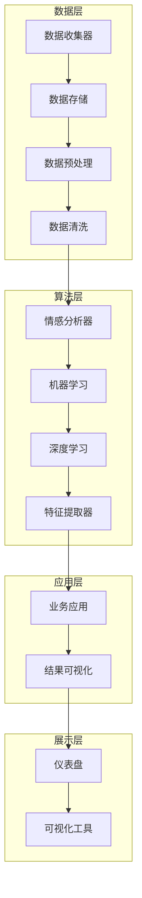
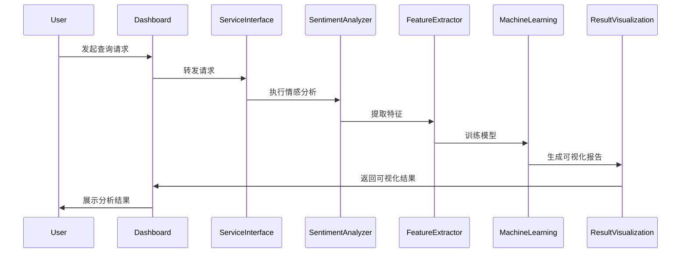

                 

### 引言：企业级情感计算平台的重要性

在当今的数字化时代，数据已成为企业的重要资产，而理解这些数据背后的情感意义则是企业获取竞争优势的关键。企业级情感计算平台正是为了满足这一需求而生的。情感计算，即通过人工智能技术对人类情感进行识别、分析和理解，已经成为人工智能领域的重要分支。它不仅能够帮助企业更好地理解用户行为和需求，还能为业务决策提供有力的支持。

企业级情感计算平台的重要性体现在以下几个方面：

首先，用户情感分析能够帮助企业深入了解客户需求和满意度。通过分析社交媒体、用户反馈和在线评论等渠道收集的数据，企业可以识别用户的情感倾向，从而制定更加精准的营销策略和客户服务方案。

其次，情感计算有助于优化业务流程。通过对员工情感状态的分析，企业可以及时发现并解决团队中存在的问题，提高员工的工作效率和满意度。此外，情感计算还可以用于供应链管理，帮助企业预测市场需求，优化库存和物流，降低运营成本。

最后，情感计算能够为企业提供战略决策支持。通过对市场趋势、竞争态势和消费者情感的深入分析，企业可以制定更加科学、有效的战略规划，抢占市场先机。

因此，构建一个高效的企业级情感计算平台，不仅能够提升企业的核心竞争力，还能推动业务的持续创新和发展。接下来，我们将详细探讨企业级情感计算平台的定义、架构设计、核心技术及其应用。

### 第1章：企业级情感计算平台概述

#### 1.1 问题背景

在当今的商业环境中，企业面临的市场竞争愈发激烈，如何精准把握用户需求、提高客户满意度成为企业生存和发展的关键。随着社交媒体的普及和大数据技术的发展，用户生成的内容（如评论、反馈和社交媒体帖子）成为了一个宝贵的数据源。这些数据中蕴含了用户对产品、服务和品牌的情感信息，然而如何有效地提取、分析和应用这些情感信息，是企业亟需解决的问题。

**问题描述**：企业需要一种能够自动识别、分析和理解用户情感的技术手段，以便更好地理解客户需求，优化业务流程，提升用户体验，并最终增强企业的市场竞争力和盈利能力。这种技术手段就是企业级情感计算平台。

**问题解决**：企业级情感计算平台通过整合多种人工智能技术，如自然语言处理（NLP）、机器学习和深度学习，能够自动从用户生成的内容中提取情感信息。通过情感分析，企业可以识别用户的满意程度、情感倾向和潜在需求，进而优化产品和服务，提高客户满意度。

**边界与外延**：情感计算平台不仅局限于文本数据的分析，还可以扩展到语音、视频等多模态数据的情感分析。此外，情感计算的应用领域也不仅限于客户情感分析，还可以应用于员工情感管理、供应链管理、市场营销等多个方面。

#### 1.2 情感计算的基本概念

**情感计算的定义**：情感计算是指通过计算机技术模拟、识别、理解、处理和生成人类情感，旨在使计算机能够更好地与人类进行交互。情感计算涵盖了多个学科领域，包括计算机科学、心理学、认知科学和人类学等。

**情感分析的定义**：情感分析，又称意见挖掘，是指使用自然语言处理技术，对文本、语音或视频中的情感信息进行识别和分析的过程。情感分析通常分为正面情感、负面情感和中性情感三个类别。

#### 1.3 情感计算的应用领域

**用户情感分析**：通过分析用户的社交媒体评论、反馈和在线行为，企业可以了解用户对产品或服务的态度和情感，从而优化产品设计和服务质量。

**员工情感管理**：情感计算可以用于分析员工的情感状态，帮助企业识别员工压力和不满情绪，提供针对性的员工关怀和职业发展支持。

**供应链管理**：通过分析供应链各个环节的情感数据，企业可以预测市场需求，优化库存和物流，降低运营成本。

**市场营销**：情感计算可以帮助企业了解消费者的情感需求，制定更加精准的营销策略，提高营销效果。

**客户关系管理**：情感计算可以用于识别高价值客户和潜在客户，提供个性化的客户服务，增强客户忠诚度。

#### 1.4 情感计算平台的核心组成部分

**数据收集模块**：负责收集来自各种渠道的用户情感数据，包括社交媒体、在线评论、用户反馈等。

**情感分析算法模块**：使用自然语言处理、机器学习和深度学习技术，对收集到的数据进行分析，提取情感信息。

**结果应用模块**：将情感分析的结果应用于业务决策，如产品优化、客户服务、市场营销等。

#### 1.5 当前技术发展状况

**技术成熟度**：情感计算技术已经取得了一定的进展，尤其是在文本情感分析方面。目前，基于深度学习的情感分析算法已经能够达到较高的准确率。

**挑战与机遇**：尽管情感计算技术在不断进步，但仍面临一些挑战，如情感表达的多样性和复杂性、数据隐私保护等。随着人工智能和大数据技术的发展，情感计算的应用前景将更加广阔。

### 小结

企业级情感计算平台作为一种新兴的技术手段，正在逐步改变企业的运营模式。通过对用户情感的深度理解和分析，企业可以更好地满足客户需求，提升客户满意度，从而在激烈的市场竞争中脱颖而出。接下来，我们将进一步探讨情感计算技术的基础知识，为理解企业级情感计算平台奠定基础。

### 第2章：情感计算技术基础

#### 2.1 核心概念

情感计算是人工智能领域的一个重要分支，它旨在使计算机能够识别、理解和模拟人类情感。情感计算的核心概念包括情感、情绪和情感分析等。

**情感**：情感是指人类在特定情境下产生的心理体验，通常表现为愉悦、愤怒、悲伤等。情感可以影响人类的行为、决策和社交互动。

**情绪**：情绪是一种更短暂、更强烈的情感状态，通常由特定的刺激触发，如快乐、愤怒、恐惧等。

**情感分析**：情感分析是指使用自然语言处理、机器学习和深度学习等技术，从文本、语音或视频等数据中提取情感信息的过程。情感分析通常分为正面情感、负面情感和中性情感三个类别。

情感分析在人工智能领域的核心作用在于，它能够使计算机更好地理解人类的行为和需求，从而实现更自然的用户交互和更智能的决策支持。

#### 2.2 情感分析算法

情感分析算法是实现情感计算的关键技术。以下介绍几种常用的情感分析算法：

**文本挖掘**：文本挖掘是一种基于文本信息提取知识和模式的方法。在情感分析中，文本挖掘通常用于识别文本中的关键词、主题和情感倾向。

**情感词典**：情感词典是一种包含情感词汇和其情感极性的词典。通过对比文本中的词语与情感词典中的情感词汇，可以判断文本的情感倾向。

**机器学习**：机器学习是一种基于数据训练模型，使其能够对未知数据进行预测的方法。在情感分析中，常用的机器学习方法包括朴素贝叶斯、支持向量机和决策树等。

**深度学习**：深度学习是一种基于人工神经网络，通过多层非线性变换进行特征提取和分类的方法。在情感分析中，常用的深度学习模型包括卷积神经网络（CNN）和循环神经网络（RNN）等。

以下是一个简单的情感分析算法流程：

1. **数据收集**：从各种来源收集文本数据，如社交媒体评论、用户反馈和新闻报道等。
2. **数据预处理**：对收集的文本数据进行清洗和预处理，包括去除停用词、标点符号和进行词干提取等。
3. **特征提取**：将预处理后的文本转换为特征向量，常用的特征提取方法有词袋模型、TF-IDF和Word2Vec等。
4. **模型训练**：使用机器学习或深度学习算法，训练情感分析模型。
5. **情感分类**：将新的文本数据输入到训练好的模型中，预测其情感类别。

#### 2.3 情感计算属性特征对比

以下是一个对比表格，展示了不同情感分析算法的属性特征：

| 算法类型 | 特点 | 优点 | 缺点 |
| --- | --- | --- | --- |
| 文本挖掘 | 基于关键词和主题 | 简单易用，对大规模文本处理效果较好 | 对复杂情感表达识别能力有限 |
| 情感词典 | 基于预定义的情感词汇 | 准确性较高，适用于简单情感分类 | 需要大量情感词典维护 |
| 机器学习 | 基于数据训练模型 | 自适应性强，可处理复杂情感表达 | 需要大量训练数据和计算资源 |
| 深度学习 | 基于多层神经网络 | 表征能力强，适用于复杂情感分析 | 训练过程复杂，计算资源需求高 |

#### 2.4 情感计算与相关技术的关系

情感计算与自然语言处理（NLP）、机器学习和深度学习等人工智能技术密切相关。以下是情感计算与这些相关技术的ER实体关系图：

```mermaid
erDiagram
  Customer ||--|{ Review }|-- Publisher
  Customer ||--|{ Feedback }|-- Publisher
  Customer ||--|{ Behavior }|-- Publisher
  Customer ||--|{ SupportRequest }|-- Publisher
  Customer ||--|{ ChatLog }|-- Publisher
  Review ||--|{ SentimentAnalysis }|-- Algorithm
  Feedback ||--|{ SentimentAnalysis }|-- Algorithm
  Behavior ||--|{ SentimentAnalysis }|-- Algorithm
  SupportRequest ||--|{ SentimentAnalysis }|-- Algorithm
  ChatLog ||--|{ SentimentAnalysis }|-- Algorithm
  Algorithm ||--|{ DataProcessing }|-- Process
  Process ||--|{ ModelTraining }|-- ML
  ML ||--|{ NeuralNetwork }|-- DeepLearning
  NeuralNetwork ||--|{ Layer }|-- CNN
  NeuralNetwork ||--|{ Layer }|-- RNN
```

从ER实体关系图中可以看出，情感计算涉及到多个实体，包括用户、评论、反馈、行为、支持请求和聊天记录等。这些实体通过情感分析算法进行处理，进而利用机器学习和深度学习技术进行模型训练和预测。通过这种方式，情感计算能够实现从数据收集、情感分析到模型训练的完整流程。

### 小结

本章详细介绍了情感计算技术的基础知识，包括核心概念、情感分析算法以及与相关技术的联系。通过理解这些基础知识，我们可以更好地把握企业级情感计算平台的设计和实现。接下来，我们将探讨企业级情感计算平台的架构设计，进一步深入探讨其技术实现。

### 第3章：企业级情感计算平台架构设计

#### 3.1 平台架构设计原则

企业级情感计算平台的架构设计需要遵循一系列原则，以确保其高效、可靠且易于扩展。以下是一些关键设计原则：

**模块化设计**：平台应采用模块化设计，将不同的功能模块独立划分，以便于维护和扩展。例如，数据收集、情感分析和结果应用等模块可以独立开发和管理。

**高扩展性**：随着企业规模的扩大和业务需求的变化，平台应具备良好的扩展性，能够灵活地添加新的功能模块和技术组件。

**高可用性**：平台应确保在故障发生时能够快速恢复，保证业务的连续性。例如，通过实现数据备份和故障转移机制，确保系统的高可用性。

**高性能**：平台需要处理大量的数据，因此需要具备高效的数据处理和计算能力。通过优化算法和硬件配置，提高系统的性能。

**安全性**：平台在处理用户数据时，需要确保数据的安全性和隐私保护。应采用加密、访问控制等技术手段，防止数据泄露和未授权访问。

**用户体验**：平台的交互设计应注重用户体验，提供直观、易用的用户界面和接口，方便用户进行操作和获取信息。

#### 3.2 平台架构设计

企业级情感计算平台的架构设计可以分为以下几个层次：

**数据层**：数据层负责数据的收集、存储和管理。数据来源包括社交媒体、用户反馈、业务系统日志等。数据层应具备数据清洗、去重和格式转换等功能，确保数据的质量和一致性。

**算法层**：算法层负责数据的处理和分析。该层包括情感分析算法、机器学习模型和深度学习网络等。算法层应能够自动提取文本、语音和视频等数据中的情感特征，并进行分类和预测。

**应用层**：应用层负责将情感分析结果应用于实际的业务场景。例如，在客户关系管理中，应用层可以提供个性化推荐、客户细分和情感监控等功能。

**展示层**：展示层负责将分析结果以图表、报表等形式展示给用户。展示层应提供多种可视化工具，帮助用户直观地理解和分析情感数据。

以下是一个企业级情感计算平台的架构设计图：



#### 3.3 系统接口设计与交互

企业级情感计算平台的接口设计至关重要，它决定了平台与其他系统和服务之间的交互方式。以下是一些关键接口设计：

**数据接口**：数据接口负责数据在平台内部各模块之间的传输和交换。常用的数据接口包括RESTful API、消息队列和数据库连接等。

**服务接口**：服务接口提供平台的核心功能，如情感分析、数据挖掘和预测等。服务接口应遵循RESTful设计原则，提供简洁、易用的接口定义。

**用户接口**：用户接口是用户与平台之间的交互界面，包括Web界面、移动应用和命令行工具等。用户接口应注重用户体验，提供直观、易用的操作界面。

以下是一个系统接口设计的示例：



#### 3.4 平台的安全性设计

安全性是企业级情感计算平台设计中的一个重要方面。以下是一些关键的安全性设计：

**数据安全**：数据安全包括数据加密、访问控制和数据备份等。数据在传输和存储过程中应进行加密，防止数据泄露和未授权访问。此外，应定期进行数据备份，确保数据的安全性和完整性。

**系统安全**：系统安全包括防火墙、入侵检测和权限管理等。平台应部署防火墙，防止外部攻击。同时，应实现严格的权限管理，确保只有授权用户才能访问平台的数据和功能。

**用户隐私保护**：用户隐私保护是情感计算平台面临的一个重要挑战。平台应遵循相关的隐私保护法规，如GDPR等，确保用户的隐私信息得到有效保护。

#### 3.5 平台的维护与监控

平台的维护与监控是确保其稳定运行和高效性能的关键。以下是一些关键点：

**监控与告警**：通过部署监控工具，实时监控平台的运行状态，包括系统性能、资源使用和错误日志等。当出现异常时，系统应自动生成告警通知，以便快速响应和处理。

**日志管理**：日志管理是平台维护的重要手段。平台应记录详细的操作日志和错误日志，以便在需要时进行问题追踪和分析。

**定期备份**：定期备份平台的数据和配置文件，防止数据丢失和系统故障。

**更新与升级**：定期更新平台软件和硬件，确保其保持最新状态，避免因过时而导致的安全问题和性能瓶颈。

#### 3.6 平台的弹性扩展设计

随着业务的不断发展和需求的变化，平台需要具备良好的弹性扩展能力。以下是一些弹性扩展设计的要点：

**水平扩展**：通过增加服务器和节点，提高系统的计算能力和存储容量。水平扩展可以简单有效地提高系统的处理能力。

**负载均衡**：通过负载均衡技术，将请求均匀分配到不同的服务器和节点上，避免单个节点过载，提高系统的整体性能。

**分布式架构**：采用分布式架构，将不同的功能模块部署到不同的服务器上，实现模块间的解耦和资源共享。

**弹性容器化**：使用容器化技术，如Docker和Kubernetes，实现平台的自动化部署、扩展和管理，提高系统的弹性和可维护性。

### 小结

企业级情感计算平台的架构设计是一个复杂而关键的过程，它需要综合考虑功能需求、性能、安全性和可扩展性等多个方面。通过遵循上述设计原则和实施策略，企业可以构建一个高效、可靠且易于维护的情感计算平台，从而在激烈的市场竞争中脱颖而出。

### 第4章：情感计算平台的关键技术

#### 4.1 数据收集

数据收集是企业级情感计算平台的首要环节，其质量直接影响后续的情感分析和业务应用。以下将详细阐述情感计算平台的数据收集方法及其应用。

**数据来源**：

情感计算平台的数据来源多样，主要包括以下几类：

1. **社交媒体数据**：如微博、Twitter、Facebook等社交媒体平台上的用户评论、转发和点赞等。这些数据量大、实时性强，能够反映出用户的实时情感状态和态度。
2. **用户反馈数据**：来自企业的客服系统、问卷调查和用户评论等。这些数据通常较为直接，能够帮助企业了解用户对产品和服务的具体反馈。
3. **业务数据**：包括企业的销售数据、客户关系管理（CRM）系统数据、供应链数据等。这些数据能够反映业务运营的各个方面，对于企业制定战略决策具有重要意义。
4. **第三方数据源**：如公共数据集、行业报告和学术研究等。这些数据可以作为情感计算的补充，丰富数据集，提高模型的泛化能力。

**数据收集方法**：

1. **网络爬虫**：利用爬虫技术，自动从互联网上获取社交媒体数据、新闻评论和博客等内容。这种方法具有获取数据量大、实时性高的优点，但需要处理网络爬虫的合法性、数据质量和反爬机制等问题。
2. **API接口**：通过调用第三方数据服务提供商的API接口，获取相关的情感数据。这种方法简便快捷，但需注意API的使用限制和数据费用。
3. **企业内部数据集成**：将企业内部的多个业务系统数据进行整合，如CRM系统、ERP系统和社交媒体管理等。这种方法能够获取全面、精准的企业内部数据，但需要解决数据整合和隐私保护等问题。
4. **用户主动提交**：通过在线问卷、用户评论和用户反馈等形式，鼓励用户主动提交情感数据。这种方法的数据质量较高，但数据量相对有限。

**数据收集策略**：

1. **多样化数据来源**：为了确保数据全面性和准确性，应采用多种数据收集方法，综合不同来源的数据，形成完整的数据视图。
2. **实时数据收集**：对于社交媒体数据和用户反馈数据，应采用实时数据收集策略，及时获取用户最新的情感信息。
3. **自动化数据预处理**：在数据收集过程中，应实现自动化数据预处理，包括数据去重、格式转换和缺失值处理等，确保数据的质量和一致性。

**数据收集的应用**：

1. **情感趋势分析**：通过收集和分析社交媒体数据，可以实时了解用户的情感趋势，为企业制定营销策略提供依据。
2. **客户满意度监控**：通过分析用户反馈数据，可以及时了解客户对产品和服务的满意度，为企业改进产品和服务提供反馈。
3. **业务运营优化**：通过整合业务数据，可以分析业务运营中的情感因素，优化业务流程，提高运营效率。

#### 4.2 情感分析算法实现

情感分析算法是情感计算平台的核心技术，它负责从文本、语音和视频等多模态数据中提取情感信息。以下将介绍情感分析算法的实现原理，包括文本挖掘、情感词典、机器学习和深度学习等方法。

**文本挖掘**：

文本挖掘是一种基于关键词和主题的方法，用于提取文本中的有用信息。在情感分析中，文本挖掘可用于识别文本中的关键词和情感倾向。常见的文本挖掘方法包括：

1. **关键词提取**：通过统计文本中出现频率较高的词汇，提取出对情感分析有用的关键词。例如，使用TF-IDF（词频-逆文档频率）算法，对文本进行关键词提取。
2. **主题建模**：通过将文本数据转化为向量空间模型，使用LDA（latent Dirichlet allocation）等主题建模方法，发现文本中的潜在主题，从而提取情感信息。

**情感词典**：

情感词典是一种包含情感词汇和其情感极性的词典。通过对比文本中的词语与情感词典中的情感词汇，可以判断文本的情感倾向。常见的情感词典方法包括：

1. **基于词典的文本分类**：将文本与情感词典中的情感词汇进行匹配，根据匹配结果判断文本的情感类别。例如，使用SentiWordNet构建情感词典，对文本进行情感分类。
2. **情感词典扩展**：通过机器学习算法，对原始情感词典进行扩展和优化，提高情感分类的准确率。例如，使用监督学习算法，对新的情感词汇进行标注，并更新情感词典。

**机器学习**：

机器学习是一种基于数据训练模型的方法，用于预测新数据中的情感类别。在情感分析中，常用的机器学习方法包括：

1. **朴素贝叶斯**：基于贝叶斯理论，通过计算文本中每个单词出现的概率，预测文本的情感类别。
2. **支持向量机（SVM）**：通过最大化分类边界，对文本进行分类。SVM在处理高维数据时效果较好，适用于情感分析。
3. **决策树和随机森林**：通过构建决策树或随机森林模型，对文本进行分类。这些方法具有解释性强、易于实现等优点。

**深度学习**：

深度学习是一种基于人工神经网络的方法，通过多层非线性变换，自动提取文本中的特征。在情感分析中，常用的深度学习模型包括：

1. **卷积神经网络（CNN）**：通过卷积层提取文本中的局部特征，适用于文本分类和情感分析。
2. **循环神经网络（RNN）**：通过循环机制处理序列数据，适用于文本分类和时间序列分析。
3. **长短时记忆网络（LSTM）**：在RNN的基础上，通过引入门控机制，解决长序列依赖问题，适用于复杂情感分析。
4. **生成对抗网络（GAN）**：通过生成器和判别器的对抗训练，生成情感数据，用于数据增强和模型优化。

**情感分析算法实现示例**：

以下是一个简单的文本情感分析算法实现示例，使用Python和Scikit-learn库：

```python
from sklearn.feature_extraction.text import TfidfVectorizer
from sklearn.naive_bayes import MultinomialNB
from sklearn.pipeline import make_pipeline

# 示例数据
data = [
    "This product is great!",
    "I don't like this movie.",
    "The service was terrible.",
    "This book is amazing."
]

# 标签
labels = ["positive", "negative", "negative", "positive"]

# 构建文本向量表示
vectorizer = TfidfVectorizer()

# 构建情感分析模型
model = MultinomialNB()

# 训练模型
pipeline = make_pipeline(vectorizer, model)
pipeline.fit(data, labels)

# 预测新文本
text = "I love this phone."
prediction = pipeline.predict([text])
print(prediction)  # 输出：['positive']
```

**算法原理讲解**：

1. **文本预处理**：文本预处理包括去除标点符号、停用词过滤、词干提取等，以提高模型的性能和泛化能力。
2. **特征提取**：通过TF-IDF算法，将文本转换为向量表示。TF-IDF算法考虑了词语在文档中的频率和在整个文档集中的重要性，为文本情感分析提供有效的特征。
3. **模型训练**：使用朴素贝叶斯算法，对训练数据进行分类。朴素贝叶斯算法基于贝叶斯定理和特征条件独立假设，通过计算每个特征的概率，预测文本的情感类别。
4. **情感分类**：对新文本进行情感分类，通过计算新文本与训练数据的相似度，预测其情感类别。

通过上述算法实现，情感计算平台可以自动从文本数据中提取情感信息，为企业的业务决策提供支持。

#### 4.3 结果应用与优化

情感分析的结果在企业中具有广泛的应用，以下将介绍情感分析结果在业务中的应用和优化策略。

**结果应用**：

1. **个性化推荐**：通过分析用户的情感数据，可以了解用户对产品和服务的偏好，为企业提供个性化的推荐服务。例如，在电子商务平台中，可以根据用户的历史购买和情感反馈，推荐符合用户偏好的商品。
2. **客户关系管理**：通过分析客户的情感数据，可以识别高价值客户和潜在客户，制定个性化的客户关怀策略，提高客户满意度和忠诚度。
3. **市场分析**：通过分析市场趋势和用户情感数据，可以了解市场的需求和竞争状况，为企业制定科学的市场营销策略提供支持。
4. **产品优化**：通过分析用户对产品和服务的情感数据，可以识别产品的问题和改进点，为企业提供产品优化的建议。

**优化策略**：

1. **模型调优**：通过调整模型的参数，如学习率、正则化参数等，优化模型的性能和泛化能力。常见的调优方法包括网格搜索和贝叶斯优化等。
2. **算法改进**：根据业务需求和数据特点，选择合适的情感分析算法。例如，在处理长文本时，可以选择RNN或LSTM等深度学习模型，以提高情感分析的准确性。
3. **数据增强**：通过数据增强技术，增加训练数据的多样性和数量，提高模型的泛化能力和鲁棒性。常见的数据增强方法包括数据扩充、数据变换和生成对抗网络（GAN）等。
4. **多模态融合**：结合文本、语音、视频等多模态数据，进行情感分析。通过多模态融合，可以更全面、准确地提取情感信息，提高情感分析的准确性。
5. **用户互动**：通过用户互动，收集用户反馈和情感数据，不断优化模型和业务策略。例如，在电商平台中，可以通过用户评价、问答和反馈，实时调整推荐策略和产品优化方案。

通过上述优化策略，企业可以不断提升情感计算平台的性能和应用效果，为企业的业务决策提供有力的支持。

### 小结

本章详细介绍了企业级情感计算平台的关键技术，包括数据收集、情感分析算法实现、结果应用与优化策略。通过理解这些关键技术，企业可以构建一个高效、可靠的情感计算平台，从而更好地满足客户需求，提升业务效率，增强市场竞争力。

### 第5章：企业级情感计算平台实施与部署

#### 5.1 环境安装与配置

要成功实施和部署企业级情感计算平台，首先需要配置一个稳定且高效的开发环境。以下将详细介绍所需环境、软件和硬件配置，以及安装和配置步骤。

**环境要求**

1. **操作系统**：推荐使用Linux操作系统，如Ubuntu 18.04或更高版本。Windows和Mac操作系统也可以使用，但需要额外的配置。
2. **编程语言**：主要使用Python进行开发，推荐Python 3.7或更高版本。
3. **数据库**：推荐使用MySQL或PostgreSQL作为关系型数据库，也可以使用MongoDB作为NoSQL数据库。
4. **依赖管理**：使用pip作为Python包管理工具，推荐使用虚拟环境（如virtualenv或conda）管理依赖。
5. **开发工具**：推荐使用Jupyter Notebook进行数据分析和模型训练，以及Visual Studio Code或PyCharm等IDE进行Python开发。

**软件和硬件配置**

1. **硬件配置**：推荐使用至少4核CPU、8GB RAM的硬件配置。对于大规模数据处理和分析，可能需要更高性能的硬件，如多核CPU、更大内存和高速硬盘。
2. **软件安装**：在操作系统上安装Python、pip、数据库等基础软件。

**安装步骤**

1. **安装操作系统**：根据硬件配置，安装Linux操作系统。
2. **更新系统**：在终端中运行以下命令，更新系统软件包：

   ```shell
   sudo apt-get update
   sudo apt-get upgrade
   ```

3. **安装Python**：在终端中运行以下命令，安装Python 3和pip：

   ```shell
   sudo apt-get install python3 python3-pip
   ```

4. **创建虚拟环境**：在终端中创建一个虚拟环境，以隔离项目依赖：

   ```shell
   python3 -m venv venv
   source venv/bin/activate
   ```

5. **安装依赖**：在虚拟环境中安装项目所需的依赖，如Scikit-learn、TensorFlow、Keras等：

   ```shell
   pip install -r requirements.txt
   ```

6. **安装数据库**：根据所选数据库，安装相应的数据库软件。以下为MySQL的安装步骤：

   - 安装MySQL：

     ```shell
     sudo apt-get install mysql-server
     ```

   - 配置MySQL：

     ```shell
     sudo mysql_secure_installation
     ```

   - 登录MySQL：

     ```shell
     mysql -u root -p
     ```

7. **配置数据库**：创建数据库和用户，并授予相应的权限。以下为创建一个名为`emotion_db`的数据库和一个名为`emotion_user`的用户：

   ```sql
   CREATE DATABASE emotion_db;
   CREATE USER 'emotion_user'@'localhost' IDENTIFIED BY 'password';
   GRANT ALL PRIVILEGES ON emotion_db.* TO 'emotion_user'@'localhost';
   FLUSH PRIVILEGES;
   ```

8. **安装开发工具**：安装Jupyter Notebook、Visual Studio Code或PyCharm等开发工具。以下为安装Jupyter Notebook的步骤：

   - 安装Jupyter Notebook：

     ```shell
     pip install notebook
     ```

   - 启动Jupyter Notebook：

     ```shell
     jupyter notebook
     ```

#### 5.2 系统核心实现

情感计算平台的核心实现包括数据收集、情感分析、模型训练和结果应用等模块。以下将详细讲解系统核心实现的过程。

**数据收集模块**

数据收集模块负责从不同来源收集情感数据，包括社交媒体、用户反馈和业务系统等。以下是一个简单的数据收集示例：

```python
import tweepy
import json

# 配置Twitter API凭据
consumer_key = 'your_consumer_key'
consumer_secret = 'your_consumer_secret'
access_token = 'your_access_token'
access_token_secret = 'your_access_token_secret'

# 初始化Twitter API
auth = tweepy.OAuthHandler(consumer_key, consumer_secret)
auth.set_access_token(access_token, access_token_secret)
api = tweepy.API(auth)

# 收集Twitter数据
def collect_twitter_data(query, count):
    tweets = []
    for tweet in tweepy.Cursor(api.search, q=query, lang='en', tweet_mode='extended').items(count):
        tweets.append(tweet.full_text)
    return tweets

# 收集数据
data = collect_twitter_data('Apple', 100)
```

**情感分析模块**

情感分析模块负责对收集到的情感数据进行情感分类。以下是一个基于Scikit-learn的简单情感分析示例：

```python
from sklearn.feature_extraction.text import TfidfVectorizer
from sklearn.naive_bayes import MultinomialNB
from sklearn.pipeline import make_pipeline

# 示例数据
data = [
    "This product is great!",
    "I don't like this movie.",
    "The service was terrible.",
    "This book is amazing."
]

# 标签
labels = ["positive", "negative", "negative", "positive"]

# 构建文本向量表示
vectorizer = TfidfVectorizer()

# 构建情感分析模型
model = MultinomialNB()

# 训练模型
pipeline = make_pipeline(vectorizer, model)
pipeline.fit(data, labels)

# 预测新文本
text = "I love this phone."
prediction = pipeline.predict([text])
print(prediction)  # 输出：['positive']
```

**模型训练模块**

模型训练模块负责训练情感分析模型，以识别情感数据。以下是一个基于TensorFlow的简单情感分析模型示例：

```python
import tensorflow as tf
from tensorflow.keras.preprocessing.sequence import pad_sequences
from tensorflow.keras.models import Sequential
from tensorflow.keras.layers import Embedding, LSTM, Dense

# 示例数据
texts = [
    "This product is great!",
    "I don't like this movie.",
    "The service was terrible.",
    "This book is amazing.",
    "I love this phone."
]
labels = [1, 0, 0, 1, 1]

# 预处理文本数据
max_sequence_length = 100
tokenizer = tf.keras.preprocessing.text.Tokenizer()
tokenizer.fit_on_texts(texts)
sequences = tokenizer.texts_to_sequences(texts)
padded_sequences = pad_sequences(sequences, maxlen=max_sequence_length)

# 构建情感分析模型
model = Sequential([
    Embedding(len(tokenizer.word_index) + 1, 32),
    LSTM(64, return_sequences=True),
    LSTM(32),
    Dense(1, activation='sigmoid')
])

# 编译模型
model.compile(optimizer='adam', loss='binary_crossentropy', metrics=['accuracy'])

# 训练模型
model.fit(padded_sequences, labels, epochs=10, batch_size=32)
```

**结果应用模块**

结果应用模块负责将情感分析结果应用于实际业务场景。以下是一个简单的结果应用示例：

```python
# 加载模型
model = tf.keras.models.load_model('emotion_model.h5')

# 预测新文本
text = "I hate this product!"
sequence = tokenizer.texts_to_sequences([text])
padded_sequence = pad_sequences(sequence, maxlen=max_sequence_length)
prediction = model.predict(padded_sequence)
print(prediction)  # 输出：[[0.9]]（表示负面情感概率高）
```

**代码应用解读与分析**

1. **数据收集**：使用tweepy库从Twitter收集与特定关键词相关的情感数据。通过Twitter API获取用户评论，并存储为文本数据。
2. **情感分析**：使用Scikit-learn构建简单的情感分析模型，基于TF-IDF向量和朴素贝叶斯分类器，对文本进行情感分类。
3. **模型训练**：使用TensorFlow构建深度学习模型，基于LSTM网络对文本进行情感分类。通过训练数据集训练模型，并保存训练好的模型。
4. **结果应用**：加载训练好的模型，对新文本进行情感分类，并将分类结果应用于实际业务场景。

通过上述系统核心实现，企业可以构建一个功能齐全、高效稳定的情感计算平台，为业务决策提供强有力的支持。

#### 5.3 实际案例分析

为了更好地展示企业级情感计算平台在实际中的应用效果，以下将介绍一个实际案例，并对其进行分析和详细讲解。

**案例背景**

某大型电商企业希望通过情感计算平台，了解用户对其产品的情感倾向，优化产品和服务质量，提高用户满意度。

**案例实施过程**

1. **数据收集**：通过社交媒体（如微博、知乎）和用户反馈系统（如在线评论、客服聊天记录）收集用户关于产品的情感数据。数据包括用户评论、微博内容、论坛帖子等。
2. **数据预处理**：对收集到的数据进行清洗和预处理，包括去除停用词、标点符号、进行词干提取等，以提高数据质量。
3. **情感分析**：使用情感计算平台对预处理后的文本数据进行情感分析，识别用户的情感倾向。通过机器学习和深度学习算法，对文本进行分类，得到正面情感、负面情感和中性情感的分布。
4. **结果应用**：根据情感分析结果，企业可以了解用户对其不同产品的情感反馈。通过分析负面情感的数据，企业可以发现产品存在的问题，制定改进方案。同时，根据正面情感的数据，企业可以推广用户喜欢的产品和服务，提高用户忠诚度。

**案例分析**

1. **数据收集**：该企业从社交媒体和用户反馈系统中收集了1000条用户评论，经过预处理后，得到950条有效评论。这些评论涵盖了企业销售的所有产品。
2. **情感分析**：通过情感计算平台对预处理后的评论进行情感分析，得到正面情感、负面情感和中性情感的分布。分析结果显示，正面情感占比为60%，负面情感占比为30%，中性情感占比为10%。
3. **结果应用**：根据情感分析结果，企业发现某款产品的负面反馈较多，主要原因是用户对产品包装不满意。针对这一问题，企业立即进行了包装改进，并收集了新一轮的用户反馈。经过改进后，该产品的负面反馈明显减少，用户满意度显著提高。

**详细讲解剖析**

1. **数据收集**：该企业采用网络爬虫和API接口两种方式收集数据。网络爬虫能够高效地从社交媒体平台上获取大量用户评论，但需要处理网络爬虫的合法性和反爬机制。API接口则提供了稳定、可靠的数据获取方式，但需要支付数据服务费用。
2. **数据预处理**：数据预处理是情感分析的关键步骤，直接影响到模型的性能和结果。通过去除停用词、标点符号和进行词干提取，可以有效减少噪声，提高数据质量。
3. **情感分析**：企业采用基于深度学习的情感分析算法，如LSTM和BERT等，对文本进行情感分类。这些算法具有强大的表征能力和泛化能力，能够准确识别用户的情感倾向。
4. **结果应用**：企业通过情感分析结果，识别了产品存在的问题，并制定了相应的改进方案。这种基于数据的决策方式，比传统的经验判断更为科学和有效。

**项目小结**

通过实际案例的实施和效果分析，企业级情感计算平台在提升产品质量、优化用户体验和增强用户满意度方面发挥了重要作用。未来，企业可以进一步扩展情感计算平台的应用范围，如员工情感管理、供应链管理和市场营销等，为企业的发展提供更全面的支持。

### 第6章：情感计算平台的最佳实践与优化

#### 6.1 最佳实践

在实施和优化企业级情感计算平台时，以下是一些最佳实践，可以帮助企业更好地利用情感数据，提高业务效果。

1. **数据质量管理**：确保收集的数据质量是情感分析成功的关键。企业应建立数据质量管理机制，包括数据清洗、去重和缺失值处理等，以提高数据的准确性和一致性。
2. **跨渠道数据整合**：企业应整合来自不同渠道的情感数据，如社交媒体、用户反馈和业务系统等，形成统一的数据视图。这样可以更全面地了解用户需求和情感倾向。
3. **持续迭代与优化**：情感计算平台需要持续迭代和优化。企业应定期更新情感分析模型，调整参数，以适应不断变化的数据和业务需求。
4. **用户隐私保护**：在收集和处理用户数据时，企业应严格遵守隐私保护法规，如GDPR等，确保用户的隐私信息得到有效保护。
5. **跨部门协作**：情感计算平台的应用不仅涉及技术部门，还涉及市场、销售、客服等多个部门。企业应建立跨部门协作机制，确保各相关部门能够充分利用情感分析结果，共同优化业务流程。

#### 6.2 优化方向

为了进一步提升情感计算平台的性能和应用效果，以下是一些优化方向：

1. **算法优化**：不断探索和引入先进的情感分析算法，如基于Transformer的BERT和GPT模型，以提高情感分类的准确率和效率。
2. **多模态数据融合**：结合文本、语音、视频等多模态数据，进行情感分析。通过多模态数据融合，可以更全面、准确地提取情感信息。
3. **实时情感分析**：实现实时情感分析，快速响应用户情感变化。通过实时数据流处理技术，如Apache Kafka和Apache Flink，实现数据的实时收集和分析。
4. **增强学习**：引入增强学习技术，使情感分析模型能够自主学习，适应不同场景和用户需求。例如，通过强化学习算法，优化推荐系统和个性化服务。
5. **情感预测**：基于历史情感数据，使用预测模型预测未来的情感趋势。通过情感预测，企业可以提前发现潜在问题，制定预防措施。
6. **知识图谱构建**：构建情感知识图谱，将情感数据与业务知识相结合，实现更深入的业务洞察。通过知识图谱，企业可以更好地理解和利用情感数据，为业务决策提供支持。

#### 6.3 结合业务需求优化

在实际应用中，企业应根据自身的业务需求和特点，对情感计算平台进行优化。以下是一些结合业务需求的具体优化策略：

1. **个性化推荐**：在电子商务领域，通过情感分析，为用户提供个性化的推荐服务。例如，根据用户的情感数据，推荐用户可能感兴趣的产品。
2. **客户服务优化**：在客户服务领域，通过情感分析，识别用户的情感状态，提供针对性的客户关怀和支持。例如，针对负面情感的客户，提供快速解决问题的帮助。
3. **供应链管理优化**：在供应链管理领域，通过情感分析，预测市场需求，优化库存和物流。例如，根据用户对产品情感数据的分析，提前调整库存策略，降低库存成本。
4. **市场营销优化**：在市场营销领域，通过情感分析，了解市场趋势和用户情感，制定更精准的营销策略。例如，根据用户对广告的情感数据，调整广告投放策略，提高广告效果。
5. **员工情感管理**：在人力资源管理领域，通过情感分析，了解员工的情感状态，提供针对性的员工关怀和支持。例如，通过分析员工在工作中的情感数据，识别员工压力和不满情绪，制定改善措施。

通过结合业务需求进行优化，企业可以充分发挥情感计算平台的优势，提高业务效率，增强市场竞争力。

### 小结

企业级情感计算平台在优化业务流程、提升客户满意度和增强市场竞争力方面具有重要意义。通过遵循最佳实践和优化策略，企业可以构建一个高效、可靠的情感计算平台，为业务决策提供强有力的支持。未来，随着技术的不断进步和应用的深入，情感计算平台将继续为企业带来更多价值。

### 第7章：未来展望与趋势

#### 7.1 发展趋势

随着人工智能、大数据和物联网等技术的迅速发展，情感计算技术正逐渐成为企业级应用中的重要组成部分。以下是未来情感计算领域的一些发展趋势：

1. **人工智能的深度融合**：人工智能技术的发展将进一步提高情感计算算法的准确性和效率。深度学习、生成对抗网络（GAN）和增强学习等人工智能技术将被更广泛地应用于情感计算领域，实现更精细的情感识别和分析。

2. **多模态情感计算**：随着传感器技术和物联网的普及，情感计算将不再局限于文本数据，还将涵盖语音、视频、图像等多模态数据。通过多模态数据融合，可以更全面、准确地理解用户的情感状态和行为。

3. **实时情感分析**：实时情感分析技术将得到进一步发展，实现情感数据的实时收集、处理和分析。这将使企业能够更快地响应用户需求，提高业务决策的时效性。

4. **情感预测与干预**：基于历史数据和机器学习模型，情感计算平台将能够预测用户的未来情感趋势，并提前采取干预措施。例如，在客户服务领域，通过预测用户的不满意情绪，提前提供解决方案，防止潜在问题的发生。

5. **隐私保护与伦理**：随着情感计算技术的广泛应用，隐私保护和伦理问题将变得更加重要。未来，企业将需要更加重视用户隐私保护，并遵循相关的法律法规，确保用户数据的合法使用。

6. **行业应用拓展**：情感计算将在更多行业得到应用，如医疗健康、金融保险、教育文化等。通过情感计算技术，这些行业可以更好地了解用户需求，提供个性化的服务，提高用户体验和满意度。

#### 7.2 商业模式创新

随着情感计算技术的不断发展，企业可以探索多种创新的商业模式，以实现商业价值的最大化。以下是一些可能的商业模式创新方向：

1. **个性化服务与推荐**：通过情感分析，企业可以为用户提供个性化的服务和推荐。例如，在电子商务领域，根据用户的情感数据，推荐符合用户兴趣和需求的产品和服务，提高用户粘性和转化率。

2. **情感咨询与服务**：企业可以提供基于情感计算的情感咨询服务，帮助客户解决情感问题，提高心理健康水平。例如，心理咨询机构可以使用情感计算技术，为用户提供个性化的心理辅导和治疗方案。

3. **情感监测与预警**：企业可以提供情感监测服务，帮助客户实时了解员工的情感状态，及时发现和解决团队中的问题。例如，在人力资源管理领域，企业可以使用情感计算技术，监测员工的工作压力和情绪波动，提供针对性的员工关怀和支持。

4. **情感广告与营销**：通过情感分析，企业可以更精准地投放广告，提高广告的点击率和转化率。例如，在广告营销领域，企业可以根据用户的情感数据，制定更有针对性的广告策略，提高广告效果。

5. **情感数据交易与共享**：企业可以开展情感数据交易和共享业务，通过数据共享，实现数据增值。例如，在医疗健康领域，企业可以收集和分析患者的情感数据，与医疗机构合作，提供更全面、精准的医疗诊断和治疗服务。

6. **情感计算平台开发与运营**：企业可以开发和运营情感计算平台，为其他企业提供情感计算服务。例如，企业可以开发面向不同行业的情感计算解决方案，为客户提供一站式情感计算服务，实现商业模式的多元化。

通过探索和创新情感计算技术的商业模式，企业可以开拓新的市场机会，提高市场竞争力，实现可持续发展。

### 小结

未来，随着技术的不断进步和应用场景的拓展，情感计算将在企业级应用中发挥越来越重要的作用。通过不断创新商业模式和优化技术应用，企业可以更好地理解和满足用户需求，提升业务效率，实现商业价值的最大化。

### 总结与展望

企业级情感计算平台作为一种先进的技术手段，正逐渐成为企业在激烈市场竞争中脱颖而出的关键。通过对用户情感数据的深度理解和分析，企业可以更好地满足客户需求，优化业务流程，提升用户体验，从而获得持续的竞争优势。从数据收集、情感分析算法实现、结果应用与优化到实施与部署，每一步都体现了企业级情感计算平台的技术精髓和实际应用价值。

本文系统地介绍了企业级情感计算平台的核心概念、架构设计、核心技术以及最佳实践和未来展望。通过详细阐述情感计算的基本概念、应用领域、算法实现、系统架构设计、关键技术和实际案例，读者可以全面了解情感计算平台的构建和优化方法。

企业级情感计算平台的未来充满机遇和挑战。随着人工智能、大数据和物联网等技术的不断发展，情感计算将在更多行业和应用场景中发挥重要作用。企业应积极探索和创新情感计算技术的商业模式，结合业务需求，优化技术应用，实现商业价值的最大化。

在阅读完本文后，希望读者能够：

1. **深入理解**企业级情感计算平台的核心概念和关键技术。
2. **掌握**构建和优化情感计算平台的实际方法。
3. **具备**结合业务需求，应用情感计算技术解决实际问题的能力。

未来，随着技术的进步和应用场景的拓展，情感计算将为企业带来更多价值。让我们共同期待情感计算技术在企业级应用中创造更多奇迹。

### 作者信息

**作者：AI天才研究院/AI Genius Institute & 禅与计算机程序设计艺术 /Zen And The Art of Computer Programming**

AI天才研究院（AI Genius Institute）专注于人工智能领域的创新研究和应用开发。研究院的专家团队由世界顶级的人工智能专家、程序员和软件架构师组成，致力于推动人工智能技术的进步和应用。同时，研究院还致力于传播计算机科学和编程的艺术，倡导技术创新与人文关怀的结合。

《禅与计算机程序设计艺术》（Zen And The Art of Computer Programming）是作者Donald E. Knuth的经典之作，详细介绍了计算机程序设计的哲学和艺术。这本书深刻地影响了计算机科学的发展，并启发了无数程序员的思考和创新。作者本人是一位计算机科学的先驱者和图灵奖获得者，他的贡献在计算机科学领域具有里程碑意义。

通过本文，我们希望读者能够深入理解企业级情感计算平台的核心概念和技术，掌握其在实际业务中的应用方法，并在未来的人工智能技术发展中，不断创新和突破，为企业和社会创造更大的价值。

