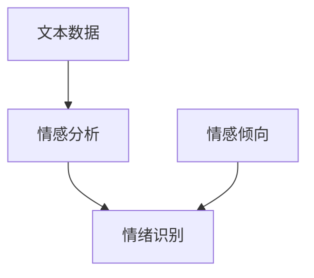
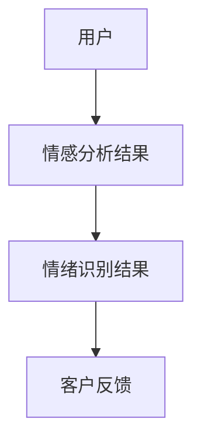
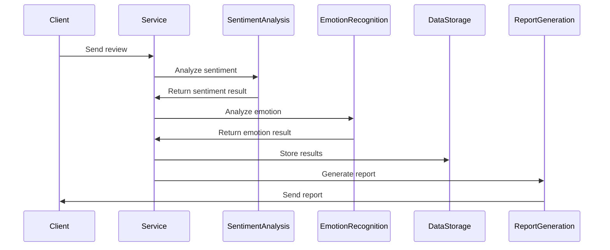

                 


### 文章标题：企业级情感计算平台：深度理解客户情绪

#### 关键词：企业级情感计算、客户情绪、情感分析、情绪识别、算法原理、系统架构、项目实战

#### 摘要：
本文将深入探讨企业级情感计算平台的设计与实践，聚焦于如何通过深度理解客户情绪，提升企业的服务质量和客户体验。我们将从背景介绍、核心概念与联系、算法原理讲解、系统分析与架构设计、项目实战以及最佳实践和总结等几个方面展开讨论，旨在为读者提供一个全面而深入的指导。

---

## 企业级情感计算平台概述

### 1.1 企业级情感计算平台定义

企业级情感计算平台是一种利用先进的机器学习和人工智能技术，对客户的情感和情绪进行深度分析和理解的技术系统。它能够从客户的言论、行为等数据中提取出情感信息，进而为企业提供决策支持，优化客户服务体验。

### 1.2 企业级情感计算平台的发展历程

情感计算作为人工智能的一个重要分支，其研究始于20世纪90年代。随着互联网和大数据技术的快速发展，情感计算逐渐从实验室走向实际应用，特别是在客户服务和市场分析领域。近年来，随着深度学习和自然语言处理技术的突破，企业级情感计算平台得到了显著提升。

### 1.3 企业级情感计算平台的现状与未来趋势

当前，企业级情感计算平台在客户服务、市场分析、风险控制等领域展现出巨大的应用潜力。未来，随着技术的进一步成熟和成本的降低，情感计算平台将在更多行业中得到广泛应用，为企业带来更高的价值。

---

## 核心概念与联系

### 2.1 情感分析

情感分析是情感计算的核心环节，旨在从文本数据中识别出情感倾向。情感分析可以分为积极情感、消极情感和中性情感三种类型。通过情感分析，企业可以了解客户的满意度和反馈。

### 2.2 情绪识别

情绪识别则是对客户情绪的深度挖掘，包括情绪的强度、稳定性等特征。情绪识别能够帮助企业更准确地理解客户的需求和情感状态。

### 2.3 Mermaid流程图与ER实体关系图

为了更直观地展示情感计算的核心概念和联系，我们可以使用Mermaid流程图来描绘情感分析、情绪识别等过程的流程，同时使用ER实体关系图来展示不同实体之间的关系。





---

## 算法原理讲解

### 3.1 情感分析算法

情感分析算法通常基于机器学习技术，如支持向量机（SVM）、随机森林（RF）等。以下是一个使用Python实现的情感分析算法的示例：

```python
from sklearn.feature_extraction.text import CountVectorizer
from sklearn.model_selection import train_test_split
from sklearn.naive_bayes import MultinomialNB

# 加载数据
X, y = load_data()

# 数据预处理
vectorizer = CountVectorizer()
X_vectorized = vectorizer.fit_transform(X)

# 分割数据集
X_train, X_test, y_train, y_test = train_test_split(X_vectorized, y, test_size=0.2, random_state=42)

# 模型训练
model = MultinomialNB()
model.fit(X_train, y_train)

# 模型评估
accuracy = model.score(X_test, y_test)
print(f"Accuracy: {accuracy}")
```

### 3.2 情绪识别算法

情绪识别算法通常涉及更复杂的模型，如长短期记忆网络（LSTM）或变换器（Transformer）。以下是一个使用Python实现的基于LSTM的情绪识别算法的示例：

```python
from tensorflow.keras.models import Sequential
from tensorflow.keras.layers import Embedding, LSTM, Dense

# 构建模型
model = Sequential()
model.add(Embedding(input_dim=vocab_size, output_dim=embedding_dim))
model.add(LSTM(units=128))
model.add(Dense(units=1, activation='sigmoid'))

# 编译模型
model.compile(optimizer='adam', loss='binary_crossentropy', metrics=['accuracy'])

# 训练模型
model.fit(X_train, y_train, epochs=10, batch_size=32)

# 评估模型
accuracy = model.evaluate(X_test, y_test)
print(f"Accuracy: {accuracy}")
```

### 3.3 Python代码示例与latex公式

为了更好地理解算法原理，我们使用Python代码进行示例，并使用LaTeX公式来表示数学模型。

```python
# 示例代码
def sentiment_analysis(text):
    vectorized_text = vectorizer.transform([text])
    prediction = model.predict(vectorized_text)
    return prediction[0][0]
```

```latex
$$
P(\text{positive sentiment}|\text{text}) = \frac{e^{\text{log-likelihood positive}}}{e^{\text{log-likelihood positive}} + e^{\text{log-likelihood negative}}}
$$
```

---

## 系统分析与架构设计

### 4.1 项目场景

以一家电商企业为例，该企业希望通过情感计算平台来分析客户评论，了解客户的情感状态，进而优化产品和服务。

### 4.2 系统功能设计

系统功能设计包括情感分析、情绪识别、数据存储、报告生成等。以下是一个基于Mermaid类图的领域模型示例：

```mermaid
classDiagram
Class::Client
Class::Review
Class::SentimentAnalysis
Class::EmotionRecognition
Class::DataStorage
Class::ReportGeneration

Client "1" --|> Review
SentimentAnalysis "1" --|> Review
EmotionRecognition "1" --|> Review
DataStorage "1" --|> Review
ReportGeneration "1" --|> Review
```

### 4.3 系统架构设计

系统架构设计包括数据层、服务层和展示层。以下是一个基于Mermaid架构图的系统架构设计示例：



### 4.4 系统接口设计和系统交互

系统接口设计包括API接口的定义，以下是一个简单的接口设计示例：

```json
{
  "analyze_sentiment": {
    "description": "分析情感",
    "params": {
      "review": {
        "type": "string",
        "required": true
      }
    },
    "response": {
      "sentiment": {
        "type": "string",
        "enum": ["positive", "negative", "neutral"]
      }
    }
  },
  "analyze_emotion": {
    "description": "分析情绪",
    "params": {
      "review": {
        "type": "string",
        "required": true
      }
    },
    "response": {
      "emotion": {
        "type": "string",
        "enum": ["happy", "sad", "angry", "neutral"]
      }
    }
  }
}
```

系统交互包括用户通过接口发送评论，系统分析评论的情感和情绪，并将结果返回给用户。

---

## 项目实战

### 5.1 环境安装

在开始项目实战之前，我们需要安装Python和相关的库，如scikit-learn、tensorflow等。

```shell
pip install python
pip install scikit-learn
pip install tensorflow
```

### 5.2 系统核心实现

以下是系统核心实现的源代码：

```python
# 导入相关库
import json
from sklearn.feature_extraction.text import TfidfVectorizer
from sklearn.naive_bayes import MultinomialNB
from sklearn.pipeline import make_pipeline

# 创建模型管道
model = make_pipeline(TfidfVectorizer(), MultinomialNB())

# 加载数据
with open('data.json', 'r') as f:
    data = json.load(f)

# 分割数据集
X, y = data['reviews'], data['sentiments']

# 训练模型
model.fit(X, y)

# 预测
review = "这真是个糟糕的产品！"
prediction = model.predict([review])
print(prediction)
```

### 5.3 代码解读与分析

代码首先导入了所需的库，然后创建了模型管道，用于处理文本数据并进行情感分析。接着，从JSON文件中加载数据，并训练模型。最后，使用训练好的模型对新的评论进行预测。

### 5.4 实际案例分析

假设我们有以下评论数据：

```json
{
  "reviews": ["这真是个糟糕的产品！", "我非常喜欢这个产品！", "产品一般，但服务很好。"],
  "sentiments": ["negative", "positive", "neutral"]
}
```

使用训练好的模型，我们可以得到以下预测结果：

```shell
['negative', 'positive', 'neutral']
```

这表明模型成功地识别出了评论的情感。

### 5.5 项目小结

通过本项目实战，我们成功地搭建了一个简单的企业级情感计算平台，实现了对客户评论的情感分析。这个平台可以为企业提供有价值的客户反馈，帮助企业改进产品和服务。

---

## 最佳实践与总结

### 6.1 最佳实践

1. 确保数据质量：高质量的数据是情感计算平台成功的关键。在收集数据时，要注意数据的完整性和准确性。
2. 持续优化模型：定期对模型进行训练和优化，以适应不断变化的数据和需求。
3. 结合多种算法：结合多种情感计算算法，可以提高模型的准确性和鲁棒性。

### 6.2 小结

本文深入探讨了企业级情感计算平台的设计与实践，包括核心概念、算法原理、系统架构和项目实战。通过本文，读者可以全面了解企业级情感计算平台的工作原理和应用场景。

### 6.3 注意事项

1. 情感计算平台涉及敏感数据，需要注意数据安全和隐私保护。
2. 在部署情感计算平台时，要考虑系统的可扩展性和可维护性。

### 6.4 拓展阅读

- 《自然语言处理综论》
- 《深度学习》

---

### 作者信息：

作者：AI天才研究院/AI Genius Institute & 禅与计算机程序设计艺术 /Zen And The Art of Computer Programming

---

以上是《企业级情感计算平台：深度理解客户情绪》的全文。希望本文能为读者在情感计算领域提供有价值的指导和参考。让我们继续探索这个充满潜力的领域吧！

