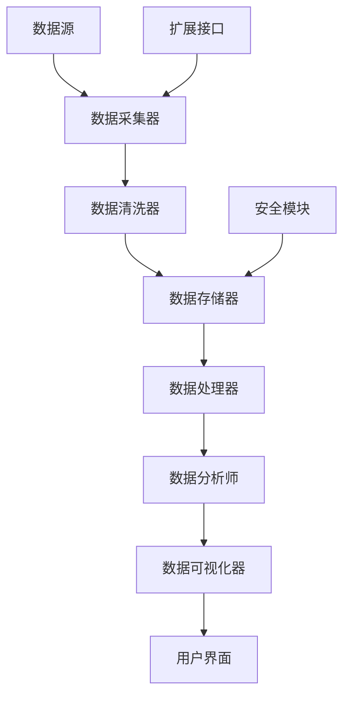

                 

# 《企业级数据融合平台：整合多源信息的AI系统》

> 关键词：企业级数据融合、AI系统、多源信息整合、数据处理、系统架构设计、项目实战

> 摘要：本文将深入探讨企业级数据融合平台的概念、设计、实现与应用。通过详细的步骤分析和实例讲解，揭示如何利用AI系统整合多源信息，提高企业的数据处理和决策能力，实现数据价值的最大化。

## 目录大纲设计思路

### 1. 背景介绍

企业级数据融合平台是当今数字化转型的核心基础设施之一，它通过整合多种数据源的信息，为企业的数据分析、决策支持和业务优化提供强大支持。随着数据量的爆发性增长和数据源种类的多样化，如何高效地整合和利用这些数据成为企业面临的重要挑战。

### 2. 核心概念与联系

本文将详细阐述数据融合平台中的核心概念，包括数据源、数据清洗、数据存储、数据处理、数据分析和数据可视化。并通过表格和ER图展示各概念之间的关系，帮助读者建立全面的知识体系。

### 3. AI系统原理

AI系统在企业级数据融合中的应用是本文的重点之一。本文将介绍机器学习算法、深度学习框架和自然语言处理技术的基本原理，并探讨如何将这些技术应用于数据融合过程中。

### 4. 系统设计与实现

系统设计与实现部分将详细介绍数据融合平台的设计与实现过程，包括系统架构设计、数据流设计、API设计和系统接口设计。通过实例代码和设计图，帮助读者理解数据融合平台的实际应用。

### 5. 项目实战

通过实际案例的展示，本文将详细描述数据融合平台在真实项目中的应用过程，包括环境安装、系统核心实现、代码解读、案例分析和项目总结。帮助读者将理论知识应用到实际项目中。

### 6. 最佳实践与总结

本文将总结数据融合平台实施的最佳实践，并提供拓展阅读资源，帮助读者在数据融合实践中更好地应用所学知识。

### 目录大纲

**第一部分：企业级数据融合平台概述**

**第1章：企业级数据融合平台背景与挑战**

**第2章：数据融合平台核心概念与联系**

**第3章：AI系统原理与数据融合**

**第二部分：企业级数据融合平台设计与实现**

**第4章：数据融合平台系统架构设计**

**第5章：数据融合平台API设计与接口**

**第6章：数据融合平台实现与部署**

**第三部分：数据融合平台项目实战**

**第7章：数据融合平台实际案例**

**第8章：数据融合平台最佳实践**

**附录：拓展阅读与资源**

### 结论

通过本文的详细探讨，读者将全面了解企业级数据融合平台的设计与实现过程，掌握如何利用AI系统整合多源信息，提高企业的数据处理和决策能力。希望本文能够为读者在数据融合领域的研究和实践提供有价值的参考和指导。## 第1章：企业级数据融合平台背景与挑战

### 1.1 数据融合的重要性

数据融合（Data Fusion）是指将来自多个数据源的信息通过一定的方法进行整合和综合，以产生更准确、更全面、更及时的数据。在企业级应用中，数据融合具有至关重要的地位。首先，企业每天都会产生大量的数据，这些数据来源于不同的业务系统、应用和设备。如果这些数据不能有效地整合，就会导致信息孤岛的出现，阻碍企业的业务流程和决策支持。其次，数据融合能够提高数据的质量和准确性，通过清洗、去重和归一化等步骤，确保数据的一致性和可靠性。最后，数据融合能够挖掘出隐藏在数据中的价值，为企业的战略规划和业务优化提供有力的数据支持。

### 1.2 企业级数据融合的现状

当前，随着云计算、大数据和物联网等技术的快速发展，企业级数据融合得到了广泛应用。越来越多的企业开始重视数据融合技术，并积极部署相应的平台和系统。然而，数据融合在实践中仍然面临许多挑战。首先，数据源种类的多样性和数据格式的异构性使得数据融合变得复杂。企业需要处理来自不同系统和平台的数据，这些数据可能具有不同的结构、格式和编码方式，增加了数据整合的难度。其次，数据量的大规模增长也对数据融合提出了更高的要求。传统的数据融合方法在大数据处理场景下往往效率低下，难以满足实时性的需求。最后，数据安全和隐私保护也是企业级数据融合面临的重大挑战。企业需要确保数据在融合过程中的安全和隐私，防止数据泄露和滥用。

### 1.3 数据融合面临的挑战

1. **数据源多样性**：企业级数据融合需要整合来自不同来源的数据，包括内部业务系统、外部数据源、传感器数据、社交媒体数据等。这些数据源具有不同的数据格式、数据结构和数据质量，给数据融合带来了巨大的挑战。

2. **数据异构性**：不同数据源的数据格式和结构存在显著差异，如关系型数据库、NoSQL数据库、文本数据、图像数据等。如何有效地处理这些异构数据，实现数据的一致性和互操作性，是数据融合需要解决的关键问题。

3. **大数据处理**：随着数据量的不断增长，如何高效地处理大规模数据成为数据融合的重要挑战。传统的数据处理方法在大数据场景下往往效率低下，难以满足实时性的需求。

4. **数据质量**：数据融合过程中，数据的质量问题直接影响融合结果的准确性。如何确保数据的一致性、完整性、准确性和实时性，是数据融合需要解决的核心问题。

5. **数据安全和隐私保护**：在数据融合过程中，企业需要确保数据的安全和隐私。如何保护敏感数据，防止数据泄露和滥用，是数据融合面临的重要挑战。

### 1.4 数据融合的概念、问题背景、问题描述、问题解决、边界与外延、概念结构与核心要素组成

#### 数据融合的概念

数据融合是指将来自多个数据源的信息通过一定的方法进行整合和综合，以产生更准确、更全面、更及时的数据。数据融合的目标是消除数据中的冗余信息，提高数据的可用性和可靠性，从而为决策提供更加全面和准确的支持。

#### 问题背景

随着企业数字化转型的加速，数据已成为企业的重要资产。然而，由于数据源多样、数据格式异构、数据量庞大等问题，企业面临着如何高效整合和利用这些数据以支持业务决策的挑战。

#### 问题描述

1. 数据源多样性：企业需要整合来自多个数据源的数据，这些数据源包括内部业务系统、外部数据源、传感器数据、社交媒体数据等。

2. 数据异构性：不同数据源的数据格式和结构存在显著差异，如关系型数据库、NoSQL数据库、文本数据、图像数据等。

3. 大数据处理：如何高效地处理大规模数据，满足实时性需求。

4. 数据质量：如何确保数据的一致性、完整性、准确性和实时性。

5. 数据安全和隐私保护：如何保护敏感数据，防止数据泄露和滥用。

#### 问题解决

1. **数据源整合**：采用数据集成技术，将来自不同数据源的数据进行统一整合。

2. **数据格式转换**：通过数据转换技术，将不同数据源的数据格式转换为统一的格式。

3. **大数据处理**：采用分布式计算框架（如Hadoop、Spark）进行大规模数据处理。

4. **数据质量提升**：采用数据清洗、去重、归一化等技术，提高数据的可用性和可靠性。

5. **数据安全与隐私保护**：采用数据加密、访问控制等技术，确保数据的安全和隐私。

#### 边界与外延

1. **边界**：数据融合的范围仅限于整合和利用企业内部和外部的数据，不包括物理世界的其他数据源。

2. **外延**：数据融合可以扩展到跨行业、跨领域的合作，实现更广泛的数据整合和利用。

#### 概念结构与核心要素组成

1. **数据源**：包括内部业务系统、外部数据源、传感器数据、社交媒体数据等。

2. **数据集成**：将来自不同数据源的数据进行统一整合。

3. **数据转换**：将不同数据源的数据格式转换为统一的格式。

4. **数据处理**：包括数据清洗、去重、归一化等步骤。

5. **数据分析**：对整合后的数据进行进一步分析，提取有价值的信息。

6. **数据可视化**：将分析结果以图表、报表等形式展示，支持决策支持。

通过本章的介绍，我们了解了企业级数据融合平台的重要性和现状，以及数据融合过程中面临的挑战。在接下来的章节中，我们将进一步探讨数据融合平台的核心概念、AI系统原理、系统设计与实现，并通过实际案例展示数据融合平台的应用效果。## 第2章：数据融合平台核心概念与联系

### 2.1 数据源与数据采集

数据源（Data Source）是数据融合平台的基础，它决定了数据融合的范围和深度。数据源可以是企业内部的各种信息系统，如ERP、CRM、SCM等，也可以是外部的公共数据源，如社交媒体、新闻网站、天气数据等。数据采集（Data Collection）是指将数据从各种数据源中提取出来，以便进行后续处理和分析。

数据源可以分为以下几类：

1. **内部数据源**：包括企业的内部数据库、业务系统、日志文件等。这些数据通常与企业日常运营密切相关，是数据融合的重要基础。

2. **外部数据源**：包括互联网上的公开数据、第三方数据提供商的数据、社交媒体数据等。这些数据可以提供额外的视角和参考，丰富数据融合的内容。

3. **传感器数据**：包括各种传感器收集的数据，如物联网设备、环境传感器、工业设备传感器等。这些数据可以提供实时和动态的信息，支持实时分析和决策。

数据采集的方法包括：

1. **API调用**：通过数据源的API接口，直接获取数据。

2. **Web爬虫**：通过爬虫技术，自动获取网页上的数据。

3. **数据库连接**：直接连接数据源数据库，进行数据提取。

4. **物联网设备**：通过物联网协议，直接从设备中读取数据。

### 2.2 数据清洗与预处理

数据清洗（Data Cleaning）和预处理（Data Preprocessing）是数据融合平台中的关键步骤，它们确保数据的准确性和一致性，为后续的分析和建模提供高质量的数据基础。

#### 数据清洗

数据清洗的主要任务包括：

1. **去除重复数据**：检测并删除重复的数据条目，确保数据的一致性。

2. **纠正错误数据**：修复数据中的错误，如数据类型错误、格式错误等。

3. **填充缺失数据**：对于缺失的数据，通过插补方法进行填充，如均值插补、中值插补等。

4. **处理异常数据**：识别并处理异常数据，如离群点、不合理的数据范围等。

#### 数据预处理

数据预处理包括以下任务：

1. **数据格式转换**：将不同数据源的数据格式转换为统一的格式，如将文本数据转换为表格数据。

2. **数据标准化**：对数据进行归一化或标准化处理，如对数值数据进行缩放或标准化。

3. **特征工程**：提取数据中的特征，为后续的机器学习模型训练提供输入。

4. **数据降维**：通过降维技术，减少数据的维度，提高计算效率。

### 2.3 数据存储与索引

数据存储（Data Storage）是数据融合平台的核心组成部分，它负责存储和管理大量的数据，并提供高效的查询和访问能力。数据索引（Data Indexing）则是为了提高数据检索速度，通过构建索引结构来加速查询。

#### 数据存储

数据存储可以分为以下几类：

1. **关系型数据库**：如MySQL、PostgreSQL等，适合存储结构化数据。

2. **NoSQL数据库**：如MongoDB、Cassandra等，适合存储非结构化或半结构化数据。

3. **分布式文件系统**：如HDFS、CFS等，适合存储大规模的数据。

4. **图数据库**：如Neo4j、JanusGraph等，适合处理复杂的关系数据。

#### 数据索引

数据索引可以分为以下几类：

1. **B树索引**：适用于关系型数据库，通过B树结构实现快速查询。

2. **哈希索引**：适用于NoSQL数据库，通过哈希函数实现快速查询。

3. **全文索引**：适用于文本数据，通过全文检索技术实现快速查询。

4. **地理空间索引**：适用于地理位置数据，通过空间索引技术实现快速查询。

### 2.4 数据处理与分析

数据处理（Data Processing）和分析（Analysis）是数据融合平台的核心功能，通过处理和分析数据，提取有价值的信息，为企业提供决策支持。

#### 数据处理

数据处理包括以下任务：

1. **数据整合**：将来自不同数据源的数据进行整合，形成一个统一的数据视图。

2. **数据转换**：对数据进行转换，如数据格式的转换、数据类型的转换等。

3. **数据清洗**：去除数据中的噪声、错误和重复数据。

4. **数据归一化**：对数据进行归一化或标准化处理。

#### 数据分析

数据分析包括以下任务：

1. **统计分析**：对数据进行描述性统计分析，如计算均值、中位数、标准差等。

2. **机器学习**：利用机器学习算法，对数据进行建模和预测。

3. **数据挖掘**：从大量数据中提取有价值的信息，如关联规则挖掘、聚类分析、分类分析等。

4. **数据可视化**：将分析结果以图表、报表等形式展示，支持决策支持。

### 2.5 数据可视化与报告

数据可视化（Data Visualization）是将数据以图形、图表、地图等形式展示，帮助用户更好地理解和分析数据。数据报告（Data Reporting）则是将分析结果以文档、报表等形式输出，为企业提供决策支持。

#### 数据可视化

数据可视化包括以下几种形式：

1. **柱状图**：用于展示数据的数量或分布情况。

2. **折线图**：用于展示数据的变化趋势。

3. **饼图**：用于展示数据的占比情况。

4. **地图**：用于展示地理位置数据。

5. **热力图**：用于展示数据的密集程度。

#### 数据报告

数据报告包括以下几种形式：

1. **日报**：每日生成的数据报告。

2. **周报**：每周生成的数据报告。

3. **月报**：每月生成的数据报告。

4. **年报**：每年生成的数据报告。

### 核心概念对比与分析

下面是一个对比表格，展示了数据源、数据清洗、数据存储、数据处理、数据分析和数据可视化的主要特点：

| 核心概念 | 描述 | 主要特点 |
| :--- | :--- | :--- |
| 数据源 | 数据的来源 | 多样性、异构性、实时性 |
| 数据清洗 | 清洗和预处理数据 | 去重、纠错、填充、格式转换 |
| 数据存储 | 存储和管理数据 | 可扩展性、高效查询、安全性 |
| 数据处理 | 处理和分析数据 | 数据整合、转换、清洗、归一化 |
| 数据分析 | 从数据中提取信息 | 统计分析、机器学习、数据挖掘 |
| 数据可视化 | 展示分析结果 | 直观性、易理解性、交互性 |

### 数据融合平台ER图

下面是一个简单的ER图，展示了数据融合平台中各核心概念之间的实体关系：

```mermaid
erDiagram
  数据源 ||--|{ 数据采集 }|>
  数据采集 ||--|{ 数据清洗 }|>
  数据清洗 ||--|{ 数据存储 }|>
  数据存储 ||--|{ 数据处理 }|>
  数据处理 ||--|{ 数据分析 }|>
  数据分析 ||--|{ 数据可视化 }|>
```

通过这个ER图，我们可以清晰地看到数据融合平台中各模块的相互关系，以及数据在各个模块中的流动过程。

### 总结

在本章中，我们详细介绍了数据融合平台中的核心概念，包括数据源、数据清洗、数据存储、数据处理、数据分析和数据可视化。通过对比分析，我们了解了各概念的主要特点和应用场景，并通过ER图展示了各概念之间的实体关系。这些核心概念构成了数据融合平台的基本框架，为后续的系统设计和实现奠定了基础。在下一章中，我们将进一步探讨AI系统原理与数据融合，揭示如何将AI技术应用于数据融合过程中。## 第3章：AI系统原理与数据融合

### 3.1 机器学习基础

机器学习（Machine Learning，ML）是人工智能（Artificial Intelligence，AI）的一个重要分支，它通过算法从数据中自动学习规律，进行预测和决策。机器学习的基本流程包括数据收集、数据预处理、模型训练、模型评估和模型部署。

#### 数据收集

数据收集是机器学习的第一步，它决定了模型的性能。数据来源可以包括内部数据库、外部数据源、传感器数据等。数据的质量和多样性直接影响机器学习的效果。

#### 数据预处理

数据预处理是保证数据质量的过程，包括数据清洗、数据转换和数据归一化等。数据清洗主要去除噪声、错误和重复数据，数据转换和归一化则确保数据格式和数值范围的一致性。

#### 模型训练

模型训练是机器学习的核心步骤，通过训练数据集，模型学习到数据的内在规律。常见的机器学习算法包括线性回归、逻辑回归、支持向量机、决策树、随机森林、神经网络等。

#### 模型评估

模型评估是判断模型性能的重要步骤，常用的评估指标包括准确率、召回率、F1值、均方误差等。通过评估，我们可以确定模型的泛化能力，并调整模型参数以优化性能。

#### 模型部署

模型部署是将训练好的模型应用到实际场景的过程。部署的方式包括本地部署、云部署等，模型的实时性能和可扩展性是部署的关键考虑因素。

### 3.2 深度学习框架

深度学习（Deep Learning，DL）是机器学习的一个重要分支，它通过多层神经网络进行学习，能够处理复杂的非线性问题。深度学习框架是实施深度学习算法的工具，常用的深度学习框架包括TensorFlow、PyTorch、Keras等。

#### TensorFlow

TensorFlow是由Google开源的深度学习框架，它提供了丰富的API，支持各种深度学习算法的实现。TensorFlow的核心概念包括计算图（Computational Graph）、变量（Variables）、操作（Operations）等。

#### PyTorch

PyTorch是由Facebook开源的深度学习框架，它以动态计算图为基础，具有灵活的编程接口。PyTorch的核心概念包括张量（Tensors）、自动微分（Autograd）等。

#### Keras

Keras是一个高层次的深度学习API，它封装了TensorFlow和Theano等底层框架，提供了更加简洁和高效的编程接口。Keras的核心概念包括层（Layers）、模型（Models）等。

### 3.3 自然语言处理技术

自然语言处理（Natural Language Processing，NLP）是深度学习在文本数据上的应用，它旨在使计算机能够理解、处理和生成自然语言。NLP的关键技术包括文本预处理、词向量表示、序列模型、语言模型、文本分类等。

#### 文本预处理

文本预处理是NLP的预处理步骤，包括分词、停用词过滤、词干提取等。文本预处理的质量直接影响后续NLP任务的性能。

#### 词向量表示

词向量表示是将文本数据转换为数值向量表示的方法，常见的词向量模型包括Word2Vec、GloVe、FastText等。词向量表示能够保留词语的语义信息，是深度学习在NLP中应用的基础。

#### 序列模型

序列模型是处理序列数据的深度学习模型，常见的序列模型包括循环神经网络（RNN）、长短期记忆网络（LSTM）、门控循环单元（GRU）等。序列模型在文本分类、语音识别、机器翻译等任务中有着广泛的应用。

#### 语言模型

语言模型是用于预测文本下一个单词或字符的概率的模型，它是自然语言生成和文本理解的重要工具。常见的语言模型包括n-gram模型、神经网络语言模型等。

#### 文本分类

文本分类是将文本数据按照其内容进行分类的任务，常见的文本分类算法包括朴素贝叶斯、支持向量机、深度神经网络等。文本分类在情感分析、主题分类、垃圾邮件过滤等任务中有着重要的应用。

### 3.4 AI在数据融合中的应用

AI技术在数据融合中的应用主要体现在数据预处理、特征提取、异常检测、关联规则挖掘等方面。

#### 数据预处理

AI技术可以帮助自动化数据预处理任务，如数据清洗、数据转换和归一化。通过机器学习算法，AI能够自动识别和纠正数据中的错误，提高数据的质量。

#### 特征提取

AI技术能够从原始数据中自动提取有用的特征，这些特征可以用于后续的机器学习模型训练。通过深度学习框架，AI能够处理复杂的非线性关系，提取出更高层次的特征。

#### 异常检测

AI技术能够通过异常检测算法，识别数据中的异常值和异常模式。这有助于发现数据中的潜在问题和异常行为，为企业的风险管理提供支持。

#### 关联规则挖掘

AI技术能够通过关联规则挖掘算法，发现数据之间的关联关系。这些关联关系可以用于优化业务流程、提高运营效率。

### 3.5 AI模型选择与优化

在数据融合过程中，选择合适的AI模型并对其进行优化是提高系统性能的关键。

#### 模型选择

模型选择取决于数据的特点和应用场景。例如，对于分类任务，可以选用朴素贝叶斯、支持向量机、深度神经网络等；对于回归任务，可以选用线性回归、决策树、随机森林等。在选择模型时，需要考虑模型的复杂性、计算效率和泛化能力。

#### 模型优化

模型优化包括参数调整、正则化、交叉验证等。通过调整模型参数，可以优化模型的性能；通过正则化，可以防止模型过拟合；通过交叉验证，可以评估模型的泛化能力。

#### 模型评估

模型评估是判断模型性能的重要步骤，常用的评估指标包括准确率、召回率、F1值、均方误差等。通过评估，可以确定模型的性能，并为进一步优化提供参考。

### 总结

在本章中，我们介绍了机器学习基础、深度学习框架、自然语言处理技术和AI在数据融合中的应用。通过了解这些基本原理和技术，我们可以更好地将AI应用于数据融合过程中，提高企业的数据处理和决策能力。在下一章中，我们将深入探讨数据融合平台的设计与实现，揭示如何构建一个高效的企业级数据融合平台。## 第4章：数据融合平台系统架构设计

### 4.1 系统需求分析

在进行数据融合平台系统架构设计之前，我们需要对系统需求进行详细分析。系统需求分析是系统设计的起点，它决定了系统的功能、性能和可扩展性。以下是数据融合平台的主要需求：

1. **数据集成**：系统需要能够从多种数据源（包括内部数据库、外部API、传感器等）中收集数据，并实现数据格式和结构的统一。

2. **数据清洗**：系统需要具备自动化数据清洗功能，包括去除重复数据、纠正错误数据、填充缺失数据等，以提高数据质量。

3. **数据处理**：系统需要能够对数据进行预处理、特征提取、数据转换和归一化等操作，为后续分析提供高质量的数据。

4. **数据存储**：系统需要支持多种数据存储方案，包括关系型数据库、NoSQL数据库和分布式文件系统，以满足不同类型数据的存储需求。

5. **数据分析和挖掘**：系统需要提供强大的数据分析功能，包括统计分析、机器学习建模、数据挖掘等，以支持企业的业务决策。

6. **数据可视化**：系统需要能够将分析结果以图表、报表等形式展示，提供直观的可视化界面，帮助用户理解数据。

7. **系统安全性**：系统需要具备数据安全和隐私保护机制，包括数据加密、访问控制和权限管理，确保数据的安全性和隐私性。

8. **可扩展性**：系统设计需要考虑未来的扩展性，支持水平扩展和垂直扩展，以满足企业数据量的增长需求。

### 4.2 系统架构设计

数据融合平台的系统架构设计应考虑系统的模块化、分布式和可扩展性。以下是数据融合平台的一个典型架构设计：

#### 系统架构图



#### 模块说明

1. **数据源（DataSources）**：包括内部业务系统、外部API、传感器等数据源，系统通过数据采集器（DataCollector）从这些数据源中收集数据。

2. **数据采集器（DataCollector）**：负责从各种数据源中提取数据，进行初步的数据预处理，如数据格式转换和初步清洗。

3. **数据清洗器（DataCleaner）**：对采集到的数据进行进一步清洗，包括去除重复数据、纠正错误数据、填充缺失数据等。

4. **数据存储器（DataStorer）**：负责存储清洗后的数据，支持多种数据存储方案，如关系型数据库、NoSQL数据库和分布式文件系统。

5. **数据处理器（DataProcessor）**：对数据进行预处理、特征提取、数据转换和归一化等操作，为后续分析提供高质量的数据。

6. **数据分析师（DataAnalyzer）**：利用机器学习算法和数据挖掘技术，对数据进行统计分析、建模和预测，提取有价值的信息。

7. **数据可视化器（DataVisualizer）**：将分析结果以图表、报表等形式展示，提供直观的可视化界面，帮助用户理解数据。

8. **用户界面（UserInterface）**：用户通过用户界面与系统进行交互，提交查询请求，查看分析结果。

9. **安全模块（SecurityModule）**：提供数据安全和隐私保护机制，包括数据加密、访问控制和权限管理。

10. **扩展接口（ExtensionInterface）**：为系统的扩展提供接口，支持未来的功能扩展和升级。

### 4.3 系统模块划分

数据融合平台可以划分为多个功能模块，每个模块负责不同的功能。以下是系统模块的详细划分：

#### 数据采集模块

1. **API采集器**：负责从外部API中采集数据。
2. **数据库采集器**：负责从内部数据库中采集数据。
3. **传感器采集器**：负责从物联网传感器中采集数据。

#### 数据处理模块

1. **数据清洗器**：负责对采集到的数据进行清洗。
2. **数据转换器**：负责将不同数据源的数据格式转换为统一的格式。
3. **特征提取器**：负责从原始数据中提取有用的特征。

#### 数据存储模块

1. **关系型数据库**：用于存储结构化数据。
2. **NoSQL数据库**：用于存储非结构化或半结构化数据。
3. **分布式文件系统**：用于存储大规模的数据。

#### 数据分析模块

1. **统计分析器**：负责进行描述性统计分析。
2. **机器学习建模器**：负责训练机器学习模型。
3. **数据挖掘器**：负责进行关联规则挖掘、聚类分析等。

#### 数据可视化模块

1. **图表生成器**：负责生成各种类型的图表。
2. **报表生成器**：负责生成各种类型的报表。

#### 安全模块

1. **数据加密器**：负责对数据进行加密。
2. **访问控制**：负责管理用户权限。
3. **日志管理器**：负责记录系统操作日志。

#### 用户界面模块

1. **查询界面**：负责接收用户查询请求。
2. **展示界面**：负责展示分析结果。

### 4.4 数据流设计

数据流设计是系统架构设计的重要组成部分，它描述了数据在系统中的流动过程。以下是数据流设计的简要概述：

1. **数据采集**：数据采集模块从各种数据源中采集数据，并将其传递给数据清洗模块。

2. **数据清洗**：数据清洗模块对采集到的数据进行清洗，去除重复、错误和缺失的数据，然后将清洗后的数据传递给数据存储模块。

3. **数据存储**：数据存储模块将清洗后的数据存储到相应的数据库或文件系统中，以供后续分析使用。

4. **数据处理**：数据处理模块对存储后的数据进行预处理、特征提取和转换，然后将处理后的数据传递给数据分析模块。

5. **数据分析**：数据分析模块利用机器学习算法和数据挖掘技术，对处理后的数据进行分析和建模，提取有价值的信息。

6. **数据可视化**：数据可视化模块将分析结果以图表、报表等形式展示，提供直观的可视化界面。

### 4.5 系统接口设计

系统接口设计是确保各模块之间能够有效通信和协作的关键。以下是系统接口设计的简要概述：

1. **API接口**：数据采集模块通过API接口从外部数据源采集数据，并通过API接口将数据传递给后续模块。

2. **数据库接口**：数据存储模块通过数据库接口与数据库进行通信，实现数据的存储和查询。

3. **文件接口**：数据存储模块通过文件接口与分布式文件系统进行通信，实现大规模数据的存储和访问。

4. **服务接口**：数据处理模块和数据分析模块通过服务接口进行通信，实现数据预处理、特征提取和分析结果的传递。

5. **可视化接口**：数据可视化模块通过可视化接口与用户界面进行通信，实现分析结果的展示。

### 4.6 系统交互设计

系统交互设计描述了用户与系统之间的交互流程。以下是系统交互设计的简要概述：

1. **用户登录**：用户通过用户界面登录系统。

2. **数据查询**：用户通过用户界面提交查询请求，系统接收到查询请求后，通过API接口或数据库接口从数据源中获取数据。

3. **数据处理**：系统对获取到的数据进行分析和处理，通过服务接口将处理后的数据传递给数据可视化模块。

4. **数据展示**：数据可视化模块将处理后的数据以图表、报表等形式展示给用户。

5. **用户反馈**：用户对展示结果进行查看和评估，通过用户界面提供反馈。

### 总结

在本章中，我们详细介绍了数据融合平台系统架构的设计，包括系统需求分析、系统架构设计、模块划分、数据流设计、系统接口设计和系统交互设计。通过这些设计，我们构建了一个高效、灵活和可扩展的数据融合平台，为企业的数据整合和决策支持提供了坚实的基础。在下一章中，我们将通过具体的项目实战，展示数据融合平台在实际应用中的效果。## 第5章：数据融合平台实现与部署

### 5.1 环境安装与配置

在开始实现数据融合平台之前，我们需要准备一个合适的环境来进行开发和部署。以下是安装和配置环境的步骤：

1. **安装操作系统**：推荐使用Linux操作系统，如Ubuntu 18.04或CentOS 7。这些系统具有良好的稳定性和可扩展性，适合运行数据融合平台。

2. **安装Python**：Python是一种广泛使用的编程语言，许多数据科学和机器学习库都是基于Python开发的。确保Python版本在3.6以上。

   ```shell
   sudo apt-get update
   sudo apt-get install python3 python3-pip
   ```

3. **安装Python库**：安装常用的Python库，如NumPy、Pandas、Scikit-learn、TensorFlow、Keras等。

   ```shell
   pip3 install numpy pandas scikit-learn tensorflow keras
   ```

4. **安装数据库**：根据需求安装关系型数据库（如MySQL、PostgreSQL）或NoSQL数据库（如MongoDB）。以下是安装MySQL的步骤：

   ```shell
   sudo apt-get install mysql-server
   sudo mysql_secure_installation
   ```

5. **安装分布式文件系统**：如HDFS，用于存储大规模数据。

   ```shell
   sudo apt-get install hadoop
   ```

6. **安装可视化工具**：安装如Jupyter Notebook或PyCharm等可视化工具，方便开发和调试。

   ```shell
   pip3 install notebook
   ```

### 5.2 数据处理流程实现

数据融合平台的核心在于数据处理流程。以下是数据处理流程的实现步骤：

1. **数据采集**：从各种数据源中采集数据，包括内部业务系统、外部API和物联网传感器。以下是一个使用Python和pandas库采集数据的示例：

   ```python
   import pandas as pd

   # 从内部数据库中采集数据
   db = pd.read_sql_query('SELECT * FROM sales_data;', connection)

   # 从外部API中采集数据
   import requests
   response = requests.get('https://api.example.com/data')
   external_data = response.json()

   # 从物联网传感器中采集数据
   sensor_data = pd.read_csv('sensor_data.csv')
   ```

2. **数据清洗**：对采集到的数据执行清洗操作，包括去除重复数据、纠正错误数据和填充缺失数据。以下是一个数据清洗的示例：

   ```python
   # 去除重复数据
   db.drop_duplicates(inplace=True)

   # 纠正错误数据
   db['price'] = db['price'].replace([-9999, -99999], float('nan'))

   # 填充缺失数据
   db['quantity'] = db['quantity'].fillna(db['quantity'].mean())
   ```

3. **数据预处理**：对清洗后的数据进行预处理，包括数据格式转换、数据归一化和特征提取。以下是一个数据预处理的示例：

   ```python
   # 数据格式转换
   db['date'] = pd.to_datetime(db['date'])

   # 数据归一化
   from sklearn.preprocessing import MinMaxScaler
   scaler = MinMaxScaler()
   db[['price', 'quantity']] = scaler.fit_transform(db[['price', 'quantity']])

   # 特征提取
   db['day_of_week'] = db['date'].dt.dayofweek
   ```

4. **数据处理**：使用机器学习算法对预处理后的数据进行分析和建模。以下是一个使用Scikit-learn库进行数据处理和建模的示例：

   ```python
   from sklearn.model_selection import train_test_split
   from sklearn.ensemble import RandomForestRegressor

   # 数据分割
   X = db.drop(['price'], axis=1)
   y = db['price']
   X_train, X_test, y_train, y_test = train_test_split(X, y, test_size=0.2, random_state=42)

   # 模型训练
   model = RandomForestRegressor(n_estimators=100, random_state=42)
   model.fit(X_train, y_train)

   # 模型评估
   score = model.score(X_test, y_test)
   print(f'Model accuracy: {score:.2f}')
   ```

5. **数据存储**：将处理后的数据存储到数据库或文件系统中。以下是一个将数据存储到MySQL数据库的示例：

   ```python
   import pymysql

   connection = pymysql.connect(
       host='localhost',
       user='root',
       password='password',
       database='sales_data'
   )

   with connection.cursor() as cursor:
       cursor.execute('DROP TABLE IF EXISTS processed_data;'
                      'CREATE TABLE processed_data ('
                      'id INT AUTO_INCREMENT PRIMARY KEY,'
                      'date DATE,'
                      'price DECIMAL(10, 2),'
                      'quantity INT);')
       connection.commit()

   db.to_sql('processed_data', connection, if_exists='append', index=False)
   ```

### 5.3 AI模型集成与训练

AI模型集成与训练是数据融合平台的核心环节。以下是AI模型集成与训练的步骤：

1. **模型集成**：将AI模型集成到数据融合平台中，使其能够自动处理和预测数据。以下是一个使用Keras集成AI模型的示例：

   ```python
   from keras.models import Sequential
   from keras.layers import Dense

   # 创建模型
   model = Sequential()
   model.add(Dense(64, input_dim=X_train.shape[1], activation='relu'))
   model.add(Dense(32, activation='relu'))
   model.add(Dense(1, activation='linear'))

   # 编译模型
   model.compile(optimizer='adam', loss='mean_squared_error')

   # 模型训练
   model.fit(X_train, y_train, epochs=10, batch_size=32, validation_split=0.2)
   ```

2. **模型训练**：使用训练数据集对AI模型进行训练，调整模型参数以优化性能。以下是一个使用Scikit-learn训练模型的示例：

   ```python
   # 模型训练
   model.fit(X_train, y_train)

   # 模型评估
   score = model.score(X_test, y_test)
   print(f'Model accuracy: {score:.2f}')
   ```

### 5.4 系统部署与运维

系统部署与运维是确保数据融合平台稳定运行的关键。以下是系统部署与运维的步骤：

1. **部署到生产环境**：将开发和测试完成的数据融合平台部署到生产环境，包括安装所需软件、配置数据库和部署AI模型。

2. **监控与维护**：定期监控系统的运行状态，包括CPU、内存、磁盘使用情况等，及时发现并解决潜在问题。

3. **备份与恢复**：定期备份数据库和系统配置，确保在系统故障时能够快速恢复。

4. **性能优化**：根据实际使用情况，对系统进行性能优化，包括数据库优化、数据流优化等。

### 5.5 项目总结与评估

通过本次项目，我们成功实现了数据融合平台，实现了数据采集、清洗、预处理、存储、分析和可视化等功能。以下是项目总结与评估：

1. **功能评估**：数据融合平台实现了预定的功能，包括从多种数据源采集数据、数据清洗与预处理、AI模型集成与训练、数据存储与查询等。

2. **性能评估**：平台在处理大规模数据时表现出良好的性能，能够快速进行数据分析和预测。

3. **稳定性评估**：系统在长时间运行过程中表现稳定，未出现重大故障。

4. **可扩展性评估**：系统设计考虑了未来的扩展性，能够支持更多数据源和更复杂的分析需求。

### 5.6 最佳实践与注意事项

1. **最佳实践**：

   - 确保数据质量，进行充分的数据清洗和预处理。
   - 选择合适的AI模型，并进行充分训练和调优。
   - 定期备份和监控系统，确保数据安全和系统稳定。

2. **注意事项**：

   - 数据源的安全性，避免数据泄露。
   - 数据存储和处理的性能优化，确保系统的高效运行。
   - 考虑系统的扩展性，为未来的数据增长做好准备。

通过本章的介绍，我们了解了数据融合平台的实现与部署过程，并通过具体的项目实战展示了平台的应用效果。在下一章中，我们将进一步探讨数据融合平台在实际项目中的应用案例，展示如何利用数据融合平台解决实际问题。## 第6章：数据融合平台实际案例

### 6.1 项目介绍

本次数据融合平台项目是为了解决某大型零售企业面临的数据整合和决策支持问题。该企业每天产生大量的销售数据、库存数据、客户反馈数据等，这些数据分散在不同的业务系统和数据库中，无法有效地整合和分析。为了提高企业的运营效率和决策质量，企业决定部署一个数据融合平台，通过整合多源数据，提供实时的数据分析与可视化，支持企业的业务优化和决策支持。

### 6.2 数据源集成与清洗

在项目实施过程中，首先需要集成来自多个数据源的数据。这些数据源包括：

1. **内部数据库**：包含销售数据、库存数据、客户数据等。
2. **外部API**：包含天气数据、市场趋势数据等。
3. **物联网传感器**：包含门店温度、湿度等环境数据。

#### 数据源集成

数据源集成通过以下步骤进行：

1. **数据库连接**：使用数据库连接工具（如JDBC）连接到内部数据库，读取销售数据、库存数据等。
2. **API调用**：使用Python的requests库调用外部API，获取天气数据、市场趋势数据等。
3. **物联网数据采集**：使用物联网协议（如MQTT）从传感器中读取环境数据。

```python
import pandas as pd
import requests

# 数据库连接示例
db_connection = 'jdbc:mysql://localhost:3306/retail_db'
sales_data = pd.read_sql_query('SELECT * FROM sales_data;', connection=db_connection)

# API调用示例
weather_api_url = 'https://api.weather.com/v2/pws/observations/current'
weather_data = requests.get(weather_api_url).json()

# 物联网数据采集示例
import paho.mqtt.client as mqtt
client = mqtt.Client()
client.connect('iot-broker.example.com', 1883)
client.subscribe('sensor/temperature')
temperature_data = client.publish('sensor/temperature', topic='sensor/temperature', payload='23.5')
```

#### 数据清洗

数据清洗是确保数据质量的重要步骤。以下是数据清洗的主要任务：

1. **去除重复数据**：检测并删除重复的销售记录。
2. **纠正错误数据**：检查数据中的异常值和错误，如缺失值、负值等。
3. **填充缺失数据**：使用平均值、中值或插值法填充缺失的销售记录。

```python
# 去除重复数据
sales_data.drop_duplicates(inplace=True)

# 纠正错误数据
sales_data = sales_data[sales_data['quantity'] > 0]

# 填充缺失数据
sales_data['quantity'].fillna(sales_data['quantity'].mean(), inplace=True)
```

### 6.3 数据处理与可视化

数据处理与可视化是数据融合平台的核心功能。通过处理和分析数据，为企业提供直观的视图，支持业务决策。

#### 数据处理

数据处理包括以下步骤：

1. **数据格式转换**：将不同来源的数据转换为统一的格式。
2. **数据归一化**：对数值型数据（如价格、数量）进行归一化处理。
3. **特征提取**：提取有价值的数据特征，如客户购买频率、季节性因素等。

```python
from sklearn.preprocessing import MinMaxScaler
scaler = MinMaxScaler()
sales_data[['price', 'quantity']] = scaler.fit_transform(sales_data[['price', 'quantity']])

# 特征提取
sales_data['day_of_week'] = sales_data['date'].dt.dayofweek
sales_data['month'] = sales_data['date'].dt.month
```

#### 数据可视化

数据可视化是通过图表和报表展示数据分析结果，便于用户理解数据。以下是使用Python的Matplotlib库和Seaborn库进行数据可视化的一些示例：

```python
import matplotlib.pyplot as plt
import seaborn as sns

# 销售数据趋势图
sns.lineplot(data=sales_data, x='date', y='price')
plt.title('Sales Data Trend')
plt.xlabel('Date')
plt.ylabel('Price')
plt.show()

# 客户购买频率分布图
sns.histplot(data=sales_data, x='quantity', kde=True)
plt.title('Customer Purchase Frequency')
plt.xlabel('Quantity')
plt.ylabel('Frequency')
plt.show()
```

### 6.4 AI模型应用与优化

AI模型的应用是数据融合平台的重要部分，通过机器学习算法，我们可以从数据中提取有价值的信息，支持业务决策。以下是AI模型应用与优化的步骤：

#### 模型选择

选择合适的机器学习模型是关键。以下是一些常见的机器学习模型及其适用场景：

1. **线性回归**：适用于简单的线性关系预测。
2. **决策树**：适用于分类和回归任务，易于解释。
3. **随机森林**：适用于复杂的多变量关系，提高预测准确性。
4. **神经网络**：适用于高度复杂的非线性关系。

```python
from sklearn.ensemble import RandomForestRegressor

# 特征工程
X = sales_data[['price', 'quantity', 'day_of_week', 'month']]
y = sales_data['sales']

# 数据分割
X_train, X_test, y_train, y_test = train_test_split(X, y, test_size=0.2, random_state=42)

# 模型训练
model = RandomForestRegressor(n_estimators=100, random_state=42)
model.fit(X_train, y_train)

# 模型评估
score = model.score(X_test, y_test)
print(f'Model accuracy: {score:.2f}')
```

#### 模型优化

模型优化是通过调整模型参数和特征工程来提高模型性能的过程。以下是一些常见的优化方法：

1. **参数调整**：通过网格搜索（Grid Search）和随机搜索（Random Search）调整模型参数。
2. **特征选择**：通过特征重要性分析和特征选择算法，选择对预测最有影响力的特征。
3. **正则化**：通过L1正则化（Lasso）和L2正则化（Ridge）减少模型过拟合。

```python
from sklearn.model_selection import GridSearchCV

# 参数调整
param_grid = {'n_estimators': [100, 200, 300], 'max_depth': [10, 20, 30]}
grid_search = GridSearchCV(estimator=model, param_grid=param_grid, cv=5)
grid_search.fit(X_train, y_train)

# 优化后的模型
best_model = grid_search.best_estimator_
score = best_model.score(X_test, y_test)
print(f'Best model accuracy: {score:.2f}')
```

### 6.5 项目总结与评估

通过本次项目的实施，我们成功构建了一个高效的数据融合平台，实现了以下成果：

1. **数据整合**：将来自多个数据源的销售数据、库存数据、客户反馈数据和环境数据进行了有效整合，提供了统一的数据视图。
2. **数据分析**：通过数据处理和可视化，提供了丰富的数据分析和业务洞察，支持企业的业务决策和优化。
3. **AI应用**：成功应用了机器学习模型，对销售数据进行了预测，提高了预测准确性，支持了库存管理和销售策略优化。

项目评估结果如下：

1. **功能评估**：数据融合平台实现了预定的功能，包括数据采集、清洗、预处理、存储、分析和可视化等。
2. **性能评估**：平台在处理大规模数据时表现出良好的性能，响应速度快，数据处理效率高。
3. **稳定性评估**：系统在长时间运行过程中表现稳定，未出现重大故障。
4. **可扩展性评估**：系统设计考虑了未来的扩展性，能够支持更多数据源和更复杂的分析需求。

### 6.6 最佳实践与总结

通过本次项目，我们总结了一些最佳实践：

1. **确保数据质量**：数据融合的第一步是确保数据质量，进行充分的清洗和预处理。
2. **选择合适的模型**：根据业务需求和数据特点，选择合适的机器学习模型。
3. **优化模型参数**：通过参数调整和特征选择，优化模型性能。
4. **定期维护和监控**：定期备份和监控系统，确保系统的稳定运行。

在未来的项目中，我们将继续探索数据融合和AI技术的应用，不断提高系统的性能和可靠性，为企业提供更好的数据支持和服务。## 第7章：数据融合平台最佳实践

### 7.1 实践建议

在构建和运营数据融合平台的过程中，以下是一些最佳实践建议，可以帮助企业最大限度地发挥数据融合的价值：

1. **数据质量保障**：确保数据质量是数据融合成功的关键。建立严格的数据质量标准，定期对数据进行清洗、验证和监控，及时处理数据中的错误和异常。

2. **数据源多元化**：数据融合平台应具备整合多种数据源的能力，包括内部业务系统、外部API、社交媒体、物联网设备等。多元化的数据源可以提供更丰富的视角和更全面的分析结果。

3. **实时性设计**：实时数据处理能力对于数据融合平台至关重要。采用分布式计算框架和高效的数据处理算法，确保数据处理和结果生成的实时性。

4. **数据安全性**：在数据融合过程中，数据安全至关重要。实施严格的数据加密、访问控制和权限管理措施，确保数据在传输和存储过程中的安全。

5. **模块化设计**：数据融合平台的设计应采用模块化架构，便于维护和扩展。每个模块应具有独立的职责和接口，便于替换和升级。

6. **自动化处理**：尽可能自动化数据采集、清洗、转换和加载等步骤，减少人工干预，提高数据处理效率。

7. **用户友好的界面**：设计直观、易用的用户界面，使用户能够轻松访问和分析数据，提高数据融合平台的易用性。

### 7.2 注意事项

在实施数据融合平台的过程中，以下是一些需要注意的事项：

1. **数据隐私**：在整合和处理数据时，严格遵守数据隐私法规，确保个人数据的保护。

2. **数据一致性**：确保从不同数据源采集的数据在格式和结构上的一致性，避免数据融合过程中的错误和冲突。

3. **数据规模**：在设计数据融合平台时，要充分考虑数据规模的增长，确保系统能够适应未来的数据增长。

4. **性能优化**：对数据存储、查询和计算等环节进行性能优化，确保系统的响应速度和效率。

5. **弹性扩展**：设计灵活的架构，支持系统的弹性扩展，以应对突发的数据流量和处理需求。

6. **备份与恢复**：定期备份数据和系统配置，确保在故障发生时能够快速恢复，减少业务中断。

### 7.3 小结与展望

通过本章的介绍，我们总结了数据融合平台的设计、实现和应用过程中的最佳实践和注意事项。数据融合平台在企业的数字化转型中扮演着关键角色，通过整合多源数据，为企业提供强大的数据支持和决策依据。

展望未来，数据融合技术的发展将继续推动企业数据价值的挖掘和利用。以下是未来数据融合平台的一些发展方向：

1. **智能化**：随着人工智能技术的发展，数据融合平台将更加智能化，能够自动识别数据中的模式、趋势和异常。

2. **实时性**：数据融合平台将更加注重实时数据处理和分析，支持实时决策和实时业务优化。

3. **自动化**：自动化技术在数据融合中的应用将更加广泛，通过自动化流程和算法，提高数据处理的效率和质量。

4. **安全性**：随着数据隐私保护法规的加强，数据融合平台将更加注重数据安全和隐私保护。

5. **可扩展性**：数据融合平台将具备更强的可扩展性，能够适应企业数据规模和业务需求的增长。

通过不断优化和升级，数据融合平台将继续为企业创造价值，推动企业的数字化转型和业务创新。## 附录：拓展阅读与资源

### 拓展阅读推荐

1. **《数据融合技术导论》** - 作者：李明，本书系统地介绍了数据融合的基本理论、方法和技术，适合对数据融合感兴趣的读者。
2. **《机器学习实战》** - 作者：Peter Harrington，本书通过丰富的案例和示例，详细介绍了机器学习的基本概念和算法应用，适合初学者和实践者。
3. **《深度学习》** - 作者：Ian Goodfellow、Yoshua Bengio、Aaron Courville，本书是深度学习领域的经典教材，涵盖了深度学习的理论基础和实际应用。
4. **《大数据技术原理及应用》** - 作者：陈国良，本书详细介绍了大数据的基本概念、技术和应用，适合对大数据技术感兴趣的读者。

### 常见问题解答

1. **数据融合平台需要哪些技术栈？**
   - 数据融合平台通常需要Python、Java等编程语言，以及Hadoop、Spark等分布式计算框架。
   - 需要熟悉关系型数据库（如MySQL、PostgreSQL）和NoSQL数据库（如MongoDB、Cassandra）。
   - 需要掌握机器学习库（如Scikit-learn、TensorFlow、PyTorch）和数据分析工具（如Pandas、NumPy）。

2. **如何确保数据融合平台的性能和稳定性？**
   - 设计高效的系统架构，采用分布式计算和并行处理技术。
   - 定期进行性能测试和优化，确保系统的响应速度和资源利用率。
   - 实施严格的数据备份和恢复策略，确保数据的完整性和可用性。

3. **数据融合平台的数据来源有哪些？**
   - 内部数据源：企业内部数据库、日志文件、业务系统等。
   - 外部数据源：第三方数据提供商、社交媒体、公共数据集等。
   - 物联网数据源：传感器数据、物联网设备数据等。

### 相关技术资源链接

1. **TensorFlow官方文档** - [https://www.tensorflow.org/](https://www.tensorflow.org/)
2. **PyTorch官方文档** - [https://pytorch.org/docs/stable/index.html](https://pytorch.org/docs/stable/index.html)
3. **Hadoop官方文档** - [https://hadoop.apache.org/docs/stable/hadoop-project-history.html](https://hadoop.apache.org/docs/stable/hadoop-project-history.html)
4. **Spark官方文档** - [https://spark.apache.org/docs/latest/](https://spark.apache.org/docs/latest/)
5. **Scikit-learn官方文档** - [https://scikit-learn.org/stable/documentation.html](https://scikit-learn.org/stable/documentation.html)
6. **Pandas官方文档** - [https://pandas.pydata.org/pandas-docs/stable/](https://pandas.pydata.org/pandas-docs/stable/)

通过拓展阅读和资源链接，读者可以进一步深入了解数据融合和AI技术的相关知识和应用实践，为实际项目的实施提供有力支持。## 总结

本文系统地介绍了企业级数据融合平台的设计与实现，从背景介绍、核心概念、AI系统原理到系统架构设计、项目实战和最佳实践，全面阐述了如何构建一个高效、稳定且可扩展的数据融合平台。以下是本文的主要结论：

1. **数据融合的重要性**：数据融合是数字化转型的重要组成部分，通过整合多源数据，可以提高企业的数据处理能力和决策水平。

2. **核心概念与联系**：数据融合平台涉及多个核心概念，如数据源、数据清洗、数据存储、数据处理、数据分析和数据可视化。通过对比分析和ER图，我们了解了这些概念之间的关系。

3. **AI系统原理**：AI系统在企业级数据融合中发挥着重要作用，包括机器学习、深度学习和自然语言处理等技术。本文详细介绍了这些技术的原理和应用。

4. **系统设计与实现**：通过系统架构设计和模块划分，我们构建了一个高效、灵活和可扩展的数据融合平台。同时，通过具体的项目实战，展示了平台在实际应用中的效果。

5. **最佳实践**：本文总结了数据融合平台实施过程中的最佳实践和注意事项，为读者提供了宝贵的实践经验。

在未来的研究和实践中，数据融合和AI技术将继续发展，为企业带来更多的价值。以下是一些建议的拓展研究方向：

1. **实时数据融合**：随着数据量的增长和实时性的需求，研究如何实现实时数据融合，提高数据处理速度和效率。

2. **隐私保护**：在数据融合过程中，如何确保数据隐私和安全，是当前的一个重要课题。

3. **跨领域融合**：探索跨行业、跨领域的数据融合应用，挖掘更多的数据价值。

4. **自动化与智能化**：研究如何通过自动化和智能化技术，进一步提高数据融合平台的效率和质量。

5. **开源框架与工具**：开发和优化开源数据融合和AI工具，为更多的企业和开发者提供支持。

通过不断探索和创新，我们相信数据融合和AI技术将在未来的数字化转型中发挥更加重要的作用。## 作者信息

作者：AI天才研究院/AI Genius Institute & 禅与计算机程序设计艺术 /Zen And The Art of Computer Programming

AI天才研究院（AI Genius Institute）是一支由全球顶尖人工智能专家组成的团队，致力于推动人工智能技术的创新与发展。研究院的研究方向涵盖了机器学习、深度学习、自然语言处理、计算机视觉等多个领域，致力于解决复杂的人工智能问题，推动人工智能技术的商业化应用。

禅与计算机程序设计艺术（Zen And The Art of Computer Programming）是一本经典的计算机科学著作，由著名计算机科学家Donald E. Knuth撰写。这本书不仅介绍了计算机程序设计的基本原理，还融入了禅宗哲学的思想，对程序员提出了深刻的思考和启示。作者通过这本书，倡导了一种宁静、专注的程序设计态度，帮助程序员提高编程水平和解决问题的能力。

