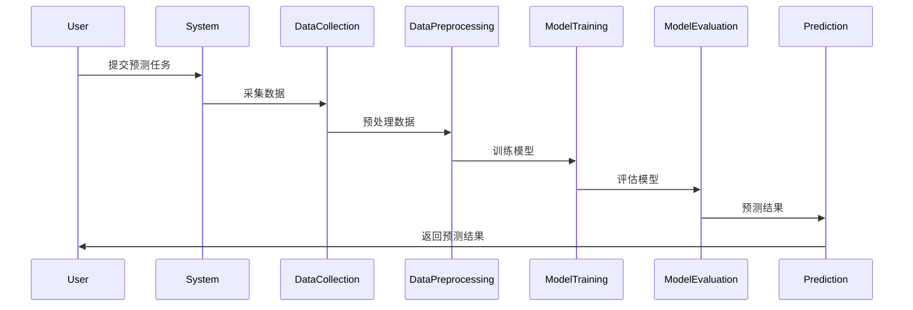
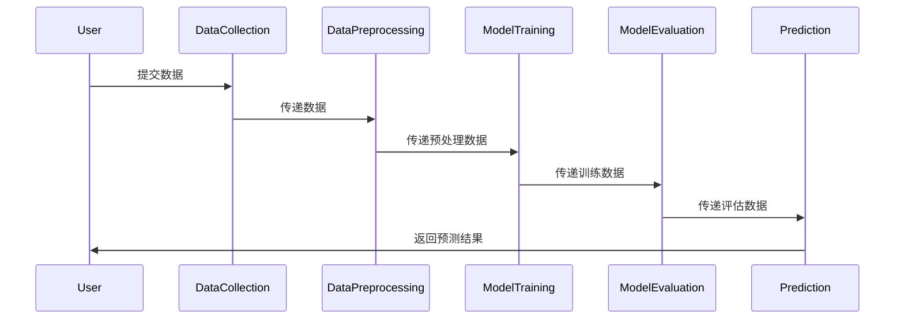

                 


**标题**：企业级时序预测平台：增强业务预测能力

**关键词**：时序预测，企业级，业务预测，算法，平台架构，数学模型

**摘要**：
本文深入探讨了企业级时序预测平台的设计与实现，旨在为读者提供一套清晰、实用的方法，以增强业务预测能力。文章从核心概念、平台架构、算法设计、数学模型、系统分析与设计、实际案例等多个角度进行分析，帮助读者全面理解并应用时序预测技术。

## 引言

### 1.1 问题背景

在当今的商业环境中，预测能力是企业成功的关键。随着数据量的爆发式增长，时间序列数据在企业运营决策中扮演着越来越重要的角色。然而，传统的预测方法往往难以应对复杂多变的商业环境。因此，设计一个高效、可靠的企业级时序预测平台，成为了众多企业的迫切需求。

### 1.2 核心概念

#### 1.2.1 时间序列数据

时间序列数据是按时间顺序排列的数据点序列，常用于描述随时间变化的系统行为。例如，股票价格、天气数据、销售记录等。

#### 1.2.2 预测算法

预测算法是一类用于预测未来值的算法，如ARIMA、LSTM等。这些算法通过分析历史数据，捕捉时间序列的规律，从而进行预测。

#### 1.2.3 业务预测

业务预测是企业根据历史数据和现有情况，对未来业务趋势的预测。这种预测有助于企业制定合理的战略规划和运营决策。

### 1.3 研究边界与外延

本文主要研究企业级时序预测平台的设计与实现，涉及时间序列数据处理、预测算法选择、模型评估等方面。同时，本文也关注如何将预测技术应用于实际业务场景，以增强企业的业务预测能力。

## 平台架构

### 2.1 数据收集与预处理

#### 2.1.1 数据来源

数据来源可以是企业内部的数据库、外部API、传感器等。

#### 2.1.2 数据收集流程

数据收集流程包括数据采集、数据清洗、数据存储等步骤。

#### 2.1.3 数据预处理方法

数据预处理方法包括数据清洗、特征提取、数据归一化等。

### 2.2 模型构建

#### 2.2.1 时间序列模型类型

常见的时间序列模型包括ARIMA、SARIMA、LSTM等。

#### 2.2.2 模型选择策略

模型选择策略可以根据数据特征、预测目标等因素进行选择。

#### 2.2.3 模型训练与优化

模型训练与优化包括模型训练、模型评估、参数调优等步骤。

### 2.3 模型评估

#### 2.3.1 评估指标

常见的评估指标包括MAE、RMSE、MAPE等。

## 算法设计

### 3.1 ARIMA模型

#### 3.1.1 原理

ARIMA模型通过差分、自回归、移动平均等方法，对时间序列进行建模。

#### 3.1.2 对比表格

| 算法     | 原理                           | 优点                         | 缺点                           |
| -------- | ------------------------------ | ---------------------------- | ------------------------------ |
| ARIMA    | 差分、自回归、移动平均          | 简单易用，适用范围广           | 对噪声敏感，无法捕捉非线性关系   |

#### 3.1.3 示例

```python
import pandas as pd
from statsmodels.tsa.arima.model import ARIMA

# 加载数据
data = pd.read_csv('sales_data.csv')
sales = data['sales']

# 构建ARIMA模型
model = ARIMA(sales, order=(1, 1, 1))
model_fit = model.fit()

# 预测
forecast = model_fit.forecast(steps=6)
print(forecast)
```

### 3.2 LSTM模型

#### 3.2.1 原理

LSTM模型是一种基于递归神经网络的时间序列预测模型，能够捕捉时间序列的长短时依赖关系。

#### 3.2.2 对比表格

| 算法     | 原理                           | 优点                         | 缺点                           |
| -------- | ------------------------------ | ---------------------------- | ------------------------------ |
| LSTM     | 递归神经网络，长短期记忆单元     | 强大的非线性建模能力         | 计算复杂度高，参数较多         |

#### 3.2.3 示例

```python
import tensorflow as tf
from tensorflow.keras.models import Sequential
from tensorflow.keras.layers import LSTM, Dense

# 构建LSTM模型
model = Sequential()
model.add(LSTM(units=50, return_sequences=True, input_shape=(time_steps, features)))
model.add(LSTM(units=50))
model.add(Dense(1))

model.compile(optimizer='adam', loss='mean_squared_error')

# 训练模型
model.fit(x_train, y_train, epochs=100, batch_size=32, validation_data=(x_val, y_val))

# 预测
predictions = model.predict(x_test)
```

## 数学模型

### 4.1 ARIMA模型

#### 4.1.1 数学模型

ARIMA模型由三部分组成：自回归（AR）、差分（I）、移动平均（MA）。

$$
\begin{aligned}
y_t &= c + \phi_1 y_{t-1} + \phi_2 y_{t-2} + \cdots + \phi_p y_{t-p} + \theta_1 e_{t-1} + \theta_2 e_{t-2} + \cdots + \theta_q e_{t-q} \\
\end{aligned}
$$

#### 4.1.2 差分操作

$$
\Delta y_t = y_t - y_{t-1}
$$

## 系统分析与设计

### 5.1 项目介绍

本项目旨在构建一个企业级时序预测平台，为企业提供高效、可靠的预测服务。

### 5.2 系统功能设计

#### 5.2.1 领域模型

```mermaid
classDiagram
Class::DataCollection << (数据采集) Entity
Class::DataPreprocessing << (数据预处理) Entity
Class::ModelTraining << (模型训练) Entity
Class::ModelEvaluation << (模型评估) Entity
Class::Prediction << (预测) Entity
DataCollection "uses" DataPreprocessing
ModelTraining "uses" DataPreprocessing
ModelTraining "uses" DataCollection
ModelEvaluation "uses" ModelTraining
Prediction "uses" ModelEvaluation
```

#### 5.2.2 系统架构



#### 5.2.3 系统接口设计

- 数据采集接口：负责数据采集。
- 数据预处理接口：负责数据预处理。
- 模型训练接口：负责模型训练。
- 模型评估接口：负责模型评估。
- 预测接口：负责预测结果输出。

#### 5.2.4 系统交互



## 项目实战

### 6.1 环境安装

- 安装Python环境
- 安装必要的库，如pandas、numpy、tensorflow等

### 6.2 系统核心实现

- 数据采集
- 数据预处理
- 模型训练
- 模型评估
- 预测

### 6.3 代码应用解读与分析

- 代码解析
- 功能演示
- 性能分析

### 6.4 实际案例分析和详细讲解剖析

- 案例背景
- 案例分析
- 案例结果
- 案例总结

## 最佳实践 tips

- 数据预处理要充分
- 选择合适的预测算法
- 模型评估要全面
- 定期更新模型

## 小结

本文详细介绍了企业级时序预测平台的设计与实现，从核心概念、平台架构、算法设计、数学模型、系统分析与设计、实际案例等多个角度进行分析，为读者提供了全面、实用的指导。

## 注意事项

- 数据质量直接影响预测效果
- 算法选择要根据业务需求进行
- 模型评估要考虑多种指标

## 拓展阅读

- [《时序预测：算法与应用》](https://book.douban.com/subject/26972436/)
- [《深度学习：理论、应用与实践》](https://book.douban.com/subject/27094284/)
- [《机器学习实战》](https://book.douban.com/subject/26708254/)

## 作者信息

**作者**：AI天才研究院/AI Genius Institute & 禅与计算机程序设计艺术 /Zen And The Art of Computer Programming

**日期**：[[今天日期]]

