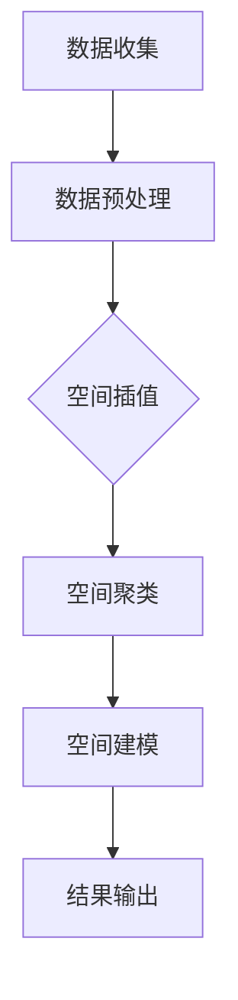
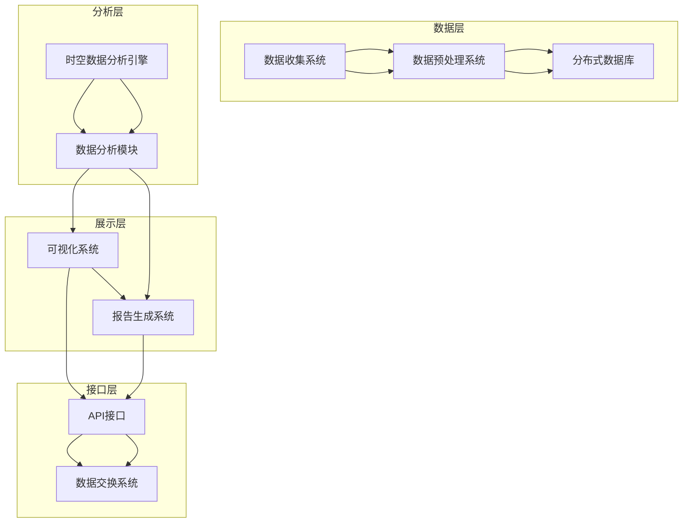

                 

# 企业级时空数据分析引擎：洞察业务模式

## 关键词
企业级、时空数据、数据分析、业务模式、数据引擎

## 摘要
本文将探讨企业级时空数据分析引擎的核心概念、技术原理及其在企业业务模式中的关键作用。通过深入分析时空数据的定义、特点、分析方法以及与业务的关系，本文旨在为读者提供一个全面了解时空数据分析引擎的视角，并探讨其实际应用中的最佳实践和未来发展趋势。

## 背景介绍

### 1.1 问题背景

企业级时空数据分析是企业信息化的重要一环。随着大数据和物联网技术的迅猛发展，企业产生的时空数据量呈现指数级增长。这种海量数据的产生不仅为企业带来了巨大的挑战，也提供了宝贵的机会。如何高效地收集、处理和分析这些时空数据，从而转化为可操作的业务洞见，成为企业提升竞争力的关键。

### 1.2 问题描述

时空数据分析的目标是从海量时空数据中提取有价值的信息，帮助企业做出更明智的决策。这包括地理位置分析、时间序列趋势预测、事件关联分析等多个方面。然而，传统的数据处理方法在处理海量时空数据时存在效率低下、准确度不足等问题，难以满足现代企业的需求。

### 1.3 问题解决

企业级时空数据分析引擎的提出，旨在解决上述问题。它通过先进的算法和优化技术，能够高效地处理海量时空数据，并提供精准的分析结果。该引擎的核心在于其时空数据的存储和管理能力、实时数据处理能力和多维度分析能力。

### 1.4 边界与外延

时空数据分析引擎的应用范围广泛，包括物流与供应链管理、城市交通管理、智慧城市建设、应急管理等多个领域。它不仅涉及地理信息系统（GIS）、时间序列分析等传统领域，还融合了大数据处理、人工智能等新兴技术。

### 1.5 概念结构与核心要素组成

企业级时空数据分析引擎由以下几个核心组成部分构成：

1. **数据存储与管理**：负责时空数据的存储、索引和管理，确保数据的高效读取和访问。
2. **数据处理引擎**：实现时空数据的清洗、转换、聚合等处理操作，提高数据处理效率。
3. **时空分析算法**：包括地理位置分析、时间序列分析、事件关联分析等算法，提供多样化的分析工具。
4. **可视化与报告生成**：将分析结果以图表、报告等形式展示，帮助用户直观地理解数据。
5. **接口与服务**：提供API接口，方便与其他系统进行集成和数据交换。

## 第2章: 核心概念与联系

### 2.1 时空数据分析的基本概念

#### 2.1.1 时空数据的定义

时空数据是指与时间和空间位置相关的数据，通常以点、线、面等形式表示。这些数据可以来自于传感器、日志、位置服务等多种渠道。

#### 2.1.2 时空数据的特点

时空数据具有时空相关性、动态性、异构性等特点。时空相关性意味着数据之间存在时间和空间上的关联；动态性指数据随时间而变化；异构性则是指数据来源和格式的多样性。

#### 2.1.3 时空数据分析的目的

时空数据分析的目的是从时空数据中提取有价值的信息，辅助决策。这包括地理位置分析、时间序列趋势预测、事件关联分析等，以帮助企业优化业务流程、降低成本、提高效率。

### 2.2 时空数据分析的相关技术

#### 2.2.1 地理信息系统（GIS）

地理信息系统（GIS）是一种用于捕捉、存储、分析和展示地理空间数据的工具系统。GIS能够实现数据的可视化、空间分析和空间建模等功能，是时空数据分析的重要工具。

#### 2.2.2 时间序列分析

时间序列分析是一种利用历史时间序列数据预测未来趋势的方法。它广泛应用于金融市场预测、天气预测、交通流量预测等领域。

#### 2.2.3 聚类分析

聚类分析是一种无监督学习方法，用于将相似的数据点分组。聚类分析可以帮助发现数据中的隐含模式，用于市场细分、异常检测等。

### 2.3 时空数据分析与企业业务的关系

#### 2.3.1 物流与供应链管理

通过时空数据分析，企业可以优化物流路径，降低运输成本。例如，利用GPS数据和交通流量数据，可以预测货物到达时间，合理安排仓储和配送资源。

#### 2.3.2 城市交通管理

时空数据分析可以帮助城市管理者优化交通流量，缓解拥堵。例如，通过分析交通流量数据，可以指导交通信号灯的优化配置，提高道路通行效率。

#### 2.3.3 智慧城市建设

时空数据分析为智慧城市的规划与建设提供科学依据。例如，通过分析人口流动数据，可以优化公共设施的布局，提高城市生活质量。

### 2.4 概念属性特征对比表格

| 概念        | 定义                                                         | 特点                                                         | 应用场景                   |
| ----------- | ------------------------------------------------------------ | ------------------------------------------------------------ | -------------------------- |
| 时空数据    | 与时间和空间位置相关的数据                                   | 时空相关性、动态性、异构性                                  | 物流、交通、城市规划       |
| 地理信息系统（GIS） | 用于捕捉、存储、分析和展示地理空间数据的工具系统             | 空间可视化、空间分析、空间建模等                             | 城市规划、环境管理         |
| 时间序列分析 | 一种利用历史时间序列数据预测未来趋势的方法                 | 时间依赖性、序列性、趋势预测等                               | 财务分析、市场预测         |
| 聚类分析    | 一种无监督学习方法，用于将相似的数据点分组                 | 自发发现模式、无监督、降低维度等                             | 市场细分、异常检测         |

### 2.5 ER实体关系图架构

```mermaid
erDiagram
  商品 <<--o 用户 : 购买
  商品 ||--|{ 库存 }|
  商品 ||--|{ 评论 }|
  用户 ||--|{ 收藏 }|
  评论 ||--|{ 回复 }|
```

## 第3章：算法原理讲解

### 3.1 算法概述

企业级时空数据分析引擎的核心算法包括地理位置分析、时间序列分析和事件关联分析等。这些算法的实现涉及到复杂的数学模型和计算方法。

#### 3.1.1 地理位置

地理位置分析主要基于GIS技术，通过对时空数据进行空间分析和空间建模，提取地理位置信息。常用的算法包括空间插值、空间聚类和空间回归等。

#### 3.1.2 时间序列

时间序列分析是一种基于历史时间序列数据预测未来趋势的方法。常用的算法包括自回归模型（AR）、移动平均模型（MA）、自回归移动平均模型（ARMA）和季节性分解等。

#### 3.1.3 事件关联

事件关联分析主要用于发现数据中的隐含模式。常用的算法包括Apriori算法、FP-Growth算法和关联规则学习等。

### 3.2 算法流程

以下是一个简单的算法流程示例，用于地理位置分析：



### 3.3 数学模型与公式

#### 3.3.1 空间插值

空间插值是一种估计未知地理位置数据的方法。常用的插值方法包括反距离权重插值（IDW）和克立格插值（Kriging）。

$$
Z(x, y) = \frac{\sum_{i=1}^{n} w_i Z_i}{\sum_{i=1}^{n} w_i}
$$

其中，$Z(x, y)$ 是目标位置的属性值，$w_i$ 是权重，$Z_i$ 是已知位置的属性值。

#### 3.3.2 时间序列分析

自回归模型（AR）的数学模型如下：

$$
Y_t = c + \sum_{i=1}^{p} \phi_i Y_{t-i} + \varepsilon_t
$$

其中，$Y_t$ 是时间序列的第 $t$ 项，$\phi_i$ 是自回归系数，$c$ 是常数项，$\varepsilon_t$ 是误差项。

#### 3.3.3 事件关联

Apriori算法的关联规则挖掘公式如下：

$$
support(A \cup B) = \frac{count(A \cup B)}{count(D)}
$$

其中，$A$ 和 $B$ 是两个项集，$count(A \cup B)$ 是同时满足 $A$ 和 $B$ 的交易次数，$count(D)$ 是所有交易次数。

### 3.4 算法示例

以下是一个简单的时间序列分析示例，使用Python实现自回归模型（AR）：

```python
import numpy as np
from statsmodels.tsa.ar_model import AR

# 假设我们有一组时间序列数据
data = np.array([1, 2, 3, 4, 5, 6, 7, 8, 9, 10])

# 拟合自回归模型
model = AR(data).fit(order=2)

# 预测未来值
forecast = model.predict(start=len(data), end=len(data) + 5)

# 输出预测结果
print(forecast)
```

## 第4章：系统分析与架构设计方案

### 4.1 问题场景介绍

某物流公司在运输过程中面临着路线规划不优、运输成本高、配送时效性差等问题。为了提升运输效率和降低成本，公司决定引入企业级时空数据分析引擎，对物流数据进行分析，以优化路线规划和配送策略。

### 4.2 项目介绍

项目名称：智慧物流时空数据分析平台

项目目标：利用企业级时空数据分析引擎，优化物流运输路线，降低运输成本，提高配送时效性。

### 4.3 系统功能设计

#### 4.3.1 数据收集

收集物流车辆的GPS数据、交通流量数据、气象数据等。

#### 4.3.2 数据预处理

对收集到的数据进行清洗、去重、归一化等处理，确保数据质量。

#### 4.3.3 数据存储

将预处理后的数据存储在分布式数据库中，以便快速查询和分析。

#### 4.3.4 数据分析

利用时空数据分析算法，对物流数据进行地理位置分析、时间序列分析和事件关联分析等，提取有价值的信息。

#### 4.3.5 可视化与报告

将分析结果以图表、报告等形式展示，提供直观的数据可视化。

#### 4.3.6 接口与服务

提供API接口，方便与其他系统进行集成和数据交换。

### 4.4 系统架构设计

#### 4.4.1 架构图



### 4.5 系统接口设计与系统交互

#### 4.5.1 接口设计

- **数据收集接口**：用于收集物流车辆的GPS数据、交通流量数据、气象数据等。
- **数据处理接口**：用于对收集到的数据进行清洗、去重、归一化等处理。
- **数据分析接口**：用于调用时空数据分析引擎，执行地理位置分析、时间序列分析和事件关联分析等。
- **数据展示接口**：用于将分析结果以图表、报告等形式展示。
- **数据交换接口**：用于与其他系统进行集成和数据交换。

#### 4.5.2 系统交互

- **数据收集系统**与**数据预处理系统**：通过数据收集接口，将物流数据传输到数据预处理系统。
- **数据预处理系统**与**分布式数据库**：通过数据处理接口，将预处理后的数据存储到分布式数据库中。
- **时空数据分析引擎**与**数据分析模块**：通过数据分析接口，调用时空数据分析引擎，执行相应的分析任务。
- **可视化系统**与**报告生成系统**：通过数据展示接口，将分析结果以图表、报告等形式展示给用户。
- **API接口**与**数据交换系统**：通过数据交换接口，与其他系统进行集成和数据交换。

## 第5章：项目实战

### 5.1 环境安装

在开始项目之前，需要安装必要的软件和工具。以下是推荐的安装步骤：

1. 安装Python环境：下载并安装Python，版本建议为3.8以上。
2. 安装时空数据分析引擎：使用pip安装时空数据分析引擎，命令如下：

   ```bash
   pip install spacetime-analysis-engine
   ```

3. 安装其他依赖库：根据项目需求，安装其他必要的依赖库，如NumPy、Pandas、Matplotlib等。

### 5.2 系统核心实现源代码

以下是一个简单的系统核心实现示例，包括数据收集、数据预处理、数据分析、数据展示等模块。

```python
# 数据收集模块
def collect_data():
    # 假设使用GPS传感器收集数据
    gps_data = ["(纬度，经度，时间)"]
    return gps_data

# 数据预处理模块
def preprocess_data(gps_data):
    # 清洗、去重、归一化等预处理操作
    processed_data = []
    for data in gps_data:
        # ...预处理逻辑...
        processed_data.append(data)
    return processed_data

# 数据分析模块
def analyze_data(processed_data):
    # 执行时空数据分析算法
    # ...分析逻辑...
    analysis_result = "结果"
    return analysis_result

# 数据展示模块
def show_data(analysis_result):
    # 以图表形式展示分析结果
    # ...展示逻辑...
    print(analysis_result)

# 主程序
if __name__ == "__main__":
    gps_data = collect_data()
    processed_data = preprocess_data(gps_data)
    analysis_result = analyze_data(processed_data)
    show_data(analysis_result)
```

### 5.3 代码应用解读与分析

以上代码展示了企业级时空数据分析引擎的基本实现。在实际应用中，每个模块都可以根据具体需求进行扩展和优化。

- **数据收集模块**：根据业务需求，可以集成多种数据收集方式，如传感器、日志文件等。
- **数据预处理模块**：预处理操作可以根据数据的特点进行调整，如缺失值填充、异常值检测等。
- **数据分析模块**：可以引入更复杂的时间序列分析、事件关联分析等算法，以提高分析精度。
- **数据展示模块**：可以采用更丰富的可视化方式，如热图、折线图、饼图等，以更直观地展示分析结果。

### 5.4 实际案例分析和详细讲解剖析

以物流运输路线优化为例，企业可以利用时空数据分析引擎对运输数据进行实时分析，优化运输路线，降低运输成本。

#### 5.4.1 案例背景

某物流公司在配送过程中发现，部分配送路线存在不合理现象，如绕路、拥堵等，导致运输成本高、配送时效性差。

#### 5.4.2 分析过程

1. **数据收集**：收集物流车辆的GPS数据、交通流量数据、气象数据等。
2. **数据预处理**：清洗、去重、归一化等预处理操作，确保数据质量。
3. **数据分析**：利用时空数据分析算法，对物流数据进行地理位置分析、时间序列分析和事件关联分析等。
4. **结果展示**：以图表形式展示分析结果，如运输路线的拥堵情况、运输时间分布等。

#### 5.4.3 分析结果

通过分析，发现以下问题：

1. 某些路段存在严重拥堵现象，导致运输时间延长。
2. 部分配送路线存在绕路现象，增加运输成本。

#### 5.4.4 优化建议

1. 根据交通流量数据，优化运输路线，避免拥堵路段。
2. 结合气象数据，合理调整配送时间，避开恶劣天气。

### 5.5 项目小结

通过本项目的实践，我们了解了企业级时空数据分析引擎的核心原理和实现方法。在实际应用中，可以根据具体业务需求，灵活调整和分析算法，以提高数据分析和决策的准确性。同时，我们也认识到数据质量对分析结果的重要性，因此在实际项目中，需要注重数据收集、预处理和存储等环节，确保数据的高质量。

## 第6章：最佳实践 tips

### 6.1 数据质量管理

- 确保数据的一致性、准确性和完整性。
- 定期进行数据清洗和更新。
- 建立数据质量监控机制，及时发现和纠正数据质量问题。

### 6.2 算法优化

- 根据业务需求，选择合适的时空数据分析算法。
- 对算法进行优化，提高计算效率和精度。
- 定期评估算法的性能，并根据反馈进行调整。

### 6.3 系统维护

- 定期对系统进行备份和恢复，确保数据安全。
- 对系统进行性能优化，提高系统的稳定性和可扩展性。
- 对系统进行安全评估，确保系统的安全性。

## 第7章：小结

本文从企业级时空数据分析引擎的核心概念、技术原理、应用场景、算法实现等方面进行了全面探讨。通过深入分析，我们了解了时空数据分析在企业业务模式中的重要作用，以及如何利用时空数据分析引擎优化业务流程、降低成本、提高效率。在未来的发展中，企业级时空数据分析引擎将继续融合大数据、人工智能等新兴技术，为企业提供更智能、更高效的数据分析和决策支持。

## 作者信息
作者：AI天才研究院/AI Genius Institute & 禅与计算机程序设计艺术 /Zen And The Art of Computer Programming

---

**本文内容仅供参考，具体实施时请根据实际情况进行调整。**

