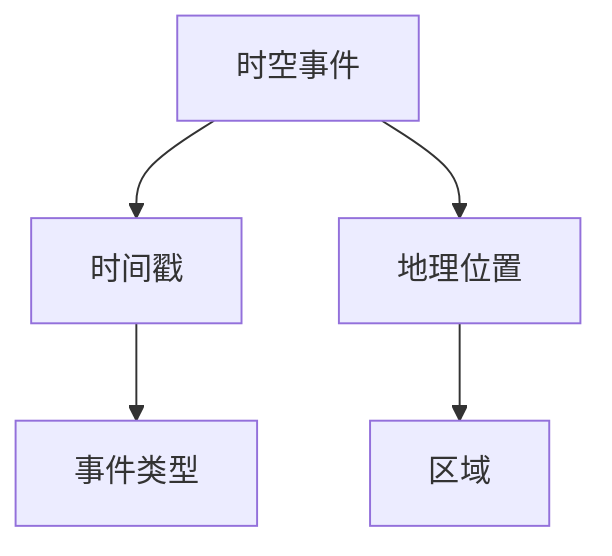

                 

# 《企业级时空智能平台：洞察业务时空模式》

> 关键词：时空智能平台、企业级应用、数据分析、模式识别、架构设计

> 摘要：本文深入探讨了企业级时空智能平台的设计与实现，分析了企业级应用中的时空模式，并提出了相应的解决方案。通过介绍核心概念、数据分析与挖掘、架构设计以及实战案例，本文旨在为企业提供一种有效的时空智能平台构建方法，助力企业更好地洞察业务时空模式，提升业务决策效率。

## 引言：时空智能平台的概述

在当今信息化时代，数据已经成为企业的核心资产。随着物联网、大数据、人工智能等技术的快速发展，时空数据在企业中的应用越来越广泛。时空智能平台作为企业级应用的一种重要形式，旨在通过对时空数据的处理与分析，为企业提供业务决策支持。本文将围绕企业级时空智能平台的设计与实现，探讨如何洞察业务时空模式。

### 核心概念

#### 时空数据

时空数据是指包含时间、空间信息的数据。它通常由时间戳、地理坐标等信息组成，可以用于描述事件的发生位置和时间。

#### 时空智能

时空智能是指利用时空数据，通过数据挖掘、机器学习等技术，对业务进行实时监测、分析、预测和决策的能力。

#### 企业级应用

企业级应用是指针对企业业务需求，提供定制化解决方案的应用系统。它需要具备高可靠性、高性能、可扩展性等特性。

### 问题背景与意义

随着企业业务的发展，时空数据量不断增加，如何有效处理和分析这些数据，成为企业面临的重要问题。时空智能平台的建设，可以帮助企业实现以下几点：

1. **实时监测**：通过实时收集和分析时空数据，帮助企业了解业务运行状况，及时发现潜在问题。
2. **业务预测**：通过对时空数据的分析，预测业务发展趋势，为决策提供依据。
3. **优化资源配置**：通过对时空数据的分析，优化资源配置，提高企业运营效率。
4. **风险防控**：通过对时空数据的分析，识别潜在风险，提前采取防控措施。

## 企业级时空智能平台的需求与挑战

### 企业需求分析

企业级时空智能平台的需求主要包括以下几个方面：

1. **数据处理能力**：企业需要处理大量的时空数据，因此平台需要具备高效的数据处理能力。
2. **数据可视化**：企业需要将时空数据以直观的方式展示出来，以便进行业务分析和决策。
3. **数据安全与隐私**：企业需要确保数据的安全和隐私，防止数据泄露。
4. **业务定制化**：企业需要根据自身业务特点，定制化时空智能解决方案。

### 时空智能平台的挑战

1. **数据多样性**：时空数据来源广泛，格式多样，如何高效地整合和处理这些数据，是平台面临的一大挑战。
2. **实时性与效率**：企业对时空数据的处理要求实时性高，如何保证数据处理的高效性，是平台设计的关键问题。
3. **可扩展性**：随着企业业务的发展，平台需要具备良好的可扩展性，以适应不断增长的数据量和业务需求。
4. **成本控制**：企业需要控制平台的建设和运行成本，如何在保证性能和功能的前提下，降低成本，是平台设计的重要考虑因素。

### 解决方案与策略

1. **数据预处理**：对时空数据进行预处理，包括数据清洗、转换和集成，提高数据质量。
2. **分布式计算**：采用分布式计算架构，提高数据处理效率，满足实时性要求。
3. **模块化设计**：将平台划分为多个功能模块，提高系统的可扩展性和灵活性。
4. **云计算与大数据技术**：利用云计算和大数据技术，降低平台建设成本，提高数据处理能力。
5. **安全与隐私保护**：采用加密、访问控制等技术，确保数据安全与隐私。

## 时空数据模型与数据结构

### 时空数据模型

时空数据模型用于描述时空数据的基本结构和属性。常见的时间数据模型包括：

1. **时间序列模型**：用于描述事件随时间变化的趋势。
2. **地理空间模型**：用于描述事件发生的地理位置。
3. **时空关联模型**：用于描述事件之间在时间和空间上的关联。

### 数据结构设计

数据结构设计是时空智能平台的基础。常见的数据结构包括：

1. **关系数据库**：用于存储结构化数据，如时间序列和地理空间数据。
2. **图数据库**：用于存储具有复杂关联关系的数据。
3. **时间序列数据库**：用于高效存储和处理时间序列数据。

### 数据建模与实体关系

数据建模是时空智能平台设计的重要环节。通过数据建模，可以将实际业务问题抽象为数据模型，为后续的数据处理和分析提供基础。常见的数据建模方法包括：

1. **实体-关系模型（ER模型）**：用于描述业务实体及其关系。
2. **领域模型**：用于描述业务领域的概念和关系。

以下是时空智能平台的ER模型示例：

## 时空数据存储与管理

### 数据存储技术

时空数据的存储需要考虑数据的规模、速度、可靠性等因素。常见的数据存储技术包括：

1. **关系数据库**：如MySQL、PostgreSQL等，适用于结构化数据的存储。
2. **NoSQL数据库**：如MongoDB、Cassandra等，适用于非结构化或半结构化数据的存储。
3. **时间序列数据库**：如InfluxDB、OpenTSDB等，适用于时间序列数据的存储。

### 数据管理策略

数据管理策略包括数据的采集、存储、处理、分析等各个环节。常见的策略包括：

1. **数据采集**：采用分布式采集技术，实现数据的实时采集。
2. **数据存储**：采用分布式存储技术，提高数据的可靠性。
3. **数据处理**：采用并行处理技术，提高数据处理速度。
4. **数据备份与恢复**：采用备份策略，确保数据的安全。

### 数据备份与恢复

数据备份与恢复是数据管理的重要环节。常见的技术包括：

1. **全备份**：备份整个数据集，适用于数据量较小的情况。
2. **增量备份**：备份自上次备份以来发生变化的数据，适用于数据量较大的情况。
3. **恢复**：在数据丢失或损坏时，通过备份数据恢复原始数据。

## 时空数据分析与挖掘

### 数据分析基础

数据分析是指通过对数据的分析，提取有价值的信息和知识。常见的数据分析方法包括：

1. **统计分析**：通过对数据进行统计分析，提取数据的基本特征。
2. **机器学习**：通过建立模型，对数据进行预测和分类。
3. **数据挖掘**：通过对大量数据进行分析，发现数据中的规律和模式。

### 数据挖掘技术

数据挖掘技术用于从大量数据中提取有价值的信息。常见的数据挖掘技术包括：

1. **聚类分析**：将数据分组，发现数据中的相似性。
2. **分类分析**：将数据分为不同的类别，用于预测和分类。
3. **关联规则挖掘**：发现数据之间的关联关系。
4. **异常检测**：发现数据中的异常值，用于检测异常情况。

### 时空数据挖掘案例分析

以下是一个时空数据挖掘的案例分析：

- **问题背景**：某物流公司在高峰期出现配送延误问题，需要通过分析时空数据找出延误原因。
- **解决方案**：通过对配送路径、天气、交通状况等时空数据进行挖掘分析，发现高峰期配送路线拥堵是导致延误的主要原因。
- **效果评估**：通过调整配送路线，优化配送效率，有效减少了配送延误问题。

## 业务时空模式的识别与建模

### 业务时空模式概述

业务时空模式是指企业在特定时间和空间内，业务运行的基本规律和特征。通过识别和建模业务时空模式，可以帮助企业更好地理解业务运行情况，为业务优化提供依据。

### 模式识别方法

模式识别方法包括：

1. **聚类分析**：将具有相似特征的时空数据分组，识别出不同业务模式。
2. **分类分析**：将时空数据分为不同的类别，识别出不同业务模式。
3. **关联规则挖掘**：发现时空数据之间的关联关系，识别出业务模式。

### 模式建模与优化

模式建模与优化的步骤包括：

1. **数据预处理**：对时空数据进行清洗、转换和集成，提高数据质量。
2. **特征提取**：从时空数据中提取关键特征，为模式识别和建模提供基础。
3. **模型训练**：采用机器学习算法，建立模式识别模型。
4. **模型优化**：通过交叉验证等方法，优化模型参数，提高模型准确性。
5. **模型应用**：将优化后的模型应用于实际业务，为业务优化提供支持。

## 时空智能平台的架构设计

### 系统架构概述

时空智能平台的架构设计需要考虑以下几个方面：

1. **数据处理层**：负责数据的采集、存储、处理和分析。
2. **服务层**：提供数据挖掘、预测、决策等核心功能。
3. **应用层**：面向用户提供数据可视化、业务分析等应用服务。
4. **支撑层**：提供系统所需的基础设施，如数据库、缓存、消息队列等。

### 系统功能模块设计

时空智能平台的功能模块设计包括：

1. **数据采集模块**：负责数据的实时采集和预处理。
2. **数据存储模块**：负责数据的存储和管理。
3. **数据处理模块**：负责数据清洗、转换、分析和挖掘。
4. **数据可视化模块**：负责数据的可视化展示。
5. **业务分析模块**：负责业务数据的分析和预测。
6. **决策支持模块**：负责为用户提供决策支持。

### 架构优化与扩展

架构优化与扩展的考虑因素包括：

1. **性能优化**：通过分布式计算、缓存等技术，提高系统性能。
2. **可扩展性**：通过模块化设计，确保系统可以方便地扩展功能。
3. **可靠性**：通过数据备份、容错机制等，确保系统的可靠性。
4. **安全性**：通过安全加密、访问控制等，确保数据安全。

## 时空智能平台的应用实践

### 应用场景介绍

时空智能平台在多个领域具有广泛的应用，以下是一些典型的应用场景：

1. **物流与交通**：通过实时监测和分析物流和交通数据，优化配送和交通管理。
2. **金融与保险**：通过对时空数据的分析，预测市场走势，优化投资决策。
3. **医疗与健康**：通过对医疗数据的分析，发现健康问题，提供个性化医疗服务。
4. **城市规划与环境保护**：通过对时空数据的分析，优化城市规划，提高环境保护效率。

### 实际案例剖析

以下是一个物流公司使用时空智能平台的实际案例：

- **问题背景**：某物流公司在高峰期出现配送延误问题，影响了客户满意度。
- **解决方案**：物流公司引入时空智能平台，通过对配送路径、天气、交通状况等数据进行实时监测和分析，发现高峰期配送路线拥堵是导致延误的主要原因。
- **应用效果**：通过调整配送路线，优化配送效率，配送延误问题得到了有效缓解，客户满意度显著提高。

### 应用效果评估

应用效果评估可以从以下几个方面进行：

1. **效率提升**：通过优化配送和交通管理，提高业务运行效率。
2. **成本降低**：通过减少配送延误，降低运营成本。
3. **决策支持**：通过实时分析和预测，为业务决策提供科学依据。
4. **用户体验**：通过优化服务，提高客户满意度。

## 时空智能平台的优化与扩展

### 优化策略

优化策略包括：

1. **性能优化**：通过分布式计算、缓存等技术，提高系统性能。
2. **可扩展性**：通过模块化设计，确保系统可以方便地扩展功能。
3. **可靠性**：通过数据备份、容错机制等，确保系统的可靠性。
4. **安全性**：通过安全加密、访问控制等，确保数据安全。

### 扩展功能

扩展功能包括：

1. **多源数据接入**：支持多种数据源接入，如传感器、API等。
2. **实时数据处理**：支持实时数据处理和分析。
3. **多维度分析**：支持从多个维度对数据进行分析，如时间、空间、业务等。
4. **自定义模型**：支持用户自定义数据挖掘和预测模型。

### 用户体验与反馈

用户体验与反馈是时空智能平台优化的重要环节。通过以下方法，可以提升用户体验：

1. **用户调研**：通过用户调研，了解用户需求和痛点。
2. **用户培训**：为用户提供培训，帮助用户更好地使用平台。
3. **反馈机制**：建立反馈机制，收集用户意见和建议。
4. **持续改进**：根据用户反馈，持续优化平台功能和用户体验。

## 结论与展望

本文深入探讨了企业级时空智能平台的设计与实现，分析了企业级应用中的时空模式。通过介绍核心概念、数据分析与挖掘、架构设计以及实战案例，本文为企业提供了一种有效的时空智能平台构建方法，助力企业更好地洞察业务时空模式，提升业务决策效率。

### 展望未来发展方向

未来，时空智能平台的发展将呈现以下趋势：

1. **智能化**：随着人工智能技术的发展，时空智能平台将更加智能化，实现自动化决策支持。
2. **融合化**：时空智能平台将与物联网、大数据、云计算等技术深度融合，提供更加全面的业务解决方案。
3. **个性化**：时空智能平台将更加关注个性化需求，为不同企业提供定制化的解决方案。
4. **全球化**：随着全球化的推进，时空智能平台将面向全球市场，提供跨地域的业务支持。

### 讨论与建议

在实际应用中，企业需要根据自身业务特点和需求，选择合适的时空智能平台解决方案。同时，企业还应关注以下方面：

1. **数据质量**：确保数据质量，是时空智能平台有效运行的前提。
2. **技术更新**：关注技术更新，及时引入新技术，提高平台性能。
3. **人才培养**：培养专业人才，提升企业对时空智能平台的应用能力。
4. **合作与交流**：加强与其他企业、研究机构和高校的合作与交流，共同推动时空智能平台的发展。

作者：AI天才研究院/AI Genius Institute & 禅与计算机程序设计艺术 /Zen And The Art of Computer Programming

总结：本文从多个角度探讨了企业级时空智能平台的设计与实现，涵盖了核心概念、数据分析与挖掘、架构设计、应用实践以及优化扩展等方面。通过深入分析，本文为企业提供了一种有效的时空智能平台构建方法，有助于企业更好地洞察业务时空模式，提升业务决策效率。未来，随着技术的不断发展，时空智能平台将在更多领域发挥重要作用。

