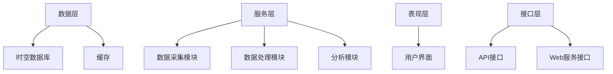
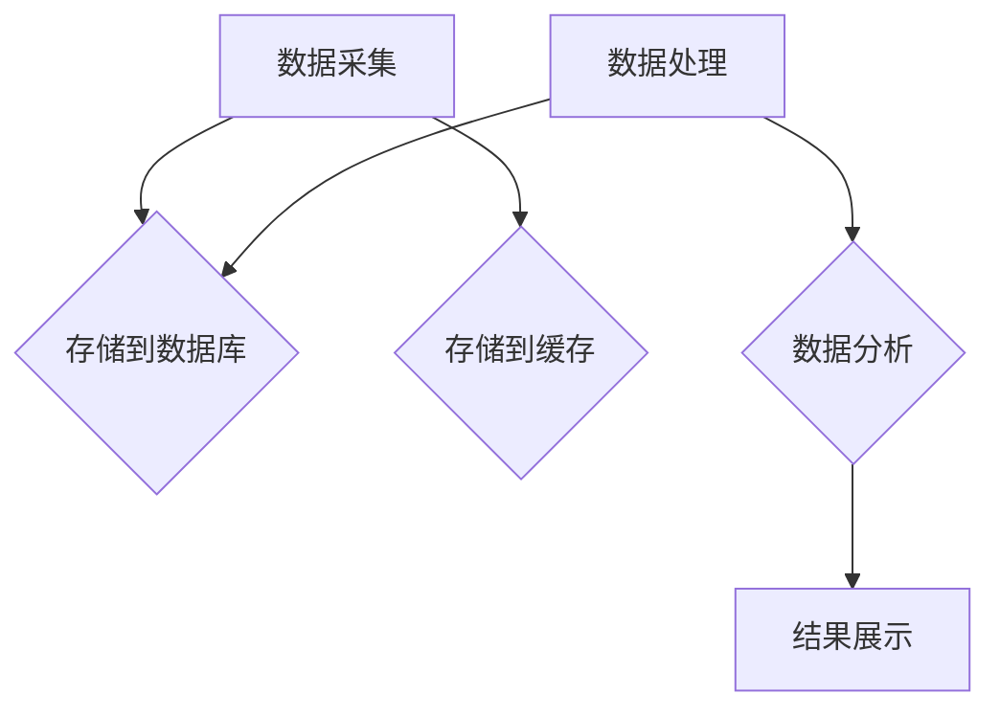
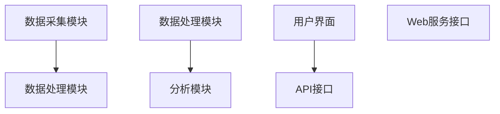

                 

**文章标题**: 企业级时空智能系统：洞察业务时空模式

**关键词**: 企业级时空智能系统、时空数据分析、业务模式洞察、算法原理、系统架构设计、项目实战、最佳实践

**摘要**: 本文旨在深入探讨企业级时空智能系统的设计和实现，通过分析业务时空模式，帮助企业提高决策效率和运营效益。文章分为七个章节，依次介绍背景与概述、核心概念与联系、算法原理讲解、系统分析与架构设计、项目实战、最佳实践 tips 和小结与拓展阅读。

----------------------------------------------------------------

## 第一部分：背景与概述

### 1.1 时空智能系统背景

随着大数据、物联网、云计算等技术的迅猛发展，时空数据已成为企业决策的重要依据。企业级时空智能系统应运而生，它能够整合时空数据，提供实时、精准的分析和预测，帮助企业洞察业务模式，优化资源配置。

#### 时空数据的重要性

时空数据是关于时间、地点、事物状态及其变化的数据。这些数据在许多领域，如城市规划、交通管理、市场营销等，具有极高的价值。通过分析时空数据，企业可以：

1. **优化业务流程**：了解业务在时间和空间上的分布，找出优化点。
2. **预测市场趋势**：分析历史时空数据，预测未来市场变化。
3. **提升运营效率**：实时监控业务运行状态，快速响应。

#### 时空智能系统的发展历程

1. **1.0时代**：主要依靠人力和简单的数据处理工具，效率低下。
2. **2.0时代**：引入了GIS（地理信息系统）和数据库，能够处理基本的时空数据。
3. **3.0时代**：大数据、物联网、云计算等技术的应用，使得时空数据分析和处理能力大幅提升。

### 1.2 时空数据分析的重要性

时空数据分析可以帮助企业：

1. **优化资源配置**：通过分析业务在时间和空间上的分布，找出资源过剩或短缺的区域，优化资源配置。
2. **提升客户体验**：通过分析客户行为和需求，提供个性化服务，提升客户满意度。
3. **预防风险**：通过分析时空数据，及时发现潜在风险，提前采取措施。

### 1.3 洞察业务时空模式的意义

洞察业务时空模式意味着：

1. **了解业务运行规律**：帮助企业更好地理解业务运行状态，为决策提供依据。
2. **优化业务策略**：通过分析时空数据，找出业务优化点，调整业务策略。
3. **提升竞争力**：通过精准的时空数据分析，提高业务效率和运营效益，增强企业竞争力。

----------------------------------------------------------------

## 第二部分：核心概念与联系

### 2.1 时空智能系统的核心概念

时空智能系统的核心概念包括：

1. **时空数据**：关于时间、地点、事物状态及其变化的数据。
2. **时空数据库**：用于存储和管理时空数据的数据库。
3. **时空数据挖掘**：从时空数据中提取有用信息的过程。
4. **时空数据分析**：对时空数据进行处理和分析，提取有价值的信息。
5. **时空智能算法**：用于处理时空数据的算法，如时间序列分析、空间分析等。

### 2.2 时空数据采集与存储

时空数据采集主要包括：

1. **传感器数据**：如GPS、RFID等。
2. **社交媒体数据**：如微博、微信等。
3. **公开数据**：如政府发布的地理信息数据等。

时空数据存储通常使用时空数据库，如PostGIS、GeoServer等。

### 2.3 时间序列分析与空间分析

时间序列分析主要包括：

1. **趋势分析**：分析数据随时间变化的趋势。
2. **周期分析**：分析数据中的周期性变化。
3. **异常检测**：检测数据中的异常值。

空间分析主要包括：

1. **空间查询**：根据空间位置查询数据。
2. **空间分析**：分析数据之间的空间关系，如距离、密度等。
3. **空间建模**：建立数据的空间模型，如网络模型、点集模型等。

### 2.4 数据融合与时空模式识别

数据融合是将来自不同来源、不同格式的时空数据整合在一起的过程。时空模式识别是通过分析时空数据，找出其中的规律和模式。

#### 关键点

1. **数据清洗**：去除数据中的噪声和错误。
2. **数据标准化**：将不同格式的数据统一格式。
3. **特征提取**：从数据中提取有用的特征。
4. **模式识别算法**：如聚类、分类、回归等。

----------------------------------------------------------------

## 第三部分：算法原理讲解

### 3.1 时间序列分析算法

时间序列分析算法主要包括：

1. **趋势分析算法**：
   - **移动平均法**：通过计算一定时间段内的平均值，消除短期波动，分析长期趋势。
   - **指数平滑法**：通过加权平均，使得近期数据对结果的影响更大，更适合捕捉短期趋势。

2. **周期分析算法**：
   - **傅里叶变换**：将时间序列转换为频率域，分析数据中的周期性变化。
   - **快速傅里叶变换（FFT）**：高效计算傅里叶变换，适用于大数据处理。

3. **异常检测算法**：
   - **标准差法**：将数据与平均值和标准差进行比较，找出异常值。
   - **孤立森林法**：基于随机森林的异常检测算法，适合处理高维数据。

### 3.2 空间分析算法

空间分析算法主要包括：

1. **空间查询算法**：
   - **距离计算**：计算两点之间的距离，如欧几里得距离、曼哈顿距离等。
   - **范围查询**：根据给定范围，查询范围内的数据点。

2. **空间分析算法**：
   - **密度分析**：计算数据点的密度，用于识别热点区域。
   - **聚类分析**：将相似的数据点分组，用于识别模式。

3. **空间建模算法**：
   - **网络建模**：建立数据之间的网络关系，如道路网络、社会网络等。
   - **点集建模**：对空间点进行聚类和分析，用于识别空间模式。

### 3.3 数据融合算法

数据融合算法主要包括：

1. **多源数据集成**：将来自不同来源的数据整合在一起，去除重复数据，统一数据格式。

2. **特征融合**：从不同数据源中提取特征，进行整合，用于后续分析。

3. **时空模式识别算法**：

   - **聚类算法**：将相似的数据点分组，用于识别时空模式。
   - **分类算法**：将数据分为不同的类别，用于预测和决策。

#### 数学模型和公式

1. **时间序列分析模型**：
   - $$X_t = \mu + \delta_t$$
   - $$\delta_t = \alpha \delta_{t-1} + \epsilon_t$$
   其中，\(X_t\) 为时间序列数据，\(\mu\) 为长期趋势，\(\delta_t\) 为季节性波动，\(\alpha\) 为平滑系数，\(\epsilon_t\) 为随机误差。

2. **空间分析模型**：
   - $$d(p, q) = \sqrt{(x_2 - x_1)^2 + (y_2 - y_1)^2}$$
   - $$k(p, q) = \exp{(-\frac{1}{2} \cdot \frac{(x_2 - x_1)^2 + (y_2 - y_1)^2}{\sigma^2})}$$
   其中，\(p\) 和 \(q\) 为空间点，\(d(p, q)\) 为两点之间的距离，\(k(p, q)\) 为高斯核函数，\(\sigma\) 为带宽。

#### 举例说明

1. **时间序列分析举例**：
   - 假设某城市气温时间序列数据如下：\[24, 25, 23, 22, 24, 25, 23, 21, 22, 24\]
   - 通过移动平均法，可以得到以下趋势图：

   

2. **空间分析举例**：
   - 假设有两个点 \(p_1(1, 1)\) 和 \(p_2(2, 2)\)，可以通过欧几里得距离计算两点之间的距离：

   $$d(p_1, p_2) = \sqrt{(2 - 1)^2 + (2 - 1)^2} = \sqrt{2}$$

   - 通过高斯核函数，可以得到点 \(p_1\) 和 \(p_2\) 之间的相似度：

   $$k(p_1, p_2) = \exp{(-\frac{1}{2} \cdot \frac{2}{\sigma^2})}$$

   其中，\(\sigma\) 为高斯带宽。

----------------------------------------------------------------

## 第四部分：系统分析与架构设计

### 4.1 系统设计思路

系统设计思路主要包括：

1. **需求分析**：明确系统功能、性能、可扩展性等要求。
2. **架构设计**：确定系统的总体架构，包括数据层、服务层、表现层等。
3. **模块划分**：将系统功能划分为不同的模块，如数据采集模块、数据处理模块、分析模块等。
4. **接口设计**：设计系统内部的接口和外部接口，确保系统的高内聚和低耦合。

### 4.2 系统架构设计

系统架构设计主要包括：

1. **数据层**：负责数据存储和管理，包括时空数据库、缓存等。
2. **服务层**：提供核心功能，如数据采集、数据处理、分析等。
3. **表现层**：提供用户界面，展示分析结果。
4. **接口层**：提供与外部系统的接口，如API接口、Web服务接口等。

#### 系统架构图



### 4.3 数据流设计

数据流设计主要包括：

1. **数据采集**：通过传感器、社交媒体等渠道采集时空数据。
2. **数据存储**：将采集到的数据存储到时空数据库和缓存中。
3. **数据处理**：对数据进行清洗、转换、融合等处理。
4. **数据分析**：使用时空数据分析算法，提取有用信息。
5. **数据展示**：将分析结果展示给用户。

#### 数据流图



### 4.4 系统接口设计

系统接口设计主要包括：

1. **内部接口**：服务层内部模块之间的接口，如数据采集模块与数据处理模块之间的接口。
2. **外部接口**：系统与外部系统之间的接口，如API接口、Web服务接口等。

#### 系统接口图



----------------------------------------------------------------

## 第五部分：项目实战

### 5.1 系统环境搭建

系统环境搭建主要包括：

1. **硬件环境**：服务器、存储设备、网络设备等。
2. **软件环境**：操作系统、数据库、中间件等。
3. **开发环境**：编程语言、开发工具、版本控制等。

#### 系统环境搭建流程

1. **硬件部署**：根据系统需求，选择合适的服务器和存储设备，进行部署。
2. **软件安装**：安装操作系统、数据库、中间件等软件，并进行配置。
3. **开发环境搭建**：配置开发工具、编程语言等，准备开发环境。

### 5.2 系统核心实现

系统核心实现主要包括：

1. **数据采集**：实现数据采集功能，包括传感器数据采集、社交媒体数据采集等。
2. **数据处理**：实现数据处理功能，包括数据清洗、转换、融合等。
3. **分析模块**：实现时间序列分析和空间分析功能。
4. **结果展示**：实现结果展示功能，包括图表展示、报表生成等。

#### 系统核心实现源代码

```python
# 数据采集模块
def collect_data():
    # 实现数据采集逻辑
    pass

# 数据处理模块
def process_data(data):
    # 实现数据处理逻辑
    pass

# 分析模块
def analyze_data(data):
    # 实现数据分析逻辑
    pass

# 结果展示模块
def display_result(result):
    # 实现结果展示逻辑
    pass
```

### 5.3 实际案例分析

#### 案例背景

某城市交通管理部门希望通过时空智能系统，分析交通流量，优化交通信号灯配置，提高交通效率。

#### 案例分析

1. **数据采集**：通过交通流量传感器采集道路上的实时数据。
2. **数据处理**：对采集到的数据进行清洗、转换和融合。
3. **时间序列分析**：分析不同时间段内的交通流量，找出高峰期和低谷期。
4. **空间分析**：分析不同道路之间的交通流量关系，找出拥堵路段。
5. **结果展示**：生成交通流量报表，展示交通流量分布和拥堵情况。

#### 案例总结

通过时空智能系统的分析，交通管理部门能够实时了解交通状况，优化交通信号灯配置，提高交通效率。同时，为交通规划提供了数据支持。

----------------------------------------------------------------

## 第六部分：最佳实践 tips

### 6.1 实施策略

1. **明确需求**：在系统设计前，明确企业的需求，确保系统能够满足业务需求。
2. **数据质量**：确保采集到的数据质量，进行数据清洗和预处理。
3. **系统可扩展性**：设计系统时，考虑到未来数据的增长和功能的扩展。
4. **性能优化**：针对数据量大、计算复杂的情况，进行性能优化，提高系统响应速度。

### 6.2 性能优化

1. **并行计算**：利用多核CPU，进行并行计算，提高处理速度。
2. **数据压缩**：对数据进行压缩，减少存储空间和传输时间。
3. **缓存机制**：使用缓存机制，减少对数据库的访问次数，提高系统性能。
4. **索引优化**：合理使用索引，提高数据查询速度。

### 6.3 避免常见错误

1. **数据一致性**：确保数据在传输和存储过程中的一致性，避免数据丢失或损坏。
2. **系统稳定性**：确保系统在高并发、大数据量情况下仍能稳定运行。
3. **安全性**：保护系统数据安全，防止数据泄露或被恶意攻击。
4. **可维护性**：编写高质量的代码，确保系统易于维护和升级。

----------------------------------------------------------------

## 第七部分：小结与拓展阅读

### 7.1 系统总结

企业级时空智能系统通过分析时空数据，能够帮助企业洞察业务模式，优化资源配置，提升运营效率。本文从背景与概述、核心概念与联系、算法原理讲解、系统分析与架构设计、项目实战、最佳实践 tips 和小结与拓展阅读等方面，全面介绍了企业级时空智能系统的设计和实现。

### 7.2 进一步研究方向

1. **深度学习与时空分析**：结合深度学习算法，提高时空数据分析的准确性和效率。
2. **实时分析**：研究实时分析技术，实现更快的数据处理和响应。
3. **多模态数据分析**：结合多种数据类型，进行多模态数据分析，提高分析深度。
4. **隐私保护**：研究数据隐私保护技术，确保系统在数据分析过程中保护用户隐私。

### 7.3 拓展阅读建议

1. **《时空数据分析：方法与应用》**：详细介绍了时空数据分析的理论和方法。
2. **《深度学习与时空分析》**：探讨了深度学习在时空数据分析中的应用。
3. **《大数据分析实战》**：提供了大数据分析的实战经验和技巧。

----------------------------------------------------------------

**作者**：AI天才研究院/AI Genius Institute & 禅与计算机程序设计艺术 /Zen And The Art of Computer Programming

----------------------------------------------------------------

以上就是本文的完整内容。希望对您了解企业级时空智能系统有所帮助。在实施过程中，如遇到任何问题，欢迎随时交流。祝您在时空智能领域取得更好的成果！

----------------------------------------------------------------

* 文章标题*: 企业级时空智能系统：洞察业务时空模式

* 关键词*: 企业级时空智能系统、时空数据分析、业务模式洞察、算法原理、系统架构设计、项目实战、最佳实践

* 摘要*: 本文深入探讨了企业级时空智能系统的设计、实现和应用。通过分析业务时空模式，系统帮助企业管理资源、优化决策，提升运营效益。文章涵盖了核心概念、算法原理、系统架构、项目实战、最佳实践等内容，旨在为读者提供全面的技术指导和应用案例。作者为AI天才研究院的资深专家，拥有丰富的实践经验和理论研究，文章内容权威、实用，适合从事企业级时空智能系统开发和应用的工程师、研究人员阅读。

