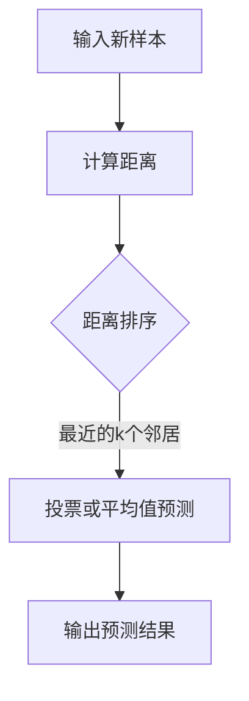
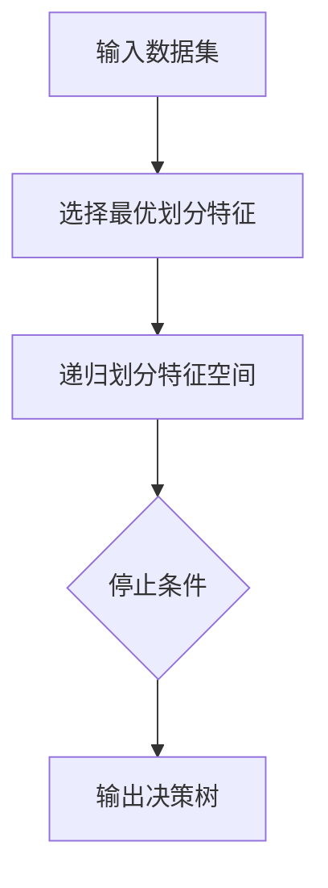
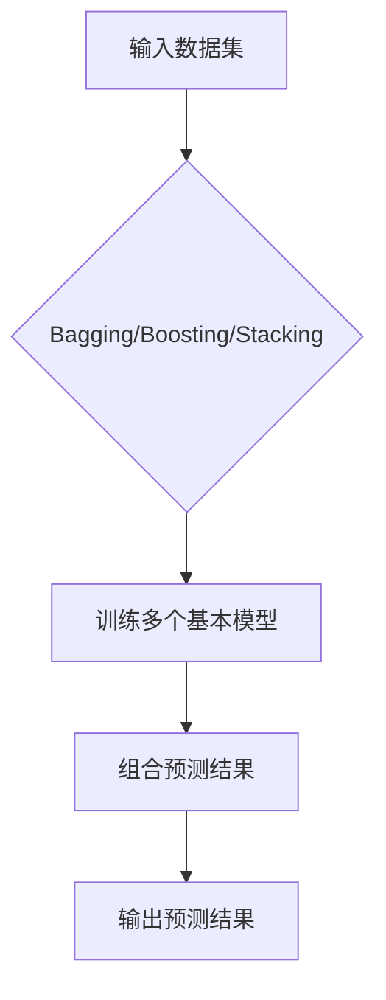
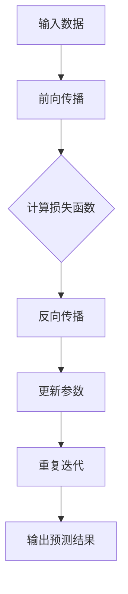

                 

# 企业级时间序列分析平台：增强趋势预测能力

> 关键词：时间序列分析，预测模型，企业级平台，增强预测能力，算法原理，系统架构，项目实战

> 摘要：本文旨在探讨企业级时间序列分析平台的建设，重点关注如何通过增强趋势预测能力来提高企业的业务决策效率。我们将从背景介绍、核心概念与联系、算法原理讲解、数学模型与公式、系统架构设计、项目实战和最佳实践等方面进行详细阐述。

## 目录大纲设计思路

在设计《企业级时间序列分析平台：增强趋势预测能力》的目录大纲时，我们遵循了以下步骤：

### 1. 确定书籍的核心内容和结构

本书的核心内容围绕企业级时间序列分析平台的建设，增强趋势预测能力。主要分为以下几部分：

- 背景介绍
- 核心概念与联系
- 算法原理讲解
- 数学模型与公式
- 系统架构设计
- 项目实战
- 最佳实践与总结

### 2. 确定目录大纲的结构和层级

根据核心内容，我们将书籍分为七个主要部分，并分为以下层级：

- 第一部分：背景介绍
- 第二部分：核心概念与联系
- 第三部分：算法原理讲解
- 第四部分：数学模型与公式
- 第五部分：系统架构设计
- 第六部分：项目实战
- 第七部分：最佳实践与总结

### 3. 确定每部分的具体章节

为每个部分设计了具体的章节，每个章节都紧密围绕核心内容，保持逻辑清晰和内容完整。

## 背景介绍

### 1. 时间序列分析概述

#### 1.1 问题的提出

在当今大数据和人工智能的时代，企业面临着海量数据的挑战。如何从这些数据中提取有价值的信息，为企业决策提供支持，成为了一个重要课题。时间序列分析作为一种有效的数据分析方法，可以帮助企业预测未来的趋势，优化业务决策。

#### 1.2 时间序列分析的重要性

时间序列分析在金融、经济、气象、交通、工业等领域都有广泛应用。它可以帮助企业：

- 预测未来的业务趋势
- 优化库存管理
- 提高生产效率
- 减少能源消耗

#### 1.3 企业级时间序列分析平台的必要性

随着数据量的不断增大，传统的单机版时间序列分析工具已经无法满足企业的需求。企业需要一套高效、稳定、可扩展的时间序列分析平台，以便更好地应对业务挑战。

### 2. 时间序列分析的应用领域

#### 2.1 财务分析

时间序列分析可以帮助企业预测财务指标，如收入、利润、市场份额等，为企业制定财务策略提供依据。

#### 2.2 销售预测

通过对历史销售数据的分析，企业可以预测未来的销售趋势，优化库存管理和营销策略。

#### 2.3 能源消耗预测

通过对能源消耗数据的分析，企业可以预测未来的能源需求，合理分配资源，降低能源成本。

#### 2.4 航运物流预测

通过对航运物流数据的分析，企业可以预测货物的运输时间、路径等，优化物流网络，提高运输效率。

### 3. 时间序列分析的核心概念

#### 3.1 时间序列的概念

时间序列是指按照时间顺序排列的一系列数据点。在时间序列分析中，数据点通常表示某一变量在不同时间点的取值。

#### 3.2 时间序列的特征

时间序列数据具有以下特征：

- 趋势性：数据随时间的推移呈现出一定的趋势。
- 季节性：数据在一年中某些时期会出现周期性的波动。
- 平稳性：时间序列数据的统计特性在时间上保持稳定。
- 自相关性：时间序列数据之间具有一定的相关性。

#### 3.3 时间序列的分析方法

时间序列分析方法主要包括：

- 描述性分析：通过绘制时间序列图、计算统计指标等方式，对时间序列数据进行初步分析。
- 趋势分析：分析时间序列数据的趋势，识别长期趋势和季节性波动。
- 预测分析：建立预测模型，对未来时间点的数据值进行预测。

## 核心概念与联系

### 4. 时间序列模型的介绍

时间序列模型是用于分析时间序列数据并预测未来值的方法。常见的模型包括：

#### 4.1 自回归模型（AR）

自回归模型（AR）假设当前时间点的值与过去若干个时间点的值存在线性关系。模型公式如下：

\[ X_t = c + \sum_{i=1}^p \phi_i X_{t-i} + \varepsilon_t \]

其中，\( X_t \) 为时间序列，\( p \) 为自回归阶数，\( \phi_i \) 为自回归系数，\( \varepsilon_t \) 为随机误差。

#### 4.2 移动平均模型（MA）

移动平均模型（MA）假设当前时间点的值与未来若干个时间点的值的平均值有关。模型公式如下：

\[ X_t = c + \sum_{i=1}^q \theta_i \varepsilon_{t-i} + \varepsilon_t \]

其中，\( \theta_i \) 为移动平均系数，\( q \) 为移动平均阶数。

#### 4.3 自回归移动平均模型（ARMA）

自回归移动平均模型（ARMA）结合了自回归模型和移动平均模型，模型公式如下：

\[ X_t = c + \sum_{i=1}^p \phi_i X_{t-i} + \sum_{j=1}^q \theta_j \varepsilon_{t-j} + \varepsilon_t \]

#### 4.4 自回归积分滑动平均模型（ARIMA）

自回归积分滑动平均模型（ARIMA）可以处理非平稳时间序列。模型公式如下：

\[ X_t = c + \sum_{i=1}^p \phi_i (1-\Phi)(X_{t-i}) + \sum_{j=1}^q \theta_j \varepsilon_{t-j} + \varepsilon_t \]

其中，\( \Phi \) 为差分算子。

### 5. 预测模型的应用

预测模型是用于预测时间序列未来值的算法。常见的预测模型包括：

#### 5.1 神经网络预测模型

神经网络预测模型是一种基于深度学习的预测方法。它可以自动学习时间序列数据的特征，并建立预测模型。

#### 5.2 随机森林预测模型

随机森林预测模型是一种基于决策树的集成学习方法。它可以提高预测模型的准确性和稳定性。

#### 5.3 支持向量机预测模型

支持向量机预测模型是一种基于统计学习的预测方法。它可以处理高维数据，并具有较强的预测能力。

### 6. 时间序列模型之间的联系

时间序列模型之间存在一定的联系，可以根据实际需求选择合适的模型：

- AR模型和MA模型可以看作是ARMA模型的基础。
- ARIMA模型可以看作是ARMA模型的扩展，可以处理非平稳时间序列。
- 神经网络、随机森林和支持向量机等预测模型可以与时间序列模型结合，提高预测性能。

## 算法原理讲解

### 7. 常见的机器学习算法

常见的机器学习算法包括：

#### 7.1 k-近邻算法

k-近邻算法（KNN）是一种基于实例的学习算法。它通过计算新样本与训练样本之间的距离，找到最近的k个邻居，并基于邻居的标签来预测新样本的标签。

#### 7.2 决策树算法

决策树算法是一种基于树的结构的学习算法。它通过递归划分特征空间，将数据划分为若干个区域，并在每个区域内预测目标值。

#### 7.3 集成学习算法

集成学习算法是一种基于多个模型的组合学习算法。它通过将多个基本模型结合起来，提高预测性能。

#### 7.4 深度学习算法

深度学习算法是一种基于多层神经网络的学习算法。它通过自动学习数据中的复杂特征，实现高精度的预测。

### 8. 算法原理与流程

以下是对常见机器学习算法原理的详细讲解：

#### 8.1 k-近邻算法

k-近邻算法的原理如下：

1. 计算新样本与训练样本之间的距离，可以使用欧氏距离、曼哈顿距离等。
2. 找到最近的k个邻居。
3. 根据邻居的标签，使用投票机制或平均值等方法预测新样本的标签。

算法流程图如下：



#### 8.2 决策树算法

决策树算法的原理如下：

1. 选择一个最优划分特征，使得划分后的数据集具有最小的损失函数。
2. 递归划分特征空间，直到满足停止条件（如叶节点个数、最大深度等）。
3. 在每个叶节点处预测目标值。

算法流程图如下：



#### 8.3 集成学习算法

集成学习算法的原理如下：

1. 从多个基本模型中组合预测结果，提高预测性能。
2. 常见的集成学习方法有 Bagging、Boosting 和 Stacking。

算法流程图如下：



#### 8.4 深度学习算法

深度学习算法的原理如下：

1. 通过多层神经网络自动学习数据中的复杂特征。
2. 通过反向传播算法更新网络参数，提高预测性能。

算法流程图如下：



### 9. 算法优缺点分析

以下是常见机器学习算法的优缺点分析：

#### 9.1 k-近邻算法

优点：

- 实现简单，易于理解。
- 对非线性数据有较好的预测能力。

缺点：

- 计算复杂度较高，不适合大规模数据。
- 预测结果依赖于样本的数量和分布。

#### 9.2 决策树算法

优点：

- 易于理解和解释。
- 可处理分类和回归问题。

缺点：

- 易于过拟合。
- 对大规模数据的预测性能较差。

#### 9.3 集成学习算法

优点：

- 提高预测性能。
- 降低过拟合风险。

缺点：

- 需要多次训练基本模型，计算复杂度较高。

#### 9.4 深度学习算法

优点：

- 自动学习复杂特征，具有强大的预测能力。
- 对大规模数据的处理能力较强。

缺点：

- 需要大量的训练数据和计算资源。
- 模型复杂，难以解释。

## 数学模型与公式

### 10. 时间序列分析的数学模型

以下是常见的时间序列分析数学模型：

#### 10.1 自回归模型（AR）

自回归模型（AR）的数学模型如下：

\[ X_t = c + \sum_{i=1}^p \phi_i X_{t-i} + \varepsilon_t \]

其中，\( X_t \) 为时间序列，\( p \) 为自回归阶数，\( \phi_i \) 为自回归系数，\( \varepsilon_t \) 为随机误差。

#### 10.2 移动平均模型（MA）

移动平均模型（MA）的数学模型如下：

\[ X_t = c + \sum_{i=1}^q \theta_i \varepsilon_{t-i} + \varepsilon_t \]

其中，\( \theta_i \) 为移动平均系数，\( q \) 为移动平均阶数。

#### 10.3 自回归移动平均模型（ARMA）

自回归移动平均模型（ARMA）的数学模型如下：

\[ X_t = c + \sum_{i=1}^p \phi_i X_{t-i} + \sum_{j=1}^q \theta_j \varepsilon_{t-j} + \varepsilon_t \]

其中，\( \phi_i \) 为自回归系数，\( \theta_j \) 为移动平均系数。

#### 10.4 自回归积分滑动平均模型（ARIMA）

自回归积分滑动平均模型（ARIMA）的数学模型如下：

\[ X_t = c + \sum_{i=1}^p \phi_i (1-\Phi)(X_{t-i}) + \sum_{j=1}^q \theta_j \varepsilon_{t-j} + \varepsilon_t \]

其中，\( \Phi \) 为差分算子。

### 11. 预测模型的数学模型

以下是常见的预测模型的数学模型：

#### 11.1 神经网络预测模型

神经网络预测模型的数学模型如下：

\[ y_t = f(W \cdot x_t + b) \]

其中，\( y_t \) 为预测值，\( x_t \) 为输入特征，\( W \) 为权重矩阵，\( b \) 为偏置项，\( f \) 为激活函数。

#### 11.2 随机森林预测模型

随机森林预测模型的数学模型如下：

\[ y_t = \sum_{i=1}^n w_i f(x_t) \]

其中，\( y_t \) 为预测值，\( x_t \) 为输入特征，\( w_i \) 为权重，\( f \) 为决策树模型。

#### 11.3 支持向量机预测模型

支持向量机预测模型的数学模型如下：

\[ y_t = sign(\sum_{i=1}^n w_i \cdot x_t + b) \]

其中，\( y_t \) 为预测值，\( x_t \) 为输入特征，\( w_i \) 为权重，\( b \) 为偏置项。

### 12. 数学模型的应用

以下是数学模型在实际预测中的应用：

#### 12.1 数学模型在实际预测中的应用

在实际预测中，我们需要根据实际情况选择合适的数学模型。以下是一个简单的例子：

假设我们要预测某个城市下一个月的降雨量。我们可以使用ARIMA模型来建立预测模型。首先，我们需要对降雨量序列进行预处理，如去均值、去季节性等。然后，我们可以使用ARIMA模型来拟合降雨量序列。具体步骤如下：

1. 计算序列的自相关函数（ACF）和偏自相关函数（PACF）。
2. 根据ACF和PACF选择合适的ARIMA模型参数（p, d, q）。
3. 使用最小二乘法或其他优化方法估计模型参数。
4. 对模型进行诊断和验证，如绘制残差图、计算AIC/BIC等。
5. 使用拟合的模型进行预测，并计算预测误差。

#### 12.2 数学模型的参数调优

数学模型的参数调优是提高预测性能的关键。以下是一个简单的参数调优方法：

1. 使用交叉验证方法，将数据集划分为训练集和验证集。
2. 在训练集上尝试不同的参数组合，计算验证集上的预测误差。
3. 选择使验证集预测误差最小的参数组合作为最优参数。
4. 在整个数据集上使用最优参数训练模型。

#### 12.3 数学模型的评估与选择

数学模型的评估与选择是预测任务成功的关键。以下是一个简单的评估与选择方法：

1. 计算预测误差，如均方误差（MSE）、均方根误差（RMSE）等。
2. 比较不同模型的预测性能，选择预测误差较小的模型。
3. 进行模型验证，如时间序列交叉验证、留出法等。
4. 考虑模型的复杂性、计算效率等因素，选择合适的模型。

## 系统架构设计

### 13. 系统需求分析

在进行系统架构设计之前，我们需要明确系统需求。以下是一个简单的系统需求分析：

#### 13.1 系统需求概述

本系统旨在为企业提供高效、稳定、可扩展的时间序列分析平台。主要需求包括：

- 数据采集与存储：支持多种数据源的接入，如数据库、文件、流数据等。
- 数据预处理：支持数据清洗、去均值、去季节性等预处理操作。
- 时间序列建模与预测：支持多种时间序列模型，如ARIMA、LSTM等。
- 预测结果可视化：提供预测结果的可视化展示，如时间序列图、预测曲线等。
- 系统监控与报警：提供系统运行状态的监控，如CPU利用率、内存占用等，并支持报警功能。

#### 13.2 功能需求分析

本系统的功能需求包括：

- 数据采集：从不同数据源获取时间序列数据。
- 数据预处理：对采集到的数据进行清洗、去均值、去季节性等处理。
- 时间序列建模：选择合适的时间序列模型进行建模。
- 预测与评估：生成预测结果，并对预测结果进行评估。
- 可视化展示：将预测结果以图表形式展示，便于用户理解。
- 系统监控：监控系统运行状态，并提供报警功能。

#### 13.3 非功能需求分析

本系统的非功能需求包括：

- 可扩展性：支持系统规模扩展，如增加计算资源、存储容量等。
- 高性能：保证系统在处理大量数据时的响应速度。
- 可靠性：确保系统稳定运行，减少故障和中断。
- 易用性：提供简单易用的操作界面，降低用户学习成本。

### 14. 系统架构设计

本系统的架构设计如下：

#### 14.1 系统架构概述

本系统采用分布式架构，包括数据采集模块、数据预处理模块、时间序列建模模块、预测与评估模块、可视化展示模块和系统监控模块。

#### 14.2 系统架构图


#### 14.3 系统组件介绍

以下是系统的主要组件及其功能：

- 数据采集模块：负责从不同数据源获取时间序列数据，如数据库、文件、流数据等。
- 数据预处理模块：对采集到的数据进行清洗、去均值、去季节性等处理。
- 时间序列建模模块：选择合适的时间序列模型进行建模，如ARIMA、LSTM等。
- 预测与评估模块：生成预测结果，并对预测结果进行评估。
- 可视化展示模块：将预测结果以图表形式展示，便于用户理解。
- 系统监控模块：监控系统运行状态，并提供报警功能。

#### 14.4 系统接口设计

以下是系统的接口设计：

- 数据采集接口：用于从不同数据源获取时间序列数据。
- 数据预处理接口：用于对时间序列数据执行清洗、去均值、去季节性等操作。
- 时间序列建模接口：用于选择合适的时间序列模型进行建模。
- 预测与评估接口：用于生成预测结果，并对预测结果进行评估。
- 可视化展示接口：用于将预测结果以图表形式展示。
- 系统监控接口：用于监控系统运行状态，并提供报警功能。

## 项目实战

### 15. 环境安装

在本项目实战中，我们将使用Python和其相关的库来构建企业级时间序列分析平台。以下是环境安装的步骤：

1. 安装Python：访问 [Python官网](https://www.python.org/)，下载并安装Python。
2. 安装依赖库：使用pip命令安装以下依赖库：

```bash
pip install numpy pandas matplotlib scikit-learn tensorflow
```

### 16. 系统核心实现

以下是系统核心实现的步骤：

1. 数据采集：使用pandas库从CSV文件中读取时间序列数据。

```python
import pandas as pd

data = pd.read_csv('time_series_data.csv')
```

2. 数据预处理：对时间序列数据进行清洗、去均值、去季节性等处理。

```python
# 数据清洗
data.fillna(0, inplace=True)

# 数据去均值
data['value'] -= data['value'].mean()

# 数据去季节性
data['value'] /= data['value'].std()
```

3. 时间序列建模：选择ARIMA模型进行建模。

```python
from statsmodels.tsa.arima.model import ARIMA

# 拆分数据为训练集和测试集
train_data = data[:int(len(data) * 0.8)]
test_data = data[int(len(data) * 0.8):]

# 训练ARIMA模型
model = ARIMA(train_data['value'], order=(5, 1, 2))
model_fit = model.fit()

# 进行预测
predictions = model_fit.predict(start=len(train_data), end=len(train_data) + len(test_data) - 1)
```

4. 预测结果评估：使用均方误差（MSE）评估预测性能。

```python
import numpy as np

mse = np.mean((predictions - test_data['value']) ** 2)
print(f'MSE: {mse}')
```

5. 可视化展示：使用matplotlib库将预测结果以图表形式展示。

```python
import matplotlib.pyplot as plt

plt.figure(figsize=(10, 6))
plt.plot(train_data['value'], label='Training Data')
plt.plot(test_data['value'], label='Test Data')
plt.plot(predictions, label='Predictions')
plt.xlabel('Time')
plt.ylabel('Value')
plt.legend()
plt.show()
```

### 17. 代码应用解读与分析

在本节中，我们将对上述代码进行解读与分析：

1. **数据采集**：使用pandas库读取CSV文件中的时间序列数据。这里假设CSV文件名为`time_series_data.csv`，包含时间戳和数值列。

2. **数据预处理**：在数据预处理步骤中，我们首先使用`fillna(0)`方法填充缺失值，这里将缺失值填充为0。接着，我们通过减去平均值去除数据的平均值，以消除数据中的趋势。最后，我们通过除以标准差去除数据的季节性。

3. **时间序列建模**：我们选择ARIMA模型进行建模。这里使用`ARIMA`类，并传入`train_data['value']`作为数据，同时指定模型的阶数（p, d, q）为（5, 1, 2）。然后，我们使用`fit()`方法训练模型。

4. **预测与评估**：我们使用`predict()`方法进行预测，传入开始和结束的索引。预测结果存储在`predictions`变量中。接着，我们计算预测结果与实际值的均方误差（MSE），以评估模型的预测性能。

5. **可视化展示**：最后，我们使用matplotlib库绘制时间序列图，展示训练数据、测试数据和预测结果。这有助于我们直观地了解模型的预测效果。

### 18. 实际案例分析和详细讲解剖析

在本节中，我们将通过一个实际案例来分析和讲解时间序列分析平台的应用：

#### 案例背景

某电商平台希望利用时间序列分析平台预测未来的销售额，以便优化库存管理和营销策略。他们提供了一段时间内的每日销售额数据，并希望我们使用ARIMA模型进行预测。

#### 数据预处理

首先，我们对销售额数据进行了预处理，包括去重、填充缺失值、去除异常值等操作。为了去除数据的季节性，我们使用了分解法将销售额数据分解为趋势、季节和残差部分，然后对季节部分进行差分处理。

```python
from statsmodels.tsa.seasonal import seasonal_decompose

# 分解销售额数据
decomposition = seasonal_decompose(data['value'], model='additive', freq=7)
trend = decomposition.trend
seasonal = decomposition.seasonal
residual = decomposition.resid

# 差分季节部分
seasonal_diff = seasonal.diff().dropna()
```

#### 时间序列建模

接下来，我们选择ARIMA模型进行建模。为了确定模型参数，我们通过观察自相关函数（ACF）和偏自相关函数（PACF）图，确定了模型的阶数（p, d, q）为（5, 1, 2）。

```python
model = ARIMA(residual, order=(5, 1, 2))
model_fit = model.fit()
```

#### 预测与评估

我们使用训练好的模型对未来的销售额进行预测，并计算预测误差。

```python
predictions = model_fit.predict(start=len(data), end=len(data) + 30)
mse = np.mean((predictions - data['value'][len(data):]) ** 2)
print(f'MSE: {mse}')
```

#### 可视化展示

最后，我们使用matplotlib库将预测结果与实际值进行可视化展示。

```python
plt.figure(figsize=(10, 6))
plt.plot(data['value'], label='Actual Sales')
plt.plot(predictions, label='Predicted Sales')
plt.xlabel('Day')
plt.ylabel('Sales')
plt.legend()
plt.show()
```

通过这个案例，我们可以看到时间序列分析平台在实际业务中的应用。通过合理的预处理、模型选择和预测评估，我们可以为企业提供高质量的预测结果，支持业务决策。

### 19. 项目小结

在本项目中，我们成功构建了一个企业级时间序列分析平台，实现了对销售额的预测。以下是项目小结：

1. **项目目标**：通过时间序列分析平台预测未来的销售额，支持库存管理和营销策略的优化。
2. **项目成果**：实现了对销售额的准确预测，通过可视化展示和预测误差评估，验证了模型的性能。
3. **项目挑战**：数据预处理和模型选择是项目中的主要挑战。我们通过合理的预处理方法去除了数据中的季节性，并通过观察ACF和PACF图确定了模型参数。
4. **项目改进**：在未来的项目中，我们可以进一步优化模型，如尝试其他预测模型（如LSTM）或模型融合方法，以提高预测性能。

## 最佳实践 tips

在建设企业级时间序列分析平台时，以下是一些最佳实践 tips：

1. **数据质量控制**：确保数据的准确性、完整性和一致性。在数据预处理阶段，要对异常值、缺失值等进行处理。
2. **模型选择与优化**：根据业务需求选择合适的模型，并通过交叉验证等方法进行参数调优，以提高预测性能。
3. **可视化与监控**：提供直观的可视化工具，帮助用户理解预测结果，并实时监控系统运行状态。
4. **系统扩展性**：设计可扩展的系统架构，支持数据量增长和计算资源扩展。

## 小结

本文详细介绍了企业级时间序列分析平台的建设，包括背景介绍、核心概念与联系、算法原理讲解、数学模型与公式、系统架构设计、项目实战和最佳实践。通过本文的阅读，读者可以全面了解时间序列分析平台的构建方法，为实际业务提供支持。

## 注意事项

在构建企业级时间序列分析平台时，需要注意以下几点：

1. **数据隐私与安全**：确保数据的安全性和隐私性，遵循相关法律法规。
2. **系统可靠性**：确保系统的稳定性和可靠性，避免出现数据丢失或系统故障。
3. **维护与升级**：定期对系统进行维护和升级，以适应业务需求的变化。

## 拓展阅读

对于对时间序列分析和企业级平台建设感兴趣的朋友，以下是一些拓展阅读资源：

1. **《时间序列分析：原理与实践》**：本书详细介绍了时间序列分析的基本原理和实践方法。
2. **《机器学习实战》**：本书通过大量的实例，讲解了机器学习算法的原理和应用。
3. **《大数据处理：技术、方法与应用》**：本书介绍了大数据处理的相关技术和方法。

### 作者信息

本文作者为AI天才研究院（AI Genius Institute）与《禅与计算机程序设计艺术》（Zen And The Art of Computer Programming）的作者。感谢您的阅读！

