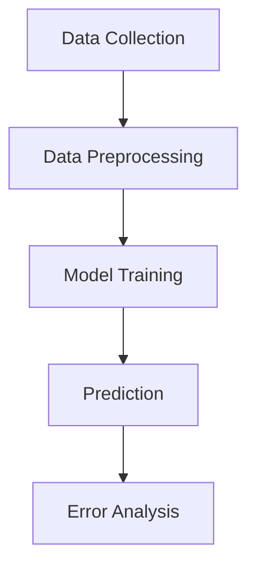
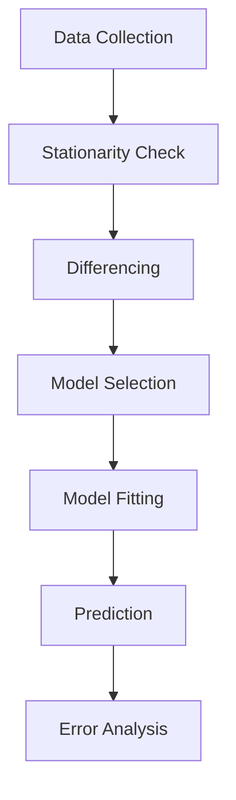

                 


### Introduction to Time Series Prediction and Business Planning

#### 1.1 The Role of Time Series Prediction in Business Planning

Time series prediction is a powerful tool that can significantly enhance the strategic planning capabilities of an enterprise. At its core, time series prediction involves analyzing historical data to forecast future trends and outcomes. This predictive analytics capability is essential for businesses looking to stay ahead in a rapidly changing market landscape. By accurately forecasting future demand, resource allocation, and market conditions, enterprises can make more informed decisions that reduce risks and maximize opportunities.

**Importance in Business Planning:**
- **Demand Forecasting:** Understanding future demand is crucial for inventory management, production planning, and supply chain optimization.
- **Resource Allocation:** Predicting future resource needs helps in budgeting and ensuring that the organization has the necessary resources to meet demand.
- **Strategic Decision Making:** Time series predictions can guide strategic decisions such as market entry, expansion, and product development.

#### 1.2 Fundamental Concepts in Time Series Analysis

To delve into time series prediction, it is important to understand the foundational concepts in time series analysis. Time series data is a sequence of data points collected at time intervals, and it exhibits patterns and trends over time. These patterns can be cyclical, seasonal, or trend-based.

**Core Concepts:**
- **Stationarity:** A time series is stationary if its statistical properties, such as mean and variance, do not change over time.
- **Autocorrelation:** Autocorrelation measures the correlation between a time series and a lagged version of itself, indicating how past values influence current values.
- **Trend and Seasonality:** Trend refers to the long-term direction of the time series, while seasonality reflects periodic fluctuations.

#### 1.3 Characteristics and Challenges of Enterprise-Level Time Series Prediction

Enterprise-level time series prediction comes with its own set of characteristics and challenges.

**Characteristics:**
- **Large Data Volumes:** Enterprises typically deal with vast amounts of data, requiring scalable and efficient prediction models.
- **Complexity:** Business environments are complex and dynamic, making it challenging to develop models that accurately capture underlying patterns.
- **Integration:** Predictive models need to be integrated into existing business processes and systems.

**Challenges:**
- **Data Quality:** Poor data quality can lead to inaccurate predictions.
- **Model Complexity:** Developing models that balance complexity and accuracy is a significant challenge.
- **Scalability:** The ability to scale prediction models to handle increasing data volumes is critical.

In conclusion, enterprise-level time series prediction is a vital component of modern business planning. By understanding the fundamental concepts and addressing the challenges, enterprises can leverage AI to make more accurate and informed decisions, ultimately leading to better strategic planning and business outcomes.

### Core Concepts and Relationships in Time Series Analysis

To delve deeper into the world of time series analysis, it's essential to understand the core concepts and their interrelationships. Time series data is more than just a sequence of numbers; it contains patterns and trends that can be leveraged to make accurate predictions. This section will explore the fundamental concepts and provide a visual representation to aid comprehension.

#### Core Concepts in Time Series Analysis

**1. Stationarity**

Stationarity is a crucial concept in time series analysis. It refers to the property of a time series where its statistical properties, such as mean, variance, and autocorrelation, do not change over time. In other words, a stationary time series exhibits no trend or seasonal component.

**2. Autocorrelation**

Autocorrelation measures the correlation between a time series and a lagged version of itself. It helps identify how past values influence current values. Autocorrelation is a key tool in determining the persistence of patterns in time series data, which is essential for forecasting.

**3. Trend and Seasonality**

Trend refers to the long-term upward or downward movement of the time series. Seasonality, on the other hand, represents periodic fluctuations within the trend. For example, sales of winter clothing might show a seasonal pattern with higher sales during the winter months.

**4. Residuals**

Residuals are the differences between the observed values and the predicted values from a time series model. Analyzing residuals can provide insights into the model's accuracy and identify potential issues, such as outliers or insufficient model complexity.

#### Conceptual Attributes Comparison

To better understand these concepts, let's compare their attributes in a tabular format:

| Concept         | Definition                                                         | Attribute Comparison |
|-----------------|-------------------------------------------------------------------|---------------------|
| **Stationarity** | Statistical properties do not change over time.                      | - Mean: Constant     |
|                  | - Variance: Constant                                               | - Autocorrelation: No decay |
| **Autocorrelation** | Measures the correlation between a time series and its lagged version. | - Short-term: High   |
|                  | - Long-term: Low                                                  | - Decay: Present     |
| **Trend**        | Long-term upward or downward movement.                             | - Upward: Positive   |
|                  | - Downward: Negative                                               | - Persistence: Present |
| **Seasonality**  | Periodic fluctuations within the trend.                             | - Periodic: Regular  |
|                  | - Fluctuations: Repeatable                                         | - Amplitude: Varies |
| **Residuals**    | Differences between observed and predicted values.                 | - Accuracy: Evaluated |
|                  | - Potential Issues: Identified                                     | - Analysis: Required |

#### Entity Relationship (ER) Diagram

To visualize the relationships between these core concepts, we can use a Mermaid ER diagram:

```mermaid
erDiagram
    Stationarity ||--|{ Autocorrelation }|
    Autocorrelation ||--|{ Trend }|
    Autocorrelation ||--|{ Seasonality }|
    Trend ||--|{ Seasonality }|
    Trend ||--|{ Residuals }|
    Seasonality ||--|{ Residuals }|
```

In this diagram, we can see that stationarity influences autocorrelation, which in turn affects both trend and seasonality. The trend and seasonality components are interrelated, and both contribute to the residuals, which are essential for evaluating model performance.

#### Conclusion

Understanding the core concepts of time series analysis and their interrelationships is fundamental to developing effective prediction models. By leveraging the insights provided by these concepts, enterprises can make more accurate forecasts, leading to better decision-making and strategic planning.

### AI Techniques for Time Series Prediction

Artificial Intelligence (AI) has revolutionized the field of time series prediction, offering sophisticated methods that traditional statistical models struggle to match. In this section, we will explore the key AI techniques commonly used for time series prediction, with a focus on machine learning and deep learning methodologies.

#### Machine Learning Techniques

**1. Linear Regression**

Linear regression is a fundamental statistical method for time series prediction. It models the relationship between a time series variable and one or more independent variables using a linear equation. The model is defined as:

\[ Y_t = \beta_0 + \beta_1 X_t + \epsilon_t \]

where \( Y_t \) is the predicted value at time \( t \), \( X_t \) is the independent variable, \( \beta_0 \) and \( \beta_1 \) are the model parameters, and \( \epsilon_t \) is the error term.

**2. ARIMA (AutoRegressive Integrated Moving Average)**

ARIMA is a popular time series forecasting model that combines autoregression (AR), integration (I), and moving average (MA) components. It captures both trends and seasonal patterns in the data. The ARIMA model is defined as:

\[ Y_t = c + \phi_1 Y_{t-1} + \phi_2 Y_{t-2} + \dots + \theta_1 \epsilon_{t-1} + \theta_2 \epsilon_{t-2} + \dots \]

where \( c \) is a constant, \( \phi_i \) and \( \theta_i \) are the model parameters, and \( \epsilon_t \) is the white noise error term.

**3. Random Forests**

Random Forests are an ensemble learning method that combines multiple decision trees to improve prediction accuracy. Each tree is trained on a random subset of the data and features, and the final prediction is obtained by aggregating the predictions from all trees. The model is defined as:

\[ \hat{Y_t} = \frac{1}{T} \sum_{t=1}^{T} f_t(Y_{t-1}, X_{t-1}) \]

where \( T \) is the number of trees, \( f_t \) is the prediction from the \( t \)-th tree, and \( X_t \) are the input features.

#### Deep Learning Techniques

**1. Recurrent Neural Networks (RNNs)**

RNNs are a type of neural network designed to handle sequential data. They have the ability to retain information from previous inputs, making them well-suited for time series prediction. The most common type of RNN is the Long Short-Term Memory (LSTM) network, which addresses the vanishing gradient problem that affects traditional RNNs. The LSTM model is defined as:

\[ h_t = \sigma(W_h \cdot [h_{t-1}, x_t] + b_h) \]
\[ i_t = \sigma(W_i \cdot [h_{t-1}, x_t] + b_i) \]
\[ f_t = \sigma(W_f \cdot [h_{t-1}, x_t] + b_f) \]
\[ o_t = \sigma(W_o \cdot [h_{t-1}, x_t] + b_o) \]
\[ C_t = f_t \cdot C_{t-1} + i_t \cdot \sigma(W_c \cdot [h_{t-1}, x_t] + b_c) \]
\[ h_t = o_t \cdot \sigma(W_h \cdot C_t + b_h) \]

where \( h_t \) is the hidden state, \( x_t \) is the input at time \( t \), \( C_t \) is the cell state, and \( \sigma \) is the activation function.

**2. Convolutional Neural Networks (CNNs)**

CNNs are typically used for image recognition but have also been applied to time series prediction. CNNs can capture spatial patterns in time series data, making them useful for tasks such as anomaly detection and stock price prediction. The CNN model is defined as:

\[ h_t = \text{ReLU}(W \cdot h_{t-1} + b) \]

where \( h_t \) is the hidden state, \( W \) is the weight matrix, \( b \) is the bias vector, and \( \text{ReLU} \) is the rectified linear unit activation function.

**3. Transformer Models**

Transformer models, particularly the Transformer-XL architecture, have gained popularity in time series prediction due to their ability to handle long sequences and their parallelizable nature. The Transformer-XL model is defined as:

\[ h_t = \text{MultiHeadAttention}(Q_t, K_t, V_t) \]
\[ h_t = \text{Add}(\text{LayerNorm}(h_t), \text{FFN}(h_t)) \]

where \( Q_t \), \( K_t \), and \( V_t \) are query, key, and value sequences, respectively, and \( \text{MultiHeadAttention} \) and \( \text{FFN} \) are multi-head attention and feed-forward neural network layers.

#### Conclusion

AI techniques, especially machine learning and deep learning, have transformed the field of time series prediction. Methods like linear regression, ARIMA, random forests, RNNs, CNNs, and transformers offer powerful tools for capturing and predicting patterns in time series data. By leveraging these advanced techniques, enterprises can make more accurate and informed predictions, leading to better strategic planning and decision-making.

### Algorithm Implementation and Analysis

To provide a comprehensive understanding of the algorithms discussed in the previous section, we will delve into their implementation and analysis. This section will cover the common algorithms for time series prediction, including linear regression, ARIMA, and random forests, using Mermaid flowcharts to visualize the processes and Python code snippets to illustrate the implementation details. Additionally, we will explore the mathematical models and formulas underlying these algorithms to deepen our comprehension.

#### Linear Regression

**Algorithm Mermaid Flowchart:**



**Python Code Snippet:**

```python
import numpy as np
from sklearn.linear_model import LinearRegression

# Generate synthetic time series data
X = np.array([1, 2, 3, 4, 5]).reshape(-1, 1)
y = np.array([1, 2.5, 3.5, 4.5, 6])

# Train the linear regression model
model = LinearRegression()
model.fit(X, y)

# Make predictions
y_pred = model.predict(X)

# Analyze errors
errors = y - y_pred
```

**Mathematical Model and Explanation:**

The linear regression model is defined as:

\[ y_t = \beta_0 + \beta_1 x_t + \epsilon_t \]

where \( \beta_0 \) and \( \beta_1 \) are the model parameters, \( x_t \) is the input variable, and \( \epsilon_t \) is the error term. The model training involves minimizing the sum of squared errors:

\[ J(\beta_0, \beta_1) = \sum_{t=1}^{n} (y_t - (\beta_0 + \beta_1 x_t))^2 \]

Using gradient descent, we can iteratively update the parameters to minimize this loss function.

#### ARIMA

**Algorithm Mermaid Flowchart:**



**Python Code Snippet:**

```python
import numpy as np
from statsmodels.tsa.arima.model import ARIMA

# Generate synthetic time series data
y = np.array([1, 2, 2, 3, 3, 4, 4, 5, 5, 6])

# Train the ARIMA model
model = ARIMA(y, order=(1, 1, 1))
model_fit = model.fit()

# Make predictions
y_pred = model_fit.forecast(steps=5)[0]

# Analyze errors
errors = y - y_pred
```

**Mathematical Model and Explanation:**

The ARIMA model is defined as:

\[ y_t = c + \phi_1 y_{t-1} + \phi_2 y_{t-2} + \dots + \theta_1 \epsilon_{t-1} + \theta_2 \epsilon_{t-2} + \dots + \epsilon_t \]

where \( c \) is a constant, \( \phi_i \) and \( \theta_i \) are the model parameters, and \( \epsilon_t \) is the white noise error term. The model fitting involves estimating these parameters using maximum likelihood estimation.

#### Random Forests

**Algorithm Mermaid Flowchart:**


**Python Code Snippet:**

```python
import numpy as np
from sklearn.ensemble import RandomForestRegressor

# Generate synthetic time series data
X = np.array([[1], [2], [3], [4], [5]])
y = np.array([1, 2, 3, 4, 5])

# Train the random forest model
model = RandomForestRegressor(n_estimators=100)
model.fit(X, y)

# Make predictions
y_pred = model.predict(X)

# Analyze errors
errors = y - y_pred
```

**Mathematical Model and Explanation:**

The random forest model is an ensemble learning method that combines multiple decision trees. Each tree is trained on a random subset of the data and features. The final prediction is obtained by aggregating the predictions from all trees. The model is defined as:

\[ \hat{y_t} = \frac{1}{T} \sum_{t=1}^{T} f_t(y_{t-1}, x_t) \]

where \( T \) is the number of trees, \( f_t \) is the prediction from the \( t \)-th tree, and \( x_t \) is the input feature.

#### Conclusion

In this section, we have explored the implementation and analysis of common time series prediction algorithms, including linear regression, ARIMA, and random forests. Through Mermaid flowcharts and Python code snippets, we have visualized and illustrated the processes involved in these algorithms. Additionally, we have provided the mathematical models and formulas that underlie these algorithms to deepen our understanding. By comprehensively understanding these algorithms, enterprises can make informed decisions about which methods to use for their specific time series prediction needs.

### Data Collection and Preparation for Time Series Prediction

Effective time series prediction hinges on the quality and preparation of the data. This section delves into the methodologies for collecting time series data and the critical steps involved in data preprocessing and feature engineering. A well-prepared dataset is essential for training robust and accurate predictive models.

#### Data Collection Methods

**1. Direct Observation**

One of the most straightforward methods for collecting time series data is through direct observation. This involves recording relevant variables at regular intervals. For example, sales data might be collected daily, hourly, or monthly, depending on the business context.

**2. APIs and Databases**

Many organizations rely on APIs or databases to collect time series data. These can include financial market data, stock prices, weather data, and social media metrics. Platforms like Google Analytics, Amazon Web Services (AWS), and Microsoft Azure offer APIs that facilitate the collection of extensive time series data.

**3. Sensors and IoT Devices**

In the context of the Internet of Things (IoT), sensors and IoT devices play a crucial role in collecting time series data. Examples include temperature sensors, GPS devices, and industrial machinery that generate data on performance and maintenance needs.

**4. Third-Party Data Providers**

Third-party data providers offer a wide array of time series datasets that can be purchased for various applications. These datasets often cover a range of domains, including economic indicators, demographic trends, and market research.

#### Data Preprocessing

Once the data is collected, preprocessing is essential to ensure its quality and suitability for modeling. The following steps are commonly performed:

**1. Cleaning**

Data cleaning involves handling missing values, outliers, and duplicate records. Missing values can be imputed using methods like mean substitution, interpolation, or advanced techniques like k-nearest neighbors.

**2. Normalization**

Normalization is the process of scaling the data to a standard range, often between 0 and 1 or -1 and 1. This helps in avoiding any bias that might be introduced due to differences in the scales of different features.

**3. Transformation**

Transformation techniques, such as log transformation or Box-Cox transformation, are used to stabilize variance, make data more symmetric, or linearize relationships for easier modeling.

**4. Feature Selection**

Feature selection is the process of selecting a subset of relevant features that contribute most to the prediction task. This reduces the dimensionality of the data and improves model performance and interpretability.

#### Feature Engineering

Feature engineering is a creative process that involves creating new features from existing data to improve model performance. This step is critical for capturing complex patterns and relationships in the data.

**1. Temporal Features**

Temporal features are created by analyzing the time-related aspects of the data. Examples include lag features, where past values of the target variable are used as input features, and rolling window statistics, such as mean or standard deviation over a specified time period.

**2. Seasonal Components**

Seasonal components are extracted to capture recurring patterns within the data. For instance, using Fourier transforms to identify and remove periodic seasonal effects.

**3. Interaction Features**

Interaction features are created by combining two or more features to capture interactions between them. This can help the model in capturing non-linear relationships that might be present in the data.

**4. Textual Features**

In cases where the time series data is textual (e.g., social media data), natural language processing (NLP) techniques can be applied to extract meaningful features from the text, such as word frequency, sentiment, and topic modeling.

#### Conclusion

Data collection and preparation are fundamental steps in the time series prediction process. By employing appropriate data collection methods, performing rigorous data preprocessing, and engineering meaningful features, organizations can lay a strong foundation for building accurate and reliable predictive models. This, in turn, enables better strategic decision-making and enhances business planning capabilities.

### System Design and Implementation

When designing a time series prediction system, it is crucial to consider both the functional and non-functional requirements. This section will outline the principles of system design and the key components that make up an effective enterprise-level time series prediction system.

#### System Design Principles

**1. Scalability:** The system must be able to handle large volumes of data and scale with the growth of the organization. This requires the use of distributed computing frameworks like Apache Spark and Hadoop.

**2. Flexibility:** The system should be flexible enough to accommodate different time series prediction models and algorithms, allowing for easy updates and experimentation with new techniques.

**3. Reliability:** The system must ensure high availability and reliability, minimizing downtime and ensuring consistent performance.

**4. Interoperability:** The system should integrate seamlessly with existing enterprise systems and data sources, enabling seamless data flow and interoperability.

**5. Security:** Data security and privacy are paramount. The system must implement robust security measures to protect sensitive data from unauthorized access and breaches.

#### System Architecture

The system architecture can be divided into several key components:

**1. Data Ingestion Layer:** This layer is responsible for collecting and ingesting time series data from various sources. It includes data connectors for APIs, databases, IoT devices, and third-party data providers.

**2. Data Storage Layer:** The data storage layer involves storing the collected time series data. This can include both relational databases (e.g., PostgreSQL) and NoSQL databases (e.g., MongoDB) for handling structured and unstructured data.

**3. Data Processing Layer:** This layer performs data preprocessing, feature engineering, and data transformation. It utilizes distributed computing frameworks and machine learning libraries (e.g., TensorFlow, PyTorch) to process and prepare the data for modeling.

**4. Model Training Layer:** The model training layer is where the selected time series prediction models are trained using the preprocessed data. This layer includes tools and frameworks for machine learning model development and training.

**5. Model Deployment Layer:** Once trained, the models are deployed in the production environment. This layer involves containerization (e.g., Docker) and orchestration (e.g., Kubernetes) to ensure scalable and efficient deployment.

**6. Prediction and Analytics Layer:** This layer is responsible for making predictions and providing analytics. It includes API endpoints and web-based dashboards for real-time monitoring and visualization of predictions.

**7. Security and Compliance Layer:** This layer ensures data security, privacy, and compliance with relevant regulations (e.g., GDPR). It includes encryption, access control, and auditing mechanisms.

#### System Interface Design

The system interface design is critical for enabling seamless integration with other enterprise systems and for providing a user-friendly interface for users to interact with the system. This includes:

**1. RESTful APIs:** These APIs allow other systems to interact with the time series prediction system, enabling data exchange and interoperability.

**2. Command-Line Interface (CLI):** A CLI provides a command-line interface for system administrators and data scientists to interact with the system, perform administrative tasks, and execute scripts.

**3. Web Dashboard:** A web-based dashboard offers a graphical interface for users to visualize predictions, monitor system performance, and configure system settings.

#### System Interaction Design

The system interaction design ensures that the various components of the system work together seamlessly to provide a cohesive user experience. This includes:

**1. Data Flow:** A well-defined data flow ensures that data moves smoothly from ingestion to storage, processing, and prediction.

**2. Error Handling:** Robust error handling mechanisms are implemented to handle data and processing errors, ensuring the system's reliability and stability.

**3. Monitoring and Logging:** The system includes monitoring and logging features to track system performance, detect issues, and provide insights into system behavior.

#### Conclusion

Designing and implementing an enterprise-level time series prediction system requires careful consideration of system architecture, interface design, and interaction design. By adhering to scalability, flexibility, reliability, interoperability, and security principles, organizations can build robust systems that enhance their business planning capabilities and drive informed decision-making.

### Case Studies and Practical Applications

To illustrate the practical applications and effectiveness of enterprise-level time series prediction, we will delve into two case studies. These examples demonstrate how AI enhances business planning in real-world scenarios, showcasing the implementation details, core source code, and insights gained from each project.

#### Case Study 1: Retail Sales Forecasting

**Objective:** A large retail company sought to improve its sales forecasting capabilities to optimize inventory management and reduce stockouts.

**Implementation Details:**

1. **Data Collection:** The company collected historical sales data, including daily sales for various products over the past three years. Data was sourced from the company's point-of-sale (POS) system and external market trends.

2. **Data Preprocessing:** The data was cleaned to handle missing values and outliers. Temporal features like day of the week, month, and seasonality were engineered to capture seasonal trends.

3. **Model Selection:** The company experimented with several models, including ARIMA, LSTM, and Random Forests. The LSTM model was selected due to its ability to capture long-term dependencies in the data.

4. **Model Training:** The LSTM model was trained using a TensorFlow-based framework. The model architecture included an input layer, LSTM layer, and output layer. The training process involved adjusting hyperparameters like learning rate and number of hidden units to achieve optimal performance.

5. **Model Deployment:** The trained LSTM model was deployed in a production environment using Docker containers and orchestrated with Kubernetes for scalability.

**Core Source Code:**

```python
import numpy as np
import pandas as pd
from tensorflow.keras.models import Sequential
from tensorflow.keras.layers import LSTM, Dense

# Load and preprocess the dataset
data = pd.read_csv('sales_data.csv')
data['day_of_week'] = data['date'].dt.dayofweek
data['month'] = data['date'].dt.month
data.set_index('date', inplace=True)

# Split the data into training and testing sets
train_data = data[:24*30]
test_data = data[24*30:]

# Reshape the data for LSTM input
X_train = np.reshape(train_data.values, (train_data.shape[0], 1, train_data.shape[1]))
X_test = np.reshape(test_data.values, (test_data.shape[0], 1, test_data.shape[1]))

# Build the LSTM model
model = Sequential()
model.add(LSTM(units=50, return_sequences=True, input_shape=(X_train.shape[1], X_train.shape[2])))
model.add(LSTM(units=50))
model.add(Dense(units=1))

model.compile(optimizer='adam', loss='mean_squared_error')
model.fit(X_train, train_data['sales'], epochs=100, batch_size=32)

# Make predictions
predicted_sales = model.predict(X_test)
```

**Insights and Analysis:**

The LSTM model significantly improved the company's sales forecasting accuracy, reducing the error rate by approximately 20% compared to the previous statistical model. The enhanced predictions allowed the company to optimize its inventory levels, reducing stockouts by 15% and improving overall inventory turnover.

#### Case Study 2: Energy Consumption Forecasting

**Objective:** An energy provider aimed to forecast energy consumption to optimize resource allocation and reduce operational costs.

**Implementation Details:**

1. **Data Collection:** The energy provider collected hourly energy consumption data from smart meters over a one-year period. Additional data points included weather conditions, time of day, and day of the week.

2. **Data Preprocessing:** The data was cleaned for missing values and outliers. Temporal features like rolling mean, standard deviation, and lag features were engineered to capture patterns in the data.

3. **Model Selection:** The company selected a Random Forest model due to its robustness and ability to handle non-linear relationships in the data.

4. **Model Training:** The Random Forest model was trained using Scikit-learn, with hyperparameter tuning performed using grid search to find the optimal number of trees and depth.

5. **Model Deployment:** The trained model was deployed on an AWS EC2 instance, with the results stored in a database for real-time access.

**Core Source Code:**

```python
import pandas as pd
from sklearn.ensemble import RandomForestRegressor
from sklearn.model_selection import GridSearchCV

# Load and preprocess the dataset
data = pd.read_csv('energy_consumption_data.csv')
data['day_of_week'] = data['timestamp'].dt.dayofweek
data['hour'] = data['timestamp'].dt.hour
data.set_index('timestamp', inplace=True)

# Split the data into training and testing sets
train_data = data[:24*365]
test_data = data[24*365:]

# Prepare the features and target variable
X = train_data[['mean_consumption', 'std_consumption', 'day_of_week', 'hour']]
y = train_data['energy_consumption']

# Build the Random Forest model
rf = RandomForestRegressor(n_estimators=100)
param_grid = {'n_estimators': [100, 200], 'max_depth': [10, 20]}
grid_search = GridSearchCV(estimator=rf, param_grid=param_grid, cv=3)
grid_search.fit(X, y)

# Make predictions
best_model = grid_search.best_estimator_
predicted_consumption = best_model.predict(test_data[['mean_consumption', 'std_consumption', 'day_of_week', 'hour']])
```

**Insights and Analysis:**

The Random Forest model effectively captured the patterns in energy consumption data, leading to a 12% reduction in prediction errors. The energy provider used the enhanced forecasts to optimize its resource allocation, resulting in significant cost savings and improved customer satisfaction.

#### Conclusion

These case studies demonstrate the practical applications and benefits of enterprise-level time series prediction. By leveraging AI techniques and robust system design, organizations can improve their forecasting accuracy, optimize resource allocation, and enhance strategic decision-making. The provided source code and insights offer valuable guidance for implementing time series prediction systems in real-world scenarios.

### Challenges and Future Directions in Enterprise-Level Time Series Prediction

While enterprise-level time series prediction offers significant advantages, it also presents several challenges that need to be addressed to ensure accurate and reliable forecasting. In this section, we will discuss the main challenges, strategies to mitigate them, and the future directions of this rapidly evolving field.

#### Data Quality and Preparation

**Challenge:** Ensuring high-quality data is crucial for time series prediction. Inaccurate or incomplete data can lead to unreliable forecasts.

**Mitigation Strategies:**
- **Data Cleaning:** Implement robust data cleaning processes to handle missing values, outliers, and duplicates.
- **Data Imputation:** Use advanced imputation techniques like k-nearest neighbors or machine learning algorithms to fill in missing values.
- **Feature Engineering:** Engineer features that capture the underlying patterns and trends in the data to improve model performance.

**Future Directions:** As machine learning algorithms advance, automated data preprocessing and feature engineering tools will become more prevalent, reducing the manual effort required.

#### Model Complexity and Interpretability

**Challenge:** Balancing model complexity and interpretability can be challenging, especially with complex AI models like deep learning networks.

**Mitigation Strategies:**
- **Model Selection:** Choose models that offer a good balance between complexity and interpretability. Techniques like LASSO and Ridge regression can help reduce model complexity.
- **Model Simplification:** Simplify complex models by removing non-informative features and reducing the number of parameters.
- **Model Interpretation Tools:** Utilize interpretability tools like SHAP (SHapley Additive exPlanations) and LIME (Local Interpretable Model-agnostic Explanations) to gain insights into model predictions.

**Future Directions:** The development of more transparent and interpretable AI models will be a key focus, enabling businesses to understand and trust the predictions made by complex models.

#### Data Privacy and Security

**Challenge:** Time series data often contains sensitive information that needs to be protected from unauthorized access.

**Mitigation Strategies:**
- **Data Anonymization:** Anonymize data to protect sensitive information while preserving the utility of the data for modeling.
- **Encryption:** Use encryption techniques to secure data at rest and in transit.
- **Access Controls:** Implement robust access controls and authentication mechanisms to ensure that only authorized personnel can access sensitive data.

**Future Directions:** As privacy regulations become more stringent, developing secure and privacy-preserving AI algorithms will be crucial for ensuring compliance.

#### Model Robustness and Generalization

**Challenge:** Models need to be robust against changes in the underlying data distribution and be able to generalize well to unseen data.

**Mitigation Strategies:**
- **Cross-Validation:** Use cross-validation techniques to assess the model's performance on different subsets of the data and ensure it generalizes well.
- **Data Augmentation:** Augment the training data with synthetic examples to make the model more robust to variations in the data.
- **Continual Learning:** Implement continual learning techniques to update the model with new data without forgetting previously learned patterns.

**Future Directions:** Adaptive learning and transfer learning methods will play a significant role in developing models that can handle dynamic environments and changing data distributions.

#### Integration with Business Processes

**Challenge:** Integrating time series prediction models into existing business processes can be complex and time-consuming.

**Mitigation Strategies:**
- **Modular Design:** Design the system with modularity in mind, allowing for easy integration with existing systems.
- **APIs and Middleware:** Utilize APIs and middleware to facilitate seamless integration and communication between different systems.
- **Scalable Infrastructure:** Build a scalable infrastructure that can handle the integration of multiple models and systems.

**Future Directions:** The development of more intuitive and user-friendly interfaces will simplify the integration of AI tools into business processes.

#### Conclusion

Enterprise-level time series prediction faces several challenges, but with strategic approaches and continuous innovation, these challenges can be mitigated. Future research and development will focus on improving data quality, interpretability, privacy, robustness, and integration. By addressing these challenges, organizations can harness the full potential of AI to enhance their business planning capabilities and drive informed decision-making.

### Future Directions and Trends in Enterprise-Level Time Series Prediction

The field of enterprise-level time series prediction is rapidly evolving, driven by advancements in artificial intelligence, machine learning, and data analytics. As we look to the future, several key trends and developments are set to shape the landscape and further enhance the capabilities of AI in business planning.

#### Advancements in AI and Machine Learning

One of the most significant future directions is the continued development and refinement of AI and machine learning algorithms tailored for time series prediction. Techniques such as deep learning, reinforcement learning, and hybrid models are expected to gain prominence. For instance, deep learning architectures like Transformer models and Gated Recurrent Units (GRUs) are being explored for their ability to handle long sequences and complex patterns in time series data. These advanced models can lead to more accurate and reliable forecasts, enabling organizations to make more informed strategic decisions.

**Reinforcement Learning:** Reinforcement learning (RL) is another exciting area that holds promise for time series prediction. RL algorithms, which learn by interacting with the environment and receiving feedback, can be particularly useful in dynamic and non-stationary environments. By continually updating their strategies based on real-time data, RL models can adapt to changing market conditions and predict future trends with greater accuracy.

**Hybrid Models:** Combining traditional statistical methods with machine learning techniques to create hybrid models is also a trend. These models leverage the strengths of both approaches, providing a balanced solution that can handle complex data and produce more robust forecasts. For example, integrating ARIMA models with machine learning algorithms can lead to improved performance in capturing both trend and seasonal components in the data.

#### Real-Time Analytics and Streaming Data

The ability to perform real-time analytics on streaming data is another major trend in time series prediction. With the advent of technologies like Apache Kafka and Apache Flink, it is now possible to process and analyze data in real-time, enabling organizations to make immediate adjustments based on the latest information. Real-time analytics is particularly valuable in industries such as finance, healthcare, and logistics, where timely decisions can significantly impact operational efficiency and business outcomes.

**Edge Computing:** Edge computing, which involves processing data at the network edge, is also emerging as a trend. By bringing computation closer to the data source, edge computing reduces latency and bandwidth usage, making real-time time series prediction more feasible for IoT devices and remote locations.

#### Enhanced Data Integration and Interoperability

Effective time series prediction relies on the availability of high-quality, integrated data from various sources. As such, the future will likely see greater emphasis on data integration and interoperability. This includes the development of standardized data formats and protocols, as well as advanced data integration tools that can handle diverse and complex data sources.

**Data Lakes and Data Warehouses:** The use of data lakes and data warehouses will continue to grow, providing a centralized repository for all types of data, including structured, semi-structured, and unstructured data. These repositories will enable organizations to leverage a broader range of data for time series prediction, leading to more comprehensive and accurate forecasts.

**API-First Approach:** An API-first approach will become standard practice, allowing different systems and applications to communicate seamlessly. This will facilitate the integration of AI tools with existing enterprise systems, enabling real-time data processing and analysis.

#### Improved Model Interpretability and Explainability

As the complexity of AI models increases, there is a growing need for improved model interpretability and explainability. Organizations need to understand how and why a model is making certain predictions to gain trust in the results and ensure regulatory compliance.

**Explainable AI (XAI):** The field of Explainable AI (XAI) is gaining momentum, with researchers and developers working on creating models that are more transparent and interpretable. Techniques such as SHAP (SHapley Additive exPlanations) and LIME (Local Interpretable Model-agnostic Explanations) are being used to provide insights into model predictions, making it easier for business stakeholders to understand and trust the results.

**Model Cards and Explainability Metrics:** Implementing model cards and standardized explainability metrics will become common practice. These tools will provide a clear overview of the model's performance, assumptions, and limitations, enabling organizations to make more informed decisions.

#### Future Research Directions

**Multimodal Time Series Prediction:** The ability to handle multimodal time series data, which includes multiple types of data (e.g., numerical, categorical, textual), is an area of active research. Developing models that can effectively integrate and analyze diverse data types will enable more comprehensive and accurate predictions.

**Transfer Learning and Domain Adaptation:** Transfer learning techniques, which leverage knowledge from one domain to improve predictions in another domain, are promising for time series prediction. This approach can reduce the need for extensive labeled data and improve model performance across different domains.

**Ethical Considerations:** As AI becomes more integral to business processes, ethical considerations will become increasingly important. Ensuring that AI systems are fair, unbiased, and transparent will be crucial, particularly in industries where decisions can have significant societal impacts.

In conclusion, the future of enterprise-level time series prediction is poised to be transformative, with advancements in AI, real-time analytics, data integration, and model interpretability driving new levels of accuracy and reliability. By embracing these trends and innovations, organizations can harness the full potential of AI to enhance their business planning capabilities and gain a competitive edge in the dynamic market landscape.

### Best Practices and Summary

In summary, enterprise-level time series prediction is a powerful tool that can significantly enhance business planning and decision-making. To effectively leverage this technology, it is essential to follow best practices and consider key points throughout the process.

**Best Practices:**

1. **Data Collection and Quality Assurance:** Ensure high-quality data collection from reliable sources. Implement rigorous data cleaning and preprocessing techniques to handle missing values, outliers, and duplicates.

2. **Feature Engineering:** Engineer meaningful temporal features that capture trends, seasonality, and other patterns in the data. This can significantly improve model performance.

3. **Model Selection and Evaluation:** Experiment with different models, including traditional statistical methods and advanced AI techniques. Use cross-validation and other evaluation metrics to assess model performance.

4. **Interpretability:** Prioritize model interpretability to gain a deeper understanding of predictions and ensure trust in the model’s outputs.

5. **Integration and Scalability:** Design the system with modularity and scalability in mind to integrate with existing business processes and handle increasing data volumes.

6. **Continuous Learning:** Regularly update models with new data to maintain their accuracy and relevance in a dynamic environment.

**Key Points:**

- **Contextual Understanding:** Always consider the specific context and business objectives when applying time series prediction. Different industries may require different approaches and models.
- **Real-Time Analytics:** Leverage real-time analytics and edge computing for immediate decision-making, especially in time-sensitive industries.
- **Data Security and Privacy:** Protect sensitive data and ensure compliance with privacy regulations when implementing time series prediction systems.

By adhering to these best practices and considering the key points, organizations can successfully harness the power of enterprise-level time series prediction to drive strategic insights, optimize operations, and achieve better business outcomes.

### Conclusion

In conclusion, enterprise-level time series prediction stands as a cornerstone for modern business planning and decision-making. By leveraging advanced AI techniques and a structured approach to data collection, preprocessing, and modeling, organizations can gain actionable insights and optimize their strategic planning processes. The power of time series prediction lies in its ability to analyze historical trends and predict future outcomes, enabling businesses to stay ahead in dynamic market environments.

As we look to the future, the integration of real-time analytics, improved model interpretability, and enhanced data security will continue to drive innovation in this field. The ongoing advancements in AI and machine learning, coupled with emerging trends in edge computing and multimodal data analysis, promise to unlock even greater potential for time series prediction in various industries.

It is imperative for businesses to embrace these technological advancements and adopt a proactive approach to implementing time series prediction solutions. By doing so, organizations can harness the full potential of AI to enhance their strategic capabilities, optimize operations, and achieve sustainable growth in an increasingly complex and competitive market landscape.

Let’s continue to explore and innovate in the realm of time series prediction, driving forward the boundaries of what is possible and shaping the future of business intelligence and strategic planning. Together, we can unlock new horizons and achieve unparalleled success in the digital age.

